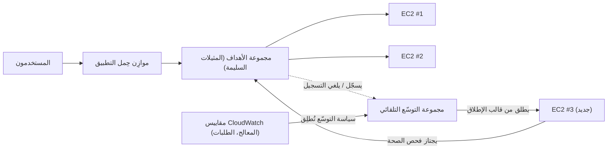

# الفصل السابع: المطعم الذي يكبر حين يزداد ازدحامه

كانت الساعة 7:43 في مساء أحد أيام الجمعة.

كان كرسي Tom مدفوعاً إلى الوراء قليلاً، بالطريقة التي يصبح عليها حين يحدّق في شيء بنوع التركيز الذي يعني أنه لن يجيبك إن تحدّثت إليه. كان المكتب قد فرغ قبل ساعة. لكنه بقي.

كان لديه علامة تبويب مفتوحة على لوحة معلومات المقاييس يحدّثها بالطريقة التي يتفقّد بها آخرون وسائل التواصل الاجتماعي — انعكاسياً، باستمرار، دون أن يقصد تماماً.

كانت أزمة التخزين وراءهم. حصلت قاعدة البيانات على قرصها الخاص. عاشت الصور في S3. لأسبوعين، كان النظام مستقراً — ليس مثيراً، مجرد مستقر. كان ينبغي أن يبدو ذلك جيداً.

ثم تجاوز معدل الأخطاء 12%.

قال Tom: "Leo."

كان Leo ينظر بالفعل. أوقات الاستجابة: تتسلّق. الطلبات في الطابور: تتسلّق. مثيل EC2 الواحد — حتى بعد تمرين التحجيم الصحيح الدقيق الشهر الماضي — كان عند 94% من المعالج.

قال Tom: "نحن نردّ العملاء."

قال Leo: "نحن لا نردّهم. الخادم يفعل."

"إنه الشيء نفسه."

كان كذلك. وكان يحدث كل جمعة لمدة ثلاثة أسابيع. نجت Nimbus من أزمة التخزين — حصلت قاعدة البيانات على قرصها الخاص، عاشت الصور في S3 — لكن المستقر والقابل للتوسّع مشكلتان مختلفتان تماماً. النظام يعمل. إنه فقط لا ينمو.

ظهرت رسالة Slack من Maya: *لوحة المعلومات تقول إن الطلبات انخفضت 40% عن الجمعة الماضية. ماذا يحدث؟*

ردّ Tom: *الخادم عند السعة القصوى. أعمل على ذلك.*

مرّت ثلاث دقائق.

Maya: *لدينا صاحب مطعم يتصل بخط الدعم يقول إن التطبيق معطّل.*

كانت يدا Leo على لوحة المفاتيح. كان يعيد تحجيم المثيل — النسخة اليدوية من الإصلاح، التي تتطلّب إيقاف الخادم وتغيير نوع المثيل. ما يعني توقّفاً.

سأل Tom: "كم ستستغرق إعادة التشغيل؟"

قال Leo: "سبع دقائق."

قال Tom: "سيكون لدينا سبع دقائق أخرى من الانقطاع في ليلة جمعة." لم يكن يسأل. كتب رسالة Slack إلى Maya. ردّت بحرف واحد: *تمام*

اكتملت إعادة التشغيل. عاد المثيل. انخفض المعالج إلى 60%. انخفض معدل الأخطاء. راقب Tom المقاييس لخمس عشرة دقيقة دون أن يتكلّم.

في الساعة 9:15، انخفضت حركة المرور. انتهت الأزمة.

نظر Leo إلى يديه، اللتين كانتا ترتجفان قليلاً في الثامنة مساءً ولم تعودا كذلك.

قال: "لا يمكننا فعل ذلك كل جمعة."

قال Tom: "لا. لا نستطيع."

كان الفريق بحاجة إلى نظام يتعامل مع الحِمل المتغيّر تلقائياً. لا أن يشتري خادماً كافياً للحالة الأسوأ ويهدر المال في الأوقات الهادئة. ولا أن يتدافع يدوياً حين تضرب ارتفاعات حركة المرور.

ثمة نمط لهذا. لدى AWS خدمتان تطبّقانه.

**المفهوم: التوسّع الأفقي**

ثمة طريقتان لجعل نظام يتعامل مع حِمل أكبر.

**التوسّع الرأسي** يعني جعل الخادم الواحد أكبر. معالج أكثر. ذاكرة أكثر. فعلنا هذا في الفصل الرابع حين رقّينا من `t3.micro` إلى `t3.large`. يساعد. لكن له حدود: يمكنك الذهاب كبيراً إلى حدّ، وعلى المثيل أن يُعيد التشغيل لإعادة التحجيم، ولا يزال لديك نقطة فشل واحدة.

**التوسّع الأفقي** يعني إضافة خوادم أكثر. بدلاً من خادم كبير واحد، شغّل خمسة خوادم متوسطة. حين تنخفض حركة المرور، شغّل اثنين. حين ترتفع، شغّل عشرة.

للتوسّع الأفقي مزايا لا يملكها الرأسي:

- لا نقطة فشل واحدة. إذا مات خادم، تواصل البقية الخدمة.
- لا حاجة إلى إعادة تشغيل لإضافة سعة.
- ادفع فقط مقابل ما تستخدمه — أضف خوادم حين تحتاجها، وأزلها حين لا.
- توسّع خطّي: ضِعف الخوادم، تقريباً ضِعف الإنتاجية.

ثمة أيضاً بُعد موثوقية لا يستطيع التوسّع الرأسي مجاراته. حين يكون لديك خمسة خوادم ويفشل واحد، تنخفض سعتك إلى 80% — كافية لمواصلة خدمة حركة المرور بينما يُستبدَل المثيل الفاشل. حين يكون لديك خادم واحد ويفشل، تنخفض السعة إلى 0%. التكرار الاحتياطي متأصّل في التوسّع الأفقي بطريقة لا يستطيع التوسّع الرأسي توفيرها بأي حجم.

يهمّ هذا للصيانة أيضاً. حين يتطلّب ترقيع أمني إعادة تشغيل خادم، يتيح لك التوسّع الأفقي إعادة تشغيل المثيلات واحداً تلو الآخر — إعادات تشغيل متدحرجة تحافظ على استمرارية الخدمة. خادم كبير واحد يتطلّب إما قبول التوقّف أثناء إعادة التشغيل أو تطبيق تعقيد نشر أزرق/أخضر.

المأزق: إذا كان لديك خوادم متعددة، فكيف يعرف المستخدمون أيّها يتحدّثون إليه؟

وثمة قيد تصميمي يفرضه التوسّع الأفقي: يجب أن يكون تطبيقك قادراً على العمل على خوادم متطابقة متعددة في آن واحد دون أن تتداخل الخوادم بعضها مع بعض. هذا هو متطلب **انعدام الحالة** (stateless) — كل طلب يجب أن يكون مكتفياً ذاتياً، لا معتمداً على حالة مخزّنة على خادم محدّد. سنرى بالضبط لماذا يهمّ هذا حين نصادف مشكلة الجلسات اللاصقة.

**موازِن حِمل التطبيق: باب واحد، غرف كثيرة**

فكّر في مطعم كبير بمنصة استقبال عند الباب. يصل رواد العشاء فيوجّههم المضيف إلى طاولة متاحة. يعرف المضيف أي الطاولات مشغولة وأيها فارغة. لا يحتاج رواد العشاء إلى معرفة كم طاولة هناك — يدخلون فحسب ويتولّى المضيف التوزيع.

**موازِن حِمل التطبيق** (ALB) يفعل هذا بطلبات الويب.

يتصل المستخدمون بموازِن الحِمل. يوزّع موازِن الحِمل الطلبات الواردة عبر أسطولك من مثيلات EC2. يرى كل مستخدم عنواناً واحداً (عنوان URL لموازِن الحِمل). خلف ذلك العنوان، تنتشر الطلبات عبر أي عدد من الخوادم العاملة.

موازِن الحِمل نفسه يعمل على بنية تحتية تديرها AWS، موزّعة عبر مناطق إتاحة متعددة في منطقتك. ليس خادماً واحداً — إنه خدمة موزّعة مُدارة. حين تمكّن موازنة الحِمل عبر المناطق (الافتراضي لـ ALBs)، توزّع كل عقدة ALB الطلبات بالتساوي عبر كل الأهداف المسجّلة بغضّ النظر عن منطقة الإتاحة التي تكون فيها. يمنع هذا نمط الفشل الشائع حيث تملك منطقة إتاحة ضعف عدد المثيلات السليمة في أخرى، ما يؤدي إلى حِمل غير متوازن.

يستقبل كل طلب HTTP وارد ويقرّر أي مثيل EC2 (يُسمّى **هدفاً**) ينبغي أن يتعامل معه، بناءً على عوامل مثل:

- الدوران الدائري (كل خادم يأخذ دوره بالتناوب)
- أقل عدد طلبات معلّقة (الخادم بأقل طلبات قيد التنفيذ يأخذ الطلب التالي)
- الصحة — الأهداف السليمة فقط تتلقّى حركة مرور

**فحوص الصحة** ضرورية. يرسل موازِن الحِمل بانتظام طلبات اختبار إلى كل هدف. إذا لم يستجب هدف بشكل صحيح، يضع موازِن الحِمل علامة "غير سليم" ويتوقّف عن إرسال حركة المرور إليه. حين يتعافى الهدف، تستأنف حركة المرور.

هذا تلقائي. أنت تهيّئ معاملات فحص الصحة؛ ويفرضها موازِن الحِمل.

تهيّئ فحوص الصحة بثلاث معاملات رئيسية: **المسار** الذي يُفحَص (مثل `/health`)، و**الفترة** (كم مرة يُفحَص — كل 5 إلى 300 ثانية؛ الافتراضي 30)، و**العتبة** (كم فحص ناجح أو فاشل متتالٍ قبل تغيير حالة صحة الهدف).

فترات فحص الصحة العدوانية تلتقط المشكلات أسرع لكنها تضيف مزيداً من حركة المرور إلى الأهداف. فترة 30 ثانية بعتبة 3 إخفاقات تعني إزالة هدف فاشل من التناوب خلال 90 ثانية. فترة 10 ثوانٍ بعتبة إخفاقين تعني الإزالة خلال 20 ثانية — على حساب مزيد من حركة مرور فحص الصحة.

لـ Nimbus، اختارت Priya فترة 30 ثانية بعتبة 3 إخفاقات (90 ثانية لإعلان عدم السلامة) ونجاحين (60 ثانية لإعلان السلامة مجدداً بعد التعافي). وازن هذا بين الكشف السريع عن الفشل وتجنّب الإيجابيات الكاذبة من ومضات شبكة قصيرة.

**تهيئة فحص الصحة: أكثر من "هل هو حيّ؟"**

كان أول فحص صحة لدى Leo اختبار اتصال TCP بسيطاً: "هل المنفذ 80 يقبل الاتصالات؟" ذلك الحد الأدنى. قد يقبل الخادم اتصالات على المنفذ 80 بينما قاعدة البيانات معطّلة، بينما التطبيق في حلقة خطأ، بينما القرص ممتلئ.

كان لدى Priya رأي مختلف فيما ينبغي أن يعنيه "سليم".

سألت: "هل فكّرنا فيما يحدث إذا نجح فحص الصحة لكن التطبيق معطوب؟ خادم يستطيع قبول الاتصالات لكنه لا يستطيع الاستعلام عن قاعدة البيانات ليس سليماً. إنه فقط مستجيب."

بنى Leo نقطة نهاية `/health` في كود التطبيق. فعلت نقطة النهاية ثلاثة أشياء:
1. أكّدت أن عملية التطبيق تعمل
2. أجرت استعلام اختبار لقاعدة البيانات (بسيط `SELECT 1`)
3. أكّدت أن اتصال S3 قابل للوصول

إذا نجحت الثلاثة، أعادت نقطة النهاية HTTP 200. إذا فشل أيٌّ منها، أعادت HTTP 503.

هُيّئ فحص صحة موازِن الحِمل ليستدعي نقطة النهاية هذه كل 30 ثانية. إذا تلقّى ثلاث استجابات 503 متتالية، وُضِعت على المثيل علامة "غير سليم" وأُزيل من التناوب.

قالت Priya: "هذا يعني أنه إذا تعطّلت قاعدة البيانات، سيلتقط فحص الصحة ذلك ويزيل الخوادم المتأثّرة من موازِن الحِمل خلال 90 ثانية."

قال Tom: "حتى لو كانت الخوادم نفسها لا تزال تعمل."

"حتى لو بدت بخير من الخارج."

موازِن الحِمل، موجَّهاً نحو فحص صحة تطبيق حقيقي، أصبح كاشفاً أكثر موثوقية للمشكلات الفعلية — لا مجرد حياة الخادم.

**التوسّع التلقائي: المطعم الذي يفتح طاولات أكثر**

يوزّع موازِن الحِمل حركة المرور عبر خوادمك الموجودة. لكنه لا يضيف خوادم حين تحتاج إلى المزيد.

**التوسّع التلقائي** يفعل.

**مجموعة التوسّع التلقائي** (ASG) هي تهيئة تخبر AWS بـ:

- الحد الأدنى لعدد المثيلات التي يجب أن تبقى عاملة دائماً
- الحد الأقصى لعدد المثيلات المسموح به
- الشروط التي يُتوسَّع تحتها للخارج (إضافة مثيلات) أو للداخل (إزالتها)

تُسمّى شروط التوسّع **سياسات**. الأنواع الأربعة الأشيع:

**تتبّع الهدف**: "حافظ على متوسط استخدام المعالج عند 70%." حين يتجاوز متوسط المعالج 70%، تُطلق AWS مثيلات جديدة. حين ينخفض دونه، تُنهى مثيلات. هذه أبسط وأكثر السياسات الموصى بها لمعظم أحمال العمل — اضبط مقياساً مستهدفاً ودع AWS تكتشف كم مثيلاً يُحتاج. يمكن أن يكون الهدف استخدام المعالج، أو عدد الطلبات لكل هدف، أو أي مقياس CloudWatch مخصّص.

**التوسّع المتدرّج**: عرّف عتبات محدّدة باستجابات محدّدة. "حين يتجاوز المعالج 60%، أضف مثيلاً واحداً. حين يتجاوز 80%، أضف 3 مثيلات. حين ينخفض المعالج دون 30%، أزل مثيلاً واحداً." تحكّم أدقّ من تتبّع الهدف، لكنه يتطلّب مزيداً من التهيئة والضبط المستمر.

**التوسّع المجدوَل**: "في الساعة 6:45 مساءً كل جمعة، تأكّد من تشغيل 4 مثيلات على الأقل." هذا توسّع استباقي لأحداث قابلة للتنبؤ. يعمل جنباً إلى جنب مع التوسّع التفاعلي — الإجراء المجدوَل يضع أرضية، ويضيف تتبّع الهدف مثيلات فوق تلك الأرضية حسب الحاجة.

**التوسّع التنبّئي**: النسخة المبنية على تعلّم الآلة من الفكرة نفسها. بدلاً من أن تكتب أنت الجدول، يحلّل التوسّع التلقائي حتى أسبوعين من الحِمل التاريخي ويتنبّأ بالـ48 ساعة التالية، مطلِقاً السعة *قبل* الصعود المتوقّع. لحركة المرور الدورية — زحمة عشاء كل جمعة، فتح سوق كل يوم عمل — يكتشف التوسّع التنبّئي النمط ويسخّن مسبقاً تلقائياً، ويستمر في التعديل مع انحراف النمط. محفّز الامتحان: "ارتفاعات حركة مرور متكرّرة/دورية؛ المثيلات يجب أن تكون جاهزة *قبل* الارتفاع" ← التوسّع التنبّئي. (التوسّع المجدوَل هو الإجابة اليدوية؛ والتنبّئي هو المُتعلَّم. كلاهما يتفوّق على التوسّع التفاعلي فقط، الذي يتأخّر دائماً عن الارتفاع بمقدار وقت إقلاع المثيل.)

لـ Nimbus، كان المزيج: تتبّع الهدف للتوسّع التفاعلي (حافظ على المعالج عند 65%)، إضافةً إلى إجراء توسّع مجدوَل كل جمعة في الساعة 6:45 مساءً لتسخين مثيلين إضافيين قبل زحمة العشاء.

هذا تلقائي. لا أحد عليه مراقبة المقاييس. لا أحد عليه إطلاق خوادم يدوياً. يتفاعل النظام مع الحِمل في الوقت الفعلي.

راقبت Priya حدوث هذا حياً خلال زحمة جمعة للمرة الأولى. ارتفع عدد الخوادم من 2 إلى 5 على مدى خمس عشرة دقيقة، ثم عاد إلى 2 بعد الزحمة.

قالت: "ذلك مثير للإعجاب فعلاً."

كان Tom يراقب رسم التكلفة بدلاً من ذلك. ازدادت الفاتورة خلال الزحمة وانخفضت بعدها. قال، مُعجَباً بالقدر نفسه: "دفعنا فقط مقابل ما استخدمناه. كم يكلّف ذلك شهرياً، متوسّطاً عبر أسبوع عادي؟"

فتح Leo الحاسبة. أضافت ذُرى الجمعة ربما 15% إلى الفاتورة الشهرية. بدون التوسّع التلقائي، كانوا سيحتاجون إلى التزويد للذروة طوال الأسبوع. الفرق: نحو 120 دولاراً شهرياً مهدوراً على سعة ذروة عاطلة، مقابل 0 دولار مهدور مع توسّع تلقائي مُهيّأ على نحو سليم.

ثمة دقّة واحدة في التوسّع للداخل تفوت الفِرَق غالباً: **حماية التوسّع للداخل** (scale-in protection). يمكنك تهيئة مثيلات محدّدة في ASG لتكون محميّة من التوسّع للداخل — ما يعني أنها لن تُنهى أثناء أحداث التوسّع للداخل التلقائية. هذا مفيد للمثيلات التي في منتصف معالجة مهمة طويلة الأمد لا تريد مقاطعتها. يستطيع كود التطبيق أيضاً ضبط حماية المثيل برمجياً حين يبدأ مهمة طويلة ويزيل الحماية حين تكتمل المهمة. يمنع هذا ASG من سحب البساط من تحت العمل النشط.

**التجمّعات الدافئة: ليس كل شيء يحتاج إلى أن يبدأ بارداً**

في الجمعة التي بدأ فيها التوسّع التلقائي للمرة الأولى، وقّت Tom كم استغرق من "المعالج يتجاوز العتبة" إلى "مثيلات جديدة تخدم حركة المرور".

أربع دقائق وعشرون ثانية.

قال: "ذلك أربع دقائق نكون فيها ناقصي سعة."

قال Leo: "يمكننا زيادة الحد الأدنى لعدد المثيلات."

قال Tom: "ذلك يعني الدفع مقابل مثيلات عاطلة طوال الأسبوع."

كان ثمة حل وسط: **التجمّعات الدافئة** (Warm Pools).

التجمّع الدافئ مجموعة من مثيلات EC2 المُهيّأة مسبقاً تجلس في حالة متوقّفة، مُقلَعة بالفعل، مُهيّأة بالفعل، عبرت بالفعل سكريبت UserData. فعلت كل شيء عدا بدء خدمة حركة المرور.

حين تقرّر مجموعة التوسّع التلقائي التوسّع للخارج، بدلاً من إطلاق مثيل بارد جديد من الصفر (الذي يستغرق ثلاث إلى خمس دقائق للإقلاع، وتشغيل UserData، واجتياز فحوص الصحة)، تبدأ مثيلاً من التجمّع الدافئ. بدء مثيل متوقّف يستغرق نحو 30 إلى 60 ثانية.

لنمط جمعة Nimbus — اندفاع معروف وقابل للتنبؤ يبدأ نحو السابعة مساءً — هيّأت Priya تجمّعاً دافئاً من مثيلين لتحافظ عليهما أثناء ساعات العمل. بحلول 6:45 مساءً، كان مثيلان دافئان يجلسان جاهزين، متوقّفين لكن مُهيّأين. حين تسلّقت حركة المرور في السابعة مساءً واحتاجت ASG إلى التوسّع، بدأ المثيلان الدافئان في أقل من دقيقة وانضمّا إلى الأسطول.

سأل Tom: "كم يكلّف التجمّع الدافئ؟"

مثيل EC2 متوقّف لا يدفع مقابل الحوسبة — لكنه يدفع مقابل تخزين EBS المرفق. مثيلا `t3.small` في تجمّع دافئ: نحو 4 دولارات شهرياً في تكاليف التخزين. التحسّن في وقت التوسّع للخارج من أربع دقائق إلى أقل من دقيقة كان يستحق 4 دولارات شهرياً في ليلة جمعة.

**التوجيه القائم على المسار في ALB**

مع نمو Nimbus، أضاف Leo مكوّناً ثانياً: خدمة API منفصلة لإدارة المطاعم. وصل أصحاب المطاعم إلى هذه الخدمة عبر النطاق نفسه لكن في مسار URL مختلف: `/api/restaurant/` بدلاً من `/`.

سألت Maya: "مهلاً — لكن *لماذا* نفعلها بتلك الطريقة؟ لماذا لا نعطي API إدارة المطاعم نطاقاً مختلفاً تماماً؟"

قال Leo: "يمكننا. لكن حينها سنحتاج إلى شهادة ثانية، وموازِن حِمل ثانٍ، وإدخال DNS ثانٍ. التوجيه القائم على المسار يتولّى ذلك بشهادة واحدة، وموازِن حِمل واحد."

دعم ALB هذا أصلاً. **قاعدة توجيه قائمة على المسار** أخبرت ALB: حين يبدأ عنوان URL بـ `/api/restaurant/`، وجّه الطلب إلى مجموعة أهداف إدارة المطاعم. حين يبدأ عنوان URL بأي شيء آخر، وجّهه إلى مجموعة أهداف التطبيق المواجه للعميل.

أسطولان منفصلان من مثيلات EC2. موازِن حِمل واحد. حركة مرور موجَّهة بمسار URL.

سألت Maya: "إذن يمكننا توسيع API إدارة المطاعم بشكل مستقل عن التطبيق المواجه للعميل؟"

قال Leo: "بالضبط. إذا كان أصحاب المطاعم يجرون كثيراً من تحديثات القوائم، تتوسّع خوادم API تلك. إذا كان العملاء يطلبون بكثافة، تتوسّع تلك الخوادم. لا يؤثّر أحدهما على الآخر."

جلست Maya مع هذا. "وندفع مقابل ALB واحد بدلاً من اثنين."

قال Tom: "صحيح." كان لديه رقم. "يكلّف ALB نحو 20 دولاراً شهرياً في رسوم القاعدة إضافةً إلى رسوم معالجة البيانات. ALB واحد يتعامل مع كلا الحِملين مقابل اثنين منفصلين: نحو 20 دولاراً مُوفَّراً شهرياً. ونتجنّب إدارة شهادات وسجلات DNS متعددة."

قالت Priya: "لكن إذا تعطّل ALB نفسه، تتعطّل الخدمتان معاً."

قال Leo: "تصمّم AWS موازِن الحِمل ليكون عالي الإتاحة عبر مناطق إتاحة متعددة. خطر فشل ALB منخفض جداً مقارنةً بتعقيد صيانة موازِنَي حِمل منفصلين."

أدرجت Priya هذا تحت "مقايضة مقبولة، موثّقة."

**كيف يعمل ALB وASG معاً**

الخدمتان مصمّمتان لتُستخدما معاً.

تضع ALB في الأمام. يشير ALB إلى **مجموعة أهداف** — مجموعة من المثيلات التي ينبغي أن تتلقّى حركة المرور. تدير مجموعة التوسّع التلقائي تلك المثيلات: تضيفها إلى مجموعة الأهداف حين تتوسّع للخارج، وتزيلها حين تتوسّع للداخل.

التدفّق:

1. تصل حركة المرور إلى ALB
2. يوزّع ALB الطلبات على الأهداف السليمة
3. يتسلّق المعالج/الحِمل على تلك الأهداف
4. تكتشف ASG زيادة الحِمل، وتطلق مثيلات جديدة
5. تجتاز المثيلات الجديدة فحوص الصحة، وتُسجَّل لدى ALB
6. يبدأ ALB بإرسال حركة المرور إليها
7. ينخفض الحِمل، وتُنهي ASG المثيلات الإضافية
8. يتوقّف ALB عن إرسال حركة المرور إلى المثيلات المنتهية

يحدث هذا دون أي تدخّل بشري.

**قوالب الإطلاق: المخطّط للمثيلات الجديدة**

حين تطلق ASG مثيلاً جديداً، تحتاج إلى معرفة ماذا تطلق. يُعرَّف هذا في **قالب إطلاق** (Launch Template) — AMI، ونوع مثيل، ومجموعات الأمان للتطبيق، وأي بيانات مستخدم (سكريبتات بدء تعمل حين يُقلِع المثيل).

نمط شائع: تبني تطبيقك في AMI مخصّص (انظر الفصل الرابع). حين تحتاج ASG إلى مثيل جديد، تطلق ذلك AMI. يُقلِع المثيل الجديد بتطبيقك مثبّتاً بالفعل. لا إعداد يدوي مطلوب.

لبيئات أكثر ديناميكية، يمكنك أيضاً استخدام **سكريبتات بيانات المستخدم** التي تسحب أحدث نسخة من كودك وتثبّتها عند البدء. هذا أكثر مرونة لكنه يستغرق وقتاً أطول للإقلاع.

الخيار الصحيح يعتمد على كم تحتاج مثيلاتك إلى الإقلاع وكم مرة يتغيّر تطبيقك.

**الجلسات اللاصقة: مشكلة دقيقة**

إليك شيئاً يُعثِر كثيراً من الفِرَق حين تطبّق موازنة الحِمل لأول مرة.

بعض تطبيقات الويب تخزّن بيانات الجلسة — حالة تسجيل الدخول، محتويات سلة التسوّق — على الخادم نفسه (في الذاكرة أو على القرص المحلي). يعمل هذا جيداً مع خادم واحد. مع خوادم متعددة، ينكسر.

يسجّل مستخدم الدخول. يذهب الطلب إلى الخادم أ. يخزّن الخادم أ الجلسة. يذهب الطلب التالي إلى الخادم ب. ليس لدى الخادم ب جلسة. يبدو المستخدم مسجَّل الخروج.

يمكن معالجة هذا بطريقتين:

**الجلسات اللاصقة** (أو ألفة الجلسة): هيّئ ALB ليرسل دائماً الطلبات من المستخدم نفسه إلى الخادم نفسه. هذا إصلاح قصير الأجل. يقوّض موازنة الحِمل (بعض الخوادم تحصل على مستخدمين "لاصقين" أكثر من غيرها) ويخلق مشكلات حين يُنهى مثيل.

نظرت Maya إلى صفحة تهيئة الجلسات اللاصقة. "إذا ثبّتنا المستخدمين على خوادم محدّدة، ماذا يحدث حين تُنهى تلك الخوادم أثناء التوسّع للداخل؟"

قال Leo: "يفقدون جلستهم."

"إذن الجلسات اللاصقة تؤجّل المشكلة فحسب."

قالت Priya: "صحيح. الإصلاح الحقيقي هو تصميم تطبيق عديم الحالة."

**تصميم تطبيق عديم الحالة**: خزّن بيانات الجلسة خارجياً — في قاعدة بيانات أو ذاكرة مؤقتة مثل ElastiCache (الفصل العاشر). يستطيع كل خادم إعادة بناء جلسة أي مستخدم من المخزن الخارجي. تصبح الخوادم قابلة للتبادل. هذا هو النهج الصحيح للتطبيقات القابلة للتوسّع أفقياً.

سمّت Priya هذا "أهم قرار معماري تتّخذه حين تنتقل إلى خوادم متعددة." إنها مُحقّة. نصادفه مجدداً في الفصل العاشر.

**إن كانت الجلسات اللاصقة فتعقيد أقل لكن خطر أكثر**

إذا استخدمت الجلسات اللاصقة لحل مشكلة حالة الجلسة، فأنت تقلّل الحاجة إلى إعداد تخزين جلسات خارجي على المدى القصير — لكن حين يُنهى خادم لاصق أثناء التوسّع للداخل، يفقد كل مستخدميه المرتبطين جلساتهم دفعة واحدة. الفشل ليس تدريجياً؛ إنه مفاجئ ويؤثّر على عنقود من المستخدمين في آن واحد. إذا أخرجت حالة الجلسة خارجياً، تضيف اعتمادية (ElastiCache أو قاعدة بيانات) لكنك تلغي نمط الفشل المفاجئ ذاك. لأي تطبيق يتوسّع بانتظام، الاستثمار في التصميم عديم الحالة يدفع ثمن نفسه في أول مرة يُنهي فيها التوسّع التلقائي مثيلاً عليه جلسات نشطة.

**حساب تكلفة Tom**

في الأسبوع التالي، بنى Tom نموذج تكلفة لإعداد ALB وASG.

ALB: نحو 20 دولاراً شهرياً قاعدةً إضافةً إلى رسوم معالجة البيانات. عند حجم حركة مرور Nimbus: نحو 22 دولاراً شهرياً.

مجموعة التوسّع التلقائي نفسها: لا تكلفة إضافية. تدفع مقابل المثيلات التي تشغّلها، لكن تلك المثيلات كانت ستوجد بغضّ النظر. ASG مجانية؛ تدفع مقابل الحوسبة.

التجمّع الدافئ: نحو 4 دولارات شهرياً في تخزين EBS لمثيلين متوقّفين.

إجمالي تكلفة البنية التحتية الإضافية: نحو 26 دولاراً شهرياً، أو 312 دولاراً سنوياً.

ثم نظر Tom إلى سجلّ الحوادث من أيام الجمعة الثلاثة قبل وجود ALB وASG. كان كل حادث قد كلّف Nimbus نحو 40% من إيرادات الجمعة خلال نافذة الانقطاع. متوسّط إيرادات الجمعة: نحو 2,400 دولار. 40% من 2,400 دولار هي 960 دولاراً لكل حادث. ثلاثة حوادث: نحو 2,880 دولاراً من الإيرادات المفقودة في ثلاثة أسابيع.

قال Tom: "كلّف ALB وASG 312 دولاراً سنوياً. ثلاث أيام جمعة سيئة كلّفتنا نحو 3,000 دولار. وذلك مجرد الخسارة المباشرة في الإيرادات — لا تسرّب العملاء من الناس الذين توقّفوا عن استخدام Nimbus بعد تجربة سيئة."

قرأت Maya الأرقام. "شغّلي البنية التحتية."

قال Leo: "تعمل بالفعل."

## حين لا يكفي ALB: NLB وGWLB

كان Leo يراجع تكامل إنترنت الأشياء الذي أضافته Nimbus بهدوء لشركاء المطاعم — مستشعرات حرارة صغيرة في الثلاجات الكبيرة (walk-in coolers) ترسل قراءات إلى Nimbus كل ثلاثين ثانية، حتى يحصل مديرو المطابخ على تنبيهات إذا انجرفت ثلاجة فوق درجة الحرارة الآمنة.

قال Leo: "مهلاً. هذه المستشعرات ترسل حِزَم UDP."

سألت Maya: "هل تلك مشكلة؟"

قال Leo: "ALB لا يدعم UDP. ALB يفهم HTTP. هذا كل شيء."

كانت Priya تنظر بالفعل في الوثائق. "لهذا يوجد موازِن حِمل الشبكة."

**موازِن حِمل الشبكة (NLB)** يعمل في الطبقة 4 — طبقة النقل. يوجّه حِزَم TCP وUDP. لا يفحص محتوى تلك الحِزَم، ولا يفهم ترويسات HTTP، ولا يجري توجيهاً قائماً على المسار. ما يفعله هو نقل الحِزَم من العملاء إلى الأهداف بسرعة استثنائية.

- **ملايين الطلبات في الثانية بزمن وصول أحادي الرقم بالميلي ثانية.** يعالج ALB بروتوكول HTTP في الطبقة 7، ما يعني أنه يحلّل الترويسات، ويقيّم قواعد التوجيه، وينهي اتصالات TLS. NLB لا يفعل أياً من ذلك — إنه أقرب إلى موجّه حركة مرور عالي السرعة منه إلى وكيل ويب.
- **يحافظ على عنوان IP المصدر للعميل.** حين يتلقّى ALB اتصالاً، ينهيه ويفتح اتصالاً جديداً إلى الهدف — يرى مثيل EC2 الخاص بك عنوان IP لـ ALB، لا عنوان المستخدم. NLB لا يفعل هذا؛ يصل عنوان IP المصدر للحزمة دون تغيير إلى الهدف. إذا احتاج تطبيقك إلى معرفة من أين تأتي الطلبات — للموقع الجغرافي، أو تحديد المعدّل، أو كشف الاحتيال — واحتجت إليه دقيقاً، فـ NLB هو الخيار الصحيح. (يضيف ALB ترويسة `X-Forwarded-For` تحمل عنوان IP الأصلي، لكن ذلك يتطلّب أن يقرأ التطبيق الترويسة؛ NLB يضع عنوان IP الحقيقي مباشرةً في الحزمة.)
- **عناوين IP الثابتة وElastic IPs.** عناوين IP الخاصة بـ ALB تتغيّر مع الوقت — تديرها AWS وهي غير ثابتة. يدعم NLB عناوين IP ثابتة لكل منطقة إتاحة، ويمكنك تعيين Elastic IPs لها. إذا احتاجت أنظمة لاحقة إلى وضع عنوان IP محدّد في القائمة البيضاء للسماح بحركة المرور من موازِن حِملك — متطلب شائع في الخدمات المالية أو إدارة أجهزة إنترنت الأشياء — فـ NLB هو الخيار الوحيد. ALB لا يستطيع فعل هذا.
- **تمرير TLS المباشر.** يستطيع NLB تمرير حركة TLS المشفّرة مباشرةً إلى الأهداف دون فك تشفيرها. الهدف ينهي TLS. هذا مفيد حين تقول متطلبات الامتثال إن فك التشفير يجب أن يحدث على جهاز محدّد، أو حين لا تريد إدارة شهادات TLS على موازِن الحِمل.

سألت Maya: "إذا كان NLB سريعاً جداً، فلماذا لا نستخدمه لكل شيء فحسب؟"

قال Leo: "لأنه غبي. بأفضل معنى. NLB لا يعرف ما هو HTTP. لا يستطيع التوجيه القائم على المسار. لا يستطيع إعادة توجيه HTTP إلى HTTPS. لا يستطيع إضافة ترويسات أمان. لا يستطيع التكامل مع WAF. لتطبيق ويب — أي شيء يتحدّث HTTP — فإن وعي ALB بالطبقة 7 هو ما يجعل كل تلك الميزات ممكنة. لبيانات المستشعرات، التي هي UDP، لا خيار لدينا."

"ولحركة مرور الويب لدينا؟"

"ALB، كما من قبل."

سأل Tom: "كم يكلّف ذلك شهرياً؟ هل NLB أرخص؟"

نموذج التسعير هو نفسه مثل ALB: رسم ساعي قاعدي إضافةً إلى رسم لكل وحدة سعة موازِن حِمل (LCU) بناءً على حركة المرور المعالَجة. عند أحجام حركة مرور مكافئة، التكلفة متقاربة. لحالة استخدام إنترنت الأشياء لدى Nimbus — بيانات مستشعرات منخفضة الحجم — ستكون تكلفة NLB دون 20 دولاراً شهرياً.

**موازِن حِمل البوابة (GWLB)** حيوان مختلف تماماً. يعمل في الطبقة 3 — مستوى حزمة IP — وهو موجود لغرض واحد محدّد: إدراج أجهزة شبكة افتراضية من طرف ثالث في تدفّق حركة مرورك.

تخيّل أن Nimbus نمت إلى حجم يتطلّب فيه فريق الأمن مرور كل حركة المرور الداخلة والخارجة من شبكات VPC الخاصة بهم عبر جهاز جدار حماية تجاري — آلة افتراضية تشغّل برمجيات من مورّد مثل Palo Alto أو Fortinet. بدون GWLB، سيتعيّن عليك توجيه حركة المرور يدوياً عبر تلك الأجهزة واكتشاف كيفية توسيعها وإبقائها عالية الإتاحة. مع GWLB، تهيّئ الجهاز كهدف، وتُوجَّه كل حركة المرور بشفافية عبره باستخدام بروتوكول GENEVE. لا يعرف التطبيق أن حركة المرور تُفحَص. لا يحتاج جدار الحماية إلى معرفة طوبولوجيا الشبكة. يتولّى GWLB التوجيه، والتوسيع، وتجاوز الفشل.

لمعظم تطبيقات الويب في المراحل المبكرة والمتوسطة — Nimbus من ضمنها — GWLB ليست خدمة ستهيّئها. لكن للامتحان، ولليوم الذي يتطلّب فيه متطلب أمني فحصاً على مستوى الشبكة، ستعرف لماذا توجد.

أضاف Leo NLB لنقطة نهاية المستشعرات بعد ظهر ذلك اليوم. بدأت بيانات الحرارة تتدفّق.

قال: "أول مطعم يحصل على تنبيه أن ثلاجته الكبيرة عند 47 درجة. ذلك فوق العتبة الآمنة."

سألت Maya: "هل هي فعلاً عند 47 درجة؟"

"أكّد صاحب المطعم. اتصل بفنّي إصلاح في الظهيرة نفسها."

دوّنت Priya هذا في سجلّ تأثير عملاء Nimbus. ليس حدثاً أمنياً. مجرد ميزة إنترنت الأشياء تعمل.

**موازِنات الحِمل الثلاثة، جنباً إلى جنب**

تقدّم AWS ثلاثة أنواع من موازِنات الحِمل. يتعامل ALB مع HTTP وHTTPS في الطبقة 7 — يفهم البروتوكول، لذا يستطيع التوجيه بناءً على مسار URL (`/api` لمجموعة، و`/static` لأخرى)، وترويسات المضيف، ومعاملات الاستعلام. هذا ما تستخدمه معظم تطبيقات الويب، وهو ما تستخدمه Nimbus لحركة مرور الويب لديها.

ينهي ALB أيضاً اتصالات TLS — شهادات SSL/HTTPS تُثبَّت على موازِن الحِمل، لا على كل مثيل EC2 على حدة. يفك ALB تشفير الطلب، ويفحص ترويسات HTTP، ويوجّه بناءً على القواعد، و(اختيارياً) يعيد التشفير قبل التمرير إلى الهدف. يبسّط هذا إدارة الشهادات بشكل كبير: تدير شهادة واحدة على ALB بدلاً من شهادة على كل مثيل.

NLB، كما رأى الفريق مع مستشعرات الحرارة، يتعامل مع TCP وUDP وTLS في الطبقة 4 — سرعة خام، والحفاظ على IP المصدر، وعناوين IP ثابتة. يقع GWLB في الطبقة 3 لتمرير حركة المرور عبر أجهزة طرف ثالث مثل جدران الحماية وأنظمة كشف التسلّل — نادراً ما يُحتاج على المستوى المبتدئ.

لـ Nimbus (ولمعظم تطبيقات الويب)، ALB هو الخيار الصحيح.

ربما تتساءل: هل يمكنك استخدام ALB وNLB معاً للتطبيق نفسه؟ نعم. نمط شائع هو NLB أمام ALB — يتعامل NLB مع إنهاء TCP الخام عند الحافة، ويتعامل ALB مع توجيه HTTP خلفه. يضيف هذا تعقيداً وتكلفة، ولا يُحتاج لمعظم تطبيقات الويب.

**ALB مقابل NLB للامتحان**: العامل المميّز الرئيسي هو الطبقة 7 مقابل الطبقة 4. إذا ذكر سيناريو الامتحان توجيهاً قائماً على URL، أو توجيهاً قائماً على المضيف، أو فحص ترويسات HTTP، أو WebSockets — فذلك ALB. إذا ذكر تمرير TCP، أو الحفاظ على IP المصدر، أو ملايين الطلبات في الثانية، أو زمن وصول منخفض للغاية لبروتوكولات غير HTTP — فذلك NLB. حين يقول سيناريو فقط "موازِن حِمل لتطبيق ويب"، الإجابة تقريباً دائماً ALB.

## نقاط القوة والقيود

**لماذا ALB + التوسّع التلقائي قوي**:

- توسّع بلا توقّف (المثيلات تُضاف/تُزال دون تعطيل الاتصالات الموجودة)
- تجاوز فشل تلقائي (المثيلات غير السليمة تُزال من حركة المرور تلقائياً)
- كفاءة تكلفة (ادفع فقط مقابل المثيلات العاملة)
- لا نقطة فشل واحدة — مثيلات متعددة عبر مناطق إتاحة متعددة

**أين يصبح الأمر معقّداً**:

- التطبيقات ذات الحالة تحتاج إلى تعامل خاص (جلسات لاصقة أو حالة خارجية)
- التوسّع للخارج يستغرق وقتاً — إذا ارتفعت حركة المرور فوراً، ثمة تأخّر قبل أن تكون
  المثيلات الجديدة جاهزة. خفّفه بتجمّعات دافئة للذُرى القابلة للتنبؤ أو حد أدنى أعلى للعدد.
- مزيد من الأجزاء المتحرّكة يعني مزيداً للمراقبة والتصحيح
- بعض التطبيقات لا يمكن توسيعها أفقياً بسهولة (قواعد البيانات، وبعض الأنظمة القديمة).
  التوسّع الأفقي يعمل أفضل للطبقات عديمة الحالة.

## ملخص

خدمتان، نمط واحد — والنمط هو ما يهمّ. يتعامل ALB مع التوزيع؛ وتتعامل ASG مع حجم الأسطول. معاً يحوّلان إعداداً هشاً أحادي المثيل إلى نظام يستطيع امتصاص حركة عشاء الجمعة دون أن يكون إنسان مستيقظاً. تكلفة البنية التحتية 312 دولاراً سنوياً مقابل ثلاث أيام جمعة من الإيرادات المفقودة (نحو 2,880 دولاراً) هي نوع الحساب الذي يضعه Tom في جدول بيانات ولا ينساه أبداً.

- **التوسّع الأفقي** (إضافة خوادم أكثر) مفضّل على التوسّع الرأسي لأنه يلغي نقاط الفشل الواحدة ويتيح تكلفة مرنة. **موازِن حِمل التطبيق (ALB)** يوزّع حركة مرور HTTP/HTTPS الواردة ويوجّه فقط إلى المثيلات السليمة.
- **ينبغي أن تختبر فحوص الصحة وظيفة التطبيق الفعلية** — نقطة نهاية `/health` تتحقّق من اتصال قاعدة البيانات تلتقط الأعطال الحقيقية قبل أن يلتقطها العملاء.
- **مجموعة التوسّع التلقائي (ASG)** تضبط تلقائياً عدد مثيلات EC2 بناءً على سياسات التوسّع. تتبّع الهدف هو النوع الأشيع؛ والتوسّع المجدوَل يتعامل مع الذُرى القابلة للتنبؤ مثل زحمة عشاء الجمعة.
- التطبيقات ذات الحالة يجب أن تُخرج حالة الجلسة خارجياً بدلاً من الاعتماد على الجلسات اللاصقة على المدى الطويل. الجلسات اللاصقة إصلاح قصير الأجل؛ وإخراج الحالة هو البنية المعمارية الصحيحة.
- لحركة مرور HTTP/HTTPS، استخدم ALB. لأداء TCP/UDP الخام، استخدم NLB. التوجيه القائم على المسار في ALB يتيح لموازِن حِمل واحد خدمة مكوّنات تطبيق متعددة بمسار URL.

## نصائح الامتحان

*نطاق SAA-C03 المجال 2 — المهمة 2.1 (بُنى قابلة للتوسّع) / المجال 3 — المهمة 3.2*

- **فحوص صحة ASG يمكن أن تأتي من EC2 أو من ALB.** فحوص صحة EC2 تكتشف فقط
  إن كان المثيل يعمل. فحوص صحة ALB تكتشف إن كان التطبيق
  يستجيب بشكل صحيح. فحوص صحة ALB أكثر شمولاً وينبغي تفضيلها
  لتطبيقات الويب.
- **توسّع تتبّع الهدف هو الإجابة الأشيع في الامتحان** لسياسات التوسّع.
  التوسّع البسيط (أضف N مثيلاً حين ينطلق إنذار) أقدم وأقل تكيّفاً.
- **التوسّع للخارج سريع؛ والتوسّع للداخل بطيء.** تُنهي AWS المثيلات تدريجياً أثناء
  التوسّع للداخل لتجنّب تعطيل الاتصالات النشطة — سلوك يتحكّم فيه إعداد **تأخّر إلغاء التسجيل** (deregistration delay) في ALB.
- **الحد الأدنى لعدد المثيلات هو أرضية مرونتك.** إذا ضبطت الحد الأدنى = 1
  وفشل ذلك المثيل، يتعطّل تطبيقك قبل أن تتمكّن ASG من التفاعل. اضبط
  الحد الأدنى ≥ 2 ووزّعه عبر مناطق إتاحة لمرونة حقيقية.
- **يستطيع ALB توزيع حركة المرور عبر مناطق الإتاحة تلقائياً.** مع تمكين موازنة الحِمل
  عبر المناطق، توزّع كل عقدة ALB الطلبات بالتساوي عبر كل الأهداف المسجّلة
  بغضّ النظر عن منطقة الإتاحة. هذا مهم للحِمل المتوازن حين تختلف أعداد
  المثيلات في مناطق الإتاحة.
- **التوجيه القائم على المسار في ALB** يظهر في سيناريوهات الامتحان التي تصف مكوّنات تطبيق
  متعددة تتشارك موازِن حِمل واحد. المصطلح الصحيح "قواعد المستمع" (listener rules) التي
  توجّه بناءً على شروط مسار URL.
- **اختيار موازِن الحِمل:** ALB = HTTP/HTTPS، الطبقة 7، توجيه المسار/الترويسة، WebSockets، تكامل WAF. NLB = TCP/UDP، الطبقة 4، أداء قصوى، عناوين IP ثابتة، الحفاظ على IP المصدر. GWLB = الطبقة 3، إدراج جدران حماية/أجهزة افتراضية في مسار حركة المرور. محفّز الامتحان: "بروتوكول UDP" أو "عنوان IP ثابت على موازِن الحِمل" ← NLB. "إدراج جهاز جدار حماية في تدفّق حركة المرور" ← GWLB.

## تمارين

**التمرين الأول — استذكار**

بكلماتك الخاصة: ما الفرق بين موازِن حِمل التطبيق ومجموعة التوسّع التلقائي؟ ما المشكلة التي يحلّها كلٌّ منهما، ولماذا تستخدمهما عادةً معاً؟

*(تلميح: أحدهما يوزّع حركة مرور موجودة بالفعل؛ والآخر يضبط كم
سعة لديك.)*

**التمرين الثاني — سيناريو SAA-C03**

*سيناريو*: موقع التجارة الإلكترونية لشركة تجزئة يشهد حركة مرور شديدة التغيّر:
حركة منخفضة خلال أيام الأسبوع، وارتفاعات هائلة في عطلات نهاية الأسبوع وأثناء أحداث البيع السريع.
يريدون أن يتعامل تطبيقهم مع أحمال الذروة دون الاحتفاظ بسعة غير مستخدمة
خلال الفترات الهادئة. يخزّن التطبيق حالياً بيانات الجلسة في ذاكرة الخادم.

أي تغيير معماري يعالج متطلبات قابلية التوسّع لديهم على أفضل وجه؟

A) الترقية إلى مثيل EC2 واحد كبير جداً يستطيع التعامل مع حركة الذروة
B) نشر مثيلات EC2 متعددة خلف ALB مع مجموعة توسّع تلقائي، وإخراج
   تخزين الجلسة إلى ElastiCache
C) نشر مثيلات EC2 متعددة خلف ALB مع تمكين الجلسات اللاصقة
D) إضافة مثيلات EC2 يدوياً قبل كل ارتفاع متوقّع في حركة المرور وإنهاؤها
   بعد ذلك

**تلميح 1**: "دون الاحتفاظ بسعة غير مستخدمة" يعني أنك تحتاج إلى توسّع تلقائي،
لا مثيلاً كبيراً ثابتاً أو إدارة يدوية.

**تلميح 2**: تخزين الجلسة في ذاكرة الخادم مشكلة لعمليات النشر متعددة
المثيلات. أي الخيارات يعالج هذا؟

**تلميح 3**: الخيار C يستخدم الجلسات اللاصقة — ذلك حلّ التفافي، لا إصلاح.
أي خيار يعالج كلاً من مشكلة التوسّع وتخزين الجلسة على نحو سليم؟

**الإجابة**: B

**التفسير**: ALB مع مجموعة توسّع تلقائي يوفّر توسّعاً تلقائياً مرناً
— تُضاف المثيلات أثناء الارتفاعات وتُزال أثناء الفترات الهادئة. نقل تخزين
الجلسة إلى ElastiCache (ذاكرة مؤقتة خارجية) يجعل التطبيق عديم الحالة: أي
مثيل يستطيع التعامل مع طلب أي مستخدم، ويستطيع ALB توزيع حركة المرور بحرية.
هذا هو الحل الصحيح معمارياً.

**لماذا ليس A؟** مثيل كبير واحد، مهما كبر، لا يزال نقطة فشل
واحدة. ويهدر المال أيضاً أثناء الفترات الهادئة حين تجلس معظم سعته عاطلة.

**لماذا ليس C؟** الجلسات اللاصقة توجّه مستخدماً إلى المثيل نفسه، ما يخفّف
جزئياً مشكلة الجلسة لكنه يقوّض موازنة الحِمل. إذا انتهى ذلك المثيل
(أثناء التوسّع للداخل أو الفشل)، يفقد المستخدم جلسته على أي حال.

**لماذا ليس D؟** التوسّع اليدوي يتطلّب أن يتنبّأ أحدهم بارتفاعات حركة المرور بشكل صحيح
ويتصرّف مسبقاً. إنه بطيء، وعرضة للأخطاء، وكثيف العمالة. التوسّع التلقائي يتعامل
مع هذا تلقائياً.

*نطاق SAA-C03 المجال 2 — المهمة 2.1 / المجال 3 — المهمة 3.2*

**التمرين الثالث — تحدٍّ معماري** *(اختياري)*

لدى Nimbus عرض ترويجي كبير قادم: خصم 50% على كل الطلبات لمدة 4 ساعات
السبت القادم. العام الماضي، تسبّب عرض ترويجي مشابه في 10 أضعاف حركة المرور العادية. يتوقّع الفريق
أن يكون الارتفاع مفاجئاً وأن يدوم 4 ساعات بالضبط.

سيتفاعل التوسّع التلقائي في النهاية، لكن ثمة تأخّر. كيف ستصمّم لهذا
الارتفاع المعروف؟ ما الفرق بين التوسّع التفاعلي والاستباقي، ومتى
يكون كلٌّ منهما منطقياً؟

*(لا توجد إجابة صحيحة واحدة. فكّر في إجراءات التوسّع المجدوَلة،
والتسخين المسبق، وتبعات التكلفة لكل نهج.)*

## مشهد ما بعد التتر

في أول جمعة بعد نشر التوسّع التلقائي وALB، راقب الفريق
المقاييس معاً.

7:15 مساءً: مثيلان يعملان. حِمل عادي.
7:45 مساءً: يتسلّق الحِمل. يطلق التوسّع التلقائي مثيلين إضافيين.
8:00 مساءً: أربعة مثيلات تتعامل مع الذروة. أوقات الاستجابة مستقرة.
9:30 مساءً: ينخفض الحِمل. يُنهي التوسّع التلقائي مثيلين.
9:45 مساءً: العودة إلى مثيلين.

لم يتعطّل الموقع قط. ولا مرة.

حدّث Leo صفحة المقاييس ثلاث مرات، كأنه يتوقّع أن يجد فشلاً فاته.

قال: "هل من الغريب أن أشعر بخيبة أمل طفيفة لأن لا شيء انكسر؟"

قالت Priya: "نعم."

كان Tom ينظر إلى الفاتورة. تتبّعت التكلفة حركة المرور بشكل شبه مثالي.
قال: "دفعنا بالضبط مقابل ما استخدمناه. لا أكثر. لا أقل."

بدا مندهشاً بصدق.

في صباح اليوم التالي، وجدت Maya مشكلة جديدة في سجلات الأخطاء. ليست انقطاعاً — أسوأ.

قالت: "قاعدة بياناتنا تُعيد أوقات استعلام بثماني ثوانٍ متوسطاً."

ثماني ثوانٍ. لتطبيق طلبات مطعم.

قال Leo: "في كل مرة يحمّل فيها أحدهم القائمة، نستعلم عن كل عنصر في قاعدة البيانات لـ
بناء الصفحة. ولدينا سبعة وأربعون مطعماً الآن."

سأل Tom: "كم عنصر قائمة إجمالاً؟"

شغّل Leo الاستعلام.

"نحو اثنين وعشرين ألفاً."

صمت.

في الفصل التالي: قاعدة البيانات التي لا تتطلّب مدير قواعد بيانات — مجرد بطاقة ائتمان.
