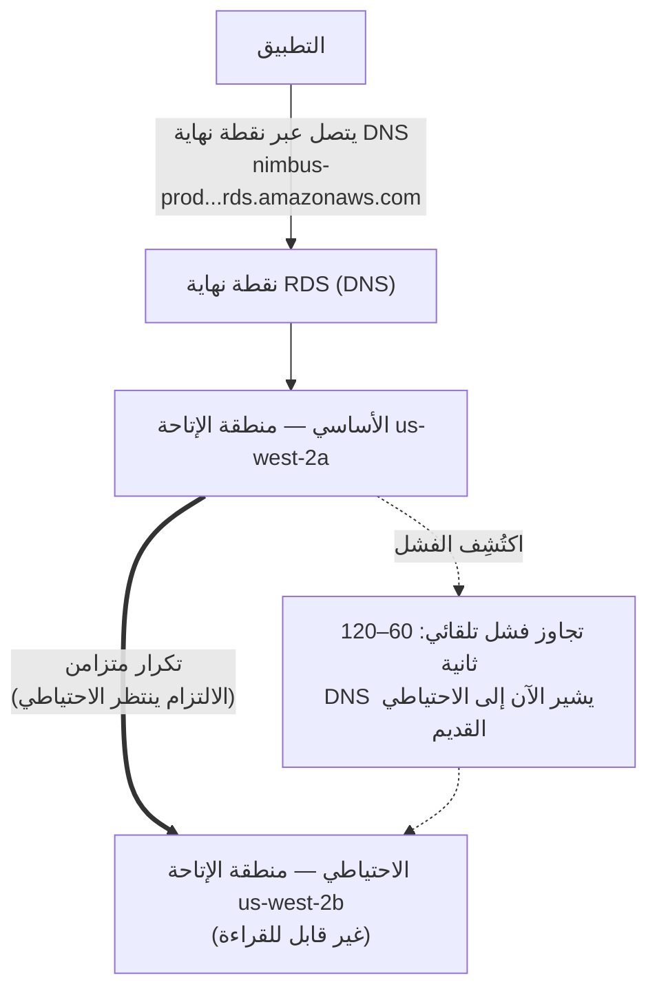

# الفصل الثامن: مدير قاعدة البيانات الذي لا يمرض أبداً

كانت الساعة الثالثة فجراً حين وصل التنبيه.

كانت Priya الوحيدة المستيقظة. أضاء هاتفها على الطاولة الجانبية فقرأته في الظلام، وسطوع الشاشة عالٍ أكثر من اللازم. جلست. وجدت حاسوبها المحمول بالذاكرة وفتحته دون إضاءة نور.

نقرت لوحة المفاتيح بهدوء في الغرفة المظلمة.

احتاج خادم قاعدة البيانات إلى ترقيع أمني — من النوع الذي يتطلّب إعادة تشغيل. كانت الثغرة حقيقية، والترقيع متاحاً، ونافذة تطبيقه دون تعطيل العملاء كانت الآن، في منتصف الليل، حين تكون حركة المرور منخفضة.

اتصلت بالخادم. سحبت الترقيع. طبّقته.

ثم قرأت ملاحظات الإصدار.

مسّ تحديث الحزمة ملف التهيئة الذي يستخدمه PostgreSQL لتعريف معاملات الاتصال. تضمّنت ملاحظات الإصدار تحذيراً: تبعاً لكيفية إجراء الترقية، قد يُستبدَل ملف تهيئة مخصّص بنسخة الحزمة الافتراضية.

كان ملف تهيئتهم مخصّصاً. كان Leo قد حرّره قبل شهرين لضبط إعداد max_connections.

عمل الترقيع. أُعيد تشغيل الخادم. عادت قاعدة البيانات إلى الإنترنت.

اختبرت Priya استعلاماً. عمل.

فحصت السجلات. بدا كل شيء طبيعياً.

عادت إلى الفراش في الساعة 4:15 فجراً.

في الساعة 9:05 صباحاً، فتح Leo التطبيق فحصل على خطأ. فحص قاعدة البيانات. كان max_connections مضبوطاً على الافتراضي: 100. كان تطبيقهم مُهيّأً لاستخدام تجمّعات اتصال تصل إلى 500.

كانت كل محاولة اتصال جديدة تفشل. كان التطبيق قد فقد فعلياً الوصول إلى قاعدة البيانات.

سألت Maya: "ماذا حدث؟"

قالت Priya: "الترقيع." كانت تنظر بالفعل في ملف التهيئة. "أعاد تحديث الحزمة كتابة ملف تهيئتنا المخصّص بالافتراضي. ضبط Leo لـ max_connections اختفى ببساطة — أُعيد تشغيل الخادم بالإعدادات الجاهزة ولم يحصل أحد على خطأ. عاد بصمت إلى الافتراضي."

سأل Leo: "كم نحتاج لإصلاحه؟"

قالت Priya: "عشرون دقيقة. لكننا نحتاج إلى نافذة صيانة. هذا يتطلّب تغيير تهيئة وإعادة تشغيل."

قال Tom: "لدينا مطاعم تفتح للغداء بعد ساعتين."

أصلحته Priya في ثماني عشرة دقيقة. كانت نافذة الصيانة اثنتي عشرة دقيقة من التوقّف الفعلي. تأثّرت المطاعم، لكن الذروة لم تكن قد بدأت بعد.

في الصباح أخبرت الفريق بما حدث. كان ثمة صمت.

قال Tom: "سيحدث ذلك مجدداً."

قالت Priya: "سيحدث في كل مرة يوجد فيها ترقيع. وهناك دائماً ترقيعات. لا بد من طريقة أفضل لفعل هذا."

كانت أوقات الاستعلام بثماني ثوانٍ لا تزال دون حل. وفي الأسبوع نفسه، هذا: نافذة صيانة في الثالثة فجراً تحوّلت إلى حادث صباحي. كان للمشكلتين السبب الجذري نفسه — كانت Nimbus تشغّل قاعدة بيانات ليست مجهّزة لإدارتها.

كان ثمة حل. كان يتطلّب فقط التخلّي عن فكرة أنهم بحاجة إلى إدارة قاعدة البيانات بأنفسهم.

**مشكلة قاعدة البيانات التقليدية**

حين تشغّل قاعدة بيانات بنفسك على مثيل EC2، أنت مسؤول عن كل شيء.

تثبيت برمجيات قاعدة البيانات. تهيئتها بأمان. ترقيعها حين تُكتشَف ثغرات أمنية. أخذ النسخ الاحتياطية. اختبار أن النسخ الاحتياطية تعمل فعلاً (خطوة تتخطّاها معظم الفِرَق حتى يفوت الأوان). مراقبة مساحة القرص. إعداد التكرار للتكرار الاحتياطي. تهيئة تجاوز الفشل لحين يتعطّل الخادم الأساسي. ضبط أداء الاستعلامات. إدارة الاتصالات تحت الحِمل.

لا شيء من هذا هو التطبيق. لا شيء منه يضيف ميزات. كله يتطلّب خبرة.

متطلب الخبرة هو القضية الرئيسية. مدير قاعدة بيانات مؤهّل يفهم ليس فقط كيف يشغّل قاعدة بيانات، بل كيف:

- يراقب سجلات الاستعلامات البطيئة ويحدّد عُنق زجاجة الأداء
- يحجّم الذاكرة لمجموعة العمل لتجنّب إدخال/إخراج القرص
- يهيّئ أرشفة WAL للاستعادة في لحظة زمنية
- يُعدّ تكراراً متزامناً متدفّقاً مع تجاوز فشل تلقائي
- يضبط تجميع الاتصالات لمنع استنفاد الاتصالات تحت الحِمل
- يطبّق ترقيات الإصدار الكبرى دون فقدان بيانات أو توقّف ممتد

هذه مجموعة مهارات متمايزة ومتخصّصة. يتقاضى مديرو قواعد البيانات الكبار رواتب عالية بالضبط لأن فعل كل هذا جيداً صعب. لا تستطيع معظم الشركات الناشئة التوظيف له. ولا تملكه معظم فِرَق التطوير.

معظم فِرَق التطوير ليست مديري قواعد بيانات. يخلق هذا نمطاً قابلاً للتنبؤ: تُثبَّت قاعدة البيانات، وتُهيّأ بحدّها الأدنى، ثم تُنسى في الغالب حتى يحدث خطب فادح. كان مثيل PostgreSQL الخاص بـ Nimbus يعمل على التهيئة الافتراضية — max_connections عند 100، لا تجميع اتصالات، نسخ احتياطية يدوية شغّلها Leo مرتين ثم نسيها، ولا تكرار على الإطلاق.

كان حادث الترقيع في الثالثة فجراً عَرَض نظام يديره أشخاص ممتازون في بناء التطبيقات وبلا خلفية في عمليات قواعد البيانات. ليس ذلك نقداً — إنه وصف دقيق لمعظم الشركات الناشئة. الحل ليس توظيف مدير قواعد بيانات. الحل هو استخدام خدمة توفّر عمليات بمستوى مدير قواعد البيانات تلقائياً.

سألت Maya: "هل هذا ما فعلناه؟"

كانت إجابة Leo صمتاً، وهو نفسه نعم.

**قاعدة البيانات المُدارة**

تخيّل توظيف مدير قاعدة بيانات لا يمرض أبداً، ويتولّى تلقائياً كل ترقيع أمني، ويأخذ نسخة احتياطية كل ليلة دون أن يُطلَب منه، ويصلح نفسه حين ينكسر شيء. يفعل كل هذا دون إزعاجك — ولا يلمس، تحت أي ظرف، منطق تطبيقك.

تسمّي AWS هذه الخدمة **RDS** — Relational Database Service.

مع RDS، تدير AWS:

- تثبيت محرك قاعدة البيانات وترقيعه
- النسخ الاحتياطية الآلية (مخزّنة في S3، يُحتفظ بها حتى 35 يوماً)
- تجاوز الفشل التلقائي (حين يتعطّل الأساسي، يتولّى احتياطي تلقائياً)
- المراقبة والمقاييس
- التشفير عند السكون وأثناء النقل
- التوسّع التلقائي للتخزين (إذا مكّنته، ينمو القرص حين يمتلئ)

أنت تدير:

- مخطّط قاعدة البيانات (بنية جداولك)
- استعلاماتك ومنطق تطبيقك
- من له وصول إلى قاعدة البيانات
- أي نوع مثيل يشغّل قاعدة البيانات
- ضبط المعاملات (وإن كان RDS يوفّر افتراضيات معقولة)

**المحرّكات المدعومة**

يدعم RDS عدة محرّكات قواعد بيانات شائعة:

- **MySQL** — قاعدة البيانات العلائقية مفتوحة المصدر الأكثر استخداماً
- **PostgreSQL** — قوية، وقابلة للتوسعة، وتزداد شعبيةً لأحمال العمل المعقّدة
- **MariaDB** — فرع مفتوح المصدر من MySQL، متوافق تماماً
- **Oracle** — بمستوى المؤسسات، تُستخدم في مؤسسات كبيرة بمتطلبات قديمة
- **Microsoft SQL Server** — لبيئات تكثر فيها Windows
- **Amazon Aurora** — محرّك AWS الخاص المتوافق مع MySQL/PostgreSQL، مبني للسحاب
  (نتناول Aurora بعمق في الفصل الرابع والعشرين)

لـ Nimbus، كان الخيار PostgreSQL. كان ما يعرفه Leo، وتعامل مع البيانات العلائقية جيداً. خيار المحرّك يهمّ أقل مما تظن لمعظم التطبيقات — الفوائد التشغيلية لـ RDS تنطبق بغضّ النظر.

دقّة واحدة: حين تشغّل محرّكاً على RDS، تصون AWS ترقيعات الإصدار الثانوي تلقائياً (خلال نافذة الصيانة المُهيّأة لديك). أما ترقيات الإصدار الكبرى — الانتقال من PostgreSQL 14 إلى 15، مثلاً — فعملية يدوية تجدوِلها وتنفّذها. تختبر AWS ترقيات الإصدار الكبرى بعناية، لكن ينبغي أن تختبرها في بيئة تشغيل تجريبي أولاً. يمكن لتغييرات الإصدار الكبرى أن تُدخل مشكلات توافق مع صياغة SQL محدّدة، أو امتدادات، أو إصدارات مشغّلات.

اكتشف Leo هذا حين طبّق RDS ترقيعاً ثانوياً وأظهر سجلّ التطبيق لوهلة تحذيراً بإهمال دالة أُزيلت في إصدار فرعي. ينبغي أن تكون الترقيعات الثانوية شفافة في جوهرها — لكن مراقبة سجلات تطبيقك بعد كل نافذة صيانة ممارسة جيدة.

سألت Priya: "هل فكّرنا فيما يحدث إذا كسر ترقيع ثانوي شيئاً؟"

قال Leo: "نتراجع إلى اللقطة السابقة."

"كم يستغرق ذلك؟"

بحث Leo عن وقت استعادة RDS لحجم قاعدة بياناتهم. لقاعدة بيانات بسعة 50 جيجابايت على `db.m6i.large`: نحو 15 إلى 30 دقيقة للاستعادة من لقطة.

قالت Priya: "إذن لدينا نافذة استرداد من 15 إلى 30 دقيقة إذا كسر ترقيع الإنتاج. ونطبّق الترقيع في نافذة صيانة الصباح الباكر، فعلى الأقل يكون التأثير أدنى ما يكون."

أضاف Leo: "ونختبر الترقيعات في التشغيل التجريبي أولاً."

قالت Priya: "نعم. ذلك أيضاً."

**تحجيم مثيل RDS: ليست كل أحمال العمل متساوية**

حين تنشئ مثيل RDS، تختار نوع مثيل — المفهوم نفسه مثل EC2، لكن مُنطَّقاً لأحمال عمل قواعد البيانات. تنظّم AWS أنواع مثيلات RDS في بضع طبقات مفيدة.

**عائلة db.t3**: مثيلات أداء انفجاري. مصمّمة للتطوير، والتشغيل التجريبي، وأحمال الإنتاج الخفيفة التي لا تحتاج إلى معالج عالٍ مستمر. `db.t3.micro` مناسب لقاعدة بيانات تطوير بحركة مرور منخفضة. `db.t3.medium` يتعامل مع حِمل إنتاج متوسط بانفجارات عَرَضية.

المقايضة مع مثيلات سلسلة T: تُراكم ائتمانات معالج خلال فترات الاستخدام المنخفض وتنفق تلك الائتمانات خلال الانفجارات. إذا شغّلت مثيل سلسلة T بمعالج عالٍ مستمر، تستنفد الائتمانات ويتباطأ الأداء إلى خط أساس قد يكون غير كافٍ.

**عائلة db.m6i**: مثيلات ذات غرض عام بأداء متسق غير انفجاري. `db.m6i.large` نقطة بداية شائعة لقواعد بيانات الإنتاج. هذه ليس لها حدود ائتمان — المعالج متاح بالسعة الكاملة كلما احتجته.

**عائلة db.r6i**: مثيلات محسّنة للذاكرة. ذاكرة أكثر لكل معالج افتراضي من عائلة M. مناسبة لقواعد البيانات ذات مجموعات العمل الكبيرة — استعلامات تستفيد من وجود البيانات في الذاكرة بدلاً من جلبها من القرص في كل وصول. إذا تحسّن أداء قاعدة بياناتك بشكل كبير حين تضيف RAM، فعائلة R هي الخيار الصحيح.

لـ Nimbus:

- التطوير والتشغيل التجريبي: `db.t3.medium`. كافٍ لاستعلامات التطوير، تكلفة منخفضة.
- الإنتاج: `db.m6i.large`. أداء متسق، وذاكرة كافية لمجموعة عمل القائمة والطلبات، لا تباطؤ ائتمان.

سأل Tom: "كم أغلى m6i.large من t3.medium؟"

فحص Leo صفحة التسعير. كان `db.t3.medium` نحو 55 دولاراً شهرياً. وكان `db.m6i.large` نحو 140 دولاراً شهرياً. كان الفرق حقيقياً، لكن فرق الموثوقية كذلك.

قالت Priya: "سيتباطأ t3 تحت الحِمل المستمر. إذا كان لدينا جمعة مزدحمة وبقي المعالج عالياً لأربع ساعات، ينفد ائتمان t3 ويتباطأ. m6i لا يفعل."

دوّن Tom الرقم. ودوّن أيضاً تكلفة انقطاعات الجمعة من قبل أسبوعين. لم تكن المقارنة متقاربة.

ذهب الإنتاج على `db.m6i.large`.

**متعدد مناطق الإتاحة: الاحتياطي الذي يتولّى**

هذه هي الميزة التي تغيّر حساب الموثوقية بالكامل.

**نشر متعدد مناطق الإتاحة** يعني أن RDS يصون مثيلاً احتياطياً متزامناً في منطقة إتاحة مختلفة عن الأساسي. كل معاملة مُلتزَمة في الأساسي تُكرَّر بشكل متزامن إلى الاحتياطي قبل الإقرار بالالتزام.

حين يفشل الأساسي — عطل عتاد، أو عطل منطقة إتاحة، أو تعطّل برمجي — يتجاوز RDS الفشل تلقائياً إلى الاحتياطي. يُحدَّث سجلّ DNS لنقطة نهاية قاعدة البيانات. يعيد تطبيقك الاتصال بالأساسي الجديد.

يستغرق تجاوز الفشل 60–120 ثانية. خلال تلك النافذة، سيشهد تطبيقك أخطاء اتصال. ينبغي للتطبيقات المكتوبة جيداً أن تتعامل مع هذا برشاقة (إعادات محاولة اتصال مع تراجع تدريجي).

الاحتياطي ليس نسخة قرائية متماثلة. لا يخدم حركة مرور القراءة. غرضه الوحيد أن يكون جاهزاً للتولّي.



(ملاحظة: خيار نشر **Multi-AZ DB Cluster** الأحدث يحتفظ بـ*احتياطيين* **قابلين** للقراءة ويتجاوز الفشل في نحو 35 ثانية — قد يميّزه الامتحان عن نشر *مثيل* متعدد مناطق الإتاحة الكلاسيكي الموصوف هنا.)

سأل Tom: "كم يكلّف متعدد مناطق الإتاحة؟"

نحو ضعف تكلفة مثيل واحد — لأنك تشغّل حرفياً مثيلَي قاعدة بيانات. يكلّف الاحتياطي بقدر الأساسي.

فتح Tom تاريخ الطلبات وقدّر الإيرادات في الساعة خلال ذروة جمعتهم.

سألت Priya: "وماذا لو حاول أحدهم الاقتحام خلال نافذة تجاوز الفشل؟ حين يكون الأساسي معطّلاً والاحتياطي يُرقّى، هل هناك ستون ثانية نكون فيها مكشوفين؟"

قالت Maya: "تجاوز الفشل شفّاف، لكن السؤال وجيه. ينبغي أن تستخدم سلاسل الاتصال نقطة نهاية RDS، لا عناوين IP مُضمَّنة بشكل ثابت — وإلا فلن يكون تجاوز الفشل سلساً."

مُكِّن متعدد مناطق الإتاحة بعد ظهر ذلك اليوم.

**النسخ الاحتياطية الآلية والاستعادة في لحظة زمنية**

يأخذ RDS نسخاً احتياطية آلية كل يوم. تخزّن AWS هذه النسخ في S3 (يديرها RDS — لا تراها مباشرةً في وحدة تحكم S3 لديك). يمكنك استعادة قاعدة البيانات إلى أي نقطة ضمن فترة احتفاظ النسخ الاحتياطية لديك.

تحدث النسخ الاحتياطية خلال **نافذة نسخ احتياطي** قابلة للتهيئة — فترة حركة مرور منخفضة، عادةً في الصباح الباكر. (هذا إعداد منفصل عن **نافذة الصيانة**، التي هي حين يطبّق RDS الترقيعات وتغييرات التهيئة. يحبّ الامتحان اختبار أن هاتين نافذتان مختلفتان.) لمعظم أنواع المحرّكات، لا تسبّب النسخ الاحتياطية توقّفاً — وعلى عمليات نشر متعدد مناطق الإتاحة، تُؤخذ اللقطة من الاحتياطي، فلا يُمسّ الأساسي على الإطلاق.

**الاستعادة في لحظة زمنية** من أكثر الميزات قيمةً: يمكنك الاستعادة إلى أي ثانية ضمن فترة احتفاظك. ليس فقط اللقطات اليومية — *أي ثانية*. هذا ممكن لأن RDS يؤرشف باستمرار سجلات المعاملات إضافةً إلى النسخ الاحتياطية اليومية.

إذا شغّل أحدهم عن طريق الخطأ `DELETE FROM orders WHERE 1=1` في الساعة 2:37 بعد الظهر، يمكنك الاستعادة إلى 2:36 بعد الظهر.

استرخى Leo بشكل ملحوظ حين فهم هذا.

قال Leo: "ضبطت بالفعل احتفاظ النسخ الاحتياطية على يوم واحد. أوه — لكن ذلك جيد، صحيح؟ يمكننا تغييره؟"

قالت Priya: "غيّره إلى سبعة أيام كحد أدنى. ثلاثون للإنتاج."

حدّثه Leo فوراً.

سأل: "هل كان بإمكاننا التعافي مما حذفته الشهر الماضي؟"

قالت Priya: "قبل RDS؟ لا. بعد RDS؟ نعم."

ربما تتساءل: ما الفرق بين نسخة احتياطية آلية ولقطة يدوية؟ النسخ الاحتياطية الآلية تُحذف حين تنتهي فترة الاحتفاظ (حتى 35 يوماً). أما اللقطات اليدوية فيُحتفظ بها إلى أجل غير مسمّى حتى تحذفها صراحةً. إذا احتجت إلى الحفاظ على حالة قاعدة بيانات بشكل دائم — قبل ترحيل كبير، قبل نشر محفوف بالمخاطر — خذ لقطة يدوية.

**RDS Proxy: حل مشكلة الاتصالات على نطاق واسع**

بعد أسبوعين من الترحيل إلى RDS، لاحظ Leo شيئاً في المقاييس.

كانت قاعدة البيانات تتعامل مع الاستعلامات جيداً. لكن عدد الاتصالات المفتوحة كان عالياً — أعلى مما توقّع. مع إضافة مجموعة التوسّع التلقائي مثيلات EC2 خلال الذروة، فتح كل مثيل جديد تجمّعه الخاص من اتصالات قاعدة البيانات. عشرة مثيلات EC2، كلٌّ بتجمّع اتصالات من 50: خمسمئة اتصال متزامن بقاعدة البيانات.

قالت Priya: "لدى PostgreSQL عبء لكل اتصال. ذاكرة، ومعالج لمعالج الاتصال. خمسمئة اتصال تستخدم قدراً ذا معنى من موارد قاعدة البيانات لمجرد إدارة الاتصالات — قبل أن تنجز أي عمل فعلي."

سأل Leo: "هل يمكننا تقليل حجم تجمّع الاتصالات؟"

قالت Priya: "يمكننا. لكن حينها نخاطر بأن تصطفّ الطلبات في طابور تنتظر اتصالاً خلال الذروة."

الحل الأفضل: **RDS Proxy**.

يقع RDS Proxy بين التطبيق وقاعدة البيانات. تتصل مثيلات EC2 بالـ Proxy، لا مباشرةً بمثيل RDS. يصون الـ Proxy تجمّعاً من اتصالات قاعدة البيانات ويوزّع طلبات التطبيق عليها. إذا فتح عشرة مثيلات EC2 كلٌّ خمسين اتصالاً بالـ Proxy، فقد يصون الـ Proxy مئة اتصال فعلي فقط بقاعدة البيانات — مُتقاسماً إياها بكفاءة عبر كل طلبات التطبيق.

الفوائد:

**تجميع الاتصالات**: عدد أقل من اتصالات قاعدة البيانات الفعلية يعني عبء ذاكرة أقل على مثيل RDS وأداءً أفضل تحت الحِمل.

**تجاوز فشل أسرع**: خلال تجاوز فشل متعدد مناطق الإتاحة، يصون الـ Proxy الاتصال على جانب التطبيق بينما يعيد تأسيس اتصال قاعدة البيانات في الخلفية. ترى التطبيقات وقفة قصيرة بدلاً من إعادة ضبط كاملة للاتصال. يقلّل RDS Proxy تأثير تجاوز الفشل من 60–120 ثانية إلى 30 ثانية أو أقل عادةً.

**مصادقة IAM**: بدلاً من تضمين اعتمادات قاعدة البيانات في التطبيق، يستطيع التطبيق المصادقة لـ RDS Proxy باستخدام دور IAM. يتولّى الـ Proxy اعتمادات قاعدة البيانات الفعلية. يلغي هذا الأسرار من بيئة التطبيق بالكامل.

سأل Tom: "كم يكلّف RDS Proxy؟"

يكلّف نحو 0.015 دولار لكل ساعة-معالج افتراضي لمثيل RDS الأساسي، يُفوتَر بشكل منفصل عن المثيل نفسه. لـ `db.m6i.large` (معالجان افتراضيان)، يضيف الـ Proxy نحو 22 دولاراً شهرياً.

نظر Tom إلى رسم عدد الاتصالات — خمسمئة اتصال تتنافس على موارد قاعدة البيانات خلال الذروة — ونظر إلى تكلفة 22 دولاراً شهرياً.

قال: "ذلك أرخص من الترقية إلى مثيل RDS أكبر للتعامل مع عبء الاتصالات."

مُكِّن RDS Proxy ذلك الأسبوع.

سألت Priya: "وماذا لو حاول أحدهم الاقتحام عبر الـ Proxy؟ هل تقلّل مصادقة IAM للـ Proxy سطح الهجوم؟"

أجابت Priya سؤالها بنفسها بعد لحظة: "نعم. عدم وجود اعتمادات قاعدة بيانات في بيئة التطبيق يعني أنه لا توجد اعتمادات قاعدة بيانات لسرقتها من التطبيق."

مكّنت مصادقة IAM للـ Proxy.

**النسخ القرائية المتماثلة: توسيع حركة مرور القراءة**

متعدد مناطق الإتاحة عن الإتاحة. **النسخ القرائية المتماثلة** (read replicas) عن الأداء.

النسخة القرائية المتماثلة نسخة غير متزامنة من قاعدة بياناتك الأساسية يمكنها خدمة استعلامات القراءة. يمكنك امتلاك حتى 15 نسخة قرائية لمحرّكات RDS الكبرى — MySQL، وPostgreSQL، وMariaDB (يدعم Aurora حتى 15 نسخة Aurora متماثلة أيضاً، تتشارك وحدة التخزين نفسها).

يُعدَّل التطبيق ليرسل استعلامات القراءة إلى النسخة المتماثلة واستعلامات الكتابة إلى الأساسي. يوزّع هذا الحِمل: يتعامل الأساسي مع الكتابات والمعاملات المعقّدة؛ وتتعامل النسخ المتماثلة مع القراءات.

الخصائص الرئيسية:

- التكرار **غير متزامن** — قد يكون ثمة تأخّر صغير (lag) بين
  الأساسي والنسخة المتماثلة. إذا كتبت سجلاً وقرأت فوراً من النسخة المتماثلة،
  فقد لا تراه بعد.
- يمكن أن تكون النسخ القرائية المتماثلة في المنطقة نفسها أو في منطقة مختلفة (النسخ
  عبر المناطق تضيف زمن وصول لكنها تتيح التوزيع الجغرافي).
- يمكن ترقية النسخ القرائية المتماثلة إلى قواعد بيانات مستقلة في سيناريو كارثة.

لـ Nimbus: عمليات البحث في القوائم قراءات. تاريخ الطلبات قراءات. الأغلبية الساحقة من حركة المرور حركة قراءة. إضافة نسخة قرائية متماثلة وتوجيه القراءات إليها يقلّل حِمل قاعدة البيانات الأساسية بشكل كبير.

نتناول النسخ القرائية المتماثلة بشكل أوفى في الفصل الرابع والعشرين حين نناقش Aurora.

**إن كان الحِمل ثقيل القراءة فأضف نسخة متماثلة لكن راقب التأخّر**

إذا كان حِملك ثقيل القراءة، فإضافة نسخة قرائية متماثلة تقلّل الحِمل على الأساسي وتحسّن أداء الاستعلامات — لكن التكرار غير متزامن، ما يعني أن النسخة المتماثلة قد تكون متأخّرة قليلاً عن الأساسي. إذا كتب تطبيقك سجلاً وقرأه فوراً، فعليه القراءة من الأساسي، لا من النسخة المتماثلة. إصابة هذا خطأً تنتج أخطاء طزاجة بيانات دقيقة يصعب تصحيحها: يقدّم مستخدم طلباً، فتستعلم صفحة التأكيد من النسخة المتماثلة، ولم تلحق النسخة المتماثلة بعد، فيبدو الطلب مفقوداً. يُسمّى هذا اتساق اقرأ-كتاباتك (read-your-writes)، وهو الخطأ الأشيع الذي ترتكبه الفِرَق حين تضيف نسخاً متماثلة لأول مرة.

**Performance Insights: العثور على الاستعلام البطيء**

كان وقت تحميل القائمة بثماني ثوانٍ لا يزال مشكلة. حسّن الانتقال إلى RDS الموثوقية، لكن الاستعلام ظلّ بطيئاً.

أضاف Leo نسخة قرائية متماثلة ووجّه استعلامات القائمة إليها. انخفض وقت تحميل القائمة إلى نحو أربع ثوانٍ. أفضل. لا يزال غير جيد.

قالت Maya: "الاستعلام لا يزال بطيئاً. حسّنّا عُنق الزجاجة، لكننا لم نصلحه."

يتضمّن RDS ميزة تُسمّى **Performance Insights** — أداة مراقبة تُظهر أي الاستعلامات تستهلك أكثر موارد قاعدة البيانات، وأي الجلسات تنتظر، وما تنتظره.

مكّن Leo Performance Insights على النسخة القرائية المتماثلة وحمّل صفحة القائمة مراراً خلال جلسة اختبار بعد الظهر.

أظهرت لوحة معلومات Performance Insights استعلاماً واحداً يهيمن على الحِمل: مسح جدول كامل لجدول `menu_items`، يجلب كل الـ22,000 صفّ في كل مرة تُحمَّل فيها صفحة قائمة. لم يكن ثمة فهرس على `restaurant_id` — العمود الذي كان التطبيق يصفّي به.

وقت التنفيذ بلا فهرس: 8.2 ثانية.

أضاف Leo الفهرس.

```sql
CREATE INDEX idx_menu_items_restaurant_id ON menu_items(restaurant_id);
```

وقت التنفيذ بالفهرس: 14 ميلي ثانية.

8,200 ميلي ثانية إلى 14 ميلي ثانية. الفرق بين تطبيق طلبات مطعم يطرد العملاء وآخر يستخدمونه دون تفكير.

قالت Maya: "كانت تلك المشكلة طوال الوقت؟"

قال Leo: "كانت تلك المشكلة."

"وعثر Performance Insights عليها في كم؟"

"نحو عشرين دقيقة."

كان Tom يحسب بالفعل. ثلاثة أسابيع من أوقات تحميل قوائم دون المثلى، تقدير 200,000 تحميل صفحة قائمة خلال تلك الفترة، تقدير 15% هجران بسبب البطء. الرقم الذي وصل إليه كان مزعجاً.

قال: "أضِف الفهارس المفقودة قبل الإطلاق في المرة القادمة."

قالت Priya: "ستكون هناك قائمة مراجعة." كانت تكتبها بالفعل.

**متى لا تستخدم RDS**

RDS ممتاز لمجموعة واسعة من أحمال عمل قواعد البيانات العلائقية. لكنه ليس الإجابة الصحيحة لكل شيء.

**حين تحتاج إلى وصول على مستوى نظام التشغيل**: RDS لا يمنحك الوصول إلى نظام التشغيل الأساسي. لا يمكنك تثبيت حِزَم نظام تشغيل مخصّصة، أو تعديل معاملات النواة، أو تشغيل أدوات تتطلّب وصول الجذر إلى خادم قاعدة البيانات. إذا كان لقاعدة بياناتك متطلبات تتطلّب وصول نظام التشغيل — تهيئات Oracle معيّنة، مشغّلات تخزين مخصّصة، واجهات شبكة محدّدة — فأنت بحاجة إلى تشغيل قاعدة البيانات على مثيل EC2 مباشرةً.

**حين تستخدم محرّكاً غير مدعوم**: يدعم RDS محرّكات MySQL، وPostgreSQL، وMariaDB، وOracle، وSQL Server، وAurora. إذا كان تطبيقك يستخدم محرّك قاعدة بيانات مختلفاً — CockroachDB، وSingleStore، وGreenplum — فأنت تشغّله على EC2، لا على RDS.

**حين تحتاج إلى توسّع أفقي ثقيل الكتابة**: يوسّع RDS القراءات عبر النسخ المتماثلة. تذهب الكتابات إلى مثيل أساسي واحد. إذا كان حِملك ثقيل الكتابة ويحتاج إلى التوزيع عبر عُقد كتابة متعددة، فـ RDS ليس البنية المعمارية الصحيحة. يستطيع Aurora Global Database المساعدة على نطاق كبير، لكن لمتطلبات توسّع الكتابة الشديدة، فإن قواعد البيانات الموزّعة مثل DynamoDB (الفصل التاسع) أو CockroachDB العاملة على EC2 هي الأدوات المناسبة.

**حين تتجاوز التكلفة المُدارة التكلفة التشغيلية**: لأحمال عمل كبيرة جداً ومستقرة حيث يملك فريقك خبرة حقيقية في إدارة قواعد البيانات، يمكن لتشغيل PostgreSQL على EC2 بأدواتك الخاصة أن يكون أرخص من RDS. هذا غير معتاد لفِرَق ليست أساساً متاجر مديري قواعد بيانات. لكنه حقيقي، ومهندس معماري جيد يقرّ به.

لـ Nimbus — شركة ناشئة بلا موارد مديري قواعد بيانات مخصّصة، تشغّل PostgreSQL على خدمة مُدارة، بنمو غير قابل للتنبؤ — كان RDS بوضوح الخيار الصحيح.

**مجموعات معاملات RDS ومجموعات الخيارات**

آليتا تهيئة تظهران في الامتحان:

**مجموعات المعاملات** (Parameter groups) تتحكّم في إعدادات محرّك قاعدة البيانات — مثل الحد الأقصى للاتصالات، وحجم ذاكرة الاستعلامات المؤقتة، وقيم المهلة. ينشئ RDS مجموعة معاملات افتراضية تعمل لمعظم الحالات. تنشئ مجموعات معاملات مخصّصة حين تحتاج إلى ضبط إعدادات محدّدة.

**مجموعات الخيارات** (Option groups) تمكّن ميزات إضافية لبعض المحرّكات — مثل تشفير شبكة Oracle الأصلي أو تشفير البيانات الشفّاف في SQL Server. معظم عمليات نشر المحرّكات مفتوحة المصدر لا تحتاج إلى مجموعات خيارات مخصّصة.

يمكنك تخصيص سلوك محرّك قاعدة البيانات عبر هذه الآليات — لكن الافتراضيات تعمل لمعظم الفِرَق في البداية.

### إدخال البيانات: AWS Database Migration Service

بعد بضعة أسابيع، وصل Tom إلى الوقفة اليومية بشريحة عرض.

كانت Nimbus تستحوذ على منافس إقليمي صغير. كان نظام طلباتهم يعمل على قاعدة بيانات MySQL في منشأة استضافة مشتركة. لم يكن بإمكان النظام الانقطاع خلال الترحيل — كانت المطاعم تستخدمه.

قال Tom: "نحتاج إلى نقل بياناتهم إلى RDS. دون إنزال النظام."

سأل Leo: "ما حجم قاعدة البيانات؟"

"نحو 80 جيجابايت."

"متى يحتاجون إلى التحويل؟"

"ستة أسابيع."

كانت Priya قد فتحت الوثائق بالفعل. قالت: "AWS DMS."

**AWS DMS (Database Migration Service)** ينقل البيانات من قاعدة بيانات مصدر إلى قاعدة بيانات وجهة بأدنى توقّف. يتعامل مع الترحيل في مرحلتين: تحميل كامل للبيانات الموجودة، يتبعه تكرار مستمر للتغييرات بينما يواصل المصدر العمل.

ثمة نوعا ترحيل:

**الترحيل المتجانس:** المصدر والوجهة محرّك نفسه — MySQL إلى RDS MySQL، PostgreSQL إلى Aurora PostgreSQL. المخطّط متوافق؛ يرحّل DMS البيانات مباشرةً.

**الترحيل غير المتجانس:** المصدر والوجهة محرّكان مختلفان — Oracle إلى Aurora PostgreSQL، SQL Server إلى RDS MySQL. يجب تحويل المخطّط أولاً. يتطلّب هذا **AWS Schema Conversion Tool (SCT)** لترجمة المخطّط، ثم DMS لنقل البيانات.

لاستحواذ Nimbus: MySQL إلى RDS MySQL. متجانس. لا حاجة إلى SCT.

كيف يعمل عملياً:

1. يقرأ DMS من المصدر — قاعدة بيانات MySQL في الاستضافة المشتركة
2. **التحميل الكامل**: ينسخ DMS كل البيانات الموجودة إلى مثيل RDS الوجهة
3. **CDC (التقاط تغيّر البيانات)**: بعد التحميل الكامل، يقرأ DMS سجلّ معاملات قاعدة البيانات المصدر ويكرّر التغييرات الجارية إلى الوجهة في الوقت شبه الفعلي
4. يواصل المصدر العمل. حين يكون الفريق جاهزاً، يقلبون سلسلة الاتصال.

سأل Tom: "إذن نظام طلبات المطاعم يبقى حياً طوال الوقت؟"

أكّدت Priya: "طوال الوقت. يبقى المصدر والوجهة متزامنين عبر CDC. حين نكون جاهزين، نقلب نقطة النهاية. التوقّف هو الثواني التي يستغرقها انتشار ذلك التغيير."

يدعم DMS عشرات تركيبات المصدر والوجهة: Oracle، وSQL Server، وMySQL، وPostgreSQL، وMongoDB، وDynamoDB، وS3، وRedshift، وAurora، وغيرها.

سألت Maya: "مهلاً — لكن *لماذا* نحتاج إلى أداة منفصلة للترحيلات غير المتجانسة؟ ألا يستطيع DMS فقط اكتشاف فروق المخطّط؟"

قالت Priya: "VARCHAR في Oracle ليست نفسها VARCHAR في PostgreSQL. أنواع البيانات، والإجراءات المخزّنة، والمتتاليات، والدوال المملوكة — لا تتطابق واحداً لواحد. يحلّل SCT المخطّط المصدر ويولّد أقرب مكافئ للوجهة. ثم ينقل DMS البيانات إلى ذلك المخطّط المُحوَّل. فصل تحويل المخطّط عن نقل البيانات هو ما يجعل العملية موثوقة."

سألت Priya نفسها بعد لحظة: "وماذا لو حاول أحدهم الاقتحام عبر مثيل تكرار DMS؟ يحتاج إلى وصول قراءة للمصدر ووصول كتابة للوجهة."

قال Leo: "امتياز أدنى على الطرفين. IAM للقراءة فقط على المصدر. وصول كتابة مُنطَّق لهدف الترحيل فقط. ويبقى مثيل التكرار في الشبكة الفرعية الخاصة."

دوّنته Priya.

## نقاط القوة والقيود

**لماذا RDS ممتاز**:

- يلغي العبء التشغيلي لإدارة برمجيات قاعدة البيانات
- نسخ احتياطية آلية واستعادة في لحظة زمنية
- متعدد مناطق الإتاحة لتجاوز فشل تلقائي بأدنى وقت استرداد
- نسخ قرائية متماثلة لتوسيع حركة مرور القراءة
- تشفير عند السكون وأثناء النقل مدمج
- كل محرّكات قواعد البيانات العلائقية الكبرى مدعومة
- RDS Proxy لتجميع الاتصالات وتحسين استجابة تجاوز الفشل

**أين لـ RDS حدود**:

- لا يمكنك الوصول إلى نظام التشغيل الأساسي. إذا كان لقاعدة بياناتك متطلبات تتطلّب
  وصولاً على مستوى نظام التشغيل، فقد تحتاج إلى تشغيل قاعدة بيانات خاصة بك على EC2.
- RDS ليس بلا خوادم (مع استثناءات — Aurora Serverless موجود، نتناوله في
  الفصل الرابع والعشرين). تدفع مقابل مثيل عامل حتى لو كان عاطلاً.
- RDS ليس مصمّماً لقواعد بيانات مُجزّأة أفقياً. للتوسّع الخارجي الهائل
  لأحمال علائقية ثقيلة الكتابة، قد تحتاج في النهاية إلى بنية معمارية مختلفة.
- لأنماط بيانات غير علائقية (NoSQL)، DynamoDB (الفصل التاسع) أكثر ملاءمة.

## ملخص

كانت نافذة ترقيع Priya في الثالثة فجراً هي العَرَض. أما السبب الجذري فكان أن Nimbus كانت تدير قاعدة بيانات تستطيع خدمة مُدارة التعامل معها على نحو أفضل. RDS لا يلغي مكالمة الإيقاظ في الثالثة فجراً فحسب — بل ينقل مسؤولية الترقيع، وتجاوز الفشل، والنسخ الاحتياطية، وإدارة الاتصالات إلى AWS، محرّراً الفريق ليركّز على كود التطبيق الذي يخدم العملاء فعلاً. المقايضة هي فقدان الوصول على مستوى نظام التشغيل، الذي يهمّ نادراً وأقل بكثير مما يبدو.

- **Amazon RDS** خدمة قاعدة بيانات علائقية مُدارة. تتولّى AWS الترقيع، والنسخ الاحتياطية، وتجاوز الفشل، والتخزين. أنت تتولّى المخطّط، والاستعلامات، ومنطق التطبيق.
- **متعدد مناطق الإتاحة** يصون احتياطياً متزامناً في منطقة إتاحة مختلفة. يحدث تجاوز الفشل التلقائي في 60–120 ثانية. استخدم دائماً اسم DNS لنقطة نهاية RDS في سلاسل الاتصال — لا عناوين IP مُضمَّنة بشكل ثابت — حتى يكون تجاوز الفشل شفّافاً.
- **النسخ القرائية المتماثلة** نسخ غير متزامنة تخدم حركة مرور القراءة. تأخّر التكرار يعني أنها قد تكون متأخّرة قليلاً — اتساق اقرأ-كتاباتك يتطلّب القراءة من الأساسي فوراً بعد كتابة.
- **RDS Proxy** يجمّع الاتصالات، مقلّلاً العبء ومحسّناً سرعة تجاوز الفشل. حيوي لأحمال العمل القائمة على Lambda التي يمكن أن تنشئ آلاف الاتصالات قصيرة العمر.
- **Performance Insights** يحدّد الاستعلامات البطيئة — العثور على فهرس مفقود يمكن أن يحوّل استعلاماً بثماني ثوانٍ إلى آخر بـ14 ميلي ثانية. ترقيات الإصدار الكبرى يدوية؛ اختبر في التشغيل التجريبي أولاً.

## نصائح الامتحان

*نطاق SAA-C03 المجال 3 — المهمة 3.3 (حلول قواعد البيانات)*

- **متعدد مناطق الإتاحة للإتاحة العالية، لا للأداء.** الاحتياطي لا يخدم
  حركة مرور القراءة. النسخ القرائية المتماثلة للأداء. يُختبر هذا التمييز كثيراً.
- **تجاوز فشل متعدد مناطق الإتاحة تلقائي.** أنت لا تهيّئ متى أو كيف يحدث.
  يراقب RDS الأساسي ويُطلق تجاوز الفشل تلقائياً.
- **تأخّر التكرار يهمّ.** يمكن أن تكون النسخ القرائية المتماثلة متأخّرة قليلاً عن الأساسي.
  إذا تطلّب تطبيقك قراءة بيانات كتبها للتو، فعليه القراءة من
  الأساسي، لا من النسخة المتماثلة. يُسمّى هذا "اتساق اقرأ-كتاباتك".
- **النسخ الاحتياطية الآلية يُحتفظ بها 0–35 يوماً.** ضبط الاحتفاظ على 0
  يعطّل النسخ الاحتياطية الآلية. اللقطات اليدوية يُحتفظ بها إلى أجل غير مسمّى حتى
  تحذفها.
- **التوسّع التلقائي لتخزين RDS** يمنع انقطاعات امتلاء القرص. مكّنه. يتوسّع
  للأعلى فقط، أبداً للأسفل. قد يختبر الامتحان إن كنت تعرف هذا اللاتماثل.
- **RDS Proxy** يظهر في سيناريوهات الامتحان التي تشمل دوال Lambda المتصلة بـ RDS
  (يمكن لـ Lambda إنشاء آلاف الاتصالات قصيرة العمر، التي تُغرق قاعدة البيانات
  بلا Proxy)، أو سيناريوهات تتطلّب تجاوز فشل متعدد مناطق الإتاحة أسرع.
- **مثيلات db.t3 تنفجر وتتباطأ.** سيناريوهات الامتحان التي تصف تدهور أداء
  متقطّع على مثيلات RDS صغيرة قد تصف استنفاد ائتمان المعالج
  على مثيلات سلسلة T. الإصلاح هو الترقية إلى مثيل سلسلة M أو R.
- **نقطة نهاية DNS لمتعدد مناطق الإتاحة**: حين يحدث تجاوز فشل متعدد مناطق الإتاحة، يُحدَّث سجلّ DNS
  لنقطة نهاية RDS ليشير إلى الأساسي الجديد. التطبيقات التي تستخدم نقطة نهاية RDS
  (لا عنوان IP مُضمَّناً) تعيد الاتصال تلقائياً. التطبيقات ذات TTLs طويلة لـ DNS أو
  عناوين IP مُضمَّنة لن تعيد الاتصال تلقائياً. استخدم دائماً نقطة نهاية RDS.
- **ترقية النسخة القرائية المتماثلة**: يمكن ترقية نسخة قرائية متماثلة إلى مثيل قاعدة بيانات مستقل
  — مفيد لاستعادة الكوارث إذا فُقد الأساسي ولم يكن متعدد مناطق الإتاحة مُهيّأً.
  الترقية عملية أحادية الاتجاه: تصبح النسخة المتماثلة أساسياً ولم تعد
  تُكرّر من الأصلي. سيناريوهات الامتحان التي تسأل عن "الترقية اليدوية" أو
  "تحويل نسخة قرائية متماثلة إلى أساسي" تشمل هذه العملية.
- **Performance Insights** يحدّد استعلامات SQL الأعلى حسب وقت الانتظار واستخدام المعالج.
  حين يسأل سيناريو امتحان كيف تشخّص استعلامات بطيئة على قاعدة بيانات RDS، يكون Performance
  Insights هو الإجابة الأصيلة من AWS.
- **RDS مقابل تشغيل قاعدة بيانات على EC2**: يقدّم الامتحان أحياناً هذا كخيار.
  يوفّر RDS عمليات مُدارة لكنه يحدّ من الوصول على مستوى نظام التشغيل. قواعد البيانات القائمة على EC2 تمنحك
  تحكّماً كاملاً لكنها تتطلّب خبرة مدير قواعد بيانات للعمليات. عبارة "مطلوب وصول على مستوى نظام التشغيل"
  في سيناريو امتحان إشارة لاختيار EC2 على RDS.
- **AWS DMS:** يرحّل قواعد البيانات بأدنى توقّف باستخدام تحميل كامل + CDC. متجانس (محرّك نفسه) = DMS مباشرةً. غير متجانس (محرّكات مختلفة) = SCT لتحويل المخطّط أولاً، ثم DMS لنقل البيانات. محفّز الامتحان: "ترحيل قاعدة بيانات بأدنى توقّف" أو "Oracle إلى Aurora" ← DMS + SCT.

## تمارين

**التمرين الأول — استذكار**

بكلماتك الخاصة: ما الفرق بين متعدد مناطق الإتاحة والنسخ القرائية المتماثلة في RDS؟ ما المشكلة التي يحلّها كلٌّ منهما؟

*(تلميح: أحدهما يحمي من التوقّف؛ والآخر يحسّن الأداء تحت حِمل ثقيل
القراءة. يحلّان مشكلتين مختلفتين ويمكن استخدامهما معاً.)*

**التمرين الثاني — سيناريو SAA-C03**

*سيناريو*: تشغّل شركة قاعدة بيانات إنتاج PostgreSQL على RDS. تشهد قاعدة البيانات
حركة مرور قراءة عالية بسبب استعلامات التقارير العاملة طوال اليوم.
الفريق قلق أيضاً بشأن إتاحة قاعدة البيانات — لا يستطيعون تحمّل أكثر من
بضع دقائق من التوقّف في سيناريو فشل. يريدون تقليل التأثير على
قاعدة البيانات الأساسية من أحمال التقارير.

أي مجموعة من ميزات RDS تعالج كلا القلقين على أفضل وجه؟

A) تمكين متعدد مناطق الإتاحة وتشغيل كل الاستعلامات على المثيل الاحتياطي  
B) أخذ لقطات يدوية أكثر تكراراً والاستعادة منها إذا فشل الأساسي  
C) إنشاء نسخ قرائية متماثلة متعددة وتعطيل متعدد مناطق الإتاحة لتقليل التكاليف  
D) تمكين متعدد مناطق الإتاحة لحماية تجاوز الفشل وإنشاء نسخة قرائية متماثلة لاستعلامات التقارير

**تلميح 1**: المتطلبان هما: (1) الإتاحة أثناء الفشل، (2) تفريغ
القراءات. أي الميزات تعالج أي متطلب؟

**تلميح 2**: متعدد مناطق الإتاحة يوفّر تجاوز فشل تلقائي. الاحتياطي لا يخدم حركة مرور القراءة.
لذا متعدد مناطق الإتاحة وحده لا يساعد في مشكلة القراءة.

**تلميح 3**: النسخ القرائية المتماثلة تخدم حركة مرور القراءة. متعدد مناطق الإتاحة يوفّر تجاوز الفشل. تحتاج إلى كليهما.

**الإجابة**: D

**التفسير**: متعدد مناطق الإتاحة يوفّر تجاوز فشل تلقائي إلى احتياطي في منطقة إتاحة مختلفة —
هذا يعالج متطلب الإتاحة. نسخة قرائية متماثلة تتيح لاستعلامات التقارير
العمل دون التأثير على قاعدة البيانات الأساسية — هذا يعالج متطلب
الأداء. يمكن استخدام كلتا الميزتين في آن واحد.

**لماذا ليس A؟** الاحتياطي في متعدد مناطق الإتاحة لا يستطيع خدمة حركة مرور القراءة. إنه حصرياً لـ
تجاوز الفشل. محاولة الاستعلام منه مباشرةً غير مدعومة.

**لماذا ليس B؟** اللقطات اليدوية تستعيد نسخة كاملة من قاعدة البيانات — عملية
أطول بكثير (ربما ساعات لقواعد البيانات الكبيرة). لا يلبّي هذا متطلب "بضع دقائق
من التوقّف".

**لماذا ليس C؟** النسخ القرائية المتماثلة تساعد في أداء القراءة لكنها لا توفّر تجاوز فشل
تلقائياً. إذا فشل الأساسي، ستحتاج إلى ترقية نسخة قرائية متماثلة يدوياً —
ما يستغرق وقتاً وليس تلقائياً.

*نطاق SAA-C03 المجال 3 — المهمة 3.3*

**التمرين الثالث — تحدٍّ معماري** *(اختياري)*

تفكّر Nimbus في ترحيل قاعدة بيانات PostgreSQL ذاتية الإدارة الحالية
(العاملة على مثيل EC2) إلى RDS PostgreSQL. يحتاج الترحيل إلى الحدوث
بأدنى توقّف — مثالياً دون 15 دقيقة. حجم قاعدة البيانات 200 جيجابايت.

أي نهج توصي به؟ أي خدمات AWS قد تساعد في الترحيل؟
أي مخاطر ستختبرها قبل تحويل حركة مرور الإنتاج؟

*(لا توجد إجابة صحيحة واحدة. فكّر في AWS Database Migration Service،
والتكرار المنطقي، وخطر عدم اتساق البيانات أثناء التحويل.)*

## مشهد ما بعد التتر

بنهاية اليوم، كانت Nimbus قد رحّلت إلى RDS PostgreSQL مع تمكين متعدد مناطق الإتاحة. استغرق الترحيل نفسه معظم بعد الظهر — استخدم Leo نهج نسخ احتياطي واستعادة، بنافذة صيانة قصيرة.

كان Tom قد راقب الفاتورة بعناية.

قال: "مثيل RDS يكلّف ضعف ما كلّفته قاعدة بيانات EC2."

سألت Maya: "والنسخ الاحتياطية الآلية؟"

"أكثر قليلاً."

"وتجاوز الفشل الذي سنحصل عليه مجاناً إذا مات الأساسي؟"

لم يكن لدى Tom سعر لذلك. دوّنه كسؤال.

بعد ثلاثة أيام، كانت قاعدة البيانات سليمة. انخفضت أوقات الاستعلام بشكل كبير بعد أن أضاف Leo الفهرس المفقود. حُمِّلت القائمة في أقل من ثانية.

قالت Priya: "المشكلة ليست محرّك قاعدة البيانات. إنها نموذج البيانات."

توقّفت.

"بعض هذه البيانات ليس علائقياً على الإطلاق. عناصر القوائم، وملفّات المطاعم،
ومناطق التوصيل — لهذه البيانات أشكال متغيّرة. SQL يقاومنا."

كان Leo يبحث بالفعل عن شيء.

قال: "ماذا لو استخدمنا نوعاً مختلفاً من قواعد البيانات للقائمة؟"

في الفصل التالي: قاعدة البيانات التي لا تتباطأ، حتى حين يطلب مليون شخص دفعة واحدة.
