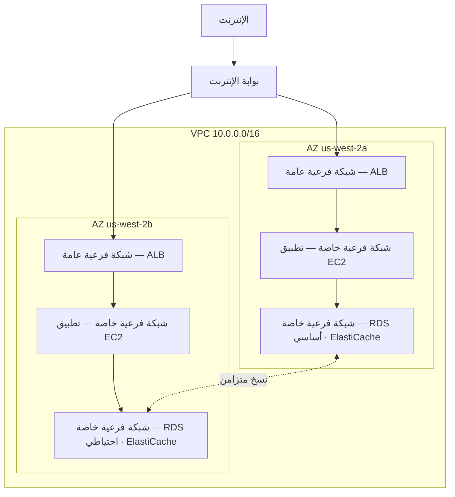

# الفصل الحادي عشر: زاويتك الخاصة في السحابة

كانت مع Priya ورقة عليها رسم.

لم يكن رسماً معقداً. مستطيل مُعلَّم عليه "AWS." بداخله مجموعة من المربعات: نسخ EC2، وقاعدة بيانات RDS، وعنقود ElastiCache. خطوط تربط كل شيء بكل شيء آخر. وخارج المستطيل، تسمية واحدة: "الإنترنت."

وضعته في منتصف الطاولة.

---

*كانت طبقة التخزين المؤقت تعمل. خفّض Redis تحميل الصفحات من 188 مللي ثانية إلى 12. لكن بينما كان Leo يحتفل بذلك الانتصار، كانت Priya تقرأ سجلات الشبكة — ولم يُعجبها ما رأته. كانت كل خدمة على نفس الشبكة المسطحة. كان لقاعدة البيانات عنوان IP عام. كان عنقود Redis قابلاً للوصول تقنياً من الخارج. كان التطبيق يعمل، لكن المعمارية كانت موقف سيارات: لا أسياج، لا بوابات، لا مناطق.*

---

قالت: "هذا ما لدينا. قاعدة بياناتنا لها عنوان IP عام. يمكن الوصول إلى طبقة التخزين المؤقت من الإنترنت. نسخ EC2 كلها على نفس الشبكة المسطحة."

قال Leo: "يبدو هذا مقبولاً. لدينا مجموعات أمان."

قالت Priya: "مجموعات أمان ضبطتها أنت. في الليل. أثناء الإعداد الأولي."

لم يقل Leo شيئاً.

قالت: "لا أنتقد الضبط. أقول إنه حين يعيش كل شيء على شبكة عامة مسطحة، يكون ضبط خاطئ واحد هو الفارق بين نظام يعمل ونظام يمكن للجميع على الإنترنت الوصول إليه."

أمسكت بقلم أحمر ورسمت دائرة حول قاعدة البيانات.

"هذا لا ينبغي أن يكون قابلاً للوصول من الإنترنت. بتاتاً. لا من خلال قاعدة مجموعة أمان، لا من خلال ضبط محكم. يجب أن يكون غير قابل للوصول هيكلياً."

قالت Maya: "نحتاج إلى الحديث عن معمارية الشبكة."

قالت Priya: "كان ينبغي الحديث عنها منذ ثلاثة أشهر. لكن الآن مقبول."

تجمّع الفريق حول لوح أبيض للمرة الأولى منذ أسابيع.

**مشكلة موقف السيارات المفتوح**

تخيّل موقف سيارات عام ضخم. عشرة آلاف سيارة. يمكن لأي سيارة أن تركن في أي مكان. لا حواجز بين المناطق، لا بوابات، لا أقسام محجوزة.

هذه شبكة مفتوحة. يمكن لكل خدمة الوصول إلى كل خدمة أخرى. يمكن لخادم الويب الاتصال بقاعدة البيانات. يمكن لقاعدة البيانات الوصول إلى الإنترنت. يمكن لطبقة التخزين المؤقت استقبال اتصالات من أي مكان.

حين يمكن للجميع الحديث مع الجميع، يؤثر اختراق واحد على الجميع.

قال Tom: "إذن إذا كسر أحدهم موقف السيارات، يمكنه الدخول إلى أي سيارة."

أكدت Priya: "ومن أي سيارة، القيادة إلى أي مكان. نريد أسياجاً. نريد بوابات مقفلة. نريد مناطق."

VPC هو الطريقة التي تبني بها هذه المناطق في AWS.

**ما هو VPC؟**

سألت Maya: "مهلاً — لكن *لماذا* نفعل ذلك بهذه الطريقة؟ إذا كان لدينا أصلاً مجموعات أمان على كل مورد، فلماذا نحتاج إلى VPC؟ ألا تقوم مجموعات الأمان بنفس العمل؟"

تحمي مجموعات الأمان وVPCs على مستويات مختلفة. مجموعة الأمان قاعدة مرتبطة بمورد محدد — تقول "هذه النسخة EC2 تقبل الزيارات فقط على المنفذ 8080 من موازن التحميل." لكنها لا تزال على الشبكة العامة. عنوان IP لا يزال قابلاً للوصول؛ القاعدة تحجب الاتصال عند الباب فحسب. أما VPC فتُزيل الباب من الشارع العام تماماً. مورد في شبكة فرعية خاصة ليس له *مسار* إلى الإنترنت — وبالعرف ليس له عنوان IP عام — لذا لا يمكن الوصول إليه من الإنترنت، مهما قالت مجموعة الأمان. هذا ضمان هيكلي، لا ضمان ضبط.

**السحابة الخاصة الافتراضية (VPC)** هي قسم معزول منطقياً من سحابة AWS — شبكة خاصة تُعرّفها أنت، لا يمكن لغير مواردك الوصول إليها افتراضياً.

فكّر فيها كموقف سيارات خاص مسيَّج داخل موقف السيارات العام الضخم. لموقفك قواعده الخاصة: من يمكنه الدخول، من يمكنه الخروج، ما المسارات الموجودة بين الأقسام.

حين تُنشئ VPC، تُعرّف:

**كتلة CIDR**: نطاق عناوين IP المتاحة داخل شبكتك. على سبيل المثال، `10.0.0.0/16` يمنحك 65,536 عنوان IP محتملاً (من 10.0.0.0 إلى 10.0.255.255).

**الشبكات الفرعية**: تقسيمات لـ VPC، كل منها مُخصَّصة بجزء من نطاق عناوين IP وترتبط بمنطقة توافر محددة.

**جداول التوجيه**: قواعد تُحدد أين تذهب حركة الشبكة.

**بوابة الإنترنت**: الاتصال بين VPC والإنترنت العام.

**الشبكات الفرعية: عامة مقابل خاصة**

ليس يجب أن تكون جميع الموارد قابلة للوصول علناً.

خادم الويب الخاص بك يحتاج إلى قبول الزيارات من الإنترنت — متصفحات المستخدمين تحتاج إلى الوصول إليه.

قاعدة البيانات الخاصة بك *لا ينبغي أبداً* أن تقبل زيارات من الإنترنت — فقط خادم الويب يجب أن يتمكن من الحديث معها.

هنا يأتي دور الشبكات الفرعية.

**الشبكة الفرعية العامة** متصلة ببوابة الإنترنت ويمكن أن تحتوي على موارد بعناوين IP عامة. يمكن أن تتدفق الزيارات من وإلى الإنترنت.

**الشبكة الفرعية الخاصة** ليس لها مسار إلى الإنترنت في جدول توجيهها. الموارد في الشبكة الفرعية الخاصة يمكنها التواصل فقط مع الموارد الأخرى في VPC (ما لم تُعدّ مسارات خروج محددة). وبالعرف، ليس لها عناوين IP عامة أيضاً.

بالنسبة لـ Nimbus، أصبح التصميم واضحاً:



موازن التحميل يواجه الجمهور — يحتاج إلى استقبال الزيارات من الإنترنت. نسخ EC2 خاصة — تستقبل الزيارات فقط من موازن التحميل. قواعد البيانات خاصة — تستقبل الزيارات فقط من نسخ EC2.

قال Tom: "إذن للوصول إلى قاعدة البيانات، سيتعين على أحدهم اجتياز موازن التحميل، ثم نسخة EC2، ثم مجموعة أمان قاعدة البيانات؟"

أكدت Priya: "ثلاث طبقات. دفاع متعدد الطبقات."

---

**خطة CIDR لـ Nimbus**

سألت Maya وهي تنظر إلى خيارات كتلة CIDR: "مهلاً — لكن *لماذا* نفعل ذلك بهذه الطريقة؟ لماذا Priya محددة جداً بشأن نطاقات عناوين IP؟ ألا يمكننا استخدام ما تختاره AWS افتراضياً؟"

قالت Priya: "لأن كتل CIDR يصعب جداً تغييرها لاحقاً. ولأننا إذا ربطنا هذه VPC يوماً بـ VPC أخرى، أو بشبكة محلية، فإن نطاقات IP المتداخلة تسبب أعطال توجيه مؤلمة في تصحيحها."

رسمت الخطة على اللوح الأبيض.

VPC الخاصة بـ Nimbus: `10.0.0.0/16` — 65,536 عنواناً إجمالاً.

| الشبكة الفرعية | CIDR | AZ | الغرض |
|---|---|---|---|
| عامة A | 10.0.0.0/24 | us-west-2a | موازنات التحميل |
| عامة B | 10.0.1.0/24 | us-west-2b | موازنات التحميل |
| تطبيق خاص A | 10.0.10.0/24 | us-west-2a | خوادم تطبيق EC2 |
| تطبيق خاص B | 10.0.11.0/24 | us-west-2b | خوادم تطبيق EC2 |
| بيانات خاصة A | 10.0.20.0/24 | us-west-2a | RDS، ElastiCache |
| بيانات خاصة B | 10.0.21.0/24 | us-west-2b | RDS، ElastiCache |

سأل Leo: "لماذا لا نجعل كل شيء /16؟"

"لأن الشبكات الفرعية في مناطق توافر مختلفة لا ينبغي أن تتشارك مساحة عناوين. كل شبكة فرعية في منطقة توافر واحدة. إذا ربطنا هذه VPC يوماً بأخرى، فكلما كنا أدق، قلّ احتمال وقوع تعارضات. وكل /24 يمنحنا 251 عنواناً قابلاً للاستخدام — أكثر من كافٍ لأي طبقة منفردة."

لاحظ Tom وهو ينظر إلى الوثائق: "AWS تحجز خمسة عناوين في كل شبكة فرعية. لهذا هي 251، لا 256."

"صحيح. الأربعة الأولى والأخير. عنوان الشبكة، موجّه VPC، خادم DNS، استخدام مستقبلي، البث."

"إذن /24 هو الأصغر الذي ستذهب إليه؟"

"عملياً. ستستخدم /28 للشبكات الفرعية الصغيرة جداً — مثل شبكة فرعية لبوابة VPN، التي تحتاج بضعة عناوين IP فقط. لكن لطبقات التطبيق، /24 حد أدنى معقول."

دوّن Tom الأرقام وحسب فارق التكلفة الشهرية بين الأحجام. كان يفعل ذلك دائماً.

---

**أخطاء تخطيط CIDR يجب تجنّبها**

سألت Priya: "هل فكّرنا فيما يحدث إذا تجاوزنا حجم شبكة فرعية؟" لم تسأل لأنها لا تعرف. سألت لأن بقية الفريق احتاج إلى استيعاب الإجابة.

فكّر Leo في الأمر. "يمكننا إضافة مزيد من الشبكات الفرعية؟"

"يمكنك إضافة شبكات فرعية إلى VPC. لكن لا يمكنك تغيير حجم شبكة فرعية موجودة. إذا امتلأت شبكة تطبيقك الخاصة — 251 عنواناً ليست كافية — ستحتاج إلى إنشاء شبكة فرعية جديدة وترحيل النسخ إليها."

"كم مرة يحدث ذلك فعلاً؟"

"نادراً، إذا خطّطت جيداً. لكن الناس يرتكبون ثلاثة أخطاء شائعة."

سردتها:

**الخطأ الأول**: استخدام كتلة CIDR صغيرة جداً لـ VPC. إذا استخدمت `10.0.0.0/24` لـ VPC بأكملها (254 عنواناً)، ستنفد المساحة قبل أن تنتهي من تخطيط الشبكات الفرعية. ابدأ بـ `/16` للمرونة.

**الخطأ الثاني**: استخدام كتل CIDR متداخلة عبر VPCs. إذا كانت VPC الإنتاج لديك `10.0.0.0/16` وVPC التجهيز أيضاً `10.0.0.0/16`، فلا يمكنك أبداً ربطهما أو توصيلهما عبر بوابة عبور. لن تعرف الموجّهات أي VPC تُرسل إليها الزيارات.

**الخطأ الثالث**: عدم حجز مساحة عناوين للطبقات المستقبلية. تركت خطة Nimbus `10.0.30.0/24` و`10.0.31.0/24` غير مخصصة — مساحة لطبقة أدوات داخلية مستقبلية، أو شبكة فرعية للمراقبة، أو شبكة فرعية لنقطة نهاية VPN، دون الاضطرار إلى إعادة هيكلة مساحة العناوين بأكملها.

قالت Priya: "خطّط لضعف ما تظن أنك تحتاج. الشبكات الفرعية مجانية. مساحة عناوين IP من `/16` وفيرة. تكلفة التخطيط الخاطئ هي ترحيل شبكة."

---

**بوابة NAT: الشبكات الفرعية الخاصة التي لا تزال قادرة على تنزيل الأشياء**

لا تستطيع الشبكات الفرعية الخاصة الوصول إلى الإنترنت. لكن أحياناً تحتاج إلى ذلك. نسخة EC2 تحتاج إلى تنزيل تحديث برمجي. تطبيقك يحتاج إلى استدعاء واجهة برمجة خارجية.

هنا تأتي **بوابة NAT** (ترجمة عنوان الشبكة).

تقع بوابة NAT في شبكة فرعية عامة. يمكن للموارد في الشبكات الفرعية الخاصة إرسال الزيارات الصادرة إلى بوابة NAT، التي تُرحّلها إلى الإنترنت — لكن الإنترنت لا يمكنه بدء اتصالات عائدة.

إنها مثل باب دوار أحادي الاتجاه. يمكنك الخروج. لا أحد من الخارج يمكنه الدخول.

سأل Tom: "كم يكلّف هذا شهرياً؟"

لتسعير بوابة NAT مكوّنان: رسوم ساعية لكل بوابة NAT، بالإضافة إلى رسوم معالجة البيانات بحسب الغيغابايت.

في الوقت الذي أعدّت فيه Nimbus هذا، كان ذلك نحو 32 دولاراً شهرياً لكل بوابة NAT، بالإضافة إلى 0.045 دولار لكل غيغابايت من البيانات المعالجة. لكميات الزيارات الصغيرة، تهيمن التكلفة الثابتة. على نطاق واسع، قد تكون رسوم البيانات كبيرة.

أعدّ Tom تنبيه فوترة لتكاليف معالجة البيانات قبل أن ينتهي من ضبط بوابة NAT. كان قد رأى كيف تبدو تكاليف بيانات AWS حين لا يراقبها أحد.

المفاجأة التي تباغت الفرق: كل بايت يتدفق عبر بوابة NAT يُحتسب. إذا كانت نسخ EC2 في شبكاتك الفرعية الخاصة تُنزّل حزماً برمجية كبيرة، أو تبث سجلات إلى خدمات خارجية، أو ترسل بيانات كبيرة إلى واجهات خارجية، تظهر رسوم بيانات بوابة NAT على الفاتورة كمفاجأة. الحل لزيارات AWS-إلى-AWS: نقاط نهاية VPC توجّه الزيارات إلى خدمات AWS (S3، DynamoDB) بشكل خاص، متجاوزةً بوابة NAT تماماً وملغيةً تلك الرسوم.

قال Tom: "إذن نسخ EC2 في الشبكة الفرعية الخاصة تُنزّل تحديثات نظام التشغيل عبر بوابة NAT. تلك التحديثات كم غيغابايت؟"

قال Leo: "لكل نسخة، شهرياً، ربما اثنين إلى خمسة غيغابايت."

"في عشر نسخ. في اثني عشر شهراً. بسعر 0.045 دولار للغيغابايت—"

أكملت Priya: "أحد عشر إلى سبعة وعشرين دولاراً سنوياً. في هذه الحالة، مقبول."

"لكن لو كنا نبث سجلات — مثل إرسال كل سجلات تطبيقنا إلى خدمة رصد خارجية—"

"كنا سنوجّهها عبر نقطة نهاية VPC أو نستخدم CloudWatch Logs بدلاً من الخروج عبر NAT."

أغلق Tom الحاسبة. كان الحساب واضحاً بما يكفي.

### نسخة NAT: البديل الاقتصادي

قال Tom وهو لا يزال يحدّق في صفحة الأسعار: "مهلاً. ندفع لكل غيغابايت لمجرد السماح للنسخ الخاصة بالوصول إلى الإنترنت؟ هذا هو الخيار الوحيد؟"

قالت Priya: "إنه الخيار المُدار. ثمة طريقة أقدم، لكن تأتي بمفاضلات."

قبل وجود بوابة NAT، كانت الفرق تحقق نفس التوجيه الصادر بنسخة EC2 عادية — "نسخة NAT." كنت تُطلق نسخة EC2 في شبكة فرعية عامة، تُفعّل إعادة توجيه IP في نظام التشغيل، تُعطّل فحص المصدر/الوجهة (الذي تُفعّله AWS افتراضياً لإسقاط الرزم غير الموجّهة للنسخة)، وتوجّه جدول توجيه الشبكة الفرعية الخاصة إلى ENI الخاص بالنسخة. تتدفق الزيارات من النسخ الخاصة عبرها إلى الإنترنت، تماماً كبوابة NAT.

لا تزال تعمل. لا تزال AWS توثّقها. وعند كميات زيارات منخفضة جداً — بيئة تطوير واحدة بها حفنة من النسخ تُنزّل حزماً أحياناً — يمكن لنسخة NAT من نوع `t3.micro` أن تكلّف أقل من خمسة دولارات شهرياً، مقابل رسوم بوابة NAT الساعية الثابتة بالإضافة إلى رسوم الغيغابايت.

| | بوابة NAT | نسخة NAT |
|---|---|---|
| الإدارة | مُدارة بالكامل من AWS | أنت تدير الـ EC2 |
| التوافر | مكرّرة داخل منطقة التوافر | EC2 واحدة — نقطة فشل منفردة |
| النطاق الترددي | حتى 100 جيجابت/ث، يتوسع تلقائياً | محدود بنوع نسخة EC2 |
| التكلفة | 0.045 دولار/غيغابايت + رسوم ساعية | تكلفة نسخة EC2 فقط |

تختفي ميزة التكلفة بسرعة. عند كميات زيارات معتبرة، تكون رسوم بوابة NAT لكل غيغابايت منافسة لنوع نسخة EC2 الذي ستحتاجه للتعامل مع ذلك النطاق الترددي — وبوابة NAT تتطلب صفر تصحيحات، صفر مراقبة، وصفر استجابة لحوادث عند فشلها (لا تفشل).

سأل Leo: "إذن متى نستخدم نسخة NAT فعلاً؟"

قالت Priya: "بيئة تطوير قابلة للتخلص منها. مكان تُشغّل فيه نسخة أو نسختين، تُجري تحديثات حزم أحياناً، وتريد تقليل التكلفة الثابتة. أعباء عمل الإنتاج — أي شيء يحتاج إلى التوافر — بوابة NAT، واحدة لكل منطقة توافر."

يختبر الاختبار هذه المفاضلة بالاسم. النمط: "تقليل تكلفة NAT في بيئة تطوير أو اختبار بزيارات منخفضة" يشير إلى نسخة NAT. "عبء عمل إنتاجي يتطلب توافراً عالياً" يشير إلى بوابة NAT منشورة لكل منطقة توافر.

قد تتساءل: إذا كانت مجموعات الأمان موجودة أصلاً وتحجب الزيارات افتراضياً، فلماذا تضيف VPC بشبكات فرعية خاصة حماية ذات معنى؟ لأن "محجوب بمجموعة أمان" و"غير قابل للوصول هيكلياً" أمران مختلفان. ضبط خاطئ لمجموعة أمان — قاعدة خاطئة واحدة، منفذ مفتوح واحد — يمكن أن يكشف مورداً له عنوان IP عام. مورد في شبكة فرعية خاصة ليس له عنوان IP عام يُوصَل إليه من الأساس. سيتعين عليك اختراق موازن التحميل ونسخة EC2 عاملة قبل أن تستطيع حتى محاولة الوصول إلى قاعدة البيانات. الشبكات الفرعية الخاصة تفرض العزل على مستوى الشبكة، لا على مستوى القاعدة.

**جداول التوجيه: كيف تجد الزيارات طريقها**

لكل شبكة فرعية **جدول توجيه** يُخبر الزيارات أين تذهب.

يبدو جدول توجيه شبكة فرعية عامة نموذجي هكذا:

| الوجهة | الهدف |
|-------------|-----------------------------|
| 10.0.0.0/16 | محلي |
| 0.0.0.0/0   | igw-xxxx (بوابة الإنترنت) |

القاعدة الأولى: الزيارات إلى أي IP في نطاق VPC تبقى محلية. القاعدة الثانية: كل الزيارات الأخرى (`0.0.0.0/0` تعني "كل شيء") تذهب إلى بوابة الإنترنت.

جدول توجيه شبكة فرعية خاصة:

| الوجهة | الهدف |
|-------------|------------------------|
| 10.0.0.0/16 | محلي |
| 0.0.0.0/0   | nat-xxxx (بوابة NAT) |

زيارات الشبكة الفرعية الخاصة تبقى محلية أو تخرج عبر بوابة NAT. لا مسار مباشر إلى بوابة الإنترنت.

**مجموعات الأمان مقابل NACLs (معاينة)**

داخل VPC، لديك أداتان للتحكم في الزيارات على مستوى الموارد:

**مجموعات الأمان** (الفصل الخامس عشر يغطي هذا بعمق) تعمل كجدران حماية افتراضية للموارد الفردية — نسخة EC2، نسخة RDS، موازن تحميل. إنها *ذات حالة*: إذا سُمح للزيارات بالدخول، تُسمح زيارات الاستجابة تلقائياً بالخروج.

**قوائم التحكم في الوصول إلى الشبكة (NACLs)** تعمل على مستوى الشبكة الفرعية وهي *عديمة الحالة*: يجب أن تسمح صراحةً بزيارات الدخول والخروج بشكل منفصل.

لمعظم حالات الاستخدام، مجموعات الأمان كافية. تضيف NACLs طبقة إضافية حين تحتاج إلى عناصر تحكم على مستوى الشبكة الفرعية — على سبيل المثال، حجب نطاق IP محدد من الوصول إلى شبكة فرعية بتاتاً.

كتب Leo على اللوح الأبيض: "مجموعات الأمان على مستوى النسخة. NACLs على مستوى الشبكة الفرعية."

أضافت Priya وهي تنظر إلى Leo: "ولا تترك المنفذ 22 مفتوحاً لـ 0.0.0.0/0 أبداً."

قال Leo: "كان ذلك مرة واحدة."

قالت Priya: "إنها دائماً بالضبط مرة واحدة، حتى لا تكون كذلك."

قالت Priya وهي لا تزال عند اللوح الأبيض: "وماذا لو حاول أحد اختراقه؟ ليس عبر مجموعة أمان مضبوطة خطأً — ماذا لو اخترقوا موازن التحميل نفسه؟ ما الذي يمنعهم من الانتقال إلى الشبكة الفرعية الخاصة؟"

قال Leo: "نسخ EC2 في الشبكة الفرعية الخاصة تقبل الزيارات فقط من مجموعة أمان موازن التحميل. حتى لو اخترق موازن التحميل، لا يستطيع المهاجم سوى تقديم طلبات تبدو كاستدعاءات API عادية."

قالت Priya: "وقاعدة البيانات تقبل الزيارات فقط من مجموعة أمان EC2. دفاع متعدد الطبقات. كل طبقة تفترض أن السابقة قد تفشل."

---

**سجلات تدفق VPC: رؤية ما يحدث**

قالت Priya بعد ثلاثة أيام من إعادة تصميم VPC: "نحتاج إلى عيون على الشبكة."

قال Leo: "لدينا مجموعات أمان وNACLs. الزيارات مُتحكَّم بها."

"المتحكَّم به لا يعني المرئي. إذا حدث شيء غريب — محاولة اتصال غير متوقعة، زيارات إلى منفذ غريب — كيف نعرف؟"

تلتقط سجلات تدفق VPC بيانات وصفية عن زيارات الشبكة المتدفقة عبر VPC. ليس محتويات الرزم — فقط المعلومات على مستوى الاتصال: IP المصدر، IP الوجهة، المنفذ، البروتوكول، عدد الرزم، عدد البايتات، وقت البدء، وقت الانتهاء، وما إذا قُبلت الزيارات أم رُفضت.

يبدو إدخال سجل تدفق نموذجي هكذا:

```
2 123456789012 eni-0abc123 10.0.10.5 10.0.20.8 49321 5432 6 20 4320 1620000000 1620000060 ACCEPT OK
```

يُخبرك هذا: من `10.0.10.5` (نسخة EC2 في شبكة التطبيق الفرعية) إلى `10.0.20.8` (نسخة RDS)، المنفذ 5432 (PostgreSQL)، 20 رزمة، 4,320 بايتاً، مقبول. زيارات عادية.

لكن بعد أيام قليلة من تفعيل سجلات التدفق، وجدت Priya هذا:

```
2 123456789012 eni-0abc123 185.220.101.55 10.0.10.5 0 8080 6 1 40 1620003200 1620003201 REJECT OK
```

عنوان IP خارجي — `185.220.101.55` — حاول اتصالاً بنسخة EC2 على المنفذ 8080. رُفض الاتصال بمجموعة الأمان. لكن المحاولة سُجّلت.

بحثت عن عنوان IP. كان ينتمي إلى كتلة عناوين رومانية معروفة بالمسح الآلي — نوع التحسّس بضوضاء الخلفية الذي يستقبله كل عنوان IP عام على الإنترنت باستمرار.

قالت: "أحدهم يتحسّسنا."

قال Leo: "لكن يُرفض."

"هذه المرة. فعّل GuardDuty" — خدمة اكتشاف التهديدات التي سنتعرّف عليها كما ينبغي في الفصل السابع عشر — "قبل أن نمضي. نحتاج إلى اكتشاف سلوكي، لا مجرد حجب محيطي."

تُخزَّن سجلات التدفق في CloudWatch Logs أو S3. ويمكن الاستعلام عنها باستخدام CloudWatch Insights أو Athena. أعدّت Priya استعلام CloudWatch Insights يعمل ليلياً ويُعلّم أي محاولات اتصال مرفوضة من نطاقات IP غير تابعة لـ AWS.

سأل Tom: "كم يكلّف هذا شهرياً؟"

"سجلات التدفق تُحتسب لكل غيغابايت من البيانات المُستوعَبة في CloudWatch أو S3. عند حجم زياراتنا، ربما ثمانية إلى خمسة عشر دولاراً شهرياً."

توقّف Tom. "والبديل هو ألا نعرف أن أحداً يتحسّس شبكتنا."

"نعم."

قال: "هذا مقبول." وفتح وحدة التحكم.

**قراءة مسح منافذ في سجلات التدفق**

بعد أسبوعين من تفعيل سجلات التدفق، أجرت Priya استعلام CloudWatch Insights الليلي ووجدت شيئاً جديداً. ليس اتصالاً مرفوضاً واحداً — بل عشرات، في تتابع سريع، من نفس عنوان IP المصدر، عبر منافذ متتالية.

```
185.220.101.55 → 10.0.10.5 port 22   REJECT
185.220.101.55 → 10.0.10.5 port 23   REJECT
185.220.101.55 → 10.0.10.5 port 25   REJECT
185.220.101.55 → 10.0.10.5 port 80   REJECT
185.220.101.55 → 10.0.10.5 port 443  REJECT
185.220.101.55 → 10.0.10.5 port 3306 REJECT
185.220.101.55 → 10.0.10.5 port 5432 REJECT
185.220.101.55 → 10.0.10.5 port 6379 REJECT
```

كلها ضمن نافذة خمس ثوانٍ. كلها مرفوضة.

قالت Priya: "ذلك مسح منافذ. أحدهم يتحسّس أي خدمات تُشغّلها هذه النسخة."

قال Leo: "لكن كلها مرفوضة. إذن مجموعة الأمان تقوم بعملها."

"مجموعة الأمان تقوم بعملها. المسح لا يزال مفيداً للمهاجم — يُخبره أي منافذ *لم* ترفض خلال مهلة، مما يعني أن تلك المنافذ مفتوحة في مكان ما. ويُخبره أن هذا المضيف حيّ ويستحق التحقيق."

"ماذا نفعل؟"

قالت Priya: "شيئان. أولاً: أضف قاعدة NACL لحجب نطاق /24 الذي ينتمي إليه عنوان IP ذاك. ليس فقط عنوان IP — الشبكة الفرعية بأكملها. ماسحات المنافذ تتنقل بين عناوين IP داخل نطاق. ثانياً: أضف إنذار CloudWatch يُطلَق حين يولّد أي عنوان IP مصدر منفرد أكثر من عشرة اتصالات مرفوضة في ستين ثانية. ذلك النمط هو دائماً تقريباً مسح."

أعدّت كليهما. أُطلِق الإنذار مرتين في الأسبوع التالي — مرة من نفس النطاق الروماني، ومرة من ماسح آلي مقره في سنغافورة. حُجِب كلاهما عند NACL خلال دقائق من الاكتشاف.

سجلات التدفق لا توقف الهجمات. تجعلها مرئية. والهجمات المرئية يمكن الاستجابة لها. البديل — زيارات تتدفق بلا رؤية — يعني أن أول علامة على مشكلة هي الضرر، لا المحاولة.

---

**فخ بوابة NAT الواحدة**

بعد ثلاثة أشهر من إعادة تصميم VPC، أجرت Priya محاكاة فشل. أرادت معرفة ما سيحدث لـ Nimbus إذا تعرّضت منطقة التوافر `us-west-2a` لتعطّل.

كان معظمه على ما يرام. تحوّل موازن التحميل إلى النسخ في `us-west-2b`. كان RDS الاحتياطي في `us-west-2b` فعّالاً أصلاً. رقّت ElastiCache النسخة. واصل التطبيق خدمة الطلبات.

ثم لاحظ Leo أن نسخ EC2 في `us-west-2b` توقفت عن استقبال إشعارات تحديث نظام التشغيل. تحقّق من ضبط بوابة NAT.

كانت هناك واحدة. في `us-west-2a`.

قالت Priya: "كل الزيارات الإنترنتية الصادرة من الشبكات الفرعية الخاصة في كلتا منطقتي التوافر توجَّه عبر بوابة NAT واحدة في منطقة توافر واحدة."

"إذن إذا تعطّلت `us-west-2a`—"

"كل نسخة EC2 في `us-west-2b` تفقد الوصول الإنترنتي الصادر. لا تستطيع تنزيل التحديثات. لا تستطيع الوصول إلى الواجهات الخارجية. عمليات بحث Secrets Manager غير المخزّنة مؤقتاً ستفشل. أي شيء يتطلب إنترنتاً صادراً سينكسر."

الحل: بوابة NAT واحدة لكل منطقة توافر. الشبكات الفرعية الخاصة لكل منطقة توافر توجّه الزيارات الصادرة إلى بوابة NAT في نفس منطقة التوافر. حين تفشل منطقة توافر، تتأثر زيارات تلك المنطقة فقط.

سأل Tom: "وثمن ذلك الحل؟"

"اثنان وثلاثون دولاراً إضافية شهرياً لبوابة NAT لمنطقة التوافر الثانية."

صمت Tom لحظة.

قالت Priya: "فشل سعة EC2 في `us-west-2b` في الوصول إلى الواجهات الخارجية أثناء انقطاع، يكلّف أكثر من اثنين وثلاثين دولاراً."

وافق Tom على التغيير.

هذا من أكثر أخطاء تصميم VPC شيوعاً: بوابة NAT تبدو عالية التوافر لكنها في الواقع نقطة فشل منفردة. إذا كان لديك موارد في ثلاث مناطق توافر وبوابة NAT واحدة، فلديك مرونة حوسبة بثلاث مناطق توافر لكن مرونة شبكة بمنطقة توافر واحدة. الاثنان لا يتطابقان.

القاعدة: بوابة NAT واحدة لكل منطقة توافر، في الشبكة الفرعية العامة لتلك المنطقة. جدول التوجيه الخاص لكل منطقة توافر يشير إلى بوابة NAT الخاصة به. التكلفة متواضعة. وتحسّن التوافر حقيقي.


---

**إقران VPC: توصيل الشبكات الخاصة**

ماذا لو نمت Nimbus إلى وجود VPCs متعددة؟ (يحدث هذا. تكبر الفرق. تُعزَل الخدمات في حسابات منفصلة.)

**إقران VPC** يسمح لـ VPCs اثنين بالتواصل بشكل خاص كأنهما على نفس الشبكة. الزيارات لا تغادر الشبكة الخاصة لـ AWS.

قيود مهمة:

- إقران VPC غير متعدٍّ. إذا أُقرن VPC A مع VPC B، وأُقرن VPC B مع VPC C، فـ A وC لا يستطيعان التواصل — إلا إذا أضفت إقراناً مباشراً A-C.
- لا يجوز أن تتداخل كتل CIDR بين VPCs المقترنة.

للمعماريات الكبيرة ذات VPCs متعددة، تتعامل **AWS Transit Gateway** (الفصل الخامس والعشرون) مع التوجيه المتعدي دون الحاجة إلى شبكة كاملة من اتصالات الإقران.

---

**AWS PrivateLink: وصول خاص إلى خدمات AWS**

سأل Leo: "ماذا عن الوصول إلى S3 من الشبكة الفرعية الخاصة؟ نسخ EC2 لدينا تكتب الإيصالات إلى S3. حالياً تخرج تلك الزيارات عبر بوابة NAT."

قالت Priya: "نقاط نهاية VPC. تحديداً، نقاط نهاية البوابة لـ S3 وDynamoDB — وهي مجانية."

تُنشئ **نقطة نهاية VPC** اتصالاً خاصاً بين VPC وخدمة AWS، متجاوزةً الإنترنت العام تماماً. الزيارات بين شبكتك الفرعية الخاصة وخدمة AWS تبقى على شبكة AWS. لا رسوم بوابة NAT. لا تعرّض للإنترنت.

لـ S3 وDynamoDB، **نقاط نهاية البوابة** مجانية وسهلة: أضف إدخالاً إلى جدول التوجيه يوجّه زيارات S3/DynamoDB إلى نقطة النهاية بدلاً من بوابة NAT.

لخدمات AWS الأخرى (Secrets Manager، KMS، SNS، SQS)، تُنشئ **نقاط نهاية الواجهة** واجهة شبكة مرنة (ENI) في شبكتك الفرعية بعنوان IP خاص. الزيارات إلى الخدمة تذهب إلى عنوان IP الخاص ذاك. نقاط نهاية الواجهة تكلّف مالاً — نحو 0.01 دولار/ساعة **لكل منطقة توافر تُجهَّز فيها نقطة النهاية** (نقطة نهاية بـ ENIs في ثلاث مناطق توافر تكلّف ثلاثة أضعاف السعر الساعي)، بالإضافة إلى نحو 0.01 دولار/غيغابايت من البيانات المعالجة — لكنها تُلغي الحاجة إلى توجيه استدعاءات API الحساسة (مثل عمليات بحث Secrets Manager) عبر بوابة NAT أو فوق الإنترنت العام.

قالت Priya: "إذن نسخ EC2 لدينا تستطيع الوصول إلى S3 وDynamoDB وSecrets Manager وKMS، كلها من الشبكة الفرعية الخاصة، دون أي تعرّض للإنترنت، ولـ S3 وDynamoDB، دون أي رسوم بيانات لبوابة NAT."

أعاد Tom الحساب. توفير زيارات S3 سيعوّض تكلفة نقطة نهاية الواجهة لـ Secrets Manager خلال بضعة أشهر.

أضافت Priya: "PrivateLink هو الاسم العام. AWS PrivateLink هي التقنية الكامنة وراء نقاط نهاية الواجهة. الاختبار يستخدم كلا المصطلحين."

---

**قائمة فحص للتصحيح**

بعد ثلاثة أشهر من إعادة تصميم VPC، كسر Leo الشبكة. ليس بشكل دراماتيكي — كان قد عدّل ارتباط جدول توجيه وفصل عن غير قصد شبكة التطبيق الخاصة عن مسار بوابة NAT الخاص بها.

لم تستطع نسخ EC2 الوصول إلى الواجهات الخارجية. استطاعت الوصول إلى بعضها، واستطاعت الوصول إلى قواعد البيانات. لكن ليس إلى الإنترنت. بدأت استدعاءات HTTPS الصادرة تفشل.

أمضى أربعين دقيقة في استكشاف الأخطاء قبل أن تسلّمه Priya قائمة فحص.

قالت: "حين لا يصل شيء إلى شيء آخر في VPC، تحقّق من هذه بالترتيب."

1. **مجموعة الأمان على المصدر**: هل قاعدة الخروج صحيحة؟ هل تسمح بالزيارات التي تحاول إرسالها؟
2. **مجموعة الأمان على الوجهة**: هل قاعدة الدخول صحيحة؟ هل تسمح بالزيارات من المصدر؟
3. **NACL على شبكة المصدر الفرعية**: هل هناك قاعدة رفض دخول تحجب زيارات الاستجابة؟ هل هناك قاعدة سماح بالخروج؟
4. **NACL على شبكة الوجهة الفرعية**: هل هناك قاعدة سماح بالدخول؟ هل هناك قاعدة سماح بالخروج للاستجابات؟
5. **جدول التوجيه على شبكة المصدر الفرعية**: هل له مسار إلى الوجهة؟ هل المسار يشير إلى الهدف الصحيح (بوابة NAT، IGW، نقطة نهاية VPC)؟
6. **جدول التوجيه على شبكة الوجهة الفرعية**: هل له مسار عائد إلى المصدر؟
7. **سياسة نقطة نهاية VPC**: إذا كنت تستخدم نقطة نهاية VPC، هل تسمح سياسة نقطة النهاية بالإجراء؟
8. **أذونات IAM**: هل لدور EC2 إذن استدعاء الخدمة؟ (لاستدعاءات API الخاصة بـ AWS)

وجدها Leo في الخطوة 5. كان جدول التوجيه قد أُعيد ربطه بالشبكة الفرعية الخاصة الخاطئة. كان مسار بوابة NAT مفقوداً.

قال: "لو كانت لديّ هذه القائمة منذ ثلاثة أشهر، لوجدتها في خمس دقائق."

قالت Priya: "ستكون لديك من الآن فصاعداً."

## Direct Connect: الخط المخصص

بعد ثلاثة أشهر من إعادة تصميم VPC، أتمّت Nimbus صفقة مع Harborview Dining Group — سلسلة مؤسسية من مئة موقع تعالج معاملات بقيمة مليوني دولار يومياً.

بدأت مكالمة المراجعة التقنية بشكل جيد. ثم رفعت موظفة الامتثال لديهم كتم الصوت.

قالت: "لا يمكننا توجيه بيانات معاملات الإنتاج عبر الإنترنت العام. يطلب مدققونا مساراً شبكياً مخصصاً وخاصاً وقابلاً للتدقيق بين مركز بياناتنا وأي بيئة سحابية. شبكة VPN من موقع إلى موقع غير مقبولة. تتشارك النطاق الترددي مع الجميع. تسافر عبر نفس الأسلاك التي تسافر عبرها زيارات المستهلكين."

نظر Tom إلى Leo. نظر Leo إلى Priya.

قالت Priya بحذر: "لأكون دقيقة، PCI DSS نفسه لا يمنع VPN مشفّرة عبر الإنترنت — النقل المشفّر يُرضي المعيار. ما تصفينه هو سياسة مدققيكم الداخلية، وهي أكثر صرامة. وذلك مشروع. وثمة خدمة له."

**AWS Direct Connect** هي اتصال شبكي فيزيائي مخصص بين مركز بياناتك المحلي وAWS. يتجاوز الاتصال الإنترنت العام تماماً — زياراتك لا تلمس بنية تحتية مشتركة أبداً، ولا تتنافس على النطاق الترددي مع أي أحد آخر، ولا تسافر أبداً عبر سلك ليس لك.

إعداد Direct Connect يعني العمل مع AWS ومزوّد توطين مشترك أو شبكة لتركيب اتصال متقاطع فيزيائي في موقع Direct Connect — مركز بيانات حيث لـ AWS معدات مخصصة. وبمجرد وجود الرابط الفيزيائي، تُنشئ واجهات افتراضية عليه تتصل بـ VPC أو بخدمات AWS مباشرةً.

**الخصائص الأساسية:**

النطاق الترددي يأتي بشكلين. *الاتصالات المخصصة* تذهب مباشرةً إلى عتاد AWS: 1 جيجابت/ث، 10 جيجابت/ث، أو 100 جيجابت/ث. *الاتصالات المستضافة* تذهب عبر شريك AWS وتُقدّم خيارات أدق من 50 ميجابت/ث حتى 10 جيجابت/ث — مفيدة حين لا تحتاج إلى منفذ مخصص كامل.

زمن الاستجابة ثابت. لأنك لا تتنافس على نطاق الإنترنت الترددي، فإن زمن الرحلة ذهاباً وإياباً إلى AWS قابل للتنبؤ. بالنسبة لـ Harborview، التي كانت أنظمة نقاط البيع لديها تُجري مئات استدعاءات API لكل معاملة، كان زمن استجابة ثابت دون 5 مللي ثانية هو الفارق بين دفع يستغرق 200 مللي ثانية وآخر 400.

الخصوصية هيكلية، لا ضبطية. شبكة VPN من موقع إلى موقع مشفّرة، لكنها لا تزال تجتاز الإنترنت العام — نفس البنية الفيزيائية التي يستخدمها الجميع. زيارات Direct Connect لا تلمس الإنترنت العام أبداً. بالنسبة لفريق امتثال Harborview، كان ذلك المتطلب، ولن يُرضيه أي قدر من ضبط VPN.

التكلفة أعلى من VPN. تدفع رسوم منفذ-ساعة لاتصال Direct Connect بالإضافة إلى تسعير نقل البيانات. الاتصال ليس رخيصاً، ويستغرق تجهيزه أسابيع إلى أشهر — تركيب اتصال متقاطع فيزيائي ليس شيئاً تُشغّله بعد ظهر يوم جمعة.

قالت Maya: "مهلاً. إذا كانت VPN مشفّرة، فلماذا يهم أنها تذهب عبر الإنترنت العام؟"

لأن متطلب الامتثال ليس عن التشفير فقط — بل عن العزل. VPN تشفّر محتويات الزيارات، لكن الزيارات لا تزال تجتاز بنية فيزيائية مشتركة. أي شخص يتحكم بموجّه على المسار يستطيع رؤية الرزم المشفّرة، وتسجيلها، ومحاولة فك تشفيرها لاحقاً. الرابط الفيزيائي المخصص ليس فيه موجّهات مشتركة. المسار فيزيائياً لك. للصناعات ذات متطلبات سيادة البيانات الصارمة — المالية، الرعاية الصحية، الحكومة — ذلك التمييز هو الفارق بين الامتثال وعدمه.

قالت Priya: "شيء أخير. Direct Connect خاص افتراضياً، لكن غير مشفّر افتراضياً. إذا أردت الاثنين — خاص ومشفّر — تُشغّل VPN بـ IPSec فوق اتصال Direct Connect. هذا يمنحك نطاقاً ترددياً مخصصاً بالإضافة إلى التشفير. كلاهما."

كان Tom قد وجد صفحة الأسعار بالفعل. نظر إلى الالتزام الشهري لاتصال مخصص بسرعة 1 جيجابت/ث.

قال: "حجم Harborview اليومي البالغ مليوني دولار يعني أن هذا يدفع تكلفته في أخطاء التقريب."

أرسل العرض.

---

> **نصيحة الاختبار — Direct Connect مقابل VPN**
>
> *SAA-C03 المجال: تصميم معماريات آمنة (المجال الأول)*
>
> - **VPN:** مشفّرة، سريعة التجهيز (دقائق)، تسافر عبر الإنترنت العام، نطاق ترددي وزمن استجابة متغيران.
> - **Direct Connect:** رابط فيزيائي مخصص، نطاق ترددي وزمن استجابة ثابتان، خاص (الزيارات لا تلمس الإنترنت العام أبداً)، لكن غير مشفّر افتراضياً. يستغرق تجهيزه أسابيع إلى أشهر.
> - **مشفّر وخاص:** شغّل VPN بـ IPSec فوق Direct Connect. تحصل على نطاق ترددي مخصص وتشفير معاً.
> - **مُحفِّز الاختبار:** "نطاق ترددي ثابت وخاص ومخصص إلى AWS" أو "الامتثال يتطلب ألا تسافر الزيارات عبر الإنترنت العام" ← Direct Connect. "مشفّر وخاص" ← Direct Connect + VPN بـ IPSec. "سريع الإعداد، تكلفة أقل، الإنترنت العام مقبول" ← VPN من موقع إلى موقع.
> - **التكلفة ووقت الإعداد** هما المفاضلتان اللتان يختبرهما الاختبار: VPN = سريع + رخيص؛ Direct Connect = بطيء التجهيز + باهظ + ثابت.

---

### Client VPN: وصول عن بُعد للمستخدمين الأفراد

Direct Connect وVPN من موقع إلى موقع تربط الشبكات — مكتباً كاملاً أو مركز بيانات بـ AWS. لكن المهندسين يحتاجون أيضاً إلى ربط حواسيب محمولة فردية بـ VPC: لتصحيح نسخة EC2 خاصة، أو الاستعلام من قاعدة بيانات RDS خاصة، أو الوصول إلى الأدوات الداخلية من المنزل.

سألت Maya: "أليس لدينا هذا أصلاً؟ لدينا مضيف بروز. ألا يستطيع Leo الوصول SSH عبره فحسب؟"

قالت Priya: "لـ SSH، نعم. لكن ماذا لو احتاج Leo إلى الاتصال بنسخة RDS من واجهة قاعدة بيانات رسومية على حاسوبه المحمول؟ أو الاستعلام من لوحة المقاييس الداخلية عبر HTTP؟ مضيف البروز يتعامل مع SSH فقط. Client VPN يعمل لأي بروتوكول."

**AWS Client VPN** هي نقطة نهاية VPN مُدارة تتيح للمستخدمين الأفراد الاتصال بـ VPC من أي جهاز، من أي مكان. يُثبّت المستخدمون عميل OpenVPN قياسياً على حاسوبهم المحمول؛ ونقطة نهاية VPN في AWS.

الخصائص الأساسية:

- مُدارة من AWS — أنت لا تُشغّل خادم VPN
- مبنية على OpenVPN — تعمل مع أي عميل OpenVPN قياسي
- المصادقة عبر Active Directory (قائمة على المستخدم)، أو TLS متبادل قائم على الشهادات، أو مصادقة موحّدة SAML 2.0 (دخول موحّد عبر مزوّد هوية)
- كل عميل متصل يحصل على عنوان IP خاص في VPC ويستطيع الوصول إلى الموارد الخاصة (RDS، ElastiCache، الخدمات الداخلية) كأنه داخل VPC
- يدعم **النفق المنقسم** (زيارات VPC فقط تمر عبر VPN — زيارات الإنترنت تذهب مباشرةً) أو **النفق الكامل** (كل الزيارات عبر VPN)

قال Tom فوراً: "النفق المنقسم."

سأل Leo: "لماذا؟"

"لأن النفق الكامل يعني أن بث Netflix لديّ يمر عبر نقطة نهاية VPN ونحن ندفع رسوم نقل بيانات عليه."

كان ذلك صحيحاً. النفق المنقسم هو التوصية الافتراضية لوصول المطوّرين: الزيارات المتجهة إلى VPC توجَّه عبر VPN، وزيارات الإنترنت تخرج مباشرةً. VPN يتعامل فقط مع ما يحتاج أن يكون خاصاً.

**مقابل VPN من موقع إلى موقع:** VPN من موقع إلى موقع تربط شبكتين (مكتب ↔ VPC). Client VPN تربط أجهزة فردية (حاسوب محمول ↔ VPC).

**مقابل مضيف البروز:** مضيف البروز يتطلب SSH؛ Client VPN يعمل لأي بروتوكول — اتصالات قواعد البيانات، خدمات HTTP الداخلية، أي شيء يعمل فوق TCP أو UDP.

> **نصيحة الاختبار — Client VPN مقابل VPN من موقع إلى موقع**
>
> - **VPN من موقع إلى موقع:** شبكة إلى شبكة (مكتب إلى VPC، مركز بيانات إلى VPC).
> - **Client VPN:** جهاز فردي إلى VPC (مهندسون يعملون عن بُعد، يصلون إلى موارد خاصة من المنزل).
> - مُحفِّز الاختبار: "يحتاج المستخدمون إلى الوصول إلى موارد VPC الخاصة من المنزل" أو "مطوّرون عن بُعد يحتاجون وصولاً لقاعدة البيانات" ← Client VPN. "ربط مكتب فرعي كامل بـ AWS" ← VPN من موقع إلى موقع.

---

## نقاط القوة والقيود

**لماذا يهم تصميم VPC**:

- عزل الشبكة هو دفاع متعدد الطبقات — اختراق طبقة واحدة لا يعني اختراق كل شيء
- تُقلل الشبكات الفرعية الخاصة سطح الهجوم بشكل ملحوظ
- جداول التوجيه ومجموعات الأمان تمنح تحكماً دقيقاً في تدفقات الزيارات
- تتكامل VPCs مع كل خدمة شبكة AWS (Direct Connect، VPN، Transit Gateway)
- سجلات التدفق تجعل زيارات الشبكة مرئية وقابلة للتدقيق

**حيث يتعقد الأمر**:

- يتطلب تصميم VPC تخطيطاً مسبقاً — كتل CIDR يصعب تغييرها لاحقاً
- كثير من VPCs الصغيرة يخلق تعقيد إقران (مشكلة n-مربع)
- يتطلب تصحيح مشاكل الشبكة في VPCs فهم جداول التوجيه ومجموعات الأمان وNACLs وارتباطات الشبكات الفرعية في آن واحد
- تكاليف بوابة NAT قد تُفاجئك على نطاق واسع (رسوم معالجة الغيغابايت)
- نقاط نهاية VPC تُقلل تكاليف NAT لكنها تضيف رسومها الساعية الخاصة لنقاط النهاية غير البوابية

## الملخص

استغرقت إعادة تصميم الشبكة ثلاثة أيام. انتهى كل مورد في مكانه الصحيح — والمكان الصحيح يعني أنه لا يمكن الوصول إليه إلا من الخدمات التي تحتاجه بالضبط، ولا شيء آخر. التصميم الشبكي الجيد لا يجعل الاختراقات أصعب فحسب؛ بل يحدّ مما يمكن للمهاجم فعله بعد اختراق.

- **VPC** هي شبكة خاصة معزولة منطقياً في AWS — موقفك المسيَّج داخل السحابة العامة.
- **الشبكات الفرعية** تُقسّم VPC بحسب منطقة التوافر. الشبكات الفرعية العامة تتصل ببوابة الإنترنت؛ الخاصة لا تتصل.
- ضع الموارد التي تواجه الإنترنت (موازنات التحميل) في شبكات فرعية عامة. ضع كل شيء آخر (EC2، قواعد البيانات، الذواكر المؤقتة) في شبكات فرعية خاصة.
- **جداول التوجيه** تتحكم في تدفق الزيارات. كل شبكة فرعية لها جدول.
- **بوابة NAT** (في شبكة فرعية عامة) تسمح للموارد الخاصة ببدء اتصالات إنترنت صادرة دون قبول اتصالات واردة.
- **سجلات تدفق VPC** تُسجّل بيانات وصفية عن كل زيارات الشبكة — أساسية للرؤية الأمنية والتصحيح.
- **نقاط نهاية VPC** تربط الشبكات الفرعية الخاصة بخدمات AWS دون المرور عبر بوابة NAT أو الإنترنت العام. نقاط نهاية البوابة (S3، DynamoDB) مجانية.
- خطّط لكتل CIDR بعناية — يصعب جداً تغييرها بعد نشر الموارد.

## نصائح الاختبار

*SAA-C03 المجال: تصميم معماريات آمنة (المجال الأول، المهمة 1.2)*

- **الشبكة الفرعية العامة مقابل الخاصة**: الفارق هو جدول التوجيه. الشبكة الفرعية العامة لها مسار إلى بوابة الإنترنت. الخاصة ليس لها.
- **موضع بوابة NAT**: دائماً في الشبكة الفرعية *العامة*. موارد الشبكة الفرعية الخاصة توجّه الزيارات الصادرة إليها.
- **التوافر العالي لـ NAT**: أنشئ بوابة NAT لكل منطقة توافر. إذا كان لديك بوابة NAT واحدة في AZ-a وتوجّه نسخ AZ-b الزيارات عبرها، فإن فشل AZ-a يُسقط وصول AZ-b بالإنترنت أيضاً.
- **إقران VPC غير متعدٍّ**: سيصف الاختبار ثلاث VPCs ويسأل إذا كانت تستطيع التواصل عبر الوسطى — الإجابة لا بدون إقران مباشر أو Transit Gateway.
- **تداخل CIDR**: لا يمكن لـ VPCs المقترنة أن يكون لها كتل CIDR متداخلة. فخ اختبار كلاسيكي.
- **مضيف بروز (صندوق قفز)**: للوصول SSH إلى نسخة EC2 خاصة، تحتاج إلى مضيف بروز في الشبكة الفرعية العامة. مضيف البروز هو الجهاز الوحيد بعنوان IP عام؛ النسخ الخاصة تقبل فقط SSH من مجموعة أمان مضيف البروز.
- **نقاط نهاية VPC**: تسمح للموارد الخاصة بالوصول إلى خدمات AWS (S3، DynamoDB) دون المرور عبر بوابة NAT. نوعان: **نقاط نهاية البوابة** (S3، DynamoDB — مجانية) و**نقاط نهاية الواجهة** (خدمات أخرى — مدفوعة بالساعة والبيانات).
- **سجلات تدفق VPC**: بيانات وصفية فقط — ليست محتويات الرزم. تُستخدم للتحليل الأمني وتصحيح الشبكة والامتثال. يمكن إرسالها إلى CloudWatch Logs أو S3.
- **بوابة NAT مقابل نسخة NAT:** بوابة NAT مُدارة وعالية التوافر وتتوسع تلقائياً لكن تكلّف بحسب الغيغابايت. نسخة NAT هي EC2 مُدارة ذاتياً بإعادة توجيه IP — أرخص عند كميات زيارات منخفضة جداً، لكنها نقطة فشل منفردة. مُحفِّز الاختبار: "تقليل تكلفة NAT في التطوير/الاختبار" ← نسخة NAT.
- **Direct Connect مقابل VPN:** VPN = مشفّرة، سريعة التجهيز، تسافر عبر الإنترنت العام، نطاق ترددي متغير. Direct Connect = رابط فيزيائي مخصص، نطاق ترددي/زمن استجابة ثابت، خاص (غير مشفّر افتراضياً)، أسابيع للتجهيز. مُحفِّز الاختبار: "نطاق ترددي ثابت وخاص ومخصص" ← Direct Connect. "مشفّر وخاص" ← Direct Connect + VPN بـ IPSec فوقه. "سريع، تكلفة أقل، الإنترنت العام مقبول" ← VPN من موقع إلى موقع.
- **Client VPN مقابل VPN من موقع إلى موقع:** من موقع إلى موقع = شبكة إلى شبكة (مكتب إلى VPC). Client VPN = جهاز فردي إلى VPC (مهندسون يعملون عن بُعد). مُحفِّز الاختبار: "يحتاج المستخدمون إلى الوصول إلى موارد خاصة من المنزل" ← Client VPN. "ربط مكتب فرعي بـ AWS" ← VPN من موقع إلى موقع.

## تمارين

**تمرين 1 — استرجاع**

اشرح لماذا ينبغي أن تكون قاعدة البيانات في شبكة فرعية خاصة. ما التهديد المحدد الذي يُقلل هذا؟

*(تلميح: ما الذي يمكن لشخص ما فعله بقاعدة بيانات على الإنترنت العام لا يمكنه فعله بقاعدة بيانات يمكن الوصول إليها فقط من داخل VPC؟)*

**تمرين 2 — سيناريو SAA-C03**

*سيناريو*: تُصمّم إحدى الشركات تطبيق ويب ثلاثي الطبقات على AWS. يجب أن تقبل طبقة الويب (ALB + EC2) زيارات الإنترنت. يجب أن تستقبل طبقة التطبيق (EC2) الزيارات فقط من طبقة الويب. يجب أن تستقبل طبقة قاعدة البيانات (RDS) الزيارات فقط من طبقة التطبيق. تحتاج نسخ EC2 في طبقة التطبيق إلى تنزيل حزم برمجية من الإنترنت. يجب أن يكون الحل ذا توافر عالٍ.

أي معمارية تلبي هذه المتطلبات على أفضل وجه؟

A) جميع الطبقات في شبكات فرعية عامة؛ مجموعات الأمان تقيّد الزيارات بين الطبقات  
B) طبقة الويب في شبكات فرعية عامة؛ طبقات التطبيق وقاعدة البيانات في شبكات فرعية خاصة؛ بوابة NAT واحدة في شبكة فرعية عامة  
C) طبقة الويب في شبكات فرعية عامة؛ طبقات التطبيق وقاعدة البيانات في شبكات فرعية خاصة؛ بوابة NAT واحدة لكل منطقة توافر  
D) جميع الطبقات في شبكات فرعية خاصة؛ توفّر بوابة الإنترنت وصولاً إنترنتياً ثنائي الاتجاه لجميع الطبقات

**تلميح 1**: "التوافر العالي" يعني عدم وجود نقطة فشل منفردة. أي خيار يُقدّم بوابة NAT كنقطة فشل منفردة؟

**تلميح 2**: إذا تعطّلت منطقة التوافر لبوابة NAT، أي نسخ تفقد وصول الإنترنت؟

**تلميح 3**: اقرأ المتطلبات بعناية — طبقة التطبيق تحتاج وصول إنترنت *صادر*، وليس وارد.

**الإجابة**: C

**الشرح**: طبقة الويب في شبكات فرعية عامة توفر الوصول الإنترنتي عبر ALB. طبقات التطبيق وقاعدة البيانات في شبكات فرعية خاصة تضمن عدم إمكانية الوصول إليها مباشرةً من الإنترنت. بوابة NAT واحدة لكل منطقة توافر (واحدة في كل شبكة فرعية عامة) توفر وصولاً إنترنتياً صادراً عالي التوافر لنسخ الشبكة الفرعية الخاصة — إذا تعطّلت منطقة توافر واحدة، تستمر بوابة NAT في منطقة التوافر الأخرى في خدمة الزيارات.

**لماذا ليس A؟** الشبكات الفرعية العامة لجميع الطبقات تُعرّض التطبيق وقاعدة البيانات مباشرةً للإنترنت، مما يُفرغ الغرض من النموذج الأمني متعدد الطبقات.

**لماذا ليس B؟** بوابة NAT واحدة في منطقة توافر واحدة هي نقطة فشل منفردة. إذا تعطّلت بوابة NAT في تلك المنطقة، تفقد جميع النسخ الخاصة وصول الإنترنت الصادر.

**لماذا ليس D؟** بوابة الإنترنت توفر اتصالاً ثنائي الاتجاه — الشبكات الفرعية الخاصة مع مسار إلى بوابة الإنترنت هي في الواقع شبكات فرعية عامة.

*SAA-C03 المجال: تصميم معماريات آمنة — المهمة 1.2*

**تمرين 3 — تحدي المعمارية** *(اختياري)*

Nimbus تنمو. يريد فريق الهندسة فصل "خدمة القائمة" إلى حساب خاص بها مع VPC خاصة، مع الإبقاء على تطبيق Nimbus الرئيسي في حساب منفصل وVPC أخرى.

كيف ستربط هذين الـ VPCs حتى يتمكن التطبيق الرئيسي من الاستعلام من خدمة القائمة؟ ما القيود التي ستحتاج إلى التخطيط لها؟ ما الذي ستستخدم بدلاً من ذلك إذا كانت Nimbus لديها عشر VPCs لخدمات مصغّرة منفصلة تحتاج كلها إلى التواصل؟

*(لا توجد إجابة صحيحة واحدة. الهدف التدرب على تصميم شبكة متعددة VPCs.)*

## مشهد ما بعد النهاية

أعادت Priya تصميم الشبكة.

بعد ثلاثة أيام، كان كل مورد في مكانه الصحيح. نسخ EC2 في شبكات فرعية خاصة. موازنات التحميل في شبكات فرعية عامة. RDS وElastiCache متاحان فقط من طبقة التطبيق. مجموعات الأمان بالمنافذ المطلوبة الدنيا.

"لقد نشرتها بالفعل — أوه." كان Leo قد حاول الوصول SSH مباشرةً إلى قاعدة البيانات للتحقق من شيء ما. لم يستطع. انتهت مهلة الاتصال — وهو ما كان صحيحاً في الواقع — لكنه ذُعر وفتح قاعدة مجموعة أمان مؤقتة قبل أن يدرك أن المعمارية تعمل كما هو مقصود.

كانت Priya قد أغلقت القاعدة دون تعليق.

قالت: "انتهاء المهلة كان جيداً."

قال Leo: "كنت فقط أريد التحقق من شيء واحد."

"ما هو؟"

"ما إذا كان الفهرس قد أُعدّ بشكل صحيح."

فتحت Priya حاسوبها المحمول. "يمكنني التحقق من مضيف البروز، عبر نسخة التطبيق، التي لديها بيانات اعتماد قاعدة البيانات الصحيحة في Secrets Manager."

"هذه أربع نقاط تخطٍّ."

"هذا صحيح." كتبت شيئاً. "الفهرس مُعدّ. على الرحب."

نظر Leo إلى الشاشة للحظة.

قال: "سأتعلم هذا."

قالت: "أنت تتعلم بالفعل. فقط شكوت من ضوابط الأمان بدلاً من الشكوى من عدم وجودها."

في الفصل القادم: كيف يجدك الإنترنت — الآليات الخفية لأسماء النطاقات.
