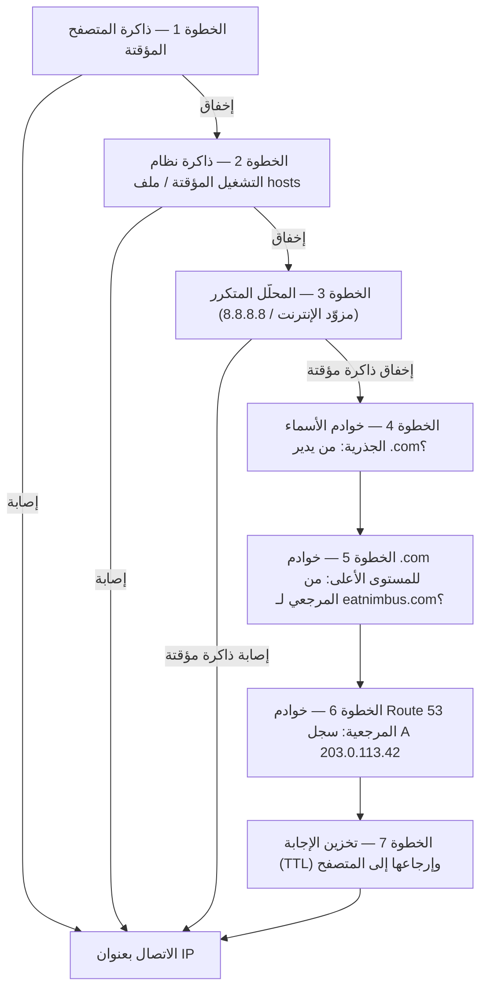

# الفصل الثاني عشر: كيف يجدك الإنترنت

حدّثت Maya `nimbus-alb-123456789.us-west-2.elb.amazonaws.com` في متصفحها مرة أخرى، ثم استندت إلى الخلف ونظرت إلى السقف. تحمّلت الصفحة. عمل التطبيق. لكن في كل مرة تشارك فيها الرابط مع شريك مطعم، شعرت بإحراج صغير لم تستطع تماماً تسميته.

كان عنوان URL ذاك أثراً تقنياً، لا منتجاً.

---

*كانت إعادة تصميم الشبكة من الفصل الماضي قد سارت بشكل جيد. كان كل مورد في مكانه الصحيح — موازنات التحميل في شبكات فرعية عامة، قواعد البيانات مقفلة في خاصة. كانت البنية التحتية آمنة ومُجزّأة بشكل صحيح. لكن مع استعداد Nimbus لأول إطلاق عام، ظهرت مشكلة جديدة: عنوان URL لموازن التحميل الذي عيّنته AWS تلقائياً كان يبدو كمعرّف نظام، لا كمنتج يثق به الناس. احتاجوا إلى اسم نطاق حقيقي. واحتاجوا إلى فهم ما يحدث بين لحظة كتابة أحدهم `eatnimbus.com` ولحظة ظهور الصفحة.*

---

كانت Nimbus تعمل. كان لموازن التحميل عنوان IP عام. كانت لنسخ EC2 عنوان IP خاص. كانت قواعد البيانات مقفلة في شبكات فرعية خاصة. أومأت Priya بالرضا على مخطط الشبكة.

نظر Tom إلى عنوان URL لموازن التحميل: `nimbus-alb-123456789.us-west-2.elb.amazonaws.com`.

سأل: "هذا ما يكتبه العملاء في متصفحاتهم؟"

قالت Maya: "هذا ما تُعيّنه AWS تلقائياً."

"لن أضع هذا على بطاقة عمل."

"أنا أيضاً."

كانوا بحاجة إلى اسم نطاق. اشتروا `eatnimbus.com` من مُسجّل نطاقات. والآن يحتاجون إلى ربط هذا الاسم ببنيتهم التحتية على AWS.

سأل Leo: "كيف يعرف الإنترنت أن `eatnimbus.com` يعني موازن التحميل في us-west-2؟"

سؤال جيد يا Leo.

**تشبيه دليل الهاتف**

قبل الهواتف الذكية، كان لكل مدينة دليل هاتف. إذا أردت التواصل مع "مطعم ماريو للبيتزا"، لم تحفظ رقم هاتفه — بحثت عن الاسم، وحصلت على الرقم، واتصلت.

للإنترنت دليل هاتفه الخاص: **نظام أسماء النطاقات (DNS)**.

DNS يترجم الأسماء المقروءة للإنسان (مثل `eatnimbus.com`) إلى عناوين IP مقروءة للآلة (مثل `203.0.113.42`). في كل مرة تزور فيها موقعاً ويباً، يبحث حاسوبك بصمت عن اسم النطاق في DNS ويحصل على عنوان IP للاتصال به.

إذا غيّرت عنوان IP لخادمك، ستُحدّث سجل DNS — كتغيير رقمك في دليل الهاتف — وسيجدك الإنترنت في موقعك الجديد.

**رحلة تحليل DNS الكاملة**

سأل Leo: "لكن *كيف* يعمل البحث فعلاً؟ خطوة بخطوة مثلاً. متصفحي يعرف الاسم `eatnimbus.com`. ماذا يحدث بعد ذلك؟"

معظم الوثائق تمر على هذا سريعاً. إنه يهم.

حين يحتاج متصفحك إلى تحليل `eatnimbus.com`، إليك كل قفزة، بالترتيب:

**الخطوة 1 — ذاكرة المتصفح المؤقتة**: يتحقق المتصفح مما إذا كان قد حلّ هذا الاسم مؤخراً. إذا نعم، يستخدم عنوان IP المخزّن. إذا لا، يواصل.

**الخطوة 2 — ذاكرة نظام التشغيل المؤقتة / المحلّل المحلي**: يتحقق نظام تشغيلك من ذاكرة DNS المؤقتة الخاصة به وملف `hosts` المحلي. إذا وُجد، انتهى. إذا لا، يُحوّل إلى محلّل DNS المُعدّ لديك — عادةً محلّل مزوّد خدمة الإنترنت أو محلّل عام مثل 8.8.8.8.

**الخطوة 3 — المحلّل المتكرر**: المحلّل المتكرر (مزوّد خدمة الإنترنت لديك أو 8.8.8.8 من Google) هو حصان العمل. له ذاكرة مؤقتة أيضاً. إذا عرف الإجابة، يُرجعها فوراً. إذا لا، يبدأ سلسلة التحليل الفعلية.

**الخطوة 4 — خوادم الأسماء الجذرية**: يتصل المحلّل المتكرر بأحد عناقيد خوادم الأسماء الجذرية الثلاثة عشر (المنشورة حول العالم). خادم الجذر لا يعرف أين `eatnimbus.com`. لكنه يعرف من يدير نطاقات `.com` — خوادم نطاق `.com` المستوى الأعلى. يُرجع عنوانها.

**الخطوة 5 — خوادم أسماء نطاق المستوى الأعلى (TLD)**: يتصل المحلّل المتكرر بخوادم `.com` للمستوى الأعلى. خوادم المستوى الأعلى لا تعرف أيضاً أين `eatnimbus.com`. لكنها تعرف أي خوادم أسماء مرجعية لـ `eatnimbus.com` — الخوادم التي تحمل فعلاً سجلات DNS. تُرجع تلك العناوين.

**الخطوة 6 — خوادم الأسماء المرجعية**: يتصل المحلّل المتكرر بخوادم أسماء Route 53 — خوادم الأسماء المرجعية لـ `eatnimbus.com`. لدى Route 53 السجلات الفعلية. تُرجع سجل A: `eatnimbus.com → 203.0.113.42`. هذه الإجابة مرجعية — إنها الإجابة الحقيقية، لا مخزّنة مؤقتاً.

**الخطوة 7 — تخزين الاستجابة وإرجاعها**: يخزّن المحلّل المتكرر الإجابة مؤقتاً لمدة TTL (مدة الصلاحية) على السجل. يُرجع عنوان IP إلى متصفحك. يخزّنه متصفحك. ويتصل متصفحك.



قال Tom: "هذه سبع قفزات لمجرد إيجاد عنوان IP."

قالت Priya: "عادةً دون 100 مللي ثانية إجمالاً. الخطوات من 3 إلى 6 مخزّنة مؤقتاً بقوة على كل مستوى. للنطاقات الشائعة، الخطوتان 4 و5 — بحث الجذر والمستوى الأعلى — كثيراً ما تُتخطّيان تماماً لأن المحلّل المتكرر لديه تلك الخوادم مخزّنة مؤقتاً أصلاً. السلسلة بأكملها تعمل عادةً في 20–40 مللي ثانية."

أضاف Leo: "وبعد البحث الأول، ذاكرة المتصفح المؤقتة تعني أن الطلبات اللاحقة تتخطّى كل ذلك."

"صحيح. DNS يبدو فورياً لأن معظم عمليات البحث إصابات ذاكرة مؤقتة. السلسلة الكاملة تعمل فقط حين يكون السجل جديداً أو انتهت مدة صلاحيته."

**التعرّف على Route 53**

Amazon Route 53 هي خدمة DNS المُدارة من AWS. سُمّيت Route 53 لأن المنفذ 53 هو منفذ DNS القياسي. (أحياناً تُسمّي AWS الأشياء بشكل مباشر.)

تؤدي Route 53 عدة وظائف:

**تسجيل النطاقات**: يمكنك شراء أسماء النطاقات مباشرةً من خلال Route 53.

**استضافة DNS (المناطق المستضافة)**: تُنشئ *منطقة مستضافة* لنطاقك، وتُدير Route 53 سجلات DNS التي تُخبر العالم بمكان وجودك.

**فحص الصحة**: يمكن لـ Route 53 مراقبة نقاط نهايتك وتوجيه الزيارات بعيداً عن غير الصحية منها.

**سياسات توجيه الزيارات**: تدعم Route 53 استراتيجيات توجيه متعددة تتجاوز DNS البسيط — موزون، قائم على زمن الاستجابة، بحسب الموقع الجغرافي، تحوّل عند الفشل.

**سجلات DNS: إدخالات دليل الهاتف**

سجل DNS يُعيّن اسماً إلى وجهة. الأنواع الأكثر شيوعاً:

**سجل A**: يُعيّن اسماً إلى عنوان IPv4.
`eatnimbus.com → 203.0.113.42`

**سجل AAAA**: يُعيّن اسماً إلى عنوان IPv6.

**سجل CNAME**: يُعيّن اسماً إلى اسم آخر (اسم مستعار).
`www.eatnimbus.com → eatnimbus.com`

**سجل MX**: يُحدد الخوادم التي تتعامل مع البريد الإلكتروني للنطاق.

**سجل TXT**: يخزّن نصاً عشوائياً. يُستخدم شائعاً للتحقق من النطاق (إثبات ملكيتك للنطاق) ومصادقة البريد الإلكتروني (SPF، DKIM).

بالنسبة لـ Nimbus، الإعداد الرئيسي:

- `eatnimbus.com` ← سجل Alias يُشير إلى موازن التحميل
- `www.eatnimbus.com` ← CNAME يُشير إلى `eatnimbus.com`
- `api.eatnimbus.com` ← سجل Alias يُشير إلى موازن التحميل لـ API

قال Tom: "انتظر. عنوان IP لموازن التحميل يمكن أن يتغير. قالت AWS ذلك في الوثائق."

ملاحظة جيدة يا Tom.

**سجلات Alias: حل AWS لعناوين IP الديناميكية**

لموازنات التحميل وتوزيعات CloudFront ومواقع S3 أسماء DNS، وليس عناوين IP ثابتة. يمكن أن تتغير IPs الأساسية.

إذا أنشأت CNAME يُشير إلى اسم DNS لموازن التحميل، يعمل ذلك — لكن لا يمكنك استخدام CNAMEs للنطاقات الجذر (`eatnimbus.com` بدون `www`) بسبب معايير DNS.

تحلّ Route 53 هذا بـ **سجلات Alias** — امتداد خاص بـ AWS لـ DNS. يُعيّن سجل Alias اسماً مباشرةً إلى مورد AWS (موازن تحميل، توزيع CloudFront، موقع S3)، وتتعامل Route 53 مع التحليل الديناميكي لعنوان IP تلقائياً. يمكن استخدام سجلات Alias على مستوى النطاق الجذر. وعلى خلاف استعلامات DNS العادية للخدمات الخارجية، استعلامات سجل Alias لموارد AWS مجانية.

أكد Leo: "إذن نستخدم سجل Alias لـ `eatnimbus.com` يُشير إلى موازن التحميل."

أضافت Priya: "وRoute 53 تتعامل مع أي عنوان IP يستخدمه موازن التحميل في أي لحظة."

قال Tom بفائق الاهتمام فجأةً: "مجاناً." فتح صفحة أسعار Route 53. "وبقية الأمر؟"

قال Leo: "خمسون سنتاً لكل منطقة مستضافة. بالإضافة إلى نحو أربعين سنتاً لكل مليون استعلام DNS. لحركة زياراتنا الآن، ربما أقل من دولارين شهرياً."

أغلق Tom صفحة الأسعار راضياً.

**سياسات التوجيه: أكثر من مجرد "أين هو؟"**

هنا تصبح Route 53 مثيرة. DNS ليس مجرد خدمة بحث — يمكن أن يكون أداة إدارة زيارات.

**التوجيه البسيط**: سجل واحد، وجهة واحدة. DNS القياسي.

**التوجيه الموزون**: توزيع الزيارات بين وجهات متعددة بحسب الأوزان. أرسل 90% إلى الخادم الجديد، و10% إلى القديم أثناء الانتقال. اضبط الأوزان حتى تطمئن للخادم الجديد، ثم تحوّل إلى 100%.

**التوجيه القائم على زمن الاستجابة**: وجّه المستخدمين إلى منطقة AWS ذات أقل زمن استجابة لهم. مستخدم في سياتل يُوجَّه إلى `us-west-2`. مستخدم في طوكيو يُوجَّه إلى `ap-northeast-1`. نفس اسم النطاق، وجهات مختلفة.

**التوجيه الجغرافي**: وجّه بحسب الموقع الجغرافي للمستخدم. جميع المستخدمين الأوروبيين يذهبون إلى `eu-west-1`. جميع المستخدمين في أمريكا الشمالية يذهبون إلى `us-east-1`. مفيد لسيادة البيانات (الإبقاء على بيانات المستخدمين الأوروبيين في مناطق أوروبية) أو تخصيص المحتوى (اللغة، العملة). تستخدم قرارات التوجيه حدوداً صارمة — المستخدم في بلد، أو قارة، أو ولاية أمريكية، وإلى هناك يذهب.

**التوجيه بالقرب الجغرافي**: يوجّه الزيارات بناءً على الموقع الجغرافي للمستخدمين *و*يتيح لك تعديل تلك القرارات بقيمة **انحياز (bias)**. الانحياز الإيجابي يوسّع المنطقة الجغرافية التي توجَّه إلى مورد — يجتذب زيارات أكثر. الانحياز السلبي يقلّصها. على خلاف التوجيه الجغرافي الذي يستخدم حدود بلدان وقارات صارمة، التوجيه بالقرب مستمر: قيمة انحياز صغيرة يمكن أن تنقل الزيارات تدريجياً من منطقة إلى أخرى دون إعادة رسم أي خطوط ثابتة.

السيناريو الذي يميّز الاثنين: إذا كانت شركة تنتقل تدريجياً من `us-east-1` إلى `us-west-2` وتريد نقل الزيارات تدريجياً غرباً — لا قلب مفتاح، بل ضبط على مدى الوقت — فإن التوجيه بالقرب مع انحياز إيجابي متزايد على نقطة النهاية الغربية هو الأداة الصحيحة. التوجيه الجغرافي إما يوجّه كل مستخدمي الساحل الغربي إلى أوريغون أو لا؛ ليس له مقبض ضبط. منذ يناير 2024، صار التوجيه بالقرب متاحاً كسياسة توجيه عادية مباشرةً على سجلات DNS (وحدة التحكم، API، CLI) — لم يعد يتطلب Route 53 Traffic Flow، وإن ظل متاحاً هناك أيضاً.

**توجيه التحوّل عند الفشل**: عيّن نقطة نهاية أساسية وأخرى ثانوية. إذا فشلت الأساسية في فحص صحة Route 53، تُعاد توجيه الزيارات تلقائياً إلى الثانوية. هذه هي طبقة DNS في الاسترداد من الكوارث.

سألت Maya: "مهلاً — لكن *لماذا* نُعدّ توجيه تحوّل إلى منطقة ثانية إذا كان لدينا أصلاً Multi-AZ؟ أليس من المفترض أن يتعامل Multi-AZ مع الأعطال؟"

سؤال جيد. Multi-AZ يحمي من فشل منطقة توافر واحدة داخل منطقة — إذا تعطّل مركز بيانات واحد، يتولى الاحتياطي في منطقة توافر أخرى. لكن ماذا لو أصبحت منطقة AWS بأكملها غير متاحة؟ أو ماذا لو كان هناك تعطّل خدمة على مستوى المنطقة؟ توجيه التحوّل في DNS يعمل على مستوى مختلف: يوجّه الزيارات بعيداً عن منطقة بأكملها حين يفشل فحص صحة تلك المنطقة. Multi-AZ هو مرونة داخل المنطقة. تحوّل DNS هو مرونة بين المناطق.

**توجيه إجابات متعددة القيم**: إرجاع ما يصل إلى ثمانية عناوين IP صحية لاستعلام، مما يسمح للعميل بالاختيار. بديل بسيط لموازن التحميل لتوزيع الزيارات عبر خوادم متعددة.

قالت Maya: "إذن Route 53 ليست مجرد دليل هاتف. إنها دليل هاتف ذكي يمكنه توجيه المكالمات بحسب مكان الاتصال."

أضافت Priya: "وقطع الاتصال إذا كان الرقم غير صحي."

---

**التوجيه بزمن الاستجابة مع فحوصات الصحة: تجربة فكرية**

رسمت Priya سيناريو على اللوح الأبيض. افترض أن قاعدة مستخدمي Nimbus على الساحل الشرقي استمرت في النمو، وأن الفريق أقام يوماً ما حزمة خفيفة في `us-east-1` (شمال فرجينيا) — ليست إعداداً كاملاً متعدد المناطق نشطاً-نشطاً، فذلك سيكون باهظاً ومعقداً، بل موازن تحميل ومجموعة نسخ EC2 للقراءة فقط تخدم محتوى ثابتاً وصفحات تصفح. الطلبات لا تزال تذهب غرباً إلى قاعدة البيانات الأساسية في `us-west-2`. زيارات التصفح — التي تمثّل سبعين بالمئة من الطلبات — يمكن خدمتها من أي ساحل.

سيبدو ضبط Route 53 لنقطة نهاية التصفح هكذا:

```
browse.eatnimbus.com
  → سجل زمن استجابة: us-east-1 ALB (مع فحص صحة، معرّف المجموعة "east")
  → سجل زمن استجابة: us-west-2 ALB (مع فحص صحة، معرّف المجموعة "west")
```

(لاحظ أن السجل هو *اسم مضيف*، `browse.eatnimbus.com` — DNS يوجّه الأسماء، لا مسارات URL أبداً. التوجيه القائم على المسار مثل `/browse` هو عمل موازن التحميل، لا Route 53.)

مع التوجيه بزمن الاستجابة، مستخدم في سياتل سيُحلَّل إلى نقطة نهاية `us-west-2`. ومستخدم في بوسطن سيذهب إلى `us-east-1`. تقيس Route 53 زمن الاستجابة من بنيتها التحتية إلى كل منطقة باستمرار وتختار الأسرع لكل مستخدم.

سأل Tom: "لكن ماذا لو كان للمنطقة الغربية مشكلة؟ مستخدمو التصفح في سياتل سيعلقون."

قالت Priya: "لهذا توجد فحوصات الصحة. كل سجل زمن استجابة يحصل على فحص صحة على موازن التحميل الخاص به. إذا فشل فحص صحة `us-west-2` ثلاثة فحوصات متتالية، تتوقف Route 53 عن إرجاع ذلك السجل — حتى للمستخدمين الذين تكون أوريغون عادةً أسرع لهم. مستخدمو سياتل يُوجَّهون شرقاً حتى تتعافى أوريغون."

قالت Maya: "إذن التوجيه بزمن الاستجابة يحدد أي منطقة مُفضّلة عادةً، وفحوصات الصحة تتجاوز ذلك التفضيل إذا تعطّلت المنطقة المُفضّلة؟"

"بالضبط. سياسة زمن الاستجابة تختار الفائز في الظروف العادية. فحوصات الصحة تزيل فائزاً توقّف عن العمل."

فكّر Leo في سيناريو الفشل. "وTTL على تلك السجلات؟"

قالت Priya: "ستون ثانية. ثلاثة فحوصات فاشلة على فترات ثلاثين ثانية لتفعيله — حتى تسعين ثانية لاكتشاف الفشل — ثم حتى ستين ثانية لمحللات DNS لالتقاط التغيير."

قال Leo: "دقيقتان ونصف في أسوأ حالة."

"ولهذا تخفض TTL قبل أن تهتم به، لا بعده."

هذه التركيبة — التوجيه بزمن الاستجابة مع فحوصات صحة على كل سجل — من أقوى تكوينات Route 53 للنشر متعدد المناطق. المستخدمون يذهبون دائماً إلى أسرع منطقة صحية. والنظام يشفي نفسه حين يكون لمنطقة مشاكل. وكل ذلك DNS: لا بنية تحتية إضافية، لا خوادم وكيلة، لا موازنات تحميل بين المناطق.

---

**حادثة فشل فحص الصحة**

أعطت بيئة التجهيز في Nimbus عرضاً عرضياً لتوجيه التحوّل.

كانوا قد ضبطوا فحوصات صحة Route 53 على موازن تحميل التجهيز كاختبار — فحص نقطة نهاية `/health` كل 30 ثانية. بعد ظهر يوم جمعة، دفع Leo نشراً إلى التجهيز كان به خلل: بدأت نقطة نهاية الصحة تُرجع أخطاء 500. اجتاز اختباراته المحلية لكنه انكسر على الخادم.

سجّلت Route 53 الأعطال. بعد ثلاثة فحوصات فاشلة متتالية، علّمت نقطة النهاية على أنها غير صحية. فُعّل سجل التحوّل، فوجّه زيارات التجهيز إلى صفحة احتياطية للقراءة فقط تقول "صيانة جارية."

كان أول تنبيه لـ Leo رسالة Slack من مهندس ضمان جودة: "التجهيز يُظهر صفحة الصيانة."

تحقّق Leo من النشر. كانت أخطاء 500 واضحة في السجلات. تراجع عن النشر. خلال 90 ثانية من إرجاع نقطة نهاية الصحة لرموز 200، أعادت Route 53 تقييم الفحص، ورأت ثلاثة نجاحات متتالية، وأعادت الزيارات إلى موازن تحميل التجهيز. اختفت صفحة الصيانة.

إجمالي الوقت على صفحة الصيانة: سبع دقائق.

قالت Priya: "كان ذلك النظام يعمل بشكل صحيح."

قال Leo: "أعرف. الجزء المخيف هو التفكير فيما كان سيحدث دون فحص الصحة. كانت أخطاء 500 ستذهب إلى مستخدمين حقيقيين."

"في الإنتاج، كان فحص الصحة سيتحوّل إلى المنطقة الثانوية أو صفحة الخطأ الثابتة. كان المستخدمون سيرون تجربة مُصانة بدلاً من أخطاء."

سألت Maya: "كم يستغرق التحوّل فعلاً؟ من حين يفشل فحص الصحة إلى حين تبدأ DNS في التوجيه بشكل مختلف؟"

"فترة فحص الصحة 30 ثانية افتراضياً. ثلاثة أعطال متتالية لتفعيل التحوّل. ذلك حتى 90 ثانية لاكتشاف المشكلة. ثم TTL لـ DNS — إذا كانت 60 ثانية، الانتشار دقيقة أخرى."

"إذن في أسوأ حالة، نحو ثلاث دقائق؟"

"نحو ذلك. ولهذا تريد TTL منخفضة على السجلات الحرجة، وفترة فحص الصحة قصيرة بقدر ما تسمح ميزانيتك."

---

**فحوصات الصحة: التوجيه حول الفشل**

قالت Priya: "وماذا لو حاول أحد اختراقه؟ DNS عام. يستطيع أي أحد البحث عن أين يُشير `eatnimbus.com`. هذا يعني أن المهاجم يعرف بالضبط أي عنوان IP يستهدف."

قال Leo: "ذلك صحيح. لكن عنوان IP الذي يجدونه هو عنوان موازن التحميل. ALB هو الشيء الوحيد بعنوان عام. كل شيء خلفه — EC2، RDS، ElastiCache — في شبكات فرعية خاصة. DNS يُخبرهم بالباب الأمامي. لا يُخبرهم بما خلفه."

يمكن لـ Route 53 مراقبة نقاط نهايتك بفحوصات الصحة. إذا فشلت نقطة نهاية، يمكن لـ Route 53:

- إزالتها من استجابات DNS (توقف إرسال الزيارات إليها)
- تشغيل تحوّل إلى نقطة نهاية احتياطية
- إرسال تنبيه عبر CloudWatch

فحوصات الصحة هي الرابط بين توجيه DNS وصحة التطبيق الفعلية. في تكوين التحوّل: تراقب Route 53 نقطة النهاية الأساسية كل 30 ثانية. إذا فشلت ثلاثة فحوصات متتالية، تبدأ Route 53 في إرجاع عنوان نقطة النهاية الثانوية. لا أحد من هذه الأرقام ثابت: 30 ثانية هي الفترة القياسية (خيار "سريع" مدفوع يفحص كل 10 ثوانٍ)، وعتبة الفشل افتراضها 3 فحوصات متتالية لكنها قابلة للضبط من 1 إلى 10.

هذا ليس فورياً — لـ DNS وقت انتشار. بمجرد تغيير Route 53 لسجل DNS، تحتاج محللات DNS حول العالم إلى التقاط التغيير، وقد يستغرق ذلك ثوانٍ إلى دقائق بحسب إعدادات TTL.

**TTL: ذاكرة DNS المؤقتة**

تُخزَّن استجابات DNS مؤقتاً على مستويات متعددة — في جهاز التوجيه الخاص بك، عند مزوّد خدمة الإنترنت، في متصفحك. **مدة الصلاحية (TTL)** في سجل DNS تُخبر الذواكر المؤقتة كم من الوقت تتذكر الإجابة قبل التحقق مجدداً.

مدة صلاحية عالية (ساعة أو أكثر): استعلامات DNS أقل، حمل أقل على Route 53، لكن التغييرات تستغرق وقتاً أطول للانتشار.

مدة صلاحية منخفضة (60 ثانية أو أقل): التغييرات تنتشر بسرعة، لكن هناك حاجة لاستعلامات DNS أكثر.

قبل الانتقال المخطط (تحديث DNS للإشارة إلى خادم جديد)، قلّل مدة الصلاحية إلى 60 ثانية قبل يوم من الانتقال. ثم حين تُجري التغيير، ينتشر في حوالي دقيقة. بعد الانتقال، ارفعها مجدداً إلى القيمة العادية.

"لقد نشرتها بالفعل — أوه." كان Leo قد حدّث سجل DNS قبل خفض TTL. أدرك خطأه وبدأ يَعُدّ: كانت TTL القديمة ساعة واحدة. بعض المستخدمين سيحصلون على الخادم القديم للستين دقيقة القادمة.

قال Leo ببطء: "إذا خفضناها فقط أثناء الانتقال وليس قبله، فإن TTL القديمة تعني أن بعض المستخدمين سيرون الخادم القديم لساعة."

قالت Priya: "بالضبط. تتطلب انتقالات DNS التخطيط قبل الانتقال، وليس فقط أثناءه."

قد تتساءل: إذا ضُبطت TTL على ساعة واحدة، فهل يعني ذلك أن كل مستخدم سينتظر ساعة كاملة بعد تغيير DNS قبل رؤية الخادم الجديد؟ ليس بالضبط. TTL تعني أن المحللات لن تُعيد التحقق حتى تنتهي TTL. إذا خزّن محلّل DNS لمستخدم القيمة القديمة قبل 55 دقيقة بـ TTL مدتها ساعة، فسيحصل على القيمة الجديدة في 5 دقائق. وإذا خزّنها قبل 5 دقائق، سينتظر 55 دقيقة. في المتوسط، يرى المستخدمون التغيير خلال نصف مدة TTL. ولهذا فإن خفض TTL مسبقاً مهم جداً: يقلّص نافذة الانتشار في أسوأ حالة قبل حدوث التغيير.

---

**المناطق المستضافة الخاصة: DNS الداخلي**

طرحت Priya متطلباً جديداً بعد أسبوعين من تشغيل النطاق العام.

قالت: "نسخ EC2 لدينا تحتاج إلى الوصول إلى قاعدة البيانات. حالياً تستخدم اسم DNS لنقطة نهاية RDS — `nimbus-prod.abc123.us-west-2.rds.amazonaws.com`. يعمل ذلك، لكنه اسم DNS عام. إذا أردنا يوماً تغيير ضبط قاعدة بياناتنا، تحتاج كل ملفات ضبط التطبيق إلى التحديث."

قال Leo: "يمكننا استخدام اسم DNS خاص. مثل `db.nimbus.internal`. شيء تستخدمه خدماتنا داخلياً يُعيّن لأي نقطة نهاية قاعدة بيانات حالية."

"بالضبط. المناطق المستضافة الخاصة في Route 53."

**المنطقة المستضافة الخاصة** هي نطاق DNS يُحلَّل فقط داخل VPC. استعلامات DNS الخارجية لـ `nimbus.internal` لا تحصل على استجابة. لكن من داخل VPC، يُحلَّل `db.nimbus.internal` إلى نقطة نهاية RDS.

أعدّوها:

- منطقة مستضافة خاصة: `nimbus.internal`
- سجل CNAME: `db.nimbus.internal → nimbus-prod.abc123.us-west-2.rds.amazonaws.com`
- سجل CNAME: `cache.nimbus.internal → nimbus-cache.abc123.usw2.cache.amazonaws.com`
- سجل A: `api.nimbus.internal → 10.0.10.5` (عنوان IP داخلي لـ EC2 — سجلات A تُعيّن الأسماء إلى عناوين IP؛ CNAMEs تُعيّن الأسماء إلى أسماء أخرى. مقبول هنا لأن هذه النسخة تحتفظ بعنوان IP خاص ثابت؛ لأي شيء خلف التوسع التلقائي ستُشير بدلاً من ذلك إلى موازن تحميل)

الآن صار ضبط التطبيق يقرأ:

```
DATABASE_HOST=db.nimbus.internal
CACHE_HOST=cache.nimbus.internal
```

حين انتقلوا إلى نسخة RDS جديدة، حدّثوا سجل DNS واحداً. لا حاجة لنشر تطبيق.

قالت Priya: "هذا أيضاً سبب أهمية DNS الخاص أثناء ترحيل قاعدة بيانات. تُحدّث `db.nimbus.internal` للإشارة إلى نقطة النهاية الجديدة. تتحوّل الزيارات. تبقى نقطة النهاية القديمة متاحة أثناء نافذة TTL. لا تغييرات في ضبط التطبيق."

**قصة تصحيح DNS الداخلي**

بعد ثلاثة أسابيع، نشر Leo خدمة جديدة — عامل خلفية — ولم تستطع الوصول إلى قاعدة البيانات. كان العامل في نفس VPC، ونفس الشبكة الفرعية الخاصة لخوادم API. استطاعت خوادم API الوصول إلى قاعدة البيانات. لم يستطع العامل.

تحقّق من مجموعات الأمان. كان لمجموعة أمان العامل قاعدة خروج لـ PostgreSQL. وكان لمجموعة أمان قاعدة البيانات قاعدة دخول من مجموعة أمان العامل. بدا كل شيء صحيحاً.

شغّل `nslookup db.nimbus.internal` من نسخة العامل.

لا استجابة.

قال لـ Priya: "بحث DNS يفشل."

نظرت إلى ضبط VPC لنسخة العامل. "في أي VPC العامل فعلاً؟ المناطق المستضافة الخاصة مرتبطة بـ VPCs — إذا لم تكن النسخة في VPC مرتبطة، فإن المنطقة ببساطة غير موجودة بالنسبة لها."

"إنه في VPC الرئيسية. مثل كل شيء آخر."

"حقاً؟"

يجب ربط المناطق المستضافة الخاصة صراحةً بكل VPC تخدمها — الربط لكل VPC، لا لكل شبكة فرعية أبداً. كانت Priya قد ربطت VPC الرئيسية حين أنشأت المنطقة. لكن Leo كان قد نشر العامل عن غير قصد في VPC اختبار أنشأها لتجربة مختلفة. VPC مختلفة. غير مرتبطة بالمنطقة المستضافة الخاصة.

قالت Priya: "العامل في VPC الخاطئة."

"لقد نشرتها بالفعل — أوه." نقل Leo العامل إلى VPC الصحيحة. حُلّ DNS. اتصل العامل بقاعدة البيانات.

قال Leo وهو يدوّن ملاحظة: "VPC واحدة. ما لم يكن لدينا سبب لأكثر من واحدة."

---

**DNSSEC: مصادقة استجابات DNS**

سألت Priya: "هل فكّرنا في انتحال DNS؟ ماذا لو اعترض أحدهم استعلام DNS الخاص بنا وأرجع عنوان IP مزيفاً؟ متصفحات مستخدمينا ستتصل بخادم المهاجم بدلاً من خادمنا."

تحلّ **DNSSEC (امتدادات أمان DNS)** هذا بتوقيع سجلات DNS تشفيرياً. حين تتضمن استجابة DNS توقيع DNSSEC، يستطيع المحلّل التحقق من أن الاستجابة جاءت من خادم الأسماء المرجعي ولم تُعبَث بها.

تدعم Route 53 توقيع DNSSEC للمناطق المستضافة العامة. تتضمن العملية:

1. تفعيل DNSSEC على المنطقة المستضافة في Route 53
2. تُنشئ Route 53 مفتاح توقيع المفتاح (KSK) المخزّن في KMS
3. توقّع Route 53 كل السجلات بمفتاح توقيع المنطقة
4. تضيف سجل DS (موقّع التفويض) عند مُسجّل النطاق الأب (نطاق .com للمستوى الأعلى)
5. المحللات التي تدعم DNSSEC تستطيع الآن التحقق من أصالة الاستجابات

سأل Leo: "كم انتحال DNS شائع؟"

قالت Priya: "على الإنترنت العام، نادر لكن ممكن. معظم محللات مزوّدي خدمة الإنترنت تدعم التحقق من DNSSEC اليوم. تفعيل DNSSEC لا يكلّف شيئاً ويضيف طبقة أصالة ذات معنى."

سأل Tom: "كم يكلّف هذا شهرياً؟"

قالت Priya: "تفعيل توقيع DNSSEC نفسه مجاني في Route 53. التكلفة الحقيقية الوحيدة هي مفتاح KMS الذي يحمل مفتاح توقيع المفتاح: دولار واحد شهرياً، بالإضافة إلى استدعاءات API لـ KMS — ويمكن مشاركة مفتاح واحد عبر مناطق مستضافة متعددة. الحماية من هجمات اختطاف DNS مجانية فعلياً عند نطاقنا."

فعّله Tom قبل الغداء.

---

**Route 53 Resolver: DNS الهجين**

حين ربطت Nimbus في النهاية VPC الخاصة بها على AWS بشبكة التطوير المحلية عبر VPN، ظهرت مشكلة جديدة: احتاجت الخوادم المحلية إلى تحليل أسماء DNS الخاصة بـ AWS (مثل `db.nimbus.internal`)، واحتاجت موارد AWS إلى تحليل أسماء المضيفين المحلية (مثل `jenkins.corp.nimbus.local`).

تحليل DNS لا يعبر حدود الشبكة افتراضياً. موارد AWS تحلّ DNS باستخدام Route 53 Resolver (المدمج في كل VPC). الخوادم المحلية تستخدم خوادم DNS الخاصة بها. لا أحد يستطيع رؤية سجلات الآخر.

تسدّ **نقاط نهاية Route 53 Resolver** هذه الفجوة:

**نقاط النهاية الواردة**: يمكن لخوادم DNS المحلية تحويل استعلامات مناطق DNS المستضافة على AWS إلى عنوان IP لنقطة نهاية واردة في VPC. يتعامل Route 53 Resolver مع الاستعلام ويُرجع النتيجة.

**نقاط النهاية الصادرة**: حين تحتاج نسخ EC2 إلى تحليل أسماء المضيفين المحلية، يحوّل Resolver تلك الاستعلامات إلى خوادم DNS المحلية عبر نقطة النهاية الصادرة.

قالت Maya: "إذن إنها مثل خدمة ترجمة. DNS الخاص بـ AWS وDNS المحلي لا يتحدثان مباشرةً. نقاط نهاية Resolver تعمل كوسطاء."

"بالضبط. خوادمك المحلية تستطيع الآن تحليل `db.nimbus.internal`. ونسخ EC2 تستطيع تحليل `jenkins.corp.nimbus.local`. كلا الجانبين يرى أسماء DNS من كلا العالمين."

بالنسبة لـ Nimbus، صار هذا ذا صلة حين أراد فريق التطوير تشغيل اختبارات تكامل من مكتبهم ضد بيئة تجهيز في AWS. دون نقاط نهاية Resolver، كانوا سيحرّرون ملفات hosts يدوياً. ومعها، عمل DNS الداخلي ببساطة عبر VPN.

معمارية نقاط نهاية Resolver:

- **نقطة النهاية الواردة**: واجهتا شبكة مرنتان (ENIs) تُنشآن في منطقتي توافر مختلفتين في VPC. كل واحدة تحصل على عنوان IP خاص. تُعدّ خادم DNS المحلي لتحويل استعلامات مناطقك المستضافة على AWS إلى هذين العنوانين. الزيارات تسافر عبر VPN أو Direct Connect.
- **نقطة النهاية الصادرة**: واجهتا ENIs في منطقتي توافر. تُنشئ قواعد تحويل: "استعلامات `corp.nimbus.local` تذهب إلى عناوين IP خوادم DNS المحلية هذه." نسخ EC2 تستخدم Resolver تلقائياً، الذي يستشير قواعد التحويل لديك ويُرسل الاستعلام محلياً.

سأل Leo: "لماذا واجهتا ENIs لكل نقطة نهاية؟"

قالت Priya: "التوافر العالي. إذا فقدت منطقة توافر اتصال الشبكة، لا يزال عنوان IP نقطة النهاية الأخرى يعمل. نفس مبدأ بوابات NAT."

سأل Tom: "كم يكلّف هذا شهرياً؟"

نقاط نهاية Resolver تكلّف نحو 0.125 دولار للساعة **لكل واجهة شبكة مرنة**، وكل نقطة نهاية تتطلب واجهتي ENIs على الأقل للتوافر — لذا الحد الأدنى الواقعي نحو 180 دولاراً شهرياً لكل نقطة نهاية، بالإضافة إلى 0.40 دولار لكل مليون استعلام DNS. لفريق يستخدم DNS الهجين لتحليل الأسماء الداخلية، التكلفة متواضعة — وتُلغي الحاجة إلى صيانة ملفات hosts عبر أجهزة مطوّرين متعددة وأنظمة CI/CD.

اقترح Leo: "يمكننا فقط وضع أسماء المضيفين في ملفات hosts."

قالت Priya: "على كل جهاز مطوّر، وكل مشغّل CI، وكل انضمام جديد. وفي كل مرة يتغير فيها أي شيء."

قال Leo: "نقطة النهاية تستحق."

"تستحق."

## نقاط القوة والقيود

**Route 53 هي الخيار الصحيح لـ**: تسجيل وإدارة أسماء النطاقات بالكامل داخل AWS؛ توجيه الزيارات بحسب زمن الاستجابة أو الموقع الجغرافي أو التوزيع الموزون عبر نقاط نهايات متعددة؛ التحوّل القائم على فحص الصحة بين المناطق أو بين نقطة نهاية أساسية ونقطة استرداد من الكوارث؛ دمج DNS مع خدمات AWS الأخرى من خلال سجلات Alias؛ المناطق المستضافة الخاصة لاكتشاف الخدمات الداخلية.

**حين لا تكون Route 53 ما تحتاجه**: Route 53 خدمة DNS، وليست موازن تحميل. إذا احتجت توزيع الزيارات بين خوادم أو حاويات متعددة داخل منطقة، استخدم Application Load Balancer — لا تستطيع Route 53 إجراء توزيع الجولات الموزونة على مستوى الاتصال كما يفعل موازن التحميل. التوجيه القائم على زمن الاستجابة عبر المناطق يضيف تكلفة وتعقيداً تشغيلياً لا يكون منطقياً إلا حين يكون مستخدموك موزّعين عالمياً فعلاً وتهم الميللي ثانية للتحويل. لمعظم تطبيقات المنطقة الواحدة، سجل Alias واحد يُشير إلى ALB هو كل ما تحتاجه من ضبط Route 53.

## الملخص

الانتقال من `nimbus-alb-123456789.us-west-2.elb.amazonaws.com` إلى `eatnimbus.com` بدا شيئاً صغيراً. لم يكن كذلك. DNS هو نظام العناوين الذي يعمل عليه الإنترنت بأكمله، وتمنحك Route 53 أدوات لاستخدام ذلك النظام ليس فقط للبحث، بل لإدارة الزيارات والمرونة.

- **DNS** يترجم أسماء النطاقات إلى عناوين IP — دليل هاتف الإنترنت.
- **Route 53** هي خدمة DNS المُدارة من AWS: تسجيل النطاقات، استضافة DNS، فحوصات الصحة، وسياسات التوجيه.
- **سجلات A** تُعيّن الأسماء إلى عناوين IPv4. **CNAMEs** تُعيّن الأسماء إلى أسماء أخرى. **سجلات Alias** تُعيّن الأسماء إلى موارد AWS (موازنات التحميل، CloudFront، S3).
- استخدم سجلات Alias (وليس CNAMEs) للنطاقات الجذر وللموارد ذات عناوين IP الديناميكية.
- سياسات التوجيه تتجاوز DNS البسيط: **موزون** (تقسيم الزيارات)، **قائم على زمن الاستجابة** (الأداء)، **جغرافي** (سيادة البيانات — حدود بلدان/قارات صارمة)، **بالقرب الجغرافي** (قائم على المسافة مع مقبض انحياز — نقل زيارات تدريجي)، **تحوّل عند الفشل** (الاسترداد من الكوارث).
- **المناطق المستضافة الخاصة** توفّر DNS داخلياً لموارد VPC — تواصل خدمة-إلى-خدمة بالاسم، لا بعنوان IP مُضمَّن.
- **DNSSEC** يوقّع السجلات تشفيرياً، محمياً من انتحال DNS.
- **نقاط نهاية Route 53 Resolver** تسدّ الشبكات الهجينة — DNS الخاص بـ AWS والمحلي يستطيعان تحليل أسماء بعضهما.

## نصائح الاختبار

*SAA-C03 المجال: تصميم معماريات عالية الأداء (المجال الثالث، المهمة 3.4)*

- **Alias مقابل CNAME**: يمكن استخدام سجلات Alias على النطاق الجذر؛ CNAMEs لا. استعلامات Alias لموارد AWS مجانية؛ استعلامات CNAME مدفوعة. حين يسأل الاختبار عن تعيين نطاق جذر إلى موازن تحميل ← سجل Alias.
- **حالات استخدام سياسة التوجيه** (سيناريوهات اختبار شائعة):
  - "نقل الزيارات تدريجياً إلى إصدار جديد" ← التوجيه الموزون
  - "توجيه المستخدمين إلى أقرب منطقة AWS" ← التوجيه القائم على زمن الاستجابة
  - "الإبقاء على بيانات المستخدمين الأوروبيين في المناطق الأوروبية" ← التوجيه الجغرافي
  - "تحوّل DNS تلقائي حين تتعطّل المنطقة الأساسية" ← توجيه التحوّل مع فحوصات الصحة
  - "نقل الزيارات تدريجياً إلى منطقة جديدة" أو "زيادة الزيارات المجتذبة إلى نشرنا الأوروبي" ← التوجيه بالقرب الجغرافي مع انحياز إيجابي
- **التوجيه بالقرب مقابل الجغرافي:** التوجيه الجغرافي يوجّه بحسب بلد/قارة المستخدم بحدود صارمة. التوجيه بالقرب يوجّه بحسب المسافة الجغرافية مع انحياز قابل للضبط — استخدمه حين تحتاج إلى نقل الزيارات تدريجياً إلى منطقة جديدة أو اجتذاب مزيد من المستخدمين إلى نشر محدد. متاح كسياسة توجيه عادية على السجلات منذ يناير 2024 (لم يعد Traffic Flow مطلوباً).
- **فحوصات صحة Route 53**: يمكنها فحص نقاط النهاية HTTP/HTTPS/TCP، ويمكنها تشغيل منبّهات CloudWatch. يستخدمها الاختبار في سيناريوهات الاسترداد من الكوارث.
- **TTL والانتشار**: اعلم أن TTL يتحكم في مدة تخزين محللات DNS للسجل مؤقتاً. TTL قصيرة = تغييرات أسرع. سيناريو الاختبار: "حدّث الفريق DNS لكن المستخدمين لا يزالون يصلون إلى الخادم القديم" ← TTL مرتفع جداً.
- **المناطق المستضافة الخاصة**: يمكن لـ Route 53 إنشاء سجلات DNS تُحلَّل فقط داخل VPC. يستخدم الاختبار هذا لاكتشاف الخدمات الداخلية (مثل `database.internal` يُحلَّل إلى نقطة نهاية RDS خاصة).
- Route 53 **عالمية** — لا تُنشر في منطقة. لا حاجة لاختيار منطقة عند إنشاء مناطق مستضافة.
- **نقاط نهاية Route 53 Resolver**: تُستخدم في السيناريوهات الهجينة حيث يحتاج DNS المحلي وDNS الخاص بـ AWS إلى تحليل أسماء بعضهما. نقطة نهاية واردة للمحلي ← AWS. نقطة نهاية صادرة لـ AWS ← المحلي.

## تمارين

**تمرين 1 — استرجاع**

اشرح الفرق بين سجل CNAME وسجل Alias. متى ستستخدم كل منهما؟

*(تلميح: فكّر في القيود على CNAME في النطاقات الجذر، وسلوك سجلات Alias مع موارد AWS الديناميكية.)*

**تمرين 2 — سيناريو SAA-C03**

*سيناريو*: تُشغّل شركة إعلامية موقعها من منطقتين في AWS: `us-east-1` (أساسية) و`eu-west-1` (ثانوية). يريد الفريق توجيه الزيارات تلقائياً إلى `eu-west-1` إذا أصبحت المنطقة الأساسية غير متاحة. تريد الشركة أيضاً التحقق من أن آلية التحوّل هذه تعمل بشكل صحيح دون إيقاف المنطقة الأساسية فعلياً.

أي ضبط Route 53 يلبي هذه المتطلبات على أفضل وجه؟

A) توجيه موزون بنسبة 100% على `us-east-1` و0% على `eu-west-1`  
B) توجيه قائم على زمن الاستجابة مع فحوصات صحة على كلا نقطتَي النهاية  
C) توجيه تحوّل مع فحص صحة على نقطة النهاية الأساسية وسجل ثانوي يُشير إلى `eu-west-1`  
D) توجيه جغرافي مع أمريكا الشمالية تُشير إلى `us-east-1` وأوروبا تُشير إلى `eu-west-1`

**تلميح 1**: المتطلب هو تحوّل تلقائي حين تتعطّل المنطقة الأساسية. أي سياسة توجيه مُصمَّمة بالضبط لهذا؟

**تلميح 2**: "اختبار دون إيقاف المنطقة الأساسية" — يمكن ضبط فحوصات الصحة يدوياً على "غير صحية" للاختبار.

**تلميح 3**: التوجيه القائم على زمن الاستجابة يُحسّن للسرعة، وليس للتحوّل.

**الإجابة**: C

**الشرح**: توجيه التحوّل مُصمَّم بالضبط لهذه الحالة. السجل الأساسي يُشير إلى `us-east-1` مع فحص صحة. السجل الثانوي يُشير إلى `eu-west-1`. إذا فشل فحص الصحة، تُقدّم Route 53 تلقائياً السجل الثانوي. يمكن إجبار فحوصات الصحة على الفشل للاختبار دون تعطيل المنطقة الأساسية فعلياً.

**لماذا ليس A؟** التوجيه الموزون بنسبة 100%/0% ثابت فعلياً — لا يتحوّل تلقائياً حين تتعطّل المنطقة الأساسية.

**لماذا ليس B؟** سجلات زمن الاستجابة *مع فحوصات الصحة* تتوقف فعلاً عن إرجاع نقطة نهاية غير صحية، لذا B سيصمد أمام انقطاع حقيقي. لكنه يغيّر نمط الزيارات العادي (سيُقسَّم المستخدمون عبر المناطق بحسب زمن الاستجابة، لا أساسي/ثانوي كما هو مطلوب) وليست له طريقة نظيفة لـ *اختبار* التحوّل: سيتعين عليك إفشال فحص صحة الأساسية فعلاً في الإنتاج. توجيه التحوّل يُجسّد النية المذكورة — أساسي معيّن، ثانوي معيّن، قابل للاختبار بإجبار حالة فحص الصحة.

**لماذا ليس D؟** يوجّه التوجيه الجغرافي بحسب موقع المستخدم، وليس بحسب صحة نقطة النهاية. سيظل المستخدمون الأوروبيون على `eu-west-1` حتى لو كانت `us-east-1` صحية، ولن يتحوّل المستخدمون في أمريكا الشمالية إلى `eu-west-1` حتى لو تعطّلت `us-east-1`.

*SAA-C03 المجال: تصميم معماريات عالية الأداء — المهمة 3.4*

**تمرين 3 — تحدي المعمارية** *(اختياري)*

Nimbus تتوسع دولياً. يريدون تحميل `eatnimbus.com` بسرعة للمستخدمين على الساحل الغربي، والساحل الشرقي، وأستراليا. لديهم أيضاً متطلب تنظيمي: يجب معالجة الطلبات التي يضعها المستخدمون الأوروبيون بواسطة خوادم في الاتحاد الأوروبي.

صمّم استراتيجية توجيه Route 53 التي تعالج كلا المتطلبين. أي سياسة توجيه أو مجموعة سياسات ستستخدم؟ ما البنية التحتية في كل منطقة التي ستحتاجها؟

*(لا توجد إجابة صحيحة واحدة. الهدف التدرب على تصميم التوجيه متعدد المناطق.)*

## مشهد ما بعد النهاية

`eatnimbus.com` أصبح مباشراً.

كتبته Maya في متصفحها، وتحمّلت صفحة الطلب في Nimbus. طلبت arepa من مطعم عائلتها، فقط لاختبار سير العملية. مرّ الطلب. استلمه المطبخ.

استلقت على ظهرها.

كان Tom يقرأ سجلات فحص صحة Route 53 بالفعل. "وقت الاستجابة 18 مللي ثانية من فاحصي us-west-2."

سألت Maya: "هل هذا سريع؟"

"لـ DNS؟ نعم. ولمستخدمي سياتل أيضاً — هم عملياً مجاورون لأوريغون."

"لكن لمستخدم في بوسطن؟"

نظر Tom إلى رسم بياني زمن الاستجابة. "حوالي 80 مللي ثانية."

فكّرت Maya في ذلك. "إذا استمر شركاؤنا على الساحل الشرقي في النمو، وخوادمنا في أوريغون..."

قال Leo من عبر الغرفة: "كل طلب يسافر من بوسطن إلى أوريغون وعائداً. سرعة الضوء. لا يمكنك هزيمة قوانين الفيزياء."

"إذن نحتاج خوادم أقرب إلى بوسطن."

"أو شيء أقرب إلى بوسطن يخدم المحتوى نيابةً عنها."

تعلّقت تلك الفكرة في الهواء.

في الفصل القادم: المستودعات التي تجعل محتوى Nimbus على بُعد مللي ثانية من كل مستخدم في كل مكان.
