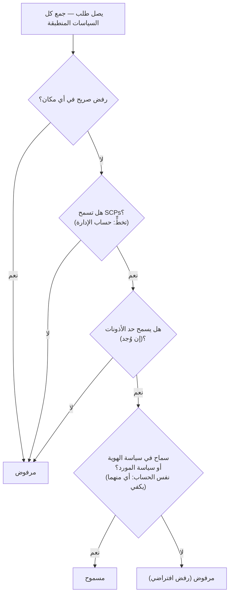

# الفصل الرابع عشر: من المسموح له بفعل ماذا

كان المهندسان الجديدان سيبدآن يوم الاثنين. Soo-Jin وRafael. كانت Maya تفكّر في أسبوعهما الأول — ما الذي سيحتاجان للوصول إليه، وما الذي لا ينبغي أن يلمساه، وما إذا كان إعداد IAM الحالي جاهزاً أصلاً للتوسّع إلى شخصين إضافيين.

جلست مع قهوة قبل أن يمتلئ المكتب، تكتب قائمة.

---

*كان CloudFront منشوراً. كانت معدلات إصابة ذاكرة التخزين المؤقت جيدة. كان الأداء مرتفعاً. لكن مع استعداد الفريق لاستقبال مهندسين جدد، طفت مشكلة هادئة: كان إعداد IAM قد بُني من أشخاص في عجلة. مفاتيح الوصول كانت في ملفات الإعداد. بعض الأدوار لديها أذونات أكثر مما تحتاج. وكان شخصان جديدان على وشك تسلّم بيانات اعتماد لنظام إنتاج لم يُصمَّم مع مستخدمين متعددين في الحسبان.*

---

كانت مفاتيح الوصول مفتوحة لدى Tom في ملف نصي، جاهزة للصق.

سألت Priya: "ماذا تفعل؟"

"نسخة EC2 تحتاج إلى قراءة ملفات الإعداد من S3. أضع بيانات الاعتماد في تكوين الخادم."

نظرت إلى الشاشة للحظة. "أغلق ذلك الملف."

"كنت فقط—"

قالت: "إذا دخل أحدهم إلى ذلك الخادم، يحصل على تلك المفاتيح. وتلك المفاتيح تلمس كل ما يُسمح لمستخدم IAM بلمسه. وهذا على الأرجح أكثر من S3 وحده."

أغلق Tom الملف.

قالت: "هناك طريقة أفضل. يمكن للخادم نفسه أن يمتلك دوراً. فكّر في الأمر كمسمى وظيفي — النسخة لا تحتاج إلى بيانات اعتماد لأن النظام يعرف بالفعل ما هي وما يُسمح لها فعله."

نظر Tom بشك. "إذن الخادم يُوثّق نفسه؟"

"نعم. بدون كلمة مرور. بدون مفاتيح في ملف تكوين. بدون أي شيء يمكن ارتكابه عن طريق الخطأ في git."

وصل ذلك الجزء الأخير. كان Tom قد كاد يرتكب مفتاح وصول في المستودع بنفسه قبل أسبوعين — أمسكه في الفرق في اللحظة الأخيرة. فتح علامة تبويب جديدة في المتصفح.

**مراجعة IAM: الصورة الكاملة**

قدّم الفصل الثالث IAM: المستخدمين والمجموعات والأدوار والسياسات. حان الوقت للذهاب أعمق.

سياسات IAM هي وثائق JSON تُحدد الإجراءات المسموح بها أو المرفوضة على أي موارد. تبدو هكذا:

```json
{
  "Version": "2012-10-17",
  "Statement": [
    {
      "Effect": "Allow",
      "Action": [
        "s3:GetObject",
        "s3:PutObject"
      ],
      "Resource": "arn:aws:s3:::nimbus-assets/*"
    }
  ]
}
```

هذه السياسة تسمح بقراءة وكتابة الكائنات في دلو `nimbus-assets`، ولا شيء آخر. لا الحذف. لا إدراج الدلوات. لا أي عملية S3 أخرى. لا أي خدمة AWS أخرى.

هذه هي الطريقة الصحيحة لمنح الأذونات: إجراءات محددة، موارد محددة.

**مشكلة "الوصول كمسؤول"**

السياسات المُدارة من AWS مثل `AdministratorAccess` مُصمَّمة للبدء السريع. ليست مُصمَّمة لتشغيل أنظمة الإنتاج مع أعضاء الفريق الفعليين.

`AdministratorAccess` يمنح كل إجراء على كل مورد. إذا ارتكب عضو فريق بهذه السياسة خطأً — حذف دلو S3 عن طريق الخطأ، أوقف نسخة EC2 الخاطئة، غيّر قواعد مجموعة الأمان — لا يوجد شيء يمكن لـ AWS فعله لمنعه. الإذن قد مُنح.

إذا سُرّبت بيانات اعتماد عضو الفريق (هجوم تصيد، مفتاح وصول مُسرَّب، سرقة حاسوب)، يمتلك المهاجم وصول مسؤول إلى كل شيء في حسابك على AWS.

سأل Leo: "إذن ما الذي يجب أن تمتلكه Soo-Jin؟"

ردّت Priya: "ما الذي تحتاج Soo-Jin إلى فعله؟"

"نشر API. التحقق من السجلات. لا شيء آخر."

"إذن تحصل على: القدرة على الدفع إلى خط أنابيب الكود، وصول للقراءة إلى سجلات CloudWatch، ولا شيء آخر."

"هذا... محدد جداً."

"نعم. هذه هي النقطة."

**أدوار IAM: هويات للخدمات**

قدّم الفصل الثالث الأدوار كطريقة لنسخ EC2 للوصول إلى خدمات AWS بدون تخزين بيانات الاعتماد. لنجعل هذا ملموساً.

نسخ EC2 التي تُشغّل Nimbus API تحتاج إلى:

- القراءة من DynamoDB (القائمة)
- الكتابة إلى DynamoDB (الطلبات)
- وضع الكائنات في S3 (الإيصالات، الرفوعات)
- كتابة السجلات إلى CloudWatch
- قراءة الأسرار من Secrets Manager

بدلاً من إنشاء مستخدم بمفتاح وصول وتخزين ذلك المفتاح على نسخة EC2 (كابوس أمني — مفاتيح الوصول يمكن قراءتها من قِبَل أي شخص لديه وصول SSH)، تُنشئ **دور IAM** لنسخة EC2 بهذه الأذونات بالضبط.

سألت Maya: "مهلاً — لكن *لماذا* نفعل ذلك بهذه الطريقة؟ نسخة EC2 تُشغّل أصلاً كودنا. لماذا لا نعطي الكود مفتاح وصول؟"

لأن مفاتيح الوصول بيانات اعتماد ثابتة تعيش في مكان ما — في ملف إعداد، أو متغير بيئة، أو مستودع git إذا ارتكب أحدهم خطأً. يمكن نسخها، وتسريبها، وارتكابها عن طريق الخطأ. دور IAM يعمل بشكل مختلف: تفترض نسخة EC2 الدور تلقائياً. تُوفّر AWS بيانات اعتماد مؤقتة من خلال خدمة بيانات تعريف النسخة. تتجدد بيانات الاعتماد تلقائياً — تنتهي صلاحيتها كل بضع ساعات وتُجدَّد دون أي إجراء منك. لا شيء يمكن تسريبه، لأن لا شيء مخزّن.

سأل Leo: "وإذا اخترق أحدهم نسخة EC2؟"

قالت Priya: "يمكنه فعل ما يسمح به دور EC2. الذي يعني قراءة القائمة، وكتابة الطلبات، وإرسال السجلات. لا يستطيع حذف دلو S3. لا يستطيع إيقاف نسخ EC2. لا يستطيع لمس IAM."

"لأن دور EC2 لا يمتلك تلك الأذونات."

"بالضبط."

---

**كيف يعمل افتراض دور EC2 خطوة بخطوة**

قالت Maya: "شيء ما لا يستقيم. إذا لم تكن هناك بيانات اعتماد مخزّنة على النسخة، فكيف تُثبت النسخة فعلاً لـ AWS من هي؟ لا بد من وجود بيانات اعتماد في مكان ما."

هناك. لكنها مؤقتة، تتجدد تلقائياً، ولا يمكن الوصول إليها إلا من داخل النسخة.

حين تبدأ نسخة EC2 بدور IAM مرفق، تفعل AWS التالي:

**الخطوة 1**: تُولّد AWS STS (خدمة رمز الأمان) بيانات اعتماد مؤقتة — معرّف مفتاح وصول، ومفتاح وصول سري، ورمز جلسة. لأدوار نسخ EC2 تكون هذه عادةً صالحة لنحو ست ساعات، وتُجددها AWS تلقائياً قبل انتهائها.

**الخطوة 2**: تُتيح AWS هذه البيانات على عنوان IP خاص: `169.254.169.254`. هذه هي **خدمة بيانات تعريف النسخة (IMDS)**. لا يمكن الوصول إليها إلا من داخل نسخة EC2. لا شيء خارج النسخة يستطيع الوصول إليها.

**الخطوة 3**: حين يستدعي كود تطبيقك أي SDK لـ AWS (boto3، أو SDK لـ Java، أو SDK لـ Node.js)، يستعلم الـ SDK تلقائياً نقطة نهاية بيانات تعريف النسخة:

```
GET http://169.254.169.254/latest/meta-data/iam/security-credentials/{role-name}
```

**الخطوة 4**: يستقبل الـ SDK بيانات الاعتماد المؤقتة ويستخدمها لتوقيع طلب API — مثلاً، طلب قراءة من S3.

**الخطوة 5**: تتحقق AWS من بيانات الاعتماد، وتفحص سياسة IAM المرفقة بالدور، وتسمح بالطلب أو ترفضه.

**الخطوة 6**: قبل نحو خمس عشرة دقيقة من انتهاء بيانات الاعتماد، تُجددها نسخة EC2 تلقائياً من خدمة بيانات التعريف. كود التطبيق لا يحتاج أبداً للتعامل مع هذا — الـ SDK يفعله بشفافية.

العملية بأكملها غير مرئية للمطوّر. تكتب `s3.get_object(...)`. ويتعامل الـ SDK مع الباقي.

قالت Maya: "إذن بيانات الاعتماد موجودة. لكنها مؤقتة، تتجدد تلقائياً، ومقفلة على نقطة نهاية بيانات تعريف النسخة."

قالت Priya: "ولهذا هي أكثر أماناً بكثير من مفتاح وصول ثابت. مفتاح ثابت، بمجرد سرقته، صالح حتى يُجدّده أحد يدوياً. بيانات اعتماد مؤقتة مسروقة تنتهي من تلقاء نفسها — خلال ساعات، لا أشهر."

"وإذا استعلم أحدهم من داخل النسخة نقطة نهاية بيانات التعريف؟"

"يمكنه الحصول على بيانات الاعتماد المؤقتة الحالية. تلك مخاطرة حقيقية، ولهذا قدّمت AWS IMDSv2 — الإصدار الثاني من خدمة بيانات تعريف النسخة. يتطلب IMDSv2 من المستدعي الحصول أولاً على رمز جلسة عبر طلب PUT. هذا يمنع فئة من الهجمات تُسمى تزوير الطلب من جانب الخادم، حيث يخدع كود خبيث الخادم لجلب URL بيانات التعريف نيابةً عن المهاجم."

حدّث Leo تكوين إطلاق EC2 لفرض IMDSv2. إعداد واحد، مُطبَّق وقت الإطلاق.

---

**افتراض الدور: كيف تصبح الخدمات خدمات أخرى**

يمكن افتراض الأدوار من قِبَل:

- **خدمات AWS** (EC2، Lambda، مهام ECS، إلخ)
- **مستخدمو IAM** في حسابك الخاص (رفع الدور — تفترض دوراً بأذونات أكثر لمهمة محددة)
- **مستخدمو IAM في حسابات AWS أخرى** (الوصول عبر الحسابات — يمكن لحساب منظمة أخرى افتراض دور في حسابك)
- **موفرو الهوية الخارجيون** (Google، Active Directory، Okta — وصول فيدرالي للمستخدمين البشريين)

سألت Priya: "هل فكّرنا فيما يحدث إذا استخدمت Nimbus خدمة طرف ثالث تحتاج إلى الوصول إلى موارد AWS لدينا؟ بائع تحليلات خارجي مثلاً. لا نريد إنشاء مستخدم IAM له وتسليمه مفتاح وصول."

قال Leo: "أدوار عبر الحسابات. نُنشئ دوراً في حسابنا ونكتب سياسة ثقة تقول 'هذا الحساب الخارجي المحدد مسموح له بافتراض هذا الدور.' يستخدمون بيانات اعتمادهم الخاصة لافتراض الدور والحصول على وصول مؤقت. لا مفاتيح لإدارتها، لا مفاتيح لتسريبها."

هذا النمط الأخير — **تفويض الهوية** — هو كيف تمنح المنظمات الكبيرة موظفيها وصول AWS دون إنشاء مستخدمي IAM فرديين لكل شخص. حساب Active Directory الخاص بشركتك يحتوي على بيانات اعتمادك. حين تسجّل الدخول إلى AWS، تُوثَّق هويتك عبر Active Directory، وتمنحك AWS دوراً.

---

**الوصول عبر الحسابات: سيناريو فريق المحاسبة**

بعد ستة أشهر، استعانت Nimbus بشركة محاسبة للمساعدة في التقارير المالية. احتاج فريق المحاسبة وصولاً للقراءة لبيانات الفوترة في دلو فوترة Nimbus على S3 — لكنهم يعملون من حساب AWS منفصل خاص بهم. لم ترغب Nimbus في إنشاء مستخدم IAM لهم. تسليم شخص في شركة خارجية مفتاح وصول ثابتاً بدا خطأً تماماً.

قالت Priya: "دور عبر الحسابات."

للإعداد ثلاثة أجزاء:

**الجزء الأول**: في حساب Nimbus، أنشئ دور IAM — سمِّه `AccountingReadRole`. أرفق سياسة تسمح بـ `s3:GetObject` و`s3:ListBucket` على دلو الفوترة على S3. لا شيء آخر.

**الجزء الثاني**: أضف سياسة ثقة إلى `AccountingReadRole`. سياسة الثقة تقول أي هوية خارجية مسموح لها بافتراض هذا الدور:

```json
{
  "Version": "2012-10-17",
  "Statement": [{
    "Effect": "Allow",
    "Principal": {
      "AWS": "arn:aws:iam::ACCOUNTING-FIRM-ACCOUNT-ID:role/AccountingAppRole"
    },
    "Action": "sts:AssumeRole"
  }]
}
```

هذا يقول: فقط الدور المحدد في حساب AWS لشركة المحاسبة يمكنه افتراض هذا الدور. لا أحد غيره.

**الجزء الثالث**: في حساب شركة المحاسبة، يستخدم تطبيقهم `sts:AssumeRole` للحصول على بيانات اعتماد مؤقتة لـ `AccountingReadRole`. تلك البيانات مقتصرة على ما يسمح به `AccountingReadRole` فقط. تطبيق المحاسبة يستطيع قراءة ملفات الفوترة. لا يستطيع الكتابة إليها. لا يستطيع لمس أي شيء آخر في حساب Nimbus.

ثمة خطوة تحصين إضافية لهذا السيناريو بالضبط — وهي موضوع اختبار مُسمّى. شركة المحاسبة تخدم عملاء كثيرين. لنفترض أن عميلاً خبيثاً لديهم عرف ARN الخاص بـ `AccountingReadRole` لـ Nimbus وطلب من برنامج الشركة "تحليله." برنامج الشركة لديه إذن مشروع لافتراض الأدوار — قد يُخدَع للوصول إلى بيانات Nimbus نيابةً عن العميل الخطأ. هذه هي **مشكلة النائب المُربَك**، والحل هو **ExternalId**: تُولّد Nimbus قيمة سرية فريدة، وتضعها في سياسة الثقة كشرط (`"sts:ExternalId": "nimbus-7f3a..."`)، وتشاركها فقط مع شركة المحاسبة. يجب أن يمرّر برنامج الشركة ذلك ExternalId في كل استدعاء `AssumeRole`، ويستخدم ExternalId *مختلفاً* لكل عميل — لذا فإن طلباً يُقدَّم نيابةً عن العميل الخطأ يفشل. مُحفِّز الاختبار: "طرف ثالث يحتاج وصولاً عبر الحسابات" ← دور + سياسة ثقة + **ExternalId**. ليس أبداً مستخدم IAM بمفاتيح مشتركة.

سأل Tom: "ماذا لو احتجنا إلى إلغاء وصولهم؟"

قالت Priya: "احذف سياسة الثقة أو احذف الدور. انتهى. لا بيانات اعتماد لتعقّبها، لا مفاتيح لتعطيلها. الدور هو الوصول. أزل الدور، يختفي الوصول."

أضاف Leo: "ويمكننا رؤية كل مرة استخدموه فيها في CloudTrail."

"كل استدعاء API أجروه، مُسجّل. أي دلو، أي ملف، أي وقت، أي نتيجة."

دوّن Tom النمط. سيظهر مجدداً — كل شريك تكامل، كل بائع خارجي، كل أداة طرف ثالث تحتاج وصول AWS ستحصل على دور بسياسة ثقة، لا مستخدم بمفتاح وصول.

---

**تقييم سياسة IAM: منطق القرار**

سألت Priya: "هل فكّرنا فيما يحدث حين تنطبق سياسات متعددة على نفس الطلب؟ لمستخدم IAM سياسة. وللمورد الذي يصل إليه سياسة مورد. قد تكون هناك SCP. كيف تقرر AWS؟"

الأمر المهم لفهمه هو أن AWS **لا** تفحص السياسات نوعاً واحداً في كل مرة، بالتتابع. تجمع *كل* السياسات التي تنطبق على الطلب — القائمة على الهوية، القائمة على الموارد، SCPs، حدود الأذونات، سياسات الجلسة — وتُطبّق مجموعة من القواعد على الكومة كلها دفعة واحدة:

**القاعدة 1 — الرفض الصريح يفوز، دائماً.** إذا رفضت أي سياسة منطبقة — IAM، أو قائمة على الموارد، أو SCP، أو حد — الإجراء صراحةً، يُرفض الطلب. لا شيء يستطيع تجاوز رفض صريح.

**القاعدة 2 — SCPs وحدود الأذونات تعمل كمرشّحات.** لا تمنح شيئاً أبداً. يجب أن يكون الإجراء *مسموحاً* به من كل SCP منطبقة ومن حد الأذونات (إن وُجد)، وإلا يُرفض — بغض النظر عما تقوله السياسات الأخرى.

**القاعدة 3 — داخل نفس الحساب، سماح واحد يكفي.** سماح صريح في *إما* سياسة IAM للهوية *أو* سياسة المورد يسمح بالإجراء. إنها اتحاد، لا تتابع — سياسة المورد لا تُقيَّم "قبل" سياسة IAM.

**القاعدة 4 — الرفض الافتراضي.** إذا لم يسمح شيء صراحةً بالإجراء، يُرفض.



النتيجة: رفض صريح في أي مكان = مرفوض. لا سماح في أي مكان = مرفوض. سماح من سياسة الهوية *أو* سياسة المورد = مسموح، ما دام لا رفض أو SCP أو حد يحجبه.

حقيقة أخرى يحبها الاختبار: **SCPs لا تنطبق على حساب الإدارة في المنظمة** (ولا على الأدوار المرتبطة بالخدمات). SCP تقول "لا EC2 خارج us-west-2" تقيّد كل حساب عضو — لكن حساب الإدارة لا يُمسّ. هذا أحد أسباب نصح AWS بإبقاء أعباء العمل خارج حساب الإدارة تماماً.

دقيقة تُعثّر مرشحي الاختبار: للوصول **عبر الحسابات**، سياسة قائمة على الموارد في الحساب الهدف ليست كافية بنفسها. الهوية في الحساب المصدر تحتاج أيضاً إلى إذن صريح في سياسة IAM الخاصة بها لأداء الإجراء. إذا منحت سياسة دلو S3 تسمح للحساب B بقراءة كائناتك، لكن مستخدمي IAM في الحساب B ليس لديهم سياسة IAM تسمح بـ `s3:GetObject`، يظل الوصول مرفوضاً. كلا الجانبين يجب أن يسمح بالإجراء — سياسة المورد تفتح الباب من جانب الهدف، وسياسة IAM في الحساب المصدر تمنح المستخدم إذن المرور منه.

سأل Leo: "إذن إذا قالت SCP الخاصة بـ Priya 'لا EC2 في eu-west-1'، وقالت سياسة IAM الخاصة بها 'اسمح بكل إجراءات EC2'، فهي لا تزال لا تستطيع إنشاء نسخة في eu-west-1؟"

قالت Priya: "صحيح. SCP تُرشّح ما هو ممكن قبل تقييم سياسات IAM. كلاهما يجب أن يتفق لينجح إجراء."

"ورفض صريح في سياسة IAM يتجاوز سماحاً صريحاً في سياسة مورد؟"

"دائماً. رفض صريح في أي مكان في السلسلة يفوز."

---

**حدود الأذونات: تقييد ما يمكن للأدوار منحه**

هنا مشكلة خفية لكن مهمة: افتراضياً، IAM لا تمنع مستخدماً من منح أذونات لا يمتلكها حالياً.

إذا كان لدى Soo-Jin `iam:CreatePolicy` و`iam:AttachUserPolicy`، يمكنها إنشاء سياسة تمنح وصول كتابة S3 وإرفاقها بنفسها — حتى لو كانت سياساتها الموجودة تسمح فقط بقراءة S3. تُسمّى هذه الفئة من الثغرات **تصعيد الامتيازات**، وهذا بالضبط سبب وجود حدود الأذونات.

لكن ماذا لو أردت تفويض إنشاء أذونات IAM لقائد فريق، مع ضمان عدم تمكّنه من منح أكثر مما أردت؟

**حدود الأذونات** تضبط الأذونات القصوى التي يمكن منحها لأي هوية على الإطلاق. حتى لو كانت السياسات المرفقة بالهوية أوسع، تُقيَّد الأذونات الفعلية بحد الأذونات.

مثال: تمنح قائد فريق سياسة تسمح بإنشاء أدوار IAM. لكن ترفق حداً للأذونات يقول "الأدوار التي ينشئها هذا القائد لا يمكنها أبداً امتلاك وصول حذف S3." حتى لو أنشأ القائد دوراً بوصول S3 كامل، يمنع الحد حذف S3 من التأثير.

قد تتساءل: ما الفرق بين حد الأذونات وسياسة التحكم في الخدمات؟ يبدوان متشابهين — كلاهما يقيّد الأذونات التي يمكن أن تكون فعّالة. التمييز هو النطاق. حد الأذونات ينطبق على هوية IAM محددة (مستخدم أو دور) ويقيّد ما يمكن لتلك الهوية فعله على الإطلاق. SCP تنطبق على حساب AWS كامل أو وحدة تنظيمية — إنها حاجز حماية على مستوى المنظمة يؤثر على كل هوية في الحساب، بما في ذلك المسؤولون. استخدم حدود الأذونات حين تُفوّض إدارة IAM لقائد فريق. استخدم SCPs حين تحتاج قواعد على مستوى المنظمة لا يستطيع أحد في الحساب تجاوزها.

هذا مفهوم متقدم، لكنه يظهر في الاختبار ويعكس كيف تُفوّض المنظمات إدارة IAM على نطاق واسع.

**حد أذونات ملموس: تفويض إنشاء الأدوار بأمان**

كانت Nimbus تنمو. اقترحت Soo-Jin أن يُسمح لكل مهندس أقدم في فريق المنصة بإنشاء أدوار IAM لدوال Lambda التي يملكها — دون أن تتطلب موافقة Priya على كل واحد.

قالت Priya: "المخاطرة هي أن يُنشئ مهندس أقدم دور Lambda بـ `AdministratorAccess` — إما خطأً أو دون تفكير دقيق."

قالت Soo-Jin: "إذن نستخدم حدود الأذونات."

أنشأت Priya سياسة حد أذونات تُسمّى `NimbusDeveloperBoundary`:

```json
{
  "Version": "2012-10-17",
  "Statement": [
    {
      "Effect": "Allow",
      "Action": [
        "s3:GetObject", "s3:PutObject",
        "dynamodb:GetItem", "dynamodb:PutItem", "dynamodb:Query",
        "cloudwatch:PutMetricData", "logs:CreateLogGroup",
        "logs:CreateLogStream", "logs:PutLogEvents",
        "secretsmanager:GetSecretValue",
        "xray:PutTraceSegments"
      ],
      "Resource": "*"
    }
  ]
}
```

ثم سمحت لكل مهندس أقدم بإنشاء الأدوار، لكن فقط إذا أرفق هذا الحد:

```json
{
  "Effect": "Allow",
  "Action": ["iam:CreateRole", "iam:AttachRolePolicy"],
  "Resource": "*",
  "Condition": {
    "StringEquals": {
      "iam:PermissionsBoundary": "arn:aws:iam::ACCOUNT_ID:policy/NimbusDeveloperBoundary"
    }
  }
}
```

بدون الشرط، يستطيع مهندس إنشاء دور بأي أذونات. مع الشرط، أي دور يُنشئه يجب أن يكون له `NimbusDeveloperBoundary` مرفقاً. دور بـ `AdministratorAccess` بالإضافة إلى `NimbusDeveloperBoundary` له تقاطع الاثنين — فعلياً فقط الخدمات المُدرجة في الحد.

قال Leo: "إذن يمكنهم إنشاء الأدوار، لكن تلك الأدوار لا يمكنها أبداً فعل أكثر من القراءة من S3، والكتابة إلى DynamoDB، والتسجيل إلى CloudWatch."

"صحيح. لا يمكنهم إنشاء أدوار تلمس IAM. لا يمكنهم إنشاء أدوار تحذف نسخ EC2. الحد يُعرّف السقف."

"وإذا نسوا إرفاق الحد؟"

"الشرط يمنع استدعاء `CreateRole` من النجاح. الإنشاء يفشل ما لم يُضمَّن الحد."

أجرت Priya التمرين مع Soo-Jin. عشرون دقيقة من الإعداد. النتيجة: استطاع المهندسون خدمة أنفسهم بإنشاء أدوار Lambda دون مراجعة أمنية لكل نشر، واحتفظ فريق المنصة بالثقة بأن لا دالة Lambda ستمتلك أبداً أكثر من الأذونات المُعرّفة.

**محلل وصول IAM: تدقيق الأذونات**

قضت Priya يومين في مراجعة إعداد IAM للفريق. وجدت:

- المستخدم الشخصي لـ Leo يمتلك وصول مسؤول (كما اكتُشف)
- دالة Lambda قديمة لديها أذونات لقراءة جميع دلوات S3 (متبقية من اختبار)
- دور خدمة لديه وصول كتابة لجداول DynamoDB لم تعد موجودة

هذا طبيعي. تتراكم تكوينات IAM على مر الوقت.

**محلل وصول IAM** هو خدمة AWS تُحدد تلقائياً الموارد (دلوات S3، أدوار IAM، مفاتيح KMS، دوال Lambda، طوابير SQS) القابلة للوصول من خارج حسابك على AWS. يتضمن أيضاً ميزة تحقق من السياسات تفحصها مقابل أفضل ممارسات IAM، وميزة توليد سياسات تُنشئ سياسات الامتياز الأدنى بتحليل أحداث CloudTrail.

سأل Tom وهو يرفع نظره عن متصفحه: "كم يكلّف هذا شهرياً؟"

قالت Priya: "تحليل الوصول الخارجي مجاني. يعمل باستمرار ويُبلّغ عن النتائج في وحدة التحكم. تحليل الوصول غير المستخدم — الذي يُحدد الأدوار والأذونات التي لم تُستخدم مؤخراً — يكلّف نحو 0.20 دولار لكل دور IAM مُحلَّل شهرياً."

عاد Tom إلى متصفحه.

نتائج الوصول الخارجي هي الأكثر قيمة فورياً. حين فعّلت Priya محلل الوصول، وجد أمرين:

أولاً، دلو `nimbus-receipts` على S3 له سياسة دلو تسمح بالقراءة من حساب AWS خارجي محدد — حساب مقاول ساعد في بناء ميزة تصدير الإيصالات الأولية قبل ثمانية أشهر. لم يعد المقاول منخرطاً. لم تُنظَّف سياسة الدلو أبداً.

قالت Priya: "ثمانية أشهر من الوصول لم يقصده أحد."

سأل Tom: "هل كانوا لا يزالون يصلون إليه؟"

سحب Leo سجلات الوصول لـ S3. لا طلبات من ذلك الحساب في ستة أشهر. لكن الإذن كان هناك. أظهره محلل الوصول؛ ما كان أحد ليجده في مراجعة يدوية.

ثانياً، دلو `nimbus-dev-assets` على S3 كان مضبوطاً على القراءة العامة. كان ذلك مقصوداً أثناء التطوير — كان الاختبار أسهل بوصول عام. وقد نُسي.

قالت Priya: "أزل تجاوز حجب الوصول العام. وفعّل S3 Block Public Access على مستوى الحساب. هذا يمنع أي دلو من أن يصبح عاماً، بغض النظر عن إعدادات الدلو الفردية."

فعلوا كليهما.

تحليل الوصول غير المستخدم، المُشغَّل شهرياً، سيُظهر الأدوار التي لم تُستخدم في 90 يوماً. تلك مرشحات للحذف. تكوينات IAM تنمو في اتجاه واحد طبيعياً — الأدوار والسياسات تتراكم. محلل الوصول يجعل التنظيف مرئياً.

يجب أن تكون عمليات تدقيق IAM المنتظمة جزءاً من عملياتك. محلل الوصول لا يحل محل التدقيق — يجعله قابلاً للإدارة.

**سياسات التحكم في الخدمات: حواجز حماية على مستوى المنظمة**

إذا نما بيئتك على AWS إلى حسابات متعددة (نمط شائع للفرق الكبيرة — حساب تطوير، حساب تجريب، حساب إنتاج)، تسمح لك **AWS Organizations** بإدارتها من حساب مركزي. فائدة عملية فورية واحدة: **الفوترة الموحّدة**. كل الحسابات الأعضاء تتجمّع في فاتورة واحدة يدفعها حساب الإدارة، ويُجمَّع الاستخدام عبر الحسابات — لذا تنطبق خصومات الحجم (مستويات تسعير S3 مثلاً) وخصومات النسخ المحجوزة أو خطط التوفير على مستوى المنظمة بدلاً من كل حساب. وافق Tom على Organizations قبل أن يفهم أي شيء آخر عنها.

داخل Organizations، تُطبّق **سياسات التحكم في الخدمات (SCPs)** حواجز حماية تؤثر على *كل* كيان IAM في الحساب، بما في ذلك المسؤولون.

مثال SCP: "لا يمكن لأحد في حساب التطوير إنشاء نسخ EC2 في منطقة eu-west-1."

حتى لو كان لشخص ما وصول مسؤول في حساب التطوير، لا يستطيع انتهاك هذه السياسة SCP. تُطبَّق على مستوى المنظمة، فوق مستوى الحساب.

لا تمنح SCPs الأذونات — تقيّدها. تُعرّف الأذونات القصوى التي يمكن لأي كيان IAM في الحساب امتلاكها على الإطلاق.

حين أنشأت Nimbus هيكلاً متعدد الحسابات — حساب إنتاج مشترك، وحساب تطوير، وحساب أمان — كتبت Priya ثلاث SCPs أساسية:

**SCP 1 — قفل المنطقة**: كل الحسابات مقتصرة على `us-east-1` و`us-west-2`. إذا نشر مطوّر عن طريق الخطأ في `ap-southeast-1`، يُرفض الإجراء. هذا يمنع البنية التحتية الظلية في مناطق غير مقصودة.

**SCP 2 — حماية CloudTrail**: لا يمكن لأحد في أي حساب تعطيل CloudTrail أو حذف سجلات CloudTrail. حتى مسؤولو الحسابات. إذا انطفأ CloudTrail، تذهب الرؤية الأمنية معه — هذه السCP تجعل ذلك مستحيلاً هيكلياً.

**SCP 3 — إغلاق المستخدم الجذر**: ترفض كل الإجراءات التي يُجريها المستخدم الجذر للحسابات الأعضاء (النمط الموصى به من AWS هو رفض صريح على `aws:PrincipalArn` المطابق للجذر، بدلاً من اشتراط MFA شرطياً — SCPs الشرطية لـ MFA تكسر سير عمل الخدمات التي لا تستطيع تقديم MFA). ينبغي ألا يُستخدم المستخدم الجذر أبداً تقريباً؛ العمل اليومي يخص الأدوار. تذكّر: SCPs تنطبق على المستخدمين الجذر للحسابات الأعضاء، لكن **ليس أبداً** على حساب الإدارة.

قالت Priya: "هذه السياسات الثلاث كانت ستمنع ثلاث حوادث حقيقية رأيناها في العام الماضي. قفل المنطقة كان سيوقف المطوّر الذي أطلق عن طريق الخطأ مئتي نسخة EC2 في منطقة لا نعمل فيها. حماية CloudTrail كانت ستوقف حادثة التهديد الداخلي في صاحب عملنا السابق. إغلاق الجذر مجرد نظافة."

سأل Leo: "هل ينطبق هذا على حساب الأمان أيضاً؟"

"حساب الأمان له SCP مختلفة — قيود أقل، لأن فريق الأمن يحتاج أحياناً لفعل أشياء لا تستطيع الحسابات الأخرى فعلها. لكن حماية CloudTrail تنطبق في كل مكان. التسجيل مقدّس."

القاعدة العامة: SCPs لما ينبغي ألا يحدث أبداً، في أي مكان، في أي حساب تحت أي ظرف. سياسات IAM لما يحتاجه كل فريق وخدمة تحديداً.

---

## أتمتة منطقة الهبوط: AWS Control Tower

كانت SCPs تعمل. كان الهيكل متعدد الحسابات يتشكّل. لكن Priya كانت تُجري حساباً هادئاً، ولم تُعجبها الأرقام.

قالت: "ثمانية حسابات. ولم نحسب بعد السلاسل الجديدة."

كانت Nimbus قد نمت بما يتجاوز حساب AWS واحد. كان لديهم إنتاج. كان لديهم تجهيز. كان لديهم ثلاث سلاسل مطاعم مستحوذ عليها — كل واحدة تُشغّل بيئة AWS خاصة بها، كل واحدة تحتاج إلى دمجها في نموذج حوكمة Nimbus. ثمانية حسابات إجمالاً، والمزيد قادم.

كانت Soo-Jin تعرف هذه المشكلة. قالت: "في شركتي السابقة، أعددنا كل حساب جديد يدوياً. بريد الحساب الجذر، مستخدمو IAM، إرفاقات SCP، CloudTrail، Config، GuardDuty — ساعتان لكل حساب، كحد أدنى. وكان شيء ما مختلفاً قليلاً دائماً. حساب واحد كان CloudTrail فيه في us-east-1 فقط. آخر كان GuardDuty معطّلاً فيه لأن أحدهم نسي تفعيله. وبحلول وصولك إلى خمسين حساباً، صار تدقيق الفروق مشروعاً بحد ذاته."

قالت Priya: "ليست هكذا سنفعل هذا."

تُؤتمت **AWS Control Tower** إعداد وحوكمة بيئة AWS متعددة الحسابات. بدلاً من ربط Organizations وSCPs وCloudTrail وConfig وGuardDuty يدوياً لكل حساب جديد، تبني Control Tower الهيكل وتصونه لك.

حين تُعدّ Control Tower، تُنشئ **منطقة هبوط**: بيئة آمنة متعددة الحسابات مُعدّة مسبقاً بحساب إدارة، وحساب أرشيف سجلات، وحساب تدقيق، كلها تتبع أفضل ممارسات AWS. حساب أرشيف السجلات يجمع سجلات CloudTrail من كل حساب في المنظمة. حساب التدقيق يستضيف أدوات الأمان. يُعَدّ هذا الأساس تلقائياً — لا من فريقك على مدى يومين، بل من Control Tower في دقائق.

بمجرد وجود منطقة الهبوط، تُدير Control Tower إياها عبر **عناصر التحكم (controls)** (الاسم الأقدم، **حواجز الحماية (guardrails)**، لا يزال يظهر في كل مكان، بما في ذلك في الاختبار) — قواعد حوكمة جاهزة بثلاثة أشكال. *عناصر التحكم الوقائية* هي SCPs: تحجب الإجراءات غير المتوافقة قبل أن تحدث. *عناصر التحكم الكشفية* هي قواعد AWS Config: تمسح بحثاً عن الانحراف وتُبلّغ عنه إلى لوحة تحكم Control Tower. *عناصر التحكم الاستباقية* هي خطّافات CloudFormation: تفحص الموارد للتوافق *قبل* تجهيزها، فتُفشل النشر بدلاً من تعليمه لاحقاً. سياسة حماية CloudTrail الخاصة بـ Priya، مترجمة إلى لغة Control Tower، هي عنصر تحكم وقائي. قاعدة Config تُعلّم أي دلو S3 بوصول عام هي عنصر تحكم كشفي. خطّاف يحجب حزمة CloudFormation من إنشاء وحدة تخزين EBS غير مشفّرة هو عنصر تحكم استباقي.

القطعة التي حلّت مشكلة Soo-Jin بالساعتين لكل حساب: **Account Factory**. حين تستحوذ Nimbus على سلسلة مطاعم أخرى، يفتح فريق الهندسة Account Factory، يملأ اسم الحساب والبريد، وينقر تجهيز. بعد دقائق، يصل حساب AWS جديد مُعدّ مسبقاً بأدوار IAM الصحيحة، وCloudTrail، وConfig، وكل حواجز الحماية مُطبَّقة بالفعل. ليس تقريباً صحيحاً. لا ينقصه شيء واحد. مطابق لكل حساب آخر.

سألت Maya: "مهلاً — لكن *لماذا* نفعل ذلك بهذه الطريقة؟ لدينا أصلاً Organizations وSCPs. لماذا نضيف خدمة أخرى فوقها؟"

لأن Organizations مع SCPs تمنحك حواجز حماية — لكنك تبني وتصون كل شيء آخر بنفسك. Control Tower تمنحك منطقة الهبوط الكاملة: هيكل الحساب، أرشيف السجلات، حساب التدقيق، ضبط الأمان الأساسي، وAccount Factory، كلها مُصانة من AWS. تستخدم Control Tower Organizations في الخلفية، لكنها تضيف الإعداد المُؤتمت ذا الرأي الذي لا توفّره Organizations وحدها. إذا بدأت من الصفر اليوم واحتجت حوكمة متسقة على نطاق واسع، Control Tower هي الإجابة. إذا كان لديك أصلاً إعداد Organizations ناضج بنيته يدوياً، يمكنك تسجيله في Control Tower — أو تركه كما هو.

التمييز الذي يُعثّر مرشحي الاختبار: "تطبيق SCP لتقييد إجراء محدد عبر الحسابات" ← تريد Organizations + SCP مباشرةً. "إعداد بيئة آمنة متعددة الحسابات تتبع أفضل ممارسات AWS تلقائياً، مع سير عمل لتجهيز حسابات جديدة" ← تريد Control Tower.

سأل Leo: "كم يستغرق تسجيل حساب Meridian Kitchen؟"

قالت Priya: "Account Factory تُجهّز حساباً جديداً في نحو ثلاثين دقيقة. مُكوَّن بالكامل. ليس 'مكوَّناً في معظمه'."

لم يقل Tom شيئاً. كان ينظر إلى تكلفة ساعتين من وقت مهندس، مضروبة في ثمانية، مضروبة في عدد الحسابات القادمة.

---

> **نصيحة الاختبار — AWS Control Tower**
>
> *SAA-C03 المجال: تصميم معماريات آمنة (المجال الأول)*
>
> - **Control Tower** تُؤتمت إعداد منطقة هبوط متعددة الحسابات بحواجز حماية وAccount Factory. استخدمها عند بدء منظمة AWS جديدة أو الحاجة إلى تجهيز حسابات على نطاق واسع بأسس حوكمة متسقة.
> - **عناصر التحكم الوقائية = SCPs.** تحجب الإجراءات غير المتوافقة قبل حدوثها.
> - **عناصر التحكم الكشفية = قواعد AWS Config.** تكتشف الانحراف وتُبلّغ عنه إلى لوحة التحكم.
> - **عناصر التحكم الاستباقية = خطّافات CloudFormation.** تتحقق من الموارد قبل التجهيز. ثلاثة أنواع تحكم، ثلاث آليات — يختبر الاختبار التطابق.
> - **Account Factory** تُجهّز حسابات جديدة مُعدّة مسبقاً بأساس الأمان لمنظمتك — بلا إعداد يدوي.
> - **Control Tower مقابل Organizations:** Organizations + SCPs = تبني وتدير كل شيء. Control Tower = AWS تبني منطقة الهبوط وتدير تحديثات حواجز الحماية لك، مستخدمةً Organizations في الخلفية.
> - **مُحفِّز الاختبار:** "إعداد حسابات جديدة بأسس أمان تلقائياً" ← Control Tower. "تطبيق SCP محددة لتقييد إجراء عبر الحسابات" ← Organizations + SCP مباشرةً.

---

**خطوط أنابيب CI/CD: بيانات الاعتماد التي تنساها**

سألت Priya: "هل فكّرنا فيما يحدث ببيانات الاعتماد في خط أنابيب النشر لدينا؟"

سير عمل GitHub Actions الذي ينشر تطبيق Nimbus كان سابقاً يستخدم مفاتيح وصول AWS مخزّنة كأسرار GitHub. كان هذا ممارسة قياسية — لكنه عنى وجود مفاتيح وصول طويلة العمر في نظام طرف ثالث.

سألت Priya: "ماذا لو اخترق GitHub؟ أو جُعل مستودع عاماً عن طريق الخطأ وقرأ أحدهم الأسرار؟"

الحل: تفويض OIDC من GitHub. يدعم GitHub Actions OpenID Connect — يمكنه الحصول على رمز مؤقت من موفر هوية GitHub واستبداله ببيانات اعتماد AWS عبر دور IAM. لا يُنشأ أبداً مفتاح وصول ثابت.

سياسة الثقة لـ IAM لدور النشر:

```json
{
  "Effect": "Allow",
  "Principal": {
    "Federated": "arn:aws:iam::ACCOUNT_ID:oidc-provider/token.actions.githubusercontent.com"
  },
  "Action": "sts:AssumeRoleWithWebIdentity",
  "Condition": {
    "StringEquals": {
      "token.actions.githubusercontent.com:aud": "sts.amazonaws.com",
      "token.actions.githubusercontent.com:sub": "repo:nimbus-org/nimbus-api:ref:refs/heads/main"
    }
  }
}
```

سياسة الثقة هذه تسمح لـ GitHub Actions بافتراض دور النشر — لكن فقط حين يعمل من فرع `main` لمستودع `nimbus-api`. تفرّع، أو طلب سحب من مساهم خارجي، أو فرع مختلف لا يستطيع افتراض الدور.

قال Leo: "لا مفتاح وصول في أسرار GitHub. خط الأنابيب يُوثّق مع AWS باستخدام رمز هوية GitHub."

أضافت Priya: "والدور يسمح فقط بما يحتاجه النشر فعلاً. الدفع إلى ECR، تحديث خدمة ECS، وضع ملف في S3. لا شيء آخر."

"لقد نشرتها بالفعل — أوه." كان Leo قد اختبر تفويض OIDC في فرع `main` لكنه نسي أن بيئة التجهيز تُنشر من فرع `staging`. كان الشرط تقييدياً أكثر من اللازم. حدّث الشرط ليسمح بـ `ref:refs/heads/main` و`ref:refs/heads/staging`.

حُذفت مفاتيح الوصول القديمة. صار خط أنابيب النشر يعمل الآن دون أي بيانات اعتماد طويلة العمر.

---

**IAM على نطاق المؤسسة**

كانت Soo-Jin قد جاءت من شركة بثلاثمئة مهندس وخمسمئة حساب AWS. نظرت إلى إعداد IAM في Nimbus ولم تقل شيئاً للحظة.

قالت أخيراً: "إنه نظيف. امتياز أدنى جيد. لكن حين تضم هذه الشركة خمسين مهندساً، سيكون هذا الهيكل مؤلماً."

سألت Maya: "ما الذي يتغير؟"

قالت Soo-Jin: "تتوقف عن إدارة أذونات المستخدمين الفرديين وتبدأ بإدارة مجموعات من المستخدمين عبر IAM Identity Center. لديك حسابات متعددة — تطوير، تجهيز، إنتاج، أمان، خدمات مشتركة. المهندسون يحتاجون وصولاً لبعض الحسابات لا غيرها. فعل ذلك بمستخدمي IAM فرديين في كل حساب مئات التكوينات للصيانة."

يحلّ IAM Identity Center (المعروف سابقاً بـ AWS Single Sign-On) هذا. يسجّل المهندسون الدخول مرة واحدة ببيانات اعتمادهم المؤسسية. يربط Identity Center هويتهم بمجموعات أذونات — حزم من السياسات — في حسابات محددة. مطوّر يحصل على وصول قراءة للتطوير والتجهيز، ووصول كتابة لموارد خدمته الخاصة في الإنتاج. مهندس أمان يحصل على وصول قراءة لكل الحسابات.

قالت Soo-Jin: "مكان واحد لإدارة من له وصول إلى ماذا، عبر كل الحسابات. حين ينضم أحد، تضيفه إلى مجموعة. حين يغادر، تُزيله من Identity Center ويختفي وصوله إلى كل شيء."

قال Leo: "ولا مستخدمي IAM فرديين لتنظيفهم."

"صحيح. مستخدمو IAM غير موجودين. التفويض موجود."

نمط المؤسسة: AWS Organizations بحسابات متعددة، Identity Center يدير وصول البشر مركزياً، أدوار خدمة في كل حساب للأتمتة، SCPs تفرض حواجز الحماية على مستوى الحساب. لا مفاتيح وصول طويلة العمر. لا بيانات اعتماد مشتركة. لا إلغاء تجهيز يدوي حين يغادر أحد.

قالت Maya: "لسنا هناك بعد."

قالت Soo-Jin: "لا. لكنه الاتجاه. كل قرار تتخذه الآن ينبغي أن يجعل الوصول إلى هناك أسهل، لا أصعب."

**أين يعيش دليل الشركة؟ AWS Directory Service**

ثمة قطعة أخرى من صورة التفويض. يحتاج Identity Center إلى *مصدر* هوية — مكان تعيش فيه هويات الشركة فعلاً. للكثير من المؤسسات، ذلك المصدر هو Microsoft Active Directory، وتُقدّم AWS ثلاث طرق لربطه، تحت مظلة **AWS Directory Service**:

**AWS Managed Microsoft AD** هو Microsoft Active Directory فعلي، يعمل على متحكمات نطاق مُدارة من AWS عبر منطقتي توافر. يدعم كل ما يدعمه AD الحقيقي: سياسة المجموعة، علاقات الثقة مع AD المحلي لديك، وأعباء عمل AWS المعتمدة على AD — FSx for Windows File Server، وAmazon RDS لـ SQL Server بمصادقة Windows، ونسخ EC2 المنضمة إلى النطاق. هذا الخيار حين تحتاج دليلاً كاملاً *في* AWS، أو حين تُشغّل تطبيقات واعية بـ AD في السحابة. (هذا هو الدليل الذي استخدمه Leo لترحيل FSx لـ Copper Kettle في الفصل السادس.)

**AD Connector** ليس دليلاً على الإطلاق — إنه وكيل. يُحوّل طلبات المصادقة إلى AD المحلي *الموجود* لديك عبر رابط VPN أو Direct Connect. لا تُخزَّن أو تُحفَظ بيانات دليل في AWS؛ يحتفظ المستخدمون ببيانات اعتمادهم الموجودة، ويبقى AD المحلي لديك مصدر الحقيقة الوحيد. هذا الخيار حين يقول المتطلب "استخدم بيانات اعتماد الشركة الموجودة" و"لا يجوز تخزين أي معلومات هوية في السحابة."

**Simple AD** هو دليل منخفض التكلفة قائم على Samba بتوافق AD أساسي. يصلح للبيئات الصغيرة المستقلة التي تحتاج LDAP والانضمام البسيط للنطاق، لكنه لا يدعم الثقة أو MFA أو ميزات AD المتقدمة. يوجد أساساً كخيار اقتصادي للأدلة الصغيرة — وكمُشتت اختبار.

قالت Soo-Jin: "شجرة القرار قصيرة. AD محلي موجود وتفويض بعدم نسخه إلى السحابة؟ AD Connector. أعباء عمل معتمدة على AD تعمل في AWS، أو علاقة ثقة؟ Managed Microsoft AD. دليل صغير مستقل وميزانية صغيرة؟ Simple AD. هذا كل شيء."

---

## حين لا يكون المستخدمون حسابات AWS

كانت بوابة مشغّلي مطاعم Nimbus مباشرة لثلاثة أسابيع. استطاع أصحاب المطاعم تسجيل الدخول لرؤية طلباتهم، وتحديث ساعاتهم، وتنزيل تقاريرهم الأسبوعية. كانت Maya قد صمّمت التجربة. وبناها Leo. كانت Priya هادئة طوال الأمر — هادئة على غير العادة.

سألت Priya بعد ظهر يوم خميس: "كيف نتعامل مع المصادقة؟"

قال Leo: "بنينا جدول مستخدمين في RDS. اسم المستخدم، كلمة المرور المُهاشّة، معرف المطعم. أشياء قياسية."

نظرت Priya إلى الشاشة. "إذن نحن ندير كلمات المرور. نخزّنها. نتعامل مع سير عمليات تسجيل الدخول. رسائل إعادة التعيين. الحماية من الهجمات القسرية."

"نعم؟"

"نحن أيضاً مسؤولون حين يُخترق حساب أحدهم. حين تذهب رسالة إعادة التعيين إلى عنوان منتحَل. حين يعيد صاحب مطعم استخدام كلمة مروره من اختراق في مكان آخر."

لم يكن Leo قد فكّر في كل ذلك.

قالت Priya: "ثمة خدمة مُدارة لهذه المشكلة بالضبط. وليست IAM — IAM لحسابات AWS الخاصة بك، مهندسيك، خطوط أنابيب نشرك. ما تحتاجه هو شيء يتعامل مع المصادقة لـ *مستخدمي تطبيقك*. أناس ليس لديهم حسابات AWS. أناس يحاولون فقط تسجيل الدخول لرؤية طلباتهم."

تلك الخدمة هي **Amazon Cognito**.

**مجمّعات المستخدمين: دليل مستخدمين مُدار**

فكّر في مجمّع مستخدمي Cognito كدليل مستخدمين مُدار لتطبيقك. يتعامل مع كل شيء عن من هم مستخدموك وكيف يُصادَقون — دون أن تبني أياً منه.

يمنحك مجمّع المستخدمين:

- **سير عمليات التسجيل وتسجيل الدخول**: واجهة مدمجة أو واجهة مخصصة باستخدام الصفحات المستضافة. تحقق من البريد، تحقق من رقم الهاتف، أو كلاهما.
- **إدارة كلمات المرور**: السياسات، التجزئة، سير عمليات إعادة التعيين، كلمات المرور المؤقتة — كلها مُدارة.
- **MFA**: كلمات مرور لمرة واحدة عبر SMS أو تطبيقات المصادقة. تُفعّلها؛ ويتعامل Cognito مع المطالبات.
- **موفرو الهوية الاجتماعيون**: اربط Google، أو Facebook، أو أي موفر OpenID Connect. مستخدموك يستطيعون تسجيل الدخول بحساباتهم الموجودة. يتعامل Cognito مع سير OAuth ويُنشئ مستخدماً مرتبطاً في مجمّعك.

حين يُصادَق مستخدم بنجاح مقابل مجمّع مستخدمين، يُصدر Cognito **JWTs** — رموز ويب JSON، تحديداً رمز هوية (من هو المستخدم) ورمز وصول (ما يُسمح له بفعله داخل تطبيقك). تتحقق خلفيتك من JWT في كل طلب.

سألت Maya: "ما الخطأ فيما كان لدينا؟ لماذا لا نتحقق من المستخدم مقابل قاعدة بياناتنا كما كنا نفعل من قبل؟"

لأن كل ما كنت تفعله من قبل — تجزئة كلمة المرور، إدارة الجلسة، سير إعادة التعيين، الحماية من الهجمات القسرية — يفعله Cognito تلقائياً، بشكل صحيح، وبلا تكلفة هندسية إضافية. JWT رمز موقّع، منتهي الصلاحية. خلفيتك لا تحتاج بحثاً في قاعدة البيانات في كل طلب؛ تتحقق فقط من التوقيع. وإذا أضفت MFA لاحقاً، أو تسجيل دخول Google، تُعدّه في Cognito دون لمس كود مصادقتك.

حذف Leo 400 سطر من كود المصادقة ذلك العصر.

**مجمّعات الهوية: تحويل مستخدمي التطبيق إلى هويات AWS**

مجمّعات المستخدمين تتعامل مع المصادقة — تُجيب على سؤال "من هذا الشخص؟" لكن أحياناً يحتاج تطبيقك إلى أن يتفاعل مستخدموه مع موارد AWS مباشرةً. بوابة صاحب مطعم قد تُولّد URL S3 موقّعاً مسبقاً لتقريره الأسبوعي، أو تستدعي نقطة نهاية API Gateway تستدعي Lambda. لذلك، يحتاج المستخدم إلى بيانات اعتماد AWS مؤقتة.

هذا ما تفعله **مجمّعات هوية Cognito** (تُسمّى أيضاً الهويات الفيدرالية). يأخذ مجمّع الهوية رمزاً من مصدر مُصادَق عليه — مجمّع مستخدمي Cognito، أو Google، أو Facebook، أو موفر OpenID Connect آخر — ويستبدله ببيانات اعتماد AWS مؤقتة عبر STS.

السير:

1. يُصادَق المستخدم مقابل مجمّع المستخدمين ← يستقبل JWT
2. يمرّر التطبيق JWT إلى مجمّع الهوية
3. يستدعي مجمّع الهوية STS لتوليد بيانات اعتماد مؤقتة، رابطاً المستخدم بدور IAM تُعرّفه أنت
4. يستخدم التطبيق تلك البيانات لاستدعاء خدمات AWS مباشرةً

هذا "تحويل مستخدمي تطبيقك إلى هويات AWS مؤقتة." البيانات مقتصرة على ما تسمح به بالضبط في دور IAM — صاحب مطعم يحصل على وصول قراءة لمجلد تقارير S3 الخاص به ولا شيء آخر.

**الاثنان يعملان معاً**

النمط الأكثر شيوعاً:

```
المستخدم يسجّل الدخول
    → مجمّع مستخدمي Cognito (المصادقة — يُصدر JWT)
        → مجمّع هوية Cognito (التفويض — يُستبدل JWT ببيانات اعتماد AWS)
            → بيانات اعتماد AWS مؤقتة لدور IAM المحدد
```

مجمّع المستخدمين يُجيب: "من هذا الشخص، وهل بيانات اعتماده صالحة؟"
مجمّع الهوية يُجيب: "أي موارد AWS يستطيع هذا الشخص المُصادَق عليه الوصول إليها؟"

بالنسبة لبوابة مطاعم Nimbus: مجمّع المستخدمين يتعامل مع تسجيل الدخول، وإعادة تعيين كلمات المرور، وتسجيل دخول Google الاختياري. معظم ميزات البوابة تستدعي Nimbus API، الذي يتحقق من JWT مباشرةً. فقط ميزة تنزيل التقرير تستخدم مجمّع الهوية للحصول على بيانات اعتماد S3 مؤقتة — وفقط للقراءة من البادئة المحددة لبيانات ذلك المطعم.

سألت Priya: "وإذا حاول أحد التلاعب بـ JWT؟"

قال Leo: "JWTs موقّعة بمفتاح Cognito الخاص. تتحقق الخلفية من التوقيع باستخدام مفاتيح Cognito العامة. JWT مُتلاعَب به يفشل التحقق فوراً."

"وبيانات اعتماد مجمّع الهوية مقتصرة على أي دور IAM؟"

"دور يسمح بـ `s3:GetObject` على `arn:aws:s3:::nimbus-reports/{sub}/*` — حيث `{sub}` هو معرف مستخدم Cognito. كل صاحب مطعم يستطيع قراءة تقاريره فقط."

وافقت Priya عليه.

---

> **نصيحة الاختبار — Cognito**
>
> *SAA-C03 المجال: تصميم معماريات آمنة (المجال الأول)*
>
> - **مجمّع المستخدمين = المصادقة (من أنت؟)**. التسجيل، تسجيل الدخول، MFA، تفويض موفر الهوية الاجتماعي، إصدار JWT. إشارات الاختبار: "مستخدمو التطبيق يحتاجون إلى المصادقة"، "دليل مستخدمين لتطبيق ويب"، "تسجيل دخول اجتماعي"، "رموز JWT."
> - **مجمّع الهوية = التفويض (أي موارد AWS تستطيع الوصول إليها؟)**. يستبدل الرموز من مجمّع المستخدمين أو موفر هوية خارجي ببيانات اعتماد AWS مؤقتة. إشارات الاختبار: "المستخدمون المُصادَق عليهم يحتاجون وصولاً مباشراً إلى S3/DynamoDB/API Gateway"، "الهويات الفيدرالية تحتاج بيانات اعتماد AWS."
> - **الاختبار يختبر التمييز.** "تطبيق هاتف يحتاج إلى السماح للمستخدمين بتسجيل الدخول ثم رفع الصور مباشرةً إلى S3" ← مجمّع مستخدمين للمصادقة، مجمّع هوية لبيانات اعتماد S3. الخلط بينهما هو فخ Cognito الكلاسيكي.
> - **Cognito مقابل IAM Identity Center**: Cognito لـ *مستخدمي تطبيقك* (العملاء، الشركاء، الأطراف الخارجية). IAM Identity Center لـ *موظفيك ومهندسيك* الذين يصلون إلى حسابات AWS. يحلّان مشاكل مختلفة.

---

## نقاط القوة والقيود

**لماذا تهم أدوار IAM والامتيازات الدنيا**:

- تُقيّد "نصف قطر الانفجار" حين تُسرَّب بيانات الاعتماد
- تتطلب من المهاجمين التصعيد عبر أنظمة متعددة بدلاً من الحصول على وصول كامل فوراً
- توفر مسار تدقيق — CloudTrail يسجّل أي دور فعل ماذا
- تُجبر على اتخاذ قرارات واعية بشأن الوصول — "ما الذي تحتاجه هذه الخدمة فعلاً؟"

**حيث يتعقد الأمر**:

- كتابة سياسات IAM الدقيقة تتطلب فهم نموذج إجراءات/موارد AWS لكل خدمة (ولكل خدمة عشرات الإجراءات)
- السياسات التقييدية المفرطة تُعطّل التطبيقات — تصحيح أخطاء "الوصول مرفوض" عبر خدمات متعددة يستغرق وقتاً
- ينشر IAM التغييرات مع تأخير بسيط (عادةً ثوانٍ، أحياناً أكثر) — يمكن أن يُسبب مشاكل توقيت محيّرة
- الأدوار عبر الحسابات تتطلب ضبطاً دقيقاً لسياسة الثقة

## الملخص

كانت إعادة تصميم IAM في عطلة نهاية الأسبوع مُذلّة — ليس لأن العمل كان صعباً تقنياً، بل لأنه جعل مرئياً كم تراكم من الوصول دون قصد. التصميم الجيد لـ IAM ليس عن التقييد لذاته. إنه عن معرفة ما تحتاجه كل خدمة بالضبط، ومنح ذلك بالضبط، والقدرة على شرح أي انحراف.

- تجنّب **الوصول كمسؤول** في الإنتاج — هو للإعداد، وليس للعمليات.
- تُحدد سياسات IAM **التأثير** و**الإجراء** و**المورد** — كن محدداً في الثلاثة.
- يجب أن تستخدم نسخ EC2 ودوال Lambda وخدمات AWS الأخرى **أدوار IAM**، وليس مفاتيح الوصول.
- **حدود الأذونات** تضبط الأذونات القصوى لأي هوية، بصرف النظر عن السياسات المرفقة. استخدمها لتفويض إنشاء أدوار IAM لقادة الفرق بأمان.
- **SCPs** (سياسات التحكم في الخدمات) تُطبّق قيوداً على مستوى المنظمة لا يمكن للمسؤولين تجاوزها.
- **الأدوار عبر الحسابات** تتيح للحسابات الخارجية الوصول إلى مواردك باستخدام بيانات اعتماد مؤقتة — لا مفاتيح وصول ثابتة.
- **تقييم سياسة IAM**: كل السياسات المنطبقة تُقيَّم معاً — رفض صريح في أي مكان يفوز؛ SCPs وحدود الأذونات يجب أن تسمح (تُرشّح، لا تمنح أبداً)؛ داخل نفس الحساب سماح في *إما* سياسة الهوية أو سياسة المورد يكفي؛ وإلا رفض افتراضي. SCPs لا تنطبق أبداً على حساب الإدارة.
- **IMDSv2** على نسخ EC2 يمنع هجمات تزوير الطلب من جانب الخادم على خدمة بيانات التعريف. افرضه دائماً.
- **IAM Identity Center** هو نهج المؤسسة لوصول البشر عبر حسابات متعددة. مستخدمو IAM الفرديون لا يتوسعون.
- **Amazon Cognito** هو خدمة المصادقة والتفويض المُدارة لـ *مستخدمي التطبيق* — العملاء والشركاء الذين يحتاجون تسجيل الدخول إلى منتجاتك، لا المهندسين الذين يحتاجون وصولاً إلى حسابات AWS لديك. مجمّعات المستخدمين تتعامل مع المصادقة (التسجيل، تسجيل الدخول، MFA، موفرو الهوية الاجتماعيون، JWTs). مجمّعات الهوية تتعامل مع التفويض (استبدال JWT مجمّع المستخدمين ببيانات اعتماد AWS مؤقتة).

## نصائح الاختبار

*SAA-C03 المجال: تصميم معماريات آمنة (المجال الأول، المهمة 1.1)*

- **أدوار IAM لـ EC2**: الإجابة المعيارية حين تحتاج EC2 الوصول إلى S3 أو DynamoDB أو Secrets Manager أو أي خدمة AWS. لا تخزّن مفاتيح الوصول على نسخة.
- **منطق تقييم السياسة**: حين تُقيّم IAM طلباً، تستخدم تسلسلاً هرمياً صريحاً للسماح/الرفض. **الرفض** الصريح يفوز دائماً، حتى على الإذن الصريح. الافتراضي هو الرفض.
- **حدود الأذونات**: تُستخدم عند تفويض إدارة IAM. سيناريو الاختبار: "السماح للمطورين بإنشاء أدوار لدوال Lambda الخاصة بهم، لكن منعهم من منح أذونات تتجاوز ما يمتلكونه." ← حدود الأذونات.
- **SCPs لا تمنح الأذونات**: تقيّد فقط. إذا سمحت SCP بـ S3 لكن سياسة IAM رفضت، S3 مرفوض. إذا رفضت SCP S3 لكن سياسة IAM سمحت، S3 مرفوض.
- **السياسات القائمة على الموارد**: بعض خدمات AWS (S3، SQS، Lambda) لها سياسات قائمة على الموارد — أذونات مرفقة بالمورد، وليس بالهوية. تعمل جنباً إلى جنب مع سياسات IAM.
- **الوصول عبر الحسابات**: دور IAM في الحساب A مع سياسة ثقة تسمح للحساب B بافتراضه. ثم يستخدم مستخدم/دور الحساب B `sts:AssumeRole` للحصول على بيانات اعتماد مؤقتة في الحساب A.
- **مستخدمو IAM مقابل الوصول الفيدرالي**: للمنظمات الكبيرة، يُفضَّل الوصول الفيدرالي (عبر IAM Identity Center أو الفيدرالية المباشرة مع موفر هوية) على مستخدمي IAM الفرديين.
- **خدمة بيانات تعريف النسخة**: أدوار EC2 تُوصّل بيانات اعتماد مؤقتة عبر `http://169.254.169.254/latest/meta-data/iam/security-credentials/`. يضيف IMDSv2 اشتراط رمز جلسة لمنع هجمات SSRF. قد يسأل الاختبار أي إصدار تستخدم للأمان — دائماً IMDSv2.
- **ترتيب تقييم سياسة IAM**: رفض صريح في أي مكان = مرفوض. SCP تقيّد الحدود القصوى. السياسات القائمة على الموارد يمكنها منح وصول بشكل مستقل. السياسات القائمة على الهوية تتطلب سماحاً صريحاً. الافتراضي دائماً رفض.
- **محلل الوصول**: يُحدد الموارد المُشاركة خارجياً (خارج حسابك). مجاني. يعمل باستمرار. يستخدمه الاختبار في سيناريوهات يحتاج فيها فريق إلى تدقيق أي دلوات S3 قابلة للوصول العام أو مُشاركة مع حسابات خارجية مجهولة.
- **IAM Identity Center**: النهج الحديث لوصول البشر متعدد الحسابات. يرتبط بموفري هوية الشركة (Active Directory، Okta). يستخدمه الاختبار في سيناريوهات بها "حسابات AWS متعددة" و"إدارة وصول مركزية."
- **مجمّعات مستخدمي Amazon Cognito**: دليل مستخدمين مُدار لمستخدمي التطبيق (التسجيل، تسجيل الدخول، MFA، موفرو الهوية الاجتماعيون). يُرجع JWTs. إشارة الاختبار: "تطبيق هاتف/ويب يحتاج مصادقة مستخدم"، "تسجيل دخول اجتماعي"، "مصادقة قائمة على JWT."
- **مجمّعات هوية Amazon Cognito**: تستبدل رمز مجمّع المستخدمين (أو موفر هوية خارجي) ببيانات اعتماد AWS مؤقتة عبر STS. إشارة الاختبار: "مستخدمو التطبيق المُصادَق عليهم يحتاجون وصولاً مباشراً إلى S3/DynamoDB." يختبر الاختبار التمييز بين مجمّع المستخدمين ومجمّع الهوية — مجمّع المستخدمين = من أنت، مجمّع الهوية = أي موارد AWS تستطيع الوصول إليها.
- **AWS Control Tower:** منطقة هبوط متعددة الحسابات مُؤتمتة بعناصر تحكم (حواجز حماية) وAccount Factory. عناصر التحكم الوقائية = SCPs. عناصر التحكم الكشفية = قواعد Config. عناصر التحكم الاستباقية = خطّافات CloudFormation. Account Factory تُجهّز حسابات جديدة بأساس أمان منظمتك تلقائياً. مُحفِّز الاختبار: "إعداد حسابات جديدة بأسس أمان تلقائياً" ← Control Tower. "تطبيق SCP لتقييد إجراء محدد" ← Organizations + SCP مباشرةً.
- **AWS Directory Service:** ثلاثة خيارات، ثلاثة مُحفِّزات. **AWS Managed Microsoft AD** = AD فعلي من Microsoft يعمل في AWS (علاقات الثقة، أعباء عمل معتمدة على AD مثل FSx for Windows، أكثر من 5,000 مستخدم). **AD Connector** = وكيل لـ AD المحلي *الموجود* لديك — لا بيانات دليل في السحابة، لا حفظ لبيانات الاعتماد. **Simple AD** = منخفض التكلفة، قائم على Samba، أدلة صغيرة مستقلة بميزات AD أساسية. مُحفِّز الاختبار: "استخدام بيانات اعتماد AD المحلي الموجودة دون تخزينها في AWS" ← AD Connector. "تشغيل أعباء عمل واعية بـ AD في AWS / إنشاء ثقة مع AD المحلي" ← Managed Microsoft AD.

## تمارين

**تمرين 1 — استرجاع**

اشرح الفرق بين سياسة IAM مرفقة بمستخدم ودور IAM يفترضه نسخة EC2. متى ستستخدم كل منهما؟

*(تلميح: فكّر في بيانات الاعتماد — أين تعيش، ومن يُدير تجديدها؟)*

**تمرين 2 — سيناريو SAA-C03**

*سيناريو*: دالة Lambda تحتاج إلى القراءة من دلو S3 والكتابة إلى جدول DynamoDB. أعطى مطوّر دالة Lambda دوراً بـ `AdministratorAccess` للبساطة أثناء التطوير. قبل الانتقال إلى الإنتاج، يريد فريق الأمن اتباع أسلوب الامتيازات الدنيا.

أي من الخيارات التالية هو أفضل نهج؟

A) إرفاق سياسة مضمّنة بدور تنفيذ دالة Lambda تمنح `s3:GetObject` على الدلو المحدد و`dynamodb:PutItem` على الجدول المحدد  
B) إنشاء مستخدم IAM جديد بأذونات قراءة S3 وكتابة DynamoDB؛ إنشاء مفتاح وصول؛ تخزين المفتاح في متغيرات بيئة Lambda  
C) الإبقاء على `AdministratorAccess` لكن إضافة SCP تحجب جميع الإجراءات إلا S3 وDynamoDB  
D) إنشاء مجموعة IAM بأذونات قراءة S3 وكتابة DynamoDB وإضافة دالة Lambda إلى المجموعة

**تلميح 1**: تستخدم دوال Lambda أدوار التنفيذ، وليس مفاتيح الوصول. أي خيار يحترم هذا؟

**تلميح 2**: الامتيازات الدنيا تعني إجراءات محددة على موارد محددة، وليس سياسات واسعة.

**تلميح 3**: مجموعات IAM تحتوي مستخدمين، وليس دوال Lambda.

**الإجابة**: A

**الشرح**: يجب أن يمتلك دور تنفيذ Lambda فقط الأذونات المحددة التي تحتاجها الدالة. السياسات المضمّنة المحددة لإجراءات بعينها (`s3:GetObject`) وموارد محددة (ARN الدلو، ARN جدول DynamoDB) هي تطبيق الامتيازات الدنيا.

**لماذا ليس B؟** تخزين مفاتيح الوصول في متغيرات بيئة Lambda نمط أمني مضاد — يمكن قراءة المفاتيح من قِبَل أي شخص لديه وصول إلى لوحة تحكم Lambda أو من خلال سياق التنفيذ. تستخدم دوال Lambda أدوار تنفيذ ببيانات اعتماد مؤقتة من IAM.

**لماذا ليس C؟** تُطبَّق SCPs على مستوى المنظمة/الحساب ولا تعمل كعناصر تحكم أذونات لكل دالة. AdministratorAccess مع SCP هو الطبقة الخاطئة.

**لماذا ليس D؟** لا يمكن إضافة دوال Lambda إلى مجموعات IAM. المجموعات لمستخدمي IAM فقط.

*SAA-C03 المجال: تصميم معماريات آمنة — المهمة 1.1*

**تمرين 3 — تحدي المعمارية** *(اختياري)*

نمت Nimbus إلى ثلاثة فرق: فريق API الأساسي، وفريق بوابة شركاء المطاعم، وفريق التحليلات. لكل فريق خمسة مطورين ويُنشر في حساب AWS مشترك.

صمّم هيكل IAM الذي:

- يمنح كل فريق وصولاً فقط لخدماتهم
- يمنع فريق التحليلات من الكتابة إلى قواعد بيانات الإنتاج
- يسمح لقائد فريق في كل فريق بإنشاء أدوار IAM لخدماتهم، لكن دون تصعيد أذوناتهم الخاصة
- يوفر مجموعة مسؤول لفريق المنصة يمكنها إدارة جميع الخدمات

ما هياكل IAM التي ستستخدم؟ أين تنطبق حدود الأذونات؟

*(لا توجد إجابة صحيحة واحدة. الهدف التدرب على تصميم IAM متعدد الفرق.)*

## مشهد ما بعد النهاية

كان Leo قد بدأ إعادة تصميم IAM بعد ظهر يوم الجمعة.

"لقد نشرتها بالفعل — أوه." كان قد دفع دوراً جديداً إلى الإنتاج قبل اختباره في التجهيز. ألقى API أخطاء وصول-مرفوض لإحدى عشرة دقيقة قبل أن يلاحظ. تراجع عنه، أصلحه في التجهيز، ونشر مجدداً. هذه المرة نجح.

بحلول يوم الاثنين، كان لكل خدمة دور بالأذونات التي تحتاجها بالضبط. كانت عضويات Soo-Jin وRafael في المجموعات مطابقة لوظائفهما الفعلية. كان Leo نفسه قد تخلى عن وصول المسؤول وكان يستخدم دوراً صمّمه — بإذن لفعل عمله، ولا شيء آخر.

استغرق الأمر أطول مما توقع.

راجعت Priya عمله صباح يوم الثلاثاء. قرأت وثائق السياسة بعناية.

قالت: "هذا جيد."

قال Leo بارتياح شخص قضى عطلة نهاية أسبوع يتعلم من خلال JSON: "شكراً."

"تركت شيئاً واحداً."

تيبّس Leo.

"مفتاح النشر القديم من الإصدار الأول. في سر من أسرار GitHub Actions."

"ذلك كان مُعطَّلاً."

كتبت Priya شيئاً. "هل كان كذلك؟"

توقف.

قال Leo: "سأعطّله."

قالت Priya: "سجلات CloudTrail تُظهر أنه أجرى ثلاثة استدعاءات API الأسبوع الماضي."

توقف أطول.

قال Leo: "كان شيء ما يستخدمه. سأحقق."

في الفصل القادم: الفرق بين حارس أمن يتذكر الوجوه وباب يقرأ فقط الشارات.
