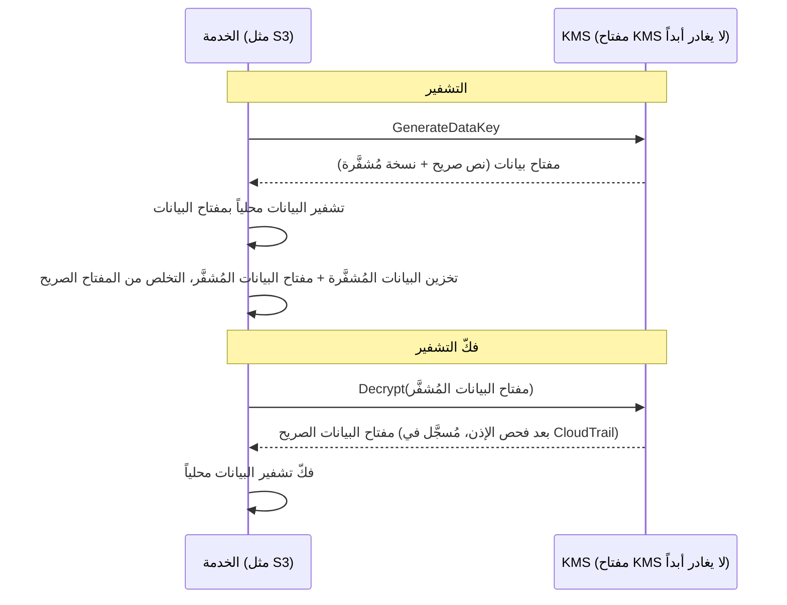

# الفصل السادس عشر: المفاتيح والأقفال والأسرار

كان مستودع git يحتوي على آلاف الإيداعات تعود إلى عامين. كان Leo يتصفّح منذ عشرين دقيقة، يتتبع خيطاً عبر التاريخ — يبحث عن متى ظهرت سلسلة اتصال قاعدة بيانات معينة لأول مرة. كاد يفوّتها. كانت في بعد ظهر يوم ثلاثاء، محشورة بين إيداعين عاديين، دُفعت من شخص غادر الشركة منذ ذلك الحين.

كلمة مرور قاعدة بيانات. في نص صريح. في التاريخ.

---

*كانت ضوابط الشبكة من الفصل الماضي محكمة الآن. مجموعات الأمان قيّدت الحركة الجانبية. NACLs حجبت نطاقات IP المعروفة السيئة. تحصّن المحيط. لكن تدقيق الأمن وجد شيئاً لا يستطيع المحيط إصلاحه: بيانات اعتماد كانت تعيش في سجل git لستة أشهر. أمن المحيط يفترض أن الأسرار في الداخل آمنة. هذه لم تكن كذلك.*

---

كان Leo يراجع سجل git حين وجده. كلمة مرور قاعدة بيانات. مُودَعة قبل ستة أشهر، في نص صريح، من قِبَل شخص لم يعد يعمل في Nimbus — جزء من ملف `.env` احتوى أيضاً على مفتاح وصول IAM لخط أنابيب النشر، سطرين أسفل سلسلة الاتصال. كان الإيداع عاماً. كانت كلمة المرور قد تغيّرت منذ ذلك الحين — لكنهم لم يعرفوا ذلك يقيناً. فحصوا كل نظام لمسته أيٌّ من بيانات الاعتماد. استغرق الأمر أربع ساعات. كان ذلك اليوم الذي قررت فيه Nimbus التوقف عن وضع الأسرار في الكود.

قالت Priya: "هل فكّرنا فيما يحدث إذا فرّع أحدهم المستودع؟ سجل git دائم. حتى لو غيّرنا كلمة المرور، أي شخص استنسخ المستودع قبل الإصلاح لا يزال لديه بيانات الاعتماد القديمة في سجله المحلي."

قال Leo: "فحصنا. تغيّرت كلمة المرور قبل ثلاثة أشهر. كل الأنظمة مؤكَّدة."

قالت Priya: "ذلك الحد الأدنى. لكن كل نظام لمسته تلك بيانات الاعتماد يحتاج إلى مراجعة. ليس فقط تلك التي تعرفها."

**التدقيق ذو الأربع ساعات**

كان Leo قد وجد ملف `.env` المُسرَّب في سجل git الساعة 10 صباحاً. بحلول الساعة 2 ظهراً، كانت لديهم إجابة على السؤال المهم: هل استُخدمت أيٌّ من بيانات الاعتماد — كلمة مرور قاعدة البيانات أو مفتاح الوصول المُودَع بجانبها — من قِبَل أي شخص غير أنظمة Nimbus؟

جرى التدقيق عبر أربع فئات.

**سجلات وصول RDS**: كل اتصال بقاعدة البيانات، مُؤرَّخ ومُسجَّل. ظهرت كلمة المرور المُسرَّبة في ثلاث سلاسل اتصال — كلها من نسخ EC2 في VPC الخاصة بـ Nimbus، كلها بعناوين IP مصدر متوقعة. لا اتصالات خارجية. لم تُستخدم كلمة المرور للاتصال بقاعدة البيانات من الخارج.

**سجلات وصول S3**: مفتاح الوصول المُسرَّب ينتمي لمستخدم IAM الخاص بخط أنابيب النشر، الذي لديه أذونات لدلو `nimbus-receipts`. استعلم Leo سجلات وصول خادم S3 لآخر ستة أشهر. جاء كل وصول من نسخ EC2 في `us-west-2` أو من دور جلب أصل CloudFront. لا حالات شاذة.

**استدعاءات API في CloudTrail**: كل استدعاء API لـ AWS أُجري بمعرّف مفتاح الوصول المُسرَّب. رشّح Leo أحداث CloudTrail للمفتاح. ثلاثمئة واثنا عشر حدثاً — كلها استدعاءات `s3:PutObject` روتينية من خط أنابيب النشر، كلها من نفس IP، كلها ضمن ساعات العمل. كان المفتاح قد استُخدم فقط من عنوان IP واحد، طابق خادم CI/CD.

قالت Priya: "وخادم CI/CD داخل VPC. كان سيتعين عليه تسريب البيانات عبر HTTPS إلى نقطة نهاية خارجية، وكنا سنرى ذلك في سجلات التدفق."

قال Leo: "فحصنا. لا HTTPS صادر من ذلك الخادم إلى IPs غير تابعة لـ AWS في آخر ستة أشهر."

**الحكم**: لم تُستخدم أيٌّ من بيانات الاعتماد من قِبَل أي شخص خارج فريق Nimbus. كان التعرّض مخاطرة، لا اختراقاً.

قالت Priya: "لكننا لا نستطيع أن نكون يقينيين. يمكننا أن نكون واثقين بشكل معقول بناءً على السجلات. لا نستطيع أن نكون يقينيين. ذلك التمييز يهم."

"ما الذي يجعلنا يقينيين؟"

"لا شيء يجعلك يقينياً بعد تعرّض بيانات اعتماد. تجدّد بيانات الاعتماد، تدقّق في الوصول، توثّق نتائجك، وتمضي قُدُماً بضوابط أفضل. اليقين غير متاح."

كان Tom يحسب أثناء المحادثة. "أربع ساعات من وقت ثلاثة مهندسين. اعتبرها أربعة آلاف دولار بالتكلفة الكاملة. بالإضافة إلى تجديد بيانات الاعتماد، والتوثيق، وكتابة تقرير الحادثة."

قالت Priya: "وذلك مجرد التحقيق. اختراق كان سيكون أكبر بمراتب. إشعارات تنظيمية. اتصالات بالعملاء. غرامات محتملة."

قال Tom: "إذن الدرس ذو الأربعة آلاف دولار كان رخيصاً."

قالت Priya: "بشكل كبير. دعونا لا نكرره."

---

**المشكلتان: تخزين الأسرار وتشفير البيانات**

للأمن حول المعلومات الحساسة مشكلتان متميزتان:

**تخزين بيانات الاعتماد** (كلمات مرور قواعد البيانات، مفاتيح API، سلاسل الاتصال): أين تعيش؟ من يمكنه الوصول إليها؟ كيف تجدّدها دون إعادة نشر تطبيقك؟

**تشفير البيانات** (معلومات العملاء، سجلات الدفع، المعلومات الشخصية): كيف تضمن أنه حتى لو حصل شخص على وصول غير مصرح به لقاعدة بياناتك أو دلو S3، لا يستطيع قراءة البيانات؟

لدى AWS خدمة مخصصة لكل مشكلة:

- **AWS Secrets Manager**: تخزّن بيانات الاعتماد وتديرها بأمان
- **AWS KMS (خدمة إدارة المفاتيح)**: تُدير مفاتيح التشفير لتشفير البيانات وفكّ تشفيرها

فكّر في Secrets Manager كحلقة مفاتيح: تحمل مفاتيحك (بيانات الاعتماد)، تُبقيها منظّمة، وتجدّدها على جدول. فكّر في KMS كخزنة: لا تحمل ما هو ثمين — تحمل المفتاح الذي يفتح القفل الذي يحمي ما هو ثمين.

**AWS Secrets Manager: لا مزيد من بيانات الاعتماد المُرمَّزة بشكل ثابت**

Secrets Manager مخزن آمن للأسرار: بيانات اعتماد قواعد البيانات، مفاتيح API، رموز OAuth، مفاتيح SSH، أو أي شيء حساس.

بدلاً من قراءة تطبيقك كلمة المرور من متغير بيئة أو ملف تكوين، يستدعي API لـ Secrets Manager عند البدء (أو عند الحاجة) ويسترجع السر. السر لا يلمس القرص أبداً. لا يظهر في كودك. ليس في متغيرات بيئتك.

هكذا تبدو العملية:

**الطريقة القديمة**:
```
DB_PASSWORD=supersecretpassword123  # في ملف .env أو متغير بيئة
```

**طريقة Secrets Manager**:
```python
import boto3
client = boto3.client('secretsmanager')
secret = client.get_secret_value(SecretId='nimbus/production/db-password')
password = json.loads(secret['SecretString'])['password']
```

نسخة EC2 تحتاج دور IAM بإذن لاستدعاء `secretsmanager:GetSecretValue` لذلك السر المحدد. لا خدمة أخرى يمكنها قراءته. السر لا يكون أبداً في الكود.

قد تتساءل: لماذا لا تستخدم متغيرات البيئة فحسب؟ إنها أبسط — تضبطها وقت النشر، ويقرأها التطبيق. متغيرات البيئة تبدو مخفية، لكنها مخزّنة في ضبط نشرك، ومخزن أسرار CI/CD، وربما مُسجَّلة أثناء جلسات التصحيح، ومرئية لأي شخص لديه وصول إلى العملية العاملة. والأهم، إنها ثابتة: بمجرد ضبطها، لا تتغير حتى يُحدّثها أحد يدوياً. Secrets Manager يخزّن بيانات الاعتماد في خدمة مُشفَّرة بضوابط وصول IAM، وتسجيل تدقيق كامل عبر CloudTrail، وتجديد تلقائي. متغيرات البيئة لا تتجدد. متغير بيئة مُسرَّب يبقى صالحاً حتى يغيّره أحد يدوياً.

**التجديد التلقائي: القوة الحقيقية**

الميزة الأعظم لـ Secrets Manager ليست تخزين الأسرار — بل تجديدها تلقائياً.

إليك السيناريو: كل 30 يوماً، ينشئ Secrets Manager كلمة مرور قاعدة بيانات جديدة، يُحدّثها في RDS، يُحدّث السر المخزَّن، ويسترجع تطبيقك كلمة المرور الجديدة في المرة القادمة التي يحتاجها. لا تدخل يدوي. لا نشر. لا "يجب أن أتذكر تجديد هذا."

يُنفَّذ التجديد كدالة Lambda. تُوفّر AWS قوالب لقواعد بيانات RDS (MySQL، PostgreSQL، Aurora). يمكنك تخصيص الدالة لأي نوع بيانات اعتماد.

سأل Tom: "كم يكلّف هذا شهرياً؟"

Secrets Manager يُقيَّم بسعر لكل سر شهرياً بالإضافة إلى كل استدعاء API. لعدد صغير من كلمات مرور قواعد البيانات ومفاتيح API، التكلفة دولارات شهرياً — لا شيء مقارنةً بتكلفة حادثة.

قالت Priya: "اختراق الأسبوع الماضي، ما الذي كان سيكلّف للتحقيق والمعالجة؟"

صمت Tom للحظة. "بما في ذلك وقتي، ووقتك، وعطلة نهاية أسبوع Leo... بضعة آلاف دولار."

"كان Secrets Manager سيكتشف المفتاح الثابت قبل استغلاله. وكان سيجدّده تلقائياً."

سحب Tom صفحة التسعير.

**ما يحدث أثناء التجديد**

سألت Maya: "مهلاً — لكن *لماذا* نفعل ذلك بهذه الطريقة؟ إذا تجدّدت كلمة مرور قاعدة البيانات، هل ينكسر التطبيق؟ كيف يلتقط كلمة المرور الجديدة دون نشر؟"

كان هذا قلقاً مشروعاً. التجديد دون تعطيل يتطلب عناية.

يعمل تجديد Secrets Manager على مراحل — مصمّم لمنع سيناريو "كلمة المرور القديمة أصبحت فجأةً غير صالحة، التطبيق ينهار":

**المرحلة 1: إنشاء إصدار سر جديد.** ينشئ Secrets Manager كلمة مرور جديدة ويخزّنها كإصدار معلّق من السر. الإصدار الحالي لا يزال نشطاً.

**المرحلة 2: الضبط على الخدمة.** دالة Lambda للتجديد تستدعي قاعدة البيانات لتحديث كلمة المرور إلى القيمة الجديدة. انتبه: مع استراتيجية التجديد الافتراضية **بمستخدم واحد** هناك لحظة قصيرة حين تكون كلمة المرور القديمة قد توقّفت للتو عن العمل (`ALTER ROLE ... PASSWORD` في PostgreSQL يسري فوراً) والإصدار الجديد ليس حالياً بعد. للتجديد بلا توقف، يدعم Secrets Manager استراتيجية **بمستخدمين متناوبين**: مستخدما قاعدة بيانات بأذونات متطابقة، حيث يُحدّث التجديد دائماً *غير النشط* ثم يبدّل — بيانات الاعتماد النشطة لا تُبطَل أبداً في منتصف العملية. عبارة الاختبار للتذكّر هي "استراتيجية التجديد بمستخدمين متناوبين".

**المرحلة 3: اختبار السر الجديد.** دالة Lambda للتجديد تتحقق من أن كلمة المرور الجديدة تعمل بالاتصال بها. إذا فشل هذا، يُتراجَع عن التجديد.

**المرحلة 4: الإنهاء.** يُعلّم Secrets Manager الإصدار الجديد كالإصدار الحالي ويُنزّل الإصدار القديم إلى إصدار سابق. يُحتفظ بالإصدار السابق لفترة سماح.

أثناء فترة السماح، كلا الإصدارين قابل للاسترجاع. إذا كان تطبيقك قد خزّن السر القديم مؤقتاً ولم يلتقط الجديد بعد، لا يزال يستطيع الاتصال. في المرة القادمة التي يستدعي فيها `GetSecretValue`، يحصل على الإصدار الحالي (الجديد).

قال Leo: "إذن التطبيق لا يحتاج أبداً إلى إعادة تشغيل."

"ليس بالضرورة. إذا خزّن تطبيقك السر مؤقتاً عند البدء ولم يُحدّثه أبداً، تحتاج إما إلى تحديثه على جدول أو التعامل مع أعطال المصادقة بإعادة جلب السر."

قالت Maya: "إذن دالة Lambda للتجديد والتطبيق يحتاجان إلى التعاون."

"Secrets Manager يفعل نصفه. كود تطبيقك يحتاج إلى فعل النصف الآخر: جلب السر عند الحاجة، والتعامل مع أعطال المصادقة بإعادة الجلب."

حدّث Leo التطبيق ليلتقط استثناءات مصادقة قاعدة البيانات، وعند الفشل، يجلب سراً طازجاً من Secrets Manager قبل إعادة المحاولة. سطران من معالجة الأخطاء. صار التجديد غير مرئي للمستخدمين.

---

**حقن أسرار خط أنابيب CI/CD**

سألت Priya: "هل فكّرنا في كيف يحصل خط أنابيب النشر على الأسرار التي يحتاجها؟ خط الأنابيب ينشر البنية التحتية. يحتاج بيانات اعتماد AWS. قد يحتاج سلاسل اتصال قاعدة بيانات لنصوص الترحيل."

شرح Leo الإعداد الحالي: الأسرار مخزّنة كأسرار GitHub Actions — مُشفَّرة في حالة الراحة في GitHub، مُحقَنة كمتغيرات بيئة وقت التشغيل.

قالت Priya: "بيانات الاعتماد في GitHub."

"مُشفَّرة."

"في نظام طرف ثالث. اختراق GitHub واحد يكشف كل أسرار خط أنابيبنا."

الحل: خط أنابيب النشر يُوثّق مع AWS عبر تفويض OIDC (مُغطّى في الفصل 14) ويسترجع أي أسرار يحتاجها من Secrets Manager وقت التشغيل. لا أسرار مخزّنة في GitHub. دور AWS لخط الأنابيب لديه إذن لقراءة أسرار محددة، لا شيء آخر.

```yaml
# GitHub Actions workflow
- name: Get DB Migration Credentials
  env:
    AWS_DEFAULT_REGION: us-west-2
  run: |
    SECRET=$(aws secretsmanager get-secret-value \
      --secret-id nimbus/staging/db-migration \
      --query SecretString --output text)
    DB_URL=$(echo $SECRET | jq -r '.url')
    # Run migration with DB_URL — never stored in a file
    flyway -url="$DB_URL" migrate
```

السر يُجلَب، يُستخدم في الذاكرة، ويُتخلَّص منه. لا يُكتَب أبداً على القرص، لا يُخزَّن أبداً في متغيرات بيئة تستمر بعد المهمة، لا في ملف سجل.

سأل Leo: "ماذا لو طُبع السر في السجل؟"

"GitHub Actions يُقنّع تلقائياً قيم الأسرار المُعدّة كأسرار GitHub. لكن هذا السر ليس سر GitHub — يأتي من Secrets Manager. تحتاج إلى تقنيعه يدوياً، أو الأفضل، عدم تسجيله أبداً."

"إذن الانضباط: اجلب، استخدم، تخلّص. لا تسجّل الأسرار أبداً. لا تخزّنها في ملفات أبداً."

قالت Priya: "ذلك الانضباط هو ما أكّد التدقيق ذو الأربع ساعات أننا كنا نفشل فيه."


**AWS KMS: مصنع الأقفال**

سألت Maya: "مهلاً — لكن *لماذا* نفعل ذلك بهذه الطريقة؟ لماذا خدمة إدارة مفاتيح منفصلة؟ ألا يمكننا تشفير البيانات بأنفسنا وتخزين المفتاح في Secrets Manager؟"

يمكنك تخزين مفاتيح التشفير في Secrets Manager. لكن حينها من يتحكم في الوصول إلى المفتاح؟ ما الذي يضمن تجديد المفتاح؟ ما الذي يُثبت لمدقق أن المفتاح استُخدم فقط من خدمات مصرّح لها؟ KMS تُجيب على كل هذه الأسئلة. إنها ليست مجرد تخزين — إنها خدمة إدارة دورة حياة المفاتيح بأمان مدعوم بالأجهزة، وسياسات IAM دقيقة لكل مفتاح، وسجل تدقيق كامل لكل استخدام. Secrets Manager يخزّن ما تحتاجه للاتصال بالأنظمة. KMS يحمي الأنظمة نفسها.

تُدير AWS KMS (خدمة إدارة المفاتيح) **المفاتيح التشفيرية** — القيم السرية المستخدمة لتشفير البيانات وفكّ تشفيرها.

التشبيه: KMS كشركة خزائن تحتفظ بالمفتاح الرئيسي. بياناتك (محتويات الخزنة) مُشفَّرة. فقط من لديه إذن باستخدام مفتاح KMS يمكنه فكّ تشفيرها. KMS تسجّل كل استخدام لكل مفتاح في CloudTrail.

**مفاتيح CMK** — تُسمّى الآن مفاتيح KMS — تأتي في ثلاثة أنواع ملكية:

**المفاتيح المملوكة لـ AWS**: مفاتيح تملكها AWS وتستخدمها عبر حسابات عملاء كثيرة — لا تراها أبداً، لا تدفع مقابلها أبداً، ولا تظهر في حسابك. عدة افتراضات خدمات تستخدمها (التشفير الافتراضي لـ DynamoDB مثلاً).

(تمييز يستحق الإبقاء عليه واضحاً: التشفير الافتراضي لـ S3 **SSE-S3** *ليس* نموذج مفتاح KMS أصلاً — يدير S3 مفاتيح AES-256 الخاصة به تماماً خارج KMS، بلا مفتاح لرؤيته وبلا سجل تدقيق لاستخدام المفتاح. **SSE-KMS** هو خيار S3 الذي يمر عبر KMS، مستخدماً إما المفتاح المُدار من AWS `aws/s3` أو مفتاحاً مُداراً من العميل. مُحفِّز الاختبار: "تدقيق من استخدم مفتاح التشفير" أو "التحكم في التجديد وسياسة المفتاح" ← SSE-KMS بمفتاح مُدار من العميل — كل استخدام يصل إلى CloudTrail.)

**المفاتيح المُدارة من AWS**: تُنشئ AWS المفتاح وتديره تلقائياً *في حسابك* للخدمات مثل S3 وEBS وRDS (مُسمّى مثل `aws/s3`). يمكنك رؤيته وتدقيق استخدامه في CloudTrail، لكن لا يمكنك تغيير سياسته أو تجديده — AWS تجدّده تلقائياً كل عام. مجاني.

**المفاتيح المُدارة من العميل**: تُنشئ المفتاح في KMS وتتحكم في كل جانب منه: من يمكنه استخدامه، ومتى يتجدد، ومن يمكنه إدارته. يمكنك تفعيل التجديد التلقائي للمفاتيح بفترة قابلة للضبط بين 90 يوماً و2,560 يوماً (7 سنوات)؛ فترة التجديد الافتراضية 365 يوماً (سنوياً). يمكنك أيضاً تشغيل **تجديد عند الطلب** فوراً — مفيد بعد تعرّض مشتبه به، دون انتظار الجدول. ملاحظة: التجديد التلقائي ينطبق على المفاتيح المتماثلة ذات المادة المُولَّدة من KMS — المفاتيح غير المتماثلة ومادة المفاتيح المستوردة لا يمكنها التجديد التلقائي. التكلفة: 1 دولار/شهر لكل مفتاح بالإضافة إلى رسوم كل استدعاء API.

إذا اخترت مفاتيح KMS المُدارة من العميل، فستحصل على تحكم كامل في جداول التجديد وسياسات الوصول ورؤية التدقيق، لكنك تدفع لكل مفتاح شهرياً وتتحمّل مسؤولية إدارة المفاتيح؛ وإذا اخترت المفاتيح المُدارة من AWS، فستحصل على التشفير بصفر عبء تشغيلي وبلا تكلفة للمفتاح نفسه، لكن لا يمكنك تخصيص جداول التجديد أو سياسات المفاتيح — إنها مُدارة بالكامل من AWS.

**التشفير في خدمات AWS: تكامل KMS**

تتكامل معظم خدمات AWS مع KMS للتشفير:

**S3**: فعّل "التشفير من جانب الخادم بـ KMS" على دلو. كل كائن مُشفَّر في حالة راحة بمفتاح KMS. قراءة كائن تتطلب إذناً لدلو S3 *ومفتاح KMS*.

**RDS**: فعّل التشفير وقت الإنشاء. تُشفَّر تخزين قاعدة البيانات والنسخ الاحتياطية واللقطات بمفتاح KMS. ملاحظة: لا يمكن تفعيل التشفير على نسخة RDS غير مُشفَّرة موجودة — يجب أخذ لقطة، ونسخ اللقطة مع تفعيل التشفير، والاستعادة.

**EBS**: تشفير الأقراص بـ KMS. الأقراص الجديدة المُنشأة من لقطات مُشفَّرة تكون مُشفَّرة تلقائياً.

**DynamoDB**: التشفير في حالة الراحة بـ KMS مُفعَّل افتراضياً على جميع الجداول.

**ElastiCache Redis**: التشفير في حالة الراحة بـ KMS للبيانات المخزّنة مؤقتاً الحساسة.

المبدأ: يجب تشفير البيانات في حالة الراحة (مخزّنة على القرص) وأثناء النقل (تتحرك عبر الشبكة). KMS يتعامل مع تشفير حالة الراحة. TLS/SSL (مُوفَّر تلقائياً من قِبَل خدمات AWS) يتعامل مع التشفير أثناء النقل.

**التشفير بالغلاف: كيف يعمل KMS فعلياً**

تفصيل يساعدك على فهم سلوك KMS وأسئلة الاختبار.

KMS لا يُشفّر بياناتك مباشرةً في معظم الحالات. يستخدم **التشفير بالغلاف**:

1. KMS يُنشئ **مفتاح بيانات** (مفتاح متماثل فريد)
2. الخدمة تستخدم مفتاح البيانات لتشفير بياناتك محلياً (سريع — تشفير متماثل)
3. الخدمة تطلب من KMS تشفير مفتاح البيانات نفسه (باستخدام مفتاح KMS الخاص بك)
4. يُخزَّن كلٌّ من البيانات المُشفَّرة ومفتاح البيانات المُشفَّر
5. بياناتك الفعلية لا تغادر الخدمة أبداً — فقط مفتاح البيانات يذهب إلى KMS للتشفير/فكّ التشفير

حين تقرأ البيانات:

1. الخدمة تطلب من KMS فكّ تشفير مفتاح البيانات
2. KMS تتحقق من الأذونات، تُفكّ تشفير مفتاح البيانات، تُرجعه
3. الخدمة تستخدم مفتاح البيانات المفكوك تشفيره لفكّ تشفير بياناتك محلياً



هذا يعني أن KMS يمكنه التعامل مع بيانات كبيرة جداً دون إرسالها كلها عبر API الخاص بـ KMS. فقط مفاتيح صغيرة تذهب إلى KMS. CloudTrail يسجّل كل استدعاء API لـ KMS — كل عملية تشفير وفكّ تشفير.

**سياسات مفاتيح KMS: نموذج الوصول**

سألت Priya: "هل فكّرنا فيما يحدث إذا تعارضت سياسة IAM وسياسة مفتاح؟ KMS لها تحكم وصول خاص بها فوق IAM."

لمفاتيح KMS **سياسات مفاتيح** — سياسات قائمة على الموارد مرفقة بالمفتاح نفسه. إنها متميزة عن سياسات IAM وتتبع قواعد تقييم مختلفة.

ليستخدم مبدأٌ مفتاح KMS، يجب أن يكون أمران صحيحين:

**أولاً**: سياسة المفتاح يجب أن تسمح به. إذا لم تمنح سياسة المفتاح المبدأ الوصول صراحةً، لا يمكنه استخدام المفتاح — بغض النظر عما تقوله سياسة IAM الخاصة به. هذا مختلف عن معظم موارد AWS، حيث تكون سياسات IAM وحدها كافية.

**ثانياً**: سياسة IAM للمبدأ يجب أن تسمح بإجراء KMS (مثل `kms:Decrypt`، `kms:GenerateDataKey`).

كلاهما يجب أن يقول نعم. أيٌّ منهما يقول لا يعني أن الإجراء مرفوض.

سياسة المفتاح الافتراضية التي تُنشئها AWS للمفاتيح المُدارة من العميل تتضمن عبارة تقول "الحساب الجذر يمكنه إدارة هذا المفتاح." هذا مهم: يعني أن مسؤول IAM على مستوى الحساب يمكنه دائماً منح الوصول إلى مفتاح، حتى لو لم تُسمّه سياسة المفتاح مباشرةً — لأن تفويض الحساب الجذر موجود.

سأل Leo: "إذن إذا أزلنا الحساب الجذر من سياسة المفتاح، تتوقف سياسات IAM عن العمل لذلك المفتاح؟"

"صحيح. إزالة تفويض الحساب الجذر طريقة لإغلاق مفتاح بإحكام شديد بحيث لا يمكن سوى للمبادئ المحددة المُسمّاة في سياسة المفتاح استخدامه — ولا حتى مسؤولو الحساب. إنها أيضاً طريقة لإغلاق نفسك خارج مفتاحك عن طريق الخطأ."

"هل يمكننا التعافي؟"

"فقط بالاتصال بدعم AWS. إذا لم يستطع أحد استخدام المفتاح ولم يمكن تحديث سياسة المفتاح، فإن البيانات المُشفَّرة بذلك المفتاح غير قابلة للوصول فعلياً."

"إذن لا تُزل الحساب الجذر من سياسة المفتاح دون سبب ممتاز للغاية."

"صحيح."

---

**المفاتيح غير المتماثلة: التوقيع والتحقق**

يدعم KMS أيضاً أزواج مفاتيح غير متماثلة — مفتاح عام ومفتاح خاص.

حالات الاستخدام:

**التوقيع الرقمي**: توقّع مستنداً أو رمز JWT بالمفتاح الخاص. أي شخص لديه المفتاح العام يمكنه التحقق من أن التوقيع جاء من حامل المفتاح الخاص، وأن المحتوى لم يُعبَث به.

**التشفير بالمفتاح العام**: أي شخص يمكنه تشفير البيانات بالمفتاح العام. فقط حامل المفتاح الخاص يمكنه فكّ تشفيرها.

بالنسبة لـ Nimbus، صارت المفاتيح غير المتماثلة ذات صلة حين نفّذوا نظام توقيع webhook لشركاء المطاعم. حين أرسلت Nimbus حدثاً إلى خادم شريك مطعم (طلب جديد، تحديث حالة)، احتاج الشريك إلى التحقق من أن الحدث جاء فعلاً من Nimbus ولم يُزوَّر.

التنفيذ:

1. تُنشئ Nimbus مفتاح KMS غير متماثل (RSA 2048 بت، خوارزمية SIGN_VERIFY)
2. عند إرسال webhook، تستدعي Nimbus `kms:Sign` بالمفتاح الخاص لتوقيع حمولة الحدث
3. يُضمَّن التوقيع في ترويسة webhook
4. تنشر Nimbus المفتاح العام (قابل للتنزيل من وحدة تحكم KMS)
5. خادم شريك المطعم يجلب المفتاح العام ويستخدمه للتحقق من التوقيع على كل webhook وارد

المفتاح الخاص لا يغادر KMS أبداً. Nimbus لا تملك أبداً وصولاً لمادة المفتاح الخاص الخام. KMS يُجري عملية التوقيع داخل وحدة أمان الأجهزة الخاصة به.

قال Rafael: "إذن حتى لو اخترق أحدهم خادم Nimbus، لا يستطيع تزوير توقيع webhook. المفتاح الخاص في KMS، لا على أي خادم."

"صحيح. التوقيع يتطلب استدعاء API لـ KMS. كل استدعاء API مُسجَّل في CloudTrail. إذا حاول أحدهم توقيع حدث احتيالي، سنرى استدعاء API."

---

**قصة حذف المفتاح**

بعد ثلاثة أشهر من إعداد KMS، ارتكب Tom خطأً.

كان ينظّف موارد AWS غير المستخدمة — دوال Lambda قديمة، دلوات S3 راكدة، لوحات تحكم CloudWatch مهجورة. كان يتحرك بسرعة. جدول عن طريق الخطأ مفتاح KMS للحذف.

كان المفتاح `nimbus/prod/order-receipts` — المفتاح المُدار من العميل المستخدم لتشفير دلو إيصالات الطلبات على S3.

قال Tom بلهجة جافة: "حذفت اثني عشر مورداً دفعةً واحدة أمس ولم أتحقق ما كان الثاني عشر." كان قد جدول الحذف ومضى. لاحظ الخطأ في الصباح التالي حين راجع إجراءاته.

فتح وحدة تحكم KMS. حالة المفتاح: "معلّق للحذف. الحذف خلال 7 أيام."

كان قد جدوله لفترة الانتظار الدنيا.

سأل: "هل يمكننا إلغاؤه؟"

فتحت Priya الوثائق. "نعم. أثناء فترة الانتظار، المفتاح معطّل لكن غير محذوف. يمكنك إلغاء الحذف."

ألغى Tom الحذف خلال الدقيقة. عاد المفتاح إلى حالة نشطة.

قالت Priya: "سبعة أيام هي فترة الانتظار الدنيا. تفرضها AWS لأنه إذا حُذف مفتاح وكانت بيانات مُشفَّرة به، فتلك البيانات ذهبت إلى الأبد. غير قابلة للاسترداد. فترة الانتظار تمنحك وقتاً لإدراك الخطأ."

"كم ينبغي أن تكون فترة الانتظار؟"

"الحد الأقصى ثلاثون يوماً. لأي مفتاح يُشفّر بيانات إنتاج، استخدم ثلاثين يوماً. الأسابيع الثلاثة الإضافية من الحماية ضد الحوادث تستحق الإزعاج الطفيف."

حدّث Tom كل إعدادات حذف مفاتيح الإنتاج إلى ثلاثين يوماً. كما أعدّ إنذار CloudWatch يُطلَق إذا تغيّرت حالة أي مفتاح KMS إلى "معلّق للحذف" — حتى المرة القادمة التي يرتكب فيها أحد (بما فيهم هو) نفس الخطأ، سيعلم الفريق خلال خمس دقائق.

---

**Secrets Manager مقابل Parameter Store**

لدى AWS أيضاً **Systems Manager Parameter Store** الذي يخزّن قيم التكوين (وليس فقط الأسرار). Parameter Store أرخص — مجاني للمعاملات القياسية. يمكنه أيضاً تخزين معاملات مُشفَّرة باستخدام KMS.

للأسرار التي تحتاج إلى تجديد: Secrets Manager.

لقيم التكوين والمعاملات غير الحساسة: Parameter Store (الطبقة المجانية كريمة جداً).

لتكوين التطبيق (أرقام المنافذ، أعلام الميزات، الإعدادات الخاصة بالبيئة): Parameter Store.

| | Secrets Manager | SSM Parameter Store |
|---|---|---|
| التجديد التلقائي | نعم (مدعوم بـ Lambda) | لا |
| التكلفة | ~0.40 دولار/سر/شهر | مجاني (قياسي) |
| التشفير | دائماً | اختياري (مع KMS) |
| الإصدارات | نعم | نعم |
| الوصول عبر الحسابات | نعم | محدود |
| الأفضل لـ | كلمات مرور قواعد البيانات، مفاتيح API | قيم التكوين، أعلام الميزات |

## الشهادة على الباب

بعد أسبوعين من ترحيل الأسرار، كانت Priya تراجع بيئة تجهيز Nimbus على هاتفها حين لاحظت شريط العنوان.

"غير آمن."

سحبت عنوان URL للإنتاج. نفس الشيء.

قالت وهي تضع هاتفها على الطاولة: "Leo، هل نعمل على HTTP؟"

تحقّق Leo. "مُستمِع ALB على المنفذ 80. لم نُعدّ HTTPS أبداً."

"إذن كل طلب يُجريه مستخدمونا — كل طلب، كل تسجيل دخول — يذهب عبر HTTP غير مُشفَّر؟"

عرض Leo: "لدينا TLS على اتصال RDS."

"تلك بيانات أثناء النقل بين التطبيق وقاعدة البيانات. أتحدث عن بيانات أثناء النقل بين متصفح المستخدم وموازن تحميلنا. تلك غير مُشفَّرة بتاتاً."

كان Tom يصغي. "هل تلك مشكلة أمنية أم مشكلة تصوّر؟"

قالت Priya: "كلاهما. HTTP غير المُشفَّر يعني أن أي شبكة بين المستخدم وخادمنا — موجّه مقهى، مزوّد إنترنت — يمكنها قراءة الزيارات. كلمات المرور، تفاصيل الطلبات، رموز الجلسات. والمتصفحات الحديثة تُحذّر المستخدمين بـ 'غير آمن'. ذلك يقتل معدلات التحويل."

قالت Maya: "إذن نحتاج شهادة TLS. كم تكلّف؟"

قالت Priya: "لا شيء. AWS Certificate Manager."

تُوفّر **AWS Certificate Manager (ACM)** شهادات TLS/SSL مجانية للاستخدام مع الخدمات المُدارة من AWS: ALBs، توزيعات CloudFront، وAPI Gateway. لا تشتري شهادة، ولا تدير تقويم تجديد، ولا تلمس مادة مفتاح خاص. ACM تتعامل مع دورة حياة الشهادة بأكملها.

شهادة صادرة من ACM صالحة لـ 13 شهراً. قبل انتهائها، تجدّدها ACM تلقائياً. إذا نجح التجديد، تُرفق الشهادة الجديدة بموازن تحميلك أو توزيعك دون أي إجراء منك. قفل المتصفح يبقى أخضر. تنبيه الانتهاء الذي نسيت ضبطه لا يُطلَق أبداً.

**نوعان من شهادات ACM**:

**الشهادات العامة** صادرة من سلطة شهادات Amazon ومُوثَّقة من كل المتصفحات الرئيسية. إنها مجانية تماماً للاستخدام مع ALB وCloudFront وAPI Gateway. تتحقق من ملكية النطاق إما عبر DNS أو البريد.

**الشهادات الخاصة** صادرة من AWS Private CA — سلطة شهادات خاصة مُدارة تُشغّلها للخدمات الداخلية (mTLS خدمة-إلى-خدمة، الأدوات الداخلية، عملاء VPN). لـ Private CA تكلفة شهرية.

بالنسبة لـ Nimbus، كانت الشهادات العامة الخيار الصحيح.

**التحقق عبر DNS مقابل البريد**:

فتح Leo وحدة تحكم ACM وبدأ طلب شهادة لـ `eatnimbus.com` و`*.eatnimbus.com`.

قال: "تسأل كيف أريد التحقق من الملكية. DNS أم بريد."

قالت Priya: "DNS. دائماً DNS."

مع التحقق عبر DNS، تضيف ACM سجل CNAME محدداً إلى منطقتك المستضافة. Route 53 يمكنها فعل هذا تلقائياً — نقرة واحدة في وحدة التحكم. ما دام ذلك سجل CNAME موجوداً، يمكن لـ ACM تجديد الشهادة تلقائياً دون أي إجراء بشري. التحقق عبر البريد يُرسل بريداً إلى جهة الاتصال المُسجَّلة للنطاق ويتطلب نقرة يدوية في كل مرة تتجدد فيها الشهادة. تلك النقرة تُنسى. التحقق عبر DNS لا يتطلب من أحد تذكّر أي شيء.

قال Leo: "إذن أضيف سجل CNAME مرة، ويتجدد إلى الأبد؟"

قالت Priya: "حتى يحذف أحدهم سجل CNAME. لا تحذف سجل CNAME."

طلب Leo الشهادة، وأضاف CNAME التحقق في Route 53 (الذي عرضت ACM فعله تلقائياً)، وانتظر خمس دقائق. تغيّرت حالة الشهادة إلى صادرة. أرفقها بمُستمِع HTTPS لـ ALB على المنفذ 443 وأضاف قاعدة إعادة توجيه على المنفذ 80 لإرسال كل زيارات HTTP إلى HTTPS.

حدّث Tom عنوان URL للإنتاج.

ظهر القفل.

تفصيل إقليمي يستحق الإشارة: الشهادة مورد إقليمي، ويجب أن تعيش في نفس منطقة الخدمة التي تستخدمها. لـ ALB، تلك منطقة ALB. لـ **CloudFront**، يجب طلب الشهادة (أو استيرادها) في **`us-east-1`** — دائماً، بغض النظر عن مكان تشغيل أصولك — لأن CloudFront خدمة عالمية مرتكزة هناك. كان Leo قد تعثّر بهذا في الفصل 13؛ إنها أيضاً حقيقة اختبار موثوقة.

**الشيء الوحيد الذي لا تستطيع شهادات ACM فعله**:

سأل Leo: "هل يمكنني تنزيل الشهادة؟ أريد تثبيتها على نسخة EC2 الداخلية للمشرف."

قالت Priya: "لا."

شهادات ACM العامة المجانية لا يمكن تصديرها. لا يمكنك تنزيل المفتاح الخاص وتثبيته على نسخة EC2، أو خادم Nginx، أو أي شيء خارج الخدمات المُدارة من AWS. مادة المفتاح الخاص لا تغادر ACM أبداً. هذا مقصود — يمنع المفتاح الخاص من التسرّب، أو التخزين غير الآمن، أو النسيان حين تنتهي الشهادة.

لحالات الاستخدام التي تتطلب شهادة قابلة للتثبيت — نسخة EC2 تعمل كوكيل مخصص، خادم محلي — هناك ثلاثة طرق: شهادة من سلطة طرف ثالث (Let's Encrypt مثلاً)، أو AWS Private CA مع تفعيل تصدير الشهادات، أو — منذ يونيو 2025 — **شهادات ACM العامة القابلة للتصدير** المدفوعة (اختيار عند الإصدار، تُحتسب لكل FQDN أو wildcard)، التي *يمكن* تصدير مفتاحها الخاص للاستخدام في أي مكان.

قالت Priya: "لـ ALB وتوزيع CloudFront لدينا، ACM صحيحة تماماً. مجانية، تلقائية، ولا نلمس مفتاحاً أبداً."

## نقاط القوة والقيود

**AWS Secrets Manager**:

- تجديد سري تلقائي بدون تغييرات في الكود أو عمليات نشر
- تحكم دقيق في وصول IAM لكل سر (كل سر مورد IAM منفصل)
- الإصدارات — يبقى الإصدار السابق قابلاً للوصول أثناء التجديد، مما يمنع انقطاع الاتصالات
- التدقيق عبر CloudTrail — كل استدعاء `GetSecretValue` مُسجَّل مع هوية المُستدعي
- الوصول عبر الحسابات — يمكن مشاركة أسرار حساب مع دور حساب آخر
- التكلفة: ~0.40 دولار/سر/شهر + استدعاءات API (نحو 0.05 دولار لكل 10,000 استدعاء API)

**AWS KMS**:

- إدارة مركزية للمفاتيح مع سجل تدقيق كامل — كل تشفير وفكّ تشفير مُسجَّل
- تجديد تلقائي قابل للضبط للمفاتيح المُدارة من العميل (90 يوماً إلى 2,560 يوماً؛ الافتراضي 365 يوماً) — مادة المفتاح القديمة لا تزال تُفكّ تشفير البيانات الموجودة، مادة المفتاح الجديدة تُشفّر البيانات الجديدة
- أذونات IAM دقيقة لكل مفتاح (سياسات المفاتيح + سياسات IAM — كلاهما يجب أن يسمح)
- مدعوم بوحدة أمان الأجهزة (HSM) — المفاتيح لا تغادر HSM في نص صريح أبداً
- دعم المفاتيح متعددة المناطق لسيناريوهات الاسترداد من الكوارث
- دعم المفاتيح غير المتماثلة للتوقيع الرقمي والتحقق
- التكلفة: 1 دولار/شهر لكل مفتاح + 0.03 دولار لكل 10,000 استدعاء API

**حيث يتعقد الأمر**:

- سياسات مفاتيح KMS منفصلة عن (وتُقيَّم جنباً إلى جنب مع) سياسات IAM — تصحيح أخطاء الوصول المرفوض يتطلب فحص كليهما
- يجب التخطيط للتشفير في حالة الراحة مسبقاً — لا يمكنك تشفير نسخة RDS غير مُشفَّرة موجودة في مكانها
- حذف المفاتيح في KMS له فترة انتظار من 7 إلى 30 يوماً — آلية أمان، لكن من السهل نسيانها أثناء الإعداد وخطير تشغيلها عن طريق الخطأ
- التجديد يتطلب من كود التطبيق التعامل مع إعادة جلب الأسرار عند فشل المصادقة — Secrets Manager يجدّد بيانات الاعتماد، لكن على التطبيق التقاطها
- تكاليف Secrets Manager تتوسع مع عدد الأسرار وحجم استدعاءات API على نطاق واسع
- سياسة المفتاح الافتراضية (بما في ذلك تفويض الحساب الجذر) حرجة للحفاظ عليها — إزالتها يمكن أن تُغلق المسؤولين خارج المفتاح

## الملخص

الأربع ساعات المُنفقة في تتبع بيانات اعتماد مخترقة عبر كل نظام لمسته كانت أربع ساعات كان Secrets Manager قادراً على منعها. التجديد التلقائي يعني أن بيانات اعتماد مسروقة لها عمر قصير. KMS يعني أنه حتى لو وصل أحدهم إلى البيانات، لا يمكنه قراءتها دون مفتاح غير مصرح له باستخدامه. وفترة انتظار حذف مفتاح من ثلاثين يوماً تعني أن حذفاً عرضياً يمكن إلغاؤه قبل أن يصبح حدث فقدان بيانات.

- لا تخزّن بيانات الاعتماد في الكود أو متغيرات البيئة أو ملفات التكوين المُودَعة في مراقبة الإصدارات.
- **Secrets Manager** يخزّن بيانات الاعتماد بأمان ويجدّدها تلقائياً. تجلب التطبيقات الأسرار عبر API وقت التشغيل.
- **التجديد** يحدث على مراحل: إنشاء إصدار جديد، الضبط على الخدمة، الاختبار، الترقية. كلا الإصدارين القديم والجديد صالحان لفترة وجيزة، مما يمنع انقطاع الاتصالات أثناء التجديد.
- **KMS** يُدير مفاتيح التشفير. تتكامل معظم خدمات AWS مع KMS للتشفير في حالة الراحة.
- **التشفير بالغلاف**: KMS يُشفّر المفتاح، وليس البيانات مباشرةً. الخدمة تُشفّر البيانات باستخدام مفتاح بيانات محلي، الذي يُشفّره KMS. فقط مفاتيح صغيرة تجتاز API الخاص بـ KMS.
- **مفاتيح KMS المُدارة من العميل**: تحكم كامل في التجديد (قابل للضبط 90–2,560 يوماً، الافتراضي 365 يوماً سنوياً)، والوصول، والتدقيق (1 دولار/شهر). **المفاتيح المُدارة من AWS**: تلقائية، لا تكوين مطلوب، مجانية.
- **سياسات مفاتيح KMS**: سياسة المفتاح سياسة قائمة على الموارد تعمل جنباً إلى جنب مع IAM. كلاهما يجب أن يقول نعم. تفويض الحساب الجذر في سياسة المفتاح الافتراضية يضمن أن مسؤولي IAM يمكنهم دائماً منح الوصول.
- **المفاتيح غير المتماثلة**: يدعم KMS أزواج مفاتيح RSA وECC للتوقيع والتحقق. المفتاح الخاص لا يغادر HSM أبداً.
- **حذف المفاتيح**: فترة انتظار دنيا 7 أيام، قصوى 30 يوماً. المفاتيح المحذوفة تعني بيانات مُشفَّرة غير قابلة للوصول دائماً. استخدم 30 يوماً لمفاتيح الإنتاج، وراقب حالة الحذف المعلّق.
- **أسرار CI/CD**: اجلب من Secrets Manager وقت التشغيل باستخدام تفويض OIDC. لا تخزّن الأسرار أبداً كمتغيرات منصة CI/CD.

## نصائح الاختبار

*SAA-C03 المجال: تصميم معماريات آمنة (المجال الأول، المهمة 1.3)*

- **Secrets Manager مقابل SSM Parameter Store**: Secrets Manager لبيانات الاعتماد التي تحتاج إلى تجديد تلقائي؛ Parameter Store للتكوين العام. يُميّز الاختبار بينهما بمتطلب التجديد وحساسية التكلفة.
- **سياسات مفاتيح KMS**: مفتاح KMS له سياسة مفاتيح خاصة به (سياسة قائمة على الموارد). سياسات IAM وحدها لا تمنح الوصول إلى مفتاح KMS — يجب أن تسمح به سياسة المفتاح صراحةً. كلٌّ من سياسة المفتاح وسياسة IAM يجب أن يسمح بالإجراء.
- **تشفير RDS**: لا يمكن تفعيل التشفير على نسخة RDS غير مُشفَّرة موجودة. العملية: إنشاء لقطة ← نسخ اللقطة مع تفعيل التشفير ← الاستعادة من اللقطة المُشفَّرة ← نقل الزيارات إلى النسخة الجديدة.
- **تشفير EBS**: يمكن تشفير الأقراص الجديدة. اللقطات من الأقراص المُشفَّرة مُشفَّرة دائماً. لا يمكن تشفير الأقراص غير المُشفَّرة مباشرةً — لقطة + نسخ + استعادة.
- **CloudTrail + KMS**: كل استدعاء API لـ KMS مُسجَّل في CloudTrail. هذه ميزة امتثال رئيسية. حين يسأل الاختبار كيف تدقّق من فكّ تشفير أي بيانات، الإجابة هي CloudTrail + KMS.
- **مفاتيح KMS متعددة المناطق**: نسخ مادة المفاتيح إلى مناطق متعددة حتى يحدث فكّ التشفير دون استدعاءات API عبر المناطق. يستخدم الاختبار هذا للاسترداد من الكوارث متعدد المناطق مع البيانات المُشفَّرة.
- **KMS مقابل CloudHSM**: KMS متعدد المستأجرين (مُدار من AWS). CloudHSM وحدة أمان أجهزة مخصصة تتحكم فيها فقط أنت. إشارات الاختبار: "FIPS 140-2 المستوى 3"، "HSM مخصصة"، "عمليات تشفير مُدارة من العميل" ← CloudHSM.
- **التشفير بالغلاف**: KMS يُنشئ مفتاح بيانات، الخدمة تستخدمه لتشفير البيانات محلياً، KMS يُشفّر مفتاح البيانات. سؤال الاختبار: "لماذا لا يُشفّر KMS كميات كبيرة من البيانات مباشرةً؟" ← الأداء؛ التشفير بالغلاف يُبقي البيانات الكبيرة محلية.
- **مفاتيح KMS غير المتماثلة**: تُستخدم للتوقيع الرقمي، والتحقق من JWT، أو التشفير بالمفتاح العام. المفتاح الخاص لا يغادر KMS أبداً. `kms:Sign` هو استدعاء API للتوقيع؛ `kms:Verify` للتحقق.
- **فترة انتظار حذف المفتاح**: 7-30 يوماً. أثناء هذه الفترة، المفتاح معطّل وغير قابل للاستخدام، لكن يمكن إلغاء الحذف. بعد الحذف، أي بيانات مُشفَّرة بذلك المفتاح غير قابلة للاسترداد دائماً.
- **ACM (AWS Certificate Manager):** شهادات TLS عامة مجانية للاستخدام مع ALB وCloudFront وAPI Gateway. تجديد تلقائي عبر التحقق بـ DNS. الشهادات العامة المجانية لا يمكن تصدير مفتاحها الخاص — تعيش داخل AWS فقط (يوجد خيار *شهادة عامة قابلة للتصدير* مدفوع منذ 2025 للاستخدام في EC2/المحلي). مُحفِّز الاختبار: "HTTPS على موازن تحميل أو CDN" ← ACM.

## تمارين

**تمرين 1 — استرجاع**

اشرح مفهوم التشفير بالغلاف. لماذا يُشفّر KMS مفتاح بيانات صغيراً بدلاً من تشفير بيانات تطبيقك مباشرةً؟

*(تلميح: فكّر في ما يحدث لو كان لديك 1 جيجابايت من البيانات لتشفيرها، وما الآثار الأدائية لإرسال 1 جيجابايت إلى خدمة KMS بعيدة.)*

**تمرين 2 — سيناريو SAA-C03**

*سيناريو*: تخزّن شركة خدمات مالية بيانات العملاء الحساسة في قاعدة بيانات RDS MySQL. يُلزم متطلب امتثال جديد بـ:

1. يجب تشفير جميع البيانات في حالة الراحة
2. يجب إمكانية التدقيق في جميع استخدامات مفاتيح التشفير
3. يجب أن تكون مفاتيح التشفير مُتحكَّماً بها من العميل (وليس مُدارةً من AWS)
4. يجب تجديد كلمة مرور قاعدة البيانات تلقائياً كل 90 يوماً

تم إنشاء قاعدة البيانات منذ ستة أشهر بدون تشفير مُفعَّل. أي مجموعة إجراءات تُلبّي جميع المتطلبات الأربعة على أفضل وجه؟

A) تفعيل تشفير RDS على قاعدة البيانات الموجودة؛ إنشاء مفتاح KMS مُدار من العميل؛ ضبط Secrets Manager بتجديد 90 يوماً  
B) إنشاء لقطة من قاعدة البيانات الموجودة؛ نسخ اللقطة مع التشفير باستخدام مفتاح KMS مُدار من العميل؛ الاستعادة من اللقطة المُشفَّرة؛ ضبط Secrets Manager بتجديد 90 يوماً  
C) إنشاء نسخة RDS مُشفَّرة جديدة بمفتاح AWS مُدار؛ ترحيل البيانات من النسخة القديمة؛ ضبط Secrets Manager بتجديد 90 يوماً  
D) تفعيل تشفير RDS في حالة الراحة على قاعدة البيانات الموجودة باستخدام مفتاح AWS مُدار؛ ضبط Secrets Manager بتجديد 90 يوماً

**تلميح 1**: لا يمكن تفعيل التشفير على نسخة RDS غير مُشفَّرة موجودة مباشرةً.

**تلميح 2**: المفاتيح "مُتحكَّم بها من العميل" تعني مفاتيح KMS المُدارة من العميل، وليس المفاتيح المُدارة من AWS.

**تلميح 3**: عملية نسخ اللقطة هي مسار الترحيل القياسي إلى RDS المُشفَّرة.

**الإجابة**: B

**الشرح**: لا يمكن تفعيل تشفير RDS على نسخة موجودة. الأسلوب القياسي: أخذ لقطة من النسخة الموجودة ← نسخ اللقطة مع تفعيل التشفير باستخدام مفتاح KMS مُدار من العميل (يلبي المتطلبات 1 و2 و3) ← الاستعادة من اللقطة المُشفَّرة. تسجّل مفاتيح KMS المُدارة من العميل تلقائياً جميع الاستخدامات في CloudTrail (التدقيق) وتُبقي مفاتيح التشفير تحت تحكمك. يتعامل Secrets Manager مع التجديد التلقائي للكلمة المرور كل 90 يوماً (يلبي المتطلب 4).

**لماذا ليس A؟** لا يمكنك تفعيل التشفير على نسخة RDS غير مُشفَّرة موجودة في مكانها.

**لماذا ليس C؟** المفاتيح المُدارة من AWS لا تلبي متطلب "مُتحكَّم بها من العميل" (المتطلب 3).

**لماذا ليس D؟** نفس مشكلة A (لا يمكن التفعيل في مكانها) بالإضافة إلى المفتاح المُدار من AWS لا يلبي المتطلب 3.

*SAA-C03 المجال: تصميم معماريات آمنة — المهمة 1.3*

**تمرين 3 — تحدي المعمارية** *(اختياري)*

تحتاج Nimbus إلى تخزين البيانات الحساسة التالية:

- كلمة مرور قاعدة البيانات لنسخة RDS في بيئة الإنتاج
- مفتاح Stripe API السري (يُستخدم لمعالجة المدفوعات)
- مفتاح تشفير متماثل لتشفير سجل طلبات العملاء في DynamoDB
- قيم تكوين لكل مطعم (نقاط نهاية API، أعلام ميزات — ليست حساسة)

أي خدمة AWS أو نهج ستستخدم لكل منها؟ أي استراتيجية تجديد ستطبّق على كل منها؟

*(لا توجد إجابة صحيحة واحدة. الهدف التدرب على مطابقة أدوات الأمان مع حالات الاستخدام.)*

## مشهد ما بعد النهاية

"لقد نشرتها بالفعل — أوه." كان Leo قد رحّل أسرار الإنتاج إلى Secrets Manager بينما كانت بيئة التطوير لا تزال تستخدم متغيرات البيئة القديمة. انكسرت بيئة التطوير. اضطر إلى التراجع عن ضبط التطوير يدوياً.

قالت Priya: "التجهيز أولاً. ثم الإنتاج."

قال Leo: "أعرف."

جرى ترحيل الأسرار.

كلمات مرور قواعد البيانات: Secrets Manager، تتجدد كل 30 يوماً.

مفاتيح API: Secrets Manager، مع دالة Lambda للتجديد استدعت API مزوّد الدفع لإنشاء مفتاح جديد.

بيانات طلبات العملاء: مُشفَّرة بمفتاح KMS مُدار من العميل.

بيانات الاعتماد القديمة: مُلغاة. ملفات التكوين القديمة: محذوفة. أسرار GitHub Actions القديمة: أُزيلت.

قالت Priya: "نحن الآن جاهزون للتدقيق."

سألت Maya: "عرّف جاهزاً للتدقيق."

"إذا طلب منّا مدقق امتثال إثبات أنه لا توجد بيانات اعتماد مُرمَّزة بشكل ثابت في كودنا أو مكشوفة في بنيتنا التحتية، يمكننا عرض: كل سر في Secrets Manager، كل مفتاح تشفير في KMS، كل وصول مُسجَّل في CloudTrail."

"متى آخر مرة تحقق أحد من سجلات CloudTrail؟"

توقف.

"أتحقق منها كل أسبوع"، قالت Priya.

"وإذا ظهر شيء غير عادي، كيف نعلم؟"

قالت Priya وهي تُغلق حاسوبها المحمول: "هذه هي المحادثة التالية."

في الفصل القادم: الطبقات الثلاث من الدفاع التي تقف بين Nimbus والإنترنت.
