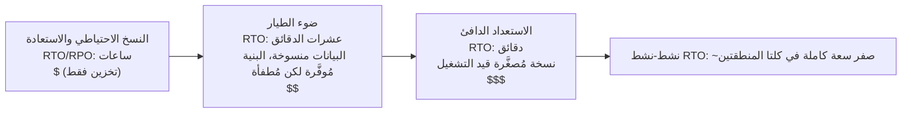

# الفصل الثامن عشر: حين تتعطّل الأشياء

انطفأت الأضواء في الساعة 11:17 مساءً.

ليس في مكتب Nimbus — كان Leo في المنزل، على الأريكة، وحاسوبه المحمول نصف مغلق. انطفأت الأضواء في مركز بيانات في Oregon لم يزره قط، في مبنى لم يره قط، في غرفة مليئة بخوادم لم يلمسها قط. لم يكن يعلم بعد. كانت هناك لحظة — مجرد لحظة — من الصمت التام قبل أن تعمل المولّدات الاحتياطية في مكان ما بعيد. ذلك النوع من الظلام الذي لا تستطيع فيه أن تميّز إن كانت عيناك مفتوحتين أم مغلقتين.

ثم وصل إشعار Slack.

---

بعد أن أصبحت أنظمة المراقبة من الفصل السابع عشر في مكانها، شعر الفريق بشيء أشبه بالثقة. التنبيهات تُطلَق. لوحات المعلومات خضراء. السجلات تتدفق إلى CloudWatch. أمضوا ثلاثة أسابيع في توصيل الرؤية إلى كل ركن من أركان بنية Nimbus التحتية.

ما لم يقله أحد بصوت عالٍ — ما لم تحمِ منه المراقبة — هو أن الرؤية والمرونة شيئان مختلفان. يمكنك أن تشاهد شيئاً يفشل بتفصيل دقيق. مشاهدته لا توقفه.

وصل ذلك الدرس في الساعة 11:23 مساءً يوم الخميس.

---

تلقى Leo إشعار Slack.

"us-west-2 — عطل في مجموعة مركز البيانات — خدمة متدهورة."

فتح لوحة تحكم AWS. نسخ EC2 في إحدى مناطق التوافر كانت تُظهر فشلاً في فحوصات الحالة. مجموعة التوسع التلقائي لديه اكتشفت نسخاً غير صحية وكانت تُنشئ بدائل — في المنطقة ذاتها.

في المجموعة التي كانت تتعطّل.

لم تتمكن النسخ الجديدة من البدء أيضاً. كانت في منطقة العطل العتادي ذاتها.

قال Leo لنفسه: "موازن التحميل يُوجّه الزيارات إلى كلتا منطقتَي التوافر. نصف زياراتنا يذهب إلى نسخ لا تعمل."

فتح لوحة تحكم EC2 وبدأ بالنقر. تحت Load Balancers، كان Application Load Balancer يُظهر كلتا مجموعتَي الأهداف صحيتين — لأن فحص الصحة كان يمرّ على المنفذ 80، وحتى النسخ الفاشلة كانت تستجيب لذلك الفحص. لم تكن قادرة فقط على معالجة الطلبات الحقيقية.

حاول إزالة منطقة التوافر الفاشلة من مجموعة الأهداف. قبلت لوحة التحكم التغيير. لكن مجموعة التوسع التلقائي، المضبوطة للحفاظ على التوازن، بدأت فوراً تحاول استبدال النسخ المُنهاة — في المنطقة الفاشلة ذاتها.

حدّق Leo في الشاشة. لقد جعل الأمر أسوأ للتو.

استدعى إعدادات مجموعة التوسع التلقائي. كان إعداد "موازنة السعة عبر مناطق التوافر" نشطاً. في التشغيل الطبيعي كان هذا تصميماً جيداً. في الوقت الراهن كان يقاومه بنشاط.

غيّر مجموعة التوسع التلقائي لاستخدام المنطقة الصحية فقط. طبّق التغيير.

أظهرت لوحة التحكم التغيير على أنه "In Service".

بعد ثلاث دقائق، ظهرت أول نسخ استبدال صحية.

بدأ موازن التحميل بتوجيه الزيارات. انخفض معدل الأخطاء من 52% إلى 4%. الـ 4% المتبقية كانت طلبات هبطت على آخر بضع نسخ غير صحية لا تزال تُصرّف اتصالاتها.

بحلول الساعة 11:45 مساءً — بعد اثنتين وعشرين دقيقة من بدء العطل — استقرّت الزيارات.

اثنتان وعشرون دقيقة من الخدمة المتدهورة قبل أن يلاحظ ويحوّل مجموعة التوسع التلقائي يدوياً لاستخدام المنطقة الصحية فقط.

قالت Priya في صباح اليوم التالي: "حدث هذا لأن كل شيء كان في منطقة توافر واحدة."

قال Leo: "لا. كانت لديّ نسخ في منطقتَي توافر. المشكلة كانت أن نسخ الاستبدال كانت تنبثق في منطقة التوافر الفاشلة."

"وقاعدة البيانات؟"

توقف Leo.

قال: "نسخة RDS الأساسية كانت في المنطقة الفاشلة. Multi-AZ أدّت عملها فعلاً — تحوّلت إلى الاحتياطي في المنطقة الصحية في حوالي تسعين ثانية. لكن خوادم تطبيقنا أبقت اتصالاتها الميتة مفتوحة وأعادت محاولة عنوان IP المُخزَّن مؤقتاً بدلاً من إعادة استبيان اسم DNS لنقطة النهاية. كانت قاعدة البيانات صحية بحلول 11:25. لم يُعِد تطبيقنا الاتصال بنظافة حتى أعدت تشغيل تجمّعات الاتصال."

أصبحت اثنتان وعشرون دقيقة من الخدمة المتدهورة ثماني وثلاثين.

حين أعدّ Leo مجموعة التوسع التلقائي قبل ثمانية أشهر، وضع علامة على إعداد "موازنة السعة عبر مناطق التوافر" واعتبر أن ذلك كافٍ. "سيكون الأمر على ما يرام"، قال لـ Maya حينها. "AWS تتولى أمور مناطق التوافر تلقائياً." كان محقاً في أن AWS تتولى ذلك — ومخطئاً بشأن ما يعنيه "تلقائياً".

سألت Maya في صباح اليوم التالي: "ماذا كان سيحدث لو أننا أعددنا كل شيء بشكل صحيح؟ كيف يبدو إعداد Multi-AZ الصحيح في عطل حقيقي؟"

فكّر Leo في الأمر. كان يفكّر فيه منذ الساعة 11:45 مساءً.

في الإعداد الصحيح الافتراضي: كانت مجموعة التوسع التلقائي ستملك فحوصات صحة للنسخ تنظر إلى صحة ALB — لا إلى حالة EC2 فقط. حين تعطّلت المنطقة، كان فحص الصحة على تلك النسخ سيفشل خلال 30 ثانية. كانت مجموعة التوسع التلقائي ستكتشف الأعطال وتبدأ فوراً بإطلاق بدائل — وحين تفشل عمليات الإطلاق باستمرار في منطقة واحدة، تنقل المجموعة السعة إلى المناطق الصحية المتبقية بدلاً من مقاومة المنطقة الفاشلة.

كان موازن التحميل سيُخرج أهداف المنطقة الفاشلة من الدوران خلال الـ 30 ثانية ذاتها. كانت الزيارات ستتركّز في المنطقة الصحية.

أما قاعدة البيانات: فإن تحوّل Multi-AZ نفسه نجح — ما كان مفقوداً هو انضباط العميل. تجمّعات اتصال تعيد استبيان اسم DNS لنقطة النهاية عند إعادة الاتصال (بدلاً من تخزين عنوان IP مؤقتاً)، وأزمنة TTL قصيرة لمخبأ DNS، ومنطق إعادة محاولة. مع وجود هذه، يكون تحوّل RDS وميضاً مدته 60–120 ثانية، لا ذيلاً طوله 16 دقيقة.

إجمالي الأثر المرئي للعميل: 60-90 ثانية من زمن الاستجابة المتدهور بينما تتحوّل قاعدة البيانات. لا 38 دقيقة من الأخطاء المتتالية.

قال Leo: "كانت لدينا كل البنية التحتية للنجاة من هذا. أعددناها بشكل خاطئ فقط."

كانت تلك الجملة أصعب على القول من الحادثة الأصلية نفسها.

**تشبيه شبكة الكهرباء**

فكّر في كيفية وصول الكهرباء إلى منزلك. لا تأتي الطاقة من سلك واحد يمتد من مولّد واحد. تأتي من شبكة — شبكة من المولّدات والمحطات الفرعية وخطوط النقل التي تدعم بعضها بعضاً. إذا احترقت محطة فرعية واحدة، تُعيد الأخريات توجيه الطاقة حولها. لا تلاحظ. الأضواء تبقى مضاءة.

مناطق التوافر في AWS تعمل بالطريقة ذاتها. بدلاً من مركز بيانات ضخم واحد يعتمد عليه كل شيء، تنشر AWS مواردك عبر مرافق فيزيائية منفصلة متعددة. إذا فقد مرفق واحد الطاقة أو واجه عطلاً عتادياً، تستمر الأخريات في العمل. تُعاد توجيه الزيارات تلقائياً. يظل تطبيقك يعمل — لأنه لم يكن هناك قط سلك واحد للقطع.

هذه هي **المعمارية متعددة مناطق التوافر (Multi-AZ)**: نشر مواردك عبر مرافق فيزيائية منفصلة بحيث لا يُسقط أي عطل واحد كل شيء.

الطبقة متعددة المناطق هي المستوى التالي: تخيّل وجود مولّدات احتياطية في مدينة مختلفة تماماً. إذا انقطعت شبكة الكهرباء المحلية بأكملها، تتولى المدينة البعيدة المهمة. أكثر تعقيداً للإعداد، لكن أكثر مرونة ضد الإخفاقات الكارثية.

ربما تتساءل: إذا كان Multi-AZ يعني فقط نشر الموارد عبر مركزَي بيانات، فلماذا لا تجعله AWS الافتراضي لكل شيء؟ الجواب هو التكلفة. يُضاعف Multi-AZ تقريباً البنية التحتية — وبالنسبة لبيئة تطوير أو أداة داخلية منخفضة الزيارات، تلك التكلفة الإضافية غير مبرَّرة. أما لأعباء عمل الإنتاج، فالسؤال ينقلب: هل يمكنك تحمّل التوقف إن لم تكن لديك؟

**مفردات الفشل**

قبل التصميم للمرونة، تحتاج إلى كلمات لما تُصمّم ضده.

سألت Priya: "كيف نقيس أصلاً ما إذا كنا مرنين بما يكفي؟"

قال Leo: "رقمان. كم من الوقت يمكن أن نكون معطّلين، وكم من البيانات يمكننا فقدانها."

**التوافر**: نسبة الوقت الذي يكون فيه النظام قيد التشغيل. "أربعة أتساع" (99.99%) تعني أقل من 52 دقيقة من التوقف سنوياً. "خمسة أتساع" (99.999%) تعني حوالي 5 دقائق سنوياً.

**RTO (هدف وقت الاسترداد)**: كم من الوقت يمكن أن يكون النظام معطّلاً قبل أن يصبح مشكلة تجارية؟ إذا كان RTO الخاص بك 4 ساعات، لديك 4 ساعات لاستعادة الخدمة قبل انتهاك SLAs.

**RPO (هدف نقطة الاسترداد)**: كم من البيانات يمكنك تحمّل فقدانها؟ إذا كان RPO الخاص بك ساعة واحدة، يمكنك تحمّل فقدان ما يصل إلى ساعة واحدة من البيانات في حالة فشل كارثية. كل ما كُتب في الساعة الأخيرة قبل الفشل ضاع.

**تحمّل الأعطال**: القدرة على الاستمرار في العمل (بمستوى ما) حين يتعطّل مكوّن.

**الاسترداد من الكوارث (DR)**: عملية الاسترداد من فشل كارثي — حريق مركز بيانات، انقطاع على مستوى المنطقة، حذف جماعي عرضي.

هذه المفاهيم الخمسة تُحرّك كل قرار معماري في هذا الفصل.

**RTO وRPO قراران تجاريان، لا تقنيان**

الأرقام أقل أهمية من مَن يحدّدها. يستطيع مهندس أن يخمّن RTO. صاحب المصلحة التجارية يعرف ما يكلّفه فعلاً انقطاع مدته 30 دقيقة.

تأمّل شركتين بالمكدّس التقني ذاته:

شركة تقنية مالية تعالج صفقات وساطة: RTO قدره 4 دقائق، RPO يساوي صفراً. نظام تداول معطّل أربع دقائق خلال ساعات السوق قد يفوّت آلاف المعاملات. لكل معاملة فائتة قيمة دولارية مباشرة. عدم فقدان البيانات ليس أمراً فلسفياً — فقدان صفقة مؤكَّدة واحدة يعني مشكلات امتثال ودعاوى قضائية من العملاء. تكلفة المعمارية لتحقيق هذا: Multi-AZ نشط-نشط بنسخ متزامن، ميزانية بنية تحتية سنوية بستة أرقام.

منصة طلبات مطاعم: RTO قدره 30 دقيقة، RPO قدره 5 دقائق. انقطاع مدته 30 دقيقة خلال ذروة العشاء مؤلم حقاً ويكلّف مالاً حقيقياً. لكن فقدان آخر 5 دقائق من الطلبات قبل الفشل يعني أن حفنة من العملاء بحاجة إلى إعادة الطلب — مزعج، لا كارثي. تكلفة المعمارية لتحقيق هذا: Multi-AZ باستعداد دافئ، جزء بسيط من ميزانية التقنية المالية.

سألت Maya حين شرح Leo هذا: "لحظة — لكن *لماذا* قد تقبل منصة مطاعم بفقدان 5 دقائق من البيانات؟ أليس ذلك مع ذلك فقداناً لطلبات العملاء؟"

قال Leo: "السؤال هو ما إذا كان منع فقدان البيانات ذلك يكلّف أكثر مما يستحق. تقليل RPO من 5 دقائق إلى 0 سيتطلب نسخاً متزامناً عبر المناطق. تلك تكلفة كبيرة واستثمار هندسي. لتطبيق مطاعم بحجمنا، RPO قدره 5 دقائق هو المقايضة الصحيحة."

الدرس: RTO وRPO ليسا حدوداً دنيا تقنية. إنهما مقايضتان تجاريتان مُعبَّر عنهما بأرقام. تحديدهما يتطلب كلاً من فريق الهندسة (الذي يعرف ما هو قابل للتحقيق) وأصحاب المصلحة التجارية (الذين يعرفون ما هو مقبول).

**Multi-AZ: النجاة من إخفاقات مناطق التوافر**

منطقة التوافر (AZ) هي مركز بيانات فيزيائي منفصل داخل منطقة. صُمّمت مناطق التوافر لتكون مستقلة: مصادر طاقة منفصلة، تبريد منفصل، بنية تحتية شبكية منفصلة. لكنها قريبة بما يكفي لأن زمن استجابة الشبكة بينها 1-2 مللي ثانية.

تنشر **نشرات Multi-AZ** مواردك عبر منطقتَي توافر أو أكثر داخل منطقة. إذا تعطّلت منطقة توافر واحدة:

- موازن التحميل يتوقف عن التوجيه إلى النسخ غير الصحية في منطقة التوافر الفاشلة
- مجموعة التوسع التلقائي تستبدل النسخ — لكن في منطقة التوافر *الصحية*
- RDS تتحوّل إلى الاحتياطي في منطقة التوافر الصحية

خطأ Leo: لم تكن مجموعة التوسع التلقائي لديه مضبوطة لتقييد نسخ الاستبدال على مناطق التوافر الصحية. كانت مضبوطة للحفاظ على التوازن بين مناطق التوافر. حين تعطّلت المنطقة، حاولت مجموعة التوسع التلقائي موازنة عدد النسخ بإنشاء بدائل هناك — في المنطقة الفاشلة.

الإصلاح: ضبط مجموعة التوسع التلقائي للانطلاق فقط في مناطق التوافر الصحية، مع الحد الأدنى من منطقتَي توافر نشطتين دائماً.

الدرس الأعمق: اختبار سيناريوهات الفشل قبل حدوثها في بيئة الإنتاج.

إذا اخترت Multi-AZ، تحصل على تحوّل تلقائي وRPO قريب من الصفر — لكنك تدفع مقابل بنية تحتية لا تخدم أي زيارات أثناء التشغيل العادي. تلك النسخة الاحتياطية من RDS تعمل دائماً، تنسخ دائماً، ولا تجيب على أي استعلام حتى يتعطّل الأساسي. تلك هي المقايضة: الموثوقية تكلّف مالاً حتى حين لا يكون شيء معطّلاً.

**هندسة الفوضى: كيف بدا التشغيل الأول**

لم يكن أول تشغيل لهندسة الفوضى في Nimbus نظيفاً كما جعلته الوثائق يبدو.

نفّذ Leo الخطوة 2 من دليل التشغيل: فرض تحوّل Multi-AZ لـ RDS. استخدم AWS CLI:

```
aws rds reboot-db-instance \
    --db-instance-identifier nimbus-prod \
    --force-failover
```

عاد الأمر فوراً. بدأ Leo المؤقّت.

T+0s: بدء التحوّل. لوحة تحكم RDS تُظهر حالة الأساسي على أنها "rebooting".

T+18s: سجلات التطبيق تبدأ بإظهار أخطاء اتصال قاعدة بيانات. تجمّع الاتصال يحاول الأساسي القديم، الذي لم يعد أساسياً.

T+34s: لوحة تحكم RDS تُظهر الحالة على أنها "backing-up". الأساسي الجديد يجري ترقيته. اسم DNS المستعار (CNAME) لنقطة نهاية قاعدة البيانات يجري تحديثه.

T+52s: سجلات التطبيق تبدأ بإظهار اتصالات ناجحة مجدداً. تجمّع الاتصال استنفد إعادات المحاولة على الأساسي القديم وأعاد الاتصال بالـ CNAME، الذي يشير الآن إلى الأساسي الجديد.

T+4:17: أُعيد إنشاء جميع الاتصالات. معدل الأخطاء عاد إلى الصفر.

الإجمالي: 4 دقائق و17 ثانية.

قال Tom: "ذلك 257 ثانية من عدم توفر قاعدة البيانات. أجهزة شركاء مطاعمنا اللوحية تُظهر مؤشر دوران لمدة 4 دقائق."

قال Leo: "اتفاقية مستوى الخدمة لدينا تقول 5 دقائق."

قالت Priya: "إذن نجحنا. بالكاد."

قال Tom: "ملاحظتان. الأولى: نجحنا لأن التزامنا بـ RTO كان سخياً، لا لأن معماريتنا سريعة على نحو خاص. الثانية: سلوك إعادة محاولة تجمّع الاتصال هو ما اشترى لنا الـ 34 ثانية الإضافية. لو أن التطبيق استسلم بعد 10 ثوانٍ، لكنا فشلنا."

حدّث Leo دليل التشغيل لتوثيق الأزمنة المُلاحَظة. الهدف للربع التالي: تقليل وقت كشف التحوّل من 52 ثانية إلى أقل من 30 عبر ضبط معاملات تجمّع الاتصال ومنطق فحص الصحة في التطبيق.

قالت Priya: "هندسة الفوضى ليست اختباراً لمرة واحدة. إنها حلقة تغذية راجعة. تختبر، تجد الأرقام الفعلية، تُحسّن، تختبر مجدداً."

في المرة الثالثة التي نفّذوا فيها اختبار التحوّل، بعد ستة أشهر، كان وقت الاسترداد دقيقة واحدة و44 ثانية. ليس لأن RDS صارت أسرع — بل لأنهم ضبطوا التطبيق.

**محاكاة الإخفاقات: هندسة الفوضى**

سألت Maya: "كيف نعرف أن إعداد Multi-AZ لدينا يعمل فعلاً؟"

قال Leo: "نكسر الأشياء عمداً."

قالت Maya: "لحظة — لكن *لماذا* نفعلها بتلك الطريقة؟ لماذا لا نثق فقط بأن وثائق AWS تقول إنه يعمل؟"

"لأن الوثائق تصف كيف تعمل الخدمة. لا تصف كيف يعمل *إعدادك أنت*. إنهما شيئان مختلفان."

انحنت Priya إلى الأمام. "هل فكّرنا فيما يحدث حين يختلف فحص صحة موازن التحميل عن فحص صحة مجموعة التوسع التلقائي؟ قد يُخرج موازن التحميل نسخة من الدوران، لكن مجموعة التوسع التلقائي تعتقد أن النسخة صحية ولا تستبدلها. ستكون لدينا سعة غير مرئية لموازن التحميل."

قال Leo: "ذلك بالضبط نوع الأشياء التي ستجدها هندسة الفوضى."

يبدو هذا متهوراً. لكنه في الواقع أكثر ما يمكن للفريق فعله بمسؤولية.

**اختبار التزامات RTO**

إليك الحقيقة المزعجة بشأن RTO: معظم الفرق تحدّد RTO، ثم لا تختبر أبداً ما إذا كانت تستطيع تحقيقه فعلاً.

RTO قدره 30 دقيقة ليس ضماناً. إنه هدف. الطريقة الوحيدة لمعرفة ما إذا كنت ستحققه هي محاكاة الفشل وتوقيت الاسترداد.

بعد حادثة الساعة 11:23 مساءً، التزم فريق Nimbus باختبار كل نمط فشل كل ربع سنة. ليس يدوياً فحسب — بل بمعايير قبول مكتوبة. الاسترداد من إخفاق منطقة توافر كان يجب أن يكتمل خلال 10 دقائق. الاسترداد من تحوّل RDS كان يجب أن يكتمل خلال 5 دقائق. استعادة قاعدة البيانات من نسخة احتياطية (اختبار DR للنسخ الاحتياطي والاستعادة) كان يجب أن يكتمل خلال ساعتين.

جاءت هذه الأرقام من محادثات مع شركاء المطاعم، الذين قالوا إن انقطاعاً في ذروة العشاء أقل من 10 دقائق كان "مؤلماً لكن مقبولاً". أكثر من 30 دقيقة كان حديث عقد.

قالت Maya: "ينبغي أن يحدث تفاوض SLA قبل تحديد RTO. لا بعده."

لم تكن مخطئة. لقد فعلوها بالمقلوب. حدّدوا RTO داخلياً ثم أدركوا أنهم بحاجة لمراجعته مقابل ما تتطلبه الأعمال فعلاً.

تحديد RTO وRPO بالترتيب الصحيح: المتطلب التجاري أولاً، المعمارية لتلبيته ثانياً، الاختبار للتحقق ثالثاً. معظم الفرق تبدأ بالمعمارية وتعمل بالعكس. الأرقام تعاني من ذلك.

**هندسة الفوضى** هي ممارسة حقن الإخفاقات عمداً في نظامك للتحقق من تعامله معها بشكل صحيح. تُنهي نسخة EC2 عمداً. تُجبر نسخة RDS على التحوّل يدوياً. تحجب شبكة فرعية من موازن التحميل.

إذا تعافى النظام تلقائياً ضمن RTO الخاص بك، فتصميمك يعمل.

إذا لم يتعافَ، تكون قد تعلّمت ذلك في بيئة محكومة — وليس خلال حادثة إنتاج في الساعة 2 صباحاً.

بالنسبة لـ Nimbus: كتب Leo دليل تشغيل (إجراءً موثَّقاً) لاختبار كل سيناريو فشل. مرة كل ربع سنة، يُفشلون عمداً مكوّناً واحداً ويقيسون وقت الاسترداد. إذا استغرق الاسترداد أطول من RTO، أصلحوا التصميم.

**متعدد المناطق: النجاة من الإخفاقات الإقليمية**

معظم إخفاقات AWS تؤثر على مناطق التوافر، لا على المناطق بأكملها. الإخفاقات الإقليمية نادرة — لكنها تحدث.

في حالة الإخفاق الإقليمي (أو للتطبيقات العالمية التي تحتاج إلى زمن استجابة منخفض جداً في كل مكان)، **متعدد المناطق** هو الإجابة: انشر تطبيقك في منطقتَي AWS أو أكثر.

يُدخل متعدد المناطق تعقيداً جوهرياً:

**نسخ البيانات**: يجب أن تكون قواعد بياناتك متزامنة عبر المناطق. أي بيانات تُكتب في us-east-1 يجب أن تصل في نهاية المطاف إلى eu-west-1. "في نهاية المطاف" هي المشكلة — خلال فترة التأخير، تكون لدى المناطق رؤية مختلفة قليلاً للعالم.

**نشط-سلبي مقابل نشط-نشط**:

- **نشط-سلبي**: منطقة واحدة تخدم جميع الزيارات. الأخرى احتياط دافئ. عند الفشل، يُحوّل DNS الزيارات إلى الاحتياط. أبسط، لكن الاحتياط خامل ومكلف.
- **نشط-نشط**: كلتا المنطقتين تخدمان الزيارات في آن واحد. أكثر تعقيداً في البناء (يتطلب حل تعارض للكتابات المتزامنة)، لكن زمن استجابة أقل عالمياً وبدون موارد خاملة.

يبدو نشط-نشط جذاباً حتى تفكّر بعناية في الكتابات. إذا وضع عميل طلباً في us-east-1 وفي الوقت نفسه حدّث المطعم قائمته في eu-west-1، وكان هناك انقسام شبكي بين المنطقتين، فأي كتابة تفوز؟ هذه هي نظرية CAP في الممارسة: في نظام موزّع، أثناء انقسام شبكي، يجب أن تختار بين الاتساق (اتفاق المنطقتين على البيانات ذاتها) والتوافر (استمرار المنطقتين في قبول الطلبات حتى وهما مختلفتان). نشط-نشط لا يلغي هذا الاختيار. إنه يتطلب منك اتخاذه صراحةً، في نموذج بياناتك.

بالنسبة لـ Nimbus: نشط-سلبي. لم يريدوا التفكير في تعارضات الكتابة المتزامنة في بيانات قوائمهم وطلباتهم. منطقة أساسية موثوقة واحدة كانت أبسط وأكثر أماناً في هذه المرحلة.

**وقت التحوّل**: تغييرات DNS تستغرق وقتاً للانتشار (حسب TTL). خلال نافذة الانتشار، لا يزال بعض المستخدمين يصلون إلى المنطقة الفاشلة. تصميم RTO منخفض جداً يتطلب تسخيناً مسبقاً للاحتياط وتقليل TTL قبل التحويلات المخطّطة.

**تحوّل Route 53 عبر DNS: الطبقة الشبكية لـ DR**

قبل الوصول إلى الطيف الكامل لاستراتيجيات DR، يجدر فهم كيف يتلاءم DNS مع التحوّل — لأنه غالباً ما يكون الشيء الذي يُحوّل الزيارات فعلاً بين المناطق.

تدعم **Amazon Route 53** التوجيه القائم على فحص الصحة. تُعدّ:

1. فحص صحة يراقب نقطة نهايتك الأساسية (عادةً نقطة نهاية HTTP تُعيد 200 إذا كانت صحية)
2. سجل DNS أساسي يشير إلى منطقتك الأساسية
3. سجل DNS ثانوي (للتحوّل) يشير إلى منطقة DR الخاصة بك

حين تكتشف Route 53 أن فحص الصحة الأساسي يفشل، تُحوّل تلقائياً استجابات DNS إلى السجل الثانوي. المستخدمون الذين يستبينون نطاقك يحصلون الآن على عنوان IP الخاص بمنطقة DR.

سألت Priya: "وماذا لو حاول أحدهم اختراقنا أثناء نافذة التحوّل؟ شهادة SSL لنطاقنا — هل تعمل في كلتا المنطقتين، أم ينكسر HTTPS؟"

أكّد Leo: "الشهادة بحاجة إلى أن تُوفَّر في كلتا المنطقتين. إذا كنت تستخدم ACM (AWS Certificate Manager)، فهذا يعني طلب شهادة في كل منطقة على حدة."

آليات تحوّل Route 53:

- فحوصات الصحة تعمل من مواقع AWS متعددة حول العالم كل 30 ثانية
- بعد 3 إخفاقات متتالية (90 ثانية)، تُعلّم Route 53 نقطة النهاية على أنها غير صحية
- استجابات DNS تتحوّل فوراً إلى سجل التحوّل
- لكن: TTL الخاص بـ DNS لا يزال ينطبق. إذا كان TTL لديك 300 ثانية، فإن العملاء الذين خزّنوا عنوان IP الأساسي مؤقتاً يستمرون بالوصول إلى المنطقة الفاشلة لما يصل إلى 5 دقائق

لهذا السبب يُعدّ تقليل TTL جزءاً من الاستعداد قبل الكارثة. لا يمكنك تغيير TTL أثناء حادثة (لن ينتشر التغيير في الوقت المناسب). يجب إجراء تغيير TTL قبل أيام أو أسابيع من الحاجة إليه، بحيث تكون مخابئ المُستبينات مستخدمة بالفعل للـ TTL القصير حين يقع فشل.

قال Leo: "إذن تقليل TTL الخاص بـ DNS ليس إجراء استرداد. إنه إجراء تموضع مسبق."

سألت Maya: "هل فعلناه؟"

لم يكونوا قد فعلوا.

بعد تلك المحادثة، خفّض Leo TTL لـ eatnimbus.com من 300 ثانية إلى 60 ثانية. لم يكلّف التغيير شيئاً وحسّن أسوأ زمن تحوّل لديهم من 8 دقائق محتملة إلى أقل من 3 بقليل.

**استراتيجيات الاسترداد من الكوارث: طيف**

هناك أربع استراتيجيات DR شائعة، مُرتَّبة من الأرخص (والأبطأ في الاسترداد) إلى الأكثر تكلفة (والأسرع في الاسترداد):



**النسخ الاحتياطي والاستعادة** (RPO/RTO بالساعات):

- نسخ كل شيء احتياطياً إلى S3 في منطقة مختلفة
- عند الكارثة: توفير البنية التحتية من الصفر، الاستعادة من النسخة الاحتياطية
- التكلفة: منخفضة جداً (تدفع فقط مقابل التخزين)
- وقت الاسترداد: ساعات

**ضوء الطيار** (RPO/RTO من دقائق إلى ساعة):

- انسخ البيانات باستمرار وأبقِ البنية التحتية الأساسية *مُوفَّرة لكن مُطفأة* في منطقة DR — قوالب، صور AMI، موارد موقوفة أو بحجم صفر. لا شيء يخدم الزيارات؛ فقط نسخ البيانات "مُضاء" (ذلك هو ضوء الطيار)
- البيانات الأساسية منسوخة (نسخة قراءة RDS في منطقة DR)
- عند الكارثة: تشغيل/توسيع الحوسبة في منطقة DR، ترقية نسخة القراءة إلى أساسية، تحويل DNS
- (قارن مع الاستعداد الدافئ أدناه: هناك، نسخة مُصغَّرة من التطبيق تكون *قيد التشغيل* فعلاً)
- التكلفة: معتدلة (تدفع مقابل نسخ البيانات والموارد المُوفَّرة-لكن-المُطفأة، لا مقابل حوسبة عاملة)
- وقت الاسترداد: عشرات الدقائق

**الاستعداد الدافئ** (RPO/RTO من ثوانٍ إلى دقائق):

- شغّل نسخة مُصغَّرة من التطبيق الكامل في منطقة DR
- تعمل بالكامل لكن بسعة مُخفَّضة
- عند الكارثة: التوسيع، تحويل DNS
- التكلفة: أعلى (دائماً تُشغّل المكدّس الكامل بسعة مُخفَّضة)
- وقت الاسترداد: دقائق

**نشط-نشط / متعدد المواقع** (RPO/RTO قريب من الصفر):

- سعة كاملة في منطقتَين أو أكثر، تخدمان الزيارات في آن واحد
- لا حاجة للاسترداد — إذا تعطّلت منطقة واحدة، تُوجَّه الزيارات إلى الأخرى تلقائياً
- التكلفة: الأعلى (نشرتان كاملتان بسعة كاملة)
- وقت الاسترداد: ثوانٍ (انتشار DNS فقط)

خدمة واحدة تُؤتمت وسط هذا الطيف: **AWS Elastic Disaster Recovery (DRS)** تنسخ خوادمك باستمرار — سواء كانت محلية أو EC2 — كتلةً بكتلة إلى منطقة تجهيز منخفضة التكلفة، ويمكنها إطلاق نسخ استرداد كاملة في دقائق حين تضرب الكارثة. في الواقع، إنها *ضوء طيار مُدار*: أزمنة استرداد قريبة من الاستعداد الدافئ بأسعار قريبة من النسخ الاحتياطي والاستعادة. إشارة الامتحان: "تقليل التوقف وفقدان البيانات لأعباء عمل قائمة على الخوادم بخدمة DR مُدارة" ← Elastic Disaster Recovery.

بالنسبة لـ Nimbus في هذه المرحلة: الاستعداد الدافئ. لم يستطيعوا تحمّل نشط-نشط، لكن النسخ الاحتياطي والاستعادة كانا بطيئين جداً لمتطلبات أعمالهم.

**Amazon RDS: Multi-AZ مقابل نسخ القراءة مقابل متعدد المناطق**

هذه الثلاثة متمايزة وكثيراً ما تُخلط:

| الميزة | Multi-AZ | نسخة القراءة | نسخة القراءة متعددة المناطق |
|--------|----------|--------------|------------------------------|
| الغرض | التوافر العالي (التحوّل) | توسيع القراءة | توسيع القراءة + DR |
| مزامنة البيانات | متزامن | غير متزامن | غير متزامن |
| التحوّل | تلقائي | ترقية يدوية | ترقية يدوية |
| قابلة للقراءة؟ | لا (الاحتياط سلبي) | نعم | نعم |
| عبر مناطق؟ | لا (نفس المنطقة) | نعم (اختياري) | نعم |
| استخدم لـ | التوافر العالي، RPO~0 | حمل القراءة | الاسترداد من الكوارث |

رؤية رئيسية: احتياط Multi-AZ **متزامن** — كل كتابة على الأساسي تُؤكَّد على الاحتياط قبل الإقرار بالكتابة. هذا يعني أنه إذا تعطّل الأساسي، لا تُفقد أي بيانات. RPO = 0.

نسخ القراءة **غير متزامنة** — هناك تأخر في النسخ. إذا تعطّل الأساسي ورقّيت نسخة قراءة، قد تفقد ثوانٍ أو دقائق من الكتابات الأخيرة. RPO > 0.

**Aurora Global Database: متعدد المناطق للإنتاج**

للفرق التي تحتاج إلى مرونة حقيقية متعددة المناطق، تُغيّر **Aurora Global Database** المعادلة. نسخة قراءة RDS قياسية في منطقة أخرى تستخدم نسخاً غير متزامن بتأخر يُقاس عادةً بالثواني — مما يعني أن إخفاقاً إقليمياً سيفقد تلك الثواني من الكتابات. تستخدم Aurora Global Database بنية نسخ مخصّصة تحقق أقل من ثانية واحدة من تأخر النسخ بين المنطقة الأساسية والمناطق الثانوية.

حين ناقش الفريق ذلك في مراجعة ما بعد الحادثة، استدعى Leo المقارنة:

- نسخة قراءة RDS قياسية عبر المناطق: تأخر نسخ نموذجي من 1-10 ثوانٍ، يصل إلى دقائق تحت حمل ثقيل. الترقية إلى قاعدة بيانات مستقلة تستغرق دقائق وتنطوي على خطوات يدوية.
- ثانوي Aurora Global Database: تأخر نسخ عادةً أقل من ثانية واحدة. الترقية من ثانوي إلى أساسي تستغرق أقل من دقيقة واحدة.

شرح Leo: "هذا يعني أنه إذا تعطّلت us-west-2 بالكامل، لدينا أقل من ثانية واحدة من فقدان البيانات المحتمل ويمكننا خدمة الزيارات من us-east-1 خلال دقيقة."

سأل Tom فوراً: "كم يكلّف ذلك شهرياً؟"

أكثر من Multi-AZ القياسي. تضيف Aurora Global Database رسماً لكل عملية إدخال/إخراج كتابة للنسخ عبر المناطق. لحجم Nimbus الحالي، سيضيف 40-60 دولاراً شهرياً فوق تكاليف Aurora الموجودة.

قال Leo: "تلك هي المقايضة. ادفع مقابل السرعة. أو اقبل الترقية الأبطأ وRPO الأعلى قليلاً لنسخة قراءة قياسية عبر المناطق."

في الوقت الراهن، بقيت Nimbus على الاستعداد الدافئ. ذهبت Aurora Global Database إلى قائمة أمنيات المعمارية لجولة التمويل التالية.

قالت Priya: "نافذة التحوّل ذاتها، الطبقة التالية للأسفل. غطّينا الشهادات. الآن بيانات الاعتماد — إنها تتدوّر على نسخة واحدة. هل الاحتياط متزامن؟"

استدعى Leo الوثائق. كان سؤالاً جيداً. RDS Multi-AZ تنسخ البيانات، لا إعدادات الأسرار — كان لا بد من اختبار تدوير Secrets Manager كجزء من دليل تشغيل التحوّل.

## نقاط القوة والقيود

**Multi-AZ**:

- ضروري لأعباء عمل الإنتاج — منطقة التوافر الواحدة نقطة فشل منفردة
- تدعمه خدمات AWS بشكل جيد (RDS وElastiCache وEKS وALB كلها تدعم Multi-AZ)
- تكلفة زيادة منخفضة نسبياً مقارنةً بالحماية التي يوفرها
- إخفاقات مناطق التوافر هي الفئة الأكثر شيوعاً من إخفاقات AWS — Multi-AZ يغطي السيناريوهات الأكثر احتمالاً

**متعدد المناطق**:

- معقّد التنفيذ بشكل صحيح، خاصةً لقواعد البيانات
- قد تتطلبه فعلاً متطلبات إقامة/سيادة البيانات (يجب أن تبقى بيانات المستخدمين في الاتحاد الأوروبي داخل الاتحاد الأوروبي)
- فوائد زمن الاستجابة للمستخدمين العالميين تأتي من التوجيه، لا من متعدد المناطق في حد ذاته (استخدم CloudFront للمحتوى الثابت)
- معظم المنظمات لا تحتاج نشط-نشط؛ ومعظمها يستثمر بشكل غير كافٍ في الاستعداد الدافئ
- تكلفة الاستعداد الدافئ متعدد المناطق ليست تافهة، لكن تكلفة إخفاق إقليمي من دونه يمكن أن تكون أعلى بكثير

**متى تتخطى Multi-AZ** (الحالات النادرة):

- بيئات التطوير والتجهيز حيث التوقف مقبول
- أدوات داخلية غير حرجة حقاً بلا متطلبات SLA
- أعباء عمل دفعية يمكن ببساطة إعادة تشغيلها عند الفشل

الضغط لتخطي Multi-AZ يكون دائماً تقريباً بشأن التكلفة. قبل قبول تلك الحجة، احسب تكلفة أنماط الفشل المحتملة: تسرّب العملاء، غرامات SLA، وقت الهندسة للاسترداد. في معظم بيئات الإنتاج، يدفع Multi-AZ ثمن نفسه في أول مرة ينقذك فيها من استدعاء في الساعة 3 صباحاً.

## الملخص

عمل المراقبة في الفصل السابع عشر جعل الإخفاقات مرئية. هذا الفصل عن جعل البنية التحتية تنجو منها. كلاهما مهم؛ لا أحدهما كافٍ بدون الآخر.

كلّفت حادثة Nimbus في تلك الليلة من الخميس 38 دقيقة من الخدمة المتدهورة. اجتمعت ثلاثة أخطاء في الإعداد: مجموعة التوسع التلقائي لم تستبعد المنطقة الفاشلة من عمليات إطلاق الاستبدال، احتياط RDS صادف وجوده في المنطقة الفاشلة، ولم يكن أحد قد اختبر عملية التحوّل قبل الاعتماد عليها في الإنتاج.

كانت الثلاثة جميعها قابلة للإصلاح في فترة بعد ظهر واحدة. جعلت الحادثة الإصلاحات عاجلة بطريقة لم تجعلها "وثائق أفضل الممارسات" قط.

تلك هي الحجة الصادقة لهندسة الفوضى: ليس أنها ممارسة هندسية صارمة (مع أنها كذلك)، بل أنها تُظهر أخطاء الإعداد التي تبدو نظرية حتى الليلة التي يقع فيها عطل عتادي في مركز بيانات في Oregon.

- **RTO** (هدف وقت الاسترداد): كم من الوقت يمكنك أن تكون معطّلاً. **RPO** (هدف نقطة الاسترداد): كم من البيانات يمكنك فقدانها.
- **Multi-AZ** ينشر الموارد عبر مناطق التوافر داخل منطقة. يحمي من إخفاقات مناطق التوافر.
- **متعدد المناطق** ينشر في مناطق AWS متعددة. يحمي من الإخفاقات الإقليمية ويخدم المستخدمين العالميين بزمن استجابة أقل.
- استراتيجيات DR (من الأرخص إلى الأكثر تكلفة): النسخ الاحتياطي والاستعادة ← ضوء الطيار ← الاستعداد الدافئ ← نشط-نشط.
- احتياط Multi-AZ لـ RDS: متزامن، تحوّل تلقائي، RPO = 0 داخل المنطقة. نسخ القراءة: غير متزامن، ترقية يدوية، RPO > 0.
- اختبر إخفاقاتك عمداً (هندسة الفوضى) قبل حدوثها في بيئة الإنتاج.

## نصائح الامتحان

*SAA-C03 المجال: تصميم معماريات مرنة (المجال الثاني، المهمة 2.2)*

- **RTO مقابل RPO**: توقّع من الامتحان إعطاءك متطلبات ("لا يمكن للمنظمة تحمّل أكثر من ساعة من التوقف وبدون فقدان بيانات") وأن يطلب منك اختيار استراتيجية DR الصحيحة. التعيين: بدون فقدان بيانات = نسخ متزامن = Multi-AZ أو نشط-نشط. ساعة من التوقف = النسخ الاحتياطي والاستعادة بطيء جداً؛ الاستعداد الدافئ قد يصلح.
- **Multi-AZ RDS مقابل نسخ القراءة**: سيسأل الامتحان عن التوافر العالي (Multi-AZ) مقابل توسيع القراءة (نسخ القراءة). احتياط Multi-AZ غير قابل للقراءة. نسخ القراءة يمكن ترقيتها إلى أساسية (يدوياً) للاسترداد من الكوارث.
- **ضوء الطيار مقابل الاستعداد الدافئ**: ضوء الطيار لديه بنية تحتية دنيا تعمل (فقط نسخ البيانات). الاستعداد الدافئ لديه تطبيق وظيفي لكن مُصغَّر يعمل. الفارق هو مدى سرعة التوسيع.
- **Aurora Global Database**: ميزة خاصة بـ Aurora لنشط-سلبي متعدد المناطق. المنطقة الأساسية تخدم الكتابة؛ المناطق الثانوية تخدم القراءة بتأخر نسخ أقل من ثانية واحدة. عند التحوّل، يمكن ترقية الثانوي في أقل من دقيقة واحدة. إشارة الامتحان: "Aurora، متعدد المناطق، RTO < دقيقة واحدة."
- **AWS Backup**: خدمة نسخ احتياطي مركزية لـ EBS وRDS وDynamoDB وEFS وStorage Gateway. يستخدمها الامتحان لسيناريوهات النسخ الاحتياطي والاستعادة.
- **Elastic Disaster Recovery (DRS)**: "DR مُدار بأدنى توقف/فقدان بيانات للخوادم (محلية أو EC2)"، "ضوء طيار بدون بنائه بنفسك" ← DRS (نسخ مستمر على مستوى الكتلة + إطلاق استرداد عند الطلب).
- **تحوّل Route 53**: طبقة DNS في DR. فشل فحص الصحة الأساسي ← Route 53 يُوجّه إلى الثانوي. وقت الانتشار يعني أن هذا ليس فورياً.

## التمارين

**تمرين 1 — استرجاع**

اشرح الفرق بين RTO وRPO. لماذا قد يكون لمنظمة RTO منخفض (لا تستطيع التوقف طويلاً) لكن RPO مرتفع (يمكنها تحمّل فقدان البيانات الأخيرة)؟

*(تلميح: فكّر في عمل يكون فيه خدمة العملاء بسرعة أهم من الحفاظ على كل معاملة.)*

**تمرين 2 — سيناريو SAA-C03**

*سيناريو*: تُشغّل شركة رعاية صحية نظام سجلات مرضى على قاعدة بيانات متوافقة مع PostgreSQL في `us-east-1`. تُلزم المتطلبات التنظيمية بأن ينجو النظام من **انقطاع إقليمي كامل** بـ RPO مُقاس بـ**الثواني** (فقدان بيانات قريب من الصفر) وRTO أقل من 30 دقيقة. داخل المنطقة الأساسية، لا يُقبل أي فقدان بيانات.

أي معمارية تلبي هذه المتطلبات على أفضل وجه؟

A) RDS Multi-AZ في `us-east-1` مع نسخ احتياطية يومية تلقائية إلى S3 في `us-west-2`  
B) RDS Multi-AZ في `us-east-1` مع نسخة قراءة في `us-west-2` مضبوطة للترقية اليدوية  
C) RDS في `us-east-1` مع استعداد دافئ في `us-west-2` ونسخ نشط-نشط  
D) Aurora Global Database مع أساسي في `us-east-1` وثانوي في `us-west-2`

**تلميح 1**: افصل النطاقين. *داخل* المنطقة، RPO = 0 يعني نسخاً متزامناً (Multi-AZ — وطبقة تخزين Aurora متزامنة عبر 3 مناطق توافر). *عبر* المناطق، كل الخيارات الواقعية تنسخ بشكل غير متزامن — السؤال هو كم يكون التأخر صغيراً.

**تلميح 2**: RTO = 30 دقيقة يعني لديك وقت لترقية محكومة. لا تحتاج تحوّلاً تلقائياً بالمللي ثانية بالكامل.

**تلميح 3**: قارن RPO عبر المناطق لكل خيار: نسخ احتياطية يومية (ساعات)، نسخة قراءة RDS عبر المناطق (ثوانٍ إلى دقائق، غير محدودة تحت الحمل)، Aurora Global Database (عادةً أقل من ثانية واحدة).

**الإجابة**: D

**الشرح**: Aurora Global Database تنسخ إلى المنطقة الثانوية على مستوى طبقة التخزين بتأخر نموذجي أقل من ثانية واحدة — مُلبّيةً "RPO بالثواني" لكارثة إقليمية — ويمكن ترقية الثانوي في أقل من دقيقة، براحة ضمن RTO قدره 30 دقيقة. داخل المنطقة الأساسية، تخزين Aurora منسوخ بشكل متزامن عبر ثلاث مناطق توافر، مُلبّياً متطلب عدم الفقدان داخل المنطقة. **احفظ الفارق الدقيق**: Aurora Global *غير متزامنة* عبر المناطق — RPO عبر المناطق لديها *قريب* من الصفر، وليس صفراً تماماً أبداً. إذا تطلّب سؤال امتحان RPO = 0 مطلقاً، فذلك يُعيّن إلى نسخ *متزامن* (Multi-AZ، منطقة واحدة) — لا يوفره أي خيار قياسي عبر المناطق.

**لماذا ليس A؟** نسخ S3 الاحتياطية اليومية تعطي RPO عبر المناطق يصل إلى 24 ساعة. ذلك ساعات من بيانات المرضى المفقودة في إخفاق إقليمي.

**لماذا ليس B؟** نسخ قراءة RDS عبر المناطق تستخدم نسخاً قياسياً غير متزامن يمكن أن ينمو تأخره بلا حدود تحت الحمل — "الثواني" يمكن أن تصبح دقائق. قابل للتطبيق، لكنه ليس الأفضل حين يوجد خيار بنسخ على مستوى التخزين دون الثانية.

**لماذا ليس C؟** "النسخ نشط-نشط" لـ PostgreSQL عبر المناطق ليس ميزة RDS قياسية. هذا الخيار يصف قدرة تتطلب هندسة مخصّصة كبيرة.

*SAA-C03 المجال: تصميم معماريات مرنة — المهمة 2.2*

**تمرين 3 — تحدي المعمارية** *(اختياري)*

اختيرت Nimbus لتوفير خدمات الطلب لمهرجان غذاء كبير في Seattle. لمدة 72 ساعة، يتوقعون 50 ضعف زياراتهم العادية، مع عدم تحمّل أي توقف (عقد منظّم المهرجان يُحدد غرامات مالية لأي توقف خلال الحدث).

صمّم استراتيجية DR لنافذة المهرجان تحديداً. هل ستتحوّل إلى نشط-نشط لتلك الـ 72 ساعة؟ كيف ستختبر التحوّل مسبقاً؟ ما الذي سيكون RTO الخاص بك، وكيف ستتحقق منه قبل الحدث؟

*(لا توجد إجابة صحيحة واحدة. الهدف هو التدرّب على تصميم DR لمتطلبات SLA محددة.)*

## مشهد ما بعد النهاية

بنى Leo دليل تشغيل هندسة الفوضى.

كل ربع سنة، في نافذة صيانة مخطّطة، سيقوم الفريق بـ:

1. إنهاء نسخة EC2 واحدة في منطقة توافر واحدة ومراقبة مجموعة التوسع التلقائي تستبدلها بشكل صحيح في المنطقة الصحية
2. فرض تحوّل Multi-AZ لـ RDS يدوياً والتحقق من إعادة اتصال التطبيق خلال 60 ثانية
3. محاكاة إخفاق منطقة توافر كامل بتعديل مناطق التوافر في مجموعة التوسع التلقائي
4. استعادة نسخة احتياطية عمرها أسبوع إلى نسخة RDS جديدة والتحقق من أن البيانات تبدو صحيحة

التشغيل الأول — التحوّل الذي استغرق 4 دقائق و17 ثانية والذي تجاوز بالكاد SLA البالغ 5 دقائق — كان قد أظهر لهم بالفعل كم كان الهامش رفيعاً.

قال Tom: "هناك غرامة مالية في العقود إذا فاتنا."

قال Leo: "إذن نحتاج جعله أسرع." وبدأ يقرأ وثائق قاعدة بيانات مُدارة وعدت بتحوّلات في ثوانٍ، لا دقائق.

في الفصل القادم: آلة التذاكر التي تسمح لكل جزء من Nimbus بالعمل بوتيرته الخاصة.
