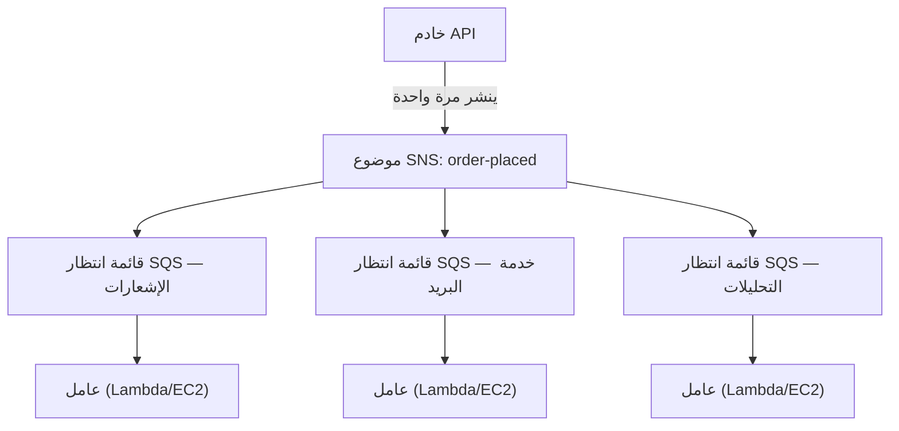

# الفصل التاسع عشر: آلة التذاكر

كانت آلة التذاكر ثورة هادئة. خذ رقماً، انتظر حتى يُنادى عليك. أصبح الطابور قائمة انتظار. أصبح بإمكان الناس الجلوس. يعمل مكتب الخدمة بوتيرته الخاصة. لا أحد يعيق أحداً.

قبل آلة التذاكر، كان عليك الوقوف في الطابور. كان موقعك في الطابور يتطلب حضورك الجسدي. لم تكن تستطيع فعل أي شيء آخر أثناء الانتظار. وإذا كان الشخص في مقدمة الطابور بطيئاً، توقّف كل من خلفه.

فصلت آلة التذاكر الوصول عن الخدمة. تصل، تأخذ رقماً، ويتذكّر النظام مكانك. كان بإمكانك الذهاب للجلوس. مكتب الخدمة يعمل عبر الأرقام بأي وتيرة يستطيع تدبّرها. إذا كان المكتب مغلقاً مؤقتاً، فإن الواصلين الجدد يحصلون مع ذلك على أرقام. ينتظرون. العمل لا يختفي — يدخل قائمة الانتظار.

هذا الاختراع الصغير هو أحد أقدم أمثلة الفصل في الأنظمة البشرية. بحلول نهاية هذا الفصل، ستكون Nimbus قد بنت آلة تذاكرها الخاصة — في البرمجيات — والسبب في حاجتها إليها يبدأ بست عشرة دقيقة من التوقف في مساء جمعة.

---

نجا الفريق من إخفاق منطقة التوافر. أصلح Leo عملية هندسة الفوضى، وكان دليل التشغيل متيناً. تعافت الزيارات وبدأت تنمو مجدداً — أسرع من قبل، في الواقع. وثائق Aurora التي كان Leo يقرؤها في وقت متأخر من الليل كانت لا تزال بضعة فصول متقدمة على المكان الذي كانت فيه Nimbus فعلاً.

لكن مع نمو الزيارات وانضمام مزيد من المطاعم، أصبح نوع مختلف من عنق الزجاجة مرئياً. ليس في البنية التحتية. في كود التطبيق نفسه. سلسلة الطلبات التي عملت بشكل جيد عند 200 طلب في الساعة بدأت تُظهر إجهاداً عند 800.

ثم جاء مساء يوم 14.

---

بدأ الأمر بلوحة التحليلات. في الساعة 6:47 مساءً يوم جمعة، أدخل نشر لخدمة التحليلات خطأ مهلة. بدأت الخدمة تستجيب في 8 ثوانٍ بدلاً من الـ 200 مللي ثانية المعتادة.

كان تدفق الطلب متزامناً. كل طلب ينتظر خدمة التحليلات قبل التأكيد للعميل. أصبحت الثماني ثوانٍ 12 مع ازدياد الحمل. بدأ تجمّع اتصال API يمتلئ بطلبات تنتظر اكتمال خطوة التحليلات.

في الساعة 6:53 مساءً، بلغ تجمّع الاتصال حدّه. بدأت الطلبات الجديدة تفشل فوراً — ليس لأن الطلب لم يكن يمكن معالجته، بل لأنه لم يكن هناك اتصال متاح لبدء معالجته.

قال Leo وهو ينظر إلى السجلات في صباح اليوم التالي: "خدمة التحليلات أسقطت تدفق الطلب. ليس بينهما أي علاقة. خدمة التحليلات تحسب فقط لوحات المعلومات."

قالت Priya: "لكنهما في سلسلة الطلب ذاتها."

قالت Maya: "ست عشرة دقيقة من التوقف. وثلاثة عملاء جرى تحصيل رسوم منهم مرتين."

كان التحصيل المزدوج أسوأ من التوقف. في فوضى تشبّع تجمّع الاتصال، أُطلقت آلية إعادة محاولة لبعض الطلبات التي كانت قد نجحت فعلاً — اكتملت خطوة الدفع، ثم انتهت مهلة الطلب قبل العودة، فحاولت إعادة المحاولة الدفع مجدداً. البطاقة ذاتها، المبلغ ذاته، رسمان.

قال Leo: "كان من المفترض أن تساعد آلية إعادة المحاولة."

قالت Priya: "ساعدت في الاتجاه الخاطئ. وهل فكّرنا فيما يحدث حين نحاول رد المال لأولئك العملاء؟ عملية رد المال تستخدم تدفق الطلب ذاته الذي فشل."

ست عشرة دقيقة من التوقف وثلاثة تحصيلات مزدوجة. كانت تلك التكلفة التجارية لسلسلة الطلبات المتزامنة.

---

كانت Nimbus تعاني من مشكلة لم تبدُ مشكلة حتى اشتعل الطلب.

في كل مرة يُسجَّل طلب، كان على خادم API أن:

1. يحفظ الطلب في قاعدة البيانات
2. يُرسل إشعاراً إلى تابلت المطعم
3. يُرسل بريداً إلكترونياً للتأكيد إلى العميل
4. يُحدّث لوحة التحليلات للمطعم
5. يسجّل الحدث لأغراض الفوترة

عند عداد ديلي مزدحم، لا ينتظر الشخص عند آلة تسجيل النقد انتهاء المقطّع من تقطيع شرائح اللحم قبل الانتقال إلى العميل التالي. يستلمون الطلب، ويسلّمونه للمطبخ، ويبدؤون خدمة الشخص التالي. المطبخ يعمل عبر الطلبات بوتيرته الخاصة. العميل يحصل على خدمة أسرع. المطبخ لا يُرهَق بارتفاعات مفاجئة. إذا كان للمطبخ لحظة بطيئة، تتراكم الطلبات خلف العداد بدلاً من تسبّب أخطاء عند آلة تسجيل النقد.

كان ذلك هو التشبيه. لم يكن لدى Nimbus عداد ومطبخ. كان لديها شخص واحد يفعل كل شيء بالتسلسل قبل أن يتمكن العميل من المغادرة.

وفي يوم 14، واجه الشخص الذي يقطّع اللحم مشكلة. فتوقّف العداد. فانتظر كل عميل بعد ذلك. المطبخ، آلة تسجيل النقد، العملاء — توقفوا جميعاً لأن خطوة واحدة في السلسلة قد تباطأت.

لم يكن الإصلاح أن نجعل تقطيع اللحم أسرع. كان الإصلاح أن نفصل الخطوات. خذ الطلب عند آلة تسجيل النقد، سلّم تذكرة، ودع المطبخ يعمل.

قالت Priya: "نحن مرتبطون بإحكام. إذا فشلت أي خطوة لاحقة، يفشل الطلب بأكمله. هل فكّرنا فيما يحدث إذا اختُرقت خدمة التحليلات وبدأت تستهلك رسائل مشوّهة؟ يفشل الطلب بأكمله — لأننا ننتظرها."

قال Leo: "ماذا لو تمكّنّا من حفظ الطلب والتأكيد للعميل فوراً، ثم معالجة الباقي في الخلفية؟"

قالت Priya: "هذه قائمة انتظار."

الرؤية الأساسية: لا يحتاج العميل إلى معرفة أن لوحة التحليلات حُدّثت قبل أن يحصل على تأكيده. يحتاج إلى معرفة أن طلبه استُلم. هذان شيئان مختلفان. السلسلة المتزامنة خلطت بينهما.

**نموذج الفصل**

هذا هو **الفصل**: فصل المكوّن الذي يقبل العمل عن المكوّنات التي تُعالجه.

كان على جميع الخطوات في تدفق طلب Nimbus أن تحدث بشكل متزامن قبل أن يتمكن API من الاستجابة للعميل. إذا كانت خدمة البريد الإلكتروني بطيئة (أحياناً كانت كذلك)، انتظر العميل. إذا توقّفت لوحة التحليلات (أحياناً توقّفت)، فشل الطلب.

أظهر التتالي في يوم 14 بالضبط لماذا كان هذا مهماً. لم يكن لخدمة التحليلات أي علاقة بما إذا كان طلب العميل مقبولاً. لكن لأنها كانت تجلس في السلسلة المتزامنة ذاتها، أصبح فشلها فشل الجميع.

في أنظمة البرمجيات، قائمة الانتظار غالباً ما تكون وسيط رسائل — خدمة تقبل الرسائل من المنتجين وتُقدّمها للمستهلكين.

ربما تتساءل: إذا أصبح تدفق الطلب الآن غير متزامن، فكيف يعرف العميل أن طلبه استُلم فعلاً؟ الجواب في تصميم المعمارية: يحفظ API الطلب في قاعدة البيانات (متزامن — هذا هو التأكيد الموثوق)، ثم ينشر الأحداث إلى قائمة الانتظار. تأكيد العميل مبني على نجاح الكتابة في قاعدة البيانات، لا على اكتمال الخدمات اللاحقة. إذا كانت خدمة البريد الإلكتروني بطيئة، فإن العميل لديه تأكيده بالفعل. البريد الإلكتروني مجرد متابعة لطيفة إضافية.

**Amazon SQS: قائمة الانتظار**

**Amazon SQS (خدمة قائمة الانتظار البسيطة)** هي خدمة قائمة انتظار الرسائل المُدارة من AWS. تخزّن الرسائل بشكل متين حتى تُعالجها جهة استهلاك.

التدفق الأساسي:

1. **المنتج** (خادم API) يضع رسالة في قائمة الانتظار: `{ "orderId": "ORD-5532", "restaurantId": "47", "items": [...] }`
2. يستجيب API فوراً للعميل: "الطلب مؤكّد!"
3. **المستهلكون** (خدمات عمال منفصلة) يقرؤون الرسائل من قائمة الانتظار ويُعالجونها: إرسال إشعار المطعم، إرسال البريد الإلكتروني للتأكيد، تحديث التحليلات

تجربة العميل: تأكيد فوري. المعالجة اللاحقة: تحدث بشكل غير متزامن، بوتيرة العمال.

**المفاهيم الرئيسية لـ SQS**

**مهلة رؤية الرسالة**: حين يقرأ مستهلك رسالة من SQS، تصبح الرسالة *غير مرئية* للمستهلكين الآخرين لفترة (الافتراضي: 30 ثانية). هذا يمنح المستهلك وقتاً لمعالجتها. إذا أنهى المستهلك بنجاح، يحذف الرسالة. إذا انهار المستهلك، تنتهي مهلة الرؤية وتصبح الرسالة مرئية مجدداً لمستهلك آخر لإعادة المحاولة.

هذا يضمن التقديم مرة على الأقل: كل رسالة ستُعالج على الأقل مرة واحدة، حتى لو فشل مستهلك في منتصف المعالجة.

ربما تتساءل: إذا أصبحت الرسالة غير مرئية أثناء معالجتها لكنها لا تُحذف حين ينهار المستهلك، أفلا يمكن معالجتها مرتين؟ نعم — وهذا يُسمى التقديم مرة على الأقل. يعني أن كل مستهلك يجب أن يُصمَّم للتعامل مع استقبال الرسالة ذاتها أكثر من مرة دون تسبّب مشكلة. بريد تأكيد طلب مكرر أمر مزعج. رسم مكرر هو تذكرة دعم. صمّم مستهلكيك وفقاً لذلك.

يجب أن تكون مهلة الرؤية أطول من أطول وقت معالجة متوقع لديك. إذا كانت المعالجة تستغرق عادةً 20 ثانية لكنها أحياناً تستغرق 90 ثانية، ومهلة الرؤية لديك 30 ثانية، فإن تلك المعالجة العرضية البالغة 90 ثانية ستبدو فشلاً لـ SQS. تصبح الرسالة مرئية مجدداً. يلتقطها مستهلك ثانٍ. الآن يعالج عاملان الرسالة ذاتها. إذا لم تكن معالجتك خاملة التكرار، فلديك مشكلة.

خطأ شائع: ضبط مهلة الرؤية مساوية لمتوسط وقت المعالجة. النهج الصحيح: ضبطها على وقت معالجة المئين التاسع والتسعين، مع هامش أمان. إذا كان وقت معالجة P99 هو 45 ثانية، اضبط مهلة الرؤية على 90 ثانية.

**قوائم الرسائل الميتة (DLQ)**: إذا فشلت رسالة في المعالجة مرات كثيرة جداً (قابل للضبط — مثلاً 5 محاولات)، تنقل SQS الرسالة إلى قائمة رسائل ميتة. تفحص DLQ لفهم سبب فشل الرسائل دون فقدانها.

DLQ هي حيث تتعلّم ما يفشل فعلاً في الإنتاج. بدونها، تختفي الرسائل الفاشلة ببساطة ولا تملك طريقة للتحقيق.

بعد ثلاثة أسابيع من الترحيل إلى SQS، لاحظ Leo أن 23 رسالة قد تراكمت في DLQ الخاصة بخدمة الإشعارات. لم يكن يفحص DLQ (كان قد أعدّها بشكل صحيح ثم افترض أنها ستبقى فارغة).

سحب رسالة واحدة ونظر إلى محتواها:

```json
{
  "orderId": "ORD-9821",
  "restaurantId": "12",
  "customerMessage": "Extra spicy please 🌶️🔥",
  "timestamp": "2024-01-18T19:43:11Z"
}
```

الرمز التعبيري. كانت خدمة إشعار المطعم تُرمّز محتويات الرسائل بترميز Latin-1 قبل إرسالها إلى واجهة API القديمة لتابلت المطعم. حروف الرمز التعبيري — أربعة بايتات لكل منها في UTF-8 — كانت تتلف، مما يجعل واجهة API للتابلت ترفض الطلب. كانت الرسالة تُعيد المحاولة، تفشل مجدداً، تُعيد المحاولة مجدداً، تفشل مجدداً. بعد 5 محاولات، تنقلها SQS إلى DLQ.

قال Leo: "كل الرسائل الـ 23 تحتوي رموزاً تعبيرية في حقل ملاحظات العميل."

قالت Maya: "إذن كل عميل أضاف رمزاً تعبيرياً إلى ملاحظات طلبه فشلت ملاحظته بصمت في الوصول إلى المطعم."

"نعم."

"لكم من الوقت؟"

تحقّق Leo من الطابع الزمني لأقدم رسالة. "ثلاثة أسابيع."

كانت Priya صامتة. "وماذا لو اكتشف أحدهم أن إضافة رمز تعبيري إلى ملاحظة طلب تُسبّب فشلاً صامتاً؟ يمكنك وضع طلبات برموز تعبيرية وضمان أن المطعم لن يرى التعليمات أبداً. ثم تشتكي من الطلب الخطأ."

لم يستغل أحد هذا. لكنه كان السؤال الصحيح الذي ينبغي طرحه.

أصلح Leo خطأ الترميز. ثم كتب نصاً برمجياً لإعادة تشغيل جميع الرسائل الـ 23 العالقة من DLQ. استقبلت المطاعم تعليماتها الحارة بالرموز التعبيرية (التي عمرها ثلاثة أسابيع). لم يعرف العملاء قط.

الدرس: يجب مراقبة DLQ بنشاط، لا إعدادها ونسيانها. DLQ متنامية إشارة صامتة على أن شيئاً يفشل بشكل متكرر.

**أنواع قوائم الانتظار**:

**قوائم الانتظار القياسية**: إنتاجية قصوى (رسائل غير محدودة في الثانية). ترتيب التقديم يبذل قصارى جهده (غير مضمون). تقديم مرة على الأقل (نادراً جداً، قد تُقدَّم رسالة مرتين).

**قوائم FIFO**: ترتيب صارم أولاً يدخل أولاً يخرج. **معالجة** مرة واحدة بالضبط — إزالة التكرار قائمة على `MessageDeduplicationId` ضمن نافذة 5 دقائق. الترتيب مضمون *لكل* `MessageGroupId`: الرسائل في المجموعة ذاتها تصل بالترتيب؛ المجموعات المختلفة يمكن معالجتها بالتوازي، وهذه هي الطريقة التي تتوسع بها FIFO. الإنتاجية الأساسية 3,000 رسالة في الثانية مع التجميع (300 بدونه)؛ تمكين **وضع الإنتاجية العالية** يرفع هذا إلى عشرات الآلاف في الثانية عبر تقسيم مجموعات الرسائل. استخدم FIFO حين يهم الترتيب (المعاملات المالية، تغييرات الحالة التسلسلية).

إذا كنت تحتاج إنتاجية قصوى ويمكنك تحمّل رسائل مكررة عرضية، استخدم SQS القياسية — لكن يجب أن تُصمّم كل مستهلك للتعامل مع التكرار دون تسبّب مشاكل. إذا كنت تحتاج ترتيباً صارماً ومعالجة مرة واحدة بالضبط، استخدم SQS FIFO — وصمّم `MessageGroupId`s الخاصة بك جيداً، لأن التوازي (وبالتالي الإنتاجية) يأتي من وجود مجموعات كثيرة.

بالنسبة لـ Nimbus، استخدمت معظم قوائم الانتظار القوائم القياسية. قائمة انتظار الفوترة استخدمت FIFO لضمان معالجة الرسوم بالترتيب.

**التوسع التلقائي على عمق قائمة الانتظار: توسيع العمال لمطابقة التراكم**

أحد أقوى تطبيقات SQS هو استخدام عمق قائمة الانتظار كمُحفّز للتوسع التلقائي. بدلاً من التوسع بناءً على وحدة المعالجة المركزية أو الذاكرة، تتوسع بناءً على كمية العمل المنتظرة.

بالنسبة لخدمة إشعارات Nimbus: عمق قائمة انتظار SQS (عدد الرسائل المنتظرة للمعالجة) كان موصولاً بسياسة Application Auto Scaling لخدمة ECS التي تُشغّل عمال الإشعارات.

السياسة: حين تحتوي قائمة الانتظار على أكثر من 50 رسالة لكل مهمة عامل، أضف مهمة. حين تحتوي قائمة الانتظار على أقل من 10 رسائل لكل مهمة عامل، أزل مهمة.

الأثر العملي: حين وصل 1,200 طلب عبر ذروة مساء الجمعة، قفز عمق قائمة انتظار الإشعارات وتوسّع أسطول العمال من مهمتين إلى 8 مهام خلال 3 دقائق. بحلول منتصف الليل، كانت قائمة الانتظار فارغة وعاد الأسطول إلى 2.

سأل Tom وهو ينظر إلى رسم التوسع التلقائي: "كم يكلّف ذلك شهرياً؟"

قال Leo: "لا شيء إضافي للتوسع التلقائي نفسه. لكن 6 مهام ECS إضافية لمدة 3 ساعات في أمسيات الجمعة — ذلك ذو معنى."

حسب Tom. "حوالي 14 دولاراً شهرياً لتلك الذُّرى. وقبل ذلك، كنا نُشغّل 8 مهام باستمرار بالتكلفة الكاملة؟"

"نعم."

"إذن ندفع مقابل الاندفاع حين نحتاجه ولا شيء غير ذلك."

هذا هو نمط التوسع على عمق قائمة الانتظار: تصبح قائمة الانتظار مخزناً مؤقتاً يمتص ذُرى الزيارات، ويتوسع أسطول العمال لتصريف المخزن المؤقت. المستخدمون لا يختبرون بطئاً — حصلوا على تأكيدهم فوراً حين قُبل الطلب. العمال فقط يستغرقون وقتاً أطول قليلاً للحاق. ولأنك لا تُشغّل سعة الذروة على مدار الساعة طوال أيام الأسبوع، تكون التكاليف أقل بكثير.

**Amazon SNS: المُذيع**

**Amazon SNS (خدمة الإشعارات البسيطة)** هي خدمة رسائل نشر/اشتراك (pub/sub). بدلاً من منتج واحد ومستهلك واحد (قائمة انتظار)، يدعم SNS رسالة واحدة تُقدَّم لـ *كثير* من المشتركين في آن واحد.

النموذج:

1. يُرسل **ناشر** رسالة إلى **موضوع** SNS
2. يستقبل جميع **المشتركين** في ذلك الموضوع الرسالة في آن واحد (توزيع المروحة)

يمكن أن يكون المشتركون:

- قوائم انتظار SQS (دفع الرسالة إلى قائمة انتظار للمعالجة غير المتزامنة)
- دوال Lambda (تشغيل الدالة مباشرةً)
- نقاط نهاية HTTP/HTTPS (تقديم webhook)
- عناوين بريد إلكتروني
- SMS (أرقام هواتف)

بالنسبة لـ Nimbus، يُنشر حدث تسجيل الطلب إلى موضوع SNS اسمه `order-events`:

- خدمة إشعار المطعم تشترك (تستقبل على قائمة انتظار SQS الخاصة بها)
- خدمة البريد الإلكتروني تشترك (تستقبل على قائمة انتظار SQS الخاصة بها)
- خدمة التحليلات تشترك (تستقبل على قائمة انتظار SQS الخاصة بها)
- خدمة الفوترة تشترك (تستقبل على قائمة انتظار FIFO SQS الخاصة بها)

حدث طلب واحد. أربعة مشتركين. جميعهم مُبلَّغون في آن واحد. كل منهم يُعالج بوتيرته الخاصة.

قالت Maya: "إذن SNS هو الإعلان، وSQS هو صندوق الوارد حيث تعالج كل خدمة الإعلان بسرعتها الخاصة. إذن لماذا نستخدم كليهما؟ لماذا لا نجعل الجميع يشترك في موضوع SNS مباشرةً؟"

قال Leo: "لأن التقديم المباشر عبر SNS هو إطلاق ونسيان. إذا كانت خدمة التحليلات معطّلة حين يُطلق SNS، ضاعت تلك الرسالة. مع قائمة انتظار SQS في الوسط، تنتظر الرسالة حتى تتعافى الخدمة."

قالت Priya: "بالضبط. توزيع مروحة SNS/SQS هو النمط المعياري."

**نمط توزيع المروحة SNS/SQS**

هذا التوليف — موضوع SNS يُغذّي قوائم انتظار SQS متعددة — هو أحد أهم الأنماط المعمارية في AWS:



كل قائمة انتظار مستقلة. يمكن أن تكون خدمة التحليلات بطيئة — تمتلئ قائمة الانتظار الخاصة بها، لكن خدمتَي الإشعار والبريد الإلكتروني تستمران دون تأثر. إذا توقّفت خدمة التحليلات، تنتظر رسائلها في قائمة الانتظار حتى تعود. لا يُفقد شيء.

هذه هي الخاصية الرئيسية: **الفشل المستقل**. مشاكل في مستهلك واحد لا تنتشر للآخرين.

**تصفية الرسائل: ليست كل رسالة لكل مشترك**

مع نمو الأنظمة، لا تريد كل مشترك أن يعالج كل رسالة. لا ينبغي لخدمة التحليلات أن تستقبل رسائل حول فشل معالجة الدفع إذا كانت تهتم فقط بالطلبات المكتملة.

**تصفية رسائل SNS** تتيح للمشتركين تحديد سياسات تصفية — تقديم الرسائل المطابقة لسمات معينة فقط.

تشترك خدمة إشعار المطعم بتصفية: فقط الرسائل حيث `status = "confirmed"`.

تشترك خدمة تنبيه الأخطاء بتصفية: فقط الرسائل حيث `status = "failed"`.

كل مشترك يحصل فقط على ما يحتاجه.

بدون التصفية، يستقبل كل مشترك كل رسالة ويجب أن يتجاهل ما هو غير ذي صلة. هذا يُهدر المعالجة، ويُهدر المال (SQS تُحاسب لكل رسالة)، ويُدخل ضجيجاً. نظام طلبات عالي الحجم بدون تصفية سيُغرق قائمة انتظار تنبيه الأخطاء بطلبات ناجحة — مما يجعل الإخفاقات الحقيقية صعبة العثور عليها.

تبدو سياسات التصفية هكذا:

```json
{
  "status": ["confirmed"],
  "region": ["us-west-2", "us-east-1"]
}
```

هذا المشترك يستقبل فقط الرسائل حيث الحالة "confirmed" وحيث المنطقة إما "us-west-2" أو "us-east-1". الرسائل غير المطابقة للسياسة لا تُقدَّم إلى قائمة انتظار هذا المشترك على الإطلاق — لا تصل أبداً حتى إلى SQS.

سألت Priya: "إذن التصفية تحدث في طبقة SNS، قبل كتابة الرسائل إلى SQS؟"

"صحيح. قائمة انتظار SQS لخدمة إشعار المطعم لا ترى أبداً سوى الرسائل التي تحتاج للتصرّف بشأنها."

سألت Priya: "وماذا لو حاول أحدهم الاختراق بنشر رسالة مصاغة خصيصاً إلى موضوع SNS تطابق كل تصفيات المشتركين؟"

كان لموضوع SNS سياسة مورد IAM: فقط خدمة API للطلبات (عبر دور IAM الخاص بها) مسموح لها بالنشر. سياسات وصول SNS وسياسات قوائم انتظار SQS شكّلتا طبقة التحكم في الوصول — التصفية كانت للتوجيه فقط، لا للأمان.

**متى تستخدم SQS مقابل SNS**

**SQS وحده**: منتج واحد، مستهلك واحد (أو مستهلكون متنافسون متعددون على قائمة الانتظار ذاتها). الرسائل تحتاج معالجة مرة واحدة، بترتيب (FIFO) أو بدونه (قياسي). نمط قائمة انتظار العمال — قائمة انتظار واحدة، عمال متعددون يستهلكون منها.

**SNS وحده**: إشعارات إطلاق ونسيان. دفع إلى البريد الإلكتروني أو SMS أو نقاط نهاية HTTP. لا حاجة لتخزين الرسالة في قائمة انتظار — فقط إشعار والمضي قدماً.

**SNS + SQS (توزيع المروحة)**: حدث واحد، مستهلكون مستقلون متعددون. لكل مستهلك قائمة انتظاره الخاصة، يُعالج بشكل مستقل، ويمكن أن يفشل بشكل مستقل.

## مواضيع SNS FIFO

كل ما سبق عن SNS يستخدم المواضيع القياسية — لها فعلياً إنتاجية غير محدودة، وتُقدّم للمشتركين في آن واحد تقريباً، وتؤدي المهمة للأغلبية الساحقة من حالات الاستخدام.

لكن مواضيع SNS القياسية لا تضمن الترتيب. إذا نشرت عشر رسائل بالتسلسل، قد يستقبلها المشتركون بترتيب مختلف قليلاً. بالنسبة لإشعارات طلبات Nimbus، ذلك لا بأس به — تحديث تحليلات يصل جزءاً من الثانية قبل تأكيد بريد إلكتروني لا يهم.

في بعض السيناريوهات، يهم. تأمّل دفتر أستاذ مالي: إذا قُدّم حدثان — إضافة دائنة ثم خصم — بترتيب معكوس، ستكون حسابات الرصيد أثناء المعالجة خاطئة حتى لو عولج كلا الحدثين في النهاية بشكل صحيح.

**مواضيع SNS FIFO** تُطبّق المبدأ ذاته الذي تطبّقه قوائم انتظار SQS FIFO على نموذج توزيع المروحة. تُقدَّم الرسائل للمشتركين بالترتيب الدقيق الذي نُشرت به، وتُقدَّم كل رسالة مرة واحدة بالضبط.

المقايضة: مواضيع SNS FIFO لها إنتاجية أساسية مشابهة لـ SQS FIFO (3,000 رسالة في الثانية لكل موضوع؛ 300 في الثانية لكل مجموعة رسائل — مع توفّر وضع إنتاجية عالية منذ 2025 لما هو أكثر بكثير)، وتوزّع المروحة فقط إلى **قوائم انتظار SQS** — FIFO أو، منذ 2023، القياسية. اشتراك قائمة انتظار قياسية مفيد للمستهلكين الذين لا يهتمون بالترتيب (تغذية تحليلات، مثلاً)، لكن الترتيب والمرة-الواحدة-بالضبط ينجوان من البداية إلى النهاية **فقط** إلى قوائم انتظار FIFO. لا يمكنك استخدام موضوع SNS FIFO للتقديم إلى نقاط نهاية HTTP أو عناوين بريد إلكتروني.

بالنسبة لخط فوترة Nimbus — حيث كان يجب تطبيق تسلسل من تحديثات التسعير على حسابات المطاعم بالترتيب — جرى ترحيل موضوع SNS للفوترة من القياسي إلى FIFO. كانت قائمة انتظار SQS للفوترة بالفعل FIFO. الآن يضمن توزيع المروحة أن حدث زيادة سعر لن يصل أبداً إلى معالج الفوترة قبل حدث بداية الفترة الذي يعتمد عليه.

> **نصيحة الامتحان — SNS FIFO**
>
> إذا تطلّب سيناريو **تقديم توزيع مروحة مرتّباً** عبر مشتركين متعددين، فالإجابة هي **SNS FIFO**. SNS القياسي لا يضمن الترتيب. SNS FIFO يوزّع المروحة فقط إلى قوائم انتظار SQS — للحفاظ على الترتيب والمرة-الواحدة-بالضبط من البداية إلى النهاية، يجب أن يكون المشترك قائمة انتظار SQS **FIFO** (اشتراكات قائمة الانتظار القياسية مسموحة لكنها تحصل على ترتيب يبذل قصارى جهده وتقديم مرة على الأقل). الإنتاجية الافتراضية 3,000 في الثانية لكل موضوع — إذا وصف السيناريو حجماً أعلى بكثير *و* ترتيباً صارماً، فتلك إشارة للنظر في معماريات بديلة (Kinesis، مثلاً، الذي يُغطّى في فصل لاحق).

## حين لا تتركك قائمة الانتظار القديمة

كانت Nimbus على وشك إغلاق أكبر استحواذ لها حتى الآن: Barato، منافس في توصيل الطعام بـ 200 مطعم وتقدّم سنتين في العمليات. جدول فريق الهندسة مكالمة تخطيط للدمج.

استمرت المكالمة عشرين دقيقة قبل أن يصمت Leo.

قال: "نظام معالجة الطلبات لديهم. على ماذا يعمل؟"

قال مهندس Barato على الطرف الآخر: "ActiveMQ. وسيط محلي. التطبيق بلغة Java. يعمل منذ 2018. كل شيء يتحدث AMQP."

قال Leo: "AMQP."

"نعم."

نظر إلى مخطط المعمارية على شاشته. كانت Nimbus تُشغّل SQS وSNS. SQS لا يتحدث AMQP. SNS لا يتحدث AMQP. تطبيق Barato لا يتحدث شيئاً آخر.

قال Leo للفريق بعد المكالمة: "إعادة كتابته ستستغرق ستة أشهر. كحد أدنى."

قالت Maya: "لا يمكننا تأجيل الاستحواذ ستة أشهر."

أضافت Priya: "ولا يمكننا تشغيل وسيط ActiveMQ على عتاد عارٍ في AWS. هل فكّرنا كيف يبدو ذلك من منظور الأمان والموثوقية؟ وسيط رسائل مُدار ذاتياً، يجلس في الإنتاج، بدون ترقيع مُدار، بدون تحوّل تلقائي، يتصل ببنيتنا التحتية؟"

قال Leo ببطء: "هناك خيار مُدار." كان يقرأ بينما يتحدثون. "Amazon MQ."

**Amazon MQ: الوسيط المُدار**

**Amazon MQ** هي خدمة وسيط رسائل مُدارة لـ Apache ActiveMQ وRabbitMQ. تُشغّل وسيطك الموجود — الوسيط ذاته الذي ظلّت تطبيقاتك متصلة به لسنوات — لكن كخدمة AWS مُدارة. تتولى AWS البنية التحتية الأساسية: التوفير، الترقيع، التحوّل، النسخ الاحتياطي.

الخاصية الرئيسية التي تجعل Amazon MQ مختلفة عن SQS وSNS: إنها تتحدث البروتوكولات التي تتحدثها وسطاء الرسائل القديمون. AMQP، STOMP، MQTT، OpenWire، NMS. البروتوكولات التي لا تفهمها SQS وSNS ببساطة.

بالنسبة لدمج Barato، كانت الخطة مباشرة. ستُشغّل AWS وسيط Amazon MQ مُعدّاً كـ ActiveMQ. سيُوجَّه تطبيق Barato بلغة Java إلى نقطة نهاية الوسيط الجديد بدلاً من المحلية. التغيير على جانب التطبيق: تحديث ملف إعداد واحد بسلسلة الاتصال الجديدة. كان ذلك كل شيء. لم يكن التطبيق بحاجة لمعرفة أنه يتحدث إلى وسيط سحابي مُدار بدلاً من خادم في مكتب Barato.

قالت Maya: "لحظة. إذا كنا سندمجهم في Nimbus في النهاية، أفلا ينبغي أن نرحّلهم إلى SQS من البداية؟"

قال Leo: "لأن مسار الترحيل موجود. ويستحق فعله بشكل صحيح — في النهاية. لكن الآن، نحتاج Barato تعمل على بنية AWS التحتية في ثلاثين يوماً، لا ستة أشهر. Amazon MQ يجعل التطبيق يعمل دون تغيير التطبيق. ثم يكون لدينا وقت للتخطيط لترحيل SQS كمشروع متعمَّد، لا متطلباً مسبقاً متعجَّلاً للاستحواذ."

سأل Tom: "كم يكلّف ذلك شهرياً؟"

وسيط Amazon MQ — زوج نشط/احتياطي واحد للموثوقية — كان في نطاق 200 دولار شهرياً لوسيط مناسب لحجم Barato. مقارنةً بتكلفة ستة أشهر من وقت إعادة الكتابة، لم يكن نقاشاً.

وافقت Priya على الخطة بشرط واحد: نسخة Amazon MQ ستعيش في شبكة فرعية خاصة، مع قواعد مجموعة أمان تسمح بالاتصالات فقط من خوادم تطبيق Barato. لا تعريض عام. تسجيل تدقيق مُمكَّن.

استغرق الترحيل اثني عشر يوماً. اتصل تطبيق Barato بـ Amazon MQ في اليوم الثالث عشر. في اليوم الرابع عشر، عالج أول طلب له على بنية AWS التحتية دون تغيير سطر كود واحد.

---

> **نصيحة الامتحان — Amazon MQ**
>
> *SAA-C03 المجال: تصميم معماريات مرنة (المجال الثاني)*
>
> يُميّز الامتحان Amazon MQ عن SQS وSNS على محور واحد: **توافق البروتوكول**. إذا وصف السيناريو تطبيقاً يستخدم بالفعل وسيط رسائل ويتحدث بروتوكولاً محدداً، فإن Amazon MQ هو الإجابة على الأرجح.
>
> الإشارات الرئيسية: **"ActiveMQ" أو "RabbitMQ" أو "AMQP" أو "STOMP" أو "MQTT" أو "OpenWire"**، أو أي عبارة تعادل **"دون تغيير كود التطبيق."** إذا رأيت تلك العبارات، فالإجابة هي Amazon MQ — لا SQS، لا SNS.
>
> إذا وصف السيناريو تطبيقاً *جديداً* يحتاج فصلاً، أو لم يذكر وسيطاً قديماً أو بروتوكولاً محدداً، استخدم SQS/SNS.
>
> إشارة أخرى: "ترحيل وسيط رسائل محلي موجود إلى AWS." إذا كان التطبيق بحاجة لمواصلة التحدث بالبروتوكول ذاته إلى النوع ذاته من الوسطاء، فإن Amazon MQ هو إجابة الرفع والنقل.

## نقاط القوة والقيود

**لماذا SQS وSNS قويتان**:

- SQS توفر تقديم رسائل متيناً وموثوقاً — الرسائل مخزّنة عبر مناطق توافر متعددة
- الفصل يُتيح التوسع المستقل والنشر لخدمات المنتج والمستهلك
- قوائم الرسائل الميتة تضمن عدم فقدان رسالة بصمت عند الفشل
- نمط توزيع المروحة لـ SNS يتيح إضافة مستهلكين جدد دون تغيير المنتج

**حيث يتعقد الأمر**:

- التقديم مرة على الأقل يعني أن المستهلكين يجب أن يكونوا *خاملي التكرار* — معالجة الرسالة ذاتها مرتين لا ينبغي أن تُسبّب مشاكل (طلبات مكررة، رسوم مكررة)
- قوائم FIFO أكثر تكلفة ولها حدود إنتاجية
- تصحيح الرسائل الفاشلة عبر قوائم وخدمات متعددة يتطلب تسجيلاً وقابلية ملاحظة جيدة
- ضمانات ترتيب الرسائل محدودة — إذا كان الترتيب الصارم مهماً عبر خدمات متعددة، يزداد تعقيد التصميم

**خمول التكرار: غوص عملي عميق**

يبدو خمول التكرار مجرداً حتى يُحصَّل من ثلاثة عملاء مرتين.

تكون العملية **خاملة التكرار** إذا كان تشغيلها مرات متعددة يُنتج النتيجة ذاتها كتشغيلها مرة واحدة. عملية التحصيل ليست خاملة التكرار بطبيعتها: تشغيلها مرتين يُحصّل مرتين. عملية تحصيل خاملة التكرار تتحقق مما إذا كان التحصيل قد عولج بالفعل قبل محاولته.

النمط: تحمل كل رسالة معرّفاً فريداً (معرّف الطلب، أو معرّف رسالة منفصل). قبل المعالجة، يتحقق المستهلك من مخزن (DynamoDB يعمل جيداً لهذا) لمعرفة ما إذا كان معرّف الرسالة هذا قد عولج بالفعل بنجاح. إذا نعم: لا تفعل شيئاً، احذف الرسالة. إذا لا: عالج، سجّل المعرّف، احذف الرسالة.

```python
def process_charge(message):
    order_id = message['orderId']
    
    # Idempotency check
    if already_processed(order_id):
        logger.info(f"Order {order_id} already charged, skipping duplicate")
        return  # Message will be deleted from queue
    
    # Process the charge
    charge_result = payment_service.charge(
        amount=message['amount'],
        card_token=message['cardToken'],
        idempotency_key=order_id  # Also pass to payment processor
    )
    
    # Record that we've processed this
    mark_as_processed(order_id, charge_result)
```

ينبغي أيضاً تمرير مفتاح خمول التكرار إلى الخدمات اللاحقة (معالجات الدفع، أنظمة البريد الإلكتروني) التي تدعمه. Stripe، مثلاً، يقبل ترويسة `Idempotency-Key` تمنع التحصيلات المكررة حتى لو أُجري استدعاء API ذاته مرتين.

سألت Priya: "وماذا عن معرّفات الارتباط؟ حين تنتقل رسالة عبر خدمات متعددة، كيف نتتبّع أي طلب سبّب أي إجراء لاحق؟"

**معرّفات الارتباط: التتبّع عبر الخدمات**

حين يضع عميل طلباً، يتدفق الطلب عبر: API ← SNS ← SQS ← عامل الإشعار ← واجهة API لتابلت المطعم ← SQS ← عامل البريد الإلكتروني ← SES.

بدون معرّفات الارتباط، إذا أرجعت واجهة API لتابلت المطعم خطأً عند الخطوة 6، فإن السجلات في كل خدمة تُظهر الحدث، لكن لا توجد طريقة لتتبّعه رجوعاً إلى طلب العميل المحدد من البداية.

**معرّف الارتباط** هو معرّف فريد مُرفق بالطلب الأصلي ومُمرَّر عبر كل تفاعل خدمة. كل خدمة تُضمّن معرّف الارتباط في سجلاتها.

حين تبحث Priya في CloudWatch عن معرّف ارتباط محدد، تحصل على كل سطر سجل — عبر كل خدمة — كان جزءاً من معالجة ذلك الطلب الواحد.

قالت Priya: "تحفّظ واحد. معرّفات الارتباط تأتي من الخارج. أيمكن لأحدهم حقن معرّف خبيث والعبث بتسجيلنا؟"

معرّفات الارتباط داخلية — لا تؤثر على منطق المعالجة، فقط على التسجيل. تطهيرها (أبجدية رقمية، طول ثابت) يمنع هجمات الحقن في مخرجات السجلات.

**حين يكون الفصل الخيار الخاطئ**

سألت Maya: "لحظة — لكن *لماذا* لا نفصل كل شيء؟"

كان سؤالاً عادلاً. إذا كان الفصل يمنع إخفاقات التتالي ويجعل الأنظمة مرنة، فلماذا لا نطبّقه في كل مكان؟

لأن للفصل تكاليف. وهناك سيناريوهات تفوق فيها تلك التكاليف الفوائد.

**حين تحتاج اتساقاً فورياً**: إذا كان يجب تأكيد دفعة قبل أن يتمكن طلب من المضي قدماً — والمستخدم ينتظر على الشاشة النتيجة — لا يمكنك وضع الدفعة في قائمة انتظار غير متزامنة وإرجاع تأكيد قبل أن تعرف ما إذا نجح التحصيل. قد يطلب المستخدم مرتين قبل اكتمال التحصيل الأول. الفصل غير المتزامن لا يعمل للعمليات التي تعتمد فيها الاستجابة على النتيجة.

**حين يكون سير العمل تسلسلياً بطبيعته**: إذا كان يجب أن ترى الخطوة 3 نتيجة الخطوة 2 لاتخاذ قرار، فلا يمكن تشغيلهما بالتوازي من قائمة انتظار. إجبارهما في قائمة انتظار يُنشئ آلية تمرير نتائج محرجة كثيراً ما ينتهي بها الأمر أكثر تعقيداً من النسخة المتزامنة.

**حين يكون ترتيب الرسائل حرجاً والحجم منخفضاً**: SQS القياسية لا تضمن الترتيب. SQS FIFO تضمنه، لكنها تحدّ عند 3,000 رسالة في الثانية مع التجميع افتراضياً (وضع الإنتاجية العالية يرفع ذلك بشكل كبير). إذا كان لديك سير عمل منخفض الحجم ومرتّب بصرامة، فقد تكون قائمة انتظار متزامنة بسيطة (مثل قفل صف قاعدة بيانات) أبسط وأكثر موثوقية.

**حين تتجاوز الأعباء الفائدة**: أداة داخلية صغيرة بمستخدم واحد وبلا SLA على الأرجح لا تحتاج مواضيع SNS لتوزيع المروحة وقوائم رسائل ميتة. العبء التشغيلي لمراقبة قوائم الانتظار وDLQs حقيقي. حجّم المعمارية حسب المشكلة.

السؤال ليس "هل ينبغي أن أفصل هذا؟" بل "ما تكلفة هذا الاقتران، وهل يُقلّل الفصل تلك التكلفة أكثر مما يُضيف؟"

## الملخص

الفصل هو مبدأ المرونة من الفصل الثامن عشر مُطبَّقاً على المعمارية الداخلية: بالطريقة ذاتها التي يلغي بها Multi-AZ نقاط الفشل المنفردة في البنية التحتية، تلغي SQS وSNS نقاط الفشل المنفردة في سلاسل الطلبات.

- **الفصل** يفصل المكوّنات التي تنتج العمل عن المكوّنات التي تُعالجه.
- **SQS** يمنح المنتجين مكاناً متيناً لوضع العمل حين يكون المستهلكون بطيئين أو غير متصلين أو يتوسعون.
- **SNS** يتيح لحدث واحد الوصول إلى مستهلكين مستقلين متعددين دون أن يعرف الناشر من هم.
- **توزيع مروحة SNS + SQS** يتيح لكل خدمة لاحقة معالجة الحدث ذاته بوتيرتها الخاصة.
- **قوائم الرسائل الميتة وخمول التكرار ومعرّفات الارتباط** هي الانضباط التشغيلي الذي يجعل الأنظمة غير المتزامنة قابلة للتصحيح بدلاً من غامضة.
- **لا تفصل بشكل أعمى**: سير العمل المتزامن، ومتطلبات الاتساق الفوري، والأدوات الصغيرة منخفضة المخاطر قد لا تبرّر السطح التشغيلي المُضاف.

## نصائح الامتحان

*SAA-C03 المجال: تصميم معماريات مرنة (المجال الثاني، المهمة 2.1)*

- **SQS القياسية مقابل FIFO**: يُميّز الامتحان بالترتيب وضمانات التقديم. "يجب المعالجة بالترتيب" ← FIFO. "إنتاجية قصوى" ← القياسية.
- **التوسع التلقائي على عمق قائمة الانتظار**: "توسيع العمال بناءً على عمق قائمة الانتظار" ← مقياس SQS (ApproximateNumberOfMessagesVisible) مُستخدَم مع Application Auto Scaling أو ECS Service Auto Scaling.
- **مهلة الرؤية**: مفهوم رئيسي للتقديم مرة على الأقل. إذا فشل مستهلك، تصبح الرسالة مرئية مجدداً بعد المهلة. سيناريو الامتحان: "الرسائل تُعالج مرتين" ← مهلة الرؤية قصيرة جداً (المستهلك يستغرق أطول من المهلة في المعالجة).
- **قائمة الرسائل الميتة**: الرسائل التي تفشل بعد N محاولات تُنقل إلى هنا. سيناريو الامتحان: "ضمان عدم فقدان الرسائل، حتى لو فشلت المعالجة مراراً" ← DLQ.
- **توزيع مروحة SNS**: نمط امتحان كلاسيكي لحدث واحد يُشغّل مستهلكين متعددين. "إشعار وضع الطلب يجب أن يُشغّل البريد الإلكتروني وSMS وتحديث المخزون في آن واحد" ← موضوع SNS مع اشتراكات SQS.
- **SQS + Lambda**: يمكن ضبط Lambda لاستقراء قائمة انتظار SQS والتشغيل على كل دفعة رسائل. يستخدم الامتحان هذا للمعالجة المدفوعة بالأحداث على نطاق واسع.
- **استقراء SQS الطويل**: بدلاً من استقراء المستهلكين كل بضع ثوانٍ (استقراء قصير، يُضيّع استدعاءات API)، ينتظر الاستقراء الطويل حتى 20 ثانية للرسالة. يُقلّل التكاليف والاستجابات الفارغة الزائفة.
- **مكتبة عميل SQS الموسّعة**: للرسائل الأكبر من حد محتوى قائمة الانتظار (256KB افتراضياً؛ قابلة للرفع إلى 1MB منذ 2025)، استخدم مكتبة عميل SQS الموسّعة، التي تخزّن جسم الرسالة في S3 وترسل مرجعاً عبر SQS. لا يزال الامتحان يعامل 256KB كحد SQS — "رسالة SQS كبيرة جداً" ← مكتبة العميل الموسّعة + S3.
- **تصفية رسائل SNS**: يستقبل المشتركون فقط الرسائل المطابقة لسياسة تصفيتهم. سيناريو الامتحان: "إرسال إشعارات مطابقة لمعايير محددة فقط إلى مشترك" ← تصفية رسائل SNS.
- **ملاحظة**: توزيع مروحة SNS/SQS يظهر أيضاً في سيناريوهات المجال الثالث حول معماريات المعالجة غير المتزامنة عالية الإنتاجية. اعرف النمط لكل من أسئلة المرونة والأداء.
- **إشارات Amazon MQ**: "ActiveMQ" أو "RabbitMQ" أو "AMQP" أو "STOMP" أو "MQTT" أو "OpenWire" أو "دون تغيير كود التطبيق" ← Amazon MQ، لا SQS. إذا قال السيناريو تطبيق جديد يحتاج فصلاً ← SQS/SNS.
- **SNS FIFO مقابل القياسي**: SNS القياسي لا يضمن الترتيب. إذا تطلّب السيناريو **توزيع مروحة مرتّباً** ← موضوع SNS FIFO يُغذّي قوائم انتظار SQS FIFO. تذكّر: SNS FIFO لا يمكنه التقديم إلى نقاط نهاية HTTP أو البريد الإلكتروني — فقط إلى قوائم انتظار SQS (FIFO للترتيب/المرة-الواحدة-بالضبط؛ الاشتراكات القياسية تعمل لكنها تتراجع إلى ترتيب يبذل قصارى جهده وتقديم مرة على الأقل).

## التمارين

**تمرين 1 — استرجاع**

اشرح نمط توزيع المروحة SNS/SQS. لماذا يستخدم النمط قوائم انتظار SQS بدلاً من اشتراك الخدمات مباشرةً في موضوع SNS بنقاط نهاية HTTP؟

*(تلميح: فكّر في ما يحدث إذا كانت إحدى نقاط النهاية HTTP معطّلة حين ينشر SNS رسالة.)*

**تمرين 2 — سيناريو SAA-C03**

*سيناريو*: منصة تجارة إلكترونية تُعالج 10,000 طلب في الساعة. حين يُسجَّل طلب، يجب على النظام: (1) تخزين الطلب في قاعدة البيانات، (2) خصم المخزون، (3) إرسال بريد إلكتروني للتأكيد، و(4) تحديث لوحة التحليلات. حالياً، جميع الخطوات الأربع تحدث بشكل متزامن — إذا كانت خدمة التحليلات بطيئة، ينتظر العملاء. يريد الفريق تحسين وقت استجابة العملاء مع ضمان عدم فقدان أي طلب.

أي معمارية تُعالج هذا المتطلب على أفضل وجه؟

A) استخدام قوائم انتظار SQS FIFO لمعالجة جميع الخطوات الأربع بالتسلسل  
B) API يحفظ الطلب ويُؤكّد للعميل فوراً؛ ينشر حدثاً إلى موضوع SNS؛ خدمات المخزون والبريد والتحليلات تشترك عبر قوائم انتظار SQS  
C) استخدام نسخ EC2 متوازية لمعالجة كل خطوة في آن واحد، بشكل متزامن  
D) استخدام API Gateway مع التحقق من الطلب لتسريع معالجة الطلبات

**تلميح 1**: تأكيد العميل يجب أن يكون فورياً. أي الخطوات يجب أن تحدث قبل الاستجابة، وأيها يمكن أن يحدث بعدها؟

**تلميح 2**: بطء خدمة التحليلات لا ينبغي أن يؤثر على خدمتَي البريد الإلكتروني والمخزون.

**تلميح 3**: توزيع مروحة SNS يسمح لجميع الخدمات الثلاث اللاحقة باستقبال الحدث في آن واحد.

**الإجابة**: B

**الشرح**: يحفظ API الطلب في قاعدة البيانات (متزامن — يجب الانتهاء قبل التأكيد) ويُرجع تأكيداً فوراً. ثم ينشر حدث `order-placed` إلى موضوع SNS. تشترك خدمات المخزون والبريد والتحليلات كل منها عبر قوائم انتظار SQS مستقلة. تُعالج بوتيرتها الخاصة — إذا كانت التحليلات بطيئة، تنمو قائمة انتظارها لكن الخدمات الأخرى لا تتأثر. إذا فشلت أي خدمة، تبقى رسائلها في قائمة انتظار SQS وتُعاد محاولتها؛ بعد العدد المضبوط من المحاولات الفاشلة تُنقل إلى DLQ.

**لماذا ليس A؟** قوائم FIFO تُعالج الرسائل بالتسلسل — هذا لا يساعد في البطء المتزامن. كذلك المعالجة التسلسلية تعني أن بطء التحليلات يظل يُعيق البريد.

**لماذا ليس C؟** "نسخ EC2 متوازية تُعالج بشكل متزامن" لا تزال تتطلب اكتمال جميع الخطوات قبل الاستجابة للعميل. إضافة نسخ لا تحلّ الاقتران المتزامن.

**لماذا ليس D؟** API Gateway يُسرّع توجيه API والتحقق، لكنه لا يُفصل خطوات المعالجة اللاحقة.

*SAA-C03 المجال: تصميم معماريات مرنة — المهمة 2.1*

**تمرين 3 — تحدي المعمارية** *(اختياري)*

Nimbus تبني نظام إشعارات لشركاء المطاعم. حين يضع عميل طلباً، يحتاج المطعم إشعاراً عبر:

- تطبيق التابلت الخاص بهم (دفع إشعار)
- نظام عرض المطبخ (webhook HTTP للعتاد المحلي)
- SMS احتياطي (إذا فشل إشعار التابلت)

خدمة إشعار التابلت موثوقة. webhook المطبخ معطّل أحياناً (المطاعم تُوقف عتادها عند الإغلاق). لا ينبغي تشغيل SMS إلا إذا فشل إشعار التابلت.

صمّم المعمارية باستخدام SNS وSQS. كيف ستتعامل مع متطلب "SMS فقط عند فشل التابلت"؟ كيف تضمن عدم إعاقة webhook المطبخ لإشعار التابلت حين يكون غير متصل؟

تأمّل أيضاً: ما مهلة الرؤية المناسبة لتقديم webhook المطبخ إذا كان متوسط وقت استجابة webhook ثانيتين لكن المطاعم ذات العتاد البطيء يمكن أن تستغرق حتى 30 ثانية؟ ما سياسة DLQ التي ستُشغّل احتياطي SMS بعد استنفاد محاولات webhook؟

*(لا توجد إجابة صحيحة واحدة. الهدف هو التدرّب على تصميم توزيع المروحة مع التوجيه الشرطي.)*

## مشهد ما بعد النهاية

كان تدفق الطلب الجديد مباشراً.

نشره Leo في فترة بعد ظهر يوم ثلاثاء دون تشغيل اختبار حمل كامل أولاً. "سيكون الأمر على ما يرام"، قال لـ Priya. "المعمارية متينة."

وضع العملاء الطلبات. استجاب API في 95 مللي ثانية. ظهر التأكيد على هواتفهم فوراً.

خلف الكواليس: أربع خدمات تُعالج بشكل غير متزامن. كان في خدمة التحليلات خطأ جعلها تتعطّل على الطلبات التي تحتوي حروفاً خاصة معينة في اسم الصنف. تراكمت قائمة الانتظار الخاصة بها إلى 3,200 رسالة خلال ساعتين.

لم يلاحظ العملاء قط.

حين أصلح Leo الخطأ وأُعيد تشغيل خدمة التحليلات، عالجت المتراكمات في 18 دقيقة. لم تُفقد أي بيانات. كانت DLQ فارغة.

أنعش لوحة CloudWatch. عمق قائمة الانتظار: 0. الرسائل المعالجة: 3,200. الأخطاء: 0 (بعد الإصلاح).

قال: "هذا بالضبط ما كان سيبدو عليه يوم 14. واجهت التحليلات مشكلة. امتصّتها قائمة الانتظار. واصل كل شيء آخر العمل."

قالت Priya: "هذا ما يعنيه الفصل."

سأل Tom، وهو بالفعل على صفحة التسعير: "كم يكلّف ذلك شهرياً؟"

"بحجمنا الحالي، حوالي اثني عشر دولاراً شهرياً لـ SQS." حدّق في الشاشة. "كنت أتوقع أكثر."

كان يحمل نظرة شخص يكتشف أن شيئاً رخيصاً بشكل غير متوقع كان أيضاً جيداً بشكل غير متوقع.

ذكّرت Priya بـ Leo: "أعدّ تنبيهات DLQ. لا نريد ثلاثة أسابيع أخرى من الإخفاقات الصامتة."

قال Leo: "تم بالفعل."

كان قد فعلها هذه المرة.

في الفصل القادم: الدالة التي تعمل فقط حين يطرق أحدهم — ولا تكلّف شيئاً حين لا يطرقون.
