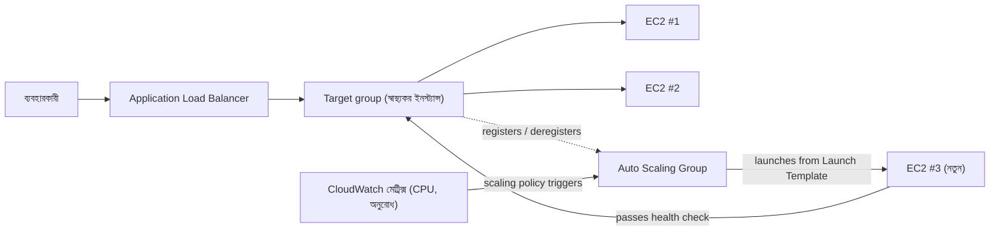

# অধ্যায় ৭: ব্যস্ত হলে বড় হওয়া রেস্তোরাঁ

শুক্রবার সন্ধ্যা ৭:৪৩।

Tom-এর চেয়ার সামান্য পিছনে ঠেলে দেওয়া, যেভাবে হতো যখন সে এমন ধরনের মনোযোগ নিয়ে কিছুর দিকে তাকিয়ে থাকত যার মানে আপনি কথা বললে সে উত্তর দেবে না। অফিস এক ঘণ্টা আগে খালি হয়ে গিয়েছিল। সে থেকে গিয়েছিল।

তার মেট্রিক্স ড্যাশবোর্ডে একটি ট্যাব খোলা ছিল যা সে এমনভাবে রিফ্রেশ করত যেভাবে অন্য মানুষ সোশ্যাল মিডিয়া যাচাই করে — প্রতিবর্তীভাবে, ক্রমাগত, ঠিক না চেয়েই।

স্টোরেজ সংকট তাদের পিছনে ছিল। ডেটাবেসের নিজস্ব ডিস্ক ছিল। ফটোগুলো S3-তে থাকত। দুই সপ্তাহ ধরে, সিস্টেম স্থিতিশীল ছিল — উত্তেজনাপূর্ণ নয়, শুধু স্থিতিশীল। সেটা ভালো লাগার কথা ছিল।

তারপর error rate ১২% অতিক্রম করল।

"Leo," Tom বলল।

Leo ইতিমধ্যে দেখছিল। প্রতিক্রিয়া সময়: উঠছে। সারিবদ্ধ অনুরোধ: উঠছে। একক EC2 ইনস্ট্যান্স — এমনকি গত মাসের সাবধানী right-sizing অনুশীলনের পরেও — 94% CPU-তে ছিল।

"আমরা গ্রাহক ফিরিয়ে দিচ্ছি," Tom বলল।

"আমরা তাদের ফিরিয়ে দিচ্ছি না," Leo বলল। "সার্ভার দিচ্ছে।"

"সেটা একই জিনিস।"

হ্যাঁ ছিল। আর এটা তিন সপ্তাহ ধরে প্রতি শুক্রবার ঘটছিল। Nimbus স্টোরেজ সংকট টিকে ছিল — ডেটাবেসের নিজস্ব ডিস্ক ছিল, ফটোগুলো S3-তে থাকত — কিন্তু স্থিতিশীল এবং স্কেলযোগ্য সম্পূর্ণ ভিন্ন সমস্যা। সিস্টেম কাজ করত। এটা শুধু বাড়ত না।

Maya-র কাছ থেকে একটি Slack মেসেজ এল: *dashboard says orders down 40% from last Friday. what's happening?*

Tom উত্তর দিল: *server at capacity. working on it.*

তিন মিনিট কাটল।

Maya: *we have a restaurant owner calling the support line saying the app is broken.*

Leo-র হাত কীবোর্ডে ছিল। সে ইনস্ট্যান্স রিসাইজ করছিল — ফিক্সের ম্যানুয়াল সংস্করণ, যার জন্য সার্ভার থামিয়ে ইনস্ট্যান্স টাইপ পরিবর্তন করতে হতো। যার মানে ডাউনটাইম।

"রিস্টার্ট কতক্ষণ নেবে?" Tom জিজ্ঞেস করল।

"সাত মিনিট," Leo বলল।

"শুক্রবার রাতে আমাদের আরো সাত মিনিট বিভ্রাট হতে চলেছে," Tom বলল। সে জিজ্ঞেস করছিল না। সে Maya-কে একটি Slack মেসেজ টাইপ করল। সে একটি একক অক্ষর দিয়ে উত্তর দিল: *k*

রিস্টার্ট সম্পূর্ণ হলো। ইনস্ট্যান্স আবার উঠল। CPU 60%-এ নামল। error rate নামল। Tom কথা না বলে পনেরো মিনিট মেট্রিক্স দেখল।

৯:১৫-এ, ট্রাফিক কমল। সংকট শেষ হলো।

Leo তার হাতের দিকে তাকাল, যা রাত ৮টায় সামান্য কাঁপছিল এবং আর কাঁপছিল না।

"আমরা প্রতি শুক্রবার এটা করতে পারি না," সে বলল।

"না," Tom বলল। "আমরা পারি না।"

দলের তাদের সিস্টেম পরিবর্তনশীল লোড স্বয়ংক্রিয়ভাবে সামলানো দরকার ছিল। সবচেয়ে খারাপ পরিস্থিতির জন্য যথেষ্ট সার্ভার না কিনে এবং শান্ত সময়ে অর্থ অপচয় না করে। আর ট্রাফিক স্পাইক আঘাত করলে ম্যানুয়ালি হুড়োহুড়ি না করে।

এর জন্য একটি প্যাটার্ন আছে। AWS-এর দুটি পরিষেবা আছে যা এটা বাস্তবায়ন করে।

**ধারণা: অনুভূমিক স্কেলিং**

একটি সিস্টেমকে আরো লোড সামলানোর দুটি উপায় আছে।

**উল্লম্ব স্কেলিং** মানে একক সার্ভার বড় করা। আরো CPU। আরো RAM। আমরা অধ্যায় ৪-এ এটা করেছিলাম যখন আমরা `t3.micro` থেকে `t3.large`-এ আপগ্রেড করেছিলাম। এটা সাহায্য করে। কিন্তু এর সীমা আছে: আপনি শুধু এত বড় যেতে পারেন, রিসাইজ করতে ইনস্ট্যান্স রিস্টার্ট করতে হয়, এবং আপনার এখনো একটি সিঙ্গল পয়েন্ট অফ ফেইলিউর আছে।

**অনুভূমিক স্কেলিং** মানে আরো সার্ভার যোগ করা। একটি বড় সার্ভারের পরিবর্তে, পাঁচটি মাঝারি সার্ভার চালান। যখন ট্রাফিক কমে, দুটি চালান। যখন স্পাইক হয়, দশটি।

অনুভূমিক স্কেলিংয়ের এমন সুবিধা আছে যা উল্লম্বের নেই:

- কোনো সিঙ্গল পয়েন্ট অফ ফেইলিউর নেই। যদি একটি সার্ভার মরে যায়, অন্যগুলো সেবা দিতে থাকে।
- ক্ষমতা যোগ করতে কোনো রিস্টার্ট প্রয়োজন নেই।
- শুধু যা ব্যবহার করছেন তার জন্য পে করুন — প্রয়োজন হলে সার্ভার যোগ করুন, না হলে সরান।
- রৈখিক স্কেলিং: দ্বিগুণ সার্ভার, মোটামুটি দ্বিগুণ throughput।

উল্লম্ব স্কেলিং মেলাতে পারে না এমন একটি নির্ভরযোগ্যতা মাত্রাও আছে। যখন আপনার পাঁচটি সার্ভার থাকে এবং একটি ব্যর্থ হয়, আপনার ক্ষমতা 80%-এ নামে — ব্যর্থ ইনস্ট্যান্স প্রতিস্থাপন করার সময় ট্রাফিক সেবা দেওয়া চালিয়ে যাওয়ার মতো যথেষ্ট। যখন আপনার একটি সার্ভার থাকে এবং এটা ব্যর্থ হয়, ক্ষমতা 0%-এ নামে। রিডানডেন্সি অনুভূমিক স্কেলিংয়ের অন্তর্নিহিত এমনভাবে যা উল্লম্ব স্কেলিং কোনো আকারে প্রদান করতে পারে না।

এটা রক্ষণাবেক্ষণের জন্যও গুরুত্বপূর্ণ। যখন একটি নিরাপত্তা প্যাচের জন্য একটি সার্ভার রিস্টার্ট প্রয়োজন, অনুভূমিক স্কেলিং আপনাকে একসময়ে একটি করে ইনস্ট্যান্স রিস্টার্ট করতে দেয় — রোলিং রিস্টার্ট যা সেবা ধারাবাহিকতা বজায় রাখে। একটি একক বড় সার্ভারের জন্য হয় রিস্টার্টের সময় ডাউনটাইম গ্রহণ করা নয়তো blue/green ডেপ্লয়মেন্ট জটিলতা বাস্তবায়ন প্রয়োজন।

ফাঁদ: যদি আপনার একাধিক সার্ভার থাকে, ব্যবহারকারীরা কীভাবে জানে কোনটার সাথে কথা বলতে হবে?

আর অনুভূমিক স্কেলিং যে একটি ডিজাইন সীমাবদ্ধতা আরোপ করে: আপনার অ্যাপ্লিকেশনকে সার্ভারগুলো একে অপরের সাথে হস্তক্ষেপ না করে একাধিক অভিন্ন সার্ভারে একসাথে চলতে সক্ষম হতে হবে। এটা **stateless** প্রয়োজনীয়তা — প্রতিটি অনুরোধ স্বয়ংসম্পূর্ণ হতে হবে, একটি নির্দিষ্ট সার্ভারে সংরক্ষিত state-এর উপর নির্ভরশীল নয়। আমরা ঠিক কেন এটা গুরুত্বপূর্ণ তা দেখব যখন আমরা sticky sessions সমস্যার সম্মুখীন হই।

**Application Load Balancer: একটি দরজা, অনেক ঘর**

দরজায় একটি হোস্ট স্ট্যান্ডসহ একটি বড় রেস্তোরাঁ ভাবুন। ডিনাররা আসে এবং হোস্ট তাদের একটি উপলব্ধ টেবিলে নির্দেশ করে। হোস্ট জানে কোন টেবিল ব্যস্ত এবং কোন খোলা। ডিনারদের কতগুলো টেবিল আছে তা জানতে হয় না — তারা শুধু ভেতরে হাঁটে এবং হোস্ট বণ্টন সামলায়।

একটি **Application Load Balancer** (ALB) ওয়েব অনুরোধের সাথে এটা করে।

ব্যবহারকারীরা লোড ব্যালেন্সারে সংযোগ করে। লোড ব্যালেন্সার আপনার EC2 ইনস্ট্যান্সের ফ্লিট জুড়ে আসা অনুরোধ বণ্টন করে। প্রতিটি ব্যবহারকারী একটি ঠিকানা দেখে (লোড ব্যালেন্সারের URL)। সেই ঠিকানার পিছনে, অনুরোধগুলো যত সার্ভার চলছে তার জুড়ে ছড়িয়ে দেওয়া হয়।

ALB নিজে AWS-ম্যানেজড অবকাঠামোতে চলে, আপনার Region-এ একাধিক AZ জুড়ে বিতরণ করা। এটা একটি একক সার্ভার নয় — এটা একটি ম্যানেজড, বিতরণ করা পরিষেবা। আপনি যখন ক্রস-জোন লোড ব্যালেন্সিং সক্ষম করেন (ALB-র জন্য ডিফল্ট), প্রতিটি ALB নোড কোন AZ-তে আছে তা নির্বিশেষে সমস্ত নিবন্ধিত টার্গেট জুড়ে সমানভাবে অনুরোধ বণ্টন করে। এটা সাধারণ ব্যর্থতা মোড প্রতিরোধ করে যেখানে একটি AZ-তে অন্যটির চেয়ে দ্বিগুণ স্বাস্থ্যকর ইনস্ট্যান্স থাকে, ফলে অসম লোড হয়।

এটা প্রতিটি আসা HTTP অনুরোধ গ্রহণ করে এবং সিদ্ধান্ত নেয় কোন EC2 ইনস্ট্যান্স (যাকে **target** বলা হয়) এটা সামলাবে, এমন ফ্যাক্টরের ভিত্তিতে:

- Round-robin (প্রতিটি সার্ভার ঘুরে ঘুরে পালা পায়)
- Least outstanding requests (সবচেয়ে কম in-flight অনুরোধসহ সার্ভার পরবর্তী অনুরোধ পায়)
- স্বাস্থ্য — শুধু স্বাস্থ্যকর টার্গেট ট্রাফিক পায়

**Health check** অপরিহার্য। ALB নিয়মিত প্রতিটি টার্গেটে পরীক্ষা অনুরোধ পাঠায়। যদি একটি টার্গেট সঠিকভাবে সাড়া না দেয়, ALB এটা অস্বাস্থ্যকর হিসেবে চিহ্নিত করে এবং এতে ট্রাফিক পাঠানো বন্ধ করে। যখন টার্গেট পুনরুদ্ধার হয়, ট্রাফিক পুনরায় শুরু হয়।

এটা স্বয়ংক্রিয়। আপনি health check প্যারামিটার কনফিগার করেন; ALB সেগুলো প্রয়োগ করে।

আপনি তিনটি মূল প্যারামিটার দিয়ে health check কনফিগার করেন: যাচাই করার **path** (যেমন, `/health`), **interval** (কত ঘন ঘন যাচাই করতে হবে — প্রতি 5 থেকে 300 সেকেন্ড; ডিফল্ট 30), এবং **threshold** (টার্গেটের স্বাস্থ্য অবস্থা পরিবর্তনের আগে কতগুলো ধারাবাহিক সফল বা ব্যর্থ যাচাই)।

আক্রমণাত্মক health check interval দ্রুত সমস্যা ধরে কিন্তু টার্গেটে আরো ট্রাফিক যোগ করে। একটি 3-ব্যর্থতা থ্রেশহোল্ডসহ একটি 30-সেকেন্ড interval মানে একটি ব্যর্থ টার্গেট 90 সেকেন্ডের মধ্যে রোটেশন থেকে সরানো হয়। একটি 2-ব্যর্থতা থ্রেশহোল্ডসহ একটি 10-সেকেন্ড interval মানে 20 সেকেন্ডের মধ্যে সরানো — আরো health check ট্রাফিকের খরচে।

Nimbus-এর জন্য, Priya একটি 3-ব্যর্থতা থ্রেশহোল্ডসহ একটি 30-সেকেন্ড interval (অস্বাস্থ্যকর ঘোষণা করতে 90 সেকেন্ড) এবং 2 সাফল্য (পুনরুদ্ধারের পরে আবার স্বাস্থ্যকর ঘোষণা করতে 60 সেকেন্ড) বেছে নিল। এটা সংক্ষিপ্ত নেটওয়ার্ক ব্লিপ থেকে ফলস পজিটিভ এড়ানোর সাথে দ্রুত ব্যর্থতা সনাক্তকরণের ভারসাম্য করল।

**Health Check কনফিগারেশন: "এটা কি জীবিত?"-এর চেয়ে বেশি**

Leo-র প্রথম health check ছিল একটি সরল TCP ping: "পোর্ট 80 কি সংযোগ গ্রহণ করছে?" সেটা ন্যূনতম। সার্ভার পোর্ট 80-এ সংযোগ গ্রহণ করতে পারত যখন ডেটাবেস ডাউন ছিল, যখন অ্যাপ্লিকেশন একটি এরর লুপে ছিল, যখন ডিস্ক পূর্ণ ছিল।

"স্বাস্থ্যকর" মানে কী হওয়া উচিত সে সম্পর্কে Priya-র একটি ভিন্ন দৃষ্টিভঙ্গি ছিল।

"আমরা কি ভেবেছি কী হবে যদি health check পাস করে কিন্তু অ্যাপ্লিকেশন ভাঙা?" সে জিজ্ঞেস করল। "একটি সার্ভার যা সংযোগ গ্রহণ করতে পারে কিন্তু ডেটাবেস কোয়েরি করতে পারে না তা স্বাস্থ্যকর নয়। এটা শুধু প্রতিক্রিয়াশীল।"

Leo অ্যাপ্লিকেশন কোডে একটি `/health` এন্ডপয়েন্ট তৈরি করল। এন্ডপয়েন্টটি তিনটি জিনিস করত:
1. অ্যাপ্লিকেশন প্রসেস চলছে তা নিশ্চিত করত
2. ডেটাবেসে একটি পরীক্ষা কোয়েরি করত (একটি সরল `SELECT 1`)
3. S3 সংযোগ অ্যাক্সেসযোগ্য তা নিশ্চিত করত

যদি তিনটি পাস করত, এন্ডপয়েন্ট HTTP 200 ফিরিয়ে দিত। যদি যেকোনোটি ব্যর্থ হতো, এটা HTTP 503 ফিরিয়ে দিত।

ALB health check প্রতি 30 সেকেন্ডে এই এন্ডপয়েন্ট কল করতে কনফিগার করা হয়েছিল। যদি এটা তিনটি ধারাবাহিক 503 প্রতিক্রিয়া পেত, ইনস্ট্যান্সটি অস্বাস্থ্যকর হিসেবে চিহ্নিত হতো এবং রোটেশন থেকে সরানো হতো।

"এর মানে যদি ডেটাবেস ডাউন হয়," Priya বলল, "health check এটা ধরবে এবং 90 সেকেন্ডের মধ্যে লোড ব্যালেন্সার থেকে প্রভাবিত সার্ভার সরাবে।"

"এমনকি যদি সার্ভারগুলো নিজেই এখনো চলছে," Tom বলল।

"এমনকি যদি সেগুলো বাইরে থেকে ঠিক দেখায়।"

ALB, একটি বাস্তব অ্যাপ্লিকেশন health check-এ নির্দেশিত, প্রকৃত সমস্যার অনেক বেশি নির্ভরযোগ্য সনাক্তকারী হয়ে উঠল — শুধু সার্ভার জীবিততা নয়।

**Auto Scaling: যে রেস্তোরাঁ আরো টেবিল খোলে**

একটি ALB আপনার বিদ্যমান সার্ভার জুড়ে ট্রাফিক বণ্টন করে। কিন্তু আপনার যখন আরো দরকার তখন এটা সার্ভার যোগ করে না।

**Auto Scaling** করে।

একটি **Auto Scaling Group** (ASG) হলো একটি কনফিগারেশন যা AWS-কে বলে:

- সর্বদা চালু রাখার ন্যূনতম সংখ্যক ইনস্ট্যান্স
- অনুমোদিত সর্বোচ্চ সংখ্যক ইনস্ট্যান্স
- যে শর্তের অধীনে স্কেল আউট (ইনস্ট্যান্স যোগ) বা স্কেল ইন (সরানো) করতে হবে

স্কেলিং শর্তকে বলা হয় **policy**। চারটি সবচেয়ে সাধারণ টাইপ:

**Target tracking**: "গড় CPU ব্যবহার 70%-এ রাখুন।" যখন গড় CPU 70% অতিক্রম করে, AWS নতুন ইনস্ট্যান্স লঞ্চ করে। যখন এটা নিচে নামে, ইনস্ট্যান্স টার্মিনেট হয়। এটা বেশিরভাগ ওয়ার্কলোডের জন্য সবচেয়ে সরল এবং সবচেয়ে সুপারিশকৃত নীতি — একটি টার্গেট মেট্রিক সেট করুন এবং AWS-কে কতগুলো ইনস্ট্যান্স দরকার তা বের করতে দিন। টার্গেট হতে পারে CPU ব্যবহার, প্রতি টার্গেটে অনুরোধ সংখ্যা বা যেকোনো কাস্টম CloudWatch মেট্রিক।

**Step scaling**: নির্দিষ্ট প্রতিক্রিয়াসহ নির্দিষ্ট থ্রেশহোল্ড সংজ্ঞায়িত করুন। "যখন CPU 60% অতিক্রম করে, 1টি ইনস্ট্যান্স যোগ করুন। যখন CPU 80% অতিক্রম করে, 3টি ইনস্ট্যান্স যোগ করুন। যখন CPU 30%-এর নিচে নামে, 1টি ইনস্ট্যান্স সরান।" target tracking-এর চেয়ে আরো সূক্ষ্ম নিয়ন্ত্রণ, কিন্তু আরো কনফিগারেশন এবং চলমান টিউনিং প্রয়োজন।

**Scheduled scaling**: "প্রতি শুক্রবার সন্ধ্যা 6:45-এ, নিশ্চিত করুন কমপক্ষে 4টি ইনস্ট্যান্স চলছে।" এটা অনুমানযোগ্য ইভেন্টের জন্য সক্রিয় স্কেলিং। এটা প্রতিক্রিয়াশীল স্কেলিংয়ের পাশাপাশি কাজ করে — শিডিউল করা কাজ একটি মেঝে সেট করে, এবং target tracking প্রয়োজন অনুসারে সেই মেঝের উপরে ইনস্ট্যান্স যোগ করে।

**Predictive scaling**: একই ধারণার মেশিন-লার্নিং সংস্করণ। আপনি শিডিউল লেখার পরিবর্তে, Auto Scaling দুই সপ্তাহ পর্যন্ত ঐতিহাসিক লোড বিশ্লেষণ করে এবং পরবর্তী 48 ঘণ্টা পূর্বাভাস দেয়, ভবিষ্যদ্বাণী করা র‌্যাম্পের *আগে* ক্ষমতা লঞ্চ করে। চক্রাকার ট্রাফিকের জন্য — প্রতি শুক্রবার একটি ডিনার রাশ, প্রতি কর্মদিবসে একটি মার্কেট ওপেন — predictive scaling প্যাটার্ন আবিষ্কার করে এবং স্বয়ংক্রিয়ভাবে প্রি-ওয়ার্ম করে, এবং প্যাটার্ন সরে গেলে সমন্বয় করতে থাকে। পরীক্ষার ট্রিগার: "পুনরাবৃত্তিমূলক/চক্রাকার ট্রাফিক স্পাইক; স্পাইকের *আগে* ইনস্ট্যান্স প্রস্তুত হতে হবে" → predictive scaling। (Scheduled scaling হলো ম্যানুয়াল উত্তর; predictive হলো শেখা একটি। উভয়ই শুধু-প্রতিক্রিয়াশীল স্কেলিংকে হারায়, যা সবসময় ইনস্ট্যান্স বুট টাইম দিয়ে স্পাইকের পিছনে পড়ে।)

Nimbus-এর জন্য, সংমিশ্রণটি ছিল: প্রতিক্রিয়াশীল স্কেলিংয়ের জন্য target tracking (CPU 65%-এ রাখুন), এবং ডিনার রাশের আগে 2টি অতিরিক্ত ইনস্ট্যান্স প্রি-ওয়ার্ম করতে প্রতি শুক্রবার সন্ধ্যা 6:45-এ একটি scheduled scaling কাজ।

এটা স্বয়ংক্রিয়। কাউকে মেট্রিক্স দেখতে হয় না। কাউকে ম্যানুয়ালি সার্ভার লঞ্চ করতে হয় না। সিস্টেম রিয়েল টাইমে লোডে প্রতিক্রিয়া করে।

Priya প্রথমবার একটি শুক্রবার রাশের সময় লাইভ এটা ঘটতে দেখল। সার্ভার সংখ্যা পনেরো মিনিটে 2 থেকে 5-এ গেল, তারপর রাশের পরে 2-এ ফিরে এল।

"সেটা," সে বলল, "সত্যিই চিত্তাকর্ষক।"

Tom বরং খরচ গ্রাফ দেখছিল। বিল রাশের সময় বাড়ল এবং পরে নামল। "আমরা শুধু যা ব্যবহার করেছি তার জন্য পে করেছি," সে বলল, সমানভাবে চিত্তাকর্ষিত। "একটি স্বাভাবিক সপ্তাহে গড়ে, এটা প্রতি মাসে কত খরচ হয়?"

Leo ক্যালকুলেটর খুলল। শুক্রবারের শিখর মাসিক বিলে হয়তো 15% যোগ করল। Auto Scaling ছাড়া, তাদের পুরো সপ্তাহ পিকের জন্য প্রভিশন করতে হতো। পার্থক্য: অলস পিক ক্ষমতায় প্রায় $120/মাস অপচয়, বনাম যথাযথভাবে কনফিগার করা Auto Scaling দিয়ে $0 অপচয়।

স্কেল-ইনে একটি সূক্ষ্মতা আছে যা দল প্রায়ই মিস করে: **scale-in protection**। আপনি একটি ASG-তে নির্দিষ্ট ইনস্ট্যান্সকে scale-in থেকে সুরক্ষিত করতে কনফিগার করতে পারেন — মানে সেগুলো স্বয়ংক্রিয় scale-in ইভেন্টের সময় টার্মিনেট হবে না। এটা এমন ইনস্ট্যান্সের জন্য দরকারি যা একটি দীর্ঘ-চলমান কাজের মাঝখানে আছে যা আপনি বাধাগ্রস্ত করতে চান না। অ্যাপ্লিকেশন কোডও একটি দীর্ঘ কাজ শুরু করলে প্রোগ্রাম্যাটিকভাবে ইনস্ট্যান্স সুরক্ষা সেট করতে পারে এবং কাজ সম্পূর্ণ হলে সুরক্ষা সরাতে পারে। এটা ASG-কে সক্রিয় কাজের নিচ থেকে পা টেনে নেওয়া থেকে আটকায়।

**Warm Pool: সব কিছুর ঠান্ডা থেকে শুরু করার দরকার নেই**

যে শুক্রবার Auto Scaling প্রথম শুরু হলো, Tom "CPU থ্রেশহোল্ড অতিক্রম করে" থেকে "নতুন ইনস্ট্যান্স ট্রাফিক সেবা দিচ্ছে" পর্যন্ত কতক্ষণ লাগে তা মাপল।

চার মিনিট বিশ সেকেন্ড।

"সেটা চার মিনিট যেখানে আমরা ক্ষমতায় কম," সে বলল।

"আমরা ন্যূনতম ইনস্ট্যান্স সংখ্যা বাড়াতে পারি," Leo বলল।

"এর মানে পুরো সপ্তাহ অলস ইনস্ট্যান্সের জন্য পে করা," Tom বলল।

একটি মধ্যপথ ছিল: **Warm Pool**।

একটি Warm Pool হলো প্রি-ইনিশিয়ালাইজড EC2 ইনস্ট্যান্সের একটি গ্রুপ যা একটি stopped অবস্থায় বসে থাকে, ইতিমধ্যে বুট করা, ইতিমধ্যে কনফিগার করা, ইতিমধ্যে UserData স্ক্রিপ্টের মধ্য দিয়ে। তারা ট্রাফিক সেবা দেওয়া শুরু করা ছাড়া সব কিছু করেছে।

যখন Auto Scaling Group স্কেল আউট করার সিদ্ধান্ত নেয়, গোড়া থেকে একটি নতুন ঠান্ডা ইনস্ট্যান্স লঞ্চ করার পরিবর্তে (যা বুট, UserData চালানো এবং health check পাস করতে তিন থেকে পাঁচ মিনিট নেয়), এটা Warm Pool থেকে একটি ইনস্ট্যান্স শুরু করে। একটি stopped ইনস্ট্যান্স শুরু করতে প্রায় 30 থেকে 60 সেকেন্ড লাগে।

Nimbus-এর শুক্রবার প্যাটার্নের জন্য — রাত 7টার দিকে শুরু হওয়া একটি পরিচিত, অনুমানযোগ্য বৃদ্ধি — Priya ব্যবসায়িক সময়ে বজায় রাখতে দুটি ইনস্ট্যান্সের একটি Warm Pool কনফিগার করল। সন্ধ্যা 6:45-এর মধ্যে, দুটি ওয়ার্ম ইনস্ট্যান্স প্রস্তুত বসে ছিল, stopped কিন্তু ইনিশিয়ালাইজড। যখন রাত 7টায় ট্রাফিক উঠল এবং ASG-কে স্কেল করতে হলো, ওয়ার্ম ইনস্ট্যান্স এক মিনিটের কম সময়ে শুরু হলো এবং ফ্লিটে যোগ দিল।

"Warm Pool-এর খরচ কত?" Tom জিজ্ঞেস করল।

একটি stopped EC2 ইনস্ট্যান্স কম্পিউটের জন্য পে করে না — কিন্তু এটা সংযুক্ত EBS স্টোরেজের জন্য পে করে। একটি Warm Pool-এ দুটি `t3.small` ইনস্ট্যান্স: স্টোরেজ খরচে প্রায় $4/মাস। চার মিনিট থেকে এক মিনিটের কম স্কেল-আউট সময়ের উন্নতি একটি শুক্রবার রাতে $4/মাসের যোগ্য ছিল।

**ALB Path-Based Routing**

Nimbus বড় হওয়ার সাথে, Leo একটি দ্বিতীয় উপাদান যোগ করল: রেস্তোরাঁ ব্যবস্থাপনার জন্য একটি পৃথক API পরিষেবা। রেস্তোরাঁ মালিকরা একই ডোমেনের মাধ্যমে কিন্তু একটি ভিন্ন URL পাথে এই পরিষেবা অ্যাক্সেস করত: `/`-এর পরিবর্তে `/api/restaurant/`।

"দাঁড়াও — কিন্তু আমরা *কেন* সেভাবে করব?" Maya জিজ্ঞেস করল। "রেস্তোরাঁ ব্যবস্থাপনা API-কে সম্পূর্ণ একটি ভিন্ন ডোমেন কেন দিই না?"

"আমরা পারি," Leo বলল। "কিন্তু তখন আমাদের একটি দ্বিতীয় সার্টিফিকেট, একটি দ্বিতীয় লোড ব্যালেন্সার, একটি দ্বিতীয় DNS এন্ট্রি দরকার হতো। path-based routing এটা একটি সার্টিফিকেট, একটি লোড ব্যালেন্সার দিয়ে সামলায়।"

ALB এটা নেটিভভাবে সমর্থন করত। একটি **path-based routing rule** ALB-কে বলত: যখন URL `/api/restaurant/` দিয়ে শুরু হয়, অনুরোধটি রেস্তোরাঁ ব্যবস্থাপনা target group-এ রুট করুন। যখন URL অন্য কিছু দিয়ে শুরু হয়, এটা গ্রাহক-মুখী অ্যাপ্লিকেশন target group-এ রুট করুন।

EC2 ইনস্ট্যান্সের দুটি পৃথক ফ্লিট। একটি লোড ব্যালেন্সার। URL পাথ দ্বারা নির্দেশিত ট্রাফিক।

"তাহলে আমরা গ্রাহক-মুখী অ্যাপ থেকে স্বাধীনভাবে রেস্তোরাঁ ব্যবস্থাপনা API স্কেল করতে পারি?" Maya জিজ্ঞেস করল।

"ঠিক," Leo বলল। "যদি রেস্তোরাঁ মালিকরা অনেক মেনু আপডেট করছে, সেই API সার্ভার স্কেল করে। যদি গ্রাহকরা ভারীভাবে অর্ডার করছে, সেই সার্ভার স্কেল করে। তারা একে অপরকে প্রভাবিত করে না।"

Maya এটা নিয়ে বসল। "আর আমরা দুটির পরিবর্তে শুধু একটি ALB-র জন্য পে করি।"

"সঠিক," Tom বলল। তার কাছে একটি সংখ্যা ছিল। "ALB-র খরচ বেস ফিতে মাসে প্রায় $20 এবং ডেটা প্রসেসিং চার্জ। একটি ALB উভয় ওয়ার্কলোড সামলানো বনাম দুটি পৃথক: প্রতি মাসে মোটামুটি $20 সাশ্রয়। আর আমরা একাধিক সার্টিফিকেট এবং DNS রেকর্ড পরিচালনা এড়াই।"

"কিন্তু," Priya বলল, "যদি ALB নিজেই ডাউন হয়, উভয় পরিষেবা একসাথে ডাউন হয়।"

"AWS ALB-কে একাধিক AZ জুড়ে অত্যন্ত উপলব্ধ হতে ডিজাইন করে," Leo বলল। "দুটি পৃথক লোড ব্যালেন্সার বজায় রাখার জটিলতার তুলনায় ALB ব্যর্থতার ঝুঁকি খুব কম।"

Priya এটা "গৃহীত আপোস, নথিভুক্ত"-এর অধীনে ফাইল করল।

**ALB এবং ASG কীভাবে একসাথে কাজ করে**

দুটি পরিষেবা একসাথে ব্যবহার করার জন্য ডিজাইন করা।

আপনি সামনে ALB রাখেন। ALB একটি **target group**-এ নির্দেশ করে — ইনস্ট্যান্সের একটি সংগ্রহ যা ট্রাফিক পাওয়া উচিত। Auto Scaling Group সেই ইনস্ট্যান্স পরিচালনা করে: এটা স্কেল আউট করার সময় target group-এ যোগ করে, স্কেল ইন করার সময় সরায়।

প্রবাহ:

1. ট্রাফিক ALB-তে পৌঁছায়
2. ALB স্বাস্থ্যকর টার্গেটে অনুরোধ বণ্টন করে
3. সেই টার্গেটে CPU/লোড উঠে
4. ASG লোড বৃদ্ধি সনাক্ত করে, নতুন ইনস্ট্যান্স লঞ্চ করে
5. নতুন ইনস্ট্যান্স health check পাস করে, ALB-তে নিবন্ধিত হয়
6. ALB তাদের কাছে ট্রাফিক পাঠাতে শুরু করে
7. লোড কমে, ASG অতিরিক্ত ইনস্ট্যান্স টার্মিনেট করে
8. ALB টার্মিনেট করা ইনস্ট্যান্সে ট্রাফিক পাঠানো বন্ধ করে

এটা কোনো মানবিক হস্তক্ষেপ ছাড়াই ঘটে।

**Launch Template: নতুন ইনস্ট্যান্সের ব্লুপ্রিন্ট**

যখন ASG একটি নতুন ইনস্ট্যান্স লঞ্চ করে, এটা কী লঞ্চ করতে হবে তা জানতে হয়। এটা একটি **Launch Template**-এ সংজ্ঞায়িত — একটি AMI, একটি ইনস্ট্যান্স টাইপ, প্রয়োগ করার security group এবং যেকোনো user data (ইনস্ট্যান্স বুট হলে চলে এমন স্টার্টআপ স্ক্রিপ্ট)।

একটি সাধারণ প্যাটার্ন: আপনি আপনার অ্যাপ্লিকেশন একটি কাস্টম AMI-তে তৈরি করেন (অধ্যায় ৪ দেখুন)। যখন ASG-র একটি নতুন ইনস্ট্যান্স দরকার, এটা সেই AMI লঞ্চ করে। নতুন ইনস্ট্যান্স আপনার অ্যাপ্লিকেশন ইতিমধ্যে ইনস্টল করে বুট হয়। কোনো ম্যানুয়াল সেটআপ প্রয়োজন নেই।

আরো গতিশীল পরিবেশের জন্য, আপনি **user data স্ক্রিপ্ট**-ও ব্যবহার করতে পারেন যা স্টার্টআপে আপনার কোডের সর্বশেষ সংস্করণ টানে এবং ইনস্টল করে। এটা আরো নমনীয় কিন্তু বুট হতে বেশি সময় নেয়।

সঠিক পছন্দ আপনার ইনস্ট্যান্সের বুট হতে কতক্ষণ লাগে এবং আপনার অ্যাপ্লিকেশন কত ঘন ঘন পরিবর্তিত হয় তার উপর নির্ভর করে।

**Sticky Session: একটি সূক্ষ্ম সমস্যা**

এখানে এমন কিছু যা অনেক দলকে বিভ্রান্ত করে যখন তারা প্রথম লোড ব্যালেন্সিং বাস্তবায়ন করে।

কিছু ওয়েব অ্যাপ্লিকেশন session ডেটা — লগইন state, শপিং কার্ট কন্টেন্ট — সার্ভারে নিজেই (মেমরিতে বা স্থানীয় ডিস্কে) সংরক্ষণ করে। এটা একটি সার্ভারের সাথে ভালো কাজ করে। একাধিক সার্ভারের সাথে, এটা ভাঙে।

একজন ব্যবহারকারী লগ ইন করে। অনুরোধ Server A-তে যায়। Server A session সংরক্ষণ করে। পরবর্তী অনুরোধ Server B-তে যায়। Server B-র কোনো session নেই। ব্যবহারকারী লগ আউট দেখায়।

এটা দুই উপায়ে সম্বোধন করা যায়:

**Sticky session** (বা session affinity): ALB-কে কনফিগার করুন একই ব্যবহারকারীর অনুরোধ সবসময় একই সার্ভারে পাঠাতে। এটা একটি স্বল্পমেয়াদী ফিক্স। এটা লোড ব্যালেন্সিং দুর্বল করে (কিছু সার্ভার আরো "sticky" ব্যবহারকারী পায়) এবং একটি ইনস্ট্যান্স টার্মিনেট হলে সমস্যা তৈরি করে।

Maya sticky session কনফিগারেশন পেজের দিকে তাকাল। "যদি আমরা ব্যবহারকারীদের নির্দিষ্ট সার্ভারে পিন করি, scale-in-এর সময় সেই সার্ভার টার্মিনেট হলে কী হয়?"

"তারা তাদের session হারায়," Leo বলল।

"তাহলে sticky session শুধু সমস্যা বিলম্বিত করছে।"

"সঠিক," Priya বলল। "আসল ফিক্স হলো stateless অ্যাপ্লিকেশন ডিজাইন।"

**Stateless অ্যাপ্লিকেশন ডিজাইন**: session ডেটা বাহ্যিকভাবে সংরক্ষণ করুন — একটি ডেটাবেসে বা ElastiCache-এর মতো একটি ক্যাশে (অধ্যায় ১০)। প্রতিটি সার্ভার বাহ্যিক স্টোর থেকে যেকোনো ব্যবহারকারীর session পুনর্গঠন করতে পারে। সার্ভার বিনিময়যোগ্য হয়ে ওঠে। এটা অনুভূমিকভাবে স্কেলযোগ্য অ্যাপ্লিকেশনের সঠিক পদ্ধতি।

Priya এটাকে বলত "আপনি মাল্টি-সার্ভারে গেলে যে সবচেয়ে গুরুত্বপূর্ণ আর্কিটেকচারাল সিদ্ধান্ত নেন।" সে ঠিক। আমরা অধ্যায় ১০-এ এটার আবার সম্মুখীন হই।

**যদি Sticky Session তবে কম জটিলতা কিন্তু বেশি ঝুঁকি**

যদি আপনি session state সমস্যা সমাধানে sticky session ব্যবহার করেন, তাহলে আপনি স্বল্পমেয়াদে বাহ্যিক session স্টোরেজ সেটআপের প্রয়োজন কমান — কিন্তু যখন একটি sticky সার্ভার scale-in-এর সময় টার্মিনেট হয়, এর সমস্ত বাঁধা ব্যবহারকারী একসাথে তাদের session হারায়। ব্যর্থতা ক্রমান্বয়ে নয়; এটা হঠাৎ এবং একসাথে ব্যবহারকারীদের একটি ক্লাস্টারকে প্রভাবিত করে। যদি আপনি session state বাহ্যিক করেন, আপনি একটি নির্ভরতা যোগ করেন (ElastiCache বা একটি ডেটাবেস) কিন্তু সেই হঠাৎ ব্যর্থতা মোড দূর করেন। যে অ্যাপ্লিকেশন নিয়মিত স্কেল করে তার জন্য, stateless ডিজাইনে বিনিয়োগ Auto Scaling প্রথমবার সক্রিয় session সহ একটি ইনস্ট্যান্স টার্মিনেট করার সময় নিজের খরচ পরিশোধ করে।

**Tom-এর খরচ গণনা**

পরের সপ্তাহে, Tom ALB এবং ASG সেটআপের জন্য একটি খরচ মডেল তৈরি করল।

ALB: ডেটা প্রসেসিং চার্জসহ বেস প্রায় $20/মাস। Nimbus-এর ট্রাফিক ভলিউমে: প্রায় $22/মাস।

Auto Scaling Group নিজে: কোনো অতিরিক্ত খরচ নেই। এটা যে ইনস্ট্যান্স চালায় তার জন্য আপনি পে করেন, কিন্তু সেই ইনস্ট্যান্স যাই হোক বিদ্যমান থাকত। ASG বিনামূল্যে; আপনি কম্পিউটের জন্য পে করেন।

Warm Pool: দুটি stopped ইনস্ট্যান্সের জন্য EBS স্টোরেজে প্রায় $4/মাস।

মোট অতিরিক্ত অবকাঠামো খরচ: প্রায় $26/মাস, বা $312/বছর।

Tom তারপর ALB এবং ASG থাকার আগের তিন শুক্রবারের ঘটনা লগ দেখল। প্রতিটি ঘটনার Nimbus-কে বিভ্রাট উইন্ডোর সময় শুক্রবারের রাজস্বের প্রায় 40% খরচ হয়েছিল। গড় শুক্রবার রাজস্ব: মোটামুটি $2,400। $2,400-এর 40% হলো প্রতি ঘটনায় $960। তিনটি ঘটনা: তিন সপ্তাহে হারানো রাজস্বে প্রায় $2,880।

"ALB এবং ASG-র খরচ বছরে $312," Tom বলল। "তিনটি খারাপ শুক্রবার আমাদের প্রায় $3,000 খরচ করেছে। আর সেটা শুধু সরাসরি রাজস্ব ক্ষতি — খারাপ অভিজ্ঞতার পরে Nimbus ব্যবহার বন্ধ করা মানুষের গ্রাহক churn নয়।"

Maya সংখ্যাগুলো পড়ল। "অবকাঠামো চালান।"

"ইতিমধ্যে চলছে," Leo বলল।

## যখন ALB যথেষ্ট নয়: NLB এবং GWLB

Leo Nimbus রেস্তোরাঁ অংশীদারদের জন্য নীরবে যোগ করা IoT ইন্টিগ্রেশন পর্যালোচনা করছিল — ওয়াক-ইন কুলারে ছোট তাপমাত্রা সেন্সর যা প্রতি ত্রিশ সেকেন্ডে Nimbus-এ রিডিং পাঠাত, যাতে কিচেন ম্যানেজাররা একটি ফ্রিজ নিরাপদ তাপমাত্রার উপরে গেলে সতর্কতা পেতে পারে।

"দাঁড়াও," Leo বলল। "এই সেন্সরগুলো UDP প্যাকেট পাঠাচ্ছে।"

"সেটা কি সমস্যা?" Maya জিজ্ঞেস করল।

"ALB UDP সমর্থন করে না," Leo বলল। "ALB HTTP বোঝে। এটাই।"

Priya ইতিমধ্যে ডকুমেন্টেশন দেখছিল। "সেটার জন্যই Network Load Balancer।"

**Network Load Balancer (NLB)** Layer 4-এ পরিচালিত হয় — ট্রান্সপোর্ট স্তর। এটা TCP এবং UDP প্যাকেট রুট করে। এটা সেই প্যাকেটের কন্টেন্ট পরিদর্শন করে না, HTTP হেডার বোঝে না, path-based routing করে না। এটা যা করে তা হলো অসাধারণ গতিতে ক্লায়েন্ট থেকে টার্গেটে প্যাকেট সরানো।

- **একক-সংখ্যার মিলিসেকেন্ড লেটেন্সিসহ প্রতি সেকেন্ডে লক্ষ লক্ষ অনুরোধ।** ALB Layer 7-এ HTTP প্রসেস করে, যার মানে এটা হেডার পার্স করে, রুটিং নিয়ম মূল্যায়ন করে এবং TLS সংযোগ টার্মিনেট করে। NLB এর কিছুই করে না — এটা একটি ওয়েব প্রক্সির চেয়ে একটি উচ্চ-গতির ট্রাফিক ডিরেক্টরের কাছাকাছি।
- **ক্লায়েন্টের উৎস IP ঠিকানা সংরক্ষণ করে।** যখন একটি ALB একটি সংযোগ গ্রহণ করে, এটা সেটা টার্মিনেট করে এবং টার্গেটে একটি নতুন খোলে — আপনার EC2 ইনস্ট্যান্স ALB-র IP দেখে, ব্যবহারকারীর নয়। NLB এটা করে না; প্যাকেটের উৎস IP টার্গেটে অপরিবর্তিত পৌঁছায়। যদি আপনার অ্যাপ্লিকেশনকে অনুরোধ কোথা থেকে আসছে তা জানতে হয় — জিওলোকেশন, রেট লিমিটিং বা জালিয়াতি সনাক্তকরণের জন্য — এবং আপনার এটা সঠিক হতে হবে, NLB সঠিক পছন্দ। (ALB একটি `X-Forwarded-For` হেডার যোগ করে যা মূল IP বহন করে, কিন্তু এর জন্য অ্যাপ্লিকেশনকে হেডার পড়তে হয়; NLB আসল IP সরাসরি প্যাকেটে রাখে।)
- **স্ট্যাটিক IP ঠিকানা এবং Elastic IP।** ALB-র IP ঠিকানা সময়ের সাথে পরিবর্তিত হয় — AWS সেগুলো পরিচালনা করে এবং সেগুলো নির্দিষ্ট নয়। NLB প্রতি Availability Zone স্ট্যাটিক IP সমর্থন করে, এবং আপনি সেগুলোতে Elastic IP বরাদ্দ করতে পারেন। যদি ডাউনস্ট্রিম সিস্টেমকে আপনার লোড ব্যালেন্সার থেকে ট্রাফিক অনুমোদন করতে একটি নির্দিষ্ট IP ঠিকানা হোয়াইটলিস্ট করতে হয় — আর্থিক পরিষেবা বা IoT ডিভাইস ব্যবস্থাপনায় একটি সাধারণ প্রয়োজনীয়তা — NLB একমাত্র অপশন। ALB এটা করতে পারে না।
- **TLS pass-through।** NLB এনক্রিপ্ট করা TLS ট্রাফিক সরাসরি টার্গেটে ডিক্রিপ্ট না করে পাস করতে পারে। টার্গেট TLS টার্মিনেট করে। এটা দরকারি যখন সম্মতি প্রয়োজনীয়তা বলে ডিক্রিপশন একটি নির্দিষ্ট ডিভাইসে ঘটতে হবে, বা যখন আপনি লোড ব্যালেন্সারে TLS সার্টিফিকেট পরিচালনা করতে চান না।

"যদি NLB এত দ্রুত হয়," Maya জিজ্ঞেস করল, "আমরা কেন শুধু সব কিছুর জন্য এটা ব্যবহার করি না?"

"কারণ এটা বোকা," Leo বলল। "সেরা অর্থে। NLB জানে না HTTP কী। এটা path-based routing করতে পারে না। এটা HTTP-কে HTTPS-এ রিডাইরেক্ট করতে পারে না। এটা নিরাপত্তা হেডার যোগ করতে পারে না। এটা WAF-এর সাথে ইন্টিগ্রেট করতে পারে না। একটি ওয়েব অ্যাপ্লিকেশনের জন্য — যেকোনো কিছু যা HTTP বলে — ALB-র Layer 7 সচেতনতাই সেই সব ফিচার সম্ভব করে। সেন্সর ডেটার জন্য, যা UDP, আমাদের কোনো বিকল্প নেই।"

"আর আমাদের ওয়েব ট্রাফিকের জন্য?"

"ALB, আগের মতোই।"

"এটা প্রতি মাসে কত খরচ হয়?" Tom জিজ্ঞেস করল। "NLB কি সস্তা?"

মূল্য মডেল ALB-র মতোই: একটি বেস ঘণ্টায় চার্জ এবং প্রসেস করা ট্রাফিকের ভিত্তিতে প্রতি Load Balancer Capacity Unit (LCU) একটি চার্জ। সমতুল্য ট্রাফিক ভলিউমে, খরচ তুলনীয়। Nimbus IoT ব্যবহার-পরিস্থিতির জন্য — কম-ভলিউম সেন্সর ডেটা — NLB খরচ $20/মাসের নিচে হতো।

**Gateway Load Balancer (GWLB)** সম্পূর্ণ ভিন্ন একটি প্রাণী। এটা Layer 3-এ পরিচালিত হয় — IP প্যাকেট স্তর — এবং এটা একটি নির্দিষ্ট উদ্দেশ্যের জন্য বিদ্যমান: আপনার ট্রাফিক প্রবাহে তৃতীয়-পক্ষের ভার্চুয়াল নেটওয়ার্ক অ্যাপ্লায়েন্স সন্নিবেশ করা।

কল্পনা করুন Nimbus এমন একটি আকারে বেড়েছে যেখানে তাদের নিরাপত্তা দল তাদের VPC-তে প্রবেশ এবং ছেড়ে যাওয়া সমস্ত ট্রাফিক একটি বাণিজ্যিক ফায়ারওয়াল অ্যাপ্লায়েন্সের মধ্য দিয়ে যাওয়া দরকার করত — Palo Alto বা Fortinet-এর মতো একটি বিক্রেতার সফটওয়্যার চালানো একটি ভার্চুয়াল মেশিন। GWLB ছাড়া, আপনাকে ম্যানুয়ালি সেই অ্যাপ্লায়েন্সের মধ্য দিয়ে ট্রাফিক রুট করতে হতো এবং কীভাবে সেগুলো স্কেল করতে এবং অত্যন্ত উপলব্ধ রাখতে হয় তা বের করতে হতো। GWLB-র সাথে, আপনি অ্যাপ্লায়েন্সকে একটি টার্গেট হিসেবে কনফিগার করেন, এবং GENEVE প্রোটোকল ব্যবহার করে সমস্ত ট্রাফিক স্বচ্ছভাবে এর মধ্য দিয়ে রুট করা হয়। অ্যাপ্লিকেশন জানে না ট্রাফিক পরিদর্শন করা হচ্ছে। ফায়ারওয়ালের নেটওয়ার্ক টপোলজি জানার দরকার নেই। GWLB রুটিং, স্কেলিং এবং failover সামলায়।

প্রারম্ভিক এবং মধ্য পর্যায়ের বেশিরভাগ ওয়েব অ্যাপ্লিকেশনের জন্য — Nimbus সহ — GWLB এমন একটি পরিষেবা নয় যা আপনি কনফিগার করবেন। কিন্তু পরীক্ষার জন্য, এবং যেদিন একটি নিরাপত্তা প্রয়োজনীয়তা নেটওয়ার্ক-স্তরের পরিদর্শন দাবি করে, আপনি জানবেন এটা কীসের জন্য।

Leo সেই দুপুরে সেন্সর এন্ডপয়েন্টের জন্য একটি NLB যোগ করল। তাপমাত্রা ডেটা প্রবাহিত হতে শুরু করল।

"প্রথম রেস্তোরাঁ একটি সতর্কতা পায় যে তাদের ওয়াক-ইন কুলার 47 ডিগ্রিতে," সে বলল। "সেটা নিরাপদ থ্রেশহোল্ডের উপরে।"

"এটা কি আসলেই 47 ডিগ্রিতে?" Maya জিজ্ঞেস করল।

"রেস্তোরাঁ মালিক নিশ্চিত করল। তারা একই বিকেলে একজন মেরামত টেকনিশিয়ান ডাকল।"

Priya এটা Nimbus গ্রাহক প্রভাব লগে লিখল। কোনো নিরাপত্তা ইভেন্ট নয়। শুধু IoT ফিচার কাজ করছে।

**তিনটি লোড ব্যালেন্সার, পাশাপাশি**

AWS তিন ধরনের লোড ব্যালেন্সার অফার করে। ALB Layer 7-এ HTTP এবং HTTPS সামলায় — এটা প্রোটোকল বোঝে, তাই এটা URL পাথ (`/api` একটি গ্রুপে, `/static` অন্যটিতে), host হেডার এবং query প্যারামিটারের ভিত্তিতে রুট করতে পারে। এটাই বেশিরভাগ ওয়েব অ্যাপ্লিকেশন ব্যবহার করে, এবং এটাই Nimbus তার ওয়েব ট্রাফিকের জন্য ব্যবহার করে।

ALB TLS সংযোগও টার্মিনেট করে — SSL/HTTPS সার্টিফিকেট লোড ব্যালেন্সারে ইনস্টল করা হয়, প্রতিটি পৃথক EC2 ইনস্ট্যান্সে নয়। ALB অনুরোধ ডিক্রিপ্ট করে, HTTP হেডার পরিদর্শন করে, নিয়মের ভিত্তিতে রুট করে এবং (ঐচ্ছিকভাবে) টার্গেটে ফরোয়ার্ড করার আগে পুনরায় এনক্রিপ্ট করে। এটা সার্টিফিকেট ব্যবস্থাপনা উল্লেখযোগ্যভাবে সরল করে: আপনি প্রতিটি ইনস্ট্যান্সে একটি সার্টিফিকেটের পরিবর্তে ALB-তে একটি সার্টিফিকেট পরিচালনা করেন।

NLB, যেমন দল তাপমাত্রা সেন্সরের সাথে দেখেছিল, Layer 4-এ TCP, UDP এবং TLS সামলায় — কাঁচা গতি, উৎস IP সংরক্ষণ, স্ট্যাটিক IP। GWLB ফায়ারওয়াল এবং অনুপ্রবেশ সনাক্তকরণ সিস্টেমের মতো তৃতীয়-পক্ষের অ্যাপ্লায়েন্সের মধ্য দিয়ে ট্রাফিক থ্রেড করতে Layer 3-এ বসে — জুনিয়র স্তরে কদাচিৎ প্রয়োজন।

Nimbus-এর জন্য (এবং বেশিরভাগ ওয়েব অ্যাপ্লিকেশনের জন্য), ALB সঠিক পছন্দ।

আপনি ভাবতে পারেন: একই অ্যাপ্লিকেশনের জন্য আপনি কি ALB এবং NLB উভয়ই ব্যবহার করতে পারেন? হ্যাঁ। একটি সাধারণ প্যাটার্ন হলো ALB-র সামনে NLB — NLB প্রান্তে কাঁচা TCP টার্মিনেশন সামলায়, ALB এর পিছনে HTTP রুটিং সামলায়। এটা জটিলতা এবং খরচ যোগ করে, এবং বেশিরভাগ ওয়েব অ্যাপ্লিকেশনের জন্য প্রয়োজন নেই।

**পরীক্ষার জন্য ALB বনাম NLB**: মূল পার্থক্যকারী হলো Layer 7 বনাম Layer 4। যদি পরীক্ষার দৃশ্যকল্প URL-ভিত্তিক রুটিং, host-ভিত্তিক রুটিং, HTTP হেডার পরিদর্শন বা WebSocket উল্লেখ করে — সেটা ALB। যদি এটা TCP pass-through, উৎস IP সংরক্ষণ, প্রতি সেকেন্ডে লক্ষ লক্ষ অনুরোধ বা নন-HTTP প্রোটোকলের জন্য চরম কম লেটেন্সি উল্লেখ করে — সেটা NLB। যখন একটি দৃশ্যকল্প শুধু বলে "একটি ওয়েব অ্যাপ্লিকেশনের জন্য লোড ব্যালেন্সার," উত্তর প্রায় সবসময় ALB।

## শক্তি এবং সীমাবদ্ধতা

**কেন ALB + Auto Scaling শক্তিশালী**:

- শূন্য-ডাউনটাইম স্কেলিং (বিদ্যমান সংযোগ ব্যাহত না করে ইনস্ট্যান্স যোগ/সরানো হয়)
- স্বয়ংক্রিয় failover (অস্বাস্থ্যকর ইনস্ট্যান্স স্বয়ংক্রিয়ভাবে ট্রাফিক থেকে সরানো হয়)
- খরচ দক্ষতা (শুধু চলমান ইনস্ট্যান্সের জন্য পে করুন)
- কোনো সিঙ্গল পয়েন্ট অফ ফেইলিউর নেই — একাধিক AZ জুড়ে একাধিক ইনস্ট্যান্স

**যেখানে এটা জটিল হয়ে ওঠে**:

- Stateful অ্যাপ্লিকেশনের বিশেষ হ্যান্ডলিং দরকার (sticky session বা বাহ্যিক state)
- স্কেল আউট হতে সময় নেয় — যদি ট্রাফিক তাৎক্ষণিকভাবে স্পাইক করে, নতুন
  ইনস্ট্যান্স প্রস্তুত হওয়ার আগে একটি ল্যাগ থাকে। অনুমানযোগ্য পিকের জন্য Warm Pool বা একটি উচ্চ ন্যূনতম সংখ্যা দিয়ে প্রশমিত করুন।
- আরো চলমান অংশ মানে মনিটর এবং ডিবাগ করার আরো
- কিছু অ্যাপ্লিকেশন সহজে অনুভূমিকভাবে স্কেল করা যায় না (ডেটাবেস, কিছু লিগ্যাসি
  সিস্টেম)। অনুভূমিক স্কেলিং stateless টিয়ারের জন্য সবচেয়ে ভালো কাজ করে।

## সারসংক্ষেপ

দুটি পরিষেবা, একটি প্যাটার্ন — এবং প্যাটার্নই গুরুত্বপূর্ণ। ALB বণ্টন সামলায়; ASG ফ্লিট আকার সামলায়। একসাথে তারা একটি ভঙ্গুর একক-ইনস্ট্যান্স সেটআপকে এমন একটি সিস্টেমে পরিণত করে যা একজন মানুষ জেগে না থেকেই শুক্রবার ডিনার ট্রাফিক শোষণ করতে পারে। $312/বছর অবকাঠামো খরচ বনাম তিন শুক্রবারের হারানো রাজস্ব (~$2,880) হলো সেই ধরনের অঙ্ক Tom একটি স্প্রেডশিটে রাখে এবং কখনো ভোলে না।

- **অনুভূমিক স্কেলিং** (আরো সার্ভার যোগ করা) উল্লম্ব স্কেলিংয়ের চেয়ে পছন্দনীয় কারণ এটা সিঙ্গল পয়েন্ট অফ ফেইলিউর দূর করে এবং ইলাস্টিক খরচ অনুমোদন করে। একটি **Application Load Balancer (ALB)** আসা HTTP/HTTPS ট্রাফিক বণ্টন করে এবং শুধু স্বাস্থ্যকর ইনস্ট্যান্সে রুট করে।
- **Health check প্রকৃত অ্যাপ্লিকেশন কার্যকারিতা পরীক্ষা করা উচিত** — একটি `/health` এন্ডপয়েন্ট যা ডেটাবেস সংযোগ যাচাই করে তা গ্রাহকদের আগে বাস্তব ব্যর্থতা ধরে।
- একটি **Auto Scaling Group (ASG)** স্কেলিং নীতির ভিত্তিতে EC2 ইনস্ট্যান্সের সংখ্যা স্বয়ংক্রিয়ভাবে সমন্বয় করে। Target tracking সবচেয়ে সাধারণ টাইপ; scheduled scaling শুক্রবার ডিনার রাশের মতো অনুমানযোগ্য পিক সামলায়।
- Stateful অ্যাপ্লিকেশনকে দীর্ঘমেয়াদে sticky session-এর উপর নির্ভর করার পরিবর্তে session state বাহ্যিক করতে হবে। Sticky session একটি স্বল্পমেয়াদী ফিক্স; state বাহ্যিক করা সঠিক আর্কিটেকচার।
- HTTP/HTTPS ট্রাফিকের জন্য, ALB ব্যবহার করুন। কাঁচা TCP/UDP পারফরম্যান্সের জন্য, NLB ব্যবহার করুন। ALB path-based routing একটি একক লোড ব্যালেন্সারকে URL পাথ দিয়ে একাধিক অ্যাপ্লিকেশন উপাদান সেবা দিতে দেয়।

## পরীক্ষার টিপস

*SAA-C03 ডোমেন 2 — টাস্ক 2.1 (স্কেলযোগ্য আর্কিটেকচার) / ডোমেন 3 — টাস্ক 3.2*

- **ASG health check EC2 বা ALB থেকে আসতে পারে।** EC2 health check শুধু সনাক্ত করে
  ইনস্ট্যান্স চলছে কিনা। ALB health check সনাক্ত করে অ্যাপ্লিকেশন সঠিকভাবে
  সাড়া দিচ্ছে কিনা। ALB health check আরো পুঙ্খানুপুঙ্খ এবং ওয়েব অ্যাপ্লিকেশনের জন্য
  পছন্দ করা উচিত।
- **Target tracking স্কেলিং স্কেলিং নীতির জন্য সবচেয়ে সাধারণ পরীক্ষার উত্তর।**
  Simple scaling (অ্যালার্ম জ্বললে N ইনস্ট্যান্স যোগ) পুরানো এবং কম অভিযোজনশীল।
- **স্কেল-আউট দ্রুত; স্কেল-ইন ধীর।** AWS সক্রিয় সংযোগ ব্যাহত এড়াতে scale-in-এর সময়
  ধীরে ধীরে ইনস্ট্যান্স টার্মিনেট করে — ALB-র **deregistration delay** সেটিং দ্বারা নিয়ন্ত্রিত একটি আচরণ।
- **ন্যূনতম ইনস্ট্যান্স সংখ্যা আপনার স্থিতিস্থাপকতা মেঝে।** যদি আপনি ন্যূনতম = 1 সেট করেন
  এবং সেই ইনস্ট্যান্স ব্যর্থ হয়, ASG প্রতিক্রিয়া করার আগেই আপনার অ্যাপ্লিকেশন ডাউন। প্রকৃত স্থিতিস্থাপকতার জন্য
  ন্যূনতম ≥ 2 সেট করুন এবং AZ জুড়ে ছড়িয়ে দিন।
- **ALB স্বয়ংক্রিয়ভাবে AZ জুড়ে ট্রাফিক বণ্টন করতে পারে।** ক্রস-জোন লোড
  ব্যালেন্সিং সক্ষম থাকলে, প্রতিটি ALB নোড AZ নির্বিশেষে সমস্ত নিবন্ধিত
  টার্গেট জুড়ে সমানভাবে অনুরোধ বণ্টন করে। AZ ইনস্ট্যান্স সংখ্যা ভিন্ন হলে এটা
  ভারসাম্যপূর্ণ লোডের জন্য গুরুত্বপূর্ণ।
- **ALB path-based routing** একটি একক লোড ব্যালেন্সার ভাগ করা একাধিক অ্যাপ্লিকেশন
  উপাদান বর্ণনা করা পরীক্ষার দৃশ্যকল্পে আসে। সঠিক শব্দ হলো "listener rules" যা
  URL পাথ শর্তের ভিত্তিতে রুট করে।
- **Load Balancer নির্বাচন:** ALB = HTTP/HTTPS, Layer 7, path/header রুটিং, WebSocket, WAF ইন্টিগ্রেশন। NLB = TCP/UDP, Layer 4, চরম পারফরম্যান্স, স্ট্যাটিক IP, উৎস IP সংরক্ষণ। GWLB = Layer 3, ট্রাফিক পথে ভার্চুয়াল ফায়ারওয়াল/অ্যাপ্লায়েন্স সন্নিবেশ। পরীক্ষার ট্রিগার: "UDP protocol" বা "লোড ব্যালেন্সারে স্ট্যাটিক IP" → NLB। "ট্রাফিক প্রবাহে ফায়ারওয়াল অ্যাপ্লায়েন্স সন্নিবেশ" → GWLB।

## অনুশীলনী

**অনুশীলনী ১ — স্মরণ**

আপনার নিজের ভাষায়: একটি Application Load Balancer এবং একটি Auto Scaling Group-এর
মধ্যে পার্থক্য কী? প্রতিটি কোন সমস্যা সমাধান করে, এবং আপনি কেন সাধারণত
সেগুলো একসাথে ব্যবহার করেন?

*(ইঙ্গিত: একটি ইতিমধ্যে বিদ্যমান ট্রাফিক বণ্টন করে; অন্যটি আপনার কত
ক্ষমতা আছে তা সমন্বয় করে।)*

**অনুশীলনী ২ — SAA-C03 দৃশ্যকল্প**

*দৃশ্যকল্প*: একটি খুচরা কোম্পানির ই-কমার্স ওয়েবসাইট অত্যন্ত পরিবর্তনশীল ট্রাফিক অনুভব করে:
কর্মদিবসে কম ট্রাফিক, সপ্তাহান্তে এবং ফ্ল্যাশ সেল ইভেন্টের সময় বিশাল স্পাইক।
তারা চায় তাদের অ্যাপ্লিকেশন শান্ত সময়ে অব্যবহৃত ক্ষমতা বজায় না রেখে পিক লোড সামলাক।
অ্যাপ্লিকেশন বর্তমানে সার্ভার মেমরিতে session ডেটা সংরক্ষণ করে।

কোন আর্কিটেকচার পরিবর্তন তাদের স্কেলেবিলিটি প্রয়োজনীয়তা সর্বোত্তমভাবে সম্বোধন করবে?

A) একটি একক খুব বড় EC2 ইনস্ট্যান্সে আপগ্রেড করুন যা পিক ট্রাফিক সামলাতে পারে
B) একটি Auto Scaling Group সহ একটি ALB-র পিছনে একাধিক EC2 ইনস্ট্যান্স ডেপ্লয় করুন, এবং
   session স্টোরেজ ElastiCache-এ বাহ্যিক করুন
C) sticky session সক্ষম সহ একটি ALB-র পিছনে একাধিক EC2 ইনস্ট্যান্স ডেপ্লয় করুন
D) প্রতিটি প্রত্যাশিত ট্রাফিক স্পাইকের আগে ম্যানুয়ালি EC2 ইনস্ট্যান্স যোগ করুন এবং পরে
   সেগুলো টার্মিনেট করুন

**ইঙ্গিত ১**: "অব্যবহৃত ক্ষমতা বজায় না রেখে" মানে আপনার স্বয়ংক্রিয় স্কেলিং দরকার,
একটি নির্দিষ্ট বড় ইনস্ট্যান্স বা ম্যানুয়াল ব্যবস্থাপনা নয়।

**ইঙ্গিত ২**: সার্ভার মেমরিতে session স্টোরেজ মাল্টি-ইনস্ট্যান্স
ডেপ্লয়মেন্টের জন্য একটি সমস্যা। কোন বিকল্প এটা সম্বোধন করে?

**ইঙ্গিত ৩**: বিকল্প C sticky session ব্যবহার করে — সেটা একটি workaround, একটি ফিক্স নয়।
কোন বিকল্প স্কেলিং এবং session স্টোরেজ সমস্যা উভয়ই যথাযথভাবে সম্বোধন করে?

**উত্তর**: B

**ব্যাখ্যা**: একটি Auto Scaling Group সহ একটি ALB স্বয়ংক্রিয়, ইলাস্টিক স্কেলিং
প্রদান করে — স্পাইকের সময় ইনস্ট্যান্স যোগ করা হয় এবং শান্ত সময়ে সরানো হয়। session
স্টোরেজ ElastiCache-এ (একটি বাহ্যিক ক্যাশে) সরানো অ্যাপ্লিকেশনকে stateless করে: যেকোনো
ইনস্ট্যান্স যেকোনো ব্যবহারকারীর অনুরোধ সামলাতে পারে, এবং ALB স্বাধীনভাবে ট্রাফিক বণ্টন করতে পারে।
এটা আর্কিটেকচারাল দিক থেকে সঠিক সমাধান।

**কেন A নয়?** একটি একক বড় ইনস্ট্যান্স, যত বড়ই হোক, এখনো একটি সিঙ্গল পয়েন্ট
অফ ফেইলিউর। এটা শান্ত সময়েও অর্থ অপচয় করে যখন এর বেশিরভাগ ক্ষমতা অলস বসে থাকে।

**কেন C নয়?** Sticky session একজন ব্যবহারকারীকে একই ইনস্ট্যান্সে রুট করে, যা আংশিকভাবে
session সমস্যা প্রশমিত করে কিন্তু লোড ব্যালেন্সিং দুর্বল করে। যদি সেই ইনস্ট্যান্স
টার্মিনেট হয় (scale-in বা ব্যর্থতার সময়), ব্যবহারকারী যাই হোক তাদের session হারায়।

**কেন D নয়?** ম্যানুয়াল স্কেলিংয়ের জন্য কাউকে ট্রাফিক স্পাইক সঠিকভাবে ভবিষ্যদ্বাণী করতে
এবং আগে থেকে কাজ করতে হয়। এটা ধীর, ত্রুটি-প্রবণ এবং শ্রম-নিবিড়। Auto Scaling এটা
স্বয়ংক্রিয়ভাবে সামলায়।

*SAA-C03 ডোমেন 2 — টাস্ক 2.1 / ডোমেন 3 — টাস্ক 3.2*

**অনুশীলনী ৩ — আর্কিটেকচার চ্যালেঞ্জ** *(ঐচ্ছিক)*

Nimbus-এর একটি বড় প্রচার আসছে: আগামী শনিবার 4 ঘণ্টার জন্য সমস্ত অর্ডারে 50% ছাড়।
গত বছর, একটি অনুরূপ প্রচার 10x স্বাভাবিক ট্রাফিক ঘটিয়েছিল। দল প্রত্যাশা করে
স্পাইক হঠাৎ হবে এবং ঠিক 4 ঘণ্টা স্থায়ী হবে।

Auto Scaling শেষমেশ প্রতিক্রিয়া করবে, কিন্তু একটি ল্যাগ আছে। আপনি এই
পরিচিত স্পাইকের জন্য কীভাবে ডিজাইন করবেন? প্রতিক্রিয়াশীল এবং সক্রিয় স্কেলিংয়ের মধ্যে পার্থক্য কী, এবং কখন
প্রতিটি অর্থপূর্ণ হয়?

*(কোনো একক সঠিক উত্তর নেই। scheduled scaling কাজ, প্রি-ওয়ার্মিং এবং প্রতিটি
পদ্ধতির খরচ প্রভাব নিয়ে ভাবুন।)*

## পোস্ট-ক্রেডিটস দৃশ্য

Auto Scaling এবং ALB ডেপ্লয় করার পরের প্রথম শুক্রবার, দল মেট্রিক্স
একসাথে দেখল।

৭:১৫pm: দুটি ইনস্ট্যান্স চলছে। স্বাভাবিক লোড।
৭:৪৫pm: লোড উঠল। Auto Scaling আরো দুটি ইনস্ট্যান্স লঞ্চ করল।
৮:০০pm: চারটি ইনস্ট্যান্স পিক সামলাচ্ছে। প্রতিক্রিয়া সময় স্থিতিশীল।
৯:৩০pm: লোড নামল। Auto Scaling দুটি ইনস্ট্যান্স টার্মিনেট করল।
৯:৪৫pm: দুটি ইনস্ট্যান্সে ফিরে।

সাইট কখনো ডাউন হয়নি। একবারও নয়।

Leo মেট্রিক্স পেজ তিনবার রিফ্রেশ করল, যেন সে একটি ব্যর্থতা খুঁজে পাওয়ার আশা করছিল যা সে মিস করেছিল।

"এটা কি অদ্ভুত যে আমি কিছু না ভাঙায় সামান্য হতাশ বোধ করি?" সে বলল।

"হ্যাঁ," Priya বলল।

Tom বিলের দিকে তাকাচ্ছিল। খরচ ট্রাফিক প্রায় নিখুঁতভাবে ট্র্যাক করেছিল।
"আমরা ঠিক যা ব্যবহার করেছি তার জন্য পে করেছি," সে বলল। "বেশি নয়। কম নয়।"

সে সত্যিই অবাক শোনাল।

পরের সকালে, Maya error লগে একটি নতুন সমস্যা খুঁজে পেল। একটি বিভ্রাট নয় — আরো খারাপ।

"আমাদের ডেটাবেস," সে বলল, "গড়ে আট সেকেন্ডের কোয়েরি সময় ফিরিয়ে দিচ্ছে।"

আট সেকেন্ড। একটি রেস্তোরাঁ অর্ডারিং অ্যাপের জন্য।

"যতবার কেউ মেনু লোড করে, আমরা পেজ তৈরি করতে ডেটাবেসের প্রতিটি আইটেম
কোয়েরি করছি," Leo বলল। "আর আমাদের এখন সাতচল্লিশটি রেস্তোরাঁ আছে।"

"মোট কতগুলো মেনু আইটেম?" Tom জিজ্ঞেস করল।

Leo কোয়েরি চালাল।

"প্রায় বাইশ হাজার।"

নীরবতা।

পরবর্তী অধ্যায়ে: যে ডেটাবেসের একজন DBA-র দরকার নেই — শুধু একটি ক্রেডিট কার্ড।
