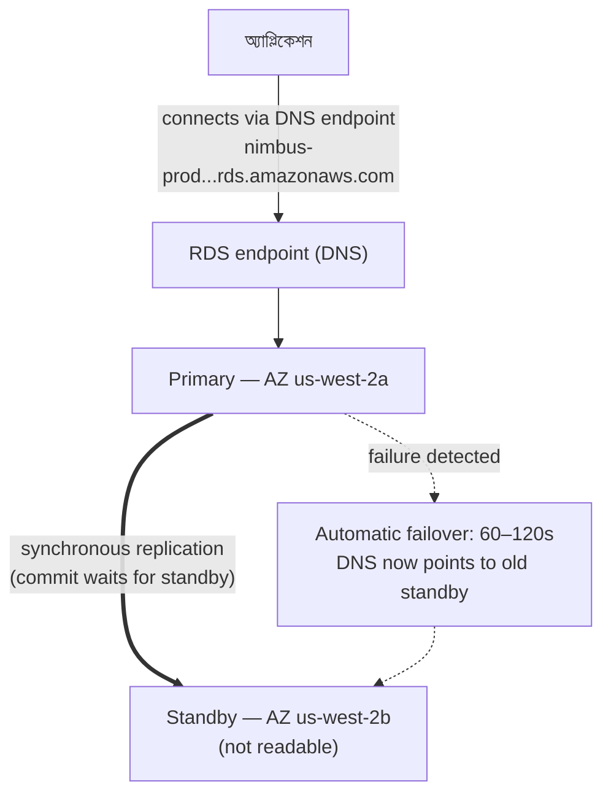

# অধ্যায় ৮: ডেটাবেস অ্যাডমিনিস্ট্রেটর যিনি কখনো অসুস্থ হন না

রাত ৩টায় সতর্কতা আসল।

Priya একমাত্র জেগে ছিল। তার ফোন নাইটস্ট্যান্ডে জ্বলে উঠল এবং সে অন্ধকারে এটা পড়ল, স্ক্রিন উজ্জ্বলতা খুব বেশি। সে উঠে বসল। সে স্মৃতি থেকে তার ল্যাপটপ খুঁজে পেল এবং আলো না জ্বালিয়েই এটা খুলল।

অন্ধকার ঘরে কীবোর্ড নীরবে ক্লিক করল।

ডেটাবেস সার্ভারের একটি নিরাপত্তা প্যাচ দরকার ছিল — যে ধরনের একটি রিস্টার্ট প্রয়োজন। দুর্বলতা বাস্তব ছিল, প্যাচ উপলব্ধ ছিল, এবং গ্রাহকদের ব্যাহত না করে এটা প্রয়োগের উইন্ডো ছিল এখনই, মাঝরাতে, যখন ট্রাফিক কম ছিল।

সে সার্ভারে সংযোগ করল। সে প্যাচ টানল। সে এটা প্রয়োগ করল।

তারপর সে রিলিজ নোট পড়ল।

প্যাকেজ আপডেট সেই কনফিগারেশন ফাইল স্পর্শ করল যা PostgreSQL সংযোগ প্যারামিটার সংজ্ঞায়িত করতে ব্যবহার করে। রিলিজ নোটে একটি সতর্কতা অন্তর্ভুক্ত ছিল: আপগ্রেড কীভাবে সম্পাদিত হয়েছিল তার উপর নির্ভর করে, একটি কাস্টমাইজ করা কনফিগারেশন ফাইল প্যাকেজের ডিফল্ট সংস্করণ দিয়ে প্রতিস্থাপিত হতে পারে।

তাদের কনফিগারেশন ফাইল কাস্টমাইজ করা হয়েছিল। Leo দুই মাস আগে max_connections সেটিং টিউন করতে এটা সম্পাদনা করেছিল।

প্যাচ চলল। সার্ভার রিস্টার্ট হলো। ডেটাবেস আবার অনলাইনে এল।

Priya একটি কোয়েরি পরীক্ষা করল। এটা কাজ করল।

সে লগ যাচাই করল। সব কিছু স্বাভাবিক দেখাল।

সে রাত ৪:১৫-এ বিছানায় ফিরে গেল।

সকাল ৯:০৫-এ, Leo অ্যাপ্লিকেশন খুলল এবং একটি এরর পেল। সে ডেটাবেস যাচাই করল। Max connections ডিফল্টে সেট করা ছিল: 100। তাদের অ্যাপ্লিকেশন 500 পর্যন্ত connection pool ব্যবহার করতে কনফিগার করা ছিল।

প্রতিটি নতুন সংযোগ প্রচেষ্টা ব্যর্থ হচ্ছিল। অ্যাপ্লিকেশন কার্যকরভাবে ডেটাবেস অ্যাক্সেস হারিয়েছিল।

"কী হয়েছিল?" Maya জিজ্ঞেস করল।

"প্যাচ," Priya বলল। সে ইতিমধ্যে কনফিগারেশন ফাইল দেখছিল। "প্যাকেজ আপডেট আমাদের কাস্টমাইজ করা config ফাইল ডিফল্টটি দিয়ে ওভাররাইট করেছিল। Leo-র max_connections টিউনিং শুধু চলে গেছে — সার্ভার স্টক সেটিংসে রিস্টার্ট হয়েছিল এবং কেউ একটি এরর পায়নি। এটা নীরবে ডিফল্টে ফিরে গিয়েছিল।"

"ঠিক করতে কতক্ষণ?" Leo জিজ্ঞেস করল।

"বিশ মিনিট," Priya বলল। "কিন্তু আমাদের একটি maintenance window দরকার। এর জন্য একটি কনফিগারেশন পরিবর্তন এবং একটি রিস্টার্ট প্রয়োজন।"

"আমাদের দুই ঘণ্টায় রেস্তোরাঁ লাঞ্চের জন্য খুলছে," Tom বলল।

Priya আঠারো মিনিটে এটা ঠিক করল। maintenance window ছিল বারো মিনিটের প্রকৃত ডাউনটাইম। রেস্তোরাঁ প্রভাবিত হয়েছিল, কিন্তু পিক তখনো শুরু হয়নি।

সকালে সে দলকে কী হয়েছিল তা বলল। একটি নীরবতা ছিল।

"এটা আবার ঘটবে," Tom বলল।

"যতবার একটি প্যাচ থাকবে এটা ঘটবে," Priya বলল। "আর সবসময়
প্যাচ থাকে। এটা করার একটি ভালো উপায় থাকতে হবে।"

আট-সেকেন্ডের কোয়েরি সময় এখনো অমীমাংসিত ছিল। আর একই সপ্তাহে, এই: একটি রাত ৩টার maintenance window যা একটি সকালের ঘটনায় পরিণত হয়েছিল। উভয় সমস্যার একই মূল কারণ ছিল — Nimbus এমন একটি ডেটাবেস চালাচ্ছিল যা পরিচালনা করতে তারা সজ্জিত ছিল না।

একটি সমাধান ছিল। এটার শুধু এই ধারণা ছেড়ে দেওয়া দরকার ছিল যে তাদের নিজেরাই ডেটাবেস পরিচালনা করতে হবে।

**ঐতিহ্যবাহী ডেটাবেস সমস্যা**

আপনি যখন একটি EC2 ইনস্ট্যান্সে নিজে একটি ডেটাবেস চালান, আপনি সব কিছুর জন্য দায়ী।

ডেটাবেস সফটওয়্যার ইনস্টল করা। এটা সুরক্ষিতভাবে কনফিগার করা। নিরাপত্তা দুর্বলতা আবিষ্কৃত হলে এটা প্যাচ করা। ব্যাকআপ নেওয়া। ব্যাকআপ আসলে কাজ করে তা পরীক্ষা করা (একটি ধাপ যা বেশিরভাগ দল খুব দেরি না হওয়া পর্যন্ত এড়িয়ে যায়)। ডিস্ক স্পেস মনিটর করা। রিডানডেন্সির জন্য রেপ্লিকেশন সেটআপ করা। প্রাইমারি সার্ভার ডাউন হলে failover কনফিগার করা। কোয়েরি পারফরম্যান্স টিউন করা। লোডের অধীনে সংযোগ পরিচালনা করা।

এর কিছুই অ্যাপ্লিকেশন নয়। এর কিছুই ফিচার যোগ করে না। এর সবটাই দক্ষতা প্রয়োজন।

দক্ষতা প্রয়োজনীয়তা মূল সমস্যা। একজন যোগ্য ডেটাবেস অ্যাডমিনিস্ট্রেটর শুধু কীভাবে একটি ডেটাবেস চালাতে হয় তা নয়, বরং কীভাবে এগুলো করতে হয় তা বোঝে:

- ধীর কোয়েরি লগ মনিটর করা এবং পারফরম্যান্স বটলনেক শনাক্ত করা
- ডিস্ক I/O এড়াতে ওয়ার্কিং সেটের জন্য মেমরি আকার দেওয়া
- পয়েন্ট-ইন-টাইম পুনরুদ্ধারের জন্য WAL আর্কাইভিং কনফিগার করা
- স্বয়ংক্রিয় failover সহ সিঙ্ক্রোনাস স্ট্রিমিং রেপ্লিকেশন সেটআপ করা
- লোডের অধীনে সংযোগ নিঃশেষ প্রতিরোধে connection pooling টিউন করা
- ডেটা ক্ষতি বা বর্ধিত ডাউনটাইম ছাড়াই প্রধান সংস্করণ আপগ্রেড প্রয়োগ করা

এটা একটি স্বতন্ত্র, বিশেষায়িত দক্ষতা সেট। সিনিয়র DBA উচ্চ বেতন পায় ঠিক এই কারণে যে এই সবটা ভালোভাবে করা কঠিন। বেশিরভাগ স্টার্টআপ এর জন্য নিয়োগ করতে পারে না। বেশিরভাগ ডেভেলপমেন্ট দলের এটা নেই।

বেশিরভাগ ডেভেলপমেন্ট দল ডেটাবেস অ্যাডমিনিস্ট্রেটর নয়। এটা একটি অনুমানযোগ্য প্যাটার্ন তৈরি করে: ডেটাবেস ইনস্টল করা হয়, ন্যূনতমভাবে কনফিগার করা হয়, এবং তারপর বেশিরভাগ ভুলে যাওয়া হয় যতক্ষণ না কিছু বিপর্যয়করভাবে ভুল হয়। Nimbus PostgreSQL ইনস্ট্যান্স ডিফল্ট কনফিগারেশনে চলছিল — max_connections 100-এ, কোনো connection pooling নেই, ম্যানুয়াল ব্যাকআপ যা Leo দুবার চালিয়ে তারপর ভুলে গিয়েছিল, এবং কোনো রেপ্লিকেশন নেই।

রাত ৩টার প্যাচ ঘটনা ছিল এমন একটি সিস্টেমের উপসর্গ যা চালানো হচ্ছিল এমন মানুষদের দ্বারা যারা অ্যাপ্লিকেশন তৈরিতে চমৎকার ছিল এবং ডেটাবেস পরিচালনায় কোনো পটভূমি ছিল না। এটা একটি সমালোচনা নয় — এটা বেশিরভাগ স্টার্টআপের একটি সঠিক বর্ণনা। সমাধান একজন DBA নিয়োগ করা নয়। সমাধান এমন একটি পরিষেবা ব্যবহার করা যা স্বয়ংক্রিয়ভাবে DBA-স্তরের পরিচালনা প্রদান করে।

"আমরা কি সেটাই করলাম?" Maya জিজ্ঞেস করল।

Leo-র উত্তর ছিল নীরবতা, যা হ্যাঁ-র সমান।

**ম্যানেজড ডেটাবেস**

একজন ডেটাবেস অ্যাডমিনিস্ট্রেটর নিয়োগ কল্পনা করুন যিনি কখনো অসুস্থ হন না, স্বয়ংক্রিয়ভাবে প্রতিটি নিরাপত্তা প্যাচ সামলান, না বললেই প্রতি রাতে একটি ব্যাকআপ নেন এবং কিছু ভাঙলে নিজেদের ঠিক করেন। তারা এই সবটা আপনাকে বিরক্ত না করেই করেন — এবং তারা কখনো, কোনো পরিস্থিতিতেই, আপনার অ্যাপ্লিকেশন লজিক স্পর্শ করেন না।

AWS এই পরিষেবাকে বলে **RDS** — Relational Database Service।

RDS-এর সাথে, AWS পরিচালনা করে:

- ডেটাবেস ইঞ্জিন ইনস্টল এবং প্যাচ করা
- স্বয়ংক্রিয় ব্যাকআপ (S3-তে সংরক্ষিত, 35 দিন পর্যন্ত রাখা)
- স্বয়ংক্রিয় failover (প্রাইমারি ডাউন হলে, একটি standby স্বয়ংক্রিয়ভাবে দায়িত্ব নেয়)
- মনিটরিং এবং মেট্রিক্স
- রেস্টে এবং ট্রানজিটে এনক্রিপশন
- স্টোরেজ অটো-স্কেলিং (আপনি সক্ষম করলে, ডিস্ক পূর্ণ হলে বাড়ে)

আপনি পরিচালনা করেন:

- ডেটাবেস স্কিমা (আপনার টেবিলের কাঠামো)
- আপনার কোয়েরি এবং অ্যাপ্লিকেশন লজিক
- ডেটাবেসে কার অ্যাক্সেস আছে
- কোন ইনস্ট্যান্স টাইপ ডেটাবেস চালায়
- প্যারামিটার টিউনিং (যদিও RDS যুক্তিসঙ্গত ডিফল্ট প্রদান করে)

**সমর্থিত ইঞ্জিন**

RDS বেশ কয়েকটি জনপ্রিয় ডেটাবেস ইঞ্জিন সমর্থন করে:

- **MySQL** — সবচেয়ে ব্যাপকভাবে ব্যবহৃত ওপেন-সোর্স রিলেশনাল ডেটাবেস
- **PostgreSQL** — শক্তিশালী, সম্প্রসারণযোগ্য, জটিল ওয়ার্কলোডের জন্য ক্রমবর্ধমান জনপ্রিয়
- **MariaDB** — ওপেন-সোর্স MySQL ফর্ক, সম্পূর্ণ সামঞ্জস্যপূর্ণ
- **Oracle** — এন্টারপ্রাইজ-গ্রেড, লিগ্যাসি প্রয়োজনীয়তাসহ বড় সংস্থায় ব্যবহৃত
- **Microsoft SQL Server** — Windows-ভারী পরিবেশের জন্য
- **Amazon Aurora** — AWS-এর নিজস্ব MySQL/PostgreSQL-সামঞ্জস্যপূর্ণ ইঞ্জিন, ক্লাউডের জন্য তৈরি
  (আমরা অধ্যায় ২৪-এ Aurora গভীরভাবে কভার করি)

Nimbus-এর জন্য, পছন্দ ছিল PostgreSQL। এটা Leo যা জানত, এবং এটা রিলেশনাল ডেটা ভালোভাবে সামলাত। ইঞ্জিন পছন্দ বেশিরভাগ অ্যাপ্লিকেশনের জন্য আপনি যা ভাবেন তার চেয়ে কম গুরুত্বপূর্ণ — RDS-এর পরিচালন সুবিধা নির্বিশেষে প্রযোজ্য।

একটি সূক্ষ্মতা: আপনি যখন RDS-এ একটি ইঞ্জিন চালান, AWS স্বয়ংক্রিয়ভাবে মাইনর সংস্করণ প্যাচ বজায় রাখে (আপনার কনফিগার করা maintenance window-এর সময়)। প্রধান সংস্করণ আপগ্রেড — উদাহরণস্বরূপ, PostgreSQL 14 থেকে 15-তে যাওয়া — একটি ম্যানুয়াল অপারেশন যা আপনি শিডিউল এবং সম্পাদন করেন। AWS প্রধান সংস্করণ আপগ্রেড সাবধানে পরীক্ষা করে, কিন্তু আপনার প্রথমে একটি staging পরিবেশে সেগুলো পরীক্ষা করা উচিত। প্রধান সংস্করণ পরিবর্তন নির্দিষ্ট SQL সিনট্যাক্স, এক্সটেনশন বা ড্রাইভার সংস্করণের সাথে সামঞ্জস্য সমস্যা পরিচয় করাতে পারে।

Leo এটা আবিষ্কার করল যখন RDS একটি মাইনর প্যাচ প্রয়োগ করল এবং অ্যাপ্লিকেশন লগ সংক্ষিপ্তভাবে একটি সাব-রিলিজে সরানো একটি ফাংশন সম্পর্কে একটি deprecation warning দেখাল। মাইনর প্যাচ মূলত স্বচ্ছ হওয়া উচিত — কিন্তু প্রতিটি maintenance window-এর পরে আপনার অ্যাপ্লিকেশন লগ মনিটর করা ভালো অনুশীলন।

"আমরা কি ভেবেছি কী হবে যদি একটি মাইনর প্যাচ কিছু ভাঙে?" Priya জিজ্ঞেস করল।

"আমরা আগের স্ন্যাপশটে রোল ব্যাক করি," Leo বলল।

"সেটা কতক্ষণ নেয়?"

Leo তাদের ডেটাবেস আকারের জন্য RDS রিস্টোর সময় দেখল। একটি `db.m6i.large`-এ একটি 50GB ডেটাবেসের জন্য: একটি স্ন্যাপশট থেকে রিস্টোর করতে প্রায় 15 থেকে 30 মিনিট।

"তাহলে একটি প্যাচ প্রোডাকশন ভাঙলে আমাদের 15-থেকে-30-মিনিটের পুনরুদ্ধার উইন্ডো আছে," Priya বলল। "আর আমরা ভোরের maintenance window-এ প্যাচ প্রয়োগ করি, তাই অন্তত প্রভাব ন্যূনতম।"

"আর আমরা প্রথমে staging-এ প্যাচ পরীক্ষা করি," Leo যোগ করল।

"হ্যাঁ," Priya বলল। "সেটাও।"

**RDS ইনস্ট্যান্স আকার নির্ধারণ: সব ওয়ার্কলোড সমান নয়**

আপনি যখন একটি RDS ইনস্ট্যান্স তৈরি করেন, আপনি একটি ইনস্ট্যান্স টাইপ বেছে নেন — EC2-র মতো একই ধারণা, কিন্তু ডেটাবেস ওয়ার্কলোডে সীমাবদ্ধ। AWS RDS ইনস্ট্যান্স টাইপ কয়েকটি দরকারি টিয়ারে সংগঠিত করে।

**db.t3 পরিবার**: Burstable পারফরম্যান্স ইনস্ট্যান্স। ডেভেলপমেন্ট, staging এবং হালকা প্রোডাকশন ওয়ার্কলোডের জন্য ডিজাইন করা যার টেকসই উচ্চ CPU দরকার নেই। একটি `db.t3.micro` কম ট্রাফিকসহ একটি ডেভেলপমেন্ট ডেটাবেসের জন্য উপযুক্ত। একটি `db.t3.medium` মাঝে মাঝে বার্স্টসহ মাঝারি প্রোডাকশন লোড সামলায়।

T-series ইনস্ট্যান্সের সাথে আপোস: তারা কম-ব্যবহারের সময়কালে CPU ক্রেডিট জমা করে এবং বার্স্টের সময় সেই ক্রেডিট ব্যয় করে। যদি আপনি টেকসই উচ্চ CPU-তে একটি T-series ইনস্ট্যান্স চালান, আপনি ক্রেডিট নিঃশেষ করেন এবং পারফরম্যান্স একটি বেসলাইনে থ্রটল হয় যা অপর্যাপ্ত হতে পারে।

**db.m6i পরিবার**: ধারাবাহিক, non-burstable পারফরম্যান্সসহ general-purpose ইনস্ট্যান্স। `db.m6i.large` প্রোডাকশন ডেটাবেসের জন্য একটি সাধারণ সূচনা বিন্দু। এগুলোর ক্রেডিট সীমা নেই — আপনার যখন দরকার তখন CPU পূর্ণ ক্ষমতায় উপলব্ধ।

**db.r6i পরিবার**: Memory-optimized ইনস্ট্যান্স। M পরিবারের চেয়ে প্রতি vCPU বেশি RAM। বড় ওয়ার্কিং সেটসহ ডেটাবেসের জন্য উপযুক্ত — কোয়েরি যা প্রতিটি অ্যাক্সেসে ডিস্ক থেকে আনার পরিবর্তে মেমরিতে ডেটা থাকায় উপকৃত হয়। যদি আপনি RAM যোগ করলে আপনার ডেটাবেস পারফরম্যান্স নাটকীয়ভাবে উন্নত হয়, R পরিবার সঠিক পছন্দ।

Nimbus-এর জন্য:

- ডেভেলপমেন্ট এবং staging: `db.t3.medium`। ডেভেলপমেন্ট কোয়েরির জন্য পর্যাপ্ত, কম খরচ।
- প্রোডাকশন: `db.m6i.large`। ধারাবাহিক পারফরম্যান্স, মেনু এবং অর্ডার ওয়ার্কিং সেটের জন্য যথেষ্ট RAM, কোনো ক্রেডিট থ্রটলিং নেই।

"m6i.large t3.medium-এর চেয়ে কত বেশি খরচ হয়?" Tom জিজ্ঞেস করল।

Leo মূল্য পেজ যাচাই করল। `db.t3.medium` মাসে প্রায় $55 চলত। `db.m6i.large` মাসে প্রায় $140 চলত। পার্থক্য বাস্তব ছিল, কিন্তু নির্ভরযোগ্যতা পার্থক্যও ছিল।

"t3 টেকসই লোডের অধীনে থ্রটল করবে," Priya বলল। "যদি আমাদের একটি ব্যস্ত শুক্রবার থাকে এবং CPU চার ঘণ্টা উচ্চ থাকে, t3 ক্রেডিট ফুরিয়ে যায় এবং থ্রটল করে। m6i করে না।"

Tom সংখ্যাটি লিখে রাখল। সে দুই সপ্তাহ আগের শুক্রবার বিভ্রাটের খরচও লিখে রাখল। তুলনাটা কাছাকাছি ছিল না।

প্রোডাকশন `db.m6i.large`-এ গেল।

**Multi-AZ: যে standby দায়িত্ব নেয়**

এটাই সেই ফিচার যা নির্ভরযোগ্যতার হিসাব সম্পূর্ণভাবে বদলে দেয়।

**Multi-AZ ডেপ্লয়মেন্ট** মানে RDS প্রাইমারি থেকে একটি ভিন্ন Availability Zone-এ একটি সিঙ্ক্রোনাস standby ইনস্ট্যান্স বজায় রাখে। প্রাইমারিতে কমিট করা প্রতিটি ট্রানজ্যাকশন কমিট স্বীকৃত হওয়ার আগে সিঙ্ক্রোনাসভাবে standby-তে রেপ্লিকেট হয়।

যখন প্রাইমারি ব্যর্থ হয় — হার্ডওয়্যার ব্যর্থতা, AZ বিভ্রাট, সফটওয়্যার ক্র্যাশ — RDS স্বয়ংক্রিয়ভাবে standby-তে failover করে। ডেটাবেস এন্ডপয়েন্টের DNS রেকর্ড আপডেট হয়। আপনার অ্যাপ্লিকেশন নতুন প্রাইমারিতে পুনরায় সংযোগ করে।

failover 60–120 সেকেন্ড নেয়। সেই উইন্ডোর সময়, আপনার অ্যাপ্লিকেশন সংযোগ এরর অনুভব করবে। যথাযথভাবে লেখা অ্যাপ্লিকেশনের এটা সুন্দরভাবে সামলানো উচিত (backoff সহ সংযোগ পুনরায় চেষ্টা)।

standby একটি read replica নয়। এটা read ট্রাফিক সেবা দেয় না। এর একমাত্র উদ্দেশ্য দায়িত্ব নিতে প্রস্তুত থাকা।



(দ্রষ্টব্য: নতুন **Multi-AZ DB Cluster** ডেপ্লয়মেন্ট অপশন *দুটি* standby রাখে যা
পঠনযোগ্য **হয়** এবং ~35 সেকেন্ডে failover করে — পরীক্ষা এটাকে এখানে বর্ণিত
ক্লাসিক Multi-AZ *ইনস্ট্যান্স* ডেপ্লয়মেন্ট থেকে আলাদা করতে পারে।)

"Multi-AZ-র খরচ কত?" Tom জিজ্ঞেস করল।

একটি একক ইনস্ট্যান্সের খরচের মোটামুটি দ্বিগুণ — কারণ আপনি আক্ষরিক অর্থে দুটি ডেটাবেস ইনস্ট্যান্স চালাচ্ছেন। standby-র খরচ প্রাইমারির সমান।

Tom অর্ডার ইতিহাস খুলল এবং তাদের শুক্রবার পিকের সময় প্রতি ঘণ্টায় রাজস্ব অনুমান করল।

"আর যদি কেউ failover উইন্ডোর সময় ঢুকে পড়ার চেষ্টা করে?" Priya জিজ্ঞেস করল। "যখন প্রাইমারি ডাউন এবং standby প্রোমোট হচ্ছে, এমন কি ষাট সেকেন্ড আছে যেখানে আমরা উন্মুক্ত?"

"failover স্বচ্ছ," Maya বলল, "কিন্তু প্রশ্নটা ন্যায্য। সংযোগ স্ট্রিং RDS endpoint ব্যবহার করা উচিত, হার্ডকোড করা IP নয় — অন্যথায় failover নির্বিঘ্ন হবে না।"

সেই বিকেলে Multi-AZ সক্ষম করা হলো।

**স্বয়ংক্রিয় ব্যাকআপ এবং Point-in-Time Recovery**

RDS প্রতিদিন স্বয়ংক্রিয় ব্যাকআপ নেয়। AWS এই ব্যাকআপ S3-তে সংরক্ষণ করে (RDS দ্বারা পরিচালিত — আপনি সেগুলো সরাসরি আপনার S3 কনসোলে দেখেন না)। আপনি আপনার ব্যাকআপ ধারণ সময়কালের মধ্যে যেকোনো পয়েন্টে ডেটাবেস রিস্টোর করতে পারেন।

ব্যাকআপ একটি কনফিগারযোগ্য **backup window**-এর সময় ঘটে — কম ট্রাফিকের একটি সময়কাল, সাধারণত ভোরে। (এটা **maintenance window** থেকে একটি পৃথক সেটিং, যা RDS প্যাচ এবং কনফিগারেশন পরিবর্তন প্রয়োগ করার সময়। পরীক্ষা এই দুটি ভিন্ন উইন্ডো তা পরীক্ষা করতে পছন্দ করে।) বেশিরভাগ ইঞ্জিন টাইপের জন্য, ব্যাকআপ ডাউনটাইম ঘটায় না — এবং Multi-AZ ডেপ্লয়মেন্টে, স্ন্যাপশট standby থেকে নেওয়া হয়, তাই প্রাইমারি মোটেও স্পর্শ করা হয় না।

**Point-in-time recovery** সবচেয়ে মূল্যবান ফিচারগুলোর একটি: আপনি আপনার ধারণ সময়কালের মধ্যে যেকোনো সেকেন্ডে রিস্টোর করতে পারেন। শুধু দৈনিক স্ন্যাপশট নয় — *যেকোনো সেকেন্ড*। এটা সম্ভব কারণ RDS দৈনিক ব্যাকআপের পাশাপাশি ক্রমাগত ট্রানজ্যাকশন লগ আর্কাইভ করে।

যদি কেউ ভুলবশত বিকেল ২:৩৭-এ `DELETE FROM orders WHERE 1=1` চালায়, আপনি বিকেল ২:৩৬-এ রিস্টোর করতে পারেন।

Leo এটা বোঝার পরে দৃশ্যমানভাবে শিথিল হলো।

"আমি ইতিমধ্যে ব্যাকআপ ধারণ এক দিনে সেট করেছি," Leo বলল। "ওহ — সেটা ঠিক আছে যদিও, তাই না? আমরা এটা পরিবর্তন করতে পারি?"

"এটা ন্যূনতম সাত দিনে পরিবর্তন করুন," Priya বলল। "প্রোডাকশনের জন্য ত্রিশ।"

Leo সাথে সাথে এটা আপডেট করল।

"আমি গত মাসে যা মুছেছিলাম তা থেকে কি আমরা পুনরুদ্ধার করতে পারতাম?" সে জিজ্ঞেস করল।

"RDS-এর আগে? না," Priya বলল। "RDS-এর পরে? হ্যাঁ।"

আপনি ভাবতে পারেন: একটি স্বয়ংক্রিয় ব্যাকআপ এবং একটি ম্যানুয়াল স্ন্যাপশটের মধ্যে পার্থক্য কী? ধারণ সময়কাল শেষ হলে স্বয়ংক্রিয় ব্যাকআপ মুছে ফেলা হয় (35 দিন পর্যন্ত)। আপনি স্পষ্টভাবে মুছে না ফেলা পর্যন্ত ম্যানুয়াল স্ন্যাপশট অনির্দিষ্টকালের জন্য রাখা হয়। যদি আপনার একটি ডেটাবেস অবস্থা স্থায়ীভাবে সংরক্ষণ করতে হয় — একটি প্রধান মাইগ্রেশনের আগে, একটি ঝুঁকিপূর্ণ ডেপ্লয়মেন্টের আগে — একটি ম্যানুয়াল স্ন্যাপশট নিন।

**RDS Proxy: স্কেলে সংযোগ সমস্যা সমাধান**

RDS-এ মাইগ্রেট করার দুই সপ্তাহ পরে, Leo মেট্রিক্সে কিছু লক্ষ্য করল।

ডেটাবেস কোয়েরি ঠিকঠাক সামলাচ্ছিল। কিন্তু খোলা সংযোগের সংখ্যা বেশি ছিল — সে যা প্রত্যাশা করেছিল তার চেয়ে বেশি। পিকের সময় Auto Scaling Group EC2 ইনস্ট্যান্স যোগ করার সাথে, প্রতিটি নতুন ইনস্ট্যান্স তার নিজস্ব ডেটাবেস সংযোগ পুল খুলত। দশটি EC2 ইনস্ট্যান্স, প্রতিটি 50-এর একটি connection pool সহ: ডেটাবেসে পাঁচশ একযোগে সংযোগ।

"PostgreSQL-এর প্রতিটি সংযোগের জন্য একটি ওভারহেড আছে," Priya বলল। "মেমরি, সংযোগ হ্যান্ডলারের জন্য CPU। পাঁচশ সংযোগ শুধু সংযোগ ব্যবস্থাপনার জন্য ডেটাবেসের রিসোর্সের একটি অর্থপূর্ণ পরিমাণ ব্যবহার করে — কোনো প্রকৃত কাজ করার আগে।"

"আমরা কি connection pool আকার কমাতে পারি?" Leo জিজ্ঞেস করল।

"আমরা পারি," Priya বলল। "কিন্তু তখন আমরা পিকের সময় একটি সংযোগের জন্য অপেক্ষা করা অনুরোধ সারিবদ্ধ হওয়ার ঝুঁকি নিই।"

ভালো সমাধান: **RDS Proxy**।

RDS Proxy অ্যাপ্লিকেশন এবং ডেটাবেসের মধ্যে বসে। EC2 ইনস্ট্যান্স সরাসরি RDS ইনস্ট্যান্সে নয়, Proxy-তে সংযোগ করে। Proxy ডেটাবেস সংযোগের একটি পুল বজায় রাখে এবং সেগুলো জুড়ে অ্যাপ্লিকেশন অনুরোধ multiplex করে। যদি দশটি EC2 ইনস্ট্যান্স প্রতিটি Proxy-তে পঞ্চাশটি সংযোগ খোলে, Proxy হয়তো শুধু একশ প্রকৃত ডেটাবেস সংযোগ বজায় রাখে — সমস্ত অ্যাপ্লিকেশন অনুরোধ জুড়ে দক্ষতার সাথে সেগুলো ভাগ করে।

সুবিধা:

**Connection pooling**: কম প্রকৃত ডেটাবেস সংযোগ মানে RDS ইনস্ট্যান্সে কম মেমরি ওভারহেড এবং লোডের অধীনে ভালো পারফরম্যান্স।

**দ্রুত failover**: একটি Multi-AZ failover-এর সময়, Proxy ব্যাকএন্ডে ডেটাবেস সংযোগ পুনঃপ্রতিষ্ঠা করার সময় অ্যাপ্লিকেশন দিকে সংযোগ বজায় রাখে। অ্যাপ্লিকেশন একটি সম্পূর্ণ সংযোগ রিসেটের পরিবর্তে একটি সংক্ষিপ্ত বিরতি দেখে। RDS Proxy failover প্রভাব 60–120 সেকেন্ড থেকে সাধারণত 30 সেকেন্ড বা কম-এ কমায়।

**IAM অথেনটিকেশন**: অ্যাপ্লিকেশনে ডেটাবেস ক্রেডেনশিয়াল এম্বেড করার পরিবর্তে, অ্যাপ্লিকেশন একটি IAM রোল ব্যবহার করে RDS Proxy-তে অথেনটিকেট করতে পারে। Proxy প্রকৃত ডেটাবেস ক্রেডেনশিয়াল সামলায়। এটা অ্যাপ্লিকেশন পরিবেশ থেকে সিক্রেট সম্পূর্ণভাবে দূর করে।

"RDS Proxy-র খরচ কত?" Tom জিজ্ঞেস করল।

এটা অন্তর্নিহিত RDS ইনস্ট্যান্সের প্রতি vCPU-ঘণ্টায় মোটামুটি $0.015 চলে, ইনস্ট্যান্স থেকে পৃথকভাবে বিল করা। একটি `db.m6i.large`-এর জন্য (2 vCPU), Proxy প্রায় $22/মাস যোগ করে।

Tom সংযোগ সংখ্যা গ্রাফের দিকে তাকাল — পিকের সময় ডেটাবেস রিসোর্সের জন্য প্রতিযোগিতা করা পাঁচশ সংযোগ — এবং $22/মাস খরচের দিকে তাকাল।

"সেটা সংযোগ ওভারহেড সামলাতে একটি বড় RDS ইনস্ট্যান্সে আপগ্রেড করার চেয়ে সস্তা," সে বলল।

সেই সপ্তাহে RDS Proxy সক্ষম করা হলো।

"আর যদি কেউ Proxy-র মাধ্যমে ঢুকে পড়ার চেষ্টা করে?" Priya জিজ্ঞেস করল। "Proxy-র জন্য IAM auth কি আক্রমণ পৃষ্ঠ কমায়?"

"হ্যাঁ," Priya নিজের প্রশ্নের উত্তর দিল। "অ্যাপ্লিকেশন পরিবেশে কোনো ডেটাবেস ক্রেডেনশিয়াল না থাকা মানে অ্যাপ্লিকেশন থেকে চুরি করার কোনো ডেটাবেস ক্রেডেনশিয়াল নেই।"

সে Proxy-র জন্য IAM অথেনটিকেশন সক্ষম করল।

**Read Replica: Read ট্রাফিক স্কেলিং**

Multi-AZ উপলব্ধতা সম্পর্কে। **Read replica** পারফরম্যান্স সম্পর্কে।

একটি read replica হলো আপনার প্রাইমারি ডেটাবেসের একটি অ্যাসিঙ্ক্রোনাস কপি যা read কোয়েরি সেবা দিতে পারে। প্রধান RDS ইঞ্জিনের জন্য আপনার 15টি পর্যন্ত read replica থাকতে পারে — MySQL, PostgreSQL এবং MariaDB (Aurora-ও 15টি পর্যন্ত Aurora Replica সমর্থন করে, একই স্টোরেজ ভলিউম ভাগ করে)।

অ্যাপ্লিকেশন read কোয়েরি replica-তে এবং write কোয়েরি প্রাইমারিতে পাঠাতে পরিবর্তিত হয়। এটা লোড বণ্টন করে: প্রাইমারি write এবং জটিল ট্রানজ্যাকশন সামলায়; replica read সামলায়।

মূল বৈশিষ্ট্য:

- রেপ্লিকেশন **অ্যাসিঙ্ক্রোনাস** — প্রাইমারি এবং replica-র মধ্যে একটি ছোট বিলম্ব (lag) থাকতে পারে।
  যদি আপনি একটি রেকর্ড লেখেন এবং তাৎক্ষণিকভাবে replica থেকে পড়েন, আপনি এখনো এটা না-ও দেখতে পারেন।
- Read replica একই Region-এ বা একটি ভিন্ন Region-এ থাকতে পারে (ক্রস-Region
  replica লেটেন্সি যোগ করে কিন্তু ভৌগোলিক বণ্টন সক্ষম করে)।
- Read replica একটি বিপর্যয় দৃশ্যকল্পে standalone ডেটাবেসে প্রোমোট করা যায়।

Nimbus-এর জন্য: মেনু লুকআপ read। অর্ডার ইতিহাস read। ট্রাফিকের বিপুল সংখ্যাগরিষ্ঠ read ট্রাফিক। একটি read replica যোগ করা এবং এতে read রুট করা প্রাইমারি ডেটাবেস লোড উল্লেখযোগ্যভাবে কমায়।

আমরা অধ্যায় ২৪-এ Aurora আলোচনা করার সময় read replica আরো পুঙ্খানুপুঙ্খভাবে কভার করি।

**যদি Read-Heavy তবে একটি Replica যোগ করুন কিন্তু Lag-এর দিকে নজর রাখুন**

যদি আপনার ওয়ার্কলোড read-heavy হয়, একটি read replica যোগ করা প্রাইমারিতে লোড কমায় এবং কোয়েরি পারফরম্যান্স উন্নত করে — কিন্তু রেপ্লিকেশন অ্যাসিঙ্ক্রোনাস, যার মানে replica প্রাইমারির সামান্য পিছনে থাকতে পারে। যদি আপনার অ্যাপ্লিকেশন একটি রেকর্ড লেখে এবং তাৎক্ষণিকভাবে এটা ফিরে পড়ে, এটা অবশ্যই প্রাইমারি থেকে পড়তে হবে, replica থেকে নয়। এটা ভুল করা সূক্ষ্ম, ডিবাগ করা কঠিন ডেটা সতেজতা বাগ তৈরি করে: একজন ব্যবহারকারী একটি অর্ডার দেয়, নিশ্চিতকরণ পেজ replica কোয়েরি করে, replica ধরা পড়েনি, অর্ডার অনুপস্থিত দেখায়। এটাকে read-your-writes consistency বলা হয়, এবং এটা দল প্রথম replica যোগ করার সময় যে সবচেয়ে সাধারণ ভুল করে।

**Performance Insights: ধীর কোয়েরি খুঁজে পাওয়া**

আট-সেকেন্ডের মেনু লোড সময় এখনো একটি সমস্যা ছিল। RDS-এ সরে যাওয়া নির্ভরযোগ্যতা উন্নত করেছিল, কিন্তু কোয়েরি এখনো ধীর ছিল।

Leo একটি read replica যোগ করল এবং মেনু কোয়েরি এতে রুট করল। মেনু লোড সময় প্রায় চার সেকেন্ডে নামল। ভালো। এখনো ভালো নয়।

"কোয়েরি এখনো ধীর," Maya বলল। "আমরা বটলনেক উন্নত করেছি, কিন্তু আমরা এটা ঠিক করিনি।"

RDS-এ **Performance Insights** নামে একটি ফিচার অন্তর্ভুক্ত — একটি মনিটরিং টুল যা দেখায় কোন কোয়েরি সবচেয়ে বেশি ডেটাবেস রিসোর্স ব্যবহার করছে, কোন session অপেক্ষা করছে এবং তারা কীসের জন্য অপেক্ষা করছে।

Leo read replica-তে Performance Insights সক্ষম করল এবং একটি বিকেলের পরীক্ষা session-এর সময় বারবার মেনু পেজ লোড করল।

Performance Insights ড্যাশবোর্ড লোডে আধিপত্য করা একটি কোয়েরি দেখাল: `menu_items` টেবিলের একটি ফুল টেবিল স্ক্যান, প্রতিবার একটি মেনু পেজ লোড হলে সমস্ত 22,000 সারি আনত। `restaurant_id`-তে কোনো ইনডেক্স ছিল না — যে কলাম দিয়ে অ্যাপ্লিকেশন ফিল্টার করছিল।

ইনডেক্স ছাড়া সম্পাদন সময়: 8.2 সেকেন্ড।

Leo ইনডেক্স যোগ করল।

```sql
CREATE INDEX idx_menu_items_restaurant_id ON menu_items(restaurant_id);
```

ইনডেক্স সহ সম্পাদন সময়: 14 মিলিসেকেন্ড।

8,200 মিলিসেকেন্ড থেকে 14 মিলিসেকেন্ড। একটি রেস্তোরাঁ অর্ডারিং অ্যাপ যা গ্রাহকদের তাড়িয়ে দেয় এবং একটি যা তারা না ভেবে ব্যবহার করে তার মধ্যে পার্থক্য।

"সেটাই পুরো সময় সমস্যা ছিল?" Maya বলল।

"সেটাই ছিল সমস্যা," Leo বলল।

"আর Performance Insights এটা কত সময়ে খুঁজে পেল?"

"প্রায় বিশ মিনিট।"

Tom ইতিমধ্যে গণনা করছিল। তিন সপ্তাহের উপ-সর্বোত্তম মেনু লোড সময়, সেই সময়কালে আনুমানিক 200,000 মেনু পেজ লোড, ধীরতার কারণে আনুমানিক 15% পরিত্যাগ। সে যে সংখ্যায় পৌঁছাল তা অস্বস্তিকর ছিল।

"পরের বার লঞ্চের আগে অনুপস্থিত ইনডেক্স যোগ করুন," সে বলল।

"একটি চেকলিস্ট থাকবে," Priya বলল। সে ইতিমধ্যে এটা লিখছিল।

**কখন RDS ব্যবহার করবেন না**

RDS রিলেশনাল ডেটাবেস ওয়ার্কলোডের একটি বিস্তৃত পরিসরের জন্য চমৎকার। এটা সব কিছুর জন্য সঠিক উত্তর নয়।

**যখন আপনার OS-স্তরের অ্যাক্সেস দরকার**: RDS আপনাকে অন্তর্নিহিত অপারেটিং সিস্টেমে অ্যাক্সেস দেয় না। আপনি কাস্টম OS প্যাকেজ ইনস্টল করতে, কার্নেল প্যারামিটার পরিবর্তন করতে বা ডেটাবেস সার্ভারে root অ্যাক্সেস প্রয়োজন এমন টুল চালাতে পারেন না। যদি আপনার ডেটাবেসের এমন প্রয়োজনীয়তা থাকে যা OS অ্যাক্সেস দাবি করে — কিছু Oracle কনফিগারেশন, কাস্টম স্টোরেজ ড্রাইভার, নির্দিষ্ট নেটওয়ার্ক ইন্টারফেস — আপনাকে সরাসরি একটি EC2 ইনস্ট্যান্সে ডেটাবেস চালাতে হবে।

**যখন আপনি একটি অসমর্থিত ইঞ্জিন ব্যবহার করছেন**: RDS MySQL, PostgreSQL, MariaDB, Oracle, SQL Server এবং Aurora সমর্থন করে। যদি আপনার অ্যাপ্লিকেশন একটি ভিন্ন ডেটাবেস ইঞ্জিন ব্যবহার করে — CockroachDB, SingleStore, Greenplum — আপনি এটা EC2-তে চালাচ্ছেন, RDS-এ নয়।

**যখন আপনার write-heavy অনুভূমিক স্কেলিং দরকার**: RDS replica-র মাধ্যমে read স্কেল করে। Write একটি প্রাইমারি ইনস্ট্যান্সে যায়। যদি আপনার ওয়ার্কলোড write-heavy হয় এবং একাধিক write নোড জুড়ে বণ্টিত হতে হয়, RDS সঠিক আর্কিটেকচার নয়। Aurora-র Global Database বড় স্কেলে সাহায্য করতে পারে, কিন্তু চরম write-স্কেল প্রয়োজনীয়তার জন্য, DynamoDB (অধ্যায় ৯) বা EC2-তে চলা CockroachDB-র মতো বিতরণ করা ডেটাবেস উপযুক্ত টুল।

**যখন ম্যানেজড খরচ পরিচালন খরচ অতিক্রম করে**: খুব বড়, স্থিতিশীল ওয়ার্কলোডের জন্য যেখানে আপনার দলের প্রকৃত ডেটাবেস প্রশাসন দক্ষতা আছে, আপনার নিজস্ব টুলিং দিয়ে EC2-তে PostgreSQL চালানো RDS-এর চেয়ে সস্তা হতে পারে। এটা সেই দলের জন্য অস্বাভাবিক যারা প্রাথমিকভাবে DBA শপ নয়। কিন্তু এটা বাস্তব, এবং একজন ভালো আর্কিটেক্ট এটা স্বীকার করে।

Nimbus-এর জন্য — ডেডিকেটেড DBA রিসোর্স ছাড়া একটি স্টার্টআপ, একটি ম্যানেজড পরিষেবায় PostgreSQL চালানো, অপ্রত্যাশিত বৃদ্ধিসহ — RDS স্পষ্টভাবে সঠিক পছন্দ ছিল।

**RDS Parameter Group এবং Option Group**

দুটি কনফিগারেশন প্রক্রিয়া পরীক্ষায় আসে:

**Parameter group** ডেটাবেস ইঞ্জিন সেটিংস নিয়ন্ত্রণ করে — যেমন সর্বোচ্চ সংযোগ,
কোয়েরি ক্যাশ আকার, টাইমআউট মান। RDS একটি ডিফল্ট parameter group তৈরি করে যা বেশিরভাগ
ক্ষেত্রে কাজ করে। আপনি যখন নির্দিষ্ট সেটিংস টিউন করতে হয় তখন কাস্টম parameter group তৈরি করেন।

**Option group** কিছু ইঞ্জিনের জন্য অতিরিক্ত ফিচার সক্ষম করে — যেমন Oracle-এর নেটিভ
নেটওয়ার্ক এনক্রিপশন বা SQL Server-এর transparent data encryption। বেশিরভাগ ওপেন-সোর্স
ইঞ্জিন ডেপ্লয়মেন্টের কাস্টম option group দরকার নেই।

আপনি এই প্রক্রিয়াগুলোর মাধ্যমে ডেটাবেস ইঞ্জিনের আচরণ কাস্টমাইজ করতে পারেন — কিন্তু ডিফল্ট শুরু করা বেশিরভাগ দলের জন্য কাজ করে।

### ডেটা ভেতরে আনা: AWS Database Migration Service

কয়েক সপ্তাহ পরে, Tom একটি স্লাইড নিয়ে স্ট্যান্ডআপে এল।

Nimbus একটি ছোট আঞ্চলিক প্রতিযোগী অধিগ্রহণ করছিল। তাদের অর্ডারিং সিস্টেম একটি কো-লোকেশন সুবিধায় একটি MySQL ডেটাবেসে চলত। সিস্টেম মাইগ্রেশনের সময় অফলাইনে যেতে পারত না — রেস্তোরাঁ এটা ব্যবহার করছিল।

"আমাদের তাদের ডেটা RDS-এ সরাতে হবে," Tom বলল। "সিস্টেম ডাউন না করে।"

"ডেটাবেসটা কত বড়?" Leo জিজ্ঞেস করল।

"প্রায় 80 গিগাবাইট।"

"তারা কখন cut over করতে চায়?"

"ছয় সপ্তাহ।"

Priya ইতিমধ্যে ডকুমেন্টেশন খুলেছিল। "AWS DMS," সে বলল।

**AWS DMS (Database Migration Service)** ন্যূনতম ডাউনটাইম সহ একটি উৎস ডেটাবেস থেকে একটি লক্ষ্য ডেটাবেসে ডেটা সরায়। এটা দুটি পর্যায়ে মাইগ্রেশন সামলায়: বিদ্যমান ডেটার একটি ফুল লোড, এর পরে উৎস চলতে থাকার সাথে পরিবর্তনের ক্রমাগত রেপ্লিকেশন।

দুটি মাইগ্রেশন টাইপ আছে:

**Homogeneous মাইগ্রেশন:** উৎস এবং লক্ষ্য একই ইঞ্জিন — MySQL থেকে RDS MySQL, PostgreSQL থেকে Aurora PostgreSQL। স্কিমা সামঞ্জস্যপূর্ণ; DMS সরাসরি ডেটা মাইগ্রেট করে।

**Heterogeneous মাইগ্রেশন:** উৎস এবং লক্ষ্য ভিন্ন ইঞ্জিন — Oracle থেকে Aurora PostgreSQL, SQL Server থেকে RDS MySQL। স্কিমা প্রথমে রূপান্তর করতে হবে। এর জন্য স্কিমা অনুবাদ করতে **AWS Schema Conversion Tool (SCT)** প্রয়োজন, তারপর ডেটা সরাতে DMS।

Nimbus অধিগ্রহণের জন্য: MySQL থেকে RDS MySQL। Homogeneous। কোনো SCT দরকার নেই।

এটা বাস্তবে কীভাবে কাজ করে:

1. DMS উৎস থেকে পড়ে — কো-লোকেশন MySQL ডেটাবেস
2. **Full load**: DMS সমস্ত বিদ্যমান ডেটা লক্ষ্য RDS ইনস্ট্যান্সে কপি করে
3. **CDC (Change Data Capture)**: ফুল লোডের পরে, DMS উৎস ডেটাবেসের ট্রানজ্যাকশন লগ পড়ে এবং চলমান পরিবর্তন প্রায় রিয়েল-টাইমে লক্ষ্যে রেপ্লিকেট করে
4. উৎস চলতে থাকে। যখন দল প্রস্তুত, তারা সংযোগ স্ট্রিং ফ্লিপ করে।

"তাহলে রেস্তোরাঁ অর্ডারিং সিস্টেম পুরো সময় লাইভ থাকে?" Tom জিজ্ঞেস করল।

"পুরো সময়," Priya নিশ্চিত করল। "উৎস এবং লক্ষ্য CDC-র মাধ্যমে সিঙ্কে থাকে। যখন আমরা প্রস্তুত, আমরা endpoint ফ্লিপ করি। ডাউনটাইম হলো সেই পরিবর্তন প্রচার হতে যে সেকেন্ড লাগে।"

DMS কয়েক ডজন উৎস এবং লক্ষ্য সংমিশ্রণ সমর্থন করে: Oracle, SQL Server, MySQL, PostgreSQL, MongoDB, DynamoDB, S3, Redshift, Aurora এবং আরো।

"দাঁড়াও — কিন্তু heterogeneous মাইগ্রেশনের জন্য আমাদের *কেন* একটি পৃথক টুল দরকার?" Maya জিজ্ঞেস করল। "DMS কি শুধু স্কিমা পার্থক্য বের করতে পারে না?"

"Oracle-এ একটি VARCHAR PostgreSQL-এ একটি VARCHAR-এর মতো নয়," Priya বলল। "ডেটা টাইপ, stored procedure, sequence, মালিকানা ফাংশন — সেগুলো এক-থেকে-এক ম্যাপ করে না। SCT উৎস স্কিমা বিশ্লেষণ করে এবং লক্ষ্যের জন্য নিকটতম সমতুল্য তৈরি করে। DMS তারপর সেই রূপান্তরিত স্কিমায় ডেটা সরায়। স্কিমা রূপান্তরকে ডেটা সরানো থেকে পৃথক করাই প্রক্রিয়াটিকে নির্ভরযোগ্য করে।"

"আর যদি কেউ DMS রেপ্লিকেশন ইনস্ট্যান্সের মাধ্যমে ঢুকে পড়ার চেষ্টা করে?" Priya এক মুহূর্ত পরে নিজেকে জিজ্ঞেস করল। "এর উৎসে read অ্যাক্সেস এবং লক্ষ্যে write অ্যাক্সেস দরকার।"

"উভয় প্রান্তে ন্যূনতম সুবিধা," Leo বলল। "উৎসে read-only IAM। শুধু মাইগ্রেশন লক্ষ্যে সীমাবদ্ধ write অ্যাক্সেস। আর রেপ্লিকেশন ইনস্ট্যান্স প্রাইভেট সাবনেটে থাকে।"

Priya এটা লিখে রাখল।

## শক্তি এবং সীমাবদ্ধতা

**কেন RDS চমৎকার**:

- ডেটাবেস সফটওয়্যার পরিচালনার পরিচালন বোঝা দূর করে
- স্বয়ংক্রিয় ব্যাকআপ এবং point-in-time recovery
- ন্যূনতম RTO সহ স্বয়ংক্রিয় failover-এর জন্য Multi-AZ
- read ট্রাফিক স্কেলিংয়ের জন্য read replica
- রেস্টে এবং ট্রানজিটে এনক্রিপশন অন্তর্নির্মিত
- সমস্ত প্রধান রিলেশনাল ডেটাবেস ইঞ্জিন সমর্থিত
- connection pooling এবং উন্নত failover প্রতিক্রিয়ার জন্য RDS Proxy

**যেখানে RDS-এর সীমা আছে**:

- আপনি অন্তর্নিহিত OS অ্যাক্সেস করতে পারেন না। যদি আপনার ডেটাবেসের এমন প্রয়োজনীয়তা থাকে যা
  OS-স্তরের অ্যাক্সেস দাবি করে, আপনাকে আপনার নিজস্ব EC2-ভিত্তিক ডেটাবেস চালাতে হতে পারে।
- RDS সার্ভারলেস নয় (ব্যতিক্রমসহ — Aurora Serverless বিদ্যমান, অধ্যায় ২৪-এ
  কভার করা)। এটা অলস থাকলেও আপনি একটি চলমান ইনস্ট্যান্সের জন্য পে করেন।
- RDS অনুভূমিকভাবে শার্ড করা ডেটাবেসের জন্য ডিজাইন করা নয়। write-heavy রিলেশনাল ওয়ার্কলোডের
  বিশাল স্কেল-আউটের জন্য, আপনার শেষমেশ একটি ভিন্ন আর্কিটেকচার দরকার হতে পারে।
- নন-রিলেশনাল (NoSQL) ডেটা প্যাটার্নের জন্য, DynamoDB (অধ্যায় ৯) আরো উপযুক্ত।

## সারসংক্ষেপ

Priya-র রাত ৩টার প্যাচ উইন্ডো ছিল উপসর্গ। মূল কারণ ছিল এই যে Nimbus এমন একটি ডেটাবেস পরিচালনা করছিল যা একটি ম্যানেজড পরিষেবা ভালোভাবে সামলাতে পারত। RDS শুধু রাত ৩টার ঘুম থেকে ওঠার কল দূর করে না — এটা প্যাচিং, failover, ব্যাকআপ এবং সংযোগ ব্যবস্থাপনার দায়িত্ব AWS-এর কাছে স্থানান্তর করে, দলকে অ্যাপ্লিকেশন কোডে মনোনিবেশ করতে মুক্ত করে যা আসলে গ্রাহকদের সেবা দেয়। আপোস হলো OS-স্তরের অ্যাক্সেস হারানো, যা কদাচিৎ গুরুত্বপূর্ণ এবং যতটা শোনায় তার চেয়ে অনেক কম।

- **Amazon RDS** হলো একটি ম্যানেজড রিলেশনাল ডেটাবেস পরিষেবা। AWS প্যাচিং, ব্যাকআপ, failover এবং স্টোরেজ সামলায়। আপনি স্কিমা, কোয়েরি এবং অ্যাপ্লিকেশন লজিক সামলান।
- **Multi-AZ** একটি ভিন্ন AZ-তে একটি সিঙ্ক্রোনাস standby বজায় রাখে। স্বয়ংক্রিয় failover 60–120 সেকেন্ডে ঘটে। সংযোগ স্ট্রিংয়ে সবসময় RDS endpoint DNS নাম ব্যবহার করুন — হার্ডকোড করা IP নয় — যাতে failover স্বচ্ছ হয়।
- **Read replica** হলো অ্যাসিঙ্ক্রোনাস কপি যা read ট্রাফিক সেবা দেয়। রেপ্লিকেশন lag মানে সেগুলো সামান্য পিছনে থাকতে পারে — একটি write-এর পরপরই read-your-writes consistency-র জন্য প্রাইমারি থেকে পড়া প্রয়োজন।
- **RDS Proxy** সংযোগ পুল করে, ওভারহেড কমায় এবং failover গতি উন্নত করে। Lambda-ভিত্তিক ওয়ার্কলোডের জন্য সমালোচনামূলক যা হাজার হাজার স্বল্প-জীবনের সংযোগ তৈরি করতে পারে।
- **Performance Insights** ধীর কোয়েরি শনাক্ত করে — একটি অনুপস্থিত ইনডেক্স খুঁজে পাওয়া একটি 8-সেকেন্ডের কোয়েরিকে একটি 14-মিলিসেকেন্ডের কোয়েরিতে রূপান্তর করতে পারে। প্রধান সংস্করণ আপগ্রেড ম্যানুয়াল; প্রথমে staging-এ পরীক্ষা করুন।

## পরীক্ষার টিপস

*SAA-C03 ডোমেন 3 — টাস্ক 3.3 (ডেটাবেস সমাধান)*

- **Multi-AZ উচ্চ উপলব্ধতার জন্য, পারফরম্যান্সের জন্য নয়।** standby read
  ট্রাফিক সেবা দেয় না। Read replica পারফরম্যান্সের জন্য। এই পার্থক্য প্রায়ই পরীক্ষিত।
- **Multi-AZ failover স্বয়ংক্রিয়।** আপনি কখন বা কীভাবে এটা ঘটে তা কনফিগার করেন না।
  RDS প্রাইমারি মনিটর করে এবং স্বয়ংক্রিয়ভাবে failover ট্রিগার করে।
- **রেপ্লিকেশন lag গুরুত্বপূর্ণ।** Read replica প্রাইমারির সামান্য পিছনে থাকতে পারে।
  যদি আপনার অ্যাপ্লিকেশনের এইমাত্র লেখা ডেটা পড়তে হয়, এটা অবশ্যই প্রাইমারি থেকে পড়তে হবে,
  replica থেকে নয়। এটাকে "read-your-writes consistency" বলা হয়।
- **স্বয়ংক্রিয় ব্যাকআপ 0–35 দিনের জন্য রাখা হয়।** ধারণ 0-তে সেট করা
  স্বয়ংক্রিয় ব্যাকআপ নিষ্ক্রিয় করে। ম্যানুয়াল স্ন্যাপশট আপনি মুছে না ফেলা পর্যন্ত
  অনির্দিষ্টকালের জন্য রাখা হয়।
- **RDS স্টোরেজ অটো-স্কেলিং** ডিস্ক-পূর্ণ বিভ্রাট প্রতিরোধ করে। এটা সক্ষম করুন। এটা শুধু
  উপরে স্কেল করে, কখনো নিচে নয়। পরীক্ষা পরীক্ষা করতে পারে আপনি এই অসামঞ্জস্য জানেন কিনা।
- **RDS Proxy** RDS-এ সংযোগ করা Lambda ফাংশন জড়িত পরীক্ষার দৃশ্যকল্পে আসে
  (Lambda হাজার হাজার স্বল্প-জীবনের সংযোগ তৈরি করতে পারে, যা একটি Proxy ছাড়া ডেটাবেসকে
  অভিভূত করে), বা দ্রুত Multi-AZ failover প্রয়োজন এমন দৃশ্যকল্প।
- **db.t3 ইনস্ট্যান্স বার্স্ট এবং থ্রটল করে।** ছোট RDS ইনস্ট্যান্সে মাঝে মাঝে
  পারফরম্যান্স অবনতি বর্ণনা করা পরীক্ষার দৃশ্যকল্প T-series ইনস্ট্যান্সে CPU ক্রেডিট নিঃশেষ
  বর্ণনা করতে পারে। ফিক্স হলো একটি M বা R series ইনস্ট্যান্সে আপগ্রেড করা।
- **Multi-AZ DNS endpoint**: যখন একটি Multi-AZ failover ঘটে, RDS endpoint DNS
  রেকর্ড নতুন প্রাইমারিতে নির্দেশ করতে আপডেট হয়। যে অ্যাপ্লিকেশন RDS endpoint ব্যবহার করে
  (একটি হার্ডকোড করা IP নয়) তারা স্বয়ংক্রিয়ভাবে পুনরায় সংযোগ করে। দীর্ঘ DNS TTL বা
  হার্ডকোড করা IP ঠিকানাসহ অ্যাপ্লিকেশন স্বয়ংক্রিয়ভাবে পুনরায় সংযোগ করবে না। সবসময় RDS endpoint ব্যবহার করুন।
- **Read replica প্রোমোশন**: একটি read replica একটি standalone DB ইনস্ট্যান্সে প্রোমোট করা যায়
  — প্রাইমারি হারিয়ে গেলে এবং Multi-AZ কনফিগার করা না থাকলে বিপর্যয় পুনরুদ্ধারের জন্য দরকারি।
  প্রোমোশন একটি একমুখী অপারেশন: replica একটি প্রাইমারি হয়ে ওঠে এবং আর মূল থেকে
  রেপ্লিকেট করে না। "ম্যানুয়ালি প্রোমোট" বা "একটি read replica-কে প্রাইমারিতে রূপান্তর"
  সম্পর্কে পরীক্ষার দৃশ্যকল্প এই অপারেশন জড়িত করে।
- **Performance Insights** অপেক্ষা সময় এবং CPU ব্যবহার দিয়ে শীর্ষ SQL কোয়েরি শনাক্ত করে।
  যখন একটি পরীক্ষার দৃশ্যকল্প জিজ্ঞেস করে কীভাবে একটি RDS ডেটাবেসে ধীর কোয়েরি নির্ণয় করতে হয়, Performance
  Insights হলো AWS-নেটিভ উত্তর।
- **RDS বনাম EC2-তে একটি ডেটাবেস চালানো**: পরীক্ষা কখনো কখনো এটা একটি পছন্দ হিসেবে উপস্থাপন করে।
  RDS ম্যানেজড পরিচালনা প্রদান করে কিন্তু OS-স্তরের অ্যাক্সেস সীমিত করে। EC2-ভিত্তিক ডেটাবেস আপনাকে
  পূর্ণ নিয়ন্ত্রণ দেয় কিন্তু পরিচালনার জন্য DBA দক্ষতা প্রয়োজন। একটি পরীক্ষার দৃশ্যকল্পে "OS-স্তরের অ্যাক্সেস প্রয়োজন"
  বাক্যাংশ RDS-এর চেয়ে EC2 বেছে নেওয়ার একটি সংকেত।
- **AWS DMS:** full load + CDC ব্যবহার করে ন্যূনতম ডাউনটাইম সহ ডেটাবেস মাইগ্রেট করে। Homogeneous (একই ইঞ্জিন) = সরাসরি DMS। Heterogeneous (ভিন্ন ইঞ্জিন) = প্রথমে স্কিমা রূপান্তর করতে SCT, তারপর ডেটা সরাতে DMS। পরীক্ষার ট্রিগার: "ন্যূনতম ডাউনটাইম সহ ডেটাবেস মাইগ্রেট" বা "Oracle থেকে Aurora" → DMS + SCT।

## অনুশীলনী

**অনুশীলনী ১ — স্মরণ**

আপনার নিজের ভাষায়: RDS-এ Multi-AZ এবং read replica-র মধ্যে পার্থক্য কী?
প্রতিটি কোন সমস্যা সমাধান করে?

*(ইঙ্গিত: একটি ডাউনটাইমের বিরুদ্ধে রক্ষা করে; অন্যটি read-heavy লোডের অধীনে পারফরম্যান্স
উন্নত করে। তারা ভিন্ন সমস্যা সমাধান করে এবং একসাথে ব্যবহার করা যায়।)*

**অনুশীলনী ২ — SAA-C03 দৃশ্যকল্প**

*দৃশ্যকল্প*: একটি কোম্পানি RDS-এ একটি প্রোডাকশন PostgreSQL ডেটাবেস চালায়। ডেটাবেস
সারাদিন চলা রিপোর্টিং কোয়েরির কারণে উচ্চ read ট্রাফিক অনুভব করে।
দল ডেটাবেস উপলব্ধতা নিয়েও উদ্বিগ্ন — তারা একটি ব্যর্থতা দৃশ্যকল্পে কয়েক মিনিটের বেশি
ডাউনটাইম বহন করতে পারে না। তারা রিপোর্টিং ওয়ার্কলোড থেকে প্রাইমারি ডেটাবেসে প্রভাব
কমাতে চায়।

কোন RDS ফিচারের সংমিশ্রণ উভয় উদ্বেগ সর্বোত্তমভাবে সম্বোধন করে?

A) Multi-AZ সক্ষম করুন এবং standby ইনস্ট্যান্সের বিরুদ্ধে সমস্ত কোয়েরি চালান  
B) আরো ঘন ঘন ম্যানুয়াল স্ন্যাপশট নিন এবং প্রাইমারি ব্যর্থ হলে সেগুলো থেকে রিস্টোর করুন  
C) একাধিক read replica তৈরি করুন এবং খরচ কমাতে Multi-AZ নিষ্ক্রিয় করুন  
D) failover সুরক্ষার জন্য Multi-AZ সক্ষম করুন এবং রিপোর্টিং কোয়েরির জন্য একটি read replica তৈরি করুন

**ইঙ্গিত ১**: দুটি প্রয়োজনীয়তা হলো: (1) ব্যর্থতার সময় উপলব্ধতা, (2) read অফলোড করা।
কোন ফিচার কোন প্রয়োজনীয়তা সম্বোধন করে?

**ইঙ্গিত ২**: Multi-AZ স্বয়ংক্রিয় failover প্রদান করে। standby read ট্রাফিক সেবা দেয় না।
তাই Multi-AZ একা read সমস্যায় সাহায্য করে না।

**ইঙ্গিত ৩**: Read replica read ট্রাফিক সেবা দেয়। Multi-AZ failover প্রদান করে। আপনার উভয়ই দরকার।

**উত্তর**: D

**ব্যাখ্যা**: Multi-AZ একটি ভিন্ন AZ-তে একটি standby-তে স্বয়ংক্রিয় failover প্রদান করে —
এটা উপলব্ধতা প্রয়োজনীয়তা সম্বোধন করে। একটি read replica রিপোর্টিং কোয়েরি
প্রাইমারি ডেটাবেসকে প্রভাবিত না করে চালাতে দেয় — এটা পারফরম্যান্স
প্রয়োজনীয়তা সম্বোধন করে। উভয় ফিচার একসাথে ব্যবহার করা যায়।

**কেন A নয়?** Multi-AZ standby read ট্রাফিক সেবা দিতে পারে না। এটা একচেটিয়াভাবে
failover-এর জন্য। সরাসরি এটা কোয়েরি করার চেষ্টা সমর্থিত নয়।

**কেন B নয়?** ম্যানুয়াল স্ন্যাপশট ডেটাবেসের একটি সম্পূর্ণ কপি রিস্টোর করে — একটি অনেক দীর্ঘ
প্রক্রিয়া (বড় ডেটাবেসের জন্য সম্ভাব্য ঘণ্টা)। এটা একটি "কয়েক মিনিট
ডাউনটাইম" প্রয়োজনীয়তা পূরণ করে না।

**কেন C নয়?** Read replica read পারফরম্যান্সে সাহায্য করে কিন্তু স্বয়ংক্রিয়
failover প্রদান করে না। যদি প্রাইমারি ব্যর্থ হয়, আপনাকে ম্যানুয়ালি একটি read replica প্রোমোট করতে হবে —
যা সময় নেয় এবং স্বয়ংক্রিয় নয়।

*SAA-C03 ডোমেন 3 — টাস্ক 3.3*

**অনুশীলনী ৩ — আর্কিটেকচার চ্যালেঞ্জ** *(ঐচ্ছিক)*

Nimbus তাদের বিদ্যমান স্ব-পরিচালিত PostgreSQL ডেটাবেস (একটি EC2 ইনস্ট্যান্সে চলা)
RDS PostgreSQL-এ মাইগ্রেট করার কথা বিবেচনা করছে। মাইগ্রেশন ন্যূনতম ডাউনটাইম সহ
ঘটতে হবে — আদর্শভাবে 15 মিনিটের নিচে। ডেটাবেস 200 GB।

আপনি কোন পদ্ধতি সুপারিশ করবেন? কোন AWS পরিষেবা মাইগ্রেশনে সাহায্য করতে পারে?
প্রোডাকশন ট্রাফিক cut over করার আগে আপনি কোন ঝুঁকির জন্য পরীক্ষা করবেন?

*(কোনো একক সঠিক উত্তর নেই। AWS Database Migration Service, লজিক্যাল রেপ্লিকেশন
এবং cutover-এর সময় ডেটা অসামঞ্জস্যের ঝুঁকি নিয়ে ভাবুন।)*

## পোস্ট-ক্রেডিটস দৃশ্য

দিনের শেষে, Nimbus Multi-AZ সক্ষম সহ RDS PostgreSQL-এ মাইগ্রেট করেছিল।
মাইগ্রেশন নিজেই বিকেলের বেশিরভাগ সময় নিয়েছিল — Leo একটি ব্যাকআপ-এবং-রিস্টোর পদ্ধতি ব্যবহার করেছিল,
একটি সংক্ষিপ্ত maintenance window সহ।

Tom বিল সাবধানে দেখেছিল।

"RDS ইনস্ট্যান্স," সে বলল, "EC2 ডেটাবেসের দ্বিগুণ খরচ করে।"

"আর স্বয়ংক্রিয় ব্যাকআপ?" Maya জিজ্ঞেস করল।

"আরো একটু।"

"আর প্রাইমারি মরে গেলে আমরা বিনামূল্যে যে failover পাব?"

Tom-এর কাছে এটার জন্য একটি দাম ছিল না। সে এটা একটি প্রশ্ন হিসেবে লিখে রাখল।

তিন দিন পরে, ডেটাবেস স্বাস্থ্যকর ছিল। Leo অনুপস্থিত ইনডেক্স যোগ করার পরে কোয়েরি সময় নাটকীয়ভাবে কমেছিল। মেনু এক সেকেন্ডের কম সময়ে লোড হলো।

"সমস্যা," Priya বলল, "ডেটাবেস ইঞ্জিন নয়। এটা ডেটা মডেল।"

সে থামল।

"এই ডেটার কিছু মোটেও রিলেশনাল নয়। মেনু আইটেম, রেস্তোরাঁ প্রোফাইল,
ডেলিভারি জোন — এই ডেটার পরিবর্তনশীল আকার আছে। SQL আমাদের সাথে লড়াই করছে।"

Leo ইতিমধ্যে কিছু গবেষণা করছিল।

"যদি আমরা মেনুর জন্য একটি ভিন্ন ধরনের ডেটাবেস ব্যবহার করি?" সে বলল।

পরবর্তী অধ্যায়ে: যে ডেটাবেস ধীর হয় না, এমনকি যখন এক মিলিয়ন মানুষ একসাথে অর্ডার করে।
