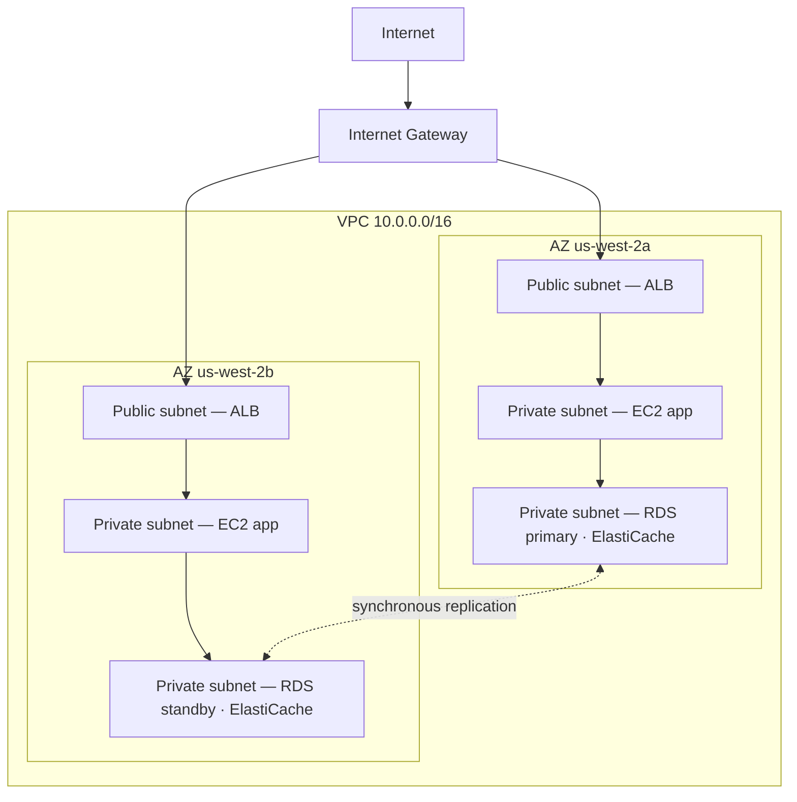

# অধ্যায় ১১: ক্লাউডে আপনার ব্যক্তিগত কোণা

Priya-র হাতে একটি কাগজে একটি আঁকা ছিল।

এটি একটি জটিল আঁকা ছিল না। একটি আয়তক্ষেত্র, "AWS" লেবেলযুক্ত। আয়তক্ষেত্রের ভেতরে, বাক্সের একটি cluster: EC2 instance, একটি RDS ডেটাবেস, একটি ElastiCache cluster। সবকিছু সবকিছুর সাথে সংযোগকারী লাইন। এবং আয়তক্ষেত্রের বাইরে, একটি একক label: "Internet।"

সে এটি টেবিলের মাঝখানে রাখল।

---

*Caching layer কাজ করছিল। Redis page load 188 মিলিসেকেন্ড থেকে 12-তে কেটে দিয়েছিল। কিন্তু Leo যখন সেই জয় উদযাপন করছিল, Priya network log পড়ছিল — এবং সে যা দেখল তা পছন্দ করল না। প্রতিটি পরিষেবা একই flat network-এ ছিল। ডেটাবেসের একটি public IP address ছিল। Redis cluster প্রযুক্তিগতভাবে বাইরে থেকে পৌঁছানো যেত। অ্যাপ্লিকেশন কাজ করত, কিন্তু architecture ছিল একটি parking lot: কোনো বেড়া নেই, কোনো gate নেই, কোনো zone নেই।*

---

"এটাই আমাদের কাছে আছে," সে বলল। "আমাদের ডেটাবেসের একটি public IP address আছে। আমাদের cache layer ইন্টারনেট থেকে পৌঁছানো যায়। আমাদের EC2 instance গুলি সব একই flat network-এ।"

"এটা ঠিক আছে বলে মনে হচ্ছে," Leo বলল। "আমাদের security group আছে।"

"Security group যা আপনি configure করেছেন," Priya বলল। "রাতে। প্রাথমিক setup-এর সময়।"

Leo কিছু বলল না।

"আমি configuration-এর সমালোচনা করছি না," সে বলল। "আমি বলছি যখন সবকিছু একটি flat public network-এ থাকে, একটি single misconfiguration একটি কাজ করা সিস্টেম এবং ইন্টারনেটের সবার কাছে accessible একটির মধ্যে পার্থক্য।"

সে একটি লাল marker তুলে ডেটাবেসের চারপাশে একটি বৃত্ত আঁকল।

"এটি ইন্টারনেট থেকে পৌঁছানো উচিত নয়। মোটেই না। কোনো security group rule-এর মাধ্যমে নয়, কোনো hardened configuration-এর মাধ্যমে নয়। এটি structurally unreachable হওয়া উচিত।"

"আমাদের network architecture নিয়ে কথা বলতে হবে," Maya বলল।

"তিন মাস আগে কথা বলা দরকার ছিল," Priya বলল। "কিন্তু এখনও ঠিক আছে।"

দল কয়েক সপ্তাহের মধ্যে প্রথমবার একটি whiteboard-এর সামনে জড়ো হলো।

**Open Parking Lot-এর সমস্যা**

একটি বিশাল public parking garage কল্পনা করুন। দশ হাজার গাড়ি। যেকোনো গাড়ি যেকোনো জায়গায় পার্ক করতে পারে। Zone-এর মধ্যে কোনো barrier নেই, কোনো gate নেই, কোনো reserved section নেই।

এটি একটি open network। প্রতিটি পরিষেবা প্রতিটি অন্য পরিষেবায় পৌঁছাতে পারে। আপনার web server আপনার ডেটাবেসের সাথে কথা বলতে পারে। আপনার ডেটাবেস ইন্টারনেটে পৌঁছাতে পারে। আপনার caching layer যেকোনো জায়গা থেকে connection পেতে পারে।

সবকিছু সবকিছুর সাথে কথা বলতে পারলে, একটি compromise সবকিছুকে প্রভাবিত করে।

"তাহলে কেউ parking garage-এ ঢুকলে," Tom বলল, "তারা যেকোনো গাড়িতে হাঁটতে পারে।"

"এবং যেকোনো গাড়ি থেকে, যেকোনো জায়গায় গাড়ি চালাতে পারে," Priya নিশ্চিত করল। "আমরা বেড়া চাই। আমরা locked gate চাই। আমরা zone চাই।"

VPC হলো AWS-এ সেই zone তৈরির উপায়।

**VPC কী?**

"দাঁড়াও — কিন্তু আমরা *কেন* এভাবে করব?" Maya জিজ্ঞেস করল। "যদি আমাদের ইতিমধ্যে প্রতিটি resource-এ security group থাকে, আমাদের একটি VPC কেন দরকার? Security group কি একই কাজ করছে না?"

Security group এবং VPC ভিন্ন স্তরে রক্ষা করে। একটি security group হলো একটি নির্দিষ্ট resource-এর সাথে সংযুক্ত একটি নিয়ম — এটি বলে "এই EC2 instance শুধুমাত্র load balancer থেকে port 8080-এ ট্রাফিক গ্রহণ করে।" কিন্তু এটি এখনো public network-এ। IP address এখনো পৌঁছানো যায়; নিয়ম শুধু দরজায় connection block করে। একটি VPC public street থেকে দরজা সম্পূর্ণ সরিয়ে দেয়। একটি private subnet-এ একটি resource-এর ইন্টারনেটে কোনো *route* নেই — এবং প্রথা অনুযায়ী কোনো public IP নেই — তাই security group যাই বলুক না কেন এটি ইন্টারনেট থেকে পৌঁছানো যায় না। সেটা একটি structural গ্যারান্টি, একটি configuration গ্যারান্টি নয়।

একটি **Virtual Private Cloud (VPC)** হলো AWS cloud-এর একটি logically isolated section — একটি private network যা আপনি সংজ্ঞায়িত করেন, যা ডিফল্টরূপে শুধুমাত্র আপনার resource অ্যাক্সেস করতে পারে।

বিশাল public parking garage-এর ভেতরে একটি fenced private lot হিসেবে এটি মনে করুন। আপনার lot-এর নিজস্ব নিয়ম আছে: কে প্রবেশ করতে পারে, কে বের হতে পারে, section-গুলির মধ্যে কোন route বিদ্যমান।

একটি VPC তৈরি করার সময়, আপনি সংজ্ঞায়িত করেন:

**একটি CIDR block**: আপনার network-এর ভেতরে পাওয়া IP address-এর range। উদাহরণস্বরূপ, `10.0.0.0/16` আপনাকে ৬৫,৫৩৬টি সম্ভাব্য IP address দেয় (10.0.0.0 থেকে 10.0.255.255)।

**Subnet**: আপনার VPC-এর বিভাজন, প্রতিটিকে আপনার IP address range-এর একটি অংশ বরাদ্দ করা এবং একটি নির্দিষ্ট Availability Zone-এর সাথে যুক্ত।

**Route table**: নেটওয়ার্ক ট্রাফিক কোথায় যায় তা নির্ধারণকারী নিয়ম।

**Internet Gateway**: আপনার VPC এবং public internet-এর মধ্যে সংযোগ।

**Subnet: Public বনাম Private**

সমস্ত resource publicly accessible হওয়া উচিত নয়।

আপনার web server-কে ইন্টারনেট থেকে ট্রাফিক গ্রহণ করতে হবে — ব্যবহারকারীর browser-কে এটিতে পৌঁছাতে হবে।

আপনার ডেটাবেস *কখনো* ইন্টারনেট থেকে ট্রাফিক গ্রহণ করা উচিত নয় — শুধুমাত্র আপনার web server এর সাথে কথা বলতে পারা উচিত।

এখানেই subnet আসে।

একটি **public subnet** একটি Internet Gateway-এর সাথে সংযুক্ত এবং public IP address সহ resource থাকতে পারে। ট্রাফিক ইন্টারনেটে এবং থেকে flow করতে পারে।

একটি **private subnet**-এর route table-এ ইন্টারনেটে কোনো route নেই। Private subnet-এর resource শুধুমাত্র আপনার VPC-এর অন্য resource-এর সাথে যোগাযোগ করতে পারে (যদি না আপনি নির্দিষ্ট outbound route সেটআপ করেন)। প্রথা অনুযায়ী, তাদের কোনো public IP address-ও নেই।

Nimbus-এর জন্য, design স্পষ্ট হয়ে গেল:



Load balancer public-facing — এটিকে ইন্টারনেট থেকে ট্রাফিক গ্রহণ করতে হবে। EC2 instance private — তারা শুধুমাত্র load balancer থেকে ট্রাফিক গ্রহণ করে। ডেটাবেস private — তারা শুধুমাত্র EC2 instance থেকে ট্রাফিক গ্রহণ করে।

"তাহলে ডেটাবেসে পৌঁছাতে," Tom বলল, "কাউকে load balancer-এর মধ্য দিয়ে, তারপর EC2 instance-এর মধ্য দিয়ে, তারপর ডেটাবেস security group-এর মধ্য দিয়ে যেতে হবে?"

"তিনটি layer," Priya নিশ্চিত করল। "Defense in depth।"

---

**Nimbus-এর CIDR পরিকল্পনা**

"দাঁড়াও — কিন্তু আমরা *কেন* এভাবে করব?" Maya জিজ্ঞেস করল, CIDR block পছন্দের দিকে তাকিয়ে। "Priya IP address range সম্পর্কে এত নির্দিষ্ট কেন? আমরা কি শুধু AWS যা ডিফল্ট করে তা ব্যবহার করতে পারি না?"

"কারণ CIDR block পরে পরিবর্তন করা খুব কঠিন," Priya বলল। "এবং কারণ আমরা যদি কখনো এই VPC-কে অন্য একটি VPC-এর সাথে, বা একটি on-premises network-এর সাথে সংযুক্ত করি, overlapping IP range routing failure ঘটায় যা debug করা যন্ত্রণাদায়ক।"

সে whiteboard-এ পরিকল্পনাটি আঁকল।

Nimbus-এর VPC: `10.0.0.0/16` — মোট ৬৫,৫৩৬টি address।

| Subnet | CIDR | AZ | উদ্দেশ্য |
|---|---|---|---|
| Public A | 10.0.0.0/24 | us-west-2a | Load balancer |
| Public B | 10.0.1.0/24 | us-west-2b | Load balancer |
| Private App A | 10.0.10.0/24 | us-west-2a | EC2 app server |
| Private App B | 10.0.11.0/24 | us-west-2b | EC2 app server |
| Private Data A | 10.0.20.0/24 | us-west-2a | RDS, ElastiCache |
| Private Data B | 10.0.21.0/24 | us-west-2b | RDS, ElastiCache |

"সবকিছু একটি /16 কেন না করি?" Leo জিজ্ঞেস করল।

"কারণ ভিন্ন AZ-এর subnet একটি address space শেয়ার করা উচিত নয়। প্রতিটি subnet একটি AZ-এ। আমরা যদি কখনো এই VPC-কে অন্য একটির সাথে peer করি, আমরা যত granular হব, তত কম সংঘর্ষ হওয়ার সম্ভাবনা। এবং প্রতিটি /24 আমাদের 251টি ব্যবহারযোগ্য address দেয় — যেকোনো একটি tier-এর জন্য যথেষ্টের বেশি।"

"AWS প্রতিটি subnet-এ পাঁচটি address সংরক্ষণ করে," Tom লক্ষ্য করল, ডকুমেন্টেশন দেখে। "এজন্যই এটা 251, 256 নয়।"

"সঠিক। প্রথম চারটি এবং শেষটি। Network address, VPC router, DNS server, ভবিষ্যৎ ব্যবহার, broadcast।"

"তাহলে /24 সবচেয়ে ছোট যেখানে আপনি যাবেন?"

"বাস্তবে। আপনি খুব ছোট subnet-এর জন্য /28 ব্যবহার করবেন — যেমন একটি VPN gateway subnet, যার শুধু কয়েকটি IP দরকার। কিন্তু application tier-এর জন্য, /24 একটি যুক্তিসঙ্গত ন্যূনতম।"

Tom সংখ্যাগুলি লিখে নিল এবং আকারের মধ্যে মাসিক খরচের পার্থক্য গণনা করল। সে সবসময় করত।

---

**যে CIDR পরিকল্পনার ভুলগুলি এড়াতে হবে**

"আমরা যদি একটি subnet ছাড়িয়ে যাই তাহলে কী হয় তা নিয়ে আমরা ভেবেছি কি?" Priya জিজ্ঞেস করল। সে জানত না বলে জিজ্ঞেস করছিল না। সে জিজ্ঞেস করছিল কারণ বাকি দলের উত্তরটি আত্মস্থ করা দরকার ছিল।

Leo এটি নিয়ে ভাবল। "আমরা আরো subnet যোগ করতে পারি?"

"আপনি একটি VPC-তে subnet যোগ করতে পারেন। কিন্তু আপনি একটি বিদ্যমান subnet আকার পরিবর্তন করতে পারবেন না। আপনার private app subnet পূর্ণ হলে — 251টি address যথেষ্ট নয় — আপনাকে একটি নতুন subnet তৈরি করে এতে instance migrate করতে হবে।"

"এটা আসলে কত ঘন ঘন ঘটে?"

"কদাচিৎ, আপনি ভালোভাবে পরিকল্পনা করলে। কিন্তু মানুষ তিনটি সাধারণ ভুল করে।"

সে সেগুলি তালিকাভুক্ত করল:

**ভুল এক**: একটি খুব-ছোট VPC CIDR ব্যবহার করা। আপনি যদি পুরো VPC-এর জন্য `10.0.0.0/24` ব্যবহার করেন (254টি address), আপনি subnet পরিকল্পনা শেষ করার আগেই জায়গা ফুরিয়ে ফেলবেন। নমনীয়তার জন্য `/16` দিয়ে শুরু করুন।

**ভুল দুই**: VPC জুড়ে overlapping CIDR ব্যবহার করা। আপনার production VPC যদি `10.0.0.0/16` হয় এবং আপনার staging VPC-ও `10.0.0.0/16` হয়, আপনি কখনো সেগুলি peer করতে বা একটি transit gateway-এর মাধ্যমে সংযুক্ত করতে পারবেন না। Router জানবে না কোন VPC-তে ট্রাফিক পাঠাতে হবে।

**ভুল তিন**: ভবিষ্যৎ tier-এর জন্য address space সংরক্ষণ না করা। Nimbus-এর পরিকল্পনা `10.0.30.0/24` এবং `10.0.31.0/24` unassigned রেখেছিল — পুরো address space পুনর্গঠন না করে একটি ভবিষ্যৎ internal tooling tier, একটি monitoring subnet, বা একটি VPN endpoint subnet-এর জন্য জায়গা।

"আপনি যা প্রয়োজন মনে করেন তার দ্বিগুণের জন্য পরিকল্পনা করুন," Priya বলল। "Subnet বিনামূল্যে। একটি `/16` থেকে IP address space প্রচুর। ভুল পরিকল্পনার খরচ একটি network migration।"

---

**NAT Gateway: Private Subnet যা এখনো জিনিস ডাউনলোড করতে পারে**

Private subnet ইন্টারনেটে পৌঁছাতে পারে না। কিন্তু কখনো কখনো, তাদের দরকার হয়। আপনার EC2 instance-কে একটি software update ডাউনলোড করতে হবে। আপনার অ্যাপ্লিকেশনকে একটি external API call করতে হবে।

এখানেই **NAT Gateway** (Network Address Translation) আসে।

একটি NAT Gateway একটি public subnet-এ বসে। Private subnet-এর resource NAT Gateway-এ outbound ট্রাফিক পাঠাতে পারে, যা এটি ইন্টারনেটে relay করে — কিন্তু ইন্টারনেট ফিরে connection শুরু করতে পারে না।

এটি একটি one-way revolving door-এর মতো। আপনি বাইরে যেতে পারেন। বাইরের কেউ ভেতরে আসতে পারে না।

"মাসে এর খরচ কত?" Tom জিজ্ঞেস করল।

NAT Gateway pricing-এ দুটি component আছে: প্রতিটি NAT Gateway-এর জন্য একটি ঘণ্টার চার্জ, plus একটি per-GB ডেটা processing ফি।

Nimbus যখন এটি সেট আপ করেছিল, সেটা ছিল প্রতি NAT Gateway-তে প্রায় $32/মাস, plus প্রতি GB processed ডেটায় $0.045। ছোট ট্রাফিক ভলিউমের জন্য, fixed খরচ প্রাধান্য পায়। স্কেলে, ডেটা চার্জ যথেষ্ট হতে পারে।

Tom NAT Gateway configuration শেষ করার আগে ডেটা processing খরচের জন্য একটি billing alert সেট আপ করল। কেউ দেখছিল না যখন AWS ডেটা খরচ কেমন দেখায় তা সে দেখেছিল।

যে চমক দলগুলিকে অপ্রস্তুত ধরে: একটি NAT Gateway-এর মধ্য দিয়ে প্রবাহিত প্রতিটি byte চার্জ করা হয়। আপনার private subnet-এর EC2 instance যদি বড় software package ডাউনলোড করছে, external service-এ log streaming করছে, বা external API-তে উল্লেখযোগ্য ডেটা পাঠাচ্ছে, NAT Gateway ডেটা চার্জ বিলে একটি চমক হিসেবে দেখা দেয়। AWS-to-AWS ট্রাফিকের সমাধান: VPC Endpoint ট্রাফিককে AWS পরিষেবায় (S3, DynamoDB) privately route করে, NAT Gateway সম্পূর্ণ বাইপাস করে এবং সেই ডেটা চার্জ নির্মূল করে।

"তাহলে private subnet-এর EC2 instance NAT Gateway-এর মাধ্যমে OS update ডাউনলোড করে," Tom বলল। "সেই update কত গিগাবাইট?"

"প্রতি instance, প্রতি মাস, হয়তো দুই থেকে পাঁচ GB," Leo বলল।

"দশটি instance দিয়ে গুণ। বারো মাস দিয়ে গুণ। প্রতি GB $0.045-এ—"

"বছরে এগারো থেকে সাতাশ ডলার," Priya শেষ করল। "এক্ষেত্রে, গ্রহণযোগ্য।"

"কিন্তু আমরা যদি log streaming করতাম — যেমন আমাদের সমস্ত অ্যাপ্লিকেশন log একটি external observability service-এ পাঠাতাম—"

"আমরা সেগুলি একটি VPC Endpoint-এর মাধ্যমে route করতাম বা NAT-এর মাধ্যমে বের হওয়ার পরিবর্তে CloudWatch Logs ব্যবহার করতাম।"

Tom calculator বন্ধ করল। গণনা যথেষ্ট স্পষ্ট ছিল।

### NAT Instance: বাজেট বিকল্প

"দাঁড়াও," Tom বলল, এখনো pricing page-এর দিকে তাকিয়ে। "আমরা শুধু private instance-কে ইন্টারনেটে পৌঁছাতে দিতে প্রতি গিগাবাইট পেমেন্ট করছি? এটাই একমাত্র বিকল্প?"

"এটা managed বিকল্প," Priya বলল। "একটি পুরানো উপায় আছে, কিন্তু এটি tradeoff সহ আসে।"

NAT Gateway থাকার আগে, দলগুলি একটি নিয়মিত EC2 instance দিয়ে একই outbound routing অর্জন করত — একটি "NAT instance।" আপনি একটি public subnet-এ একটি EC2 instance launch করতেন, OS-এ IP forwarding সক্ষম করতেন, source/destination check অক্ষম করতেন (যা AWS instance-এ সম্বোধিত না করা packet drop করতে ডিফল্টরূপে সক্ষম করে), এবং private subnet-এর route table-কে instance-এর ENI-এ point করতেন। Private instance থেকে ট্রাফিক এটির মধ্য দিয়ে ইন্টারনেটে প্রবাহিত হত, একটি NAT Gateway-এর মতোই।

এটা এখনো কাজ করে। AWS এখনো এটি ডকুমেন্ট করে। এবং খুব কম ট্রাফিক ভলিউমে — একটি একক dev environment যেখানে কয়েকটি instance মাঝে মাঝে package ডাউনলোড করে — একটি `t3.micro` NAT instance মাসে পাঁচ ডলারের নিচে খরচ করতে পারে, NAT Gateway-এর fixed ঘণ্টার চার্জ plus per-GB ফি-র তুলনায়।

| | NAT Gateway | NAT Instance |
|---|---|---|
| ব্যবস্থাপনা | AWS দ্বারা সম্পূর্ণ managed | আপনি EC2 পরিচালনা করেন |
| Availability | AZ-এর মধ্যে redundant | একক EC2 — single point of failure |
| Bandwidth | 100 Gbps পর্যন্ত, স্বয়ংক্রিয়ভাবে scale | EC2 instance type দ্বারা সীমিত |
| Cost | $0.045/GB + ঘণ্টার চার্জ | শুধু EC2 instance খরচ |

খরচের সুবিধা দ্রুত অদৃশ্য হয়। অর্থবহ ট্রাফিক ভলিউমে, per-GB NAT Gateway চার্জ সেই bandwidth সামলাতে যে EC2 instance type লাগবে তার সাথে প্রতিযোগিতামূলক — এবং NAT Gateway-এর জন্য শূন্য patching, শূন্য monitoring এবং ব্যর্থ হলে শূন্য incident response প্রয়োজন (এটা হয় না)।

"তাহলে আমরা আসলে কখন একটি NAT instance ব্যবহার করব?" Leo জিজ্ঞেস করল।

"একটি throwaway dev environment," Priya বলল। "কোথাও আপনি এক বা দুটি instance চালাচ্ছেন, মাঝে মাঝে package update করছেন, এবং fixed খরচ ন্যূনতম করতে চান। Production workload — যেকোনো কিছু যা available থাকতে হবে — NAT Gateway, প্রতি AZ-এ একটি।"

পরীক্ষা এই trade-off নাম ধরে পরীক্ষা করে। Pattern: "কম ট্রাফিক সহ একটি dev বা test environment-এ NAT খরচ ন্যূনতম করুন" NAT Instance নির্দেশ করে। "High availability প্রয়োজনীয় Production workload" প্রতি AZ-এ deploy করা NAT Gateway নির্দেশ করে।

আপনি হয়তো ভাবছেন: security group যদি ইতিমধ্যে বিদ্যমান থাকে এবং ডিফল্টরূপে ট্রাফিক block করে, private subnet সহ একটি VPC কেন অর্থবহ সুরক্ষা যোগ করে? কারণ "একটি security group দ্বারা blocked" এবং "structurally unreachable" ভিন্ন জিনিস। একটি security group misconfiguration — একটি ভুল নিয়ম, একটি খোলা port — একটি resource expose করতে পারে যার একটি public IP আছে। একটি private subnet-এর resource-এর প্রথমেই পৌঁছানোর জন্য কোনো public IP নেই। আপনাকে ডেটাবেসে পৌঁছানোর চেষ্টা করার আগে load balancer এবং একটি চলমান EC2 instance compromise করতে হবে। Private subnet network স্তরে isolation প্রয়োগ করে, rule স্তরে নয়।

**Route Table: ট্রাফিক কীভাবে তার পথ খুঁজে পায়**

প্রতিটি subnet-এ একটি **route table** আছে যা ট্রাফিককে কোথায় যেতে হবে বলে।

একটি সাধারণ public subnet route table এভাবে দেখায়:

| Destination | Target                      |
|-------------|-----------------------------|
| 10.0.0.0/16 | local                       |
| 0.0.0.0/0   | igw-xxxx (Internet Gateway) |

প্রথম নিয়ম: আপনার VPC range-এর যেকোনো IP-তে ট্রাফিক local থাকে। দ্বিতীয় নিয়ম: অন্য সমস্ত ট্রাফিক (`0.0.0.0/0` মানে "সবকিছু") Internet Gateway-এ যায়।

একটি private subnet route table:

| Destination | Target                 |
|-------------|------------------------|
| 10.0.0.0/16 | local                  |
| 0.0.0.0/0   | nat-xxxx (NAT Gateway) |

Private subnet ট্রাফিক local থাকে বা NAT Gateway-এর মাধ্যমে বের হয়। Internet Gateway-এ কোনো সরাসরি route নেই।

**Security Group বনাম NACL (Preview)**

VPC-এর ভেতরে, resource স্তরে ট্রাফিক নিয়ন্ত্রণের জন্য আপনার দুটি সরঞ্জাম আছে:

**Security Group** (অধ্যায় ১৫ এটি গভীরে কভার করে) পৃথক resource-এর জন্য virtual firewall হিসেবে কাজ করে — একটি EC2 instance, একটি RDS instance, একটি load balancer। এগুলি *stateful*: ট্রাফিক ভেতরে আসার অনুমতি পেলে, response ট্রাফিক স্বয়ংক্রিয়ভাবে বাইরে যাওয়ার অনুমতি পায়।

**Network ACL (NACL)** subnet স্তরে কাজ করে এবং *stateless*: আপনাকে inbound এবং outbound ট্রাফিক আলাদাভাবে স্পষ্টভাবে allow করতে হবে।

বেশিরভাগ ব্যবহারের ক্ষেত্রে, Security Group যথেষ্ট। NACL একটি অতিরিক্ত layer যোগ করে যখন আপনার subnet-স্তরের control দরকার — উদাহরণস্বরূপ, একটি নির্দিষ্ট IP range-কে কখনো একটি subnet-এ পৌঁছাতে block করা।

"Instance স্তরে security group," Leo whiteboard-এ লিখল। "Subnet স্তরে NACL।"

"এবং port 22 কখনো 0.0.0.0/0-এ খোলা রাখবেন না," Priya যোগ করল, Leo-র দিকে তাকিয়ে।

"সেটা একবার ছিল," Leo বলল।

"এটা সবসময় ঠিক একবার," Priya বলল, "যতক্ষণ না হয়।"

"আর কেউ যদি ভাঙার চেষ্টা করে?" Priya বলল, এখনো whiteboard-এ। "একটি misconfigured security group-এর মাধ্যমে নয় — তারা যদি load balancer নিজেই compromise করে? তাদের private subnet-এ pivot করা থেকে কী থামায়?"

"Private subnet EC2 instance শুধুমাত্র load balancer-এর security group থেকে ট্রাফিক গ্রহণ করে," Leo বলল। "এমনকি load balancer compromise হলেও, আক্রমণকারী শুধু এমন অনুরোধ করতে পারে যা সাধারণ API call-এর মতো দেখায়।"

"এবং ডেটাবেস শুধুমাত্র EC2 security group থেকে ট্রাফিক গ্রহণ করে," Priya বলল। "Defense in depth। প্রতিটি layer ধরে নেয় আগেরটি ব্যর্থ হতে পারে।"

---

**VPC Flow Logs: কী ঘটছে তা দেখা**

"আমাদের network-এ চোখ দরকার," Priya বলল, VPC redesign-এর তিন দিনের মাথায়।

"আমাদের security group এবং NACL আছে," Leo বলল। "ট্রাফিক নিয়ন্ত্রিত।"

"নিয়ন্ত্রিত মানে দৃশ্যমান নয়। যদি কিছু অদ্ভুত ঘটে — একটি অপ্রত্যাশিত connection প্রচেষ্টা, একটি অদ্ভুত port-এ ট্রাফিক — আমরা কীভাবে জানব?"

VPC Flow Logs আপনার VPC-এর মধ্য দিয়ে প্রবাহিত network ট্রাফিক সম্পর্কে metadata capture করে। Packet-এর বিষয়বস্তু নয় — শুধু connection-স্তরের তথ্য: source IP, destination IP, port, protocol, packet count, byte count, start time, end time, এবং ট্রাফিক গ্রহণ না প্রত্যাখ্যান করা হয়েছিল।

একটি সাধারণ flow log entry এভাবে দেখায়:

```
2 123456789012 eni-0abc123 10.0.10.5 10.0.20.8 49321 5432 6 20 4320 1620000000 1620000060 ACCEPT OK
```

এটি আপনাকে বলে: `10.0.10.5` (app subnet-এর একটি EC2 instance) থেকে `10.0.20.8` (RDS instance)-এ, port 5432 (PostgreSQL), 20টি packet, 4,320 byte, গ্রহণ করা হয়েছে। সাধারণ ট্রাফিক।

কিন্তু Flow Logs সক্ষম করার কয়েক দিন পরে, Priya এটি খুঁজে পেল:

```
2 123456789012 eni-0abc123 185.220.101.55 10.0.10.5 0 8080 6 1 40 1620003200 1620003201 REJECT OK
```

একটি external IP — `185.220.101.55` — port 8080-এ EC2 instance-এ একটি connection-এর চেষ্টা করেছিল। Connection-টি security group দ্বারা প্রত্যাখ্যান করা হয়েছিল। কিন্তু প্রচেষ্টাটি logged ছিল।

সে IP-টি দেখল। এটি স্বয়ংক্রিয় scanning-এর জন্য পরিচিত একটি Romanian address block-এর অন্তর্গত — এই ধরনের background-noise probing যা ইন্টারনেটের প্রতিটি public IP ক্রমাগত পায়।

"কেউ আমাদের probe করছে," সে বলল।

"কিন্তু প্রত্যাখ্যান হচ্ছে," Leo বলল।

"এবার। GuardDuty সক্ষম করুন" — একটি threat-detection পরিষেবা যা আমরা অধ্যায় ১৭-তে যথাযথভাবে দেখব — "আমরা এগিয়ে যাওয়ার আগে। আমাদের behavioral detection দরকার, শুধু perimeter blocking নয়।"

Flow Logs CloudWatch Logs বা S3-তে সংরক্ষিত হয়। সেগুলি CloudWatch Insights বা Athena ব্যবহার করে query করা যায়। Priya একটি CloudWatch Insights query সেট আপ করল যা রাতে চলত এবং non-AWS IP range থেকে যেকোনো প্রত্যাখ্যাত connection প্রচেষ্টা flag করত।

"মাসে এর খরচ কত?" Tom জিজ্ঞেস করল।

"Flow log CloudWatch বা S3-তে ingest করা ডেটার প্রতি GB চার্জ করা হয়। আমাদের ট্রাফিক ভলিউমে, সম্ভবত মাসে আট থেকে পনেরো ডলার।"

Tom থামল। "এবং বিকল্প হলো কেউ আমাদের network probe করছে তা না জানা।"

"হ্যাঁ।"

"এটা ঠিক আছে," সে বলল, এবং console খুলল।

**Flow Logs-এ একটি Port Scan পড়া**

Flow log সক্ষম করার দুই সপ্তাহ পরে, Priya তার রাতের CloudWatch Insights query চালাল এবং কিছু নতুন খুঁজে পেল। একটি প্রত্যাখ্যাত connection নয় — কয়েক ডজন, দ্রুত ক্রমে, একই source IP থেকে, পরপর port জুড়ে।

```
185.220.101.55 → 10.0.10.5 port 22   REJECT
185.220.101.55 → 10.0.10.5 port 23   REJECT
185.220.101.55 → 10.0.10.5 port 25   REJECT
185.220.101.55 → 10.0.10.5 port 80   REJECT
185.220.101.55 → 10.0.10.5 port 443  REJECT
185.220.101.55 → 10.0.10.5 port 3306 REJECT
185.220.101.55 → 10.0.10.5 port 5432 REJECT
185.220.101.55 → 10.0.10.5 port 6379 REJECT
```

সব একটি পাঁচ-সেকেন্ড window-এর মধ্যে। সব প্রত্যাখ্যাত।

"এটা একটা port scan," Priya বলল। "কেউ probe করছে এই instance কোন পরিষেবা চালাচ্ছে।"

"কিন্তু সব প্রত্যাখ্যাত," Leo বলল। "তাই security group তার কাজ করছে।"

"Security group তার কাজ করছে। Scan এখনো আক্রমণকারীর জন্য তথ্যপূর্ণ — এটা তাদের বলে কোন port একটি timeout-এর মধ্যে প্রত্যাখ্যান *করেনি*, যার মানে সেই port কোথাও খোলা। এবং এটা তাদের বলে এই host জীবিত এবং তদন্তের যোগ্য।"

"আমরা কী করি?"

"দুটি জিনিস," Priya বলল। "প্রথম: সেই IP যে /24 range-এর অন্তর্গত তা block করতে একটি NACL rule যোগ করুন। শুধু সেই IP নয় — পুরো subnet। Port scanner একটি range-এর মধ্যে IP rotate করে। দ্বিতীয়: একটি CloudWatch alarm যোগ করুন যা fire করে যখন কোনো একক source IP ষাট সেকেন্ডে দশটির বেশি প্রত্যাখ্যাত connection উৎপন্ন করে। সেই pattern প্রায় সবসময় একটি scan।"

সে উভয় সেট আপ করল। Alarm পরের সপ্তাহে দুবার fire করল — একবার একই Romanian range থেকে, একবার Singapore-ভিত্তিক একটি স্বয়ংক্রিয় scanner থেকে। উভয়ই detection-এর মিনিটের মধ্যে NACL-এ block করা হয়েছিল।

Flow log আক্রমণ থামায় না। এগুলি আক্রমণকে দৃশ্যমান করে। এবং দৃশ্যমান আক্রমণে সাড়া দেওয়া যায়। বিকল্প — ট্রাফিক অদৃশ্যভাবে প্রবাহিত — মানে একটি সমস্যার প্রথম চিহ্ন হলো ক্ষতি, প্রচেষ্টা নয়।

---

**Single NAT Gateway ফাঁদ**

VPC redesign-এর তিন মাস পরে, Priya একটি failure simulation চালাল। সে জানতে চেয়েছিল `us-west-2a` availability zone একটি বিঘ্ন অনুভব করলে Nimbus-এর কী হবে।

বেশিরভাগ ঠিক ছিল। Load balancer `us-west-2b`-এর instance-এ failover করল। `us-west-2b`-এর RDS standby ইতিমধ্যে live ছিল। ElastiCache replica promote করল। অ্যাপ্লিকেশন অনুরোধ পরিবেশন চালিয়ে গেল।

তারপর Leo লক্ষ্য করল যে `us-west-2b`-এর তার EC2 instance OS update notification পাওয়া বন্ধ করেছে। সে NAT Gateway configuration চেক করল।

একটি ছিল। `us-west-2a`-তে।

"উভয় AZ-এর private subnet থেকে সমস্ত outbound ইন্টারনেট ট্রাফিক এক AZ-এর এক NAT Gateway-এর মাধ্যমে route হয়," Priya বলল।

"তাহলে `us-west-2a` ডাউন হলে—"

"`us-west-2b`-এর প্রতিটি EC2 instance outbound ইন্টারনেট অ্যাক্সেস হারায়। তারা update ডাউনলোড করতে পারে না। তারা external API-তে পৌঁছাতে পারে না। যে Secrets Manager lookup cached নয় তা ব্যর্থ হবে। outbound ইন্টারনেট প্রয়োজনীয় যেকোনো কিছু ভাঙবে।"

সমাধান: প্রতি AZ-এ একটি NAT Gateway। প্রতিটি AZ-এর private subnet একই AZ-এর NAT Gateway-এ outbound ট্রাফিক route করে। একটি AZ ব্যর্থ হলে, শুধু সেই AZ-এর ট্রাফিক প্রভাবিত হয়।

"এবং সেই fix-এর দাম?" Tom জিজ্ঞেস করল।

"দ্বিতীয় AZ-এর NAT Gateway-এর জন্য মাসে অতিরিক্ত বত্রিশ ডলার।"

Tom এক মুহূর্ত চুপ ছিল।

"একটি outage-এর সময় `us-west-2b`-এর EC2 capacity external API-তে পৌঁছাতে ব্যর্থ হওয়া," Priya বলল, "বত্রিশ ডলারের চেয়ে বেশি খরচ করে।"

Tom পরিবর্তন অনুমোদন করল।

এটি সবচেয়ে সাধারণ VPC design ভুলগুলির একটি: একটি NAT Gateway যা highly available দেখায় কিন্তু আসলে একটি single point of failure। আপনার যদি তিনটি AZ-এ resource থাকে এবং একটি NAT Gateway, আপনার three-AZ compute resilience কিন্তু one-AZ network resilience আছে। দুটি মিলে না।

নিয়ম: প্রতি AZ-এ একটি NAT Gateway, সেই AZ-এর public subnet-এ। প্রতিটি AZ-এর private route table তার নিজস্ব NAT Gateway-এ point করে। খরচ সামান্য। Availability উন্নতি বাস্তব।


---

**VPC Peering: Private Network সংযোগ করা**

Nimbus যদি একাধিক VPC-তে বাড়ে? (এটি ঘটে। দল বড় হয়। পরিষেবাগুলি পৃথক account-এ বিচ্ছিন্ন হয়।)

**VPC Peering** দুটি VPC-কে একই network-এ থাকার মতো privately যোগাযোগ করতে দেয়। ট্রাফিক AWS-এর private network ছেড়ে যায় না।

গুরুত্বপূর্ণ সীমা:

- VPC peering transitive নয়। VPC A যদি VPC B-এর সাথে peer করে, এবং VPC B যদি VPC C-এর সাথে peer করে, A এবং C যোগাযোগ করতে পারে না — যদি না আপনি একটি সরাসরি A-C peer যোগ করেন।
- Peered VPC-এর মধ্যে CIDR block overlap করতে পারে না।

অনেক VPC সহ বড় architecture-এর জন্য, **AWS Transit Gateway** (অধ্যায় ২৫) peering connection-এর একটি পূর্ণ mesh প্রয়োজন ছাড়া transitive routing সামলায়।

---

**AWS PrivateLink: AWS পরিষেবায় Private অ্যাক্সেস**

"Private subnet থেকে S3-তে পৌঁছানো সম্পর্কে কী?" Leo জিজ্ঞেস করল। "আমাদের EC2 instance S3-তে receipt লেখে। এখন সেই ট্রাফিক NAT Gateway-এর মাধ্যমে বের হয়।"

"VPC Endpoint," Priya বলল। "বিশেষভাবে, S3 এবং DynamoDB-এর জন্য Gateway Endpoint — সেগুলি বিনামূল্যে।"

একটি **VPC Endpoint** আপনার VPC এবং একটি AWS পরিষেবার মধ্যে একটি private connection তৈরি করে, public internet সম্পূর্ণ বাইপাস করে। আপনার private subnet এবং AWS পরিষেবার মধ্যে ট্রাফিক AWS network-এ থাকে। কোনো NAT Gateway চার্জ নেই। কোনো ইন্টারনেট exposure নেই।

S3 এবং DynamoDB-এর জন্য, **Gateway Endpoint** বিনামূল্যে এবং সহজ: NAT Gateway-এর পরিবর্তে S3/DynamoDB ট্রাফিককে endpoint-এ point করে route table-এ একটি entry যোগ করুন।

অন্যান্য AWS পরিষেবার জন্য (Secrets Manager, KMS, SNS, SQS), **Interface Endpoint** আপনার subnet-এ একটি private IP address সহ একটি elastic network interface (ENI) তৈরি করে। পরিষেবায় ট্রাফিক সেই private IP-তে যায়। Interface endpoint অর্থ খরচ করে — প্রায় $0.01/ঘণ্টা **endpoint যে প্রতিটি AZ-তে provision করা হয়েছে সেটি অনুযায়ী** (তিনটি AZ-তে ENI সহ একটি endpoint ঘণ্টার হারের তিন গুণ খরচ করে), plus প্রায় $0.01/GB processed ডেটা — কিন্তু সেগুলি sensitive API call (যেমন Secrets Manager lookup) একটি NAT Gateway-এর মাধ্যমে বা public internet-এ route করার প্রয়োজন নির্মূল করে।

"তাহলে আমাদের EC2 instance S3, DynamoDB, Secrets Manager এবং KMS-এ পৌঁছাতে পারে," Priya বলল, "সব private subnet থেকে, কোনো ইন্টারনেট exposure ছাড়া, এবং S3 ও DynamoDB-এর জন্য, কোনো NAT Gateway ডেটা চার্জ ছাড়া।"

Tom পুনরায় গণনা করল। S3 ট্রাফিক সাশ্রয় কয়েক মাসের মধ্যে Secrets Manager-এর জন্য Interface Endpoint খরচ পুষিয়ে দেবে।

"PrivateLink হলো সাধারণ নাম," Priya যোগ করল। "AWS PrivateLink হলো Interface Endpoint-এর অন্তর্নিহিত প্রযুক্তি। পরীক্ষা উভয় শব্দ ব্যবহার করে।"

---

**একটি Debugging Checklist**

VPC redesign-এর তিন মাস পরে, Leo network ভাঙল। নাটকীয়ভাবে নয় — সে একটি route table association modify করেছিল এবং দুর্ঘটনাক্রমে private app subnet-কে এর NAT Gateway route থেকে বিচ্ছিন্ন করেছিল।

EC2 instance external API-তে পৌঁছাতে পারল না। তারা একে অপরের কাছে পৌঁছাতে পারত, এবং তারা ডেটাবেসে পৌঁছাতে পারত। শুধু ইন্টারনেট নয়। Outbound HTTPS call ব্যর্থ হতে শুরু করল।

Priya তাকে একটি checklist দেওয়ার আগে সে চল্লিশ মিনিট troubleshoot করল।

"VPC-তে কিছু যখন অন্য কিছুতে পৌঁছায় না, এগুলি ক্রমানুসারে চেক করুন," সে বলল।

1. **Source-এর security group**: outbound rule কি সঠিক? আপনি যে ট্রাফিক পাঠানোর চেষ্টা করছেন তা কি এটি allow করে?
2. **Destination-এর security group**: inbound rule কি সঠিক? এটি কি source থেকে ট্রাফিক allow করে?
3. **Source subnet-এর NACL**: response ট্রাফিক block করা কোনো inbound deny rule আছে? একটি outbound allow rule আছে?
4. **Destination subnet-এর NACL**: একটি inbound allow rule আছে? response-এর জন্য একটি outbound allow rule আছে?
5. **Source subnet-এর route table**: এর কি destination-এ একটি route আছে? Route কি সঠিক target-এ (NAT Gateway, IGW, VPC Endpoint) point করছে?
6. **Destination subnet-এর route table**: এর কি source-এ ফিরে একটি route আছে?
7. **VPC Endpoint policy**: একটি VPC Endpoint ব্যবহার করলে, endpoint policy কি action allow করে?
8. **IAM permission**: EC2 role-এর কি পরিষেবা call করার permission আছে? (AWS API call-এর জন্য)

Leo এটি step 5-এ খুঁজে পেল। Route table ভুল private subnet-এ reassociate করা হয়েছিল। NAT Gateway route অনুপস্থিত ছিল।

"তিন মাস আগে যদি আমার এই list থাকত," সে বলল, "আমি পাঁচ মিনিটে এটি খুঁজে পেতাম।"

"আপনি এখন থেকে এটা পাবেন," Priya বলল।

## Direct Connect: Dedicated Line

VPC redesign-এর তিন মাস পরে, Nimbus Harborview Dining Group-এর সাথে একটি চুক্তি বন্ধ করল — একটি একশো-অবস্থানের enterprise chain যা দিনে বিশ লক্ষ ডলারের transaction প্রক্রিয়া করত।

Technical review call ভালোভাবে শুরু হলো। তারপর তাদের compliance officer unmute করল।

"আমরা public internet-এ production transaction ডেটা route করতে পারি না," সে বলল। "আমাদের auditor আমাদের data center এবং যেকোনো cloud environment-এর মধ্যে একটি dedicated, private, auditable network path দাবি করে। Site-to-Site VPN গ্রহণযোগ্য নয়। এটি অন্য সবার সাথে bandwidth শেয়ার করে। এটি consumer ট্রাফিকের একই তার দিয়ে যায়।"

Tom Leo-র দিকে তাকাল। Leo Priya-র দিকে তাকাল।

"নির্ভুল হতে," Priya সাবধানে বলল, "PCI DSS নিজে ইন্টারনেটে একটি encrypted VPN নিষিদ্ধ করে না — encrypted transport মানটি সন্তুষ্ট করে। আপনি যা বর্ণনা করছেন তা আপনার auditor-দের internal policy, যা কঠোর। এটা বৈধ। এবং এর জন্য একটি পরিষেবা আছে।"

**AWS Direct Connect** হলো আপনার on-premises data center এবং AWS-এর মধ্যে একটি dedicated physical network connection। Connection-টি public internet সম্পূর্ণ বাইপাস করে — আপনার ট্রাফিক কখনো shared infrastructure স্পর্শ করে না, কখনো অন্য কারো সাথে bandwidth-এর জন্য প্রতিযোগিতা করে না, এবং কখনো এমন তার দিয়ে যায় না যা আপনার নয়।

Direct Connect সেট আপ করা মানে একটি Direct Connect location-এ একটি physical cross-connect ইনস্টল করতে AWS এবং একটি colocation বা network provider-এর সাথে কাজ করা — একটি data center যেখানে AWS-এর dedicated equipment আছে। Physical link জায়গায় হলে, আপনি এর উপর virtual interface স্থাপন করেন যা সরাসরি আপনার VPC-তে বা AWS পরিষেবায় সংযুক্ত হয়।

**মূল বৈশিষ্ট্য:**

Bandwidth দুটি ফর্মে আসে। *Dedicated connection* সরাসরি AWS hardware-এ যায়: 1 Gbps, 10 Gbps, বা 100 Gbps। *Hosted connection* একটি AWS Partner-এর মাধ্যমে যায় এবং 50 Mbps থেকে 10 Gbps পর্যন্ত আরো granular বিকল্প অফার করে — যখন আপনার একটি পূর্ণ dedicated port দরকার নেই তখন উপযোগী।

Latency সামঞ্জস্যপূর্ণ। যেহেতু আপনি ইন্টারনেট bandwidth-এর জন্য প্রতিযোগিতা করছেন না, AWS-এ round-trip time পূর্বানুমানযোগ্য। Harborview-এর জন্য, যাদের point-of-sale system প্রতি transaction-এ শত শত API call করত, সামঞ্জস্যপূর্ণ sub-5ms latency ছিল একটি 200ms checkout এবং একটি 400ms-এর মধ্যে পার্থক্য।

Privacy structural, configurational নয়। একটি Site-to-Site VPN encrypted, কিন্তু এটি এখনো public internet অতিক্রম করে — অন্য সবাই যে একই physical infrastructure ব্যবহার করে। Direct Connect ট্রাফিক কখনো public internet স্পর্শ করে না। Harborview-এর compliance team-এর জন্য, সেটাই ছিল প্রয়োজন, এবং কোনো পরিমাণ VPN configuration এটি সন্তুষ্ট করত না।

Cost VPN-এর চেয়ে বেশি। আপনি Direct Connect connection-এর জন্য একটি port-hour চার্জ plus data transfer pricing পেমেন্ট করেন। Connection সস্তা নয়, এবং এটি provision করতে সপ্তাহ থেকে মাস লাগে — একটি physical cross-connect installation এমন কিছু নয় যা আপনি একটি শুক্রবার বিকেলে spin up করেন।

"দাঁড়াও," Maya বলল। "VPN যদি encrypted হয়, এটি public internet-এ যায় তা গুরুত্বপূর্ণ কেন?"

কারণ compliance প্রয়োজনীয়তা শুধু encryption সম্পর্কে নয় — এটা isolation সম্পর্কে। VPN ট্রাফিকের বিষয়বস্তু encrypt করে, কিন্তু ট্রাফিক এখনো shared physical infrastructure অতিক্রম করে। Path-এ একটি router নিয়ন্ত্রণকারী যে কেউ encrypted packet দেখতে পারে, সেগুলি record করতে পারে এবং পরে decrypt করার চেষ্টা করতে পারে। একটি dedicated physical link-এর কোনো shared router নেই। Path শারীরিকভাবে আপনার। কঠোর data sovereignty প্রয়োজনীয়তা সহ শিল্পের জন্য — finance, healthcare, government — সেই পার্থক্য compliant এবং না-র মধ্যে পার্থক্য।

"আরো একটি জিনিস," Priya বলল। "Direct Connect ডিফল্টরূপে private, কিন্তু ডিফল্টরূপে encrypted নয়। আপনি যদি উভয় চান — private এবং encrypted — আপনি Direct Connect connection-এর উপর একটি IPSec VPN চালান। এটা আপনাকে dedicated bandwidth plus encryption দেয়। উভয়।"

Tom ইতিমধ্যে pricing page খুঁজে পেয়েছিল। সে একটি 1 Gbps Dedicated connection-এর মাসিক প্রতিশ্রুতি দেখল।

"Harborview-এর $2M দৈনিক ভলিউম মানে এটা rounding error-এ নিজের খরচ পুষিয়ে দেয়," সে বলল।

সে প্রস্তাব পাঠাল।

---

> **পরীক্ষার টিপ — Direct Connect বনাম VPN**
>
> *SAA-C03 ডোমেন: Design Secure Architectures (ডোমেন ১)*
>
> - **VPN:** encrypted, দ্রুত provision (মিনিট), public internet-এ যায়, পরিবর্তনশীল bandwidth এবং latency।
> - **Direct Connect:** dedicated physical link, সামঞ্জস্যপূর্ণ bandwidth এবং latency, private (ট্রাফিক কখনো public internet স্পর্শ করে না), কিন্তু ডিফল্টরূপে encrypted নয়। Provision করতে সপ্তাহ থেকে মাস লাগে।
> - **Encrypted এবং private:** Direct Connect-এর উপরে একটি IPSec VPN চালান। আপনি dedicated bandwidth এবং encryption উভয় পান।
> - **পরীক্ষার trigger:** "AWS-এ সামঞ্জস্যপূর্ণ, private, dedicated bandwidth" বা "compliance দাবি করে ট্রাফিক public internet-এ না যায়" → Direct Connect। "Encrypted এবং private" → Direct Connect + IPSec VPN। "সেট আপ করা দ্রুত, কম খরচ, public internet ব্যবহার গ্রহণযোগ্য" → Site-to-Site VPN।
> - **খরচ এবং সেটআপ সময়** হলো trade-off যা পরীক্ষা পরীক্ষা করে: VPN = দ্রুত + সস্তা; Direct Connect = provision করতে ধীর + ব্যয়বহুল + সামঞ্জস্যপূর্ণ।

---

### Client VPN: পৃথক ব্যবহারকারীদের জন্য Remote Access

Direct Connect এবং Site-to-Site VPN network সংযুক্ত করে — একটি সম্পূর্ণ office বা data center AWS-এ। কিন্তু engineer-দেরও পৃথক laptop একটি VPC-তে সংযুক্ত করতে হয়: একটি private EC2 instance debug করতে, একটি private RDS ডেটাবেস query করতে, বা বাড়ি থেকে internal tooling অ্যাক্সেস করতে।

"আমাদের কি ইতিমধ্যে এটা নেই?" Maya জিজ্ঞেস করল। "আমাদের একটি bastion host আছে। Leo কি শুধু এর মাধ্যমে SSH করতে পারে না?"

"SSH-এর জন্য, হ্যাঁ," Priya বলল। "কিন্তু Leo-র যদি তার laptop-এ একটি database GUI থেকে RDS instance-এ সংযুক্ত হতে হয়? বা HTTP-এর মাধ্যমে internal metrics dashboard query করতে হয়? Bastion শুধু SSH সামলায়। Client VPN যেকোনো protocol-এর জন্য কাজ করে।"

**AWS Client VPN** হলো একটি managed VPN endpoint যা পৃথক ব্যবহারকারীদের যেকোনো device থেকে, যেকোনো জায়গা থেকে আপনার VPC-তে সংযুক্ত হতে দেয়। ব্যবহারকারীরা তাদের laptop-এ একটি standard OpenVPN client ইনস্টল করে; VPN endpoint AWS-এ।

মূল বৈশিষ্ট্য:

- AWS দ্বারা managed — আপনি একটি VPN server চালান না
- OpenVPN-ভিত্তিক — যেকোনো standard OpenVPN client-এর সাথে কাজ করে
- Active Directory (user-based), certificate-based mutual TLS, বা SAML 2.0 federated authentication (একটি identity provider-এর মাধ্যমে SSO)-এর মাধ্যমে authentication
- প্রতিটি সংযুক্ত client আপনার VPC-তে একটি private IP পায় এবং private resource (RDS, ElastiCache, internal service) অ্যাক্সেস করতে পারে যেন তারা VPC-এর ভেতরে
- **split-tunnel** (শুধু VPC ট্রাফিক VPN-এর মাধ্যমে যায় — ইন্টারনেট ট্রাফিক সরাসরি যায়) বা **full-tunnel** (সমস্ত ট্রাফিক VPN-এর মাধ্যমে) সমর্থন করে

"Split-tunnel," Tom তাৎক্ষণিকভাবে বলল।

"কেন?" Leo জিজ্ঞেস করল।

"কারণ full-tunnel মানে আমার Netflix stream আমাদের VPN endpoint-এর মাধ্যমে যায় এবং আমি এতে data transfer চার্জ পেমেন্ট করি।"

সেটা সঠিক ছিল। Split-tunnel হলো developer access-এর জন্য ডিফল্ট সুপারিশ: VPC-bound ট্রাফিক VPN-এর মাধ্যমে route করে, ইন্টারনেট ট্রাফিক সরাসরি বের হয়। VPN শুধু যা private হতে হবে তা সামলায়।

**বনাম Site-to-Site VPN:** Site-to-Site দুটি network সংযুক্ত করে (office ↔ VPC)। Client VPN পৃথক device সংযুক্ত করে (laptop ↔ VPC)।

**বনাম bastion host:** একটি bastion host-এর জন্য SSH প্রয়োজন; Client VPN যেকোনো protocol-এর জন্য কাজ করে — database connection, HTTP internal service, TCP বা UDP-তে চলে এমন যেকোনো কিছু।

> **পরীক্ষার টিপ — Client VPN বনাম Site-to-Site VPN**
>
> - **Site-to-Site VPN:** network-to-network (office থেকে VPC, data center থেকে VPC)।
> - **Client VPN:** পৃথক device থেকে VPC (remotely কাজ করা engineer, বাড়ি থেকে private resource অ্যাক্সেস)।
> - পরীক্ষার trigger: "ব্যবহারকারীদের বাড়ি থেকে private VPC resource অ্যাক্সেস করতে হবে" বা "remote developer-দের database access দরকার" → Client VPN। "একটি সম্পূর্ণ branch office AWS-এ সংযুক্ত করুন" → Site-to-Site VPN।

---

## শক্তি এবং সীমাবদ্ধতা

**VPC design কেন গুরুত্বপূর্ণ**:

- Network isolation হলো defense in depth — একটি layer লঙ্ঘন করলে সবকিছু compromise হয় না
- Private subnet attack surface উল্লেখযোগ্যভাবে কমায়
- Route table এবং security group ট্রাফিক flow-এর উপর নির্ভুল নিয়ন্ত্রণ দেয়
- VPC প্রতিটি AWS networking পরিষেবার সাথে integrate করে (Direct Connect, VPN, Transit Gateway)
- Flow Logs network ট্রাফিক দৃশ্যমান এবং auditable করে

**যেখানে জটিল হয়**:

- VPC design-এর জন্য upfront পরিকল্পনা প্রয়োজন — CIDR block পরে পরিবর্তন করা কঠিন
- অনেক ছোট VPC peering জটিলতা তৈরি করে (n-squared সমস্যা)
- VPC-তে network সমস্যা debug করার জন্য একসাথে route table, security group, NACL এবং subnet association বোঝা প্রয়োজন
- স্কেলে NAT Gateway খরচ অবাক করতে পারে (per-GB processing ফি)
- VPC Endpoint NAT খরচ কমায় কিন্তু non-gateway endpoint-এর জন্য নিজস্ব ঘণ্টার চার্জ যোগ করে

## সারসংক্ষেপ

Network redesign-এ তিন দিন লেগেছিল। প্রতিটি resource সঠিক জায়গায় শেষ হলো — এবং সঠিক জায়গা মানে এটিতে ঠিক যে পরিষেবাগুলির এটি দরকার তারাই পৌঁছাতে পারত, আর কিছু নয়। ভালো network design শুধু লঙ্ঘন কঠিন করে না; এটি একটি লঙ্ঘনের পরে একজন আক্রমণকারী কী করতে পারে তা সীমিত করে।

- একটি **VPC** হলো AWS-এ একটি logically isolated private network — public cloud-এর ভেতরে আপনার fenced lot।
- **Subnet** আপনার VPC-কে Availability Zone দ্বারা বিভক্ত করে। Public subnet Internet Gateway-এর সাথে সংযুক্ত; private subnet নয়।
- Internet-facing resource (load balancer) public subnet-এ রাখুন। বাকি সবকিছু (EC2, ডেটাবেস, cache) private subnet-এ রাখুন।
- **Route table** ট্রাফিক কোথায় flow করে তা নিয়ন্ত্রণ করে। প্রতিটি subnet-এ একটি আছে।
- **NAT Gateway** (একটি public subnet-এ) private resource-কে inbound connection গ্রহণ না করে outbound ইন্টারনেট connection শুরু করতে দেয়।
- **VPC Flow Logs** সমস্ত network ট্রাফিক সম্পর্কে metadata রেকর্ড করে — security visibility এবং debugging-এর জন্য অপরিহার্য।
- **VPC Endpoint** private subnet-কে NAT Gateway বা public internet-এর মধ্য দিয়ে না গিয়ে AWS পরিষেবার সাথে সংযুক্ত করে। Gateway Endpoint (S3, DynamoDB) বিনামূল্যে।
- আপনার CIDR block সাবধানে পরিকল্পনা করুন — resource deploy হওয়ার পরে সেগুলি পরিবর্তন করা খুব কঠিন।

## পরীক্ষার টিপস

*SAA-C03 ডোমেন: Design Secure Architectures (ডোমেন ১, টাস্ক ১.২)*

- **Public বনাম private subnet**: পার্থক্য হলো route table। Public subnet-এ একটি Internet Gateway-এ একটি route আছে। Private subnet-এ নেই।
- **NAT Gateway placement**: সর্বদা *public* subnet-এ। Private subnet resource outbound ট্রাফিক এতে route করে।
- **NAT-এর জন্য High availability**: প্রতি AZ-এ একটি NAT Gateway তৈরি করুন। যদি আপনার AZ-a-তে একটি NAT Gateway থাকে এবং AZ-b instance এটির মাধ্যমে route করে, AZ-a ব্যর্থতা AZ-b-এর ইন্টারনেট অ্যাক্সেসও নামিয়ে দেয়।
- **VPC Peering transitive নয়**: পরীক্ষায় তিনটি VPC বর্ণনা করা হবে এবং জিজ্ঞেস করা হবে মাঝেরটির মাধ্যমে তারা যোগাযোগ করতে পারে কিনা — সরাসরি peering বা Transit Gateway ছাড়া উত্তর না।
- **CIDR overlap**: Peered VPC-এর overlapping CIDR block থাকতে পারে না। Classic exam trap।
- **Bastion host (jump box)**: একটি private EC2 instance-এ SSH করতে, আপনার public subnet-এ একটি bastion host দরকার। Bastion একমাত্র machine যার একটি public IP আছে; private instance শুধুমাত্র bastion-এর security group থেকে SSH গ্রহণ করে।
- **VPC Endpoint**: Private resource-কে NAT Gateway-এর মধ্য দিয়ে না গিয়ে AWS পরিষেবায় (S3, DynamoDB) পৌঁছাতে দেয়। দুটি type: **Gateway endpoint** (S3, DynamoDB — বিনামূল্যে) এবং **Interface endpoint** (অন্যান্য পরিষেবা — ঘণ্টা plus ডেটায় দাম)।
- **VPC Flow Logs**: শুধু metadata — packet বিষয়বস্তু নয়। Security analysis, network debugging এবং compliance-এর জন্য ব্যবহৃত। CloudWatch Logs বা S3-তে পাঠানো যায়।
- **NAT Gateway বনাম NAT Instance:** NAT Gateway managed, HA, স্বয়ংক্রিয়ভাবে scale কিন্তু per GB খরচ করে। NAT Instance হলো IP forwarding সহ একটি self-managed EC2 — খুব কম ট্রাফিক ভলিউমে সস্তা, কিন্তু একটি single point of failure। পরীক্ষার trigger: "dev/test-এ NAT খরচ ন্যূনতম করুন" → NAT Instance।
- **Direct Connect বনাম VPN:** VPN = encrypted, দ্রুত provision, public internet-এ যায়, পরিবর্তনশীল bandwidth। Direct Connect = dedicated physical link, সামঞ্জস্যপূর্ণ bandwidth/latency, private (ডিফল্টরূপে encrypted নয়), provision করতে সপ্তাহ। পরীক্ষার trigger: "সামঞ্জস্যপূর্ণ, private, dedicated bandwidth" → Direct Connect। "Encrypted এবং private" → Direct Connect + উপরে IPSec VPN। "দ্রুত, কম খরচ, public internet গ্রহণযোগ্য" → Site-to-Site VPN।
- **Client VPN বনাম Site-to-Site VPN:** Site-to-Site = network-to-network (office থেকে VPC)। Client VPN = পৃথক device থেকে VPC (remotely কাজ করা engineer)। পরীক্ষার trigger: "ব্যবহারকারীদের বাড়ি থেকে private resource অ্যাক্সেস করতে হবে" → Client VPN। "Branch office AWS-এ সংযুক্ত করুন" → Site-to-Site VPN।

## অনুশীলনী

**অনুশীলন ১ — স্মরণ**

ব্যাখ্যা করুন কেন একটি ডেটাবেস একটি private subnet-এ থাকা উচিত। এটি কোন নির্দিষ্ট হুমকি প্রশমিত করে?

*(ইঙ্গিত: public internet-এ থাকা একটি ডেটাবেসে কেউ কী করতে পারে যা শুধুমাত্র VPC-এর ভেতর থেকে accessible একটি ডেটাবেসে করতে পারে না?)*

**অনুশীলন ২ — SAA-C03 দৃশ্যকল্প**

*দৃশ্যকল্প*: একটি কোম্পানি AWS-এ একটি three-tier ওয়েব অ্যাপ্লিকেশন design করছে। Web tier (ALB + EC2)-কে ইন্টারনেট ট্রাফিক গ্রহণ করতে হবে। Application tier (EC2) শুধুমাত্র web tier থেকে ট্রাফিক গ্রহণ করতে হবে। Database tier (RDS) শুধুমাত্র application tier থেকে ট্রাফিক গ্রহণ করতে হবে। Application tier EC2 instance-গুলিকে ইন্টারনেট থেকে software package ডাউনলোড করতে হবে। সমাধান highly available হতে হবে।

কোন architecture এই প্রয়োজনীয়তা সর্বোত্তমভাবে পূরণ করে?

A) সব tier public subnet-এ; security group tier-এর মধ্যে ট্রাফিক সীমাবদ্ধ করে  
B) Web tier public subnet-এ; app এবং database tier private subnet-এ; একটি public subnet-এ একটি NAT Gateway  
C) Web tier public subnet-এ; app এবং database tier private subnet-এ; প্রতি AZ-এ একটি NAT Gateway  
D) সব tier private subnet-এ; একটি Internet Gateway সব tier-এ bidirectional ইন্টারনেট অ্যাক্সেস প্রদান করে

**ইঙ্গিত ১**: "Highly available" মানে কোনো single point of failure নেই। কোন বিকল্পটি একটি single point of failure হিসেবে একটি NAT Gateway পরিচয় করিয়ে দেয়?

**ইঙ্গিত ২**: NAT Gateway-এর AZ ডাউন হলে, কোন instance ইন্টারনেট অ্যাক্সেস হারায়?

**ইঙ্গিত ৩**: প্রয়োজনীয়তা সাবধানে পড়ুন — application tier-এর *outbound* ইন্টারনেট অ্যাক্সেস দরকার, inbound নয়।

**উত্তর**: C

**ব্যাখ্যা**: Public subnet-এ web tier ALB-এর মাধ্যমে internet-facing অ্যাক্সেস প্রদান করে। Private subnet-এ app এবং database tier নিশ্চিত করে সেগুলি সরাসরি ইন্টারনেট থেকে পৌঁছানো যায় না। প্রতি AZ-এ একটি NAT Gateway (প্রতিটি public subnet-এ একটি) private-subnet instance-এর জন্য high-availability outbound ইন্টারনেট অ্যাক্সেস প্রদান করে — একটি AZ ব্যর্থ হলে, অন্য AZ-এর NAT Gateway ট্রাফিক পরিবেশন চালিয়ে যায়।

**কেন A নয়?** সব tier-এর জন্য public subnet সরাসরি ইন্টারনেটে application এবং ডেটাবেস expose করে, tiered security model-এর উদ্দেশ্য পরাজিত করে।

**কেন B নয়?** একটি single AZ-এ একটি NAT Gateway একটি single point of failure। সেই AZ-এর NAT Gateway ব্যর্থ হলে, সমস্ত private instance outbound ইন্টারনেট অ্যাক্সেস হারায়।

**কেন D নয়?** একটি Internet Gateway bidirectional connectivity প্রদান করে — Internet Gateway-এ একটি route সহ private subnet কার্যকরভাবে public subnet।

*SAA-C03 ডোমেন: Design Secure Architectures — টাস্ক ১.২*

**অনুশীলন ৩ — আর্কিটেকচার চ্যালেঞ্জ** *(ঐচ্ছিক)*

Nimbus বাড়ছে। Engineering team "menu service"-কে তাদের নিজস্ব account-এ তাদের নিজস্ব VPC-তে আলাদা করতে চায়, মূল Nimbus অ্যাপ্লিকেশনকে একটি পৃথক account এবং VPC-তে রেখে।

মূল অ্যাপ্লিকেশন যাতে menu service query করতে পারে তার জন্য কীভাবে এই দুটি VPC সংযুক্ত করবেন? আপনাকে কোন constraint পরিকল্পনা করতে হবে? যদি Nimbus-এর দশটি পৃথক microservice VPC থাকত যার সবাইকে যোগাযোগ করতে হত তাহলে আপনি পরিবর্তে কী ব্যবহার করতেন?

*(একটি একক সঠিক উত্তর নেই। লক্ষ্য হলো multi-VPC network design অনুশীলন করা।)*

## পোস্ট-ক্রেডিটস দৃশ্য

Priya network redesign করল।

তিন দিন পরে, প্রতিটি resource সঠিক জায়গায় ছিল। EC2 instance private subnet-এ। Load balancer public subnet-এ। RDS এবং ElastiCache শুধুমাত্র application layer থেকে accessible। ন্যূনতম প্রয়োজনীয় port সহ security group।

"আমি ইতিমধ্যে এটা deploy করেছি — ওহ।" Leo কিছু চেক করতে সরাসরি ডেটাবেসে SSH করার চেষ্টা করেছিল। সে পারেনি। Connection timeout হয়েছিল — যা আসলে সঠিক ছিল — কিন্তু সে আতঙ্কিত হয়ে architecture-টি ইচ্ছানুযায়ী কাজ করছে বুঝতে পারার আগে একটি অস্থায়ী security group rule খুলেছিল।

Priya কোনো মন্তব্য ছাড়াই rule-টি বন্ধ করেছিল।

"Timeout ভালো ছিল," সে বলল।

"আমার শুধু একটি জিনিস চেক করতে হত," Leo বলল।

"কী?"

"Index সঠিকভাবে সেটআপ হয়েছে কিনা।"

Priya তার laptop তুলল। "আমি bastion host থেকে চেক করতে পারি, application instance-এর মাধ্যমে, যার Secrets Manager-এ সঠিক ডেটাবেস credential আছে।"

"এটা চারটি hop।"

"এটা সঠিক।" সে কিছু টাইপ করল। "Index সেটআপ হয়েছে। Welcome।"

Leo একটি মুহূর্তের জন্য screen-এর দিকে তাকাল।

"আমি এটা শিখব," সে বলল।

"আপনি ইতিমধ্যে শিখছেন," সে বলল। "আপনি কেবল security control না থাকার অভিযোগের পরিবর্তে সেগুলি সম্পর্কে অভিযোগ করলেন।"

পরবর্তী অধ্যায়ে: ইন্টারনেট কীভাবে Nimbus খুঁজে পায় — domain name-এর অদৃশ্য যন্ত্রপাতি।
