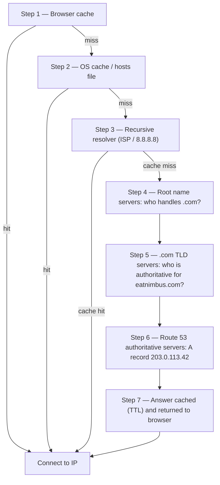

# অধ্যায় ১২: ইন্টারনেট আপনাকে কীভাবে খুঁজে পায়

Maya তার browser-এ আরো একবার `nimbus-alb-123456789.us-west-2.elb.amazonaws.com` refresh করল, তারপর পিছনে হেলান দিয়ে ছাদের দিকে তাকাল। Page লোড হলো। অ্যাপ কাজ করল। কিন্তু প্রতিবার সে একজন রেস্তোরাঁ অংশীদারের সাথে link শেয়ার করল, সে একটি ছোট বিব্রতবোধ অনুভব করল যা সে ঠিক নাম দিতে পারল না।

সেই URL ছিল একটি প্রযুক্তিগত শিল্পকর্ম, একটি পণ্য নয়।

---

*গত অধ্যায়ের network redesign ভালোভাবে গিয়েছিল। প্রতিটি resource সঠিক জায়গায় ছিল — load balancer public subnet-এ, ডেটাবেস private subnet-এ locked। অবকাঠামো নিরাপদ এবং সঠিকভাবে segmented ছিল। কিন্তু Nimbus যখন তার প্রথম public launch-এর জন্য প্রস্তুত হচ্ছিল, একটি নতুন সমস্যা দেখা দিয়েছিল: AWS স্বয়ংক্রিয়ভাবে assign করা load balancer URL একটি system identifier-এর মতো দেখাচ্ছিল, এমন একটি পণ্যের মতো নয় যা মানুষ বিশ্বাস করবে। তাদের একটি প্রকৃত domain name দরকার ছিল। এবং কেউ `eatnimbus.com` টাইপ করার মুহূর্ত এবং page দেখা যাওয়ার মুহূর্তের মধ্যে কী ঘটেছিল তা বুঝতে হবে।*

---

Nimbus চলছিল। Load balancer-এর একটি public IP ছিল। EC2 instance-এর একটি private IP ছিল। ডেটাবেস private subnet-এ locked ছিল। Priya network diagram-এর দিকে অনুমোদনসূচকভাবে মাথা নেড়েছিল।

Tom load balancer URL দেখল: `nimbus-alb-123456789.us-west-2.elb.amazonaws.com`।

"গ্রাহকরা কি এটা তাদের browser-এ টাইপ করে?" সে জিজ্ঞেস করল।

"এটা AWS স্বয়ংক্রিয়ভাবে assign করে," Maya বলল।

"আমি এটা একটি business card-এ লিখব না।"

"আমিও না।"

তাদের একটি domain name দরকার ছিল। তারা একটি domain registrar থেকে `eatnimbus.com` কিনল। এখন তাদের সেই নাম তাদের AWS অবকাঠামোর সাথে সংযুক্ত করতে হবে।

"ইন্টারনেট কীভাবে জানবে যে `eatnimbus.com` মানে us-west-2-এর load balancer?" Leo জিজ্ঞেস করল।

ভালো প্রশ্ন, Leo।

**Phone Book উপমা**

Smartphone-এর আগে, প্রতিটি শহরে একটি phone book ছিল। আপনি "Mario's Pizza"-তে পৌঁছাতে চাইলে, আপনি তাদের ফোন নম্বর মুখস্থ করতেন না — আপনি নাম দেখতেন, নম্বর পেতেন এবং call করতেন।

ইন্টারনেটের নিজস্ব phone book আছে: **Domain Name System (DNS)**।

DNS human-readable নাম (যেমন `eatnimbus.com`) machine-readable IP address-এ (যেমন `203.0.113.42`) translate করে। প্রতিবার আপনি একটি ওয়েবসাইট visit করলে, আপনার কম্পিউটার নীরবে DNS-এ domain name look up করে এবং connect করার IP address পায়।

আপনি আপনার সার্ভারের IP address পরিবর্তন করলে, আপনি DNS record আপডেট করবেন — phone book-এ আপনার নম্বর পরিবর্তন করার মতো — এবং ইন্টারনেট আপনাকে আপনার নতুন অবস্থানে খুঁজে পাবে।

**সম্পূর্ণ DNS Resolution যাত্রা**

"কিন্তু lookup আসলে *কীভাবে* কাজ করে?" Leo জিজ্ঞেস করল। "যেমন, ধাপে ধাপে। আমার browser `eatnimbus.com` নাম জানে। এরপর কী হয়?"

বেশিরভাগ ডকুমেন্টেশন এটি এড়িয়ে যায়। এটা গুরুত্বপূর্ণ।

আপনার browser যখন `eatnimbus.com` resolve করতে হয়, এখানে প্রতিটি hop, ক্রমানুসারে:

**ধাপ ১ — Browser cache**: Browser চেক করে এটি সম্প্রতি এই নাম ইতিমধ্যে resolve করেছে কিনা। হ্যাঁ হলে, এটি cached IP ব্যবহার করে। না হলে, চালিয়ে যান।

**ধাপ ২ — OS cache / local resolver**: আপনার operating system তার নিজস্ব DNS cache এবং local `hosts` ফাইল চেক করে। পাওয়া গেলে, সম্পন্ন। না হলে, এটি আপনার configured DNS resolver-এ forward করে — সাধারণত আপনার ISP-র বা 8.8.8.8-এর মতো একটি public।

**ধাপ ৩ — Recursive resolver**: Recursive resolver (আপনার ISP বা Google-এর 8.8.8.8) হলো কর্মী। এরও একটি cache আছে। এটি উত্তর জানলে, তাৎক্ষণিকভাবে ফেরত দেয়। না হলে, এটি প্রকৃত resolution chain শুরু করে।

**ধাপ ৪ — Root name server**: Recursive resolver 13টি root name server cluster-এর একটির সাথে যোগাযোগ করে (বিশ্বব্যাপী deploy করা)। Root server জানে না `eatnimbus.com` কোথায়। কিন্তু এটি জানে কে `.com` domain পরিচালনা করে — `.com` TLD server। এটি তাদের address ফেরত দেয়।

**ধাপ ৫ — TLD (Top Level Domain) name server**: Recursive resolver `.com` TLD server-এর সাথে যোগাযোগ করে। TLD server-ও জানে না `eatnimbus.com` কোথায়। কিন্তু তারা জানে কোন name server `eatnimbus.com`-এর জন্য authoritative — যে server গুলি আসলে DNS record ধরে রাখে। তারা সেই address ফেরত দেয়।

**ধাপ ৬ — Authoritative name server**: Recursive resolver Route 53-এর name server-এর সাথে যোগাযোগ করে — `eatnimbus.com`-এর জন্য authoritative name server। Route 53-এর কাছে প্রকৃত record আছে। এটি A record ফেরত দেয়: `eatnimbus.com → 203.0.113.42`। এই উত্তরটি authoritative — এটা প্রকৃত উত্তর, cached একটি নয়।

**ধাপ ৭ — Response cached এবং returned**: Recursive resolver record-এর TTL (Time-To-Live)-এর সময়কালের জন্য উত্তর cache করে। এটি আপনার browser-এ IP ফেরত দেয়। আপনার browser এটি cache করে। আপনার browser connect করে।



"একটি IP address খুঁজতে সেটা সাতটি hop," Tom বলল।

"সাধারণত মোট sub-100 মিলিসেকেন্ড," Priya বলল। "ধাপ ৩ থেকে ৬ প্রতিটি স্তরে আক্রমণাত্মকভাবে cached হয়। জনপ্রিয় domain-এর জন্য, ধাপ ৪ এবং ৫ — root এবং TLD lookup — প্রায়ই সম্পূর্ণ এড়িয়ে যাওয়া হয় কারণ recursive resolver ইতিমধ্যে সেই server cached রেখেছে। পুরো chain সাধারণত 20–40 মিলিসেকেন্ডে চলে।"

"এবং প্রথম lookup-এর পরে, browser cache মানে পরবর্তী অনুরোধ এর সব এড়িয়ে যায়," Leo যোগ করল।

"ঠিক। DNS তাৎক্ষণিক অনুভব হয় কারণ বেশিরভাগ lookup cache hit। পুরো chain শুধু তখনই চলে যখন একটি record নতুন বা এর TTL expire হয়েছে।"

**Route 53-এর সাথে পরিচয়**

Amazon Route 53 হলো AWS-এর managed DNS service। এটিকে Route 53 বলা হয় কারণ port 53 হলো standard DNS port। (কখনো কখনো AWS সরাসরিভাবে জিনিসের নাম দেয়।)

Route 53 বেশ কয়েকটি জিনিস করে:

**Domain registration**: আপনি সরাসরি Route 53-এর মাধ্যমে domain name কিনতে পারেন।

**DNS hosting (hosted zone)**: আপনি আপনার domain-এর জন্য একটি *hosted zone* তৈরি করেন, এবং Route 53 সেই DNS record পরিচালনা করে যা বিশ্বকে বলে আপনাকে কোথায় পাওয়া যাবে।

**Health checking**: Route 53 আপনার endpoint monitor করতে এবং unhealthy endpoint থেকে ট্রাফিক সরিয়ে দিতে পারে।

**Traffic routing policy**: Route 53 সহজ DNS-এর বাইরে একাধিক routing strategy সমর্থন করে — weighted, latency-based, geolocation, failover।

**DNS Record: Phone Book Entry**

একটি DNS record একটি নামকে একটি গন্তব্যে map করে। সবচেয়ে সাধারণ type:

**A record**: একটি নামকে একটি IPv4 address-এ map করে।
`eatnimbus.com → 203.0.113.42`

**AAAA record**: একটি নামকে একটি IPv6 address-এ map করে।

**CNAME record**: একটি নামকে অন্য একটি নামে (alias) map করে।
`www.eatnimbus.com → eatnimbus.com`

**MX record**: domain-এর জন্য কোন server email handle করে তা নির্দিষ্ট করে।

**TXT record**: Arbitrary text সংরক্ষণ করে। সাধারণত domain verification (আপনি domain-এর মালিক প্রমাণ করা) এবং email authentication (SPF, DKIM)-এর জন্য ব্যবহৃত।

Nimbus-এর জন্য, primary setup:

- `eatnimbus.com` → load balancer-এ নির্দেশকারী Alias record
- `www.eatnimbus.com` → `eatnimbus.com`-এ নির্দেশকারী CNAME
- `api.eatnimbus.com` → API load balancer-এ নির্দেশকারী Alias record

"অপেক্ষা করুন," Tom বলল। "Load balancer-এর IP পরিবর্তন হতে পারে। AWS documentation-এ তা বলেছে।"

ভালো ধরা, Tom।

**Alias Record: Dynamic IP-এর AWS সমাধান**

Load balancer, CloudFront distribution এবং S3 ওয়েবসাইটের DNS নাম আছে, static IP address নেই। অন্তর্নিহিত IP পরিবর্তিত হতে পারে।

যদি আপনি একটি load balancer-এর DNS নামে নির্দেশকারী একটি CNAME তৈরি করেন, এটি কাজ করে — কিন্তু DNS standard-এর কারণে আপনি root domain-এ (`eatnimbus.com` `www` ছাড়া) CNAME ব্যবহার করতে পারেন না।

Route 53 এটি **Alias record** দিয়ে সমাধান করে — DNS-এ একটি AWS-নির্দিষ্ট extension। একটি Alias record সরাসরি একটি AWS resource-এ (load balancer, CloudFront distribution, S3 ওয়েবসাইট) একটি নাম map করে, এবং Route 53 স্বয়ংক্রিয়ভাবে dynamic IP resolution সামলায়। Alias record root domain স্তরে ব্যবহার করা যায়। এবং বাইরের পরিষেবায় নিয়মিত DNS query-এর বিপরীতে, AWS resource-এ Alias record query বিনামূল্যে।

"তাহলে আমরা load balancer-এ নির্দেশকারী `eatnimbus.com`-এর জন্য একটি Alias record ব্যবহার করি," Leo নিশ্চিত করল।

"এবং Route 53 যেকোনো মুহূর্তে load balancer যে IP ব্যবহার করছে তা সামলায়," Priya যোগ করল।

"বিনামূল্যে," Tom বলল, হঠাৎ খুব আগ্রহী। সে Route 53 pricing page টানল। "এবং এর বাকিটা?"

"প্রতি hosted zone-এ পঞ্চাশ সেন্ট," Leo বলল। "Plus প্রতি মিলিয়ন DNS query-তে প্রায় চল্লিশ সেন্ট। আমাদের এখনকার ট্রাফিকের জন্য, সম্ভবত মাসে দুই ডলারের নিচে।"

Tom সন্তুষ্ট হয়ে pricing page বন্ধ করল।

**Routing Policy: শুধু "এটা কোথায়?" এর বাইরে**

এখানেই Route 53 আকর্ষণীয় হয়। DNS শুধু একটি lookup service নয় — এটি একটি traffic management সরঞ্জাম হতে পারে।

**Simple routing**: একটি record, একটি গন্তব্য। Standard DNS।

**Weighted routing**: Weight দ্বারা একাধিক গন্তব্যের মধ্যে ট্রাফিক বিভক্ত করুন। একটি migration-এর সময় নতুন সার্ভারে ৯০% পাঠান, পুরানো সার্ভারে ১০%। নতুন সার্ভারে আপনার আস্থা না আসা পর্যন্ত weight সামঞ্জস্য করুন, তারপর ১০০%-এ switch করুন।

**Latency-based routing**: ব্যবহারকারীদের তাদের জন্য সর্বনিম্ন latency-সহ AWS region-এ route করুন। Seattle-এর একজন ব্যবহারকারী `us-west-2`-এ route হয়। Tokyo-র একজন ব্যবহারকারী `ap-northeast-1`-এ route হয়। একই domain name, ভিন্ন গন্তব্য।

**Geolocation routing**: ব্যবহারকারীর ভৌগোলিক অবস্থানের উপর ভিত্তি করে route করুন। সমস্ত European ব্যবহারকারী `eu-west-1`-এ যায়। সমস্ত North American ব্যবহারকারী `us-east-1`-এ যায়। ডেটা সার্বভৌমত্ব (EU ব্যবহারকারীর ডেটা EU region-এ রাখা) বা content customization (ভাষা, মুদ্রা)-র জন্য দরকারী। Routing সিদ্ধান্ত hard boundary ব্যবহার করে — একজন ব্যবহারকারী একটি দেশে, একটি মহাদেশে, বা একটি US state-এ, এবং সেখানেই তারা যায়।

**Geoproximity routing**: ব্যবহারকারীদের ভৌগোলিক অবস্থানের উপর ভিত্তি করে ট্রাফিক route করে *এবং* আপনাকে একটি **bias** মান দিয়ে সেই সিদ্ধান্ত সামঞ্জস্য করতে দেয়। একটি positive bias একটি resource-এ route হওয়া ভৌগোলিক এলাকা সম্প্রসারিত করে — আরো ট্রাফিক আকর্ষণ করে। একটি negative bias এটি সংকুচিত করে। Geolocation-এর বিপরীতে, যা hard দেশ এবং মহাদেশ boundary ব্যবহার করে, geoproximity ধারাবাহিক: একটি ছোট bias মান কোনো fixed line না redraw করে ধীরে ধীরে এক region থেকে অন্য region-এ ট্রাফিক shift করতে পারে।

যে দৃশ্যকল্প দুটিকে আলাদা করে: একটি কোম্পানি যদি `us-east-1` থেকে `us-west-2`-তে ধীরে ধীরে migrate করছে এবং ক্রমান্বয়ে পশ্চিম দিকে ট্রাফিক shift করতে চায় — একটি switch flip না করে, কিন্তু সময়ের সাথে এটি dial করতে — west endpoint-এ একটি বাড়তে থাকা positive bias সহ geoproximity হলো সঠিক সরঞ্জাম। Geolocation হয় সমস্ত West Coast ব্যবহারকারীকে Oregon-এ route করবে বা করবে না; এর কোনো dial নেই। জানুয়ারি 2024 থেকে, geoproximity DNS record-এ সরাসরি একটি নিয়মিত routing policy হিসেবে পাওয়া যায় (Console, API, CLI) — এর আর Route 53 Traffic Flow-এর প্রয়োজন নেই, যদিও এটি সেখানেও উপলব্ধ থাকে।

**Failover routing**: একটি primary এবং একটি secondary endpoint মনোনীত করুন। Primary Route 53-এর health check ব্যর্থ হলে, ট্রাফিক স্বয়ংক্রিয়ভাবে secondary-তে redirect হয়। এটি disaster recovery-এর DNS layer।

"দাঁড়াও — কিন্তু আমাদের যদি ইতিমধ্যে Multi-AZ থাকে তাহলে আমরা একটি দ্বিতীয় region-এ failover routing *কেন* সেট আপ করব?" Maya জিজ্ঞেস করল। "Multi-AZ কি failure সামলানোর কথা নয়?"

ভালো প্রশ্ন। Multi-AZ একটি region-এর মধ্যে একটি একক Availability Zone-এর failure থেকে রক্ষা করে — একটি data center ডাউন হলে, অন্য একটি AZ-এর standby দায়িত্ব নেয়। কিন্তু একটি সম্পূর্ণ AWS region যদি unavailable হয়ে যায়? অথবা একটি region-wide service disruption হলে? DNS failover routing একটি ভিন্ন স্তরে কাজ করে: যখন সেই region-এর health check ব্যর্থ হয় তখন এটি একটি সম্পূর্ণ region থেকে ট্রাফিক সরিয়ে route করে। Multi-AZ হলো intra-region resilience। DNS failover হলো inter-region resilience।

**Multivalue answer routing**: একটি query-এর জন্য আটটি পর্যন্ত healthy IP address return করুন, client-কে বেছে নিতে দিন। একাধিক সার্ভার জুড়ে ট্রাফিক বিতরণের জন্য একটি load balancer-এর একটি সহজ বিকল্প।

"তাহলে Route 53 শুধু একটি phone book নয়," Maya বলল। "এটি একটি smart phone book যা আপনি কোথা থেকে call করছেন তার উপর ভিত্তি করে call route করতে পারে।"

"এবং নম্বর unhealthy হলে আপনাকে disconnect করতে পারে," Priya যোগ করল।

---

**Latency Routing Plus Health Check: একটি চিন্তা পরীক্ষা**

Priya whiteboard-এ একটি দৃশ্যকল্প আঁকল। ধরুন Nimbus-এর East Coast ব্যবহারকারী ভিত্তি বাড়তে থাকল, এবং একদিন দল `us-east-1` (Northern Virginia)-তে একটি lightweight stack দাঁড় করাল — একটি পূর্ণ multi-region active-active setup নয়, যা ব্যয়বহুল এবং জটিল হবে, কিন্তু একটি load balancer এবং static content ও browsing page পরিবেশন করা read-only EC2 instance-এর একটি set। অর্ডার এখনো `us-west-2`-এর primary ডেটাবেসে পশ্চিমে যেত। Browse ট্রাফিক — যা অনুরোধের সত্তর শতাংশ ছিল — যেকোনো উপকূল থেকে পরিবেশন করা যেত।

Browse endpoint-এর জন্য Route 53 configuration এমন দেখাত:

```
browse.eatnimbus.com
  → Latency record: us-east-1 ALB (with health check, set-identifier "east")
  → Latency record: us-west-2 ALB (with health check, set-identifier "west")
```

(লক্ষ্য করুন record-টি একটি *hostname*, `browse.eatnimbus.com` — DNS নাম route করে, কখনো URL path নয়। `/browse`-এর মতো path-based routing হলো load balancer-এর কাজ, Route 53-এর নয়।)

Latency routing দিয়ে, Seattle-এর একজন ব্যবহারকারী `us-west-2` endpoint-এ resolve হত। Boston-এর একজন ব্যবহারকারী `us-east-1`-এ যেত। Route 53 তার অবকাঠামো থেকে প্রতিটি region-এ latency ক্রমাগত measure করে এবং প্রতি ব্যবহারকারীর জন্য দ্রুততরটি বেছে নেয়।

"কিন্তু west region-এর সমস্যা হলে কী?" Tom জিজ্ঞেস করল। "Seattle-এর আমাদের browsing ব্যবহারকারীরা আটকে যাবে।"

"সেটাই health check-এর জন্য," Priya বলল। "প্রতিটি latency record তার নিজ নিজ load balancer-এ একটি health check পায়। `us-west-2` health check পরপর তিনটি check ব্যর্থ হলে, Route 53 সেই record return করা বন্ধ করে — এমনকি যে ব্যবহারকারীদের জন্য Oregon সাধারণত দ্রুত হত তাদের জন্যও। Oregon recover না হওয়া পর্যন্ত Seattle ব্যবহারকারীরা পূর্বে route হয়।"

"তাহলে latency routing নির্ধারণ করে কোন region সাধারণত পছন্দ করা হয়," Maya বলল, "এবং পছন্দের region ডাউন হলে health check সেই পছন্দ override করে?"

"ঠিক। Latency policy স্বাভাবিক অবস্থায় বিজয়ী বেছে নেয়। Health check একটি বিজয়ীকে সরায় যা কাজ করা বন্ধ করেছে।"

Leo failure দৃশ্যকল্প নিয়ে ভাবল। "এবং সেই record-এ TTL?"

"ষাট সেকেন্ড," Priya বলল। "এটি trip করতে ত্রিশ-সেকেন্ড অন্তরে তিনটি ব্যর্থ check — failure detect করতে নব্বই সেকেন্ড পর্যন্ত — তারপর DNS resolver-দের পরিবর্তন তুলে নিতে ষাট সেকেন্ড পর্যন্ত।"

"সবচেয়ে খারাপ ক্ষেত্রে আড়াই মিনিট," Leo বলল।

"এজন্যই আপনি এটির গুরুত্ব দেওয়ার আগে TTL কমান, পরে নয়।"

এই সংমিশ্রণ — প্রতিটি record-এ health check সহ latency routing — multi-region deployment-এর জন্য সবচেয়ে শক্তিশালী Route 53 configuration-গুলির একটি। ব্যবহারকারীরা সবসময় দ্রুততম healthy region-এ যায়। একটি region-এর সমস্যা হলে সিস্টেম self-heal করে। এবং পুরোটাই DNS: কোনো অতিরিক্ত অবকাঠামো নেই, কোনো proxy server নেই, region-এর মধ্যে কোনো load balancer নেই।

---

**Health Check Failure ঘটনা**

Nimbus-এর staging environment তাদের failover routing-এর একটি দুর্ঘটনাজনিত প্রদর্শন দিয়েছিল।

তারা একটি test হিসেবে staging load balancer-এ Route 53 health check configure করেছিল — প্রতি ৩০ সেকেন্ডে `/health` endpoint check করছিল। এক শুক্রবার বিকেলে, Leo staging-এ একটি deployment push করল যাতে একটি bug ছিল: health endpoint 500 error ফেরত দিতে শুরু করল। এটা তার local test পাস করেছিল কিন্তু সার্ভারে ভেঙেছিল।

Route 53 failure লক্ষ্য করল। পরপর তিনটি ব্যর্থ check-এর পরে, এটি endpoint-কে unhealthy চিহ্নিত করল। Failover record সক্রিয় হলো, staging ট্রাফিককে "Maintenance in progress" বলা একটি read-only fallback page-এ route করল।

Leo-র প্রথম alert ছিল একজন QA engineer-এর একটি Slack message: "Staging maintenance page দেখাচ্ছে।"

Leo deploy চেক করল। 500 error log-এ স্পষ্ট ছিল। সে deployment roll back করল। Health endpoint 200 ফেরত দেওয়ার ৯০ সেকেন্ডের মধ্যে, Route 53 check পুনঃমূল্যায়ন করল, পরপর তিনটি সাফল্য দেখল, এবং staging load balancer-এ ট্রাফিক ফিরিয়ে দিল। Maintenance page অদৃশ্য হলো।

Maintenance page-এ মোট সময়: সাত মিনিট।

"এটা সিস্টেম সঠিকভাবে কাজ করছিল," Priya বলল।

"আমি জানি," Leo বলল। "ভয়ের অংশটা হলো health check ছাড়া কী ঘটত তা ভাবা। 500 error প্রকৃত ব্যবহারকারীদের কাছে যেত।"

"Production-এ, health check secondary region বা static error page-এ failover করত। ব্যবহারকারীরা error-এর পরিবর্তে একটি রক্ষণাবেক্ষিত অভিজ্ঞতা দেখত।"

"Failover আসলে কতক্ষণ লাগে?" Maya জিজ্ঞেস করল। "Health check ব্যর্থ হওয়া থেকে DNS ভিন্নভাবে routing শুরু করা পর্যন্ত?"

"Health check interval ডিফল্টরূপে ৩০ সেকেন্ড। Failover trip করতে পরপর তিনটি failure। সমস্যা detect করতে নব্বই সেকেন্ড পর্যন্ত। তারপর DNS TTL — এটা ৬০ সেকেন্ড হলে, propagation আরো এক মিনিট।"

"তাহলে সবচেয়ে খারাপ ক্ষেত্রে, প্রায় তিন মিনিট?"

"প্রায় সেটা। এজন্যই আপনি গুরুত্বপূর্ণ record-এ আপনার TTL কম চান, এবং আপনার বাজেট যতটা অনুমতি দেয় তত ছোট health check interval চান।"

---

**Health Check: Failure-এর চারপাশে Routing**

"আর কেউ যদি ভাঙার চেষ্টা করে?" Priya বলল। "DNS public। যে কেউ `eatnimbus.com` কোথায় নির্দেশ করে তা look up করতে পারে। এর মানে একজন আক্রমণকারী ঠিক জানে কোন IP target করতে হবে।"

"সেটা সত্য," Leo বলল। "কিন্তু তারা যে IP খুঁজে পায় তা হলো load balancer-এর IP। ALB একমাত্র জিনিস যার একটি public address আছে। এর পিছনের সবকিছু — EC2, RDS, ElastiCache — private subnet-এ। DNS তাদের সদর দরজা বলে। এটা তাদের বলে না পিছনে কী আছে।"

Route 53 health check দিয়ে আপনার endpoint monitor করতে পারে। একটি endpoint ব্যর্থ হলে, Route 53 পারে:

- DNS response থেকে এটি সরিয়ে দিতে (সেখানে ট্রাফিক পাঠানো বন্ধ করতে)
- একটি backup endpoint-এ failover trigger করতে
- CloudWatch-এর মাধ্যমে একটি alert পাঠাতে

Health check হলো DNS routing এবং প্রকৃত অ্যাপ্লিকেশন health-এর মধ্যে সংযোগ। একটি failover configuration-এ: Route 53 প্রতি ৩০ সেকেন্ডে primary endpoint monitor করে। পরপর তিনটি check ব্যর্থ হলে, Route 53 secondary endpoint-এর address return করা শুরু করে। এই সংখ্যাগুলির কোনোটিই fixed নয়: ৩০ সেকেন্ড হলো standard interval (একটি paid "fast" বিকল্প প্রতি ১০ সেকেন্ডে check করে), এবং failure threshold ডিফল্টরূপে পরপর ৩টি check কিন্তু 1 থেকে 10 পর্যন্ত configurable।

এটি তাৎক্ষণিক নয় — DNS-এর propagation time আছে। Route 53 একটি DNS record পরিবর্তন করলে, বিশ্বজুড়ে DNS resolver-গুলিকে পরিবর্তন তুলে নিতে হবে, যা TTL সেটিংয়ের উপর নির্ভর করে সেকেন্ড থেকে মিনিট সময় নিতে পারে।

**TTL: DNS Cache**

DNS response একাধিক স্তরে cached হয় — আপনার router-এ, আপনার ISP-তে, আপনার browser-এ। একটি DNS record-এ **TTL (Time-To-Live)** cache-গুলিকে বলে পুনরায় check করার আগে কতক্ষণ উত্তর মনে রাখবে।

High TTL (১ ঘণ্টা বা তার বেশি): কম DNS query, Route 53-এ কম লোড, কিন্তু পরিবর্তন propagate হতে বেশি সময় লাগে।

Low TTL (৬০ সেকেন্ড বা তার কম): পরিবর্তন দ্রুত propagate হয়, কিন্তু আরো DNS query প্রয়োজন।

একটি পরিকল্পিত migration-এর আগে (একটি নতুন সার্ভার নির্দেশ করতে DNS আপডেট করা), একদিন আগে আপনার TTL ৬০ সেকেন্ডে কমিয়ে দিন। তারপর আপনি পরিবর্তন করলে, এটি প্রায় এক মিনিটে propagate হয়। Migration-এর পরে, এটি সাধারণ মানে ফিরিয়ে দিন।

"আমি ইতিমধ্যে এটা deploy করেছি — ওহ।" Leo TTL কমানোর আগে DNS record আপডেট করেছিল। সে তার ভুল বুঝতে পেরে গণনা শুরু করেছিল: পুরানো TTL ছিল এক ঘণ্টা। কিছু ব্যবহারকারী পরবর্তী ষাট মিনিটের জন্য পুরানো সার্ভার পাবে।

"আমরা যদি শুধু migration-এর সময় এটা কমাই এবং আগে না করি," Leo ধীরে ধীরে বলল, "পুরানো TTL মানে কিছু ব্যবহারকারী এক ঘণ্টা পুরানো সার্ভার দেখবে।"

"ঠিক," Priya বলল। "DNS migration-এ migration-এর আগে পরিকল্পনা প্রয়োজন, শুধু সময়কালে নয়।"

আপনি হয়তো ভাবছেন: TTL এক ঘণ্টায় সেট করা থাকলে, এর মানে কি প্রতিটি ব্যবহারকারী একটি DNS পরিবর্তনের পরে নতুন সার্ভার দেখার আগে পুরো এক ঘণ্টা অপেক্ষা করবে? ঠিক তা নয়। TTL মানে resolver TTL expire না হওয়া পর্যন্ত পুনরায় check করবে না। একজন ব্যবহারকারীর DNS resolver যদি 55 মিনিট আগে 1-ঘণ্টার TTL সহ পুরানো মান cache করে থাকে, তারা 5 মিনিটে নতুন মান পাবে। তারা যদি 5 মিনিট আগে cache করে থাকে, তারা 55 মিনিট অপেক্ষা করবে। গড়ে, ব্যবহারকারীরা TTL সময়কালের অর্ধেকের মধ্যে পরিবর্তন দেখে। এজন্যই আগে থেকে TTL কমানো এত গুরুত্বপূর্ণ: এটি পরিবর্তন ঘটার আগে সবচেয়ে খারাপ-ক্ষেত্রের propagation window সংকুচিত করে।

---

**Private Hosted Zone: Internal DNS**

Public domain live হওয়ার দুই সপ্তাহ পরে Priya একটি নতুন প্রয়োজনীয়তা তুলল।

"আমাদের EC2 instance-কে ডেটাবেসে পৌঁছাতে হবে," সে বলল। "এখন তারা RDS endpoint DNS নাম ব্যবহার করছে — `nimbus-prod.abc123.us-west-2.rds.amazonaws.com`। এটা কাজ করে, কিন্তু এটা একটা public DNS নাম। আমরা যদি কখনো আমাদের ডেটাবেস configuration পরিবর্তন করতে চাই, সমস্ত application config ফাইল আপডেট করতে হবে।"

"আমরা একটি private DNS নাম ব্যবহার করতে পারি," Leo বলল। "যেমন `db.nimbus.internal`। আমাদের পরিষেবা internally যা ব্যবহার করে তা বর্তমান ডেটাবেস endpoint যাই হোক না কেন তাতে map করে।"

"ঠিক। Route 53 private hosted zone।"

একটি **private hosted zone** হলো একটি DNS domain যা শুধুমাত্র আপনার VPC-এর ভেতরে resolve হয়। `nimbus.internal`-এর জন্য external DNS query কোনো response পায় না। কিন্তু VPC-এর ভেতর থেকে, `db.nimbus.internal` RDS endpoint-এ resolve হয়।

তারা এটি সেট আপ করল:

- Private hosted zone: `nimbus.internal`
- CNAME record: `db.nimbus.internal → nimbus-prod.abc123.us-west-2.rds.amazonaws.com`
- CNAME record: `cache.nimbus.internal → nimbus-cache.abc123.usw2.cache.amazonaws.com`
- A record: `api.nimbus.internal → 10.0.10.5` (internal EC2 IP — A record নামকে IP address-এ map করে; CNAME নামকে অন্য নামে map করে। এখানে ঠিক আছে কারণ এই instance একটি static private IP রাখে; Auto Scaling-এর পিছনে যেকোনো কিছুর জন্য আপনি পরিবর্তে একটি load balancer-এ point করবেন)

এখন application config পড়ত:

```
DATABASE_HOST=db.nimbus.internal
CACHE_HOST=cache.nimbus.internal
```

তারা যখন একটি নতুন RDS instance-এ migrate করল, তারা একটি DNS record আপডেট করল। কোনো application deployment প্রয়োজন হলো না।

"এজন্যই একটি ডেটাবেস migration-এর সময় private DNS গুরুত্বপূর্ণ," Priya বলল। "আপনি `db.nimbus.internal`-কে নতুন endpoint-এ নির্দেশ করতে আপডেট করেন। ট্রাফিক shift হয়। TTL window-এর সময় পুরানো endpoint available থাকে। কোনো application config পরিবর্তন নেই।"

**Internal DNS Debugging গল্প**

তিন সপ্তাহ পরে, Leo একটি নতুন পরিষেবা deploy করল — একটি background worker — এবং এটি ডেটাবেসে পৌঁছাতে পারল না। Worker একই VPC-তে ছিল, API server-এর মতো একই private subnet-এ। API server ডেটাবেসে পৌঁছাতে পারত। Worker পারল না।

সে security group চেক করল। Worker-এর security group-এ PostgreSQL-এর জন্য একটি outbound rule ছিল। ডেটাবেস security group-এ worker-এর security group থেকে একটি inbound rule ছিল। সবকিছু সঠিক দেখাচ্ছিল।

সে worker instance থেকে `nslookup db.nimbus.internal` চালাল।

কোনো response নেই।

"DNS lookup ব্যর্থ হচ্ছে," সে Priya-কে বলল।

সে worker instance-এর VPC configuration দেখল। "Worker আসলে কোন VPC-তে? Private hosted zone VPC-এর সাথে যুক্ত — instance যদি একটি যুক্ত VPC-তে না থাকে, zone-টি কেবল এর জন্য বিদ্যমান নেই।"

"এটা main VPC-তে। বাকি সবকিছুর মতো।"

"তাই কি?"

Private hosted zone অবশ্যই তারা যে প্রতিটি VPC পরিবেশন করে তার সাথে স্পষ্টভাবে যুক্ত করতে হবে — association প্রতি VPC-তে, কখনো প্রতি subnet-এ নয়। Priya zone তৈরি করার সময় main VPC যুক্ত করেছিল। কিন্তু Leo দুর্ঘটনাক্রমে একটি ভিন্ন পরীক্ষার জন্য তৈরি করা একটি test VPC-তে worker deploy করেছিল। ভিন্ন VPC। Private hosted zone-এর সাথে যুক্ত নয়।

"Worker ভুল VPC-তে," Priya বলল।

"আমি ইতিমধ্যে এটা deploy করেছি — ওহ।" Leo worker-কে সঠিক VPC-তে সরাল। DNS resolve হলো। Worker ডেটাবেসে connect হলো।

"একটি VPC," Leo বলল, একটি নোট করে। "যদি না আমাদের একাধিকের কারণ থাকে।"

---

**DNSSEC: DNS Response Authenticate করা**

"আমরা কি DNS spoofing নিয়ে ভেবেছি?" Priya জিজ্ঞেস করল। "কেউ যদি আমাদের DNS query intercept করে এবং একটি fake IP ফেরত দেয়? আমাদের ব্যবহারকারীর browser আমাদের পরিবর্তে আক্রমণকারীর সার্ভারে connect হবে।"

**DNSSEC (DNS Security Extensions)** এটি DNS record cryptographically সাইন করে সমাধান করে। যখন একটি DNS response-এ একটি DNSSEC signature অন্তর্ভুক্ত থাকে, resolver যাচাই করতে পারে যে response-টি authoritative name server থেকে এসেছে এবং এটি tamper করা হয়নি।

Route 53 public hosted zone-এর জন্য DNSSEC signing সমর্থন করে। প্রক্রিয়াটি জড়িত:

1. Route 53-এ hosted zone-এ DNSSEC সক্ষম করা
2. Route 53 KMS-এ সংরক্ষিত একটি key signing key (KSK) তৈরি করে
3. Route 53 zone signing key দিয়ে সমস্ত record সাইন করে
4. আপনি parent domain registrar (.com TLD)-এ একটি DS (Delegation Signer) record যোগ করেন
5. DNSSEC সমর্থনকারী resolver এখন response-এর সত্যতা যাচাই করতে পারে

"DNS spoofing কতটা সাধারণ?" Leo জিজ্ঞেস করল।

"Public internet-এ, বিরল কিন্তু সম্ভব," Priya বলল। "বেশিরভাগ ISP resolver আজ DNSSEC validation সমর্থন করে। DNSSEC সক্ষম করা কিছু খরচ করে না এবং একটি অর্থবহ সত্যতার স্তর যোগ করে।"

"মাসে এর খরচ কত?" Tom জিজ্ঞেস করল।

"DNSSEC signing সক্ষম করা নিজেই Route 53-এ বিনামূল্যে," Priya বলল। "একমাত্র প্রকৃত খরচ হলো KMS key যা key-signing key ধরে রাখে: $1/মাস, plus KMS API call — এবং একটি key একাধিক hosted zone জুড়ে শেয়ার করা যায়। DNS hijacking আক্রমণের বিরুদ্ধে সুরক্ষা আমাদের স্কেলে কার্যকরভাবে বিনামূল্যে।"

Tom দুপুরের খাবারের আগে এটি সক্ষম করল।

---

**Route 53 Resolver: Hybrid DNS**

Nimbus যখন অবশেষে একটি VPN-এর মাধ্যমে তাদের AWS VPC-কে তাদের on-premises development network-এর সাথে সংযুক্ত করল, একটি নতুন সমস্যা দেখা দিল: on-premises server-কে AWS private DNS নাম (যেমন `db.nimbus.internal`) resolve করতে হবে, এবং AWS resource-কে on-premises hostname (যেমন `jenkins.corp.nimbus.local`) resolve করতে হবে।

DNS resolution ডিফল্টরূপে network boundary অতিক্রম করে না। AWS resource Route 53 Resolver (প্রতিটি VPC-তে অন্তর্নির্মিত) ব্যবহার করে DNS resolve করে। On-premises server তাদের নিজস্ব DNS server ব্যবহার করে। কেউই অন্যের record দেখতে পারে না।

**Route 53 Resolver Endpoint** এই ব্যবধান পূরণ করে:

**Inbound endpoint**: On-premises DNS server AWS-hosted DNS zone-এর জন্য query আপনার VPC-এর একটি inbound endpoint IP-তে forward করতে পারে। Route 53 Resolver query সামলায় এবং ফলাফল ফেরত দেয়।

**Outbound endpoint**: যখন EC2 instance-কে on-premises hostname resolve করতে হয়, Resolver সেই query outbound endpoint-এর মাধ্যমে on-premises DNS server-এ forward করে।

"তাহলে এটা একটা translation service-এর মতো," Maya বলল। "আপনার AWS DNS এবং আপনার on-premises DNS সরাসরি একে অপরের সাথে কথা বলে না। Resolver endpoint মধ্যস্থতাকারী হিসেবে কাজ করে।"

"ঠিক। আপনার on-premises server এখন `db.nimbus.internal` resolve করতে পারে। আপনার EC2 instance `jenkins.corp.nimbus.local` resolve করতে পারে। উভয় পক্ষ উভয় বিশ্বের DNS নাম দেখে।"

Nimbus-এর জন্য, এটি প্রাসঙ্গিক হলো যখন development team তাদের office থেকে AWS-এ একটি staging environment-এর বিরুদ্ধে integration test চালাতে চাইল। Resolver endpoint ছাড়া, তারা ম্যানুয়ালি hosts ফাইল সম্পাদনা করত। এগুলির সাথে, internal DNS শুধু VPN জুড়ে কাজ করত।

Resolver endpoint-এর architecture:

- **Inbound endpoint**: আপনার VPC-তে দুটি ভিন্ন AZ-তে তৈরি দুটি ENI (Elastic Network Interface)। প্রতিটি একটি private IP পায়। আপনি আপনার on-premises DNS server configure করেন আপনার AWS-hosted zone-এর জন্য query এই IP-তে forward করতে। ট্রাফিক আপনার VPN বা Direct Connect-এর মধ্য দিয়ে যায়।
- **Outbound endpoint**: দুটি AZ-তে দুটি ENI। আপনি forwarding rule তৈরি করেন: "`corp.nimbus.local`-এর জন্য query এই on-premises DNS server IP-তে যায়।" EC2 instance স্বয়ংক্রিয়ভাবে Resolver ব্যবহার করে, যা আপনার forwarding rule consult করে এবং query on-premises পাঠায়।

"প্রতি endpoint-এ দুটি ENI কেন?" Leo জিজ্ঞেস করল।

"High availability," Priya বলল। "একটি AZ network connectivity হারালে, অন্য endpoint IP এখনো কাজ করে। NAT Gateway-এর মতো একই নীতি।"

"মাসে এর খরচ কত?" Tom জিজ্ঞেস করল।

Resolver endpoint প্রতি ঘণ্টায় প্রায় $0.125 **প্রতি elastic network interface** খরচ করে, এবং প্রতিটি endpoint-এর availability-র জন্য কমপক্ষে দুটি ENI প্রয়োজন — তাই একটি বাস্তবসম্মত floor প্রতি endpoint-এ মাসে প্রায় $180, plus প্রতি মিলিয়ন DNS query-তে $0.40। internal নাম resolve করতে hybrid DNS ব্যবহারকারী একটি দলের জন্য, খরচ সামান্য — এবং একাধিক developer machine এবং CI/CD সিস্টেম জুড়ে hosts ফাইল বজায় রাখার প্রয়োজন নির্মূল করে।

"আমরা শুধু hosts ফাইলে hostname রাখতে পারি," Leo প্রস্তাব করল।

"প্রতিটি developer machine-এ, প্রতিটি CI runner-এ, প্রতিটি নতুন onboarding-এ," Priya বলল। "প্রতিবার যেকোনো কিছু পরিবর্তন হলে।"

"Endpoint-টা মূল্যবান," Leo বলল।

"হ্যাঁ।"

## শক্তি এবং সীমাবদ্ধতা

**Route 53 সঠিক পছন্দ যার জন্য**: সম্পূর্ণ AWS-এর ভেতরে domain name নিবন্ধন এবং পরিচালনা; একাধিক endpoint জুড়ে latency, geolocation বা weighted distribution-এর উপর ভিত্তি করে ট্রাফিক routing; region-এর মধ্যে বা একটি primary এবং একটি disaster-recovery endpoint-এর মধ্যে health-check-based failover; alias record-এর মাধ্যমে অন্যান্য AWS পরিষেবার সাথে DNS integrate করা; internal service discovery-র জন্য private hosted zone।

**Route 53 যখন আপনার প্রয়োজন নয়**: Route 53 একটি DNS service, একটি load balancer নয়। একটি region-এর মধ্যে একাধিক সার্ভার বা container-এর মধ্যে ট্রাফিক বিতরণ করতে হলে, একটি Application Load Balancer ব্যবহার করুন — Route 53 একটি load balancer যেভাবে পারে সেভাবে connection স্তরে weighted round-robin করতে পারে না। Region জুড়ে latency-based routing খরচ এবং পরিচালনামূলক জটিলতা যোগ করে যা শুধুমাত্র তখনই অর্থপূর্ণ হয় যখন আপনার ব্যবহারকারীরা সত্যিই বৈশ্বিকভাবে বিতরণ করা এবং millisecond conversion-এর জন্য গুরুত্বপূর্ণ। বেশিরভাগ single-region অ্যাপ্লিকেশনের জন্য, একটি ALB-তে নির্দেশকারী একটি একক Alias record-ই আপনার যে Route 53 configuration প্রয়োজন।

## সারসংক্ষেপ

`nimbus-alb-123456789.us-west-2.elb.amazonaws.com` থেকে `eatnimbus.com`-এ যাওয়া একটি ছোট জিনিস মনে হয়েছিল। তা ছিল না। DNS হলো সেই address system যার উপর পুরো ইন্টারনেট চলে, এবং Route 53 আপনাকে সেই system শুধু lookup-এর জন্য নয়, traffic management এবং resilience-এর জন্যও ব্যবহার করার সরঞ্জাম দেয়।

- **DNS** domain name-কে IP address-এ translate করে — ইন্টারনেটের phone book।
- **Route 53** হলো AWS-এর managed DNS service: domain registration, DNS hosting, health check এবং routing policy।
- **A record** নামকে IPv4 address-এ map করে। **CNAME** নামকে অন্য নামে map করে। **Alias record** নামকে AWS resource-এ (load balancer, CloudFront, S3) map করে।
- Root domain এবং dynamic IP সহ resource-এর জন্য CNAME নয়, Alias record ব্যবহার করুন।
- Routing policy সহজ DNS-এর বাইরে যায়: **weighted** (ট্রাফিক বিভাজন), **latency-based** (পারফরম্যান্স), **geolocation** (ডেটা সার্বভৌমত্ব — hard দেশ/মহাদেশ boundary), **geoproximity** (distance-based একটি bias dial সহ — ক্রমান্বয়ে ট্রাফিক shift), **failover** (disaster recovery)।
- **Private hosted zone** VPC resource-এর জন্য internal DNS প্রদান করে — নাম দ্বারা service-to-service যোগাযোগ, hard-coded IP নয়।
- **DNSSEC** record cryptographically সাইন করে, DNS spoofing থেকে রক্ষা করে।
- **Route 53 Resolver Endpoint** hybrid network পূরণ করে — AWS এবং on-premises DNS একে অপরের নাম resolve করতে পারে।

## পরীক্ষার টিপস

*SAA-C03 ডোমেন: Design High-Performing Architectures (ডোমেন ৩, টাস্ক ৩.৪)*

- **Alias বনাম CNAME**: Alias record root domain-এ ব্যবহার করা যায়; CNAME পারে না। AWS resource-এ Alias record বিনামূল্যে; CNAME DNS query-এর দাম আছে। পরীক্ষা যখন একটি load balancer-এ একটি root domain map করার বিষয়ে জিজ্ঞেস করে → Alias record।
- **Routing policy ব্যবহারের ক্ষেত্র** (সাধারণ পরীক্ষার দৃশ্যকল্প):
  - "ধীরে ধীরে একটি নতুন সংস্করণে ট্রাফিক migrate করুন" → Weighted routing
  - "ব্যবহারকারীদের নিকটতম AWS region-এ route করুন" → Latency-based routing
  - "EU ব্যবহারকারীর ডেটা EU region-এ রাখুন" → Geolocation routing
  - "Primary ডাউন হলে স্বয়ংক্রিয় DNS failover" → Health check সহ Failover routing
  - "ধীরে ধীরে একটি নতুন region-এ ট্রাফিক shift করুন" বা "আমাদের EU deployment-এ আকৃষ্ট ট্রাফিক বাড়ান" → positive bias সহ Geoproximity routing
- **Geoproximity বনাম Geolocation:** Geolocation hard boundary সহ ব্যবহারকারীর দেশ/মহাদেশ দ্বারা route করে। Geoproximity একটি configurable bias সহ ভৌগোলিক দূরত্ব দ্বারা route করে — যখন আপনাকে একটি নতুন region-এ ক্রমান্বয়ে ট্রাফিক shift করতে বা একটি নির্দিষ্ট deployment-এ আরো ব্যবহারকারী আকর্ষণ করতে হয় তখন এটি ব্যবহার করুন। জানুয়ারি 2024 থেকে record-এ একটি নিয়মিত routing policy হিসেবে উপলব্ধ (Traffic Flow আর প্রয়োজন নেই)।
- **Route 53 health check**: HTTP/HTTPS/TCP endpoint check করতে পারে, এবং CloudWatch alarm trigger করতে পারে। পরীক্ষা এগুলি disaster recovery দৃশ্যকল্পে ব্যবহার করে।
- **TTL এবং propagation**: জানুন যে TTL DNS resolver কতক্ষণ একটি record cache করে তা নিয়ন্ত্রণ করে। Short TTL = দ্রুত পরিবর্তন। পরীক্ষার দৃশ্যকল্প: "দল DNS আপডেট করল কিন্তু ব্যবহারকারীরা এখনো পুরানো সার্ভার hit করছে" → TTL অনেক বেশি।
- **Private hosted zone**: Route 53 এমন DNS record তৈরি করতে পারে যা শুধুমাত্র একটি VPC-এর ভেতরে resolve হয়। পরীক্ষা এটি internal service discovery-র জন্য ব্যবহার করে (যেমন, একটি private RDS endpoint-এ resolve হওয়া `database.internal`)।
- Route 53 হলো **global** — এটি একটি region-এ deploy করা হয় না। Hosted zone তৈরি করার সময় কোনো region selection প্রয়োজন নেই।
- **Route 53 Resolver Endpoint**: hybrid দৃশ্যকল্পে ব্যবহৃত যেখানে on-premises এবং AWS DNS-কে একে অপরের নাম resolve করতে হয়। On-premises → AWS-এর জন্য inbound endpoint। AWS → on-premises-এর জন্য outbound endpoint।

## অনুশীলনী

**অনুশীলন ১ — স্মরণ**

একটি CNAME record এবং একটি Alias record-এর মধ্যে পার্থক্য ব্যাখ্যা করুন। আপনি কখন প্রতিটি ব্যবহার করবেন?

*(ইঙ্গিত: root domain-এ CNAME-এর constraint এবং dynamic AWS resource-এর সাথে Alias record-এর আচরণ বিবেচনা করুন।)*

**অনুশীলন ২ — SAA-C03 দৃশ্যকল্প**

*দৃশ্যকল্প*: একটি মিডিয়া কোম্পানি দুটি AWS region থেকে একটি ওয়েবসাইট পরিচালনা করে: `us-east-1` (primary) এবং `eu-west-1` (secondary)। Primary region unavailable হলে দল চায় ট্রাফিক স্বয়ংক্রিয়ভাবে `eu-west-1`-এ route হোক। কোম্পানি প্রকৃতপক্ষে primary region নামিয়ে না দিয়েও এই failover mechanism সঠিকভাবে কাজ করে কিনা তা যাচাই করতে চায়।

কোন Route 53 configuration এই প্রয়োজনীয়তা সর্বোত্তমভাবে পূরণ করে?

A) `us-east-1`-এ ১০০% weight এবং `eu-west-1`-এ ০% weight সহ Weighted routing  
B) উভয় endpoint-এ health check সহ Latency-based routing  
C) Primary endpoint-এ একটি health check এবং `eu-west-1` নির্দেশকারী একটি secondary record সহ Failover routing  
D) North America `us-east-1`-এ এবং Europe `eu-west-1`-এ নির্দেশকারী Geolocation routing

**ইঙ্গিত ১**: প্রয়োজনীয়তা হলো primary ডাউন হলে স্বয়ংক্রিয় failover। কোন routing policy ঠিক এই জন্য ডিজাইন করা?

**ইঙ্গিত ২**: "Primary region না নামিয়ে test" — health check testing-এর জন্য ম্যানুয়ালি "unhealthy" সেট করা যায়।

**ইঙ্গিত ৩**: Latency-based routing গতির জন্য optimize করে, failover-এর জন্য নয়।

**উত্তর**: C

**ব্যাখ্যা**: Failover routing ঠিক এই ব্যবহারের ক্ষেত্রের জন্য ডিজাইন করা। Primary record একটি health check সহ `us-east-1`-এ নির্দেশ করে। Secondary record `eu-west-1`-এ নির্দেশ করে। Health check ব্যর্থ হলে, Route 53 স্বয়ংক্রিয়ভাবে secondary record পরিবেশন করে। Primary region প্রকৃতপক্ষে ব্যাহত না করে testing-এর জন্য health check ম্যানুয়ালি ব্যর্থ হতে বাধ্য করা যায়।

**কেন A নয়?** ১০০%/০% সহ Weighted routing কার্যকরভাবে static — primary ব্যর্থ হলে এটি স্বয়ংক্রিয়ভাবে switch করে না।

**কেন B নয়?** Latency record *health check সহ* একটি unhealthy endpoint return করা বন্ধ করে, তাই B একটি প্রকৃত outage টিকে যাবে। কিন্তু এটি স্বাভাবিক ট্রাফিক pattern পরিবর্তন করে (ব্যবহারকারীরা প্রয়োজন অনুযায়ী primary/secondary নয়, latency দ্বারা region জুড়ে বিভক্ত হবে) এবং failover *test* করার কোনো পরিষ্কার উপায় নেই: আপনাকে production-এ প্রকৃতপক্ষে primary-র health check ব্যর্থ করতে হবে। Failover routing উল্লিখিত অভিপ্রায় মডেল করে — মনোনীত primary, মনোনীত secondary, health check state বাধ্য করে testable।

**কেন D নয়?** Geolocation routing ব্যবহারকারীর অবস্থান দ্বারা route করে, endpoint health দ্বারা নয়। European ব্যবহারকারীরা `eu-west-1`-এ আটকে থাকবে এমনকি `us-east-1` সুস্থ থাকলেও, এবং North American ব্যবহারকারীরা `us-east-1` ডাউন হলেও `eu-west-1`-এ failover করবে না।

*SAA-C03 ডোমেন: Design High-Performing Architectures — টাস্ক ৩.৪*

**অনুশীলন ৩ — আর্কিটেকচার চ্যালেঞ্জ** *(ঐচ্ছিক)*

Nimbus আন্তর্জাতিকভাবে expand করছে। তারা চায় পশ্চিম উপকূল, পূর্ব উপকূল এবং Australia-র ব্যবহারকারীদের জন্য `eatnimbus.com` দ্রুত লোড হোক। তাদের একটি নিয়ন্ত্রক প্রয়োজনীয়তাও আছে: European ব্যবহারকারীদের দেওয়া অর্ডার EU-এর সার্ভারে প্রক্রিয়া করতে হবে।

উভয় প্রয়োজনীয়তা পূরণ করে এমন একটি Route 53 routing কৌশল design করুন। আপনি কোন routing policy বা policy-র সংমিশ্রণ ব্যবহার করবেন? প্রতিটি region-এ আপনার কোন অবকাঠামো প্রয়োজন?

*(একটি একক সঠিক উত্তর নেই। লক্ষ্য হলো multi-region routing design অনুশীলন করা।)*

## পোস্ট-ক্রেডিটস দৃশ্য

`eatnimbus.com` live ছিল।

Maya তার browser-এ এটি টাইপ করেছিল, এবং Nimbus ordering page লোড হয়েছিল। সে শুধু flow test করতে তার নিজের পরিবারের রেস্তোরাঁ থেকে arepa অর্ডার করেছিল। অর্ডার চলে গিয়েছিল। রান্নাঘর এটি পেয়েছিল।

সে পিছনে হেলান দিল।

Tom ইতিমধ্যে Route 53 health check log পড়ছিল। "us-west-2 checker থেকে response time হলো 18 মিলিসেকেন্ড।"

"এটা কি দ্রুত?" Maya জিজ্ঞেস করল।

"DNS-এর জন্য? হ্যাঁ। Seattle ব্যবহারকারীদের জন্যও — তারা কার্যত Oregon-এর পাশেই।"

"কিন্তু Boston-এর একজন ব্যবহারকারীর জন্য?"

Tom latency graph দেখল। "প্রায় 80 মিলিসেকেন্ড।"

Maya সেটা নিয়ে ভাবল। "আমাদের East Coast অংশীদাররা যদি বাড়তে থাকে, এবং আমাদের সার্ভার Oregon-এ..."

"প্রতিটি অনুরোধ Boston থেকে Oregon এবং ফিরে ভ্রমণ করে," Leo ঘরের ওপার থেকে বলল। "আলোর গতি। আপনি physics beat করতে পারবেন না।"

"তাহলে আমাদের Boston-এর কাছাকাছি সার্ভার দরকার।"

"অথবা Boston-এর কাছাকাছি এমন কিছু যা তাদের পক্ষ থেকে content পরিবেশন করে।"

সেই চিন্তাটা বাতাসে ঝুলে রইল।

পরবর্তী অধ্যায়ে: warehouse যা Nimbus-এর content প্রতিটি ব্যবহারকারীর এক মিলিসেকেন্ড কাছে রাখে, সর্বত্র।
