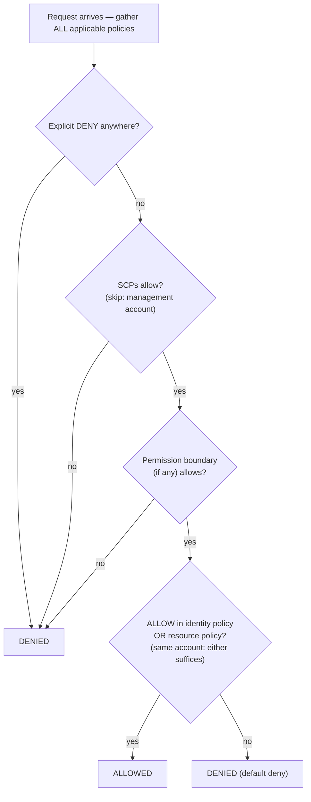

# অধ্যায় ১৪: কে কী করার অনুমতি পেয়েছে

নতুন engineer-রা সোমবার শুরু করছিল। Soo-Jin এবং Rafael। Maya তাদের প্রথম সপ্তাহ নিয়ে ভাবছিল — তাদের কীসে access দরকার হবে, তাদের কী স্পর্শ করা উচিত নয়, এবং বর্তমান IAM setup আদৌ আরো দুজনে প্রসারিত করার জন্য প্রস্তুত কিনা।

অফিস ভরে ওঠার আগে সে একটি coffee নিয়ে বসল, একটি তালিকা তৈরি করে।

---

*CloudFront deploy করা হয়েছিল। Cache hit rate ভালো ছিল। পারফরম্যান্স বেড়েছিল। কিন্তু দল যখন নতুন engineer আনার জন্য প্রস্তুত হচ্ছিল, একটি নীরব সমস্যা পৃষ্ঠে এল: IAM configuration তাড়াহুড়োয় থাকা মানুষ দ্বারা তৈরি হয়েছিল। Access key config ফাইলে ছিল। কিছু role-এর প্রয়োজনের চেয়ে বেশি অনুমতি ছিল। এবং দুজন নতুন মানুষ একটি production system-এর credential হাতে পেতে চলেছিল যা একাধিক ব্যবহারকারীকে মাথায় রেখে ডিজাইন করা হয়নি।*

---

Tom একটি text file-এ access key খোলা রেখেছিল, paste করার জন্য প্রস্তুত।

"আপনি কী করছেন?" Priya জিজ্ঞেস করল।

"EC2 instance-কে S3 থেকে config ফাইল পড়তে হবে। আমি server configuration-এ credential রাখছি।"

সে একটি মুহূর্তের জন্য screen-এর দিকে তাকাল। "সেই ফাইল বন্ধ করুন।"

"আমি শুধু—"

"কেউ সেই server-এ ঢুকলে," সে বলল, "তারা সেই key পাবে। এবং সেই key IAM user যা স্পর্শ করার অনুমতি পেয়েছে তার সবকিছু স্পর্শ করে। যা সম্ভবত শুধু S3-এর বাইরে আরো।"

Tom ফাইল বন্ধ করল।

"একটি ভালো উপায় আছে," সে বলল। "Server নিজেই একটি role থাকতে পারে। এটাকে একটি job title-এর মতো মনে করুন — instance-এর credential দরকার নেই কারণ সিস্টেম ইতিমধ্যে জানে এটি কী এবং কী করার অনুমতি পেয়েছে।"

Tom skeptical দেখাল। "তাহলে server নিজেই authenticate করে?"

"হ্যাঁ। কোনো password ছাড়া। Config ফাইলে কোনো key ছাড়া। git-এ ঘটনাক্রমে commit করা যাবে এমন কিছু ছাড়া।"

শেষ অংশটা পৌঁছাল। দুই সপ্তাহ আগে Tom নিজে repo-তে প্রায় একটি access key commit করেছিল — শেষ মুহূর্তে diff-এ এটি ধরেছিল। সে একটি নতুন browser tab খুলল।

**IAM পুনরায় দেখা: সম্পূর্ণ চিত্র**

অধ্যায় ৩ IAM পরিচয় করিয়ে দিয়েছিল: user, group, role এবং policy। এখন গভীরে যাওয়ার সময়।

IAM policy হলো JSON document যা কোন resource-এ কোন action allow বা denied তা নির্দিষ্ট করে। এগুলি এভাবে দেখায়:

```json
{
  "Version": "2012-10-17",
  "Statement": [
    {
      "Effect": "Allow",
      "Action": [
        "s3:GetObject",
        "s3:PutObject"
      ],
      "Resource": "arn:aws:s3:::nimbus-assets/*"
    }
  ]
}
```

এই policy `nimbus-assets` bucket-এ object পড়া এবং লেখার অনুমতি দেয়, এবং আর কিছু নয়। Delete করা নয়। Bucket list করা নয়। অন্য কোনো S3 operation নয়। অন্য কোনো AWS service নয়।

অনুমতি grant করার এটাই সঠিক উপায়: নির্দিষ্ট action, নির্দিষ্ট resource।

**"Administrator Access"-এর সমস্যা**

`AdministratorAccess`-এর মতো AWS Managed Policy দ্রুত শুরু করার জন্য ডিজাইন করা। সেগুলি বাস্তব team member-দের সাথে production system চালানোর জন্য ডিজাইন করা নয়।

`AdministratorAccess` প্রতিটি resource-এ প্রতিটি action grant করে। এই policy সহ একজন team member যদি একটি ভুল করে — ঘটনাক্রমে একটি S3 bucket মুছে ফেলে, ভুল EC2 instance terminate করে, security group নিয়ম পরিবর্তন করে — AWS-এর তাদের থামানোর কিছু নেই। অনুমতি grant করা হয়েছিল।

একজন team member-এর credential আপস হলে (phishing আক্রমণ, ফাঁস হওয়া access key, laptop চুরি), আক্রমণকারীর আপনার AWS account-এর সবকিছুতে administrator access আছে।

"তাহলে Soo-Jin-এর কী থাকা উচিত?" Leo জিজ্ঞেস করল।

"Soo-Jin-এর কী করার দরকার?" Priya জবাব দিল।

"API deploy করুন। Log check করুন। আর কিছু নয়।"

"তাহলে সে পায়: code pipeline-এ push করার ability, CloudWatch log-এ read access, এবং আর কিছু নয়।"

"এটা... খুব নির্দিষ্ট।"

"হ্যাঁ। এটাই point।"

**IAM Role: Service-এর জন্য পরিচয়**

অধ্যায় ৩ credential সংরক্ষণ না করে EC2 instance-কে AWS service অ্যাক্সেস করার উপায় হিসেবে role পরিচয় করিয়ে দিয়েছিল। এটি concrete করা যাক।

Nimbus API চালানো আপনার EC2 instance-এর প্রয়োজন:

- DynamoDB থেকে read (মেনু)
- DynamoDB-তে write (অর্ডার)
- S3-এ object রাখা (receipt, upload)
- CloudWatch-এ log লেখা
- Secrets Manager থেকে secret পড়া

একটি access key সহ একজন user তৈরি করে সেই key EC2 instance-এ সংরক্ষণ করার পরিবর্তে (একটি নিরাপত্তা nightmare — access key SSH access সহ যে কেউ পড়তে পারে), আপনি ঠিক এই অনুমতি সহ EC2 instance-এর জন্য একটি **IAM role** তৈরি করেন।

"দাঁড়াও — কিন্তু আমরা *কেন* এভাবে করব?" Maya জিজ্ঞেস করল। "EC2 instance ইতিমধ্যে আমাদের code চালায়। শুধু code-কে একটি access key কেন না দিই?"

কারণ access key হলো static credential যা কোথাও থাকে — একটি config ফাইলে, একটি environment variable-এ, কেউ ভুল করলে একটি git repository-তে। সেগুলি copy করা যায়, exfiltrate করা যায়, ঘটনাক্রমে commit করা যায়। একটি IAM role ভিন্নভাবে কাজ করে: EC2 instance স্বয়ংক্রিয়ভাবে role assume করে। AWS instance metadata service-এর মাধ্যমে অস্থায়ী credential প্রদান করে। Credential স্বয়ংক্রিয়ভাবে rotate হয় — সেগুলি প্রতি কয়েক ঘণ্টায় expire হয় এবং আপনার কোনো action ছাড়াই refresh হয়। ফাঁস করার কিছু নেই, কারণ সংরক্ষিত কিছু নেই।

"এবং কেউ EC2 instance-এ hack করলে?" Leo জিজ্ঞেস করল।

"তারা EC2 role যা allow করে তা করতে পারে," Priya বলল। "যা মেনু পড়া, অর্ডার লেখা এবং log পাঠানো। তারা S3 bucket মুছতে পারে না। তারা EC2 instance terminate করতে পারে না। তারা IAM স্পর্শ করতে পারে না।"

"কারণ EC2 role-এর সেই অনুমতি নেই।"

"ঠিক।"

---

**EC2 Role Assumption কীভাবে ধাপে ধাপে কাজ করে**

"কিছু একটা মিলছে না," Maya বলল। "instance-এ কোনো credential সংরক্ষিত না থাকলে, instance আসলে কীভাবে AWS-এর কাছে প্রমাণ করে এটি কে? কোথাও একটি credential থাকতে হবে।"

আছে। কিন্তু এটি অস্থায়ী, স্বয়ংক্রিয়ভাবে rotate করা এবং শুধুমাত্র instance-এর ভেতর থেকে accessible।

একটি EC2 instance একটি IAM role attached সহ শুরু হলে, AWS নিম্নলিখিত করে:

**ধাপ ১**: AWS STS (Security Token Service) অস্থায়ী credential তৈরি করে — একটি access key ID, একটি secret access key এবং একটি session token। EC2 instance role-এর জন্য এগুলি সাধারণত প্রায় ছয় ঘণ্টার জন্য বৈধ, এবং AWS expire হওয়ার আগে স্বয়ংক্রিয়ভাবে সেগুলি rotate করে।

**ধাপ ২**: AWS এই credential একটি বিশেষ IP address-এ উপলব্ধ করে: `169.254.169.254`। এটি হলো **instance metadata service** (IMDS)। এটি শুধুমাত্র EC2 instance-এর ভেতর থেকে পৌঁছানো যায়। instance-এর বাইরের কিছুই এটি অ্যাক্সেস করতে পারে না।

**ধাপ ৩**: আপনার অ্যাপ্লিকেশন code যখন যেকোনো AWS SDK (boto3, Java SDK, Node.js SDK) call করে, SDK স্বয়ংক্রিয়ভাবে instance metadata endpoint query করে:

```
GET http://169.254.169.254/latest/meta-data/iam/security-credentials/{role-name}
```

**ধাপ ৪**: SDK অস্থায়ী credential পায় এবং API request সাইন করতে সেগুলি ব্যবহার করে — উদাহরণস্বরূপ, S3 থেকে পড়ার একটি request।

**ধাপ ৫**: AWS credential যাচাই করে, role-এ attached IAM policy চেক করে, এবং request permit বা deny করে।

**ধাপ ৬**: Credential expire হওয়ার প্রায় পনেরো মিনিট আগে, EC2 instance স্বয়ংক্রিয়ভাবে metadata service থেকে সেগুলি refresh করে। অ্যাপ্লিকেশন code-কে কখনো এটি সামলাতে হয় না — SDK এটি transparent-ভাবে করে।

পুরো প্রক্রিয়া developer-এর কাছে অদৃশ্য। আপনি `s3.get_object(...)` লেখেন। SDK বাকিটা সামলায়।

"তাহলে credential বিদ্যমান," Maya বলল। "এটা শুধু অস্থায়ী, auto-rotating এবং instance metadata endpoint-এ locked।"

"এজন্যই এটা একটি static access key-র চেয়ে অনেক নিরাপদ," Priya বলল। "একটি static key, একবার চুরি হলে, কেউ ম্যানুয়ালি rotate না করা পর্যন্ত বৈধ। একটি চুরি হওয়া অস্থায়ী credential নিজে থেকে expire হয় — কয়েক ঘণ্টার মধ্যে, মাস নয়।"

"এবং কেউ instance-এর ভেতরে metadata endpoint query করলে?"

"তারা বর্তমান অস্থায়ী credential পেতে পারে। এটা একটা প্রকৃত ঝুঁকি, এজন্যই AWS IMDSv2 — Instance Metadata Service version 2 চালু করেছে। IMDSv2-এর জন্য caller-কে প্রথমে একটি PUT request-এর মাধ্যমে একটি session token পেতে হয়। এটি Server-Side Request Forgery নামক এক শ্রেণীর আক্রমণ prevent করে, যেখানে malicious code server-কে আক্রমণকারীর পক্ষে metadata URL fetch করতে প্রতারিত করে।"

Leo IMDSv2 enforce করতে EC2 launch configuration আপডেট করল। একটি setting, launch time-এ প্রয়োগ করা।

---

**Role Assumption: Service কীভাবে অন্য Service হয়**

Role assume করতে পারে:

- **AWS service** (EC2, Lambda, ECS task, ইত্যাদি)
- **আপনার নিজের account-এ IAM user** (role elevation — একটি নির্দিষ্ট কাজের জন্য আরো অনুমতি সহ একটি role assume করুন)
- **অন্য AWS account-এ IAM user** (cross-account access — অন্য সংস্থার account আপনারটিতে একটি role assume করতে পারে)
- **External identity provider** (Google, Active Directory, Okta — human user-এর জন্য federated access)

"Nimbus যদি একটি third-party service ব্যবহার করে যার আমাদের AWS resource-এ access দরকার তাহলে কী হয় তা নিয়ে আমরা ভেবেছি কি?" Priya জিজ্ঞেস করল। "একটি external analytics vendor, উদাহরণস্বরূপ। আমরা তাদের জন্য একটি IAM user তৈরি করতে এবং একটি access key হস্তান্তর করতে চাই না।"

"Cross-account role," Leo বলল। "আমরা আমাদের account-এ একটি role তৈরি করি এবং একটি trust policy লিখি যা বলে 'এই নির্দিষ্ট external account এই role assume করার অনুমতি পেয়েছে।' তারা role assume করতে এবং অস্থায়ী access পেতে তাদের নিজস্ব credential ব্যবহার করে। পরিচালনা করার কোনো key নেই, ফাঁস করার কোনো key নেই।"

এই শেষ pattern — **identity federation** — হলো বড় সংস্থাগুলি প্রতিটি ব্যক্তির জন্য পৃথক IAM user তৈরি না করে তাদের কর্মচারীদের AWS access দেয়। আপনার কোম্পানির Active Directory-তে আপনার credential আছে। আপনি AWS-এ log in করলে, আপনি Active Directory-এর বিরুদ্ধে authenticate করেন এবং AWS আপনাকে একটি role grant করে।

---

**Cross-Account Access: Accounting Team দৃশ্যকল্প**

ছয় মাসের মধ্যে, Nimbus financial reporting-এ সাহায্য করতে একটি accounting firm-কে আনল। Accounting team-এর Nimbus S3 billing bucket-এ billing ডেটায় read access দরকার ছিল — কিন্তু তারা তাদের নিজস্ব পৃথক AWS account থেকে পরিচালনা করত। Nimbus তাদের জন্য একটি IAM user তৈরি করতে চায়নি। একটি external কোম্পানির কাউকে একটি static access key হস্তান্তর করা ঠিক ভুল মনে হয়েছিল।

"Cross-account role," Priya বলল।

Setup-এর তিনটি অংশ আছে:

**অংশ এক**: Nimbus account-এ, একটি IAM role তৈরি করুন — এটিকে `AccountingReadRole` বলুন। billing S3 bucket-এ `s3:GetObject` এবং `s3:ListBucket` allow করা একটি policy attach করুন। আর কিছু নয়।

**অংশ দুই**: `AccountingReadRole`-এ একটি trust policy যোগ করুন। Trust policy বলে কোন external identity এই role assume করার অনুমতি পেয়েছে:

```json
{
  "Version": "2012-10-17",
  "Statement": [{
    "Effect": "Allow",
    "Principal": {
      "AWS": "arn:aws:iam::ACCOUNTING-FIRM-ACCOUNT-ID:role/AccountingAppRole"
    },
    "Action": "sts:AssumeRole"
  }]
}
```

এটি বলে: শুধুমাত্র accounting firm-এর AWS account-এর নির্দিষ্ট role এই role assume করতে পারে। আর কেউ নয়।

**অংশ তিন**: accounting firm-এর account-এ, তাদের অ্যাপ্লিকেশন `AccountingReadRole`-এর জন্য অস্থায়ী credential পেতে `sts:AssumeRole` ব্যবহার করে। সেই credential শুধুমাত্র `AccountingReadRole` যা allow করে তাতে scoped। accounting অ্যাপ্লিকেশন billing ফাইল পড়তে পারে। এটি সেগুলিতে লিখতে পারে না। এটি Nimbus account-এ আর কিছু স্পর্শ করতে পারে না।

ঠিক এই দৃশ্যকল্পের জন্য আরো একটি hardening ধাপ আছে — এবং এটি একটি নামকরা পরীক্ষার বিষয়। Accounting firm অনেক client-কে সেবা দেয়। ধরুন তাদের একজন malicious client Nimbus-এর `AccountingReadRole`-এর ARN জানতে পারে এবং firm-এর software-কে এটি "analyze" করতে বলে। Firm-এর software-এর role assume করার বৈধ অনুমতি আছে — এটি ভুল customer-এর পক্ষে Nimbus-এর ডেটা অ্যাক্সেস করতে প্রতারিত হতে পারে। এটি হলো **confused deputy problem**, এবং সমাধান হলো **ExternalId**: Nimbus একটি অনন্য secret মান তৈরি করে, এটি trust policy-তে একটি condition হিসেবে রাখে (`"sts:ExternalId": "nimbus-7f3a..."`), এবং এটি শুধুমাত্র accounting firm-এর সাথে শেয়ার করে। Firm-এর software-কে প্রতিটি `AssumeRole` call-এ সেই ExternalId pass করতে হবে, এবং এটি প্রতি customer-এ একটি *ভিন্ন* ExternalId ব্যবহার করে — তাই ভুল customer-এর পক্ষে করা একটি request ব্যর্থ হয়। পরীক্ষার trigger: "third party-র cross-account access দরকার" → role + trust policy + **ExternalId**। কখনো shared key সহ একটি IAM user নয়।

"আমাদের তাদের access revoke করতে হলে কী?" Tom জিজ্ঞেস করল।

"Trust policy মুছুন বা role মুছুন," Priya বলল। "সম্পন্ন। খুঁজে বের করার কোনো credential নেই, deactivate করার কোনো key নেই। Role হলো access। Role সরান, access চলে গেল।"

"এবং আমরা CloudTrail-এ তারা প্রতিবার এটি ব্যবহার করলে দেখতে পারি," Leo যোগ করল।

"তাদের করা প্রতিটি API call, logged। কোন bucket, কোন ফাইল, কোন সময়, কী ফলাফল।"

Tom pattern-টি লিখে নিল। এটি আবার আসবে — প্রতিটি integration partner, প্রতিটি external vendor, প্রতিটি third-party tool যার AWS access দরকার একটি trust policy সহ একটি role পাবে, একটি access key সহ একটি user নয়।

---

**IAM Policy Evaluation: সিদ্ধান্তের যুক্তি**

"একই request-এ একাধিক policy প্রযোজ্য হলে কী হয় তা নিয়ে আমরা ভেবেছি কি?" Priya জিজ্ঞেস করল। "একটি IAM user-এর একটি policy আছে। তারা যে resource অ্যাক্সেস করছে তার একটি resource policy আছে। একটি SCP থাকতে পারে। AWS কীভাবে সিদ্ধান্ত নেয়?"

বোঝার গুরুত্বপূর্ণ বিষয় হলো AWS একসাথে এক ধরনের policy এক করে ক্রমানুসারে check করে **না**। এটি request-এ প্রযোজ্য *সমস্ত* policy সংগ্রহ করে — identity-based, resource-based, SCP, permission boundary, session policy — এবং একসাথে পুরো গাদায় একটি নিয়মের set প্রয়োগ করে:

**নিয়ম ১ — Explicit deny জেতে, সবসময়।** কোনো প্রযোজ্য policy — IAM, resource-based, SCP, বা boundary — যদি স্পষ্টভাবে action deny করে, request denied। কিছুই একটি explicit deny override করতে পারে না।

**নিয়ম ২ — SCP এবং permission boundary filter হিসেবে কাজ করে।** তারা কখনো কিছু grant করে না। Action অবশ্যই প্রতিটি প্রযোজ্য SCP এবং permission boundary (যদি একটি থাকে) দ্বারা *allowed* হতে হবে, অন্যথায় এটি denied — অন্য policy যাই বলুক না কেন।

**নিয়ম ৩ — একই account-এর মধ্যে, একটি allow যথেষ্ট।** identity-র IAM policy *বা* resource-এর policy-র *যেকোনোটিতে* একটি explicit allow action permit করে। তারা একটি union, একটি sequence নয় — resource policy IAM policy-র "আগে" evaluate হয় না।

**নিয়ম ৪ — Default deny।** কিছুই যদি স্পষ্টভাবে action allow না করে, এটি denied।



ফলাফল: যেকোনো জায়গায় explicit deny = denied। কোথাও কোনো allow নেই = denied। identity policy *বা* resource policy থেকে একটি allow = allowed, যতক্ষণ কোনো deny, SCP, বা boundary block না করে।

পরীক্ষা যে আরো একটি তথ্য পছন্দ করে: **SCP organization-এর management account-এ প্রযোজ্য হয় না** (service-linked role-এও নয়)। একটি SCP যা বলে "us-west-2-এর বাইরে কোনো EC2 নয়" প্রতিটি member account সীমাবদ্ধ করে — কিন্তু management account অস্পৃষ্ট। এটি AWS আপনাকে সম্পূর্ণভাবে management account থেকে workload বাইরে রাখতে বলার একটি কারণ।

একটি সূক্ষ্মতা যা পরীক্ষার্থীদের ফাঁদে ফেলে: **cross-account access**-এর জন্য, target account-এ একটি resource-based policy নিজে যথেষ্ট নয়। Source account-এর identity-রও action সম্পাদন করতে তার নিজস্ব IAM policy-তে explicit permission দরকার। আপনি যদি একটি S3 bucket policy grant করেন যা Account B-কে আপনার object পড়তে allow করে, কিন্তু Account B-এর IAM user-দের `s3:GetObject` permit করা কোনো IAM policy না থাকে, access এখনো denied। উভয় পক্ষকে action allow করতে হবে — resource policy target দিকে দরজা খোলে, এবং source account-এর IAM policy user-কে এর মধ্য দিয়ে যাওয়ার অনুমতি দেয়।

"তাহলে Priya-র SCP যদি বলে 'eu-west-1-এ কোনো EC2 নয়,' এবং তার IAM policy বলে 'সমস্ত EC2 action allow,' সে এখনো eu-west-1-এ একটি instance তৈরি করতে পারবে না?" Leo জিজ্ঞেস করল।

"সঠিক," Priya বলল। "IAM policy evaluate হওয়ার আগে SCP কী সম্ভব তা filter করে। একটি action সফল হতে উভয়কে একমত হতে হবে।"

"এবং একটি IAM policy-তে একটি explicit deny একটি resource policy-তে একটি explicit allow override করে?"

"সবসময়। chain-এর যেকোনো জায়গায় একটি explicit deny জেতে।"

---

**Permission Boundary: Role কী Grant করতে পারে তা সীমিত করা**

এখানে একটি সূক্ষ্ম কিন্তু গুরুত্বপূর্ণ সমস্যা: ডিফল্টরূপে, IAM একজন user-কে তাদের বর্তমানে নেই এমন অনুমতি grant করা থেকে prevent করে না।

Soo-Jin-এর যদি `iam:CreatePolicy` এবং `iam:AttachUserPolicy` থাকে, সে S3 write access grant করা একটি policy তৈরি করতে পারে এবং নিজের সাথে attach করতে পারে — এমনকি তার বিদ্যমান policy শুধুমাত্র S3 read allow করলেও। এই শ্রেণীর দুর্বলতা **privilege escalation** নামে পরিচিত, এবং ঠিক এজন্যই permission boundary বিদ্যমান।

কিন্তু আপনি যদি একজন team lead-কে IAM permission তৈরি delegate করতে চান, একই সাথে নিশ্চিত করতে চান তারা আপনার ইচ্ছার চেয়ে বেশি grant করতে পারে না?

**Permission boundary** সর্বোচ্চ অনুমতি set করে যা কোনো identity-কে কখনো grant করা যাবে। এমনকি identity-র attached policy আরো broad হলেও, কার্যকর অনুমতি permission boundary দ্বারা bounded।

উদাহরণ: আপনি একজন team lead-কে IAM role তৈরির অনুমতি দেওয়া একটি policy দেন। কিন্তু আপনি একটি permission boundary attach করেন যা বলে "এই team lead দ্বারা তৈরি role-এ কখনো S3 delete access থাকতে পারে না।" Team lead যদি S3 full access সহ একটি role তৈরি করে, boundary S3 delete কার্যকর হতে prevent করে।

আপনি হয়তো ভাবছেন: একটি permission boundary এবং একটি Service Control Policy-র মধ্যে পার্থক্য কী? সেগুলি একই রকম শোনায় — উভয়ই কোন অনুমতি কার্যকর হতে পারে তা সীমিত করে। পার্থক্য হলো scope। একটি permission boundary একটি নির্দিষ্ট IAM identity (একটি user বা role)-এ প্রযোজ্য এবং সেই identity কখনো কী করতে পারে তা সীমিত করে। একটি SCP একটি সম্পূর্ণ AWS account বা organizational unit-এ প্রযোজ্য — এটি একটি organization-স্তরের guardrail যা account-এর প্রতিটি identity-কে প্রভাবিত করে, administrator সহ। আপনি যখন একজন team lead-কে IAM management delegate করছেন তখন permission boundary ব্যবহার করুন। আপনার যখন organization-wide নিয়ম দরকার যা একটি account-এর কেউ override করতে পারে না তখন SCP ব্যবহার করুন।

এটি একটি advanced concept, কিন্তু এটি পরীক্ষায় দেখা যায় এবং স্কেলে সংস্থাগুলি কীভাবে IAM management delegate করে তা প্রতিফলিত করে।

**একটি Concrete Permission Boundary: নিরাপদে Role তৈরি Delegate করা**

Nimbus বাড়ছিল। Soo-Jin প্রস্তাব করল যে platform team-এর প্রতিটি senior engineer-কে তাদের মালিকানাধীন Lambda function-এর জন্য IAM role তৈরি করার অনুমতি দেওয়া হোক — Priya-কে প্রতিটি অনুমোদন করতে না হয়ে।

"ঝুঁকি," Priya বলল, "হলো একজন senior engineer `AdministratorAccess` সহ একটি Lambda role তৈরি করে — হয় ভুল করে বা সাবধানে চিন্তা না করে।"

"তাহলে আমরা permission boundary ব্যবহার করি," Soo-Jin বলল।

Priya `NimbusDeveloperBoundary` নামে একটি permission boundary policy তৈরি করল:

```json
{
  "Version": "2012-10-17",
  "Statement": [
    {
      "Effect": "Allow",
      "Action": [
        "s3:GetObject", "s3:PutObject",
        "dynamodb:GetItem", "dynamodb:PutItem", "dynamodb:Query",
        "cloudwatch:PutMetricData", "logs:CreateLogGroup",
        "logs:CreateLogStream", "logs:PutLogEvents",
        "secretsmanager:GetSecretValue",
        "xray:PutTraceSegments"
      ],
      "Resource": "*"
    }
  ]
}
```

সে তারপর প্রতিটি senior engineer-কে role তৈরির অনুমতি দিল, কিন্তু শুধুমাত্র যদি তারা এই boundary attach করে:

```json
{
  "Effect": "Allow",
  "Action": ["iam:CreateRole", "iam:AttachRolePolicy"],
  "Resource": "*",
  "Condition": {
    "StringEquals": {
      "iam:PermissionsBoundary": "arn:aws:iam::ACCOUNT_ID:policy/NimbusDeveloperBoundary"
    }
  }
}
```

Condition ছাড়া, একজন engineer যেকোনো অনুমতি সহ একটি role তৈরি করতে পারত। Condition সহ, তারা তৈরি করা যেকোনো role-এ `NimbusDeveloperBoundary` attached থাকতে হবে। `AdministratorAccess` plus `NimbusDeveloperBoundary` সহ একটি role-এর দুটির intersection আছে — কার্যকরভাবে শুধু boundary-তে তালিকাভুক্ত service।

"তাহলে তারা role তৈরি করতে পারে," Leo বলল, "কিন্তু সেই role কখনো S3 থেকে পড়া, DynamoDB-তে লেখা এবং CloudWatch-এ log করার চেয়ে বেশি করতে পারে না।"

"সঠিক। তারা IAM স্পর্শ করা role তৈরি করতে পারে না। তারা EC2 instance মুছে এমন role তৈরি করতে পারে না। Boundary সিলিং সংজ্ঞায়িত করে।"

"এবং তারা boundary attach করতে ভুলে গেলে?"

"Condition `CreateRole` call সফল হতে prevent করে। Boundary অন্তর্ভুক্ত না হলে create ব্যর্থ হয়।"

Priya Soo-Jin-এর সাথে অনুশীলনটি চালাল। বিশ মিনিটের setup। ফলাফল: engineer-রা প্রতিটি deployment-এর জন্য একটি security review ছাড়াই তাদের Lambda role তৈরি self-serve করতে পারত, এবং platform team আস্থা রাখত যে কোনো Lambda function কখনো সংজ্ঞায়িত অনুমতির চেয়ে বেশি পাবে না।

**IAM Access Analyzer: অনুমতি Auditing**

Priya দুই দিন দলের IAM setup পর্যালোচনা করতে কাটাল। সে পেল:

- Leo-র personal user-এর administrator access ছিল (আবিষ্কৃত হিসেবে)
- একটি পুরানো Lambda function-এর সমস্ত S3 bucket পড়ার অনুমতি ছিল (একটি test থেকে বাকি)
- একটি service role-এর DynamoDB table-এ write access ছিল যা আর বিদ্যমান নেই

এটি স্বাভাবিক। IAM configuration সময়ের সাথে অপ্রয়োজনীয় জিনিস সংগ্রহ করে।

**IAM Access Analyzer** হলো একটি AWS service যা স্বয়ংক্রিয়ভাবে resource (S3 bucket, IAM role, KMS key, Lambda function, SQS queue) চিহ্নিত করে যা আপনার AWS account-এর বাইরে থেকে accessible। এটিতে একটি policy validation feature-ও আছে যা IAM best practice-এর বিরুদ্ধে policy check করে, এবং একটি policy generation feature যা CloudTrail event বিশ্লেষণ করে least-privilege policy তৈরি করে।

"মাসে এর খরচ কত?" Tom জিজ্ঞেস করল, তার browser থেকে মাথা তুলে।

"External access analysis বিনামূল্যে," Priya বলল। "এটি ক্রমাগত চলে এবং console-এ finding রিপোর্ট করে। Unused access analysis — যা সম্প্রতি ব্যবহৃত হয়নি এমন role এবং অনুমতি চিহ্নিত করে — প্রতি মাসে প্রতি analyzed IAM role-এ প্রায় $0.20 খরচ করে।"

Tom তার browser-এ ফিরে গেল।

External access finding সবচেয়ে তাৎক্ষণিকভাবে মূল্যবান। Priya যখন Access Analyzer সক্ষম করল, এটি দুটি জিনিস পেল:

প্রথম, `nimbus-receipts` S3 bucket-এর একটি bucket policy ছিল যা একটি নির্দিষ্ট external AWS account থেকে read allow করত — একজন contractor-এর account যে আট মাস আগে প্রাথমিক receipt export feature তৈরিতে সাহায্য করেছিল। Contractor আর নিযুক্ত ছিল না। Bucket policy কখনো পরিষ্কার করা হয়নি।

"আট মাসের access যা কেউ চায়নি," Priya বলল।

"তারা কি এখনো এটি অ্যাক্সেস করছিল?" Tom জিজ্ঞেস করল।

Leo S3 access log টানল। ছয় মাসে সেই account থেকে কোনো request নেই। কিন্তু অনুমতি সেখানে ছিল। Access Analyzer এটি পৃষ্ঠে এনেছিল; একটি ম্যানুয়াল review-তে কেউ এটি খুঁজে পেত না।

দ্বিতীয়, `nimbus-dev-assets` S3 bucket public read-এ সেট ছিল। development-এর সময় এটি ইচ্ছাকৃত ছিল — public access দিয়ে test করা সহজ ছিল। এটি ভুলে যাওয়া হয়েছিল।

"public access block override সরান," Priya বলল। "এবং account স্তরে S3 Block Public Access সক্ষম করুন। এটি পৃথক bucket setting নির্বিশেষে যেকোনো bucket public হওয়া prevent করে।"

তারা উভয় করল।

Unused access analysis, মাসিক চালানো, 90 দিনে ব্যবহৃত হয়নি এমন role পৃষ্ঠে আনবে। সেগুলি delete করার candidate ছিল। IAM configuration স্বাভাবিকভাবে এক দিকে বাড়ে — role এবং policy জমা হয়। Access Analyzer cleanup-কে দৃশ্যমান করে।

নিয়মিত IAM audit আপনার operation-এর অংশ হওয়া উচিত। Access Analyzer audit প্রতিস্থাপন করে না — এটি audit-কে manageable করে।

**Service Control Policy: Organization-স্তরের Guardrail**

আপনার AWS environment একাধিক account-এ বাড়লে (একটি সাধারণ বড় দলের pattern — dev account, staging account, production account), **AWS Organizations** আপনাকে একটি central account থেকে সেগুলি manage করতে দেয়। একটি তাৎক্ষণিক, ব্যবহারিক সুবিধা: **consolidated billing**। সমস্ত member account একটি একক বিলে roll up হয় যা management account পেমেন্ট করে, এবং usage account জুড়ে aggregated হয় — তাই volume discount (উদাহরণস্বরূপ S3 pricing tier) এবং Reserved Instance বা Savings Plans discount per account-এর পরিবর্তে organization-wide প্রযোজ্য হয়। Tom এটি সম্পর্কে আর কিছু বোঝার আগে Organizations অনুমোদন করল।

Organizations-এর মধ্যে, **Service Control Policy (SCP)** guardrail প্রয়োগ করে যা account-এর *প্রতিটি* IAM entity-কে প্রভাবিত করে, administrator সহ।

উদাহরণ SCP: "dev account-এ কেউ eu-west-1 region-এ EC2 instance তৈরি করতে পারবে না।"

এমনকি dev account-এ administrator access সহ কেউ এই SCP লঙ্ঘন করতে পারবে না। এটি account স্তরের উপরে, organization স্তরে enforce করা হয়।

SCP অনুমতি grant করে না — সেগুলি সীমাবদ্ধ করে। এগুলি সর্বোচ্চ অনুমতি সংজ্ঞায়িত করে যা একটি account-এর যেকোনো IAM entity কখনো থাকতে পারে।

Nimbus যখন একটি multi-account structure প্রতিষ্ঠা করল — একটি shared production account, একটি development account এবং একটি security account — Priya তিনটি foundational SCP লিখল:

**SCP 1 — Region lock**: সমস্ত account `us-east-1` এবং `us-west-2`-তে সীমাবদ্ধ। একজন developer ঘটনাক্রমে `ap-southeast-1`-এ deploy করলে, action denied। এটি অনিচ্ছাকৃত region-এ shadow infrastructure prevent করে।

**SCP 2 — CloudTrail protection**: কোনো account-এ কেউ CloudTrail অক্ষম করতে বা CloudTrail log মুছতে পারে না। এমনকি account administrator-ও। CloudTrail অন্ধকার হলে, security visibility এর সাথে চলে যায় — এই SCP এটি structurally অসম্ভব করে।

**SCP 3 — Root user lockdown**: member account-এর root user দ্বারা সম্পাদিত সমস্ত action deny করে (AWS-এর প্রস্তাবিত pattern হলো root-এর সাথে মিলিত `aws:PrincipalArn`-এ একটি সরাসরি deny, শর্তসাপেক্ষে MFA প্রয়োজন করার পরিবর্তে — conditional-MFA SCP এমন service flow ভাঙে যা MFA উপস্থাপন করতে পারে না)। Root user প্রায় কখনো ব্যবহার করা উচিত নয়; দৈনন্দিন কাজ role-এর অন্তর্গত। মনে রাখবেন: SCP member-account root user-এ প্রযোজ্য, কিন্তু **কখনো** management account-এ নয়।

"এই তিনটি policy আমরা গত বছর দেখা তিনটি প্রকৃত ঘটনা prevent করত," Priya বলল। "Region lock সেই developer-কে থামাত যে ঘটনাক্রমে আমরা পরিচালনা করি না এমন একটি region-এ দুইশত EC2 instance launch করেছিল। CloudTrail protection আমাদের আগের নিয়োগকর্তায় insider threat ঘটনা থামাত। Root lockdown শুধু hygiene।"

"এটা কি security account-এও প্রযোজ্য?" Leo জিজ্ঞেস করল।

"Security account-এর একটি ভিন্ন SCP আছে — কম restriction, কারণ security team কখনো কখনো এমন কিছু করতে হয় যা অন্য account পারে না। কিন্তু CloudTrail protection সর্বত্র প্রযোজ্য। Logging পবিত্র।"

বুড়ো আঙুলের নিয়ম: SCP যা কখনো ঘটা উচিত নয় তার জন্য, কোথাও, যেকোনো account-এ যেকোনো পরিস্থিতিতে। IAM policy প্রতিটি দল এবং service-এর বিশেষভাবে যা প্রয়োজন তার জন্য।

---

## Landing Zone স্বয়ংক্রিয় করা: AWS Control Tower

SCP কাজ করছিল। Multi-account structure আকার নিচ্ছিল। কিন্তু Priya একটি নীরব গণনা করছিল, এবং সে সংখ্যাগুলি পছন্দ করল না।

"আটটি account," সে বলল। "এবং আমরা নতুন chain গণনাও করিনি।"

Nimbus একটি একক AWS account ছাড়িয়ে বেড়েছিল। তাদের production ছিল। তাদের staging ছিল। তাদের তিনটি অধিগ্রহণকৃত restaurant chain ছিল — প্রতিটি তাদের নিজস্ব AWS environment চালাচ্ছে, প্রতিটিকে Nimbus governance model-এ ভাঁজ করতে হবে। মোট আটটি account, আরো আসছে।

Soo-Jin এই সমস্যা জানত। "আমার শেষ company-তে, আমরা প্রতিটি নতুন account ম্যানুয়ালি সেট আপ করতাম," সে বলল। "Root account email, IAM user, SCP attachment, CloudTrail, Config, GuardDuty — প্রতি account দুই ঘণ্টা, ন্যূনতম। এবং কিছু একটা সবসময় সামান্য ভিন্ন ছিল। একটি account-এ শুধু us-east-1-এ CloudTrail ছিল। আরেকটিতে GuardDuty অক্ষম ছিল কারণ কেউ এটি সক্ষম করতে ভুলে গিয়েছিল। আপনার পঞ্চাশটি account হওয়ার সময়, পার্থক্য audit করা নিজেই একটি project ছিল।"

"আমরা এভাবে করছি না," Priya বলল।

**AWS Control Tower** একটি multi-account AWS environment-এর setup এবং governance স্বয়ংক্রিয় করে। প্রতিটি নতুন account-এর জন্য Organizations, SCP, CloudTrail, Config এবং GuardDuty ম্যানুয়ালি একসাথে wire করার পরিবর্তে, Control Tower আপনার জন্য structure তৈরি এবং বজায় রাখে।

আপনি Control Tower সেট আপ করলে, এটি একটি **landing zone** তৈরি করে: একটি pre-configured, নিরাপদ multi-account environment একটি management account, একটি log archive account এবং একটি audit account সহ, সবই AWS best practice অনুসরণ করে। Log archive account organization-এর প্রতিটি account থেকে CloudTrail log সংগ্রহ করে। Audit account security tooling host করে। এই baseline স্বয়ংক্রিয়ভাবে সেট আপ হয় — দুই দিন ধরে আপনার দল দ্বারা নয়, বরং Control Tower দ্বারা কয়েক মিনিটে।

Landing zone বিদ্যমান হলে, Control Tower **control** (পুরানো নাম, **guardrail**, এখনো সর্বত্র দেখা যায়, পরীক্ষাসহ)-এর মাধ্যমে এটি পরিচালনা করে — তিনটি ফর্মে pre-built governance নিয়ম। *Preventive control* হলো SCP: সেগুলি ঘটার আগে non-compliant action block করে। *Detective control* হলো AWS Config rule: সেগুলি drift-এর জন্য scan করে এবং Control Tower dashboard-এ রিপোর্ট করে। *Proactive control* হলো CloudFormation hook: সেগুলি provision হওয়ার *আগে* compliance-এর জন্য resource check করে, পরে flag করার পরিবর্তে deployment ব্যর্থ করে। Priya-র CloudTrail protection SCP, Control Tower ভাষায় অনূদিত, একটি preventive control। Public access সহ যেকোনো S3 bucket flag করা একটি Config rule একটি detective control। একটি CloudFormation stack-কে একটি unencrypted EBS volume তৈরি করা থেকে block করা একটি hook একটি proactive control।

যে অংশটি Soo-Jin-এর দুই-ঘণ্টা-প্রতি-account সমস্যা সমাধান করল: **Account Factory**। Nimbus যখন আরেকটি restaurant chain অধিগ্রহণ করে, engineering team Account Factory খোলে, account নাম এবং email পূরণ করে, এবং provision-এ click করে। কয়েক মিনিট পরে, একটি নতুন AWS account সঠিক IAM role, CloudTrail, Config এবং ইতিমধ্যে প্রয়োগ করা সমস্ত guardrail সহ pre-configured এসে পৌঁছায়। প্রায় সঠিক নয়। একটি জিনিস অনুপস্থিত নয়। প্রতিটি অন্য account-এর সাথে অভিন্ন।

"দাঁড়াও — কিন্তু আমরা *কেন* এভাবে করব?" Maya জিজ্ঞেস করল। "আমাদের ইতিমধ্যে Organizations এবং SCP আছে। উপরে আরেকটি service কেন যোগ করব?"

কারণ SCP সহ Organizations আপনাকে guardrail দেয় — কিন্তু আপনি বাকি সবকিছু নিজে তৈরি এবং বজায় রাখেন। Control Tower আপনাকে সম্পূর্ণ landing zone দেয়: account structure, log archive, audit account, baseline security configuration এবং Account Factory, সবই AWS দ্বারা বজায় রাখা। Control Tower under the hood Organizations ব্যবহার করে, কিন্তু এটি স্বয়ংক্রিয় opinionated setup যোগ করে যা Organizations একা প্রদান করে না। আপনি যদি আজ scratch থেকে শুরু করেন এবং স্কেলে সামঞ্জস্যপূর্ণ governance দরকার, Control Tower হলো উত্তর। আপনার যদি ইতিমধ্যে একটি পরিপক্ব Organizations setup থাকে যা আপনি ম্যানুয়ালি তৈরি করেছেন, আপনি এটি Control Tower-এ enroll করতে পারেন — বা যেমন আছে রেখে দিতে পারেন।

যে পার্থক্য পরীক্ষার্থীদের ফাঁদে ফেলে: "account জুড়ে একটি নির্দিষ্ট action সীমাবদ্ধ করতে একটি SCP প্রয়োগ করুন" → আপনি Organizations + SCP সরাসরি চান। "একটি নতুন account provisioning workflow সহ স্বয়ংক্রিয়ভাবে AWS best practice অনুসরণ করে একটি নিরাপদ multi-account environment সেট আপ করুন" → আপনি Control Tower চান।

"Meridian Kitchen account enroll করতে কত সময় লাগে?" Leo জিজ্ঞেস করল।

"Account Factory প্রায় ত্রিশ মিনিটে একটি নতুন account provision করে," Priya বলল। "সম্পূর্ণ configured। 'বেশিরভাগ configured' নয়।"

Tom কিছু বলল না। সে একজন engineer-এর দুই ঘণ্টার সময়ের খরচ দেখছিল, আট দিয়ে গুণ করা, যত account আসছে তা দিয়ে গুণ করা।

---

> **পরীক্ষার টিপ — AWS Control Tower**
>
> *SAA-C03 ডোমেন: Design Secure Architectures (ডোমেন ১)*
>
> - **Control Tower** guardrail এবং Account Factory সহ multi-account landing zone setup স্বয়ংক্রিয় করে। একটি নতুন AWS organization শুরু করার সময় বা সামঞ্জস্যপূর্ণ governance baseline সহ স্কেলে account provision করার প্রয়োজন হলে এটি ব্যবহার করুন।
> - **Preventive control = SCP।** সেগুলি ঘটার আগে non-compliant action block করে।
> - **Detective control = AWS Config rule।** সেগুলি drift detect করে এবং dashboard-এ রিপোর্ট করে।
> - **Proactive control = CloudFormation hook।** সেগুলি provisioning-এর আগে resource validate করে। তিন ধরনের control, তিনটি mechanism — পরীক্ষা mapping পরীক্ষা করে।
> - **Account Factory** আপনার organization-এর security baseline সহ pre-configured নতুন account provision করে — কোনো ম্যানুয়াল setup নেই।
> - **Control Tower বনাম Organizations:** Organizations + SCP = আপনি সবকিছু তৈরি এবং পরিচালনা করেন। Control Tower = AWS landing zone তৈরি করে এবং আপনার জন্য guardrail update পরিচালনা করে, under the hood Organizations ব্যবহার করে।
> - **পরীক্ষার trigger:** "স্বয়ংক্রিয়ভাবে security baseline সহ নতুন account সেট আপ করুন" → Control Tower। "account জুড়ে একটি action সীমাবদ্ধ করতে একটি নির্দিষ্ট SCP প্রয়োগ করুন" → Organizations + SCP সরাসরি।

---

**CI/CD Pipeline: যে Credential আপনি ভুলে যান**

"আমাদের deployment pipeline-এ credential নিয়ে কী হয় তা নিয়ে আমরা ভেবেছি কি?" Priya জিজ্ঞেস করল।

Nimbus অ্যাপ্লিকেশন deploy করা GitHub Actions workflow পূর্বে GitHub Secrets হিসেবে সংরক্ষিত AWS access key ব্যবহার করত। এটি standard practice ছিল — কিন্তু এর মানে একটি third-party system-এ long-lived access key বিদ্যমান ছিল।

"GitHub compromise হলে কী?" Priya জিজ্ঞেস করল। "অথবা একটি repository ঘটনাক্রমে public হয়ে যায় এবং কেউ secret পড়ে?"

সমাধান: GitHub OIDC federation। GitHub Actions OpenID Connect সমর্থন করে — এটি GitHub-এর identity provider থেকে একটি অস্থায়ী token পেতে পারে এবং একটি IAM role-এর মাধ্যমে এটি AWS credential-এ exchange করতে পারে। কোনো static access key কখনো তৈরি হয় না।

deployment role-এর IAM trust policy:

```json
{
  "Effect": "Allow",
  "Principal": {
    "Federated": "arn:aws:iam::ACCOUNT_ID:oidc-provider/token.actions.githubusercontent.com"
  },
  "Action": "sts:AssumeRoleWithWebIdentity",
  "Condition": {
    "StringEquals": {
      "token.actions.githubusercontent.com:aud": "sts.amazonaws.com",
      "token.actions.githubusercontent.com:sub": "repo:nimbus-org/nimbus-api:ref:refs/heads/main"
    }
  }
}
```

এই trust policy GitHub Actions-কে deployment role assume করতে allow করে — কিন্তু শুধুমাত্র যখন `nimbus-api` repository-র `main` branch থেকে চলছে। একটি fork, একজন external contributor-এর একটি pull request, বা একটি ভিন্ন branch role assume করতে পারে না।

"GitHub Secrets-এ কোনো access key নেই," Leo বলল। "Pipeline GitHub-এর identity token ব্যবহার করে AWS-এর সাথে authenticate করে।"

"এবং role শুধুমাত্র deployment-এর আসলে যা প্রয়োজন তা allow করে," Priya যোগ করল। "ECR-এ push, ECS service আপডেট, S3-এ একটি ফাইল রাখা। আর কিছু নয়।"

"আমি ইতিমধ্যে এটা deploy করেছি — ওহ।" Leo `main` branch-এ OIDC federation test করেছিল কিন্তু ভুলে গিয়েছিল যে staging environment একটি `staging` branch থেকে deploy হত। Condition খুব restrictive ছিল। সে `ref:refs/heads/main` এবং `ref:refs/heads/staging` allow করতে condition আপডেট করল।

পুরানো access key মুছে ফেলা হয়েছিল। Deployment pipeline এখন কোনো long-lived credential ছাড়াই পরিচালিত হত।

---

**Enterprise স্কেলে IAM**

Soo-Jin তিনশো engineer এবং পাঁচশো AWS account সহ একটি company থেকে এসেছিল। সে Nimbus IAM setup দেখল এবং এক মুহূর্ত কিছু বলল না।

"এটা পরিষ্কার," সে অবশেষে বলল। "ভালো least privilege। কিন্তু যখন এই company-র পঞ্চাশজন engineer থাকবে, এই structure কষ্টকর হবে।"

"কী পরিবর্তিত হয়?" Maya জিজ্ঞেস করল।

"আপনি পৃথক user অনুমতি পরিচালনা বন্ধ করেন এবং IAM Identity Center-এর মাধ্যমে user-এর group পরিচালনা শুরু করেন," Soo-Jin বলল। "আপনার একাধিক account আছে — dev, staging, production, security, shared services। Engineer-দের কিছু account-এ access দরকার এবং অন্যগুলিতে নয়। প্রতিটি account-এ পৃথক IAM user দিয়ে এটা করা শত শত configuration বজায় রাখা।"

IAM Identity Center (পূর্বে AWS Single Sign-On) এটি সমাধান করে। Engineer-রা তাদের corporate credential দিয়ে একবার log in করে। Identity Center তাদের identity-কে নির্দিষ্ট account-এ permission set — policy-র bundle-এ map করে। একজন developer dev এবং staging-এ read access পায়, production-এ তাদের নিজস্ব service-এর resource-এ write access। একজন security engineer সমস্ত account-এ read access পায়।

"সমস্ত account জুড়ে কার কীসে access আছে তা পরিচালনার একটি জায়গা," Soo-Jin বলল। "কেউ যোগ দিলে, আপনি তাদের একটি group-এ যোগ করেন। তারা চলে গেলে, আপনি তাদের Identity Center থেকে সরান এবং সবকিছুতে তাদের access অদৃশ্য হয়।"

"এবং পরিষ্কার করার কোনো পৃথক IAM user নেই," Leo বলল।

"সঠিক। IAM user বিদ্যমান নেই। Federation বিদ্যমান।"

Enterprise pattern: একাধিক account সহ AWS Organizations, কেন্দ্রীয়ভাবে human access পরিচালনা করা Identity Center, automation-এর জন্য প্রতিটি account-এ service role, account-wide guardrail enforce করা SCP। কোনো long-lived access key নেই। কোনো shared credential নেই। কেউ চলে গেলে কোনো ম্যানুয়াল deprovisioning নেই।

"আমরা এখনো সেখানে নেই," Maya বলল।

"না," Soo-Jin বলল। "কিন্তু এটাই দিক। আপনি এখন নেওয়া প্রতিটি সিদ্ধান্ত সেখানে পৌঁছানো সহজ করা উচিত, কঠিন নয়।"

**Corporate Directory কোথায় থাকে? AWS Directory Service**

Federation চিত্রের আরো একটি অংশ আছে। Identity Center-এর একটি identity *source* দরকার — যেখানে corporate identity আসলে থাকে। অনেক enterprise-এর জন্য, সেই source হলো Microsoft Active Directory, এবং AWS এটি সংযুক্ত করার তিনটি উপায় অফার করে, **AWS Directory Service**-এর ছত্রছায়ায়:

**AWS Managed Microsoft AD** হলো প্রকৃত Microsoft Active Directory, দুটি AZ জুড়ে AWS-managed domain controller-এ চলছে। এটি প্রকৃত AD যা সমর্থন করে তা সবই সমর্থন করে: group policy, আপনার on-premises AD-এর সাথে trust relationship, এবং AD-নির্ভর AWS workload — FSx for Windows File Server, Windows authentication সহ Amazon RDS for SQL Server, domain-এ যুক্ত EC2 instance। এটি সেই পছন্দ যখন আপনার AWS-*এ* একটি পূর্ণ directory দরকার, বা যখন আপনি cloud-এ AD-aware অ্যাপ্লিকেশন চালাচ্ছেন। (এটি সেই directory যা Leo অধ্যায় ৬-এ Copper Kettle FSx migration-এর জন্য ব্যবহার করেছিল।)

**AD Connector** আদৌ একটি directory নয় — এটি একটি proxy। এটি একটি VPN বা Direct Connect link-এর মাধ্যমে আপনার *বিদ্যমান on-premises* AD-তে authentication request forward করে। AWS-এ কোনো directory ডেটা সংরক্ষিত বা cached হয় না; user তাদের বিদ্যমান credential রাখে, এবং আপনার on-premises AD একক source of truth থাকে। এটি সেই পছন্দ যখন প্রয়োজনীয়তা বলে "বিদ্যমান corporate credential ব্যবহার করুন" এবং "cloud-এ কোনো identity information সংরক্ষিত হতে পারে না।"

**Simple AD** হলো একটি low-cost, Samba-ভিত্তিক directory যাতে basic AD compatibility আছে। এটি ছোট, standalone environment-এর জন্য কাজ করে যার LDAP এবং সহজ domain-join দরকার, কিন্তু এটি trust, MFA, বা advanced AD feature সমর্থন করে না। এটি বেশিরভাগ ছোট directory-র জন্য budget বিকল্প হিসেবে বিদ্যমান — এবং একটি পরীক্ষার distractor হিসেবে।

"সিদ্ধান্তের গাছ ছোট," Soo-Jin বলল। "বিদ্যমান on-premises AD এবং এটি cloud-এ copy না করার একটি mandate? AD Connector। AWS-এ চলমান AD-নির্ভর workload, বা একটি trust relationship? Managed Microsoft AD। ক্ষুদ্র standalone directory এবং একটি ক্ষুদ্র বাজেট? Simple AD। এটাই পুরো জিনিস।"

---

## যখন User AWS Account নয়

Nimbus restaurant operator portal তিন সপ্তাহ live ছিল। রেস্তোরাঁ মালিকরা তাদের অর্ডার দেখতে, তাদের সময় আপডেট করতে এবং তাদের সাপ্তাহিক রিপোর্ট ডাউনলোড করতে log in করতে পারত। Maya অভিজ্ঞতাটি ডিজাইন করেছিল। Leo এটি তৈরি করেছিল। Priya পুরো জিনিসটির মধ্যে চুপ ছিল — অস্বাভাবিকভাবে চুপ।

"আমরা authentication কীভাবে handle করছি?" Priya এক বৃহস্পতিবার বিকেলে জিজ্ঞেস করল।

"আমরা RDS-এ একটি users table তৈরি করেছি," Leo বলল। "Username, hashed password, restaurant ID। Standard stuff।"

Priya screen-এর দিকে তাকাল। "তাহলে আমরা password পরিচালনা করছি। সেগুলি সংরক্ষণ করছি। Login flow handle করছি। Reset email। Brute-force protection।"

"হ্যাঁ?"

"কারো account compromise হলে আমরাও দায়ী। যখন reset email একটি spoofed address-এ যায়। যখন একজন রেস্তোরাঁ মালিক অন্য কোথাও একটি breach থেকে তাদের password পুনঃব্যবহার করে।"

Leo সেসব নিয়ে ভাবেনি।

"ঠিক এই সমস্যার জন্য একটি managed service আছে," Priya বলল। "এবং এটা IAM নয় — IAM আপনার AWS account, আপনার engineer, আপনার deployment pipeline-এর জন্য। আপনার যা দরকার তা হলো এমন কিছু যা আপনার *application user*-দের জন্য authentication সামলায়। যাদের AWS account নেই। যারা শুধু তাদের অর্ডার দেখতে log in করার চেষ্টা করছে।"

সেই service হলো **Amazon Cognito**।

**User Pool: একটি Managed User Directory**

একটি Cognito User Pool-কে আপনার অ্যাপ্লিকেশনের জন্য একটি managed user directory হিসেবে মনে করুন। এটি আপনার user কারা এবং তারা কীভাবে authenticate করে সে সম্পর্কে সবকিছু সামলায় — আপনার এর কিছুই তৈরি না করে।

একটি User Pool আপনাকে দেয়:

- **Sign-up এবং sign-in flow**: built-in UI বা hosted page ব্যবহার করে custom UI। Email verification, phone number verification, বা উভয়।
- **Password management**: policy, hashing, reset flow, temporary password — সব managed।
- **MFA**: SMS বা authenticator app-এর মাধ্যমে one-time password। আপনি এটি সক্ষম করেন; Cognito prompt সামলায়।
- **Social identity provider**: Google, Facebook, বা যেকোনো OpenID Connect provider সংযুক্ত করুন। আপনার user তাদের বিদ্যমান account দিয়ে sign in করতে পারে। Cognito OAuth flow সামলায় এবং আপনার pool-এ একটি linked user তৈরি করে।

একজন user যখন একটি User Pool-এর বিরুদ্ধে সফলভাবে authenticate করে, Cognito **JWT** ইস্যু করে — JSON Web Token, বিশেষভাবে একটি ID token (user কে) এবং একটি access token (আপনার অ্যাপ্লিকেশনের মধ্যে তারা কী করার অনুমতি পেয়েছে)। আপনার backend প্রতিটি request-এ JWT যাচাই করে।

"আমাদের যা ছিল তাতে সমস্যা কী?" Maya জিজ্ঞেস করল। "আমরা আগে যেমন করছিলাম তেমন আমাদের ডেটাবেসের বিরুদ্ধে user check করব না কেন?"

কারণ আপনি আগে যা করছিলেন তার সবকিছু — password hashing, session management, reset flow, brute-force protection — Cognito স্বয়ংক্রিয়ভাবে, সঠিকভাবে এবং কোনো অতিরিক্ত engineering খরচ ছাড়া করে। JWT একটি signed, expiring token। আপনার backend-এর প্রতিটি request-এ একটি database lookup দরকার নেই; এটি শুধু signature যাচাই করে। এবং আপনি পরে MFA, বা Google sign-in যোগ করলে, আপনি আপনার authentication code স্পর্শ না করে Cognito-তে এটি configure করেন।

Leo সেই বিকেলে 400 লাইন auth code মুছে ফেলল।

**Identity Pool: App User-কে AWS Identity-তে পরিণত করা**

User Pool authentication সামলায় — তারা "এই ব্যক্তি কে?" প্রশ্নের উত্তর দেয়। কিন্তু কখনো কখনো আপনার অ্যাপ্লিকেশনের user-দের সরাসরি AWS resource-এর সাথে interact করতে হয়। একজন রেস্তোরাঁ মালিকের portal তাদের সাপ্তাহিক রিপোর্টের জন্য একটি presigned S3 URL তৈরি করতে পারে, বা একটি API Gateway endpoint call করতে পারে যা একটি Lambda invoke করে। সেটির জন্য, user-এর অস্থায়ী AWS credential দরকার।

সেটাই **Cognito Identity Pool** (Federated Identities-ও বলা হয়) করে। একটি Identity Pool একটি authenticated source থেকে একটি token নেয় — একটি Cognito User Pool, Google, Facebook, বা অন্য একটি OpenID Connect provider — এবং STS-এর মাধ্যমে এটি অস্থায়ী AWS credential-এ exchange করে।

Flow:

1. User User Pool-এর বিরুদ্ধে authenticate করে → একটি JWT পায়
2. অ্যাপ্লিকেশন JWT Identity Pool-এ pass করে
3. Identity Pool অস্থায়ী credential তৈরি করতে STS call করে, user-কে আপনার সংজ্ঞায়িত একটি IAM role-এ map করে
4. অ্যাপ্লিকেশন সরাসরি AWS service call করতে সেই credential ব্যবহার করে

এটি হলো "আপনার app user-দের অস্থায়ী AWS identity-তে পরিণত করা।" Credential ঠিক IAM role-এ আপনি যা allow করেন তাতে scoped — একজন রেস্তোরাঁ মালিক তাদের S3 report folder-এ read access পায় এবং আর কিছু নয়।

**দুটি একসাথে কাজ করে**

সবচেয়ে সাধারণ pattern:

```
User logs in
    → Cognito User Pool (authentication — issues JWT)
        → Cognito Identity Pool (authorization — JWT exchanged for AWS credentials)
            → Temporary AWS credentials for the specific IAM role
```

User Pool উত্তর দেয়: "এই ব্যক্তি কে, এবং তাদের credential কি বৈধ?"
Identity Pool উত্তর দেয়: "এই authenticated ব্যক্তি কোন AWS resource অ্যাক্সেস করতে পারে?"

Nimbus restaurant portal-এর জন্য: User Pool login, password reset এবং ঐচ্ছিক Google sign-in সামলায়। Portal-এর বেশিরভাগ feature Nimbus API call করে, যা সরাসরি JWT যাচাই করে। শুধুমাত্র report download feature অস্থায়ী S3 credential পেতে Identity Pool ব্যবহার করে — এবং শুধুমাত্র সেই রেস্তোরাঁর ডেটার জন্য নির্দিষ্ট prefix থেকে পড়তে।

"এবং কেউ যদি JWT manipulate করার চেষ্টা করে?" Priya জিজ্ঞেস করল।

"JWT Cognito-র private key দিয়ে signed," Leo বলল। "Backend Cognito-র public key ব্যবহার করে signature যাচাই করে। একটি tampered JWT তাৎক্ষণিকভাবে validation ব্যর্থ করে।"

"এবং Identity Pool credential কোন IAM role-এ scoped?"

"একটি role যা `arn:aws:s3:::nimbus-reports/{sub}/*`-এ `s3:GetObject` allow করে — যেখানে `{sub}` হলো user-এর Cognito user ID। প্রতিটি রেস্তোরাঁ মালিক শুধু তাদের নিজস্ব রিপোর্ট পড়তে পারে।"

Priya এটি অনুমোদন করল।

---

> **পরীক্ষার টিপ — Cognito**
>
> *SAA-C03 ডোমেন: Design Secure Architectures (ডোমেন ১)*
>
> - **User Pool = authentication (আপনি কে?)**। Sign-up, sign-in, MFA, social IdP federation, JWT issuance। পরীক্ষার সংকেত: "application user-দের authenticate করতে হবে," "একটি web application-এর জন্য user directory," "social sign-in," "JWT token।"
> - **Identity Pool = authorization (আপনি কোন AWS resource অ্যাক্সেস করতে পারেন?)**। অস্থায়ী AWS credential-এর জন্য একটি User Pool বা external IdP থেকে token exchange করে। পরীক্ষার সংকেত: "authenticated user-দের S3/DynamoDB/API Gateway-তে সরাসরি access দরকার," "federated identity-র AWS credential দরকার।"
> - **পরীক্ষা পার্থক্য পরীক্ষা করে।** "একটি mobile app-এর user-দের sign in করতে দিতে হবে এবং তারপর সরাসরি S3-তে ফটো upload করতে হবে" → auth-এর জন্য User Pool, S3 credential-এর জন্য Identity Pool। দুটি গুলিয়ে ফেলা classic Cognito trap।
> - **Cognito বনাম IAM Identity Center**: Cognito আপনার *application user*-দের জন্য (customer, partner, external party)। IAM Identity Center আপনার *কর্মচারী এবং engineer*-দের জন্য যারা AWS account অ্যাক্সেস করে। তারা ভিন্ন সমস্যা সমাধান করে।

---

## শক্তি এবং সীমাবদ্ধতা

**IAM role এবং least privilege কেন গুরুত্বপূর্ণ**:

- Credential আপস হলে blast radius সীমিত করে
- Attacker-কে তাৎক্ষণিকভাবে full access পাওয়ার পরিবর্তে একাধিক সিস্টেমের মাধ্যমে escalate করতে বাধ্য করে
- একটি audit trail প্রদান করে — CloudTrail log করে কোন role কী করল
- Access সম্পর্কে সচেতন সিদ্ধান্ত বাধ্য করে — "এই service-এর আসলে কী প্রয়োজন?"

**যেখানে জটিল হয়**:

- নির্ভুল IAM policy লিখতে প্রতিটি service-এর AWS-এর action/resource model বোঝা দরকার (এবং প্রতিটি service-এ ডজন ডজন action আছে)
- অতিরিক্ত restrictive policy অ্যাপ্লিকেশন ভাঙে — একাধিক service জুড়ে "access denied" error debug করা সময়সাপেক্ষ
- IAM সামান্য বিলম্বে পরিবর্তন propagate করে (সাধারণত সেকেন্ড, কখনো বেশি) — confusing timing issue ঘটাতে পারে
- Cross-account role-এর সতর্ক trust policy configuration প্রয়োজন

## সারসংক্ষেপ

সপ্তাহান্তের IAM overhaul humbling ছিল — কাজটি প্রযুক্তিগতভাবে কঠিন ছিল বলে নয়, কিন্তু কারণ এটি দৃশ্যমান করেছিল কত access অভিপ্রায় ছাড়া জমা হয়েছিল। ভালো IAM design নিজের খাতিরে restrictive হওয়া সম্পর্কে নয়। এটি ঠিক জানা প্রতিটি service-এর কী প্রয়োজন, ঠিক সেটা grant করা এবং যেকোনো বিচ্যুতি ব্যাখ্যা করতে পারা সম্পর্কে।

- Production-এ **administrator access** এড়িয়ে চলুন — এটি setup-এর জন্য, operation-এর জন্য নয়।
- IAM policy **Effect**, **Action** এবং **Resource** নির্দিষ্ট করে — তিনটিতেই নির্দিষ্ট হোন।
- EC2 instance, Lambda function এবং অন্যান্য AWS service **IAM role** ব্যবহার করা উচিত, access key নয়।
- **Permission boundary** যেকোনো identity-র সর্বোচ্চ অনুমতি cap করে, attached policy নির্বিশেষে। Team lead-কে নিরাপদে IAM role তৈরি delegate করতে এগুলি ব্যবহার করুন।
- **SCP** (Service Control Policy) organization-wide restriction প্রয়োগ করে যা administrator-ও override করতে পারে না।
- **Cross-account role** external account-কে অস্থায়ী credential ব্যবহার করে আপনার resource অ্যাক্সেস করতে দেয় — কোনো static access key নেই।
- **IAM policy evaluation**: সমস্ত প্রযোজ্য policy একসাথে evaluate হয় — যেকোনো জায়গায় explicit deny জেতে; SCP এবং permission boundary অবশ্যই allow করতে হবে (সেগুলি filter, কখনো grant করে না); একই account-এর মধ্যে identity policy বা resource policy-র *যেকোনোটিতে* একটি allow যথেষ্ট; অন্যথায় default deny। SCP কখনো management account-এ প্রযোজ্য নয়।
- EC2 instance-এ **IMDSv2** metadata service-এ Server-Side Request Forgery আক্রমণ prevent করে। সবসময় এটি enforce করুন।
- **IAM Identity Center** হলো একাধিক account জুড়ে human access-এর enterprise পদ্ধতি। পৃথক IAM user scale করে না।
- **Amazon Cognito** হলো *application user*-দের জন্য managed authentication এবং authorization service — customer এবং partner যাদের আপনার product-এ log in করতে হয়, engineer নয় যাদের আপনার AWS account-এ access দরকার। User Pool authentication সামলায় (sign-up, sign-in, MFA, social IdP, JWT)। Identity Pool authorization সামলায় (অস্থায়ী AWS credential-এর জন্য একটি User Pool JWT exchange করা)।

## পরীক্ষার টিপস

*SAA-C03 ডোমেন: Design Secure Architectures (ডোমেন ১, টাস্ক ১.১)*

- **EC2-এর জন্য IAM role**: EC2-এর S3, DynamoDB, Secrets Manager বা যেকোনো AWS service অ্যাক্সেস করার প্রয়োজন হলে canonical উত্তর। একটি instance-এ access key কখনো সংরক্ষণ করবেন না।
- **Policy evaluation logic**: IAM একটি request evaluate করার সময়, এটি একটি explicit allow/deny hierarchy ব্যবহার করে। একটি explicit **Deny** সবসময় জেতে, এমনকি একটি explicit Allow-এর বিরুদ্ধেও। ডিফল্ট হলো Deny।
- **Permission boundary**: IAM administration delegate করার সময় ব্যবহার করা হয়। পরীক্ষার দৃশ্যকল্প: "developer-দের তাদের Lambda function-এর জন্য role তৈরি করার অনুমতি দিন, কিন্তু তাদের কাছে আছে তার বাইরে অনুমতি grant করা prevent করুন।" → Permission boundary।
- **SCP অনুমতি grant করে না**: সেগুলি শুধু সীমাবদ্ধ করে। যদি একটি SCP S3 allow করে কিন্তু একটি IAM policy deny করে, S3 denied। যদি একটি SCP S3 deny করে কিন্তু একটি IAM policy allow করে, S3 denied।
- **Resource-based policy**: কিছু AWS service (S3, SQS, Lambda)-এর resource-based policy আছে — permission identity-র সাথে নয়, resource-এ attached। এগুলি IAM policy-র পাশাপাশি কাজ করে।
- **Cross-account access**: Account A-তে একটি IAM role Account B-কে assume করতে allow করা একটি trust policy সহ। Account B-এর user/role তারপর Account A-তে temporary credential পেতে `sts:AssumeRole` ব্যবহার করে।
- **IAM User বনাম Federated Access**: বড় সংস্থার জন্য, federated access (IAM Identity Center বা একটি IdP-এর সাথে সরাসরি federation-এর মাধ্যমে) পৃথক IAM user-এর চেয়ে preferred।
- **Instance metadata service**: EC2 role `http://169.254.169.254/latest/meta-data/iam/security-credentials/`-এর মাধ্যমে temporary credential deliver করে। IMDSv2 SSRF আক্রমণ prevent করতে একটি session token প্রয়োজনীয়তা যোগ করে। পরীক্ষা নিরাপত্তার জন্য কোন version ব্যবহার করতে হবে জিজ্ঞেস করতে পারে — সবসময় IMDSv2।
- **IAM policy evaluation order**: যেকোনো জায়গায় explicit deny = denied। SCP সর্বোচ্চ সীমাবদ্ধ করে। Resource-based policy স্বাধীনভাবে access grant করতে পারে। Identity-based policy explicit allow প্রয়োজন। ডিফল্ট সবসময় deny।
- **Access Analyzer**: external-ভাবে shared (আপনার account-এর বাইরে) resource চিহ্নিত করে। বিনামূল্যে। ক্রমাগত চলে। পরীক্ষা এটি এমন দৃশ্যকল্পে ব্যবহার করে যেখানে একটি দলকে audit করতে হবে কোন S3 bucket publicly accessible বা অজানা external account-এর সাথে shared।
- **IAM Identity Center**: multi-account human access-এর আধুনিক পদ্ধতি। Corporate identity provider (Active Directory, Okta)-এ map করে। পরীক্ষা এটি "একাধিক AWS account" এবং "centralized access management" সহ দৃশ্যকল্পে ব্যবহার করে।
- **Amazon Cognito User Pool**: application user-দের জন্য managed user directory (sign-up, sign-in, MFA, social IdP)। JWT return করে। পরীক্ষার সংকেত: "mobile/web app-এর user authentication দরকার," "social sign-in," "JWT-based auth।"
- **Amazon Cognito Identity Pool**: STS-এর মাধ্যমে অস্থায়ী AWS credential-এর জন্য একটি User Pool (বা external IdP) token exchange করে। পরীক্ষার সংকেত: "authenticated app user-দের S3/DynamoDB-তে সরাসরি access দরকার।" পরীক্ষা User Pool বনাম Identity Pool পার্থক্য পরীক্ষা করে — User Pool = আপনি কে, Identity Pool = আপনি কোন AWS resource অ্যাক্সেস করতে পারেন।
- **AWS Control Tower:** control (guardrail) এবং Account Factory সহ স্বয়ংক্রিয় multi-account landing zone। Preventive control = SCP। Detective control = Config rule। Proactive control = CloudFormation hook। Account Factory স্বয়ংক্রিয়ভাবে আপনার organization-এর security baseline সহ নতুন account provision করে। পরীক্ষার trigger: "স্বয়ংক্রিয়ভাবে security baseline সহ নতুন account সেট আপ করুন" → Control Tower। "একটি নির্দিষ্ট action সীমাবদ্ধ করতে একটি SCP প্রয়োগ করুন" → Organizations + SCP সরাসরি।
- **AWS Directory Service:** তিনটি বিকল্প, তিনটি trigger। **AWS Managed Microsoft AD** = AWS-এ চলমান প্রকৃত Microsoft AD (trust relationship, FSx for Windows-এর মতো AD-নির্ভর workload, >5,000 user)। **AD Connector** = আপনার *বিদ্যমান on-premises* AD-তে একটি proxy — cloud-এ কোনো directory ডেটা নেই, credential-এর কোনো caching নেই। **Simple AD** = low-cost, Samba-ভিত্তিক, basic AD feature সহ ছোট standalone directory। পরীক্ষার trigger: "AWS-এ সংরক্ষণ না করে বিদ্যমান on-premises AD credential ব্যবহার করুন" → AD Connector। "AWS-এ AD-aware workload চালান / on-premises AD-এর সাথে একটি trust প্রতিষ্ঠা করুন" → Managed Microsoft AD।

## অনুশীলনী

**অনুশীলন ১ — স্মরণ**

একটি user-এ attached IAM policy এবং একটি EC2 instance দ্বারা assumed IAM role-এর মধ্যে পার্থক্য ব্যাখ্যা করুন। আপনি কখন প্রতিটি ব্যবহার করবেন?

*(ইঙ্গিত: credential নিয়ে ভাবুন — সেগুলি কোথায় থাকে, এবং কে তাদের rotation পরিচালনা করে?)*

**অনুশীলন ২ — SAA-C03 দৃশ্যকল্প**

*দৃশ্যকল্প*: একটি Lambda function-কে একটি S3 bucket থেকে read করতে এবং একটি DynamoDB table-এ write করতে হবে। একজন developer development-এর সময় সরলতার জন্য Lambda function-কে `AdministratorAccess` সহ একটি role দিয়েছে। Production-এ যাওয়ার আগে, security team least privilege অনুসরণ করতে চায়।

নিচের কোনটি সর্বোত্তম পদ্ধতি?

A) Specific bucket-এ `s3:GetObject` এবং specific table-এ `dynamodb:PutItem` grant করে Lambda function-এর execution role-এ একটি inline policy attach করুন  
B) S3 read এবং DynamoDB write অনুমতি সহ একটি নতুন IAM user তৈরি করুন; একটি access key তৈরি করুন; Lambda environment variable-এ key সংরক্ষণ করুন  
C) `AdministratorAccess` রাখুন কিন্তু S3 এবং DynamoDB ছাড়া সব action block করা একটি SCP যোগ করুন  
D) S3 read এবং DynamoDB write অনুমতি সহ একটি IAM group তৈরি করুন এবং Lambda function-কে group-এ যোগ করুন

**ইঙ্গিত ১**: Lambda function execution role ব্যবহার করে, access key নয়। কোন বিকল্প এটি সম্মান করে?

**ইঙ্গিত ২**: Least privilege মানে নির্দিষ্ট resource-এ নির্দিষ্ট action, broad policy নয়।

**ইঙ্গিত ৩**: IAM group user ধারণ করে, Lambda function নয়।

**উত্তর**: A

**ব্যাখ্যা**: Lambda execution role-এ শুধুমাত্র function-এর প্রয়োজনীয় নির্দিষ্ট অনুমতি থাকা উচিত। নির্দিষ্ট action (`s3:GetObject`) এবং নির্দিষ্ট resource (bucket ARN, DynamoDB table ARN)-এ scoped inline policy হলো least-privilege implementation।

**কেন B নয়?** Lambda environment variable-এ access key সংরক্ষণ করা একটি নিরাপত্তা antipattern — key Lambda console access বা execution context-এর মাধ্যমে যে কেউ পড়তে পারে। Lambda function IAM থেকে temporary credential সহ execution role ব্যবহার করে।

**কেন C নয়?** SCP Organization/account স্তরে প্রযোজ্য এবং per-function permission control হিসেবে কাজ করে না। `AdministratorAccess` সহ একটি SCP ভুল layer।

**কেন D নয়?** Lambda function IAM group-এ যোগ করা যায় না। Group শুধুমাত্র IAM user-এর জন্য।

*SAA-C03 ডোমেন: Design Secure Architectures — টাস্ক ১.১*

**অনুশীলন ৩ — আর্কিটেকচার চ্যালেঞ্জ** *(ঐচ্ছিক)*

Nimbus তিনটি দলে বেড়েছে: core API team, রেস্তোরাঁ অংশীদার portal team এবং analytics team। প্রতিটি দলে পাঁচজন developer এবং একটি shared AWS account-এ deploy করে।

একটি IAM structure design করুন যা:

- প্রতিটি দলকে শুধুমাত্র তাদের service-এ access দেয়
- Analytics team-কে production database-এ লিখতে prevent করে
- প্রতিটি দলের team lead-কে তাদের service-এর জন্য IAM role তৈরি করার অনুমতি দেয়, কিন্তু তাদের নিজস্ব অনুমতি escalate করতে নয়
- Platform team-এর জন্য সমস্ত service manage করতে পারে এমন একটি admin group প্রদান করে

আপনি কোন IAM construct ব্যবহার করবেন? Permission boundary কোথায় প্রযোজ্য?

*(একটি একক সঠিক উত্তর নেই। লক্ষ্য হলো multi-team IAM design অনুশীলন করা।)*

## পোস্ট-ক্রেডিটস দৃশ্য

Leo শুক্রবার বিকেলে IAM পুনর্গঠন শুরু করেছিল।

"আমি ইতিমধ্যে এটা deploy করেছি — ওহ।" সে staging-এ test করার আগে production-এ একটি নতুন role push করেছিল। সে লক্ষ্য করার আগে API এগারো মিনিট ধরে access-denied error throw করেছিল। সে এটি roll back করল, staging-এ ঠিক করল এবং আবার deploy করল। এবার এটি কাজ করল।

সোমবারের মধ্যে, প্রতিটি service-এর ঠিক প্রয়োজনীয় অনুমতি সহ একটি role ছিল। Soo-Jin এবং Rafael-এর তাদের প্রকৃত job function-এর সাথে matching group membership ছিল। Leo নিজে administrator access drop করেছিল এবং একটি role ব্যবহার করছিল যা সে design করেছিল — তার কাজ করার অনুমতি সহ, এবং আর কিছু নয়।

এটি প্রত্যাশার চেয়ে বেশি সময় নিয়েছিল।

Priya মঙ্গলবার সকালে তার কাজ review করল। সে সাবধানে policy document পড়ল।

"এটা ভালো," সে বলল।

"ধন্যবাদ," Leo বলল, এমন কারো স্বস্তি সহ যে একটি সপ্তাহান্ত JSON দ্বারা humbled হয়ে কাটিয়েছে।

"আপনি একটি জিনিস রেখেছেন।"

Leo কঠিন হয়ে গেল।

"প্রথম সংস্করণ থেকে পুরানো deploy key। একটি GitHub Actions secret-এ।"

"সেটা deactivate করা হয়েছিল।"

Priya কিছু টাইপ করল। "হয়েছিল কি?"

একটি বিরতি।

"আমি এটা deactivate করব," Leo বলল।

"CloudTrail log দেখায় এটা গত সপ্তাহে তিনটি API call করেছে।"

আরো একটি দীর্ঘ বিরতি।

"কিছু একটা এটা ব্যবহার করছিল," Leo বলল। "আমি investigate করব।"

পরবর্তী অধ্যায়ে: একজন security guard যে মুখ মনে রাখে এবং শুধু badge পড়া একটি দরজার মধ্যে পার্থক্য।
