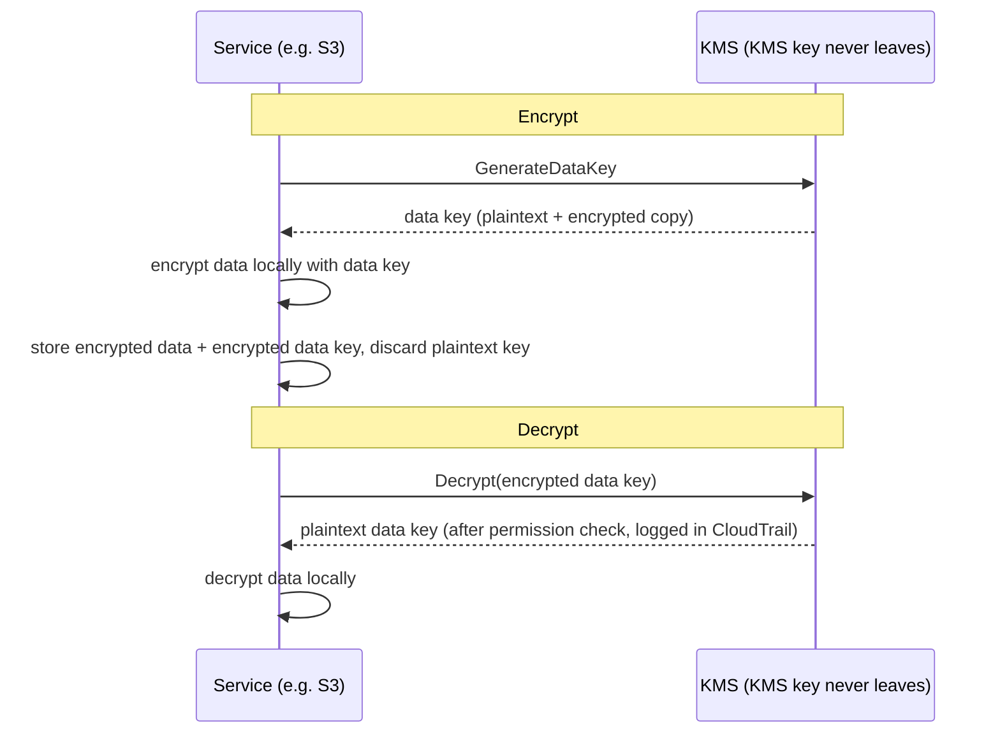

# অধ্যায় ১৬: Key, Lock এবং Secret

Git repository-তে দুই বছর পিছিয়ে যাওয়া হাজার হাজার commit ছিল। Leo বিশ মিনিট ধরে scroll করছিল, history-র মধ্য দিয়ে একটি সূত্র অনুসরণ করে — খুঁজছিল কখন একটি নির্দিষ্ট database connection string প্রথম দেখা দিয়েছিল। সে এটা প্রায় miss করল। এটা ছিল একটি মঙ্গলবার বিকেলে, দুটি unremarkable commit-এর মাঝে, এমন কারো দ্বারা push করা যে এর মধ্যে company ছেড়ে গেছে।

একটি database password। Plain text-এ। History-তে।

---

*গত অধ্যায়ের network control এখন শক্ত ছিল। Security group lateral movement সীমিত করেছিল। NACL known-bad IP range block করেছিল। Perimeter hardened হয়েছিল। কিন্তু security audit এমন কিছু পেয়েছিল যা perimeter ঠিক করতে পারেনি: একটি credential যা ছয় মাস ধরে git history-তে বসবাস করছিল। Perimeter security ধরে নেয় ভেতরের secret নিরাপদ। এটি ছিল না।*

---

Leo git history review করছিল যখন সে এটি পেল। একটি database password। ছয় মাস আগে committed, plain text-এ, Nimbus-এ আর কাজ করে না এমন কারো দ্বারা — একটি `.env` ফাইলের অংশ যাতে deployment pipeline-এর IAM access key-ও ছিল, connection string-এর দুই লাইন নিচে। Commit public ছিল। Password তখন থেকে পরিবর্তন করা হয়েছিল — কিন্তু তারা সেটা নিশ্চিত জানত না। তারা উভয় credential কখনো touch করা প্রতিটি সিস্টেম check করল। চার ঘণ্টা লাগল। সেই দিনটাই Nimbus code-এ secret রাখা বন্ধ করার সিদ্ধান্ত নিল।

"কেউ repo fork করলে কী হয় তা নিয়ে আমরা ভেবেছি কি?" Priya বলল। "Git history স্থায়ী। এমনকি আমরা password পরিবর্তন করলেও, fix-এর আগে যে কেউ repo clone করেছিল তাদের local history-তে এখনো পুরানো credential আছে।"

"আমরা check করেছি," Leo বলল। "Password তিন মাস আগে পরিবর্তন করা হয়েছিল। সমস্ত সিস্টেম নিশ্চিত করেছে।"

"সেটা ন্যূনতম," Priya বলল। "কিন্তু সেই credential touch করা প্রতিটি সিস্টেম review করতে হবে। শুধু আপনি জানেন সেগুলি নয়।"

**চার-ঘণ্টার Audit**

Leo সকাল ১০টায় git history-তে ফাঁস হওয়া `.env` ফাইল পেয়েছিল। দুপুর ২টার মধ্যে, তাদের কাছে গুরুত্বপূর্ণ প্রশ্নের উত্তর ছিল: উভয় credential — database password বা এর পাশাপাশি committed access key — কি Nimbus সিস্টেম ছাড়া অন্য কেউ ব্যবহার করেছিল?

Audit চারটি category-র মধ্য দিয়ে চলল।

**RDS access log**: ডেটাবেসে প্রতিটি connection, timestamped এবং logged। ফাঁস হওয়া password তিনটি connection string-এ দেখা দিয়েছিল — সবই Nimbus VPC-র EC2 instance থেকে, সবই প্রত্যাশিত source IP সহ। কোনো external connection নেই। Password বাইরে থেকে ডেটাবেসে connect করতে ব্যবহার করা হয়নি।

**S3 access log**: ফাঁস হওয়া access key deployment pipeline-এর IAM user-এর ছিল, যার `nimbus-receipts` bucket-এর অনুমতি ছিল। Leo গত ছয় মাসের জন্য S3 server access log query করল। প্রতিটি access `us-west-2` EC2 instance বা CloudFront origin fetch role থেকে এসেছিল। কোনো অসংগতি নেই।

**CloudTrail API call**: ফাঁস হওয়া access key ID দিয়ে করা প্রতিটি AWS API call। Leo key-এর জন্য CloudTrail event filter করল। তিনশো বারোটি event — সবই deployment pipeline থেকে routine `s3:PutObject` call, সবই একই IP থেকে, সবই business hours-এর মধ্যে। Key কখনো শুধুমাত্র একটি IP address থেকে ব্যবহার করা হয়েছিল, যা CI/CD server-এর সাথে মিলেছিল।

"এবং CI/CD server," Priya বলল, "VPC-এর ভেতরে। এটিকে HTTPS-এর মাধ্যমে একটি external endpoint-এ ডেটা exfiltrate করতে হত, এবং আমরা flow log-এ সেটা দেখতাম।"

"আমরা check করেছি," Leo বলল। "গত ছয় মাসে সেই server থেকে non-AWS IP-তে কোনো outbound HTTPS নেই।"

**রায়**: কোনো credential Nimbus team-এর বাইরে কেউ ব্যবহার করেনি। Exposure ছিল একটি ঝুঁকি, একটি breach নয়।

"কিন্তু আমরা নিশ্চিত হতে পারি না," Priya বলল। "আমরা log-এর উপর ভিত্তি করে যুক্তিসঙ্গতভাবে আত্মবিশ্বাসী হতে পারি। আমরা নিশ্চিত হতে পারি না। সেই পার্থক্য গুরুত্বপূর্ণ।"

"আমাদের কী নিশ্চিত করত?"

"একটি credential exposure-এর পরে কিছুই আপনাকে নিশ্চিত করে না। আপনি credential rotate করেন, access audit করেন, আপনার finding document করেন এবং আরো ভালো control নিয়ে এগিয়ে যান। নিশ্চয়তা available নয়।"

Tom কথোপকথনের সময় গণনা করছিল। "তিনজন engineer-এর চার ঘণ্টা সময়। এটাকে fully-loaded cost-এ চার হাজার ডলার বলুন। Plus credential rotation, documentation, incident write-up।"

"এবং সেটা শুধু তদন্ত," Priya বলল। "একটি breach মাত্রায় অনেক বেশি হত। Regulatory notification। গ্রাহক communication। সম্ভাব্য জরিমানা।"

"তাহলে চার হাজার ডলারের শিক্ষা সস্তা ছিল," Tom বলল।

"যথেষ্ট," Priya বলল। "চলুন এটা পুনরাবৃত্তি না করি।"

---

**দুটি সমস্যা: Secret সংরক্ষণ এবং ডেটা এনক্রিপ্ট করা**

সংবেদনশীল তথ্যের চারপাশে নিরাপত্তার দুটি স্বতন্ত্র সমস্যা আছে:

**Credential সংরক্ষণ** (database password, API key, connection string): এগুলি কোথায় থাকে? কে অ্যাক্সেস করতে পারে? আপনার application redeploy না করে কীভাবে rotate করেন?

**ডেটা এনক্রিপ্ট করা** (গ্রাহক তথ্য, payment record, PII): আপনি কীভাবে নিশ্চিত করেন যে কেউ আপনার database বা S3 bucket-এ unauthorized অ্যাক্সেস পেলেও, তারা ডেটা পড়তে পারে না?

AWS-এর প্রতিটি সমস্যার জন্য একটি dedicated service আছে:

- **AWS Secrets Manager**: Credential নিরাপদে সংরক্ষণ এবং পরিচালনা করে
- **AWS KMS (Key Management Service)**: ডেটা এনক্রিপ্ট এবং decrypt করার জন্য encryption key পরিচালনা করে

Secrets Manager-কে একটি keychain হিসেবে মনে করুন: এটি আপনার key (credential) ধরে রাখে, সেগুলি সংগঠিত রাখে এবং একটি schedule-এ rotate করে। KMS-কে একটি vault হিসেবে মনে করুন: এটি মূল্যবান যা তা ধরে রাখে না — এটি সেই key ধরে রাখে যা মূল্যবান যা রক্ষা করা lock খোলে।

**AWS Secrets Manager: আর Hardcoded Credential নয়**

Secrets Manager হলো secret-এর জন্য একটি secure store: database credential, API key, OAuth token, SSH key, বা যেকোনো সংবেদনশীল কিছু।

আপনার application একটি environment variable বা config ফাইল থেকে একটি password পড়ার পরিবর্তে, এটি startup-এ (বা প্রয়োজনে) Secrets Manager API call করে এবং secret retrieve করে। Secret কখনো disk স্পর্শ করে না। এটি কখনো আপনার code-এ প্রদর্শিত হয় না। এটি আপনার environment variable-এ নেই।

প্রবাহ এভাবে দেখায়:

**পুরানো উপায়**:
```
DB_PASSWORD=supersecretpassword123  # .env file বা environment variable-এ
```

**Secrets Manager উপায়**:
```python
import boto3
client = boto3.client('secretsmanager')
secret = client.get_secret_value(SecretId='nimbus/production/db-password')
password = json.loads(secret['SecretString'])['password']
```

EC2 instance-এর সেই নির্দিষ্ট secret-এর জন্য `secretsmanager:GetSecretValue` call করার অনুমতি সহ একটি IAM role প্রয়োজন। অন্য কোনো service এটি পড়তে পারে না। Secret কখনো code-এ নেই।

আপনি হয়তো ভাবছেন: শুধু environment variable কেন ব্যবহার করব না? সেগুলি সহজ — deploy time-এ set করুন, এবং application পড়ে। Environment variable লুকানো মনে হয়, কিন্তু সেগুলি আপনার deployment configuration-এ, CI/CD secrets store-এ store করা থাকে, debug session-এর সময় সম্ভবত logged হয় এবং চলমান process-এ access সহ যে কারো কাছে দৃশ্যমান। আরো গুরুত্বপূর্ণ, সেগুলি static: একবার set হলে, কেউ ম্যানুয়ালি আপডেট না করা পর্যন্ত সেগুলি পরিবর্তিত হয় না। Secrets Manager IAM access control, CloudTrail-এর মাধ্যমে full audit logging এবং automatic rotation সহ একটি encrypted service-এ credential store করে। Environment variable rotate হয় না। একটি ফাঁস হওয়া environment variable কেউ ম্যানুয়ালি পরিবর্তন না করা পর্যন্ত বৈধ থাকে।

**Automatic Rotation: প্রকৃত শক্তি**

Secrets Manager-এর সবচেয়ে বড় feature secret সংরক্ষণ নয় — এটি সেগুলি স্বয়ংক্রিয়ভাবে rotate করা।

দৃশ্যকল্প: প্রতি ৩০ দিনে, Secrets Manager একটি নতুন database password তৈরি করে, RDS-এ এটি আপডেট করে, stored secret আপডেট করে এবং আপনার application পরবর্তীবার প্রয়োজন হলে নতুন password retrieve করে। কোনো manual intervention নেই। কোনো deployment নেই। কোনো "এটা rotate করতে মনে রাখতে হবে।"

Rotation একটি Lambda function হিসেবে implement করা হয়। AWS RDS database (MySQL, PostgreSQL, Aurora)-এর জন্য template প্রদান করে। আপনি যেকোনো credential type-এর জন্য function customize করতে পারেন।

"মাসে এর খরচ কত?" Tom জিজ্ঞেস করল।

Secrets Manager প্রতি secret প্রতি মাসে plus প্রতি API call চার্জ করে। কম সংখ্যক database password এবং API key-এর জন্য, খরচ হলো মাসে কয়েক ডলার — একটি ঘটনার খরচের তুলনায় negligible।

"গত সপ্তাহের compromise," Priya বলল, "investigate এবং remediate করতে কত খরচ হত?"

Tom একটি মুহূর্ত চুপ ছিল। "আমার সময়, আপনার সময়, Leo-র সপ্তাহান্ত সহ... কয়েক হাজার ডলার।"

"Secrets Manager static key exploit হওয়ার আগে catch করত। এবং এটি স্বয়ংক্রিয়ভাবে rotate করত।"

Tom pricing page তুলল।

**Rotation-এর সময় কী হয়**

"দাঁড়াও — কিন্তু আমরা *কেন* এভাবে করব?" Maya জিজ্ঞেস করল। "Database password rotate হলে, application কি ভাঙে? এটা deployment ছাড়া নতুন password কীভাবে pick up করে?"

এটি একটি বৈধ উদ্বেগ ছিল। বিঘ্ন ছাড়া rotation সতর্কতা প্রয়োজন।

Secrets Manager rotation stage-এ কাজ করে — "পুরানো password হঠাৎ invalid, application crash" দৃশ্যকল্প প্রতিরোধ করার জন্য ডিজাইন করা:

**Stage 1: নতুন secret version তৈরি।** Secrets Manager একটি নতুন password তৈরি করে এবং এটি secret-এর একটি pending version হিসেবে store করে। বর্তমান version এখনো active।

**Stage 2: Service-এ set।** Rotation Lambda password নতুন মানে আপডেট করতে ডেটাবেস call করে। সচেতন থাকুন: ডিফল্ট **single-user** rotation strategy-তে একটি সংক্ষিপ্ত মুহূর্ত থাকে যখন পুরানো password সবে কাজ করা বন্ধ করেছে (PostgreSQL-এর `ALTER ROLE ... PASSWORD` তাৎক্ষণিকভাবে কার্যকর হয়) এবং নতুন version এখনো current নয়। Zero-downtime rotation-এর জন্য, Secrets Manager একটি **alternating-users** strategy সমর্থন করে: অভিন্ন অনুমতি সহ দুটি database user, যেখানে rotation সবসময় *inactive* টি আপডেট করে এবং তারপর switch করে — active credential কখনো mid-flight invalidate হয় না। মনে রাখার পরীক্ষার phrase হলো "alternating users rotation strategy।"

**Stage 3: নতুন secret test।** Rotation Lambda এটি দিয়ে connect করে নতুন password কাজ করে তা যাচাই করে। এটি ব্যর্থ হলে, rotation roll back হয়।

**Stage 4: শেষ।** Secrets Manager নতুন version-কে current version হিসেবে চিহ্নিত করে এবং পুরানো version-কে একটি previous version-এ demote করে। Previous version একটি grace period-এর জন্য রাখা হয়।

Grace period-এর সময়, উভয় version retrievable। আপনার application পুরানো secret cache করে থাকলে এবং এখনো নতুনটি pick up না করলে, এটি এখনো connect করতে পারে। পরেরবার এটি `GetSecretValue` call করলে, এটি current (নতুন) version পায়।

"তাহলে application কখনো restart করার দরকার নেই," Leo বলল।

"অগত্যা নয়। আপনার application startup-এ secret cache করলে এবং কখনো refresh না করলে, আপনাকে হয় একটি schedule-এ এটি refresh করতে হবে বা secret re-fetch করে authentication failure handle করতে হবে।"

"তাহলে rotation Lambda এবং application-কে সহযোগিতা করতে হবে," Maya বলল।

"Secrets Manager তার অর্ধেক করে। আপনার application code-কে অন্য অর্ধেক করতে হবে: প্রয়োজনে secret fetch করুন, secret re-fetch করে authentication failure handle করুন।"

Leo application আপডেট করল database authentication exception catch করতে এবং, failure-এ, retry করার আগে Secrets Manager থেকে একটি fresh secret fetch করতে। দুই লাইন error handling। Rotation ব্যবহারকারীদের কাছে অদৃশ্য হয়ে গেল।

---

**CI/CD Pipeline Secret Injection**

"deployment pipeline তার প্রয়োজনীয় secret কীভাবে পায় তা নিয়ে আমরা ভেবেছি কি?" Priya জিজ্ঞেস করল। "Pipeline অবকাঠামো deploy করে। এর AWS credential দরকার। migration script-এর জন্য এর database connection string দরকার হতে পারে।"

Leo বর্তমান setup ব্যাখ্যা করল: secret GitHub Actions Secrets হিসেবে store করা ছিল — GitHub-এ rest-এ encrypted, runtime-এ environment variable হিসেবে injected।

"Credential GitHub-এ," Priya বলল।

"Encrypted।"

"একটি third-party system-এ। একটি GitHub breach আমাদের সমস্ত pipeline secret expose করে।"

সমাধান: deployment pipeline OIDC federation-এর মাধ্যমে AWS-এ authenticate করে (অধ্যায় ১৪-এ covered) এবং runtime-এ Secrets Manager থেকে এর প্রয়োজনীয় যেকোনো secret retrieve করে। GitHub-এ কোনো secret store করা নেই। Pipeline-এর AWS role-এর নির্দিষ্ট secret পড়ার অনুমতি আছে, আর কিছু নয়।

```yaml
# GitHub Actions workflow
- name: Get DB Migration Credentials
  env:
    AWS_DEFAULT_REGION: us-west-2
  run: |
    SECRET=$(aws secretsmanager get-secret-value \
      --secret-id nimbus/staging/db-migration \
      --query SecretString --output text)
    DB_URL=$(echo $SECRET | jq -r '.url')
    # Run migration with DB_URL — never stored in a file
    flyway -url="$DB_URL" migrate
```

Secret fetch করা হয়, memory-তে ব্যবহার করা হয় এবং বাতিল করা হয়। এটি কখনো disk-এ লেখা হয় না, job-এর পরে persist করা environment variable-এ কখনো store করা হয় না, একটি log ফাইলে কখনো নেই।

"Secret log-এ print হলে কী?" Leo জিজ্ঞেস করল।

"GitHub Actions স্বয়ংক্রিয়ভাবে GitHub Secrets হিসেবে configure করা secret-এর মান mask করে। কিন্তু এই secret একটি GitHub Secret নয় — এটি Secrets Manager থেকে আসে। আপনাকে এটি ম্যানুয়ালি mask করতে হবে, বা আরো ভালো, কখনো log করবেন না।"

"তাহলে শৃঙ্খলা হলো: fetch, use, discard। কখনো secret log করবেন না। কখনো ফাইলে store করবেন না।"

"সেই শৃঙ্খলা," Priya বলল, "চার-ঘণ্টার audit নিশ্চিত করেছিল আমরা ব্যর্থ হচ্ছিলাম।"


**AWS KMS: Lock Factory**

"দাঁড়াও — কিন্তু আমরা *কেন* এভাবে করব?" Maya জিজ্ঞেস করল। "একটি আলাদা key management service কেন? আমরা কি নিজেরা ডেটা encrypt করে key Secrets Manager-এ store করতে পারি না?"

আপনি Secrets Manager-এ encryption key store করতে পারেন। কিন্তু তখন কে key-তে access নিয়ন্ত্রণ করে? কী নিশ্চিত করে key rotate হয়? একজন auditor-কে কী প্রমাণ করে যে key শুধুমাত্র authorized service ব্যবহার করেছিল? KMS এই সব প্রশ্নের উত্তর দেয়। এটা শুধু storage নয় — এটা hardware-backed security, প্রতি key fine-grained IAM policy এবং প্রতিটি ব্যবহারের একটি সম্পূর্ণ audit trail সহ একটি key lifecycle management service। Secrets Manager সিস্টেমে connect করতে আপনার যা প্রয়োজন তা store করে। KMS সিস্টেম নিজেদের রক্ষা করে।

AWS KMS (Key Management Service) **cryptographic key** পরিচালনা করে — ডেটা encrypt এবং decrypt করার জন্য ব্যবহৃত secret value।

উপমা: KMS একটি lockbox company-র মতো যা master key ধরে রাখে। আপনার ডেটা (box-এর বিষয়বস্তু) encrypted। শুধুমাত্র KMS key ব্যবহার করার অনুমতি সহ কেউ এটি decrypt করতে পারে। KMS CloudTrail-এ প্রতিটি key-এর প্রতিটি ব্যবহার log করে।

**Customer Master Key (CMK)** — এখন KMS key বলা হয় — তিন ধরনের মালিকানায় আসে:

**AWS owned key**: AWS-এর মালিকানাধীন এবং অনেক customer account জুড়ে ব্যবহৃত key — আপনি সেগুলি কখনো দেখেন না, কখনো এর জন্য পেমেন্ট করেন না, এবং সেগুলি আপনার account-এ দেখা যায় না। বেশ কিছু service default এগুলি ব্যবহার করে (DynamoDB-র default encryption, উদাহরণস্বরূপ)।

(একটি পার্থক্য সোজা রাখার মতো: S3-র default **SSE-S3** encryption আদৌ একটি KMS key model নয় — S3 KMS-এর সম্পূর্ণ বাইরে তার নিজস্ব AES-256 key পরিচালনা করে, দেখার কোনো key নেই এবং key-usage audit trail নেই। **SSE-KMS** হলো সেই S3 বিকল্প যা KMS-এর মধ্য দিয়ে যায়, হয় AWS managed key `aws/s3` বা একটি customer-managed key ব্যবহার করে। পরীক্ষার trigger: "কে encryption key ব্যবহার করেছে তা audit করুন" বা "rotation এবং key policy নিয়ন্ত্রণ করুন" → একটি customer-managed key সহ SSE-KMS — প্রতিটি ব্যবহার CloudTrail-এ পৌঁছায়।)

**AWS managed key**: AWS S3, EBS, RDS-এর মতো service-এর জন্য *আপনার account-এ* স্বয়ংক্রিয়ভাবে key তৈরি এবং পরিচালনা করে (`aws/s3`-এর মতো নাম)। আপনি এটি দেখতে পারেন এবং CloudTrail-এ এর ব্যবহার audit করতে পারেন, কিন্তু আপনি এর policy বা rotation পরিবর্তন করতে পারেন না — AWS প্রতি বছর স্বয়ংক্রিয়ভাবে এটি rotate করে। বিনামূল্যে।

**Customer managed key**: আপনি KMS-এ key তৈরি করেন এবং এর প্রতিটি দিক নিয়ন্ত্রণ করেন: কে এটি ব্যবহার করতে পারে, কখন এটি rotate হয়, কে এটি administer করতে পারে। আপনি 90 দিন থেকে 2,560 দিন (7 বছর)-এর মধ্যে একটি configurable period সহ automatic key rotation সক্ষম করতে পারেন; ডিফল্ট rotation period 365 দিন (বার্ষিক)। আপনি তাৎক্ষণিকভাবে একটি **on-demand rotation**-ও trigger করতে পারেন — একটি সন্দেহজনক exposure-এর পরে দরকারী, schedule-এর জন্য অপেক্ষা না করে। Note: automatic rotation KMS-generated material সহ symmetric key-তে প্রযোজ্য — asymmetric key এবং imported key material auto-rotate করতে পারে না। Cost: প্রতি মাসে প্রতি key $1 plus per-API-call charge।

আপনি যদি customer-managed KMS key বেছে নেন, তাহলে আপনি rotation schedule, access policy এবং audit visibility-র উপর full control পান, কিন্তু আপনি প্রতি মাসে প্রতি key পেমেন্ট করেন এবং key management-এর দায়িত্ব নেন; আপনি যদি AWS-managed key বেছে নেন, তাহলে আপনি শূন্য operational overhead এবং key নিজের জন্য কোনো খরচ ছাড়া encryption পান, কিন্তু আপনি rotation schedule বা key policy customize করতে পারেন না — সেগুলি সম্পূর্ণভাবে AWS দ্বারা পরিচালিত।

**AWS Service-এ Encryption: KMS Integration**

বেশিরভাগ AWS service encryption-এর জন্য KMS-এর সাথে integrate করে:

**S3**: একটি bucket-এ "server-side encryption with KMS" সক্ষম করুন। প্রতিটি object একটি KMS key দিয়ে rest-এ encrypted। একটি object পড়তে S3 bucket *এবং* KMS key উভয়ের অনুমতি প্রয়োজন।

**RDS**: তৈরির সময় encryption সক্ষম করুন। Database storage, backup এবং snapshot সব একটি KMS key দিয়ে encrypted। Note: একটি existing unencrypted RDS instance-এ encryption সক্ষম করা যায় না — আপনাকে snapshot করতে হবে, encryption সক্ষম করে snapshot copy করতে হবে এবং restore করতে হবে।

**EBS**: KMS দিয়ে volume encrypt করুন। Encrypted snapshot থেকে তৈরি নতুন volume স্বয়ংক্রিয়ভাবে encrypted।

**DynamoDB**: KMS ব্যবহার করে rest-এ encryption সমস্ত table-এ ডিফল্টরূপে সক্ষম।

**ElastiCache Redis**: সংবেদনশীল cached ডেটার জন্য KMS দিয়ে rest-এ encryption।

Principle: ডেটা rest-এ (disk-এ stored) এবং transit-এ (একটি network জুড়ে moving) encrypted হওয়া উচিত। KMS at-rest encryption সামলায়। TLS/SSL (AWS service দ্বারা স্বয়ংক্রিয়ভাবে প্রদান) in-transit encryption সামলায়।

**Envelope Encryption: KMS আসলে কীভাবে কাজ করে**

এখানে একটি বিস্তারিত যা KMS আচরণ এবং পরীক্ষার প্রশ্ন বুঝতে সাহায্য করে।

বেশিরভাগ ক্ষেত্রে KMS সরাসরি আপনার ডেটা encrypt করে না। এটি **envelope encryption** ব্যবহার করে:

1. KMS একটি **data key** তৈরি করে (একটি unique symmetric key)
2. Service data key ব্যবহার করে আপনার ডেটা locally encrypt করে (দ্রুত — symmetric encryption)
3. Service KMS-কে data key নিজেই encrypt করতে বলে (আপনার KMS key ব্যবহার করে)
4. Encrypted ডেটা এবং encrypted data key উভয়ই stored
5. আপনার প্রকৃত ডেটা কখনো service ছেড়ে যায় না — শুধুমাত্র data key encryption/decryption-এর জন্য KMS-এ যায়

আপনি ডেটা পড়লে:

1. Service KMS-কে data key decrypt করতে বলে
2. KMS অনুমতি check করে, data key decrypt করে, এটি return করে
3. Service decrypted data key ব্যবহার করে আপনার ডেটা locally decrypt করে



এর মানে KMS সমস্ত ডেটা KMS API-এর মাধ্যমে না পাঠিয়ে খুব বড় ডেটা handle করতে পারে। শুধুমাত্র ছোট key KMS-এ যায়। CloudTrail প্রতিটি KMS API call log করে — প্রতিটি encrypt এবং decrypt operation।

**KMS Key Policy: Access Model**

"একটি IAM policy এবং একটি key policy conflict করলে কী হয় তা নিয়ে আমরা ভেবেছি কি?" Priya জিজ্ঞেস করল। "KMS-এর IAM-এর উপরে নিজস্ব access control আছে।"

KMS key-এর **key policy** আছে — key নিজেই attached resource-based policy। সেগুলি IAM policy থেকে স্বতন্ত্র এবং ভিন্ন evaluation নিয়ম অনুসরণ করে।

একটি principal-এর একটি KMS key ব্যবহার করতে, দুটি জিনিস সত্য হতে হবে:

**প্রথম**: Key policy এটি allow করতে হবে। Key policy যদি principal-কে স্পষ্টভাবে access grant না করে, তারা key ব্যবহার করতে পারে না — তাদের IAM policy যাই বলুক না কেন। এটি বেশিরভাগ AWS resource থেকে ভিন্ন, যেখানে IAM policy একা যথেষ্ট।

**দ্বিতীয়**: Principal-এর IAM policy KMS action (যেমন, `kms:Decrypt`, `kms:GenerateDataKey`) allow করতে হবে।

উভয়কে হ্যাঁ বলতে হবে। যেকোনো একটি না বললে action denied।

AWS customer-managed key-এর জন্য যে default key policy তৈরি করে তাতে একটি statement অন্তর্ভুক্ত থাকে যা বলে "root account এই key পরিচালনা করতে পারে।" এটা গুরুত্বপূর্ণ: এর মানে একজন account-স্তরের IAM administrator সবসময় একটি key-তে access grant করতে পারে, এমনকি key policy সরাসরি তাদের নাম না করলেও — কারণ root account delegation জায়গায় আছে।

"তাহলে আমরা key policy থেকে root account সরালে," Leo জিজ্ঞেস করল, "সেই key-এর জন্য IAM policy কাজ করা বন্ধ করে?"

"সঠিক। Root account delegation সরানো একটি key এত শক্তভাবে lock down করার একটি উপায় যে শুধুমাত্র key policy-তে নামকৃত নির্দিষ্ট principal এটি ব্যবহার করতে পারে — এমনকি account administrator-ও নয়। এটি আপনার নিজের key থেকে দুর্ঘটনাক্রমে নিজেকে lock out করার একটি উপায়ও।"

"আমরা কি recover করতে পারি?"

"শুধুমাত্র AWS Support-এর সাথে যোগাযোগ করে। কেউ যদি key ব্যবহার করতে না পারে এবং key policy আপডেট করা না যায়, সেই key দিয়ে encrypted ডেটা কার্যকরভাবে inaccessible।"

"তাহলে একটি অত্যন্ত ভালো কারণ ছাড়া key policy থেকে root account সরাবেন না।"

"সঠিক।"

---

**Asymmetric Key: Signing এবং Verification**

KMS asymmetric key pair-ও সমর্থন করে — একটি public key এবং একটি private key।

ব্যবহারের ক্ষেত্র:

**Digital signing**: আপনি private key দিয়ে একটি document বা একটি JWT token সাইন করেন। Public key সহ যে কেউ যাচাই করতে পারে যে signature private key-এর ধারক থেকে এসেছে এবং content tamper করা হয়নি।

**Public key encryption**: যে কেউ public key দিয়ে ডেটা encrypt করতে পারে। শুধুমাত্র private key-এর ধারক এটি decrypt করতে পারে।

Nimbus-এর জন্য, asymmetric key প্রাসঙ্গিক হলো যখন তারা রেস্তোরাঁ অংশীদারদের জন্য একটি webhook signature সিস্টেম implement করল। Nimbus একটি রেস্তোরাঁ অংশীদারের server-এ একটি event পাঠালে (একটি নতুন অর্ডার, একটি status update), অংশীদারকে যাচাই করতে হবে event আসলে Nimbus থেকে এসেছে এবং forge করা হয়নি।

Implementation:

1. Nimbus একটি asymmetric KMS key তৈরি করে (RSA 2048-bit, SIGN_VERIFY algorithm)
2. একটি webhook পাঠানোর সময়, Nimbus event payload সাইন করতে private key দিয়ে `kms:Sign` call করে
3. Signature webhook header-এ অন্তর্ভুক্ত করা হয়
4. Nimbus public key publish করে (KMS console থেকে downloadable)
5. রেস্তোরাঁ অংশীদারের server public key fetch করে এবং প্রতিটি incoming webhook-এ signature যাচাই করতে এটি ব্যবহার করে

Private key কখনো KMS ছেড়ে যায় না। Nimbus-এর কখনো raw private key material-এ access নেই। KMS তার hardware security module-এর ভেতরে signing operation সম্পাদন করে।

"তাহলে কেউ একটি Nimbus server compromise করলেও," Rafael বলল, "তারা একটি webhook signature forge করতে পারবে না। Private key KMS-এ, কোনো server-এ নয়।"

"সঠিক। Signing-এর জন্য একটি KMS API call প্রয়োজন। প্রতিটি API call CloudTrail-এ logged। কেউ একটি জালিয়াতি event সাইন করার চেষ্টা করলে, আমরা API call দেখতাম।"

---

**Key Deletion গল্প**

KMS setup-এর তিন মাস পরে, Tom একটি ভুল করল।

সে অব্যবহৃত AWS resource পরিষ্কার করছিল — পুরানো Lambda function, stale S3 bucket, পরিত্যক্ত CloudWatch dashboard। সে দ্রুত move করছিল। সে দুর্ঘটনাক্রমে একটি KMS key deletion-এর জন্য schedule করল।

Key ছিল `nimbus/prod/order-receipts` — order receipts S3 bucket encrypt করতে ব্যবহৃত customer-managed key।

"আমি গতকাল বারোটি resource batch-delete করেছি এবং বারোতমটি কী ছিল তা check করিনি," Tom সমতলভাবে বলল। সে deletion schedule করেছিল এবং এগিয়ে গিয়েছিল। সে পরের সকালে তার action review করার সময় ভুলটি লক্ষ্য করল।

সে KMS console তুলল। Key status পড়ল: "Pending deletion। Deletion in 7 days।"

সে এটি ন্যূনতম waiting period-এর জন্য schedule করেছিল।

"আমরা কি এটা cancel করতে পারি?" সে জিজ্ঞেস করল।

Priya documentation তুলল। "হ্যাঁ। Waiting period-এর সময়, key disabled কিন্তু deleted নয়। আপনি deletion cancel করতে পারেন।"

Tom মিনিটের মধ্যে deletion cancel করল। Key active status-এ restore হলো।

"সাত দিন হলো ন্যূনতম waiting period," Priya বলল। "AWS এটি enforce করে কারণ একটি key delete হলে এবং এটি দিয়ে ডেটা encrypted হলে, সেই ডেটা চিরতরে চলে যায়। Unrecoverable। Waiting period আপনাকে ভুল বুঝতে সময় দেয়।"

"Waiting period কত হওয়া উচিত?"

"সর্বোচ্চ ত্রিশ দিন। যে কোনো key production ডেটা encrypt করে, ত্রিশ দিন ব্যবহার করুন। দুর্ঘটনার বিরুদ্ধে অতিরিক্ত তিন সপ্তাহের সুরক্ষা minor অসুবিধার মূল্য।"

Tom সমস্ত production key deletion setting ত্রিশ দিনে আপডেট করল। সে একটি CloudWatch alarm-ও সেট আপ করল যা fire করে যদি কোনো KMS key status "Pending deletion"-এ পরিবর্তিত হয় — যাতে পরেরবার কেউ (সে সহ) একই ভুল করলে, দল পাঁচ মিনিটের মধ্যে জানবে।

---

**Secrets Manager বনাম Parameter Store**

AWS-এর **Systems Manager Parameter Store**-ও আছে, যা configuration value (শুধু secret নয়) store করে। Parameter Store সস্তা — standard parameter-এর জন্য বিনামূল্যে। এটি KMS ব্যবহার করে encrypted parameter-ও store করতে পারে।

Rotation প্রয়োজন secret-এর জন্য: Secrets Manager।

Configuration value এবং non-sensitive parameter-এর জন্য: Parameter Store (free tier খুব generous)।

Application configuration-এর জন্য (port number, feature flag, environment-specific setting): Parameter Store।

| | Secrets Manager | SSM Parameter Store |
|---|---|---|
| Automatic rotation | হ্যাঁ (Lambda-backed) | না |
| Cost | ~$0.40/secret/month | বিনামূল্যে (standard) |
| Encryption | সবসময় | ঐচ্ছিক (KMS সহ) |
| Versioning | হ্যাঁ | হ্যাঁ |
| Cross-account access | হ্যাঁ | সীমিত |
| Best for | Database password, API key | Config value, feature flag |

## দরজার Certificate

Secret migration-এর দুই সপ্তাহ পরে, Priya তার ফোনে Nimbus staging environment review করছিল যখন সে address bar লক্ষ্য করল।

"Not Secure।"

সে production URL তুলল। একই জিনিস।

"Leo," সে বলল, ফোন টেবিলে রেখে। "আমরা কি HTTP-তে চলছি?"

Leo check করল। "ALB listener port 80-এ। আমরা কখনো HTTPS সেট আপ করিনি।"

"তাহলে আমাদের ব্যবহারকারীরা করা প্রতিটি request — প্রতিটি অর্ডার, প্রতিটি login — unencrypted HTTP-তে যাচ্ছে?"

"আমাদের RDS connection-এ TLS আছে," Leo প্রস্তাব করল।

"সেটা application এবং database-এর মধ্যে transit-এ ডেটা। আমি ব্যবহারকারীর browser এবং আমাদের load balancer-এর মধ্যে transit-এ ডেটার কথা বলছি। সেটা আদৌ encrypted নয়।"

Tom শুনছিল। "এটা কি একটা নিরাপত্তা সমস্যা নাকি একটা perception সমস্যা?"

"উভয়," Priya বলল। "Unencrypted HTTP মানে ব্যবহারকারী এবং আমাদের server-এর মধ্যে যেকোনো network — একটি coffee shop router, একটি ISP — ট্রাফিক পড়তে পারে। Password, অর্ডার detail, session token। এবং আধুনিক browser ব্যবহারকারীদের 'Not Secure' দিয়ে সতর্ক করে। সেটা conversion rate মেরে ফেলে।"

"তাহলে আমাদের একটি TLS certificate দরকার," Maya বলল। "এর খরচ কত?"

"কিছুই না," Priya বলল। "AWS Certificate Manager।"

**AWS Certificate Manager (ACM)** AWS-managed service-এর সাথে ব্যবহারের জন্য বিনামূল্যে TLS/SSL certificate provision করে: ALB, CloudFront distribution এবং API Gateway। আপনি একটি certificate কেনেন না, একটি renewal calendar পরিচালনা করেন না, বা private key material স্পর্শ করেন না। ACM সম্পূর্ণ certificate lifecycle সামলায়।

ACM দ্বারা ইস্যু করা একটি certificate 13 মাসের জন্য বৈধ। এটি expire হওয়ার আগে, ACM স্বয়ংক্রিয়ভাবে এটি renew করে। Renewal সফল হলে, নতুন certificate আপনার কোনো action ছাড়াই আপনার load balancer বা distribution-এ attached হয়। Browser-এর padlock সবুজ থাকে। আপনি সেট করতে ভুলে যাওয়া expiry alert কখনো fire করে না।

**দুই ধরনের ACM certificate**:

**Public certificate** Amazon-এর certificate authority দ্বারা ইস্যু করা এবং সমস্ত প্রধান browser দ্বারা trusted। সেগুলি ALB, CloudFront এবং API Gateway-এর সাথে ব্যবহারের জন্য সম্পূর্ণ বিনামূল্যে। আপনি DNS বা email-এর মাধ্যমে domain-এর মালিকানা validate করেন।

**Private certificate** AWS Private CA দ্বারা ইস্যু করা — internal service (service-to-service mTLS, internal tooling, VPN client)-এর জন্য আপনি যে managed private certificate authority চালান। Private CA-র একটি মাসিক খরচ আছে।

Nimbus-এর জন্য, public certificate সঠিক পছন্দ ছিল।

**DNS validation বনাম email validation**:

Leo ACM console তুলল এবং `eatnimbus.com` এবং `*.eatnimbus.com`-এর জন্য একটি certificate request শুরু করল।

"এটা জিজ্ঞেস করছে আমি কীভাবে মালিকানা validate করতে চাই," সে বলল। "DNS নাকি email।"

"DNS," Priya বলল। "সবসময় DNS।"

DNS validation-এর সাথে, ACM আপনার hosted zone-এ একটি নির্দিষ্ট CNAME record যোগ করে। Route 53 এটি স্বয়ংক্রিয়ভাবে করতে পারে — console-এ এক click। যতক্ষণ সেই CNAME record বিদ্যমান, ACM কোনো human action ছাড়াই certificate auto-renew করতে পারে। Email validation domain-এর registered contact-এ একটি email পাঠায় এবং certificate renew হওয়ার প্রতিবার একটি manual click প্রয়োজন। সেই click ভুলে যাওয়া হয়। DNS validation-এর কাউকে কিছু মনে রাখার প্রয়োজন নেই।

"তাহলে আমি একবার CNAME record যোগ করি," Leo বলল, "এবং এটা চিরকাল renew হয়?"

"কেউ CNAME record না মুছে দেওয়া পর্যন্ত," Priya বলল। "CNAME record মুছবেন না।"

Leo certificate request করল, Route 53-এ validation CNAME যোগ করল (যা ACM স্বয়ংক্রিয়ভাবে করার প্রস্তাব দিয়েছিল), এবং পাঁচ মিনিট অপেক্ষা করল। Certificate status Issued-এ পরিবর্তিত হলো। সে এটি port 443-এ ALB-র HTTPS listener-এ attach করল এবং সমস্ত HTTP ট্রাফিক HTTPS-এ পাঠাতে port 80-এ একটি redirect rule যোগ করল।

Tom production URL refresh করল।

Padlock দেখা দিল।

একটি regional বিস্তারিত flag করার মতো: একটি certificate একটি regional resource, এবং এটি অবশ্যই যে service এটি ব্যবহার করে তার একই region-এ থাকতে হবে। একটি ALB-র জন্য, সেটা ALB-র region। **CloudFront**-এর জন্য, certificate অবশ্যই **`us-east-1`**-এ request (বা import) করতে হবে — সবসময়, আপনার origin যেখানেই চলুক না কেন — কারণ CloudFront একটি global service যা সেখানে anchored। Leo ইতিমধ্যে অধ্যায় ১৩-এ এতে হোঁচট খেয়েছিল; এটি একটি নির্ভরযোগ্য পরীক্ষার তথ্যও।

**ACM certificate যে একটি জিনিস করতে পারে না**:

"আমি কি certificate download করতে পারি?" Leo জিজ্ঞেস করল। "আমি এটা internal admin EC2 instance-এ install করতে চাই।"

"না," Priya বলল।

বিনামূল্যে ACM public certificate export করা যায় না। আপনি private key download করে এটি একটি EC2 instance, একটি Nginx server, বা AWS-managed service-এর বাইরে কিছুতে install করতে পারেন না। Private key material কখনো ACM ছেড়ে যায় না। এটি ইচ্ছাকৃত — এটি private key ফাঁস, insecure-ভাবে store করা, বা certificate expire হলে ভুলে যাওয়া প্রতিরোধ করে।

একটি installable certificate প্রয়োজন এমন use case-এর জন্য — একটি custom proxy হিসেবে কাজ করা একটি EC2 instance, একটি on-premises server — তিনটি route আছে: একটি third-party authority থেকে একটি certificate (উদাহরণস্বরূপ Let's Encrypt), certificate export সক্ষম সহ AWS Private CA, বা — জুন 2025 থেকে — ACM-এর paid **exportable public certificate** (issuance-এ opt-in, প্রতি FQDN বা wildcard charged), যার private key যেকোনো জায়গায় ব্যবহারের জন্য *export করা যায়*।

"আমাদের ALB এবং আমাদের CloudFront distribution-এর জন্য," Priya বলল, "ACM ঠিক সঠিক। বিনামূল্যে, automatic, এবং আমরা কখনো একটি key স্পর্শ করি না।"

## শক্তি এবং সীমাবদ্ধতা

**AWS Secrets Manager**:

- Code পরিবর্তন বা deployment ছাড়া Automatic secret rotation
- প্রতি secret fine-grained IAM access control (প্রতিটি secret একটি আলাদা IAM resource)
- Versioning — rotation-এর সময় পূর্ববর্তী version accessible থাকে, connection drop প্রতিরোধ করে
- CloudTrail-এর মাধ্যমে audit — প্রতিটি `GetSecretValue` call caller-এর identity সহ logged
- Cross-account access — একটি account-এর secret অন্য account-এর role-এর সাথে share করা যায়
- Cost: ~$0.40/secret/month + API call (মোটামুটি প্রতি 10,000 API call-এ $0.05)

**AWS KMS**:

- Full audit trail সহ Centralized key management — প্রতিটি encrypt এবং decrypt logged
- Customer-managed key-এর জন্য Configurable automatic key rotation (90 দিন থেকে 2,560 দিন; ডিফল্ট 365 দিন) — পুরানো key material এখনো existing ডেটা decrypt করে, নতুন key material নতুন ডেটা encrypt করে
- প্রতি key fine-grained IAM permission (key policy + IAM policy — উভয়কে allow করতে হবে)
- Hardware Security Module (HSM) backed — key কখনো plaintext-এ HSM ছেড়ে যায় না
- Disaster recovery দৃশ্যকল্পের জন্য Multi-Region key সমর্থন
- Digital signing এবং verification-এর জন্য Asymmetric key সমর্থন
- Cost: $1/month প্রতি key + $0.03 প্রতি 10,000 API call

**যেখানে জটিল হয়**:

- KMS key policy IAM policy থেকে আলাদা (এবং পাশাপাশি evaluate করা) — access denied error debug করতে উভয় check করতে হবে
- Rest-এ encryption আগে থেকে পরিকল্পনা করতে হবে — আপনি একটি existing unencrypted RDS instance in place encrypt করতে পারেন না
- KMS-এ key deletion-এর 7-30 দিনের waiting period আছে — একটি safety mechanism, কিন্তু setup-এর সময় ভুলে যাওয়া সহজ এবং দুর্ঘটনাক্রমে trigger করা বিপজ্জনক
- Rotation-এর জন্য authentication failure-এ secret re-fetch handle করতে application code প্রয়োজন — Secrets Manager credential rotate করে, কিন্তু application-কে এটি pick up করতে হবে
- Secrets Manager খরচ বড় স্কেলে secret সংখ্যা এবং API call volume-এর সাথে scale করে
- Default key policy (root account delegation সহ) সংরক্ষণ করা critical — এটি সরালে administrator-কে key থেকে lock out করতে পারে

## সারসংক্ষেপ

একটি compromised credential প্রতিটি সিস্টেমের মধ্য দিয়ে trace করতে কাটানো চার ঘণ্টা ছিল চার ঘণ্টা যা Secrets Manager প্রতিরোধ করতে পারত। Automatic rotation মানে একটি চুরি হওয়া credential-এর একটি ছোট জীবনকাল আছে। KMS মানে কেউ ডেটায় পৌঁছালেও, তারা ব্যবহারের অনুমতি নেই এমন একটি key ছাড়া এটি পড়তে পারে না। এবং একটি ত্রিশ-দিনের key deletion waiting period মানে একটি দুর্ঘটনাজনিত deletion একটি data loss event হওয়ার আগে cancel করা যায়।

- Code, environment variable, বা version control-এ committed config ফাইলে কখনো credential store করবেন না।
- **Secrets Manager** credential নিরাপদে store করে এবং স্বয়ংক্রিয়ভাবে rotate করে। Application runtime-এ API-এর মাধ্যমে secret fetch করে।
- **Rotation** stage-এ ঘটে: নতুন version তৈরি, service-এ আপডেট, test, promote। পুরানো এবং নতুন উভয় version সংক্ষিপ্তভাবে বৈধ, rotation-এর সময় connection drop প্রতিরোধ করে।
- **KMS** encryption key পরিচালনা করে। বেশিরভাগ AWS service rest-এ encryption-এর জন্য KMS-এর সাথে integrate করে।
- **Envelope encryption**: KMS key encrypt করে, ডেটা সরাসরি নয়। Service একটি local data key ব্যবহার করে ডেটা encrypt করে, যা KMS encrypt করে। শুধুমাত্র ছোট key KMS API অতিক্রম করে।
- **Customer-managed KMS key**: rotation (configurable 90–2,560 দিন, ডিফল্ট 365 দিন বার্ষিক), access এবং audit-এর উপর full control ($1/month)। **AWS-managed key**: automatic, কোনো configuration দরকার নেই, বিনামূল্যে।
- **KMS key policy**: Key policy হলো একটি resource-based policy যা IAM-এর পাশাপাশি কাজ করে। উভয়কে হ্যাঁ বলতে হবে। Default key policy-তে root account delegation নিশ্চিত করে IAM administrator সবসময় access grant করতে পারে।
- **Asymmetric key**: KMS signing এবং verification-এর জন্য RSA এবং ECC key pair সমর্থন করে। Private key কখনো HSM ছেড়ে যায় না।
- **Key deletion**: ন্যূনতম 7-দিন, সর্বোচ্চ 30-দিন waiting period। Deleted key মানে স্থায়ীভাবে inaccessible encrypted ডেটা। Production key-এর জন্য 30 দিন ব্যবহার করুন, এবং pending deletion status-এর জন্য monitor করুন।
- **CI/CD secret**: OIDC federation ব্যবহার করে runtime-এ Secrets Manager থেকে fetch করুন। কখনো CI/CD platform variable হিসেবে secret store করবেন না।

## পরীক্ষার টিপস

*SAA-C03 ডোমেন: Design Secure Architectures (ডোমেন ১, টাস্ক ১.৩)*

- **Secrets Manager বনাম SSM Parameter Store**: automatic rotation প্রয়োজন credential-এর জন্য Secrets Manager; general configuration-এর জন্য Parameter Store। পরীক্ষা rotation requirement এবং cost sensitivity দ্বারা তাদের আলাদা করে।
- **KMS key policy**: একটি KMS key-এর নিজস্ব key policy আছে (একটি resource-based policy)। IAM policy একা একটি KMS key-তে access grant করে না — key policy এটি explicitly allow করতে হবে। Key policy এবং IAM policy উভয়কে action allow করতে হবে।
- **RDS Encrypt করা**: একটি existing unencrypted RDS instance-এ encryption সক্ষম করা যায় না। Process: একটি snapshot তৈরি করুন → encryption সক্ষম করে snapshot copy করুন → encrypted snapshot থেকে restore করুন → নতুন instance-এ ট্রাফিক migrate করুন।
- **EBS encryption**: নতুন volume encrypt করা যায়। Encrypted volume-এর snapshot সবসময় encrypted। Unencrypted volume সরাসরি encrypt করা যায় না — snapshot + copy + restore।
- **CloudTrail + KMS**: প্রতিটি KMS API call CloudTrail-এ logged। এটি একটি মূল compliance feature। একটি পরীক্ষা যখন জিজ্ঞেস করে কে কোন ডেটা decrypt করেছে তা কীভাবে audit করতে হবে, উত্তর হলো CloudTrail + KMS।
- **Multi-Region KMS key**: Multiple region-এ key material replicate করুন যাতে cross-region API call ছাড়া decryption হতে পারে। পরীক্ষা encrypted ডেটা সহ multi-region disaster recovery-এর জন্য এটি ব্যবহার করে।
- **KMS বনাম CloudHSM**: KMS multi-tenant (AWS দ্বারা managed)। CloudHSM একটি dedicated hardware security module যা শুধুমাত্র আপনি নিয়ন্ত্রণ করেন। পরীক্ষার সংকেত: "FIPS 140-2 Level 3," "dedicated HSM," "customer-managed cryptographic operation" → CloudHSM।
- **Envelope encryption**: KMS একটি data key তৈরি করে, service এটি ব্যবহার করে ডেটা locally encrypt করে, KMS data key encrypt করে। পরীক্ষার প্রশ্ন: "KMS কেন সরাসরি বড় পরিমাণ ডেটা encrypt করে না?" → performance; envelope encryption বড় ডেটা local রাখে।
- **Asymmetric KMS key**: Digital signing, JWT verification, বা public key encryption-এর জন্য ব্যবহৃত। Private key কখনো KMS ছেড়ে যায় না। `kms:Sign` হলো সাইন করার API call; `kms:Verify` যাচাই করতে।
- **Key deletion waiting period**: 7-30 দিন। এই period-এর সময়, key disabled এবং ব্যবহারযোগ্য নয়, কিন্তু deletion cancel করা যায়। Deletion-এর পরে, সেই key দিয়ে encrypted যেকোনো ডেটা স্থায়ীভাবে unrecoverable।
- **ACM (AWS Certificate Manager):** ALB, CloudFront এবং API Gateway-এর সাথে ব্যবহারের জন্য বিনামূল্যে public TLS certificate। DNS validation-এর মাধ্যমে auto-renew। বিনামূল্যে public certificate-এর private key export করা যায় না — সেগুলি শুধুমাত্র AWS-এর ভেতরে থাকে (EC2/on-premises ব্যবহারের জন্য 2025 থেকে একটি paid *exportable public certificate* বিকল্প বিদ্যমান)। পরীক্ষার trigger: "load balancer বা CDN-এ HTTPS" → ACM।

## অনুশীলনী

**অনুশীলন ১ — স্মরণ**

Envelope encryption-এর ধারণা ব্যাখ্যা করুন। KMS সরাসরি আপনার application ডেটা encrypt করার পরিবর্তে কেন একটি ছোট data key encrypt করে?

*(ইঙ্গিত: আপনার যদি 1GB ডেটা encrypt করতে হয় এবং 1GB একটি remote KMS service-এ পাঠানোর performance implication কী হবে সে সম্পর্কে ভাবুন।)*

**অনুশীলন ২ — SAA-C03 দৃশ্যকল্প**

*দৃশ্যকল্প*: একটি financial services company একটি RDS MySQL database-এ সংবেদনশীল গ্রাহক ডেটা store করে। একটি নতুন compliance requirement mandate করে যে:

১. সমস্ত ডেটা rest-এ encrypted হতে হবে
২. সমস্ত encryption key usage auditable হতে হবে
৩. Encryption key customer-controlled হতে হবে (AWS দ্বারা managed নয়)
৪. Database password প্রতি ৯০ দিনে automatically rotate হতে হবে

Database ছয় মাস আগে encryption সক্ষম ছাড়া তৈরি হয়েছিল। কোন set of action সমস্ত চারটি প্রয়োজনীয়তা সর্বোত্তমভাবে পূরণ করে?

A) Existing database-এ RDS encryption সক্ষম করুন; একটি customer-managed KMS key তৈরি করুন; ৯০-day rotation সহ Secrets Manager configure করুন  
B) Existing database-এর একটি snapshot তৈরি করুন; একটি customer-managed KMS key ব্যবহার করে encryption সহ snapshot copy করুন; encrypted snapshot থেকে restore করুন; ৯০-day rotation সহ Secrets Manager configure করুন  
C) একটি AWS-managed key সহ একটি নতুন encrypted RDS instance তৈরি করুন; পুরানো instance থেকে ডেটা migrate করুন; ৯০-day rotation সহ Secrets Manager configure করুন  
D) একটি AWS-managed key ব্যবহার করে existing database-এ RDS at-rest encryption সক্ষম করুন; ৯০-day rotation সহ Secrets Manager configure করুন

**ইঙ্গিত ১**: একটি existing unencrypted RDS instance-এ directly encryption সক্ষম করা যায় না।

**ইঙ্গিত ২**: "Customer-controlled" key মানে customer-managed KMS key, AWS-managed key নয়।

**ইঙ্গিত ৩**: Snapshot copy process হলো encrypted RDS-এ standard migration path।

**উত্তর**: B

**ব্যাখ্যা**: RDS encryption একটি existing instance-এ সক্ষম করা যায় না। Standard approach হলো: existing instance snapshot করুন → একটি customer-managed KMS key ব্যবহার করে encryption সক্ষম করে snapshot copy করুন (requirement ১, ২ এবং ৩ satisfy করে) → encrypted snapshot থেকে restore করুন। Customer-managed KMS key CloudTrail-এ স্বয়ংক্রিয়ভাবে সমস্ত usage log করে (auditing) এবং encryption key আপনার নিয়ন্ত্রণে রাখে। Secrets Manager automatic ৯০-day password rotation handle করে (requirement ৪ satisfy করে)।

**কেন A নয়?** আপনি একটি existing unencrypted RDS instance-এ in place encryption সক্ষম করতে পারেন না।

**কেন C নয়?** AWS-managed key "customer-controlled" requirement (requirement ৩) satisfy করে না।

**কেন D নয়?** A-এর মতো একই সমস্যা (in place সক্ষম করা যায় না) plus AWS-managed key requirement ৩ satisfy করে না।

*SAA-C03 ডোমেন: Design Secure Architectures — টাস্ক ১.৩*

**অনুশীলন ৩ — আর্কিটেকচার চ্যালেঞ্জ** *(ঐচ্ছিক)*

Nimbus-কে নিম্নলিখিত sensitive ডেটা store করতে হবে:

- Production RDS instance-এর জন্য database password
- Stripe API secret key (payment processing-এর জন্য ব্যবহৃত)
- DynamoDB-এ customer order history encrypt করার জন্য একটি symmetric encryption key
- Per-restaurant configuration value (API endpoint, feature flag — sensitive নয়)

আপনি প্রতিটির জন্য কোন AWS service বা approach ব্যবহার করবেন? প্রতিটিতে কোন rotation strategy apply করবেন?

*(একটি একক সঠিক উত্তর নেই। লক্ষ্য হলো security সরঞ্জামকে use case-এর সাথে matching অনুশীলন করা।)*

## পোস্ট-ক্রেডিটস দৃশ্য

"আমি ইতিমধ্যে এটা deploy করেছি — ওহ।" Leo development environment এখনো পুরানো environment variable ব্যবহার করার সময় production secret Secrets Manager-এ migrate করেছিল। Dev environment ভাঙল। তাকে dev config ম্যানুয়ালি roll back করতে হয়েছিল।

"Stage প্রথমে," Priya বলল। "তারপর production।"

"আমি জানি," Leo বলল।

Secret migrate করা হয়েছিল।

Database password: Secrets Manager, প্রতি ৩০ দিনে rotating।

API key: Secrets Manager, payment provider-এর API call করে একটি নতুন key generate করা একটি rotation Lambda সহ।

গ্রাহকের অর্ডার ডেটা: একটি customer-managed KMS key দিয়ে encrypted।

পুরানো credential: deactivated। পুরানো config ফাইল: deleted। পুরানো GitHub Actions secret: removed।

"আমরা এখন audit-ready," Priya বলল।

"Audit-ready সংজ্ঞায়িত করুন," Maya বলল।

"একজন compliance auditor যদি আমাদের প্রমাণ করতে বলে যে আমাদের code-এ বা আমাদের অবকাঠামোতে কোনো credential hardcode নেই, আমরা তাদের দেখাতে পারি: প্রতিটি secret Secrets Manager-এ, প্রতিটি encryption key KMS-এ, প্রতিটি অ্যাক্সেস CloudTrail-এ logged।"

"শেষবার কেউ CloudTrail log কখন check করেছে?"

একটি বিরতি।

"আমি প্রতি সপ্তাহে সেগুলি check করি," Priya বলল।

"এবং কিছু unusual দেখা দিলে, আমরা কীভাবে জানতাম?"

"সেটাই," Priya বলল, তার laptop বন্ধ করে, "পরবর্তী কথোপকথন।"

পরবর্তী অধ্যায়ে: Nimbus এবং ইন্টারনেটের মধ্যে দাঁড়িয়ে থাকা তিনটি প্রতিরক্ষার স্তর।
