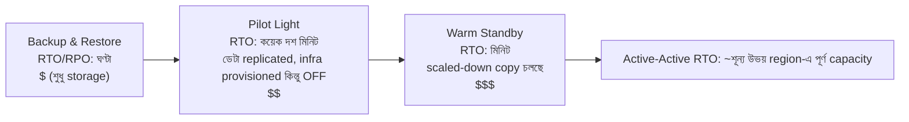

# অধ্যায় ১৮: যখন জিনিস ভেঙে পড়ে

রাত ১১:১৭-তে আলো নিভে গেল।

Nimbus অফিসে নয় — Leo বাড়িতে ছিল, সোফায়, ল্যাপটপ অর্ধেক বন্ধ করা। আলো নিভে গেল Oregon-এর একটি data center-এ, যেখানে সে কখনো যায়নি, এমন একটি ভবনে যা সে কখনো দেখেনি, server-এ ভরা এমন একটি ঘরে যা সে কখনো স্পর্শ করেনি। সে তখনো জানত না। একটি মুহূর্ত ছিল — শুধু একটি মুহূর্ত — সম্পূর্ণ নীরবতার, কোথাও দূরে backup generator চালু হওয়ার আগে। এমন অন্ধকার যেখানে আপনি বলতে পারবেন না আপনার চোখ খোলা না বন্ধ।

তারপর Slack notification এল।

---

অধ্যায় ১৭-এর monitoring system জায়গায় বসানোর পর, দল কিছুটা আত্মবিশ্বাসের মতো অনুভব করেছিল। Alert ফায়ার করছিল। Dashboard সবুজ ছিল। Log CloudWatch-এ প্রবাহিত হচ্ছিল। তারা Nimbus অবকাঠামোর প্রতিটি কোণে দৃশ্যমানতা সংযুক্ত করতে তিন সপ্তাহ ব্যয় করেছিল।

কেউ যা স্পষ্ট করে বলেনি — monitoring যার বিরুদ্ধে সুরক্ষা দেয়নি — তা হলো দৃশ্যমানতা (visibility) এবং স্থিতিস্থাপকতা (resilience) ভিন্ন জিনিস। আপনি নিখুঁত বিস্তারিতভাবে কিছু ব্যর্থ হতে দেখতে পারেন। দেখা সেটিকে থামায় না।

সেই শিক্ষা এসেছিল একটি বৃহস্পতিবার রাত ১১:২৩-তে।

---

Leo Slack notification পেল।

"us-west-2 — data center cluster failure — degraded service।"

সে AWS console খুলল। একটি Availability Zone-এর EC2 instance-গুলি status check ব্যর্থ দেখাচ্ছিল। তার Auto Scaling Group unhealthy instance detect করেছিল এবং replacement spin up করছিল — একই zone-এ।

যে cluster ব্যর্থ হচ্ছিল সেটিতে।

নতুন instance-গুলিও শুরু হতে পারছিল না। তারা একই hardware failure zone-এ ছিল।

"Load balancer উভয় AZ-এ ট্রাফিক route করছে," Leo কাউকে উদ্দেশ্য না করেই বলল। "আমাদের ট্রাফিকের অর্ধেক কাজ করে না এমন instance-এ যাচ্ছে।"

সে EC2 console খুলল এবং ক্লিক করতে শুরু করল। Load Balancers-এর অধীনে, Application Load Balancer উভয় target group-কে healthy দেখাচ্ছিল — কারণ health check port 80-এ pass করছিল, এবং এমনকি ব্যর্থ instance-গুলিও সেই check-এ সাড়া দিচ্ছিল। তারা শুধু আসল request প্রক্রিয়া করতে পারছিল না।

সে target group থেকে ব্যর্থ AZ সরিয়ে দেওয়ার চেষ্টা করল। Console পরিবর্তনটি গ্রহণ করল। কিন্তু balance বজায় রাখার জন্য configure করা Auto Scaling Group সঙ্গে সঙ্গে terminate করা instance-গুলি replace করার চেষ্টা শুরু করল — একই ব্যর্থ zone-এ।

Leo স্ক্রিনের দিকে তাকিয়ে রইল। সে এইমাত্র জিনিসটি আরও খারাপ করে ফেলেছিল।

সে ASG configuration টেনে আনল। "Balance capacity across Availability Zones" সেটিংটি সক্রিয় ছিল। স্বাভাবিক অপারেশনে এটি ভালো design ছিল। এই মুহূর্তে এটি সক্রিয়ভাবে তার বিরুদ্ধে লড়ছিল।

সে ASG-কে শুধুমাত্র healthy zone ব্যবহার করতে পরিবর্তন করল। পরিবর্তনটি প্রয়োগ করল।

Console পরিবর্তনটি "In Service" হিসেবে দেখাল।

তিন মিনিট পরে, প্রথম healthy replacement instance-গুলি উঠে এল।

Load balancer ট্রাফিক route করতে শুরু করল। Error rate ৫২% থেকে ৪%-এ নেমে এল। বাকি ৪% ছিল সেই request যা শেষ কয়েকটি unhealthy instance-এ গিয়ে পড়েছিল যেগুলি এখনো connection drain করছিল।

রাত ১১:৪৫-এ — failure শুরু হওয়ার বাইশ মিনিট পরে — ট্রাফিক স্থিতিশীল ছিল।

সে লক্ষ্য করার এবং ম্যানুয়ালি ASG-কে শুধুমাত্র healthy zone ব্যবহার করতে shift করার আগে বাইশ মিনিট degraded service।

"এটা ঘটেছে কারণ সবকিছু একটি AZ-এ ছিল," পরের সকালে Priya বলল।

"না," Leo বলল। "আমার দুটি AZ-এ instance ছিল। সমস্যা ছিল replacement instance-গুলি ব্যর্থ AZ-এ spawn হচ্ছিল।"

"আর database?"

Leo থামল।

"RDS primary ব্যর্থ zone-এ ছিল," সে বলল। "Multi-AZ আসলে তার কাজ করেছিল — এটি প্রায় নব্বই সেকেন্ডে healthy zone-এর standby-তে failover করেছিল। কিন্তু আমাদের application server তাদের মৃত connection খোলা রেখেছিল এবং endpoint-এর DNS name পুনরায় resolve করার পরিবর্তে cache করা IP address retry করছিল। Database রাত ১১:২৫-তে healthy ছিল। আমি connection pool restart না করা পর্যন্ত আমাদের অ্যাপ পরিষ্কারভাবে reconnect করেনি।"

বাইশ মিনিটের degraded service আটত্রিশ মিনিট হয়ে গিয়েছিল।

আট মাস আগে যখন Leo Auto Scaling Group সেট আপ করেছিল, সে "balance capacity across AZs" সেটিংটি check করেছিল এবং ভেবেছিল সেটাই যথেষ্ট। "এটা ঠিক থাকবে," সে তখন Maya-কে বলেছিল। "AWS স্বয়ংক্রিয়ভাবে AZ-এর জিনিস handle করে।" AWS যে এটি handle করে সে বিষয়ে সে ঠিক ছিল — এবং "স্বয়ংক্রিয়ভাবে" বলতে কী বোঝায় সে বিষয়ে ভুল ছিল।

"কী হত," পরের সকালে Maya জিজ্ঞেস করল, "যদি আমরা সবকিছু সঠিকভাবে configure করতাম? একটি বাস্তব failure-এ সঠিক Multi-AZ setup দেখতে কেমন?"

Leo সেটা নিয়ে ভাবল। রাত ১১:৪৫ থেকে সে সেটা নিয়েই ভাবছিল।

কাল্পনিক সঠিক setup-এ: ASG-এর instance health check থাকত যা ALB health-এর দিকে তাকাত — শুধু EC2 status নয়। AZ ব্যর্থ হলে, সেই instance-গুলির health check ৩০ সেকেন্ডের মধ্যে ব্যর্থ হত। ASG failure detect করত এবং সঙ্গে সঙ্গে replacement launch করতে শুরু করত — এবং যখন একটি AZ-এ launch ক্রমাগত ব্যর্থ হয়, group ব্যর্থ zone-এর বিরুদ্ধে লড়াই করার পরিবর্তে অবশিষ্ট healthy zone-এ capacity shift করে।

Load balancer একই ৩০ সেকেন্ডের মধ্যে ব্যর্থ AZ target-গুলি rotation থেকে বের করে নিত। ট্রাফিক healthy AZ-এ কেন্দ্রীভূত হত।

Database-এর জন্য: Multi-AZ failover নিজেই কাজ করেছিল — যা অনুপস্থিত ছিল তা হলো client discipline। Connection pool যা reconnect-এ endpoint-এর DNS name পুনরায় resolve করে (IP cache করার পরিবর্তে), সংক্ষিপ্ত DNS cache TTL, এবং retry logic। এগুলি জায়গায় থাকলে, একটি RDS failover হলো ৬০–১২০ সেকেন্ডের একটি blip, ১৬ মিনিটের লেজ নয়।

মোট গ্রাহক-দৃশ্যমান প্রভাব: database failover করার সময় ৬০-৯০ সেকেন্ডের degraded latency। ৩৮ মিনিটের cascading error নয়।

"এটি থেকে বাঁচার জন্য আমাদের কাছে সমস্ত অবকাঠামো ছিল," Leo বলল। "আমরা শুধু এটি ভুলভাবে configure করেছিলাম।"

সেই বাক্যটি বলা মূল ঘটনার চেয়েও কঠিন ছিল।

**Electricity Grid উপমা**

আপনার বাড়িতে বিদ্যুৎ কীভাবে আসে তা ভাবুন। বিদ্যুৎ একটি generator থেকে একটি single wire দিয়ে আসে না। এটি একটি grid থেকে আসে — generator, substation এবং transmission line-এর একটি নেটওয়ার্ক যা একে অপরকে backup করে। একটি substation-এ আগুন লাগলে, অন্যগুলি তার চারপাশে বিদ্যুৎ reroute করে। আপনি লক্ষ্য করেন না। আলো চালু থাকে।

AWS Availability Zone একইভাবে কাজ করে। সবকিছু যার উপর নির্ভর করে এমন একটি বিশাল data center-এর পরিবর্তে, AWS আপনার resource একাধিক physically separate facility-তে ছড়িয়ে দেয়। একটি facility power হারালে বা hardware failure হলে, অন্যগুলি চলতে থাকে। ট্রাফিক স্বয়ংক্রিয়ভাবে reroute হয়। আপনার অ্যাপ্লিকেশন চালু থাকে — কারণ কাটার জন্য কখনো কোনো single wire ছিল না।

এটি হলো **Multi-AZ architecture**: আপনার resource physically separate facility জুড়ে ছড়িয়ে দেওয়া যাতে একটি failure কখনো সবকিছু নামিয়ে না ফেলে।

Multi-Region হলো পরবর্তী স্তর: সম্পূর্ণ ভিন্ন শহরে backup generator থাকার কল্পনা করুন। সমগ্র local power grid ডাউন হলে, remote শহর দায়িত্ব নেয়। সেট আপ করা আরও জটিল, কিন্তু catastrophic failure-এর বিরুদ্ধে আরও resilient।

আপনি হয়তো ভাবছেন: যদি Multi-AZ মানে শুধু দুটি data center জুড়ে resource ছড়িয়ে দেওয়া হয়, তাহলে AWS কেন সবকিছুর জন্য এটিকে default করে না? উত্তর হলো cost। Multi-AZ মোটামুটি অবকাঠামো দ্বিগুণ করে — এবং একটি development environment বা একটি low-traffic internal tool-এর জন্য, সেই অতিরিক্ত cost যুক্তিসঙ্গত নয়। তবে production workload-এর জন্য, প্রশ্নটি উল্টে যায়: এটি না থাকলে আপনি কি downtime বহন করতে পারবেন?

**Failure-এর শব্দভাণ্ডার**

Resilience-এর জন্য design করার আগে, আপনি কীসের বিরুদ্ধে design করছেন তার জন্য শব্দ প্রয়োজন।

"আমরা কীভাবে পরিমাপ করব আমরা যথেষ্ট resilient কিনা?" Priya জিজ্ঞেস করল।

"দুটি সংখ্যা," Leo বলল। "আমরা কতক্ষণ ডাউন থাকতে পারি, এবং আমরা কতটুকু ডেটা হারাতে পারি।"

**Availability**: একটি সিস্টেম operational থাকার সময়ের percentage। "Four nines" (৯৯.৯৯%) মানে প্রতি বছর ৫২ মিনিটের কম downtime। "Five nines" (৯৯.৯৯৯%) মানে প্রতি বছর প্রায় ৫ মিনিট।

**RTO (Recovery Time Objective)**: ব্যবসায়িক সমস্যা হওয়ার আগে সিস্টেম কতক্ষণ ডাউন থাকতে পারে? আপনার RTO ৪ ঘণ্টা হলে, SLA লঙ্ঘিত হওয়ার আগে service restore করার জন্য আপনার ৪ ঘণ্টা আছে।

**RPO (Recovery Point Objective)**: আপনি কতটুকু ডেটা হারানো বহন করতে পারবেন? আপনার RPO ১ ঘণ্টা হলে, একটি catastrophic failure-এ আপনি এক ঘণ্টা পর্যন্ত ডেটা হারানো সহ্য করতে পারবেন। Failure-এর আগের শেষ ঘণ্টায় লেখা সবকিছু চলে গেছে।

**Fault tolerance**: একটি component ব্যর্থ হলে (কোনো স্তরে) চালু থাকার ক্ষমতা।

**Disaster recovery (DR)**: একটি catastrophic failure থেকে recover করার প্রক্রিয়া — data center-এ আগুন, region-wide outage, ঘটনাক্রমে mass deletion।

এই পাঁচটি concept এই অধ্যায়ের প্রতিটি architectural সিদ্ধান্ত চালিত করে।

**RTO এবং RPO ব্যবসায়িক সিদ্ধান্ত, প্রযুক্তিগত নয়**

সংখ্যাগুলি কে সেট করে তার চেয়ে কম গুরুত্বপূর্ণ। একজন engineer RTO অনুমান করতে পারে। একজন business stakeholder জানে একটি ৩০-মিনিটের outage আসলে কত খরচ করে।

একই technology stack সহ দুটি কোম্পানির কথা বিবেচনা করুন:

একটি fintech কোম্পানি যা brokerage trade প্রক্রিয়া করে: RTO ৪ মিনিট, RPO শূন্য। Market hours-এ চার মিনিটের জন্য ডাউন থাকা একটি trading system হাজার হাজার transaction মিস করতে পারে। প্রতিটি মিস করা transaction-এর একটি সরাসরি ডলার মূল্য আছে। শূন্য ডেটা loss দার্শনিক নয় — একটি single confirmed trade হারানো মানে compliance সমস্যা এবং গ্রাহকের মামলা। এটি অর্জনের architecture cost: synchronous replication সহ active-active Multi-AZ, ছয়-অঙ্কের বার্ষিক অবকাঠামো বাজেট।

একটি restaurant ordering platform: RTO ৩০ মিনিট, RPO ৫ মিনিট। Dinner rush-এর সময় ৩০-মিনিটের outage সত্যিকারের কষ্টদায়ক এবং প্রকৃত অর্থ খরচ করে। কিন্তু একটি failure-এর আগে শেষ ৫ মিনিটের order হারানো মানে মুষ্টিমেয় কিছু গ্রাহককে পুনরায় order দিতে হবে — বিরক্তিকর, catastrophic নয়। এটি অর্জনের architecture cost: warm standby Multi-AZ, fintech বাজেটের একটি ভগ্নাংশ।

"দাঁড়াও — কিন্তু একটি restaurant platform কেন ৫ মিনিটের ডেটা loss গ্রহণ করবে?" Leo যখন এটি ব্যাখ্যা করল তখন Maya জিজ্ঞেস করল। "এটা কি এখনও গ্রাহকের order হারানো নয়?"

"প্রশ্ন হলো সেই ডেটা loss প্রতিরোধ করা এর মূল্যের চেয়ে বেশি খরচ করে কিনা," Leo বলল। "RPO ৫ মিনিট থেকে ০-তে কমানোর জন্য region জুড়ে synchronous replication প্রয়োজন হবে। সেটা একটি উল্লেখযোগ্য cost এবং engineering বিনিয়োগ। আমাদের স্কেলের একটি restaurant অ্যাপের জন্য, ৫-মিনিটের RPO সঠিক trade-off।"

শিক্ষা: RTO এবং RPO প্রযুক্তিগত ন্যূনতম নয়। এগুলি সংখ্যা হিসেবে প্রকাশিত ব্যবসায়িক trade-off। এগুলি সেট করার জন্য engineering team (যারা জানে কী অর্জনযোগ্য) এবং business stakeholder (যারা জানে কী গ্রহণযোগ্য) উভয়েরই প্রয়োজন।

**Multi-AZ: Availability Zone Failure থেকে বেঁচে থাকা**

একটি Availability Zone (AZ) হলো একটি Region-এর মধ্যে একটি physically separate data center। AZ independent হওয়ার জন্য design করা হয়েছে: separate power supply, separate cooling, separate network infrastructure। কিন্তু তারা যথেষ্ট কাছাকাছি যাতে তাদের মধ্যে network latency ১-২ মিলিসেকেন্ড।

**Multi-AZ deployment** একটি Region-এর মধ্যে দুটি বা তার বেশি AZ-এ আপনার resource ছড়িয়ে দেয়। একটি AZ ব্যর্থ হলে:

- Load balancer ব্যর্থ AZ-এর unhealthy instance-এ routing বন্ধ করে
- Auto Scaling Group instance replace করে — কিন্তু *healthy* AZ-এ
- RDS healthy AZ-এর standby-তে failover করে

Leo-র ভুল: তার Auto Scaling Group healthy AZ-এ replacement instance সীমাবদ্ধ করার জন্য configure করা ছিল না। এটি AZ-এর মধ্যে balance বজায় রাখার জন্য configure করা ছিল। Zone ব্যর্থ হলে, ASG সেখানে replacement spin up করে instance count balance করার চেষ্টা করল — ব্যর্থ zone-এ।

Fix: ASG-কে শুধুমাত্র healthy AZ-এ launch করার জন্য configure করুন, সর্বদা ন্যূনতম দুটি AZ সক্রিয় রেখে।

আরও গভীর শিক্ষা: production-এ ঘটার আগে আপনার failure scenario test করা।

আপনি Multi-AZ বেছে নিলে, আপনি automatic failover এবং কাছাকাছি-শূন্য RPO পান — কিন্তু আপনি এমন অবকাঠামোর জন্য পেমেন্ট করছেন যা স্বাভাবিক অপারেশনের সময় কোনো ট্রাফিক পরিবেশন করে না। সেই standby RDS instance সর্বদা চলছে, সর্বদা replicate করছে, এবং primary ব্যর্থ না হওয়া পর্যন্ত কখনো একটি query-এর উত্তর দেয় না। সেটাই trade-off: নির্ভরযোগ্যতার জন্য কিছু ভাঙা না থাকলেও অর্থ খরচ হয়।

**Chaos Engineering: প্রথম রানটি কেমন দেখাল**

Nimbus-এ প্রথম chaos engineering রান documentation যতটা পরিষ্কার শোনাত ততটা পরিষ্কার ছিল না।

Leo runbook-এর step 2 চালাল: একটি RDS Multi-AZ failover জোর করল। সে AWS CLI ব্যবহার করল:

```
aws rds reboot-db-instance \
    --db-instance-identifier nimbus-prod \
    --force-failover
```

কমান্ডটি সঙ্গে সঙ্গে return করল। Leo timer শুরু করল।

T+0s: Failover শুরু হয়েছে। RDS console primary status "rebooting" দেখাচ্ছে।

T+18s: Application log database connection error দেখাতে শুরু করছে। Connection pool পুরানো primary চেষ্টা করছে, যা আর primary নয়।

T+34s: RDS console status "backing-up" দেখাচ্ছে। নতুন primary promote করা হচ্ছে। DNS CNAME (database endpoint) আপডেট হচ্ছে।

T+52s: Application log আবার সফল connection দেখাতে শুরু করছে। Connection pool পুরানো primary-তে retry শেষ করেছে এবং CNAME-এ reconnect করেছে, যা এখন নতুন primary-কে নির্দেশ করে।

T+4:17: সমস্ত connection পুনঃপ্রতিষ্ঠিত। Error rate শূন্যে ফিরে এসেছে।

মোট: ৪ মিনিট ১৭ সেকেন্ড।

"এটা ২৫৭ সেকেন্ডের database unavailability," Tom বলল। "আমাদের restaurant partner-দের tablet ৪ মিনিটের জন্য একটি spinning indicator দেখায়।"

"আমাদের SLA বলে ৫ মিনিট," Leo বলল।

"তাহলে আমরা pass করলাম," Priya বলল। "কোনোমতে।"

"দুটি পর্যবেক্ষণ," Tom বলল। "প্রথম: আমরা pass করেছি কারণ আমাদের RTO commitment উদার ছিল, আমাদের architecture বিশেষভাবে দ্রুত বলে নয়। দ্বিতীয়: connection pool retry behavior-ই আমাদের অতিরিক্ত ৩৪ সেকেন্ড কিনে দিয়েছে। application যদি ১০ সেকেন্ড পরে হাল ছেড়ে দিত, আমরা ব্যর্থ হতাম।"

Leo পর্যবেক্ষিত timing নথিভুক্ত করতে runbook আপডেট করল। পরের quarter-এর লক্ষ্য: connection pool parameter এবং application-এর health check logic টিউন করে failover detection time ৫২ সেকেন্ড থেকে ৩০-এর নিচে কমানো।

"Chaos engineering একবারের test নয়," Priya বলল। "এটি একটি feedback loop। আপনি test করেন, আপনি প্রকৃত সংখ্যা খুঁজে পান, আপনি উন্নত করেন, আপনি আবার test করেন।"

ছয় মাস পরে যখন তারা তৃতীয়বার failover test চালাল, recovery time ছিল ১ মিনিট ৪৪ সেকেন্ড। RDS দ্রুত হয়েছে বলে নয় — কারণ তারা application টিউন করেছিল।

**Failure Simulate করা: Chaos Engineering**

"আমরা কীভাবে জানব আমাদের Multi-AZ setup আসলে কাজ করে?" Maya জিজ্ঞেস করল।

"আমরা ইচ্ছাকৃতভাবে জিনিস ভাঙি," Leo বলল।

"দাঁড়াও — কিন্তু আমরা কেন সেভাবে করব?" Maya বলল। "AWS documentation যে বলে এটি কাজ করে সেটা বিশ্বাস করি না কেন?"

"কারণ documentation বর্ণনা করে service কীভাবে কাজ করে। এটা বর্ণনা করে না *আপনার configuration* কীভাবে কাজ করে। ওগুলো ভিন্ন জিনিস।"

Priya সামনে ঝুঁকল। "আমরা কি ভেবেছি load balancer health check এবং ASG health check একমত না হলে কী হবে? Load balancer rotation থেকে একটি instance সরিয়ে দিতে পারে, কিন্তু ASG মনে করে instance healthy এবং এটি replace করে না। আমাদের এমন capacity থাকবে যা load balancer-এর কাছে অদৃশ্য।"

"chaos engineering ঠিক সেই ধরনের জিনিস খুঁজে পাবে," Leo বলল।

এটি বেপরোয়া শোনায়। এটি আসলে একটি দল করতে পারে এমন সবচেয়ে দায়িত্বশীল কাজ।

**RTO Commitment Test করা**

RTO সম্পর্কে অস্বস্তিকর সত্যটি এখানে: বেশিরভাগ দল একটি RTO সেট করে, তারপর কখনো test করে না তারা আসলে এটি পূরণ করতে পারে কিনা।

৩০ মিনিটের একটি RTO একটি গ্যারান্টি নয়। এটি একটি লক্ষ্য। আপনি এটি hit করবেন কিনা জানার একমাত্র উপায় হলো failure simulate করা এবং recovery-র সময় মাপা।

রাত ১১:২৩-এর incident-এর পর, Nimbus দল প্রতি quarter-এ প্রতিটি failure mode test করতে প্রতিশ্রুতিবদ্ধ হল। শুধু ম্যানুয়ালি নয় — লিখিত acceptance criteria সহ। একটি AZ failure থেকে recovery ১০ মিনিটের মধ্যে সম্পূর্ণ হতে হবে। একটি RDS failover থেকে recovery ৫ মিনিটের মধ্যে সম্পূর্ণ হতে হবে। Backup থেকে database restore (backup-and-restore DR test) ২ ঘণ্টার মধ্যে সম্পূর্ণ হতে হবে।

এই সংখ্যাগুলি restaurant partner-দের সাথে কথোপকথন থেকে এসেছে, যারা বলেছিল একটি dinner-rush outage ১০ মিনিটের নিচে "কষ্টদায়ক কিন্তু গ্রহণযোগ্য।" ৩০ মিনিটের বেশি হলে সেটা একটি contract কথোপকথন।

"SLA আলোচনা RTO সেট করার আগে হওয়া উচিত," Maya বলল। "পরে নয়।"

সে ভুল ছিল না। তারা এটা উল্টোভাবে করেছিল। তারা অভ্যন্তরীণভাবে RTO সেট করেছিল এবং তারপর বুঝতে পেরেছিল যে ব্যবসা আসলে কী প্রয়োজন তার বিপরীতে এটি check করতে হবে।

সঠিক ক্রমে RTO এবং RPO সেট করা: প্রথমে ব্যবসায়িক প্রয়োজনীয়তা, এটি পূরণ করার architecture দ্বিতীয়, যাচাই করার test তৃতীয়। বেশিরভাগ দল architecture দিয়ে শুরু করে এবং পিছনের দিকে কাজ করে। সংখ্যাগুলি এর জন্য ভোগে।

**Chaos engineering** হলো আপনার সিস্টেমে ইচ্ছাকৃতভাবে failure inject করার অনুশীলন যাতে যাচাই করা যায় এটি সেগুলি সঠিকভাবে handle করে কিনা। আপনি ইচ্ছাকৃতভাবে একটি EC2 instance terminate করেন। আপনি ম্যানুয়ালি RDS instance failover করেন। আপনি load balancer থেকে একটি subnet block করেন।

সিস্টেম আপনার RTO-এর মধ্যে স্বয়ংক্রিয়ভাবে recover করলে, আপনার design কাজ করে।

না করলে, আপনি একটি controlled setting-এ শিখেছেন — রাত ২টার production incident-এর সময় নয়।

Nimbus-এর জন্য: Leo প্রতিটি failure scenario test করার জন্য একটি runbook (একটি documented procedure) লিখল। প্রতি quarter-এ, তারা ইচ্ছাকৃতভাবে একটি component fail করত এবং recovery time মাপত। Recovery RTO-এর চেয়ে বেশি সময় নিলে, তারা design fix করত।

**Multi-Region: Regional Failure থেকে বেঁচে থাকা**

বেশিরভাগ AWS failure Availability Zone-কে প্রভাবিত করে, সম্পূর্ণ Region-কে নয়। Regional failure বিরল — কিন্তু ঘটে।

একটি regional failure-এ (বা সর্বত্র খুব কম latency প্রয়োজন এমন global অ্যাপ্লিকেশনের জন্য), **Multi-Region** হলো উত্তর: আপনার অ্যাপ্লিকেশন দুটি বা তার বেশি AWS Region-এ deploy করুন।

Multi-Region মৌলিক জটিলতা পরিচয় করিয়ে দেয়:

**ডেটা replication**: আপনার database একাধিক region জুড়ে sync-এ থাকতে হবে। us-east-1-এ লেখা যেকোনো ডেটা শেষ পর্যন্ত eu-west-1-এ পৌঁছাতে হবে। "শেষ পর্যন্ত" হলো সমস্যা — time lag-এর সময়, region-গুলির বিশ্বের সামান্য ভিন্ন view থাকে।

**Active-passive বনাম active-active**:

- **Active-passive**: একটি region সমস্ত ট্রাফিক পরিবেশন করে। অন্যটি একটি warm standby। failure-এ, DNS ট্রাফিক standby-তে switch করে। সহজ, কিন্তু standby idle এবং ব্যয়বহুল।
- **Active-active**: উভয় region একসাথে ট্রাফিক পরিবেশন করে। Build করা আরও জটিল (concurrent write-এর জন্য conflict resolution প্রয়োজন), কিন্তু বিশ্বব্যাপী কম latency এবং কোনো idle resource নেই।

Active-active আকর্ষণীয় শোনায় যতক্ষণ না আপনি write সম্পর্কে সাবধানে ভাবেন। একজন গ্রাহক us-east-1-এ একটি order দিলে এবং একই সাথে restaurant eu-west-1-এ তাদের menu আপডেট করলে, এবং region-গুলির মধ্যে একটি network partition থাকলে, কোন write জেতে? এটি বাস্তবে CAP theorem: একটি distributed system-এ, একটি network partition-এর সময়, আপনাকে consistency (উভয় region একই ডেটায় একমত) এবং availability (উভয় region একমত না হলেও request গ্রহণ করতে থাকে)-এর মধ্যে বেছে নিতে হবে। Active-active এই পছন্দ দূর করে না। এটি আপনাকে আপনার ডেটা মডেলে স্পষ্টভাবে এটি করতে বাধ্য করে।

Nimbus-এর জন্য: active-passive। তারা তাদের menu এবং order ডেটায় concurrent write conflict নিয়ে যুক্তি দিতে চায়নি। একটি single authoritative primary region এই পর্যায়ে সহজ এবং নিরাপদ ছিল।

**Failover time**: DNS পরিবর্তন propagate হতে সময় নেয় (TTL-এর উপর নির্ভর করে)। Propagation window-এর সময়, কিছু ব্যবহারকারী এখনো ব্যর্থ region hit করে। খুব কম RTO-এর জন্য design করার জন্য standby pre-warm করা এবং planned switch-এর আগে TTL minimize করা প্রয়োজন।

**Route 53 DNS Failover: DR-এর Network Layer**

সম্পূর্ণ DR strategy spectrum-এ যাওয়ার আগে, DNS কীভাবে failover-এ মানানসই হয় তা বোঝার মূল্য আছে — কারণ এটিই প্রায়ই সেই জিনিস যা আসলে region-গুলির মধ্যে ট্রাফিক switch করে।

**Amazon Route 53** health-check-ভিত্তিক routing সমর্থন করে। আপনি configure করেন:

1. একটি health check যা আপনার primary endpoint পর্যবেক্ষণ করে (সাধারণত একটি HTTP endpoint যা healthy হলে 200 return করে)
2. একটি primary DNS record যা আপনার primary region-কে নির্দেশ করে
3. একটি secondary (failover) DNS record যা আপনার DR region-কে নির্দেশ করে

Route 53 detect করলে যে primary health check ব্যর্থ হচ্ছে, এটি স্বয়ংক্রিয়ভাবে DNS response-গুলি secondary record-এ switch করে। আপনার domain resolve করা ব্যবহারকারীরা এখন DR region-এর IP পায়।

"আর কেউ যদি failover window-এর সময় ভাঙার চেষ্টা করে?" Priya জিজ্ঞেস করল। "আমাদের domain-এর SSL certificate — এটা কি উভয় region-এ কাজ করে, নাকি HTTPS ভেঙে যায়?"

"Certificate উভয় region-এ provision করতে হবে," Leo নিশ্চিত করল। "আপনি ACM (AWS Certificate Manager) ব্যবহার করলে, এর মানে প্রতিটি region-এ স্বাধীনভাবে একটি certificate request করা।"

Route 53 failover-এর কার্যপ্রণালী:

- Health check বিশ্বব্যাপী একাধিক AWS location থেকে প্রতি ৩০ সেকেন্ডে চলে
- ৩টি পরপর ব্যর্থতার পর (৯০ সেকেন্ড), Route 53 endpoint-কে unhealthy হিসেবে চিহ্নিত করে
- DNS response সঙ্গে সঙ্গে failover record-এ switch হয়
- কিন্তু: DNS TTL এখনও প্রযোজ্য। আপনার TTL ৩০০ সেকেন্ড হলে, যে client ইতিমধ্যে primary IP cache করেছে তারা ৫ মিনিট পর্যন্ত ব্যর্থ region hit করতে থাকে

এই কারণেই TTL কমানো pre-disaster প্রস্তুতির অংশ। আপনি একটি incident-এর সময় TTL পরিবর্তন করতে পারবেন না (পরিবর্তন সময়মতো propagate হবে না)। TTL পরিবর্তন এটির প্রয়োজন হওয়ার দিন বা সপ্তাহ আগে করতে হবে, যাতে একটি failure ঘটলে resolver cache ইতিমধ্যে সংক্ষিপ্ত TTL ব্যবহার করছে।

"তাহলে DNS TTL কমানো একটি recovery action নয়," Leo বলল। "এটি একটি pre-positioning action।"

"আমরা কি এটা করেছি?" Maya জিজ্ঞেস করল।

তারা করেনি।

সেই কথোপকথনের পর, Leo eatnimbus.com-এর TTL ৩০০ সেকেন্ড থেকে ৬০ সেকেন্ডে কমিয়ে দিল। পরিবর্তনটির কোনো খরচ ছিল না এবং তাদের worst-case failover time সম্ভাব্য ৮ মিনিট থেকে ৩ মিনিটের ঠিক নিচে উন্নত করল।

**Disaster Recovery Strategy: একটি Spectrum**

চারটি সাধারণ DR strategy আছে, সবচেয়ে সস্তা (এবং recover হতে সবচেয়ে ধীর) থেকে সবচেয়ে ব্যয়বহুল (এবং recover হতে সবচেয়ে দ্রুত) পর্যন্ত সাজানো:



**Backup and Restore** (ঘণ্টার RPO/RTO):

- একটি ভিন্ন region-এ S3-এ সবকিছু backup করুন
- Disaster-এ: scratch থেকে অবকাঠামো provision করুন, backup থেকে restore করুন
- Cost: খুব কম (আপনি শুধুমাত্র storage-এর জন্য পেমেন্ট করছেন)
- Recovery time: ঘণ্টা

**Pilot Light** (মিনিট থেকে ১ ঘণ্টার RPO/RTO):

- ক্রমাগত ডেটা replicate করুন এবং core অবকাঠামো DR region-এ *provisioned কিন্তু বন্ধ* রাখুন — template, AMI, stopped বা zero-sized resource। কিছুই ট্রাফিক পরিবেশন করে না; শুধুমাত্র ডেটা replication "জ্বালানো" থাকে (সেটাই pilot light)
- Core ডেটা replicated (DR region-এ RDS read replica)
- Disaster-এ: DR region-এর compute শুরু/scale up করুন, read replica-কে primary-তে promote করুন, DNS switch করুন
- (নিচের Warm Standby-এর সাথে তুলনা করুন: সেখানে, application-এর একটি scaled-down copy আসলে *চলছে*)
- Cost: মাঝারি (আপনি ডেটা replication এবং provisioned-কিন্তু-বন্ধ resource-এর জন্য পেমেন্ট করছেন, চলমান compute-এর জন্য নয়)
- Recovery time: কয়েক দশ মিনিট

**Warm Standby** (সেকেন্ড থেকে মিনিটের RPO/RTO):

- DR region-এ সম্পূর্ণ application-এর একটি scaled-down version চালান
- সম্পূর্ণ operational কিন্তু reduced capacity-এ
- Disaster-এ: scale up করুন, DNS switch করুন
- Cost: বেশি (সর্বদা reduced scale-এ full stack চালাচ্ছেন)
- Recovery time: মিনিট

**Active-Active / Multi-Site** (কাছাকাছি-শূন্যের RPO/RTO):

- দুটি বা তার বেশি region-এ full capacity, একসাথে ট্রাফিক পরিবেশন করছে
- কোনো recovery দরকার নেই — একটি region ব্যর্থ হলে, ট্রাফিক স্বয়ংক্রিয়ভাবে অন্যটিতে route হয়
- Cost: সর্বোচ্চ (full scale-এ দুটি full deployment)
- Recovery time: সেকেন্ড (শুধুমাত্র DNS propagation)

একটি service এই spectrum-এর মাঝখানটি automate করে: **AWS Elastic Disaster Recovery (DRS)** আপনার server — on-premises বা EC2 — block by block ক্রমাগত একটি low-cost staging area-তে replicate করে, এবং disaster আঘাত করলে কয়েক মিনিটে full recovery instance launch করতে পারে। কার্যত, এটি একটি *managed pilot light*: backup-and-restore-এর কাছাকাছি দামে warm-standby-এর কাছাকাছি recovery time। পরীক্ষার সংকেত: "একটি managed DR service দিয়ে server-ভিত্তিক workload-এর জন্য downtime এবং data loss minimize করুন" → Elastic Disaster Recovery।

এই পর্যায়ে Nimbus-এর জন্য: warm standby। তারা active-active সামর্থ্য করতে পারেনি, কিন্তু তাদের ব্যবসায়িক প্রয়োজনীয়তার জন্য backup and restore অনেক ধীর ছিল।

**Amazon RDS: Multi-AZ বনাম Read Replica বনাম Multi-Region**

এই তিনটি আলাদা এবং সাধারণত বিভ্রান্তিকর:

| Feature       | Multi-AZ                     | Read Replica     | Multi-Region Read Replica |
|---------------|------------------------------|------------------|---------------------------|
| উদ্দেশ্য      | High availability (failover) | Read scaling     | Read scaling + DR         |
| Data sync     | Synchronous                  | Asynchronous     | Asynchronous              |
| Failover      | Automatic                    | Manual promotion | Manual promotion          |
| Readable?     | না (standby passive)         | হ্যাঁ            | হ্যাঁ                     |
| Cross-region? | না (same region)             | হ্যাঁ (optional) | হ্যাঁ                     |
| ব্যবহার করুন  | HA, RPO~0                    | Read load        | Disaster recovery         |

Key insight: Multi-AZ standby **synchronous** — primary-তে প্রতিটি write standby-তে confirmed হওয়ার আগে write acknowledge করা হয়। এর মানে primary ব্যর্থ হলে, কোনো ডেটা হারায় না। RPO = 0।

Read replica **asynchronous** — replication lag আছে। Primary ব্যর্থ হলে এবং আপনি একটি read replica promote করলে, recent write-এর সেকেন্ড বা মিনিট হারাতে পারেন। RPO > 0।

**Aurora Global Database: Production-এর জন্য Multi-Region**

যে দলগুলির প্রকৃত multi-region resilience প্রয়োজন, তাদের জন্য **Aurora Global Database** হিসাব বদলে দেয়। অন্য region-এ একটি standard RDS read replica asynchronous replication ব্যবহার করে যার lag সাধারণত সেকেন্ডে মাপা হয় — মানে একটি regional failure সেই সেকেন্ডগুলির write হারাবে। Aurora Global Database একটি dedicated replication infrastructure ব্যবহার করে যা primary region এবং secondary region-গুলির মধ্যে ১ সেকেন্ডের নিচে replication lag অর্জন করে।

দল post-incident review-তে এটি নিয়ে আলোচনা করলে, Leo তুলনাটি টেনে আনল:

- Standard RDS cross-region read replica: replication lag সাধারণত ১-১০ সেকেন্ড, heavy load-এ মিনিট পর্যন্ত। Standalone database-এ promote করতে মিনিট লাগে এবং এতে manual step জড়িত।
- Aurora Global Database secondary: replication lag সাধারণত ১ সেকেন্ডের নিচে। Secondary থেকে primary-তে promote করতে ১ মিনিটের নিচে লাগে।

"এর মানে us-west-2 সম্পূর্ণভাবে ডাউন হলে," Leo ব্যাখ্যা করল, "আমাদের ১ সেকেন্ডের কম সম্ভাব্য ডেটা loss হয় এবং আমরা এক মিনিটের মধ্যে us-east-1 থেকে ট্রাফিক পরিবেশন করতে পারি।"

"এটার মাসে কত খরচ?" Tom সঙ্গে সঙ্গে জিজ্ঞেস করল।

Standard Multi-AZ-এর চেয়ে বেশি। Aurora Global Database region জুড়ে replication-এর জন্য একটি per-write I/O charge যোগ করে। Nimbus-এর বর্তমান volume-এর জন্য, এটি বিদ্যমান Aurora cost-এর উপরে $40-60/month যোগ করবে।

"সেটাই trade-off," Leo বলল। "গতির জন্য পেমেন্ট করুন। অথবা একটি standard cross-region read replica-এর ধীর promotion এবং সামান্য বেশি RPO গ্রহণ করুন।"

আপাতত, Nimbus warm standby-তে রয়ে গেল। Aurora Global Database পরবর্তী funding round-এর জন্য architecture wish list-এ গেল।

"একই failover window, পরের layer নিচে," Priya বলল। "আমরা certificate কভার করেছি। এখন credential — সেগুলি একটি instance-এ rotate হচ্ছে। Standby কি sync-এ আছে?"

Leo documentation টেনে আনল। এটি একটি ভালো প্রশ্ন ছিল। RDS Multi-AZ ডেটা replicate করে, secret configuration নয় — Secrets Manager rotation failover runbook-এর অংশ হিসেবে test করতে হত।

## শক্তি এবং সীমাবদ্ধতা

**Multi-AZ**:

- Production workload-এর জন্য অপরিহার্য — single-AZ হলো একটি single point of failure
- AWS service দ্বারা ভালোভাবে সমর্থিত (RDS, ElastiCache, EKS, ALB সবই Multi-AZ সমর্থন করে)
- এটি যে protection প্রদান করে তার তুলনায় তুলনামূলকভাবে কম cost overhead
- AZ failure হলো AWS failure-এর সবচেয়ে সাধারণ বিভাগ — Multi-AZ সবচেয়ে সম্ভাব্য scenario-গুলি কভার করে

**Multi-Region**:

- সঠিকভাবে implement করা জটিল, বিশেষত database-এর জন্য
- ডেটা residency/sovereignty প্রয়োজনীয়তা আসলে এটি প্রয়োজন করতে পারে (EU user data EU-তে থাকতে হবে)
- Global user-এর জন্য latency benefit routing থেকে আসে, multi-region থেকে per se নয় (static content-এর জন্য CloudFront ব্যবহার করুন)
- বেশিরভাগ সংস্থার active-active প্রয়োজন নেই; বেশিরভাগ warm standby-তে under-invest করে
- Multi-Region warm standby-এর cost তুচ্ছ নয়, কিন্তু এটি ছাড়া একটি regional failure-এর cost অনেক বেশি হতে পারে

**কখন Multi-AZ এড়াবেন** (বিরল ক্ষেত্রে):

- Development এবং staging environment যেখানে downtime গ্রহণযোগ্য
- সত্যিকারের non-critical internal tool যার কোনো SLA প্রয়োজনীয়তা নেই
- Batch workload যা failure-এ কেবল আবার চালানো যায়

Multi-AZ এড়ানোর চাপ প্রায় সবসময় cost সম্পর্কে। সেই যুক্তি গ্রহণ করার আগে, সম্ভাব্য failure mode-গুলির cost হিসাব করুন: গ্রাহক churn, SLA penalty, recover করার engineering time। বেশিরভাগ production environment-এ, Multi-AZ প্রথমবার রাত ৩টার page থেকে আপনাকে বাঁচালেই এর খরচ উঠে আসে।

## সারসংক্ষেপ

অধ্যায় ১৭-এর monitoring কাজ failure-গুলিকে দৃশ্যমান করেছিল। এই অধ্যায়টি অবকাঠামোকে সেগুলি থেকে বাঁচানোর বিষয়ে। উভয়ই গুরুত্বপূর্ণ; একটি ছাড়া অন্যটি যথেষ্ট নয়।

সেই বৃহস্পতিবার রাতের Nimbus incident ৩৮ মিনিটের degraded service খরচ করেছিল। তিনটি configuration ভুল একত্রিত হয়েছিল: ASG replacement launch থেকে ব্যর্থ AZ বাদ দেয়নি, RDS standby ঘটনাক্রমে ব্যর্থ zone-এ ছিল, এবং production-এ এটির উপর নির্ভর করার আগে কেউ failover প্রক্রিয়া test করেনি।

তিনটিই একটি বিকেলে fixable ছিল। Incident-টি fix-গুলিকে এমনভাবে জরুরি করে তুলেছিল যা "best practice documentation" কখনো ঠিক করতে পারেনি।

সেটাই chaos engineering-এর সৎ যুক্তি: এটি কঠোর engineering অনুশীলন বলে নয় (যদিও এটি তা), বরং এটি সেই configuration ভুলগুলি সামনে আনে যা তাত্ত্বিক মনে হয় যতক্ষণ না সেই রাতে একটি Oregon data center-এ hardware failure হয়।

- **RTO** (Recovery Time Objective): আপনি কতক্ষণ ডাউন থাকতে পারেন। **RPO** (Recovery Point Objective): আপনি কতটুকু ডেটা হারাতে পারেন।
- **Multi-AZ** একটি Region-এর মধ্যে Availability Zone জুড়ে resource ছড়িয়ে দেয়। AZ failure থেকে সুরক্ষা দেয়।
- **Multi-Region** একাধিক AWS Region-এ deploy করে। Regional failure থেকে সুরক্ষা দেয় এবং global user-কে কম latency-তে পরিবেশন করে।
- DR strategy (সবচেয়ে সস্তা থেকে সবচেয়ে ব্যয়বহুল): Backup & Restore → Pilot Light → Warm Standby → Active-Active।
- RDS Multi-AZ standby: synchronous, automatic failover, region-এর মধ্যে RPO = 0। Read replica: asynchronous, manual promotion, RPO > 0।
- production-এ ঘটার আগে ইচ্ছাকৃতভাবে আপনার failure test করুন (chaos engineering)।

## পরীক্ষার টিপস

*SAA-C03 ডোমেন: Design Resilient Architectures (ডোমেন ২, টাস্ক ২.২)*

- **RTO বনাম RPO**: পরীক্ষায় আপনাকে requirement দেওয়ার আশা করুন ("organization ১ ঘণ্টার বেশি downtime এবং কোনো ডেটা loss সহ্য করতে পারে না") এবং সঠিক DR strategy বেছে নিতে বলা হবে। Map করুন: কোনো ডেটা loss = synchronous replication = Multi-AZ বা active-active। ১ ঘণ্টার downtime = backup-and-restore অনেক ধীর; warm standby কাজ করতে পারে।
- **Multi-AZ RDS বনাম Read Replica**: পরীক্ষা HA (Multi-AZ) বনাম read scaling (read replica) জিজ্ঞেস করবে। Multi-AZ standby readable নয়। Read replica DR-এর জন্য primary-তে promote করা যায় (ম্যানুয়ালি)।
- **Pilot Light বনাম Warm Standby**: Pilot Light-এ minimal অবকাঠামো চলছে (শুধু ডেটা replication)। Warm Standby-তে scaled-down কিন্তু functional application চলছে। পার্থক্য হলো আপনি কত দ্রুত scale up করতে পারেন।
- **Aurora Global Database**: Multi-region active-passive-এর জন্য Aurora-নির্দিষ্ট feature। Primary region write পরিবেশন করে; secondary region <১ সেকেন্ড replication lag সহ read পরিবেশন করে। Failover-এ, secondary <১ মিনিটে promote করা যায়। পরীক্ষার সংকেত: "Aurora, multi-region, RTO < 1 minute।"
- **AWS Backup**: EBS, RDS, DynamoDB, EFS, Storage Gateway-এর জন্য centralized backup service। পরীক্ষা এটি backup-and-restore scenario-এর জন্য ব্যবহার করে।
- **Elastic Disaster Recovery (DRS)**: "server-এর জন্য (on-premises বা EC2) minimal downtime/data loss সহ managed DR," "নিজে তৈরি না করে pilot light" → DRS (continuous block-level replication + on-demand recovery launch)।
- **Route 53 failover**: DR-এর DNS layer। Primary health check ব্যর্থ → Route 53 secondary-তে route করে। Propagation time মানে এটি instant নয়।

## অনুশীলনী

**অনুশীলন ১ — স্মরণ**

RTO এবং RPO-এর মধ্যে পার্থক্য ব্যাখ্যা করুন। কেন একটি সংস্থার low RTO (দীর্ঘক্ষণ ডাউন থাকতে পারে না) কিন্তু high RPO (recent ডেটা হারানো সহ্য করতে পারে) থাকতে পারে?

*(ইঙ্গিত: এমন একটি ব্যবসা নিয়ে ভাবুন যেখানে প্রতিটি transaction সংরক্ষণের চেয়ে দ্রুত গ্রাহকদের সেবা দেওয়া বেশি গুরুত্বপূর্ণ।)*

**অনুশীলন ২ — SAA-C03 দৃশ্যকল্প**

*দৃশ্যকল্প*: একটি healthcare company `us-east-1`-এ একটি PostgreSQL-compatible database-এ patient records system চালায়। Regulatory requirement বাধ্যতামূলক করে যে system-কে অবশ্যই একটি **সম্পূর্ণ regional outage** থেকে বাঁচতে হবে **সেকেন্ডে** মাপা RPO (কাছাকাছি-শূন্য ডেটা loss) এবং ৩০ মিনিটের নিচে RTO সহ। Primary region-এর মধ্যে, কোনো ডেটা loss গ্রহণযোগ্য নয়।

কোন architecture এই প্রয়োজনীয়তা সর্বোত্তমভাবে পূরণ করে?

A) `us-west-2`-এ S3-এ daily automated backup সহ `us-east-1`-এ RDS Multi-AZ  
B) `us-west-2`-এ manual promotion-এর জন্য configure করা read replica সহ `us-east-1`-এ RDS Multi-AZ  
C) `us-west-2`-এ warm standby এবং active-active replication সহ `us-east-1`-এ RDS  
D) `us-east-1`-এ primary এবং `us-west-2`-এ secondary সহ Aurora Global Database

**ইঙ্গিত ১**: দুটি scope আলাদা করুন। একটি region-এর *মধ্যে*, RPO = 0 মানে synchronous replication (Multi-AZ — এবং Aurora-র storage layer ৩টি AZ জুড়ে synchronous)। region-গুলির *জুড়ে*, সমস্ত বাস্তবসম্মত বিকল্প asynchronously replicate করে — প্রশ্ন হলো lag কত ছোট।

**ইঙ্গিত ২**: RTO = ৩০ মিনিট মানে আপনার কাছে একটি controlled promotion-এর সময় আছে। আপনার সম্পূর্ণ automatic millisecond failover প্রয়োজন নেই।

**ইঙ্গিত ৩**: প্রতিটি বিকল্পের cross-region RPO তুলনা করুন: daily backup (ঘণ্টা), RDS cross-region read replica (সেকেন্ড থেকে মিনিট, load-এ unbounded), Aurora Global Database (সাধারণত ১ সেকেন্ডের নিচে)।

**উত্তর**: D

**ব্যাখ্যা**: Aurora Global Database storage layer-এ secondary region-এ replicate করে সাধারণত ১ সেকেন্ডের নিচে lag সহ — একটি regional disaster-এর জন্য "সেকেন্ডে RPO" সন্তুষ্ট করে — এবং একটি secondary এক মিনিটের নিচে promote করা যায়, যা ৩০-মিনিটের RTO-এর মধ্যে স্বাচ্ছন্দ্যে। Primary region-এর মধ্যে, Aurora-র storage তিনটি AZ জুড়ে synchronously replicate করা হয়, যা in-region zero-loss প্রয়োজনীয়তা পূরণ করে। **সূক্ষ্মতাটি মুখস্থ করুন**: Aurora Global region জুড়ে *asynchronous* — এর cross-region RPO *কাছাকাছি* শূন্য, ঠিক শূন্য কখনো নয়। একটি পরীক্ষার প্রশ্ন পরম RPO = 0 দাবি করলে, সেটি *synchronous* replication-এ map করে (Multi-AZ, single region) — কোনো standard cross-region বিকল্প এটি প্রদান করে না।

**কেন A নয়?** Daily S3 backup একটি cross-region RPO দেয় ২৪ ঘণ্টা পর্যন্ত। সেটা একটি regional failure-এ ঘণ্টার patient ডেটা হারানো।

**কেন B নয়?** RDS cross-region read replica standard asynchronous replication ব্যবহার করে যার lag load-এ unbounded বাড়তে পারে — "সেকেন্ড" মিনিট হয়ে যেতে পারে। কার্যকর, কিন্তু যখন sub-second, storage-level replication সহ একটি বিকল্প বিদ্যমান, তখন BEST নয়।

**কেন C নয়?** region জুড়ে PostgreSQL-এর জন্য "Active-active replication" একটি standard RDS feature নয়। এই বিকল্পটি এমন একটি capability বর্ণনা করে যার জন্য উল্লেখযোগ্য custom engineering প্রয়োজন।

*SAA-C03 ডোমেন: Design Resilient Architectures — টাস্ক ২.২*

**অনুশীলন ৩ — আর্কিটেকচার চ্যালেঞ্জ** *(ঐচ্ছিক)*

Nimbus Seattle-এ একটি major food festival-এর জন্য ordering service প্রদান করতে নির্বাচিত হয়েছে। ৭২ ঘণ্টার জন্য, তারা তাদের স্বাভাবিক ট্রাফিকের ৫০x আশা করছে, downtime-এর শূন্য সহনশীলতা সহ (festival organizer-এর contract event-এর সময় যেকোনো downtime-এর জন্য financial penalty নির্দিষ্ট করে)।

বিশেষত festival window-এর জন্য একটি DR strategy design করুন। আপনি কি সেই ৭২ ঘণ্টার জন্য active-active-এ switch করবেন? আপনি কীভাবে failover আগে থেকে test করবেন? আপনার RTO কী হবে, এবং event-এর আগে আপনি কীভাবে এটি validate করবেন?

*(একটি একক সঠিক উত্তর নেই। লক্ষ্য হলো specific SLA requirement-এর জন্য DR design অনুশীলন করা।)*

## পোস্ট-ক্রেডিটস দৃশ্য

Leo chaos engineering runbook তৈরি করল।

প্রতি quarter-এ, একটি planned maintenance window-এ, দল:

1. একটি AZ-এ একটি EC2 instance terminate করত এবং ASG সঠিকভাবে healthy zone-এ এটি replace করে কিনা দেখত
2. ম্যানুয়ালি একটি RDS Multi-AZ failover জোর করত এবং verify করত application ৬০ সেকেন্ডের মধ্যে reconnect করেছে
3. ASG-এর availability zone সামঞ্জস্য করে একটি সম্পূর্ণ AZ failure simulate করত
4. একটি নতুন RDS instance-এ এক-সপ্তাহ-পুরানো backup restore করত এবং verify করত ডেটা সঠিক দেখাচ্ছে

প্রথম রান — সেই ৪-মিনিট-১৭-সেকেন্ডের failover যা কোনোমতে তাদের ৫-মিনিটের SLA পেরিয়েছিল — ইতিমধ্যে তাদের দেখিয়েছিল margin কতটা পাতলা।

"আমরা মিস করলে contract-এ একটি financial penalty আছে," Tom বলল।

"তাহলে আমাদের এটি দ্রুত করতে হবে," Leo বলল। এবং সে একটি managed database-এর documentation পড়তে শুরু করল যা মিনিট নয়, সেকেন্ডে failover-এর প্রতিশ্রুতি দিয়েছিল।

পরবর্তী অধ্যায়ে: ticket machine যা Nimbus-এর প্রতিটি অংশকে নিজের গতিতে কাজ করতে দেয়।
