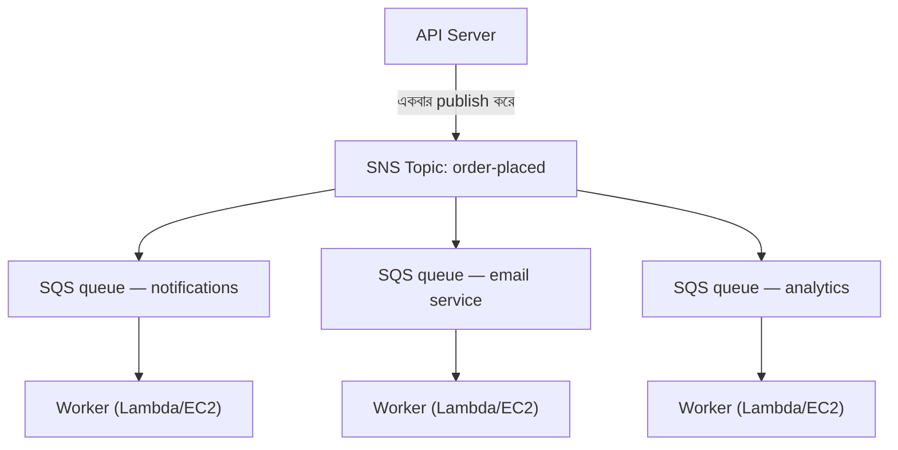

# অধ্যায় ১৯: Ticket Machine

Ticket machine একটি শান্ত বিপ্লব ছিল। একটি নম্বর নিন, ডাকা হওয়ার জন্য অপেক্ষা করুন। লাইন একটি queue হয়ে গেল। মানুষ বসতে পারল। Service counter নিজের গতিতে কাজ করল। কেউ কাউকে আটকাল না।

Ticket machine-এর আগে, আপনাকে লাইনে দাঁড়াতে হত। লাইনে আপনার অবস্থানের জন্য আপনার শারীরিক উপস্থিতি প্রয়োজন ছিল। অপেক্ষা করার সময় আপনি অন্য কিছু করতে পারতেন না। এবং লাইনের সামনের ব্যক্তি ধীর হলে, তার পিছনের সবাই থেমে যেত।

Ticket machine আগমনকে সেবা থেকে আলাদা করল। আপনি এলেন, একটি নম্বর নিলেন, এবং সিস্টেম আপনার জায়গা মনে রাখল। আপনি গিয়ে বসতে পারতেন। Service counter যে গতিতে পারত সেই গতিতে নম্বরগুলির মধ্য দিয়ে কাজ করত। Counter সাময়িকভাবে বন্ধ থাকলে, নতুন আগন্তুকরা এখনও নম্বর পেত। তারা অপেক্ষা করত। কাজটি অদৃশ্য হত না — এটি queue হত।

এই ছোট আবিষ্কারটি মানব সিস্টেমে decoupling-এর প্রাচীনতম উদাহরণগুলির একটি। এই অধ্যায়ের শেষে, Nimbus তার নিজস্ব ticket machine তৈরি করবে — software-এ — এবং কেন এটির প্রয়োজন ছিল তা শুরু হয় একটি শুক্রবার সন্ধ্যায় ষোলো মিনিটের downtime দিয়ে।

---

দল AZ failure থেকে বেঁচে গিয়েছিল। Leo chaos engineering প্রক্রিয়া fix করেছিল, এবং runbook মজবুত ছিল। ট্রাফিক recover করেছিল এবং আবার বাড়ছিল — আসলে আগের চেয়ে দ্রুত। Leo রাতে দেরিতে যে Aurora documentation পড়ছিল তা Nimbus আসলে যেখানে ছিল তার থেকে এখনও কয়েক অধ্যায় এগিয়ে ছিল।

কিন্তু ট্রাফিক বাড়ার সাথে এবং আরও রেস্তোরাঁ onboard হওয়ার সাথে, একটি ভিন্ন ধরনের bottleneck দৃশ্যমান হচ্ছিল। অবকাঠামোতে নয়। application code-এর মধ্যেই। প্রতি ঘণ্টায় ২০০ অর্ডারে যে request chain ভালো কাজ করত তা প্রতি ঘণ্টায় ৮০০-তে চাপ দেখাতে শুরু করেছিল।

এবং তারপর এল ১৪ তারিখের সন্ধ্যা।

---

এটি analytics dashboard দিয়ে শুরু হয়েছিল। একটি শুক্রবার সন্ধ্যা ৬:৪৭-তে, analytics service-এ একটি deploy একটি timeout bug পরিচয় করিয়ে দিল। Service স্বাভাবিক ২০০ মিলিসেকেন্ডের পরিবর্তে ৮ সেকেন্ডে সাড়া দিতে শুরু করল।

Order flow synchronous ছিল। গ্রাহকের কাছে confirm করার আগে প্রতিটি অর্ডার analytics service-এর জন্য অপেক্ষা করত। Load বাড়ার সাথে আট সেকেন্ড ১২ হয়ে গেল। API-এর connection pool analytics step সম্পূর্ণ হওয়ার জন্য অপেক্ষারত request দিয়ে ভরতে শুরু করল।

সন্ধ্যা ৬:৫৩-তে, connection pool তার limit-এ পৌঁছাল। নতুন request সঙ্গে সঙ্গে ব্যর্থ হতে শুরু করল — অর্ডার process করা যাচ্ছিল না বলে নয়, বরং এটি process শুরু করার জন্য কোনো available connection ছিল না বলে।

"Analytics service order flow নামিয়ে ফেলেছে," পরের সকালে log দেখে Leo বলল। "তাদের একে অপরের সাথে কোনো সম্পর্ক নেই। Analytics service কেবল dashboard হিসাব করে।"

"কিন্তু তারা একই request chain-এ আছে," Priya বলল।

"ষোলো মিনিটের downtime," Maya বলল। "এবং তিনজন গ্রাহকের কাছে দুবার charge করা হয়েছে।"

Double-charge downtime-এর চেয়ে খারাপ ছিল। Connection pool saturation-এর বিশৃঙ্খলায়, কিছু request-এর জন্য একটি retry mechanism fire হয়েছিল যা আসলে সফল হয়েছিল — payment step সম্পূর্ণ হয়েছিল, তারপর return করার আগে request timeout হয়েছিল, এবং retry আবার payment চেষ্টা করেছিল। একই card, একই amount, দুটি charge।

"Retry mechanism সাহায্য করার কথা ছিল," Leo বলল।

"এটি ভুল দিকে সাহায্য করেছে," Priya বলল। "এবং আমরা কি ভেবেছি সেই গ্রাহকদের refund করার চেষ্টা করলে কী হবে? Refund প্রক্রিয়া একই order flow ব্যবহার করে যা ব্যর্থ হয়েছিল।"

ষোলো মিনিটের downtime এবং তিনটি double-charge। সেটাই synchronous request chain-এর ব্যবসায়িক cost।

---

Nimbus-এ এমন একটি সমস্যা ছিল যা অর্ডার জনপ্রিয় হওয়া পর্যন্ত সমস্যার মতো অনুভব করেনি।

প্রতিবার কোনো অর্ডার দেওয়া হলে, API server-কে:

1. Database-এ অর্ডার সেভ করতে হত
2. রেস্তোরাঁর tablet-এ একটি notification পাঠাতে হত
3. গ্রাহককে একটি confirmation email পাঠাতে হত
4. রেস্তোরাঁর analytics dashboard আপডেট করতে হত
5. Billing-এর জন্য event log করতে হত

একটি ব্যস্ত deli counter-এ, register-এর ব্যক্তি পরবর্তী গ্রাহকের কাছে যাওয়ার আগে cutter-এর slice করা শেষ হওয়ার অপেক্ষা করে না। তারা অর্ডার নেয়, রান্নাঘরে পৌঁছে দেয় এবং পরবর্তী ব্যক্তির সেবা শুরু করে। রান্নাঘর নিজের গতিতে অর্ডার process করে। গ্রাহক দ্রুত সেবা পায়। হঠাৎ burst-এ রান্নাঘর overwhelmed হয় না। রান্নাঘরে একটি ধীর মুহূর্ত হলে, অর্ডার register-এ error করার পরিবর্তে counter-এর পিছনে জমা হয়।

সেটাই ছিল উপমা। Nimbus-এর একটি counter এবং একটি রান্নাঘর ছিল না। গ্রাহক যাওয়ার আগে এর একজন ব্যক্তি ছিল যে ক্রমানুসারে সবকিছু করত।

এবং ১৪ তারিখে, মাংস কাটার ব্যক্তির একটি সমস্যা ছিল। তাই counter থেমে গেল। তাই তার পরের প্রতিটি গ্রাহক অপেক্ষা করল। রান্নাঘর, register, গ্রাহকরা — সবাই থেমে গেল কারণ chain-এর একটি step ধীর হয়েছিল।

Fix ছিল না মাংস কাটা দ্রুত করা। Fix ছিল step-গুলি আলাদা করা। register-এ অর্ডার নিন, একটি ticket হস্তান্তর করুন, রান্নাঘরকে কাজ করতে দিন।

"আমরা tightly coupled," Priya বলল। "কোনো downstream step ব্যর্থ হলে, পুরো অর্ডার ব্যর্থ হয়। আমরা কি ভেবেছি analytics service compromised হলে এবং malformed message consume করতে শুরু করলে কী হবে? পুরো অর্ডার ব্যর্থ হয় — কারণ আমরা এর জন্য অপেক্ষা করছি।"

"যদি আমরা অর্ডার সেভ করে গ্রাহককে তাৎক্ষণিকভাবে confirm করতে পারতাম," Leo বলল, "এবং তারপর বাকিটা background-এ process করতাম?"

"এটাই একটি queue," Priya বলল।

মূল অন্তর্দৃষ্টি: গ্রাহকের confirmation পাওয়ার আগে analytics dashboard আপডেট হয়েছে কিনা তা জানার দরকার নেই। তাদের জানা দরকার তাদের অর্ডার গৃহীত হয়েছে। ওগুলো ভিন্ন জিনিস। Synchronous chain সেগুলিকে একত্রিত করেছিল।

**Decoupling মডেল**

এটি হলো **decoupling**: যে component কাজ accept করে তাকে যে component কাজ process করে তা থেকে আলাদা করা।

Nimbus-এর order flow-এর সমস্ত step-কে API গ্রাহকের কাছে সাড়া দেওয়ার আগে synchronously ঘটতে হত। Email service ধীর হলে (কখনো কখনো ছিল), গ্রাহক অপেক্ষা করত। Analytics dashboard ডাউন হলে (কখনো কখনো ছিল), অর্ডার ব্যর্থ হত।

১৪ তারিখের cascade ঠিক কেন এটি গুরুত্বপূর্ণ তা প্রদর্শন করেছিল। একজন গ্রাহকের অর্ডার গৃহীত হয়েছে কিনা তার সাথে analytics service-এর কোনো সম্পর্ক ছিল না। কিন্তু কারণ এটি একই synchronous chain-এ বসেছিল, এর failure সবার failure হয়ে গিয়েছিল।

Software system-এ, queue প্রায়ই একটি message broker — একটি service যা producer-দের কাছ থেকে message accept করে এবং consumer-দের কাছে deliver করে।

আপনি হয়তো ভাবছেন: order flow এখন asynchronous হলে, গ্রাহক কীভাবে জানে তাদের অর্ডার আসলে গৃহীত হয়েছে? উত্তর architecture design-এ: API database-এ অর্ডার সেভ করে (synchronous — এটি authoritative confirmation), তারপর queue-এ event publish করে। গ্রাহকের confirmation database write সফল হওয়ার উপর ভিত্তি করে, downstream service সম্পূর্ণ হওয়ার উপর নয়। Email service ধীর হলে, গ্রাহকের কাছে ইতিমধ্যে তাদের confirmation আছে। Email কেবল একটি nice-to-have follow-up।

**Amazon SQS: Queue**

**Amazon SQS (Simple Queue Service)** হলো AWS-এর managed message queue service। এটি একটি consumer দ্বারা process না হওয়া পর্যন্ত durably message store করে।

Basic flow:

1. **Producer** (API server) queue-এ একটি message রাখে: `{ "orderId": "ORD-5532", "restaurantId": "47", "items": [...] }`
2. API তাৎক্ষণিকভাবে গ্রাহকের কাছে সাড়া দেয়: "Order confirmed!"
3. **Consumer** (আলাদা worker service) queue থেকে message read করে এবং process করে: restaurant notification পাঠায়, confirmation email পাঠায়, analytics আপডেট করে

গ্রাহকের অভিজ্ঞতা: instant confirmation। Downstream processing: asynchronously, worker-দের গতিতে ঘটে।

**SQS-এর মূল Concept**

**Message visibility timeout**: যখন একটি consumer SQS থেকে একটি message read করে, message একটি period-এর জন্য অন্য consumer-দের কাছে *অদৃশ্য* হয়ে যায় (ডিফল্ট: ৩০ সেকেন্ড)। এটি consumer-কে process করার সময় দেয়। Consumer সফলভাবে শেষ করলে, এটি message delete করে। Consumer crash করলে, visibility timeout expire হয় এবং message retry করার জন্য আরেকটি consumer-এর কাছে আবার দৃশ্যমান হয়।

এটি at-least-once delivery নিশ্চিত করে: প্রতিটি message কমপক্ষে একবার process হবে, এমনকি একটি consumer মাঝ-processing-এ ব্যর্থ হলেও।

আপনি হয়তো ভাবছেন: message process হওয়ার সময় অদৃশ্য হয়ে যায় কিন্তু consumer crash করলে delete হয় না, তাহলে এটি কি দুবার process হতে পারে না? হ্যাঁ — এবং এটিকে at-least-once delivery বলা হয়। এর মানে প্রতিটি consumer-কে একই message একাধিকবার receive করা handle করার জন্য design করতে হবে কোনো সমস্যা না ঘটিয়ে। একটি duplicate order confirmation email বিরক্তিকর। একটি duplicate charge একটি support ticket। আপনার consumer সেই অনুযায়ী design করুন।

Visibility timeout আপনার দীর্ঘতম প্রত্যাশিত processing time-এর চেয়ে দীর্ঘ হতে হবে। Processing সাধারণত ২০ সেকেন্ড নিলে কিন্তু মাঝে মাঝে ৯০ সেকেন্ড নিলে, এবং আপনার visibility timeout ৩০ সেকেন্ড হলে, সেই মাঝে মাঝের ৯০-সেকেন্ডের processing SQS-এর কাছে একটি failure-এর মতো দেখাবে। Message আবার দৃশ্যমান হয়। একটি দ্বিতীয় consumer এটি তুলে নেয়। এখন দুটি worker একই message process করছে। আপনার processing idempotent না হলে, আপনার একটি সমস্যা আছে।

একটি সাধারণ ভুল: visibility timeout গড় processing time-এর সমান সেট করা। সঠিক পদ্ধতি: এটি একটি safety margin সহ 99th percentile processing time-এ সেট করুন। P99 processing time ৪৫ সেকেন্ড হলে, visibility timeout ৯০ সেকেন্ডে সেট করুন।

**Dead-letter queue (DLQ)**: একটি message অনেকবার processing ব্যর্থ হলে (configurable — যেমন ৫ retry), SQS এটি একটি dead-letter queue-এ সরায়। সেগুলি না হারিয়ে কেন message ব্যর্থ হচ্ছে তা বুঝতে আপনি DLQ inspect করেন।

DLQ হলো যেখানে আপনি শেখেন production-এ আসলে কী ব্যর্থ হচ্ছে। এটি ছাড়া, ব্যর্থ message কেবল অদৃশ্য হয়ে যায় এবং আপনার তদন্ত করার কোনো উপায় থাকে না।

SQS migration-এর তিন সপ্তাহ পর, Leo লক্ষ্য করল notification service-এর DLQ-তে ২৩টি message জমা হয়েছে। সে DLQ check করছিল না (সে এটি সঠিকভাবে সেট আপ করেছিল এবং তারপর ধরে নিয়েছিল এটি খালি থাকবে)।

সে একটি message টেনে নিল এবং payload দেখল:

```json
{
  "orderId": "ORD-9821",
  "restaurantId": "12",
  "customerMessage": "Extra spicy please 🌶️🔥",
  "timestamp": "2024-01-18T19:43:11Z"
}
```

Emoji-টি। Restaurant notification service রেস্তোরাঁর legacy tablet API-তে পাঠানোর আগে message payload-গুলি Latin-1 হিসেবে encode করছিল। Emoji character-গুলি — UTF-8-এ প্রতিটি চার বাইট — corrupt হচ্ছিল, যা tablet API-কে request reject করাচ্ছিল। Message retry করত, আবার ব্যর্থ হত, আবার retry করত, আবার ব্যর্থ হত। ৫টি retry-এর পরে, SQS এটি DLQ-তে সরিয়ে দিত।

"২৩টি message-এর সবগুলিতে customer notes field-এ emoji আছে," Leo বলল।

"তাহলে প্রতিটি গ্রাহক যে তাদের order notes-এ একটি emoji যোগ করেছিল তাদের note নীরবে রেস্তোরাঁয় পৌঁছাতে ব্যর্থ হয়েছে," Maya বলল।

"হ্যাঁ।"

"কতদিন ধরে?"

Leo সবচেয়ে পুরানো message-এর timestamp check করল। "তিন সপ্তাহ।"

Priya চুপ ছিল। "এবং কেউ যদি বুঝে ফেলত যে একটি order note-এ emoji যোগ করলে একটি silent failure হয়? আপনি emoji সহ অর্ডার দিতে পারতেন এবং নিশ্চিত করতে পারতেন রেস্তোরাঁ কখনো instruction দেখবে না। তারপর ভুল অর্ডার সম্পর্কে অভিযোগ করতে পারতেন।"

কেউ এটি exploit করেনি। কিন্তু এটি জিজ্ঞাসা করার সঠিক প্রশ্ন ছিল।

Leo encoding bug fix করল। তারপর সে DLQ থেকে সব ২৩টি আটকে থাকা message replay করার জন্য একটি script লিখল। রেস্তোরাঁগুলি তাদের (তিন-সপ্তাহ-পুরানো) spicy emoji instruction পেল। গ্রাহকরা কখনো জানল না।

শিক্ষা: DLQ অবশ্যই সক্রিয়ভাবে monitor করতে হবে, সেট আপ করে ভুলে যাওয়া নয়। একটি বাড়তে থাকা DLQ একটি নীরব সংকেত যে কিছু বারবার ব্যর্থ হচ্ছে।

**Queue type**:

**Standard queue**: Maximum throughput (প্রতি সেকেন্ডে unlimited message)। Delivery order best-effort (guaranteed নয়)। At-least-once delivery (খুব বিরল ক্ষেত্রে, একটি message দুবার deliver হতে পারে)।

**FIFO queue**: Strict first-in, first-out ordering। Exactly-once **processing** — একটি ৫-মিনিটের window-এর মধ্যে একটি `MessageDeduplicationId`-এর উপর ভিত্তি করে deduplication। Ordering `MessageGroupId` *প্রতি* guaranteed: একই group-এর message order-এ আসে; ভিন্ন group সমান্তরালে process করা যায়, যা FIFO কীভাবে scale করে। Baseline throughput batching সহ প্রতি সেকেন্ডে ৩,০০০ message (batching ছাড়া ৩০০); **high-throughput mode** সক্ষম করলে message group জুড়ে partition করে এটি প্রতি সেকেন্ডে কয়েক দশ হাজারে বাড়ায়। Order গুরুত্বপূর্ণ হলে FIFO ব্যবহার করুন (financial transaction, sequential state পরিবর্তন)।

আপনার maximum throughput প্রয়োজন হলে এবং মাঝে মাঝে duplicate message সহ্য করতে পারলে, SQS Standard ব্যবহার করুন — কিন্তু আপনাকে প্রতিটি consumer-কে duplicate handle করার জন্য design করতে হবে কোনো সমস্যা না ঘটিয়ে। আপনার strict ordering এবং exactly-once processing প্রয়োজন হলে, SQS FIFO ব্যবহার করুন — এবং আপনার `MessageGroupId`-গুলি ভালোভাবে design করুন, কারণ parallelism (এবং তাই throughput) অনেক group থাকা থেকে আসে।

Nimbus-এর জন্য, বেশিরভাগ queue standard queue ব্যবহার করত। Billing queue charge order-এ process হওয়া নিশ্চিত করতে FIFO ব্যবহার করত।

**Queue Depth Auto Scaling: Backlog-এর সাথে মিলিয়ে Worker Scale করা**

SQS-এর সবচেয়ে শক্তিশালী application-গুলির একটি হলো queue depth-কে একটি Auto Scaling trigger হিসেবে ব্যবহার করা। CPU বা memory-এর উপর ভিত্তি করে scale করার পরিবর্তে, আপনি কতটা কাজ অপেক্ষা করছে তার উপর ভিত্তি করে scale করেন।

Nimbus-এর notification service-এর জন্য: SQS queue depth (process করার জন্য অপেক্ষারত message-এর সংখ্যা) notification worker চালানো ECS service-এর জন্য একটি Application Auto Scaling policy-এর সাথে সংযুক্ত ছিল।

Policy: queue-এ প্রতি worker task-এ ৫০-এর বেশি message থাকলে, একটি task যোগ করুন। queue-এ প্রতি worker task-এ ১০-এর কম message থাকলে, একটি task সরান।

ব্যবহারিক প্রভাব: যখন শুক্রবার সন্ধ্যার peak জুড়ে ১,২০০ অর্ডার এল, notification queue depth লাফিয়ে উঠল এবং worker fleet ৩ মিনিটের মধ্যে ২ task থেকে ৮ task-এ scale হল। মধ্যরাতের মধ্যে, queue খালি ছিল এবং fleet আবার ২-তে ফিরে এসেছিল।

"এটার মাসে কত খরচ?" Auto Scaling graph দেখে Tom জিজ্ঞেস করল।

"Auto Scaling নিজেই অতিরিক্ত কিছু নয়," Leo বলল। "কিন্তু শুক্রবার সন্ধ্যায় ৩ ঘণ্টার জন্য ৬টি অতিরিক্ত ECS task — সেটা উল্লেখযোগ্য।"

Tom হিসাব করল। "সেই peak-গুলির জন্য মাসে প্রায় $14। এবং আগে, আমরা পূর্ণ cost-এ ক্রমাগত ৮টি task চালাচ্ছিলাম?"

"হ্যাঁ।"

"তাহলে আমরা যখন প্রয়োজন তখন burst-এর জন্য পেমেন্ট করি এবং অন্যথায় কিছু নয়।"

এটি হলো queue-depth scaling pattern: queue একটি buffer হয়ে যায় যা traffic spike শোষণ করে, এবং worker fleet buffer drain করতে scale করে। ব্যবহারকারীরা ধীরগতি অনুভব করে না — অর্ডার গৃহীত হলে তারা সঙ্গে সঙ্গে তাদের confirmation পেয়েছিল। Worker-রা কেবল ধরতে একটু বেশি সময় নেয়। এবং কারণ আপনি ২৪/৭ peak capacity চালাচ্ছেন না, cost উল্লেখযোগ্যভাবে কম।

**Amazon SNS: Broadcaster**

**Amazon SNS (Simple Notification Service)** হলো একটি publish/subscribe (pub/sub) message service। এক producer, এক consumer (queue)-এর পরিবর্তে, SNS একটি message *অনেক* subscriber-এর কাছে একসাথে deliver করা সমর্থন করে।

মডেল:

1. একটি **publisher** একটি SNS **topic**-এ একটি message পাঠায়
2. সেই topic-এর সমস্ত **subscriber** একসাথে message পায় (fan-out)

Subscriber হতে পারে:

- SQS queue (async processing-এর জন্য একটি queue-এ message push করুন)
- Lambda function (সরাসরি function trigger করুন)
- HTTP/HTTPS endpoint (webhook delivery)
- Email address
- SMS (phone number)

Nimbus-এর জন্য, order placed event `order-events` নামক একটি SNS topic-এ published হয়:

- Restaurant notification service subscribe করে (তার SQS queue-এ receive করে)
- Email service subscribe করে (তার SQS queue-এ receive করে)
- Analytics service subscribe করে (তার SQS queue-এ receive করে)
- Billing service subscribe করে (তার FIFO SQS queue-এ receive করে)

একটি order event। চারটি subscriber। সবাই একসাথে notified। প্রতিটি নিজের গতিতে process করে।

"তাহলে SNS হলো announcement," Maya বলল, "এবং SQS হলো inbox যেখানে প্রতিটি team নিজের গতিতে announcement process করে। তাহলে দুটোই কেন ব্যবহার করব? সবাই কেন সরাসরি SNS topic subscribe করে না?"

"কারণ সরাসরি SNS delivery fire-and-forget," Leo বলল। "SNS fire করার সময় analytics service ডাউন থাকলে, সেই message চলে গেছে। মাঝখানে একটি SQS queue থাকলে, service recover না হওয়া পর্যন্ত message অপেক্ষা করে।"

"ঠিক," Priya বলল। "SNS/SQS fan-out হলো standard pattern।"

**SNS/SQS Fan-Out Pattern**

এই সংমিশ্রণ — একাধিক SQS queue-এ feed করা SNS topic — AWS-এর সবচেয়ে গুরুত্বপূর্ণ architectural pattern-গুলির একটি:



প্রতিটি queue independent। Analytics service ধীর হতে পারে — তার queue ভরে যায়, কিন্তু notification এবং email service unaffected চালিয়ে যায়। Analytics service ডাউন হলে, এটি ফিরে আসা পর্যন্ত তার message queue-এ অপেক্ষা করে। কিছু হারায় না।

এটি মূল property: **independent failure**। একটি consumer-এ সমস্যা অন্যদের কাছে propagate করে না।

**Message Filtering: প্রতিটি Subscriber-এর জন্য প্রতিটি Message নয়**

System বাড়ার সাথে সাথে, আপনি চান না প্রতিটি subscriber প্রতিটি message process করুক। একটি analytics service-এর failed payment processing সম্পর্কে message পাওয়া উচিত নয় যদি এটি শুধুমাত্র completed order নিয়ে চিন্তা করে।

**SNS message filtering** subscriber-দের filter policy নির্দিষ্ট করতে দেয় — শুধুমাত্র নির্দিষ্ট attribute match করা message deliver করুন।

Restaurant notification service একটি filter সহ subscribe করে: শুধুমাত্র message যেখানে `status = "confirmed"`।

Error alerting service একটি filter সহ subscribe করে: শুধুমাত্র message যেখানে `status = "failed"`।

প্রতিটি subscriber শুধুমাত্র যা প্রয়োজন তাই পায়।

Filtering ছাড়া, প্রতিটি subscriber প্রতিটি message পায় এবং যা অপ্রাসঙ্গিক তা উপেক্ষা করতে হয়। এটি processing নষ্ট করে, অর্থ নষ্ট করে (SQS প্রতি message charge করে), এবং noise পরিচয় করিয়ে দেয়। Filtering ছাড়া একটি high-volume order system error alerting queue-কে সফল অর্ডার দিয়ে প্লাবিত করবে — যা প্রকৃত failure-গুলি খুঁজে পাওয়া কঠিন করে।

Filter policy দেখতে এমন:

```json
{
  "status": ["confirmed"],
  "region": ["us-west-2", "us-east-1"]
}
```

এই subscriber শুধুমাত্র সেই message পায় যেখানে status "confirmed" AND region হয় "us-west-2" বা "us-east-1"। Policy match না করা message এই subscriber-এর queue-এ মোটেও deliver হয় না — সেগুলি কখনো SQS-এ পৌঁছায়ও না।

"তাহলে filtering SNS layer-এ ঘটে," Priya বলল, "message SQS-এ লেখার আগে?"

"সঠিক। Restaurant notification service-এর SQS queue শুধুমাত্র সেই message দেখে যার উপর এটির কাজ করা দরকার।"

"এবং কেউ যদি SNS topic-এ একটি বিশেষভাবে তৈরি message publish করে ভাঙার চেষ্টা করে যা সব subscriber filter match করে?" Priya জিজ্ঞেস করল।

SNS topic-এর একটি IAM resource policy ছিল: শুধুমাত্র order API service-কে (তার IAM role দ্বারা) publish করার অনুমতি ছিল। SNS access policy এবং SQS queue policy access control layer গঠন করেছিল — filtering কেবল routing-এর জন্য ছিল, security-এর জন্য নয়।

**কখন SQS বনাম SNS ব্যবহার করবেন**

**শুধু SQS**: এক producer, এক consumer (বা একই queue-এ একাধিক competing consumer)। Message একবার, order-এ (FIFO) বা না (standard) process করতে হবে। Worker queue pattern — একটি queue, একাধিক worker এটি থেকে consume করছে।

**শুধু SNS**: Fire-and-forget notification। Email, SMS বা HTTP endpoint-এ push করুন। Message queue করার দরকার নেই — শুধু notify করুন এবং চলুন।

**SNS + SQS (fan-out)**: এক event, একাধিক independent consumer। প্রতিটি consumer-এর নিজস্ব queue আছে, independently process করে এবং independently ব্যর্থ হতে পারে।

## SNS FIFO Topic

SNS সম্পর্কে উপরের সবকিছু standard topic ব্যবহার করে — তাদের কার্যত unlimited throughput আছে, প্রায় একসাথে subscriber-দের কাছে deliver করে, এবং বেশিরভাগ use case-এর জন্য কাজ করে।

কিন্তু standard SNS topic ordering guarantee দেয় না। আপনি ক্রমানুসারে দশটি message publish করলে, subscriber-রা সেগুলি সামান্য ভিন্ন order-এ পেতে পারে। Nimbus order notification-এর জন্য, এটা ঠিক — একটি email confirmation-এর এক সেকেন্ডের ভগ্নাংশ আগে একটি analytics update আসা গুরুত্বপূর্ণ নয়।

কিছু scenario-এর জন্য, এটা গুরুত্বপূর্ণ। একটি financial ledger বিবেচনা করুন: দুটি event — একটি credit এবং তারপর একটি debit — উল্টো order-এ deliver হলে, processing-এর সময় balance হিসাব ভুল হবে এমনকি উভয় event শেষ পর্যন্ত সঠিকভাবে process হলেও।

**SNS FIFO topic** SQS FIFO queue-এর মতো একই নীতি fan-out মডেলে প্রয়োগ করে। Message subscriber-দের কাছে ঠিক যে order-এ publish করা হয়েছিল সেই order-এ deliver হয়, এবং প্রতিটি message ঠিক একবার deliver হয়।

Trade-off: SNS FIFO topic-এর SQS FIFO-এর মতো একই baseline throughput আছে (প্রতি topic প্রতি সেকেন্ডে ৩,০০০ message; প্রতি message group প্রতি সেকেন্ডে ৩০০ — অনেক বেশির জন্য ২০২৫ থেকে একটি high-throughput mode উপলব্ধ), এবং তারা শুধুমাত্র **SQS queue**-এ fan out করে — FIFO অথবা, ২০২৩ থেকে, Standard। একটি Standard queue subscribe করা সেই consumer-দের জন্য উপযোগী যারা order নিয়ে চিন্তা করে না (একটি analytics feed, উদাহরণস্বরূপ), কিন্তু ordering এবং exactly-once end to end টিকে থাকে **শুধুমাত্র** FIFO queue-এ। আপনি একটি SNS FIFO topic HTTP endpoint বা email address-এ deliver করতে ব্যবহার করতে পারবেন না।

Nimbus-এর billing pipeline-এর জন্য — যেখানে pricing update-এর একটি sequence রেস্তোরাঁ account-এ order-এ প্রয়োগ করতে হত — billing SNS topic standard থেকে FIFO-তে migrate করা হল। SQS billing queue ইতিমধ্যে FIFO ছিল। Fan-out এখন নিশ্চিত করল যে একটি price-increase event কখনো billing processor-এ এর নির্ভরশীল period-start event-এর আগে আসবে না।

> **পরীক্ষার টিপস — SNS FIFO**
>
> একটি scenario একাধিক subscriber জুড়ে **ordered fan-out delivery** প্রয়োজন করলে, উত্তর হলো **SNS FIFO**। Standard SNS ordering guarantee দেয় না। SNS FIFO শুধুমাত্র SQS queue-এ fan out করে — ordering এবং exactly-once end to end রাখতে, subscriber-কে একটি SQS **FIFO** queue হতে হবে (Standard queue subscription অনুমোদিত কিন্তু best-effort ordering এবং at-least-once delivery পায়)। ডিফল্ট throughput প্রতি topic ৩,০০০/sec — scenario অনেক বেশি volume *এবং* strict ordering বর্ণনা করলে, সেটা বিকল্প architecture দেখার একটি সংকেত (Kinesis, উদাহরণস্বরূপ, যা একটি পরবর্তী অধ্যায়ে কভার করা হয়েছে)।

## যখন Legacy Queue ছাড়তে চায় না

Nimbus তার সবচেয়ে বড় acquisition বন্ধ করতে চলেছিল: Barato, একটি food delivery প্রতিযোগী ২০০টি রেস্তোরাঁ এবং operation-এ দুই বছরের head start সহ। Engineering team একটি integration planning call নির্ধারণ করল।

Leo চুপ হওয়ার আগে call বিশ মিনিট চলেছিল।

"তাদের order processing system," সে বলল। "এটা কীসের উপর চলে?"

"ActiveMQ," অন্য প্রান্তে থাকা Barato engineer বলল। "On-prem broker। App Java। এটা ২০১৮ থেকে চলছে। সবকিছু AMQP-তে কথা বলে।"

"AMQP," Leo বলল।

"হ্যাঁ।"

সে তার স্ক্রিনে architecture diagram-এর দিকে তাকাল। Nimbus SQS এবং SNS চালাত। SQS AMQP-তে কথা বলে না। SNS AMQP-তে কথা বলে না। Barato application আর কিছুতে কথা বলত না।

"এটা rewrite করতে ছয় মাস লাগবে," call-এর পর Leo team-কে বলল। "ন্যূনতম।"

"আমরা ছয় মাসের জন্য acquisition বিলম্ব করতে পারি না," Maya বলল।

"এবং আমরা AWS-এ একটি bare-metal ActiveMQ broker চালাতে পারি না," Priya যোগ করল। "আমরা কি ভেবেছি security এবং reliability-এর দৃষ্টিকোণ থেকে সেটা কেমন দেখায়? একটি self-managed message broker, production-এ বসে, কোনো managed patching ছাড়া, কোনো automatic failover ছাড়া, আমাদের অবকাঠামোর সাথে সংযোগ করছে?"

"একটি managed option আছে," Leo ধীরে বলল। সে তারা কথা বলার সময় পড়ছিল। "Amazon MQ।"

**Amazon MQ: Managed Broker**

**Amazon MQ** হলো Apache ActiveMQ এবং RabbitMQ-এর জন্য একটি managed message broker service। এটি আপনার বিদ্যমান broker চালায় — যে broker-এর সাথে আপনার application বছরের পর বছর সংযুক্ত ছিল — কিন্তু একটি managed AWS service হিসেবে। AWS অন্তর্নিহিত অবকাঠামো handle করে: provisioning, patching, failover, backup।

মূল property যা Amazon MQ-কে SQS এবং SNS থেকে আলাদা করে: এটি সেই protocol-গুলিতে কথা বলে যা legacy message broker কথা বলে। AMQP, STOMP, MQTT, OpenWire, NMS। সেই protocol যা SQS এবং SNS কেবল বোঝে না।

Barato integration-এর জন্য, plan সহজ ছিল। AWS ActiveMQ হিসেবে configure করা একটি Amazon MQ broker চালাবে। Barato Java application on-premises-এর পরিবর্তে নতুন broker endpoint-এ নির্দেশ করা হবে। Application দিকে পরিবর্তন: নতুন connection string সহ একটি configuration file আপডেট করুন। সেটাই। Application-এর জানার দরকার ছিল না যে এটি Barato office-এর একটি server-এর পরিবর্তে একটি managed cloud broker-এর সাথে কথা বলছে।

"দাঁড়াও," Maya বলল। "আমরা যদি শেষ পর্যন্ত তাদের Nimbus-এ integrate করব, তাহলে শুরু থেকেই তাদের SQS-এ migrate করব না কেন?"

"কারণ migration path বিদ্যমান," Leo বলল। "এবং এটা সঠিকভাবে করার মূল্য আছে — শেষ পর্যন্ত। কিন্তু এখন, আমাদের Barato-কে ত্রিশ দিনে AWS অবকাঠামোতে operational করতে হবে, ছয় মাসে নয়। Amazon MQ application পরিবর্তন না করে application চালু করে। তারপর আমাদের কাছে SQS migration-কে একটি ইচ্ছাকৃত project হিসেবে plan করার সময় আছে, acquisition-এর জন্য একটি তাড়াহুড়ো করা prerequisite হিসেবে নয়।"

"এটার মাসে কত খরচ?" Tom জিজ্ঞেস করল।

Amazon MQ broker — reliability-এর জন্য একটি single active/standby pair — Barato-র volume-এর জন্য উপযুক্ত একটি broker-এর জন্য মাসে $200-এর পরিসরে ছিল। ছয় মাসের rewrite time-এর cost-এর তুলনায়, এটা কোনো বিতর্ক ছিল না।

Priya একটি শর্তে plan অনুমোদন করল: Amazon MQ instance একটি private subnet-এ থাকবে, security group rule শুধুমাত্র Barato application server থেকে সংযোগের অনুমতি দিয়ে। কোনো public exposure নেই। Audit logging সক্ষম।

Migration বারো দিন নিল। Barato application তেরো দিনে Amazon MQ-তে সংযুক্ত হল। চৌদ্দ দিনে, এটি একটি কোড পরিবর্তন ছাড়াই AWS অবকাঠামোতে তার প্রথম অর্ডার process করল।

---

> **পরীক্ষার টিপস — Amazon MQ**
>
> *SAA-C03 ডোমেন: Design Resilient Architectures (ডোমেন ২)*
>
> পরীক্ষা Amazon MQ-কে SQS এবং SNS থেকে একটি একক অক্ষে আলাদা করে: **protocol compatibility**। Scenario এমন একটি application বর্ণনা করলে যা ইতিমধ্যে একটি message broker ব্যবহার করে এবং একটি নির্দিষ্ট protocol-এ কথা বলে, Amazon MQ প্রায় নিশ্চিতভাবে উত্তর।
>
> মূল সংকেত: **"ActiveMQ," "RabbitMQ," "AMQP," "STOMP," "MQTT," "OpenWire,"** বা **"application code পরিবর্তন না করে"**-এর সমতুল্য যেকোনো বাক্যাংশ। আপনি সেই বাক্যাংশগুলি দেখলে, উত্তর Amazon MQ — SQS নয়, SNS নয়।
>
> Scenario decoupling প্রয়োজন এমন একটি *নতুন* application বর্ণনা করলে, বা একটি legacy broker বা নির্দিষ্ট protocol উল্লেখ না করলে, SQS/SNS ব্যবহার করুন।
>
> আরেকটি সংকেত: "বিদ্যমান on-premises message broker AWS-এ migrate করুন।" App-কে একই ধরনের broker-এর সাথে একই protocol-এ কথা বলতে রাখতে হলে, Amazon MQ হলো lift-and-shift উত্তর।

## শক্তি এবং সীমাবদ্ধতা

**SQS এবং SNS কেন শক্তিশালী**:

- SQS durable, reliable message delivery প্রদান করে — message একাধিক AZ জুড়ে stored
- Decoupling producer এবং consumer service-এর independent scaling এবং deployment সক্ষম করে
- Dead-letter queue নিশ্চিত করে কোনো message ব্যর্থতায় নীরবে হারায় না
- SNS fan-out pattern producer পরিবর্তন না করে নতুন consumer যোগ করতে দেয়

**যেখানে জটিল হয়**:

- At-least-once delivery মানে consumer অবশ্যই *idempotent* হতে হবে — একই message দুবার process করা সমস্যা ঘটানো উচিত নয় (duplicate order, duplicate charge)
- FIFO queue আরও ব্যয়বহুল এবং throughput limit আছে
- একাধিক queue এবং service জুড়ে ব্যর্থ message debug করার জন্য ভালো logging এবং observability প্রয়োজন
- Message ordering guarantee সীমিত — strict ordering একাধিক service জুড়ে গুরুত্বপূর্ণ হলে, design জটিল হয়

**Idempotency: একটি ব্যবহারিক গভীর বিশ্লেষণ**

আপনি তিনজন গ্রাহককে double-charge না করা পর্যন্ত idempotency বিমূর্ত শোনায়।

একটি operation **idempotent** যদি এটি একাধিকবার চালানো একবার চালানোর মতো একই ফলাফল উৎপন্ন করে। একটি charge operation স্বাভাবিকভাবে idempotent নয়: এটি দুবার চালানো দুবার charge করে। একটি idempotent charge operation এটি চেষ্টা করার আগে charge ইতিমধ্যে process হয়েছে কিনা তা check করে।

Pattern: প্রতিটি message একটি unique ID বহন করে (order ID, বা একটি পৃথক message ID)। Process করার আগে, consumer একটি store check করে (DynamoDB এর জন্য ভালো কাজ করে) এই message ID ইতিমধ্যে সফলভাবে process হয়েছে কিনা দেখতে। হ্যাঁ হলে: কিছুই করবেন না, message delete করুন। না হলে: process করুন, ID record করুন, message delete করুন।

```python
def process_charge(message):
    order_id = message['orderId']
    
    # Idempotency check
    if already_processed(order_id):
        logger.info(f"Order {order_id} already charged, skipping duplicate")
        return  # Message will be deleted from queue
    
    # Process the charge
    charge_result = payment_service.charge(
        amount=message['amount'],
        card_token=message['cardToken'],
        idempotency_key=order_id  # Also pass to payment processor
    )
    
    # Record that we've processed this
    mark_as_processed(order_id, charge_result)
```

Idempotency key যেসব downstream service (payment processor, email system) এটি সমর্থন করে তাদের কাছেও pass করা উচিত। Stripe, উদাহরণস্বরূপ, একটি `Idempotency-Key` header গ্রহণ করে যা একই API call দুবার করা হলেও duplicate charge প্রতিরোধ করে।

"এবং correlation ID সম্পর্কে কী?" Priya জিজ্ঞেস করল। "একটি message একাধিক service-এর মধ্য দিয়ে যাওয়ার সময়, আমরা কীভাবে trace করব কোন request কোন downstream action ঘটিয়েছে?"

**Correlation ID: Service জুড়ে Trace করা**

একজন গ্রাহক অর্ডার দিলে, request প্রবাহিত হয়: API → SNS → SQS → notification worker → restaurant tablet API → SQS → email worker → SES।

Correlation ID ছাড়া, step 6-এ restaurant tablet API একটি error return করলে, প্রতিটি service-এর log event দেখায়, কিন্তু এটিকে শুরু থেকে নির্দিষ্ট গ্রাহকের অর্ডারে ফিরিয়ে trace করার কোনো উপায় নেই।

একটি **correlation ID** হলো একটি unique identifier যা original request-এর সাথে যুক্ত এবং প্রতিটি service interaction-এর মধ্য দিয়ে pass করা হয়। প্রতিটি service তার log-এ correlation ID অন্তর্ভুক্ত করে।

Priya একটি নির্দিষ্ট correlation ID-এর জন্য CloudWatch search করলে, সে প্রতিটি log line পায় — প্রতিটি service জুড়ে — যা সেই একটি অর্ডারের processing-এর অংশ ছিল।

"একটি সতর্কতা," Priya বলল। "Correlation ID বাইরে থেকে আসে। কেউ কি একটি malicious ID inject করে আমাদের logging-এ গোলমাল করতে পারে?"

Correlation ID অভ্যন্তরীণ — তারা processing logic প্রভাবিত করে না, শুধু logging। সেগুলি sanitize করা (alphanumeric, fixed length) log output-এ injection attack প্রতিরোধ করে।

**কখন Decoupling ভুল পছন্দ**

"দাঁড়াও — কিন্তু আমরা কেন সবকিছু decouple করব না?" Maya জিজ্ঞেস করল।

এটি একটি ন্যায্য প্রশ্ন ছিল। Decoupling cascade failure প্রতিরোধ করলে এবং system resilient করলে, কেন সর্বত্র এটি প্রয়োগ করব না?

কারণ decoupling-এর cost আছে। এবং এমন scenario আছে যেখানে সেই cost benefit-কে ছাড়িয়ে যায়।

**যখন আপনার immediate consistency প্রয়োজন**: একটি payment-কে একটি অর্ডার এগিয়ে যাওয়ার আগে confirm করতে হলে — এবং ব্যবহারকারী ফলাফলের জন্য screen-এ অপেক্ষা করছে — আপনি payment-কে একটি asynchronous queue-এ রাখতে এবং charge সফল হয়েছে কিনা জানার আগে একটি confirmation return করতে পারবেন না। প্রথম charge সম্পূর্ণ হওয়ার আগে ব্যবহারকারী দুবার অর্ডার করতে পারে। Asynchronous decoupling সেই operation-এর জন্য কাজ করে না যেখানে response outcome-এর উপর নির্ভর করে।

**যখন workflow সহজাতভাবে sequential**: step 3-কে একটি সিদ্ধান্ত নিতে step 2-এর ফলাফল দেখতে হলে, তারা একটি queue থেকে সমান্তরালে চলতে পারে না। সেগুলিকে একটি queue-এ বাধ্য করা একটি বিশ্রী result-passing mechanism তৈরি করে যা প্রায়ই synchronous version-এর চেয়ে বেশি জটিল হয়ে যায়।

**যখন message ordering critical এবং volume কম**: SQS Standard ordering guarantee দেয় না। SQS FIFO দেয়, কিন্তু ডিফল্টভাবে batching সহ ৩,০০০ message/সেকেন্ডে সীমাবদ্ধ (high-throughput mode সেটা উল্লেখযোগ্যভাবে বাড়ায়)। আপনার একটি low-volume, strictly ordered workflow থাকলে, একটি সহজ synchronous queue (যেমন একটি database row lock) সহজ এবং আরও reliable হতে পারে।

**যখন overhead benefit ছাড়িয়ে যায়**: একজন ব্যবহারকারী এবং কোনো SLA ছাড়া একটি ছোট internal tool-এর সম্ভবত fan-out SNS topic এবং DLQ প্রয়োজন নেই। Queue এবং DLQ monitor করার operational overhead বাস্তব। সমস্যার সাথে architecture-এর আকার মিলান।

প্রশ্নটি "আমি কি এটি decouple করব?" নয়। এটি "এই coupling-এর cost কী, এবং decoupling সেই cost কি যোগ করার চেয়ে বেশি কমায়?"

## সারসংক্ষেপ

Decoupling হলো অধ্যায় ১৮-এর resilience নীতি অভ্যন্তরীণ architecture-এ প্রয়োগ করা: Multi-AZ যেভাবে অবকাঠামোতে single point of failure দূর করে, SQS এবং SNS একইভাবে request chain-এ single point of failure দূর করে।

- **Decoupling** যে component কাজ produce করে তাকে যে component কাজ process করে তা থেকে আলাদা করে।
- **SQS** consumer ধীর, offline বা scale up হওয়ার সময় producer-দের কাজ রাখার একটি durable জায়গা দেয়।
- **SNS** একটি event-কে একাধিক independent consumer-এর কাছে পৌঁছাতে দেয় publisher তারা কে তা না জেনে।
- **SNS + SQS fan-out** প্রতিটি downstream service-কে একই event নিজের গতিতে process করতে দেয়।
- **DLQ, idempotency এবং correlation ID** হলো operational discipline যা asynchronous system-কে রহস্যময়ের পরিবর্তে debuggable করে।
- **অন্ধভাবে decouple করবেন না**: synchronous workflow, immediate consistency প্রয়োজনীয়তা, এবং ছোট low-risk tool যোগ করা operational surface justify করতে নাও পারে।

## পরীক্ষার টিপস

*SAA-C03 ডোমেন: Design Resilient Architectures (ডোমেন ২, টাস্ক ২.১)*

- **SQS Standard বনাম FIFO**: পরীক্ষা ordering এবং delivery guarantee দ্বারা আলাদা করে। "Order-এ process করতে হবে" → FIFO। "Maximum throughput" → Standard।
- **Queue depth Auto Scaling**: "queue depth-এর উপর ভিত্তি করে worker scale করুন" → Application Auto Scaling বা ECS Service Auto Scaling-এর সাথে ব্যবহৃত SQS metric (ApproximateNumberOfMessagesVisible)।
- **Visibility timeout**: At-least-once delivery-র জন্য মূল concept। একটি consumer ব্যর্থ হলে, timeout-এর পরে message আবার দৃশ্যমান হয়। পরীক্ষার দৃশ্যকল্প: "message দুবার process হচ্ছে" → visibility timeout অনেক ছোট (consumer process করতে timeout-এর চেয়ে বেশি সময় নেয়)।
- **Dead-letter queue**: N retry-এর পরে ব্যর্থ message এখানে সরানো হয়। পরীক্ষার দৃশ্যকল্প: "processing বারবার ব্যর্থ হলেও কোনো message হারানো নিশ্চিত করুন" → DLQ।
- **SNS fan-out**: এক event একাধিক consumer trigger করার classic পরীক্ষার pattern। "Order placed notification একসাথে email, SMS এবং inventory আপডেট trigger করতে হবে" → SQS subscription সহ SNS topic।
- **SQS + Lambda**: Lambda একটি SQS queue poll এবং প্রতিটি message batch-এ trigger করার জন্য configure করা যায়। পরীক্ষা এটি স্কেলে event-driven processing-এর জন্য ব্যবহার করে।
- **SQS long polling**: প্রতি কয়েক সেকেন্ডে consumer polling-এর পরিবর্তে (short polling, API call নষ্ট করে), long polling একটি message-এর জন্য ২০ সেকেন্ড পর্যন্ত অপেক্ষা করে। Cost কমায় এবং false empty response কমায়।
- **SQS extended client library**: queue-এর payload limit-এর চেয়ে বড় message-এর জন্য (ডিফল্টভাবে 256KB; ২০২৫ থেকে 1MB-তে বাড়ানো যায়), SQS Extended Client Library ব্যবহার করুন, যা message body S3-এ store করে এবং SQS-এর মাধ্যমে একটি reference পাঠায়। পরীক্ষা এখনও 256KB-কে SQS limit হিসেবে গণ্য করে — "SQS message অনেক বড়" → Extended Client Library + S3।
- **SNS message filtering**: Subscriber শুধুমাত্র তাদের filter policy match করা message পায়। পরীক্ষার দৃশ্যকল্প: "একটি subscriber-কে শুধুমাত্র নির্দিষ্ট criteria match করা notification পাঠান" → SNS message filtering।
- **নোট**: SNS/SQS fan-out high-throughput asynchronous processing architecture সম্পর্কে ডোমেন ৩ scenario-তেও আসে। resilience এবং performance উভয় প্রশ্নের জন্য pattern জানুন।
- **Amazon MQ সংকেত**: "ActiveMQ," "RabbitMQ," "AMQP," "STOMP," "MQTT," "OpenWire," বা "application code পরিবর্তন না করে" → Amazon MQ, SQS নয়। Scenario decoupling প্রয়োজন এমন একটি নতুন application বললে → SQS/SNS।
- **SNS FIFO বনাম Standard**: Standard SNS ordering guarantee দেয় না। Scenario **ordered fan-out** প্রয়োজন করলে → SQS FIFO queue-এ feed করা SNS FIFO topic। মনে রাখুন: SNS FIFO HTTP endpoint বা email-এ deliver করতে পারে না — শুধুমাত্র SQS queue-এ (ordering/exactly-once-এর জন্য FIFO; Standard subscription কাজ করে কিন্তু best-effort ordering এবং at-least-once-এ নেমে যায়)।

## অনুশীলনী

**অনুশীলন ১ — স্মরণ**

SNS/SQS fan-out pattern ব্যাখ্যা করুন। Pattern কেন service-গুলিকে HTTP endpoint সহ সরাসরি SNS topic subscribe করার পরিবর্তে SQS queue ব্যবহার করে?

*(ইঙ্গিত: SNS একটি message publish করার সময় HTTP endpoint-গুলির একটি ডাউন থাকলে কী হয় তা নিয়ে ভাবুন।)*

**অনুশীলন ২ — SAA-C03 দৃশ্যকল্প**

*দৃশ্যকল্প*: একটি e-commerce platform প্রতি ঘণ্টায় ১০,০০০ অর্ডার process করে। একটি অর্ডার দেওয়া হলে, সিস্টেমকে অবশ্যই: (১) database-এ অর্ডার store করতে হবে, (২) inventory বাদ দিতে হবে, (৩) একটি confirmation email পাঠাতে হবে এবং (৪) analytics dashboard আপডেট করতে হবে। বর্তমানে, সব চারটি step synchronously হয় — analytics service ধীর হলে, গ্রাহক অপেক্ষা করে। দল কোনো অর্ডার না হারিয়ে গ্রাহক-মুখী response time উন্নত করতে চায়।

কোন architecture এই প্রয়োজনীয়তা সর্বোত্তমভাবে address করে?

A) সব চারটি step sequence-এ process করতে SQS FIFO queue ব্যবহার করুন  
B) API অর্ডার সেভ করে গ্রাহকের কাছে তাৎক্ষণিকভাবে confirm করুক; একটি SNS topic-এ একটি event publish করুক; inventory, email এবং analytics service SQS queue-এর মাধ্যমে subscribe করুক  
C) প্রতিটি step একসাথে synchronously process করতে parallel EC2 instance ব্যবহার করুন  
D) Order processing speed up করতে request validation সহ একটি API Gateway ব্যবহার করুন

**ইঙ্গিত ১**: গ্রাহক confirmation তাৎক্ষণিক হওয়া উচিত। Response-এর আগে কোন step অবশ্যই ঘটতে হবে, এবং কোনগুলি পরে হতে পারে?

**ইঙ্গিত ২**: Analytics service ধীর হওয়া email বা inventory service প্রভাবিত করা উচিত নয়।

**ইঙ্গিত ৩**: SNS fan-out তিনটি downstream service-কে একসাথে event receive করতে দেয়।

**উত্তর**: B

**ব্যাখ্যা**: API database-এ অর্ডার সেভ করে (synchronous — confirm করার আগে অবশ্যই করতে হবে) এবং তাৎক্ষণিকভাবে একটি confirmation return করে। তারপর এটি একটি SNS topic-এ একটি `order-placed` event publish করে। Inventory, email এবং analytics service প্রতিটি independent SQS queue-এর মাধ্যমে subscribe করে। তারা নিজস্ব গতিতে process করে — analytics ধীর হলে, তার queue বাড়ে কিন্তু অন্য service unaffected। কোনো service ব্যর্থ হলে, তার message SQS queue-এ থাকে এবং retry হয়; configured সংখ্যক ব্যর্থ retry-এর পরে সেগুলি DLQ-তে সরানো হয়।

**কেন A নয়?** FIFO queue message sequence-এ process করে — এটি synchronous slowdown-এ সাহায্য করে না। এছাড়াও, sequential processing মানে analytics ধীর হওয়া এখনো email block করে।

**কেন C নয়?** "Parallel EC2 instance synchronously process করছে" এখনো গ্রাহকের কাছে সাড়া দেওয়ার আগে সমস্ত step সম্পূর্ণ হওয়া প্রয়োজন। Instance যোগ করা synchronous coupling সমাধান করে না।

**কেন D নয়?** API Gateway API routing এবং validation accelerate করে, কিন্তু downstream processing step decouple করে না।

*SAA-C03 ডোমেন: Design Resilient Architectures — টাস্ক ২.১*

**অনুশীলন ৩ — আর্কিটেকচার চ্যালেঞ্জ** *(ঐচ্ছিক)*

Nimbus রেস্তোরাঁ অংশীদারদের জন্য একটি notification system তৈরি করছে। একজন গ্রাহক একটি অর্ডার দিলে, রেস্তোরাঁকে এর মাধ্যমে notify করতে হবে:

- তাদের tablet app (push notification)
- একটি kitchen display system (তাদের local hardware-এ HTTP webhook)
- একটি backup SMS (tablet notification ব্যর্থ হলে)

Tablet notification service reliable। Kitchen webhook কখনো কখনো ডাউন থাকে (রেস্তোরাঁ closing time-এ তাদের hardware বন্ধ করে)। SMS শুধুমাত্র tablet notification ব্যর্থ হলে fire হওয়া উচিত।

SNS এবং SQS ব্যবহার করে architecture design করুন। "Tablet ব্যর্থ হলেই SMS" requirement কীভাবে handle করবেন? Kitchen webhook offline থাকলে এটি tablet notification block না করে কীভাবে নিশ্চিত করবেন?

এছাড়াও বিবেচনা করুন: average webhook response time ২ সেকেন্ড কিন্তু slow hardware সহ রেস্তোরাঁ ৩০ সেকেন্ড পর্যন্ত নিতে পারলে kitchen webhook delivery-র জন্য কোন visibility timeout উপযুক্ত? webhook retry শেষ হওয়ার পরে কোন DLQ policy SMS fallback trigger করবে?

*(একটি একক সঠিক উত্তর নেই। লক্ষ্য হলো conditional routing সহ fan-out design অনুশীলন করা।)*

## পোস্ট-ক্রেডিটস দৃশ্য

নতুন order flow live ছিল।

Leo এটি একটি মঙ্গলবার বিকেলে প্রথমে একটি full load test না চালিয়ে deploy করেছিল। "এটা ঠিক থাকবে," সে Priya-কে বলেছিল। "Architecture মজবুত।"

গ্রাহকরা অর্ডার দিল। API ৯৫ মিলিসেকেন্ডে সাড়া দিল। Confirmation তাদের ফোনে তাৎক্ষণিকভাবে দেখা গেল।

পেছনে: চারটি service asynchronously process করছে। Analytics service-এ একটি bug ছিল যা item name-এ নির্দিষ্ট special character থাকা অর্ডারে এটিকে crash করাত। তার queue দুই ঘণ্টায় ৩,২০০ message-এ জমে গেল।

গ্রাহকরা কখনো লক্ষ্য করেনি।

Leo bug fix করে analytics service restart করলে, এটি ১৮ মিনিটে backlog process করল। কোনো ডেটা হারায়নি। DLQ খালি ছিল।

সে CloudWatch dashboard refresh করল। Queue depth: 0। Message processed: 3,200। Error: 0 (fix-এর পরে)।

"১৪ তারিখ ঠিক এমন দেখাত," সে বলল। "Analytics-এর একটি সমস্যা ছিল। Queue এটি শোষণ করেছিল। বাকি সবকিছু কাজ করতে থাকল।"

"এটাই decoupling মানে," Priya বলল।

"এটার মাসে কত খরচ?" Tom জিজ্ঞেস করল, ইতিমধ্যে pricing page-এ।

"আমাদের current volume-এ, SQS-এর জন্য মাসে প্রায় বারো ডলার।" সে স্ক্রিনের দিকে তাকাল। "আমি বেশি আশা করেছিলাম।"

তার সেই চেহারা ছিল যেন কেউ আবিষ্কার করছে যে অপ্রত্যাশিতভাবে সস্তা কিছু অপ্রত্যাশিতভাবে ভালোও।

"DLQ alert সেট আপ করুন," Priya Leo-কে মনে করিয়ে দিল। "আমরা আরও তিন সপ্তাহের silent failure চাই না।"

"ইতিমধ্যে করা হয়েছে," Leo বলল।

সে এবার করেছিল।

পরবর্তী অধ্যায়ে: সেই function যা শুধুমাত্র কেউ knock করলে চলে — এবং কেউ না করলে কিছু খরচ করে না।
