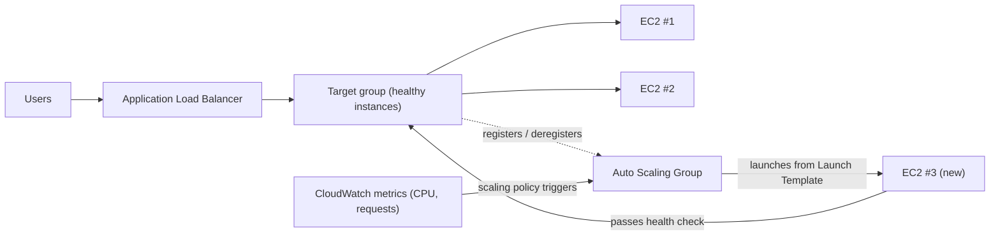

# Kapitel 7: Das Restaurant, das wächst, wenn es voll wird

Es war 19:43 Uhr an einem Freitagabend.

Toms Stuhl war leicht zurückgeschoben, so wie er es wurde, wenn er etwas mit jener Art von Konzentration anstarrte, die bedeutete, dass er nicht antworten würde, wenn man ihn ansprach. Das Büro hatte sich vor einer Stunde geleert. Er war geblieben.

Er hatte einen Tab zum Metriken-Dashboard geöffnet, den er so aktualisierte, wie andere Leute soziale Medien prüfen — reflexartig, ständig, ohne es ganz zu beabsichtigen.

Die Speicherkrise lag hinter ihnen. Die Datenbank hatte ihre eigene Festplatte. Die Fotos lebten in S3. Zwei Wochen lang war das System stabil gewesen — nicht aufregend, einfach stabil. Das hätte sich gut anfühlen sollen.

Dann überschritt die Fehlerrate 12 %.

"Leo", sagte Tom.

Leo schaute bereits hin. Antwortzeiten: stiegen. Anstehende Anfragen: stiegen. Die einzelne EC2-Instanz — sogar nach der sorgfältigen Right-Sizing-Übung vom letzten Monat — war bei 94 % CPU.

"Wir weisen Kunden ab", sagte Tom.

"Wir weisen sie nicht ab", sagte Leo. "Der Server tut es."

"Das ist dasselbe."

Es war so. Und es war seit drei Wochen jeden Freitag passiert. Nimbus hatte die Speicherkrise überstanden — die Datenbank hatte ihre eigene Festplatte, die Fotos lebten in S3 —, aber stabil und skalierbar sind völlig andere Probleme. Das System funktionierte. Es wuchs einfach nicht.

Eine Slack-Nachricht erschien von Maya: *Dashboard sagt Bestellungen 40 % unter letztem Freitag. Was ist los?*

Tom antwortete: *Server am Kapazitätslimit. Arbeite dran.*

Drei Minuten vergingen.

Maya: *Wir haben einen Restaurantbesitzer, der die Support-Hotline anruft und sagt, die App ist kaputt.*

Leo hatte seine Hände auf der Tastatur. Er dimensionierte die Instanz neu — die manuelle Version der Lösung, jene, die das Stoppen des Servers und das Ändern des Instanztyps erforderte. Was Ausfallzeit bedeutete.

"Wie lange wird der Neustart dauern?" fragte Tom.

"Sieben Minuten", sagte Leo.

"Wir werden an einem Freitagabend sieben weitere Minuten Ausfall haben", sagte Tom. Es war keine Frage. Er tippte eine Slack-Nachricht an Maya. Sie antwortete mit einem einzigen Zeichen: *k*

Der Neustart war abgeschlossen. Die Instanz kam wieder hoch. Die CPU fiel auf 60 %. Die Fehlerrate fiel. Tom beobachtete die Metriken fünfzehn Minuten lang, ohne zu sprechen.

Um 21:15 Uhr ging der Traffic zurück. Die Krise war vorbei.

Leo schaute auf seine Hände, die um 20 Uhr leicht gezittert hatten und es jetzt nicht mehr taten.

"Das können wir nicht jeden Freitag machen", sagte er.

"Nein", sagte Tom. "Können wir nicht."

Das Team brauchte, dass ihr System die variable Last automatisch bewältigte. Nicht, um genug Server für den schlimmsten Fall zu kaufen und in ruhigen Zeiten Geld zu verschwenden. Und nicht, um manuell zu hantieren, wenn Traffic-Spitzen auftraten.

Es gibt ein Muster dafür. AWS hat zwei Dienste, die es implementieren.

**Das Konzept: Horizontale Skalierung**

Es gibt zwei Wege, ein System dazu zu bringen, mehr Last zu bewältigen.

**Vertikale Skalierung** bedeutet, den einzelnen Server größer zu machen. Mehr CPU. Mehr RAM. Wir taten das in Kapitel 4, als wir von `t3.micro` auf `t3.large` aktualisierten. Es hilft. Aber es hat Grenzen: Man kann nur so groß werden, die Instanz muss zum Neudimensionieren neu starten, und man hat immer noch einen einzelnen Ausfallpunkt.

**Horizontale Skalierung** bedeutet, mehr Server hinzuzufügen. Statt eines großen Servers betreiben Sie fünf mittlere Server. Wenn der Traffic sinkt, betreiben Sie zwei. Wenn er in die Höhe schnellt, zehn.

Horizontale Skalierung hat Vorteile, die vertikale nicht hat:

- Kein einzelner Ausfallpunkt. Wenn ein Server stirbt, bedienen die anderen weiter.
- Kein Neustart erforderlich, um Kapazität hinzuzufügen.
- Bezahlung nur für das, was Sie nutzen — Server hinzufügen, wenn Sie sie brauchen, entfernen, wenn nicht.
- Lineare Skalierung: doppelt so viele Server, ungefähr doppelter Durchsatz.

Es gibt auch eine Zuverlässigkeitsdimension, die vertikale Skalierung nicht erreichen kann. Wenn Sie fünf Server haben und einer ausfällt, sinkt Ihre Kapazität auf 80 % — genug, um Traffic weiter zu bedienen, während die ausgefallene Instanz ersetzt wird. Wenn Sie einen Server haben und er ausfällt, sinkt die Kapazität auf 0 %. Die Redundanz ist der horizontalen Skalierung auf eine Weise inhärent, die vertikale Skalierung in keiner Größe bieten kann.

Das ist auch für die Wartung wichtig. Wenn ein Sicherheitspatch einen Server-Neustart erfordert, erlaubt horizontale Skalierung, Instanzen eine nach der anderen neu zu starten — rollende Neustarts, die die Dienstkontinuität aufrechterhalten. Ein einzelner großer Server erfordert entweder das Akzeptieren von Ausfallzeit während des Neustarts oder die Implementierung der Komplexität eines Blue/Green-Deployments.

Der Haken: Wenn Sie mehrere Server haben, wie wissen Nutzer, mit welchem sie sprechen sollen?

Und es gibt eine Designeinschränkung, die horizontale Skalierung auferlegt: Ihre Anwendung muss in der Lage sein, gleichzeitig auf mehreren identischen Servern zu laufen, ohne dass die Server sich gegenseitig stören. Das ist die **Stateless**-Anforderung — jede Anfrage muss in sich abgeschlossen sein, nicht von einem auf einem bestimmten Server gespeicherten Zustand abhängig. Wir werden genau sehen, warum das wichtig ist, wenn wir auf das Sticky-Sessions-Problem stoßen.

**Der Application Load Balancer: Eine Tür, viele Räume**

Stellen Sie sich ein großes Restaurant mit einem Empfangstresen an der Tür vor. Gäste kommen an, und der Empfangsmitarbeiter weist sie einem verfügbaren Tisch zu. Der Empfangsmitarbeiter weiß, welche Tische besetzt und welche frei sind. Gäste müssen nicht wissen, wie viele Tische es gibt — sie kommen einfach herein, und der Empfangsmitarbeiter handhabt die Verteilung.

Ein **Application Load Balancer** (ALB) tut dies mit Webanfragen.

Nutzer verbinden sich mit dem Load Balancer. Der Load Balancer verteilt eingehende Anfragen über Ihre Flotte von EC2-Instanzen. Jeder Nutzer sieht eine Adresse (die URL des Load Balancers). Hinter dieser Adresse werden Anfragen über so viele Server verteilt, wie laufen.

Der ALB selbst läuft auf von AWS verwalteter Infrastruktur, verteilt über mehrere AZs in Ihrer Region. Es ist kein einzelner Server — es ist ein verwalteter, verteilter Dienst. Wenn Sie Cross-Zone Load Balancing aktivieren (die Voreinstellung für ALBs), verteilt jeder ALB-Knoten Anfragen gleichmäßig über alle registrierten Targets, unabhängig davon, in welcher AZ sie sich befinden. Das verhindert den häufigen Fehlermodus, bei dem eine AZ doppelt so viele gesunde Instanzen hat wie eine andere, was zu ungleicher Last führt.

Er empfängt jede eingehende HTTP-Anfrage und entscheidet, welche EC2-Instanz (genannt **Target**) sie bearbeiten soll, basierend auf Faktoren wie:

- Round-Robin (jeder Server kommt im Wechsel dran)
- Least Outstanding Requests (der Server mit den wenigsten laufenden Anfragen bekommt die nächste Anfrage)
- Gesundheit — nur gesunde Targets erhalten Traffic

**Health Checks** sind essenziell. Der ALB sendet regelmäßig Testanfragen an jedes Target. Wenn ein Target nicht korrekt antwortet, markiert der ALB es als ungesund und hört auf, ihm Traffic zu senden. Wenn das Target sich erholt, wird der Traffic wieder aufgenommen.

Das ist automatisch. Sie konfigurieren die Health-Check-Parameter; der ALB setzt sie durch.

Sie konfigurieren Health Checks mit drei Schlüsselparametern: dem **Pfad**, der geprüft werden soll (z. B. `/health`), dem **Intervall** (wie oft geprüft wird — alle 5 bis 300 Sekunden; Voreinstellung 30) und dem **Schwellenwert** (wie viele aufeinanderfolgende erfolgreiche oder fehlgeschlagene Prüfungen, bevor sich der Gesundheitsstatus des Targets ändert).

Aggressive Health-Check-Intervalle erfassen Probleme schneller, fügen aber den Targets mehr Traffic hinzu. Ein 30-Sekunden-Intervall mit einem 3-Fehler-Schwellenwert bedeutet, dass ein fehlerhaftes Target innerhalb von 90 Sekunden aus der Rotation entfernt wird. Ein 10-Sekunden-Intervall mit einem 2-Fehler-Schwellenwert bedeutet Entfernung innerhalb von 20 Sekunden — zum Preis von mehr Health-Check-Traffic.

Für Nimbus wählte Priya ein 30-Sekunden-Intervall mit einem Schwellenwert von 3 Fehlern (90 Sekunden, um als ungesund zu erklären) und 2 Erfolgen (60 Sekunden, um nach der Erholung wieder als gesund zu erklären). Das balancierte schnelle Fehlererkennung mit der Vermeidung von Fehlalarmen durch kurze Netzwerkstörungen.

**Health-Check-Konfiguration: Mehr als "Lebt es?"**

Leos erster Health Check war ein einfacher TCP-Ping: "Akzeptiert Port 80 Verbindungen?" Das ist das Minimum. Der Server könnte Verbindungen auf Port 80 akzeptieren, während die Datenbank ausgefallen war, während die Anwendung in einer Fehlerschleife war, während die Festplatte voll war.

Priya hatte eine andere Sicht darauf, was "gesund" bedeuten sollte.

"Haben wir bedacht, was passiert, wenn der Health Check besteht, aber die Anwendung kaputt ist?" fragte sie. "Ein Server, der Verbindungen akzeptieren kann, aber die Datenbank nicht abfragen kann, ist nicht gesund. Er ist nur reaktionsfähig."

Leo baute einen `/health`-Endpunkt in den Anwendungscode. Der Endpunkt tat drei Dinge:
1. Bestätigte, dass der Anwendungsprozess lief
2. Machte eine Testabfrage an die Datenbank (ein einfaches `SELECT 1`)
3. Bestätigte, dass die S3-Verbindung zugänglich war

Wenn alle drei bestanden, gab der Endpunkt HTTP 200 zurück. Wenn eines fehlschlug, gab er HTTP 503 zurück.

Der ALB-Health-Check war so konfiguriert, dass er diesen Endpunkt alle 30 Sekunden aufrief. Wenn er drei aufeinanderfolgende 503-Antworten erhielt, wurde die Instanz als ungesund markiert und aus der Rotation entfernt.

"Das bedeutet, wenn die Datenbank ausfällt", sagte Priya, "wird der Health Check es erfassen und die betroffenen Server innerhalb von 90 Sekunden aus dem Load Balancer entfernen."

"Selbst wenn die Server selbst noch laufen", sagte Tom.

"Selbst wenn sie von außen in Ordnung aussehen."

Der ALB, auf einen echten Anwendungs-Health-Check gerichtet, wurde zu einem viel zuverlässigeren Detektor tatsächlicher Probleme — nicht nur der Lebendigkeit des Servers.

**Auto Scaling: Das Restaurant, das mehr Tische öffnet**

Ein ALB verteilt Traffic über Ihre bestehenden Server. Aber er fügt keine Server hinzu, wenn Sie mehr brauchen.

**Auto Scaling** tut das.

Eine **Auto Scaling Group** (ASG) ist eine Konfiguration, die AWS mitteilt:

- Die Mindestanzahl an Instanzen, die immer laufen sollen
- Die maximale erlaubte Anzahl an Instanzen
- Die Bedingungen, unter denen herausskaliert (Instanzen hinzufügen) oder hineinskaliert (sie entfernen) werden soll

Die Skalierungsbedingungen werden **Policies** genannt. Die vier häufigsten Typen:

**Target Tracking**: "Halte die durchschnittliche CPU-Auslastung bei 70 %." Wenn die durchschnittliche CPU 70 % überschreitet, startet AWS neue Instanzen. Wenn sie darunter fällt, werden Instanzen terminiert. Das ist die einfachste und für die meisten Lasten empfohlene Policy — setzen Sie eine Zielmetrik und lassen Sie AWS herausfinden, wie viele Instanzen benötigt werden. Das Ziel kann die CPU-Auslastung, die Anfragenzahl pro Target oder jede benutzerdefinierte CloudWatch-Metrik sein.

**Step Scaling**: Definieren Sie spezifische Schwellenwerte mit spezifischen Reaktionen. "Wenn die CPU 60 % überschreitet, füge 1 Instanz hinzu. Wenn die CPU 80 % überschreitet, füge 3 Instanzen hinzu. Wenn die CPU unter 30 % fällt, entferne 1 Instanz." Granularere Kontrolle als Target Tracking, erfordert aber mehr Konfiguration und laufendes Tuning.

**Scheduled Scaling**: "Um 18:45 Uhr jeden Freitag, stelle sicher, dass mindestens 4 Instanzen laufen." Das ist proaktive Skalierung für vorhersehbare Ereignisse. Sie funktioniert neben reaktiver Skalierung — die geplante Aktion setzt einen Boden, und Target Tracking fügt nach Bedarf Instanzen über diesem Boden hinzu.

**Predictive Scaling**: die Machine-Learning-Version derselben Idee. Statt dass Sie den Zeitplan schreiben, analysiert Auto Scaling bis zu zwei Wochen historischer Last und prognostiziert die nächsten 48 Stunden, indem es Kapazität *vor* dem prognostizierten Anstieg startet. Für zyklischen Traffic — ein Abendansturm jeden Freitag, eine Markteröffnung jeden Werktag — entdeckt Predictive Scaling das Muster und wärmt automatisch vor und passt sich weiter an, wenn das Muster sich verschiebt. Prüfungsauslöser: "wiederkehrende/zyklische Traffic-Spitzen; Instanzen müssen *vor* der Spitze bereit sein" → Predictive Scaling. (Scheduled Scaling ist die manuelle Antwort; Predictive ist die gelernte. Beide schlagen rein reaktive Skalierung, die der Spitze immer um die Instanz-Boot-Zeit hinterherhinkt.)

Für Nimbus war die Kombination: Target Tracking für reaktive Skalierung (CPU bei 65 % halten), plus eine geplante Skalierungsaktion jeden Freitag um 18:45 Uhr, um 2 zusätzliche Instanzen vor dem Abendansturm vorzuwärmen.

Das ist automatisch. Niemand muss die Metriken beobachten. Niemand muss manuell Server starten. Das System reagiert in Echtzeit auf die Last.

Priya sah das zum ersten Mal live während eines Freitagansturms geschehen. Die Serveranzahl ging über fünfzehn Minuten von 2 auf 5, dann nach dem Ansturm zurück auf 2.

"Das", sagte sie, "ist wirklich beeindruckend."

Tom beobachtete stattdessen den Kostengraphen. Die Rechnung stieg während des Ansturms und fiel danach. "Wir haben nur für das gezahlt, was wir genutzt haben", sagte er, gleichermaßen beeindruckt. "Wie viel kostet das pro Monat, gemittelt über eine normale Woche?"

Leo rief den Rechner auf. Die Freitagsspitzen fügten der monatlichen Rechnung vielleicht 15 % hinzu. Ohne Auto Scaling hätten sie die ganze Woche für die Spitze provisionieren müssen. Der Unterschied: ungefähr 120 $/Monat verschwendet für untätige Spitzenkapazität, gegenüber 0 $ verschwendet mit richtig konfiguriertem Auto Scaling.

Es gibt eine Feinheit beim Hineinskalieren, die Teams oft übersehen: **Scale-in-Schutz**. Sie können bestimmte Instanzen in einer ASG so konfigurieren, dass sie vor dem Hineinskalieren geschützt sind — was bedeutet, dass sie während automatischer Scale-in-Ereignisse nicht terminiert werden. Das ist nützlich für Instanzen, die mitten in der Verarbeitung eines lang laufenden Jobs sind, den Sie nicht unterbrechen möchten. Anwendungscode kann den Instanzschutz auch programmatisch setzen, wenn er einen langen Job startet, und den Schutz entfernen, wenn der Job abgeschlossen ist. Das verhindert, dass die ASG aktiver Arbeit den Teppich unter den Füßen wegzieht.

**Warm Pools: Nicht alles muss kalt starten**

An dem Freitag, an dem Auto Scaling zum ersten Mal einsetzte, stoppte Tom die Zeit, wie lange es von "CPU überschreitet Schwellenwert" bis "neue Instanzen bedienen Traffic" dauerte.

Vier Minuten und zwanzig Sekunden.

"Das sind vier Minuten, in denen wir zu wenig Kapazität haben", sagte er.

"Wir könnten die Mindestanzahl an Instanzen erhöhen", sagte Leo.

"Das bedeutet, die ganze Woche für untätige Instanzen zu zahlen", sagte Tom.

Es gab einen Mittelweg: **Warm Pools**.

Ein Warm Pool ist eine Gruppe vorinitialisierter EC2-Instanzen, die in einem gestoppten Zustand sitzen, bereits gebootet, bereits konfiguriert, bereits durch das UserData-Skript gelaufen. Sie haben alles getan außer mit dem Bedienen von Traffic zu beginnen.

Wenn die Auto Scaling Group entscheidet, herauszuskalieren, startet sie statt eine neue kalte Instanz von Grund auf zu starten (was drei bis fünf Minuten dauert, um zu booten, UserData auszuführen und Health Checks zu bestehen) eine Instanz aus dem Warm Pool. Das Starten einer gestoppten Instanz dauert etwa 30 bis 60 Sekunden.

Für Nimbus' Freitagsmuster — ein bekannter, vorhersehbarer Anstieg, der gegen 19 Uhr beginnt — konfigurierte Priya einen Warm Pool von zwei Instanzen, der während der Geschäftszeiten aufrechterhalten wurde. Um 18:45 Uhr saßen zwei warme Instanzen bereit, gestoppt, aber initialisiert. Als der Traffic um 19 Uhr kletterte und die ASG skalieren musste, starteten die warmen Instanzen in unter einer Minute und traten der Flotte bei.

"Wie viel kostet der Warm Pool?" fragte Tom.

Eine gestoppte EC2-Instanz zahlt nicht für Compute — aber sie zahlt für angehängten EBS-Speicher. Zwei `t3.small`-Instanzen in einem Warm Pool: etwa 4 $/Monat an Speicherkosten. Die Verbesserung der Scale-out-Zeit von vier Minuten auf unter eine Minute war an einem Freitagabend 4 $/Monat wert.

**ALB Path-Based Routing**

Als Nimbus wuchs, fügte Leo eine zweite Komponente hinzu: einen separaten API-Dienst für das Restaurantmanagement. Die Restaurantbesitzer griffen über dieselbe Domain auf diesen Dienst zu, aber an einem anderen URL-Pfad: `/api/restaurant/` statt `/`.

"Moment — aber *warum* würden wir es so machen?" fragte Maya. "Warum der Restaurantmanagement-API nicht eine komplett andere Domain geben?"

"Könnten wir", sagte Leo. "Aber dann bräuchten wir ein zweites Zertifikat, einen zweiten Load Balancer, einen zweiten DNS-Eintrag. Das Path-Based Routing handhabt es mit einem Zertifikat, einem Load Balancer."

Der ALB unterstützte das nativ. Eine **Path-Based-Routing-Regel** sagte dem ALB: Wenn die URL mit `/api/restaurant/` beginnt, route die Anfrage zur Restaurantmanagement-Target-Group. Wenn die URL mit etwas anderem beginnt, route sie zur kundenseitigen Anwendungs-Target-Group.

Zwei separate Flotten von EC2-Instanzen. Ein Load Balancer. Traffic nach URL-Pfad gelenkt.

"Wir können also die Restaurantmanagement-API unabhängig von der kundenseitigen App skalieren?" fragte Maya.

"Genau", sagte Leo. "Wenn Restaurantbesitzer viele Menü-Updates machen, skalieren diese API-Server. Wenn Kunden viel bestellen, skalieren diese Server. Sie beeinflussen sich nicht gegenseitig."

Maya ließ das wirken. "Und wir zahlen nur für einen ALB statt für zwei."

"Korrekt", sagte Tom. Er hatte eine Zahl. "Der ALB kostet etwa 20 Dollar im Monat an Grundgebühren plus Datenverarbeitungsgebühren. Ein ALB, der beide Lasten handhabt, gegenüber zwei separaten: ungefähr 20 Dollar pro Monat gespart. Und wir vermeiden die Verwaltung mehrerer Zertifikate und DNS-Einträge."

"Aber", sagte Priya, "wenn der ALB selbst ausfällt, fallen beide Dienste zusammen aus."

"AWS entwirft den ALB so, dass er über mehrere AZs hochverfügbar ist", sagte Leo. "Das Risiko eines ALB-Ausfalls ist sehr gering im Vergleich zur Komplexität, zwei separate Load Balancer zu unterhalten."

Priya ordnete dies unter "akzeptierter Kompromiss, dokumentiert" ein.

**Wie ALB und ASG zusammenarbeiten**

Die beiden Dienste sind darauf ausgelegt, zusammen verwendet zu werden.

Sie setzen den ALB nach vorn. Der ALB zeigt auf eine **Target Group** — eine Sammlung von Instanzen, die Traffic erhalten sollen. Die Auto Scaling Group verwaltet diese Instanzen: Sie fügt sie der Target Group hinzu, wenn sie herausskaliert, entfernt sie, wenn sie hineinskaliert.

Der Ablauf:

1. Traffic kommt am ALB an
2. ALB verteilt Anfragen an gesunde Targets
3. CPU/Last steigt auf diesen Targets
4. ASG erkennt den Lastanstieg, startet neue Instanzen
5. Neue Instanzen bestehen Health Checks, werden beim ALB registriert
6. ALB beginnt, ihnen Traffic zu senden
7. Last sinkt, ASG terminiert zusätzliche Instanzen
8. ALB hört auf, terminierten Instanzen Traffic zu senden

Das geschieht ohne jegliches menschliches Eingreifen.

**Launch Templates: Der Bauplan für neue Instanzen**

Wenn die ASG eine neue Instanz startet, muss sie wissen, was sie starten soll. Das wird in einem **Launch Template** definiert — ein AMI, ein Instanztyp, die anzuwendenden Security Groups und alle User Data (Startskripte, die laufen, wenn die Instanz bootet).

Ein häufiges Muster: Sie bauen Ihre Anwendung in ein benutzerdefiniertes AMI (siehe Kapitel 4). Wenn die ASG eine neue Instanz braucht, startet sie dieses AMI. Die neue Instanz bootet mit Ihrer bereits installierten Anwendung. Keine manuelle Einrichtung erforderlich.

Für dynamischere Umgebungen können Sie auch **User-Data-Skripte** verwenden, die beim Start die neueste Version Ihres Codes ziehen und installieren. Das ist flexibler, braucht aber länger zum Booten.

Die richtige Wahl hängt davon ab, wie lange Ihre Instanzen zum Booten brauchen und wie oft sich Ihre Anwendung ändert.

**Sticky Sessions: Ein subtiles Problem**

Hier ist etwas, das viele Teams ins Stolpern bringt, wenn sie zum ersten Mal Load Balancing implementieren.

Einige Webanwendungen speichern Sitzungsdaten — Login-Status, Warenkorbinhalt — auf dem Server selbst (im Speicher oder auf der lokalen Festplatte). Das funktioniert gut mit einem Server. Mit mehreren Servern bricht es.

Ein Nutzer loggt sich ein. Die Anfrage geht an Server A. Server A speichert die Sitzung. Die nächste Anfrage geht an Server B. Server B hat keine Sitzung. Der Nutzer erscheint abgemeldet.

Das kann auf zwei Arten adressiert werden:

**Sticky Sessions** (oder Session Affinity): Konfigurieren Sie den ALB so, dass er Anfragen vom selben Nutzer immer an denselben Server sendet. Das ist eine kurzfristige Lösung. Es untergräbt das Load Balancing (manche Server bekommen mehr "klebrige" Nutzer als andere) und schafft Probleme, wenn eine Instanz terminiert wird.

Maya schaute auf die Konfigurationsseite für Sticky Sessions. "Wenn wir Nutzer an bestimmte Server binden, was passiert, wenn diese Server während des Hineinskalierens terminiert werden?"

"Sie verlieren ihre Sitzung", sagte Leo.

"Sticky Sessions verschieben also nur das Problem."

"Korrekt", sagte Priya. "Die echte Lösung ist zustandsloses Anwendungsdesign."

**Zustandsloses Anwendungsdesign**: Speichern Sie Sitzungsdaten extern — in einer Datenbank oder einem Cache wie ElastiCache (Kapitel 10). Jeder Server kann die Sitzung jedes Nutzers aus dem externen Speicher rekonstruieren. Server werden austauschbar. Das ist der richtige Ansatz für horizontal skalierbare Anwendungen.

Priya nannte das "die wichtigste architektonische Entscheidung, die Sie treffen, wenn Sie zu mehreren Servern übergehen". Sie hat recht. Wir begegnen ihr in Kapitel 10 wieder.

**Wenn Sticky Sessions, dann weniger Komplexität, aber mehr Risiko**

Wenn Sie Sticky Sessions verwenden, um das Sitzungszustandsproblem zu lösen, dann reduzieren Sie kurzfristig den Bedarf, externen Sitzungsspeicher einzurichten — aber wenn ein klebriger Server während des Hineinskalierens terminiert wird, verlieren alle seine gebundenen Nutzer auf einmal ihre Sitzungen. Der Ausfall ist nicht graduell; er ist plötzlich und betrifft ein Cluster von Nutzern gleichzeitig. Wenn Sie den Sitzungszustand externalisieren, fügen Sie eine Abhängigkeit hinzu (ElastiCache oder eine Datenbank), beseitigen aber diesen plötzlichen Fehlermodus. Für jede Anwendung, die regelmäßig skaliert, zahlt sich die Investition in zustandsloses Design beim ersten Mal aus, wenn Auto Scaling eine Instanz mit aktiven Sitzungen darauf terminiert.

**Toms Kostenberechnung**

In der folgenden Woche baute Tom ein Kostenmodell für das ALB- und ASG-Setup.

Der ALB: ungefähr 20 $/Monat Grundgebühr plus Datenverarbeitungsgebühren. Bei Nimbus' Traffic-Volumen: etwa 22 $/Monat.

Die Auto Scaling Group selbst: keine zusätzlichen Kosten. Sie zahlen für die Instanzen, die sie betreibt, aber diese Instanzen würden ohnehin existieren. Die ASG ist kostenlos; Sie zahlen für Compute.

Der Warm Pool: etwa 4 $/Monat an EBS-Speicher für zwei gestoppte Instanzen.

Gesamte zusätzliche Infrastrukturkosten: ungefähr 26 $/Monat oder 312 $/Jahr.

Tom schaute dann auf das Vorfallprotokoll von den drei Freitagen, bevor ALB und ASG eingerichtet waren. Jeder Vorfall hatte Nimbus ungefähr 40 % des Freitagsumsatzes während des Ausfallfensters gekostet. Durchschnittlicher Freitagsumsatz: rund 2.400 Dollar. 40 % von 2.400 Dollar sind 960 Dollar pro Vorfall. Drei Vorfälle: ungefähr 2.880 Dollar entgangener Umsatz in drei Wochen.

"Der ALB und die ASG kosten 312 Dollar im Jahr", sagte Tom. "Drei schlechte Freitage haben uns fast 3.000 Dollar gekostet. Und das ist nur der direkte Umsatzverlust — nicht die Kundenabwanderung durch Leute, die Nimbus nach einer schlechten Erfahrung nicht mehr nutzten."

Maya las die Zahlen. "Betreibt die Infrastruktur."

"Läuft bereits", sagte Leo.

## Wenn ALB nicht genug ist: NLB und GWLB

Leo überprüfte die IoT-Integration, die Nimbus stillschweigend für Restaurantpartner hinzugefügt hatte — kleine Temperatursensoren in begehbaren Kühlräumen, die alle dreißig Sekunden Messwerte an Nimbus sendeten, damit Küchenleiter Alarme erhalten konnten, falls ein Kühlschrank über eine sichere Temperatur driftete.

"Moment", sagte Leo. "Diese Sensoren senden UDP-Pakete."

"Ist das ein Problem?" fragte Maya.

"ALB unterstützt kein UDP", sagte Leo. "ALB versteht HTTP. Das ist alles."

Priya schaute bereits in die Dokumentation. "Dafür ist der Network Load Balancer da."

**Network Load Balancer (NLB)** operiert auf Layer 4 — der Transportschicht. Er routet TCP- und UDP-Pakete. Er inspiziert nicht den Inhalt dieser Pakete, versteht keine HTTP-Header, macht kein Path-Based Routing. Was er tut, ist Pakete von Clients zu Targets mit außerordentlicher Geschwindigkeit zu bewegen.

- **Millionen von Anfragen pro Sekunde mit einstelliger Millisekunden-Latenz.** Der ALB verarbeitet HTTP auf Layer 7, was bedeutet, dass er Header parst, Routing-Regeln auswertet und TLS-Verbindungen terminiert. Der NLB tut nichts davon — er ist eher ein Hochgeschwindigkeits-Verkehrslotse als ein Web-Proxy.
- **Bewahrt die Quell-IP-Adresse des Clients.** Wenn ein ALB eine Verbindung empfängt, terminiert er sie und öffnet eine neue zum Target — Ihre EC2-Instanz sieht die IP des ALB, nicht die des Nutzers. Der NLB tut das nicht; die Quell-IP des Pakets kommt unverändert am Target an. Wenn Ihre Anwendung wissen muss, woher Anfragen kommen — für Geolokalisierung, Rate Limiting oder Betrugserkennung — und Sie es genau brauchen, ist NLB die richtige Wahl. (Der ALB fügt einen `X-Forwarded-For`-Header hinzu, der die ursprüngliche IP trägt, aber das erfordert, dass die Anwendung den Header liest; der NLB setzt die echte IP direkt ins Paket.)
- **Statische IP-Adressen und Elastic IPs.** Die IP-Adressen des ALB ändern sich im Laufe der Zeit — AWS verwaltet sie und sie sind nicht fest. Der NLB unterstützt statische IPs pro Availability Zone, und Sie können diesen Elastic IPs zuweisen. Wenn nachgelagerte Systeme eine bestimmte IP-Adresse auf eine Whitelist setzen müssen, um Traffic von Ihrem Load Balancer zu erlauben — eine häufige Anforderung in Finanzdienstleistungen oder IoT-Geräteverwaltung —, ist NLB die einzige Option. ALB kann das nicht.
- **TLS-Pass-Through.** Der NLB kann verschlüsselten TLS-Traffic direkt an die Targets weitergeben, ohne ihn zu entschlüsseln. Das Target terminiert TLS. Das ist nützlich, wenn Compliance-Anforderungen besagen, dass die Entschlüsselung auf einem bestimmten Gerät erfolgen muss, oder wenn Sie keine TLS-Zertifikate auf dem Load Balancer verwalten möchten.

"Wenn NLB so schnell ist", fragte Maya, "warum verwenden wir ihn nicht einfach für alles?"

"Weil er dumm ist", sagte Leo. "Im besten Sinne. Der NLB weiß nicht, was HTTP ist. Er kann kein Path-Based Routing. Er kann HTTP nicht auf HTTPS umleiten. Er kann keine Security-Header hinzufügen. Er kann nicht mit WAF integrieren. Für eine Webanwendung — alles, was HTTP spricht — ist das Layer-7-Bewusstsein des ALB das, was all diese Features ermöglicht. Für die Sensordaten, die UDP sind, haben wir keine Wahl."

"Und für unseren Web-Traffic?"

"ALB, wie vorher."

"Wie viel kostet das pro Monat?" fragte Tom. "Ist NLB günstiger?"

Das Preismodell ist dasselbe wie beim ALB: eine stündliche Grundgebühr plus eine Gebühr pro Load Balancer Capacity Unit (LCU), basierend auf dem verarbeiteten Traffic. Bei äquivalenten Traffic-Volumen sind die Kosten vergleichbar. Für den Nimbus-IoT-Anwendungsfall — Sensordaten mit geringem Volumen — würden die NLB-Kosten unter 20 $/Monat liegen.

**Gateway Load Balancer (GWLB)** ist ein ganz anderes Tier. Er operiert auf Layer 3 — der IP-Paketebene — und er existiert für einen spezifischen Zweck: das Einfügen virtueller Netzwerk-Appliances von Drittanbietern in Ihren Traffic-Fluss.

Stellen Sie sich vor, Nimbus wuchs zu einer Größe, in der ihr Sicherheitsteam verlangte, dass aller Traffic, der ihre VPCs betritt und verlässt, durch eine kommerzielle Firewall-Appliance läuft — eine virtuelle Maschine, die Software von einem Anbieter wie Palo Alto oder Fortinet betreibt. Ohne GWLB müssten Sie Traffic manuell durch diese Appliances routen und herausfinden, wie man sie skaliert und hochverfügbar hält. Mit GWLB konfigurieren Sie die Appliance als Target, und aller Traffic wird transparent durch sie geroutet, unter Verwendung des GENEVE-Protokolls. Die Anwendung weiß nicht, dass der Traffic inspiziert wird. Die Firewall muss die Netzwerktopologie nicht kennen. GWLB handhabt das Routing, die Skalierung und das Failover.

Für die meisten Webanwendungen in der Früh- und Mittelphase — Nimbus eingeschlossen — ist GWLB kein Dienst, den Sie konfigurieren werden. Aber für die Prüfung und für den Tag, an dem eine Sicherheitsanforderung Inspektion auf Netzwerkebene verlangt, werden Sie wissen, wofür er da ist.

Leo fügte an jenem Nachmittag einen NLB für den Sensor-Endpunkt hinzu. Die Temperaturdaten begannen zu fließen.

"Das erste Restaurant bekommt einen Alarm, dass sein begehbarer Kühlraum bei 47 Grad ist", sagte er. "Das ist über dem sicheren Schwellenwert."

"Ist er tatsächlich bei 47 Grad?" fragte Maya.

"Der Restaurantbesitzer hat es bestätigt. Sie riefen am selben Nachmittag einen Reparaturtechniker."

Priya schrieb das ins Nimbus-Kundenwirkungsprotokoll. Kein Sicherheitsereignis. Nur das IoT-Feature, das funktioniert.

**Die drei Load Balancer, nebeneinander**

AWS bietet drei Typen von Load Balancern. Der ALB handhabt HTTP und HTTPS auf Layer 7 — er versteht das Protokoll, sodass er basierend auf URL-Pfad (`/api` zu einer Gruppe, `/static` zu einer anderen), Host-Headern und Query-Parametern routen kann. Das ist, was die meisten Webanwendungen verwenden, und es ist, was Nimbus für seinen Web-Traffic verwendet.

Der ALB terminiert auch TLS-Verbindungen — SSL/HTTPS-Zertifikate werden auf dem Load Balancer installiert, nicht auf jeder einzelnen EC2-Instanz. Der ALB entschlüsselt die Anfrage, inspiziert die HTTP-Header, routet basierend auf Regeln und (optional) verschlüsselt erneut, bevor er an das Target weiterleitet. Das vereinfacht die Zertifikatsverwaltung erheblich: Sie verwalten ein Zertifikat auf dem ALB statt eines Zertifikats auf jeder Instanz.

Der NLB, wie das Team bei den Temperatursensoren sah, handhabt TCP, UDP und TLS auf Layer 4 — rohe Geschwindigkeit, Quell-IP-Bewahrung, statische IPs. Der GWLB sitzt auf Layer 3, um Traffic durch Drittanbieter-Appliances wie Firewalls und Intrusion-Detection-Systeme zu fädeln — auf Junior-Ebene selten benötigt.

Für Nimbus (und für die meisten Webanwendungen) ist ALB die richtige Wahl.

Sie fragen sich vielleicht: Kann man sowohl ALB als auch NLB für dieselbe Anwendung verwenden? Ja. Ein häufiges Muster ist NLB vor ALB — der NLB handhabt die rohe TCP-Terminierung am Rand, der ALB handhabt das HTTP-Routing dahinter. Das fügt Komplexität und Kosten hinzu und wird für die meisten Webanwendungen nicht benötigt.

**ALB vs. NLB für die Prüfung**: Das Schlüsselunterscheidungsmerkmal ist Layer 7 vs. Layer 4. Wenn das Prüfungsszenario URL-basiertes Routing, hostbasiertes Routing, HTTP-Header-Inspektion oder WebSockets erwähnt — das ist ALB. Wenn es TCP-Pass-Through, das Bewahren der Quell-IP, Millionen von Anfragen pro Sekunde oder extrem niedrige Latenz für Nicht-HTTP-Protokolle erwähnt — das ist NLB. Wenn ein Szenario einfach sagt "Load Balancer für eine Webanwendung", ist die Antwort fast immer ALB.

## Stärken und Einschränkungen

**Warum ALB + Auto Scaling mächtig ist**:

- Skalierung ohne Ausfallzeit (Instanzen werden hinzugefügt/entfernt, ohne bestehende Verbindungen zu stören)
- Automatisches Failover (ungesunde Instanzen werden automatisch aus dem Traffic entfernt)
- Kosteneffizienz (Bezahlung nur für laufende Instanzen)
- Kein einzelner Ausfallpunkt — mehrere Instanzen über mehrere AZs

**Wo es kompliziert wird**:

- Zustandsbehaftete Anwendungen brauchen besondere Behandlung (Sticky Sessions oder externer Zustand)
- Das Herausskalieren braucht Zeit — wenn der Traffic sofort in die Höhe schnellt, gibt es eine Verzögerung, bevor neue
  Instanzen bereit sind. Mildern Sie mit Warm Pools für vorhersehbare Spitzen oder einer höheren Mindestanzahl.
- Mehr bewegliche Teile bedeuten mehr zu überwachen und zu debuggen
- Einige Anwendungen können nicht leicht horizontal skaliert werden (Datenbanken, bestimmte Legacy-
  Systeme). Horizontale Skalierung funktioniert am besten für zustandslose Schichten.

## Zusammenfassung

Zwei Dienste, ein Muster — und das Muster ist es, was zählt. Der ALB handhabt die Verteilung; die ASG handhabt die Flottengröße. Zusammen verwandeln sie ein fragiles Single-Instance-Setup in ein System, das den Freitagabend-Traffic absorbieren kann, ohne dass ein Mensch wach sein muss. Die 312-$/Jahr-Infrastrukturkosten gegenüber drei Freitagen entgangenen Umsatzes (~2.880 $) sind die Art von Mathematik, die Tom in eine Tabelle setzt und nie vergisst.

- **Horizontale Skalierung** (mehr Server hinzufügen) wird der vertikalen Skalierung vorgezogen, weil sie einzelne Ausfallpunkte beseitigt und elastische Kosten erlaubt. Ein **Application Load Balancer (ALB)** verteilt eingehenden HTTP/HTTPS-Traffic und routet nur zu gesunden Instanzen.
- **Health Checks sollten tatsächliche Anwendungsfunktionalität testen** — ein `/health`-Endpunkt, der die Datenbankkonnektivität überprüft, erfasst echte Ausfälle, bevor Kunden es tun.
- Eine **Auto Scaling Group (ASG)** passt die Anzahl der EC2-Instanzen automatisch basierend auf Skalierungs-Policies an. Target Tracking ist der häufigste Typ; Scheduled Scaling handhabt vorhersehbare Spitzen wie den Freitagabend-Ansturm.
- Zustandsbehaftete Anwendungen müssen den Sitzungszustand externalisieren, statt sich langfristig auf Sticky Sessions zu verlassen. Sticky Sessions sind eine kurzfristige Lösung; das Externalisieren des Zustands ist die korrekte Architektur.
- Für HTTP/HTTPS-Traffic verwenden Sie ALB. Für rohe TCP/UDP-Leistung verwenden Sie NLB. ALB Path-Based Routing lässt einen einzigen Load Balancer mehrere Anwendungskomponenten nach URL-Pfad bedienen.

## Prüfungstipps

*SAA-C03-Domäne 2 — Aufgabe 2.1 (skalierbare Architekturen) / Domäne 3 — Aufgabe 3.2*

- **ASG-Health-Checks können von EC2 oder vom ALB kommen.** EC2-Health-Checks erkennen nur,
  ob die Instanz läuft. ALB-Health-Checks erkennen, ob die Anwendung korrekt
  antwortet. ALB-Health-Checks sind gründlicher und sollten für Webanwendungen
  bevorzugt werden.
- **Target-Tracking-Skalierung ist die häufigste Prüfungsantwort** für Skalierungs-Policies.
  Simple Scaling (N Instanzen hinzufügen, wenn der Alarm ausgelöst wird) ist älter und weniger adaptiv.
- **Scale-out ist schnell; Scale-in ist langsam.** AWS terminiert Instanzen während des
  Hineinskalierens graduell, um aktive Verbindungen nicht zu stören — ein Verhalten, das durch die **Deregistration-Delay**-Einstellung des ALB kontrolliert wird.
- **Die Mindestanzahl an Instanzen ist Ihr Resilienzboden.** Wenn Sie minimum = 1 setzen
  und diese Instanz ausfällt, ist Ihre Anwendung down, bevor die ASG reagieren kann. Setzen Sie
  minimum ≥ 2 und verteilen Sie über AZs für echte Resilienz.
- **Der ALB kann Traffic automatisch über AZs verteilen.** Mit aktiviertem Cross-Zone Load
  Balancing verteilt jeder ALB-Knoten Anfragen gleichmäßig über alle registrierten
  Targets, unabhängig von der AZ. Das ist wichtig für ausgeglichene Last, wenn die AZ-Instanz-
  anzahlen sich unterscheiden.
- **ALB Path-Based Routing** erscheint in Prüfungsszenarien, die mehrere Anwendungs-
  komponenten beschreiben, die sich einen einzigen Load Balancer teilen. Der korrekte Begriff ist "Listener Rules", die
  basierend auf URL-Pfad-Bedingungen routen.
- **Load-Balancer-Auswahl:** ALB = HTTP/HTTPS, Layer 7, Pfad-/Header-Routing, WebSockets, WAF-Integration. NLB = TCP/UDP, Layer 4, extreme Leistung, statische IPs, Quell-IP-Bewahrung. GWLB = Layer 3, Einfügen virtueller Firewalls/Appliances in den Traffic-Pfad. Prüfungsauslöser: "UDP-Protokoll" oder "statische IP auf Load Balancer" → NLB. "Firewall-Appliance in den Traffic-Fluss einfügen" → GWLB.

## Übungen

**Übung 1 — Wiederholung**

Erklären Sie mit eigenen Worten: Was ist der Unterschied zwischen einem Application Load Balancer und
einer Auto Scaling Group? Welches Problem löst jeder, und warum verwendet man sie typischerweise
zusammen?

*(Hinweis: Einer verteilt Traffic, der bereits existiert; der andere passt an, wie viel
Kapazität Sie haben.)*

**Übung 2 — SAA-C03-Szenario**

*Szenario*: Die E-Commerce-Website eines Einzelhandelsunternehmens erlebt stark variablen Traffic:
geringer Traffic an Werktagen, massive Spitzen an Wochenenden und während Flash-Sale-Events.
Es möchte, dass seine Anwendung Spitzenlasten bewältigt, ohne ungenutzte Kapazität
während ruhiger Perioden zu unterhalten. Die Anwendung speichert Sitzungsdaten derzeit im Serverspeicher.

Welche Architekturänderung würde seine Skalierbarkeitsanforderungen AM BESTEN adressieren?

A) Auf eine einzige sehr große EC2-Instanz upgraden, die Spitzentraffic bewältigen kann
B) Mehrere EC2-Instanzen hinter einem ALB mit einer Auto Scaling Group deployen und
   den Sitzungsspeicher zu ElastiCache externalisieren
C) Mehrere EC2-Instanzen hinter einem ALB mit aktivierten Sticky Sessions deployen
D) Manuell EC2-Instanzen vor jeder erwarteten Traffic-Spitze hinzufügen und sie danach
   terminieren

**Hinweis 1**: "Ohne ungenutzte Kapazität zu unterhalten" bedeutet, dass Sie automatische Skalierung brauchen,
keine feste große Instanz oder manuelle Verwaltung.

**Hinweis 2**: Der Sitzungsspeicher im Serverspeicher ist ein Problem für Multi-Instanz-
Deployments. Welche Optionen adressieren das?

**Hinweis 3**: Option C verwendet Sticky Sessions — das ist ein Behelf, keine Lösung.
Welche Option adressiert sowohl das Skalierungs- als auch das Sitzungsspeicherproblem ordentlich?

**Antwort**: B

**Erklärung**: Ein ALB mit einer Auto Scaling Group bietet automatische, elastische Skalierung
— Instanzen werden während Spitzen hinzugefügt und während ruhiger Perioden entfernt. Den Sitzungs-
speicher zu ElastiCache (einem externen Cache) zu verschieben macht die Anwendung zustandslos: Jede
Instanz kann jede Nutzeranfrage bearbeiten, und der ALB kann Traffic frei verteilen.
Das ist die architektonisch korrekte Lösung.

**Warum nicht A?** Eine einzige große Instanz, egal wie groß, ist immer noch ein einzelner Ausfall-
punkt. Sie verschwendet auch Geld während ruhiger Perioden, wenn der größte Teil ihrer Kapazität untätig herumsteht.

**Warum nicht C?** Sticky Sessions routen einen Nutzer zur selben Instanz, was das
Sitzungsproblem teilweise mildert, aber das Load Balancing untergräbt. Wenn diese Instanz
terminiert wird (während des Hineinskalierens oder bei Ausfall), verliert der Nutzer ohnehin seine Sitzung.

**Warum nicht D?** Manuelle Skalierung erfordert, dass jemand Traffic-Spitzen korrekt vorhersagt
und im Voraus handelt. Sie ist langsam, fehleranfällig und arbeitsintensiv. Auto Scaling handhabt
das automatisch.

*SAA-C03-Domäne 2 — Aufgabe 2.1 / Domäne 3 — Aufgabe 3.2*

**Übung 3 — Architekturherausforderung** *(Optional)*

Nimbus hat eine große Aktion bevorstehen: 50 % Rabatt auf alle Bestellungen für 4 Stunden
nächsten Samstag. Letztes Jahr verursachte eine ähnliche Aktion 10x normalen Traffic. Das Team
erwartet, dass die Spitze plötzlich kommt und genau 4 Stunden dauert.

Auto Scaling wird schließlich reagieren, aber es gibt eine Verzögerung. Wie würden Sie für diese
bekannte Spitze entwerfen? Was ist der Unterschied zwischen reaktiver und proaktiver Skalierung, und wann
ergibt jede Sinn?

*(Es gibt keine einzige richtige Antwort. Denken Sie an geplante Skalierungsaktionen,
Vorwärmen und die Kostenimplikationen jedes Ansatzes.)*

## Post-Credits-Szene

Am ersten Freitag nach dem Deployment von Auto Scaling und dem ALB beobachtete das Team die
Metriken gemeinsam.

19:15 Uhr: zwei Instanzen laufen. Normale Last.
19:45 Uhr: Last steigt. Auto Scaling startet zwei weitere Instanzen.
20:00 Uhr: vier Instanzen bewältigen die Spitze. Antwortzeiten stabil.
21:30 Uhr: Last sinkt. Auto Scaling terminiert zwei Instanzen.
21:45 Uhr: zurück zu zwei Instanzen.

Die Website ging nie down. Nicht ein einziges Mal.

Leo aktualisierte die Metrikseite dreimal, als erwartete er, einen Fehler zu finden, den er übersehen hatte.

"Ist es seltsam, dass ich mich leicht enttäuscht fühle, dass nichts kaputtgegangen ist?" sagte er.

"Ja", sagte Priya.

Tom schaute auf die Rechnung. Die Kosten waren dem Traffic fast perfekt gefolgt.
"Wir haben für genau das gezahlt, was wir genutzt haben", sagte er. "Nicht mehr. Nicht weniger."

Er klang wirklich überrascht.

Am nächsten Morgen fand Maya ein neues Problem in den Fehlerprotokollen. Kein Ausfall — schlimmer.

"Unsere Datenbank", sagte sie, "gibt Abfragezeiten von durchschnittlich acht Sekunden zurück."

Acht Sekunden. Für eine Restaurant-Bestell-App.

"Jedes Mal, wenn jemand das Menü lädt, fragen wir jedes Element in der Datenbank ab, um
die Seite aufzubauen", sagte Leo. "Und wir haben jetzt siebenundvierzig Restaurants."

"Wie viele Menüpunkte insgesamt?" fragte Tom.

Leo führte die Abfrage aus.

"Etwa zweiundzwanzigtausend."

Stille.

Im nächsten Kapitel: die Datenbank, die keinen DBA erfordert — nur eine Kreditkarte.
