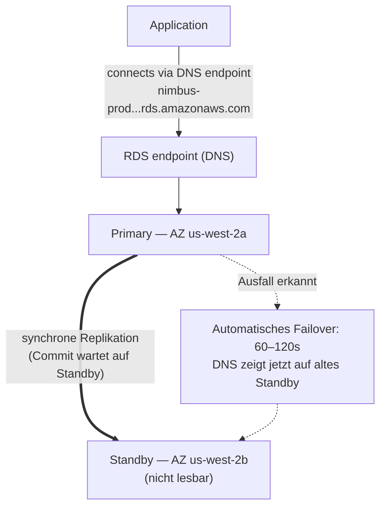

# Kapitel 8: Der Datenbankadministrator, der nie krankheitsbedingt fehlt

Es war 3 Uhr morgens, als die Warnmeldung eintraf.

Priya war die Einzige, die wach war. Ihr Telefon leuchtete auf dem Nachttisch auf, und sie las sie im Dunkeln, die Bildschirmhelligkeit zu hoch. Sie setzte sich auf. Sie fand ihren Laptop aus dem Gedächtnis und öffnete ihn, ohne ein Licht anzuschalten.

Die Tastatur klickte leise im dunklen Raum.

Der Datenbankserver benötigte einen Sicherheitspatch — die Art, die einen Neustart erforderte. Die Schwachstelle war real, der Patch war verfügbar, und das Fenster, um ihn ohne Störung der Kunden anzuwenden, war gerade jetzt, mitten in der Nacht, wenn der Traffic gering war.

Sie verband sich mit dem Server. Sie zog den Patch. Sie wendete ihn an.

Dann las sie die Release Notes.

Das Paket-Update berührte die Konfigurationsdatei, die PostgreSQL verwendet, um Verbindungsparameter zu definieren. Die Release Notes enthielten eine Warnung: Je nachdem, wie das Upgrade durchgeführt wurde, könnte eine angepasste Konfigurationsdatei durch die Standardversion des Pakets ersetzt werden.

Ihre Konfigurationsdatei war angepasst worden. Leo hatte sie vor zwei Monaten bearbeitet, um die Einstellung max_connections zu tunen.

Der Patch lief. Der Server startete neu. Die Datenbank kam wieder online.

Priya testete eine Abfrage. Sie funktionierte.

Sie prüfte die Logs. Alles sah normal aus.

Sie ging um 4:15 Uhr morgens wieder ins Bett.

Um 9:05 Uhr öffnete Leo die Anwendung und bekam einen Fehler. Er prüfte die Datenbank. Max connections war auf den Standardwert gesetzt: 100. Ihre Anwendung war so konfiguriert, dass sie Connection Pools von bis zu 500 verwendete.

Jeder neue Verbindungsversuch schlug fehl. Die Anwendung hatte effektiv den Datenbankzugang verloren.

"Was ist passiert?" fragte Maya.

"Der Patch", sagte Priya. Sie schaute bereits auf die Konfigurationsdatei. "Das Paket-Update hat unsere angepasste Konfigurationsdatei mit der Standardversion überschrieben. Leos max_connections-Tuning ist einfach weg — der Server startete mit den Werkseinstellungen neu, und niemand bekam einen Fehler. Er fiel stillschweigend auf die Voreinstellung zurück."

"Wie lange dauert es, das zu beheben?" fragte Leo.

"Zwanzig Minuten", sagte Priya. "Aber wir brauchen ein Wartungsfenster. Das erfordert eine Konfigurationsänderung und einen Neustart."

"Wir haben Restaurants, die in zwei Stunden zum Mittagessen öffnen", sagte Tom.

Priya behob es in achtzehn Minuten. Das Wartungsfenster waren zwölf Minuten tatsächlicher Ausfallzeit. Restaurants waren betroffen, aber die Spitze hatte noch nicht begonnen.

Am Morgen erzählte sie dem Team, was passiert war. Es herrschte Schweigen.

"Das wird wieder passieren", sagte Tom.

"Es wird jedes Mal passieren, wenn es einen Patch gibt", sagte Priya. "Und es gibt immer Patches. Da muss es einen besseren Weg geben."

Die acht Sekunden langen Abfragezeiten waren immer noch ungelöst. Und in derselben Woche das: ein Wartungsfenster um 3 Uhr morgens, das zu einem Vorfall am Morgen wurde. Beide Probleme hatten dieselbe Grundursache — Nimbus betrieb eine Datenbank, die zu verwalten es nicht ausgestattet war.

Es gab eine Lösung. Sie erforderte nur, die Idee aufzugeben, dass sie die Datenbank selbst verwalten mussten.

**Das traditionelle Datenbankproblem**

Wenn Sie eine Datenbank selbst auf einer EC2-Instanz betreiben, sind Sie für alles verantwortlich.

Die Datenbanksoftware installieren. Sie sicher konfigurieren. Sie patchen, wenn Sicherheitslücken entdeckt werden. Backups machen. Testen, dass die Backups tatsächlich funktionieren (ein Schritt, den die meisten Teams überspringen, bis es zu spät ist). Den Festplattenplatz überwachen. Replikation für Redundanz einrichten. Failover für den Fall konfigurieren, dass der primäre Server ausfällt. Die Abfrageleistung tunen. Verbindungen unter Last verwalten.

Nichts davon ist die Anwendung. Nichts davon fügt Features hinzu. Alles davon erfordert Fachwissen.

Die Anforderung an Fachwissen ist das Kernproblem. Ein qualifizierter Datenbankadministrator versteht nicht nur, wie man eine Datenbank betreibt, sondern wie man:

- Slow-Query-Logs überwacht und Leistungsengpässe identifiziert
- Speicher für das Working Set dimensioniert, um Festplatten-I/O zu vermeiden
- WAL-Archivierung für Point-in-Time-Recovery konfiguriert
- Synchrone Streaming-Replikation mit automatischem Failover einrichtet
- Connection Pooling tunt, um Verbindungserschöpfung unter Last zu verhindern
- Major-Version-Upgrades ohne Datenverlust oder ausgedehnte Ausfallzeit anwendet

Das ist ein eigenständiges, spezialisiertes Fähigkeitsset. Senior-DBAs verlangen hohe Gehälter, gerade weil all das gut zu machen schwierig ist. Die meisten Startups können dafür niemanden einstellen. Die meisten Entwicklungsteams haben es nicht.

Die meisten Entwicklungsteams sind keine Datenbankadministratoren. Das erzeugt ein vorhersehbares Muster: Die Datenbank wird installiert, minimal konfiguriert und dann meistens vergessen, bis etwas katastrophal schiefgeht. Die Nimbus-PostgreSQL-Instanz lief mit der Standardkonfiguration — max_connections bei 100, kein Connection Pooling, manuelle Backups, die Leo zweimal durchgeführt und dann vergessen hatte, und überhaupt keine Replikation.

Der 3-Uhr-Patch-Vorfall war das Symptom eines Systems, das von Leuten betrieben wurde, die exzellent im Bauen von Anwendungen waren und keinen Hintergrund im Datenbankbetrieb hatten. Das ist keine Kritik — es ist eine genaue Beschreibung der meisten Startups. Die Lösung ist nicht, einen DBA einzustellen. Die Lösung ist, einen Dienst zu verwenden, der DBA-Operationen automatisch bereitstellt.

"Ist es das, was wir getan haben?" fragte Maya.

Leos Antwort war Schweigen, was dasselbe war wie ja.

**Die verwaltete Datenbank**

Stellen Sie sich vor, Sie stellen einen Datenbankadministrator ein, der nie krankheitsbedingt fehlt, automatisch jeden Sicherheitspatch handhabt, jede Nacht ein Backup macht, ohne gefragt zu werden, und sich selbst repariert, wenn etwas kaputtgeht. Sie tun all das, ohne Sie zu stören — und sie berühren unter keinen Umständen Ihre Anwendungslogik.

AWS nennt diesen Dienst **RDS** — Relational Database Service.

Mit RDS verwaltet AWS:

- Das Installieren und Patchen der Datenbank-Engine
- Automatisierte Backups (in S3 gespeichert, bis zu 35 Tage aufbewahrt)
- Automatisches Failover (wenn der primäre Server ausfällt, übernimmt ein Standby automatisch)
- Überwachung und Metriken
- Verschlüsselung im Ruhezustand und während der Übertragung
- Speicher-Auto-Scaling (wenn Sie es aktivieren, wächst die Festplatte, wenn sie voll wird)

Sie verwalten:

- Das Datenbankschema (die Struktur Ihrer Tabellen)
- Ihre Abfragen und Anwendungslogik
- Wer Zugang zur Datenbank hat
- Welcher Instanztyp die Datenbank betreibt
- Parameter-Tuning (obwohl RDS sinnvolle Voreinstellungen bietet)

**Unterstützte Engines**

RDS unterstützt mehrere beliebte Datenbank-Engines:

- **MySQL** — die am weitesten verbreitete quelloffene relationale Datenbank
- **PostgreSQL** — mächtig, erweiterbar, zunehmend beliebt für komplexe Lasten
- **MariaDB** — quelloffener MySQL-Fork, vollständig kompatibel
- **Oracle** — Enterprise-Klasse, verwendet in großen Organisationen mit Legacy-Anforderungen
- **Microsoft SQL Server** — für Windows-lastige Umgebungen
- **Amazon Aurora** — AWS' eigene MySQL/PostgreSQL-kompatible Engine, für die Cloud gebaut
  (wir behandeln Aurora ausführlich in Kapitel 24)

Für Nimbus fiel die Wahl auf PostgreSQL. Es war das, was Leo kannte, und es handhabte relationale Daten gut. Die Engine-Wahl spielt für die meisten Anwendungen weniger eine Rolle, als man denken würde — die betrieblichen Vorteile von RDS gelten unabhängig davon.

Eine Nuance: Wenn Sie eine Engine auf RDS betreiben, wartet AWS die Minor-Version-Patches automatisch (während Ihres konfigurierten Wartungsfensters). Major-Version-Upgrades — etwa von PostgreSQL 14 auf 15 — sind eine manuelle Operation, die Sie planen und ausführen. AWS testet Major-Version-Upgrades sorgfältig, aber Sie sollten sie zuerst in einer Staging-Umgebung testen. Major-Versionsänderungen können Kompatibilitätsprobleme mit bestimmter SQL-Syntax, Erweiterungen oder Treiberversionen einführen.

Leo entdeckte das, als RDS einen Minor-Patch anwendete und das Anwendungsprotokoll kurz eine Veraltungswarnung über eine Funktion zeigte, die in einem Sub-Release entfernt worden war. Minor-Patches sollten im Wesentlichen transparent sein — aber das Überwachen Ihrer Anwendungsprotokolle nach jedem Wartungsfenster ist eine gute Praxis.

"Haben wir bedacht, was passiert, wenn ein Minor-Patch etwas kaputtmacht?" fragte Priya.

"Wir rollen auf den vorherigen Snapshot zurück", sagte Leo.

"Wie lange dauert das?"

Leo schaute die RDS-Wiederherstellungszeit für ihre Datenbankgröße nach. Für eine 50-GB-Datenbank auf einer `db.m6i.large`: ungefähr 15 bis 30 Minuten, um aus einem Snapshot wiederherzustellen.

"Wir haben also ein Wiederherstellungsfenster von 15 bis 30 Minuten, falls ein Patch die Produktion kaputtmacht", sagte Priya. "Und wir wenden den Patch im frühen Morgen-Wartungsfenster an, sodass zumindest die Auswirkung minimal ist."

"Und wir testen Patches zuerst in Staging", fügte Leo hinzu.

"Ja", sagte Priya. "Das auch."

**RDS-Instanzdimensionierung: Nicht alle Lasten sind gleich**

Wenn Sie eine RDS-Instanz erstellen, wählen Sie einen Instanztyp — dasselbe Konzept wie bei EC2, aber auf Datenbanklasten zugeschnitten. AWS organisiert RDS-Instanztypen in einige nützliche Stufen.

**db.t3-Familie**: Burstbare Leistungsinstanzen. Ausgelegt für Entwicklung, Staging und leichte Produktionslasten, die keine anhaltend hohe CPU benötigen. Eine `db.t3.micro` ist angemessen für eine Entwicklungsdatenbank mit wenig Traffic. Eine `db.t3.medium` bewältigt moderate Produktionslast mit gelegentlichen Bursts.

Der Kompromiss bei T-Serie-Instanzen: Sie sammeln CPU-Credits während Phasen niedriger Auslastung an und geben diese Credits während Bursts aus. Wenn Sie eine T-Serie-Instanz bei anhaltend hoher CPU betreiben, erschöpfen Sie die Credits, und die Leistung drosselt auf eine Baseline, die möglicherweise unzureichend ist.

**db.m6i-Familie**: General-Purpose-Instanzen mit konsistenter, nicht-burstbarer Leistung. Die `db.m6i.large` ist ein häufiger Ausgangspunkt für Produktionsdatenbanken. Diese haben keine Credit-Grenzen — die CPU ist mit voller Kapazität verfügbar, wann immer Sie sie brauchen.

**db.r6i-Familie**: Memory-optimierte Instanzen. Mehr RAM pro vCPU als die M-Familie. Angemessen für Datenbanken mit großen Working Sets — Abfragen, die davon profitieren, dass Daten im Speicher sind, statt sie bei jedem Zugriff von der Festplatte zu holen. Wenn sich die Datenbankleistung dramatisch verbessert, wenn Sie RAM hinzufügen, ist die R-Familie die richtige Wahl.

Für Nimbus:

- Entwicklung und Staging: `db.t3.medium`. Ausreichend für Entwicklungsabfragen, geringe Kosten.
- Produktion: `db.m6i.large`. Konsistente Leistung, genug RAM für das Menü- und Bestell-Working-Set, keine Credit-Drosselung.

"Wie viel mehr kostet die m6i.large als die t3.medium?" fragte Tom.

Leo prüfte die Preisseite. Die `db.t3.medium` kostete etwa 55 $/Monat. Die `db.m6i.large` kostete etwa 140 $/Monat. Der Unterschied war real, aber der Zuverlässigkeitsunterschied auch.

"Die t3 drosselt unter anhaltender Last", sagte Priya. "Wenn wir einen geschäftigen Freitag haben und die CPU vier Stunden lang hoch bleibt, gehen der t3 die Credits aus und sie drosselt. Der m6i nicht."

Tom schrieb die Zahl auf. Er schrieb auch die Kosten der Freitagsausfälle von vor zwei Wochen auf. Der Vergleich war nicht knapp.

Die Produktion lief auf der `db.m6i.large`.

**Multi-AZ: Das Standby, das übernimmt**

Das ist das Feature, das die Zuverlässigkeitsrechnung vollständig verändert.

**Multi-AZ-Deployment** bedeutet, dass RDS eine synchrone Standby-Instanz in einer anderen Availability Zone als die primäre unterhält. Jede an die primäre festgeschriebene Transaktion wird synchron auf das Standby repliziert, bevor das Commit bestätigt wird.

Wenn die primäre ausfällt — Hardware-Ausfall, AZ-Ausfall, Software-Absturz — führt RDS automatisch ein Failover auf das Standby durch. Der DNS-Eintrag für den Datenbank-Endpunkt wird aktualisiert. Ihre Anwendung verbindet sich mit der neuen primären neu.

Das Failover dauert 60–120 Sekunden. Während dieses Fensters wird Ihre Anwendung Verbindungsfehler erleben. Ordentlich geschriebene Anwendungen sollten dies elegant handhaben (Verbindungswiederholungen mit Backoff).

Das Standby ist keine Read Replica. Es bedient keinen Lese-Traffic. Sein einziger Zweck ist, bereit zu sein, zu übernehmen.



(Hinweis: Die neuere Deployment-Option **Multi-AZ DB Cluster** behält *zwei* Standbys, die
**lesbar sind**, und führt das Failover in ~35 Sekunden durch — die Prüfung unterscheidet sie möglicherweise vom
klassischen Multi-AZ-*Instanz*-Deployment, das hier beschrieben wird.)

"Wie viel kostet Multi-AZ?" fragte Tom.

Ungefähr das Doppelte der Kosten einer einzelnen Instanz — weil Sie buchstäblich zwei Datenbankinstanzen betreiben. Das Standby kostet dasselbe wie die primäre.

Tom öffnete die Bestellhistorie und schätzte den Umsatz pro Stunde während ihrer Freitagsspitze.

"Und was, wenn jemand während des Failover-Fensters versucht einzubrechen?" fragte Priya. "Wenn die primäre down ist und das Standby hochgestuft wird, gibt es sechzig Sekunden, in denen wir exponiert sind?"

"Das Failover ist transparent", sagte Maya, "aber die Frage ist berechtigt. Verbindungs-Strings sollten den RDS-Endpunkt verwenden, nicht fest codierte IPs — sonst wird das Failover nicht nahtlos sein."

Multi-AZ wurde an jenem Nachmittag aktiviert.

**Automatisierte Backups und Point-in-Time-Recovery**

RDS macht jeden Tag automatisierte Backups. AWS speichert diese Backups in S3 (von RDS verwaltet — Sie sehen sie nicht direkt in Ihrer S3-Konsole). Sie können die Datenbank auf jeden Zeitpunkt innerhalb Ihres Backup-Aufbewahrungszeitraums wiederherstellen.

Backups geschehen während eines konfigurierbaren **Backup-Fensters** — eines Zeitraums mit wenig Traffic, typischerweise am frühen Morgen. (Das ist eine separate Einstellung vom **Wartungsfenster**, das ist, wann RDS Patches und Konfigurationsänderungen anwendet. Die Prüfung testet gerne, dass das zwei verschiedene Fenster sind.) Für die meisten Engine-Typen verursachen Backups keine Ausfallzeit — und bei Multi-AZ-Deployments wird der Snapshot vom Standby genommen, sodass die primäre überhaupt nicht berührt wird.

**Point-in-Time-Recovery** ist eines der wertvollsten Features: Sie können auf jede Sekunde innerhalb Ihres Aufbewahrungszeitraums wiederherstellen. Nicht nur tägliche Snapshots — *jede Sekunde*. Das ist möglich, weil RDS zusätzlich zu den täglichen Backups kontinuierlich Transaktionsprotokolle archiviert.

Wenn jemand versehentlich `DELETE FROM orders WHERE 1=1` um 14:37 Uhr ausführt, können Sie auf 14:36 Uhr wiederherstellen.

Leo entspannte sich sichtbar, als er das verstand.

"Ich habe die Backup-Aufbewahrung schon auf einen Tag gesetzt", sagte Leo. "Oh — aber das ist in Ordnung, oder? Wir können das ändern?"

"Ändern Sie es auf mindestens sieben Tage", sagte Priya. "Dreißig für die Produktion."

Leo aktualisierte es sofort.

"Hätten wir von dem wiederherstellen können, was ich letzten Monat gelöscht habe?" fragte er.

"Vor RDS? Nein", sagte Priya. "Nach RDS? Ja."

Sie fragen sich vielleicht: Was ist der Unterschied zwischen einem automatisierten Backup und einem manuellen Snapshot? Automatisierte Backups werden gelöscht, wenn der Aufbewahrungszeitraum abläuft (bis zu 35 Tage). Manuelle Snapshots werden unbegrenzt aufbewahrt, bis Sie sie explizit löschen. Wenn Sie einen Datenbankzustand dauerhaft bewahren müssen — vor einer großen Migration, vor einem riskanten Deployment —, machen Sie einen manuellen Snapshot.

**RDS Proxy: Das Verbindungsproblem im großen Maßstab lösen**

Zwei Wochen nach der Migration zu RDS bemerkte Leo etwas in den Metriken.

Die Datenbank bewältigte Abfragen gut. Aber die Anzahl der offenen Verbindungen war hoch — höher, als er erwartet hatte. Da die Auto Scaling Group während der Spitze EC2-Instanzen hinzufügte, öffnete jede neue Instanz ihren eigenen Pool von Datenbankverbindungen. Zehn EC2-Instanzen, jede mit einem Connection Pool von 50: fünfhundert gleichzeitige Verbindungen zur Datenbank.

"PostgreSQL hat einen Overhead für jede Verbindung", sagte Priya. "Speicher, CPU für den Verbindungs-Handler. Fünfhundert Verbindungen verbrauchen eine bedeutsame Menge der Ressourcen der Datenbank nur für die Verbindungsverwaltung — bevor sie irgendeine tatsächliche Arbeit erledigt hat."

"Können wir die Größe des Connection Pools reduzieren?" fragte Leo.

"Könnten wir", sagte Priya. "Aber dann riskieren wir, dass sich Anfragen während der Spitze in einer Warteschlange anstauen und auf eine Verbindung warten."

Die bessere Lösung: **RDS Proxy**.

RDS Proxy sitzt zwischen der Anwendung und der Datenbank. Die EC2-Instanzen verbinden sich mit dem Proxy, nicht direkt mit der RDS-Instanz. Der Proxy unterhält einen Pool von Datenbankverbindungen und multiplext Anwendungsanfragen über sie. Wenn zehn EC2-Instanzen jeweils fünfzig Verbindungen zum Proxy öffnen, unterhält der Proxy vielleicht nur einhundert tatsächliche Datenbankverbindungen — und teilt sie effizient über alle Anwendungsanfragen.

Die Vorteile:

**Connection Pooling**: Weniger tatsächliche Datenbankverbindungen bedeuten weniger Speicher-Overhead auf der RDS-Instanz und bessere Leistung unter Last.

**Schnelleres Failover**: Während eines Multi-AZ-Failovers unterhält der Proxy die Verbindung zur Anwendungsseite, während er die Datenbankverbindung im Backend neu aufbaut. Anwendungen sehen eine kurze Pause statt eines vollständigen Verbindungsabbruchs. RDS Proxy reduziert die Failover-Auswirkung von 60–120 Sekunden auf typischerweise 30 Sekunden oder weniger.

**IAM-Authentifizierung**: Statt Datenbankanmeldedaten in die Anwendung einzubetten, kann sich die Anwendung mit einer IAM-Role bei RDS Proxy authentifizieren. Der Proxy handhabt die tatsächlichen Datenbankanmeldedaten. Das beseitigt Geheimnisse vollständig aus der Anwendungsumgebung.

"Wie viel kostet RDS Proxy?" fragte Tom.

Er kostet ungefähr 0,015 Dollar pro vCPU-Stunde der zugrunde liegenden RDS-Instanz, separat von der Instanz selbst berechnet. Für eine `db.m6i.large` (2 vCPUs) fügt Proxy ungefähr 22 $/Monat hinzu.

Tom schaute auf den Verbindungsanzahlgraphen — fünfhundert Verbindungen, die während der Spitze um Datenbankressourcen konkurrierten — und schaute auf die Kosten von 22 $/Monat.

"Das ist günstiger als das Upgrade auf eine größere RDS-Instanz, um den Verbindungs-Overhead zu bewältigen", sagte er.

RDS Proxy wurde in dieser Woche aktiviert.

"Und was, wenn jemand versucht, durch den Proxy einzubrechen?" fragte Priya. "Reduziert IAM-Auth für den Proxy die Angriffsfläche?"

"Ja", beantwortete Priya ihre eigene Frage. "Keine Datenbankanmeldedaten in der Anwendungsumgebung bedeuten, dass es keine Datenbankanmeldedaten gibt, die aus der Anwendung gestohlen werden können."

Sie aktivierte die IAM-Authentifizierung für den Proxy.

**Read Replicas: Lese-Traffic skalieren**

Bei Multi-AZ geht es um Verfügbarkeit. Bei **Read Replicas** geht es um Leistung.

Eine Read Replica ist eine asynchrone Kopie Ihrer primären Datenbank, die Leseabfragen bedienen kann. Sie können bis zu 15 Read Replicas für die wichtigsten RDS-Engines haben — MySQL, PostgreSQL und MariaDB (Aurora unterstützt ebenfalls bis zu 15 Aurora Replicas, die sich dasselbe Speichervolume teilen).

Die Anwendung wird so modifiziert, dass sie Leseabfragen an die Replica und Schreibabfragen an die primäre sendet. Das verteilt die Last: Die primäre handhabt Schreibvorgänge und komplexe Transaktionen; die Replicas handhaben Lesevorgänge.

Schlüsseleigenschaften:

- Die Replikation ist **asynchron** — es kann eine kleine Verzögerung (Lag) zwischen der
  primären und der Replica geben. Wenn Sie einen Datensatz schreiben und sofort von der Replica lesen,
  sehen Sie ihn möglicherweise noch nicht.
- Read Replicas können in derselben Region oder in einer anderen Region sein (regionsübergreifende
  Replicas fügen Latenz hinzu, ermöglichen aber geografische Verteilung).
- Read Replicas können in einem Katastrophenszenario zu eigenständigen Datenbanken hochgestuft werden.

Für Nimbus: Menü-Lookups sind Lesevorgänge. Bestellhistorie sind Lesevorgänge. Die überwiegende Mehrheit des Traffics ist Lese-Traffic. Das Hinzufügen einer Read Replica und das Routen von Lesevorgängen zu ihr reduziert die Last auf der primären Datenbank erheblich.

Wir behandeln Read Replicas gründlicher in Kapitel 24, wenn wir Aurora besprechen.

**Wenn leselastig, dann eine Replica hinzufügen, aber den Lag beobachten**

Wenn Ihre Last leselastig ist, reduziert das Hinzufügen einer Read Replica die Last auf der primären und verbessert die Abfrageleistung — aber die Replikation ist asynchron, was bedeutet, dass die Replica leicht hinter der primären zurückliegen kann. Wenn Ihre Anwendung einen Datensatz schreibt und ihn sofort zurückliest, muss sie von der primären lesen, nicht von der Replica. Das falsch zu machen erzeugt subtile, schwer zu debuggende Fehler bei der Datenaktualität: Ein Nutzer gibt eine Bestellung auf, die Bestätigungsseite fragt die Replica ab, die Replica hat noch nicht aufgeholt, die Bestellung erscheint fehlend. Das nennt man Read-your-Writes-Konsistenz, und es ist der häufigste Fehler, den Teams machen, wenn sie zum ersten Mal Replicas hinzufügen.

**Performance Insights: Die langsame Abfrage finden**

Die acht Sekunden lange Menü-Ladezeit war immer noch ein Problem. Der Wechsel zu RDS verbesserte die Zuverlässigkeit, aber die Abfrage war immer noch langsam.

Leo fügte eine Read Replica hinzu und routete Menüabfragen zu ihr. Die Menü-Ladezeit sank auf etwa vier Sekunden. Besser. Immer noch nicht gut.

"Die Abfrage ist immer noch langsam", sagte Maya. "Wir haben den Engpass verbessert, aber wir haben ihn nicht behoben."

RDS enthält ein Feature namens **Performance Insights** — ein Überwachungstool, das zeigt, welche Abfragen die meisten Datenbankressourcen verbrauchen, welche Sitzungen warten und worauf sie warten.

Leo aktivierte Performance Insights auf der Read Replica und lud die Menüseite während einer nachmittäglichen Testsitzung wiederholt.

Das Performance-Insights-Dashboard zeigte eine Abfrage, die die Last dominierte: einen Full Table Scan der Tabelle `menu_items`, der alle 22.000 Zeilen abrief, jedes Mal, wenn eine Menüseite geladen wurde. Es gab keinen Index auf `restaurant_id` — der Spalte, nach der die Anwendung filterte.

Ausführungszeit ohne Index: 8,2 Sekunden.

Leo fügte den Index hinzu.

```sql
CREATE INDEX idx_menu_items_restaurant_id ON menu_items(restaurant_id);
```

Ausführungszeit mit Index: 14 Millisekunden.

8.200 Millisekunden auf 14 Millisekunden. Der Unterschied zwischen einer Restaurant-Bestell-App, die Kunden vertreibt, und einer, die sie nutzen, ohne darüber nachzudenken.

"Das war die ganze Zeit das Problem?" sagte Maya.

"Das war das Problem", sagte Leo.

"Und Performance Insights hat es in wie langer Zeit gefunden?"

"Etwa zwanzig Minuten."

Tom rechnete bereits. Drei Wochen suboptimaler Menü-Ladezeiten, geschätzte 200.000 Menüseitenaufrufe in diesem Zeitraum, geschätzte 15 % Abbruch aufgrund von Langsamkeit. Die Zahl, bei der er landete, war unangenehm.

"Fügt nächstes Mal die fehlenden Indizes vor dem Launch hinzu", sagte er.

"Es wird eine Checkliste geben", sagte Priya. Sie schrieb sie bereits.

**Wann man RDS nicht verwenden sollte**

RDS ist exzellent für eine breite Palette relationaler Datenbanklasten. Es ist nicht für alles die richtige Antwort.

**Wenn Sie OS-Zugriff brauchen**: RDS gibt Ihnen keinen Zugriff auf das zugrunde liegende Betriebssystem. Sie können keine benutzerdefinierten OS-Pakete installieren, Kernel-Parameter modifizieren oder Tools ausführen, die Root-Zugriff auf den Datenbankserver erfordern. Wenn Ihre Datenbank Anforderungen hat, die OS-Zugriff verlangen — bestimmte Oracle-Konfigurationen, benutzerdefinierte Speichertreiber, spezifische Netzwerkschnittstellen —, müssen Sie die Datenbank direkt auf einer EC2-Instanz betreiben.

**Wenn Sie eine nicht unterstützte Engine verwenden**: RDS unterstützt MySQL, PostgreSQL, MariaDB, Oracle, SQL Server und Aurora. Wenn Ihre Anwendung eine andere Datenbank-Engine verwendet — CockroachDB, SingleStore, Greenplum —, betreiben Sie sie auf EC2, nicht auf RDS.

**Wenn Sie schreiblastige horizontale Skalierung brauchen**: RDS skaliert Lesevorgänge über Replicas. Schreibvorgänge gehen an eine primäre Instanz. Wenn Ihre Last schreiblastig ist und über mehrere Schreibknoten verteilt werden muss, ist RDS nicht die richtige Architektur. Aurora's Global Database kann bei großem Maßstab helfen, aber für extreme Schreibskalierungsanforderungen sind verteilte Datenbanken wie DynamoDB (Kapitel 9) oder CockroachDB auf EC2 die angemessenen Werkzeuge.

**Wenn die verwalteten Kosten die Betriebskosten übersteigen**: Für sehr große, stabile Lasten, bei denen Ihr Team echtes Datenbankadministrations-Fachwissen hat, kann das Betreiben von PostgreSQL auf EC2 mit Ihrem eigenen Tooling günstiger sein als RDS. Das ist ungewöhnlich für Teams, die nicht primär DBA-Läden sind. Aber es ist real, und ein guter Architekt erkennt es an.

Für Nimbus — ein Startup ohne dedizierte DBA-Ressourcen, das PostgreSQL auf einem verwalteten Dienst betreibt, mit unvorhersehbarem Wachstum — war RDS klar die richtige Wahl.

**RDS Parameter Groups und Option Groups**

Zwei Konfigurationsmechanismen kommen in der Prüfung vor:

**Parameter Groups** kontrollieren Datenbank-Engine-Einstellungen — wie maximale Verbindungen, Query-Cache-Größe, Timeout-Werte. RDS erstellt eine Standard-Parameter-Group, die für die meisten Fälle funktioniert. Sie erstellen benutzerdefinierte Parameter Groups, wenn Sie bestimmte Einstellungen tunen müssen.

**Option Groups** aktivieren zusätzliche Features für einige Engines — wie Oracles native Netzwerkverschlüsselung oder SQL Servers Transparent Data Encryption. Die meisten quelloffenen Engine-Deployments brauchen keine benutzerdefinierten Option Groups.

Sie können das Verhalten der Datenbank-Engine durch diese Mechanismen anpassen — aber die Voreinstellungen funktionieren für die meisten Teams am Anfang.

### Daten hineinbekommen: AWS Database Migration Service

Ein paar Wochen später kam Tom mit einer Folie zum Standup.

Nimbus übernahm einen kleinen regionalen Wettbewerber. Ihr Bestellsystem lief auf einer MySQL-Datenbank in einer Co-Location-Einrichtung. Das System durfte während der Migration nicht offline gehen — Restaurants nutzten es.

"Wir müssen ihre Daten in RDS verschieben", sagte Tom. "Ohne das System herunterzufahren."

"Wie groß ist die Datenbank?" fragte Leo.

"Etwa 80 Gigabyte."

"Wann müssen sie umstellen?"

"Sechs Wochen."

Priya hatte bereits die Dokumentation aufgerufen. "AWS DMS", sagte sie.

**AWS DMS (Database Migration Service)** verschiebt Daten von einer Quelldatenbank zu einer Zieldatenbank mit minimaler Ausfallzeit. Es handhabt die Migration in zwei Phasen: ein vollständiges Laden bestehender Daten, gefolgt von kontinuierlicher Replikation von Änderungen, während die Quelle weiterläuft.

Es gibt zwei Migrationstypen:

**Homogene Migration:** Quelle und Ziel sind dieselbe Engine — MySQL zu RDS MySQL, PostgreSQL zu Aurora PostgreSQL. Das Schema ist kompatibel; DMS migriert Daten direkt.

**Heterogene Migration:** Quelle und Ziel sind verschiedene Engines — Oracle zu Aurora PostgreSQL, SQL Server zu RDS MySQL. Das Schema muss zuerst konvertiert werden. Das erfordert das **AWS Schema Conversion Tool (SCT)**, um das Schema zu übersetzen, dann DMS, um die Daten zu verschieben.

Für die Nimbus-Übernahme: MySQL zu RDS MySQL. Homogen. Kein SCT nötig.

Wie es in der Praxis funktioniert:

1. DMS liest aus der Quelle — der Co-Location-MySQL-Datenbank
2. **Full Load**: DMS kopiert alle bestehenden Daten zur Ziel-RDS-Instanz
3. **CDC (Change Data Capture)**: nach dem Full Load liest DMS das Transaktionsprotokoll der Quelldatenbank und repliziert laufende Änderungen nahezu in Echtzeit zum Ziel
4. Die Quelle läuft weiter. Wenn das Team bereit ist, schaltet es den Verbindungs-String um.

"Das Restaurant-Bestellsystem bleibt also die ganze Zeit live?" fragte Tom.

"Die ganze Zeit", bestätigte Priya. "Quelle und Ziel bleiben über CDC synchron. Wenn wir bereit sind, schalten wir den Endpunkt um. Die Ausfallzeit sind die Sekunden, die diese Änderung braucht, um sich zu verbreiten."

DMS unterstützt Dutzende von Quell- und Zielkombinationen: Oracle, SQL Server, MySQL, PostgreSQL, MongoDB, DynamoDB, S3, Redshift, Aurora und mehr.

"Moment — aber *warum* brauchen wir ein separates Tool für heterogene Migrationen?" fragte Maya. "Kann DMS nicht einfach die Schemaunterschiede herausfinden?"

"Ein VARCHAR in Oracle ist nicht dasselbe wie ein VARCHAR in PostgreSQL", sagte Priya. "Datentypen, Stored Procedures, Sequences, proprietäre Funktionen — sie bilden sich nicht eins zu eins ab. SCT analysiert das Quellschema und generiert das nächste Äquivalent für das Ziel. DMS verschiebt dann die Daten in dieses konvertierte Schema. Die Trennung von Schemakonvertierung und Datenbewegung ist das, was den Prozess zuverlässig macht."

"Und was, wenn jemand versucht, durch die DMS-Replikationsinstanz einzubrechen?" fragte sich Priya einen Moment später. "Sie braucht Lesezugriff auf die Quelle und Schreibzugriff auf das Ziel."

"Geringste Rechte an beiden Enden", sagte Leo. "Read-only-IAM auf der Quelle. Schreibzugriff nur auf das Migrationsziel eingegrenzt. Und die Replikationsinstanz bleibt im privaten Subnetz."

Priya schrieb es auf.

## Stärken und Einschränkungen

**Warum RDS exzellent ist**:

- Beseitigt den betrieblichen Aufwand, Datenbanksoftware zu verwalten
- Automatisierte Backups und Point-in-Time-Recovery
- Multi-AZ für automatisches Failover mit minimaler RTO
- Read Replicas zum Skalieren von Lese-Traffic
- Verschlüsselung im Ruhezustand und während der Übertragung integriert
- Alle wichtigen relationalen Datenbank-Engines unterstützt
- RDS Proxy für Connection Pooling und verbesserte Failover-Reaktion

**Wo RDS Grenzen hat**:

- Sie können nicht auf das zugrunde liegende OS zugreifen. Wenn Ihre Datenbank Anforderungen hat, die
  OS-Zugriff verlangen, müssen Sie möglicherweise Ihre eigene EC2-basierte Datenbank betreiben.
- RDS ist nicht serverless (mit Ausnahmen — Aurora Serverless existiert, behandelt in
  Kapitel 24). Sie zahlen für eine laufende Instanz, auch wenn sie untätig ist.
- RDS ist nicht für horizontal geshardete Datenbanken ausgelegt. Für massives Scale-out
  schreiblastiger relationaler Lasten benötigen Sie möglicherweise schließlich eine andere Architektur.
- Für nicht-relationale (NoSQL) Datenmuster ist DynamoDB (Kapitel 9) angemessener.

## Zusammenfassung

Priyas Patch-Fenster um 3 Uhr morgens war das Symptom. Die Grundursache war, dass Nimbus eine Datenbank verwaltete, die ein verwalteter Dienst besser bewältigen konnte. RDS beseitigt nicht nur den Weckruf um 3 Uhr morgens — es verlagert die Verantwortung für Patching, Failover, Backups und Verbindungsverwaltung auf AWS und befreit das Team, sich auf den Anwendungscode zu konzentrieren, der tatsächlich Kunden bedient. Der Kompromiss ist der Verlust des OS-Zugriffs, was selten eine Rolle spielt und weit weniger, als es klingt.

- **Amazon RDS** ist ein verwalteter relationaler Datenbankdienst. AWS handhabt Patching, Backups, Failover und Speicher. Sie handhaben Schema, Abfragen und Anwendungslogik.
- **Multi-AZ** unterhält ein synchrones Standby in einer anderen AZ. Automatisches Failover erfolgt in 60–120 Sekunden. Verwenden Sie immer den RDS-Endpunkt-DNS-Namen in Verbindungs-Strings — keine fest codierten IPs —, damit das Failover transparent ist.
- **Read Replicas** sind asynchrone Kopien, die Lese-Traffic bedienen. Replikations-Lag bedeutet, dass sie leicht zurückliegen können — Read-your-Writes-Konsistenz erfordert das Lesen von der primären unmittelbar nach einem Schreibvorgang.
- **RDS Proxy** poolt Verbindungen, reduziert den Overhead und verbessert die Failover-Geschwindigkeit. Kritisch für Lambda-basierte Lasten, die Tausende kurzlebiger Verbindungen erzeugen können.
- **Performance Insights** identifiziert langsame Abfragen — das Finden eines fehlenden Index kann eine 8-Sekunden-Abfrage in eine 14-Millisekunden-Abfrage verwandeln. Major-Version-Upgrades sind manuell; testen Sie zuerst in Staging.

## Prüfungstipps

*SAA-C03-Domäne 3 — Aufgabe 3.3 (Datenbanklösungen)*

- **Multi-AZ ist für Hochverfügbarkeit, nicht für Leistung.** Das Standby bedient keinen
  Lese-Traffic. Read Replicas sind für Leistung. Diese Unterscheidung wird häufig getestet.
- **Multi-AZ-Failover ist automatisch.** Sie konfigurieren nicht, wann oder wie es geschieht.
  RDS überwacht die primäre und löst Failover automatisch aus.
- **Replikations-Lag spielt eine Rolle.** Read Replicas können leicht hinter der primären zurückliegen.
  Wenn Ihre Anwendung Daten lesen muss, die sie gerade geschrieben hat, muss sie von der
  primären lesen, nicht von der Replica. Das nennt man "Read-your-Writes-Konsistenz".
- **Automatisierte Backups werden 0–35 Tage aufbewahrt.** Das Setzen der Aufbewahrung auf 0
  deaktiviert automatisierte Backups. Manuelle Snapshots werden unbegrenzt aufbewahrt, bis
  Sie sie löschen.
- **RDS-Speicher-Auto-Scaling** verhindert Disk-Full-Ausfälle. Aktivieren Sie es. Es skaliert nur
  nach oben, nie nach unten. Die Prüfung testet möglicherweise, ob Sie diese Asymmetrie kennen.
- **RDS Proxy** erscheint in Prüfungsszenarien, die Lambda-Funktionen betreffen, die sich mit RDS verbinden
  (Lambda kann Tausende kurzlebiger Verbindungen erzeugen, die die Datenbank ohne Proxy
  überwältigen), oder Szenarien, die schnelleres Multi-AZ-Failover erfordern.
- **db.t3-Instanzen bursten und drosseln.** Prüfungsszenarien, die intermittierende
  Leistungsverschlechterung auf kleinen RDS-Instanzen beschreiben, beschreiben möglicherweise CPU-Credit-Erschöpfung
  auf T-Serie-Instanzen. Die Lösung ist das Upgrade auf eine M- oder R-Serie-Instanz.
- **Multi-AZ-DNS-Endpunkt**: Wenn ein Multi-AZ-Failover auftritt, wird der RDS-Endpunkt-DNS-
  Eintrag aktualisiert, um auf die neue primäre zu zeigen. Anwendungen, die den RDS-Endpunkt verwenden
  (keine fest codierte IP), verbinden sich automatisch neu. Anwendungen mit langen DNS-TTLs oder
  fest codierten IP-Adressen verbinden sich nicht automatisch neu. Verwenden Sie immer den RDS-Endpunkt.
- **Read-Replica-Promotion**: Eine Read Replica kann zu einer eigenständigen DB-Instanz hochgestuft werden
  — nützlich für die Notfallwiederherstellung, falls die primäre verloren geht und Multi-AZ nicht konfiguriert war.
  Promotion ist eine Einbahnoperation: Die Replica wird zu einer primären und repliziert nicht mehr
  von der ursprünglichen. Prüfungsszenarien, die nach "manuellem Hochstufen" oder
  "Konvertieren einer Read Replica zu einer primären" fragen, betreffen diese Operation.
- **Performance Insights** identifiziert die wichtigsten SQL-Abfragen nach Wartezeit und CPU-Nutzung.
  Wenn ein Prüfungsszenario fragt, wie man langsame Abfragen auf einer RDS-Datenbank diagnostiziert, ist Performance
  Insights die AWS-native Antwort.
- **RDS vs. Datenbank auf EC2 betreiben**: Die Prüfung präsentiert das manchmal als Wahl.
  RDS bietet verwaltete Operationen, beschränkt aber den OS-Zugriff. EC2-basierte Datenbanken geben
  Ihnen volle Kontrolle, erfordern aber DBA-Fachwissen für Operationen. Die Phrase "OS-Zugriff erforderlich"
  in einem Prüfungsszenario ist ein Signal, EC2 gegenüber RDS zu wählen.
- **AWS DMS:** Migriert Datenbanken mit minimaler Ausfallzeit unter Verwendung von Full Load + CDC. Homogen (gleiche Engine) = DMS direkt. Heterogen (verschiedene Engines) = SCT, um zuerst das Schema zu konvertieren, dann DMS, um die Daten zu verschieben. Prüfungsauslöser: "Datenbank mit minimaler Ausfallzeit migrieren" oder "Oracle zu Aurora" → DMS + SCT.

## Übungen

**Übung 1 — Wiederholung**

Erklären Sie mit eigenen Worten: Was ist der Unterschied zwischen Multi-AZ und Read Replicas in RDS?
Welches Problem löst jedes?

*(Hinweis: Eines schützt vor Ausfallzeit; das andere verbessert die Leistung unter leselastiger
Last. Sie lösen verschiedene Probleme und können zusammen verwendet werden.)*

**Übung 2 — SAA-C03-Szenario**

*Szenario*: Ein Unternehmen betreibt eine Produktions-PostgreSQL-Datenbank auf RDS. Die Datenbank
erlebt hohen Lese-Traffic aufgrund von Reporting-Abfragen, die den ganzen Tag laufen.
Das Team ist auch über die Datenbankverfügbarkeit besorgt — es kann sich nicht mehr als
ein paar Minuten Ausfallzeit in einem Ausfallszenario leisten. Es möchte die Auswirkung auf die
primäre Datenbank durch Reporting-Lasten minimieren.

Welche Kombination von RDS-Features adressiert beide Anliegen AM BESTEN?

A) Multi-AZ aktivieren und alle Abfragen gegen die Standby-Instanz ausführen  
B) Häufigere manuelle Snapshots machen und von ihnen wiederherstellen, falls die primäre ausfällt  
C) Mehrere Read Replicas erstellen und Multi-AZ deaktivieren, um Kosten zu reduzieren  
D) Multi-AZ für Failover-Schutz aktivieren und eine Read Replica für Reporting-Abfragen erstellen

**Hinweis 1**: Die zwei Anforderungen sind: (1) Verfügbarkeit während des Ausfalls, (2) Auslagern
von Lesevorgängen. Welche Features adressieren welche Anforderung?

**Hinweis 2**: Multi-AZ bietet automatisches Failover. Das Standby bedient KEINEN Lese-Traffic.
Multi-AZ allein hilft also nicht mit dem Leseproblem.

**Hinweis 3**: Read Replicas bedienen Lese-Traffic. Multi-AZ bietet Failover. Sie brauchen beides.

**Antwort**: D

**Erklärung**: Multi-AZ bietet automatisches Failover auf ein Standby in einer anderen AZ —
das adressiert die Verfügbarkeitsanforderung. Eine Read Replica erlaubt es Reporting-Abfragen,
zu laufen, ohne die primäre Datenbank zu beeinträchtigen — das adressiert die Leistungs-
anforderung. Beide Features können gleichzeitig verwendet werden.

**Warum nicht A?** Das Multi-AZ-Standby kann keinen Lese-Traffic bedienen. Es ist ausschließlich für
Failover. Der Versuch, es direkt abzufragen, wird nicht unterstützt.

**Warum nicht B?** Manuelle Snapshots stellen eine vollständige Kopie der Datenbank wieder her — ein viel längerer
Prozess (potenziell Stunden für große Datenbanken). Das erfüllt keine "ein paar Minuten
Ausfallzeit"-Anforderung.

**Warum nicht C?** Read Replicas helfen bei der Leseleistung, bieten aber kein automatisches
Failover. Wenn die primäre ausfällt, müssten Sie manuell eine Read Replica hochstufen —
was Zeit braucht und nicht automatisch ist.

*SAA-C03-Domäne 3 — Aufgabe 3.3*

**Übung 3 — Architekturherausforderung** *(Optional)*

Nimbus erwägt, seine bestehende selbstverwaltete PostgreSQL-Datenbank
(die auf einer EC2-Instanz läuft) zu RDS PostgreSQL zu migrieren. Die Migration muss
mit minimaler Ausfallzeit geschehen — idealerweise unter 15 Minuten. Die Datenbank ist 200 GB groß.

Welchen Ansatz würden Sie empfehlen? Welche AWS-Dienste könnten bei der Migration helfen?
Welche Risiken würden Sie testen, bevor Sie den Produktions-Traffic umstellen?

*(Es gibt keine einzige richtige Antwort. Denken Sie an AWS Database Migration Service,
logische Replikation und das Risiko von Dateninkonsistenz während der Umstellung.)*

## Post-Credits-Szene

Bis zum Ende des Tages war Nimbus zu RDS PostgreSQL mit aktiviertem Multi-AZ migriert. Die
Migration selbst dauerte den größten Teil des Nachmittags — Leo verwendete einen Backup-and-Restore-Ansatz,
mit einem kurzen Wartungsfenster.

Tom hatte die Rechnung sorgfältig beobachtet.

"Die RDS-Instanz", sagte er, "kostet doppelt so viel wie die EC2-Datenbank."

"Und die automatisierten Backups?" fragte Maya.

"Ein bisschen mehr."

"Und das Failover, das wir kostenlos bekommen, wenn die primäre stirbt?"

Tom hatte keinen Preis dafür. Er schrieb es als Frage auf.

Drei Tage später war die Datenbank gesund. Die Abfragezeiten waren dramatisch gesunken, nachdem Leo den fehlenden Index hinzugefügt hatte. Das Menü lud in unter einer Sekunde.

"Das Problem", sagte Priya, "ist nicht die Datenbank-Engine. Es ist das Datenmodell."

Sie hielt inne.

"Einige dieser Daten sind überhaupt nicht relational. Menüpunkte, Restaurantprofile,
Lieferzonen — diese Daten haben variable Formen. SQL kämpft gegen uns."

Leo recherchierte bereits etwas.

"Was, wenn wir eine andere Art von Datenbank für das Menü verwenden würden?" sagte er.

Im nächsten Kapitel: die Datenbank, die nicht langsamer wird, selbst wenn eine Million Menschen gleichzeitig bestellen.
