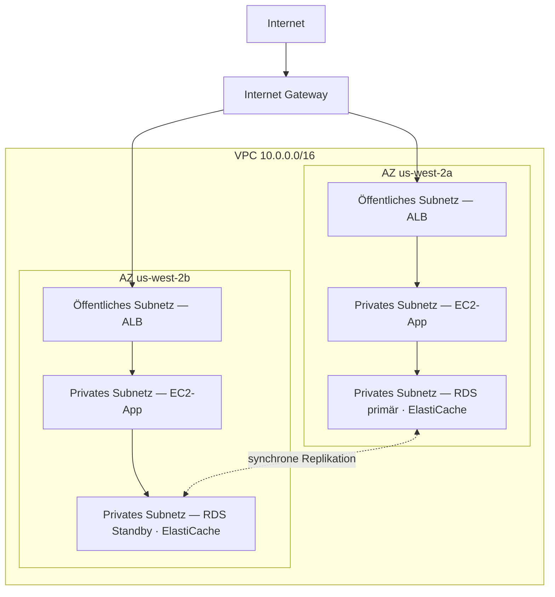

# Kapitel 11: Ihr privater Winkel in der Cloud

Priya hatte ein Blatt Papier mit einer Zeichnung darauf.

Es war keine komplizierte Zeichnung. Ein Rechteck, beschriftet mit „AWS“. Innerhalb des Rechtecks eine Ansammlung von Kästchen: EC2-Instanzen, eine RDS-Datenbank, ein ElastiCache-Cluster. Linien, die alles mit allem anderen verbanden. Und außerhalb des Rechtecks eine einzige Beschriftung: „Internet“.

Sie legte es in die Mitte des Tisches.

---

*Die Caching-Schicht funktionierte. Redis hatte die Seitenladezeiten von 188 Millisekunden auf 12 gesenkt. Aber während Leo diesen Erfolg feierte, hatte Priya Netzwerkprotokolle gelesen – und ihr gefiel nicht, was sie sah. Jeder Dienst lag im selben flachen Netzwerk. Die Datenbank hatte eine öffentliche IP-Adresse. Der Redis-Cluster war technisch von außen erreichbar. Die Anwendung funktionierte, aber die Architektur war ein Parkplatz: keine Zäune, keine Tore, keine Zonen.*

---

„Das ist, was wir haben“, sagte sie. „Unsere Datenbank hat eine öffentliche IP-Adresse. Unsere Cache-Schicht ist aus dem Internet erreichbar. Unsere EC2-Instanzen liegen alle im selben flachen Netzwerk.“

„Das scheint in Ordnung“, sagte Leo. „Wir haben Security Groups.“

„Security Groups, die du konfiguriert hast“, sagte Priya. „Nachts. Während des anfänglichen Setups.“

Leo sagte nichts.

„Ich kritisiere nicht die Konfiguration“, sagte sie. „Ich sage, dass eine einzige Fehlkonfiguration, wenn alles in einem flachen öffentlichen Netzwerk liegt, der Unterschied zwischen einem funktionierenden System und einem ist, das für jeden im Internet zugänglich ist.“

Sie nahm einen roten Marker und zog einen Kreis um die Datenbank.

„Das sollte nicht aus dem Internet erreichbar sein. Überhaupt nicht. Nicht über eine Security-Group-Regel, nicht über eine gehärtete Konfiguration. Es sollte strukturell unerreichbar sein.“

„Wir müssen über Netzwerkarchitektur reden“, sagte Maya.

„Wir hätten vor drei Monaten darüber reden müssen“, sagte Priya. „Aber jetzt ist es in Ordnung.“

Das Team versammelte sich zum ersten Mal seit Wochen um ein Whiteboard.

**Das Problem mit dem offenen Parkplatz**

Stellen Sie sich ein riesiges öffentliches Parkhaus vor. Zehntausend Autos. Jedes Auto kann überall parken. Es gibt keine Barrieren zwischen Zonen, keine Tore, keine reservierten Bereiche.

Das ist ein offenes Netzwerk. Jeder Dienst kann jeden anderen Dienst erreichen. Ihr Webserver kann mit Ihrer Datenbank reden. Ihre Datenbank kann das Internet erreichen. Ihre Caching-Schicht kann Verbindungen von überall empfangen.

Wenn alles mit allem reden kann, betrifft eine Kompromittierung alles.

„Wenn also jemand in das Parkhaus einbricht“, sagte Tom, „kann er in jedes Auto steigen.“

„Und von jedem Auto aus überallhin fahren“, bestätigte Priya. „Wir wollen Zäune. Wir wollen verschlossene Tore. Wir wollen Zonen.“

Die VPC ist die Art, wie man diese Zonen in AWS baut.

**Was ist eine VPC?**

„Moment – aber *warum* würden wir das so machen?“, fragte Maya. „Wenn wir bereits Security Groups auf jeder Ressource haben, warum brauchen wir eine VPC? Machen die Security Groups nicht dieselbe Arbeit?“

Security Groups und VPCs schützen auf unterschiedlichen Ebenen. Eine Security Group ist eine Regel, die an eine bestimmte Ressource angehängt ist – sie sagt „diese EC2-Instanz akzeptiert nur Traffic auf Port 8080 vom Load Balancer.“ Aber sie liegt immer noch im öffentlichen Netzwerk. Die IP-Adresse ist immer noch erreichbar; die Regel blockiert die Verbindung nur an der Tür. Eine VPC entfernt die Tür vollständig von der öffentlichen Straße. Eine Ressource in einem privaten Subnetz hat keine *Route* zum Internet – und per Konvention keine öffentliche IP –, also kann sie aus dem Internet nicht erreicht werden, egal was die Security Group sagt. Das ist eine strukturelle Garantie, keine konfigurative.

Eine **Virtual Private Cloud (VPC)** ist ein logisch isolierter Abschnitt der AWS-Cloud – ein privates Netzwerk, das Sie definieren und auf das standardmäßig nur Ihre Ressourcen zugreifen können.

Stellen Sie es sich als ein eingezäuntes privates Grundstück innerhalb des riesigen öffentlichen Parkhauses vor. Ihr Grundstück hat seine eigenen Regeln: wer hinein darf, wer hinaus darf, welche Routen zwischen Bereichen existieren.

Wenn Sie eine VPC erstellen, definieren Sie:

**Einen CIDR-Block**: Den Bereich der IP-Adressen, die innerhalb Ihres Netzwerks verfügbar sind. Zum Beispiel gibt Ihnen `10.0.0.0/16` 65.536 mögliche IP-Adressen (10.0.0.0 bis 10.0.255.255).

**Subnetze**: Unterteilungen Ihrer VPC, denen jeweils ein Teil Ihres IP-Adressbereichs zugewiesen ist und die mit einer bestimmten Availability Zone verknüpft sind.

**Route Tables**: Regeln, die bestimmen, wohin der Netzwerk-Traffic geht.

**Internet Gateway**: Die Verbindung zwischen Ihrer VPC und dem öffentlichen Internet.

**Subnetze: Öffentlich vs. Privat**

Nicht alle Ressourcen sollten öffentlich zugänglich sein.

Ihr Webserver muss Traffic aus dem Internet annehmen – die Browser der Benutzer müssen ihn erreichen.

Ihre Datenbank sollte *niemals* Traffic aus dem Internet annehmen – nur Ihr Webserver sollte mit ihr reden können.

Hier kommen Subnetze ins Spiel.

Ein **öffentliches Subnetz** ist mit einem Internet Gateway verbunden und kann Ressourcen mit öffentlichen IP-Adressen haben. Traffic kann zum und vom Internet fließen.

Ein **privates Subnetz** hat keine Route zum Internet in seiner Route Table. Ressourcen in einem privaten Subnetz können nur mit anderen Ressourcen in Ihrer VPC kommunizieren (es sei denn, Sie richten spezifische ausgehende Routen ein). Per Konvention haben sie auch keine öffentlichen IP-Adressen.

Für Nimbus wurde das Design klar:



Der Load Balancer ist nach außen gerichtet – er muss Traffic aus dem Internet empfangen. Die EC2-Instanzen sind privat – sie empfangen nur Traffic vom Load Balancer. Die Datenbanken sind privat – sie empfangen nur Traffic von den EC2-Instanzen.

„Um die Datenbank zu erreichen“, sagte Tom, „müsste also jemand durch den Load Balancer kommen, dann durch die EC2-Instanz, dann durch die Datenbank-Security-Group?“

„Drei Schichten“, bestätigte Priya. „Defense in Depth.“

---

**Nimbus' CIDR-Plan**

„Moment – aber *warum* würden wir das so machen?“, fragte Maya mit Blick auf die CIDR-Block-Auswahl. „Warum ist Priya so genau bei den IP-Adressbereichen? Können wir nicht einfach das nehmen, was AWS standardmäßig vorgibt?“

„Weil CIDR-Blöcke später sehr schwer zu ändern sind“, sagte Priya. „Und weil überlappende IP-Bereiche, wenn wir diese VPC jemals mit einer anderen VPC oder mit einem On-Premises-Netzwerk verbinden, Routing-Fehler verursachen, die schmerzhaft zu debuggen sind.“

Sie zeichnete den Plan auf das Whiteboard.

Nimbus' VPC: `10.0.0.0/16` – 65.536 Adressen insgesamt.

| Subnetz | CIDR | AZ | Zweck |
|---|---|---|---|
| Public A | 10.0.0.0/24 | us-west-2a | Load Balancer |
| Public B | 10.0.1.0/24 | us-west-2b | Load Balancer |
| Private App A | 10.0.10.0/24 | us-west-2a | EC2-App-Server |
| Private App B | 10.0.11.0/24 | us-west-2b | EC2-App-Server |
| Private Data A | 10.0.20.0/24 | us-west-2a | RDS, ElastiCache |
| Private Data B | 10.0.21.0/24 | us-west-2b | RDS, ElastiCache |

„Warum nicht einfach alles zu einem /16 machen?“, fragte Leo.

„Weil Subnetze in verschiedenen AZs keinen Adressraum teilen sollten. Jedes Subnetz liegt in einer AZ. Wenn wir diese VPC jemals mit einer anderen peeren, sind wir umso weniger anfällig für Konflikte, je granularer wir sind. Und jedes /24 gibt uns 251 nutzbare Adressen – mehr als genug für eine einzelne Schicht.“

„AWS reserviert fünf Adressen in jedem Subnetz“, bemerkte Tom mit Blick auf die Dokumentation. „Deshalb sind es 251, nicht 256.“

„Richtig. Die ersten vier und die letzte. Netzwerkadresse, VPC-Router, DNS-Server, zukünftige Nutzung, Broadcast.“

„Also ist /24 das Kleinste, was du nehmen würdest?“

„In der Praxis. Man würde /28 für sehr kleine Subnetze verwenden – wie ein VPN-Gateway-Subnetz, das nur eine Handvoll IPs braucht. Aber für Anwendungsschichten ist /24 ein sinnvolles Minimum.“

Tom schrieb die Zahlen auf und berechnete den monatlichen Kostenunterschied zwischen den Größen. Das tat er immer.

---

**CIDR-Planungsfehler, die man vermeiden sollte**

„Haben wir darüber nachgedacht, was passiert, wenn wir aus einem Subnetz herauswachsen?“, fragte Priya. Sie fragte nicht, weil sie es nicht wusste. Sie fragte, weil der Rest des Teams die Antwort verinnerlichen musste.

Leo dachte darüber nach. „Wir können mehr Subnetze hinzufügen?“

„Du kannst Subnetze zu einer VPC hinzufügen. Aber du kannst ein bestehendes Subnetz nicht in der Größe ändern. Wenn dein privates App-Subnetz voll wird – 251 Adressen reichen nicht –, müsstest du ein neues Subnetz erstellen und Instanzen dorthin migrieren.“

„Wie oft passiert das tatsächlich?“

„Selten, wenn man gut plant. Aber Leute machen drei häufige Fehler.“

Sie zählte sie auf:

**Fehler eins**: Einen zu kleinen VPC-CIDR verwenden. Wenn Sie `10.0.0.0/24` für die gesamte VPC verwenden (254 Adressen), geht Ihnen der Platz aus, bevor Sie die Subnetzplanung abgeschlossen haben. Beginnen Sie für Flexibilität mit `/16`.

**Fehler zwei**: Überlappende CIDRs über VPCs hinweg verwenden. Wenn Ihre Produktions-VPC `10.0.0.0/16` ist und Ihre Staging-VPC ebenfalls `10.0.0.0/16` ist, können Sie sie nie peeren oder über ein Transit Gateway verbinden. Die Router wissen nicht, an welche VPC sie Traffic senden sollen.

**Fehler drei**: Keinen Adressraum für zukünftige Schichten reservieren. Nimbus' Plan ließ `10.0.30.0/24` und `10.0.31.0/24` unzugewiesen – Raum für eine zukünftige interne Tooling-Schicht, ein Monitoring-Subnetz oder ein VPN-Endpunkt-Subnetz, ohne den gesamten Adressraum umstrukturieren zu müssen.

„Planen Sie für das Doppelte dessen, was Sie zu brauchen glauben“, sagte Priya. „Subnetze sind kostenlos. IP-Adressraum aus einem `/16` ist reichlich vorhanden. Die Kosten falscher Planung sind eine Netzwerkmigration.“

---

**Das NAT Gateway: Private Subnetze, die trotzdem Dinge herunterladen können**

Private Subnetze können das Internet nicht erreichen. Aber manchmal müssen sie das. Ihre EC2-Instanz muss ein Software-Update herunterladen. Ihre Anwendung muss eine externe API aufrufen.

Hier kommt das **NAT Gateway** (Network Address Translation) ins Spiel.

Ein NAT Gateway sitzt in einem öffentlichen Subnetz. Ressourcen in privaten Subnetzen können ausgehenden Traffic an das NAT Gateway senden, das ihn ans Internet weiterleitet – aber das Internet kann keine Verbindungen zurück initiieren.

Es ist wie eine Einbahn-Drehtür. Man kann hinaus. Niemand von draußen kann hinein.

„Wie viel kostet das pro Monat?“, fragte Tom.

Die Preisgestaltung des NAT Gateways hat zwei Komponenten: eine stündliche Gebühr für jedes NAT Gateway plus eine Datenverarbeitungsgebühr pro GB.

Zu dem Zeitpunkt, als Nimbus dies einrichtete, waren das ungefähr 32 $/Monat pro NAT Gateway, plus 0,045 $ pro GB verarbeiteter Daten. Bei kleinen Traffic-Volumina dominieren die Fixkosten. Im großen Maßstab können die Datengebühren erheblich sein.

Tom richtete einen Abrechnungsalarm für Datenverarbeitungskosten ein, bevor er die NAT-Gateway-Konfiguration abschloss. Er hatte gesehen, wie AWS-Datenkosten aussahen, wenn niemand sie beobachtete.

Die Überraschung, die Teams unvorbereitet traf: Jedes Byte, das durch ein NAT Gateway fließt, wird berechnet. Wenn Ihre EC2-Instanzen in privaten Subnetzen große Softwarepakete herunterladen, Logs an externe Dienste streamen oder erhebliche Datenmengen an externe APIs senden, erscheinen die NAT-Gateway-Datengebühren als Überraschung auf der Rechnung. Die Lösung für AWS-zu-AWS-Traffic: VPC-Endpunkte leiten Traffic zu AWS-Diensten (S3, DynamoDB) privat weiter, umgehen das NAT Gateway vollständig und eliminieren diese Datengebühren.

„Die EC2-Instanzen im privaten Subnetz laden also OS-Updates durch das NAT Gateway herunter“, sagte Tom. „Diese Updates sind wie viele Gigabyte?“

„Pro Instanz, pro Monat, vielleicht zwei bis fünf GB“, sagte Leo.

„Mal zehn Instanzen. Mal zwölf Monate. Bei 0,045 $ pro GB—“

„Elf bis siebenundzwanzig Dollar pro Jahr“, vollendete Priya. „In diesem Fall akzeptabel.“

„Aber wenn wir Logs streamen würden – etwa alle unsere Anwendungslogs an einen externen Observability-Dienst senden—“

„Würden wir die über einen VPC-Endpunkt leiten oder CloudWatch Logs verwenden, statt durch NAT hinauszugehen.“

Tom schloss den Rechner. Die Rechnung war klar genug.

### NAT-Instanz: Die Budget-Alternative

„Moment“, sagte Tom und starrte immer noch auf die Preisseite. „Wir zahlen pro Gigabyte, nur um privaten Instanzen den Zugang zum Internet zu ermöglichen? Ist das die einzige Option?“

„Es ist die verwaltete Option“, sagte Priya. „Es gibt einen älteren Weg, aber er kommt mit Kompromissen.“

Bevor es das NAT Gateway gab, erreichten Teams dasselbe ausgehende Routing mit einer regulären EC2-Instanz – einer „NAT-Instanz“. Man startete eine EC2-Instanz in einem öffentlichen Subnetz, aktivierte IP-Forwarding im OS, deaktivierte die Source/Destination-Prüfung (die AWS standardmäßig aktiviert, um Pakete zu verwerfen, die nicht an die Instanz adressiert sind) und richtete die Route Table des privaten Subnetzes auf die ENI der Instanz. Traffic von privaten Instanzen würde durch sie ins Internet fließen, genau wie ein NAT Gateway.

Es funktioniert immer noch. AWS dokumentiert es immer noch. Und bei sehr niedrigen Traffic-Volumina – einer einzelnen Dev-Umgebung, in der eine Handvoll Instanzen gelegentlich Pakete herunterladen – kann eine `t3.micro`-NAT-Instanz unter fünf Dollar im Monat kosten, gegenüber der festen stündlichen Gebühr des NAT Gateways plus den Gebühren pro GB.

| | NAT Gateway | NAT-Instanz |
|---|---|---|
| Verwaltung | Vollständig von AWS verwaltet | Sie verwalten die EC2 |
| Verfügbarkeit | Redundant innerhalb der AZ | Einzelne EC2 — Single Point of Failure |
| Bandbreite | Bis zu 100 Gbit/s, skaliert automatisch | Begrenzt durch EC2-Instanztyp |
| Kosten | 0,045 $/GB + stündliche Gebühr | Nur EC2-Instanzkosten |

Der Kostenvorteil verschwindet schnell. Bei nennenswerten Traffic-Volumina ist die NAT-Gateway-Gebühr pro GB konkurrenzfähig mit dem EC2-Instanztyp, den Sie bräuchten, um diese Bandbreite zu bewältigen – und das NAT Gateway erfordert null Patching, null Monitoring und null Incident Response, wenn es ausfällt (was es nicht tut).

„Wann würden wir also tatsächlich eine NAT-Instanz verwenden?“, fragte Leo.

„Eine Wegwerf-Dev-Umgebung“, sagte Priya. „Irgendwo, wo man ein oder zwei Instanzen betreibt, gelegentliche Paket-Updates macht und die Fixkosten minimieren will. Produktions-Workloads – alles, was verfügbar sein muss – NAT Gateway, eines pro AZ.“

Die Prüfung testet diesen Kompromiss namentlich. Das Muster: „NAT-Kosten in einer Dev- oder Test-Umgebung mit wenig Traffic minimieren“ deutet auf NAT-Instanz. „Produktions-Workload, der Hochverfügbarkeit erfordert“ deutet auf NAT Gateway, pro AZ bereitgestellt.

Sie fragen sich vielleicht: Wenn Security Groups bereits existieren und Traffic standardmäßig blockieren, warum fügt eine VPC mit privaten Subnetzen nennenswerten Schutz hinzu? Weil „durch eine Security Group blockiert“ und „strukturell unerreichbar“ verschiedene Dinge sind. Eine Security-Group-Fehlkonfiguration – eine falsche Regel, ein offener Port – kann eine Ressource mit öffentlicher IP exponieren. Eine Ressource in einem privaten Subnetz hat überhaupt keine öffentliche IP, die man erreichen könnte. Sie müssten den Load Balancer und eine laufende EC2-Instanz kompromittieren, bevor Sie überhaupt versuchen könnten, die Datenbank zu erreichen. Private Subnetze erzwingen Isolation auf Netzwerkebene, nicht auf Regelebene.

**Route Tables: Wie der Traffic seinen Weg findet**

Jedes Subnetz hat eine **Route Table**, die dem Traffic sagt, wohin er gehen soll.

Eine typische Route Table eines öffentlichen Subnetzes sieht so aus:

| Ziel | Target                      |
|-------------|-----------------------------|
| 10.0.0.0/16 | local                       |
| 0.0.0.0/0   | igw-xxxx (Internet Gateway) |

Die erste Regel: Traffic an jede IP in Ihrem VPC-Bereich bleibt lokal. Die zweite Regel: aller anderer Traffic (`0.0.0.0/0` bedeutet „alles“) geht zum Internet Gateway.

Eine Route Table eines privaten Subnetzes:

| Ziel | Target                 |
|-------------|------------------------|
| 10.0.0.0/16 | local                  |
| 0.0.0.0/0   | nat-xxxx (NAT Gateway) |

Traffic des privaten Subnetzes bleibt lokal oder verlässt es durch das NAT Gateway. Keine direkte Route zum Internet Gateway.

**Security Groups vs. NACLs (Vorschau)**

Innerhalb der VPC haben Sie zwei Werkzeuge, um Traffic auf Ressourcenebene zu steuern:

**Security Groups** (Kapitel 15 behandelt dies ausführlich) fungieren als virtuelle Firewalls für einzelne Ressourcen – eine EC2-Instanz, eine RDS-Instanz, einen Load Balancer. Sie sind *zustandsbehaftet*: Wenn Traffic eingelassen wird, wird der Antwort-Traffic automatisch hinausgelassen.

**Network ACLs (NACLs)** arbeiten auf Subnetzebene und sind *zustandslos*: Sie müssen sowohl eingehenden als auch ausgehenden Traffic explizit separat erlauben.

Für die meisten Anwendungsfälle reichen Security Groups aus. NACLs fügen eine zusätzliche Schicht hinzu, wenn Sie Kontrollen auf Subnetzebene benötigen – zum Beispiel, um einen bestimmten IP-Bereich daran zu hindern, jemals ein Subnetz zu erreichen.

„Security Groups auf Instanzebene“, schrieb Leo auf das Whiteboard. „NACLs auf Subnetzebene.“

„Und lass niemals Port 22 für 0.0.0.0/0 offen“, fügte Priya hinzu und sah Leo an.

„Das war ein Mal“, sagte Leo.

„Es ist immer genau ein Mal“, sagte Priya, „bis es das nicht ist.“

„Und was ist, wenn jemand versucht einzubrechen?“, sagte Priya, immer noch am Whiteboard. „Nicht über eine fehlkonfigurierte Security Group – was, wenn sie den Load Balancer selbst kompromittieren? Was hält sie davon ab, in das private Subnetz zu pivotieren?“

„Die EC2-Instanzen im privaten Subnetz akzeptieren nur Traffic von der Security Group des Load Balancers“, sagte Leo. „Selbst wenn der Load Balancer kompromittiert ist, kann der Angreifer nur Anfragen stellen, die wie normale API-Aufrufe aussehen.“

„Und die Datenbank akzeptiert nur Traffic von der EC2-Security-Group“, sagte Priya. „Defense in Depth. Jede Schicht nimmt an, dass die vorherige versagen könnte.“

---

**VPC Flow Logs: Sehen, was passiert**

„Wir brauchen Augen auf dem Netzwerk“, sagte Priya, drei Tage nach Beginn des VPC-Redesigns.

„Wir haben Security Groups und NACLs“, sagte Leo. „Der Traffic ist kontrolliert.“

„Kontrolliert heißt nicht sichtbar. Wenn etwas Seltsames passiert – ein unerwarteter Verbindungsversuch, Traffic zu einem seltsamen Port –, woher wissen wir das?“

VPC Flow Logs erfassen Metadaten über den Netzwerk-Traffic, der durch Ihre VPC fließt. Nicht den Paketinhalt – nur die Informationen auf Verbindungsebene: Quell-IP, Ziel-IP, Port, Protokoll, Paketanzahl, Byteanzahl, Startzeit, Endzeit und ob der Traffic akzeptiert oder abgelehnt wurde.

Ein typischer Flow-Log-Eintrag sieht so aus:

```
2 123456789012 eni-0abc123 10.0.10.5 10.0.20.8 49321 5432 6 20 4320 1620000000 1620000060 ACCEPT OK
```

Das sagt Ihnen: von `10.0.10.5` (eine EC2-Instanz im App-Subnetz) zu `10.0.20.8` (die RDS-Instanz), Port 5432 (PostgreSQL), 20 Pakete, 4.320 Bytes, akzeptiert. Normaler Traffic.

Aber ein paar Tage nach dem Aktivieren der Flow Logs fand Priya dies:

```
2 123456789012 eni-0abc123 185.220.101.55 10.0.10.5 0 8080 6 1 40 1620003200 1620003201 REJECT OK
```

Eine externe IP – `185.220.101.55` – hatte einen Verbindungsversuch zur EC2-Instanz auf Port 8080 unternommen. Die Verbindung wurde von der Security Group abgelehnt. Aber der Versuch wurde protokolliert.

Sie schlug die IP nach. Sie gehörte zu einem rumänischen Adressblock, der für automatisiertes Scanning bekannt ist – die Art von Hintergrundrausch-Sondierung, die jede öffentliche IP im Internet ständig erhält.

„Jemand sondiert uns“, sagte sie.

„Aber wird abgelehnt“, sagte Leo.

„Diesmal. Aktiviere GuardDuty“ – ein Bedrohungserkennungsdienst, den wir in Kapitel 17 richtig kennenlernen – „bevor wir weitermachen. Wir brauchen verhaltensbasierte Erkennung, nicht nur Perimeter-Blockierung.“

Flow Logs werden in CloudWatch Logs oder S3 gespeichert. Sie können mit CloudWatch Insights oder Athena abgefragt werden. Priya richtete eine CloudWatch-Insights-Abfrage ein, die nächtlich lief und jeden abgelehnten Verbindungsversuch aus Nicht-AWS-IP-Bereichen markierte.

„Wie viel kostet das pro Monat?“, fragte Tom.

„Flow Logs werden pro GB an Daten berechnet, die in CloudWatch oder S3 aufgenommen werden. Bei unserem Traffic-Volumen wahrscheinlich acht bis fünfzehn Dollar im Monat.“

Tom hielt inne. „Und die Alternative ist, nicht zu wissen, dass jemand unser Netzwerk sondiert.“

„Ja.“

„Das ist in Ordnung“, sagte er und öffnete die Konsole.

**Einen Portscan in Flow Logs lesen**

Zwei Wochen nach dem Aktivieren der Flow Logs führte Priya ihre nächtliche CloudWatch-Insights-Abfrage aus und fand etwas Neues. Nicht eine abgelehnte Verbindung – Dutzende, in schneller Folge, von derselben Quell-IP, über aufeinanderfolgende Ports.

```
185.220.101.55 → 10.0.10.5 port 22   REJECT
185.220.101.55 → 10.0.10.5 port 23   REJECT
185.220.101.55 → 10.0.10.5 port 25   REJECT
185.220.101.55 → 10.0.10.5 port 80   REJECT
185.220.101.55 → 10.0.10.5 port 443  REJECT
185.220.101.55 → 10.0.10.5 port 3306 REJECT
185.220.101.55 → 10.0.10.5 port 5432 REJECT
185.220.101.55 → 10.0.10.5 port 6379 REJECT
```

Alles innerhalb eines Fünf-Sekunden-Fensters. Alles abgelehnt.

„Das ist ein Portscan“, sagte Priya. „Jemand sondiert, welche Dienste diese Instanz betreibt.“

„Aber alle abgelehnt“, sagte Leo. „Also macht die Security Group ihre Arbeit.“

„Die Security Group macht ihre Arbeit. Der Scan ist für den Angreifer trotzdem informativ – er sagt ihm, welche Ports nicht innerhalb eines Timeouts abgelehnt haben, was bedeutet, dass diese Ports irgendwo offen sind. Und er sagt ihm, dass dieser Host lebt und es wert ist, untersucht zu werden.“

„Was machen wir?“

„Zwei Dinge“, sagte Priya. „Erstens: eine NACL-Regel hinzufügen, um den /24-Bereich zu blockieren, zu dem diese IP gehört. Nicht nur diese IP – das ganze Subnetz. Portscanner rotieren IPs innerhalb eines Bereichs. Zweitens: einen CloudWatch-Alarm hinzufügen, der ausgelöst wird, wenn eine einzelne Quell-IP mehr als zehn abgelehnte Verbindungen in sechzig Sekunden erzeugt. Dieses Muster ist fast immer ein Scan.“

Sie richtete beides ein. Der Alarm wurde in der folgenden Woche zweimal ausgelöst – einmal aus demselben rumänischen Bereich, einmal von einem automatisierten Scanner mit Sitz in Singapur. Beide wurden innerhalb von Minuten nach der Erkennung an der NACL blockiert.

Flow Logs stoppen keine Angriffe. Sie machen Angriffe sichtbar. Und auf sichtbare Angriffe kann man reagieren. Die Alternative – Traffic, der unsichtbar fließt – bedeutet, dass das erste Anzeichen eines Problems der Schaden ist, nicht der Versuch.

---

**Die Single-NAT-Gateway-Falle**

Drei Monate nach dem VPC-Redesign führte Priya eine Ausfallsimulation durch. Sie wollte wissen, was mit Nimbus passieren würde, wenn die Availability Zone `us-west-2a` eine Störung erlebte.

Das meiste davon war in Ordnung. Der Load Balancer schwenkte auf Instanzen in `us-west-2b` um. Der RDS-Standby in `us-west-2b` war bereits live. ElastiCache beförderte die Replik. Die Anwendung bediente weiterhin Anfragen.

Dann bemerkte Leo, dass seine EC2-Instanzen in `us-west-2b` aufgehört hatten, OS-Update-Benachrichtigungen zu empfangen. Er prüfte die NAT-Gateway-Konfiguration.

Es gab eines. In `us-west-2a`.

„Aller ausgehende Internet-Traffic aus den privaten Subnetzen in beiden AZs wird durch ein NAT Gateway in einer AZ geleitet“, sagte Priya.

„Wenn also `us-west-2a` ausfällt—“

„Verliert jede EC2-Instanz in `us-west-2b` den ausgehenden Internetzugang. Sie können keine Updates herunterladen. Sie können keine externen APIs erreichen. Secrets-Manager-Lookups, die nicht gecacht sind, schlagen fehl. Alles, was ausgehenden Internetzugang erfordert, bricht ab.“

Die Lösung: ein NAT Gateway pro AZ. Die privaten Subnetze jeder AZ leiten ausgehenden Traffic an das NAT Gateway in derselben AZ. Wenn eine AZ ausfällt, ist nur der Traffic dieser AZ betroffen.

„Und das Preisschild für diese Lösung?“, fragte Tom.

„Zusätzliche zweiunddreißig Dollar im Monat für das NAT Gateway der zweiten AZ.“

Tom war einen Moment still.

„Dass die EC2-Kapazität in `us-west-2b` während eines Ausfalls keine externen APIs erreichen kann“, sagte Priya, „kostet mehr als zweiunddreißig Dollar.“

Tom genehmigte die Änderung.

Das ist einer der häufigsten VPC-Designfehler: ein NAT Gateway, das hochverfügbar aussieht, aber tatsächlich ein Single Point of Failure ist. Wenn Sie Ressourcen in drei AZs und ein NAT Gateway haben, haben Sie Drei-AZ-Compute-Resilienz, aber Ein-AZ-Netzwerk-Resilienz. Die beiden passen nicht zusammen.

Die Regel: ein NAT Gateway pro AZ, im öffentlichen Subnetz dieser AZ. Die private Route Table jeder AZ zeigt auf ihr eigenes NAT Gateway. Die Kosten sind moderat. Die Verbesserung der Verfügbarkeit ist real.


---

**VPC Peering: Private Netzwerke verbinden**

Was, wenn Nimbus zu mehreren VPCs heranwächst? (Das passiert. Teams werden groß. Dienste werden in separate Accounts isoliert.)

**VPC Peering** lässt zwei VPCs privat kommunizieren, als wären sie im selben Netzwerk. Der Traffic verlässt das private Netzwerk von AWS nicht.

Wichtige Grenzen:

- VPC Peering ist nicht transitiv. Wenn VPC A mit VPC B peert und VPC B mit VPC C peert, können A und C nicht kommunizieren – es sei denn, Sie fügen ein direktes A-C-Peering hinzu.
- CIDR-Blöcke dürfen sich zwischen gepeerten VPCs nicht überlappen.

Für größere Architekturen mit vielen VPCs handhabt **AWS Transit Gateway** (Kapitel 25) transitives Routing, ohne ein vollständiges Mesh von Peering-Verbindungen zu erfordern.

---

**AWS PrivateLink: Privater Zugang zu AWS-Diensten**

„Was ist mit dem Erreichen von S3 aus dem privaten Subnetz?“, fragte Leo. „Unsere EC2-Instanzen schreiben Belege nach S3. Im Moment geht dieser Traffic durch das NAT Gateway hinaus.“

„VPC-Endpunkte“, sagte Priya. „Speziell Gateway-Endpunkte für S3 und DynamoDB – die sind kostenlos.“

Ein **VPC-Endpunkt** erstellt eine private Verbindung zwischen Ihrer VPC und einem AWS-Dienst und umgeht das öffentliche Internet vollständig. Traffic zwischen Ihrem privaten Subnetz und dem AWS-Dienst bleibt im AWS-Netzwerk. Keine NAT-Gateway-Gebühr. Keine Internet-Exponierung.

Für S3 und DynamoDB sind **Gateway-Endpunkte** kostenlos und einfach: Fügen Sie einen Eintrag zur Route Table hinzu, der S3/DynamoDB-Traffic auf den Endpunkt statt auf das NAT Gateway zeigt.

Für andere AWS-Dienste (Secrets Manager, KMS, SNS, SQS) erstellen **Interface-Endpunkte** eine Elastic Network Interface (ENI) in Ihrem Subnetz mit einer privaten IP-Adresse. Traffic zum Dienst geht zu dieser privaten IP. Interface-Endpunkte kosten Geld – ungefähr 0,01 $/Stunde **pro AZ, in der der Endpunkt bereitgestellt wird** (ein Endpunkt mit ENIs in drei AZs kostet das Dreifache des Stundensatzes), plus etwa 0,01 $/GB verarbeiteter Daten –, aber sie eliminieren die Notwendigkeit, sensible API-Aufrufe (wie Secrets-Manager-Lookups) durch ein NAT Gateway oder über das öffentliche Internet zu leiten.

„Unsere EC2-Instanzen können also S3, DynamoDB, Secrets Manager und KMS erreichen“, sagte Priya, „alles aus dem privaten Subnetz, ohne jede Internet-Exponierung, und für S3 und DynamoDB ohne jegliche NAT-Gateway-Datengebühren.“

Tom rechnete neu. Die Einsparungen beim S3-Traffic würden die Kosten des Interface-Endpunkts für Secrets Manager innerhalb weniger Monate ausgleichen.

„PrivateLink ist der allgemeine Name“, fügte Priya hinzu. „AWS PrivateLink ist die zugrundeliegende Technologie für Interface-Endpunkte. Die Prüfung verwendet beide Begriffe.“

---

**Eine Debugging-Checkliste**

Drei Monate nach dem VPC-Redesign zerbrach Leo das Netzwerk. Nicht dramatisch – er hatte eine Route-Table-Zuordnung modifiziert und versehentlich das private App-Subnetz von seiner NAT-Gateway-Route getrennt.

Die EC2-Instanzen konnten keine externen APIs erreichen. Sie konnten einander erreichen, und sie konnten die Datenbanken erreichen. Nur nicht das Internet. Ausgehende HTTPS-Aufrufe begannen fehlzuschlagen.

Er verbrachte vierzig Minuten mit der Fehlersuche, bevor Priya ihm eine Checkliste reichte.

„Wenn in einer VPC etwas etwas anderes nicht erreicht, prüfe diese der Reihe nach“, sagte sie.

1. **Security Group auf der Quelle**: Ist die ausgehende Regel korrekt? Erlaubt sie den Traffic, den du zu senden versuchst?
2. **Security Group auf dem Ziel**: Ist die eingehende Regel korrekt? Erlaubt sie Traffic von der Quelle?
3. **NACL auf dem Quell-Subnetz**: Gibt es eine eingehende Deny-Regel, die den Antwort-Traffic blockiert? Gibt es eine ausgehende Allow-Regel?
4. **NACL auf dem Ziel-Subnetz**: Gibt es eine eingehende Allow-Regel? Gibt es eine ausgehende Allow-Regel für Antworten?
5. **Route Table auf dem Quell-Subnetz**: Hat sie eine Route zum Ziel? Zeigt die Route auf das richtige Target (NAT Gateway, IGW, VPC-Endpunkt)?
6. **Route Table auf dem Ziel-Subnetz**: Hat sie eine Route zurück zur Quelle?
7. **VPC-Endpunkt-Policy**: Wenn ein VPC-Endpunkt verwendet wird, erlaubt die Endpunkt-Policy die Aktion?
8. **IAM-Berechtigungen**: Hat die EC2-Rolle die Berechtigung, den Dienst aufzurufen? (Für AWS-API-Aufrufe)

Leo fand es bei Schritt 5. Die Route Table war dem falschen privaten Subnetz neu zugeordnet worden. Die NAT-Gateway-Route fehlte.

„Wenn ich diese Liste vor drei Monaten gehabt hätte“, sagte er, „hätte ich es in fünf Minuten gefunden.“

„Von jetzt an wirst du sie haben“, sagte Priya.

## Direct Connect: Die dedizierte Leitung

Drei Monate nach dem VPC-Redesign schloss Nimbus einen Deal mit der Harborview Dining Group ab – einer Unternehmenskette mit hundert Standorten, die zwei Millionen Dollar an Transaktionen pro Tag verarbeitete.

Der technische Review-Call begann gut. Dann schaltete sich ihre Compliance-Beauftragte ein.

„Wir können Produktions-Transaktionsdaten nicht über das öffentliche Internet leiten“, sagte sie. „Unsere Prüfer verlangen einen dedizierten, privaten, auditierbaren Netzwerkpfad zwischen unserem Rechenzentrum und jeder Cloud-Umgebung. Site-to-Site VPN ist nicht akzeptabel. Es teilt sich die Bandbreite mit allen anderen. Es reist über dieselben Leitungen wie Consumer-Traffic.“

Tom sah Leo an. Leo sah Priya an.

„Um genau zu sein“, sagte Priya vorsichtig, „verbietet PCI DSS selbst kein verschlüsseltes VPN über das Internet – verschlüsselter Transport erfüllt den Standard. Was Sie beschreiben, ist die interne Richtlinie Ihrer Prüfer, die strenger ist. Das ist legitim. Und es gibt einen Dienst dafür.“

**AWS Direct Connect** ist eine dedizierte physische Netzwerkverbindung zwischen Ihrem On-Premises-Rechenzentrum und AWS. Die Verbindung umgeht das öffentliche Internet vollständig – Ihr Traffic berührt nie geteilte Infrastruktur, konkurriert nie mit jemand anderem um Bandbreite und reist nie über eine Leitung, die nicht Ihnen gehört.

Direct Connect einzurichten bedeutet, mit AWS und einem Colocation- oder Netzwerkanbieter zusammenzuarbeiten, um an einem Direct-Connect-Standort einen physischen Cross-Connect zu installieren – einem Rechenzentrum, in dem AWS dedizierte Hardware hat. Sobald die physische Verbindung steht, etablieren Sie darüber virtuelle Schnittstellen, die mit Ihrer VPC oder direkt mit AWS-Diensten verbunden sind.

**Die wichtigsten Eigenschaften:**

Bandbreite gibt es in zwei Formen. *Dedizierte Verbindungen* gehen direkt zu AWS-Hardware: 1 Gbit/s, 10 Gbit/s oder 100 Gbit/s. *Gehostete Verbindungen* gehen über einen AWS-Partner und bieten granularere Optionen von 50 Mbit/s bis zu 10 Gbit/s – nützlich, wenn Sie keinen vollen dedizierten Port brauchen.

Die Latenz ist konsistent. Weil Sie nicht um Internet-Bandbreite konkurrieren, ist die Round-Trip-Zeit zu AWS vorhersehbar. Für Harborview, dessen Point-of-Sale-Systeme Hunderte von API-Aufrufen pro Transaktion machten, war konsistente Sub-5-ms-Latenz der Unterschied zwischen einem 200-ms-Checkout und einem 400-ms-Checkout.

Privatsphäre ist strukturell, nicht konfigurativ. Ein Site-to-Site VPN ist verschlüsselt, aber es durchquert immer noch das öffentliche Internet – dieselbe physische Infrastruktur, die von allen anderen genutzt wird. Direct-Connect-Traffic berührt nie das öffentliche Internet. Für Harborviews Compliance-Team war das die Anforderung, und keine noch so gute VPN-Konfiguration würde sie erfüllen.

Die Kosten sind höher als bei VPN. Sie zahlen eine Port-Stunden-Gebühr für die Direct-Connect-Verbindung plus Datenübertragungspreise. Die Verbindung ist nicht billig, und sie braucht Wochen bis Monate zur Bereitstellung – eine physische Cross-Connect-Installation ist nichts, was man an einem Freitagnachmittag hochfährt.

„Moment mal“, sagte Maya. „Wenn VPN verschlüsselt ist, warum spielt es eine Rolle, dass es über das öffentliche Internet geht?“

Weil die Compliance-Anforderung nicht nur um Verschlüsselung geht – es geht um Isolation. VPN verschlüsselt den Inhalt des Traffics, aber der Traffic durchquert immer noch geteilte physische Infrastruktur. Jeder, der einen Router auf dem Pfad kontrolliert, kann die verschlüsselten Pakete sehen, sie aufzeichnen und später versuchen, sie zu entschlüsseln. Eine dedizierte physische Verbindung hat keine geteilten Router. Der Pfad gehört physisch Ihnen. Für Branchen mit strengen Datensouveränitätsanforderungen – Finanzen, Gesundheitswesen, Regierung – ist diese Unterscheidung der Unterschied zwischen konform und nicht konform.

„Noch eine Sache“, sagte Priya. „Direct Connect ist standardmäßig privat, aber nicht standardmäßig verschlüsselt. Wenn Sie beides wollen – privat und verschlüsselt –, betreiben Sie ein IPSec-VPN über die Direct-Connect-Verbindung. Das gibt Ihnen dedizierte Bandbreite plus Verschlüsselung. Beides.“

Tom hatte bereits die Preisseite gefunden. Er sah sich die monatliche Verpflichtung für eine dedizierte 1-Gbit/s-Verbindung an.

„Harborviews Tagesvolumen von 2 Mio. Dollar bedeutet, dass sich das in Rundungsfehlern amortisiert“, sagte er.

Er schickte den Vorschlag.

---

> **Prüfungstipp — Direct Connect vs. VPN**
>
> *SAA-C03 Domäne: Design Secure Architectures (Domäne 1)*
>
> - **VPN:** verschlüsselt, schnell bereitzustellen (Minuten), reist über das öffentliche Internet, variable Bandbreite und Latenz.
> - **Direct Connect:** dedizierte physische Verbindung, konsistente Bandbreite und Latenz, privat (Traffic berührt nie das öffentliche Internet), aber nicht standardmäßig verschlüsselt. Braucht Wochen bis Monate zur Bereitstellung.
> - **Verschlüsselt UND privat:** ein IPSec-VPN über Direct Connect betreiben. Sie erhalten sowohl dedizierte Bandbreite als auch Verschlüsselung.
> - **Prüfungsauslöser:** „konsistente, private, dedizierte Bandbreite zu AWS“ oder „Compliance verlangt, dass Traffic nicht über das öffentliche Internet reist“ → Direct Connect. „Verschlüsselt UND privat“ → Direct Connect + IPSec-VPN. „Schnell einzurichten, niedrigere Kosten, öffentliches Internet akzeptabel“ → Site-to-Site VPN.
> - **Kosten und Einrichtungszeit** sind die Kompromisse, die die Prüfung testet: VPN = schnell + billig; Direct Connect = langsam in der Bereitstellung + teuer + konsistent.

---

### Client VPN: Remote-Zugang für einzelne Benutzer

Direct Connect und Site-to-Site VPN verbinden Netzwerke – ein ganzes Büro oder Rechenzentrum mit AWS. Aber Ingenieure müssen auch einzelne Laptops mit einer VPC verbinden: um eine private EC2-Instanz zu debuggen, eine private RDS-Datenbank abzufragen oder von zu Hause auf interne Tools zuzugreifen.

„Haben wir das nicht bereits?“, fragte Maya. „Wir haben einen Bastion Host. Kann Leo nicht einfach durch den SSHen?“

„Für SSH, ja“, sagte Priya. „Aber was, wenn Leo sich von einer Datenbank-GUI auf seinem Laptop mit der RDS-Instanz verbinden muss? Oder das interne Metriken-Dashboard über HTTP abfragen muss? Der Bastion handhabt nur SSH. Client VPN funktioniert für jedes Protokoll.“

**AWS Client VPN** ist ein verwalteter VPN-Endpunkt, der einzelnen Benutzern ermöglicht, sich von jedem Gerät, von überall, mit Ihrer VPC zu verbinden. Benutzer installieren einen standardmäßigen OpenVPN-Client auf ihrem Laptop; der VPN-Endpunkt ist in AWS.

Wichtige Eigenschaften:

- Verwaltet von AWS – Sie betreiben keinen VPN-Server
- Basiert auf OpenVPN – funktioniert mit jedem standardmäßigen OpenVPN-Client
- Authentifizierung über Active Directory (benutzerbasiert), zertifikatbasiertes mutual TLS oder SAML-2.0-Föderierte-Authentifizierung (SSO über einen Identity Provider)
- Jeder verbundene Client erhält eine private IP in Ihrer VPC und kann auf private Ressourcen (RDS, ElastiCache, interne Dienste) zugreifen, als wäre er innerhalb der VPC
- Unterstützt **Split-Tunnel** (nur VPC-Traffic geht durch das VPN – Internet-Traffic geht direkt) oder **Full-Tunnel** (aller Traffic durch das VPN)

„Split-Tunnel“, sagte Tom sofort.

„Warum?“, fragte Leo.

„Weil Full-Tunnel bedeutet, dass mein Netflix-Stream durch unseren VPN-Endpunkt geht und ich darauf Datenübertragungsgebühren zahle.“

Das war korrekt. Split-Tunnel ist die Standardempfehlung für Entwicklerzugriff: VPC-gebundener Traffic wird durch das VPN geleitet, Internet-Traffic geht direkt hinaus. Das VPN handhabt nur das, was privat sein muss.

**vs. Site-to-Site VPN:** Site-to-Site verbindet zwei Netzwerke (Büro ↔ VPC). Client VPN verbindet einzelne Geräte (Laptop ↔ VPC).

**vs. Bastion Host:** ein Bastion Host erfordert SSH; Client VPN funktioniert für jedes Protokoll – Datenbankverbindungen, interne HTTP-Dienste, alles, was über TCP oder UDP läuft.

> **Prüfungstipp — Client VPN vs. Site-to-Site VPN**
>
> - **Site-to-Site VPN:** Netzwerk-zu-Netzwerk (Büro zu VPC, Rechenzentrum zu VPC).
> - **Client VPN:** einzelnes Gerät zu VPC (Ingenieure, die remote arbeiten, von zu Hause auf private Ressourcen zugreifen).
> - Prüfungsauslöser: „Benutzer müssen von zu Hause auf private VPC-Ressourcen zugreifen“ oder „Remote-Entwickler brauchen Datenbankzugriff“ → Client VPN. „Ein ganzes Filialbüro mit AWS verbinden“ → Site-to-Site VPN.

---

## Stärken und Grenzen

**Warum VPC-Design wichtig ist**:

- Netzwerkisolation ist Defense in Depth – das Durchbrechen einer Schicht bedeutet nicht, alles zu kompromittieren
- Private Subnetze reduzieren die Angriffsfläche erheblich
- Route Tables und Security Groups geben präzise Kontrolle über Traffic-Flüsse
- VPCs integrieren sich mit jedem AWS-Netzwerkdienst (Direct Connect, VPN, Transit Gateway)
- Flow Logs machen Netzwerk-Traffic sichtbar und auditierbar

**Wo es kompliziert wird**:

- VPC-Design erfordert vorausschauende Planung – CIDR-Blöcke sind später schwer zu ändern
- Zu viele kleine VPCs erzeugen Peering-Komplexität (n-Quadrat-Problem)
- Das Debuggen von Netzwerkproblemen in VPCs erfordert das gleichzeitige Verständnis von Route Tables, Security Groups, NACLs und Subnetz-Zuordnungen
- NAT-Gateway-Kosten können Sie im großen Maßstab überraschen (Verarbeitungsgebühren pro GB)
- VPC-Endpunkte reduzieren NAT-Kosten, fügen aber ihre eigenen stündlichen Gebühren für Nicht-Gateway-Endpunkte hinzu

## Zusammenfassung

Das Netzwerk-Redesign dauerte drei Tage. Jede Ressource landete am richtigen Ort – und der richtige Ort bedeutete, dass sie nur von genau den Diensten erreicht werden konnte, die sie brauchten, und von nichts anderem. Gutes Netzwerkdesign macht nicht nur Sicherheitsverletzungen schwerer; es begrenzt, was ein Angreifer nach einer Verletzung tun kann.

- Eine **VPC** ist ein logisch isoliertes privates Netzwerk in AWS – Ihr eingezäuntes Grundstück innerhalb der öffentlichen Cloud.
- **Subnetze** unterteilen Ihre VPC nach Availability Zone. Öffentliche Subnetze verbinden sich mit dem Internet Gateway; private Subnetze nicht.
- Platzieren Sie nach außen gerichtete Ressourcen (Load Balancer) in öffentlichen Subnetzen. Platzieren Sie alles andere (EC2, Datenbanken, Caches) in privaten Subnetzen.
- **Route Tables** steuern, wohin Traffic fließt. Jedes Subnetz hat eine.
- **NAT Gateway** (in einem öffentlichen Subnetz) lässt private Ressourcen ausgehende Internetverbindungen initiieren, ohne eingehende Verbindungen anzunehmen.
- **VPC Flow Logs** zeichnen Metadaten über allen Netzwerk-Traffic auf – essenziell für Sicherheitstransparenz und Debugging.
- **VPC-Endpunkte** verbinden private Subnetze mit AWS-Diensten, ohne durch das NAT Gateway oder das öffentliche Internet zu gehen. Gateway-Endpunkte (S3, DynamoDB) sind kostenlos.
- Planen Sie Ihre CIDR-Blöcke sorgfältig – sie sind nach der Bereitstellung von Ressourcen sehr schwer zu ändern.

## Prüfungstipps

*SAA-C03 Domäne: Design Secure Architectures (Domäne 1, Aufgabe 1.2)*

- **Öffentliches vs. privates Subnetz**: Der Unterschied ist die Route Table. Ein öffentliches Subnetz hat eine Route zu einem Internet Gateway. Ein privates Subnetz nicht.
- **NAT-Gateway-Platzierung**: immer im *öffentlichen* Subnetz. Ressourcen des privaten Subnetzes leiten ausgehenden Traffic dorthin.
- **Hochverfügbarkeit für NAT**: ein NAT Gateway pro AZ erstellen. Wenn Sie ein NAT Gateway in AZ-a haben und AZ-b-Instanzen durch es geleitet werden, nimmt ein Ausfall von AZ-a auch den Internetzugang von AZ-b mit.
- **VPC Peering ist nicht transitiv**: Die Prüfung beschreibt drei VPCs und fragt, ob sie über die mittlere kommunizieren können – die Antwort ist nein, ohne direktes Peering oder Transit Gateway.
- **CIDR-Überlappung**: Gepeerte VPCs dürfen keine überlappenden CIDR-Blöcke haben. Klassische Prüfungsfalle.
- **Bastion Host (Jump Box)**: Um in eine private EC2-Instanz zu SSHen, brauchen Sie einen Bastion Host im öffentlichen Subnetz. Der Bastion ist die einzige Maschine mit einer öffentlichen IP; private Instanzen akzeptieren SSH nur von der Security Group des Bastions.
- **VPC-Endpunkte**: ermöglichen privaten Ressourcen, AWS-Dienste (S3, DynamoDB) zu erreichen, ohne durch das NAT Gateway zu gehen. Zwei Typen: **Gateway-Endpunkte** (S3, DynamoDB – kostenlos) und **Interface-Endpunkte** (andere Dienste – berechnet pro Stunde plus Daten).
- **VPC Flow Logs**: nur Metadaten – nicht Paketinhalte. Verwendet für Sicherheitsanalyse, Netzwerk-Debugging und Compliance. Können an CloudWatch Logs oder S3 gesendet werden.
- **NAT Gateway vs. NAT-Instanz**: NAT Gateway ist verwaltet, HA, skaliert automatisch, kostet aber pro GB. NAT-Instanz ist eine selbstverwaltete EC2 mit IP-Forwarding – billiger bei sehr niedrigen Traffic-Volumina, aber ein Single Point of Failure. Prüfungsauslöser: „NAT-Kosten in Dev/Test minimieren“ → NAT-Instanz.
- **Direct Connect vs. VPN**: VPN = verschlüsselt, schnell bereitzustellen, reist über das öffentliche Internet, variable Bandbreite. Direct Connect = dedizierte physische Verbindung, konsistente Bandbreite/Latenz, privat (nicht standardmäßig verschlüsselt), Wochen zur Bereitstellung. Prüfungsauslöser: „konsistente, private, dedizierte Bandbreite“ → Direct Connect. „Verschlüsselt UND privat“ → Direct Connect + IPSec-VPN darüber. „Schnell, niedrigere Kosten, öffentliches Internet akzeptabel“ → Site-to-Site VPN.
- **Client VPN vs. Site-to-Site VPN**: Site-to-Site = Netzwerk-zu-Netzwerk (Büro zu VPC). Client VPN = einzelnes Gerät zu VPC (Ingenieure, die remote arbeiten). Prüfungsauslöser: „Benutzer müssen von zu Hause auf private Ressourcen zugreifen“ → Client VPN. „Filialbüro mit AWS verbinden“ → Site-to-Site VPN.

## Übungen

**Übung 1 – Erinnerung**

Erklären Sie, warum eine Datenbank in einem privaten Subnetz liegen sollte. Welche spezifische Bedrohung mildert das?

*(Hinweis: Was kann jemand mit einer Datenbank im öffentlichen Internet tun, das er mit einer Datenbank, die nur innerhalb der VPC zugänglich ist, nicht tun kann?)*

**Übung 2 – SAA-C03-Szenario**

*Szenario*: Ein Unternehmen entwirft eine dreischichtige Webanwendung auf AWS. Die Web-Schicht (ALB + EC2) muss Internet-Traffic annehmen. Die Anwendungsschicht (EC2) darf nur Traffic von der Web-Schicht empfangen. Die Datenbankschicht (RDS) darf nur Traffic von der Anwendungsschicht empfangen. Die EC2-Instanzen der Anwendungsschicht müssen Softwarepakete aus dem Internet herunterladen. Die Lösung muss hochverfügbar sein.

Welche Architektur erfüllt diese Anforderungen am BESTEN?

A) Alle Schichten in öffentlichen Subnetzen; Security Groups beschränken den Traffic zwischen Schichten  
B) Web-Schicht in öffentlichen Subnetzen; App- und Datenbankschichten in privaten Subnetzen; ein NAT Gateway in einem öffentlichen Subnetz  
C) Web-Schicht in öffentlichen Subnetzen; App- und Datenbankschichten in privaten Subnetzen; ein NAT Gateway pro AZ  
D) Alle Schichten in privaten Subnetzen; ein Internet Gateway bietet allen Schichten bidirektionalen Internetzugang

**Hinweis 1**: „Hochverfügbar“ bedeutet keinen Single Point of Failure. Welche Option führt ein NAT Gateway als Single Point of Failure ein?

**Hinweis 2**: Wenn die AZ des NAT Gateways ausfällt, welche Instanzen verlieren den Internetzugang?

**Hinweis 3**: Lesen Sie die Anforderung sorgfältig – die Anwendungsschicht braucht *ausgehenden* Internetzugang, nicht eingehenden.

**Antwort**: C

**Erläuterung**: Die Web-Schicht in öffentlichen Subnetzen bietet nach außen gerichteten Zugang durch den ALB. App- und Datenbankschichten in privaten Subnetzen stellen sicher, dass sie nicht direkt aus dem Internet erreichbar sind. Ein NAT Gateway pro AZ (eines in jedem öffentlichen Subnetz) bietet hochverfügbaren ausgehenden Internetzugang für Instanzen in privaten Subnetzen – wenn eine AZ ausfällt, bedient das NAT Gateway der anderen AZ weiterhin Traffic.

**Warum nicht A?** Öffentliche Subnetze für alle Schichten exponieren die Anwendung und die Datenbank direkt gegenüber dem Internet und vereiteln den Zweck des schichtbasierten Sicherheitsmodells.

**Warum nicht B?** Ein NAT Gateway in einer einzelnen AZ ist ein Single Point of Failure. Wenn das NAT Gateway dieser AZ ausfällt, verlieren alle privaten Instanzen den ausgehenden Internetzugang.

**Warum nicht D?** Ein Internet Gateway bietet bidirektionale Konnektivität – private Subnetze mit einer Route zum Internet Gateway sind effektiv öffentliche Subnetze.

*SAA-C03 Domäne: Design Secure Architectures – Aufgabe 1.2*

**Übung 3 – Architektur-Herausforderung** *(Optional)*

Nimbus wächst. Das Engineering-Team möchte den „Menü-Service“ in einen eigenen Account mit einer eigenen VPC trennen, während die Haupt-Nimbus-Anwendung in einem separaten Account und einer separaten VPC bleibt.

Wie würden Sie diese beiden VPCs verbinden, damit die Hauptanwendung den Menü-Service abfragen kann? Welche Einschränkungen müssten Sie einplanen? Was würden Sie stattdessen verwenden, wenn Nimbus zehn separate Microservice-VPCs hätte, die alle kommunizieren müssten?

*(Es gibt keine einzige richtige Antwort. Das Ziel ist es, Multi-VPC-Netzwerkdesign zu üben.)*

## Post-Credits-Szene

Priya gestaltete das Netzwerk neu.

Drei Tage später war jede Ressource am richtigen Ort. EC2-Instanzen in privaten Subnetzen. Load Balancer in öffentlichen Subnetzen. RDS und ElastiCache nur von der Anwendungsschicht aus zugänglich. Security Groups mit den minimal erforderlichen Ports.

„Ich habe es schon deployt – oh.“ Leo hatte versucht, direkt in die Datenbank zu SSHen, um etwas zu prüfen. Er konnte es nicht. Die Verbindung lief in einen Timeout – was eigentlich korrekt war –, aber er war in Panik geraten und hatte eine temporäre Security-Group-Regel geöffnet, bevor er merkte, dass die Architektur wie beabsichtigt funktionierte.

Priya hatte die Regel kommentarlos geschlossen.

„Der Timeout war gut“, sagte sie.

„Ich musste nur eine Sache prüfen“, sagte Leo.

„Was?“

„Ob der Index korrekt eingerichtet war.“

Priya zog ihren Laptop heran. „Ich kann es vom Bastion Host aus prüfen, durch die Anwendungsinstanz, die die korrekten Datenbank-Anmeldedaten in Secrets Manager hat.“

„Das sind vier Hops.“

„Das ist korrekt.“ Sie tippte etwas. „Der Index ist eingerichtet. Gern geschehen.“

Leo sah einen Moment auf den Bildschirm.

„Ich werde das lernen“, sagte er.

„Du tust es bereits“, sagte sie. „Du hast dich gerade über Sicherheitskontrollen beschwert, statt dich darüber zu beschweren, dass sie nicht existieren.“

Im nächsten Kapitel: wie das Internet Nimbus findet – die unsichtbare Maschinerie der Domainnamen.
