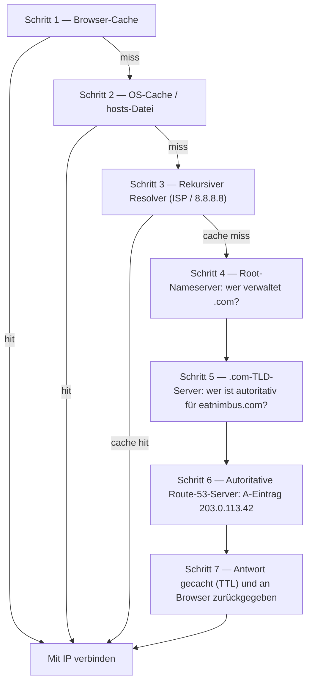

# Kapitel 12: Wie das Internet Sie findet

Maya aktualisierte `nimbus-alb-123456789.us-west-2.elb.amazonaws.com` noch ein weiteres Mal in ihrem Browser, lehnte sich dann zurück und sah an die Decke. Die Seite lud. Die App funktionierte. Aber jedes Mal, wenn sie den Link mit einem Restaurantpartner teilte, empfand sie eine kleine Verlegenheit, die sie nicht recht benennen konnte.

Diese URL war ein technisches Artefakt, kein Produkt.

---

*Das Netzwerk-Redesign aus dem letzten Kapitel war gut verlaufen. Jede Ressource war am richtigen Ort – Load Balancer in öffentlichen Subnetzen, Datenbanken in privaten verriegelt. Die Infrastruktur war sicher und korrekt segmentiert. Aber als Nimbus sich auf seinen ersten öffentlichen Launch vorbereitete, war ein neues Problem aufgetaucht: Die Load-Balancer-URL, die AWS automatisch zugewiesen hatte, sah aus wie eine System-Kennung, nicht wie ein Produkt, dem Menschen vertrauen würden. Sie brauchten einen echten Domainnamen. Und sie mussten verstehen, was zwischen dem Moment passierte, in dem jemand `eatnimbus.com` eintippte, und dem Moment, in dem die Seite erschien.*

---

Nimbus lief. Der Load Balancer hatte eine öffentliche IP. Die EC2-Instanzen hatten eine private IP. Die Datenbanken waren in privaten Subnetzen verriegelt. Priya hatte zustimmend zum Netzwerkdiagramm genickt.

Tom betrachtete die Load-Balancer-URL: `nimbus-alb-123456789.us-west-2.elb.amazonaws.com`.

„Das tippen Kunden in ihren Browser?“, fragte er.

„Das weist AWS automatisch zu“, sagte Maya.

„Das setze ich nicht auf eine Visitenkarte.“

„Ich auch nicht.“

Sie brauchten einen Domainnamen. Sie kauften `eatnimbus.com` bei einem Domain-Registrar. Jetzt mussten sie diesen Namen mit ihrer AWS-Infrastruktur verbinden.

„Woher weiß das Internet, dass `eatnimbus.com` den Load Balancer in us-west-2 meint?“, fragte Leo.

Gute Frage, Leo.

**Die Telefonbuch-Analogie**

Vor Smartphones hatte jede Stadt ein Telefonbuch. Wenn man „Marios Pizza“ erreichen wollte, prägte man sich nicht ihre Telefonnummer ein – man schlug den Namen nach, bekam die Nummer und rief an.

Das Internet hat sein eigenes Telefonbuch: das **Domain Name System (DNS)**.

DNS übersetzt menschenlesbare Namen (wie `eatnimbus.com`) in maschinenlesbare IP-Adressen (wie `203.0.113.42`). Jedes Mal, wenn Sie eine Website besuchen, schlägt Ihr Computer den Domainnamen stillschweigend im DNS nach und bekommt die IP-Adresse, mit der er sich verbinden soll.

Wenn Sie die IP-Adresse Ihres Servers änderten, würden Sie den DNS-Eintrag aktualisieren – wie das Ändern Ihrer Nummer im Telefonbuch – und das Internet würde Sie an Ihrem neuen Standort finden.

**Die vollständige DNS-Auflösungsreise**

„Aber *wie* funktioniert das Nachschlagen tatsächlich?“, fragte Leo. „Also, Schritt für Schritt. Mein Browser kennt den Namen `eatnimbus.com`. Was passiert als Nächstes?“

Die meiste Dokumentation überspringt das. Es ist wichtig.

Wenn Ihr Browser `eatnimbus.com` auflösen muss, hier jeder Hop, der Reihe nach:

**Schritt 1 — Browser-Cache**: Der Browser prüft, ob er diesen Namen kürzlich bereits aufgelöst hat. Wenn ja, verwendet er die gecachte IP. Wenn nicht, weiter.

**Schritt 2 — OS-Cache / lokaler Resolver**: Ihr Betriebssystem prüft seinen eigenen DNS-Cache und die lokale `hosts`-Datei. Wenn gefunden, fertig. Wenn nicht, leitet es an Ihren konfigurierten DNS-Resolver weiter – meist den Ihres ISPs oder einen öffentlichen wie 8.8.8.8.

**Schritt 3 — Rekursiver Resolver**: Der rekursive Resolver (Ihr ISP oder Googles 8.8.8.8) ist das Arbeitspferd. Er hat auch einen Cache. Wenn er die Antwort kennt, gibt er sie sofort zurück. Wenn nicht, startet er die eigentliche Auflösungskette.

**Schritt 4 — Root-Nameserver**: Der rekursive Resolver kontaktiert einen der 13 Root-Nameserver-Cluster (weltweit verteilt). Der Root-Server weiß nicht, wo `eatnimbus.com` ist. Aber er weiß, wer `.com`-Domains verwaltet – die `.com`-TLD-Server. Er gibt ihre Adresse zurück.

**Schritt 5 — TLD-Nameserver (Top Level Domain)**: Der rekursive Resolver kontaktiert die `.com`-TLD-Server. Die TLD-Server wissen auch nicht, wo `eatnimbus.com` ist. Aber sie wissen, welche Nameserver für `eatnimbus.com` autoritativ sind – die Server, die tatsächlich die DNS-Einträge halten. Sie geben diese Adressen zurück.

**Schritt 6 — Autoritative Nameserver**: Der rekursive Resolver kontaktiert die Nameserver von Route 53 – die autoritativen Nameserver für `eatnimbus.com`. Route 53 hat die tatsächlichen Einträge. Es gibt den A-Eintrag zurück: `eatnimbus.com → 203.0.113.42`. Diese Antwort ist autoritativ – sie ist die echte Antwort, keine gecachte.

**Schritt 7 — Antwort gecacht und zurückgegeben**: Der rekursive Resolver cacht die Antwort für die Dauer der TTL (Time-To-Live) des Eintrags. Er gibt die IP an Ihren Browser zurück. Ihr Browser cacht sie. Ihr Browser verbindet sich.



„Das sind sieben Hops, nur um eine IP-Adresse zu finden“, sagte Tom.

„Normalerweise insgesamt unter 100 Millisekunden“, sagte Priya. „Die Schritte 3 bis 6 werden auf jeder Ebene aggressiv gecacht. Für beliebte Domains werden die Schritte 4 und 5 – die Root- und TLD-Lookups – oft ganz übersprungen, weil der rekursive Resolver diese Server bereits gecacht hat. Die ganze Kette läuft normalerweise in 20–40 Millisekunden.“

„Und nach dem ersten Lookup bedeutet der Browser-Cache, dass nachfolgende Anfragen all das überspringen“, fügte Leo hinzu.

„Genau. DNS fühlt sich sofort an, weil die meisten Lookups Cache Hits sind. Die volle Kette läuft nur, wenn ein Eintrag neu ist oder seine TTL abgelaufen ist.“

**Lernen Sie Route 53 kennen**

Amazon Route 53 ist der verwaltete DNS-Dienst von AWS. Er heißt Route 53, weil Port 53 der standardmäßige DNS-Port ist. (Manchmal benennt AWS Dinge geradeheraus.)

Route 53 macht mehrere Dinge:

**Domain-Registrierung**: Sie können Domainnamen direkt über Route 53 kaufen.

**DNS-Hosting (Hosted Zones)**: Sie erstellen eine *Hosted Zone* für Ihre Domain, und Route 53 verwaltet die DNS-Einträge, die der Welt sagen, wo sie Sie finden.

**Health Checking**: Route 53 kann Ihre Endpunkte überwachen und Traffic von ungesunden wegleiten.

**Traffic-Routing-Policies**: Route 53 unterstützt mehrere Routing-Strategien über einfaches DNS hinaus – gewichtet, latenzbasiert, Geolocation, Failover.

**DNS-Einträge: Die Telefonbucheinträge**

Ein DNS-Eintrag bildet einen Namen auf ein Ziel ab. Die häufigsten Typen:

**A-Eintrag**: Bildet einen Namen auf eine IPv4-Adresse ab.
`eatnimbus.com → 203.0.113.42`

**AAAA-Eintrag**: Bildet einen Namen auf eine IPv6-Adresse ab.

**CNAME-Eintrag**: Bildet einen Namen auf einen anderen Namen ab (ein Alias).
`www.eatnimbus.com → eatnimbus.com`

**MX-Eintrag**: Gibt an, welche Server E-Mails für die Domain verarbeiten.

**TXT-Eintrag**: Speichert beliebigen Text. Häufig verwendet für Domain-Verifizierung (zu beweisen, dass die Domain Ihnen gehört) und E-Mail-Authentifizierung (SPF, DKIM).

Für Nimbus das primäre Setup:

- `eatnimbus.com` → Alias-Eintrag, der auf den Load Balancer zeigt
- `www.eatnimbus.com` → CNAME, der auf `eatnimbus.com` zeigt
- `api.eatnimbus.com` → Alias-Eintrag, der auf den API-Load-Balancer zeigt

„Moment“, sagte Tom. „Die IP des Load Balancers kann sich ändern. AWS hat das in der Dokumentation gesagt.“

Gut aufgepasst, Tom.

**Alias-Einträge: AWS' Lösung für dynamische IPs**

Load Balancer, CloudFront-Distributionen und S3-Websites haben DNS-Namen, keine statischen IP-Adressen. Die zugrundeliegenden IPs können sich ändern.

Wenn Sie einen CNAME erstellen, der auf den DNS-Namen eines Load Balancers zeigt, funktioniert das – aber Sie können CNAMEs aufgrund von DNS-Standards nicht für Root-Domains (`eatnimbus.com` ohne das `www`) verwenden.

Route 53 löst das mit **Alias-Einträgen** – einer AWS-spezifischen Erweiterung von DNS. Ein Alias-Eintrag bildet einen Namen direkt auf eine AWS-Ressource ab (Load Balancer, CloudFront-Distribution, S3-Website), und Route 53 handhabt die dynamische IP-Auflösung automatisch. Alias-Einträge können auf Root-Domain-Ebene verwendet werden. Und anders als reguläre DNS-Abfragen an externe Dienste sind Alias-Eintrag-Abfragen an AWS-Ressourcen kostenlos.

„Wir verwenden also einen Alias-Eintrag für `eatnimbus.com`, der auf den Load Balancer zeigt“, bestätigte Leo.

„Und Route 53 handhabt, welche IP der Load Balancer gerade verwendet“, fügte Priya hinzu.

„Kostenlos“, sagte Tom, plötzlich sehr interessiert. Er öffnete die Route-53-Preisseite. „Und der Rest davon?“

„Fünfzig Cent pro Hosted Zone“, sagte Leo. „Plus etwa vierzig Cent pro Million DNS-Abfragen. Für unseren aktuellen Traffic wahrscheinlich unter zwei Dollar im Monat.“

Tom schloss die Preisseite zufrieden.

**Routing-Policies: Mehr als nur „Wo ist es?“**

Hier wird Route 53 interessant. DNS ist nicht nur ein Nachschlagedienst – es kann ein Traffic-Management-Werkzeug sein.

**Simple Routing**: Ein Eintrag, ein Ziel. Standard-DNS.

**Weighted Routing**: Traffic nach Gewicht zwischen mehreren Zielen aufteilen. Während einer Migration 90 % an den neuen Server, 10 % an den alten Server senden. Passen Sie die Gewichte an, bis Sie dem neuen Server vertrauen, dann wechseln Sie auf 100 %.

**Latency-Based Routing**: Benutzer in die AWS-Region mit der niedrigsten Latenz für sie routen. Ein Benutzer in Seattle wird zu `us-west-2` geroutet. Ein Benutzer in Tokio wird zu `ap-northeast-1` geroutet. Derselbe Domainname, verschiedene Ziele.

**Geolocation Routing**: Routen basierend auf dem geografischen Standort des Benutzers. Alle europäischen Benutzer gehen zu `eu-west-1`. Alle nordamerikanischen Benutzer gehen zu `us-east-1`. Nützlich für Datensouveränität (EU-Benutzerdaten in EU-Regionen halten) oder Inhaltsanpassung (Sprache, Währung). Routing-Entscheidungen verwenden harte Grenzen – ein Benutzer ist in einem Land, einem Kontinent oder einem US-Bundesstaat, und dorthin geht er.

**Geoproximity Routing**: Routet Traffic basierend auf dem geografischen Standort der Benutzer *und* lässt Sie diese Entscheidungen mit einem **Bias**-Wert anpassen. Ein positiver Bias erweitert das geografische Gebiet, das zu einer Ressource routet – zieht mehr Traffic an. Ein negativer Bias verkleinert es. Anders als Geolocation, das harte Länder- und Kontinentgrenzen verwendet, ist Geoproximity kontinuierlich: Ein kleiner Bias-Wert kann Traffic allmählich von einer Region zur anderen verschieben, ohne feste Linien neu zu zeichnen.

Das Szenario, das die beiden unterscheidet: Wenn ein Unternehmen allmählich von `us-east-1` zu `us-west-2` migriert und Traffic schrittweise nach Westen verschieben möchte – keinen Schalter umlegen, sondern es über die Zeit hochdrehen –, ist Geoproximity mit einem wachsenden positiven Bias auf dem West-Endpunkt das richtige Werkzeug. Geolocation würde entweder alle West-Coast-Benutzer nach Oregon routen oder nicht; es hat keinen Regler. Seit Januar 2024 ist Geoproximity als reguläre Routing-Policy direkt auf DNS-Einträgen verfügbar (Konsole, API, CLI) – es erfordert nicht mehr Route 53 Traffic Flow, bleibt dort aber ebenfalls verfügbar.

**Failover Routing**: Bestimmen Sie einen primären und einen sekundären Endpunkt. Wenn der primäre den Health Check von Route 53 nicht besteht, wird Traffic automatisch zum sekundären umgeleitet. Das ist die DNS-Schicht der Disaster Recovery.

„Moment – aber *warum* würden wir Failover-Routing zu einer zweiten Region einrichten, wenn wir bereits Multi-AZ haben?“, fragte Maya. „Soll Multi-AZ nicht Ausfälle handhaben?“

Gute Frage. Multi-AZ schützt vor dem Ausfall einer einzelnen Availability Zone innerhalb einer Region – wenn ein Rechenzentrum ausfällt, übernimmt der Standby in einer anderen AZ. Aber was, wenn eine ganze AWS-Region nicht verfügbar wird? Oder was, wenn es eine regionweite Dienststörung gibt? DNS-Failover-Routing arbeitet auf einer anderen Ebene: Es routet Traffic von einer ganzen Region weg, wenn der Health Check dieser Region fehlschlägt. Multi-AZ ist Intra-Region-Resilienz. DNS-Failover ist Inter-Region-Resilienz.

**Multivalue Answer Routing**: Bis zu acht gesunde IP-Adressen für eine Abfrage zurückgeben und den Client wählen lassen. Eine einfache Alternative zu einem Load Balancer, um Traffic über mehrere Server zu verteilen.

„Route 53 ist also nicht nur ein Telefonbuch“, sagte Maya. „Es ist ein intelligentes Telefonbuch, das Anrufe basierend darauf routen kann, von wo Sie anrufen.“

„Und Sie trennt, wenn die Nummer ungesund ist“, fügte Priya hinzu.

---

**Latency-Routing plus Health Checks: Ein Gedankenexperiment**

Priya skizzierte ein Szenario auf dem Whiteboard. Angenommen, Nimbus' East-Coast-Nutzerbasis wüchse weiter, und eines Tages würde das Team einen leichtgewichtigen Stack in `us-east-1` (Northern Virginia) aufstellen – kein vollständiges Multi-Region-Active-Active-Setup, das teuer und komplex wäre, sondern einen Load Balancer und eine schreibgeschützte Gruppe von EC2-Instanzen, die statische Inhalte und Stöberseiten ausliefern. Bestellungen würden weiterhin nach Westen zur primären Datenbank in `us-west-2` gehen. Stöber-Traffic – der siebzig Prozent der Anfragen ausmachte – könnte von beiden Küsten bedient werden.

Die Route-53-Konfiguration für den Stöber-Endpunkt würde so aussehen:

```
browse.eatnimbus.com
  → Latency-Eintrag: us-east-1 ALB (mit Health Check, Set-Identifier "east")
  → Latency-Eintrag: us-west-2 ALB (mit Health Check, Set-Identifier "west")
```

(Beachten Sie, dass der Eintrag ein *Hostname* ist, `browse.eatnimbus.com` – DNS routet Namen, niemals URL-Pfade. Pfadbasiertes Routing wie `/browse` ist die Aufgabe des Load Balancers, nicht von Route 53.)

Mit Latency-Routing würde ein Benutzer in Seattle zum `us-west-2`-Endpunkt aufgelöst. Ein Benutzer in Boston würde zu `us-east-1` gehen. Route 53 misst kontinuierlich die Latenz von seiner Infrastruktur zu jeder Region und wählt pro Benutzer die schnellere.

„Aber was, wenn die West-Region ein Problem hat?“, fragte Tom. „Unsere stöbernden Benutzer in Seattle wären festgefahren.“

„Dafür sind die Health Checks da“, sagte Priya. „Jeder Latency-Eintrag bekommt einen Health Check auf seinem jeweiligen Load Balancer. Wenn der `us-west-2`-Health-Check drei aufeinanderfolgende Checks fehlschlägt, hört Route 53 auf, diesen Eintrag zurückzugeben – sogar für Benutzer, für die Oregon normalerweise schneller wäre. Seattle-Benutzer werden nach Osten geroutet, bis Oregon sich erholt.“

„Latency-Routing bestimmt also, welche Region normalerweise bevorzugt wird“, sagte Maya, „und Health Checks überschreiben diese Präferenz, wenn die bevorzugte Region ausfällt?“

„Genau. Die Latency-Policy wählt den Gewinner unter normalen Bedingungen. Health Checks entfernen einen Gewinner, der aufgehört hat zu funktionieren.“

Leo dachte über das Ausfallszenario nach. „Und die TTL auf diesen Einträgen?“

„Sechzig Sekunden“, sagte Priya. „Drei fehlgeschlagene Checks in Dreißig-Sekunden-Intervallen, um es auszulösen – bis zu neunzig Sekunden, um den Ausfall zu erkennen – dann bis zu sechzig Sekunden, bis DNS-Resolver die Änderung aufnehmen.“

„Zweieinhalb Minuten im schlimmsten Fall“, sagte Leo.

„Deshalb senkt man die TTL, bevor es einem wichtig ist, nicht danach.“

Diese Kombination – Latency-Routing mit Health Checks auf jedem Eintrag – ist eine der mächtigsten Route-53-Konfigurationen für Multi-Region-Deployments. Benutzer gehen immer zur schnellsten gesunden Region. Das System heilt sich selbst, wenn eine Region Probleme hat. Und das Ganze ist DNS: keine zusätzliche Infrastruktur, keine Proxy-Server, keine Load Balancer zwischen Regionen.

---

**Der Health-Check-Ausfall-Vorfall**

Nimbus' Staging-Umgebung gab ihnen eine versehentliche Demonstration des Failover-Routings.

Sie hatten Route-53-Health-Checks auf dem Staging-Load-Balancer als Test konfiguriert – die Prüfung des `/health`-Endpunkts alle 30 Sekunden. An einem Freitagnachmittag pushte Leo ein Deployment nach Staging, das einen Bug hatte: Der Health-Endpunkt begann, 500-Fehler zurückzugeben. Es bestand seine lokalen Tests, brach aber auf dem Server.

Route 53 registrierte die Fehler. Nach drei aufeinanderfolgenden fehlgeschlagenen Checks markierte es den Endpunkt als ungesund. Der Failover-Eintrag aktivierte sich und routete Staging-Traffic auf eine schreibgeschützte Ausweichseite, die „Wartung im Gange“ sagte.

Leos erster Alarm war eine Slack-Nachricht von einem QA-Ingenieur: „Staging zeigt die Wartungsseite.“

Leo prüfte das Deployment. Die 500-Fehler waren in den Logs offensichtlich. Er rollte das Deployment zurück. Innerhalb von 90 Sekunden, nachdem der Health-Endpunkt 200er zurückgab, evaluierte Route 53 den Check neu, sah drei aufeinanderfolgende Erfolge und führte Traffic zurück zum Staging-Load-Balancer. Die Wartungsseite verschwand.

Gesamtzeit auf der Wartungsseite: sieben Minuten.

„Das war das System, das korrekt funktionierte“, sagte Priya.

„Ich weiß“, sagte Leo. „Der beängstigende Teil ist, darüber nachzudenken, was ohne den Health Check passiert wäre. Die 500-Fehler wären an echte Benutzer gegangen.“

„In der Produktion hätte der Health Check auf die sekundäre Region oder die statische Fehlerseite umgeschaltet. Benutzer hätten eine gewartete Erfahrung statt Fehler gesehen.“

„Wie lange dauert Failover tatsächlich?“, fragte Maya. „Von dem Moment, in dem der Health Check fehlschlägt, bis DNS anfängt, anders zu routen?“

„Das Health-Check-Intervall ist standardmäßig 30 Sekunden. Drei aufeinanderfolgende Fehler, um das Failover auszulösen. Das sind bis zu 90 Sekunden, um das Problem zu erkennen. Dann die DNS-TTL – wenn sie 60 Sekunden ist, ist die Propagierung eine weitere Minute.“

„Im schlimmsten Fall also etwa drei Minuten?“

„So ungefähr. Deshalb will man die TTL auf kritischen Einträgen niedrig und das Health-Check-Intervall so kurz, wie das Budget erlaubt.“

---

**Health Checks: Um Ausfälle herumrouten**

„Und was ist, wenn jemand versucht einzubrechen?“, sagte Priya. „DNS ist öffentlich. Jeder kann nachschlagen, wohin `eatnimbus.com` zeigt. Das bedeutet, ein Angreifer weiß genau, welche IP er angreifen soll.“

„Das stimmt“, sagte Leo. „Aber die IP, die sie finden, ist die IP des Load Balancers. Der ALB ist das Einzige mit einer öffentlichen Adresse. Alles dahinter – EC2, RDS, ElastiCache – ist in privaten Subnetzen. DNS sagt ihnen die Eingangstür. Es sagt ihnen nicht, was dahinter ist.“

Route 53 kann Ihre Endpunkte mit Health Checks überwachen. Wenn ein Endpunkt ausfällt, kann Route 53:

- Ihn aus DNS-Antworten entfernen (aufhören, Traffic dorthin zu senden)
- Ein Failover zu einem Backup-Endpunkt auslösen
- Einen Alarm über CloudWatch senden

Health Checks sind das Bindeglied zwischen DNS-Routing und tatsächlicher Anwendungsgesundheit. In einer Failover-Konfiguration: Route 53 überwacht den primären Endpunkt alle 30 Sekunden. Wenn drei aufeinanderfolgende Checks fehlschlagen, beginnt Route 53, die Adresse des sekundären Endpunkts zurückzugeben. Keine dieser Zahlen ist fest: 30 Sekunden ist das Standardintervall (eine kostenpflichtige „schnelle“ Option prüft alle 10 Sekunden), und der Fehlerschwellwert ist standardmäßig 3 aufeinanderfolgende Checks, aber von 1 bis 10 konfigurierbar.

Das ist nicht augenblicklich – DNS hat Propagierungszeit. Sobald Route 53 einen DNS-Eintrag ändert, müssen DNS-Resolver auf der ganzen Welt die Änderung aufnehmen, was je nach TTL-Einstellungen Sekunden bis Minuten dauern kann.

**TTL: Der DNS-Cache**

DNS-Antworten werden auf mehreren Ebenen gecacht – an Ihrem Router, bei Ihrem ISP, in Ihrem Browser. Die **TTL (Time-To-Live)** eines DNS-Eintrags sagt Caches, wie lange sie sich die Antwort merken sollen, bevor sie erneut prüfen.

Hohe TTL (1 Stunde oder mehr): Weniger DNS-Abfragen, weniger Last auf Route 53, aber Änderungen brauchen länger zur Propagierung.

Niedrige TTL (60 Sekunden oder weniger): Änderungen propagieren schnell, aber es sind mehr DNS-Abfragen nötig.

Senken Sie vor einer geplanten Migration (DNS aktualisieren, um auf einen neuen Server zu zeigen) Ihre TTL einen Tag im Voraus auf 60 Sekunden. Wenn Sie dann die Änderung vornehmen, propagiert sie in etwa einer Minute. Nach der Migration erhöhen Sie sie wieder auf den normalen Wert.

„Ich habe es schon deployt – oh.“ Leo hatte den DNS-Eintrag aktualisiert, bevor er die TTL gesenkt hatte. Er hatte seinen Fehler bemerkt und angefangen zu zählen: Die alte TTL war eine Stunde. Manche Benutzer würden für die nächsten sechzig Minuten den alten Server bekommen.

„Wenn wir sie nur während der Migration und nicht davor senken“, sagte Leo langsam, „bedeutet die alte TTL, dass manche Benutzer eine Stunde lang den alten Server sehen.“

„Genau“, sagte Priya. „DNS-Migrationen erfordern Planung vor der Migration, nicht nur währenddessen.“

Sie fragen sich vielleicht: Wenn die TTL auf eine Stunde gesetzt ist, bedeutet das, dass jeder Benutzer nach einer DNS-Änderung eine volle Stunde wartet, bevor er den neuen Server sieht? Nicht ganz. TTL bedeutet, dass Resolver nicht erneut prüfen, bis die TTL abläuft. Wenn der DNS-Resolver eines Benutzers den alten Wert vor 55 Minuten mit einer 1-Stunden-TTL gecacht hat, bekommt er den neuen Wert in 5 Minuten. Wenn er ihn vor 5 Minuten gecacht hat, wartet er 55 Minuten. Im Durchschnitt sehen Benutzer die Änderung innerhalb der Hälfte der TTL-Dauer. Deshalb ist das Senken der TTL im Voraus so wichtig: Es verkleinert das Worst-Case-Propagierungsfenster, bevor die Änderung passiert.

---

**Private Hosted Zones: Internes DNS**

Priya brachte zwei Wochen, nachdem die öffentliche Domain live war, eine neue Anforderung auf.

„Unsere EC2-Instanzen müssen die Datenbank erreichen“, sagte sie. „Im Moment verwenden sie den DNS-Namen des RDS-Endpunkts – `nimbus-prod.abc123.us-west-2.rds.amazonaws.com`. Das funktioniert, aber es ist ein öffentlicher DNS-Name. Wenn wir jemals unsere Datenbankkonfiguration ändern wollen, müssen alle Anwendungs-Config-Dateien aktualisiert werden.“

„Wir könnten einen privaten DNS-Namen verwenden“, sagte Leo. „Wie `db.nimbus.internal`. Etwas, das unsere Dienste intern verwenden und das auf den aktuellen Datenbank-Endpunkt zeigt.“

„Genau. Route 53 Private Hosted Zones.“

Eine **Private Hosted Zone** ist eine DNS-Domain, die nur innerhalb Ihrer VPC aufgelöst wird. Externe DNS-Abfragen für `nimbus.internal` bekommen keine Antwort. Aber von innerhalb der VPC wird `db.nimbus.internal` zum RDS-Endpunkt aufgelöst.

Sie richteten es ein:

- Private Hosted Zone: `nimbus.internal`
- CNAME-Eintrag: `db.nimbus.internal → nimbus-prod.abc123.us-west-2.rds.amazonaws.com`
- CNAME-Eintrag: `cache.nimbus.internal → nimbus-cache.abc123.usw2.cache.amazonaws.com`
- A-Eintrag: `api.nimbus.internal → 10.0.10.5` (interne EC2-IP – A-Einträge bilden Namen auf IP-Adressen ab; CNAMEs bilden Namen auf andere Namen ab. Hier in Ordnung, weil diese Instanz eine statische private IP behält; für alles hinter Auto Scaling würden Sie stattdessen auf einen Load Balancer zeigen)

Jetzt las die Anwendungs-Config:

```
DATABASE_HOST=db.nimbus.internal
CACHE_HOST=cache.nimbus.internal
```

Als sie zu einer neuen RDS-Instanz migrierten, aktualisierten sie einen DNS-Eintrag. Kein Anwendungs-Deployment erforderlich.

„Deshalb ist privates DNS auch während einer Datenbankmigration wichtig“, sagte Priya. „Du aktualisierst `db.nimbus.internal`, damit es auf den neuen Endpunkt zeigt. Der Traffic verschiebt sich. Der alte Endpunkt bleibt während des TTL-Fensters verfügbar. Keine Änderungen an der Anwendungs-Config.“

**Die Geschichte des internen DNS-Debuggings**

Drei Wochen später deployte Leo einen neuen Dienst – einen Background Worker – und er konnte die Datenbank nicht erreichen. Der Worker war in derselben VPC, demselben privaten Subnetz wie die API-Server. Die API-Server konnten die Datenbank erreichen. Der Worker konnte es nicht.

Er prüfte die Security Groups. Die Security Group des Workers hatte eine ausgehende Regel für PostgreSQL. Die Datenbank-Security-Group hatte eine eingehende Regel von der Security Group des Workers. Alles sah korrekt aus.

Er führte `nslookup db.nimbus.internal` von der Worker-Instanz aus.

Keine Antwort.

„Der DNS-Lookup schlägt fehl“, sagte er zu Priya.

Sie sah sich die VPC-Konfiguration der Worker-Instanz an. „In welcher VPC ist der Worker tatsächlich? Private Hosted Zones sind mit VPCs verknüpft – wenn die Instanz nicht in einer verknüpften VPC ist, existiert die Zone für sie einfach nicht.“

„Sie ist in der Haupt-VPC. Genau wie alles andere.“

„Ist sie das?“

Private Hosted Zones müssen explizit mit jeder VPC verknüpft werden, die sie bedienen – die Verknüpfung ist pro VPC, niemals pro Subnetz. Priya hatte die Haupt-VPC verknüpft, als sie die Zone erstellte. Aber Leo hatte den Worker versehentlich in eine Test-VPC deployt, die er für ein anderes Experiment erstellt hatte. Andere VPC. Nicht mit der Private Hosted Zone verknüpft.

„Der Worker ist in der falschen VPC“, sagte Priya.

„Ich habe es schon deployt – oh.“ Leo verschob den Worker in die korrekte VPC. DNS löste auf. Der Worker verband sich mit der Datenbank.

„Eine VPC“, sagte Leo und machte sich eine Notiz. „Es sei denn, wir haben einen Grund für mehr als eine.“

---

**DNSSEC: DNS-Antworten authentifizieren**

„Haben wir über DNS-Spoofing nachgedacht?“, fragte Priya. „Was, wenn jemand unsere DNS-Abfrage abfängt und eine gefälschte IP zurückgibt? Die Browser unserer Benutzer würden sich mit dem Server des Angreifers verbinden statt mit unserem.“

**DNSSEC (DNS Security Extensions)** löst das, indem es DNS-Einträge kryptografisch signiert. Wenn eine DNS-Antwort eine DNSSEC-Signatur enthält, kann der Resolver verifizieren, dass die Antwort vom autoritativen Nameserver kam und nicht manipuliert wurde.

Route 53 unterstützt DNSSEC-Signierung für Public Hosted Zones. Der Prozess umfasst:

1. DNSSEC auf der Hosted Zone in Route 53 aktivieren
2. Route 53 generiert einen Key Signing Key (KSK), gespeichert in KMS
3. Route 53 signiert alle Einträge mit dem Zone Signing Key
4. Sie fügen einen DS-Eintrag (Delegation Signer) beim Registrar der übergeordneten Domain (.com-TLD) hinzu
5. Resolver, die DNSSEC unterstützen, können nun die Authentizität von Antworten verifizieren

„Wie häufig ist DNS-Spoofing?“, fragte Leo.

„Im öffentlichen Internet selten, aber möglich“, sagte Priya. „Die meisten ISP-Resolver unterstützen heute DNSSEC-Validierung. DNSSEC zu aktivieren kostet nichts und fügt eine bedeutsame Schicht an Authentizität hinzu.“

„Wie viel kostet das pro Monat?“, fragte Tom.

„Die DNSSEC-Signierung selbst zu aktivieren ist in Route 53 kostenlos“, sagte Priya. „Die einzigen realen Kosten sind der KMS-Schlüssel, der den Key-Signing-Key hält: 1 $/Monat, plus KMS-API-Aufrufe – und ein Schlüssel kann über mehrere Hosted Zones geteilt werden. Der Schutz gegen DNS-Hijacking-Angriffe ist in unserem Maßstab praktisch kostenlos.“

Tom aktivierte es vor dem Mittagessen.

---

**Route 53 Resolver: Hybrides DNS**

Als Nimbus schließlich seine AWS-VPC über ein VPN mit seinem On-Premises-Entwicklungsnetzwerk verband, tauchte ein neues Problem auf: Die On-Premises-Server mussten AWS-private DNS-Namen auflösen (wie `db.nimbus.internal`), und die AWS-Ressourcen mussten On-Premises-Hostnamen auflösen (wie `jenkins.corp.nimbus.local`).

DNS-Auflösung überquert standardmäßig keine Netzwerkgrenzen. AWS-Ressourcen lösen DNS über Route 53 Resolver auf (in jeder VPC eingebaut). On-Premises-Server verwenden ihre eigenen DNS-Server. Keiner kann die Einträge des anderen sehen.

**Route 53 Resolver Endpoints** überbrücken diese Lücke:

**Inbound Endpoints**: On-Premises-DNS-Server können Abfragen für AWS-gehostete DNS-Zonen an eine Inbound-Endpoint-IP in Ihrer VPC weiterleiten. Route 53 Resolver verarbeitet die Abfrage und gibt das Ergebnis zurück.

**Outbound Endpoints**: Wenn EC2-Instanzen On-Premises-Hostnamen auflösen müssen, leitet der Resolver diese Abfragen über den Outbound Endpoint an On-Premises-DNS-Server weiter.

„Es ist also wie ein Übersetzungsdienst“, sagte Maya. „Dein AWS-DNS und dein On-Premises-DNS sprechen nicht direkt miteinander. Die Resolver Endpoints agieren als Vermittler.“

„Genau. Deine On-Premises-Server können jetzt `db.nimbus.internal` auflösen. Deine EC2-Instanzen können `jenkins.corp.nimbus.local` auflösen. Beide Seiten sehen DNS-Namen aus beiden Welten.“

Für Nimbus wurde das relevant, als das Entwicklungsteam Integrationstests aus ihrem Büro gegen eine Staging-Umgebung in AWS ausführen wollte. Ohne Resolver Endpoints hätten sie manuell hosts-Dateien bearbeitet. Mit ihnen funktionierte internes DNS einfach über das VPN hinweg.

Die Architektur für Resolver Endpoints:

- **Inbound Endpoint**: Zwei ENIs (Elastic Network Interfaces), erstellt in zwei verschiedenen AZs in Ihrer VPC. Jede bekommt eine private IP. Sie konfigurieren Ihren On-Premises-DNS-Server so, dass er Abfragen für Ihre AWS-gehosteten Zonen an diese IPs weiterleitet. Traffic reist durch Ihr VPN oder Direct Connect.
- **Outbound Endpoint**: Zwei ENIs in zwei AZs. Sie erstellen Weiterleitungsregeln: „Abfragen für `corp.nimbus.local` gehen an diese On-Premises-DNS-Server-IPs.“ EC2-Instanzen verwenden automatisch den Resolver, der Ihre Weiterleitungsregeln konsultiert und die Abfrage On-Premises sendet.

„Warum zwei ENIs pro Endpoint?“, fragte Leo.

„Hochverfügbarkeit“, sagte Priya. „Wenn eine AZ die Netzwerkverbindung verliert, funktioniert die andere Endpoint-IP immer noch. Dasselbe Prinzip wie bei NAT Gateways.“

„Wie viel kostet das pro Monat?“, fragte Tom.

Resolver Endpoints kosten ungefähr 0,125 $ pro Stunde **pro Elastic Network Interface**, und jeder Endpoint erfordert für die Verfügbarkeit mindestens zwei ENIs – ein realistisches Minimum ist also etwa 180 $ pro Monat pro Endpoint, plus 0,40 $ pro Million DNS-Abfragen. Für ein Team, das hybrides DNS verwendet, um interne Namen aufzulösen, sind die Kosten moderat – und es eliminiert die Notwendigkeit, hosts-Dateien über mehrere Entwicklermaschinen und CI/CD-Systeme hinweg zu pflegen.

„Wir könnten die Hostnamen einfach in die hosts-Dateien setzen“, schlug Leo vor.

„Auf jeder Entwicklermaschine, jedem CI-Runner, bei jedem neuen Onboarding“, sagte Priya. „Jedes Mal, wenn sich irgendetwas ändert.“

„Der Endpoint ist es wert“, sagte Leo.

„Ist er.“

## Stärken und Grenzen

**Route 53 ist die richtige Wahl für**: das Registrieren und Verwalten von Domainnamen vollständig innerhalb von AWS; das Routen von Traffic basierend auf Latenz, Geolocation oder gewichteter Verteilung über mehrere Endpunkte; Health-Check-basiertes Failover zwischen Regionen oder zwischen einem primären und einem Disaster-Recovery-Endpunkt; die Integration von DNS mit anderen AWS-Diensten über Alias-Einträge; Private Hosted Zones für interne Service Discovery.

**Wenn Route 53 nicht das ist, was Sie brauchen**: Route 53 ist ein DNS-Dienst, kein Load Balancer. Wenn Sie Traffic zwischen mehreren Servern oder Containern innerhalb einer Region verteilen müssen, verwenden Sie einen Application Load Balancer – Route 53 kann kein gewichtetes Round-Robin auf Verbindungsebene so wie ein Load Balancer. Latenzbasiertes Routing über Regionen fügt Kosten und betriebliche Komplexität hinzu, die nur Sinn ergeben, wenn Ihre Benutzer wirklich global verteilt sind und Millisekunden für die Conversion zählen. Für die meisten Single-Region-Anwendungen ist ein einzelner Alias-Eintrag, der auf einen ALB zeigt, die gesamte Route-53-Konfiguration, die Sie brauchen.

## Zusammenfassung

Von `nimbus-alb-123456789.us-west-2.elb.amazonaws.com` zu `eatnimbus.com` zu kommen fühlte sich wie eine kleine Sache an. War es nicht. DNS ist das Adresssystem, auf dem das gesamte Internet läuft, und Route 53 gibt Ihnen Werkzeuge, um dieses System nicht nur für Lookups zu nutzen, sondern für Traffic-Management und Resilienz.

- **DNS** übersetzt Domainnamen in IP-Adressen – das Telefonbuch des Internets.
- **Route 53** ist der verwaltete DNS-Dienst von AWS: Domain-Registrierung, DNS-Hosting, Health Checks und Routing-Policies.
- **A-Einträge** bilden Namen auf IPv4-Adressen ab. **CNAMEs** bilden Namen auf andere Namen ab. **Alias-Einträge** bilden Namen auf AWS-Ressourcen ab (Load Balancer, CloudFront, S3).
- Verwenden Sie Alias-Einträge (nicht CNAMEs) für Root-Domains und für Ressourcen mit dynamischen IPs.
- Routing-Policies gehen über einfaches DNS hinaus: **Weighted** (Traffic-Aufteilung), **Latency-Based** (Leistung), **Geolocation** (Datensouveränität – harte Länder-/Kontinentgrenzen), **Geoproximity** (entfernungsbasiert mit einem Bias-Regler – allmähliche Traffic-Verschiebung), **Failover** (Disaster Recovery).
- **Private Hosted Zones** bieten internes DNS für VPC-Ressourcen – Service-zu-Service-Kommunikation per Name, nicht hartcodierte IP.
- **DNSSEC** signiert Einträge kryptografisch und schützt vor DNS-Spoofing.
- **Route 53 Resolver Endpoints** überbrücken hybride Netzwerke – AWS- und On-Premises-DNS können die Namen des jeweils anderen auflösen.

## Prüfungstipps

*SAA-C03 Domäne: Design High-Performing Architectures (Domäne 3, Aufgabe 3.4)*

- **Alias vs. CNAME**: Alias-Einträge können auf der Root-Domain verwendet werden; CNAMEs nicht. Alias-Einträge zu AWS-Ressourcen sind kostenlos; CNAME-DNS-Abfragen werden berechnet. Wenn die Prüfung nach dem Abbilden einer Root-Domain auf einen Load Balancer fragt → Alias-Eintrag.
- **Anwendungsfälle für Routing-Policies** (häufige Prüfungsszenarien):
  - „Traffic schrittweise auf eine neue Version migrieren“ → Weighted Routing
  - „Benutzer in die nächstgelegene AWS-Region routen“ → Latency-Based Routing
  - „EU-Benutzerdaten in EU-Regionen halten“ → Geolocation Routing
  - „Automatisches DNS-Failover, wenn der primäre Endpunkt ausfällt“ → Failover Routing mit Health Checks
  - „Traffic schrittweise in eine neue Region verschieben“ oder „mehr Traffic für unser EU-Deployment anziehen“ → Geoproximity Routing mit positivem Bias
- **Geoproximity vs. Geolocation**: Geolocation routet nach Land/Kontinent des Benutzers mit harten Grenzen. Geoproximity routet nach geografischer Entfernung mit einem konfigurierbaren Bias – verwenden Sie es, wenn Sie Traffic schrittweise in eine neue Region verschieben oder mehr Benutzer zu einem bestimmten Deployment anziehen müssen. Seit Januar 2024 als reguläre Routing-Policy auf Einträgen verfügbar (Traffic Flow nicht mehr erforderlich).
- **Route-53-Health-Checks**: Können HTTP-/HTTPS-/TCP-Endpunkte prüfen und können CloudWatch-Alarme auslösen. Die Prüfung verwendet diese in Disaster-Recovery-Szenarien.
- **TTL und Propagierung**: Wissen Sie, dass die TTL steuert, wie lange DNS-Resolver einen Eintrag cachen. Kurze TTL = schnellere Änderungen. Prüfungsszenario: „Das Team hat DNS aktualisiert, aber Benutzer treffen immer noch den alten Server“ → TTL zu hoch.
- **Private Hosted Zones**: Route 53 kann DNS-Einträge erstellen, die nur innerhalb einer VPC aufgelöst werden. Die Prüfung verwendet das für interne Service Discovery (z. B. `database.internal`, das zu einem privaten RDS-Endpunkt aufgelöst wird).
- Route 53 ist **global** – es wird nicht in einer Region bereitgestellt. Beim Erstellen von Hosted Zones ist keine Regionsauswahl nötig.
- **Route 53 Resolver Endpoints**: Verwendet in hybriden Szenarien, in denen On-Premises- und AWS-DNS die Namen des jeweils anderen auflösen müssen. Inbound Endpoint für On-Premises → AWS. Outbound Endpoint für AWS → On-Premises.

## Übungen

**Übung 1 – Erinnerung**

Erklären Sie den Unterschied zwischen einem CNAME-Eintrag und einem Alias-Eintrag. Wann würden Sie jeden verwenden?

*(Hinweis: Berücksichtigen Sie die Einschränkungen für CNAME bei Root-Domains und das Verhalten von Alias-Einträgen mit dynamischen AWS-Ressourcen.)*

**Übung 2 – SAA-C03-Szenario**

*Szenario*: Ein Medienunternehmen betreibt eine Website aus zwei AWS-Regionen: `us-east-1` (primär) und `eu-west-1` (sekundär). Das Team möchte, dass Traffic automatisch zu `eu-west-1` geroutet wird, wenn die primäre Region nicht verfügbar wird. Das Unternehmen möchte außerdem verifizieren, dass dieser Failover-Mechanismus korrekt funktioniert, ohne die primäre Region tatsächlich abzuschalten.

Welche Route-53-Konfiguration erfüllt diese Anforderungen am BESTEN?

A) Weighted Routing mit 100 % Gewicht auf `us-east-1` und 0 % Gewicht auf `eu-west-1`  
B) Latency-Based Routing mit Health Checks auf beiden Endpunkten  
C) Failover Routing mit einem Health Check auf dem primären Endpunkt und einem sekundären Eintrag, der auf `eu-west-1` zeigt  
D) Geolocation Routing mit Nordamerika, das auf `us-east-1` zeigt, und Europa, das auf `eu-west-1` zeigt

**Hinweis 1**: Die Anforderung ist automatisches Failover, wenn der primäre ausfällt. Welche Routing-Policy ist genau dafür konzipiert?

**Hinweis 2**: „Testen, ohne die primäre Region abzuschalten“ – Health Checks können zum Testen manuell auf „ungesund“ gesetzt werden.

**Hinweis 3**: Latency-Based Routing optimiert für Geschwindigkeit, nicht für Failover.

**Antwort**: C

**Erläuterung**: Failover Routing ist genau für diesen Anwendungsfall konzipiert. Der primäre Eintrag zeigt auf `us-east-1` mit einem Health Check. Der sekundäre Eintrag zeigt auf `eu-west-1`. Wenn der Health Check fehlschlägt, bedient Route 53 automatisch den sekundären Eintrag. Health Checks können zum Testen manuell zum Fehlschlagen gezwungen werden, ohne die primäre Region tatsächlich zu stören.

**Warum nicht A?** Weighted Routing mit 100 %/0 % ist effektiv statisch – es schaltet nicht automatisch um, wenn der primäre ausfällt.

**Warum nicht B?** Latency-Einträge *mit Health Checks* hören tatsächlich auf, einen ungesunden Endpunkt zurückzugeben, also würde B einen echten Ausfall überstehen. Aber es ändert das normale Traffic-Muster (Benutzer würden nach Latenz auf Regionen aufgeteilt, nicht primär/sekundär wie gefordert), und es gibt keine saubere Möglichkeit, Failover zu *testen*: Man müsste den Health Check des primären in der Produktion tatsächlich fehlschlagen lassen. Failover Routing modelliert die genannte Absicht – bestimmter primärer, bestimmter sekundärer, testbar durch Erzwingen des Health-Check-Zustands.

**Warum nicht D?** Geolocation Routing routet nach Benutzerstandort, nicht nach Endpunktgesundheit. Europäische Benutzer würden auf `eu-west-1` festhängen, selbst wenn `us-east-1` gesund ist, und nordamerikanische Benutzer würden nicht auf `eu-west-1` umschalten, selbst wenn `us-east-1` ausfällt.

*SAA-C03 Domäne: Design High-Performing Architectures – Aufgabe 3.4*

**Übung 3 – Architektur-Herausforderung** *(Optional)*

Nimbus expandiert international. Sie möchten, dass `eatnimbus.com` für Benutzer an der Westküste, der Ostküste und in Australien schnell lädt. Sie haben auch eine regulatorische Anforderung: Bestellungen, die von europäischen Benutzern aufgegeben werden, müssen von Servern in der EU verarbeitet werden.

Entwerfen Sie eine Route-53-Routing-Strategie, die beide Anforderungen adressiert. Welche Routing-Policy oder Kombination von Policies würden Sie verwenden? Welche Infrastruktur in jeder Region würden Sie benötigen?

*(Es gibt keine einzige richtige Antwort. Das Ziel ist es, Multi-Region-Routing-Design zu üben.)*

## Post-Credits-Szene

`eatnimbus.com` war live.

Maya hatte es in ihren Browser getippt, und die Nimbus-Bestellseite hatte geladen. Sie hatte Arepa aus dem Restaurant ihrer eigenen Familie bestellt, nur um den Ablauf zu testen. Die Bestellung war durchgegangen. Die Küche hatte sie erhalten.

Sie lehnte sich zurück.

Tom las bereits die Route-53-Health-Check-Logs. „Die Antwortzeit ist 18 Millisekunden von den us-west-2-Checkern.“

„Ist das schnell?“, fragte Maya.

„Für DNS? Ja. Für Seattle-Benutzer auch – sie sind praktisch direkt nebenan zu Oregon.“

„Aber für einen Benutzer in Boston?“

Tom sah sich den Latenzgraphen an. „Etwa 80 Millisekunden.“

Maya dachte darüber nach. „Wenn unsere East-Coast-Partner weiter wachsen und unsere Server in Oregon sind…“

„Reist jede Anfrage von Boston nach Oregon und zurück“, sagte Leo vom anderen Ende des Raums. „Lichtgeschwindigkeit. Physik kann man nicht schlagen.“

„Wir brauchen also Server näher an Boston.“

„Oder etwas näher an Boston, das in ihrem Namen Inhalte ausliefert.“

Dieser Gedanke hing in der Luft.

Im nächsten Kapitel: die Lagerhäuser, die Nimbus' Inhalte eine Millisekunde von jedem Benutzer überall entfernt platzieren.
