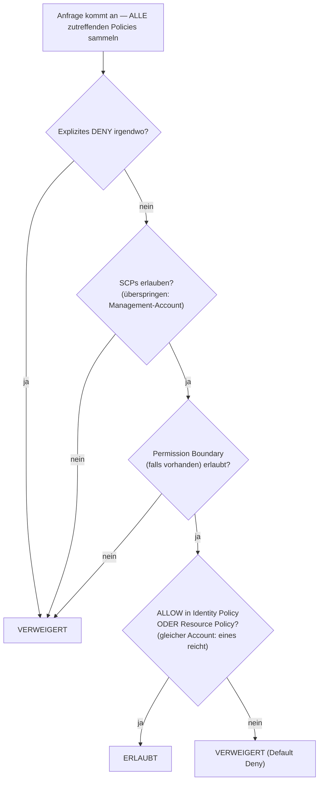

# Kapitel 14: Wer darf was tun

Die neuen Ingenieure fingen am Montag an. Soo-Jin und Rafael. Maya hatte über ihre erste Woche nachgedacht – worauf sie Zugriff brauchen würden, was sie nicht anfassen sollten und ob das aktuelle IAM-Setup überhaupt bereit war, auf zwei weitere Personen erweitert zu werden.

Sie saß mit einem Kaffee da, bevor sich das Büro füllte, und machte eine Liste.

---

*CloudFront war deployt. Die Cache-Hit-Raten waren gut. Die Leistung war oben. Aber als das Team sich darauf vorbereitete, neue Ingenieure an Bord zu holen, tauchte ein leises Problem auf: Die IAM-Konfiguration war von Leuten in Eile gebaut worden. Access Keys lagen in Config-Dateien. Manche Rollen hatten mehr Berechtigungen, als sie brauchten. Und zwei neuen Personen sollten gleich Anmeldedaten für ein Produktionssystem übergeben werden, das nicht für mehrere Benutzer konzipiert worden war.*

---

Tom hatte die Access Keys in einer Textdatei offen, bereit zum Einfügen.

„Was machst du da?“, fragte Priya.

„Die EC2-Instanz muss Config-Dateien aus S3 lesen. Ich packe die Anmeldedaten in die Serverkonfiguration.“

Sie sah einen Moment auf den Bildschirm. „Schließ diese Datei.“

„Ich wollte nur—“

„Wenn jemand in diesen Server eindringt“, sagte sie, „bekommt er diese Schlüssel. Und diese Schlüssel berühren alles, was der IAM-Benutzer berühren darf. Was wahrscheinlich mehr ist als nur S3.“

Tom schloss die Datei.

„Es gibt einen besseren Weg“, sagte sie. „Der Server selbst kann eine Rolle haben. Stell dir das wie eine Berufsbezeichnung vor – die Instanz braucht keine Anmeldedaten, weil das System bereits weiß, was sie ist und was sie tun darf.“

Tom sah skeptisch aus. „Der Server authentifiziert sich also selbst?“

„Ja. Ohne Passwort. Ohne Schlüssel in einer Config-Datei. Ohne irgendetwas, das versehentlich in Git committet werden kann.“

Dieser letzte Teil traf. Tom hatte vor zwei Wochen selbst beinahe einen Access Key ins Repo committet – im letzten Moment im Diff erwischt. Er öffnete einen neuen Browser-Tab.

**IAM noch einmal: Das vollständige Bild**

Kapitel 3 führte IAM ein: Benutzer, Gruppen, Rollen und Policies. Jetzt ist es Zeit, tiefer zu gehen.

IAM-Policies sind JSON-Dokumente, die festlegen, welche Aktionen auf welchen Ressourcen erlaubt oder verweigert sind. Sie sehen so aus:

```json
{
  "Version": "2012-10-17",
  "Statement": [
    {
      "Effect": "Allow",
      "Action": [
        "s3:GetObject",
        "s3:PutObject"
      ],
      "Resource": "arn:aws:s3:::nimbus-assets/*"
    }
  ]
}
```

Diese Policy erlaubt das Lesen und Schreiben von Objekten im `nimbus-assets`-Bucket und nichts anderes. Kein Löschen. Kein Auflisten von Buckets. Keine andere S3-Operation. Keinen anderen AWS-Dienst.

Das ist der korrekte Weg, Berechtigungen zu gewähren: spezifische Aktionen, spezifische Ressourcen.

**Das Problem mit „Administrator Access“**

AWS Managed Policies wie `AdministratorAccess` sind dafür konzipiert, schnell loszulegen. Sie sind nicht dafür konzipiert, Produktionssysteme mit echten Teammitgliedern zu betreiben.

`AdministratorAccess` gewährt jede Aktion auf jeder Ressource. Wenn ein Teammitglied mit dieser Policy einen Fehler macht – versehentlich einen S3-Bucket löscht, die falsche EC2-Instanz terminiert, Security-Group-Regeln ändert –, kann AWS nichts tun, um es aufzuhalten. Die Berechtigung wurde gewährt.

Wenn die Anmeldedaten eines Teammitglieds kompromittiert werden (Phishing-Angriff, geleakter Access Key, Laptop-Diebstahl), hat der Angreifer Administrator-Zugriff auf alles in Ihrem AWS-Account.

„Was sollte Soo-Jin also haben?“, fragte Leo.

„Was muss Soo-Jin tun?“, antwortete Priya.

„Die API deployen. Logs prüfen. Sonst nichts.“

„Dann bekommt sie: die Fähigkeit, in die Code-Pipeline zu pushen, Lesezugriff auf CloudWatch Logs und sonst nichts.“

„Das ist… sehr spezifisch.“

„Ja. Das ist der Punkt.“

**IAM-Rollen: Identitäten für Dienste**

Kapitel 3 führte Rollen als eine Möglichkeit für EC2-Instanzen ein, auf AWS-Dienste zuzugreifen, ohne Anmeldedaten zu speichern. Machen wir das konkret.

Ihre EC2-Instanzen, die die Nimbus-API betreiben, müssen:

- Aus DynamoDB lesen (das Menü)
- In DynamoDB schreiben (Bestellungen)
- Objekte in S3 ablegen (Belege, Uploads)
- Logs in CloudWatch schreiben
- Geheimnisse aus Secrets Manager lesen

Statt einen Benutzer mit einem Access Key zu erstellen und diesen Schlüssel auf der EC2-Instanz zu speichern (ein Sicherheitsalbtraum – Access Keys können von jedem mit SSH-Zugriff gelesen werden), erstellen Sie eine **IAM-Rolle** für die EC2-Instanz mit genau diesen Berechtigungen.

„Moment – aber *warum* würden wir das so machen?“, fragte Maya. „Die EC2-Instanz betreibt bereits unseren Code. Warum nicht dem Code einfach einen Access Key geben?“

Weil Access Keys statische Anmeldedaten sind, die irgendwo leben – in einer Config-Datei, einer Umgebungsvariable, einem Git-Repository, wenn jemand einen Fehler macht. Sie können kopiert, exfiltriert, versehentlich committet werden. Eine IAM-Rolle funktioniert anders: Die EC2-Instanz nimmt die Rolle automatisch an. AWS stellt über den Instance Metadata Service temporäre Anmeldedaten bereit. Die Anmeldedaten rotieren automatisch – sie laufen alle paar Stunden ab und werden ohne Ihr Zutun erneuert. Es gibt nichts zu leaken, weil nichts gespeichert ist.

„Und wenn jemand in die EC2-Instanz hackt?“, fragte Leo.

„Sie können tun, was die EC2-Rolle erlaubt“, sagte Priya. „Was bedeutet: das Menü lesen, Bestellungen schreiben und Logs senden. Sie können den S3-Bucket nicht löschen. Sie können keine EC2-Instanzen terminieren. Sie können IAM nicht anfassen.“

„Weil die EC2-Rolle diese Berechtigungen nicht hat.“

„Genau.“

---

**Wie die EC2-Rollenannahme Schritt für Schritt funktioniert**

„Etwas ergibt keinen Sinn“, sagte Maya. „Wenn auf der Instanz keine Anmeldedaten gespeichert sind, wie beweist die Instanz dann AWS tatsächlich, wer sie ist? Es muss irgendwo ein Credential geben.“

Gibt es. Aber es ist temporär, wird automatisch rotiert und ist nur von innerhalb der Instanz zugänglich.

Wenn eine EC2-Instanz mit einer angehängten IAM-Rolle startet, tut AWS Folgendes:

**Schritt 1**: AWS STS (Security Token Service) generiert temporäre Anmeldedaten – eine Access Key ID, einen Secret Access Key und ein Session-Token. Für EC2-Instanzrollen sind diese typischerweise etwa sechs Stunden gültig, und AWS rotiert sie automatisch, bevor sie ablaufen.

**Schritt 2**: AWS macht diese Anmeldedaten an einer speziellen IP-Adresse verfügbar: `169.254.169.254`. Das ist der **Instance Metadata Service** (IMDS). Er ist nur von innerhalb der EC2-Instanz erreichbar. Nichts außerhalb der Instanz kann darauf zugreifen.

**Schritt 3**: Wenn Ihr Anwendungscode ein beliebiges AWS-SDK aufruft (boto3, das Java-SDK, das Node.js-SDK), fragt das SDK automatisch den Instance-Metadata-Endpunkt ab:

```
GET http://169.254.169.254/latest/meta-data/iam/security-credentials/{role-name}
```

**Schritt 4**: Das SDK empfängt die temporären Anmeldedaten und verwendet sie, um die API-Anfrage zu signieren – zum Beispiel eine Anfrage, aus S3 zu lesen.

**Schritt 5**: AWS validiert die Anmeldedaten, prüft die an die Rolle angehängte IAM-Policy und erlaubt oder verweigert die Anfrage.

**Schritt 6**: Etwa fünfzehn Minuten, bevor die Anmeldedaten ablaufen, frischt die EC2-Instanz sie automatisch aus dem Metadata Service auf. Der Anwendungscode muss das nie handhaben – das SDK tut es transparent.

Der gesamte Prozess ist für den Entwickler unsichtbar. Sie schreiben `s3.get_object(...)`. Das SDK erledigt den Rest.

„Das Credential existiert also“, sagte Maya. „Es ist nur temporär, rotiert automatisch und ist an den Instance-Metadata-Endpunkt gebunden.“

„Deshalb ist es so viel sicherer als ein statischer Access Key“, sagte Priya. „Ein statischer Schlüssel ist, einmal gestohlen, gültig, bis ihn jemand manuell rotiert. Ein gestohlenes temporäres Credential läuft von selbst ab – innerhalb von Stunden, nicht Monaten.“

„Und wenn jemand innerhalb der Instanz den Metadata-Endpunkt abfragt?“

„Sie können das aktuelle temporäre Credential bekommen. Das ist ein reales Risiko, weshalb AWS IMDSv2 eingeführt hat – Instance Metadata Service Version 2. IMDSv2 verlangt, dass der Aufrufer zuerst ein Session-Token über einen PUT-Request holt. Das verhindert eine Klasse von Angriffen namens Server-Side Request Forgery, bei der bösartiger Code den Server dazu bringt, die Metadata-URL im Namen des Angreifers abzurufen.“

Leo aktualisierte die EC2-Launch-Konfiguration, um IMDSv2 zu erzwingen. Eine Einstellung, zum Startzeitpunkt angewendet.

---

**Rollenannahme: Wie Dienste zu anderen Diensten werden**

Rollen können angenommen werden von:

- **AWS-Diensten** (EC2, Lambda, ECS-Tasks usw.)
- **IAM-Benutzern** in Ihrem eigenen Account (Rollen-Elevation – Sie nehmen für eine bestimmte Aufgabe eine Rolle mit mehr Berechtigungen an)
- **IAM-Benutzern in anderen AWS-Accounts** (Cross-Account-Zugriff – der Account einer anderen Organisation kann eine Rolle in Ihrem annehmen)
- **Externen Identity Providern** (Google, Active Directory, Okta – föderierter Zugriff für menschliche Benutzer)

„Haben wir darüber nachgedacht, was passiert, wenn Nimbus einen Drittanbieterdienst verwendet, der Zugriff auf unsere AWS-Ressourcen braucht?“, fragte Priya. „Einen externen Analytics-Anbieter zum Beispiel. Wir wollen keinen IAM-Benutzer für ihn erstellen und einen Access Key übergeben.“

„Cross-Account-Rollen“, sagte Leo. „Wir erstellen eine Rolle in unserem Account und schreiben eine Trust Policy, die sagt ‚dieser spezifische externe Account darf diese Rolle annehmen.‘ Sie verwenden ihre eigenen Anmeldedaten, um die Rolle anzunehmen, und bekommen temporären Zugriff. Keine Schlüssel zu verwalten, keine Schlüssel zu leaken.“

Dieses letzte Muster – **Identity Federation** – ist die Art, wie große Organisationen ihren Mitarbeitern AWS-Zugriff geben, ohne einzelne IAM-Benutzer für jede Person zu erstellen. Das Active Directory Ihres Unternehmens hat Ihre Anmeldedaten. Wenn Sie sich bei AWS anmelden, authentifizieren Sie sich gegen Active Directory, und AWS gewährt Ihnen eine Rolle.

---

**Cross-Account-Zugriff: Das Szenario des Buchhaltungsteams**

Sechs Monate später holte Nimbus eine Buchhaltungsfirma an Bord, um beim Finanz-Reporting zu helfen. Das Buchhaltungsteam brauchte Lesezugriff auf Abrechnungsdaten im Nimbus-S3-Abrechnungs-Bucket – aber sie arbeiteten aus ihrem eigenen separaten AWS-Account heraus. Nimbus wollte keinen IAM-Benutzer für sie erstellen. Jemandem in einem externen Unternehmen einen statischen Access Key zu übergeben fühlte sich genau falsch an.

„Cross-Account-Rolle“, sagte Priya.

Das Setup hat drei Teile:

**Teil eins**: Im Nimbus-Account eine IAM-Rolle erstellen – nennen wir sie `AccountingReadRole`. Eine Policy anhängen, die `s3:GetObject` und `s3:ListBucket` auf dem Abrechnungs-S3-Bucket erlaubt. Sonst nichts.

**Teil zwei**: Eine Trust Policy zu `AccountingReadRole` hinzufügen. Die Trust Policy sagt, welche externe Identität diese Rolle annehmen darf:

```json
{
  "Version": "2012-10-17",
  "Statement": [{
    "Effect": "Allow",
    "Principal": {
      "AWS": "arn:aws:iam::ACCOUNTING-FIRM-ACCOUNT-ID:role/AccountingAppRole"
    },
    "Action": "sts:AssumeRole"
  }]
}
```

Das sagt: Nur die spezifische Rolle im AWS-Account der Buchhaltungsfirma kann diese Rolle annehmen. Niemand sonst.

**Teil drei**: Im Account der Buchhaltungsfirma verwendet ihre Anwendung `sts:AssumeRole`, um temporäre Anmeldedaten für `AccountingReadRole` zu erhalten. Diese Anmeldedaten sind auf das beschränkt, was `AccountingReadRole` erlaubt. Die Buchhaltungsanwendung kann Abrechnungsdateien lesen. Sie kann nicht in sie schreiben. Sie kann nichts anderes im Nimbus-Account anfassen.

Es gibt einen weiteren Härtungsschritt für genau dieses Szenario – und es ist ein benanntes Prüfungsthema. Die Buchhaltungsfirma bedient viele Kunden. Angenommen, ein bösartiger Kunde von ihnen erfährt den ARN von Nimbus' `AccountingReadRole` und bittet die Software der Firma, ihn zu „analysieren“. Die Software der Firma hat legitime Berechtigung, Rollen anzunehmen – sie könnte dazu verleitet werden, auf Nimbus' Daten im Namen des falschen Kunden zuzugreifen. Das ist das **Confused-Deputy-Problem**, und die Lösung ist die **ExternalId**: Nimbus generiert einen eindeutigen geheimen Wert, setzt ihn als Bedingung in die Trust Policy (`"sts:ExternalId": "nimbus-7f3a..."`) und teilt ihn nur mit der Buchhaltungsfirma. Die Software der Firma muss diese ExternalId in jedem `AssumeRole`-Aufruf übergeben, und sie verwendet eine *andere* ExternalId pro Kunde – sodass eine im Namen des falschen Kunden gestellte Anfrage fehlschlägt. Prüfungsauslöser: „Drittpartei braucht Cross-Account-Zugriff“ → Rolle + Trust Policy + **ExternalId**. Niemals ein IAM-Benutzer mit geteilten Schlüsseln.

„Was, wenn wir ihren Zugriff widerrufen müssen?“, fragte Tom.

„Die Trust Policy löschen oder die Rolle löschen“, sagte Priya. „Fertig. Keine Anmeldedaten aufzuspüren, keine Schlüssel zu deaktivieren. Die Rolle ist der Zugriff. Entferne die Rolle, der Zugriff ist weg.“

„Und wir können in CloudTrail jedes Mal sehen, wenn sie sie verwendet haben“, fügte Leo hinzu.

„Jeder API-Aufruf, den sie gemacht haben, protokolliert. Welcher Bucket, welche Datei, welche Zeit, welches Ergebnis.“

Tom schrieb das Muster auf. Es würde wieder vorkommen – jeder Integrationspartner, jeder externe Anbieter, jedes Drittanbieter-Tool, das AWS-Zugriff brauchte, würde eine Rolle mit einer Trust Policy bekommen, keinen Benutzer mit einem Access Key.

---

**IAM-Policy-Evaluierung: Die Entscheidungslogik**

„Haben wir darüber nachgedacht, was passiert, wenn mehrere Policies auf dieselbe Anfrage zutreffen?“, fragte Priya. „Ein IAM-Benutzer hat eine Policy. Die Ressource, auf die er zugreift, hat eine Resource Policy. Es könnte eine SCP geben. Wie entscheidet AWS?“

Das Wichtige zu verstehen ist, dass AWS Policies **nicht** einen Typ nach dem anderen, der Reihe nach prüft. Es sammelt *alle* Policies, die auf die Anfrage zutreffen – identitätsbasierte, ressourcenbasierte, SCPs, Permission Boundaries, Session Policies – und wendet einen Satz von Regeln auf den gesamten Stapel auf einmal an:

**Regel 1 — Explizites Deny gewinnt, immer.** Wenn eine zutreffende Policy – IAM, ressourcenbasiert, SCP oder Boundary – die Aktion explizit verweigert, wird die Anfrage verweigert. Nichts kann ein explizites Deny überschreiben.

**Regel 2 — SCPs und Permission Boundaries agieren als Filter.** Sie gewähren nie etwas. Die Aktion muss von jeder zutreffenden SCP und von der Permission Boundary (falls eine existiert) *erlaubt* werden, sonst wird sie verweigert – unabhängig davon, was andere Policies sagen.

**Regel 3 — Innerhalb desselben Accounts reicht ein Allow.** Ein explizites Allow in *entweder* der IAM-Policy der Identität *oder* der Policy der Ressource erlaubt die Aktion. Sie sind eine Vereinigung, keine Sequenz – die Resource Policy wird nicht „vor“ der IAM-Policy evaluiert.

**Regel 4 — Default Deny.** Wenn nichts die Aktion explizit erlaubt, wird sie verweigert.



Das Ergebnis: explizites Deny irgendwo = verweigert. Kein Allow irgendwo = verweigert. Ein Allow aus der Identity Policy *oder* der Resource Policy = erlaubt, solange kein Deny, keine SCP oder Boundary blockiert.

Ein weiterer Fakt, den die Prüfung liebt: **SCPs gelten nicht für den Management-Account der Organisation** (noch für Service-Linked Roles). Eine SCP, die sagt „kein EC2 außerhalb von us-west-2“, beschränkt jeden Member-Account – aber der Management-Account bleibt unberührt. Das ist einer der Gründe, warum AWS Ihnen sagt, Workloads vollständig aus dem Management-Account herauszuhalten.

Eine Nuance, die Prüfungskandidaten stolpern lässt: Für **Cross-Account-Zugriff** reicht eine Resource Policy im Ziel-Account nicht allein aus. Die Identität im Quell-Account braucht außerdem explizite Berechtigung in ihrer eigenen IAM-Policy, um die Aktion auszuführen. Wenn Sie eine S3-Bucket-Policy gewähren, die Account B erlaubt, Ihre Objekte zu lesen, aber die IAM-Benutzer von Account B keine IAM-Policy haben, die `s3:GetObject` erlaubt, wird der Zugriff trotzdem verweigert. Beide Seiten müssen die Aktion erlauben – die Resource Policy öffnet die Tür auf der Zielseite, und die IAM-Policy im Quell-Account gewährt dem Benutzer die Berechtigung, hindurchzugehen.

„Wenn also Priyas SCP sagt ‚kein EC2 in eu-west-1‘ und ihre IAM-Policy sagt ‚erlaube alle EC2-Aktionen‘, kann sie immer noch keine Instanz in eu-west-1 erstellen?“, fragte Leo.

„Korrekt“, sagte Priya. „Die SCP filtert, was möglich ist, bevor IAM-Policies evaluiert werden. Beide müssen übereinstimmen, damit eine Aktion gelingt.“

„Und ein explizites Deny in einer IAM-Policy überschreibt ein explizites Allow in einer Resource Policy?“

„Immer. Ein explizites Deny irgendwo in der Kette gewinnt.“

---

**Permission Boundaries: Begrenzen, was Rollen gewähren können**

Hier ist ein subtiles, aber wichtiges Problem: Standardmäßig hindert IAM einen Benutzer nicht daran, Berechtigungen zu gewähren, die er derzeit nicht hat.

Wenn Soo-Jin `iam:CreatePolicy` und `iam:AttachUserPolicy` hat, könnte sie eine Policy erstellen, die S3-Schreibzugriff gewährt, und sie an sich selbst anhängen – selbst wenn ihre bestehenden Policies nur S3-Lesezugriff erlauben. Diese Klasse von Schwachstelle heißt **Privilege Escalation**, und genau dafür existieren Permission Boundaries.

Aber was, wenn Sie die IAM-Berechtigungserstellung an einen Teamleiter delegieren möchten und dabei sicherstellen wollen, dass er nicht mehr gewähren kann, als Sie beabsichtigt haben?

**Permission Boundaries** setzen die maximalen Berechtigungen, die einer Identität jemals gewährt werden können. Selbst wenn die angehängten Policies der Identität breiter sind, sind die effektiven Berechtigungen durch die Permission Boundary begrenzt.

Beispiel: Sie geben einem Teamleiter eine Policy, die ihm erlaubt, IAM-Rollen zu erstellen. Aber Sie hängen eine Permission Boundary an, die sagt „von diesem Teamleiter erstellte Rollen können niemals S3-Delete-Zugriff haben.“ Selbst wenn der Teamleiter eine Rolle mit S3-Vollzugriff erstellt, verhindert die Boundary, dass S3-Delete wirksam wird.

Sie fragen sich vielleicht: Was ist der Unterschied zwischen einer Permission Boundary und einer Service Control Policy? Sie klingen ähnlich – beide begrenzen, welche Berechtigungen wirksam sein können. Die Unterscheidung ist der Geltungsbereich. Eine Permission Boundary gilt für eine bestimmte IAM-Identität (einen Benutzer oder eine Rolle) und begrenzt, was diese Identität jemals tun kann. Eine SCP gilt für einen gesamten AWS-Account oder eine Organizational Unit – sie ist ein Leitplanke auf Organisationsebene, die jede Identität im Account betrifft, einschließlich Administratoren. Verwenden Sie Permission Boundaries, wenn Sie die IAM-Verwaltung an einen Teamleiter delegieren. Verwenden Sie SCPs, wenn Sie organisationsweite Regeln benötigen, die niemand in einem Account überschreiben kann.

Das ist ein fortgeschrittenes Konzept, aber es erscheint in der Prüfung und spiegelt wider, wie Organisationen die IAM-Verwaltung im großen Maßstab delegieren.

**Eine konkrete Permission Boundary: Rollenerstellung sicher delegieren**

Nimbus wuchs. Soo-Jin schlug vor, dass jeder Senior-Ingenieur im Plattform-Team IAM-Rollen für die Lambda-Funktionen erstellen dürfe, die er besaß – ohne dass Priya jede einzeln genehmigen musste.

„Das Risiko“, sagte Priya, „ist, dass ein Senior-Ingenieur eine Lambda-Rolle mit `AdministratorAccess` erstellt – entweder versehentlich oder weil er nicht sorgfältig nachdenkt.“

„Also verwenden wir Permission Boundaries“, sagte Soo-Jin.

Priya erstellte eine Permission-Boundary-Policy namens `NimbusDeveloperBoundary`:

```json
{
  "Version": "2012-10-17",
  "Statement": [
    {
      "Effect": "Allow",
      "Action": [
        "s3:GetObject", "s3:PutObject",
        "dynamodb:GetItem", "dynamodb:PutItem", "dynamodb:Query",
        "cloudwatch:PutMetricData", "logs:CreateLogGroup",
        "logs:CreateLogStream", "logs:PutLogEvents",
        "secretsmanager:GetSecretValue",
        "xray:PutTraceSegments"
      ],
      "Resource": "*"
    }
  ]
}
```

Sie erlaubte dann jedem Senior-Ingenieur, Rollen zu erstellen, aber nur, wenn er diese Boundary anhängte:

```json
{
  "Effect": "Allow",
  "Action": ["iam:CreateRole", "iam:AttachRolePolicy"],
  "Resource": "*",
  "Condition": {
    "StringEquals": {
      "iam:PermissionsBoundary": "arn:aws:iam::ACCOUNT_ID:policy/NimbusDeveloperBoundary"
    }
  }
}
```

Ohne die Bedingung könnte ein Ingenieur eine Rolle mit beliebigen Berechtigungen erstellen. Mit der Bedingung muss jede von ihm erstellte Rolle `NimbusDeveloperBoundary` angehängt haben. Eine Rolle mit `AdministratorAccess` plus `NimbusDeveloperBoundary` hat die Schnittmenge der beiden – effektiv nur die in der Boundary aufgeführten Dienste.

„Sie können also Rollen erstellen“, sagte Leo, „aber diese Rollen können nie mehr tun, als aus S3 zu lesen, in DynamoDB zu schreiben und in CloudWatch zu loggen.“

„Korrekt. Sie können keine Rollen erstellen, die IAM anfassen. Sie können keine Rollen erstellen, die EC2-Instanzen löschen. Die Boundary definiert die Obergrenze.“

„Und wenn sie vergessen, die Boundary anzuhängen?“

„Die Bedingung verhindert, dass der `CreateRole`-Aufruf gelingt. Das Erstellen schlägt fehl, es sei denn, die Boundary ist enthalten.“

Priya ging die Übung mit Soo-Jin durch. Zwanzig Minuten Setup. Das Ergebnis: Ingenieure konnten ihre Lambda-Rollenerstellung selbst durchführen, ohne einen Security Review für jedes Deployment, und das Plattform-Team behielt das Vertrauen, dass keine Lambda-Funktion jemals mehr als die definierten Berechtigungen haben würde.

**IAM Access Analyzer: Berechtigungen auditieren**

Priya verbrachte zwei Tage damit, das IAM-Setup des Teams zu überprüfen. Sie fand:

- Leos persönlicher Benutzer hatte Administrator-Zugriff (wie entdeckt)
- Eine alte Lambda-Funktion hatte Berechtigungen, alle S3-Buckets zu lesen (übrig geblieben von einem Test)
- Eine Service-Rolle hatte Schreibzugriff auf DynamoDB-Tabellen, die nicht mehr existierten

Das ist normal. IAM-Konfigurationen sammeln im Lauf der Zeit Ballast an.

**IAM Access Analyzer** ist ein AWS-Dienst, der automatisch Ressourcen identifiziert (S3-Buckets, IAM-Rollen, KMS-Schlüssel, Lambda-Funktionen, SQS-Warteschlangen), die von außerhalb Ihres AWS-Accounts zugänglich sind. Er enthält außerdem eine Policy-Validierungsfunktion, die Policies gegen IAM-Best-Practices prüft, und eine Policy-Generierungsfunktion, die Least-Privilege-Policies erstellt, indem sie CloudTrail-Ereignisse analysiert.

„Wie viel kostet das pro Monat?“, fragte Tom und blickte von seinem Browser auf.

„Die Analyse des externen Zugriffs ist kostenlos“, sagte Priya. „Sie läuft kontinuierlich und meldet Befunde in der Konsole. Die Analyse des ungenutzten Zugriffs – die Rollen und Berechtigungen identifiziert, die kürzlich nicht verwendet wurden – kostet etwa 0,20 $ pro analysierter IAM-Rolle pro Monat.“

Tom ging zurück zu seinem Browser.

Die Befunde zum externen Zugriff sind am unmittelbarsten wertvoll. Als Priya Access Analyzer aktivierte, fand er zwei Dinge:

Erstens hatte der `nimbus-receipts`-S3-Bucket eine Bucket-Policy, die Lesezugriffe von einem bestimmten externen AWS-Account erlaubte – dem Account eines Auftragnehmers, der vor acht Monaten beim Aufbau des ursprünglichen Beleg-Export-Features geholfen hatte. Der Auftragnehmer war nicht mehr engagiert. Die Bucket-Policy war nie bereinigt worden.

„Acht Monate Zugriff, den niemand beabsichtigt hatte“, sagte Priya.

„Haben sie immer noch darauf zugegriffen?“, fragte Tom.

Leo zog die S3-Zugriffslogs heran. Keine Anfragen von diesem Account in sechs Monaten. Aber die Berechtigung war da. Access Analyzer hatte sie aufgedeckt; niemand hätte sie in einem manuellen Review gefunden.

Zweitens war der `nimbus-dev-assets`-S3-Bucket auf öffentliches Lesen gesetzt. Das war während der Entwicklung beabsichtigt gewesen – es war einfacher, mit öffentlichem Zugriff zu testen. Es war vergessen worden.

„Entferne das Override des Public-Access-Blocks“, sagte Priya. „Und aktiviere S3 Block Public Access auf Account-Ebene. Das verhindert, dass irgendein Bucket öffentlich wird, unabhängig von den individuellen Bucket-Einstellungen.“

Sie taten beides.

Die Analyse des ungenutzten Zugriffs, monatlich ausgeführt, würde Rollen aufdecken, die in 90 Tagen nicht verwendet worden waren. Das waren Kandidaten zum Löschen. IAM-Konfigurationen wachsen natürlich in eine Richtung – Rollen und Policies sammeln sich an. Access Analyzer macht die Bereinigung sichtbar.

Regelmäßige IAM-Audits sollten Teil Ihres Betriebs sein. Access Analyzer ersetzt das Audit nicht – er macht das Audit handhabbar.

**Die Service Control Policies: Leitplanken auf Organisationsebene**

Wenn Ihre AWS-Umgebung zu mehreren Accounts heranwächst (ein häufiges Muster für große Teams – Dev-Account, Staging-Account, Produktions-Account), lässt **AWS Organizations** Sie sie von einem zentralen Account aus verwalten. Ein unmittelbarer, praktischer Vorteil: **konsolidierte Abrechnung**. Alle Member-Accounts laufen in einer einzigen Rechnung zusammen, die vom Management-Account bezahlt wird, und die Nutzung wird über Accounts hinweg aggregiert – sodass Mengenrabatte (S3-Preisstufen zum Beispiel) und Reserved-Instance- oder Savings-Plans-Rabatte organisationsweit statt pro Account gelten. Tom befürwortete Organizations, bevor er irgendetwas anderes darüber verstand.

Innerhalb von Organizations wenden **Service Control Policies (SCPs)** Leitplanken an, die *jede* IAM-Entität im Account betreffen, einschließlich Administratoren.

Beispiel-SCP: „Niemand im Dev-Account darf EC2-Instanzen in der Region eu-west-1 erstellen.“

Selbst wenn jemand Administrator-Zugriff im Dev-Account hat, kann er diese SCP nicht verletzen. Sie wird auf Organisationsebene durchgesetzt, oberhalb der Account-Ebene.

SCPs gewähren keine Berechtigungen – sie schränken sie ein. Sie definieren die maximalen Berechtigungen, die eine IAM-Entität in einem Account jemals haben kann.

Als Nimbus eine Multi-Account-Struktur etablierte – einen gemeinsamen Produktions-Account, einen Development-Account und einen Security-Account –, schrieb Priya drei grundlegende SCPs:

**SCP 1 — Region Lock**: Alle Accounts sind auf `us-east-1` und `us-west-2` beschränkt. Wenn ein Entwickler versehentlich in `ap-southeast-1` deployt, wird die Aktion verweigert. Das verhindert Schatten-Infrastruktur in unbeabsichtigten Regionen.

**SCP 2 — CloudTrail-Schutz**: Niemand in irgendeinem Account kann CloudTrail deaktivieren oder CloudTrail-Logs löschen. Auch keine Account-Administratoren. Wenn CloudTrail dunkel wird, geht die Sicherheitstransparenz mit – diese SCP macht das strukturell unmöglich.

**SCP 3 — Root-User-Lockdown**: Verweigert alle vom Root-User von Member-Accounts ausgeführten Aktionen (AWS' empfohlenes Muster ist ein vollständiges Deny auf `aws:PrincipalArn`, das auf Root passt, statt bedingt MFA zu verlangen – Conditional-MFA-SCPs brechen Service-Flows, die kein MFA vorweisen können). Der Root-User sollte fast nie verwendet werden; die tägliche Arbeit gehört Rollen. Denken Sie daran: SCPs gelten für Member-Account-Root-User, aber **niemals** für den Management-Account.

„Diese drei Policies hätten drei reale Vorfälle verhindert, die wir im vergangenen Jahr gesehen haben“, sagte Priya. „Der Region Lock hätte den Entwickler gestoppt, der versehentlich zweihundert EC2-Instanzen in einer Region gestartet hat, in der wir nicht operieren. Der CloudTrail-Schutz hätte den Insider-Threat-Vorfall bei unserem früheren Arbeitgeber gestoppt. Der Root-Lockdown ist einfach Hygiene.“

„Gilt das auch für den Security-Account?“, fragte Leo.

„Der Security-Account hat eine andere SCP – weniger Beschränkungen, weil das Security-Team manchmal Dinge tun muss, die andere Accounts nicht können. Aber der CloudTrail-Schutz gilt überall. Logging ist heilig.“

Die Faustregel: SCPs für das, was nie passieren sollte, nirgends, in keinem Account unter keinen Umständen. IAM-Policies für das, was jedes Team und jeder Dienst spezifisch braucht.

---

## Die Landing Zone automatisieren: AWS Control Tower

Die SCPs funktionierten. Die Multi-Account-Struktur nahm Form an. Aber Priya hatte eine stille Berechnung angestellt, und die Zahlen gefielen ihr nicht.

„Acht Accounts“, sagte sie. „Und wir haben die neuen Ketten noch nicht einmal gezählt.“

Nimbus war über einen einzelnen AWS-Account hinausgewachsen. Sie hatten Produktion. Sie hatten Staging. Sie hatten drei übernommene Restaurantketten – jede mit ihrer eigenen AWS-Umgebung, jede musste in das Nimbus-Governance-Modell eingegliedert werden. Insgesamt acht Accounts, mit mehr in Aussicht.

Soo-Jin kannte dieses Problem. „Bei meinem letzten Unternehmen haben wir jeden neuen Account manuell eingerichtet“, sagte sie. „Root-Account-E-Mail, IAM-Benutzer, SCP-Anhänge, CloudTrail, Config, GuardDuty – zwei Stunden pro Account, mindestens. Und etwas war immer leicht anders. Ein Account hatte CloudTrail nur in us-east-1. Ein anderer hatte GuardDuty deaktiviert, weil jemand vergessen hatte, es zu aktivieren. Als man fünfzig Accounts hatte, war das Auditieren der Unterschiede ein eigenes Projekt.“

„So machen wir das nicht“, sagte Priya.

**AWS Control Tower** automatisiert die Einrichtung und Governance einer Multi-Account-AWS-Umgebung. Statt Organizations, SCPs, CloudTrail, Config und GuardDuty für jeden neuen Account manuell zusammenzuschalten, baut und pflegt Control Tower die Struktur für Sie.

Wenn Sie Control Tower einrichten, erstellt es eine **Landing Zone**: eine vorkonfigurierte, sichere Multi-Account-Umgebung mit einem Management-Account, einem Log-Archive-Account und einem Audit-Account, die alle AWS-Best-Practices folgen. Der Log-Archive-Account sammelt CloudTrail-Logs von jedem Account in der Organisation. Der Audit-Account hostet Sicherheits-Tooling. Diese Baseline wird automatisch eingerichtet – nicht von Ihrem Team über zwei Tage, sondern von Control Tower in Minuten.

Sobald die Landing Zone existiert, verwaltet Control Tower sie über **Controls** (der ältere Name, **Guardrails**, erscheint immer noch überall, einschließlich in der Prüfung) – vorgefertigte Governance-Regeln in drei Formen. *Preventive Controls* sind SCPs: Sie blockieren nicht konforme Aktionen, bevor sie passieren können. *Detective Controls* sind AWS-Config-Regeln: Sie scannen auf Drift und melden ihn an das Control-Tower-Dashboard. *Proactive Controls* sind CloudFormation-Hooks: Sie prüfen Ressourcen auf Konformität, *bevor* sie bereitgestellt werden, und lassen das Deployment fehlschlagen, statt es nachträglich zu markieren. Priyas CloudTrail-Schutz-SCP, in Control-Tower-Sprache übersetzt, ist eine Preventive Control. Eine Config-Regel, die jeden S3-Bucket mit öffentlichem Zugriff markiert, ist eine Detective Control. Ein Hook, der einen CloudFormation-Stack daran hindert, ein unverschlüsseltes EBS-Volume zu erstellen, ist eine Proactive Control.

Das Stück, das Soo-Jins Zwei-Stunden-pro-Account-Problem löste: **Account Factory**. Wenn Nimbus eine weitere Restaurantkette übernimmt, öffnet das Engineering-Team Account Factory, füllt den Account-Namen und die E-Mail aus und klickt auf „Provisionieren“. Minuten später kommt ein neuer AWS-Account vorkonfiguriert mit den richtigen IAM-Rollen, CloudTrail, Config und allen bereits angewendeten Guardrails an. Nicht fast richtig. Nicht eine Sache fehlend. Identisch zu jedem anderen Account.

„Moment – aber *warum* würden wir das so machen?“, fragte Maya. „Wir haben bereits Organizations und SCPs. Warum noch einen Dienst obendrauf hinzufügen?“

Weil Organizations mit SCPs Ihnen Guardrails gibt – aber alles andere bauen und pflegen Sie selbst. Control Tower gibt Ihnen die vollständige Landing Zone: die Account-Struktur, das Log-Archiv, den Audit-Account, die Baseline-Sicherheitskonfiguration und Account Factory, alles von AWS gepflegt. Control Tower verwendet Organizations unter der Haube, fügt aber die automatisierte, meinungsstarke Einrichtung hinzu, die Organizations allein nicht bietet. Wenn Sie heute von Grund auf beginnen und konsistente Governance im großen Maßstab brauchen, ist Control Tower die Antwort. Wenn Sie bereits ein ausgereiftes Organizations-Setup haben, das Sie manuell gebaut haben, können Sie es in Control Tower einschreiben – oder es so lassen, wie es ist.

Die Unterscheidung, die Prüfungskandidaten stolpern lässt: „eine SCP anwenden, um eine bestimmte Aktion über Accounts hinweg zu beschränken“ → Sie wollen Organizations + SCP direkt. „Eine sichere Multi-Account-Umgebung automatisch nach AWS-Best-Practices einrichten, mit einem Workflow zur Account-Bereitstellung“ → Sie wollen Control Tower.

„Wie lange dauert es, den Meridian-Kitchen-Account einzuschreiben?“, fragte Leo.

„Account Factory provisioniert einen neuen Account in etwa dreißig Minuten“, sagte Priya. „Vollständig konfiguriert. Nicht ‚größtenteils konfiguriert‘.“

Tom sagte nichts. Er sah sich die Kosten von zwei Stunden Ingenieurzeit an, multipliziert mit acht, multipliziert mit wie vielen Accounts auch immer kommen würden.

---

> **Prüfungstipp — AWS Control Tower**
>
> *SAA-C03 Domäne: Design Secure Architectures (Domäne 1)*
>
> - **Control Tower** automatisiert die Einrichtung der Multi-Account-Landing-Zone mit Guardrails und Account Factory. Verwenden Sie es, wenn Sie eine neue AWS-Organisation starten oder Accounts im großen Maßstab mit konsistenten Governance-Baselines provisionieren müssen.
> - **Preventive Controls = SCPs.** Sie blockieren nicht konforme Aktionen, bevor sie passieren.
> - **Detective Controls = AWS-Config-Regeln.** Sie erkennen Drift und melden ihn an das Dashboard.
> - **Proactive Controls = CloudFormation-Hooks.** Sie validieren Ressourcen vor der Bereitstellung. Drei Control-Typen, drei Mechanismen – die Prüfung testet die Zuordnung.
> - **Account Factory** provisioniert neue Accounts vorkonfiguriert mit der Sicherheits-Baseline Ihrer Organisation – kein manuelles Setup.
> - **Control Tower vs. Organizations:** Organizations + SCPs = Sie bauen und verwalten alles. Control Tower = AWS baut die Landing Zone und verwaltet Guardrail-Updates für Sie, mit Organizations unter der Haube.
> - **Prüfungsauslöser:** „neue Accounts mit Sicherheits-Baselines automatisch einrichten“ → Control Tower. „Eine bestimmte SCP anwenden, um eine Aktion über Accounts zu beschränken“ → Organizations + SCP direkt.

---

**CI/CD-Pipelines: Die Anmeldedaten, die man vergisst**

„Haben wir darüber nachgedacht, was mit Anmeldedaten in unserer Deployment-Pipeline passiert?“, fragte Priya.

Die GitHub-Actions-Workflows, die die Nimbus-Anwendung deployten, hatten zuvor als GitHub Secrets gespeicherte AWS-Access-Keys verwendet. Das war Standardpraxis – aber es bedeutete, dass langlebige Access Keys in einem Drittanbietersystem existierten.

„Was, wenn GitHub kompromittiert wird?“, fragte Priya. „Oder ein Repository versehentlich öffentlich gemacht wird und jemand die Secrets liest?“

Die Lösung: GitHub-OIDC-Federation. GitHub Actions unterstützt OpenID Connect – es kann ein temporäres Token vom Identity Provider von GitHub erhalten und es über eine IAM-Rolle gegen AWS-Anmeldedaten eintauschen. Es wird nie ein statischer Access Key erstellt.

Die IAM-Trust-Policy für die Deployment-Rolle:

```json
{
  "Effect": "Allow",
  "Principal": {
    "Federated": "arn:aws:iam::ACCOUNT_ID:oidc-provider/token.actions.githubusercontent.com"
  },
  "Action": "sts:AssumeRoleWithWebIdentity",
  "Condition": {
    "StringEquals": {
      "token.actions.githubusercontent.com:aud": "sts.amazonaws.com",
      "token.actions.githubusercontent.com:sub": "repo:nimbus-org/nimbus-api:ref:refs/heads/main"
    }
  }
}
```

Diese Trust Policy erlaubt GitHub Actions, die Deployment-Rolle anzunehmen – aber nur, wenn sie vom `main`-Branch des `nimbus-api`-Repositorys läuft. Ein Fork, ein Pull Request von einem externen Mitwirkenden oder ein anderer Branch kann die Rolle nicht annehmen.

„Kein Access Key in GitHub Secrets“, sagte Leo. „Die Pipeline authentifiziert sich bei AWS mit dem Identity Token von GitHub.“

„Und die Rolle erlaubt nur, was das Deployment tatsächlich braucht“, fügte Priya hinzu. „In ECR pushen, ECS-Service aktualisieren, eine Datei in S3 ablegen. Sonst nichts.“

„Ich habe es schon deployt – oh.“ Leo hatte die OIDC-Federation im `main`-Branch getestet, aber vergessen, dass die Staging-Umgebung von einem `staging`-Branch deployte. Die Bedingung war zu restriktiv. Er aktualisierte die Bedingung, um `ref:refs/heads/main` und `ref:refs/heads/staging` zu erlauben.

Die alten Access Keys wurden gelöscht. Die Deployment-Pipeline operierte jetzt ohne jegliche langlebige Anmeldedaten.

---

**IAM im Enterprise-Maßstab**

Soo-Jin kam von einem Unternehmen mit dreihundert Ingenieuren und fünfhundert AWS-Accounts. Sie sah sich das Nimbus-IAM-Setup an und sagte einen Moment nichts.

„Es ist sauber“, sagte sie schließlich. „Gutes Least Privilege. Aber wenn dieses Unternehmen fünfzig Ingenieure hat, wird diese Struktur schmerzhaft.“

„Was ändert sich?“, fragte Maya.

„Du hörst auf, individuelle Benutzerberechtigungen zu verwalten, und fängst an, Gruppen von Benutzern über IAM Identity Center zu verwalten“, sagte Soo-Jin. „Du hast mehrere Accounts – Dev, Staging, Produktion, Security, Shared Services. Ingenieure brauchen Zugriff auf manche Accounts und nicht auf andere. Das mit individuellen IAM-Benutzern in jedem Account zu machen sind Hunderte von Konfigurationen, die man pflegen muss.“

IAM Identity Center (früher AWS Single Sign-On) löst das. Ingenieure melden sich einmal mit ihren Unternehmens-Anmeldedaten an. Identity Center bildet ihre Identität auf Permission Sets ab – Bündel von Policies – in bestimmten Accounts. Ein Entwickler bekommt Lesezugriff auf Dev und Staging, Schreibzugriff auf die Ressourcen seines eigenen Dienstes in der Produktion. Ein Security-Ingenieur bekommt Lesezugriff auf alle Accounts.

„Ein Ort, um zu verwalten, wer worauf Zugriff hat, über alle Accounts hinweg“, sagte Soo-Jin. „Wenn jemand dazukommt, fügst du ihn einer Gruppe hinzu. Wenn er geht, entfernst du ihn aus Identity Center, und sein Zugriff auf alles verschwindet.“

„Und keine individuellen IAM-Benutzer zum Aufräumen“, sagte Leo.

„Korrekt. Die IAM-Benutzer existieren nicht. Die Federation existiert.“

Das Enterprise-Muster: AWS Organizations mit mehreren Accounts, Identity Center, das menschlichen Zugriff zentral verwaltet, Service-Rollen in jedem Account für Automatisierung, SCPs, die Guardrails accountweit durchsetzen. Keine langlebigen Access Keys. Keine geteilten Anmeldedaten. Keine manuelle Deprovisionierung, wenn jemand geht.

„Wir sind noch nicht dort“, sagte Maya.

„Nein“, sagte Soo-Jin. „Aber es ist die Richtung. Jede Entscheidung, die du jetzt triffst, sollte es einfacher machen, dorthin zu kommen, nicht schwerer.“

**Wo lebt das Unternehmensverzeichnis? AWS Directory Service**

Es gibt noch ein Stück des Federation-Bildes. Identity Center braucht eine Identitäts*quelle* – irgendwo, wo die Unternehmensidentitäten tatsächlich leben. Für viele Unternehmen ist diese Quelle Microsoft Active Directory, und AWS bietet drei Wege, es zu verbinden, unter dem Dach des **AWS Directory Service**:

**AWS Managed Microsoft AD** ist echtes Microsoft Active Directory, das auf von AWS verwalteten Domain Controllern über zwei AZs läuft. Es unterstützt alles, was echtes AD unterstützt: Group Policy, Trust-Beziehungen mit Ihrem On-Premises-AD und AD-abhängige AWS-Workloads – FSx for Windows File Server, Amazon RDS for SQL Server mit Windows-Authentifizierung, EC2-Instanzen, die der Domain beigetreten sind. Das ist die Wahl, wenn Sie ein vollständiges Verzeichnis *in* AWS brauchen oder wenn Sie AD-bewusste Anwendungen in der Cloud betreiben. (Das ist das Verzeichnis, das Leo für die Copper-Kettle-FSx-Migration in Kapitel 6 verwendete.)

**AD Connector** ist überhaupt kein Verzeichnis – es ist ein Proxy. Er leitet Authentifizierungsanfragen an Ihr *bestehendes On-Premises*-AD über eine VPN- oder Direct-Connect-Verbindung weiter. Es werden keine Verzeichnisdaten in AWS gespeichert oder gecacht; Benutzer behalten ihre bestehenden Anmeldedaten, und Ihr On-Premises-AD bleibt die einzige Source of Truth. Das ist die Wahl, wenn die Anforderung sagt „bestehende Unternehmens-Anmeldedaten verwenden“ und „keine Identitätsinformationen dürfen in der Cloud gespeichert werden“.

**Simple AD** ist ein kostengünstiges, Samba-basiertes Verzeichnis mit grundlegender AD-Kompatibilität. Es funktioniert für kleine, eigenständige Umgebungen, die LDAP und einfachen Domain-Join brauchen, aber es unterstützt keine Trusts, MFA oder die fortgeschrittenen AD-Features. Es existiert hauptsächlich als die Budget-Option für kleine Verzeichnisse – und als Prüfungs-Ablenker.

„Der Entscheidungsbaum ist kurz“, sagte Soo-Jin. „Bestehendes On-Premises-AD und ein Mandat, es nicht in die Cloud zu kopieren? AD Connector. AD-abhängige Workloads, die in AWS laufen, oder eine Trust-Beziehung? Managed Microsoft AD. Winziges eigenständiges Verzeichnis und ein winziges Budget? Simple AD. Das ist das Ganze.“

---

## Wenn die Benutzer keine AWS-Accounts sind

Das Nimbus-Restaurantbetreiber-Portal war seit drei Wochen live. Restaurantinhaber konnten sich anmelden, um ihre Bestellungen zu sehen, ihre Öffnungszeiten zu aktualisieren und ihre Wochenberichte herunterzuladen. Maya hatte die Erfahrung gestaltet. Leo hatte sie gebaut. Priya war während des Ganzen still gewesen – ungewöhnlich still.

„Wie handhaben wir die Authentifizierung?“, fragte Priya an einem Donnerstagnachmittag.

„Wir haben eine Benutzertabelle in RDS gebaut“, sagte Leo. „Benutzername, gehashtes Passwort, Restaurant-ID. Standard-Zeug.“

Priya sah auf den Bildschirm. „Wir verwalten also Passwörter. Speichern sie. Handhaben Login-Flows. Reset-E-Mails. Brute-Force-Schutz.“

„Ja?“

„Wir sind auch verantwortlich, wenn jemandes Account kompromittiert wird. Wenn die Reset-E-Mail an eine gespoofte Adresse geht. Wenn ein Restaurantinhaber sein Passwort von einem Breach woanders wiederverwendet.“

Leo hatte über all das nicht nachgedacht.

„Es gibt einen verwalteten Dienst genau für dieses Problem“, sagte Priya. „Und es ist nicht IAM – IAM ist für deine AWS-Accounts, deine Ingenieure, deine Deployment-Pipelines. Was du brauchst, ist etwas, das die Authentifizierung für deine *Anwendungsbenutzer* handhabt. Leute, die keine AWS-Accounts haben. Leute, die nur versuchen, sich anzumelden, um ihre Bestellungen zu sehen.“

Dieser Dienst ist **Amazon Cognito**.

**User Pools: Ein verwaltetes Benutzerverzeichnis**

Stellen Sie sich einen Cognito User Pool als ein verwaltetes Benutzerverzeichnis für Ihre Anwendung vor. Er handhabt alles darüber, wer Ihre Benutzer sind und wie sie sich authentifizieren – ohne dass Sie irgendetwas davon bauen.

Ein User Pool gibt Ihnen:

- **Sign-up- und Sign-in-Flows**: eingebaute UI oder benutzerdefinierte UI über die gehosteten Seiten. E-Mail-Verifizierung, Telefonnummern-Verifizierung oder beides.
- **Passwortverwaltung**: Policies, Hashing, Reset-Flows, temporäre Passwörter – alles verwaltet.
- **MFA**: Einmalpasswörter über SMS oder Authenticator-Apps. Sie aktivieren es; Cognito handhabt die Prompts.
- **Soziale Identity Provider**: Google, Facebook oder einen beliebigen OpenID-Connect-Provider verbinden. Ihre Benutzer können sich mit ihren bestehenden Accounts anmelden. Cognito handhabt den OAuth-Flow und erstellt einen verknüpften Benutzer in Ihrem Pool.

Wenn ein Benutzer sich erfolgreich gegen einen User Pool authentifiziert, stellt Cognito **JWTs** aus – JSON Web Tokens, speziell ein ID-Token (wer der Benutzer ist) und ein Access Token (was er innerhalb Ihrer Anwendung tun darf). Ihr Backend validiert das JWT bei jeder Anfrage.

„Was ist falsch an dem, was wir hatten?“, fragte Maya. „Warum nicht einfach den Benutzer gegen unsere Datenbank prüfen, wie wir es vorher gemacht haben?“

Weil alles, was du vorher gemacht hast – das Passwort-Hashing, das Session-Management, der Reset-Flow, der Brute-Force-Schutz – Cognito automatisch, korrekt und ohne zusätzlichen Engineering-Aufwand tut. Das JWT ist ein signiertes, ablaufendes Token. Dein Backend braucht keinen Datenbank-Lookup bei jeder Anfrage; es validiert einfach die Signatur. Und wenn du später MFA oder Google-Sign-in hinzufügst, konfigurierst du es in Cognito, ohne deinen Authentifizierungscode anzufassen.

Leo löschte an diesem Nachmittag 400 Zeilen Auth-Code.

**Identity Pools: App-Benutzer in AWS-Identitäten verwandeln**

User Pools handhaben Authentifizierung – sie beantworten die Frage „wer ist diese Person?“ Aber manchmal muss Ihre Anwendung ihre Benutzer direkt mit AWS-Ressourcen interagieren lassen. Das Portal eines Restaurantinhabers könnte eine presigned S3-URL für seinen Wochenbericht generieren oder einen API-Gateway-Endpunkt aufrufen, der eine Lambda auslöst. Dafür braucht der Benutzer temporäre AWS-Anmeldedaten.

Das tun **Cognito Identity Pools** (auch Federated Identities genannt). Ein Identity Pool nimmt ein Token von einer authentifizierten Quelle – einem Cognito User Pool, Google, Facebook oder einem anderen OpenID-Connect-Provider – und tauscht es über STS gegen temporäre AWS-Anmeldedaten.

Der Flow:

1. Benutzer authentifiziert sich gegen den User Pool → erhält ein JWT
2. Anwendung übergibt das JWT an den Identity Pool
3. Identity Pool ruft STS auf, um temporäre Anmeldedaten zu generieren, und bildet den Benutzer auf eine IAM-Rolle ab, die Sie definieren
4. Die Anwendung verwendet diese Anmeldedaten, um AWS-Dienste direkt aufzurufen

Das ist „deine App-Benutzer in temporäre AWS-Identitäten verwandeln.“ Die Anmeldedaten sind auf genau das beschränkt, was Sie in der IAM-Rolle erlauben – ein Restaurantinhaber bekommt Lesezugriff auf seinen S3-Bericht-Ordner und nichts anderes.

**Die beiden arbeiten zusammen**

Das häufigste Muster:

```
Benutzer meldet sich an
    → Cognito User Pool (Authentifizierung — stellt JWT aus)
        → Cognito Identity Pool (Autorisierung — JWT gegen AWS-Anmeldedaten getauscht)
            → Temporäre AWS-Anmeldedaten für die spezifische IAM-Rolle
```

User Pool beantwortet: „Wer ist diese Person, und sind ihre Anmeldedaten gültig?“
Identity Pool beantwortet: „Auf welche AWS-Ressourcen kann diese authentifizierte Person zugreifen?“

Für das Nimbus-Restaurant-Portal: Der User Pool handhabt Login, Passwort-Resets und optionales Google-Sign-in. Die meisten Features im Portal rufen die Nimbus-API auf, die das JWT direkt validiert. Nur das Bericht-Download-Feature verwendet den Identity Pool, um temporäre S3-Anmeldedaten zu erhalten – und nur, um aus dem spezifischen Präfix für die Daten dieses Restaurants zu lesen.

„Und wenn jemand versucht, das JWT zu manipulieren?“, fragte Priya.

„JWTs werden mit dem privaten Schlüssel von Cognito signiert“, sagte Leo. „Das Backend validiert die Signatur mit den öffentlichen Schlüsseln von Cognito. Ein manipuliertes JWT schlägt die Validierung sofort fehl.“

„Und die Identity-Pool-Anmeldedaten sind auf welche IAM-Rolle beschränkt?“

„Eine Rolle, die `s3:GetObject` auf `arn:aws:s3:::nimbus-reports/{sub}/*` erlaubt – wobei `{sub}` die Cognito-Benutzer-ID des Benutzers ist. Jeder Restaurantinhaber kann nur seine eigenen Berichte lesen.“

Priya genehmigte es.

---

> **Prüfungstipp — Cognito**
>
> *SAA-C03 Domäne: Design Secure Architectures (Domäne 1)*
>
> - **User Pool = Authentifizierung (wer bist du?)**. Sign-up, Sign-in, MFA, soziale IdP-Federation, JWT-Ausstellung. Die Prüfungssignale: „Anwendungsbenutzer müssen sich authentifizieren“, „Benutzerverzeichnis für eine Webanwendung“, „Social Sign-in“, „JWT-Tokens“.
> - **Identity Pool = Autorisierung (auf welche AWS-Ressourcen kannst du zugreifen?)**. Tauscht Tokens von einem User Pool oder externen IdP gegen temporäre AWS-Anmeldedaten. Die Prüfungssignale: „authentifizierte Benutzer brauchen direkten Zugriff auf S3/DynamoDB/API Gateway“, „föderierte Identitäten brauchen AWS-Anmeldedaten“.
> - **Die Prüfung testet die Unterscheidung.** „Eine Mobile-App muss Benutzer sich anmelden lassen und dann direkt Fotos nach S3 hochladen“ → User Pool für Auth, Identity Pool für die S3-Anmeldedaten. Die beiden zu verwechseln ist die klassische Cognito-Falle.
> - **Cognito vs. IAM Identity Center**: Cognito ist für Ihre *Anwendungsbenutzer* (Kunden, Partner, externe Parteien). IAM Identity Center ist für Ihre *Mitarbeiter und Ingenieure*, die auf AWS-Accounts zugreifen. Sie lösen verschiedene Probleme.

---

## Stärken und Grenzen

**Warum IAM-Rollen und Least Privilege wichtig sind**:

- Begrenzen den Schadensradius, wenn Anmeldedaten kompromittiert werden
- Zwingen Angreifer, durch mehrere Systeme zu eskalieren, statt sofort vollen Zugriff zu erlangen
- Bieten einen Audit Trail – CloudTrail protokolliert, welche Rolle was getan hat
- Erzwingen bewusste Entscheidungen über Zugriff – „was braucht dieser Dienst tatsächlich?“

**Wo es kompliziert wird**:

- Das Schreiben präziser IAM-Policies erfordert das Verständnis des Action-/Resource-Modells von AWS für jeden Dienst (und jeder Dienst hat Dutzende von Aktionen)
- Überrestriktive Policies brechen Anwendungen – das Debuggen von „Access Denied“-Fehlern über mehrere Dienste hinweg ist zeitaufwendig
- IAM propagiert Änderungen mit leichter Verzögerung (normalerweise Sekunden, manchmal mehr) – kann verwirrende Timing-Probleme verursachen
- Cross-Account-Rollen erfordern sorgfältige Trust-Policy-Konfiguration

## Zusammenfassung

Die IAM-Überholung am Wochenende war demütigend – nicht, weil die Arbeit technisch schwierig war, sondern weil sie sichtbar machte, wie viel Zugriff sich ohne Absicht angesammelt hatte. Gutes IAM-Design geht nicht darum, restriktiv um seiner selbst willen zu sein. Es geht darum, genau zu wissen, was jeder Dienst braucht, genau das zu gewähren und jede Abweichung erklären zu können.

- Vermeiden Sie **Administrator-Zugriff** in der Produktion – er ist für die Einrichtung, nicht für den Betrieb.
- IAM-Policies spezifizieren **Effect**, **Action** und **Resource** – seien Sie bei allen dreien spezifisch.
- EC2-Instanzen, Lambda-Funktionen und andere AWS-Dienste sollten **IAM-Rollen** verwenden, keine Access Keys.
- **Permission Boundaries** deckeln die maximalen Berechtigungen, die eine Identität haben kann, unabhängig von angehängten Policies. Verwenden Sie sie, um die IAM-Rollenerstellung sicher an Teamleiter zu delegieren.
- **SCPs** (Service Control Policies) wenden organisationsweite Beschränkungen an, die selbst Administratoren nicht überschreiben können.
- **Cross-Account-Rollen** lassen externe Accounts mit temporären Anmeldedaten auf Ihre Ressourcen zugreifen – keine statischen Access Keys.
- **IAM-Policy-Evaluierung**: Alle zutreffenden Policies werden zusammen evaluiert – explizites Deny irgendwo gewinnt; SCPs und Permission Boundaries müssen erlauben (sie filtern, gewähren nie); innerhalb desselben Accounts reicht ein Allow in *entweder* der Identity Policy *oder* der Resource Policy; sonst Default Deny. SCPs gelten nie für den Management-Account.
- **IMDSv2** auf EC2-Instanzen verhindert Server-Side-Request-Forgery-Angriffe auf den Metadata Service. Erzwingen Sie es immer.
- **IAM Identity Center** ist der Enterprise-Ansatz für menschlichen Zugriff über mehrere Accounts. Individuelle IAM-Benutzer skalieren nicht.
- **Amazon Cognito** ist der verwaltete Authentifizierungs- und Autorisierungsdienst für *Anwendungsbenutzer* – Kunden und Partner, die sich in Ihre Produkte einloggen müssen, nicht Ingenieure, die Zugriff auf Ihre AWS-Accounts brauchen. User Pools handhaben Authentifizierung (Sign-up, Sign-in, MFA, soziale IdPs, JWTs). Identity Pools handhaben Autorisierung (ein User-Pool-JWT gegen temporäre AWS-Anmeldedaten tauschen).

## Prüfungstipps

*SAA-C03 Domäne: Design Secure Architectures (Domäne 1, Aufgabe 1.1)*

- **IAM-Rollen für EC2**: Die kanonische Antwort, wenn EC2 auf S3, DynamoDB, Secrets Manager oder einen beliebigen AWS-Dienst zugreifen muss. Speichern Sie nie Access Keys auf einer Instanz.
- **Policy-Evaluierungslogik**: Wenn IAM eine Anfrage evaluiert, verwendet es eine explizite Allow/Deny-Hierarchie. Ein explizites **Deny** gewinnt immer, sogar gegen ein explizites Allow. Der Standard ist Deny.
- **Permission Boundaries**: Verwendet beim Delegieren der IAM-Administration. Prüfungsszenario: „Entwicklern erlauben, Rollen für ihre Lambda-Funktionen zu erstellen, sie aber daran hindern, Berechtigungen über das hinaus zu gewähren, was sie haben.“ → Permission Boundaries.
- **SCPs gewähren keine Berechtigungen**: Sie schränken nur ein. Wenn eine SCP S3 erlaubt, aber eine IAM-Policy es verweigert, wird S3 verweigert. Wenn eine SCP S3 verweigert, aber eine IAM-Policy es erlaubt, wird S3 verweigert.
- **Resource-based Policies**: Einige AWS-Dienste (S3, SQS, Lambda) haben Resource-based Policies – Berechtigungen, die an die Ressource angehängt sind, nicht an die Identität. Diese arbeiten neben IAM-Policies.
- **Cross-Account-Zugriff**: IAM-Rolle in Account A mit einer Trust Policy, die Account B erlaubt, sie anzunehmen. Der Benutzer/die Rolle von Account B verwendet dann `sts:AssumeRole`, um temporäre Anmeldedaten in Account A zu erhalten.
- **IAM-Benutzer vs. Federated Access**: Für große Organisationen wird Federated Access (über IAM Identity Center oder direkte Federation mit einem IdP) gegenüber individuellen IAM-Benutzern bevorzugt.
- **Instance Metadata Service**: EC2-Rollen liefern temporäre Anmeldedaten über `http://169.254.169.254/latest/meta-data/iam/security-credentials/`. IMDSv2 fügt eine Session-Token-Anforderung hinzu, um SSRF-Angriffe zu verhindern. Die Prüfung könnte fragen, welche Version aus Sicherheitsgründen zu verwenden ist – immer IMDSv2.
- **IAM-Policy-Evaluierungsreihenfolge**: Explizites Deny irgendwo = verweigert. SCP beschränkt Maxima. Resource-based Policies können Zugriff unabhängig gewähren. Identitätsbasierte Policies erfordern explizites Allow. Der Standard ist immer Deny.
- **Access Analyzer**: Identifiziert extern geteilte Ressourcen (außerhalb Ihres Accounts). Kostenlos. Läuft kontinuierlich. Die Prüfung verwendet ihn in Szenarien, in denen ein Team auditieren muss, welche S3-Buckets öffentlich zugänglich oder mit unbekannten externen Accounts geteilt sind.
- **IAM Identity Center**: Der moderne Ansatz für menschlichen Multi-Account-Zugriff. Bildet auf Unternehmens-Identity-Provider ab (Active Directory, Okta). Die Prüfung verwendet ihn in Szenarien mit „mehreren AWS-Accounts“ und „zentralisierter Zugriffsverwaltung“.
- **Amazon Cognito User Pools**: Verwaltetes Benutzerverzeichnis für Anwendungsbenutzer (Sign-up, Sign-in, MFA, soziale IdPs). Gibt JWTs zurück. Prüfungssignal: „Mobile-/Web-App braucht Benutzerauthentifizierung“, „Social Sign-in“, „JWT-basierte Auth“.
- **Amazon Cognito Identity Pools**: Tauscht ein User-Pool- (oder externes IdP-) Token über STS gegen temporäre AWS-Anmeldedaten. Prüfungssignal: „authentifizierte App-Benutzer brauchen direkten Zugriff auf S3/DynamoDB“. Die Prüfung testet die Unterscheidung User Pool vs. Identity Pool – User Pool = wer bist du, Identity Pool = auf welche AWS-Ressourcen kannst du zugreifen.
- **AWS Control Tower**: Automatisierte Multi-Account-Landing-Zone mit Controls (Guardrails) und Account Factory. Preventive Controls = SCPs. Detective Controls = Config-Regeln. Proactive Controls = CloudFormation-Hooks. Account Factory provisioniert neue Accounts automatisch mit der Sicherheits-Baseline Ihrer Organisation. Prüfungsauslöser: „neue Accounts mit Sicherheits-Baselines automatisch einrichten“ → Control Tower. „Eine SCP anwenden, um eine bestimmte Aktion zu beschränken“ → Organizations + SCP direkt.
- **AWS Directory Service**: Drei Optionen, drei Auslöser. **AWS Managed Microsoft AD** = echtes Microsoft AD, das in AWS läuft (Trust-Beziehungen, AD-abhängige Workloads wie FSx for Windows, >5.000 Benutzer). **AD Connector** = ein Proxy zu Ihrem *bestehenden On-Premises*-AD – keine Verzeichnisdaten in der Cloud, kein Caching von Anmeldedaten. **Simple AD** = kostengünstig, Samba-basiert, kleine eigenständige Verzeichnisse mit grundlegenden AD-Features. Prüfungsauslöser: „bestehende On-Premises-AD-Anmeldedaten verwenden, ohne sie in AWS zu speichern“ → AD Connector. „AD-bewusste Workloads in AWS betreiben / eine Trust-Beziehung mit On-Premises-AD aufbauen“ → Managed Microsoft AD.

## Übungen

**Übung 1 – Erinnerung**

Erklären Sie den Unterschied zwischen einer IAM-Policy, die an einen Benutzer angehängt ist, und einer IAM-Rolle, die von einer EC2-Instanz angenommen wird. Wann würden Sie jede verwenden?

*(Hinweis: Denken Sie an Anmeldedaten – wo leben sie, und wer verwaltet ihre Rotation?)*

**Übung 2 – SAA-C03-Szenario**

*Szenario*: Eine Lambda-Funktion muss aus einem S3-Bucket lesen und in eine DynamoDB-Tabelle schreiben. Ein Entwickler hat der Lambda-Funktion zur Einfachheit während der Entwicklung eine Rolle mit `AdministratorAccess` gegeben. Bevor es in die Produktion geht, möchte das Security-Team Least Privilege befolgen.

Welcher der folgenden ist der BESTE Ansatz?

A) Eine Inline-Policy an die Execution-Rolle der Lambda-Funktion anhängen, die `s3:GetObject` auf dem spezifischen Bucket und `dynamodb:PutItem` auf der spezifischen Tabelle gewährt  
B) Einen neuen IAM-Benutzer mit S3-Lese- und DynamoDB-Schreibberechtigungen erstellen; einen Access Key generieren; den Schlüssel in den Lambda-Umgebungsvariablen speichern  
C) `AdministratorAccess` behalten, aber eine SCP hinzufügen, die alle Aktionen außer S3 und DynamoDB blockiert  
D) Eine IAM-Gruppe mit S3-Lese- und DynamoDB-Schreibberechtigungen erstellen und die Lambda-Funktion zur Gruppe hinzufügen

**Hinweis 1**: Lambda-Funktionen verwenden Execution-Rollen, keine Access Keys. Welche Option respektiert das?

**Hinweis 2**: Least Privilege bedeutet spezifische Aktionen auf spezifischen Ressourcen, keine breiten Policies.

**Hinweis 3**: IAM-Gruppen enthalten Benutzer, keine Lambda-Funktionen.

**Antwort**: A

**Erläuterung**: Die Lambda-Execution-Rolle sollte nur die spezifischen Berechtigungen haben, die die Funktion braucht. Inline-Policies, die auf spezifische Aktionen (`s3:GetObject`) und spezifische Ressourcen (den Bucket-ARN, den DynamoDB-Tabellen-ARN) beschränkt sind, sind die Least-Privilege-Implementierung.

**Warum nicht B?** Das Speichern von Access Keys in Lambda-Umgebungsvariablen ist ein Sicherheits-Antipattern – die Schlüssel können von jedem mit Lambda-Konsolenzugriff oder über den Ausführungskontext gelesen werden. Lambda-Funktionen verwenden Execution-Rollen mit temporären Anmeldedaten von IAM.

**Warum nicht C?** SCPs gelten auf Organisations-/Account-Ebene und funktionieren nicht als Berechtigungskontrollen pro Funktion. AdministratorAccess mit einer SCP ist die falsche Ebene.

**Warum nicht D?** Lambda-Funktionen können nicht zu IAM-Gruppen hinzugefügt werden. Gruppen sind nur für IAM-Benutzer.

*SAA-C03 Domäne: Design Secure Architectures – Aufgabe 1.1*

**Übung 3 – Architektur-Herausforderung** *(Optional)*

Nimbus ist auf drei Teams gewachsen: das Core-API-Team, das Restaurantpartner-Portal-Team und das Analytics-Team. Jedes Team hat fünf Entwickler und deployt in einen gemeinsamen AWS-Account.

Entwerfen Sie eine IAM-Struktur, die:

- Jedem Team Zugriff nur auf seine Dienste gibt
- Das Analytics-Team daran hindert, in Produktionsdatenbanken zu schreiben
- Einem Teamleiter in jedem Team erlaubt, IAM-Rollen für seine Dienste zu erstellen, aber nicht, seine eigenen Berechtigungen zu eskalieren
- Eine Admin-Gruppe für das Plattform-Team bietet, die alle Dienste verwalten kann

Welche IAM-Konstrukte würden Sie verwenden? Wo würden Permission Boundaries gelten?

*(Es gibt keine einzige richtige Antwort. Das Ziel ist es, Multi-Team-IAM-Design zu üben.)*

## Post-Credits-Szene

Leo hatte am Freitagnachmittag angefangen, IAM zu überarbeiten.

„Ich habe es schon deployt – oh.“ Er hatte eine neue Rolle in die Produktion gepusht, bevor er sie in Staging getestet hatte. Die API hatte elf Minuten lang Access-Denied-Fehler geworfen, bevor er es bemerkte. Er rollte sie zurück, korrigierte sie in Staging und deployte erneut. Diesmal funktionierte es.

Bis Montag hatte jeder Dienst eine Rolle mit genau den Berechtigungen, die er brauchte. Soo-Jin und Rafael hatten Gruppenmitgliedschaften, die ihren tatsächlichen Aufgaben entsprachen. Leo selbst hatte den Administrator-Zugriff aufgegeben und verwendete eine Rolle, die er entworfen hatte – mit der Berechtigung, seine Arbeit zu tun, und nichts mehr.

Es hatte länger gedauert als erwartet.

Priya überprüfte seine Arbeit am Dienstagmorgen. Sie las die Policy-Dokumente sorgfältig durch.

„Das ist gut“, sagte sie.

„Danke“, sagte Leo, mit der Erleichterung von jemandem, der ein Wochenende damit verbracht hatte, von JSON demütigt zu werden.

„Du hast eine Sache übrig gelassen.“

Leo erstarrte.

„Den alten Deploy-Key aus der ersten Version. In einem GitHub-Actions-Secret.“

„Der wurde deaktiviert.“

Priya tippte etwas. „Wurde er?“

Eine Pause.

„Ich deaktiviere ihn“, sagte Leo.

„Die CloudTrail-Logs zeigen, dass er letzte Woche drei API-Aufrufe gemacht hat.“

Eine längere Pause.

„Etwas hat ihn verwendet“, sagte Leo. „Ich untersuche es.“

Im nächsten Kapitel: der Unterschied zwischen einem Wachmann, der sich Gesichter merkt, und einer Tür, die nur Ausweise liest.
