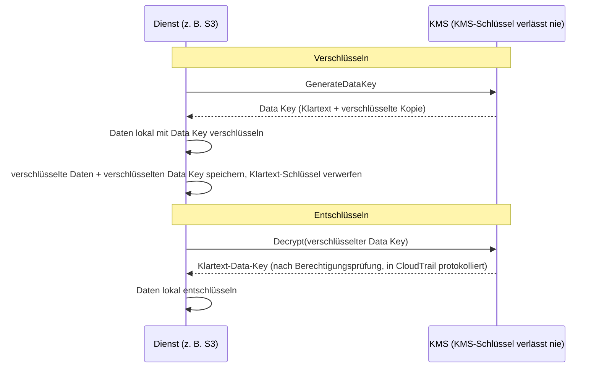

# Kapitel 16: Schlüssel, Schlösser und Geheimnisse

Das Git-Repository hatte Tausende von Commits, die zwei Jahre zurückreichten. Leo hatte zwanzig Minuten lang gescrollt und einem Faden durch die Historie gefolgt – auf der Suche danach, wann ein bestimmter Datenbank-Connection-String zum ersten Mal aufgetaucht war. Er hätte ihn fast übersehen. Es war an einem Dienstagnachmittag, eingeklemmt zwischen zwei unauffälligen Commits, gepusht von jemandem, der das Unternehmen inzwischen verlassen hatte.

Ein Datenbankpasswort. In Klartext. In der Historie.

---

*Die Netzwerkkontrollen aus dem letzten Kapitel waren jetzt eng. Security Groups begrenzten laterale Bewegung. NACLs blockierten bekannte-schlechte IP-Bereiche. Der Perimeter war gehärtet worden. Aber das Sicherheitsaudit hatte etwas gefunden, das der Perimeter nicht beheben konnte: ein Credential, das sechs Monate lang in der Git-Historie gelebt hatte. Perimeter-Sicherheit nimmt an, dass die Geheimnisse darin sicher sind. Dieses war es nicht.*

---

Leo überprüfte die Git-Historie, als er es fand. Ein Datenbankpasswort. Vor sechs Monaten committet, in Klartext, von jemandem, der nicht mehr bei Nimbus arbeitete – Teil einer `.env`-Datei, die auch den IAM-Access-Key der Deployment-Pipeline enthielt, zwei Zeilen unter dem Connection-String. Der Commit war öffentlich. Das Passwort war inzwischen geändert worden – aber sie wussten das nicht mit Sicherheit. Sie prüften jedes System, das eines der beiden Credentials jemals berührt hatte. Es dauerte vier Stunden. Das war der Tag, an dem Nimbus beschloss, keine Geheimnisse mehr in Code zu packen.

„Haben wir darüber nachgedacht, was passiert, wenn jemand das Repo forkt?“, sagte Priya. „Git-Historie ist permanent. Selbst wenn wir das Passwort ändern, hat jeder, der das Repo vor der Korrektur geklont hat, immer noch das alte Credential in seiner lokalen Historie.“

„Wir haben geprüft“, sagte Leo. „Das Passwort wurde vor drei Monaten geändert. Alle Systeme bestätigt.“

„Das ist das Minimum“, sagte Priya. „Aber jedes System, das dieses Credential berührt hat, muss überprüft werden. Nicht nur die, die du kennst.“

**Das vierstündige Audit**

Leo hatte die geleakte `.env`-Datei um 10 Uhr in der Git-Historie gefunden. Bis 14 Uhr hatten sie eine Antwort auf die Frage, die zählte: War eines der beiden Credentials – das Datenbankpasswort oder der daneben committete Access Key – von irgendjemandem außer Nimbus-Systemen verwendet worden?

Das Audit lief durch vier Kategorien.

**RDS-Zugriffslogs**: Jede Verbindung zur Datenbank, mit Zeitstempel und protokolliert. Das geleakte Passwort tauchte in drei Connection-Strings auf – alle von EC2-Instanzen in der Nimbus-VPC, alle mit erwarteten Quell-IPs. Keine externen Verbindungen. Das Passwort war nicht verwendet worden, um sich von außen mit der Datenbank zu verbinden.

**S3-Zugriffslogs**: Der geleakte Access Key gehörte dem IAM-Benutzer der Deployment-Pipeline, der Berechtigungen für den `nimbus-receipts`-Bucket hatte. Leo fragte die S3-Server-Access-Logs der letzten sechs Monate ab. Jeder Zugriff kam von `us-west-2`-EC2-Instanzen oder von der CloudFront-Origin-Fetch-Rolle. Keine Anomalien.

**CloudTrail-API-Aufrufe**: Jeder AWS-API-Aufruf, der mit der geleakten Access Key ID gemacht wurde. Leo filterte CloudTrail-Ereignisse nach dem Schlüssel. Dreihundertzwölf Ereignisse – alle routinemäßige `s3:PutObject`-Aufrufe von der Deployment-Pipeline, alle von derselben IP, alle innerhalb der Geschäftszeiten. Der Schlüssel war nur jemals von einer IP-Adresse verwendet worden, die mit dem CI/CD-Server übereinstimmte.

„Und der CI/CD-Server“, sagte Priya, „ist innerhalb der VPC. Er hätte Daten über HTTPS an einen externen Endpunkt exfiltrieren müssen, und das hätten wir in den Flow Logs gesehen.“

„Wir haben geprüft“, sagte Leo. „Kein ausgehendes HTTPS von diesem Server zu Nicht-AWS-IPs in den letzten sechs Monaten.“

**Urteil**: Keines der Credentials war von irgendjemandem außerhalb des Nimbus-Teams verwendet worden. Die Exponierung war ein Risiko, kein Breach.

„Aber wir können nicht sicher sein“, sagte Priya. „Wir können basierend auf den Logs einigermaßen zuversichtlich sein. Wir können nicht sicher sein. Diese Unterscheidung ist wichtig.“

„Was würde uns sicher machen?“

„Nichts macht dich nach einer Credential-Exponierung sicher. Du rotierst das Credential, auditierst den Zugriff, dokumentierst deine Befunde und gehst mit besseren Kontrollen voran. Sicherheit ist nicht verfügbar.“

Tom hatte während des Gesprächs gerechnet. „Vier Stunden Zeit von drei Ingenieuren. Sagen wir viertausend Dollar an vollständig belasteten Kosten. Plus die Credential-Rotation, die Dokumentation, der Incident-Bericht.“

„Und das ist nur die Untersuchung“, sagte Priya. „Ein Breach wäre Größenordnungen mehr gewesen. Behördliche Benachrichtigungen. Kundenkommunikation. Mögliche Bußgelder.“

„Die Viertausend-Dollar-Lektion war also billig“, sagte Tom.

„Erheblich“, sagte Priya. „Wiederholen wir sie nicht.“

---

**Die zwei Probleme: Geheimnisse speichern und Daten verschlüsseln**

Sicherheit rund um sensible Informationen hat zwei verschiedene Probleme:

**Anmeldedaten speichern** (Datenbankpasswörter, API-Schlüssel, Connection-Strings): Wo leben diese? Wer kann darauf zugreifen? Wie rotiert man sie, ohne die Anwendung neu zu deployen?

**Daten verschlüsseln** (Kundeninformationen, Zahlungsdatensätze, PII): Wie stellt man sicher, dass jemand, selbst wenn er unbefugten Zugriff auf Ihre Datenbank oder Ihren S3-Bucket erlangt, die Daten nicht lesen kann?

AWS hat einen dedizierten Dienst für jedes Problem:

- **AWS Secrets Manager**: Speichert und verwaltet Anmeldedaten sicher
- **AWS KMS (Key Management Service)**: Verwaltet Verschlüsselungsschlüssel zum Ver- und Entschlüsseln von Daten

Stellen Sie sich Secrets Manager als einen Schlüsselbund vor: Er hält Ihre Schlüssel (Anmeldedaten), hält sie organisiert und rotiert sie nach Zeitplan. Stellen Sie sich KMS als einen Tresor vor: Er hält nicht das Wertvolle – er hält den Schlüssel, der das Schloss öffnet, das das Wertvolle schützt.

**AWS Secrets Manager: Keine hartcodierten Anmeldedaten mehr**

Secrets Manager ist ein sicherer Speicher für Geheimnisse: Datenbank-Anmeldedaten, API-Schlüssel, OAuth-Tokens, SSH-Schlüssel oder alles Sensible.

Statt dass Ihre Anwendung ein Passwort aus einer Umgebungsvariable oder Config-Datei liest, ruft sie beim Start (oder bei Bedarf) die Secrets-Manager-API auf und ruft das Geheimnis ab. Das Geheimnis berührt nie die Festplatte. Es erscheint nie in Ihrem Code. Es ist nicht in Ihren Umgebungsvariablen.

So sieht der Ablauf aus:

**Alter Weg**:
```
DB_PASSWORD=supersecretpassword123  # in .env-Datei oder Umgebungsvariable
```

**Secrets-Manager-Weg**:
```python
import boto3
client = boto3.client('secretsmanager')
secret = client.get_secret_value(SecretId='nimbus/production/db-password')
password = json.loads(secret['SecretString'])['password']
```

Die EC2-Instanz braucht eine IAM-Rolle mit der Berechtigung, `secretsmanager:GetSecretValue` für dieses spezifische Geheimnis aufzurufen. Kein anderer Dienst kann es lesen. Das Geheimnis ist nie im Code.

Sie fragen sich vielleicht: Warum nicht einfach Umgebungsvariablen verwenden? Sie sind einfacher – beim Deploy setzen, und die Anwendung liest sie. Umgebungsvariablen scheinen versteckt, aber sie sind in Ihrer Deployment-Konfiguration gespeichert, im CI/CD-Secrets-Store, möglicherweise während Debug-Sitzungen protokolliert und für jeden mit Zugriff auf den laufenden Prozess sichtbar. Noch wichtiger: Sie sind statisch – einmal gesetzt, ändern sie sich nicht, bis jemand sie manuell aktualisiert. Secrets Manager speichert Anmeldedaten in einem verschlüsselten Dienst mit IAM-Zugriffskontrollen, vollständigem Audit-Logging über CloudTrail und automatischer Rotation. Umgebungsvariablen rotieren nicht. Eine geleakte Umgebungsvariable bleibt gültig, bis jemand sie manuell ändert.

**Automatische Rotation: Die wahre Stärke**

Das größte Feature von Secrets Manager ist nicht das Speichern von Geheimnissen – es ist das automatische Rotieren.

Hier ist das Szenario: Alle 30 Tage generiert Secrets Manager ein neues Datenbankpasswort, aktualisiert es in RDS, aktualisiert das gespeicherte Geheimnis, und Ihre Anwendung ruft das neue Passwort beim nächsten Mal ab, wenn sie es braucht. Kein manueller Eingriff. Kein Deployment. Kein „Ich muss daran denken, das zu rotieren.“

Die Rotation ist als Lambda-Funktion implementiert. AWS bietet Templates für RDS-Datenbanken (MySQL, PostgreSQL, Aurora). Sie können die Funktion für jeden Credential-Typ anpassen.

„Wie viel kostet das pro Monat?“, fragte Tom.

Secrets Manager berechnet pro Geheimnis pro Monat plus pro API-Aufruf. Für eine kleine Anzahl von Datenbankpasswörtern und API-Schlüsseln sind die Kosten Dollar pro Monat – vernachlässigbar im Vergleich zu den Kosten eines Vorfalls.

„Die Kompromittierung letzte Woche“, sagte Priya, „was hätte es gekostet, sie zu untersuchen und zu beheben?“

Tom war einen Moment still. „Einschließlich meiner Zeit, deiner Zeit, Leos Wochenende… ein paar tausend Dollar.“

„Secrets Manager hätte den statischen Schlüssel erwischt, bevor er ausgenutzt wurde. Und es hätte ihn automatisch rotiert.“

Tom öffnete die Preisseite.

**Was während der Rotation passiert**

„Moment – aber *warum* würden wir das so machen?“, fragte Maya. „Wenn das Datenbankpasswort rotiert, bricht die Anwendung? Wie nimmt sie das neue Passwort ohne ein Deployment auf?“

Das war eine berechtigte Sorge. Rotation ohne Störung erfordert Sorgfalt.

Die Secrets-Manager-Rotation arbeitet in Phasen – konzipiert, um das Szenario „altes Passwort plötzlich ungültig, Anwendung stürzt ab“ zu verhindern:

**Phase 1: Neue Geheimnis-Version erstellen.** Secrets Manager generiert ein neues Passwort und speichert es als ausstehende Version des Geheimnisses. Die aktuelle Version ist noch aktiv.

**Phase 2: Auf dem Dienst setzen.** Die Rotations-Lambda ruft die Datenbank auf, um das Passwort auf den neuen Wert zu aktualisieren. Beachten Sie: Mit der standardmäßigen **Single-User**-Rotationsstrategie gibt es einen kurzen Moment, in dem das alte Passwort gerade aufgehört hat zu funktionieren (PostgreSQLs `ALTER ROLE ... PASSWORD` wird sofort wirksam) und die neue Version noch nicht aktuell ist. Für Zero-Downtime-Rotation unterstützt Secrets Manager eine **Alternating-Users**-Strategie: zwei Datenbankbenutzer mit identischen Berechtigungen, wobei die Rotation immer den *inaktiven* aktualisiert und dann umschaltet – die aktiven Anmeldedaten werden nie mitten im Flug invalidiert. Die zu merkende Prüfungsphrase ist „Alternating-Users-Rotationsstrategie“.

**Phase 3: Neues Geheimnis testen.** Die Rotations-Lambda verifiziert, dass das neue Passwort funktioniert, indem sie sich damit verbindet. Wenn das fehlschlägt, wird die Rotation zurückgerollt.

**Phase 4: Abschließen.** Secrets Manager markiert die neue Version als die aktuelle Version und stuft die alte Version zu einer vorherigen Version herab. Die vorherige Version wird für eine Karenzzeit behalten.

Während der Karenzzeit sind beide Versionen abrufbar. Wenn Ihre Anwendung das alte Geheimnis gecacht hat und das neue noch nicht aufgenommen hat, kann sie sich immer noch verbinden. Beim nächsten Aufruf von `GetSecretValue` bekommt sie die aktuelle (neue) Version.

„Die Anwendung muss also nie neu gestartet werden“, sagte Leo.

„Nicht unbedingt. Wenn deine Anwendung das Geheimnis beim Start cacht und es nie aktualisiert, musst du es entweder nach Zeitplan aktualisieren oder Authentifizierungsfehler durch erneutes Abrufen des Geheimnisses behandeln.“

„Die Rotations-Lambda und die Anwendung müssen also kooperieren“, sagte Maya.

„Secrets Manager macht seine Hälfte. Dein Anwendungscode muss die andere Hälfte machen: das Geheimnis bei Bedarf abrufen, Authentifizierungsfehler durch erneutes Abrufen behandeln.“

Leo aktualisierte die Anwendung, um Datenbank-Authentifizierungs-Exceptions abzufangen und bei einem Fehler ein frisches Geheimnis aus Secrets Manager abzurufen, bevor sie es erneut versucht. Zwei Zeilen Fehlerbehandlung. Die Rotation wurde für Benutzer unsichtbar.

---

**Secrets-Injection in CI/CD-Pipelines**

„Haben wir darüber nachgedacht, wie die Deployment-Pipeline die Geheimnisse bekommt, die sie braucht?“, fragte Priya. „Die Pipeline deployt Infrastruktur. Sie braucht AWS-Anmeldedaten. Sie braucht vielleicht Datenbank-Connection-Strings für Migrationsskripte.“

Leo erklärte das aktuelle Setup: Geheimnisse waren als GitHub-Actions-Secrets gespeichert – verschlüsselt im Ruhezustand in GitHub, zur Laufzeit als Umgebungsvariablen injiziert.

„Die Anmeldedaten sind in GitHub“, sagte Priya.

„Verschlüsselt.“

„In einem Drittanbietersystem. Ein GitHub-Breach exponiert alle unsere Pipeline-Geheimnisse.“

Die Lösung: Die Deployment-Pipeline authentifiziert sich bei AWS über OIDC-Federation (behandelt in Kapitel 14) und ruft alle benötigten Geheimnisse zur Laufzeit aus Secrets Manager ab. Keine Geheimnisse in GitHub gespeichert. Die AWS-Rolle der Pipeline hat die Berechtigung, bestimmte Geheimnisse zu lesen, sonst nichts.

```yaml
# GitHub-Actions-Workflow
- name: Get DB Migration Credentials
  env:
    AWS_DEFAULT_REGION: us-west-2
  run: |
    SECRET=$(aws secretsmanager get-secret-value \
      --secret-id nimbus/staging/db-migration \
      --query SecretString --output text)
    DB_URL=$(echo $SECRET | jq -r '.url')
    # Migration mit DB_URL ausführen — nie in einer Datei gespeichert
    flyway -url="$DB_URL" migrate
```

Das Geheimnis wird abgerufen, im Speicher verwendet und verworfen. Es wird nie auf die Festplatte geschrieben, nie in Umgebungsvariablen gespeichert, die nach dem Job bestehen bleiben, nie in einer Log-Datei.

„Was, wenn das Geheimnis ins Log gedruckt wird?“, fragte Leo.

„GitHub Actions maskiert automatisch Werte von Geheimnissen, die als GitHub Secrets konfiguriert sind. Aber dieses Geheimnis ist kein GitHub Secret – es kommt aus Secrets Manager. Du musst es manuell maskieren, oder besser, es nie loggen.“

„Die Disziplin ist also: abrufen, verwenden, verwerfen. Nie Geheimnisse loggen. Nie in Dateien speichern.“

„Diese Disziplin“, sagte Priya, „ist genau das, woran wir laut dem vierstündigen Audit gescheitert sind.“


**AWS KMS: Die Schlossfabrik**

„Moment – aber *warum* würden wir das so machen?“, fragte Maya. „Warum ein separater Key-Management-Dienst? Können wir die Daten nicht einfach selbst verschlüsseln und den Schlüssel in Secrets Manager speichern?“

Sie könnten Verschlüsselungsschlüssel in Secrets Manager speichern. Aber wer kontrolliert dann den Zugriff auf den Schlüssel? Was stellt sicher, dass der Schlüssel rotiert wird? Was beweist einem Auditor, dass der Schlüssel nur von autorisierten Diensten verwendet wurde? KMS beantwortet all diese Fragen. Es ist nicht nur Speicher – es ist ein Key-Lifecycle-Management-Dienst mit hardwaregestützter Sicherheit, feingranularen IAM-Policies pro Schlüssel und einem vollständigen Audit Trail jeder Verwendung. Secrets Manager speichert, was Sie brauchen, um sich mit Systemen zu verbinden. KMS schützt die Systeme selbst.

AWS KMS (Key Management Service) verwaltet **kryptografische Schlüssel** – die geheimen Werte, die zum Ver- und Entschlüsseln von Daten verwendet werden.

Die Analogie: KMS ist wie eine Schließbox-Firma, die den Hauptschlüssel hält. Ihre Daten (der Inhalt der Box) sind verschlüsselt. Nur jemand mit der Berechtigung, den KMS-Schlüssel zu verwenden, kann sie entschlüsseln. KMS protokolliert jede Verwendung jedes Schlüssels in CloudTrail.

**Customer Master Keys (CMKs)** – jetzt KMS-Schlüssel genannt – gibt es in drei Eigentumstypen:

**AWS owned Keys**: Schlüssel, die AWS besitzt und über viele Kunden-Accounts hinweg verwendet – Sie sehen sie nie, zahlen nie für sie, und sie erscheinen nicht in Ihrem Account. Mehrere Dienst-Standardeinstellungen verwenden sie (DynamoDBs Standardverschlüsselung zum Beispiel).

(Eine Unterscheidung, die man im Blick behalten sollte: S3s Standard-**SSE-S3**-Verschlüsselung ist *überhaupt kein* KMS-Schlüsselmodell – S3 verwaltet seine eigenen AES-256-Schlüssel vollständig außerhalb von KMS, ohne einen Schlüssel zu sehen und ohne Audit Trail der Schlüsselverwendung. **SSE-KMS** ist die S3-Option, die durch KMS geht und entweder den AWS managed Key `aws/s3` oder einen Customer-managed Key verwendet. Prüfungsauslöser: „auditieren, wer den Verschlüsselungsschlüssel verwendet hat“ oder „Rotation und Key Policy kontrollieren“ → SSE-KMS mit einem Customer-managed Key – jede Verwendung landet in CloudTrail.)

**AWS managed Keys**: AWS erstellt und verwaltet den Schlüssel automatisch *in Ihrem Account* für Dienste wie S3, EBS, RDS (benannt wie `aws/s3`). Sie können ihn sehen und seine Verwendung in CloudTrail auditieren, aber Sie können seine Policy oder Rotation nicht ändern – AWS rotiert ihn automatisch jedes Jahr. Kostenlos.

**Customer managed Keys**: Sie erstellen den Schlüssel in KMS und kontrollieren jeden Aspekt davon: wer ihn verwenden kann, wann er rotiert, wer ihn administriert. Sie können die automatische Schlüsselrotation mit einem konfigurierbaren Zeitraum zwischen 90 Tagen und 2.560 Tagen (7 Jahre) aktivieren; der Standard-Rotationszeitraum ist 365 Tage (jährlich). Sie können auch eine **On-Demand-Rotation** sofort auslösen – nützlich nach einer vermuteten Exponierung, ohne auf den Zeitplan zu warten. Hinweis: Automatische Rotation gilt für symmetrische Schlüssel mit KMS-generiertem Material – asymmetrische Schlüssel und importiertes Schlüsselmaterial können nicht automatisch rotieren. Kosten: 1 $/Monat pro Schlüssel plus Gebühren pro API-Aufruf.

Wenn Sie Customer-managed KMS-Schlüssel wählen, erhalten Sie volle Kontrolle über Rotationspläne, Zugriffsrichtlinien und Audit-Sichtbarkeit, aber Sie zahlen pro Schlüssel pro Monat und übernehmen die Verantwortung der Schlüsselverwaltung; wenn Sie AWS-managed Keys wählen, erhalten Sie Verschlüsselung mit null betrieblichem Aufwand und ohne Kosten für den Schlüssel selbst, aber Sie können Rotationspläne oder Key Policies nicht anpassen – sie werden vollständig von AWS verwaltet.

**Verschlüsselung in AWS-Diensten: KMS-Integration**

Die meisten AWS-Dienste integrieren sich mit KMS für Verschlüsselung:

**S3**: „Server-Side Encryption mit KMS“ auf einem Bucket aktivieren. Jedes Objekt wird im Ruhezustand mit einem KMS-Schlüssel verschlüsselt. Das Lesen eines Objekts erfordert die Berechtigung sowohl für den S3-Bucket *als auch* für den KMS-Schlüssel.

**RDS**: Verschlüsselung bei der Erstellung aktivieren. Der Datenbankspeicher, Backups und Snapshots werden alle mit einem KMS-Schlüssel verschlüsselt. Hinweis: Verschlüsselung kann nicht auf einer bestehenden unverschlüsselten RDS-Instanz aktiviert werden – Sie müssen einen Snapshot erstellen, den Snapshot mit aktivierter Verschlüsselung kopieren und wiederherstellen.

**EBS**: Volumes mit KMS verschlüsseln. Neue Volumes, die aus verschlüsselten Snapshots erstellt werden, werden automatisch verschlüsselt.

**DynamoDB**: Verschlüsselung im Ruhezustand mit KMS ist standardmäßig auf allen Tabellen aktiviert.

**ElastiCache Redis**: Verschlüsselung im Ruhezustand mit KMS für sensible gecachte Daten.

Das Prinzip: Daten sollten im Ruhezustand (auf der Festplatte gespeichert) und im Transit (über ein Netzwerk bewegt) verschlüsselt sein. KMS handhabt die Verschlüsselung im Ruhezustand. TLS/SSL (automatisch von AWS-Diensten bereitgestellt) handhabt die Verschlüsselung im Transit.

**Envelope Encryption: Wie KMS tatsächlich funktioniert**

Hier ist ein Detail, das Ihnen hilft, das KMS-Verhalten und Prüfungsfragen zu verstehen.

KMS verschlüsselt Ihre Daten in den meisten Fällen nicht direkt. Es verwendet **Envelope Encryption**:

1. KMS generiert einen **Data Key** (einen eindeutigen symmetrischen Schlüssel)
2. Der Dienst verwendet den Data Key, um Ihre Daten lokal zu verschlüsseln (schnell – symmetrische Verschlüsselung)
3. Der Dienst bittet KMS, den Data Key selbst zu verschlüsseln (mit Ihrem KMS-Schlüssel)
4. Sowohl die verschlüsselten Daten als auch der verschlüsselte Data Key werden gespeichert
5. Ihre tatsächlichen Daten verlassen den Dienst nie – nur der Data Key geht zur Ver-/Entschlüsselung an KMS

Wenn Sie die Daten lesen:

1. Der Dienst bittet KMS, den Data Key zu entschlüsseln
2. KMS prüft Berechtigungen, entschlüsselt den Data Key, gibt ihn zurück
3. Der Dienst verwendet den entschlüsselten Data Key, um Ihre Daten lokal zu entschlüsseln



Das bedeutet, dass KMS sehr große Daten handhaben kann, ohne sie alle durch die KMS-API zu senden. Nur kleine Schlüssel gehen an KMS. CloudTrail protokolliert jeden KMS-API-Aufruf – jede Verschlüsselungs- und Entschlüsselungsoperation.

**KMS Key Policies: Das Zugriffsmodell**

„Haben wir darüber nachgedacht, was passiert, wenn eine IAM-Policy und eine Key Policy in Konflikt geraten?“, fragte Priya. „KMS hat seine eigene Zugriffskontrolle obendrauf auf IAM.“

KMS-Schlüssel haben **Key Policies** – ressourcenbasierte Policies, die an den Schlüssel selbst angehängt sind. Sie unterscheiden sich von IAM-Policies und folgen anderen Evaluierungsregeln.

Damit ein Principal einen KMS-Schlüssel verwenden kann, müssen zwei Dinge wahr sein:

**Erstens**: Die Key Policy muss es erlauben. Wenn die Key Policy dem Principal nicht explizit Zugriff gewährt, kann er den Schlüssel nicht verwenden – unabhängig davon, was seine IAM-Policy sagt. Das unterscheidet sich von den meisten AWS-Ressourcen, bei denen IAM-Policies allein ausreichen.

**Zweitens**: Die IAM-Policy des Principals muss die KMS-Aktion erlauben (z. B. `kms:Decrypt`, `kms:GenerateDataKey`).

Beide müssen ja sagen. Wenn auch nur eines nein sagt, wird die Aktion verweigert.

Die Standard-Key-Policy, die AWS für Customer-managed Keys erstellt, enthält ein Statement, das sagt „der Root-Account kann diesen Schlüssel verwalten.“ Das ist wichtig: Es bedeutet, dass ein IAM-Administrator auf Account-Ebene immer Zugriff auf einen Schlüssel gewähren kann, selbst wenn die Key Policy ihn nicht direkt benennt – weil die Root-Account-Delegierung vorhanden ist.

„Wenn wir also den Root-Account aus der Key Policy entfernen“, fragte Leo, „hören IAM-Policies für diesen Schlüssel auf zu funktionieren?“

„Korrekt. Das Entfernen der Root-Account-Delegierung ist eine Möglichkeit, einen Schlüssel so streng abzuriegeln, dass nur die spezifischen in der Key Policy benannten Principals ihn verwenden können – nicht einmal Account-Administratoren. Es ist auch eine Möglichkeit, sich versehentlich aus dem eigenen Schlüssel auszusperren.“

„Können wir uns erholen?“

„Nur durch Kontaktaufnahme mit dem AWS Support. Wenn niemand den Schlüssel verwenden kann und die Key Policy nicht aktualisiert werden kann, sind die mit diesem Schlüssel verschlüsselten Daten effektiv unzugänglich.“

„Also entferne den Root-Account nicht ohne einen extrem guten Grund aus der Key Policy.“

„Korrekt.“

---

**Asymmetrische Schlüssel: Signieren und Verifizieren**

KMS unterstützt auch asymmetrische Schlüsselpaare – einen öffentlichen Schlüssel und einen privaten Schlüssel.

Die Anwendungsfälle:

**Digitales Signieren**: Sie signieren ein Dokument oder ein JWT-Token mit dem privaten Schlüssel. Jeder mit dem öffentlichen Schlüssel kann verifizieren, dass die Signatur vom Inhaber des privaten Schlüssels kam und dass der Inhalt nicht manipuliert wurde.

**Public-Key-Verschlüsselung**: Jeder kann Daten mit dem öffentlichen Schlüssel verschlüsseln. Nur der Inhaber des privaten Schlüssels kann sie entschlüsseln.

Für Nimbus wurden asymmetrische Schlüssel relevant, als sie ein Webhook-Signatursystem für Restaurantpartner implementierten. Wenn Nimbus ein Ereignis an den Server eines Restaurantpartners sendete (eine neue Bestellung, ein Status-Update), musste der Partner verifizieren, dass das Ereignis tatsächlich von Nimbus gekommen war und nicht gefälscht worden war.

Die Implementierung:

1. Nimbus erstellt einen asymmetrischen KMS-Schlüssel (RSA 2048-bit, SIGN_VERIFY-Algorithmus)
2. Beim Senden eines Webhooks ruft Nimbus `kms:Sign` mit dem privaten Schlüssel auf, um die Ereignis-Payload zu signieren
3. Die Signatur wird im Webhook-Header eingeschlossen
4. Nimbus veröffentlicht den öffentlichen Schlüssel (herunterladbar aus der KMS-Konsole)
5. Der Server des Restaurantpartners ruft den öffentlichen Schlüssel ab und verwendet ihn, um die Signatur auf jedem eingehenden Webhook zu verifizieren

Der private Schlüssel verlässt KMS nie. Nimbus hat nie Zugriff auf das rohe private Schlüsselmaterial. KMS führt die Signaturoperation innerhalb seines Hardware Security Module durch.

„Selbst wenn jemand einen Nimbus-Server kompromittierte“, sagte Rafael, „könnte er keine Webhook-Signatur fälschen. Der private Schlüssel ist in KMS, nicht auf irgendeinem Server.“

„Korrekt. Das Signieren erfordert einen KMS-API-Aufruf. Jeder API-Aufruf wird in CloudTrail protokolliert. Wenn jemand versuchte, ein betrügerisches Ereignis zu signieren, würden wir den API-Aufruf sehen.“

---

**Die Geschichte der Schlüssellöschung**

Drei Monate nach dem KMS-Setup machte Tom einen Fehler.

Er räumte ungenutzte AWS-Ressourcen auf – alte Lambda-Funktionen, veraltete S3-Buckets, verlassene CloudWatch-Dashboards. Er bewegte sich schnell. Er plante versehentlich einen KMS-Schlüssel zur Löschung.

Der Schlüssel war `nimbus/prod/order-receipts` – der Customer-managed Key, der zum Verschlüsseln des Bestellbeleg-S3-Buckets verwendet wurde.

„Ich habe gestern zwölf Ressourcen in einem Batch gelöscht und nicht geprüft, was die zwölfte war“, sagte Tom nüchtern. Er hatte die Löschung geplant und war weitergegangen. Er bemerkte den Fehler am nächsten Morgen, als er seine Aktionen überprüfte.

Er öffnete die KMS-Konsole. Der Schlüsselstatus lautete: „Löschung ausstehend. Löschung in 7 Tagen.“

Er hatte sie für den minimalen Wartezeitraum geplant.

„Können wir sie abbrechen?“, fragte er.

Priya öffnete die Dokumentation. „Ja. Während des Wartezeitraums ist der Schlüssel deaktiviert, aber nicht gelöscht. Du kannst die Löschung abbrechen.“

Tom brach die Löschung innerhalb der Minute ab. Der Schlüssel wurde in den aktiven Status zurückversetzt.

„Sieben Tage ist der minimale Wartezeitraum“, sagte Priya. „AWS erzwingt ihn, weil wenn ein Schlüssel gelöscht wird und Daten damit verschlüsselt waren, diese Daten für immer weg sind. Unwiederherstellbar. Der Wartezeitraum gibt dir Zeit, den Fehler zu erkennen.“

„Wie lang sollte der Wartezeitraum sein?“

„Das Maximum ist dreißig Tage. Für jeden Schlüssel, der Produktionsdaten verschlüsselt, verwende dreißig Tage. Die zusätzlichen drei Wochen Schutz vor Unfällen sind die geringfügige Unannehmlichkeit wert.“

Tom aktualisierte alle Produktions-Schlüssellöschungseinstellungen auf dreißig Tage. Er richtete außerdem einen CloudWatch-Alarm ein, der ausgelöst wurde, wenn der Status eines KMS-Schlüssels auf „Löschung ausstehend“ wechselte – sodass das Team beim nächsten Mal, wenn jemand (einschließlich er) denselben Fehler machte, innerhalb von fünf Minuten Bescheid wüsste.

---

**Secrets Manager vs. Parameter Store**

AWS hat auch **Systems Manager Parameter Store**, der Konfigurationswerte speichert (nicht nur Geheimnisse). Parameter Store ist günstiger – kostenlos für Standardparameter. Er kann auch verschlüsselte Parameter mit KMS speichern.

Für Geheimnisse, die Rotation brauchen: Secrets Manager.

Für Konfigurationswerte und nicht sensible Parameter: Parameter Store (der kostenlose Tier ist sehr großzügig).

Für Anwendungskonfiguration (Portnummern, Feature Flags, umgebungsspezifische Einstellungen): Parameter Store.

| | Secrets Manager | SSM Parameter Store |
|---|---|---|
| Automatische Rotation | Ja (Lambda-gestützt) | Nein |
| Kosten | ~0,40 $/Geheimnis/Monat | Kostenlos (Standard) |
| Verschlüsselung | Immer | Optional (mit KMS) |
| Versionierung | Ja | Ja |
| Cross-Account-Zugriff | Ja | Begrenzt |
| Am besten für | Datenbankpasswörter, API-Schlüssel | Config-Werte, Feature Flags |

## Das Zertifikat an der Tür

Zwei Wochen nach der Geheimnis-Migration überprüfte Priya die Nimbus-Staging-Umgebung auf ihrem Telefon, als sie die Adressleiste bemerkte.

„Nicht sicher.“

Sie rief die Produktions-URL auf. Dasselbe.

„Leo“, sagte sie und legte ihr Telefon auf den Tisch. „Laufen wir auf HTTP?“

Leo prüfte. „Der ALB-Listener ist auf Port 80. Wir haben nie HTTPS eingerichtet.“

„Jede Anfrage, die unsere Benutzer machen – jede Bestellung, jeder Login – geht also über unverschlüsseltes HTTP?“

„Wir haben TLS auf der RDS-Verbindung“, bot Leo an.

„Das sind Daten im Transit zwischen der Anwendung und der Datenbank. Ich rede über Daten im Transit zwischen dem Browser des Benutzers und unserem Load Balancer. Das ist überhaupt nicht verschlüsselt.“

Tom hatte zugehört. „Ist das ein Sicherheitsproblem oder ein Wahrnehmungsproblem?“

„Beides“, sagte Priya. „Unverschlüsseltes HTTP bedeutet, dass jedes Netzwerk zwischen dem Benutzer und unserem Server – ein Café-Router, ein ISP – den Traffic lesen kann. Passwörter, Bestelldetails, Session-Tokens. Und moderne Browser warnen Benutzer mit ‚Nicht sicher‘. Das killt die Conversion-Raten.“

„Wir brauchen also ein TLS-Zertifikat“, sagte Maya. „Wie viel kostet das?“

„Nichts“, sagte Priya. „AWS Certificate Manager.“

**AWS Certificate Manager (ACM)** stellt kostenlose TLS/SSL-Zertifikate zur Verwendung mit AWS-verwalteten Diensten bereit: ALBs, CloudFront-Distributionen und API Gateway. Sie kaufen kein Zertifikat, verwalten keinen Erneuerungskalender und berühren kein privates Schlüsselmaterial. ACM handhabt den gesamten Zertifikatslebenszyklus.

Ein von ACM ausgestelltes Zertifikat ist 13 Monate gültig. Bevor es abläuft, erneuert ACM es automatisch. Wenn die Erneuerung gelingt, wird das neue Zertifikat ohne Ihr Zutun an Ihren Load Balancer oder Ihre Distribution angehängt. Das Vorhängeschloss des Browsers bleibt grün. Der Ablaufalarm, den Sie zu setzen vergessen haben, wird nie ausgelöst.

**Zwei Arten von ACM-Zertifikaten**:

**Öffentliche Zertifikate** werden von Amazons Certificate Authority ausgestellt und von allen großen Browsern vertraut. Sie sind völlig kostenlos zur Verwendung mit ALB, CloudFront und API Gateway. Sie validieren den Domainbesitz entweder über DNS oder E-Mail.

**Private Zertifikate** werden von AWS Private CA ausgestellt – einer verwalteten privaten Certificate Authority, die Sie für interne Dienste betreiben (Service-zu-Service-mTLS, interne Tools, VPN-Clients). Private CA hat monatliche Kosten.

Für Nimbus waren öffentliche Zertifikate die richtige Wahl.

**DNS-Validierung vs. E-Mail-Validierung**:

Leo öffnete die ACM-Konsole und startete eine Zertifikatsanforderung für `eatnimbus.com` und `*.eatnimbus.com`.

„Es fragt, wie ich den Besitz validieren will“, sagte er. „DNS oder E-Mail.“

„DNS“, sagte Priya. „Immer DNS.“

Mit DNS-Validierung fügt ACM einen bestimmten CNAME-Eintrag zu Ihrer Hosted Zone hinzu. Route 53 kann das automatisch tun – ein Klick in der Konsole. Solange dieser CNAME-Eintrag existiert, kann ACM das Zertifikat ohne menschliches Zutun automatisch erneuern. E-Mail-Validierung sendet eine E-Mail an den registrierten Kontakt der Domain und erfordert bei jeder Erneuerung des Zertifikats einen manuellen Klick. Dieser Klick wird vergessen. DNS-Validierung erfordert nicht, dass sich jemand an irgendetwas erinnert.

„Ich füge also den CNAME-Eintrag einmal hinzu“, sagte Leo, „und es erneuert sich für immer?“

„Bis jemand den CNAME-Eintrag löscht“, sagte Priya. „Lösch den CNAME-Eintrag nicht.“

Leo forderte das Zertifikat an, fügte den Validierungs-CNAME in Route 53 hinzu (was ACM anbot, automatisch zu tun) und wartete fünf Minuten. Der Zertifikatsstatus wechselte zu „Ausgestellt“. Er hängte es an den HTTPS-Listener des ALB auf Port 443 an und fügte eine Redirect-Regel auf Port 80 hinzu, um allen HTTP-Traffic zu HTTPS zu senden.

Tom aktualisierte die Produktions-URL.

Das Vorhängeschloss erschien.

Ein regionales Detail, das einer Markierung wert ist: Ein Zertifikat ist eine regionale Ressource und muss in derselben Region wie der Dienst leben, der es verwendet. Für einen ALB ist das die Region des ALB. Für **CloudFront** muss das Zertifikat in **`us-east-1`** angefordert (oder importiert) werden – immer, unabhängig davon, wo Ihre Origins laufen –, weil CloudFront ein globaler Dienst ist, der dort verankert ist. Leo war in Kapitel 13 bereits darüber gestolpert; es ist auch ein verlässlicher Prüfungsfakt.

**Das eine, was ACM-Zertifikate nicht können**:

„Kann ich das Zertifikat herunterladen?“, fragte Leo. „Ich will es auf der internen Admin-EC2-Instanz installieren.“

„Nein“, sagte Priya.

Kostenlose öffentliche ACM-Zertifikate können nicht exportiert werden. Sie können den privaten Schlüssel nicht herunterladen und auf einer EC2-Instanz, einem Nginx-Server oder irgendetwas außerhalb von AWS-verwalteten Diensten installieren. Das private Schlüsselmaterial verlässt ACM nie. Das ist beabsichtigt – es verhindert, dass der private Schlüssel geleakt, unsicher gespeichert oder vergessen wird, wenn das Zertifikat abläuft.

Für Anwendungsfälle, die ein installierbares Zertifikat erfordern – eine EC2-Instanz, die als benutzerdefinierter Proxy fungiert, ein On-Premises-Server – gibt es drei Wege: ein Zertifikat von einer Drittanbieter-Authority (Let's Encrypt zum Beispiel), AWS Private CA mit aktiviertem Zertifikatsexport oder – seit Juni 2025 – ACMs kostenpflichtige **exportierbare öffentliche Zertifikate** (Opt-in bei der Ausstellung, berechnet pro FQDN oder Wildcard), deren privater Schlüssel überall verwendet werden *kann*.

„Für unseren ALB und unsere CloudFront-Distribution“, sagte Priya, „ist ACM genau richtig. Kostenlos, automatisch, und wir berühren nie einen Schlüssel.“

## Stärken und Grenzen

**AWS Secrets Manager**:

- Automatische Geheimnis-Rotation ohne Code-Änderungen oder Deployments
- Feingranulare IAM-Zugriffskontrolle pro Geheimnis (jedes Geheimnis ist eine separate IAM-Ressource)
- Versionierung – die vorherige Version bleibt während der Rotation zugänglich und verhindert Verbindungsabbrüche
- Audit über CloudTrail – jeder `GetSecretValue`-Aufruf wird mit der Identität des Aufrufers protokolliert
- Cross-Account-Zugriff – die Geheimnisse eines Accounts können mit der Rolle eines anderen Accounts geteilt werden
- Kosten: ~0,40 $/Geheimnis/Monat + API-Aufrufe (ungefähr 0,05 $ pro 10.000 API-Aufrufe)

**AWS KMS**:

- Zentralisierte Schlüsselverwaltung mit vollständigem Audit Trail – jede Verschlüsselung und Entschlüsselung protokolliert
- Konfigurierbare automatische Schlüsselrotation für Customer-managed Keys (90 Tage bis 2.560 Tage; Standard 365 Tage) – altes Schlüsselmaterial entschlüsselt weiterhin bestehende Daten, neues Schlüsselmaterial verschlüsselt neue Daten
- Feingranulare IAM-Berechtigungen pro Schlüssel (Key Policies + IAM-Policies – beide müssen erlauben)
- Hardware-Security-Module-(HSM)-gestützt – Schlüssel verlassen das HSM nie im Klartext
- Multi-Region-Schlüsselunterstützung für Disaster-Recovery-Szenarien
- Asymmetrische Schlüsselunterstützung für digitales Signieren und Verifizieren
- Kosten: 1 $/Monat pro Schlüssel + 0,03 $ pro 10.000 API-Aufrufe

**Wo es kompliziert wird**:

- KMS Key Policies sind getrennt von (und werden neben) IAM-Policies evaluiert – das Debuggen von Access-Denied-Fehlern erfordert das Prüfen beider
- Verschlüsselung im Ruhezustand muss im Voraus geplant werden – Sie können eine bestehende unverschlüsselte RDS-Instanz nicht an Ort und Stelle verschlüsseln
- Schlüssellöschung in KMS hat einen Wartezeitraum von 7–30 Tagen – ein Sicherheitsmechanismus, aber leicht beim Setup zu vergessen und gefährlich, versehentlich auszulösen
- Rotation erfordert Anwendungscode, der das erneute Abrufen von Geheimnissen bei Authentifizierungsfehler handhabt – Secrets Manager rotiert das Credential, aber die Anwendung muss es aufnehmen
- Secrets-Manager-Kosten skalieren mit der Anzahl der Geheimnisse und dem API-Aufruf-Volumen im großen Maßstab
- Die Standard-Key-Policy (einschließlich Root-Account-Delegierung) ist kritisch zu bewahren – sie zu entfernen kann Administratoren aus dem Schlüssel aussperren

## Zusammenfassung

Die vier Stunden, die damit verbracht wurden, ein kompromittiertes Credential durch jedes System zu verfolgen, das es berührt hatte, waren vier Stunden, die Secrets Manager hätte verhindern können. Automatische Rotation bedeutet, dass ein gestohlenes Credential eine kurze Lebensdauer hat. KMS bedeutet, dass jemand, selbst wenn er an die Daten kommt, sie nicht lesen kann, ohne einen Schlüssel, zu dessen Verwendung er nicht autorisiert ist. Und ein dreißigtägiger Schlüssellöschungs-Wartezeitraum bedeutet, dass eine versehentliche Löschung abgebrochen werden kann, bevor sie zu einem Datenverlust-Ereignis wird.

- Speichern Sie niemals Anmeldedaten in Code, Umgebungsvariablen oder in die Versionskontrolle committeten Config-Dateien.
- **Secrets Manager** speichert Anmeldedaten sicher und rotiert sie automatisch. Anwendungen rufen Geheimnisse zur Laufzeit über die API ab.
- **Rotation** geschieht in Phasen: neue Version erstellen, auf dem Dienst aktualisieren, testen, befördern. Sowohl alte als auch neue Versionen sind kurz gültig, was Verbindungsabbrüche während der Rotation verhindert.
- **KMS** verwaltet Verschlüsselungsschlüssel. Die meisten AWS-Dienste integrieren sich mit KMS für Verschlüsselung im Ruhezustand.
- **Envelope Encryption**: KMS verschlüsselt den Schlüssel, nicht die Daten direkt. Der Dienst verschlüsselt Daten mit einem lokalen Data Key, den KMS verschlüsselt. Nur kleine Schlüssel durchqueren die KMS-API.
- **Customer-managed KMS-Schlüssel**: volle Kontrolle über Rotation (konfigurierbar 90–2.560 Tage, Standard 365 Tage jährlich), Zugriff und Audit (1 $/Monat). **AWS-managed Keys**: automatisch, keine Konfiguration nötig, kostenlos.
- **KMS Key Policies**: Die Key Policy ist eine ressourcenbasierte Policy, die neben IAM arbeitet. Beide müssen ja sagen. Die Root-Account-Delegierung in der Standard-Key-Policy stellt sicher, dass IAM-Administratoren immer Zugriff gewähren können.
- **Asymmetrische Schlüssel**: KMS unterstützt RSA- und ECC-Schlüsselpaare zum Signieren und Verifizieren. Der private Schlüssel verlässt das HSM nie.
- **Schlüssellöschung**: Minimaler Wartezeitraum von 7 Tagen, maximaler von 30 Tagen. Gelöschte Schlüssel bedeuten permanent unzugängliche verschlüsselte Daten. Verwenden Sie 30 Tage für Produktionsschlüssel und überwachen Sie auf den Status „Löschung ausstehend“.
- **CI/CD-Geheimnisse**: Zur Laufzeit über OIDC-Federation aus Secrets Manager abrufen. Speichern Sie Geheimnisse niemals als CI/CD-Plattform-Variablen.

## Prüfungstipps

*SAA-C03 Domäne: Design Secure Architectures (Domäne 1, Aufgabe 1.3)*

- **Secrets Manager vs. SSM Parameter Store**: Secrets Manager für Anmeldedaten, die automatische Rotation brauchen; Parameter Store für allgemeine Konfiguration. Die Prüfung unterscheidet sie nach Rotationsanforderung und Kostenempfindlichkeit.
- **KMS Key Policies**: Ein KMS-Schlüssel hat seine eigene Key Policy (eine ressourcenbasierte Policy). IAM-Policies allein gewähren keinen Zugriff auf einen KMS-Schlüssel – die Key Policy muss es explizit erlauben. Sowohl die Key Policy als auch die IAM-Policy müssen die Aktion erlauben.
- **RDS verschlüsseln**: Kann keine Verschlüsselung auf einer bestehenden unverschlüsselten RDS-Instanz aktivieren. Der Prozess: einen Snapshot erstellen → Snapshot mit aktivierter Verschlüsselung kopieren → aus verschlüsseltem Snapshot wiederherstellen → Traffic auf neue Instanz migrieren.
- **EBS-Verschlüsselung**: Neue Volumes können verschlüsselt werden. Snapshots verschlüsselter Volumes sind immer verschlüsselt. Unverschlüsselte Volumes können nicht direkt verschlüsselt werden – Snapshot + Kopie + Wiederherstellung.
- **CloudTrail + KMS**: Jeder KMS-API-Aufruf wird in CloudTrail protokolliert. Das ist ein zentrales Compliance-Feature. Wenn eine Prüfung fragt, wie man auditiert, wer welche Daten entschlüsselt hat, ist die Antwort CloudTrail + KMS.
- **Multi-Region-KMS-Schlüssel**: Schlüsselmaterial in mehrere Regionen replizieren, sodass die Entschlüsselung ohne regionsübergreifende API-Aufrufe geschehen kann. Die Prüfung verwendet das für Multi-Region-Disaster-Recovery mit verschlüsselten Daten.
- **KMS vs. CloudHSM**: KMS ist multi-tenant (von AWS verwaltet). CloudHSM ist ein dediziertes Hardware Security Module, das nur Sie kontrollieren. Prüfungssignale: „FIPS 140-2 Level 3“, „dediziertes HSM“, „kundenverwaltete kryptografische Operationen“ → CloudHSM.
- **Envelope Encryption**: KMS generiert einen Data Key, der Dienst verwendet ihn, um Daten lokal zu verschlüsseln, KMS verschlüsselt den Data Key. Prüfungsfrage: „Warum verschlüsselt KMS große Datenmengen nicht direkt?“ → Leistung; Envelope Encryption hält große Daten lokal.
- **Asymmetrische KMS-Schlüssel**: Verwendet für digitales Signieren, JWT-Verifizierung oder Public-Key-Verschlüsselung. Der private Schlüssel verlässt KMS nie. `kms:Sign` ist der API-Aufruf zum Signieren; `kms:Verify` zum Verifizieren.
- **Schlüssellöschungs-Wartezeitraum**: 7–30 Tage. Während dieses Zeitraums ist der Schlüssel deaktiviert und nicht verwendbar, aber die Löschung kann abgebrochen werden. Nach der Löschung sind alle mit diesem Schlüssel verschlüsselten Daten permanent unwiederherstellbar.
- **ACM (AWS Certificate Manager)**: Kostenlose öffentliche TLS-Zertifikate zur Verwendung mit ALB, CloudFront und API Gateway. Auto-Erneuerung über DNS-Validierung. Bei kostenlosen öffentlichen Zertifikaten kann der private Schlüssel nicht exportiert werden – sie leben nur innerhalb von AWS (eine kostenpflichtige *exportierbare öffentliche Zertifikat*-Option existiert seit 2025 für EC2-/On-Premises-Nutzung). Prüfungsauslöser: „HTTPS auf Load Balancer oder CDN“ → ACM.

## Übungen

**Übung 1 – Erinnerung**

Erklären Sie das Konzept der Envelope Encryption. Warum verschlüsselt KMS einen kleinen Data Key, statt Ihre Anwendungsdaten direkt zu verschlüsseln?

*(Hinweis: Denken Sie daran, was passiert, wenn Sie 1 GB Daten zu verschlüsseln haben, und welche Leistungsauswirkungen das Senden von 1 GB an einen entfernten KMS-Dienst hätte.)*

**Übung 2 – SAA-C03-Szenario**

*Szenario*: Ein Finanzdienstleistungsunternehmen speichert sensible Kundendaten in einer RDS-MySQL-Datenbank. Eine neue Compliance-Anforderung schreibt vor, dass:

1. Alle Daten im Ruhezustand verschlüsselt sein müssen
2. Jede Verwendung von Verschlüsselungsschlüsseln auditierbar sein muss
3. Die Verschlüsselungsschlüssel kundengesteuert sein müssen (nicht von AWS verwaltet)
4. Das Datenbankpasswort automatisch alle 90 Tage rotiert werden muss

Die Datenbank wurde vor sechs Monaten ohne aktivierte Verschlüsselung erstellt. Welche Reihe von Aktionen erfüllt alle vier Anforderungen am BESTEN?

A) RDS-Verschlüsselung auf der bestehenden Datenbank aktivieren; einen Customer-managed KMS-Schlüssel erstellen; Secrets Manager mit 90-Tage-Rotation konfigurieren  
B) Einen Snapshot der bestehenden Datenbank erstellen; den Snapshot mit Verschlüsselung unter Verwendung eines Customer-managed KMS-Schlüssels kopieren; aus dem verschlüsselten Snapshot wiederherstellen; Secrets Manager mit 90-Tage-Rotation konfigurieren  
C) Eine neue verschlüsselte RDS-Instanz mit einem AWS-managed Key erstellen; Daten von der alten Instanz migrieren; Secrets Manager mit 90-Tage-Rotation konfigurieren  
D) RDS-Verschlüsselung im Ruhezustand auf der bestehenden Datenbank mit einem AWS-managed Key aktivieren; Secrets Manager mit 90-Tage-Rotation konfigurieren

**Hinweis 1**: Sie können Verschlüsselung nicht direkt auf einer bestehenden unverschlüsselten RDS-Instanz aktivieren.

**Hinweis 2**: „Kundengesteuerte“ Schlüssel bedeutet Customer-managed KMS-Schlüssel, keine AWS-managed Keys.

**Hinweis 3**: Der Snapshot-Kopier-Prozess ist der Standard-Migrationsweg zu verschlüsseltem RDS.

**Antwort**: B

**Erläuterung**: RDS-Verschlüsselung kann nicht auf einer bestehenden Instanz aktiviert werden. Der Standardansatz ist: die bestehende Instanz snapshotten → den Snapshot mit aktivierter Verschlüsselung unter Verwendung eines Customer-managed KMS-Schlüssels kopieren (erfüllt Anforderungen 1, 2 und 3) → aus dem verschlüsselten Snapshot wiederherstellen. Customer-managed KMS-Schlüssel protokollieren automatisch jede Verwendung in CloudTrail (Auditing) und halten Verschlüsselungsschlüssel unter Ihrer Kontrolle. Secrets Manager handhabt die automatische 90-Tage-Passwortrotation (erfüllt Anforderung 4).

**Warum nicht A?** Sie können Verschlüsselung nicht an Ort und Stelle auf einer bestehenden unverschlüsselten RDS-Instanz aktivieren.

**Warum nicht C?** AWS-managed Keys erfüllen nicht die Anforderung „kundengesteuert“ (Anforderung 3).

**Warum nicht D?** Dasselbe Problem wie A (kann nicht an Ort und Stelle aktivieren) plus AWS-managed Key erfüllt Anforderung 3 nicht.

*SAA-C03 Domäne: Design Secure Architectures – Aufgabe 1.3*

**Übung 3 – Architektur-Herausforderung** *(Optional)*

Nimbus muss die folgenden sensiblen Daten speichern:

- Datenbankpasswort für die Produktions-RDS-Instanz
- Stripe-API-Secret-Key (für die Zahlungsabwicklung verwendet)
- Einen symmetrischen Verschlüsselungsschlüssel zum Verschlüsseln der Kundenbestellhistorie in DynamoDB
- Restaurantspezifische Konfigurationswerte (API-Endpunkte, Feature Flags – nicht sensibel)

Welchen AWS-Dienst oder Ansatz würden Sie für jeden verwenden? Welche Rotationsstrategie würden Sie auf jeden anwenden?

*(Es gibt keine einzige richtige Antwort. Das Ziel ist es, das Zuordnen von Sicherheitswerkzeugen zu Anwendungsfällen zu üben.)*

## Post-Credits-Szene

„Ich habe es schon deployt – oh.“ Leo hatte die Produktionsgeheimnisse zu Secrets Manager migriert, während die Entwicklungsumgebung noch die alten Umgebungsvariablen verwendete. Die Dev-Umgebung brach. Er hatte die Dev-Config manuell zurückrollen müssen.

„Erst Stage“, sagte Priya. „Dann Produktion.“

„Ich weiß“, sagte Leo.

Die Geheimnisse wurden migriert.

Datenbankpasswörter: Secrets Manager, rotierend alle 30 Tage.

API-Schlüssel: Secrets Manager, mit einer Rotations-Lambda, die die API des Zahlungsanbieters aufrief, um einen neuen Schlüssel zu generieren.

Kundenbestelldaten: verschlüsselt mit einem Customer-managed KMS-Schlüssel.

Alte Anmeldedaten: deaktiviert. Alte Config-Dateien: gelöscht. Alte GitHub-Actions-Secrets: entfernt.

„Wir sind jetzt audit-bereit“, sagte Priya.

„Definiere audit-bereit“, sagte Maya.

„Wenn ein Compliance-Auditor uns bäte zu beweisen, dass keine Anmeldedaten in unserem Code hartcodiert oder in unserer Infrastruktur exponiert sind, könnten wir es ihm zeigen: Jedes Geheimnis ist in Secrets Manager, jeder Verschlüsselungsschlüssel ist in KMS, jeder Zugriff ist in CloudTrail protokolliert.“

„Wann hat zuletzt jemand die CloudTrail-Logs geprüft?“

Eine Pause.

„Ich prüfe sie jede Woche“, sagte Priya.

„Und wenn etwas Ungewöhnliches auftauchte, wie würden wir es erfahren?“

„Das“, sagte Priya und klappte ihren Laptop zu, „ist das nächste Gespräch.“

Im nächsten Kapitel: die drei Verteidigungsschichten, die zwischen Nimbus und dem Internet stehen.
