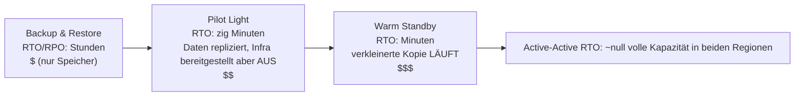

# Kapitel 18: Wenn Dinge kaputtgehen

Um 23:17 Uhr ging das Licht aus.

Nicht im Nimbus-Büro – Leo war zu Hause, auf der Couch, den Laptop halb zugeklappt. Das Licht ging in einem Rechenzentrum in Oregon aus, das er nie besucht hatte, in einem Gebäude, das er nie gesehen hatte, in einem Raum voller Server, die er nie berührt hatte. Er wusste es noch nicht. Es gab einen Moment – nur einen Moment – völliger Stille, bevor die Notstromgeneratoren irgendwo weit entfernt ansprangen. Die Art von Dunkelheit, in der man nicht sagen kann, ob die Augen offen oder geschlossen sind.

Dann kam die Slack-Benachrichtigung.

---

Nachdem die Überwachungssysteme aus Kapitel 17 eingerichtet waren, hatte das Team so etwas wie Zuversicht verspürt. Alarme wurden ausgelöst. Dashboards waren grün. Logs flossen in CloudWatch. Sie hatten drei Wochen damit verbracht, in jeden Winkel der Nimbus-Infrastruktur Sichtbarkeit einzubauen.

Was niemand laut ausgesprochen hatte – wovor die Überwachung nicht schützte – war, dass Sichtbarkeit und Widerstandsfähigkeit verschiedene Dinge sind. Man kann etwas bis ins kleinste Detail ausfallen sehen. Das Zusehen verhindert es nicht.

Diese Lektion kam um 23:23 Uhr an einem Donnerstag.

---

Leo erhielt die Slack-Benachrichtigung.

„us-west-2 – Ausfall eines Rechenzentrum-Clusters – reduzierter Dienst.“

Er öffnete die AWS-Konsole. Die EC2-Instanzen in einer der Availability Zones zeigten fehlgeschlagene Statusprüfungen. Seine Auto Scaling Group hatte ungesunde Instanzen erkannt und startete Ersatzinstanzen – in derselben Zone.

In dem Cluster, der gerade ausfiel.

Die neuen Instanzen ließen sich ebenfalls nicht starten. Sie befanden sich in derselben Hardwarefehlerzone.

„Der Load Balancer leitet den Traffic an beide AZs weiter“, sagte Leo zu niemandem. „Die Hälfte unseres Traffics geht an Instanzen, die nicht funktionieren.“

Er öffnete die EC2-Konsole und begann zu klicken. Unter „Load Balancers“ zeigte der Application Load Balancer beide Zielgruppen als gesund an – weil die Gesundheitsprüfung auf Port 80 bestand und selbst die ausfallenden Instanzen auf diese Prüfung antworteten. Sie konnten nur keine echten Anfragen verarbeiten.

Er versuchte, die ausfallende AZ aus der Zielgruppe zu entfernen. Die Konsole akzeptierte die Änderung. Aber die Auto Scaling Group, die so konfiguriert war, dass sie das Gleichgewicht aufrechterhielt, begann sofort zu versuchen, die beendeten Instanzen zu ersetzen – in derselben ausfallenden Zone.

Leo starrte auf den Bildschirm. Er hatte es gerade noch schlimmer gemacht.

Er rief die ASG-Konfiguration auf. Die Einstellung „Kapazität über Availability Zones hinweg ausgleichen“ war aktiv. Im Normalbetrieb war das ein gutes Design. Im Moment arbeitete sie aktiv gegen ihn.

Er stellte die ASG so um, dass sie nur die gesunde Zone verwendete. Wendete die Änderung an.

Die Konsole zeigte die Änderung als „In Service“ an.

Drei Minuten später kamen die ersten gesunden Ersatzinstanzen hoch.

Der Load Balancer begann, Traffic weiterzuleiten. Die Fehlerrate sank von 52 % auf 4 %. Die verbleibenden 4 % waren Anfragen, die auf den letzten paar ungesunden Instanzen gelandet waren, die noch Verbindungen abbauten.

Um 23:45 Uhr – zweiundzwanzig Minuten nach Beginn des Ausfalls – war der Traffic stabil.

Zweiundzwanzig Minuten reduzierter Service, bevor er es bemerkte und die ASG manuell auf die ausschließliche Nutzung der gesunden Zone umstellte.

„Das ist passiert, weil alles in einer AZ war“, sagte Priya am nächsten Morgen.

„Nein“, sagte Leo. „Ich hatte Instanzen in zwei AZs. Das Problem war, dass die Ersatzinstanzen in der ausfallenden AZ gestartet wurden.“

„Und die Datenbank?“

Leo hielt inne.

„Die RDS-Primärinstanz befand sich in der ausfallenden Zone“, sagte er. „Multi-AZ hat tatsächlich seine Arbeit getan – es wechselte in etwa neunzig Sekunden auf den Standby in der gesunden Zone. Aber unsere Anwendungsserver hielten ihre toten Verbindungen offen und versuchten es mit der zwischengespeicherten IP-Adresse erneut, anstatt den DNS-Namen des Endpunkts neu aufzulösen. Die Datenbank war um 23:25 Uhr gesund. Unsere App stellte erst sauber wieder Verbindung her, als ich die Connection Pools neu startete.“

Aus zweiundzwanzig Minuten reduziertem Service waren achtunddreißig geworden.

Als Leo die Auto Scaling Group vor acht Monaten eingerichtet hatte, hatte er die Einstellung „Kapazität über AZs hinweg ausgleichen“ angekreuzt und gedacht, das sei gut genug. „Das passt schon“, hatte er Maya damals gesagt. „AWS kümmert sich automatisch um das AZ-Zeug.“ Er hatte recht gehabt, dass AWS sich darum kümmert – und unrecht, was „automatisch“ bedeutete.

„Was wäre passiert“, fragte Maya am nächsten Morgen, „wenn wir alles richtig konfiguriert hätten? Wie sieht das korrekte Multi-AZ-Setup bei einem echten Ausfall aus?“

Leo dachte darüber nach. Er dachte seit 23:45 Uhr darüber nach.

Im hypothetisch korrekten Setup: Die ASG hätte Instanz-Gesundheitsprüfungen gehabt, die die ALB-Gesundheit betrachteten – nicht nur den EC2-Status. Als die AZ ausfiel, wäre die Gesundheitsprüfung auf diesen Instanzen innerhalb von 30 Sekunden fehlgeschlagen. Die ASG hätte die Ausfälle erkannt und sofort begonnen, Ersatzinstanzen zu starten – und wenn Starts in einer AZ dauerhaft fehlschlagen, verschiebt die Gruppe Kapazität in die verbleibenden gesunden Zonen, anstatt gegen die ausfallende anzukämpfen.

Der Load Balancer hätte die Ziele der ausfallenden AZ innerhalb derselben 30 Sekunden aus der Rotation genommen. Der Traffic hätte sich in der gesunden AZ konzentriert.

Für die Datenbank: Das Multi-AZ-Failover selbst hatte funktioniert – was fehlte, war Disziplin auf Client-Seite. Connection Pools, die beim erneuten Verbinden den DNS-Namen des Endpunkts neu auflösen (statt die IP zwischenzuspeichern), kurze DNS-Cache-TTLs und Wiederholungslogik. Mit diesen Maßnahmen ist ein RDS-Failover ein Aussetzer von 60–120 Sekunden, kein 16-minütiger Nachlauf.

Gesamte für den Kunden sichtbare Auswirkung: 60–90 Sekunden erhöhter Latenz, während die Datenbank umschaltete. Nicht 38 Minuten kaskadierender Fehler.

„Wir hatten die gesamte Infrastruktur, um das zu überstehen“, sagte Leo. „Wir hatten sie nur falsch konfiguriert.“

Dieser Satz war schwerer auszusprechen als der ursprüngliche Vorfall.

**Die Analogie zum Stromnetz**

Denken Sie darüber nach, wie Ihr Zuhause Strom bekommt. Der Strom kommt nicht von einem einzelnen Draht, der von einem einzelnen Generator wegführt. Er kommt von einem Netz – einem Netzwerk aus Generatoren, Umspannwerken und Übertragungsleitungen, die sich gegenseitig absichern. Wenn ein Umspannwerk Feuer fängt, leiten die anderen den Strom darum herum. Sie bemerken es nicht. Das Licht bleibt an.

AWS Availability Zones funktionieren auf die gleiche Weise. Anstatt eines einzigen riesigen Rechenzentrums, von dem alles abhängt, verteilt AWS Ihre Ressourcen über mehrere physisch getrennte Einrichtungen. Wenn eine Einrichtung den Strom verliert oder einen Hardwarefehler hat, laufen die anderen weiter. Der Traffic wird automatisch umgeleitet. Ihre Anwendung bleibt online – weil es nie einen einzelnen Draht gab, den man durchtrennen konnte.

Das ist **Multi-AZ-Architektur**: das Verteilen Ihrer Ressourcen über physisch getrennte Einrichtungen, sodass ein einzelner Ausfall nie alles lahmlegt.

Multi-Region ist die nächste Stufe: Stellen Sie sich vor, Sie hätten Notstromgeneratoren in einer völlig anderen Stadt. Wenn das gesamte lokale Stromnetz ausfällt, übernimmt die ferne Stadt. Komplexer einzurichten, aber widerstandsfähiger gegen katastrophale Ausfälle.

Sie fragen sich vielleicht: Wenn Multi-AZ einfach bedeutet, Ressourcen über zwei Rechenzentren zu verteilen, warum macht AWS das nicht standardmäßig für alles? Die Antwort sind die Kosten. Multi-AZ verdoppelt die Infrastruktur ungefähr – und für eine Entwicklungsumgebung oder ein internes Tool mit geringem Traffic sind diese zusätzlichen Kosten nicht gerechtfertigt. Für Produktionslasten dreht sich die Frage jedoch um: Können Sie sich die Ausfallzeit leisten, wenn Sie es nicht haben?

**Der Wortschatz des Ausfalls**

Bevor Sie für Widerstandsfähigkeit entwerfen, brauchen Sie Wörter für das, wogegen Sie entwerfen.

„Wie messen wir überhaupt, ob wir widerstandsfähig genug sind?“ fragte Priya.

„Zwei Zahlen“, sagte Leo. „Wie lange wir ausfallen können und wie viele Daten wir verlieren können.“

**Verfügbarkeit**: Der Prozentsatz der Zeit, in der ein System betriebsbereit ist. „Vier Neunen“ (99,99 %) bedeutet weniger als 52 Minuten Ausfallzeit pro Jahr. „Fünf Neunen“ (99,999 %) bedeutet etwa 5 Minuten pro Jahr.

**RTO (Recovery Time Objective)**: Wie lange kann das System ausfallen, bevor es zu einem Geschäftsproblem wird? Wenn Ihr RTO 4 Stunden beträgt, haben Sie 4 Stunden Zeit, um den Dienst wiederherzustellen, bevor SLAs verletzt werden.

**RPO (Recovery Point Objective)**: Wie viele Daten können Sie sich leisten zu verlieren? Wenn Ihr RPO 1 Stunde beträgt, können Sie tolerieren, bei einem katastrophalen Ausfall bis zu einer Stunde an Daten zu verlieren. Alles, was in der letzten Stunde vor dem Ausfall geschrieben wurde, ist weg.

**Fehlertoleranz**: Die Fähigkeit, (auf einem gewissen Niveau) weiterzuarbeiten, wenn eine Komponente ausfällt.

**Disaster Recovery (DR)**: Der Prozess der Wiederherstellung nach einem katastrophalen Ausfall – Rechenzentrumsbrand, regionsweiter Ausfall, versehentliche Massenlöschung.

Diese fünf Konzepte treiben jede architektonische Entscheidung in diesem Kapitel an.

**RTO und RPO sind geschäftliche Entscheidungen, keine technischen**

Die Zahlen sind weniger wichtig als die Frage, wer sie festlegt. Ein Ingenieur kann das RTO erraten. Ein geschäftlicher Stakeholder weiß, was ein 30-minütiger Ausfall tatsächlich kostet.

Betrachten Sie zwei Unternehmen mit demselben Technologie-Stack:

Ein Fintech-Unternehmen, das Wertpapiergeschäfte abwickelt: RTO von 4 Minuten, RPO von null. Ein Handelssystem, das während der Handelszeiten für vier Minuten ausfällt, könnte Tausende von Transaktionen verpassen. Jede verpasste Transaktion hat einen direkten Geldwert. Null Datenverlust ist nicht philosophisch – der Verlust eines einzigen bestätigten Geschäfts bedeutet Compliance-Probleme und Kundenklagen. Die Architekturkosten, um dies zu erreichen: Active-Active-Multi-AZ mit synchroner Replikation, sechsstelliges jährliches Infrastrukturbudget.

Eine Bestellplattform für Restaurants: RTO von 30 Minuten, RPO von 5 Minuten. Ein 30-minütiger Ausfall während des Abendansturms ist wirklich schmerzhaft und kostet echtes Geld. Aber der Verlust der letzten 5 Minuten an Bestellungen vor einem Ausfall bedeutet, dass eine Handvoll Kunden erneut bestellen müssen – ärgerlich, nicht katastrophal. Die Architekturkosten, um dies zu erreichen: Warm-Standby-Multi-AZ, ein Bruchteil des Fintech-Budgets.

„Moment – aber *warum* sollte eine Restaurantplattform 5 Minuten Datenverlust akzeptieren?“ fragte Maya, als Leo dies erklärte. „Verliert man da nicht trotzdem Kundenbestellungen?“

„Die Frage ist, ob das Verhindern dieses Datenverlusts mehr kostet, als es wert ist“, sagte Leo. „Das RPO von 5 Minuten auf 0 zu reduzieren, würde synchrone Replikation über Regionen hinweg erfordern. Das ist eine erhebliche Kosten- und Entwicklungsinvestition. Für eine Restaurant-App in unserer Größenordnung ist das RPO von 5 Minuten der richtige Kompromiss.“

Die Lektion: RTO und RPO sind keine technischen Minimalwerte. Sie sind geschäftliche Kompromisse, ausgedrückt als Zahlen. Sie festzulegen erfordert sowohl das Entwicklungsteam (das weiß, was erreichbar ist) als auch die geschäftlichen Stakeholder (die wissen, was akzeptabel ist).

**Multi-AZ: Availability-Zone-Ausfälle überleben**

Eine Availability Zone (AZ) ist ein physisch getrenntes Rechenzentrum innerhalb einer Region. AZs sind so konzipiert, dass sie unabhängig sind: separate Stromversorgung, separate Kühlung, separate Netzwerkinfrastruktur. Aber sie sind nahe genug, dass die Netzwerklatenz zwischen ihnen 1–2 Millisekunden beträgt.

**Multi-AZ-Bereitstellungen** verteilen Ihre Ressourcen über zwei oder mehr AZs innerhalb einer Region. Wenn eine AZ ausfällt:

- Der Load Balancer hört auf, Traffic an ungesunde Instanzen in der ausgefallenen AZ weiterzuleiten
- Die Auto Scaling Group ersetzt Instanzen – aber in der *gesunden* AZ
- RDS schaltet auf den Standby in der gesunden AZ um

Leos Fehler: Seine Auto Scaling Group war nicht so konfiguriert, dass sie Ersatzinstanzen auf gesunde AZs beschränkte. Sie war so konfiguriert, dass sie das Gleichgewicht zwischen den AZs aufrechterhielt. Als die Zone ausfiel, versuchte die ASG, die Instanzanzahl auszugleichen, indem sie dort Ersatzinstanzen startete – in der ausfallenden Zone.

Die Lösung: Konfigurieren Sie die ASG so, dass sie nur in gesunde AZs startet, wobei stets mindestens zwei AZs aktiv sind.

Die tiefere Lektion: Testen Sie Ihre Ausfallszenarien, bevor sie in der Produktion auftreten.

Wenn Sie sich für Multi-AZ entscheiden, erhalten Sie automatisches Failover und ein nahezu null RPO – aber Sie zahlen für Infrastruktur, die im Normalbetrieb keinen Traffic bedient. Diese Standby-RDS-Instanz läuft immer, repliziert immer und beantwortet nie eine Abfrage, bis die Primärinstanz ausfällt. Das ist der Kompromiss: Zuverlässigkeit kostet Geld, selbst wenn nichts kaputt ist.

**Chaos Engineering: Wie der erste Durchlauf aussah**

Der erste Chaos-Engineering-Durchlauf bei Nimbus war nicht so sauber, wie die Dokumentation es klingen ließ.

Leo führte Schritt 2 des Runbooks aus: ein RDS-Multi-AZ-Failover erzwingen. Er verwendete die AWS CLI:

```
aws rds reboot-db-instance \
    --db-instance-identifier nimbus-prod \
    --force-failover
```

Der Befehl kehrte sofort zurück. Leo startete den Timer.

T+0s: Failover initiiert. Die RDS-Konsole zeigt den Primärstatus als „rebooting“ an.

T+18s: Die Anwendungslogs beginnen, Datenbankverbindungsfehler anzuzeigen. Der Connection Pool versucht es mit der alten Primärinstanz, die nicht mehr Primär ist.

T+34s: Die RDS-Konsole zeigt den Status als „backing-up“ an. Die neue Primärinstanz wird befördert. Der DNS-CNAME (der Datenbankendpunkt) wird aktualisiert.

T+52s: Die Anwendungslogs beginnen wieder, erfolgreiche Verbindungen anzuzeigen. Der Connection Pool hat die Wiederholungsversuche auf der alten Primärinstanz erschöpft und sich erneut mit dem CNAME verbunden, der nun auf die neue Primärinstanz zeigt.

T+4:17: Alle Verbindungen wiederhergestellt. Fehlerrate zurück auf null.

Gesamt: 4 Minuten und 17 Sekunden.

„Das sind 257 Sekunden Datenbanknichtverfügbarkeit“, sagte Tom. „Die Tablets unserer Restaurantpartner zeigen 4 Minuten lang ein Lade-Symbol an.“

„Unsere SLA sagt 5 Minuten“, sagte Leo.

„Also haben wir bestanden“, sagte Priya. „Knapp.“

„Zwei Beobachtungen“, sagte Tom. „Erstens: Wir haben bestanden, weil unsere RTO-Zusage großzügig war, nicht weil unsere Architektur besonders schnell ist. Zweitens: Das Wiederholungsverhalten des Connection Pools hat uns die zusätzlichen 34 Sekunden verschafft. Wenn die Anwendung nach 10 Sekunden aufgegeben hätte, wären wir durchgefallen.“

Leo aktualisierte das Runbook, um die beobachteten Zeiten zu dokumentieren. Das Ziel für das nächste Quartal: die Failover-Erkennungszeit von 52 Sekunden auf unter 30 zu reduzieren, indem die Parameter des Connection Pools und die Gesundheitsprüfungslogik der Anwendung optimiert werden.

„Chaos Engineering ist kein einmaliger Test“, sagte Priya. „Es ist eine Feedback-Schleife. Man testet, man findet die tatsächlichen Zahlen, man verbessert, man testet erneut.“

Beim dritten Mal, als sie sechs Monate später den Failover-Test durchführten, betrug die Wiederherstellungszeit 1 Minute und 44 Sekunden. Nicht weil RDS schneller geworden war – sondern weil sie die Anwendung optimiert hatten.

**Ausfälle simulieren: Chaos Engineering**

„Wie wissen wir, dass unser Multi-AZ-Setup tatsächlich funktioniert?“ fragte Maya.

„Wir machen Dinge absichtlich kaputt“, sagte Leo.

„Moment – aber *warum* sollten wir es so machen?“ sagte Maya. „Warum nicht einfach darauf vertrauen, dass die AWS-Dokumentation sagt, dass es funktioniert?“

„Weil die Dokumentation beschreibt, wie der Dienst funktioniert. Sie beschreibt nicht, wie *Ihre Konfiguration* funktioniert. Das sind verschiedene Dinge.“

Priya beugte sich vor. „Haben wir darüber nachgedacht, was passiert, wenn die Gesundheitsprüfung des Load Balancers und die Gesundheitsprüfung der ASG nicht übereinstimmen? Der Load Balancer könnte eine Instanz aus der Rotation nehmen, aber die ASG hält die Instanz für gesund und ersetzt sie nicht. Wir hätten Kapazität, die für den Load Balancer unsichtbar ist.“

„Genau das ist die Art von Sache, die Chaos Engineering finden würde“, sagte Leo.

Das klingt leichtsinnig. Es ist tatsächlich das Verantwortungsvollste, was ein Team tun kann.

**RTO-Zusagen testen**

Hier ist die unbequeme Wahrheit über RTO: Die meisten Teams legen ein RTO fest und testen dann nie, ob sie es tatsächlich einhalten können.

Ein RTO von 30 Minuten ist keine Garantie. Es ist ein Ziel. Die einzige Möglichkeit zu wissen, ob Sie es erreichen, besteht darin, den Ausfall zu simulieren und die Wiederherstellung zu messen.

Nach dem Vorfall um 23:23 Uhr verpflichtete sich das Nimbus-Team, jeden Ausfallmodus quartalsweise zu testen. Nicht nur manuell – mit schriftlichen Akzeptanzkriterien. Die Wiederherstellung nach einem AZ-Ausfall musste innerhalb von 10 Minuten abgeschlossen sein. Die Wiederherstellung nach einem RDS-Failover musste innerhalb von 5 Minuten abgeschlossen sein. Die Datenbankwiederherstellung aus dem Backup (der Backup-und-Restore-DR-Test) musste innerhalb von 2 Stunden abgeschlossen sein.

Diese Zahlen stammten aus Gesprächen mit Restaurantpartnern, die sagten, ein Ausfall während des Abendansturms unter 10 Minuten sei „schmerzhaft, aber akzeptabel“. Über 30 Minuten sei ein Anlass für ein Vertragsgespräch.

„Die SLA-Verhandlung sollte stattfinden, bevor man das RTO festlegt“, sagte Maya. „Nicht danach.“

Sie hatte nicht unrecht. Sie hatten es rückwärts gemacht. Sie hatten das RTO intern festgelegt und dann erkannt, dass sie es mit dem abgleichen mussten, was das Geschäft tatsächlich erforderte.

RTO und RPO in der richtigen Reihenfolge festlegen: zuerst die Geschäftsanforderung, dann die Architektur, um sie zu erfüllen, dann der Test zur Überprüfung. Die meisten Teams beginnen mit der Architektur und arbeiten rückwärts. Die Zahlen leiden darunter.

**Chaos Engineering** ist die Praxis, absichtlich Fehler in Ihr System einzuschleusen, um zu überprüfen, ob es korrekt damit umgeht. Sie beenden absichtlich eine EC2-Instanz. Sie führen manuell ein Failover der RDS-Instanz durch. Sie blockieren ein Subnetz vom Load Balancer.

Wenn sich das System innerhalb Ihres RTO automatisch erholt, funktioniert Ihr Design.

Wenn nicht, haben Sie das in einer kontrollierten Umgebung gelernt – nicht während eines Produktionsvorfalls um 2 Uhr nachts.

Für Nimbus: Leo schrieb ein Runbook (eine dokumentierte Vorgehensweise) zum Testen jedes Ausfallszenarios. Einmal pro Quartal würden sie absichtlich eine Komponente ausfallen lassen und die Wiederherstellungszeit messen. Wenn die Wiederherstellung länger dauerte als das RTO, würden sie das Design korrigieren.

**Multi-Region: Regionale Ausfälle überleben**

Die meisten AWS-Ausfälle betreffen Availability Zones, nicht ganze Regionen. Regionale Ausfälle sind selten – aber sie kommen vor.

Bei einem regionalen Ausfall (oder für globale Anwendungen, die überall sehr geringe Latenz benötigen) ist **Multi-Region** die Antwort: Stellen Sie Ihre Anwendung in zwei oder mehr AWS-Regionen bereit.

Multi-Region bringt grundlegende Komplexität mit sich:

**Datenreplikation**: Ihre Datenbanken müssen über die Regionen hinweg synchron sein. Alle in us-east-1 geschriebenen Daten müssen irgendwann eu-west-1 erreichen. „Irgendwann“ ist das Problem – während der Zeitverzögerung haben die Regionen leicht unterschiedliche Sichten auf die Welt.

**Active-Passive vs. Active-Active**:

- **Active-Passive**: Eine Region bedient den gesamten Traffic. Die andere ist ein Warm Standby. Bei einem Ausfall schaltet DNS den Traffic auf den Standby um. Einfacher, aber der Standby ist untätig und teuer.
- **Active-Active**: Beide Regionen bedienen gleichzeitig Traffic. Komplexer zu bauen (erfordert Konfliktlösung für gleichzeitige Schreibvorgänge), aber global niedrigere Latenz und keine untätigen Ressourcen.

Active-Active klingt verlockend, bis Sie sorgfältig über Schreibvorgänge nachdenken. Wenn ein Kunde in us-east-1 eine Bestellung aufgibt und gleichzeitig das Restaurant in eu-west-1 seine Speisekarte aktualisiert und es eine Netzwerkpartition zwischen den Regionen gibt – welcher Schreibvorgang gewinnt? Das ist das CAP-Theorem in der Praxis: In einem verteilten System müssen Sie während einer Netzwerkpartition zwischen Konsistenz (beide Regionen sind sich über dieselben Daten einig) und Verfügbarkeit (beide Regionen nehmen weiterhin Anfragen an, auch während sie sich uneinig sind) wählen. Active-Active beseitigt diese Wahl nicht. Es erfordert, dass Sie sie explizit treffen, in Ihrem Datenmodell.

Für Nimbus: Active-Passive. Sie wollten nicht über gleichzeitige Schreibkonflikte in ihren Speisekarten- und Bestelldaten nachdenken müssen. Eine einzige maßgebliche Primärregion war in dieser Phase einfacher und sicherer.

**Failover-Zeit**: DNS-Änderungen brauchen Zeit zur Propagierung (abhängig von der TTL). Während des Propagierungsfensters erreichen einige Benutzer weiterhin die ausgefallene Region. Die Auslegung auf ein sehr niedriges RTO erfordert das Vorwärmen des Standby und die Minimierung der TTL vor geplanten Umschaltungen.

**Route 53 DNS-Failover: Die Netzwerkschicht der DR**

Bevor wir zum vollständigen Spektrum der DR-Strategien kommen, lohnt es sich zu verstehen, wie DNS in das Failover passt – denn es ist oft das, was den Traffic tatsächlich zwischen Regionen umschaltet.

**Amazon Route 53** unterstützt gesundheitsprüfungsbasiertes Routing. Sie konfigurieren:

1. Eine Gesundheitsprüfung, die Ihren primären Endpunkt überwacht (typischerweise ein HTTP-Endpunkt, der 200 zurückgibt, wenn er gesund ist)
2. Einen primären DNS-Eintrag, der auf Ihre Primärregion zeigt
3. Einen sekundären (Failover-)DNS-Eintrag, der auf Ihre DR-Region zeigt

Wenn Route 53 erkennt, dass die primäre Gesundheitsprüfung fehlschlägt, schaltet es die DNS-Antworten automatisch auf den sekundären Eintrag um. Benutzer, die Ihre Domain auflösen, erhalten nun die IP der DR-Region.

„Und was, wenn jemand während des Failover-Fensters versucht einzubrechen?“ fragte Priya. „Das SSL-Zertifikat für unsere Domain – funktioniert es in beiden Regionen, oder bricht HTTPS?“

„Das Zertifikat muss in beiden Regionen bereitgestellt werden“, bestätigte Leo. „Wenn Sie ACM (AWS Certificate Manager) verwenden, bedeutet das, in jeder Region unabhängig ein Zertifikat anzufordern.“

Die Mechanik des Route-53-Failovers:

- Gesundheitsprüfungen laufen alle 30 Sekunden von mehreren AWS-Standorten weltweit
- Nach 3 aufeinanderfolgenden Fehlern (90 Sekunden) markiert Route 53 den Endpunkt als ungesund
- DNS-Antworten schalten sofort auf den Failover-Eintrag um
- Aber: Die DNS-TTL gilt weiterhin. Wenn Ihre TTL 300 Sekunden beträgt, treffen Clients, die die primäre IP bereits zwischengespeichert haben, bis zu 5 Minuten lang weiter auf die ausgefallene Region

Deshalb ist das Reduzieren der TTL Teil der Vorbereitung vor der Katastrophe. Sie können die TTL während eines Vorfalls nicht ändern (die Änderung propagiert nicht rechtzeitig). Die TTL-Änderung muss Tage oder Wochen vorher vorgenommen werden, damit die Resolver-Caches bei einem Ausfall bereits die kurze TTL verwenden.

„Das Reduzieren der DNS-TTL ist also keine Wiederherstellungsmaßnahme“, sagte Leo. „Es ist eine Maßnahme zur Vorpositionierung.“

„Haben wir das gemacht?“ fragte Maya.

Hatten sie nicht.

Nach diesem Gespräch reduzierte Leo die TTL für eatnimbus.com von 300 Sekunden auf 60 Sekunden. Die Änderung kostete nichts und verbesserte ihre Worst-Case-Failover-Zeit von potenziell 8 Minuten auf knapp unter 3.

**Disaster-Recovery-Strategien: Ein Spektrum**

Es gibt vier gängige DR-Strategien, angeordnet von der günstigsten (und langsamsten in der Wiederherstellung) bis zur teuersten (und schnellsten in der Wiederherstellung):



**Backup und Restore** (Stunden RPO/RTO):

- Sichern Sie alles in S3 in einer anderen Region
- Im Katastrophenfall: Infrastruktur von Grund auf bereitstellen, aus dem Backup wiederherstellen
- Kosten: sehr niedrig (Sie zahlen nur für die Speicherung)
- Wiederherstellungszeit: Stunden

**Pilot Light** (Minuten bis 1 Stunde RPO/RTO):

- Replizieren Sie die Daten kontinuierlich und halten Sie die Kerninfrastruktur in der DR-Region *bereitgestellt, aber abgeschaltet* – Templates, AMIs, gestoppte oder auf null skalierte Ressourcen. Nichts bedient Traffic; nur die Datenreplikation ist „angezündet“ (das ist die Pilot Light, die Zündflamme)
- Die Kerndaten werden repliziert (RDS Read Replica in der DR-Region)
- Im Katastrophenfall: das Compute der DR-Region starten/hochskalieren, die Read Replica zur Primärinstanz befördern, DNS umschalten
- (Im Gegensatz zum Warm Standby unten: dort läuft tatsächlich eine verkleinerte Kopie der Anwendung)
- Kosten: moderat (Sie zahlen für die Datenreplikation und die bereitgestellten, aber abgeschalteten Ressourcen, nicht für laufendes Compute)
- Wiederherstellungszeit: zig Minuten

**Warm Standby** (Sekunden bis Minuten RPO/RTO):

- Betreiben Sie eine verkleinerte Version der vollständigen Anwendung in der DR-Region
- Voll funktionsfähig, aber mit reduzierter Kapazität
- Im Katastrophenfall: hochskalieren, DNS umschalten
- Kosten: höher (der vollständige Stack läuft immer in reduzierter Größe)
- Wiederherstellungszeit: Minuten

**Active-Active / Multi-Site** (nahezu null RPO/RTO):

- Volle Kapazität in zwei oder mehr Regionen, die gleichzeitig Traffic bedienen
- Keine Wiederherstellung nötig – wenn eine Region ausfällt, wird der Traffic automatisch zur anderen geleitet
- Kosten: am höchsten (zwei vollständige Bereitstellungen in voller Größe)
- Wiederherstellungszeit: Sekunden (nur DNS-Propagierung)

Ein Dienst automatisiert die Mitte dieses Spektrums: **AWS Elastic Disaster Recovery (DRS)** repliziert Ihre Server kontinuierlich – ob On-Premises oder EC2 – Block für Block in einen kostengünstigen Staging-Bereich und kann im Katastrophenfall innerhalb von Minuten vollständige Wiederherstellungsinstanzen starten. Im Grunde ist es ein *verwalteter Pilot Light*: Wiederherstellungszeiten nahe am Warm Standby zu Preisen nahe an Backup-und-Restore. Prüfungssignal: „Ausfallzeit und Datenverlust für serverbasierte Workloads mit einem verwalteten DR-Dienst minimieren“ → Elastic Disaster Recovery.

Für Nimbus in dieser Phase: Warm Standby. Sie konnten sich Active-Active nicht leisten, aber Backup und Restore war für ihre Geschäftsanforderungen zu langsam.

**Amazon RDS: Multi-AZ vs. Read Replicas vs. Multi-Region**

Diese drei sind verschieden und werden häufig verwechselt:

| Merkmal       | Multi-AZ                     | Read Replica     | Multi-Region Read Replica |
|---------------|------------------------------|------------------|---------------------------|
| Zweck         | Hochverfügbarkeit (Failover) | Leseskalierung   | Leseskalierung + DR       |
| Datensynchron. | Synchron                    | Asynchron        | Asynchron                 |
| Failover      | Automatisch                  | Manuelle Beförderung | Manuelle Beförderung  |
| Lesbar?       | Nein (Standby ist passiv)    | Ja               | Ja                        |
| Regionsübergreifend? | Nein (gleiche Region) | Ja (optional)    | Ja                        |
| Verwenden für | HA, RPO~0                    | Leselast         | Disaster Recovery         |

Wichtige Erkenntnis: Der Multi-AZ-Standby ist **synchron** – jeder Schreibvorgang auf die Primärinstanz wird auf dem Standby bestätigt, bevor der Schreibvorgang quittiert wird. Das bedeutet, dass bei einem Ausfall der Primärinstanz keine Daten verloren gehen. RPO = 0.

Read Replicas sind **asynchron** – es gibt eine Replikationsverzögerung. Wenn die Primärinstanz ausfällt und Sie eine Read Replica befördern, können Sie Sekunden oder Minuten der jüngsten Schreibvorgänge verlieren. RPO > 0.

**Aurora Global Database: Multi-Region für die Produktion**

Für Teams, die echte Multi-Region-Widerstandsfähigkeit benötigen, ändert **Aurora Global Database** die Rechnung. Eine standardmäßige RDS Read Replica in einer anderen Region verwendet asynchrone Replikation mit einer Verzögerung, die typischerweise in Sekunden gemessen wird – das bedeutet, dass ein regionaler Ausfall diese Sekunden an Schreibvorgängen verliert. Aurora Global Database verwendet eine dedizierte Replikationsinfrastruktur, die eine Replikationsverzögerung von unter 1 Sekunde zwischen der Primärregion und den Sekundärregionen erreicht.

Als das Team es im Post-Incident-Review besprach, rief Leo den Vergleich auf:

- Standardmäßige RDS-Cross-Region-Read-Replica: Replikationsverzögerung typischerweise 1–10 Sekunden, unter hoher Last bis zu Minuten. Die Beförderung zu einer eigenständigen Datenbank dauert Minuten und beinhaltet manuelle Schritte.
- Aurora-Global-Database-Sekundär: Replikationsverzögerung typischerweise unter 1 Sekunde. Die Beförderung von Sekundär zu Primär dauert unter 1 Minute.

„Das bedeutet, wenn us-west-2 vollständig ausfällt“, erklärte Leo, „haben wir weniger als 1 Sekunde potenziellen Datenverlust und können innerhalb einer Minute Traffic aus us-east-1 bedienen.“

„Wie viel kostet das pro Monat?“ fragte Tom sofort.

Mehr als das standardmäßige Multi-AZ. Aurora Global Database fügt eine I/O-Gebühr pro Schreibvorgang für die regionsübergreifende Replikation hinzu. Für Nimbus' aktuelles Volumen würde es 40–60 $/Monat zusätzlich zu den bestehenden Aurora-Kosten hinzufügen.

„Das ist der Kompromiss“, sagte Leo. „Für die Geschwindigkeit bezahlen. Oder die langsamere Beförderung und das etwas höhere RPO einer standardmäßigen Cross-Region-Read-Replica akzeptieren.“

Für den Moment blieb Nimbus beim Warm Standby. Aurora Global Database kam für die nächste Finanzierungsrunde auf die Architektur-Wunschliste.

„Gleiches Failover-Fenster, eine Schicht tiefer“, sagte Priya. „Wir haben die Zertifikate abgedeckt. Jetzt die Anmeldedaten – sie rotieren auf einer Instanz. Ist der Standby synchron?“

Leo rief die Dokumentation auf. Es war eine gute Frage. RDS Multi-AZ repliziert Daten, nicht die Secrets-Konfiguration – die Rotation des Secrets Manager musste als Teil des Failover-Runbooks getestet werden.

## Stärken und Grenzen

**Multi-AZ**:

- Unerlässlich für Produktionslasten – Single-AZ ist ein Single Point of Failure
- Gut von AWS-Diensten unterstützt (RDS, ElastiCache, EKS, ALB unterstützen alle Multi-AZ)
- Relativ geringer Kostenaufwand im Vergleich zum gebotenen Schutz
- AZ-Ausfälle sind die häufigste Kategorie von AWS-Ausfällen – Multi-AZ deckt die wahrscheinlichsten Szenarien ab

**Multi-Region**:

- Komplex korrekt umzusetzen, insbesondere für Datenbanken
- Anforderungen an Datenresidenz/-souveränität können es tatsächlich erfordern (EU-Nutzerdaten müssen in der EU bleiben)
- Latenzvorteile für globale Nutzer entstehen durch Routing, nicht durch Multi-Region an sich (verwenden Sie CloudFront für statische Inhalte)
- Die meisten Organisationen brauchen kein Active-Active; die meisten investieren zu wenig in Warm Standby
- Die Kosten eines Multi-Region-Warm-Standby sind nicht trivial, aber die Kosten eines regionalen Ausfalls ohne ihn können viel höher sein

**Wann man Multi-AZ überspringen kann** (die seltenen Fälle):

- Entwicklungs- und Staging-Umgebungen, in denen Ausfallzeit akzeptabel ist
- Wirklich unkritische interne Tools ohne SLA-Anforderungen
- Batch-Workloads, die bei einem Ausfall einfach neu ausgeführt werden können

Der Druck, Multi-AZ wegzulassen, dreht sich fast immer um Kosten. Bevor Sie dieses Argument akzeptieren, berechnen Sie die Kosten der wahrscheinlichen Ausfallmodi: Kundenabwanderung, SLA-Strafen, Ingenieurszeit für die Wiederherstellung. In den meisten Produktionsumgebungen amortisiert sich Multi-AZ beim ersten Mal, wenn es Sie vor einem Anruf um 3 Uhr nachts bewahrt.

## Zusammenfassung

Die Überwachungsarbeit aus Kapitel 17 machte Ausfälle sichtbar. In diesem Kapitel geht es darum, die Infrastruktur so zu gestalten, dass sie sie übersteht. Beides ist wichtig; keines ist ohne das andere ausreichend.

Der Nimbus-Vorfall an jenem Donnerstagabend kostete 38 Minuten reduzierten Service. Drei Konfigurationsfehler kamen zusammen: Die ASG schloss die ausfallende AZ nicht von den Ersatzstarts aus, der RDS-Standby befand sich zufällig in der ausfallenden Zone, und niemand hatte den Failover-Prozess getestet, bevor man sich in der Produktion darauf verließ.

Alle drei waren in einem Nachmittag behebbar. Der Vorfall machte die Korrekturen auf eine Weise dringend, wie es „Best-Practice-Dokumentation“ nie ganz geschafft hatte.

Das ist das ehrliche Argument für Chaos Engineering: nicht, dass es rigorose Ingenieurspraxis ist (auch wenn es das ist), sondern dass es die Konfigurationsfehler zutage fördert, die theoretisch erscheinen, bis zu der Nacht, in der ein Rechenzentrum in Oregon einen Hardwarefehler hat.

- **RTO** (Recovery Time Objective): Wie lange Sie ausfallen können. **RPO** (Recovery Point Objective): Wie viele Daten Sie verlieren können.
- **Multi-AZ** verteilt Ressourcen über Availability Zones innerhalb einer Region. Schützt vor AZ-Ausfällen.
- **Multi-Region** wird in mehreren AWS-Regionen bereitgestellt. Schützt vor regionalen Ausfällen und bedient globale Nutzer mit geringerer Latenz.
- DR-Strategien (am günstigsten bis am teuersten): Backup & Restore → Pilot Light → Warm Standby → Active-Active.
- RDS Multi-AZ Standby: synchron, automatisches Failover, RPO = 0 innerhalb der Region. Read Replicas: asynchron, manuelle Beförderung, RPO > 0.
- Testen Sie Ihre Ausfälle absichtlich (Chaos Engineering), bevor sie in der Produktion auftreten.

## Examenstipps

*SAA-C03-Domäne: Entwurf widerstandsfähiger Architekturen (Domäne 2, Aufgabe 2.2)*

- **RTO vs. RPO**: Erwarten Sie, dass die Prüfung Ihnen Anforderungen gibt („die Organisation kann nicht mehr als 1 Stunde Ausfallzeit und keinen Datenverlust tolerieren“) und Sie auffordert, die richtige DR-Strategie zu wählen. Zuordnung: kein Datenverlust = synchrone Replikation = Multi-AZ oder Active-Active. 1 Stunde Ausfallzeit = Backup-und-Restore ist zu langsam; Warm Standby könnte funktionieren.
- **Multi-AZ RDS vs. Read Replicas**: Die Prüfung wird nach HA (Multi-AZ) vs. Leseskalierung (Read Replicas) fragen. Der Multi-AZ-Standby ist nicht lesbar. Read Replicas können (manuell) zur Primärinstanz für DR befördert werden.
- **Pilot Light vs. Warm Standby**: Pilot Light hat minimale Infrastruktur am Laufen (nur die Datenreplikation). Warm Standby hat eine verkleinerte, aber funktionsfähige Anwendung am Laufen. Der Unterschied besteht darin, wie schnell Sie hochskalieren können.
- **Aurora Global Database**: Aurora-spezifische Funktion für Multi-Region Active-Passive. Die Primärregion bedient Schreibvorgänge; die Sekundärregionen bedienen Lesevorgänge mit einer Replikationsverzögerung von <1 Sekunde. Bei einem Failover kann die Sekundär in <1 Minute befördert werden. Prüfungssignal: „Aurora, Multi-Region, RTO < 1 Minute.“
- **AWS Backup**: Zentralisierter Backup-Dienst für EBS, RDS, DynamoDB, EFS, Storage Gateway. Die Prüfung verwendet ihn für Backup-und-Restore-Szenarien.
- **Elastic Disaster Recovery (DRS)**: „verwaltete DR mit minimaler Ausfallzeit/Datenverlust für Server (On-Premises oder EC2)“, „Pilot Light, ohne es selbst zu bauen“ → DRS (kontinuierliche Replikation auf Blockebene + Wiederherstellungsstart auf Abruf).
- **Route 53 Failover**: DNS-Schicht der DR. Primäre Gesundheitsprüfung schlägt fehl → Route 53 leitet zur Sekundär weiter. Die Propagierungszeit bedeutet, dass dies nicht sofort geschieht.

## Übungen

**Übung 1 — Erinnerung**

Erklären Sie den Unterschied zwischen RTO und RPO. Warum könnte eine Organisation ein niedriges RTO (kann nicht lange ausfallen), aber ein hohes RPO (kann den Verlust jüngster Daten tolerieren) haben?

*(Hinweis: Denken Sie an ein Unternehmen, bei dem es wichtiger ist, Kunden schnell zu bedienen, als jede Transaktion zu bewahren.)*

**Übung 2 — SAA-C03-Szenario**

*Szenario*: Ein Gesundheitsunternehmen betreibt ein Patientenaktensystem auf einer PostgreSQL-kompatiblen Datenbank in `us-east-1`. Regulatorische Anforderungen schreiben vor, dass das System einen **vollständigen regionalen Ausfall** überstehen muss, mit einem RPO, das in **Sekunden** gemessen wird (nahezu null Datenverlust), und einem RTO von unter 30 Minuten. Innerhalb der Primärregion ist kein Datenverlust akzeptabel.

Welche Architektur erfüllt diese Anforderungen am BESTEN?

A) RDS Multi-AZ in `us-east-1` mit täglichen automatisierten Backups zu S3 in `us-west-2`  
B) RDS Multi-AZ in `us-east-1` mit einer Read Replica in `us-west-2`, die für manuelle Beförderung konfiguriert ist  
C) RDS in `us-east-1` mit einem Warm Standby in `us-west-2` und Active-Active-Replikation  
D) Aurora Global Database mit Primär in `us-east-1` und Sekundär in `us-west-2`

**Hinweis 1**: Trennen Sie die beiden Geltungsbereiche. *Innerhalb* einer Region bedeutet RPO = 0 synchrone Replikation (Multi-AZ – und Auroras Speicherschicht ist synchron über 3 AZs). *Über* Regionen hinweg replizieren alle realistischen Optionen asynchron – die Frage ist, wie gering die Verzögerung ist.

**Hinweis 2**: RTO = 30 Minuten bedeutet, dass Sie Zeit für eine kontrollierte Beförderung haben. Sie brauchen kein vollständig automatisches Millisekunden-Failover.

**Hinweis 3**: Vergleichen Sie das regionsübergreifende RPO jeder Option: tägliche Backups (Stunden), RDS-Cross-Region-Read-Replica (Sekunden bis Minuten, unter Last unbegrenzt), Aurora Global Database (typischerweise unter 1 Sekunde).

**Antwort**: D

**Erläuterung**: Aurora Global Database repliziert auf Speicherschicht-Ebene in die Sekundärregion mit einer typischen Verzögerung von unter einer Sekunde – was „RPO in Sekunden“ für eine regionale Katastrophe erfüllt – und eine Sekundär kann in unter einer Minute befördert werden, bequem innerhalb des 30-Minuten-RTO. Innerhalb der Primärregion ist Auroras Speicher synchron über drei AZs repliziert, was die Anforderung an null Verlust innerhalb der Region erfüllt. **Merken Sie sich die Feinheit**: Aurora Global ist über Regionen hinweg *asynchron* – sein regionsübergreifendes RPO ist *nahezu* null, nie exakt null. Wenn eine Prüfungsfrage absolut RPO = 0 verlangt, entspricht das *synchroner* Replikation (Multi-AZ, einzelne Region) – keine standardmäßige regionsübergreifende Option bietet das.

**Warum nicht A?** Tägliche S3-Backups ergeben ein regionsübergreifendes RPO von bis zu 24 Stunden. Das sind Stunden an Patientendaten, die bei einem regionalen Ausfall verloren gehen.

**Warum nicht B?** RDS-Cross-Region-Read-Replicas verwenden standardmäßige asynchrone Replikation, deren Verzögerung unter Last unbegrenzt wachsen kann – aus „Sekunden“ können Minuten werden. Machbar, aber nicht die BESTE Wahl, wenn eine Option mit Replikation unter einer Sekunde auf Speicherschicht-Ebene existiert.

**Warum nicht C?** „Active-Active-Replikation“ für PostgreSQL über Regionen hinweg ist keine standardmäßige RDS-Funktion. Diese Option beschreibt eine Fähigkeit, die erheblichen Eigenentwicklungsaufwand erfordert.

*SAA-C03-Domäne: Entwurf widerstandsfähiger Architekturen — Aufgabe 2.2*

**Übung 3 — Architektur-Herausforderung** *(Optional)*

Nimbus wurde ausgewählt, Bestelldienste für ein großes Food-Festival in Seattle bereitzustellen. Für 72 Stunden erwarten sie das 50-fache ihres normalen Traffics, mit null Toleranz für Ausfallzeit (der Vertrag des Festivalveranstalters sieht finanzielle Strafen für jegliche Ausfallzeit während der Veranstaltung vor).

Entwerfen Sie eine DR-Strategie speziell für das Festival-Fenster. Würden Sie für diese 72 Stunden auf Active-Active umschalten? Wie würden Sie das Failover vorab testen? Was wäre Ihr RTO, und wie würden Sie es vor der Veranstaltung validieren?

*(Es gibt keine einzige richtige Antwort. Das Ziel ist, das Entwerfen von DR für spezifische SLA-Anforderungen zu üben.)*

## Post-Credits-Szene

Leo baute das Chaos-Engineering-Runbook.

Jedes Quartal, in einem geplanten Wartungsfenster, würde das Team:

1. Eine EC2-Instanz in einer AZ beenden und beobachten, wie die ASG sie korrekt in der gesunden Zone ersetzt
2. Manuell ein RDS-Multi-AZ-Failover erzwingen und überprüfen, ob die Anwendung sich innerhalb von 60 Sekunden wieder verbunden hat
3. Einen vollständigen AZ-Ausfall simulieren, indem die Availability Zones der ASG angepasst werden
4. Ein eine Woche altes Backup auf eine neue RDS-Instanz wiederherstellen und überprüfen, ob die Daten korrekt aussahen

Der erste Durchlauf – das Failover von 4 Minuten und 17 Sekunden, das ihre 5-Minuten-SLA gerade so eingehalten hatte – hatte ihnen bereits gezeigt, wie dünn die Marge war.

„Es gibt eine finanzielle Strafe in den Verträgen, wenn wir es verfehlen“, sagte Tom.

„Dann müssen wir es schneller machen“, sagte Leo. Und er begann, die Dokumentation für eine verwaltete Datenbank zu lesen, die Failover in Sekunden statt Minuten versprach.

Im nächsten Kapitel: die Ticket-Maschine, die es jedem Teil von Nimbus ermöglicht, in seinem eigenen Tempo zu arbeiten.
