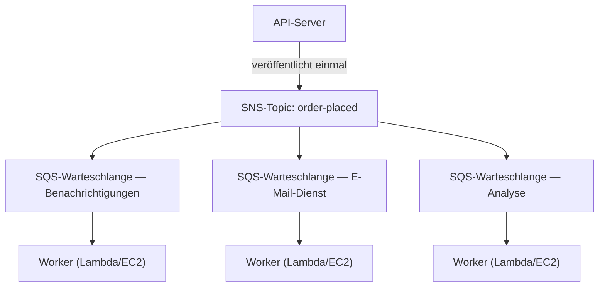

# Kapitel 19: Die Ticket-Maschine

Die Ticket-Maschine war eine stille Revolution. Eine Nummer ziehen, warten, bis man aufgerufen wird. Die Schlange wurde zu einer Warteschlange. Die Leute konnten sich hinsetzen. Der Servicecounter arbeitete in seinem eigenen Tempo. Niemand blockierte jemanden.

Vor der Ticket-Maschine musste man in der Schlange stehen. Ihre Position in der Schlange erforderte Ihre physische Anwesenheit. Sie konnten beim Warten nichts anderes tun. Und wenn die Person ganz vorne langsam war, hörten alle dahinter auf.

Die Ticket-Maschine trennte das Ankommen von der Bedienung. Man kam an, zog eine Nummer, und das System merkte sich den Platz. Man konnte sich hinsetzen. Der Servicecounter arbeitete die Nummern in dem Tempo ab, das er bewältigen konnte. Wenn der Counter vorübergehend geschlossen war, bekamen neu Ankommende trotzdem Nummern. Sie warteten. Die Arbeit verschwand nicht – sie wurde eingereiht.

Diese kleine Erfindung ist eines der ältesten Beispiele für Entkopplung in menschlichen Systemen. Am Ende dieses Kapitels wird Nimbus seine eigene Ticket-Maschine gebaut haben – in Software – und der Grund, warum sie eine brauchten, beginnt mit sechzehn Minuten Ausfallzeit an einem Freitagabend.

---

Das Team hatte den AZ-Ausfall überstanden. Leo hatte den Chaos-Engineering-Prozess korrigiert, und das Runbook war solide. Der Traffic hatte sich erholt und wuchs wieder – tatsächlich schneller als zuvor. Die Aurora-Dokumentation, die Leo spät nachts las, war immer noch ein paar Kapitel weiter, als Nimbus tatsächlich war.

Aber mit wachsendem Traffic und mehr Restaurants, die an Bord kamen, wurde eine andere Art von Engpass sichtbar. Nicht in der Infrastruktur. Im Anwendungscode selbst. Die Anfragekette, die bei 200 Bestellungen pro Stunde gut funktionierte, begann bei 800 Belastung zu zeigen.

Und dann kam der Abend des 14.

---

Es hatte mit dem Analyse-Dashboard begonnen. Um 18:47 Uhr an einem Freitag führte ein Deploy in den Analysedienst einen Timeout-Fehler ein. Der Dienst begann, in 8 Sekunden statt der üblichen 200 Millisekunden zu antworten.

Der Bestellfluss war synchron. Jede Bestellung wartete auf den Analysedienst, bevor sie dem Kunden bestätigt wurde. Aus acht Sekunden wurden 12, als die Last zunahm. Der Connection Pool der API begann sich mit Anfragen zu füllen, die auf den Abschluss des Analyseschritts warteten.

Um 18:53 Uhr erreichte der Connection Pool sein Limit. Neue Anfragen begannen sofort zu scheitern – nicht weil die Bestellung nicht verarbeitet werden konnte, sondern weil keine verfügbare Verbindung vorhanden war, um mit der Verarbeitung zu beginnen.

„Der Analysedienst hat den Bestellfluss lahmgelegt“, sagte Leo, als er am nächsten Morgen auf die Logs schaute. „Sie haben nichts miteinander zu tun. Der Analysedienst berechnet nur Dashboards.“

„Aber sie sind in derselben Anfragekette“, sagte Priya.

„Sechzehn Minuten Ausfallzeit“, sagte Maya. „Und drei Kunden wurden doppelt belastet.“

Die Doppelbelastung war schlimmer als die Ausfallzeit. Im Chaos der Connection-Pool-Sättigung war für einige Anfragen, die tatsächlich erfolgreich gewesen waren, ein Wiederholungsmechanismus angesprungen – der Zahlungsschritt war abgeschlossen, dann lief die Anfrage in einen Timeout, bevor sie zurückkehrte, und der Wiederholungsversuch versuchte die Zahlung erneut. Gleiche Karte, gleicher Betrag, zwei Belastungen.

„Der Wiederholungsmechanismus sollte eigentlich helfen“, sagte Leo.

„Er hat in die falsche Richtung geholfen“, sagte Priya. „Und haben wir darüber nachgedacht, was passiert, wenn wir versuchen, diesen Kunden eine Rückerstattung zu geben? Der Rückerstattungsprozess verwendet denselben Bestellfluss, der ausgefallen ist.“

Sechzehn Minuten Ausfallzeit und drei Doppelbelastungen. Das waren die geschäftlichen Kosten der synchronen Anfragekette.

---

Nimbus hatte ein Problem, das sich nicht wie ein Problem anfühlte, bis Bestellungen populär wurden.

Jedes Mal, wenn eine Bestellung aufgegeben wurde, musste der API-Server:

1. Die Bestellung in der Datenbank speichern
2. Eine Benachrichtigung an das Tablet des Restaurants senden
3. Eine Bestätigungs-E-Mail an den Kunden senden
4. Das Analyse-Dashboard des Restaurants aktualisieren
5. Das Ereignis für die Abrechnung protokollieren

An einem belebten Feinkostcounter wartet die Person an der Kasse nicht, bis der Schneider fertig geschnitten hat, bevor sie zum nächsten Kunden übergeht. Sie nimmt die Bestellung entgegen, gibt sie an die Küche weiter und beginnt, die nächste Person zu bedienen. Die Küche arbeitet die Bestellungen in ihrem eigenen Tempo ab. Der Kunde wird schneller bedient. Die Küche wird von plötzlichen Stoßzeiten nicht überfordert. Wenn die Küche einen langsamen Moment hat, stapeln sich die Bestellungen hinter dem Counter, statt Fehler an der Kasse zu verursachen.

Das war die Analogie. Nimbus hatte keinen Counter und keine Küche. Es hatte eine Person, die alles nacheinander erledigte, bevor der Kunde gehen konnte.

Und am 14. hatte die Person, die das Fleisch schnitt, ein Problem. Also stoppte der Counter. Also wartete jeder Kunde danach. Die Küche, die Kasse, die Kunden – alle hielten an, weil ein Schritt in der Kette sich verlangsamt hatte.

Die Lösung bestand nicht darin, das Fleischschneiden schneller zu machen. Die Lösung bestand darin, die Schritte zu trennen. Die Bestellung an der Kasse aufnehmen, ein Ticket übergeben, die Küche arbeiten lassen.

„Wir sind eng gekoppelt“, sagte Priya. „Wenn irgendein nachgelagerter Schritt fehlschlägt, schlägt die gesamte Bestellung fehl. Haben wir darüber nachgedacht, was passiert, wenn der Analysedienst kompromittiert wird und beginnt, fehlerhafte Nachrichten zu konsumieren? Die ganze Bestellung schlägt fehl – weil wir darauf warten.“

„Was, wenn wir die Bestellung speichern und dem Kunden sofort bestätigen könnten“, sagte Leo, „und dann den Rest im Hintergrund verarbeiten?“

„Das ist eine Warteschlange“, sagte Priya.

Die zentrale Erkenntnis: Der Kunde muss nicht wissen, dass das Analyse-Dashboard aktualisiert wurde, bevor er seine Bestätigung erhält. Er muss wissen, dass seine Bestellung eingegangen ist. Das sind verschiedene Dinge. Die synchrone Kette vermengte sie.

**Das Entkopplungsmodell**

Das ist **Entkopplung**: das Trennen der Komponente, die Arbeit annimmt, von den Komponenten, die sie verarbeiten.

Alle Schritte in Nimbus' Bestellfluss mussten synchron erfolgen, bevor die API dem Kunden antworten konnte. Wenn der E-Mail-Dienst langsam war (manchmal war er das), wartete der Kunde. Wenn das Analyse-Dashboard ausfiel (manchmal tat es das), schlug die Bestellung fehl.

Die Kaskade am 14. zeigte genau, warum das wichtig war. Der Analysedienst hatte nichts damit zu tun, ob die Bestellung eines Kunden angenommen wurde. Aber weil er in derselben synchronen Kette saß, wurde sein Ausfall zum Ausfall aller.

In Software-Systemen ist die Warteschlange oft ein Message Broker – ein Dienst, der Nachrichten von Produzenten annimmt und sie an Konsumenten ausliefert.

Sie fragen sich vielleicht: Wenn der Bestellfluss jetzt asynchron ist, woher weiß der Kunde, dass seine Bestellung tatsächlich eingegangen ist? Die Antwort liegt im Architekturdesign: Die API speichert die Bestellung in der Datenbank (synchron – das ist die maßgebliche Bestätigung) und veröffentlicht dann Ereignisse in der Warteschlange. Die Kundenbestätigung basiert auf dem erfolgreichen Datenbankschreibvorgang, nicht auf dem Abschluss der nachgelagerten Dienste. Wenn der E-Mail-Dienst langsam ist, hat der Kunde seine Bestätigung bereits. Die E-Mail ist nur eine nette Folgemaßnahme.

**Amazon SQS: Die Warteschlange**

**Amazon SQS (Simple Queue Service)** ist der verwaltete Message-Queue-Dienst von AWS. Er speichert Nachrichten dauerhaft, bis sie von einem Konsumenten verarbeitet werden.

Der grundlegende Ablauf:

1. **Produzent** (der API-Server) platziert eine Nachricht in der Warteschlange: `{ "orderId": "ORD-5532", "restaurantId": "47", "items": [...] }`
2. Die API antwortet dem Kunden sofort: „Bestellung bestätigt!“
3. **Konsumenten** (separate Worker-Dienste) lesen Nachrichten aus der Warteschlange und verarbeiten sie: senden die Restaurantbenachrichtigung, senden die Bestätigungs-E-Mail, aktualisieren die Analysen

Die Kundenerfahrung: sofortige Bestätigung. Die nachgelagerte Verarbeitung: findet asynchron statt, im Tempo der Worker.

**SQS-Schlüsselkonzepte**

**Message Visibility Timeout (Sichtbarkeits-Timeout)**: Wenn ein Konsument eine Nachricht aus SQS liest, wird die Nachricht für einen Zeitraum (Standard: 30 Sekunden) für andere Konsumenten *unsichtbar*. Das gibt dem Konsumenten Zeit, sie zu verarbeiten. Wenn der Konsument erfolgreich abschließt, löscht er die Nachricht. Wenn der Konsument abstürzt, läuft der Sichtbarkeits-Timeout ab und die Nachricht wird wieder sichtbar, damit ein anderer Konsument sie erneut versuchen kann.

Das gewährleistet eine At-least-once-Zustellung: Jede Nachricht wird mindestens einmal verarbeitet, selbst wenn ein Konsument mitten in der Verarbeitung ausfällt.

Sie fragen sich vielleicht: Wenn die Nachricht während der Verarbeitung unsichtbar wird, aber nicht gelöscht wird, wenn der Konsument abstürzt, könnte sie dann nicht zweimal verarbeitet werden? Ja – und das nennt man At-least-once-Zustellung. Es bedeutet, dass jeder Konsument so konzipiert sein muss, dass er den Empfang derselben Nachricht mehr als einmal handhaben kann, ohne ein Problem zu verursachen. Eine doppelte Bestellbestätigungs-E-Mail ist ärgerlich. Eine doppelte Belastung ist ein Support-Ticket. Konzipieren Sie Ihre Konsumenten entsprechend.

Der Sichtbarkeits-Timeout muss länger sein als Ihre längste erwartete Verarbeitungszeit. Wenn die Verarbeitung typischerweise 20 Sekunden dauert, aber gelegentlich 90 Sekunden, und Ihr Sichtbarkeits-Timeout 30 Sekunden beträgt, wird diese gelegentliche 90-Sekunden-Verarbeitung für SQS wie ein Fehlschlag aussehen. Die Nachricht wird wieder sichtbar. Ein zweiter Konsument nimmt sie auf. Jetzt verarbeiten zwei Worker dieselbe Nachricht. Wenn Ihre Verarbeitung nicht idempotent ist, haben Sie ein Problem.

Ein häufiger Fehler: den Sichtbarkeits-Timeout gleich der durchschnittlichen Verarbeitungszeit setzen. Der richtige Ansatz: ihn auf die Verarbeitungszeit im 99. Perzentil setzen, mit einer Sicherheitsmarge. Wenn die P99-Verarbeitungszeit 45 Sekunden beträgt, setzen Sie den Sichtbarkeits-Timeout auf 90 Sekunden.

**Dead-Letter-Queues (DLQ)**: Wenn die Verarbeitung einer Nachricht zu oft fehlschlägt (konfigurierbar – z. B. 5 Wiederholungen), verschiebt SQS sie in eine Dead-Letter-Queue. Sie untersuchen die DLQ, um zu verstehen, warum Nachrichten fehlschlagen, ohne sie zu verlieren.

Die DLQ ist der Ort, an dem Sie erfahren, was in der Produktion tatsächlich fehlschlägt. Ohne sie verschwinden fehlgeschlagene Nachrichten einfach und Sie haben keine Möglichkeit, dem nachzugehen.

Drei Wochen nach der SQS-Migration bemerkte Leo, dass sich 23 Nachrichten in der DLQ des Benachrichtigungsdienstes angesammelt hatten. Er hatte die DLQ nicht überprüft (er hatte sie korrekt eingerichtet und dann angenommen, sie würde leer bleiben).

Er zog eine Nachricht heraus und betrachtete die Nutzlast:

```json
{
  "orderId": "ORD-9821",
  "restaurantId": "12",
  "customerMessage": "Extra spicy please 🌶️🔥",
  "timestamp": "2024-01-18T19:43:11Z"
}
```

Das Emoji. Der Restaurant-Benachrichtigungsdienst kodierte die Nachrichtennutzlasten als Latin-1, bevor er sie an die veraltete Tablet-API des Restaurants sendete. Die Emoji-Zeichen – je vier Bytes in UTF-8 – wurden beschädigt, was dazu führte, dass die Tablet-API die Anfrage ablehnte. Die Nachricht wurde erneut versucht, schlug wieder fehl, wurde erneut versucht, schlug wieder fehl. Nach 5 Wiederholungen verschob SQS sie in die DLQ.

„Alle 23 Nachrichten haben Emojis im Kundennotizfeld“, sagte Leo.

„Also schlug bei jedem Kunden, der ein Emoji zu seinen Bestellnotizen hinzufügte, die Zustellung der Notiz an das Restaurant stillschweigend fehl“, sagte Maya.

„Ja.“

„Wie lange schon?“

Leo überprüfte den Zeitstempel der ältesten Nachricht. „Drei Wochen.“

Priya war still. „Und was, wenn jemand herausgefunden hätte, dass das Hinzufügen eines Emojis zu einer Bestellnotiz einen stillen Fehlschlag verursacht? Man könnte Bestellungen mit Emojis aufgeben und garantieren, dass das Restaurant die Anweisung nie sieht. Und sich dann über die falsche Bestellung beschweren.“

Niemand hatte das ausgenutzt. Aber es war die richtige Frage.

Leo behob den Kodierungsfehler. Dann schrieb er ein Skript, um alle 23 gestrandeten Nachrichten aus der DLQ erneut abzuspielen. Die Restaurants erhielten ihre (drei Wochen alten) scharfen Emoji-Anweisungen. Die Kunden erfuhren nie davon.

Die Lektion: Die DLQ muss aktiv überwacht werden, nicht eingerichtet und vergessen. Eine wachsende DLQ ist ein stilles Signal, dass etwas wiederholt fehlschlägt.

**Warteschlangentypen**:

**Standard-Warteschlangen**: Maximaler Durchsatz (unbegrenzte Nachrichten pro Sekunde). Die Zustellreihenfolge erfolgt nach bestem Bemühen (nicht garantiert). At-least-once-Zustellung (sehr selten kann eine Nachricht zweimal zugestellt werden).

**FIFO-Warteschlangen**: Strikte First-in-First-out-Reihenfolge. Exactly-once-**Verarbeitung** – Deduplizierung basierend auf einer `MessageDeduplicationId` innerhalb eines 5-Minuten-Fensters. Die Reihenfolge ist *pro* `MessageGroupId` garantiert: Nachrichten in derselben Gruppe kommen in Reihenfolge an; verschiedene Gruppen können parallel verarbeitet werden, was die Art ist, wie FIFO skaliert. Der Basisdurchsatz beträgt 3.000 Nachrichten pro Sekunde mit Batching (300 ohne); das Aktivieren des **High-Throughput-Modus** erhöht dies auf Zehntausende pro Sekunde, indem über Nachrichtengruppen partitioniert wird. Verwenden Sie FIFO, wenn die Reihenfolge wichtig ist (finanzielle Transaktionen, sequentielle Statusänderungen).

Wenn Sie maximalen Durchsatz benötigen und gelegentliche doppelte Nachrichten tolerieren können, verwenden Sie SQS Standard – aber Sie müssen jeden Konsumenten so konzipieren, dass er Duplikate ohne Probleme handhabt. Wenn Sie strikte Reihenfolge und Exactly-once-Verarbeitung benötigen, verwenden Sie SQS FIFO – und konzipieren Sie Ihre `MessageGroupId`s gut, denn Parallelität (und damit Durchsatz) entsteht durch viele Gruppen.

Für Nimbus verwendeten die meisten Warteschlangen Standard-Warteschlangen. Die Abrechnungs-Warteschlange verwendete FIFO, um sicherzustellen, dass Belastungen in der richtigen Reihenfolge verarbeitet wurden.

**Auto Scaling nach Warteschlangentiefe: Worker an den Rückstand anpassen**

Eine der mächtigsten Anwendungen von SQS ist die Verwendung der Warteschlangentiefe als Auto-Scaling-Auslöser. Anstatt nach CPU oder Speicher zu skalieren, skalieren Sie danach, wie viel Arbeit wartet.

Für Nimbus' Benachrichtigungsdienst: Die SQS-Warteschlangentiefe (die Anzahl der Nachrichten, die auf Verarbeitung warten) war mit einer Application-Auto-Scaling-Richtlinie für den ECS-Dienst verbunden, der die Benachrichtigungs-Worker ausführte.

Richtlinie: Wenn die Warteschlange mehr als 50 Nachrichten pro Worker-Task hat, eine Task hinzufügen. Wenn die Warteschlange weniger als 10 Nachrichten pro Worker-Task hat, eine Task entfernen.

Der praktische Effekt: Als 1.200 Bestellungen über den Freitagabend-Höhepunkt eingingen, schoss die Warteschlangentiefe der Benachrichtigungen in die Höhe, und die Worker-Flotte skalierte innerhalb von 3 Minuten von 2 Tasks auf 8 Tasks. Um Mitternacht war die Warteschlange leer und die Flotte wieder bei 2.

„Wie viel kostet das pro Monat?“ fragte Tom und betrachtete den Auto-Scaling-Graphen.

„Nichts zusätzlich für das Auto Scaling selbst“, sagte Leo. „Aber 6 zusätzliche ECS-Tasks für 3 Stunden an Freitagabenden – das ist bedeutsam.“

Tom rechnete. „Etwa 14 $/Monat für diese Spitzen. Und vorher haben wir 8 Tasks durchgehend zu vollen Kosten betrieben?“

„Ja.“

„Wir zahlen also für den Burst, wenn wir ihn brauchen, und sonst nichts.“

Das ist das Warteschlangentiefen-Skalierungsmuster: Die Warteschlange wird zu einem Puffer, der Traffic-Spitzen absorbiert, und die Worker-Flotte skaliert, um den Puffer zu leeren. Die Nutzer erleben keine Langsamkeit – sie erhielten ihre Bestätigung sofort, als die Bestellung angenommen wurde. Die Worker brauchen nur etwas länger, um aufzuholen. Und weil Sie nicht rund um die Uhr Spitzenkapazität betreiben, sind die Kosten erheblich niedriger.

**Amazon SNS: Der Rundfunksender**

**Amazon SNS (Simple Notification Service)** ist ein Publish/Subscribe (Pub/Sub)-Messaging-Dienst. Statt einem Produzenten und einem Konsumenten (Warteschlange) unterstützt SNS, dass eine Nachricht gleichzeitig an *viele* Abonnenten zugestellt wird.

Das Modell:

1. Ein **Publisher** sendet eine Nachricht an ein SNS-**Topic**
2. Alle **Abonnenten** dieses Topics erhalten die Nachricht gleichzeitig (Fan-out)

Abonnenten können sein:

- SQS-Warteschlangen (schieben die Nachricht für die asynchrone Verarbeitung in eine Warteschlange)
- Lambda-Funktionen (lösen die Funktion direkt aus)
- HTTP/HTTPS-Endpunkte (Webhook-Zustellung)
- E-Mail-Adressen
- SMS (Telefonnummern)

Für Nimbus wird das Ereignis „Bestellung aufgegeben“ in einem SNS-Topic namens `order-events` veröffentlicht:

- Der Restaurant-Benachrichtigungsdienst abonniert (empfängt auf seiner SQS-Warteschlange)
- Der E-Mail-Dienst abonniert (empfängt auf seiner SQS-Warteschlange)
- Der Analysedienst abonniert (empfängt auf seiner SQS-Warteschlange)
- Der Abrechnungsdienst abonniert (empfängt auf seiner FIFO-SQS-Warteschlange)

Ein Bestellereignis. Vier Abonnenten. Alle gleichzeitig benachrichtigt. Jeder verarbeitet in seinem eigenen Tempo.

„SNS ist also die Ankündigung“, sagte Maya, „und SQS ist das Postfach, in dem jedes Team die Ankündigung in seinem eigenen Tempo verarbeitet. Warum dann beide verwenden? Warum nicht einfach alle direkt das SNS-Topic abonnieren lassen?“

„Weil die direkte SNS-Zustellung Fire-and-forget ist“, sagte Leo. „Wenn der Analysedienst ausgefallen ist, wenn SNS auslöst, ist diese Nachricht weg. Mit einer SQS-Warteschlange dazwischen wartet die Nachricht, bis der Dienst sich erholt.“

„Genau“, sagte Priya. „Das SNS/SQS-Fan-out ist das Standardmuster.“

**Das SNS/SQS-Fan-out-Muster**

Diese Kombination – ein SNS-Topic, das mehrere SQS-Warteschlangen versorgt – ist eines der wichtigsten architektonischen Muster in AWS:



Jede Warteschlange ist unabhängig. Der Analysedienst kann langsam sein – seine Warteschlange füllt sich, aber die Benachrichtigungs- und E-Mail-Dienste laufen unbeeinträchtigt weiter. Wenn der Analysedienst ausfällt, warten seine Nachrichten in der Warteschlange, bis er wieder hochfährt. Nichts geht verloren.

Das ist die zentrale Eigenschaft: **unabhängiges Versagen**. Probleme in einem Konsumenten breiten sich nicht auf andere aus.

**Nachrichtenfilterung: Nicht jede Nachricht für jeden Abonnenten**

Wenn Systeme wachsen, möchten Sie nicht, dass jeder Abonnent jede Nachricht verarbeitet. Ein Analysedienst sollte keine Nachrichten über fehlgeschlagene Zahlungsabwicklungen erhalten, wenn ihn nur abgeschlossene Bestellungen interessieren.

**SNS-Nachrichtenfilterung** ermöglicht es Abonnenten, Filterrichtlinien anzugeben – es werden nur Nachrichten zugestellt, die bestimmten Attributen entsprechen.

Der Restaurant-Benachrichtigungsdienst abonniert mit einem Filter: nur Nachrichten, bei denen `status = "confirmed"`.

Der Fehler-Alarmierungsdienst abonniert mit einem Filter: nur Nachrichten, bei denen `status = "failed"`.

Jeder Abonnent erhält nur das, was er braucht.

Ohne Filterung empfängt jeder Abonnent jede Nachricht und muss ignorieren, was irrelevant ist. Das verschwendet Verarbeitung, verschwendet Geld (SQS berechnet pro Nachricht) und führt zu Rauschen. Ein Bestellsystem mit hohem Volumen ohne Filterung würde die Fehler-Alarmierungs-Warteschlange mit erfolgreichen Bestellungen überfluten – was die echten Fehlschläge schwer auffindbar macht.

Filterrichtlinien sehen so aus:

```json
{
  "status": ["confirmed"],
  "region": ["us-west-2", "us-east-1"]
}
```

Dieser Abonnent empfängt nur Nachrichten, bei denen der Status „confirmed“ ist UND die Region entweder „us-west-2“ oder „us-east-1“ ist. Nachrichten, die nicht der Richtlinie entsprechen, werden überhaupt nicht an die Warteschlange dieses Abonnenten zugestellt – sie erreichen SQS nie.

„Die Filterung findet also auf der SNS-Schicht statt“, sagte Priya, „bevor Nachrichten in SQS geschrieben werden?“

„Korrekt. Die SQS-Warteschlange für den Restaurant-Benachrichtigungsdienst sieht immer nur Nachrichten, auf die sie reagieren muss.“

„Und was, wenn jemand versucht einzubrechen, indem er eine speziell präparierte Nachricht im SNS-Topic veröffentlicht, die alle Abonnentenfilter erfüllt?“ fragte Priya.

Das SNS-Topic hatte eine IAM-Ressourcenrichtlinie: nur der Bestell-API-Dienst (über seine IAM-Rolle) durfte veröffentlichen. SNS-Zugriffsrichtlinien und SQS-Warteschlangenrichtlinien bildeten die Zugriffskontrollschicht – die Filterung war nur für das Routing, nicht für die Sicherheit.

**Wann SQS vs. SNS verwenden**

**SQS allein**: Ein Produzent, ein Konsument (oder mehrere konkurrierende Konsumenten auf derselben Warteschlange). Nachrichten müssen einmal verarbeitet werden, in Reihenfolge (FIFO) oder nicht (Standard). Worker-Warteschlangen-Muster – eine Warteschlange, mehrere Worker, die daraus konsumieren.

**SNS allein**: Fire-and-forget-Benachrichtigungen. Push an E-Mail, SMS oder HTTP-Endpunkte. Keine Notwendigkeit, die Nachricht einzureihen – einfach benachrichtigen und weitermachen.

**SNS + SQS (Fan-out)**: Ein Ereignis, mehrere unabhängige Konsumenten. Jeder Konsument hat seine eigene Warteschlange, verarbeitet unabhängig und kann unabhängig versagen.

## SNS-FIFO-Topics

Alles bisher Gesagte über SNS verwendet Standard-Topics – sie haben praktisch unbegrenzten Durchsatz, stellen nahezu gleichzeitig an Abonnenten zu und erledigen die Arbeit für die überwiegende Mehrheit der Anwendungsfälle.

Aber Standard-SNS-Topics garantieren keine Reihenfolge. Wenn Sie zehn Nachrichten nacheinander veröffentlichen, könnten Abonnenten sie in einer leicht abweichenden Reihenfolge empfangen. Für die Nimbus-Bestellbenachrichtigungen ist das in Ordnung – eine Analyseaktualisierung, die einen Sekundenbruchteil vor einer E-Mail-Bestätigung ankommt, spielt keine Rolle.

In manchen Szenarien spielt es eine Rolle. Betrachten Sie ein Finanzhauptbuch: Wenn zwei Ereignisse – eine Gutschrift und dann eine Belastung – in umgekehrter Reihenfolge zugestellt werden, sind die Saldoberechnungen während der Verarbeitung falsch, selbst wenn beide Ereignisse letztlich korrekt verarbeitet werden.

**SNS-FIFO-Topics** wenden dasselbe Prinzip wie SQS-FIFO-Warteschlangen auf das Fan-out-Modell an. Nachrichten werden in genau der Reihenfolge an Abonnenten zugestellt, in der sie veröffentlicht wurden, und jede Nachricht wird genau einmal zugestellt.

Der Kompromiss: SNS-FIFO-Topics haben einen ähnlichen Basisdurchsatz wie SQS FIFO (3.000 Nachrichten pro Sekunde pro Topic; 300 pro Sekunde pro Nachrichtengruppe – mit einem seit 2025 verfügbaren High-Throughput-Modus für viel mehr), und sie verteilen nur an **SQS-Warteschlangen** – FIFO oder, seit 2023, Standard. Das Abonnieren einer Standard-Warteschlange ist nützlich für Konsumenten, denen die Reihenfolge egal ist (zum Beispiel ein Analysefeed), aber Reihenfolge und Exactly-once überleben durchgängig **nur** bis in FIFO-Warteschlangen. Sie können ein SNS-FIFO-Topic nicht verwenden, um an HTTP-Endpunkte oder E-Mail-Adressen zuzustellen.

Für Nimbus' Abrechnungspipeline – wo eine Folge von Preisaktualisierungen in Reihenfolge auf Restaurantkonten angewendet werden musste – wurde das Abrechnungs-SNS-Topic von Standard auf FIFO migriert. Die SQS-Abrechnungs-Warteschlange war bereits FIFO. Das Fan-out garantierte nun, dass ein Preiserhöhungsereignis niemals vor dem Periodenstart-Ereignis, von dem es abhing, beim Abrechnungsprozessor ankommen würde.

> **Examenstipp — SNS FIFO**
>
> Wenn ein Szenario eine **geordnete Fan-out-Zustellung** über mehrere Abonnenten hinweg erfordert, lautet die Antwort **SNS FIFO**. Standard-SNS garantiert keine Reihenfolge. SNS FIFO verteilt nur an SQS-Warteschlangen – um Reihenfolge und Exactly-once durchgängig zu erhalten, muss der Abonnent eine SQS-**FIFO**-Warteschlange sein (Standard-Warteschlangen-Abonnements sind erlaubt, erhalten aber eine Reihenfolge nach bestem Bemühen und At-least-once-Zustellung). Der Standarddurchsatz beträgt 3.000/Sek. pro Topic – wenn das Szenario ein viel höheres Volumen *und* strikte Reihenfolge beschreibt, ist das ein Signal, alternative Architekturen in Betracht zu ziehen (zum Beispiel Kinesis, das in einem späteren Kapitel behandelt wird).

## Wenn die alte Warteschlange nicht loslässt

Nimbus stand kurz davor, seine bisher größte Übernahme abzuschließen: Barato, einen Konkurrenten im Bereich Essenslieferung mit 200 Restaurants und einem zweijährigen Vorsprung im Betrieb. Das Engineering-Team setzte einen Integrationsplanungs-Call an.

Der Call dauerte zwanzig Minuten, bevor Leo verstummte.

„Ihr Bestellverarbeitungssystem“, sagte er. „Worauf läuft das?“

„ActiveMQ“, sagte der Barato-Ingenieur am anderen Ende. „On-Prem-Broker. Die App ist Java. Sie läuft seit 2018. Alles spricht AMQP.“

„AMQP“, sagte Leo.

„Ja.“

Er betrachtete das Architekturdiagramm auf seinem Bildschirm. Nimbus betrieb SQS und SNS. SQS spricht kein AMQP. SNS spricht kein AMQP. Die Barato-Anwendung sprach nichts anderes.

„Eine Neuentwicklung wird sechs Monate dauern“, sagte Leo nach dem Call zum Team. „Mindestens.“

„Wir können die Übernahme nicht um sechs Monate verzögern“, sagte Maya.

„Und wir können keinen Bare-Metal-ActiveMQ-Broker in AWS betreiben“, fügte Priya hinzu. „Haben wir darüber nachgedacht, wie das aus Sicht der Sicherheit und Zuverlässigkeit aussieht? Ein selbstverwalteter Message Broker, der in der Produktion läuft, ohne verwaltetes Patching, ohne automatisches Failover, der mit unserer Infrastruktur verbunden ist?“

„Es gibt eine verwaltete Option“, sagte Leo langsam. Er hatte gelesen, während sie sprachen. „Amazon MQ.“

**Amazon MQ: Der verwaltete Broker**

**Amazon MQ** ist ein verwalteter Message-Broker-Dienst für Apache ActiveMQ und RabbitMQ. Er betreibt Ihren bestehenden Broker – denselben Broker, mit dem Ihre Anwendungen seit Jahren verbunden sind – aber als verwalteten AWS-Dienst. AWS kümmert sich um die zugrunde liegende Infrastruktur: Bereitstellung, Patching, Failover, Backups.

Die zentrale Eigenschaft, die Amazon MQ von SQS und SNS unterscheidet: Es spricht die Protokolle, die ältere Message Broker sprechen. AMQP, STOMP, MQTT, OpenWire, NMS. Die Protokolle, die SQS und SNS schlicht nicht verstehen.

Für die Barato-Integration war der Plan unkompliziert. AWS würde einen Amazon-MQ-Broker betreiben, der als ActiveMQ konfiguriert ist. Die Barato-Java-Anwendung würde auf den neuen Broker-Endpunkt statt auf den On-Premises-Endpunkt verwiesen werden. Die Änderung auf Anwendungsseite: eine Konfigurationsdatei mit der neuen Verbindungszeichenfolge aktualisieren. Das war alles. Die Anwendung musste nicht wissen, dass sie mit einem verwalteten Cloud-Broker statt mit einem Server im Barato-Büro sprach.

„Moment mal“, sagte Maya. „Wenn wir sie ohnehin irgendwann in Nimbus integrieren wollen, sollten wir sie dann nicht von Anfang an auf SQS migrieren?“

„Weil der Migrationspfad existiert“, sagte Leo. „Und es lohnt sich, es richtig zu machen – irgendwann. Aber im Moment brauchen wir Barato in dreißig Tagen auf AWS-Infrastruktur betriebsbereit, nicht in sechs Monaten. Amazon MQ bringt die Anwendung zum Laufen, ohne die Anwendung zu ändern. Dann haben wir Zeit, die SQS-Migration als bewusstes Projekt zu planen, nicht als überstürzte Voraussetzung für die Übernahme.“

„Wie viel kostet das pro Monat?“ fragte Tom.

Der Amazon-MQ-Broker – ein einzelnes Active/Standby-Paar für Zuverlässigkeit – lag im Bereich von 200 $/Monat für einen Broker, der für Baratos Volumen geeignet war. Verglichen mit den Kosten für sechs Monate Neuentwicklungszeit war das keine Diskussion.

Priya genehmigte den Plan unter einer Bedingung: Die Amazon-MQ-Instanz würde in einem privaten Subnetz leben, mit Sicherheitsgruppenregeln, die Verbindungen nur von den Barato-Anwendungsservern erlaubten. Keine öffentliche Exposition. Audit-Logging aktiviert.

Die Migration dauerte zwölf Tage. Die Barato-Anwendung verband sich an Tag dreizehn mit Amazon MQ. An Tag vierzehn verarbeitete sie ihre erste Bestellung auf AWS-Infrastruktur ohne eine einzige Codeänderung.

---

> **Examenstipp — Amazon MQ**
>
> *SAA-C03-Domäne: Entwurf widerstandsfähiger Architekturen (Domäne 2)*
>
> Die Prüfung unterscheidet Amazon MQ von SQS und SNS an einer einzigen Achse: **Protokollkompatibilität**. Wenn das Szenario eine Anwendung beschreibt, die bereits einen Message Broker verwendet und ein bestimmtes Protokoll spricht, ist Amazon MQ fast sicher die Antwort.
>
> Die zentralen Signale: **„ActiveMQ“, „RabbitMQ“, „AMQP“, „STOMP“, „MQTT“, „OpenWire“** oder jede Formulierung, die **„ohne Änderung des Anwendungscodes“** entspricht. Wenn Sie diese Formulierungen sehen, lautet die Antwort Amazon MQ – nicht SQS, nicht SNS.
>
> Wenn das Szenario eine *neue* Anwendung beschreibt, die Entkopplung braucht, oder keinen alten Broker oder kein spezifisches Protokoll erwähnt, verwenden Sie SQS/SNS.
>
> Ein weiteres Signal: „bestehenden On-Premises-Message-Broker zu AWS migrieren“. Wenn die App weiterhin dasselbe Protokoll mit derselben Art von Broker sprechen muss, ist Amazon MQ die Lift-and-shift-Antwort.

## Stärken und Grenzen

**Warum SQS und SNS leistungsstark sind**:

- SQS bietet dauerhafte, zuverlässige Nachrichtenzustellung – Nachrichten werden über mehrere AZs hinweg gespeichert
- Entkopplung ermöglicht unabhängiges Skalieren und Bereitstellen von Produzenten- und Konsumentendiensten
- Dead-Letter-Queues stellen sicher, dass keine Nachricht bei einem Fehlschlag stillschweigend verloren geht
- Das SNS-Fan-out-Muster erlaubt das Hinzufügen neuer Konsumenten, ohne den Produzenten zu ändern

**Wo es kompliziert wird**:

- At-least-once-Zustellung bedeutet, dass Konsumenten *idempotent* sein müssen – dieselbe Nachricht zweimal zu verarbeiten sollte keine Probleme verursachen (doppelte Bestellungen, doppelte Belastungen)
- FIFO-Warteschlangen sind teurer und haben Durchsatzbeschränkungen
- Das Debuggen fehlgeschlagener Nachrichten über mehrere Warteschlangen und Dienste hinweg erfordert gute Protokollierung und Beobachtbarkeit
- Garantien zur Nachrichtenreihenfolge sind begrenzt – wenn strikte Reihenfolge über mehrere Dienste hinweg wichtig ist, wird das Design komplex

**Idempotenz: Ein praktischer Tiefblick**

Idempotenz klingt abstrakt, bis Sie drei doppelt belastete Kunden hatten.

Eine Operation ist **idempotent**, wenn ihre mehrfache Ausführung dasselbe Ergebnis liefert wie ihre einmalige Ausführung. Eine Belastungsoperation ist nicht von Natur aus idempotent: Sie zweimal auszuführen belastet zweimal. Eine idempotente Belastungsoperation prüft, ob die Belastung bereits verarbeitet wurde, bevor sie versucht wird.

Das Muster: Jede Nachricht trägt eine eindeutige ID (die Bestell-ID oder eine separate Nachrichten-ID). Vor der Verarbeitung prüft der Konsument einen Speicher (DynamoDB eignet sich dafür gut), um zu sehen, ob diese Nachrichten-ID bereits erfolgreich verarbeitet wurde. Wenn ja: nichts tun, die Nachricht löschen. Wenn nein: verarbeiten, die ID aufzeichnen, die Nachricht löschen.

```python
def process_charge(message):
    order_id = message['orderId']
    
    # Idempotenzprüfung
    if already_processed(order_id):
        logger.info(f"Order {order_id} already charged, skipping duplicate")
        return  # Message will be deleted from queue
    
    # Process the charge
    charge_result = payment_service.charge(
        amount=message['amount'],
        card_token=message['cardToken'],
        idempotency_key=order_id  # Also pass to payment processor
    )
    
    # Record that we've processed this
    mark_as_processed(order_id, charge_result)
```

Der Idempotenzschlüssel sollte auch an nachgelagerte Dienste (Zahlungsabwickler, E-Mail-Systeme) weitergegeben werden, die ihn unterstützen. Stripe etwa akzeptiert einen `Idempotency-Key`-Header, der doppelte Belastungen verhindert, selbst wenn derselbe API-Aufruf zweimal erfolgt.

„Und wie steht es mit Korrelations-IDs?“ fragte Priya. „Wenn eine Nachricht durch mehrere Dienste läuft, wie verfolgen wir, welche Anfrage welche nachgelagerte Aktion verursacht hat?“

**Korrelations-IDs: Verfolgung über Dienste hinweg**

Wenn ein Kunde eine Bestellung aufgibt, fließt die Anfrage durch: API → SNS → SQS → Benachrichtigungs-Worker → Restaurant-Tablet-API → SQS → E-Mail-Worker → SES.

Ohne Korrelations-IDs zeigen die Logs in jedem Dienst zwar das Ereignis, wenn die Restaurant-Tablet-API in Schritt 6 einen Fehler zurückgibt, aber es gibt keine Möglichkeit, es von Anfang an zur Bestellung des spezifischen Kunden zurückzuverfolgen.

Eine **Korrelations-ID** ist ein eindeutiger Bezeichner, der an die ursprüngliche Anfrage angehängt und durch jede Dienstinteraktion weitergegeben wird. Jeder Dienst nimmt die Korrelations-ID in seine Logs auf.

Wenn Priya in CloudWatch nach einer bestimmten Korrelations-ID sucht, erhält sie jede Logzeile – über jeden Dienst hinweg –, die Teil der Verarbeitung dieser einen Bestellung war.

„Ein Vorbehalt“, sagte Priya. „Korrelations-IDs kommen von außen herein. Könnte jemand eine bösartige ID einschleusen und unsere Protokollierung durcheinanderbringen?“

Korrelations-IDs sind intern – sie beeinflussen nicht die Verarbeitungslogik, nur die Protokollierung. Sie zu bereinigen (alphanumerisch, feste Länge) verhindert Injektionsangriffe in den Log-Ausgaben.

**Wann Entkopplung die falsche Wahl ist**

„Moment – aber *warum* sollten wir nicht alles entkoppeln?“ fragte Maya.

Es war eine berechtigte Frage. Wenn Entkopplung Kaskadenausfälle verhindert und Systeme widerstandsfähig macht, warum nicht überall anwenden?

Weil Entkopplung Kosten hat. Und es gibt Szenarien, in denen diese Kosten die Vorteile überwiegen.

**Wenn Sie sofortige Konsistenz brauchen**: Wenn eine Zahlung bestätigt werden muss, bevor eine Bestellung fortfahren kann – und der Nutzer auf dem Bildschirm auf das Ergebnis wartet –, können Sie die Zahlung nicht in eine asynchrone Warteschlange legen und eine Bestätigung zurückgeben, bevor Sie wissen, ob die Belastung erfolgreich war. Der Nutzer könnte zweimal bestellen, bevor die erste Belastung abgeschlossen ist. Asynchrone Entkopplung funktioniert nicht für Operationen, bei denen die Antwort vom Ergebnis abhängt.

**Wenn der Workflow von Natur aus sequentiell ist**: Wenn Schritt 3 das Ergebnis von Schritt 2 sehen muss, um eine Entscheidung zu treffen, können sie nicht parallel aus einer Warteschlange laufen. Sie in eine Warteschlange zu zwingen, schafft einen umständlichen Mechanismus zur Ergebnisweitergabe, der oft komplexer wird als die synchrone Version.

**Wenn die Nachrichtenreihenfolge kritisch ist und das Volumen niedrig**: SQS Standard garantiert keine Reihenfolge. SQS FIFO tut das, ist aber standardmäßig auf 3.000 Nachrichten/Sekunde mit Batching begrenzt (der High-Throughput-Modus erhöht das erheblich). Wenn Sie einen Workflow mit niedrigem Volumen und strikter Reihenfolge haben, könnte eine einfache synchrone Warteschlange (wie eine Datenbankzeilensperre) einfacher und zuverlässiger sein.

**Wenn der Overhead den Nutzen übersteigt**: Ein kleines internes Tool mit einem Nutzer und ohne SLA braucht wahrscheinlich keine Fan-out-SNS-Topics und DLQs. Der operative Overhead der Überwachung von Warteschlangen und DLQs ist real. Dimensionieren Sie die Architektur auf das Problem.

Die Frage lautet nicht „Sollte ich das entkoppeln?“ Sie lautet „Was kostet diese Kopplung, und reduziert die Entkopplung diese Kosten stärker, als sie hinzufügt?“

## Zusammenfassung

Entkopplung ist das Widerstandsfähigkeitsprinzip aus Kapitel 18, angewendet auf die interne Architektur: So wie Multi-AZ Single Points of Failure in der Infrastruktur eliminiert, eliminieren SQS und SNS Single Points of Failure in Anfrageketten.

- **Entkopplung** trennt Komponenten, die Arbeit erzeugen, von Komponenten, die sie verarbeiten.
- **SQS** gibt Produzenten einen dauerhaften Ort, um Arbeit abzulegen, wenn Konsumenten langsam, offline oder am Hochskalieren sind.
- **SNS** lässt ein Ereignis mehrere unabhängige Konsumenten erreichen, ohne dass der Publisher weiß, wer sie sind.
- **SNS + SQS Fan-out** lässt jeden nachgelagerten Dienst dasselbe Ereignis in seinem eigenen Tempo verarbeiten.
- **DLQs, Idempotenz und Korrelations-IDs** sind die operative Disziplin, die asynchrone Systeme debugbar statt rätselhaft macht.
- **Entkoppeln Sie nicht blind**: Synchrone Workflows, Anforderungen an sofortige Konsistenz und kleine risikoarme Tools rechtfertigen die zusätzliche operative Angriffsfläche möglicherweise nicht.

## Examenstipps

*SAA-C03-Domäne: Entwurf widerstandsfähiger Architekturen (Domäne 2, Aufgabe 2.1)*

- **SQS Standard vs. FIFO**: Die Prüfung unterscheidet nach Reihenfolge und Zustellgarantien. „Muss in Reihenfolge verarbeitet werden“ → FIFO. „Maximaler Durchsatz“ → Standard.
- **Auto Scaling nach Warteschlangentiefe**: „Worker basierend auf Warteschlangentiefe skalieren“ → SQS-Metrik (ApproximateNumberOfMessagesVisible) zusammen mit Application Auto Scaling oder ECS Service Auto Scaling.
- **Visibility Timeout**: Schlüsselkonzept für die At-least-once-Zustellung. Wenn ein Konsument ausfällt, wird die Nachricht nach dem Timeout wieder sichtbar. Examensszenario: „Nachrichten werden zweimal verarbeitet“ → der Visibility Timeout ist zu kurz (der Konsument braucht länger als der Timeout, um zu verarbeiten).
- **Dead-Letter-Queue**: Nachrichten, die nach N Wiederholungen fehlschlagen, werden hierher verschoben. Examensszenario: „sicherstellen, dass keine Nachrichten verloren gehen, selbst wenn die Verarbeitung wiederholt fehlschlägt“ → DLQ.
- **SNS Fan-out**: Klassisches Examensmuster für ein Ereignis, das mehrere Konsumenten auslöst. „Benachrichtigung über aufgegebene Bestellung muss E-Mail, SMS und Inventaraktualisierung gleichzeitig auslösen“ → SNS-Topic mit SQS-Abonnements.
- **SQS + Lambda**: Lambda kann so konfiguriert werden, dass es eine SQS-Warteschlange abfragt und bei jedem Nachrichten-Batch ausgelöst wird. Die Prüfung verwendet dies für ereignisgesteuerte Verarbeitung in großem Maßstab.
- **SQS Long Polling**: Statt dass Konsumenten alle paar Sekunden abfragen (Short Polling, verschwendet API-Aufrufe), wartet Long Polling bis zu 20 Sekunden auf eine Nachricht. Reduziert Kosten und falsche Leerantworten.
- **SQS Extended Client Library**: Für Nachrichten, die größer als das Nutzlastlimit der Warteschlange sind (standardmäßig 256 KB; seit 2025 auf 1 MB erhöhbar), verwenden Sie die SQS Extended Client Library, die den Nachrichtenkörper in S3 speichert und eine Referenz über SQS sendet. Die Prüfung behandelt 256 KB weiterhin als das SQS-Limit – „SQS-Nachricht zu groß“ → Extended Client Library + S3.
- **SNS-Nachrichtenfilterung**: Abonnenten erhalten nur Nachrichten, die ihrer Filterrichtlinie entsprechen. Examensszenario: „nur Benachrichtigungen, die bestimmten Kriterien entsprechen, an einen Abonnenten senden“ → SNS-Nachrichtenfilterung.
- **Hinweis**: SNS/SQS-Fan-out erscheint auch in Domäne-3-Szenarien zu Architekturen für asynchrone Verarbeitung mit hohem Durchsatz. Kennen Sie das Muster sowohl für Widerstandsfähigkeits- als auch für Performance-Fragen.
- **Amazon-MQ-Signale**: „ActiveMQ“, „RabbitMQ“, „AMQP“, „STOMP“, „MQTT“, „OpenWire“ oder „ohne Änderung des Anwendungscodes“ → Amazon MQ, NICHT SQS. Wenn das Szenario eine neue Anwendung beschreibt, die Entkopplung braucht → SQS/SNS.
- **SNS FIFO vs. Standard**: Standard-SNS garantiert keine Reihenfolge. Wenn das Szenario **geordnetes Fan-out** erfordert → SNS-FIFO-Topic, das SQS-FIFO-Warteschlangen versorgt. Denken Sie daran: SNS FIFO kann nicht an HTTP-Endpunkte oder E-Mail zustellen – nur an SQS-Warteschlangen (FIFO für Reihenfolge/Exactly-once; Standard-Abonnements funktionieren, fallen aber auf Reihenfolge nach bestem Bemühen und At-least-once zurück).

## Übungen

**Übung 1 — Erinnerung**

Erklären Sie das SNS/SQS-Fan-out-Muster. Warum verwendet das Muster SQS-Warteschlangen, statt Dienste direkt das SNS-Topic mit HTTP-Endpunkten abonnieren zu lassen?

*(Hinweis: Denken Sie darüber nach, was passiert, wenn einer der HTTP-Endpunkte ausgefallen ist, wenn SNS eine Nachricht veröffentlicht.)*

**Übung 2 — SAA-C03-Szenario**

*Szenario*: Eine E-Commerce-Plattform verarbeitet 10.000 Bestellungen pro Stunde. Wenn eine Bestellung aufgegeben wird, muss das System: (1) die Bestellung in der Datenbank speichern, (2) den Lagerbestand reduzieren, (3) eine Bestätigungs-E-Mail senden und (4) das Analyse-Dashboard aktualisieren. Derzeit erfolgen alle vier Schritte synchron – wenn der Analysedienst langsam ist, warten die Kunden. Das Team möchte die kundenseitige Antwortzeit verbessern und gleichzeitig sicherstellen, dass keine Bestellungen verloren gehen.

Welche Architektur erfüllt diese Anforderung am BESTEN?

A) SQS-FIFO-Warteschlangen verwenden, um alle vier Schritte nacheinander zu verarbeiten  
B) Die API die Bestellung speichern und dem Kunden sofort bestätigen lassen; ein Ereignis in einem SNS-Topic veröffentlichen; Inventar-, E-Mail- und Analysedienste über SQS-Warteschlangen abonnieren lassen  
C) Parallele EC2-Instanzen verwenden, um jeden Schritt gleichzeitig, synchron zu verarbeiten  
D) Ein API Gateway mit Anfragevalidierung verwenden, um die Bestellabwicklung zu beschleunigen

**Hinweis 1**: Die Kundenbestätigung sollte sofort erfolgen. Welche Schritte müssen vor der Antwort erfolgen und welche können danach erfolgen?

**Hinweis 2**: Ein langsamer Analysedienst sollte die E-Mail- oder Inventardienste nicht beeinträchtigen.

**Hinweis 3**: SNS-Fan-out ermöglicht es allen drei nachgelagerten Diensten, das Ereignis gleichzeitig zu empfangen.

**Antwort**: B

**Erläuterung**: Die API speichert die Bestellung in der Datenbank (synchron – muss vor der Bestätigung erfolgen) und gibt sofort eine Bestätigung zurück. Sie veröffentlicht dann ein `order-placed`-Ereignis in einem SNS-Topic. Inventar-, E-Mail- und Analysedienste abonnieren jeweils über unabhängige SQS-Warteschlangen. Sie verarbeiten in ihrem eigenen Tempo – wenn die Analyse langsam ist, wächst ihre Warteschlange, aber die anderen Dienste sind unbeeinträchtigt. Wenn ein Dienst ausfällt, bleiben seine Nachrichten in der SQS-Warteschlange und werden erneut versucht; nach der konfigurierten Anzahl fehlgeschlagener Wiederholungen werden sie in die DLQ verschoben.

**Warum nicht A?** FIFO-Warteschlangen verarbeiten Nachrichten in Reihenfolge – das hilft nicht bei der synchronen Verlangsamung. Außerdem bedeutet sequentielle Verarbeitung, dass eine langsame Analyse weiterhin die E-Mail blockiert.

**Warum nicht C?** „Parallele EC2-Instanzen, die synchron verarbeiten“ erfordert immer noch, dass alle Schritte abgeschlossen sind, bevor dem Kunden geantwortet wird. Das Hinzufügen von Instanzen löst die synchrone Kopplung nicht.

**Warum nicht D?** API Gateway beschleunigt das API-Routing und die Validierung, entkoppelt aber nicht die nachgelagerten Verarbeitungsschritte.

*SAA-C03-Domäne: Entwurf widerstandsfähiger Architekturen — Aufgabe 2.1*

**Übung 3 — Architektur-Herausforderung** *(Optional)*

Nimbus baut ein Benachrichtigungssystem für Restaurantpartner. Wenn ein Kunde eine Bestellung aufgibt, muss das Restaurant benachrichtigt werden über:

- Seine Tablet-App (Push-Benachrichtigung)
- Ein Küchendisplay-System (HTTP-Webhook an seine lokale Hardware)
- Eine Backup-SMS (falls die Tablet-Benachrichtigung fehlschlägt)

Der Tablet-Benachrichtigungsdienst ist zuverlässig. Der Küchen-Webhook ist manchmal ausgefallen (Restaurants schalten ihre Hardware bei Geschäftsschluss aus). Die SMS sollte nur ausgelöst werden, wenn die Tablet-Benachrichtigung fehlschlägt.

Entwerfen Sie die Architektur mit SNS und SQS. Wie würden Sie die Anforderung „SMS nur, wenn das Tablet fehlschlägt“ handhaben? Wie würden Sie sicherstellen, dass der Küchen-Webhook die Tablet-Benachrichtigung nicht blockiert, wenn er offline ist?

Bedenken Sie auch: Welcher Visibility Timeout ist für die Zustellung des Küchen-Webhooks angemessen, wenn die durchschnittliche Webhook-Antwortzeit 2 Sekunden beträgt, Restaurants mit langsamer Hardware aber bis zu 30 Sekunden brauchen können? Welche DLQ-Richtlinie würde den SMS-Fallback auslösen, nachdem die Webhook-Wiederholungen erschöpft sind?

*(Es gibt keine einzige richtige Antwort. Das Ziel ist, Fan-out-Design mit bedingtem Routing zu üben.)*

## Post-Credits-Szene

Der neue Bestellfluss war live.

Leo hatte ihn an einem Dienstagnachmittag deployed, ohne vorher einen vollständigen Lasttest durchzuführen. „Das passt schon“, hatte er Priya gesagt. „Die Architektur ist solide.“

Kunden gaben Bestellungen auf. Die API antwortete in 95 Millisekunden. Die Bestätigung erschien sofort auf ihren Handys.

Hinter den Kulissen: vier Dienste, die asynchron verarbeiteten. Der Analysedienst hatte einen Fehler, der ihn bei Bestellungen mit bestimmten Sonderzeichen im Artikelnamen abstürzen ließ. Seine Warteschlange staute sich über zwei Stunden auf 3.200 Nachrichten.

Die Kunden bemerkten es nie.

Als Leo den Fehler behob und der Analysedienst neu startete, verarbeitete er den Rückstand in 18 Minuten. Es gingen keine Daten verloren. Die DLQ war leer.

Er aktualisierte das CloudWatch-Dashboard. Warteschlangentiefe: 0. Verarbeitete Nachrichten: 3.200. Fehler: 0 (nach der Korrektur).

„Genau so hätte der 14. ausgesehen“, sagte er. „Die Analyse hatte ein Problem. Die Warteschlange hat es absorbiert. Alles andere hat weitergearbeitet.“

„Das bedeutet Entkopplung“, sagte Priya.

„Wie viel kostet das pro Monat?“ fragte Tom, schon auf der Preisseite.

„Bei unserem aktuellen Volumen etwa zwölf Dollar pro Monat für SQS.“ Er starrte auf den Bildschirm. „Ich hatte mehr erwartet.“

Er hatte den Blick von jemandem, der entdeckt, dass etwas unerwartet Günstiges auch unerwartet gut war.

„Richte die DLQ-Alarme ein“, erinnerte Priya Leo. „Wir wollen keine weiteren drei Wochen stiller Fehlschläge.“

„Schon erledigt“, sagte Leo.

Diesmal hatte er es getan.

Im nächsten Kapitel: die Funktion, die nur läuft, wenn jemand anklopft – und nichts kostet, wenn niemand klopft.
