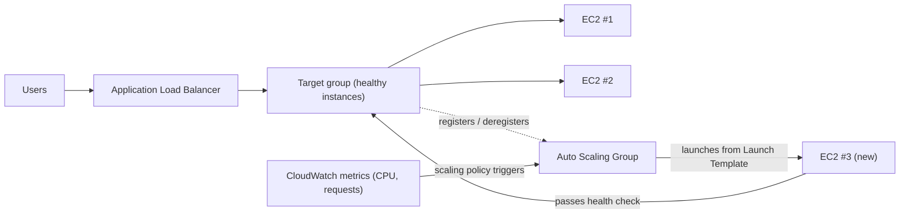

# Chapter 7: The Restaurant That Grows When It Gets Busy

It was 7:43 on a Friday evening.

Tom's chair was pushed back slightly, the way it got when he was staring at something with the kind of focus that meant he wasn't going to answer if you spoke to him. The office had emptied out an hour ago. He'd stayed.

He had a tab open to the metrics dashboard that he refreshed the way other people checked social media — reflexively, constantly, without quite meaning to.

The storage crisis was behind them. The database had its own disk. The photos lived in S3. For two weeks, the system had been stable — not exciting, just stable. That should have felt good.

Then the error rate crossed 12%.

"Leo," Tom said.

Leo was already looking. Response times: climbing. Requests queued: climbing. The single EC2 instance — even after last month's careful right-sizing exercise — was at 94% CPU.

"We're turning away customers," Tom said.

"We're not turning them away," Leo said. "The server is."

"That's the same thing."

It was. And it had been happening every Friday for three weeks. Nimbus had survived the storage crisis — the database had its own disk, the photos lived in S3 — but stable and scalable are different problems entirely. The system worked. It just didn't grow.

A Slack message appeared from Maya: *dashboard says orders down 40% from last Friday. what's happening?*

Tom replied: *server at capacity. working on it.*

Three minutes passed.

Maya: *we have a restaurant owner calling the support line saying the app is broken.*

Leo had his hands on the keyboard. He was resizing the instance — the manual version of the fix, the one that required stopping the server and changing the instance type. Which meant downtime.

"How long will the restart take?" Tom asked.

"Seven minutes," Leo said.

"We're going to have seven more minutes of outage on a Friday night," Tom said. He wasn't asking. He typed a Slack message to Maya. She replied with a single character: *k*

The restart completed. The instance came back up. The CPU dropped to 60%. The error rate dropped. Tom watched the metrics for fifteen minutes without speaking.

At 9:15, traffic declined. The crisis was over.

Leo looked at his hands, which had been shaking slightly at 8pm and weren't anymore.

"We can't do that every Friday," he said.

"No," Tom said. "We can't."

The team needed their system to handle variable load automatically. Not to buy enough
server for the worst case and waste money during quiet times. And not to scramble
manually when traffic spikes hit.

There's a pattern for this. AWS has two services that implement it.

**The Concept: Horizontal Scaling**

There are two ways to make a system handle more load.

**Vertical scaling** means making the single server bigger. More CPU. More RAM.
We did this in Chapter 4 when we upgraded from `t3.micro` to `t3.large`. It helps.
But it has limits: you can only go so big, the instance has to restart to resize,
and you still have a single point of failure.

**Horizontal scaling** means adding more servers. Instead of one large server, run
five medium servers. When traffic drops, run two. When it spikes, run ten.

Horizontal scaling has advantages that vertical doesn't:

- No single point of failure. If one server dies, the others keep serving.
- No restart required to add capacity.
- Pay only for what you're using — add servers when you need them, remove when you don't.
- Linear scaling: twice the servers, roughly twice the throughput.

There's also a reliability dimension that vertical scaling can't match. When you have
five servers and one fails, your capacity drops to 80% — enough to keep serving traffic
while the failed instance is replaced. When you have one server and it fails, capacity
drops to 0%. The redundancy is intrinsic to horizontal scaling in a way that vertical
scaling can't provide at any size.

This matters for maintenance too. When a security patch requires a server restart,
horizontal scaling lets you restart instances one at a time — rolling restarts that
maintain service continuity. A single large server requires either accepting downtime
during the restart or implementing blue/green deployment complexity.

The catch: if you have multiple servers, how do users know which one to talk to?

And there's a design constraint that horizontal scaling imposes: your application
must be able to run on multiple identical servers simultaneously without the servers
interfering with each other. This is the **stateless** requirement — each request
must be self-contained, not dependent on state stored on a specific server. We'll see
exactly why this matters when we encounter the sticky sessions problem.

**The Application Load Balancer: One Door, Many Rooms**

Think of a large restaurant with a host stand at the door. Diners arrive and the host
directs them to an available table. The host knows which tables are busy and which are
open. Diners don't need to know how many tables there are — they just walk in and the
host handles distribution.

An **Application Load Balancer** (ALB) does this with web requests.

Users connect to the load balancer. The load balancer distributes incoming requests
across your fleet of EC2 instances. Each user sees one address (the load balancer's
URL). Behind that address, requests are spread across however many servers are running.

The ALB itself runs on AWS-managed infrastructure, distributed across multiple AZs
in your Region. It's not a single server — it's a managed, distributed service.
When you enable cross-zone load balancing (the default for ALBs), each ALB node
distributes requests evenly across all registered targets regardless of which AZ
they're in. This prevents the common failure mode where one AZ has twice as many
healthy instances as another, resulting in uneven load.

It receives each incoming HTTP request and decides which EC2 instance (called a
**target**) should handle it, based on factors like:

- Round-robin (each server gets turns in rotation)
- Least outstanding requests (the server with the fewest in-flight requests gets the next request)
- Health — only healthy targets receive traffic

**Health checks** are essential. The ALB regularly sends test requests to each target.
If a target doesn't respond correctly, the ALB marks it unhealthy and stops sending
traffic to it. When the target recovers, traffic resumes.

This is automatic. You configure the health check parameters; the ALB enforces them.

You configure health checks with three key parameters: the **path** to check (e.g., `/health`),
the **interval** (how often to check — every 5 to 300 seconds; default 30), and the **threshold** (how
many consecutive successful or failed checks before changing the target's health status).

Aggressive health check intervals catch problems faster but add more traffic to the targets.
A 30-second interval with a 3-failure threshold means a failing target is removed from
rotation within 90 seconds. A 10-second interval with a 2-failure threshold means
removal within 20 seconds — at the cost of more health check traffic.

For Nimbus, Priya chose a 30-second interval with a threshold of 3 failures (90 seconds
to declare unhealthy) and 2 successes (60 seconds to declare healthy again after recovery).
This balanced fast failure detection with avoiding false positives from brief network
blips.

**Health Check Configuration: More Than "Is It Alive?"**

Leo's first health check was a simple TCP ping: "Is port 80 accepting connections?" That's the minimum. The server could be accepting connections on port 80 while the database was down, while the application was in an error loop, while the disk was full.

Priya had a different view of what "healthy" should mean.

"Have we thought about what happens if the health check passes but the application is broken?" she asked. "A server that can accept connections but can't query the database is not healthy. It's just responsive."

Leo built a `/health` endpoint in the application code. The endpoint did three things:
1. Confirmed the application process was running
2. Made a test query to the database (a simple `SELECT 1`)
3. Confirmed the S3 connection was accessible

If all three passed, the endpoint returned HTTP 200. If any failed, it returned HTTP 503.

The ALB health check was configured to call this endpoint every 30 seconds. If it received three consecutive 503 responses, the instance was marked unhealthy and removed from rotation.

"That means if the database goes down," Priya said, "the health check will catch it and remove the affected servers from the load balancer within 90 seconds."

"Even if the servers themselves are still running," Tom said.

"Even if they look fine from the outside."

The ALB, pointed at a real application health check, became a much more reliable detector of actual problems — not just server aliveness.

**Auto Scaling: The Restaurant That Opens More Tables**

An ALB distributes traffic across your existing servers. But it doesn't add servers
when you need more.

**Auto Scaling** does.

An **Auto Scaling Group** (ASG) is a configuration that tells AWS:

- The minimum number of instances to always have running
- The maximum number of instances allowed
- The conditions under which to scale out (add instances) or scale in (remove them)

The scaling conditions are called **policies**. The four most common types:

**Target tracking**: "Keep average CPU utilization at 70%." When average CPU exceeds
70%, AWS launches new instances. When it drops below, instances are terminated.
This is the simplest and most recommended policy for most workloads — set a target
metric and let AWS figure out how many instances are needed. The target can be CPU
utilization, request count per target, or any custom CloudWatch metric.

**Step scaling**: Define specific thresholds with specific responses. "When CPU
exceeds 60%, add 1 instance. When CPU exceeds 80%, add 3 instances. When CPU drops
below 30%, remove 1 instance." More granular control than target tracking, but
requires more configuration and ongoing tuning.

**Scheduled scaling**: "At 6:45pm every Friday, ensure at least 4 instances are
running." This is proactive scaling for predictable events. It works alongside
reactive scaling — the scheduled action sets a floor, and target tracking adds
instances above that floor as needed.

**Predictive scaling**: the machine-learning version of the same idea. Instead of you writing the schedule, Auto Scaling analyzes up to two weeks of historical load and forecasts the next 48 hours, launching capacity *ahead* of the predicted ramp. For cyclical traffic — a dinner rush every Friday, a market open every weekday — predictive scaling discovers the pattern and pre-warms automatically, and keeps adjusting as the pattern drifts. Exam trigger: "recurring/cyclical traffic spikes; instances must be ready *before* the spike" → predictive scaling. (Scheduled scaling is the manual answer; predictive is the learned one. Both beat reactive-only scaling, which always lags the spike by the instance boot time.)

For Nimbus, the combination was: target tracking for reactive scaling (keep CPU
at 65%), plus a scheduled scaling action every Friday at 6:45pm to pre-warm 2
additional instances before the dinner rush.

This is automatic. No one has to watch the metrics. No one has to manually launch
servers. The system reacts to load in real time.

Priya watched this happen live during a Friday rush for the first time. The server
count went from 2 to 5 over fifteen minutes, then back to 2 after the rush.

"That," she said, "is genuinely impressive."

Tom was watching the cost graph instead. The bill increased during the rush and dropped
after. "We only paid for what we used," he said, equally impressed. "How much does that cost per month, averaged across a normal week?"

Leo pulled up the calculator. The Friday peaks added maybe 15% to the monthly bill. Without Auto Scaling, they'd have needed to provision for peak all week. The difference: approximately $120/month wasted on idle peak capacity, versus $0 wasted with Auto Scaling properly configured.

There's one subtlety in scale-in that teams often miss: **scale-in protection**. You
can configure specific instances in an ASG to be protected from scale-in — meaning
they won't be terminated during automatic scale-in events. This is useful for instances
that are in the middle of processing a long-running job that you don't want interrupted.
Application code can also set instance protection programmatically when it starts a
long job and removes protection when the job completes. This prevents the ASG from
pulling the rug out from under active work.

**Warm Pools: Not Everything Needs to Start Cold**

The Friday that Auto Scaling first kicked in, Tom timed how long it took from "CPU exceeds threshold" to "new instances serving traffic."

Four minutes and twenty seconds.

"That's four minutes where we're short on capacity," he said.

"We could increase the minimum instance count," Leo said.

"That means paying for idle instances all week," Tom said.

There was a middle ground: **Warm Pools**.

A Warm Pool is a group of pre-initialized EC2 instances that sit in a stopped state, already booted, already configured, already through the UserData script. They've done everything except start serving traffic.

When the Auto Scaling Group decides to scale out, instead of launching a new cold instance from scratch (which takes three to five minutes to boot, run UserData, and pass health checks), it starts an instance from the Warm Pool. Starting a stopped instance takes about 30 to 60 seconds.

For Nimbus's Friday pattern — a known, predictable surge starting around 7pm — Priya configured a Warm Pool of two instances to maintain during business hours. By 6:45pm, two warm instances were sitting ready, stopped but initialized. When traffic climbed at 7pm and the ASG needed to scale, the warm instances started in under a minute and joined the fleet.

"How much does the Warm Pool cost?" Tom asked.

A stopped EC2 instance doesn't pay for compute — but it does pay for attached EBS storage. Two `t3.small` instances in a Warm Pool: about $4/month in storage costs. The improvement in scale-out time from four minutes to under one minute was worth $4/month on a Friday night.

**ALB Path-Based Routing**

As Nimbus grew, Leo added a second component: a separate API service for restaurant management. The restaurant owners accessed this service through the same domain but at a different URL path: `/api/restaurant/` instead of `/`.

"Wait — but *why* would we do it that way?" Maya asked. "Why not give the restaurant management API a different domain entirely?"

"We could," Leo said. "But then we'd need a second certificate, a second load balancer, a second DNS entry. The path-based routing handles it with one certificate, one load balancer."

The ALB supported this natively. A **path-based routing rule** told the ALB: when the URL starts with `/api/restaurant/`, route the request to the restaurant management target group. When the URL starts with anything else, route it to the customer-facing application target group.

Two separate fleets of EC2 instances. One load balancer. Traffic directed by URL path.

"So we can scale the restaurant management API independently from the customer-facing app?" Maya asked.

"Exactly," Leo said. "If restaurant owners are doing a lot of menu updates, those API servers scale. If customers are ordering heavily, those servers scale. They don't affect each other."

Maya sat with this. "And we only pay for one ALB instead of two."

"Correct," Tom said. He had a number. "The ALB costs about $20 a month in base fees plus data processing charges. One ALB handling both workloads versus two separate ones: roughly $20 saved per month. And we avoid managing multiple certificates and DNS records."

"But," Priya said, "if the ALB itself goes down, both services go down together."

"AWS designs the ALB to be highly available across multiple AZs," Leo said. "The risk of ALB failure is very low compared to the complexity of maintaining two separate load balancers."

Priya filed this under "accepted trade-off, documented."

**How ALB and ASG Work Together**

The two services are designed to be used together.

You put the ALB in front. The ALB points to a **target group** — a collection of
instances that should receive traffic. The Auto Scaling Group manages those instances:
it adds them to the target group when scaling out, removes them when scaling in.

The flow:

1. Traffic arrives at the ALB
2. ALB distributes requests to healthy targets
3. CPU/load climbs on those targets
4. ASG detects the load increase, launches new instances
5. New instances pass health checks, get registered with the ALB
6. ALB starts sending traffic to them
7. Load decreases, ASG terminates extra instances
8. ALB stops sending traffic to terminated instances

This happens without any human intervention.

**Launch Templates: The Blueprint for New Instances**

When the ASG launches a new instance, it needs to know what to launch. This is defined
in a **Launch Template** — an AMI, an instance type, the security groups to apply,
and any user data (startup scripts that run when the instance boots).

A common pattern: you build your application into a custom AMI (see Chapter 4).
When the ASG needs a new instance, it launches that AMI. The new instance boots with
your application already installed. No manual setup required.

For more dynamic environments, you can also use **user data scripts** that pull and
install the latest version of your code on startup. This is more flexible but takes
longer to boot.

The right choice depends on how long your instances need to boot and how often your
application changes.

**Sticky Sessions: A Subtle Problem**

Here's something that trips up many teams when they first implement load balancing.

Some web applications store session data — login state, shopping cart contents — on
the server itself (in memory or on local disk). This works fine with one server.
With multiple servers, it breaks.

A user logs in. The request goes to Server A. Server A stores the session. The next
request goes to Server B. Server B has no session. The user appears logged out.

This can be addressed in two ways:

**Sticky sessions** (or session affinity): Configure the ALB to always send requests
from the same user to the same server. This is a short-term fix. It undermines load
balancing (some servers get more "sticky" users than others) and creates problems
when an instance is terminated.

Maya looked at the sticky sessions configuration page. "If we pin users to specific servers, what happens when those servers get terminated during scale-in?"

"They lose their session," Leo said.

"So sticky sessions are just delaying the problem."

"Correct," Priya said. "The real fix is stateless application design."

**Stateless application design**: Store session data externally — in a database or
a cache like ElastiCache (Chapter 10). Each server can reconstruct any user's session
from the external store. Servers become interchangeable. This is the right approach
for horizontally scalable applications.

Priya called this "the most important architectural decision you make when you go
multi-server." She's right. We encounter it again in Chapter 10.

**If Sticky Sessions Then Less Complexity But More Risk**

If you use sticky sessions to solve the session state problem, then you reduce the need to set up external session storage in the short term — but when a sticky server is terminated during scale-in, all of its bound users lose their sessions at once. The failure is not gradual; it's sudden and affects a cluster of users simultaneously. If you externalize session state, you add a dependency (ElastiCache or a database) but eliminate that sudden failure mode. For any application that scales regularly, the investment in stateless design pays for itself the first time Auto Scaling terminates an instance with active sessions on it.

**Tom's Cost Calculation**

The next week, Tom built a cost model for the ALB and ASG setup.

The ALB: approximately $20/month base plus data processing charges. At Nimbus's traffic volume: about $22/month.

The Auto Scaling Group itself: no additional cost. You pay for the instances it runs, but those instances would exist regardless. The ASG is free; you pay for compute.

The Warm Pool: about $4/month in EBS storage for two stopped instances.

Total additional infrastructure cost: approximately $26/month, or $312/year.

Tom then looked at the incident log from the three Fridays before the ALB and ASG were in place. Each incident had cost Nimbus approximately 40% of Friday revenue during the outage window. Average Friday revenue: roughly $2,400. 40% of $2,400 is $960 per incident. Three incidents: approximately $2,880 in lost revenue in three weeks.

"The ALB and ASG cost $312 a year," Tom said. "Three bad Fridays cost us nearly $3,000. And that's just the direct revenue loss — not the customer churn from people who stopped using Nimbus after a bad experience."

Maya read the numbers. "Run the infrastructure."

"Already running," Leo said.

## When ALB Isn't Enough: NLB and GWLB

Leo was reviewing the IoT integration Nimbus had quietly added for restaurant partners — small temperature sensors in walk-in coolers that sent readings to Nimbus every thirty seconds, so kitchen managers could get alerts if a fridge drifted above safe temperature.

"Wait," Leo said. "These sensors are sending UDP packets."

"Is that a problem?" Maya asked.

"ALB doesn't support UDP," Leo said. "ALB understands HTTP. That's it."

Priya was already looking at the documentation. "That's what the Network Load Balancer is for."

**Network Load Balancer (NLB)** operates at Layer 4 — the transport layer. It routes TCP and UDP packets. It doesn't inspect the content of those packets, doesn't understand HTTP headers, doesn't do path-based routing. What it does is move packets from clients to targets at extraordinary speed.

- **Millions of requests per second with single-digit millisecond latency.** The ALB processes HTTP at Layer 7, which means it parses headers, evaluates routing rules, and terminates TLS connections. The NLB doesn't do any of that — it's closer to a high-speed traffic director than a web proxy.
- **Preserves the client's source IP address.** When an ALB receives a connection, it terminates it and opens a new one to the target — your EC2 instance sees the ALB's IP, not the user's. The NLB doesn't do this; the packet's source IP arrives unchanged at the target. If your application needs to know where requests are coming from — for geolocation, rate limiting, or fraud detection — and you need it to be accurate, NLB is the right choice. (The ALB adds an `X-Forwarded-For` header that carries the original IP, but that requires the application to read the header; the NLB puts the real IP directly in the packet.)
- **Static IP addresses and Elastic IPs.** The ALB's IP addresses change over time — AWS manages them and they're not fixed. The NLB supports static IPs per Availability Zone, and you can assign Elastic IPs to those. If downstream systems need to whitelist a specific IP address to allow traffic from your load balancer — a common requirement in financial services or IoT device management — NLB is the only option. ALB cannot do this.
- **TLS pass-through.** The NLB can pass encrypted TLS traffic directly to the targets without decrypting it. The target terminates TLS. This is useful when compliance requirements say the decryption must happen on a specific device, or when you don't want to manage TLS certificates on the load balancer.

"If NLB is so fast," Maya asked, "why don't we just use it for everything?"

"Because it's dumb," Leo said. "In the best sense. The NLB doesn't know what HTTP is. It can't do path-based routing. It can't redirect HTTP to HTTPS. It can't add security headers. It can't integrate with WAF. For a web application — anything that speaks HTTP — the ALB's Layer 7 awareness is what makes all those features possible. For the sensor data, which is UDP, we have no choice."

"And for our web traffic?"

"ALB, same as before."

"How much does that cost per month?" Tom asked. "Is NLB cheaper?"

The pricing model is the same as ALB: a base hourly charge plus a charge per Load Balancer Capacity Unit (LCU) based on traffic processed. At equivalent traffic volumes, the cost is comparable. For the Nimbus IoT use case — low-volume sensor data — the NLB cost would be under $20/month.

**Gateway Load Balancer (GWLB)** is a different animal entirely. It operates at Layer 3 — the IP packet level — and it exists for one specific purpose: inserting third-party virtual network appliances into your traffic flow.

Imagine Nimbus grew to a size where their security team required all traffic entering and leaving their VPCs to pass through a commercial firewall appliance — a virtual machine running software from a vendor like Palo Alto or Fortinet. Without GWLB, you'd have to manually route traffic through those appliances and figure out how to scale them and keep them highly available. With GWLB, you configure the appliance as a target, and all traffic is transparently routed through it using the GENEVE protocol. The application doesn't know the traffic is being inspected. The firewall doesn't need to know the network topology. GWLB handles the routing, the scaling, and the failover.

For most web applications at the early and mid stages — Nimbus included — GWLB is not a service you'll configure. But for the exam, and for the day when a security requirement demands network-level inspection, you'll know what it's for.

Leo added a NLB for the sensor endpoint that afternoon. The temperature data started flowing.

"The first restaurant gets an alert that their walk-in cooler is at 47 degrees," he said. "That's above the safe threshold."

"Is it actually at 47 degrees?" Maya asked.

"Restaurant owner confirmed. They called a repair technician the same afternoon."

Priya wrote this down in the Nimbus customer impact log. Not a security event. Just the IoT feature working.

**The Three Load Balancers, Side by Side**

AWS offers three types of load balancers. The ALB handles HTTP and HTTPS at Layer 7 —
it understands the protocol, so it can route based on URL path (`/api` to one group,
`/static` to another), host headers, and query parameters. This is what most web
applications use, and it's what Nimbus uses for its web traffic.

The ALB also terminates TLS connections — SSL/HTTPS certificates are installed on the
load balancer, not on each individual EC2 instance. The ALB decrypts the request,
inspects the HTTP headers, routes based on rules, and (optionally) re-encrypts before
forwarding to the target. This simplifies certificate management significantly: you
manage one certificate on the ALB rather than a certificate on every instance.

The NLB, as the team saw with the temperature sensors, handles TCP, UDP, and TLS at
Layer 4 — raw speed, source IP preservation, static IPs. The GWLB sits at Layer 3 for
threading traffic through third-party appliances like firewalls and intrusion detection
systems — rarely needed at the junior level.

For Nimbus (and for most web applications), ALB is the right choice.

You might be wondering: can you use both ALB and NLB for the same application? Yes. A common pattern is NLB in front of ALB — the NLB handles raw TCP termination at the edge, the ALB handles HTTP routing behind it. This adds complexity and cost, and is not needed for most web applications.

**ALB vs. NLB for the exam**: The key differentiator is Layer 7 vs. Layer 4. If
the exam scenario mentions URL-based routing, host-based routing, HTTP header inspection,
or WebSockets — that's ALB. If it mentions TCP pass-through, preserving source IP,
millions of requests per second, or extreme low latency for non-HTTP protocols — that's
NLB. When a scenario just says "load balancer for a web application," the answer is
almost always ALB.

## Strengths and Limitations

**Why ALB + Auto Scaling is powerful**:

- Zero-downtime scaling (instances are added/removed without disrupting existing connections)
- Automatic failover (unhealthy instances are removed from traffic automatically)
- Cost efficiency (pay only for running instances)
- No single point of failure — multiple instances across multiple AZs

**Where it gets complicated**:

- Stateful applications need special handling (sticky sessions or external state)
- Scaling out takes time — if traffic spikes instantly, there's a lag before new
  instances are ready. Mitigate with Warm Pools for predictable peaks or a higher minimum count.
- More moving parts means more to monitor and debug
- Some applications can't be horizontally scaled easily (databases, certain legacy
  systems). Horizontal scaling works best for stateless tiers.

## Summary

Two services, one pattern — and the pattern is what matters. The ALB handles distribution; the ASG handles fleet size. Together they turn a fragile single-instance setup into a system that can absorb Friday dinner traffic without a human being awake. The $312/year infrastructure cost versus three Fridays of lost revenue (~$2,880) is the kind of math Tom puts in a spreadsheet and never forgets.

- **Horizontal scaling** (adding more servers) is preferred over vertical scaling because it eliminates single points of failure and allows elastic cost. An **Application Load Balancer (ALB)** distributes incoming HTTP/HTTPS traffic and only routes to healthy instances.
- **Health checks should test actual application functionality** — a `/health` endpoint that verifies database connectivity catches real failures before customers do.
- An **Auto Scaling Group (ASG)** automatically adjusts the number of EC2 instances based on scaling policies. Target tracking is the most common type; scheduled scaling handles predictable peaks like Friday dinner rush.
- Stateful applications must externalize session state rather than rely on sticky sessions long-term. Sticky sessions are a short-term fix; externalizing state is the correct architecture.
- For HTTP/HTTPS traffic, use ALB. For raw TCP/UDP performance, use NLB. ALB path-based routing lets a single load balancer serve multiple application components by URL path.

## Exam Tips

*SAA-C03 Domain 2 — Task 2.1 (scalable architectures) / Domain 3 — Task 3.2*

- **ASG health checks can come from EC2 or the ALB.** EC2 health checks only detect
  if the instance is running. ALB health checks detect if the application is
  responding correctly. ALB health checks are more thorough and should be preferred
  for web applications.
- **Target tracking scaling is the most common exam answer** for scaling policies.
  Simple scaling (add N instances when alarm fires) is older and less adaptive.
- **Scale-out is fast; scale-in is slow.** AWS terminates instances gradually during
  scale-in to avoid disrupting active connections — a behavior controlled by the ALB's **deregistration delay** setting.
- **The minimum instance count is your resilience floor.** If you set minimum = 1
  and that instance fails, your application is down before ASG can react. Set
  minimum ≥ 2 and spread across AZs for real resilience.
- **ALB can distribute traffic across AZs automatically.** With cross-zone load
  balancing enabled, each ALB node distributes requests evenly across all registered
  targets regardless of AZ. This is important for balanced load when AZ instance
  counts differ.
- **ALB path-based routing** appears on exam scenarios describing multiple application
  components sharing a single load balancer. The correct term is "listener rules" that
  route based on URL path conditions.
- **Load Balancer selection:** ALB = HTTP/HTTPS, Layer 7, path/header routing, WebSockets, WAF integration. NLB = TCP/UDP, Layer 4, extreme performance, static IPs, source IP preservation. GWLB = Layer 3, inserting virtual firewalls/appliances into the traffic path. Exam trigger: "UDP protocol" or "static IP on load balancer" → NLB. "Insert firewall appliance into traffic flow" → GWLB.

## Exercises

**Exercise 1 — Recall**

In your own words: what is the difference between an Application Load Balancer and
an Auto Scaling Group? What problem does each one solve, and why do you typically
use them together?

*(Hint: One distributes traffic that already exists; the other adjusts how much
capacity you have.)*

**Exercise 2 — SAA-C03 Scenario**

*Scenario*: A retail company's e-commerce website experiences highly variable traffic:
low traffic during weekdays, massive spikes on weekends and during flash sale events.
They want their application to handle peak loads without maintaining unused capacity
during quiet periods. The application currently stores session data in server memory.

Which architecture change would BEST address their scalability requirements?

A) Upgrade to a single very large EC2 instance that can handle peak traffic
B) Deploy multiple EC2 instances behind an ALB with an Auto Scaling Group, and
   externalize session storage to ElastiCache
C) Deploy multiple EC2 instances behind an ALB with sticky sessions enabled
D) Manually add EC2 instances before each expected traffic spike and terminate them
   afterward

**Hint 1**: "Without maintaining unused capacity" means you need automatic scaling,
not a fixed large instance or manual management.

**Hint 2**: The session storage in server memory is a problem for multi-instance
deployments. Which options address this?

**Hint 3**: Option C uses sticky sessions — that's a workaround, not a fix.
Which option addresses both the scaling and the session storage problem properly?

**Answer**: B

**Explanation**: An ALB with an Auto Scaling Group provides automatic, elastic scaling
— instances are added during spikes and removed during quiet periods. Moving session
storage to ElastiCache (an external cache) makes the application stateless: any
instance can handle any user's request, and the ALB can distribute traffic freely.
This is the architecturally correct solution.

**Why not A?** A single large instance, no matter how big, is still a single point
of failure. It also wastes money during quiet periods when most of its capacity sits idle.

**Why not C?** Sticky sessions route a user to the same instance, which partially
mitigates the session problem but undermines load balancing. If that instance
terminates (during scale-in or failure), the user loses their session anyway.

**Why not D?** Manual scaling requires someone to predict traffic spikes correctly
and act in advance. It's slow, error-prone, and labor-intensive. Auto Scaling handles
this automatically.

*SAA-C03 Domain 2 — Task 2.1 / Domain 3 — Task 3.2*

**Exercise 3 — Architecture Challenge** *(Optional)*

Nimbus has a major promotion coming up: a 50% discount on all orders for 4 hours
next Saturday. Last year, a similar promotion caused 10x normal traffic. The team
expects the spike to be sudden and to last exactly 4 hours.

Auto Scaling will eventually react, but there's a lag. How would you design for this
known spike? What's the difference between reactive and proactive scaling, and when
does each make sense?

*(There is no single correct answer. Think about scheduled scaling actions,
pre-warming, and the cost implications of each approach.)*

## Post-Credits Scene

The first Friday after deploying Auto Scaling and the ALB, the team watched the
metrics together.

7:15pm: two instances running. Normal load.
7:45pm: load climbs. Auto Scaling launches two more instances.
8:00pm: four instances handling the peak. Response times stable.
9:30pm: load drops. Auto Scaling terminates two instances.
9:45pm: back to two instances.

The site never went down. Not once.

Leo refreshed the metrics page three times, as if he expected to find a failure he'd missed.

"Is it weird that I feel slightly disappointed nothing broke?" he said.

"Yes," said Priya.

Tom was looking at the bill. The cost had tracked the traffic almost perfectly.
"We paid for exactly what we used," he said. "Not more. Not less."

He sounded genuinely surprised.

The next morning, Maya found a new problem in the error logs. Not an outage — worse.

"Our database," she said, "is returning query times of eight seconds on average."

Eight seconds. For a restaurant ordering app.

"Every time someone loads the menu, we're querying every item in the database to
build the page," Leo said. "And we have forty-seven restaurants now."

"How many menu items total?" asked Tom.

Leo ran the query.

"About twenty-two thousand."

Silence.

In the next chapter: the database that doesn't require a DBA — just a credit card.
