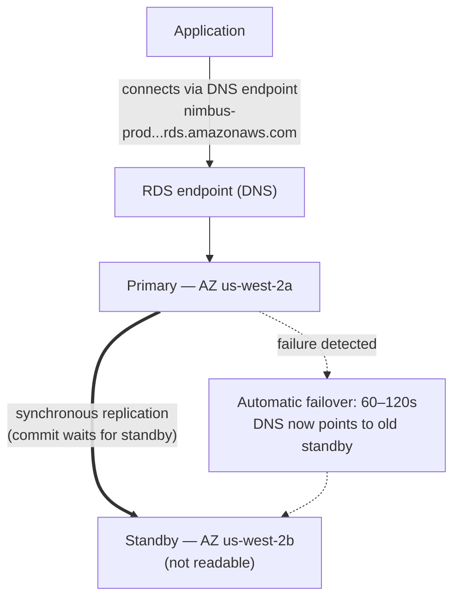

# Chapter 8: The Database Administrator Who Never Calls in Sick

It was 3 a.m. when the alert came in.

Priya was the only one awake. Her phone lit up on the nightstand and she read it in the dark, screen brightness too high. She sat up. She found her laptop by memory and opened it without turning on a light.

The keyboard clicked quietly in the dark room.

The database server needed a security patch — the kind that required a restart. The
vulnerability was real, the patch was available, and the window for applying it
without disrupting customers was right now, in the middle of the night, when traffic
was low.

She connected to the server. She pulled the patch. She applied it.

Then she read the release notes.

The package update touched the configuration file that PostgreSQL uses to define connection parameters. The release notes included a warning: depending on how the upgrade was performed, a customized configuration file could be replaced with the package's default version.

Their configuration file had been customized. Leo had edited it two months ago to tune the max_connections setting.

The patch ran. The server restarted. The database came back online.

Priya tested a query. It worked.

She checked the logs. Everything looked normal.

She went back to bed at 4:15 a.m.

At 9:05 a.m., Leo opened the application and got an error. He checked the database. Max connections was set to the default: 100. Their application was configured to use connection pools of up to 500.

Every new connection attempt was failing. The application had effectively lost database access.

"What happened?" Maya asked.

"The patch," Priya said. She was already looking at the configuration file. "The package update overwrote our customized config file with the default one. Leo's max_connections tuning is just gone — the server restarted with the stock settings and nobody got an error. It silently fell back to the default."

"How long to fix it?" Leo asked.

"Twenty minutes," Priya said. "But we need a maintenance window. This requires a configuration change and a restart."

"We have restaurants opening for lunch in two hours," Tom said.

Priya fixed it in eighteen minutes. The maintenance window was twelve minutes of actual downtime. Restaurants were affected, but the peak had not yet started.

In the morning she told the team what had happened. There was a silence.

"That's going to happen again," Tom said.

"It's going to happen every time there's a patch," Priya said. "And there are always
patches. There has to be a better way to do this."

The eight-second query times were still unresolved. And in the same week, this: a 3am maintenance window that turned into a morning incident. Both problems had the same root cause — Nimbus was running a database they weren't equipped to manage.

There was a solution. It just required giving up the idea that they needed to manage the database themselves.

**The Traditional Database Problem**

When you run a database yourself on an EC2 instance, you're responsible for everything.

Installing the database software. Configuring it securely. Patching it when security
vulnerabilities are discovered. Taking backups. Testing that the backups actually work
(a step most teams skip until it's too late). Monitoring disk space. Setting up
replication for redundancy. Configuring failover for when the primary server goes down.
Tuning query performance. Managing connections under load.

None of this is the application. None of it adds features. All of it requires expertise.

The expertise requirement is the key issue. A qualified database administrator understands
not just how to run a database, but how to:

- Monitor slow query logs and identify performance bottlenecks
- Size memory for the working set to avoid disk I/O
- Configure WAL archiving for point-in-time recovery
- Set up synchronous streaming replication with automatic failover
- Tune connection pooling to prevent connection exhaustion under load
- Apply major version upgrades without data loss or extended downtime

This is a distinct, specialized skill set. Senior DBAs command high salaries precisely
because doing all of this well is hard. Most startups can't hire for it. Most
development teams don't have it.

Most development teams are not database administrators. This creates a predictable pattern:
the database is installed, configured minimally, and then mostly forgotten until something
goes catastrophically wrong. The Nimbus PostgreSQL instance was running on the default
configuration — max_connections at 100, no connection pooling, manual backups that Leo
had run twice and then forgotten about, and no replication whatsoever.

The 3am patch incident was the symptom of a system run by people who were excellent
at building applications and had no background in database operations. That's not a
criticism — it's an accurate description of most startups. The solution isn't to
hire a DBA. The solution is to use a service that provides DBA-level operations
automatically.

"Is that what we did?" Maya asked.

Leo's answer was silence, which was the same as yes.

**The Managed Database**

Imagine hiring a database administrator who never calls in sick, automatically handles
every security patch, takes a backup every night without being asked, and fixes
themselves when something breaks. They do all of this without bothering you — and they
never, under any circumstances, touch your application logic.

AWS calls this service **RDS** — Relational Database Service.

With RDS, AWS manages:

- Installing and patching the database engine
- Automated backups (stored in S3, retained for up to 35 days)
- Automated failover (when the primary goes down, a standby takes over automatically)
- Monitoring and metrics
- Encryption at rest and in transit
- Storage auto-scaling (if you enable it, the disk grows when it gets full)

You manage:

- The database schema (the structure of your tables)
- Your queries and application logic
- Who has access to the database
- Which instance type runs the database
- Parameter tuning (though RDS provides sensible defaults)

**Supported Engines**

RDS supports several popular database engines:

- **MySQL** — the most widely used open-source relational database
- **PostgreSQL** — powerful, extensible, increasingly popular for complex workloads
- **MariaDB** — open-source MySQL fork, fully compatible
- **Oracle** — enterprise-grade, used in large organizations with legacy requirements
- **Microsoft SQL Server** — for Windows-heavy environments
- **Amazon Aurora** — AWS's own MySQL/PostgreSQL-compatible engine, built for the cloud
  (we cover Aurora deeply in Chapter 24)

For Nimbus, the choice was PostgreSQL. It was what Leo knew, and it handled relational
data well. The engine choice matters less than you'd think for most applications —
the operational benefits of RDS apply regardless.

One nuance: when you run an engine on RDS, AWS maintains the minor version patches
automatically (during your configured maintenance window). Major version upgrades —
going from PostgreSQL 14 to 15, for instance — are a manual operation that you
schedule and execute. AWS tests major version upgrades carefully, but you should test
them in a staging environment first. Major version changes can introduce compatibility
issues with specific SQL syntax, extensions, or driver versions.

Leo discovered this when RDS applied a minor patch and the application log briefly
showed a deprecation warning about a function that had been removed in a sub-release.
Minor patches should be essentially transparent — but monitoring your application logs
after each maintenance window is good practice.

"Have we thought about what happens if a minor patch breaks something?" Priya asked.

"We roll back to the previous snapshot," Leo said.

"How long does that take?"

Leo looked up the RDS restore time for their database size. For a 50GB database on a
`db.m6i.large`: approximately 15 to 30 minutes to restore from a snapshot.

"So we have a 15-to-30-minute recovery window if a patch breaks production," Priya said. "And we apply the patch in the early morning maintenance window, so at least the impact is minimal."

"And we test patches in staging first," Leo added.

"Yes," Priya said. "That too."

**RDS Instance Sizing: Not All Workloads Are Equal**

When you create an RDS instance, you choose an instance type — the same concept as EC2, but scoped to database workloads. AWS organizes RDS instance types into a few useful tiers.

**db.t3 family**: Burstable performance instances. Designed for development, staging, and light production workloads that don't need sustained high CPU. A `db.t3.micro` is appropriate for a development database with low traffic. A `db.t3.medium` handles moderate production load with occasional bursts.

The trade-off with T-series instances: they accumulate CPU credits during low-utilization periods and spend those credits during bursts. If you run a T-series instance at sustained high CPU, you exhaust the credits and performance throttles to a baseline that may be insufficient.

**db.m6i family**: General-purpose instances with consistent, non-burstable performance. The `db.m6i.large` is a common starting point for production databases. These don't have credit limits — the CPU is available at full capacity whenever you need it.

**db.r6i family**: Memory-optimized instances. More RAM per vCPU than the M family. Appropriate for databases with large working sets — queries that benefit from data being in memory rather than fetching it from disk on every access. If your database performance improves dramatically when you add RAM, the R family is the right choice.

For Nimbus:

- Development and staging: `db.t3.medium`. Adequate for development queries, low cost.
- Production: `db.m6i.large`. Consistent performance, enough RAM for the menu and order working set, no credit throttling.

"How much more does the m6i.large cost than the t3.medium?" Tom asked.

Leo checked the pricing page. The `db.t3.medium` ran about $55/month. The `db.m6i.large` ran about $140/month. The difference was real, but so was the reliability difference.

"The t3 will throttle under sustained load," Priya said. "If we have a busy Friday and the CPU stays high for four hours, the t3 runs out of credits and throttles. The m6i doesn't."

Tom wrote down the number. He also wrote down the cost of Friday outages from two weeks ago. The comparison was not close.

Production went on the `db.m6i.large`.

**Multi-AZ: The Standby That Takes Over**

This is the feature that changes the reliability calculus completely.

**Multi-AZ deployment** means RDS maintains a synchronous standby instance in a
different Availability Zone from the primary. Every transaction committed to the primary
is synchronously replicated to the standby before the commit is acknowledged.

When the primary fails — hardware failure, AZ outage, software crash — RDS
automatically fails over to the standby. The DNS record for the database endpoint
is updated. Your application reconnects to the new primary.

The failover takes 60–120 seconds. During that window, your application will experience
connection errors. Properly written applications should handle this gracefully (connection
retries with backoff).

The standby is not a read replica. It doesn't serve read traffic. Its only purpose is
to be ready to take over.



(Note: the newer **Multi-AZ DB Cluster** deployment option keeps *two* standbys that
**are** readable and fails over in ~35 seconds — the exam may distinguish it from the
classic Multi-AZ *instance* deployment described here.)

"How much does Multi-AZ cost?" Tom asked.

Roughly twice the cost of a single instance — because you're literally running two
database instances. The standby costs the same as the primary.

Tom opened the order history and estimated the revenue per hour during their Friday peak.

"And what if someone tries to break in during the failover window?" Priya asked. "When the primary is down and the standby is promoting, are there sixty seconds where we're exposed?"

"The failover is transparent," Maya said, "but the question is fair. Connection strings should use the RDS endpoint, not hardcoded IPs — otherwise the failover won't be seamless."

Multi-AZ was enabled that afternoon.

**Automated Backups and Point-in-Time Recovery**

RDS takes automated backups every day. AWS stores these backups in S3 (managed by
RDS — you don't see them directly in your S3 console). You can restore the database
to any point within your backup retention period.

Backups happen during a configurable **backup window** — a period of low traffic,
typically in the early morning. (This is a separate setting from the **maintenance
window**, which is when RDS applies patches and configuration changes. The exam
likes to test that these are two different windows.) For most engine types, backups
don't cause downtime — and on Multi-AZ deployments, the snapshot is taken from the
standby, so the primary isn't touched at all.

**Point-in-time recovery** is one of the most valuable features: you can restore to
any second within your retention period. Not just daily snapshots — *any second*.
This is possible because RDS continuously archives transaction logs in addition to
daily backups.

If someone accidentally runs `DELETE FROM orders WHERE 1=1` at 2:37pm, you can
restore to 2:36pm.

Leo visibly relaxed when he understood this.

"I already set the backup retention to one day," Leo said. "Oh — that's fine though, right? We can change it?"

"Change it to seven days minimum," Priya said. "Thirty for production."

Leo updated it immediately.

"Could we have recovered from what I deleted last month?" he asked.

"Before RDS? No," said Priya. "After RDS? Yes."

You might be wondering: what's the difference between an automated backup and a manual snapshot? Automated backups are deleted when the retention period expires (up to 35 days). Manual snapshots are retained indefinitely until you explicitly delete them. If you need to preserve a database state permanently — before a major migration, before a risky deployment — take a manual snapshot.

**RDS Proxy: Solving the Connection Problem at Scale**

Two weeks after migrating to RDS, Leo noticed something in the metrics.

The database was handling queries fine. But the number of open connections was high — higher than he'd expected. With the Auto Scaling Group adding EC2 instances during peak, each new instance opened its own pool of database connections. Ten EC2 instances, each with a connection pool of 50: five hundred simultaneous connections to the database.

"PostgreSQL has an overhead for each connection," Priya said. "Memory, CPU for the connection handler. Five hundred connections uses a meaningful amount of the database's resources just for connection management — before it's done any actual work."

"Can we reduce the connection pool size?" Leo asked.

"We could," Priya said. "But then we risk requests queuing up waiting for a connection during peak."

The better solution: **RDS Proxy**.

RDS Proxy sits between the application and the database. The EC2 instances connect to the Proxy, not directly to the RDS instance. The Proxy maintains a pool of database connections and multiplexes application requests across them. If ten EC2 instances each open fifty connections to the Proxy, the Proxy might maintain only one hundred actual database connections — sharing them efficiently across all application requests.

The benefits:

**Connection pooling**: Fewer actual database connections means less memory overhead on the RDS instance and better performance under load.

**Faster failover**: During a Multi-AZ failover, the Proxy maintains the connection to the application side while re-establishing the database connection on the backend. Applications see a brief pause rather than a full connection reset. RDS Proxy reduces failover impact from 60–120 seconds to typically 30 seconds or less.

**IAM authentication**: Instead of embedding database credentials in the application, the application can authenticate to RDS Proxy using an IAM role. The Proxy handles the actual database credentials. This eliminates secrets from the application environment entirely.

"How much does RDS Proxy cost?" Tom asked.

It runs roughly $0.015 per vCPU-hour of the underlying RDS instance, billed separately from the instance itself. For a `db.m6i.large` (2 vCPUs), Proxy adds approximately $22/month.

Tom looked at the connection count graph — five hundred connections competing for database resources during peak — and looked at the $22/month cost.

"That's cheaper than upgrading to a larger RDS instance to handle the connection overhead," he said.

RDS Proxy was enabled that week.

"And what if someone tries to break in through the Proxy?" Priya asked. "Does IAM auth for the Proxy reduce the attack surface?"

"Yes," Priya answered her own question. "No database credentials in the application environment means there are no database credentials to steal from the application."

She enabled IAM authentication for the Proxy.

**Read Replicas: Scaling Read Traffic**

Multi-AZ is about availability. **Read replicas** are about performance.

A read replica is an asynchronous copy of your primary database that can serve read
queries. You can have up to 15 read replicas for the major RDS engines — MySQL, PostgreSQL, and MariaDB (Aurora supports up to 15 Aurora Replicas as well, sharing the same storage volume).

The application is modified to send read queries to the replica and write queries to
the primary. This distributes the load: the primary handles writes and complex
transactions; the replicas handle reads.

Key characteristics:

- Replication is **asynchronous** — there can be a small delay (lag) between the
  primary and replica. If you write a record and immediately read from the replica,
  you might not see it yet.
- Read replicas can be in the same Region or in a different Region (cross-Region
  replicas add latency but enable geographic distribution).
- Read replicas can be promoted to standalone databases in a disaster scenario.

For Nimbus: menu lookups are reads. Order history is reads. The vast majority of
traffic is read traffic. Adding a read replica and routing reads to it cuts primary
database load significantly.

We cover read replicas more thoroughly in Chapter 24 when we discuss Aurora.

**If Read-Heavy Then Add a Replica But Watch the Lag**

If your workload is read-heavy, adding a read replica reduces load on the primary and improves query performance — but replication is asynchronous, which means the replica can be slightly behind the primary. If your application writes a record and immediately reads it back, it must read from the primary, not the replica. Getting this wrong produces subtle, hard-to-debug data freshness bugs: a user places an order, the confirmation page queries the replica, the replica hasn't caught up, the order appears missing. This is called read-your-writes consistency, and it's the most common mistake teams make when they first add replicas.

**Performance Insights: Finding the Slow Query**

The eight-second menu load time was still a problem. The move to RDS improved reliability, but the query was still slow.

Leo added a read replica and routed menu queries to it. The menu load time dropped to about four seconds. Better. Still not good.

"The query is still slow," Maya said. "We improved the bottleneck, but we didn't fix it."

RDS includes a feature called **Performance Insights** — a monitoring tool that shows which queries are consuming the most database resources, which sessions are waiting, and what they're waiting for.

Leo enabled Performance Insights on the read replica and loaded the menu page repeatedly during an afternoon test session.

The Performance Insights dashboard showed one query dominating the load: a full table scan of the `menu_items` table, fetching all 22,000 rows every time a menu page loaded. There was no index on `restaurant_id` — the column the application was filtering by.

Execution time without index: 8.2 seconds.

Leo added the index.

```sql
CREATE INDEX idx_menu_items_restaurant_id ON menu_items(restaurant_id);
```

Execution time with index: 14 milliseconds.

8,200 milliseconds to 14 milliseconds. The difference between a restaurant ordering app that drives customers away and one they use without thinking about it.

"That was the problem the whole time?" Maya said.

"That was the problem," Leo said.

"And Performance Insights found it in how long?"

"About twenty minutes."

Tom was already calculating. Three weeks of sub-optimal menu load times, estimated 200,000 menu page loads during that period, estimated 15% abandonment due to slowness. The number he landed on was uncomfortable.

"Add the missing indexes before launch next time," he said.

"There'll be a checklist," Priya said. She was already writing it.

**When Not to Use RDS**

RDS is excellent for a wide range of relational database workloads. It's not the right answer for everything.

**When you need OS-level access**: RDS doesn't give you access to the underlying operating system. You can't install custom OS packages, modify kernel parameters, or run tools that require root access to the database server. If your database has requirements that demand OS access — certain Oracle configurations, custom storage drivers, specific network interfaces — you need to run the database on an EC2 instance directly.

**When you're using an unsupported engine**: RDS supports MySQL, PostgreSQL, MariaDB, Oracle, SQL Server, and Aurora. If your application uses a different database engine — CockroachDB, SingleStore, Greenplum — you're running it on EC2, not RDS.

**When you need write-heavy horizontal scaling**: RDS scales reads through replicas. Writes go to one primary instance. If your workload is write-heavy and needs to be distributed across multiple write nodes, RDS is not the right architecture. Aurora's Global Database can help at large scale, but for extreme write-scale requirements, distributed databases like DynamoDB (Chapter 9) or CockroachDB running on EC2 are the appropriate tools.

**When the managed cost exceeds the operational cost**: For very large, stable workloads where your team has genuine database administration expertise, running PostgreSQL on EC2 with your own tooling can be cheaper than RDS. This is unusual for teams that aren't primarily DBA shops. But it's real, and a good architect acknowledges it.

For Nimbus — a startup without dedicated DBA resources, running PostgreSQL on a managed service, with unpredictable growth — RDS was clearly the right choice.

**RDS Parameter Groups and Option Groups**

Two configuration mechanisms come up on the exam:

**Parameter groups** control database engine settings — like maximum connections,
query cache size, timeout values. RDS creates a default parameter group that works
for most cases. You create custom parameter groups when you need to tune specific settings.

**Option groups** enable additional features for some engines — like Oracle's native
network encryption or SQL Server's transparent data encryption. Most open-source
engine deployments don't need custom option groups.

You can customize the database engine's behavior through these mechanisms — but the defaults work for most teams starting out.

### Getting Data In: AWS Database Migration Service

A few weeks in, Tom arrived at standup with a slide.

Nimbus was acquiring a small regional competitor. Their ordering system ran on a MySQL database in a co-location facility. The system couldn't go offline during the migration — restaurants were using it.

"We need to move their data into RDS," Tom said. "Without taking the system down."

"How big is the database?" Leo asked.

"About 80 gigabytes."

"When do they need to cut over?"

"Six weeks."

Priya had already pulled up the documentation. "AWS DMS," she said.

**AWS DMS (Database Migration Service)** moves data from a source database to a target database with minimal downtime. It handles the migration in two phases: a full load of existing data, followed by continuous replication of changes as the source keeps running.

There are two migration types:

**Homogeneous migration:** source and target are the same engine — MySQL to RDS MySQL, PostgreSQL to Aurora PostgreSQL. The schema is compatible; DMS migrates data directly.

**Heterogeneous migration:** source and target are different engines — Oracle to Aurora PostgreSQL, SQL Server to RDS MySQL. The schema must be converted first. This requires **AWS Schema Conversion Tool (SCT)** to translate the schema, then DMS to move the data.

For the Nimbus acquisition: MySQL to RDS MySQL. Homogeneous. No SCT needed.

How it works in practice:

1. DMS reads from the source — the co-location MySQL database
2. **Full load**: DMS copies all existing data to the target RDS instance
3. **CDC (Change Data Capture)**: after the full load, DMS reads the source database's transaction log and replicates ongoing changes to the target in near real-time
4. The source keeps running. When the team is ready, they flip the connection string.

"So the restaurant ordering system stays live the whole time?" Tom asked.

"The whole time," Priya confirmed. "The source and target stay in sync via CDC. When we're ready, we flip the endpoint. The downtime is the seconds it takes for that change to propagate."

DMS supports dozens of source and target combinations: Oracle, SQL Server, MySQL, PostgreSQL, MongoDB, DynamoDB, S3, Redshift, Aurora, and more.

"Wait — but *why* do we need a separate tool for heterogeneous migrations?" Maya asked. "Can't DMS just figure out the schema differences?"

"A VARCHAR in Oracle is not the same as a VARCHAR in PostgreSQL," Priya said. "Data types, stored procedures, sequences, proprietary functions — they don't map one-to-one. SCT analyzes the source schema and generates the closest equivalent for the target. DMS then moves the data into that converted schema. Separating schema conversion from data movement is what makes the process reliable."

"And what if someone tries to break in through the DMS replication instance?" Priya asked herself a moment later. "It needs read access to the source and write access to the target."

"Least privilege on both ends," Leo said. "Read-only IAM on the source. Write access scoped to the migration target only. And the replication instance stays in the private subnet."

Priya wrote it down.

## Strengths and Limitations

**Why RDS is excellent**:

- Eliminates the operational burden of managing database software
- Automated backups and point-in-time recovery
- Multi-AZ for automatic failover with minimal RTO
- Read replicas for scaling read traffic
- Encryption at rest and in transit built in
- All major relational database engines supported
- RDS Proxy for connection pooling and improved failover response

**Where RDS has limits**:

- You can't access the underlying OS. If your database has requirements that demand
  OS-level access, you may need to run your own EC2-based database.
- RDS is not serverless (with exceptions — Aurora Serverless exists, covered in
  Chapter 24). You pay for a running instance even if it's idle.
- RDS is not designed for horizontally sharded databases. For massive scale-out
  of write-heavy relational workloads, you may eventually need a different architecture.
- For non-relational (NoSQL) data patterns, DynamoDB (Chapter 9) is more appropriate.

## Summary

Priya's 3am patch window was the symptom. The root cause was that Nimbus was managing a database that a managed service could handle better. RDS doesn't just eliminate the 3am wake-up call — it shifts responsibility for patching, failover, backups, and connection management to AWS, freeing the team to focus on the application code that actually serves customers. The trade-off is loss of OS-level access, which matters rarely and far less than it sounds.

- **Amazon RDS** is a managed relational database service. AWS handles patching, backups, failover, and storage. You handle schema, queries, and application logic.
- **Multi-AZ** maintains a synchronous standby in a different AZ. Automatic failover occurs in 60–120 seconds. Always use the RDS endpoint DNS name in connection strings — not hardcoded IPs — so failover is transparent.
- **Read replicas** are asynchronous copies that serve read traffic. Replication lag means they may be slightly behind — read-your-writes consistency requires reading from the primary immediately after a write.
- **RDS Proxy** pools connections, reducing overhead and improving failover speed. Critical for Lambda-based workloads that can create thousands of short-lived connections.
- **Performance Insights** identifies slow queries — finding a missing index can transform an 8-second query into a 14-millisecond one. Major version upgrades are manual; test in staging first.

## Exam Tips

*SAA-C03 Domain 3 — Task 3.3 (database solutions)*

- **Multi-AZ is for high availability, not performance.** The standby doesn't serve
  read traffic. Read replicas are for performance. This distinction is tested frequently.
- **Multi-AZ failover is automatic.** You don't configure when or how it happens.
  RDS monitors the primary and triggers failover automatically.
- **Replication lag matters.** Read replicas can be slightly behind the primary.
  If your application requires reading data it just wrote, it must read from the
  primary, not the replica. This is called "read-your-writes consistency."
- **Automated backups are retained for 0–35 days.** Setting the retention to 0
  disables automated backups. Manual snapshots are retained indefinitely until
  you delete them.
- **RDS storage auto-scaling** prevents disk-full outages. Enable it. It only scales
  up, never down. The exam may test whether you know this asymmetry.
- **RDS Proxy** appears in exam scenarios involving Lambda functions connecting to RDS
  (Lambda can create thousands of short-lived connections, which overwhelm the database
  without a Proxy), or scenarios requiring faster Multi-AZ failover.
- **db.t3 instances burst and throttle.** Exam scenarios describing intermittent
  performance degradation on small RDS instances may be describing CPU credit exhaustion
  on T-series instances. The fix is upgrading to an M or R series instance.
- **Multi-AZ DNS endpoint**: When a Multi-AZ failover occurs, the RDS endpoint DNS
  record is updated to point to the new primary. Applications that use the RDS endpoint
  (not a hardcoded IP) reconnect automatically. Applications with long DNS TTLs or
  hardcoded IP addresses will not reconnect automatically. Always use the RDS endpoint.
- **Read replica promotion**: A read replica can be promoted to a standalone DB instance
  — useful for disaster recovery if the primary is lost and Multi-AZ was not configured.
  Promotion is a one-way operation: the replica becomes a primary and is no longer
  replicating from the original. Exam scenarios asking about "manually promoting" or
  "converting a read replica to primary" involve this operation.
- **Performance Insights** identifies top SQL queries by wait time and CPU usage.
  When an exam scenario asks how to diagnose slow queries on an RDS database, Performance
  Insights is the AWS-native answer.
- **RDS vs. running a database on EC2**: The exam sometimes presents this as a choice.
  RDS provides managed operations but limits OS-level access. EC2-based databases give
  you full control but require DBA expertise for operations. The "OS-level access required"
  phrase in an exam scenario is a signal to choose EC2 over RDS.
- **AWS DMS:** Migrates databases with minimal downtime using full load + CDC. Homogeneous (same engine) = DMS directly. Heterogeneous (different engines) = SCT to convert schema first, then DMS to move data. Exam trigger: "migrate database with minimal downtime" or "Oracle to Aurora" → DMS + SCT.

## Exercises

**Exercise 1 — Recall**

In your own words: what is the difference between Multi-AZ and read replicas in RDS?
What problem does each one solve?

*(Hint: One protects against downtime; the other improves performance under read-heavy
load. They solve different problems and can be used together.)*

**Exercise 2 — SAA-C03 Scenario**

*Scenario*: A company runs a production PostgreSQL database on RDS. The database
experiences high read traffic due to reporting queries running throughout the day.
The team is also concerned about database availability — they cannot afford more than
a few minutes of downtime in a failure scenario. They want to minimize impact on the
primary database from reporting workloads.

Which combination of RDS features BEST addresses both concerns?

A) Enable Multi-AZ and run all queries against the standby instance  
B) Take more frequent manual snapshots and restore from them if the primary fails  
C) Create multiple read replicas and disable Multi-AZ to reduce costs  
D) Enable Multi-AZ for failover protection and create a read replica for reporting queries

**Hint 1**: The two requirements are: (1) availability during failure, (2) offloading
reads. Which features address which requirement?

**Hint 2**: Multi-AZ provides automatic failover. The standby does NOT serve read traffic.
So Multi-AZ alone doesn't help with the read problem.

**Hint 3**: Read replicas serve read traffic. Multi-AZ provides failover. You need both.

**Answer**: D

**Explanation**: Multi-AZ provides automatic failover to a standby in a different AZ —
this addresses the availability requirement. A read replica allows reporting queries
to run without impacting the primary database — this addresses the performance
requirement. Both features can be used simultaneously.

**Why not A?** The Multi-AZ standby cannot serve read traffic. It's exclusively for
failover. Attempting to query it directly is not supported.

**Why not B?** Manual snapshots restore a full copy of the database — a much longer
process (potentially hours for large databases). This doesn't meet a "few minutes
of downtime" requirement.

**Why not C?** Read replicas help with read performance but don't provide automatic
failover. If the primary fails, you'd need to manually promote a read replica —
which takes time and isn't automatic.

*SAA-C03 Domain 3 — Task 3.3*

**Exercise 3 — Architecture Challenge** *(Optional)*

Nimbus is considering migrating their existing self-managed PostgreSQL database
(running on an EC2 instance) to RDS PostgreSQL. The migration needs to happen
with minimal downtime — ideally under 15 minutes. The database is 200 GB.

What approach would you recommend? What AWS services might help with the migration?
What risks would you test for before cutting over production traffic?

*(There is no single correct answer. Think about AWS Database Migration Service,
logical replication, and the risk of data inconsistency during cutover.)*

## Post-Credits Scene

By end of day, Nimbus had migrated to RDS PostgreSQL with Multi-AZ enabled. The
migration itself took most of the afternoon — Leo used a backup-and-restore approach,
with a brief maintenance window.

Tom had watched the bill carefully.

"The RDS instance," he said, "costs twice what the EC2 database did."

"And the automated backups?" Maya asked.

"A bit more."

"And the failover that we'll get for free if the primary dies?"

Tom didn't have a price for that. He wrote it down as a question.

Three days later, the database was healthy. Query times had dropped dramatically after Leo added the missing index. The menu loaded in under a second.

"The problem," Priya said, "isn't the database engine. It's the data model."

She paused.

"Some of this data isn't relational at all. Menu items, restaurant profiles,
delivery zones — this data has variable shapes. SQL is fighting us."

Leo was already researching something.

"What if we used a different kind of database for the menu?" he said.

In the next chapter: the database that doesn't slow down, even when a million people order at once.
