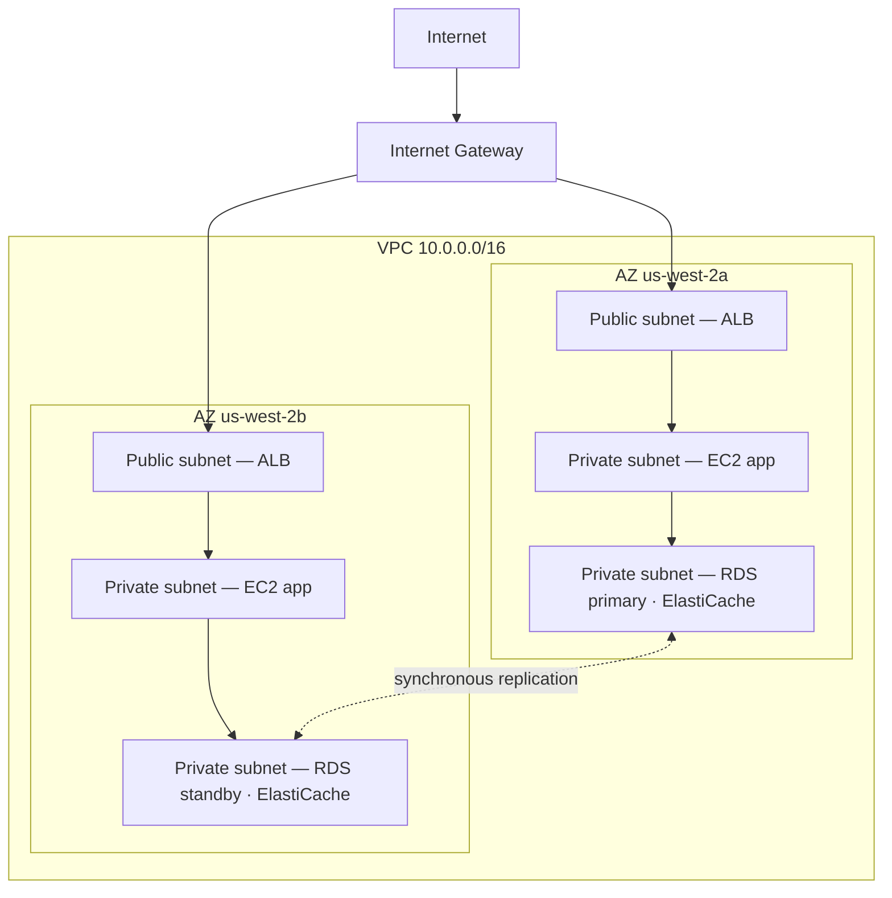

# Chapter 11: Your Private Corner of the Cloud

Priya had a piece of paper with a drawing on it.

It wasn't a complicated drawing. A rectangle, labeled "AWS." Inside the rectangle, a cluster of boxes: EC2 instances, an RDS database, an ElastiCache cluster. Lines connecting everything to everything else. And outside the rectangle, a single label: "Internet."

She set it in the center of the table.

---

*The caching layer was working. Redis had cut page loads from 188 milliseconds to 12. But while Leo had been celebrating that win, Priya had been reading network logs — and she didn't like what she saw. Every service was on the same flat network. The database had a public IP address. The Redis cluster was technically reachable from outside. The application worked, but the architecture was a parking lot: no fences, no gates, no zones.*

---

"This is what we have," she said. "Our database has a public IP address. Our cache layer can be reached from the internet. Our EC2 instances are all on the same flat network."

"That seems fine," Leo said. "We have security groups."

"Security groups that you configured," Priya said. "At night. During the initial setup."

Leo said nothing.

"I'm not criticizing the configuration," she said. "I'm saying that when everything lives on a flat public network, a single misconfiguration is the difference between a working system and one that's accessible to everyone on the internet."

She picked up a red marker and drew a circle around the database.

"This should not be reachable from the internet. At all. Not through a security group rule, not through a hardened configuration. It should be structurally unreachable."

"We need to talk about network architecture," Maya said.

"We needed to talk about it three months ago," Priya said. "But now is fine."

The team gathered around a whiteboard for the first time in weeks.

**The Problem With the Open Parking Lot**

Imagine a massive public parking garage. Ten thousand cars. Any car can park anywhere. There are no barriers between zones, no gates, no reserved sections.

This is an open network. Every service can reach every other service. Your web server can talk to your database. Your database can reach the internet. Your caching layer can receive connections from anywhere.

When everything can talk to everything, one compromise affects everything.

"So if someone breaks into the parking garage," Tom said, "they can walk into any car."

"And from any car, drive anywhere," Priya confirmed. "We want fences. We want locked gates. We want zones."

The VPC is how you build those zones in AWS.

**What Is a VPC?**

"Wait — but *why* would we do it that way?" Maya asked. "If we already have security groups on every resource, why do we need a VPC? Aren't the security groups doing the same job?"

Security groups and VPCs protect at different levels. A security group is a rule attached to a specific resource — it says "this EC2 instance only accepts traffic on port 8080 from the load balancer." But it's still on the public network. The IP address is still reachable; the rule just blocks the connection at the door. A VPC removes the door from the public street entirely. A resource in a private subnet has no *route* to the internet — and by convention no public IP — so it cannot be reached from the internet, no matter what the security group says. That's a structural guarantee, not a configuration one.

A **Virtual Private Cloud (VPC)** is a logically isolated section of the AWS cloud — a private network you define, that only your resources can access by default.

Think of it as a fenced private lot inside the massive public parking garage. Your lot has its own rules: who can enter, who can exit, what routes exist between sections.

When you create a VPC, you define:

**A CIDR block**: The range of IP addresses available inside your network. For example, `10.0.0.0/16` gives you 65,536 possible IP addresses (10.0.0.0 through 10.0.255.255).

**Subnets**: Subdivisions of your VPC, each assigned a portion of your IP address range and associated with a specific Availability Zone.

**Route tables**: Rules that determine where network traffic goes.

**Internet Gateway**: The connection between your VPC and the public internet.

**Subnets: Public vs Private**

Not all resources should be publicly accessible.

Your web server needs to accept traffic from the internet — users' browsers need to reach it.

Your database should *never* accept traffic from the internet — only your web server should be able to talk to it.

This is where subnets come in.

A **public subnet** is connected to an Internet Gateway and can have resources with public IP addresses. Traffic can flow to and from the internet.

A **private subnet** has no route to the internet in its route table. Resources in a private subnet can only communicate with other resources in your VPC (unless you set up specific outbound routes). By convention, they have no public IP addresses either.

For Nimbus, the design became clear:



The load balancer is public-facing — it needs to receive traffic from the internet. The EC2 instances are private — they only receive traffic from the load balancer. The databases are private — they only receive traffic from the EC2 instances.

"So to reach the database," Tom said, "someone would have to get through the load balancer, then through the EC2 instance, then through the database security group?"

"Three layers," Priya confirmed. "Defense in depth."

---

**Nimbus's CIDR Plan**

"Wait — but *why* would we do it that way?" Maya asked, looking at the CIDR block choices. "Why is Priya so specific about the IP address ranges? Can't we just use whatever AWS defaults to?"

"Because CIDR blocks are very hard to change later," Priya said. "And because if we ever connect this VPC to another VPC, or to an on-premises network, overlapping IP ranges cause routing failures that are painful to debug."

She drew the plan on the whiteboard.

Nimbus's VPC: `10.0.0.0/16` — 65,536 addresses total.

| Subnet | CIDR | AZ | Purpose |
|---|---|---|---|
| Public A | 10.0.0.0/24 | us-west-2a | Load balancers |
| Public B | 10.0.1.0/24 | us-west-2b | Load balancers |
| Private App A | 10.0.10.0/24 | us-west-2a | EC2 app servers |
| Private App B | 10.0.11.0/24 | us-west-2b | EC2 app servers |
| Private Data A | 10.0.20.0/24 | us-west-2a | RDS, ElastiCache |
| Private Data B | 10.0.21.0/24 | us-west-2b | RDS, ElastiCache |

"Why not just make everything a /16?" Leo asked.

"Because subnets in different AZs shouldn't share an address space. Each subnet is in one AZ. If we ever peer this VPC with another, the more granular we are, the less likely we are to have conflicts. And each /24 gives us 251 usable addresses — more than enough for any single tier."

"AWS reserves five addresses in each subnet," Tom observed, looking at the documentation. "That's why it's 251, not 256."

"Correct. First four and last one. Network address, VPC router, DNS server, future use, broadcast."

"So /24 is the smallest you'd go?"

"In practice. You'd use /28 for very small subnets — like a VPN gateway subnet, which only needs a handful of IPs. But for application tiers, /24 is a reasonable minimum."

Tom wrote the numbers down and calculated the monthly cost difference between sizes. He always did.

---

**CIDR Planning Mistakes to Avoid**

"Have we thought about what happens if we outgrow a subnet?" Priya asked. She wasn't asking because she didn't know. She was asking because the rest of the team needed to internalize the answer.

Leo thought about it. "We can add more subnets?"

"You can add subnets to a VPC. But you cannot resize an existing subnet. If your private app subnet fills up — 251 addresses aren't enough — you'd need to create a new subnet and migrate instances to it."

"How often does that actually happen?"

"Rarely, if you plan well. But people make three common mistakes."

She listed them:

**Mistake one**: Using too-small a VPC CIDR. If you use `10.0.0.0/24` for the whole VPC (254 addresses), you'll run out of space before you've finished planning subnets. Start with `/16` for flexibility.

**Mistake two**: Using overlapping CIDRs across VPCs. If your production VPC is `10.0.0.0/16` and your staging VPC is also `10.0.0.0/16`, you can never peer them or connect them through a transit gateway. The routers won't know which VPC to send traffic to.

**Mistake three**: Not reserving address space for future tiers. Nimbus's plan left `10.0.30.0/24` and `10.0.31.0/24` unassigned — room for a future internal tooling tier, a monitoring subnet, or a VPN endpoint subnet, without having to restructure the whole address space.

"Plan for twice what you think you need," Priya said. "Subnets are free. IP address space from a `/16` is abundant. The cost of planning wrong is a network migration."

---

**The NAT Gateway: Private Subnets That Can Still Download Things**

Private subnets can't reach the internet. But sometimes, they need to. Your EC2 instance needs to download a software update. Your application needs to call an external API.

This is where the **NAT Gateway** (Network Address Translation) comes in.

A NAT Gateway sits in a public subnet. Resources in private subnets can send outbound traffic to the NAT Gateway, which relays it to the internet — but the internet cannot initiate connections back.

It's like a one-way revolving door. You can go out. Nobody outside can come in.

"How much does that cost per month?" Tom asked.

NAT Gateway pricing has two components: an hourly charge for each NAT Gateway, plus a per-GB data processing fee.

At the time Nimbus set this up, that was approximately $32/month per NAT Gateway, plus $0.045 per GB of data processed. For small traffic volumes, the fixed cost dominates. At scale, the data charges can be substantial.

Tom set up a billing alert for data processing costs before he finished the NAT Gateway configuration. He'd seen what AWS data costs looked like when no one was watching them.

The surprise that caught teams off guard: every byte that flows through a NAT Gateway is charged. If your EC2 instances in private subnets are downloading large software packages, streaming logs to external services, or sending significant data to external APIs, the NAT Gateway data charges appear on the bill as a surprise. The solution for AWS-to-AWS traffic: VPC Endpoints route traffic to AWS services (S3, DynamoDB) privately, bypassing the NAT Gateway entirely and eliminating those data charges.

"So the EC2 instances in the private subnet download OS updates through the NAT Gateway," Tom said. "Those updates are how many gigabytes?"

"Per instance, per month, maybe two to five GB," Leo said.

"Times ten instances. Times twelve months. At $0.045 per GB—"

"Eleven to twenty-seven dollars per year," Priya finished. "In this case, acceptable."

"But if we were streaming logs — like sending all our application logs to an external observability service—"

"We'd route those through a VPC Endpoint or use CloudWatch Logs instead of going out through NAT."

Tom closed the calculator. The math was clear enough.

### NAT Instance: The Budget Alternative

"Wait," Tom said, still staring at the pricing page. "We're paying per gigabyte just to let private instances reach the internet? That's the only option?"

"It's the managed option," Priya said. "There's an older way, but it comes with tradeoffs."

Before NAT Gateway existed, teams achieved the same outbound routing with a regular EC2 instance — a "NAT instance." You'd launch an EC2 instance in a public subnet, enable IP forwarding in the OS, disable the source/destination check (which AWS enables by default to drop packets not addressed to the instance), and point the private subnet's route table at the instance's ENI. Traffic from private instances would flow through it to the internet, same as a NAT Gateway.

It still works. AWS still documents it. And at very low traffic volumes — a single dev environment where a handful of instances occasionally download packages — a `t3.micro` NAT instance can cost under five dollars a month, versus the NAT Gateway's fixed hourly charge plus per-GB fees.

| | NAT Gateway | NAT Instance |
|---|---|---|
| Management | Fully managed by AWS | You manage the EC2 |
| Availability | Redundant within AZ | Single EC2 — single point of failure |
| Bandwidth | Up to 100 Gbps, scales automatically | Limited by EC2 instance type |
| Cost | $0.045/GB + hourly charge | EC2 instance cost only |

The cost advantage disappears quickly. At meaningful traffic volumes, the per-GB NAT Gateway charge is competitive with the EC2 instance type you'd need to handle that bandwidth — and NAT Gateway requires zero patching, zero monitoring, and zero incident response when it fails (it doesn't).

"So when would we actually use a NAT instance?" Leo asked.

"A throwaway dev environment," Priya said. "Somewhere you're running one or two instances, doing occasional package updates, and want to minimize the fixed cost. Production workloads — anything that needs to be available — NAT Gateway, one per AZ."

The exam tests this trade-off by name. The pattern: "minimize NAT cost in a dev or test environment with low traffic" points toward NAT Instance. "Production workload requiring high availability" points toward NAT Gateway deployed per AZ.

You might be wondering: if security groups already exist and block traffic by default, why does a VPC with private subnets add meaningful protection? Because "blocked by a security group" and "structurally unreachable" are different things. A security group misconfiguration — one wrong rule, one open port — can expose a resource that has a public IP. A resource in a private subnet has no public IP to reach in the first place. You'd have to compromise the load balancer and a running EC2 instance before you could even attempt to reach the database. Private subnets enforce isolation at the network level, not the rule level.

**Route Tables: How Traffic Finds Its Way**

Every subnet has a **route table** that tells traffic where to go.

A typical public subnet route table looks like this:

| Destination | Target                      |
|-------------|-----------------------------|
| 10.0.0.0/16 | local                       |
| 0.0.0.0/0   | igw-xxxx (Internet Gateway) |

The first rule: traffic to any IP in your VPC range stays local. The second rule: all other traffic (`0.0.0.0/0` means "everything") goes to the Internet Gateway.

A private subnet route table:

| Destination | Target                 |
|-------------|------------------------|
| 10.0.0.0/16 | local                  |
| 0.0.0.0/0   | nat-xxxx (NAT Gateway) |

Private subnet traffic stays local or exits through the NAT Gateway. No direct route to the Internet Gateway.

**Security Groups vs NACLs (Preview)**

Inside the VPC, you have two tools for controlling traffic at the resource level:

**Security Groups** (Chapter 15 covers this in depth) act as virtual firewalls for individual resources — an EC2 instance, an RDS instance, a load balancer. They are *stateful*: if traffic is allowed in, the response traffic is automatically allowed out.

**Network ACLs (NACLs)** operate at the subnet level and are *stateless*: you must explicitly allow both inbound and outbound traffic separately.

For most use cases, Security Groups are sufficient. NACLs add an extra layer when you need subnet-level controls — for example, blocking a specific IP range from ever reaching a subnet.

"Security groups at the instance level," Leo wrote on the whiteboard. "NACLs at the subnet level."

"And never leave port 22 open to 0.0.0.0/0," Priya added, looking at Leo.

"That was one time," Leo said.

"It is always exactly one time," Priya said, "until it isn't."

"And what if someone tries to break in?" Priya said, still at the whiteboard. "Not through a misconfigured security group — what if they compromise the load balancer itself? What stops them from pivoting to the private subnet?"

"The private subnet EC2 instances only accept traffic from the load balancer's security group," Leo said. "Even if the load balancer is compromised, the attacker can only make requests that look like normal API calls."

"And the database only accepts traffic from the EC2 security group," Priya said. "Defense in depth. Every layer assumes the previous one might fail."

---

**VPC Flow Logs: Seeing What's Happening**

"We need eyes on the network," Priya said, three days into the VPC redesign.

"We have security groups and NACLs," Leo said. "Traffic is controlled."

"Controlled doesn't mean visible. If something weird happens — an unexpected connection attempt, traffic to a strange port — how do we know?"

VPC Flow Logs capture metadata about network traffic flowing through your VPC. Not the packet contents — just the connection-level information: source IP, destination IP, port, protocol, packet count, byte count, start time, end time, and whether the traffic was accepted or rejected.

A typical flow log entry looks like this:

```
2 123456789012 eni-0abc123 10.0.10.5 10.0.20.8 49321 5432 6 20 4320 1620000000 1620000060 ACCEPT OK
```

This tells you: from `10.0.10.5` (an EC2 instance in the app subnet) to `10.0.20.8` (the RDS instance), port 5432 (PostgreSQL), 20 packets, 4,320 bytes, accepted. Normal traffic.

But a few days after enabling Flow Logs, Priya found this:

```
2 123456789012 eni-0abc123 185.220.101.55 10.0.10.5 0 8080 6 1 40 1620003200 1620003201 REJECT OK
```

An external IP — `185.220.101.55` — had attempted a connection to the EC2 instance on port 8080. The connection was rejected by the security group. But the attempt was logged.

She looked up the IP. It belonged to a Romanian address block known for automated scanning — the kind of background-noise probing every public IP on the internet receives constantly.

"Someone's probing us," she said.

"But getting rejected," Leo said.

"This time. Enable GuardDuty" — a threat-detection service we'll meet properly in Chapter 17 — "before we move on. We need behavioral detection, not just perimeter blocking."

Flow Logs are stored in CloudWatch Logs or S3. They can be queried using CloudWatch Insights or Athena. Priya set up a CloudWatch Insights query that ran nightly and flagged any rejected connection attempts from non-AWS IP ranges.

"How much does that cost per month?" Tom asked.

"Flow logs are charged per GB of data ingested into CloudWatch or S3. At our traffic volume, probably eight to fifteen dollars a month."

Tom paused. "And the alternative is not knowing someone is probing our network."

"Yes."

"That's fine," he said, and opened the console.

**Reading a Port Scan in Flow Logs**

Two weeks after enabling flow logs, Priya ran her nightly CloudWatch Insights query and found something new. Not one rejected connection — dozens, in rapid sequence, from the same source IP, across consecutive ports.

```
185.220.101.55 → 10.0.10.5 port 22   REJECT
185.220.101.55 → 10.0.10.5 port 23   REJECT
185.220.101.55 → 10.0.10.5 port 25   REJECT
185.220.101.55 → 10.0.10.5 port 80   REJECT
185.220.101.55 → 10.0.10.5 port 443  REJECT
185.220.101.55 → 10.0.10.5 port 3306 REJECT
185.220.101.55 → 10.0.10.5 port 5432 REJECT
185.220.101.55 → 10.0.10.5 port 6379 REJECT
```

All within a five-second window. All rejected.

"That is a port scan," Priya said. "Someone is probing which services this instance is running."

"But all rejected," Leo said. "So the security group is doing its job."

"The security group is doing its job. The scan is still informative for the attacker — it tells them which ports did *not* reject within a timeout, which means those ports are open somewhere. And it tells them this host is alive and worth investigating."

"What do we do?"

"Two things," Priya said. "First: add a NACL rule to block the /24 range that IP belongs to. Not just that IP — the whole subnet. Port scanners rotate IPs within a range. Second: add a CloudWatch alarm that fires when any single source IP generates more than ten rejected connections in sixty seconds. That pattern is almost always a scan."

She set up both. The alarm fired twice in the following week — once from the same Romanian range, once from an automated scanner based in Singapore. Both were blocked at the NACL within minutes of detection.

Flow logs do not stop attacks. They make attacks visible. And visible attacks can be responded to. The alternative — traffic flowing invisibly — means the first sign of a problem is the damage, not the attempt.

---

**The Single NAT Gateway Trap**

Three months after the VPC redesign, Priya ran a failure simulation. She wanted to know what would happen to Nimbus if the `us-west-2a` availability zone experienced a disruption.

Most of it was fine. The load balancer failed over to instances in `us-west-2b`. The RDS standby in `us-west-2b` was already live. ElastiCache promoted the replica. The application kept serving requests.

Then Leo noticed that his EC2 instances in `us-west-2b` had stopped receiving OS update notifications. He checked the NAT Gateway configuration.

There was one. In `us-west-2a`.

"All outbound internet traffic from the private subnets in both AZs routes through one NAT Gateway in one AZ," Priya said.

"So if `us-west-2a` goes down—"

"Every EC2 instance in `us-west-2b` loses outbound internet access. They cannot download updates. They cannot reach external APIs. Secrets Manager lookups that are not cached will fail. Anything that requires outbound internet will break."

The fix: one NAT Gateway per AZ. Each AZ's private subnets route outbound traffic to the NAT Gateway in the same AZ. When an AZ fails, only that AZ's traffic is affected.

"And the price tag on that fix?" Tom asked.

"An extra thirty-two dollars a month for the second AZ's NAT Gateway."

Tom was quiet for a moment.

"The EC2 capacity in `us-west-2b` failing to reach external APIs during an outage," Priya said, "costs more than thirty-two dollars."

Tom approved the change.

This is one of the most common VPC design mistakes: a NAT Gateway that looks highly available but is actually a single point of failure. If you have resources in three AZs and one NAT Gateway, you have three-AZ compute resilience but one-AZ network resilience. The two do not match.

The rule: one NAT Gateway per AZ, in the public subnet of that AZ. Each AZ's private route table points to its own NAT Gateway. The cost is modest. The availability improvement is real.


---

**VPC Peering: Connecting Private Networks**

What if Nimbus grows into multiple VPCs? (This happens. Teams get big. Services get isolated into separate accounts.)

**VPC Peering** lets two VPCs communicate privately as if they were on the same network. Traffic doesn't leave AWS's private network.

Important limits:

- VPC peering is not transitive. If VPC A peers with VPC B, and VPC B peers with VPC C, A and C cannot communicate — unless you add a direct A-C peer.
- CIDR blocks cannot overlap between peered VPCs.

For larger architectures with many VPCs, **AWS Transit Gateway** (Chapter 25) handles transitive routing without requiring a full mesh of peering connections.

---

**AWS PrivateLink: Private Access to AWS Services**

"What about reaching S3 from the private subnet?" Leo asked. "Our EC2 instances write receipts to S3. Right now that traffic goes out through the NAT Gateway."

"VPC Endpoints," Priya said. "Specifically, Gateway Endpoints for S3 and DynamoDB — they're free."

A **VPC Endpoint** creates a private connection between your VPC and an AWS service, bypassing the public internet entirely. Traffic between your private subnet and the AWS service stays on the AWS network. No NAT Gateway charge. No internet exposure.

For S3 and DynamoDB, **Gateway Endpoints** are free and easy: add an entry to the route table pointing S3/DynamoDB traffic to the endpoint instead of to the NAT Gateway.

For other AWS services (Secrets Manager, KMS, SNS, SQS), **Interface Endpoints** create an elastic network interface (ENI) in your subnet with a private IP address. Traffic to the service goes to that private IP. Interface endpoints cost money — approximately $0.01/hour **per AZ in which the endpoint is provisioned** (an endpoint with ENIs in three AZs costs three times the hourly rate), plus about $0.01/GB of data processed — but they eliminate the need to route sensitive API calls (like Secrets Manager lookups) through a NAT Gateway or over the public internet.

"So our EC2 instances can reach S3, DynamoDB, Secrets Manager, and KMS," Priya said, "all from the private subnet, without any internet exposure, and for S3 and DynamoDB, without any NAT Gateway data charges."

Tom recalculated. The S3 traffic savings would offset the Interface Endpoint cost for Secrets Manager within a few months.

"PrivateLink is the general name," Priya added. "AWS PrivateLink is the underlying technology for Interface Endpoints. The exam uses both terms."

---

**A Debugging Checklist**

Three months after the VPC redesign, Leo broke the network. Not dramatically — he'd modified a route table association and accidentally disconnected the private app subnet from its NAT Gateway route.

The EC2 instances couldn't reach external APIs. They could reach each other, and they could reach the databases. Just not the internet. Outbound HTTPS calls started failing.

He spent forty minutes troubleshooting before Priya handed him a checklist.

"When something doesn't reach something else in a VPC, check these in order," she said.

1. **Security group on the source**: Is the outbound rule correct? Does it allow the traffic you're trying to send?
2. **Security group on the destination**: Is the inbound rule correct? Does it allow traffic from the source?
3. **NACL on the source subnet**: Is there an inbound deny rule blocking response traffic? Is there an outbound allow rule?
4. **NACL on the destination subnet**: Is there an inbound allow rule? Is there an outbound allow rule for responses?
5. **Route table on the source subnet**: Does it have a route to the destination? Is the route pointing to the correct target (NAT Gateway, IGW, VPC Endpoint)?
6. **Route table on the destination subnet**: Does it have a route back to the source?
7. **VPC Endpoint policy**: If using a VPC Endpoint, does the endpoint policy allow the action?
8. **IAM permissions**: Does the EC2 role have permission to call the service? (For AWS API calls)

Leo found it on step 5. The route table had been reassociated to the wrong private subnet. The NAT Gateway route was missing.

"If I'd had this list three months ago," he said, "I would have found it in five minutes."

"You'll have it from now on," Priya said.

## Direct Connect: The Dedicated Line

Three months after the VPC redesign, Nimbus closed a deal with Harborview Dining Group — a hundred-location enterprise chain that processed two million dollars in transactions per day.

The technical review call started well. Then their compliance officer unmuted.

"We cannot route production transaction data over the public internet," she said. "Our auditors require a dedicated, private, auditable network path between our data center and any cloud environment. Site-to-Site VPN is not acceptable. It shares bandwidth with everyone else. It travels the same wires as consumer traffic."

Tom looked at Leo. Leo looked at Priya.

"To be precise," Priya said carefully, "PCI DSS itself doesn't prohibit an encrypted VPN over the internet — encrypted transport satisfies the standard. What you're describing is your auditors' internal policy, which is stricter. That's legitimate. And there's a service for it."

**AWS Direct Connect** is a dedicated physical network connection between your on-premises data center and AWS. The connection bypasses the public internet entirely — your traffic never touches shared infrastructure, never competes for bandwidth with anyone else, and never travels a wire that isn't yours.

Setting up Direct Connect means working with AWS and a colocation or network provider to install a physical cross-connect at a Direct Connect location — a data center where AWS has dedicated equipment. Once the physical link is in place, you establish virtual interfaces over it that connect to your VPC or to AWS services directly.

**The key characteristics:**

Bandwidth comes in two forms. *Dedicated connections* go direct to AWS hardware: 1 Gbps, 10 Gbps, or 100 Gbps. *Hosted connections* go through an AWS Partner and offer more granular options from 50 Mbps up to 10 Gbps — useful when you don't need a full dedicated port.

Latency is consistent. Because you're not competing for internet bandwidth, the round-trip time to AWS is predictable. For Harborview, whose point-of-sale systems made hundreds of API calls per transaction, consistent sub-5ms latency was the difference between a 200ms checkout and a 400ms one.

Privacy is structural, not configurational. A Site-to-Site VPN is encrypted, but it still traverses the public internet — the same physical infrastructure used by everyone else. Direct Connect traffic never touches the public internet. For Harborview's compliance team, that was the requirement, and no amount of VPN configuration would satisfy it.

Cost is higher than VPN. You pay a port-hour charge for the Direct Connect connection plus data transfer pricing. The connection is not cheap, and it takes weeks to months to provision — a physical cross-connect installation isn't something you spin up on a Friday afternoon.

"Hold on," Maya said. "If VPN is encrypted, why does it matter that it goes over the public internet?"

Because the compliance requirement isn't just about encryption — it's about isolation. VPN encrypts the contents of the traffic, but the traffic still traverses shared physical infrastructure. Anyone who controls a router on the path can see the encrypted packets, record them, and attempt to decrypt them later. A dedicated physical link has no shared routers. The path is physically yours. For industries with strict data sovereignty requirements — finance, healthcare, government — that distinction is the difference between compliant and not.

"One more thing," Priya said. "Direct Connect is private by default, but not encrypted by default. If you want both — private and encrypted — you run an IPSec VPN over the Direct Connect connection. That gives you dedicated bandwidth plus encryption. Both."

Tom had already found the pricing page. He looked at the monthly commitment for a 1 Gbps Dedicated connection.

"Harborview's $2M daily volume means this pays for itself in rounding errors," he said.

He sent the proposal.

---

> **Exam Tip — Direct Connect vs. VPN**
>
> *SAA-C03 Domain: Design Secure Architectures (Domain 1)*
>
> - **VPN:** encrypted, fast to provision (minutes), travels the public internet, variable bandwidth and latency.
> - **Direct Connect:** dedicated physical link, consistent bandwidth and latency, private (traffic never touches public internet), but not encrypted by default. Takes weeks to months to provision.
> - **Encrypted AND private:** run an IPSec VPN on top of Direct Connect. You get both dedicated bandwidth and encryption.
> - **Exam trigger:** "consistent, private, dedicated bandwidth to AWS" or "compliance requires traffic not travel the public internet" → Direct Connect. "Encrypted AND private" → Direct Connect + IPSec VPN. "Fast to set up, lower cost, acceptable to use public internet" → Site-to-Site VPN.
> - **Cost and setup time** are the trade-offs the exam tests: VPN = fast + cheap; Direct Connect = slow to provision + expensive + consistent.

---

### Client VPN: Remote Access for Individual Users

Direct Connect and Site-to-Site VPN connect networks — an entire office or data center to AWS. But engineers also need to connect individual laptops to a VPC: to debug a private EC2 instance, query a private RDS database, or access internal tooling from home.

"Don't we already have this?" Maya asked. "We have a bastion host. Can't Leo just SSH through that?"

"For SSH, yes," Priya said. "But what if Leo needs to connect to the RDS instance from a database GUI on his laptop? Or query the internal metrics dashboard over HTTP? The bastion only handles SSH. Client VPN works for any protocol."

**AWS Client VPN** is a managed VPN endpoint that lets individual users connect to your VPC from any device, from anywhere. Users install a standard OpenVPN client on their laptop; the VPN endpoint is in AWS.

Key characteristics:

- Managed by AWS — you don't run a VPN server
- Based on OpenVPN — works with any standard OpenVPN client
- Authentication via Active Directory (user-based), certificate-based mutual TLS, or SAML 2.0 federated authentication (SSO through an identity provider)
- Each connected client gets a private IP in your VPC and can access private resources (RDS, ElastiCache, internal services) as if they were inside the VPC
- Supports **split-tunnel** (only VPC traffic goes through the VPN — internet traffic goes directly) or **full-tunnel** (all traffic through the VPN)

"Split-tunnel," Tom said immediately.

"Why?" Leo asked.

"Because full-tunnel means my Netflix stream goes through our VPN endpoint and I pay data transfer charges on it."

That was correct. Split-tunnel is the default recommendation for developer access: VPC-bound traffic routes through the VPN, internet traffic goes straight out. The VPN handles only what needs to be private.

**vs. Site-to-Site VPN:** Site-to-Site connects two networks (office ↔ VPC). Client VPN connects individual devices (laptop ↔ VPC).

**vs. bastion host:** a bastion host requires SSH; Client VPN works for any protocol — database connections, HTTP internal services, anything that runs over TCP or UDP.

> **Exam Tip — Client VPN vs Site-to-Site VPN**
>
> - **Site-to-Site VPN:** network-to-network (office to VPC, data center to VPC).
> - **Client VPN:** individual device to VPC (engineers working remotely, accessing private resources from home).
> - Exam trigger: "users need to access private VPC resources from home" or "remote developers need database access" → Client VPN. "Connect an entire branch office to AWS" → Site-to-Site VPN.

---

## Strengths and Limitations

**Why VPC design matters**:

- Network isolation is defense in depth — breaching one layer doesn't mean compromising everything
- Private subnets reduce attack surface significantly
- Route tables and security groups give precise control over traffic flows
- VPCs integrate with every AWS networking service (Direct Connect, VPN, Transit Gateway)
- Flow Logs make network traffic visible and auditable

**Where it gets complicated**:

- VPC design requires upfront planning — CIDR blocks are hard to change later
- Too many small VPCs create peering complexity (n-squared problem)
- Debugging network issues in VPCs requires understanding route tables, security groups, NACLs, and subnet associations simultaneously
- NAT Gateway costs can surprise you at scale (per-GB processing fees)
- VPC Endpoints reduce NAT costs but add their own hourly charges for non-gateway endpoints

## Summary

The network redesign took three days. Every resource ended up in the right place — and the right place meant it could only be reached by exactly the services that needed it, and nothing else. Good network design doesn't just make breaches harder; it limits what an attacker can do after a breach.

- A **VPC** is a logically isolated private network in AWS — your fenced lot inside the public cloud.
- **Subnets** divide your VPC by Availability Zone. Public subnets connect to the Internet Gateway; private subnets don't.
- Put internet-facing resources (load balancers) in public subnets. Put everything else (EC2, databases, caches) in private subnets.
- **Route tables** control where traffic flows. Every subnet has one.
- **NAT Gateway** (in a public subnet) lets private resources initiate outbound internet connections without accepting inbound connections.
- **VPC Flow Logs** record metadata about all network traffic — essential for security visibility and debugging.
- **VPC Endpoints** connect private subnets to AWS services without going through NAT Gateway or the public internet. Gateway Endpoints (S3, DynamoDB) are free.
- Plan your CIDR blocks carefully — they're very hard to change after resources are deployed.

## Exam Tips

*SAA-C03 Domain: Design Secure Architectures (Domain 1, Task 1.2)*

- **Public vs private subnet**: the difference is the route table. Public subnet has a route to an Internet Gateway. Private subnet does not.
- **NAT Gateway placement**: always in the *public* subnet. Private subnet resources route outbound traffic to it.
- **High availability for NAT**: create a NAT Gateway per AZ. If you have one NAT Gateway in AZ-a and AZ-b instances route through it, AZ-a failure takes down AZ-b's internet access too.
- **VPC Peering is not transitive**: exam will describe three VPCs and ask if they can communicate through the middle one — the answer is no without direct peering or Transit Gateway.
- **CIDR overlap**: peered VPCs cannot have overlapping CIDR blocks. Classic exam trap.
- **Bastion host (jump box)**: to SSH into a private EC2 instance, you need a bastion host in the public subnet. The bastion is the only machine with a public IP; private instances only accept SSH from the bastion's security group.
- **VPC Endpoints**: allow private resources to reach AWS services (S3, DynamoDB) without going through NAT Gateway. Two types: **Gateway endpoints** (S3, DynamoDB — free) and **Interface endpoints** (other services — priced per hour plus data).
- **VPC Flow Logs**: metadata only — not packet contents. Used for security analysis, network debugging, and compliance. Can be sent to CloudWatch Logs or S3.
- **NAT Gateway vs. NAT Instance:** NAT Gateway is managed, HA, scales automatically but costs per GB. NAT Instance is a self-managed EC2 with IP forwarding — cheaper at very low traffic volumes, but a single point of failure. Exam trigger: "minimize NAT cost in dev/test" → NAT Instance.
- **Direct Connect vs. VPN:** VPN = encrypted, fast to provision, travels public internet, variable bandwidth. Direct Connect = dedicated physical link, consistent bandwidth/latency, private (not encrypted by default), weeks to provision. Exam trigger: "consistent, private, dedicated bandwidth" → Direct Connect. "Encrypted AND private" → Direct Connect + IPSec VPN on top. "Fast, lower cost, public internet acceptable" → Site-to-Site VPN.
- **Client VPN vs. Site-to-Site VPN:** Site-to-Site = network-to-network (office to VPC). Client VPN = individual device to VPC (engineers working remotely). Exam trigger: "users need to access private resources from home" → Client VPN. "Connect branch office to AWS" → Site-to-Site VPN.

## Exercises

**Exercise 1 — Recall**

Explain why a database should be in a private subnet. What specific threat does this mitigate?

*(Hint: What can someone do to a database that's on the public internet that they can't do to one that's only accessible from within the VPC?)*

**Exercise 2 — SAA-C03 Scenario**

*Scenario*: A company is designing a three-tier web application on AWS. The web tier (ALB + EC2) must accept internet traffic. The application tier (EC2) must only receive traffic from the web tier. The database tier (RDS) must only receive traffic from the application tier. The application tier EC2 instances need to download software packages from the internet. The solution must be highly available.

Which architecture BEST meets these requirements?

A) All tiers in public subnets; security groups restrict traffic between tiers  
B) Web tier in public subnets; app and database tiers in private subnets; one NAT Gateway in a public subnet  
C) Web tier in public subnets; app and database tiers in private subnets; one NAT Gateway per AZ  
D) All tiers in private subnets; an Internet Gateway provides bidirectional internet access to all tiers

**Hint 1**: "Highly available" means no single point of failure. Which option introduces a NAT Gateway as a single point of failure?

**Hint 2**: If the NAT Gateway's AZ goes down, which instances lose internet access?

**Hint 3**: Read the requirement carefully — the application tier needs *outbound* internet access, not inbound.

**Answer**: C

**Explanation**: Web tier in public subnets provides internet-facing access through the ALB. App and database tiers in private subnets ensure they're not directly reachable from the internet. One NAT Gateway per AZ (one in each public subnet) provides high-availability outbound internet access for private-subnet instances — if one AZ fails, the other AZ's NAT Gateway continues to serve traffic.

**Why not A?** Public subnets for all tiers expose the application and database directly to the internet, defeating the purpose of the tiered security model.

**Why not B?** One NAT Gateway in a single AZ is a single point of failure. If that AZ's NAT Gateway fails, all private instances lose outbound internet access.

**Why not D?** An Internet Gateway provides bidirectional connectivity — private subnets with a route to the Internet Gateway are effectively public subnets.

*SAA-C03 Domain: Design Secure Architectures — Task 1.2*

**Exercise 3 — Architecture Challenge** *(Optional)*

Nimbus is growing. The engineering team wants to separate the "menu service" into its own account with its own VPC, while keeping the main Nimbus application in a separate account and VPC.

How would you connect these two VPCs so the main application can query the menu service? What are the constraints you'd need to plan for? What would you use instead if Nimbus had ten separate microservice VPCs that all needed to communicate?

*(There is no single correct answer. The goal is to practice multi-VPC network design.)*

## Post-Credits Scene

Priya redesigned the network.

Three days later, every resource was in the right place. EC2 instances in private subnets. Load balancers in public subnets. RDS and ElastiCache accessible only from the application layer. Security groups with the minimum required ports.

"I already deployed it — oh." Leo had tried to SSH directly into the database to check something. He couldn't. The connection timed out — which was correct, actually — but he'd panicked and opened a temporary security group rule before realizing the architecture was working as intended.

Priya had closed the rule without comment.

"The timeout was good," she said.

"I just needed to check one thing," Leo said.

"What?"

"Whether the index was set up correctly."

Priya pulled up her laptop. "I can check from the bastion host, through the application instance, which has the correct database credentials in Secrets Manager."

"That's four hops."

"That's correct." She typed something. "Index is set up. You're welcome."

Leo looked at the screen for a moment.

"I'm going to learn this," he said.

"You already are," she said. "You just complained about security controls instead of complaining that they didn't exist."

In the next chapter: how the internet finds Nimbus — the invisible machinery of domain names.
