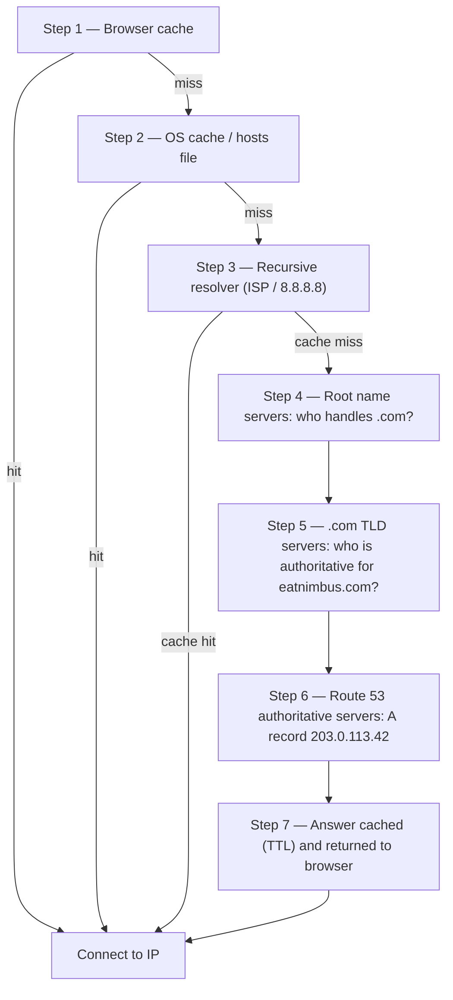

# Chapter 12: How the Internet Finds You

Maya refreshed `nimbus-alb-123456789.us-west-2.elb.amazonaws.com` in her browser one more time, then leaned back and looked at the ceiling. The page loaded. The app worked. But every time she shared the link with a restaurant partner, she felt a small embarrassment she couldn't quite name.

That URL was a technical artifact, not a product.

---

*The network redesign from last chapter had gone well. Every resource was in the right place — load balancers in public subnets, databases locked in private ones. The infrastructure was secure and correctly segmented. But as Nimbus prepared for its first public launch, a new problem had appeared: the load balancer URL that AWS had assigned automatically looked like a system identifier, not a product people would trust. They needed a real domain name. And they needed to understand what happened between the moment someone typed `eatnimbus.com` and the moment the page appeared.*

---

Nimbus was running. The load balancer had a public IP. The EC2 instances had a private IP. The databases were locked in private subnets. Priya had nodded approvingly at the network diagram.

Tom looked at the load balancer URL: `nimbus-alb-123456789.us-west-2.elb.amazonaws.com`.

"That's what customers type into their browser?" he asked.

"That's what AWS assigns automatically," Maya said.

"I'm not putting that on a business card."

"Neither am I."

They needed a domain name. They bought `eatnimbus.com` from a domain registrar. Now they needed to connect that name to their AWS infrastructure.

"How does the internet know that `eatnimbus.com` means the load balancer in us-west-2?" Leo asked.

Good question, Leo.

**The Phone Book Analogy**

Before smartphones, every city had a phone book. If you wanted to reach "Mario's Pizza," you didn't memorize their phone number — you looked up the name, got the number, and called.

The internet has its own phone book: the **Domain Name System (DNS)**.

DNS translates human-readable names (like `eatnimbus.com`) into machine-readable IP addresses (like `203.0.113.42`). Every time you visit a website, your computer silently looks up the domain name in DNS and gets the IP address to connect to.

If you changed your server's IP address, you'd update the DNS record — like changing your number in the phone book — and the internet would find you at your new location.

**The Full DNS Resolution Journey**

"But *how* does the lookup actually work?" Leo asked. "Like, step by step. My browser knows the name `eatnimbus.com`. What happens next?"

Most documentation glosses over this. It matters.

When your browser needs to resolve `eatnimbus.com`, here is every hop, in order:

**Step 1 — Browser cache**: The browser checks whether it has already resolved this name recently. If yes, it uses the cached IP. If not, continue.

**Step 2 — OS cache / local resolver**: Your operating system checks its own DNS cache and the local `hosts` file. If found, done. If not, it forwards to your configured DNS resolver — usually your ISP's or a public one like 8.8.8.8.

**Step 3 — Recursive resolver**: The recursive resolver (your ISP or Google's 8.8.8.8) is the workhorse. It has a cache too. If it knows the answer, it returns it immediately. If not, it starts the actual resolution chain.

**Step 4 — Root name servers**: The recursive resolver contacts one of the 13 root name server clusters (deployed worldwide). The root server doesn't know where `eatnimbus.com` is. But it knows who manages `.com` domains — the `.com` TLD servers. It returns their address.

**Step 5 — TLD (Top Level Domain) name servers**: The recursive resolver contacts the `.com` TLD servers. The TLD servers don't know where `eatnimbus.com` is either. But they know which name servers are authoritative for `eatnimbus.com` — the servers that actually hold the DNS records. They return those addresses.

**Step 6 — Authoritative name servers**: The recursive resolver contacts Route 53's name servers — the authoritative name servers for `eatnimbus.com`. Route 53 has the actual records. It returns the A record: `eatnimbus.com → 203.0.113.42`. This answer is authoritative — it's the real answer, not a cached one.

**Step 7 — Response cached and returned**: The recursive resolver caches the answer for the duration of the TTL (Time-To-Live) on the record. It returns the IP to your browser. Your browser caches it. Your browser connects.



"That's seven hops just to find an IP address," Tom said.

"Usually sub-100 milliseconds total," Priya said. "Steps 3 through 6 are cached aggressively at every level. For popular domains, steps 4 and 5 — the root and TLD lookups — are often skipped entirely because the recursive resolver already has those servers cached. The whole chain usually runs in 20–40 milliseconds."

"And after the first lookup, the browser cache means subsequent requests skip all of it," Leo added.

"Right. DNS feels instant because most lookups are cache hits. The full chain only runs when a record is new or its TTL has expired."

**Meet Route 53**

Amazon Route 53 is AWS's managed DNS service. It's called Route 53 because port 53 is the standard DNS port. (Sometimes AWS names things straightforwardly.)

Route 53 does several things:

**Domain registration**: You can buy domain names through Route 53 directly.

**DNS hosting (hosted zones)**: You create a *hosted zone* for your domain, and Route 53 manages the DNS records that tell the world where to find you.

**Health checking**: Route 53 can monitor your endpoints and route traffic away from unhealthy ones.

**Traffic routing policies**: Route 53 supports multiple routing strategies beyond simple DNS — weighted, latency-based, geolocation, failover.

**DNS Records: The Phone Book Entries**

A DNS record maps a name to a destination. The most common types:

**A record**: Maps a name to an IPv4 address.
`eatnimbus.com → 203.0.113.42`

**AAAA record**: Maps a name to an IPv6 address.

**CNAME record**: Maps a name to another name (an alias).
`www.eatnimbus.com → eatnimbus.com`

**MX record**: Specifies which servers handle email for the domain.

**TXT record**: Stores arbitrary text. Commonly used for domain verification (proving you own the domain) and email authentication (SPF, DKIM).

For Nimbus, the primary setup:

- `eatnimbus.com` → Alias record pointing to the load balancer
- `www.eatnimbus.com` → CNAME pointing to `eatnimbus.com`
- `api.eatnimbus.com` → Alias record pointing to the API load balancer

"Wait," Tom said. "The load balancer's IP can change. AWS said so in the documentation."

Good catch, Tom.

**Alias Records: AWS's Solution to Dynamic IPs**

Load balancers, CloudFront distributions, and S3 websites have DNS names, not static IP addresses. The underlying IPs can change.

If you create a CNAME pointing to a load balancer's DNS name, it works — but you can't use CNAMEs for root domains (`eatnimbus.com` without the `www`) because of DNS standards.

Route 53 solves this with **Alias records** — an AWS-specific extension to DNS. An Alias record maps a name directly to an AWS resource (load balancer, CloudFront distribution, S3 website), and Route 53 handles the dynamic IP resolution automatically. Alias records can be used at the root domain level. And unlike regular DNS queries to external services, Alias record queries to AWS resources are free.

"So we use an Alias record for `eatnimbus.com` pointing to the load balancer," Leo confirmed.

"And Route 53 handles whatever IP the load balancer is using at any given moment," Priya added.

"For free," Tom said, suddenly very interested. He pulled up the Route 53 pricing page. "And the rest of it?"

"Fifty cents per hosted zone," Leo said. "Plus about forty cents per million DNS queries. For our traffic right now, probably under two dollars a month."

Tom closed the pricing page satisfied.

**Routing Policies: More Than Just "Where Is It?"**

This is where Route 53 gets interesting. DNS isn't just a lookup service — it can be a traffic management tool.

**Simple routing**: One record, one destination. Standard DNS.

**Weighted routing**: Split traffic between multiple destinations by weight. Send 90% to the new server, 10% to the old server during a migration. Adjust the weights until you're confident in the new server, then switch to 100%.

**Latency-based routing**: Route users to the AWS region with the lowest latency for them. A user in Seattle gets routed to `us-west-2`. A user in Tokyo gets routed to `ap-northeast-1`. Same domain name, different destinations.

**Geolocation routing**: Route based on the user's geographic location. All European users go to `eu-west-1`. All North American users go to `us-east-1`. Useful for data sovereignty (keeping EU user data in EU regions) or content customization (language, currency). Routing decisions use hard boundaries — a user is in a country, a continent, or a US state, and that's where they go.

**Geoproximity routing**: Routes traffic based on the geographic location of users *and* lets you adjust those decisions with a **bias** value. A positive bias expands the geographic area that routes to a resource — attracting more traffic. A negative bias shrinks it. Unlike geolocation, which uses hard country and continent boundaries, geoproximity is continuous: a small bias value can gradually shift traffic from one region to another without redrawing any fixed lines.

The scenario that distinguishes the two: if a company is gradually migrating from `us-east-1` to `us-west-2` and wants to incrementally shift traffic westward — not flip a switch, but dial it over time — geoproximity with a growing positive bias on the west endpoint is the right tool. Geolocation would either route all West Coast users to Oregon or not; it has no dial. Since January 2024, geoproximity is available as a regular routing policy directly on DNS records (Console, API, CLI) — it no longer requires Route 53 Traffic Flow, though it remains available there too.

**Failover routing**: Designate a primary and a secondary endpoint. If the primary fails Route 53's health check, traffic is automatically redirected to the secondary. This is the DNS layer of disaster recovery.

"Wait — but *why* would we set up failover routing to a second region if we already have Multi-AZ?" Maya asked. "Isn't Multi-AZ supposed to handle failures?"

Good question. Multi-AZ protects against the failure of a single Availability Zone within a region — if one data center goes down, the standby in another AZ takes over. But what if an entire AWS region becomes unavailable? Or what if there's a region-wide service disruption? DNS failover routing operates at a different level: it routes traffic away from an entire region when that region's health check fails. Multi-AZ is intra-region resilience. DNS failover is inter-region resilience.

**Multivalue answer routing**: Return up to eight healthy IP addresses for a query, letting the client choose. A simple alternative to a load balancer for distributing traffic across multiple servers.

"So Route 53 is not just a phone book," Maya said. "It's a smart phone book that can route calls based on where you're calling from."

"And disconnect you if the number is unhealthy," Priya added.

---

**Latency Routing Plus Health Checks: A Thought Experiment**

Priya sketched a scenario on the whiteboard. Suppose Nimbus's East Coast user base kept growing, and one day the team stood up a lightweight stack in `us-east-1` (Northern Virginia) — not a full multi-region active-active setup, which would be expensive and complex, but a load balancer and a read-only set of EC2 instances serving static content and browsing pages. Orders would still go west to the primary database in `us-west-2`. Browse traffic — which accounted for seventy percent of requests — could be served from either coast.

The Route 53 configuration for the browse endpoint would look like this:

```
browse.eatnimbus.com
  → Latency record: us-east-1 ALB (with health check, set-identifier "east")
  → Latency record: us-west-2 ALB (with health check, set-identifier "west")
```

(Note the record is a *hostname*, `browse.eatnimbus.com` — DNS routes names, never URL paths. Path-based routing like `/browse` is the load balancer's job, not Route 53's.)

With latency routing, a user in Seattle would be resolved to the `us-west-2` endpoint. A user in Boston would go to `us-east-1`. Route 53 measures latency from its infrastructure to each region continuously and picks the faster one per user.

"But what if the west region has a problem?" Tom asked. "Our browsing users in Seattle would be stuck."

"That is what the health checks are for," Priya said. "Each latency record gets a health check on its respective load balancer. If the `us-west-2` health check fails three consecutive checks, Route 53 stops returning that record — even for users where Oregon would normally be faster. Seattle users get routed east until Oregon recovers."

"So latency routing determines which region is normally preferred," Maya said, "and health checks override that preference if the preferred region goes down?"

"Exactly. Latency policy picks the winner under normal conditions. Health checks remove a winner that has stopped working."

Leo thought about the failure scenario. "And the TTL on those records?"

"Sixty seconds," Priya said. "Three failed checks at thirty-second intervals to trip it — up to ninety seconds to detect the failure — then up to sixty seconds for DNS resolvers to pick up the change."

"Two and a half minutes worst case," Leo said.

"Which is why you lower TTL before you care about it, not after."

This combination — latency routing with health checks on every record — is one of the most powerful Route 53 configurations for multi-region deployments. Users always go to the fastest healthy region. The system self-heals when a region has problems. And the whole thing is DNS: no additional infrastructure, no proxy servers, no load balancers between regions.

---

**The Health Check Failure Incident**

Nimbus's staging environment gave them an accidental demonstration of failover routing.

They had configured Route 53 health checks on the staging load balancer as a test — checking the `/health` endpoint every 30 seconds. One Friday afternoon, Leo pushed a deployment to staging that had a bug: the health endpoint started returning 500 errors. It passed his local tests but broke on the server.

Route 53 noted the failures. After three consecutive failed checks, it marked the endpoint unhealthy. The failover record activated, routing staging traffic to a read-only fallback page that said "Maintenance in progress."

Leo's first alert was a Slack message from a QA engineer: "Staging is showing the maintenance page."

Leo checked the deploy. The 500 errors were obvious in the logs. He rolled back the deployment. Within 90 seconds of the health endpoint returning 200s, Route 53 re-evaluated the check, saw three consecutive successes, and returned traffic to the staging load balancer. The maintenance page disappeared.

Total time on the maintenance page: seven minutes.

"That was the system working correctly," Priya said.

"I know," Leo said. "The scary part is thinking about what would have happened without the health check. The 500 errors would have gone to real users."

"In production, the health check would have failed over to the secondary region or the static error page. Users would have seen a maintained experience instead of errors."

"How long does failover actually take?" Maya asked. "From when the health check fails to when DNS starts routing differently?"

"Health check interval is 30 seconds by default. Three consecutive failures to trip the failover. That's up to 90 seconds to detect the problem. Then DNS TTL — if it's 60 seconds, propagation is another minute."

"So worst case, about three minutes?"

"About that. Which is why you want your TTL low on critical records, and your health check interval as short as your budget allows."

---

**Health Checks: Routing Around Failure**

"And what if someone tries to break in?" Priya said. "DNS is public. Anyone can look up where `eatnimbus.com` points. That means an attacker knows exactly which IP to target."

"That's true," Leo said. "But the IP they find is the load balancer's IP. The ALB is the only thing with a public address. Everything behind it — EC2, RDS, ElastiCache — is in private subnets. DNS tells them the front door. It doesn't tell them what's behind it."

Route 53 can monitor your endpoints with health checks. If an endpoint fails, Route 53 can:

- Remove it from DNS responses (stop sending traffic there)
- Trigger a failover to a backup endpoint
- Send an alert via CloudWatch

Health checks are the link between DNS routing and actual application health. In a failover configuration: Route 53 monitors the primary endpoint every 30 seconds. If three consecutive checks fail, Route 53 starts returning the secondary endpoint's address. None of these numbers is fixed: 30 seconds is the standard interval (a paid "fast" option checks every 10 seconds), and the failure threshold defaults to 3 consecutive checks but is configurable from 1 to 10.

This is not instantaneous — DNS has propagation time. Once Route 53 changes a DNS record, DNS resolvers around the world need to pick up the change, which can take seconds to minutes depending on TTL settings.

**TTL: The DNS Cache**

DNS responses are cached at multiple levels — at your router, at your ISP, in your browser. The **TTL (Time-To-Live)** on a DNS record tells caches how long to remember the answer before checking again.

High TTL (1 hour or more): Fewer DNS queries, less load on Route 53, but changes take longer to propagate.

Low TTL (60 seconds or less): Changes propagate quickly, but more DNS queries are needed.

Before a planned migration (updating DNS to point to a new server), lower your TTL to 60 seconds a day in advance. Then when you make the change, it propagates in about a minute. After the migration, raise it back to the normal value.

"I already deployed it — oh." Leo had updated the DNS record before lowering the TTL. He'd realized his mistake and started counting: the old TTL was one hour. Some users would be getting the old server for the next sixty minutes.

"If we just lower it during the migration and not before," Leo said slowly, "the old TTL means some users will see the old server for an hour."

"Exactly," Priya said. "DNS migrations require planning before the migration, not just during."

You might be wondering: if TTL is set to one hour, does that mean every user will wait a full hour after a DNS change before seeing the new server? Not exactly. TTL means resolvers won't re-check until the TTL expires. If a user's DNS resolver cached the old value 55 minutes ago with a 1-hour TTL, they'll get the new value in 5 minutes. If they cached it 5 minutes ago, they'll wait 55 minutes. On average, users see the change within half the TTL duration. That's why lowering TTL in advance is so important: it shrinks the worst-case propagation window before the change happens.

---

**Private Hosted Zones: Internal DNS**

Priya raised a new requirement two weeks after the public domain was live.

"Our EC2 instances need to reach the database," she said. "Right now they're using the RDS endpoint DNS name — `nimbus-prod.abc123.us-west-2.rds.amazonaws.com`. That works, but it's a public DNS name. If we ever want to change our database configuration, all the application config files need updating."

"We could use a private DNS name," Leo said. "Like `db.nimbus.internal`. Something our services use internally that maps to whatever the current database endpoint is."

"Exactly. Route 53 private hosted zones."

A **private hosted zone** is a DNS domain that only resolves inside your VPC. External DNS queries for `nimbus.internal` get no response. But from within the VPC, `db.nimbus.internal` resolves to the RDS endpoint.

They set it up:

- Private hosted zone: `nimbus.internal`
- CNAME record: `db.nimbus.internal → nimbus-prod.abc123.us-west-2.rds.amazonaws.com`
- CNAME record: `cache.nimbus.internal → nimbus-cache.abc123.usw2.cache.amazonaws.com`
- A record: `api.nimbus.internal → 10.0.10.5` (internal EC2 IP — A records map names to IP addresses; CNAMEs map names to other names. Fine here because this instance keeps a static private IP; for anything behind Auto Scaling you'd point at a load balancer instead)

Now the application config read:

```
DATABASE_HOST=db.nimbus.internal
CACHE_HOST=cache.nimbus.internal
```

When they migrated to a new RDS instance, they updated one DNS record. No application deployment required.

"This is also why private DNS matters during a database migration," Priya said. "You update `db.nimbus.internal` to point to the new endpoint. Traffic shifts. Old endpoint stays available during the TTL window. No application config changes."

**The Internal DNS Debugging Story**

Three weeks later, Leo deployed a new service — a background worker — and it couldn't reach the database. The worker was in the same VPC, same private subnet as the API servers. The API servers could reach the database. The worker could not.

He checked the security groups. The worker's security group had an outbound rule for PostgreSQL. The database security group had an inbound rule from the worker's security group. Everything looked correct.

He ran `nslookup db.nimbus.internal` from the worker instance.

No response.

"The DNS lookup is failing," he said to Priya.

She looked at the worker instance's VPC configuration. "Which VPC is the worker actually in? Private hosted zones are associated with VPCs — if the instance isn't in an associated VPC, the zone simply doesn't exist for it."

"It's in the main VPC. Same as everything else."

"Is it?"

Private hosted zones must be explicitly associated with each VPC they serve — the association is per VPC, never per subnet. Priya had associated the main VPC when she created the zone. But Leo had accidentally deployed the worker into a test VPC he'd created for a different experiment. Different VPC. Not associated with the private hosted zone.

"The worker is in the wrong VPC," Priya said.

"I already deployed it — oh." Leo moved the worker to the correct VPC. DNS resolved. The worker connected to the database.

"One VPC," Leo said, making a note. "Unless we have a reason for more than one."

---

**DNSSEC: Authenticating DNS Responses**

"Have we thought about DNS spoofing?" Priya asked. "What if someone intercepts our DNS query and returns a fake IP? Our users' browsers would connect to the attacker's server instead of ours."

**DNSSEC (DNS Security Extensions)** solves this by cryptographically signing DNS records. When a DNS response includes a DNSSEC signature, the resolver can verify that the response came from the authoritative name server and hasn't been tampered with.

Route 53 supports DNSSEC signing for public hosted zones. The process involves:

1. Enabling DNSSEC on the hosted zone in Route 53
2. Route 53 generates a key signing key (KSK) stored in KMS
3. Route 53 signs all records with the zone signing key
4. You add a DS (Delegation Signer) record at the parent domain registrar (.com TLD)
5. Resolvers that support DNSSEC can now verify authenticity of responses

"How common is DNS spoofing?" Leo asked.

"On the public internet, rare but possible," Priya said. "Most ISP resolvers support DNSSEC validation today. Enabling DNSSEC costs nothing and adds a meaningful layer of authenticity."

"How much does that cost per month?" Tom asked.

"Enabling DNSSEC signing itself is free in Route 53," Priya said. "The only real cost is the KMS key that holds the key-signing key: $1/month, plus KMS API calls — and one key can be shared across multiple hosted zones. The protection against DNS hijacking attacks is effectively free at our scale."

Tom enabled it before lunch.

---

**Route 53 Resolver: Hybrid DNS**

When Nimbus eventually connected their AWS VPC to their on-premises development network through a VPN, a new problem emerged: the on-premises servers needed to resolve AWS private DNS names (like `db.nimbus.internal`), and the AWS resources needed to resolve on-premises hostnames (like `jenkins.corp.nimbus.local`).

DNS resolution doesn't cross network boundaries by default. AWS resources resolve DNS using Route 53 Resolver (built into every VPC). On-premises servers use their own DNS servers. Neither can see the other's records.

**Route 53 Resolver Endpoints** bridge this gap:

**Inbound endpoints**: On-premises DNS servers can forward queries for AWS-hosted DNS zones to an inbound endpoint IP in your VPC. Route 53 Resolver handles the query and returns the result.

**Outbound endpoints**: When EC2 instances need to resolve on-premises hostnames, Resolver forwards those queries to on-premises DNS servers through the outbound endpoint.

"So it's like a translation service," Maya said. "Your AWS DNS and your on-premises DNS don't speak directly to each other. The Resolver endpoints act as intermediaries."

"Exactly. Your on-premises servers can now resolve `db.nimbus.internal`. Your EC2 instances can resolve `jenkins.corp.nimbus.local`. Both sides see DNS names from both worlds."

For Nimbus, this became relevant when the development team wanted to run integration tests from their office against a staging environment in AWS. Without Resolver endpoints, they'd have been manually editing hosts files. With them, internal DNS just worked across the VPN.

The architecture for Resolver endpoints:

- **Inbound endpoint**: Two ENIs (Elastic Network Interfaces) created in two different AZs in your VPC. Each gets a private IP. You configure your on-premises DNS server to forward queries for your AWS-hosted zones to these IPs. Traffic travels through your VPN or Direct Connect.
- **Outbound endpoint**: Two ENIs in two AZs. You create forwarding rules: "queries for `corp.nimbus.local` go to these on-premises DNS server IPs." EC2 instances automatically use the Resolver, which consults your forwarding rules and sends the query on-premises.

"Why two ENIs per endpoint?" Leo asked.

"High availability," Priya said. "If one AZ loses network connectivity, the other endpoint IP still works. Same principle as NAT Gateways."

"How much does that cost per month?" Tom asked.

Resolver endpoints cost approximately $0.125 per hour **per elastic network interface**, and each endpoint requires at least two ENIs for availability — so a realistic floor is about $180 per month per endpoint, plus $0.40 per million DNS queries. For a team using hybrid DNS to resolve internal names, the cost is modest — and eliminates the need to maintain hosts files across multiple developer machines and CI/CD systems.

"We could just put the hostnames in the hosts files," Leo suggested.

"On every developer machine, every CI runner, every new onboarding," Priya said. "Every time anything changes."

"The endpoint is worth it," Leo said.

"It is."

## Strengths and Limitations

**Route 53 is the right choice for**: registering and managing domain names entirely within AWS; routing traffic based on latency, geolocation, or weighted distribution across multiple endpoints; health-check-based failover between regions or between a primary and a disaster-recovery endpoint; integrating DNS with other AWS services through alias records; private hosted zones for internal service discovery.

**When Route 53 is not what you need**: Route 53 is a DNS service, not a load balancer. If you need to distribute traffic between multiple servers or containers within a region, use an Application Load Balancer — Route 53 cannot do weighted round-robin at the connection level the way a load balancer can. Latency-based routing across regions adds cost and operational complexity that only makes sense when your users are genuinely distributed globally and milliseconds matter to conversion. For most single-region applications, a single Alias record pointing to an ALB is all the Route 53 configuration you need.

## Summary

Getting from `nimbus-alb-123456789.us-west-2.elb.amazonaws.com` to `eatnimbus.com` felt like a small thing. It wasn't. DNS is the address system the entire internet runs on, and Route 53 gives you tools to use that system not just for lookups, but for traffic management and resilience.

- **DNS** translates domain names into IP addresses — the internet's phone book.
- **Route 53** is AWS's managed DNS service: domain registration, DNS hosting, health checks, and routing policies.
- **A records** map names to IPv4 addresses. **CNAMEs** map names to other names. **Alias records** map names to AWS resources (load balancers, CloudFront, S3).
- Use Alias records (not CNAMEs) for root domains and for resources with dynamic IPs.
- Routing policies go beyond simple DNS: **weighted** (traffic splitting), **latency-based** (performance), **geolocation** (data sovereignty — hard country/continent boundaries), **geoproximity** (distance-based with a bias dial — gradual traffic shifting), **failover** (disaster recovery).
- **Private hosted zones** provide internal DNS for VPC resources — service-to-service communication by name, not hard-coded IP.
- **DNSSEC** cryptographically signs records, protecting against DNS spoofing.
- **Route 53 Resolver Endpoints** bridge hybrid networks — AWS and on-premises DNS can resolve each other's names.

## Exam Tips

*SAA-C03 Domain: Design High-Performing Architectures (Domain 3, Task 3.4)*

- **Alias vs CNAME**: Alias records can be used at the root domain; CNAMEs cannot. Alias records to AWS resources are free; CNAME DNS queries are priced. When the exam asks about mapping a root domain to a load balancer → Alias record.
- **Routing policy use cases** (common exam scenarios):
  - "Gradually migrate traffic to a new version" → Weighted routing
  - "Route users to the nearest AWS region" → Latency-based routing
  - "Keep EU user data in EU regions" → Geolocation routing
  - "Automatic DNS failover when primary goes down" → Failover routing with health checks
  - "Gradually shift traffic to a new region" or "increase traffic attracted to our EU deployment" → Geoproximity routing with positive bias
- **Geoproximity vs. Geolocation:** Geolocation routes by user's country/continent with hard boundaries. Geoproximity routes by geographic distance with a configurable bias — use it when you need to gradually shift traffic to a new region or attract more users to a specific deployment. Available as a regular routing policy on records since January 2024 (Traffic Flow no longer required).
- **Route 53 health checks**: Can check HTTP/HTTPS/TCP endpoints, and can trigger CloudWatch alarms. Exam uses these in disaster recovery scenarios.
- **TTL and propagation**: Know that TTL controls how long DNS resolvers cache a record. Short TTL = faster changes. Exam scenario: "the team updated DNS but users are still hitting the old server" → TTL too high.
- **Private hosted zones**: Route 53 can create DNS records that only resolve inside a VPC. Exam uses this for internal service discovery (e.g., `database.internal` resolving to a private RDS endpoint).
- Route 53 is **global** — it's not deployed in a region. No region selection is needed when creating hosted zones.
- **Route 53 Resolver Endpoints**: Used in hybrid scenarios where on-premises and AWS DNS need to resolve each other's names. Inbound endpoint for on-premises → AWS. Outbound endpoint for AWS → on-premises.

## Exercises

**Exercise 1 — Recall**

Explain the difference between a CNAME record and an Alias record. When would you use each?

*(Hint: Consider the constraints on CNAME at root domains, and the behavior of Alias records with dynamic AWS resources.)*

**Exercise 2 — SAA-C03 Scenario**

*Scenario*: A media company operates a website from two AWS regions: `us-east-1` (primary) and `eu-west-1` (secondary). The team wants traffic to automatically route to `eu-west-1` if the primary region becomes unavailable. The company also wants to verify that this failover mechanism works correctly without actually taking down the primary region.

Which Route 53 configuration BEST meets these requirements?

A) Weighted routing with 100% weight on `us-east-1` and 0% weight on `eu-west-1`  
B) Latency-based routing with health checks on both endpoints  
C) Failover routing with a health check on the primary endpoint and a secondary record pointing to `eu-west-1`  
D) Geolocation routing with North America pointing to `us-east-1` and Europe pointing to `eu-west-1`

**Hint 1**: The requirement is automatic failover when the primary goes down. Which routing policy is designed exactly for this?

**Hint 2**: "Test without taking down the primary region" — health checks can be manually set to "unhealthy" for testing.

**Hint 3**: Latency-based routing optimizes for speed, not for failover.

**Answer**: C

**Explanation**: Failover routing is designed exactly for this use case. The primary record points to `us-east-1` with a health check. The secondary record points to `eu-west-1`. If the health check fails, Route 53 automatically serves the secondary record. Health checks can be manually forced to fail for testing without actually disrupting the primary region.

**Why not A?** Weighted routing with 100%/0% is effectively static — it doesn't automatically switch when the primary fails.

**Why not B?** Latency records *with health checks* do stop returning an unhealthy endpoint, so B would survive a real outage. But it changes the normal traffic pattern (users would be split across regions by latency, not primary/secondary as required) and it has no clean way to *test* failover: you'd have to actually fail the primary's health check in production. Failover routing models the stated intent — designated primary, designated secondary, testable by forcing the health check state.

**Why not D?** Geolocation routing routes by user location, not by endpoint health. European users would be stuck on `eu-west-1` even if `us-east-1` is healthy, and North American users wouldn't failover to `eu-west-1` even if `us-east-1` goes down.

*SAA-C03 Domain: Design High-Performing Architectures — Task 3.4*

**Exercise 3 — Architecture Challenge** *(Optional)*

Nimbus is expanding internationally. They want `eatnimbus.com` to load quickly for users on the West Coast, the East Coast, and Australia. They also have a regulatory requirement: orders placed by European users must be processed by servers in the EU.

Design a Route 53 routing strategy that addresses both requirements. What routing policy or combination of policies would you use? What infrastructure in each region would you need?

*(There is no single correct answer. The goal is to practice multi-region routing design.)*

## Post-Credits Scene

`eatnimbus.com` was live.

Maya had typed it into her browser, and the Nimbus ordering page had loaded. She'd ordered arepa from her own family's restaurant, just to test the flow. The order had gone through. The kitchen had received it.

She sat back.

Tom was already reading the Route 53 health check logs. "Response time is 18 milliseconds from the us-west-2 checkers."

"Is that fast?" Maya asked.

"For DNS? Yes. For Seattle users, too — they're practically next door to Oregon."

"But for a user in Boston?"

Tom looked at the latency graph. "About 80 milliseconds."

Maya thought about that. "If our East Coast partners keep growing, and our servers are in Oregon..."

"Every request travels from Boston to Oregon and back," Leo said from across the room. "Speed of light. You can't beat physics."

"So we need servers closer to Boston."

"Or something closer to Boston that serves content on their behalf."

That thought hung in the air.

In the next chapter: the warehouses that put Nimbus's content a millisecond away from every user, everywhere.
