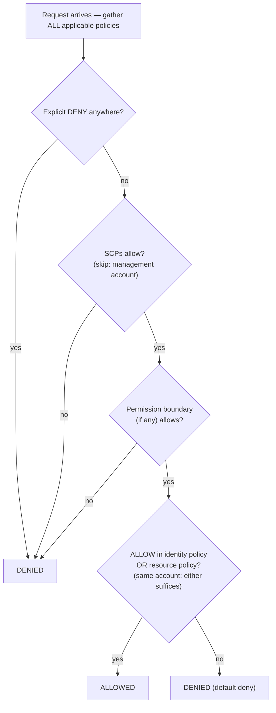

# Chapter 14: Who Is Allowed to Do What

The new engineers were starting Monday. Soo-Jin and Rafael. Maya had been thinking about their first week — what they'd need access to, what they shouldn't touch, and whether the current IAM setup was even ready to be extended to two more people.

She sat with a coffee before the office filled up, making a list.

---

*CloudFront was deployed. Cache hit rates were good. Performance was up. But as the team prepared to bring on new engineers, a quiet problem surfaced: the IAM configuration had been built by people in a hurry. Access keys were in config files. Some roles had more permissions than they needed. And two new people were about to be handed credentials to a production system that hadn't been designed with multiple users in mind.*

---

Tom had the access keys open in a text file, ready to paste.

"What are you doing?" Priya asked.

"The EC2 instance needs to read config files from S3. I'm putting the credentials in the server configuration."

She looked at the screen for a moment. "Close that file."

"I was just—"

"If someone gets into that server," she said, "they get those keys. And those keys touch whatever the IAM user is allowed to touch. Which is probably more than just S3."

Tom closed the file.

"There's a better way," she said. "The server itself can have a role. Think of it like a job title — the instance doesn't need credentials because the system already knows what it is and what it's allowed to do."

Tom looked skeptical. "So the server authenticates itself?"

"Yes. Without a password. Without keys in a config file. Without anything that can be accidentally committed to git."

That last part landed. Tom had nearly committed an access key to the repo himself two weeks ago — caught it in the diff at the last second. He opened a new browser tab.

**Revisiting IAM: The Full Picture**

Chapter 3 introduced IAM: users, groups, roles, and policies. Now it's time to go deeper.

IAM policies are JSON documents that specify what actions are allowed or denied on which resources. They look like this:

```json
{
  "Version": "2012-10-17",
  "Statement": [
    {
      "Effect": "Allow",
      "Action": [
        "s3:GetObject",
        "s3:PutObject"
      ],
      "Resource": "arn:aws:s3:::nimbus-assets/*"
    }
  ]
}
```

This policy allows reading and writing objects in the `nimbus-assets` bucket, and nothing else. Not deleting. Not listing buckets. Not any other S3 operation. Not any other AWS service.

This is the correct way to grant permissions: specific actions, specific resources.

**The Problem with "Administrator Access"**

AWS Managed Policies like `AdministratorAccess` are designed for getting started quickly. They're not designed for running production systems with real team members.

`AdministratorAccess` grants every action on every resource. If a team member with this policy makes a mistake — accidentally deletes an S3 bucket, terminates the wrong EC2 instance, changes security group rules — there's nothing AWS can do to stop them. The permission was granted.

If a team member's credentials are compromised (phishing attack, leaked access key, laptop theft), the attacker has administrator access to everything in your AWS account.

"So what should Soo-Jin have?" Leo asked.

"What does Soo-Jin need to do?" Priya responded.

"Deploy the API. Check logs. Nothing else."

"Then she gets: ability to push to the code pipeline, read access to CloudWatch logs, and nothing else."

"That's... very specific."

"Yes. That's the point."

**IAM Roles: Identities for Services**

Chapter 3 introduced roles as a way for EC2 instances to access AWS services without storing credentials. Let's make this concrete.

Your EC2 instances running the Nimbus API need to:

- Read from DynamoDB (the menu)
- Write to DynamoDB (orders)
- Put objects in S3 (receipts, uploads)
- Write logs to CloudWatch
- Read secrets from Secrets Manager

Instead of creating a user with an access key and storing that key on the EC2 instance (a security nightmare — access keys can be read by anyone with SSH access), you create an **IAM role** for the EC2 instance with exactly these permissions.

"Wait — but *why* would we do it that way?" Maya asked. "The EC2 instance already runs our code. Why not just give the code an access key?"

Because access keys are static credentials that live somewhere — in a config file, an environment variable, a git repository if someone makes a mistake. They can be copied, exfiltrated, committed by accident. An IAM role works differently: the EC2 instance assumes the role automatically. AWS provides temporary credentials through the instance metadata service. The credentials rotate automatically — they expire every few hours and are refreshed without any action from you. There's nothing to leak, because there's nothing stored.

"And if someone hacks into the EC2 instance?" Leo asked.

"They can do what the EC2 role allows," Priya said. "Which is read the menu, write orders, and send logs. They cannot delete the S3 bucket. They cannot terminate EC2 instances. They cannot touch IAM."

"Because the EC2 role doesn't have those permissions."

"Exactly."

---

**How EC2 Role Assumption Works Step by Step**

"Something doesn't add up," Maya said. "If there are no credentials stored on the instance, how does the instance actually prove to AWS who it is? There must be a credential somewhere."

There is. But it is temporary, automatically rotated, and only accessible from inside the instance.

When an EC2 instance starts with an IAM role attached, AWS does the following:

**Step 1**: AWS STS (Security Token Service) generates temporary credentials — an access key ID, a secret access key, and a session token. For EC2 instance roles these are typically valid for about six hours, and AWS rotates them automatically before they expire.

**Step 2**: AWS makes these credentials available at a special IP address: `169.254.169.254`. This is the **instance metadata service** (IMDS). It is only reachable from inside the EC2 instance. Nothing outside the instance can access it.

**Step 3**: When your application code calls any AWS SDK (boto3, the Java SDK, the Node.js SDK), the SDK automatically queries the instance metadata endpoint:

```
GET http://169.254.169.254/latest/meta-data/iam/security-credentials/{role-name}
```

**Step 4**: The SDK receives the temporary credentials and uses them to sign the API request — for example, a request to read from S3.

**Step 5**: AWS validates the credentials, checks the IAM policy attached to the role, and either permits or denies the request.

**Step 6**: About fifteen minutes before the credentials expire, the EC2 instance automatically refreshes them from the metadata service. The application code never needs to handle this — the SDK does it transparently.

The entire process is invisible to the developer. You write `s3.get_object(...)`. The SDK handles the rest.

"So the credential exists," Maya said. "It is just temporary, auto-rotating, and locked to the instance metadata endpoint."

"Which is why it is so much safer than a static access key," Priya said. "A static key, once stolen, is valid until someone manually rotates it. A stolen temporary credential expires on its own — within hours, not months."

"And if someone inside the instance queries the metadata endpoint?"

"They can get the current temporary credential. That is a real risk, which is why AWS introduced IMDSv2 — Instance Metadata Service version 2. IMDSv2 requires the caller to first get a session token via a PUT request. This prevents a class of attack called Server-Side Request Forgery, where malicious code tricks the server into fetching the metadata URL on the attacker's behalf."

Leo updated the EC2 launch configuration to enforce IMDSv2. One setting, applied at launch time.

---

**Role Assumption: How Services Become Other Services**

Roles can be assumed by:

- **AWS services** (EC2, Lambda, ECS tasks, etc.)
- **IAM users** in your own account (role elevation — you assume a role with more permissions for a specific task)
- **IAM users in other AWS accounts** (cross-account access — another organization's account can assume a role in yours)
- **External identity providers** (Google, Active Directory, Okta — federated access for human users)

"Have we thought about what happens if Nimbus uses a third-party service that needs access to our AWS resources?" Priya asked. "An external analytics vendor, for example. We don't want to create an IAM user for them and hand over an access key."

"Cross-account roles," Leo said. "We create a role in our account and write a trust policy that says 'this specific external account is allowed to assume this role.' They use their own credentials to assume the role and get temporary access. No keys to manage, no keys to leak."

This last pattern — **identity federation** — is how large organizations give their employees AWS access without creating individual IAM users for each person. Your company's Active Directory has your credentials. When you log into AWS, you authenticate against Active Directory, and AWS grants you a role.

---

**Cross-Account Access: The Accounting Team Scenario**

Six months in, Nimbus brought on an accounting firm to help with financial reporting. The accounting team needed read access to billing data in the Nimbus S3 billing bucket — but they operated out of their own separate AWS account. Nimbus didn't want to create an IAM user for them. Handing someone in an external company a static access key felt exactly wrong.

"Cross-account role," Priya said.

The setup has three parts:

**Part one**: In the Nimbus account, create an IAM role — call it `AccountingReadRole`. Attach a policy that allows `s3:GetObject` and `s3:ListBucket` on the billing S3 bucket. Nothing else.

**Part two**: Add a trust policy to `AccountingReadRole`. The trust policy says which external identity is allowed to assume this role:

```json
{
  "Version": "2012-10-17",
  "Statement": [{
    "Effect": "Allow",
    "Principal": {
      "AWS": "arn:aws:iam::ACCOUNTING-FIRM-ACCOUNT-ID:role/AccountingAppRole"
    },
    "Action": "sts:AssumeRole"
  }]
}
```

This says: only the specific role in the accounting firm's AWS account can assume this role. Nobody else.

**Part three**: In the accounting firm's account, their application uses `sts:AssumeRole` to get temporary credentials for `AccountingReadRole`. Those credentials are scoped to only what `AccountingReadRole` allows. The accounting application can read billing files. It cannot write to them. It cannot touch anything else in the Nimbus account.

There is one more hardening step for exactly this scenario — and it's a named exam topic. The accounting firm serves many clients. Suppose a malicious client of theirs learns the ARN of Nimbus's `AccountingReadRole` and asks the firm's software to "analyze" it. The firm's software has legitimate permission to assume roles — it could be tricked into accessing Nimbus's data on the wrong customer's behalf. This is the **confused deputy problem**, and the fix is the **ExternalId**: Nimbus generates a unique secret value, puts it in the trust policy as a condition (`"sts:ExternalId": "nimbus-7f3a..."`), and shares it only with the accounting firm. The firm's software must pass that ExternalId in every `AssumeRole` call, and it uses a *different* ExternalId per customer — so a request made on behalf of the wrong customer fails. Exam trigger: "third party needs cross-account access" → role + trust policy + **ExternalId**. Never an IAM user with shared keys.

"What if we need to revoke their access?" Tom asked.

"Delete the trust policy or delete the role," Priya said. "Done. No credentials to hunt down, no keys to deactivate. The role is the access. Remove the role, access is gone."

"And we can see every time they used it in CloudTrail," Leo added.

"Every API call they made, logged. Which bucket, which file, what time, what result."

Tom wrote down the pattern. It would come up again — every integration partner, every external vendor, every third-party tool that needed AWS access would get a role with a trust policy, not a user with an access key.

---

**IAM Policy Evaluation: The Decision Logic**

"Have we thought about what happens when multiple policies apply to the same request?" Priya asked. "An IAM user has a policy. The resource they're accessing has a resource policy. There might be an SCP. How does AWS decide?"

The important thing to understand is that AWS does **not** check policies one type at a time, in sequence. It gathers *all* the policies that apply to the request — identity-based, resource-based, SCPs, permission boundaries, session policies — and applies a set of rules to the whole pile at once:

**Rule 1 — Explicit deny wins, always.** If any applicable policy — IAM, resource-based, SCP, or boundary — explicitly denies the action, the request is denied. Nothing can override an explicit deny.

**Rule 2 — SCPs and permission boundaries act as filters.** They never grant anything. The action must be *allowed* by every applicable SCP and by the permission boundary (if one exists), or it's denied — regardless of what other policies say.

**Rule 3 — Within the same account, one allow is enough.** An explicit allow in *either* the identity's IAM policy *or* the resource's policy permits the action. They are a union, not a sequence — the resource policy doesn't get evaluated "before" the IAM policy.

**Rule 4 — Default deny.** If nothing explicitly allows the action, it's denied.



The outcome: explicit deny anywhere = denied. No allow anywhere = denied. An allow from the identity policy *or* the resource policy = allowed, as long as no deny, SCP, or boundary blocks it.

One more fact the exam loves: **SCPs do not apply to the management account of the organization** (nor to service-linked roles). An SCP that says "no EC2 outside us-west-2" constrains every member account — but the management account is untouched. This is one of the reasons AWS tells you to keep workloads out of the management account entirely.

One nuance that trips up exam candidates: for **cross-account access**, a resource-based policy in the target account is not enough by itself. The identity in the source account also needs explicit permission in its own IAM policy to perform the action. If you grant an S3 bucket policy that allows Account B to read your objects, but Account B's IAM users have no IAM policy permitting `s3:GetObject`, the access is still denied. Both sides must allow the action — the resource policy opens the door on the target side, and the IAM policy in the source account grants the user permission to walk through it.

"So if Priya's SCP says 'no EC2 in eu-west-1,' and her IAM policy says 'allow all EC2 actions,' she still cannot create an instance in eu-west-1?" Leo asked.

"Correct," Priya said. "The SCP filters what is possible before IAM policies are evaluated. Both must agree for an action to succeed."

"And an explicit deny in an IAM policy overrides an explicit allow in a resource policy?"

"Always. An explicit deny anywhere in the chain wins."

---

**Permission Boundaries: Limiting What Roles Can Grant**

Here's a subtle but important problem: by default, IAM does not prevent a user from granting permissions they don't currently have.

If Soo-Jin has `iam:CreatePolicy` and `iam:AttachUserPolicy`, she could create a policy granting S3 write access and attach it to herself — even if her existing policies only allow S3 read. This class of vulnerability is called **privilege escalation**, and it is exactly why permission boundaries exist.

But what if you want to delegate IAM permission creation to a team lead, while ensuring they can't grant more than you intended?

**Permission boundaries** set the maximum permissions that can ever be granted to an identity. Even if the identity's attached policies are broader, the effective permissions are bounded by the permission boundary.

Example: You give a team lead a policy that allows them to create IAM roles. But you attach a permission boundary that says "roles created by this team lead can never have S3 delete access." Even if the team lead creates a role with S3 full access, the boundary prevents S3 delete from taking effect.

You might be wondering: what's the difference between a permission boundary and a Service Control Policy? They sound similar — both limit what permissions can be effective. The distinction is scope. A permission boundary applies to a specific IAM identity (a user or role) and limits what that identity can ever do. An SCP applies to an entire AWS account or organizational unit — it's an organization-level guardrail that affects every identity in the account, including administrators. Use permission boundaries when you're delegating IAM management to a team lead. Use SCPs when you need organization-wide rules that no one in an account can override.

This is an advanced concept, but it appears on the exam and reflects how organizations delegate IAM management at scale.

**A Concrete Permission Boundary: Delegating Role Creation Safely**

Nimbus was growing. Soo-Jin proposed that each senior engineer on the platform team be allowed to create IAM roles for the Lambda functions they owned — without requiring Priya to approve each one.

"The risk," Priya said, "is that a senior engineer creates a Lambda role with `AdministratorAccess` — either by mistake or by not thinking carefully."

"So we use permission boundaries," Soo-Jin said.

Priya created a permission boundary policy called `NimbusDeveloperBoundary`:

```json
{
  "Version": "2012-10-17",
  "Statement": [
    {
      "Effect": "Allow",
      "Action": [
        "s3:GetObject", "s3:PutObject",
        "dynamodb:GetItem", "dynamodb:PutItem", "dynamodb:Query",
        "cloudwatch:PutMetricData", "logs:CreateLogGroup",
        "logs:CreateLogStream", "logs:PutLogEvents",
        "secretsmanager:GetSecretValue",
        "xray:PutTraceSegments"
      ],
      "Resource": "*"
    }
  ]
}
```

She then allowed each senior engineer to create roles, but only if they attached this boundary:

```json
{
  "Effect": "Allow",
  "Action": ["iam:CreateRole", "iam:AttachRolePolicy"],
  "Resource": "*",
  "Condition": {
    "StringEquals": {
      "iam:PermissionsBoundary": "arn:aws:iam::ACCOUNT_ID:policy/NimbusDeveloperBoundary"
    }
  }
}
```

Without the condition, an engineer could create a role with any permissions. With the condition, any role they create must have `NimbusDeveloperBoundary` attached. A role with `AdministratorAccess` plus `NimbusDeveloperBoundary` has the intersection of the two — effectively only the services listed in the boundary.

"So they can create roles," Leo said, "but those roles can never do more than read from S3, write to DynamoDB, and log to CloudWatch."

"Correct. They cannot create roles that touch IAM. They cannot create roles that delete EC2 instances. The boundary defines the ceiling."

"And if they forget to attach the boundary?"

"The condition prevents the `CreateRole` call from succeeding. The create fails unless the boundary is included."

Priya ran through the exercise with Soo-Jin. Twenty minutes of setup. The result: engineers could self-serve their Lambda role creation without a security review for every deployment, and the platform team retained confidence that no Lambda function would ever have more than the defined permissions.

**IAM Access Analyzer: Auditing Permissions**

Priya spent two days reviewing the team's IAM setup. She found:

- Leo's personal user had administrator access (as discovered)
- An old Lambda function had permissions to read all S3 buckets (left over from a test)
- A service role had write access to DynamoDB tables that no longer existed

This is normal. IAM configurations accumulate cruft over time.

**IAM Access Analyzer** is an AWS service that automatically identifies resources (S3 buckets, IAM roles, KMS keys, Lambda functions, SQS queues) that are accessible from outside your AWS account. It also includes a policy validation feature that checks policies against IAM best practices, and a policy generation feature that creates least-privilege policies by analyzing CloudTrail events.

"How much does that cost per month?" Tom asked, looking up from his browser.

"The external access analysis is free," Priya said. "It runs continuously and reports findings in the console. The unused access analysis — which identifies roles and permissions that haven't been used recently — costs about $0.20 per IAM role analyzed per month."

Tom went back to his browser.

The external access findings are the most immediately valuable. When Priya enabled Access Analyzer, it found two things:

First, the `nimbus-receipts` S3 bucket had a bucket policy that allowed reads from a specific external AWS account — the account of a contractor who had helped build the initial receipt export feature eight months ago. The contractor was no longer engaged. The bucket policy had never been cleaned up.

"Eight months of access that nobody intended," Priya said.

"Were they still accessing it?" Tom asked.

Leo pulled up the S3 access logs. No requests from that account in six months. But the permission was there. Access Analyzer had surfaced it; no one would have found it in a manual review.

Second, the `nimbus-dev-assets` S3 bucket was set to public read. That had been intentional during development — it was easier to test with public access. It had been forgotten.

"Remove the public access block override," Priya said. "And enable S3 Block Public Access at the account level. That prevents any bucket from becoming public, regardless of individual bucket settings."

They did both.

The unused access analysis, run monthly, would surface roles that had not been used in 90 days. Those were candidates for deletion. IAM configurations grow in one direction naturally — roles and policies accumulate. Access Analyzer makes the cleanup visible.

Regular IAM audits should be part of your operations. Access Analyzer doesn't replace the audit — it makes the audit manageable.

**The Service Control Policies: Organization-Level Guardrails**

If your AWS environment grows into multiple accounts (a common pattern for large teams — dev account, staging account, production account), **AWS Organizations** lets you manage them from a central account. One immediate, practical benefit: **consolidated billing**. All member accounts roll up into a single bill paid by the management account, and usage is aggregated across accounts — so volume discounts (S3 pricing tiers, for example) and Reserved Instance or Savings Plans discounts apply organization-wide instead of per account. Tom approved of Organizations before he understood anything else about it.

Within Organizations, **Service Control Policies (SCPs)** apply guardrails that affect *every* IAM entity in the account, including administrators.

Example SCP: "No one in the dev account may create EC2 instances in the eu-west-1 region."

Even if someone has administrator access in the dev account, they cannot violate this SCP. It is enforced at the organization level, above the account level.

SCPs don't grant permissions — they restrict them. They define the maximum permissions that any IAM entity in an account can ever have.

When Nimbus established a multi-account structure — a shared production account, a development account, and a security account — Priya wrote three foundational SCPs:

**SCP 1 — Region lock**: All accounts are restricted to `us-east-1` and `us-west-2`. If a developer accidentally deploys to `ap-southeast-1`, the action is denied. This prevents shadow infrastructure in unintended regions.

**SCP 2 — CloudTrail protection**: No one in any account can disable CloudTrail or delete CloudTrail logs. Even account administrators. If CloudTrail goes dark, security visibility goes with it — this SCP makes it structurally impossible.

**SCP 3 — Root user lockdown**: Denies all actions performed by the root user of member accounts (AWS's recommended pattern is an outright deny on `aws:PrincipalArn` matching root, rather than conditionally requiring MFA — conditional-MFA SCPs break service flows that can't present MFA). The root user should almost never be used; day-to-day work belongs to roles. Remember: SCPs apply to member-account root users, but **never** to the management account.

"These three policies would have prevented three real incidents we've seen in the past year," Priya said. "The region lock would have stopped the developer who accidentally launched two hundred EC2 instances in a region we don't operate in. The CloudTrail protection would have stopped the insider threat incident at our previous employer. The root lockdown is just hygiene."

"Does this apply to the security account too?" Leo asked.

"The security account has a different SCP — fewer restrictions, because the security team sometimes needs to do things other accounts cannot. But the CloudTrail protection applies everywhere. Logging is sacred."

The rule of thumb: SCPs for what should never happen, anywhere, in any account under any circumstances. IAM policies for what each team and service specifically needs.

---

## Automating the Landing Zone: AWS Control Tower

The SCPs were working. The multi-account structure was taking shape. But Priya had been doing a quiet calculation, and she didn't like the numbers.

"Eight accounts," she said. "And we haven't even counted the new chains."

Nimbus had grown past a single AWS account. They had production. They had staging. They had three acquired restaurant chains — each running their own AWS environment, each needing to be folded into the Nimbus governance model. Eight accounts in total, with more coming.

Soo-Jin knew this problem. "At my last company, we set up each new account manually," she said. "Root account email, IAM users, SCP attachments, CloudTrail, Config, GuardDuty — two hours per account, minimum. And something was always slightly different. One account had CloudTrail in us-east-1 only. Another had GuardDuty disabled because someone had forgotten to enable it. By the time you had fifty accounts, auditing the differences was its own project."

"That's not how we're doing this," Priya said.

**AWS Control Tower** automates the setup and governance of a multi-account AWS environment. Instead of manually wiring together Organizations, SCPs, CloudTrail, Config, and GuardDuty for each new account, Control Tower builds and maintains the structure for you.

When you set up Control Tower, it creates a **landing zone**: a pre-configured, secure multi-account environment with a management account, a log archive account, and an audit account, all following AWS best practices. The log archive account collects CloudTrail logs from every account in the organization. The audit account hosts security tooling. This baseline is set up automatically — not by your team over two days, but by Control Tower in minutes.

Once the landing zone exists, Control Tower manages it through **controls** (the older name, **guardrails**, still appears everywhere, including on the exam) — pre-built governance rules in three forms. *Preventive controls* are SCPs: they block non-compliant actions before they can happen. *Detective controls* are AWS Config rules: they scan for drift and report it to the Control Tower dashboard. *Proactive controls* are CloudFormation hooks: they check resources for compliance *before* they're provisioned, failing the deployment rather than flagging it afterward. Priya's CloudTrail protection SCP, translated to Control Tower language, is a preventive control. A Config rule that flags any S3 bucket with public access is a detective control. A hook that blocks a CloudFormation stack from creating an unencrypted EBS volume is a proactive control.

The piece that solved Soo-Jin's two-hours-per-account problem: **Account Factory**. When Nimbus acquires another restaurant chain, the engineering team opens Account Factory, fills in the account name and email, and clicks provision. Minutes later, a new AWS account arrives pre-configured with the right IAM roles, CloudTrail, Config, and all the guardrails already applied. Not almost right. Not missing one thing. Identical to every other account.

"Wait — but *why* would we do it that way?" Maya asked. "We already have Organizations and SCPs. Why add another service on top?"

Because Organizations with SCPs gives you guardrails — but you build and maintain everything else yourself. Control Tower gives you the full landing zone: the account structure, the log archive, the audit account, the baseline security configuration, and Account Factory, all maintained by AWS. Control Tower uses Organizations under the hood, but it adds the automated opinionated setup that Organizations alone doesn't provide. If you start from scratch today and need consistent governance at scale, Control Tower is the answer. If you already have a mature Organizations setup you've built manually, you can enroll it into Control Tower — or leave it as is.

The distinction that trips up exam candidates: "apply an SCP to restrict a specific action across accounts" → you want Organizations + SCP directly. "Set up a secure multi-account environment following AWS best practices automatically, with a new account provisioning workflow" → you want Control Tower.

"How long does it take to enroll the Meridian Kitchen account?" Leo asked.

"Account Factory provisions a new account in about thirty minutes," Priya said. "Fully configured. Not 'mostly configured.'"

Tom did not say anything. He was looking at the cost of two hours of an engineer's time, multiplied by eight, multiplied by however many accounts were coming.

---

> **Exam Tip — AWS Control Tower**
>
> *SAA-C03 Domain: Design Secure Architectures (Domain 1)*
>
> - **Control Tower** automates multi-account landing zone setup with guardrails and Account Factory. Use it when starting a new AWS organization or needing to provision accounts at scale with consistent governance baselines.
> - **Preventive controls = SCPs.** They block non-compliant actions before they happen.
> - **Detective controls = AWS Config rules.** They detect drift and report it to the dashboard.
> - **Proactive controls = CloudFormation hooks.** They validate resources before provisioning. Three control types, three mechanisms — the exam tests the mapping.
> - **Account Factory** provisions new accounts pre-configured with your organization's security baseline — no manual setup.
> - **Control Tower vs. Organizations:** Organizations + SCPs = you build and manage everything. Control Tower = AWS builds the landing zone and manages guardrail updates for you, using Organizations under the hood.
> - **Exam trigger:** "set up new accounts with security baselines automatically" → Control Tower. "Apply a specific SCP to restrict an action across accounts" → Organizations + SCP directly.

---

**CI/CD Pipelines: The Credentials You Forget**

"Have we thought about what happens with credentials in our deployment pipeline?" Priya asked.

The GitHub Actions workflows that deployed the Nimbus application had previously used AWS access keys stored as GitHub Secrets. This was standard practice — but it meant long-lived access keys existed in a third-party system.

"What if GitHub is compromised?" Priya asked. "Or a repository is accidentally made public and someone reads the secrets?"

The solution: GitHub OIDC federation. GitHub Actions supports OpenID Connect — it can obtain a temporary token from GitHub's identity provider and exchange it for AWS credentials through an IAM role. No static access key is ever created.

The IAM trust policy for the deployment role:

```json
{
  "Effect": "Allow",
  "Principal": {
    "Federated": "arn:aws:iam::ACCOUNT_ID:oidc-provider/token.actions.githubusercontent.com"
  },
  "Action": "sts:AssumeRoleWithWebIdentity",
  "Condition": {
    "StringEquals": {
      "token.actions.githubusercontent.com:aud": "sts.amazonaws.com",
      "token.actions.githubusercontent.com:sub": "repo:nimbus-org/nimbus-api:ref:refs/heads/main"
    }
  }
}
```

This trust policy allows GitHub Actions to assume the deployment role — but only when running from the `main` branch of the `nimbus-api` repository. A fork, a pull request from an external contributor, or a different branch cannot assume the role.

"No access key in GitHub Secrets," Leo said. "The pipeline authenticates with AWS using GitHub's identity token."

"And the role only allows what the deployment actually needs," Priya added. "Push to ECR, update ECS service, put a file in S3. Nothing else."

"I already deployed it — oh." Leo had tested the OIDC federation in the `main` branch but forgotten that the staging environment deployed from a `staging` branch. The condition was too restrictive. He updated the condition to allow `ref:refs/heads/main` and `ref:refs/heads/staging`.

The old access keys were deleted. The deployment pipeline now operated without any long-lived credentials.

---

**IAM at Enterprise Scale**

Soo-Jin had come from a company with three hundred engineers and five hundred AWS accounts. She looked at the Nimbus IAM setup and said nothing for a moment.

"It is clean," she said finally. "Good least privilege. But when this company has fifty engineers, this structure will be painful."

"What changes?" Maya asked.

"You stop managing individual user permissions and start managing groups of users through IAM Identity Center," Soo-Jin said. "You have multiple accounts — dev, staging, production, security, shared services. Engineers need access to some accounts and not others. Doing that with individual IAM users in each account is hundreds of configurations to maintain."

IAM Identity Center (formerly AWS Single Sign-On) solves this. Engineers log in once with their corporate credentials. Identity Center maps their identity to permission sets — bundles of policies — in specific accounts. A developer gets read access to dev and staging, write access to their own service's resources in production. A security engineer gets read access to all accounts.

"One place to manage who has access to what, across all accounts," Soo-Jin said. "When someone joins, you add them to a group. When they leave, you remove them from Identity Center and their access to everything disappears."

"And no individual IAM users to clean up," Leo said.

"Correct. The IAM users do not exist. The federation does."

The enterprise pattern: AWS Organizations with multiple accounts, Identity Center managing human access centrally, service roles in each account for automation, SCPs enforcing guardrails account-wide. No long-lived access keys. No shared credentials. No manual deprovisioning when someone leaves.

"We are not there yet," Maya said.

"No," Soo-Jin said. "But it is the direction. Every decision you make now should make it easier to get there, not harder."

**Where Does the Corporate Directory Live? AWS Directory Service**

There's one more piece of the federation picture. Identity Center needs an identity *source* — somewhere the corporate identities actually live. For many enterprises, that source is Microsoft Active Directory, and AWS offers three ways to connect it, under the umbrella of **AWS Directory Service**:

**AWS Managed Microsoft AD** is actual Microsoft Active Directory, running on AWS-managed domain controllers across two AZs. It supports everything real AD supports: group policy, trust relationships with your on-premises AD, and AD-dependent AWS workloads — FSx for Windows File Server, Amazon RDS for SQL Server with Windows authentication, EC2 instances joined to the domain. This is the choice when you need a full directory *in* AWS, or when you're running AD-aware applications in the cloud. (This is the directory Leo used for the Copper Kettle FSx migration in Chapter 6.)

**AD Connector** is not a directory at all — it's a proxy. It forwards authentication requests to your *existing on-premises* AD over a VPN or Direct Connect link. No directory data is stored or cached in AWS; users keep their existing credentials, and your on-premises AD remains the single source of truth. This is the choice when the requirement says "use existing corporate credentials" and "no identity information may be stored in the cloud."

**Simple AD** is a low-cost, Samba-based directory with basic AD compatibility. It works for small, standalone environments that need LDAP and simple domain-join, but it doesn't support trusts, MFA, or the advanced AD features. It exists mostly as the budget option for small directories — and as an exam distractor.

"The decision tree is short," Soo-Jin said. "Existing on-premises AD and a mandate not to copy it to the cloud? AD Connector. AD-dependent workloads running in AWS, or a trust relationship? Managed Microsoft AD. Tiny standalone directory and a tiny budget? Simple AD. That's the whole thing."

---

## When the Users Aren't AWS Accounts

The Nimbus restaurant operator portal had been live for three weeks. Restaurant owners could log in to see their orders, update their hours, and download their weekly reports. Maya had designed the experience. Leo had built it. Priya had been quiet through the whole thing — unusually quiet.

"How are we handling authentication?" Priya asked on a Thursday afternoon.

"We built a users table in RDS," Leo said. "Username, hashed password, restaurant ID. Standard stuff."

Priya looked at the screen. "So we're managing passwords. Storing them. Handling login flows. Reset emails. Brute-force protection."

"Yes?"

"We're also responsible when someone's account gets compromised. When the reset email goes to a spoofed address. When a restaurant owner reuses their password from a breach somewhere else."

Leo had not thought about all of that.

"There's a managed service for exactly this problem," Priya said. "And it's not IAM — IAM is for your AWS accounts, your engineers, your deployment pipelines. What you need is something that handles authentication for your *application users*. People who don't have AWS accounts. People who are just trying to log in to see their orders."

That service is **Amazon Cognito**.

**User Pools: A Managed User Directory**

Think of a Cognito User Pool as a managed user directory for your application. It handles everything about who your users are and how they authenticate — without you building any of it.

A User Pool gives you:

- **Sign-up and sign-in flows**: built-in UI or custom UI using the hosted pages. Email verification, phone number verification, or both.
- **Password management**: policies, hashing, reset flows, temporary passwords — all managed.
- **MFA**: one-time passwords via SMS or authenticator apps. You enable it; Cognito handles the prompts.
- **Social identity providers**: connect Google, Facebook, or any OpenID Connect provider. Your users can sign in with their existing accounts. Cognito handles the OAuth flow and creates a linked user in your pool.

When a user successfully authenticates against a User Pool, Cognito issues **JWTs** — JSON Web Tokens, specifically an ID token (who the user is) and an access token (what they're allowed to do within your application). Your backend validates the JWT on each request.

"What's wrong with what we had?" Maya asked. "Why not just check the user against our database like we were doing before?"

Because everything you were doing before — the password hashing, the session management, the reset flow, the brute-force protection — Cognito does automatically, correctly, and at no extra engineering cost. The JWT is a signed, expiring token. Your backend doesn't need a database lookup on every request; it just validates the signature. And if you add MFA later, or Google sign-in, you configure it in Cognito without touching your authentication code.

Leo deleted 400 lines of auth code that afternoon.

**Identity Pools: Turning App Users Into AWS Identities**

User Pools handle authentication — they answer the question "who is this person?" But sometimes your application needs its users to interact with AWS resources directly. A restaurant owner's portal might generate a presigned S3 URL for their weekly report, or call an API Gateway endpoint that invokes a Lambda. For that, the user needs temporary AWS credentials.

That's what **Cognito Identity Pools** (also called Federated Identities) do. An Identity Pool takes a token from an authenticated source — a Cognito User Pool, Google, Facebook, or another OpenID Connect provider — and exchanges it for temporary AWS credentials via STS.

The flow:

1. User authenticates against the User Pool → receives a JWT
2. Application passes the JWT to the Identity Pool
3. Identity Pool calls STS to generate temporary credentials, mapping the user to an IAM role you define
4. The application uses those credentials to call AWS services directly

This is "turning your app users into temporary AWS identities." The credentials are scoped to exactly what you allow in the IAM role — a restaurant owner gets read access to their S3 report folder and nothing else.

**The Two Work Together**

The most common pattern:

```
User logs in
    → Cognito User Pool (authentication — issues JWT)
        → Cognito Identity Pool (authorization — JWT exchanged for AWS credentials)
            → Temporary AWS credentials for the specific IAM role
```

User Pool answers: "Who is this person, and are their credentials valid?"
Identity Pool answers: "What AWS resources can this authenticated person access?"

For the Nimbus restaurant portal: the User Pool handles login, password resets, and optional Google sign-in. Most features in the portal call the Nimbus API, which validates the JWT directly. Only the report download feature uses the Identity Pool to get temporary S3 credentials — and only to read from the specific prefix for that restaurant's data.

"And if someone tries to manipulate the JWT?" Priya asked.

"JWTs are signed with Cognito's private key," Leo said. "The backend validates the signature using Cognito's public keys. A tampered JWT fails validation immediately."

"And the Identity Pool credentials are scoped to what IAM role?"

"A role that allows `s3:GetObject` on `arn:aws:s3:::nimbus-reports/{sub}/*` — where `{sub}` is the user's Cognito user ID. Each restaurant owner can only read their own reports."

Priya approved it.

---

> **Exam Tip — Cognito**
>
> *SAA-C03 Domain: Design Secure Architectures (Domain 1)*
>
> - **User Pool = authentication (who are you?)**. Sign-up, sign-in, MFA, social IdP federation, JWT issuance. The exam signals: "application users need to authenticate," "user directory for a web application," "social sign-in," "JWT tokens."
> - **Identity Pool = authorization (what AWS resources can you access?)**. Exchanges tokens from a User Pool or external IdP for temporary AWS credentials. The exam signals: "authenticated users need direct access to S3/DynamoDB/API Gateway," "federated identities need AWS credentials."
> - **The exam tests the distinction.** "A mobile app needs to let users sign in and then directly upload photos to S3" → User Pool for auth, Identity Pool for the S3 credentials. Confusing the two is the classic Cognito trap.
> - **Cognito vs IAM Identity Center**: Cognito is for your *application users* (customers, partners, external parties). IAM Identity Center is for your *employees and engineers* accessing AWS accounts. They solve different problems.

---

## Strengths and Limitations

**Why IAM roles and least privilege matter**:

- Limits blast radius when credentials are compromised
- Requires attackers to escalate through multiple systems rather than gaining full access immediately
- Provides an audit trail — CloudTrail logs which role did what
- Forces conscious decisions about access — "what does this service actually need?"

**Where it gets complicated**:

- Writing precise IAM policies requires understanding AWS's action/resource model for each service (and each service has dozens of actions)
- Overly restrictive policies break applications — debugging "access denied" errors across multiple services is time-consuming
- IAM propagates changes with slight delay (usually seconds, sometimes more) — can cause confusing timing issues
- Cross-account roles require careful trust policy configuration

## Summary

The weekend IAM overhaul was humbling — not because the work was technically difficult, but because it made visible how much access had accumulated without intention. Good IAM design isn't about being restrictive for its own sake. It's about knowing exactly what each service needs, granting exactly that, and being able to explain any deviation.

- Avoid **administrator access** in production — it's for setup, not operations.
- IAM policies specify **Effect**, **Action**, and **Resource** — be specific on all three.
- EC2 instances, Lambda functions, and other AWS services should use **IAM roles**, not access keys.
- **Permission boundaries** cap the maximum permissions any identity can have, regardless of attached policies. Use them to safely delegate IAM role creation to team leads.
- **SCPs** (Service Control Policies) apply organization-wide restrictions that even administrators cannot override.
- **Cross-account roles** let external accounts access your resources using temporary credentials — no static access keys.
- **IAM policy evaluation**: all applicable policies are evaluated together — explicit deny anywhere wins; SCPs and permission boundaries must allow (they filter, never grant); within the same account an allow in *either* the identity policy or the resource policy suffices; otherwise default deny. SCPs never apply to the management account.
- **IMDSv2** on EC2 instances prevents Server-Side Request Forgery attacks on the metadata service. Always enforce it.
- **IAM Identity Center** is the enterprise approach to human access across multiple accounts. Individual IAM users do not scale.
- **Amazon Cognito** is the managed authentication and authorization service for *application users* — customers and partners who need to log into your products, not engineers who need access to your AWS accounts. User Pools handle authentication (sign-up, sign-in, MFA, social IdPs, JWTs). Identity Pools handle authorization (exchange a User Pool JWT for temporary AWS credentials).

## Exam Tips

*SAA-C03 Domain: Design Secure Architectures (Domain 1, Task 1.1)*

- **IAM roles for EC2**: The canonical answer when EC2 needs to access S3, DynamoDB, Secrets Manager, or any AWS service. Never store access keys on an instance.
- **Policy evaluation logic**: When IAM evaluates a request, it uses an explicit allow/deny hierarchy. An explicit **Deny** always wins, even against an explicit Allow. The default is Deny.
- **Permission boundaries**: Used when delegating IAM administration. Exam scenario: "allow developers to create roles for their Lambda functions, but prevent them from granting permissions beyond what they have." → Permission boundaries.
- **SCPs don't grant permissions**: They only restrict. If an SCP allows S3 but an IAM policy denies it, S3 is denied. If an SCP denies S3 but an IAM policy allows it, S3 is denied.
- **Resource-based policies**: Some AWS services (S3, SQS, Lambda) have resource-based policies — permissions attached to the resource, not the identity. These work alongside IAM policies.
- **Cross-account access**: IAM role in Account A with a trust policy allowing Account B to assume it. Account B's user/role then uses `sts:AssumeRole` to get temporary credentials in Account A.
- **IAM Users vs Federated Access**: For large organizations, federated access (via IAM Identity Center or direct federation with an IdP) is preferred over individual IAM users.
- **Instance metadata service**: EC2 roles deliver temporary credentials via `http://169.254.169.254/latest/meta-data/iam/security-credentials/`. IMDSv2 adds a session token requirement to prevent SSRF attacks. Exam may ask which version to use for security — always IMDSv2.
- **IAM policy evaluation order**: Explicit deny anywhere = denied. SCP restricts maximums. Resource-based policies can grant access independently. Identity-based policies require explicit allow. Default is always deny.
- **Access Analyzer**: Identifies resources shared externally (outside your account). Free. Runs continuously. The exam uses it in scenarios where a team needs to audit which S3 buckets are publicly accessible or shared with unknown external accounts.
- **IAM Identity Center**: The modern approach for multi-account human access. Maps to corporate identity providers (Active Directory, Okta). Exam uses it in scenarios with "multiple AWS accounts" and "centralized access management."
- **Amazon Cognito User Pools**: Managed user directory for application users (sign-up, sign-in, MFA, social IdPs). Returns JWTs. Exam signal: "mobile/web app needs user authentication," "social sign-in," "JWT-based auth."
- **Amazon Cognito Identity Pools**: Exchanges a User Pool (or external IdP) token for temporary AWS credentials via STS. Exam signal: "authenticated app users need direct access to S3/DynamoDB." The exam tests User Pool vs Identity Pool distinction — User Pool = who are you, Identity Pool = what AWS resources can you access.
- **AWS Control Tower:** Automated multi-account landing zone with controls (guardrails) and Account Factory. Preventive controls = SCPs. Detective controls = Config rules. Proactive controls = CloudFormation hooks. Account Factory provisions new accounts with your organization's security baseline automatically. Exam trigger: "set up new accounts with security baselines automatically" → Control Tower. "Apply an SCP to restrict a specific action" → Organizations + SCP directly.
- **AWS Directory Service:** Three options, three triggers. **AWS Managed Microsoft AD** = actual Microsoft AD running in AWS (trust relationships, AD-dependent workloads like FSx for Windows, >5,000 users). **AD Connector** = a proxy to your *existing on-premises* AD — no directory data in the cloud, no caching of credentials. **Simple AD** = low-cost, Samba-based, small standalone directories with basic AD features. Exam trigger: "use existing on-premises AD credentials without storing them in AWS" → AD Connector. "Run AD-aware workloads in AWS / establish a trust with on-premises AD" → Managed Microsoft AD.

## Exercises

**Exercise 1 — Recall**

Explain the difference between an IAM policy attached to a user and an IAM role assumed by an EC2 instance. When would you use each?

*(Hint: Think about credentials — where do they live, and who manages their rotation?)*

**Exercise 2 — SAA-C03 Scenario**

*Scenario*: A Lambda function needs to read from an S3 bucket and write to a DynamoDB table. A developer has given the Lambda function a role with `AdministratorAccess` for simplicity during development. Before moving to production, the security team wants to follow least privilege.

Which of the following is the BEST approach?

A) Attach an inline policy to the Lambda function's execution role granting `s3:GetObject` on the specific bucket and `dynamodb:PutItem` on the specific table  
B) Create a new IAM user with S3 read and DynamoDB write permissions; generate an access key; store the key in the Lambda environment variables  
C) Keep `AdministratorAccess` but add an SCP that blocks all actions except S3 and DynamoDB  
D) Create an IAM group with S3 read and DynamoDB write permissions and add the Lambda function to the group

**Hint 1**: Lambda functions use execution roles, not access keys. Which option respects this?

**Hint 2**: Least privilege means specific actions on specific resources, not broad policies.

**Hint 3**: IAM groups contain users, not Lambda functions.

**Answer**: A

**Explanation**: The Lambda execution role should have only the specific permissions the function needs. Inline policies scoped to specific actions (`s3:GetObject`) and specific resources (the bucket ARN, the DynamoDB table ARN) is the least-privilege implementation.

**Why not B?** Storing access keys in Lambda environment variables is a security antipattern — the keys can be read by anyone with Lambda console access or through the execution context. Lambda functions use execution roles with temporary credentials from IAM.

**Why not C?** SCPs apply at the Organization/account level and don't function as per-function permission controls. AdministratorAccess with an SCP is the wrong layer.

**Why not D?** Lambda functions cannot be added to IAM groups. Groups are for IAM users only.

*SAA-C03 Domain: Design Secure Architectures — Task 1.1*

**Exercise 3 — Architecture Challenge** *(Optional)*

Nimbus has grown to three teams: the core API team, the restaurant partner portal team, and the analytics team. Each team has five developers and deploys to a shared AWS account.

Design an IAM structure that:

- Gives each team access to only their services
- Prevents the analytics team from writing to production databases
- Allows a team lead in each team to create IAM roles for their services, but not to escalate their own permissions
- Provides an admin group for the platform team that can manage all services

What IAM constructs would you use? Where would permission boundaries apply?

*(There is no single correct answer. The goal is to practice multi-team IAM design.)*

## Post-Credits Scene

Leo had started reworking IAM on Friday afternoon.

"I already deployed it — oh." He'd pushed a new role to production before testing it in staging. The API had thrown access-denied errors for eleven minutes before he noticed. He rolled it back, fixed it in staging, and deployed again. This time it worked.

By Monday, every service had a role with exactly the permissions it needed. Soo-Jin and Rafael had group memberships matching their actual job functions. Leo himself had dropped administrator access and was using a role he'd designed — with permission to do his job, and nothing more.

It had taken longer than expected.

Priya reviewed his work on Tuesday morning. She read through the policy documents carefully.

"This is good," she said.

"Thank you," said Leo, with the relief of someone who'd spent a weekend being humbled by JSON.

"You left one thing."

Leo stiffened.

"The old deploy key from the first version. In a GitHub Actions secret."

"That was deactivated."

Priya typed something. "Was it?"

A pause.

"I'll deactivate it," Leo said.

"The CloudTrail logs show it made three API calls last week."

A longer pause.

"Something was using it," Leo said. "I'll investigate."

In the next chapter: the difference between a security guard who remembers faces and a door that only reads badges.
