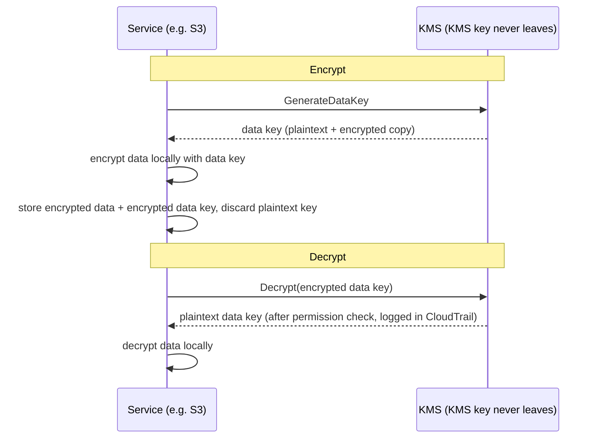

# Chapter 16: Keys, Locks, and Secrets

The git repository had thousands of commits going back two years. Leo had been scrolling for twenty minutes, following a thread through the history — looking for when a certain database connection string had first appeared. He almost missed it. It was on a Tuesday afternoon, sandwiched between two unremarkable commits, pushed by someone who'd since left the company.

A database password. In plain text. In the history.

---

*The network controls from last chapter were tight now. Security groups limited lateral movement. NACLs blocked known-bad IP ranges. The perimeter had been hardened. But the security audit had found something the perimeter couldn't fix: a credential that had been living in the git history for six months. Perimeter security assumes the secrets inside are secure. This one wasn't.*

---

Leo was reviewing the git history when he found it. A database password. Committed six months ago, in plain text, by someone who no longer worked at Nimbus — part of a `.env` file that also contained the deployment pipeline's IAM access key, two lines below the connection string. The commit was public. The password had since been changed — but they didn't know that for certain. They checked every system either credential had ever touched. It took four hours. That was the day Nimbus decided to stop putting secrets in code.

"Have we thought about what happens if someone forks the repo?" Priya said. "Git history is permanent. Even if we change the password, anyone who cloned the repo before the fix still has the old credential in their local history."

"We checked," Leo said. "The password was changed three months ago. All systems confirmed."

"That's the minimum," Priya said. "But every system that credential touched needs to be reviewed. Not just the ones you know about."

**The Four-Hour Audit**

Leo had found the leaked `.env` file in the git history at 10 AM. By 2 PM, they had an answer to the question that mattered: had either credential — the database password or the access key committed alongside it — been used by anyone other than Nimbus systems?

The audit ran through four categories.

**RDS access logs**: Every connection to the database, timestamped and logged. The leaked password appeared in three connection strings — all from EC2 instances in the Nimbus VPC, all with expected source IPs. No external connections. The password had not been used to connect to the database from outside.

**S3 access logs**: The leaked access key belonged to the deployment pipeline's IAM user, which had permissions for the `nimbus-receipts` bucket. Leo queried the S3 server access logs for the past six months. Every access came from `us-west-2` EC2 instances or from the CloudFront origin fetch role. No anomalies.

**CloudTrail API calls**: Every AWS API call made with the leaked access key ID. Leo filtered CloudTrail events for the key. Three hundred and twelve events — all routine `s3:PutObject` calls from the deployment pipeline, all from the same IP, all within business hours. The key had only ever been used from one IP address, which matched the CI/CD server.

"And the CI/CD server," Priya said, "is inside the VPC. It would have had to exfiltrate data via HTTPS to an external endpoint, and we would have seen that in the flow logs."

"We checked," Leo said. "No outbound HTTPS from that server to non-AWS IPs in the past six months."

**Verdict**: Neither credential had been used by anyone outside the Nimbus team. The exposure was a risk, not a breach.

"But we can't be certain," Priya said. "We can be reasonably confident based on the logs. We cannot be certain. That distinction matters."

"What would make us certain?"

"Nothing makes you certain after a credential exposure. You rotate the credential, audit the access, document your findings, and move forward with better controls. Certainty isn't available."

Tom had been calculating during the conversation. "Four hours of three engineers' time. Call it four thousand dollars in fully-loaded cost. Plus the credential rotation, the documentation, the incident write-up."

"And that's just the investigation," Priya said. "A breach would have been orders of magnitude more. Regulatory notifications. Customer communications. Possible fines."

"So the four thousand dollar lesson was cheap," Tom said.

"Considerably," Priya said. "Let's not repeat it."

---

**The Two Problems: Storing Secrets and Encrypting Data**

Security around sensitive information has two distinct problems:

**Storing credentials** (database passwords, API keys, connection strings): Where do these live? Who can access them? How do you rotate them without redeploying your application?

**Encrypting data** (customer information, payment records, PII): How do you ensure that even if someone gains unauthorized access to your database or S3 bucket, they cannot read the data?

AWS has a dedicated service for each problem:

- **AWS Secrets Manager**: Stores and manages credentials securely
- **AWS KMS (Key Management Service)**: Manages encryption keys for encrypting and decrypting data

Think of Secrets Manager as a keychain: it holds your keys (credentials), keeps them organized, and rotates them on a schedule. Think of KMS as a vault: it doesn't hold what's valuable — it holds the key that opens the lock protecting what's valuable.

**AWS Secrets Manager: No More Hardcoded Credentials**

Secrets Manager is a secure store for secrets: database credentials, API keys, OAuth tokens, SSH keys, or anything sensitive.

Instead of your application reading a password from an environment variable or config file, it calls the Secrets Manager API at startup (or when needed) and retrieves the secret. The secret never touches disk. It never appears in your code. It's not in your environment variables.

Here's what the flow looks like:

**Old way**:
```
DB_PASSWORD=supersecretpassword123  # in .env file or environment variable
```

**Secrets Manager way**:
```python
import boto3
client = boto3.client('secretsmanager')
secret = client.get_secret_value(SecretId='nimbus/production/db-password')
password = json.loads(secret['SecretString'])['password']
```

The EC2 instance needs an IAM role with permission to call `secretsmanager:GetSecretValue` for that specific secret. No other service can read it. The secret is never in the code.

You might be wondering: why not just use environment variables? They're simpler — set them at deploy time, and the application reads them. Environment variables seem hidden, but they're stored in your deployment configuration, CI/CD secrets store, possibly logged during debug sessions, and visible to anyone with access to the running process. More importantly, they're static: once set, they don't change until someone manually updates them. Secrets Manager stores credentials in an encrypted service with IAM access controls, full audit logging via CloudTrail, and automatic rotation. Environment variables don't rotate. A leaked environment variable stays valid until someone manually changes it.

**Automatic Rotation: The Real Power**

The greatest feature of Secrets Manager isn't storing secrets — it's rotating them automatically.

Here's the scenario: every 30 days, Secrets Manager generates a new database password, updates it in RDS, updates the stored secret, and your application retrieves the new password the next time it needs it. No manual intervention. No deployment. No "I need to remember to rotate this."

The rotation is implemented as a Lambda function. AWS provides templates for RDS databases (MySQL, PostgreSQL, Aurora). You can customize the function for any credential type.

"How much does that cost per month?" Tom asked.

Secrets Manager charges per secret per month plus per API call. For a small number of database passwords and API keys, the cost is dollars per month — negligible compared to the cost of an incident.

"The compromise last week," Priya said, "what would it have cost to investigate and remediate?"

Tom was quiet for a moment. "Including my time, your time, Leo's weekend... couple thousand dollars."

"Secrets Manager wouldn't have detected the exposure — that isn't what it does. But the key would never have been sitting in a file to leak, and rotation would have retired it anyway."

Tom pulled up the pricing page.

**What Happens During Rotation**

"Wait — but *why* would we do it that way?" Maya asked. "If the database password rotates, does the application break? How does it pick up the new password without a deployment?"

This was a legitimate concern. Rotation without disruption requires care.

Secrets Manager rotation works in stages — designed to prevent the "old password suddenly invalid, application crashes" scenario:

**Stage 1: Create new secret version.** Secrets Manager generates a new password and stores it as a pending version of the secret. The current version is still active.

**Stage 2: Set on service.** The rotation Lambda calls the database to update the password to the new value. Be aware: with the default **single-user** rotation strategy there is a brief moment when the old password has just stopped working (PostgreSQL's `ALTER ROLE ... PASSWORD` takes effect immediately) and the new version isn't current yet. For zero-downtime rotation, Secrets Manager supports an **alternating-users** strategy: two database users with identical permissions, where rotation always updates the *inactive* one and then switches — the active credentials are never invalidated mid-flight. The exam phrase to remember is "alternating users rotation strategy."

**Stage 3: Test new secret.** The rotation Lambda verifies that the new password works by connecting with it. If this fails, rotation is rolled back.

**Stage 4: Finish.** Secrets Manager marks the new version as the current version and demotes the old version to a previous version. The previous version is kept for a grace period.

During the grace period, both versions are retrievable. If your application cached the old secret and hasn't picked up the new one yet, it can still connect. The next time it calls `GetSecretValue`, it gets the current (new) version.

"So the application never needs to be restarted," Leo said.

"Not necessarily. If your application caches the secret at startup and never refreshes it, you need to either refresh it on a schedule or handle authentication failures by re-fetching the secret."

"So the rotation Lambda and the application need to cooperate," Maya said.

"Secrets Manager does its half. Your application code needs to do the other half: fetch the secret when needed, handle authentication failures by re-fetching."

Leo updated the application to catch database authentication exceptions and, on failure, fetch a fresh secret from Secrets Manager before retrying. Two lines of error handling. Rotation became invisible to users.

---

**CI/CD Pipeline Secrets Injection**

"Have we thought about how the deployment pipeline gets the secrets it needs?" Priya asked. "The pipeline deploys infrastructure. It needs AWS credentials. It might need database connection strings for migration scripts."

Leo explained the current setup: secrets were stored as GitHub Actions Secrets — encrypted at rest in GitHub, injected as environment variables at runtime.

"The credentials are in GitHub," Priya said.

"Encrypted."

"In a third-party system. One GitHub breach exposes all our pipeline secrets."

The solution: the deployment pipeline authenticates to AWS via OIDC federation (covered in Chapter 14) and retrieves any secrets it needs from Secrets Manager at runtime. No secrets stored in GitHub. The pipeline's AWS role has permission to read specific secrets, nothing else.

```yaml
# GitHub Actions workflow
- name: Get DB Migration Credentials
  env:
    AWS_DEFAULT_REGION: us-west-2
  run: |
    SECRET=$(aws secretsmanager get-secret-value \
      --secret-id nimbus/staging/db-migration \
      --query SecretString --output text)
    DB_URL=$(echo $SECRET | jq -r '.url')
    # Run migration with DB_URL — never stored in a file
    flyway -url="$DB_URL" migrate
```

The secret is fetched, used in memory, and discarded. It is never written to disk, never stored in environment variables that persist after the job, never in a log file.

"What if the secret is printed to the log?" Leo asked.

"GitHub Actions automatically masks values of secrets that are configured as GitHub Secrets. But this secret is not a GitHub Secret — it comes from Secrets Manager. You need to mask it manually, or better, never log it."

"So the discipline is: fetch, use, discard. Never log secrets. Never store them in files."

"That discipline," Priya said, "is what the four-hour audit confirmed we'd been failing on."


**AWS KMS: The Lock Factory**

"Wait — but *why* would we do it that way?" Maya asked. "Why a separate key management service? Can't we just encrypt the data ourselves and store the key in Secrets Manager?"

You could store encryption keys in Secrets Manager. But then who controls access to the key? What ensures the key is rotated? What proves to an auditor that the key was only used by authorized services? KMS answers all of these questions. It's not just storage — it's a key lifecycle management service with hardware-backed security, fine-grained IAM policies per key, and a complete audit trail of every use. Secrets Manager stores what you need to connect to systems. KMS protects the systems themselves.

AWS KMS (Key Management Service) manages **cryptographic keys** — the secret values used to encrypt and decrypt data.

The analogy: KMS is like a lockbox company that holds the master key. Your data (the contents of the box) is encrypted. Only someone with permission to use the KMS key can decrypt it. KMS logs every use of every key in CloudTrail.

**Customer Master Keys (CMKs)** — now called KMS keys — come in three types of ownership:

**AWS owned keys**: Keys that AWS owns and uses across many customer accounts — you never see them, never pay for them, and they don't appear in your account. Several service defaults use them (DynamoDB's default encryption, for example).

(One distinction worth keeping straight: S3's default **SSE-S3** encryption is *not* a KMS key model at all — S3 manages its own AES-256 keys entirely outside KMS, with no key to see and no key-usage audit trail. **SSE-KMS** is the S3 option that goes through KMS, using either the AWS managed key `aws/s3` or a customer-managed key. Exam trigger: "audit who used the encryption key" or "control rotation and key policy" → SSE-KMS with a customer-managed key — every use lands in CloudTrail.)

**AWS managed keys**: AWS creates and manages the key automatically *in your account* for services like S3, EBS, RDS (named like `aws/s3`). You can see it and audit its use in CloudTrail, but you can't change its policy or rotation — AWS rotates it automatically every year. Free.

**Customer managed keys**: You create the key in KMS and control every aspect of it: who can use it, when it rotates, who can administer it. You can enable automatic key rotation with a configurable period between 90 days and 2,560 days (7 years); the default rotation period is 365 days (annual). You can also trigger an **on-demand rotation** immediately — useful after a suspected exposure, without waiting for the schedule. Note: automatic rotation applies to symmetric keys with KMS-generated material — asymmetric keys and imported key material cannot auto-rotate. Cost: $1/month per key plus per-API-call charges.

If you choose customer-managed KMS keys, then you get full control over rotation schedules, access policies, and audit visibility, but you pay per key per month and take on the responsibility of key management; if you choose AWS-managed keys, then you get encryption with zero operational overhead and no cost for the key itself, but you cannot customize rotation schedules or key policies — they're managed entirely by AWS.

**Encryption in AWS Services: KMS Integration**

Most AWS services integrate with KMS for encryption:

**S3**: Enable "server-side encryption with KMS" on a bucket. Every object is encrypted at rest with a KMS key. Reading an object requires permission to both the S3 bucket *and* the KMS key.

**RDS**: Enable encryption at creation time. The database storage, backups, and snapshots are all encrypted with a KMS key. Note: encryption cannot be enabled on an existing unencrypted RDS instance — you must snapshot, copy the snapshot with encryption enabled, and restore.

**EBS**: Encrypt volumes with KMS. New volumes created from encrypted snapshots are automatically encrypted.

**DynamoDB**: Encryption at rest using KMS is enabled by default on all tables.

**ElastiCache Redis**: Encryption at rest with KMS for sensitive cached data.

The principle: data should be encrypted at rest (stored on disk) and in transit (moving across a network). KMS handles at-rest encryption. TLS/SSL (provided automatically by AWS services) handles in-transit encryption.

**Envelope Encryption: How KMS Actually Works**

Here's a detail that helps you understand KMS behavior and exam questions.

KMS does not encrypt your data directly in most cases. It uses **envelope encryption**:

1. KMS generates a **data key** (a unique symmetric key)
2. The service uses the data key to encrypt your data locally (fast — symmetric encryption)
3. The service asks KMS to encrypt the data key itself (using your KMS key)
4. Both the encrypted data and the encrypted data key are stored
5. Your actual data never leaves the service — only the data key goes to KMS for encryption/decryption

When you read the data:

1. The service asks KMS to decrypt the data key
2. KMS checks permissions, decrypts the data key, returns it
3. The service uses the decrypted data key to decrypt your data locally



This means KMS can handle very large data without sending it all through the KMS API. Only small keys go to KMS. CloudTrail logs every KMS API call — every encrypt and decrypt operation.

**KMS Key Policies: The Access Model**

"Have we thought about what happens if an IAM policy and a key policy conflict?" Priya asked. "KMS has its own access control on top of IAM."

KMS keys have **key policies** — resource-based policies attached to the key itself. They are distinct from IAM policies and follow different evaluation rules.

For a principal to use a KMS key, two things must be true:

**First**: The key policy must allow it. If the key policy doesn't explicitly grant the principal access, they cannot use the key — regardless of what their IAM policy says. This is different from most AWS resources, where IAM policies alone are sufficient.

**Second**: The principal's IAM policy must allow the KMS action (e.g., `kms:Decrypt`, `kms:GenerateDataKey`).

Both must say yes. Either one saying no means the action is denied.

The default key policy that AWS creates for customer-managed keys includes a statement that says "the root account can manage this key." This is important: it means an account-level IAM administrator can always grant access to a key, even if the key policy doesn't name them directly — because the root account delegation is in place.

"So if we remove the root account from the key policy," Leo asked, "IAM policies stop working for that key?"

"Correct. Removing the root account delegation is a way to lock down a key so tightly that only the specific principals named in the key policy can use it — not even account administrators. It is also a way to accidentally lock yourself out of your own key."

"Can we recover?"

"Only by contacting AWS Support. If no one can use the key and the key policy cannot be updated, the data encrypted with that key is effectively inaccessible."

"So do not remove the root account from the key policy without an extremely good reason."

"Correct."

---

**Asymmetric Keys: Signing and Verification**

KMS also supports asymmetric key pairs — a public key and a private key.

The use cases:

**Digital signing**: You sign a document or a JWT token with the private key. Anyone with the public key can verify that the signature came from the holder of the private key, and that the content hasn't been tampered with.

**Public key encryption**: Anyone can encrypt data with the public key. Only the holder of the private key can decrypt it.

For Nimbus, asymmetric keys became relevant when they implemented a webhook signature system for restaurant partners. When Nimbus sent an event to a restaurant partner's server (a new order, a status update), the partner needed to verify the event had actually come from Nimbus and hadn't been forged.

The implementation:

1. Nimbus creates an asymmetric KMS key (RSA 2048-bit, SIGN_VERIFY algorithm)
2. When sending a webhook, Nimbus calls `kms:Sign` with the private key to sign the event payload
3. The signature is included in the webhook header
4. Nimbus publishes the public key (downloadable from the KMS console)
5. The restaurant partner's server fetches the public key and uses it to verify the signature on every incoming webhook

The private key never leaves KMS. Nimbus never has access to the raw private key material. KMS performs the signing operation inside its hardware security module.

"So even if someone compromised a Nimbus server," Rafael said, "they could not forge a webhook signature. The private key is in KMS, not on any server."

"Correct. Signing requires a KMS API call. Every API call is logged in CloudTrail. If someone tried to sign a fraudulent event, we would see the API call."

---

**The Key Deletion Story**

Three months after the KMS setup, Tom made a mistake.

He was cleaning up unused AWS resources — old Lambda functions, stale S3 buckets, abandoned CloudWatch dashboards. He was moving quickly. He accidentally scheduled a KMS key for deletion.

The key was `nimbus/prod/order-receipts` — the customer-managed key used to encrypt the order receipts S3 bucket.

"I batch-deleted twelve resources yesterday and didn't check what the twelfth one was," Tom said flatly. He had scheduled the deletion and moved on. He noticed the mistake the next morning when he reviewed his actions.

He pulled up the KMS console. The key status read: "Pending deletion. Deletion in 7 days."

He had scheduled it for the minimum waiting period.

"Can we cancel it?" he asked.

Priya pulled up the documentation. "Yes. During the waiting period, the key is disabled but not deleted. You can cancel the deletion."

Tom cancelled the deletion within the minute. The key was restored to active status.

"Seven days is the minimum waiting period," Priya said. "AWS enforces it because if a key is deleted and data was encrypted with it, that data is gone forever. Unrecoverable. The waiting period gives you time to realize the mistake."

"How long should the waiting period be?"

"The maximum is thirty days. For any key that encrypts production data, use thirty days. The extra three weeks of protection against accidents is worth the minor inconvenience."

Tom updated all production key deletion settings to thirty days. He also set up a CloudWatch alarm that fired if any KMS key status changed to "Pending deletion" — so the next time someone (including him) made the same mistake, the team would know within five minutes.

---

**Secrets Manager vs Parameter Store**

AWS also has **Systems Manager Parameter Store**, which stores configuration values (not just secrets). Parameter Store is cheaper — free for standard parameters. It can also store encrypted parameters using KMS.

For secrets that need rotation: Secrets Manager.

For configuration values and non-sensitive parameters: Parameter Store (free tier is very generous).

For application configuration (port numbers, feature flags, environment-specific settings): Parameter Store.

| | Secrets Manager | SSM Parameter Store |
|---|---|---|
| Automatic rotation | Yes (Lambda-backed) | No |
| Cost | ~$0.40/secret/month | Free (standard) |
| Encryption | Always | Optional (with KMS) |
| Versioning | Yes | Yes |
| Cross-account access | Yes | Limited |
| Best for | Database passwords, API keys | Config values, feature flags |

## The Certificate on the Door

Two weeks after the secrets migration, Priya was reviewing the Nimbus staging environment on her phone when she noticed the address bar.

"Not Secure."

She pulled up the production URL. Same thing.

"Leo," she said, setting her phone on the table. "Are we running on HTTP?"

Leo checked. "The ALB listener is on port 80. We never set up HTTPS."

"So every request our users make — every order, every login — is going over unencrypted HTTP?"

"We have TLS on the RDS connection," Leo offered.

"That's data in transit between the application and the database. I'm talking about data in transit between the user's browser and our load balancer. That's not encrypted at all."

Tom had been listening. "Is that a security problem or a perception problem?"

"Both," Priya said. "Unencrypted HTTP means any network between the user and our server — a coffee shop router, an ISP — can read the traffic. Passwords, order details, session tokens. And modern browsers warn users with 'Not Secure.' That kills conversion rates."

"So we need a TLS certificate," Maya said. "How much does that cost?"

"Nothing," Priya said. "AWS Certificate Manager."

**AWS Certificate Manager (ACM)** provisions free TLS/SSL certificates for use with AWS-managed services: ALBs, CloudFront distributions, and API Gateway. You don't buy a certificate, manage a renewal calendar, or touch private key material. ACM handles the entire certificate lifecycle.

A certificate issued by ACM is valid for 13 months. Before it expires, ACM renews it automatically. If renewal succeeds, the new certificate is attached to your load balancer or distribution without any action on your part. The browser's padlock stays green. The expiry alert you forgot to set never fires.

**Two types of ACM certificates**:

**Public certificates** are issued by Amazon's certificate authority and trusted by all major browsers. They are completely free for use with ALB, CloudFront, and API Gateway. You validate ownership of the domain either via DNS or email.

**Private certificates** are issued by AWS Private CA — a managed private certificate authority you run for internal services (service-to-service mTLS, internal tooling, VPN clients). Private CA has a monthly cost.

For Nimbus, public certificates were the right choice.

**DNS validation vs. email validation**:

Leo pulled up the ACM console and started a certificate request for `eatnimbus.com` and `*.eatnimbus.com`.

"It's asking how I want to validate ownership," he said. "DNS or email."

"DNS," Priya said. "Always DNS."

With DNS validation, ACM adds a specific CNAME record to your hosted zone. Route 53 can do this automatically — one click in the console. As long as that CNAME record exists, ACM can auto-renew the certificate without any human action. Email validation sends an email to the domain's registered contact and requires a manual click every time the certificate renews. That click gets forgotten. DNS validation doesn't require anyone to remember anything.

"So I add the CNAME record once," Leo said, "and it renews forever?"

"Until someone deletes the CNAME record," Priya said. "Don't delete the CNAME record."

Leo requested the certificate, added the validation CNAME in Route 53 (which ACM offered to do automatically), and waited five minutes. The certificate status changed to Issued. He attached it to the ALB's HTTPS listener on port 443 and added a redirect rule on port 80 to send all HTTP traffic to HTTPS.

Tom refreshed the production URL.

The padlock appeared.

One regional detail worth a flag: a certificate is a regional resource, and it must live in the same region as the service that uses it. For an ALB, that's the ALB's region. For **CloudFront**, the certificate must be requested (or imported) in **`us-east-1`** — always, regardless of where your origins run — because CloudFront is a global service anchored there. Leo had already tripped over this in Chapter 13; it's also a reliable exam fact.

**The one thing ACM certificates cannot do**:

"Can I download the certificate?" Leo asked. "I want to install it on the internal admin EC2 instance."

"No," Priya said.

Free ACM public certificates cannot be exported. You cannot download the private key and install it on an EC2 instance, a Nginx server, or anything outside AWS-managed services. The private key material never leaves ACM. This is intentional — it prevents the private key from being leaked, stored insecurely, or forgotten about when the certificate expires.

For use cases that require an installable certificate — an EC2 instance acting as a custom proxy, an on-premises server — there are three routes: a certificate from a third-party authority (Let's Encrypt, for example), AWS Private CA with certificate export enabled, or — since June 2025 — ACM's paid **exportable public certificates** (opt-in at issuance, charged per FQDN or wildcard), whose private key *can* be exported for use anywhere.

"For our ALB and our CloudFront distribution," Priya said, "ACM is exactly right. Free, automatic, and we never touch a key."

## Strengths and Limitations

**AWS Secrets Manager**:

- Automatic secret rotation without code changes or deployments
- Fine-grained IAM access control per secret (each secret is a separate IAM resource)
- Versioning — the previous version remains accessible during rotation, preventing connection drops
- Audit via CloudTrail — every `GetSecretValue` call is logged with the caller's identity
- Cross-account access — one account's secrets can be shared with another account's role
- Cost: ~$0.40/secret/month + API calls (roughly $0.05 per 10,000 API calls)

**AWS KMS**:

- Centralized key management with full audit trail — every encrypt and decrypt logged
- Configurable automatic key rotation for customer-managed keys (90 days to 2,560 days; default 365 days) — old key material still decrypts existing data, new key material encrypts new data
- Fine-grained IAM permissions per key (key policies + IAM policies — both must allow)
- Hardware Security Module (HSM) backed — keys never leave the HSM in plaintext
- Multi-Region key support for disaster recovery scenarios
- Asymmetric key support for digital signing and verification
- Cost: $1/month per key + $0.03 per 10,000 API calls

**Where it gets complicated**:

- KMS key policies are separate from (and evaluated alongside) IAM policies — debugging access denied errors requires checking both
- Encryption at rest must be planned upfront — you cannot encrypt an existing unencrypted RDS instance in place
- Key deletion in KMS has a 7-30 day waiting period — a safety mechanism, but easy to forget during setup and dangerous to accidentally trigger
- Rotation requires application code to handle re-fetching secrets on authentication failure — Secrets Manager rotates the credential, but the application must pick it up
- Secrets Manager costs scale with the number of secrets and API call volume at large scale
- The default key policy (including root account delegation) is critical to preserve — removing it can lock administrators out of the key

## Summary

The four hours spent tracing a compromised credential through every system it touched was four hours that Secrets Manager could have prevented. Automatic rotation means a stolen credential has a short lifespan. KMS means that even if someone gets to the data, they can't read it without a key they're not authorized to use. And a thirty-day key deletion waiting period means an accidental deletion can be cancelled before it becomes a data loss event.

- Never store credentials in code, environment variables, or config files committed to version control.
- **Secrets Manager** stores credentials securely and rotates them automatically. Applications fetch secrets via API at runtime.
- **Rotation** happens in stages: create new version, update on service, test, promote. Both old and new versions are briefly valid, preventing connection drops during rotation.
- **KMS** manages encryption keys. Most AWS services integrate with KMS for encryption at rest.
- **Envelope encryption**: KMS encrypts the key, not the data directly. The service encrypts data using a local data key, which KMS encrypts. Only small keys traverse the KMS API.
- **Customer-managed KMS keys**: full control over rotation (configurable 90–2,560 days, default 365 days annual), access, and audit ($1/month). **AWS-managed keys**: automatic, no configuration needed, free.
- **KMS key policies**: The key policy is a resource-based policy that works alongside IAM. Both must say yes. The root account delegation in the default key policy ensures IAM administrators can always grant access.
- **Asymmetric keys**: KMS supports RSA and ECC key pairs for signing and verification. The private key never leaves the HSM.
- **Key deletion**: Minimum 7-day, maximum 30-day waiting period. Deleted keys mean permanently inaccessible encrypted data. Use 30 days for production keys, and monitor for pending deletion status.
- **CI/CD secrets**: Fetch from Secrets Manager at runtime using OIDC federation. Never store secrets as CI/CD platform variables.

## Exam Tips

*SAA-C03 Domain: Design Secure Architectures (Domain 1, Task 1.3)*

- **Secrets Manager vs SSM Parameter Store**: Secrets Manager for credentials that need automatic rotation; Parameter Store for general configuration. Exam distinguishes them by rotation requirement and cost sensitivity.
- **KMS key policies**: A KMS key has its own key policy (a resource-based policy). IAM policies alone don't grant access to a KMS key — the key policy must explicitly allow it. Both the key policy and the IAM policy must allow the action.
- **Encrypting RDS**: Cannot enable encryption on an existing unencrypted RDS instance. The process: create a snapshot → copy snapshot with encryption enabled → restore from encrypted snapshot → migrate traffic to new instance.
- **EBS encryption**: New volumes can be encrypted. Snapshots of encrypted volumes are always encrypted. Unencrypted volumes cannot be directly encrypted — snapshot + copy + restore.
- **CloudTrail + KMS**: Every KMS API call is logged in CloudTrail. This is a key compliance feature. When an exam asks how to audit who decrypted what data, the answer is CloudTrail + KMS.
- **Multi-Region KMS keys**: Replicate key material to multiple regions so decryption can happen without cross-region API calls. Exam uses this for multi-region disaster recovery with encrypted data.
- **KMS vs CloudHSM**: KMS is multi-tenant (managed by AWS). CloudHSM is a dedicated hardware security module that only you control. Exam signals: "FIPS 140-2 Level 3," "dedicated HSM," "customer-managed cryptographic operations" → CloudHSM.
- **Envelope encryption**: KMS generates a data key, the service uses it to encrypt data locally, KMS encrypts the data key. Exam question: "why doesn't KMS encrypt large amounts of data directly?" → performance; envelope encryption keeps large data local.
- **Asymmetric KMS keys**: Used for digital signing, JWT verification, or public key encryption. The private key never leaves KMS. `kms:Sign` is the API call to sign; `kms:Verify` to verify.
- **Key deletion waiting period**: 7-30 days. During this period, the key is disabled and not usable, but the deletion can be cancelled. After deletion, any data encrypted with that key is permanently unrecoverable.
- **ACM (AWS Certificate Manager):** Free public TLS certificates for use with ALB, CloudFront, and API Gateway. Auto-renew via DNS validation. Free public certificates cannot have their private key exported — they live inside AWS only (a paid *exportable public certificate* option exists since 2025 for EC2/on-premises use). Exam trigger: "HTTPS on load balancer or CDN" → ACM.

## Exercises

**Exercise 1 — Recall**

Explain the concept of envelope encryption. Why does KMS encrypt a small data key rather than encrypting your application data directly?

*(Hint: Think about what happens if you have 1GB of data to encrypt, and what the performance implications of sending 1GB to a remote KMS service would be.)*

**Exercise 2 — SAA-C03 Scenario**

*Scenario*: A financial services company stores sensitive customer data in an RDS MySQL database. A new compliance requirement mandates that:

1. All data must be encrypted at rest
2. All encryption key usage must be auditable
3. The encryption keys must be customer-controlled (not managed by AWS)
4. The database password must be rotated automatically every 90 days

The database was created six months ago without encryption enabled. Which set of actions BEST meets all four requirements?

A) Enable RDS encryption on the existing database; create a customer-managed KMS key; configure Secrets Manager with 90-day rotation  
B) Create a snapshot of the existing database; copy the snapshot with encryption using a customer-managed KMS key; restore from the encrypted snapshot; configure Secrets Manager with 90-day rotation  
C) Create a new encrypted RDS instance with an AWS-managed key; migrate data from the old instance; configure Secrets Manager with 90-day rotation  
D) Enable RDS at-rest encryption on the existing database using an AWS-managed key; configure Secrets Manager with 90-day rotation

**Hint 1**: You cannot enable encryption on an existing unencrypted RDS instance directly.

**Hint 2**: "Customer-controlled" keys means customer-managed KMS keys, not AWS-managed keys.

**Hint 3**: The snapshot copy process is the standard migration path to encrypted RDS.

**Answer**: B

**Explanation**: RDS encryption cannot be enabled on an existing instance. The standard approach is: snapshot the existing instance → copy the snapshot with encryption enabled using a customer-managed KMS key (satisfies requirements 1, 2, and 3) → restore from the encrypted snapshot. Customer-managed KMS keys automatically log all usage in CloudTrail (auditing) and keep encryption keys under your control. Secrets Manager handles automatic 90-day password rotation (satisfies requirement 4).

**Why not A?** You cannot enable encryption on an existing unencrypted RDS instance in place.

**Why not C?** AWS-managed keys don't satisfy the "customer-controlled" requirement (requirement 3).

**Why not D?** Same issue as A (can't enable in place) plus AWS-managed key doesn't satisfy requirement 3.

*SAA-C03 Domain: Design Secure Architectures — Task 1.3*

**Exercise 3 — Architecture Challenge** *(Optional)*

Nimbus needs to store the following sensitive data:

- Database password for the production RDS instance
- Stripe API secret key (used for payment processing)
- A symmetric encryption key for encrypting customer order history in DynamoDB
- Per-restaurant configuration values (API endpoints, feature flags — not sensitive)

Which AWS service or approach would you use for each? What rotation strategy would you apply to each?

*(There is no single correct answer. The goal is to practice matching security tools to use cases.)*

## Post-Credits Scene

"I already deployed it — oh." Leo had migrated the production secrets to Secrets Manager while the development environment was still using the old environment variables. The dev environment broke. He'd had to roll back the dev config manually.

"Stage first," Priya said. "Then production."

"I know," Leo said.

The secrets were migrated.

Database passwords: Secrets Manager, rotating every 30 days.

API keys: Secrets Manager, with a rotation Lambda that called the payment provider's API to generate a new key.

Customer order data: encrypted with a customer-managed KMS key.

Old credentials: deactivated. Old config files: deleted. Old GitHub Actions secrets: removed.

"We're now audit-ready," Priya said.

"Define audit-ready," Maya said.

"If a compliance auditor asked us to prove no credentials are hardcoded in our code or exposed in our infrastructure, we could show them: every secret is in Secrets Manager, every encryption key is in KMS, every access is logged in CloudTrail."

"When's the last time someone checked the CloudTrail logs?"

A pause.

"I check them every week," Priya said.

"And if something unusual appeared, how would we know?"

"That," said Priya, closing her laptop, "is the next conversation."

In the next chapter: the three layers of defense that stand between Nimbus and the internet.
