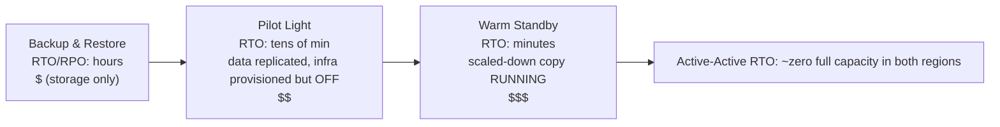

# Chapter 18: When Things Break

The lights went out at 11:17 PM.

Not in the Nimbus office — Leo was home, on the couch, laptop half-closed. The lights went out in a data center in Oregon that he'd never visited, in a building he'd never seen, in a room full of servers he'd never touched. He didn't know yet. There was a moment — just a moment — of complete silence before the backup generators kicked in somewhere far away. The kind of dark where you can't tell if your eyes are open or closed.

Then the Slack notification arrived.

---

After the monitoring systems from chapter 17 were in place, the team had felt something like confidence. Alerts were firing. Dashboards were green. Logs were flowing into CloudWatch. They'd spent three weeks wiring visibility into every corner of the Nimbus infrastructure.

What nobody had said aloud — what the monitoring didn't protect against — was that visibility and resilience are different things. You can watch something fail in perfect detail. Watching it doesn't stop it.

That lesson arrived at 11:23 PM on a Thursday.

---

Leo got the Slack notification.

"us-west-2 — data center cluster failure — degraded service."

He opened the AWS console. The EC2 instances in one of the Availability Zones were showing status checks failing. His Auto Scaling Group had detected unhealthy instances and was spinning up replacements — in the same zone.

In the cluster that was failing.

The new instances couldn't start either. They were in the same hardware failure zone.

"The load balancer is routing traffic to both AZs," Leo said to no one. "Half our traffic is going to instances that don't work."

He opened the EC2 console and started clicking. Under Load Balancers, the Application Load Balancer showed both target groups as healthy — because the health check passed on port 80, and even the failing instances were responding to that check. They just couldn't process real requests.

He tried to remove the failing AZ from the target group. The console accepted the change. But the Auto Scaling Group, configured to maintain balance, immediately started trying to replace the terminated instances — in the same failing zone.

Leo stared at the screen. He'd just made it worse.

He pulled up the ASG configuration. The "Balance capacity across Availability Zones" setting was active. In normal operation this was good design. Right now it was actively fighting him.

He changed the ASG to use only the healthy zone. Applied the change.

The console showed the change as "In Service."

Three minutes later, the first healthy replacement instances came up.

The load balancer started routing traffic. Error rate dropped from 52% to 4%. The remaining 4% was requests that had landed on the last few unhealthy instances still draining connections.

By 11:45 PM — twenty-two minutes after the failure started — traffic was stable.

Twenty-two minutes of degraded service before he noticed and manually shifted the ASG to only use the healthy zone.

"This happened because everything was in one AZ," said Priya the next morning.

"No," Leo said. "I had instances in two AZs. The problem was the replacement instances were spawning in the failing AZ."

"And the database?"

Leo stopped.

"The RDS primary was in the failing zone," he said. "Multi-AZ actually did its job — it failed over to the standby in the healthy zone in about ninety seconds. But our application servers kept their dead connections open and retried the cached IP address instead of re-resolving the endpoint's DNS name. The database was healthy by 11:25. Our app didn't reconnect cleanly until I restarted the connection pools."

Twenty-two minutes of degraded service had become thirty-eight.

When Leo had set up the Auto Scaling Group eight months ago, he'd checked the "balance capacity across AZs" setting and figured that was good enough. "It'll be fine," he'd told Maya at the time. "AWS handles the AZ stuff automatically." He'd been right that AWS handles it — and wrong about what "automatically" meant.

"What would have happened," Maya asked the next morning, "if we'd configured everything properly? What's the correct Multi-AZ setup look like in a real failure?"

Leo thought about it. He'd been thinking about it since 11:45 PM.

In the hypothetical correct setup: the ASG would have had instance health checks that looked at ALB health — not just EC2 status. When the AZ failed, the health check on those instances would have failed within 30 seconds. The ASG would have detected the failures and immediately started launching replacements — and when launches persistently fail in one AZ, the group shifts capacity into the remaining healthy zones rather than fighting the failing one.

The load balancer would have taken the failing AZ targets out of rotation within the same 30 seconds. Traffic would have concentrated in the healthy AZ.

For the database: the Multi-AZ failover itself had worked — what was missing was client discipline. Connection pools that re-resolve the endpoint's DNS name on reconnect (instead of caching the IP), short DNS cache TTLs, and retry logic. With those in place, an RDS failover is a 60–120 second blip, not a 16-minute tail.

Total customer-visible impact: 60-90 seconds of degraded latency while the database failed over. Not 38 minutes of cascading errors.

"We had all the infrastructure to survive this," Leo said. "We just configured it incorrectly."

That sentence was harder to say than the original incident had been.

**The Electricity Grid Analogy**

Think about how your home gets electricity. The power doesn't come from a single wire running from one generator. It comes from a grid — a network of generators, substations, and transmission lines that back each other up. If one substation catches fire, the others reroute power around it. You don't notice. The lights stay on.

AWS Availability Zones work the same way. Instead of one giant data center that everything depends on, AWS spreads your resources across multiple physically separate facilities. If one facility loses power or has a hardware failure, the others keep running. Traffic reroutes automatically. Your application stays up — because there was never a single wire to cut.

This is **Multi-AZ architecture**: spreading your resources across physically separate facilities so that one failure never takes down everything.

Multi-Region is the next level: imagine having backup generators in a completely different city. If the entire local power grid goes down, the remote city takes over. More complex to set up, but more resilient to catastrophic failures.

You might be wondering: if Multi-AZ just means spreading resources across two data centers, why doesn't AWS make that the default for everything? The answer is cost. Multi-AZ roughly doubles the infrastructure — and for a development environment or a low-traffic internal tool, that extra cost isn't justified. For production workloads, though, the question flips: can you afford the downtime if you don't have it?

**The Vocabulary of Failure**

Before designing for resilience, you need words for what you're designing against.

"How do we even measure whether we're resilient enough?" Priya asked.

"Two numbers," Leo said. "How long can we be down, and how much data can we lose."

**Availability**: The percentage of time a system is operational. "Four nines" (99.99%) means less than 52 minutes of downtime per year. "Five nines" (99.999%) means about 5 minutes per year.

**RTO (Recovery Time Objective)**: How long can the system be down before it becomes a business problem? If your RTO is 4 hours, you have 4 hours to restore service before SLAs are violated.

**RPO (Recovery Point Objective)**: How much data can you afford to lose? If your RPO is 1 hour, you can tolerate losing up to one hour of data in a catastrophic failure. Everything written in the last hour before the failure is gone.

**Fault tolerance**: The ability to continue operating (at some level) when a component fails.

**Disaster recovery (DR)**: The process of recovering from a catastrophic failure — data center fire, region-wide outage, accidental mass deletion.

These five concepts drive every architectural decision in this chapter.

**RTO and RPO Are Business Decisions, Not Technical Ones**

The numbers matter less than who sets them. An engineer can guess at RTO. A business stakeholder knows what a 30-minute outage actually costs.

Consider two companies with the same technology stack:

A fintech company processing brokerage trades: RTO of 4 minutes, RPO of zero. A trading system down for four minutes during market hours might miss thousands of transactions. Each missed transaction has a direct dollar value. Zero data loss isn't philosophical — losing a single confirmed trade means compliance problems and customer lawsuits. The architecture cost to achieve this: active-active Multi-AZ with synchronous replication, six-figure annual infrastructure budget.

A restaurant ordering platform: RTO of 30 minutes, RPO of 5 minutes. A 30-minute outage during dinner rush is genuinely painful and costs real money. But losing the last 5 minutes of orders before a failure means a handful of customers need to reorder — annoying, not catastrophic. The architecture cost to achieve this: warm standby Multi-AZ, a fraction of the fintech budget.

"Wait — but *why* would a restaurant platform accept 5 minutes of data loss?" Maya asked when Leo explained this. "Isn't that still losing customer orders?"

"The question is whether preventing that data loss costs more than it's worth," Leo said. "Reducing RPO from 5 minutes to 0 would require synchronous replication across regions. That's a significant cost and engineering investment. For a restaurant app at our scale, the 5-minute RPO is the right trade-off."

The lesson: RTO and RPO are not technical minimums. They're business trade-offs expressed as numbers. Setting them requires both the engineering team (who knows what's achievable) and the business stakeholders (who know what's acceptable).

**Multi-AZ: Surviving Availability Zone Failures**

An Availability Zone (AZ) is a physically separate data center within a Region. AZs are designed to be independent: separate power supplies, separate cooling, separate network infrastructure. But they're close enough that network latency between them is 1-2 milliseconds.

**Multi-AZ deployments** spread your resources across two or more AZs within a Region. If one AZ fails:

- The load balancer stops routing to unhealthy instances in the failed AZ
- The Auto Scaling Group replaces instances — but in the *healthy* AZ
- RDS fails over to the standby in the healthy AZ

Leo's mistake: his Auto Scaling Group wasn't configured to limit replacement instances to healthy AZs. It was configured to maintain balance between AZs. When the zone failed, the ASG tried to balance the instance count by spinning up replacements there — in the failing zone.

The fix: configure the ASG to launch only into healthy AZs, with a minimum of two AZs always active.

The deeper lesson: testing your failure scenarios before they happen in production.

If you choose Multi-AZ, you get automatic failover and near-zero RPO — but you're paying for infrastructure that serves no traffic during normal operation. That standby RDS instance is always running, always replicating, and never answering a query until the primary fails. That's the trade-off: reliability costs money even when nothing is broken.

**Chaos Engineering: What the First Run Looked Like**

The first chaos engineering run at Nimbus was not as clean as the documentation made it sound.

Leo ran step 2 of the runbook: force an RDS Multi-AZ failover. He used the AWS CLI:

```
aws rds reboot-db-instance \
    --db-instance-identifier nimbus-prod \
    --force-failover
```

The command returned immediately. Leo started the timer.

T+0s: Failover initiated. RDS console shows the primary status as "rebooting."

T+18s: Application logs start showing database connection errors. The connection pool is trying the old primary, which is no longer primary.

T+34s: RDS console shows status as "backing-up." The new primary is being promoted. The DNS CNAME (the database endpoint) is being updated.

T+52s: Application logs start showing successful connections again. The connection pool has exhausted retries on the old primary and reconnected to the CNAME, which now points to the new primary.

T+4:17: All connections re-established. Error rate back to zero.

Total: 4 minutes and 17 seconds.

"That's 257 seconds of database unavailability," Tom said. "Our restaurant partners' tablets show a spinning indicator for 4 minutes."

"Our SLA says 5 minutes," Leo said.

"So we passed," Priya said. "Barely."

"Two observations," Tom said. "First: we passed because our RTO commitment was generous, not because our architecture is particularly fast. Second: the connection pool retry behavior is what bought us the extra 34 seconds. If the application had given up after 10 seconds, we'd have failed."

Leo updated the runbook to document the observed timings. The target for the next quarter: reduce failover detection time from 52 seconds to under 30 by tuning the connection pool parameters and the application's health check logic.

"Chaos engineering isn't a one-time test," Priya said. "It's a feedback loop. You test, you find the actual numbers, you improve, you test again."

The third time they ran the failover test, six months later, the recovery time was 1 minute and 44 seconds. Not because RDS got faster — because they'd tuned the application.

**Simulating Failures: Chaos Engineering**

"How do we know our Multi-AZ setup actually works?" Maya asked.

"We break things on purpose," Leo said.

"Wait — but *why* would we do it that way?" Maya said. "Why not just trust that the AWS documentation says it works?"

"Because the documentation describes how the service works. It doesn't describe how *your configuration* works. They're different things."

Priya leaned forward. "Have we thought about what happens when the load balancer health check and the ASG health check disagree? The load balancer might remove an instance from rotation, but the ASG thinks the instance is healthy and doesn't replace it. We'd have capacity that's invisible to the load balancer."

"That's exactly the kind of thing chaos engineering would find," Leo said.

This sounds reckless. It's actually the most responsible thing a team can do.

**Testing RTO Commitments**

Here's the uncomfortable truth about RTO: most teams set an RTO, then never test whether they can actually meet it.

An RTO of 30 minutes isn't a guarantee. It's a target. The only way to know whether you'll hit it is to simulate the failure and time the recovery.

After the 11:23 PM incident, the Nimbus team committed to testing each failure mode every quarter. Not just manually — with written acceptance criteria. Recovery from an AZ failure had to complete within 10 minutes. Recovery from an RDS failover had to complete within 5 minutes. Database restore from backup (the backup-and-restore DR test) had to complete within 2 hours.

These numbers came from conversations with restaurant partners, who said a dinner-rush outage under 10 minutes was "painful but acceptable." Over 30 minutes was a contract conversation.

"The SLA negotiation should happen before you set the RTO," Maya said. "Not after."

She wasn't wrong. They had done it backwards. They'd set the RTO internally and then realized they needed to check it against what the business actually required.

Setting RTO and RPO in the correct order: business requirement first, architecture to meet it second, test to verify third. Most teams start with the architecture and work backwards. The numbers suffer for it.

**Chaos engineering** is the practice of intentionally injecting failures into your system to verify that it handles them correctly. You deliberately terminate an EC2 instance. You manually fail over the RDS instance. You block a subnet from the load balancer.

If the system recovers automatically within your RTO, your design works.

If it doesn't, you've learned that in a controlled setting — not during a 2 AM production incident.

For Nimbus: Leo wrote a runbook (a documented procedure) for testing each failure scenario. Once a quarter, they'd intentionally fail one component and measure recovery time. If recovery took longer than the RTO, they'd fix the design.

**Multi-Region: Surviving Regional Failures**

Most AWS failures affect Availability Zones, not entire Regions. Regional failures are rare — but they happen.

In a regional failure (or for global applications that need very low latency everywhere), **Multi-Region** is the answer: deploy your application in two or more AWS Regions.

Multi-Region introduces fundamental complexity:

**Data replication**: Your databases need to be in sync across regions. Any data written in us-east-1 must eventually reach eu-west-1. "Eventually" is the problem — during the time lag, the regions have slightly different views of the world.

**Active-passive vs active-active**:

- **Active-passive**: One region serves all traffic. The other is a warm standby. On failure, DNS switches traffic to the standby. Simpler, but the standby is idle and expensive.
- **Active-active**: Both regions serve traffic simultaneously. More complex to build (requires conflict resolution for concurrent writes), but lower latency globally and no idle resources.

Active-active sounds appealing until you think carefully about writes. If a customer places an order in us-east-1 and simultaneously the restaurant updates their menu in eu-west-1, and there's a network partition between the regions, which write wins? This is the CAP theorem in practice: in a distributed system, during a network partition, you must choose between consistency (both regions agree on the same data) and availability (both regions keep accepting requests even while they disagree). Active-active doesn't eliminate this choice. It requires you to make it explicitly, in your data model.

For Nimbus: active-passive. They didn't want to reason about concurrent write conflicts in their menu and order data. A single authoritative primary region was simpler and safer at this stage.

**Failover time**: DNS changes take time to propagate (depending on TTL). During the propagation window, some users still hit the failed region. Designing for very low RTO requires pre-warming the standby and minimizing TTL ahead of planned switches.

**Route 53 DNS Failover: The Network Layer of DR**

Before getting to the full DR strategies spectrum, it's worth understanding how DNS fits into failover — because it's often the thing that actually switches traffic between regions.

**Amazon Route 53** supports health-check-based routing. You configure:

1. A health check that monitors your primary endpoint (typically an HTTP endpoint that returns 200 if healthy)
2. A primary DNS record pointing to your primary region
3. A secondary (failover) DNS record pointing to your DR region

When Route 53 detects that the primary health check is failing, it automatically switches DNS responses to the secondary record. Users resolving your domain now get the DR region's IP.

"And what if someone tries to break in during the failover window?" Priya asked. "The SSL certificate for our domain — does it work in both regions, or does HTTPS break?"

"The certificate needs to be provisioned in both regions," Leo confirmed. "If you're using ACM (AWS Certificate Manager), that means requesting a certificate in each region independently."

The mechanics of Route 53 failover:

- Health checks run from multiple AWS locations worldwide every 30 seconds
- After 3 consecutive failures (90 seconds), Route 53 marks the endpoint as unhealthy
- DNS responses immediately switch to the failover record
- But: DNS TTL still applies. If your TTL is 300 seconds, clients that already cached the primary IP continue hitting the failed region for up to 5 minutes

This is why reducing TTL is part of pre-disaster preparation. You can't change TTL during an incident (the change won't propagate in time). The TTL change must be made days or weeks before it's needed, so that resolver caches are already using the short TTL when a failure occurs.

"So reducing the DNS TTL is not a recovery action," Leo said. "It's a pre-positioning action."

"Have we done it?" Maya asked.

They had not.

After that conversation, Leo reduced the TTL for eatnimbus.com from 300 seconds to 60 seconds. The change cost nothing and improved their worst-case failover time from potentially 8 minutes to just under 3.

**Disaster Recovery Strategies: A Spectrum**

There are four common DR strategies, arranged from cheapest (and slowest to recover) to most expensive (and fastest to recover):



**Backup and Restore** (hours RPO/RTO):

- Back up everything to S3 in a different region
- On disaster: provision infrastructure from scratch, restore from backup
- Cost: very low (you're only paying for storage)
- Recovery time: hours

**Pilot Light** (minutes to 1 hour RPO/RTO):

- Replicate the data continuously and keep the core infrastructure *provisioned but switched off* in the DR region — templates, AMIs, stopped or zero-sized resources. Nothing serves traffic; only the data replication is "lit" (that's the pilot light)
- Core data is replicated (RDS read replica in DR region)
- On disaster: start/scale up the DR region's compute, promote the read replica to primary, switch DNS
- (Contrast with Warm Standby below: there, a scaled-down copy of the application is actually *running*)
- Cost: moderate (you're paying for the data replication and the provisioned-but-off resources, not for running compute)
- Recovery time: tens of minutes

**Warm Standby** (seconds to minutes RPO/RTO):

- Run a scaled-down version of the full application in the DR region
- Fully operational but at reduced capacity
- On disaster: scale up, switch DNS
- Cost: higher (always running the full stack at reduced scale)
- Recovery time: minutes

**Active-Active / Multi-Site** (near-zero RPO/RTO):

- Full capacity in two or more regions, serving traffic simultaneously
- No recovery needed — if one region fails, traffic routes to the other automatically
- Cost: highest (two full deployments at full scale)
- Recovery time: seconds (DNS propagation only)

One service automates the middle of this spectrum: **AWS Elastic Disaster Recovery (DRS)** continuously replicates your servers — on-premises or EC2 — block by block into a low-cost staging area, and can launch full recovery instances in minutes when disaster strikes. In effect, it's a *managed pilot light*: near-warm-standby recovery times at close to backup-and-restore prices. Exam signal: "minimize downtime and data loss for server-based workloads with a managed DR service" → Elastic Disaster Recovery.

For Nimbus at this stage: warm standby. They couldn't afford active-active, but backup and restore was too slow for their business requirements.

**Amazon RDS: Multi-AZ vs Read Replicas vs Multi-Region**

These three are distinct and commonly confused:

| Feature       | Multi-AZ                     | Read Replica     | Multi-Region Read Replica |
|---------------|------------------------------|------------------|---------------------------|
| Purpose       | High availability (failover) | Read scaling     | Read scaling + DR         |
| Data sync     | Synchronous                  | Asynchronous     | Asynchronous              |
| Failover      | Automatic                    | Manual promotion | Manual promotion          |
| Readable?     | No (standby is passive)      | Yes              | Yes                       |
| Cross-region? | No (same region)             | Yes (optional)   | Yes                       |
| Use for       | HA, RPO~0                    | Read load        | Disaster recovery         |

Key insight: Multi-AZ standby is **synchronous** — every write to the primary is confirmed on the standby before the write is acknowledged. This means if the primary fails, no data is lost. RPO = 0.

Read replicas are **asynchronous** — there's replication lag. If the primary fails and you promote a read replica, you may lose seconds or minutes of recent writes. RPO > 0.

**Aurora Global Database: Multi-Region for Production**

For teams that need genuine multi-region resilience, **Aurora Global Database** changes the math. A standard RDS read replica in another region uses asynchronous replication with lag typically measured in seconds — meaning a regional failure will lose those seconds of writes. Aurora Global Database uses a dedicated replication infrastructure that achieves under 1 second of replication lag between the primary region and secondary regions.

When the team discussed it in the post-incident review, Leo pulled up the comparison:

- Standard RDS cross-region read replica: replication lag of 1-10 seconds typical, up to minutes under heavy load. Promotion to standalone database takes minutes and involves manual steps.
- Aurora Global Database secondary: replication lag typically under 1 second. Promotion from secondary to primary takes under 1 minute.

"That means if us-west-2 goes down entirely," Leo explained, "we have less than 1 second of potential data loss and can be serving traffic from us-east-1 within a minute."

"How much does that cost per month?" Tom asked immediately.

More than standard Multi-AZ. Aurora Global Database adds a per-write I/O charge for replication across regions. For Nimbus's current volume, it would add $40-60/month on top of existing Aurora costs.

"That's the trade-off," Leo said. "Pay for the speed. Or accept the slower promotion and slightly higher RPO of a standard cross-region read replica."

For now, Nimbus stayed with warm standby. Aurora Global Database went onto the architecture wish list for the next funding round.

"Same failover window, next layer down," Priya said. "We covered the certificates. Now the credentials — they're rotating on one instance. Is the standby in sync?"

Leo pulled up the documentation. It was a good question. RDS Multi-AZ replicates data, not secrets configuration — Secrets Manager rotation had to be tested as part of the failover runbook.

## Strengths and Limitations

**Multi-AZ**:

- Essential for production workloads — single-AZ is a single point of failure
- Well-supported by AWS services (RDS, ElastiCache, EKS, ALB all support Multi-AZ)
- Relatively low cost overhead compared to the protection it provides
- AZ failures are the most common category of AWS failure — Multi-AZ covers the most likely scenarios

**Multi-Region**:

- Complex to implement correctly, especially for databases
- Data residency/sovereignty requirements may actually require it (EU user data must stay in EU)
- Latency benefits for global users come from routing, not from multi-region per se (use CloudFront for static content)
- Most organizations don't need active-active; most under-invest in warm standby
- The cost of Multi-Region warm standby is not trivial, but the cost of a regional failure without it can be much higher

**When to skip Multi-AZ** (the rare cases):

- Development and staging environments where downtime is acceptable
- Truly non-critical internal tools with no SLA requirements
- Batch workloads that can simply be rerun on failure

The pressure to skip Multi-AZ is almost always about cost. Before accepting that argument, calculate the cost of the likely failure modes: customer churn, SLA penalties, engineering time to recover. In most production environments, Multi-AZ pays for itself the first time it saves you from a 3 AM page.

## Summary

The chapter 17 monitoring work made failures visible. This chapter is about making the infrastructure survive them. Both matter; neither is sufficient without the other.

The Nimbus incident on that Thursday night cost 38 minutes of degraded service. Three configuration mistakes combined: ASG didn't exclude the failing AZ from replacement launches, the RDS standby happened to be in the failing zone, and nobody had tested the failover process before relying on it in production.

All three were fixable in an afternoon. The incident made the fixes urgent in a way that "best practice documentation" never quite did.

That's the honest case for chaos engineering: not that it's rigorous engineering practice (though it is), but that it surfaces the configuration mistakes that seem theoretical until the night an Oregon data center has a hardware failure.

- **RTO** (Recovery Time Objective): how long you can be down. **RPO** (Recovery Point Objective): how much data you can lose.
- **Multi-AZ** spreads resources across Availability Zones within a Region. Protects against AZ failures.
- **Multi-Region** deploys in multiple AWS Regions. Protects against regional failures and serves global users with lower latency.
- DR strategies (cheapest to most expensive): Backup & Restore → Pilot Light → Warm Standby → Active-Active.
- RDS Multi-AZ standby: synchronous, automatic failover, RPO = 0 within the region. Read replicas: asynchronous, manual promotion, RPO > 0.
- Test your failures intentionally (chaos engineering) before they happen in production.

## Exam Tips

*SAA-C03 Domain: Design Resilient Architectures (Domain 2, Task 2.2)*

- **RTO vs RPO**: Expect the exam to give you requirements ("the organization can tolerate no more than 1 hour of downtime and no data loss") and ask you to choose the correct DR strategy. Map: no data loss = synchronous replication = Multi-AZ or active-active. 1 hour downtime = backup-and-restore is too slow; warm standby might work.
- **Multi-AZ RDS vs Read Replicas**: Exam will ask for HA (Multi-AZ) vs read scaling (read replicas). Multi-AZ standby is not readable. Read replicas can be promoted to primary (manually) for DR.
- **Pilot Light vs Warm Standby**: Pilot Light has minimal infrastructure running (just the data replication). Warm Standby has a scaled-down but functional application running. The difference is how quickly you can scale up.
- **Aurora Global Database**: Aurora-specific feature for multi-region active-passive. Primary region serves writes; secondary regions serve reads with <1 second replication lag. On failover, secondary can be promoted in <1 minute. Exam signal: "Aurora, multi-region, RTO < 1 minute."
- **AWS Backup**: Centralized backup service for EBS, RDS, DynamoDB, EFS, Storage Gateway. Exam uses it for backup-and-restore scenarios.
- **Elastic Disaster Recovery (DRS)**: "managed DR with minimal downtime/data loss for servers (on-premises or EC2)," "pilot light without building it yourself" → DRS (continuous block-level replication + on-demand recovery launch).
- **Route 53 failover**: DNS layer of DR. Primary health check fails → Route 53 routes to secondary. Propagation time means this isn't instant.

## Exercises

**Exercise 1 — Recall**

Explain the difference between RTO and RPO. Why might an organization have a low RTO (can't be down long) but a high RPO (can tolerate losing recent data)?

*(Hint: Think about a business where it's more important to serve customers quickly than to preserve every transaction.)*

**Exercise 2 — SAA-C03 Scenario**

*Scenario*: A healthcare company runs a patient records system on a PostgreSQL-compatible database in `us-east-1`. Regulatory requirements mandate that the system must survive a **complete regional outage** with an RPO measured in **seconds** (near-zero data loss) and an RTO of under 30 minutes. Within the primary region, no data loss is acceptable.

Which architecture BEST meets these requirements?

A) RDS Multi-AZ in `us-east-1` with daily automated backups to S3 in `us-west-2`  
B) RDS Multi-AZ in `us-east-1` with a read replica in `us-west-2` configured for manual promotion  
C) RDS in `us-east-1` with a warm standby in `us-west-2` and active-active replication  
D) Aurora Global Database with primary in `us-east-1` and secondary in `us-west-2`

**Hint 1**: Separate the two scopes. *Within* a region, RPO = 0 means synchronous replication (Multi-AZ — and Aurora's storage layer is synchronous across 3 AZs). *Across* regions, all the realistic options replicate asynchronously — the question is how small the lag is.

**Hint 2**: RTO = 30 minutes means you have time for a controlled promotion. You don't need fully automatic millisecond failover.

**Hint 3**: Compare the cross-region RPO of each option: daily backups (hours), RDS cross-region read replica (seconds to minutes, unbounded under load), Aurora Global Database (typically under 1 second).

**Answer**: D

**Explanation**: Aurora Global Database replicates to the secondary region at the storage layer with typical lag under one second — satisfying "RPO in seconds" for a regional disaster — and a secondary can be promoted in under a minute, comfortably within the 30-minute RTO. Within the primary region, Aurora's storage is synchronously replicated across three AZs, meeting the in-region zero-loss requirement. **Memorize the nuance**: Aurora Global is *asynchronous* across regions — its cross-region RPO is *near* zero, never exactly zero. If an exam question demands absolute RPO = 0, that maps to *synchronous* replication (Multi-AZ, single region) — no standard cross-region option provides it.

**Why not A?** Daily S3 backups give a cross-region RPO of up to 24 hours. That's hours of patient data lost in a regional failure.

**Why not B?** RDS cross-region read replicas use standard asynchronous replication whose lag can grow unbounded under load — "seconds" can become minutes. Workable, but not the BEST when an option with sub-second, storage-level replication exists.

**Why not C?** "Active-active replication" for PostgreSQL across regions is not a standard RDS feature. This option describes a capability that requires significant custom engineering.

*SAA-C03 Domain: Design Resilient Architectures — Task 2.2*

**Exercise 3 — Architecture Challenge** *(Optional)*

Nimbus has been selected to provide ordering services for a major food festival in Seattle. For 72 hours, they expect 50x their normal traffic, with zero tolerance for downtime (the festival organizer's contract specifies financial penalties for any downtime during the event).

Design a DR strategy for the festival window specifically. Would you switch to active-active for those 72 hours? How would you pre-test the failover? What would your RTO be, and how would you validate it before the event?

*(There is no single correct answer. The goal is to practice designing DR for specific SLA requirements.)*

## Post-Credits Scene

Leo built the chaos engineering runbook.

Every quarter, on a planned maintenance window, the team would:

1. Terminate one EC2 instance in one AZ and watch the ASG replace it correctly in the healthy zone
2. Manually force an RDS Multi-AZ failover and verify the application reconnected within 60 seconds
3. Simulate a complete AZ failure by adjusting the ASG's availability zones
4. Restore a one-week-old backup to a new RDS instance and verify the data looked correct

The first run — the 4-minute-17-second failover that barely cleared their 5-minute SLA — had already shown them how thin the margin was.

"There's a financial penalty in the contracts if we miss it," Tom said.

"Then we need to make it faster," Leo said. And he started reading the documentation for a managed database that promised failovers in seconds, not minutes.

In the next chapter: the ticket machine that lets every part of Nimbus work at its own pace.
