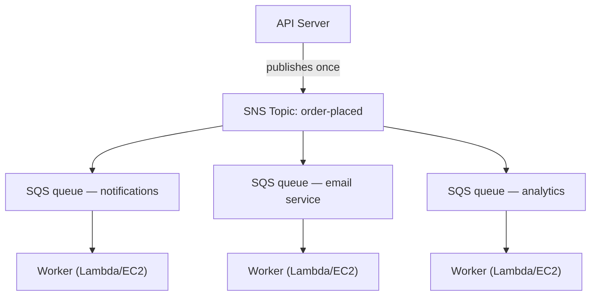

# Chapter 19: The Ticket Machine

The ticket machine was a quiet revolution. Take a number, wait to be called. The line became a queue. People could sit down. The service counter worked at its own pace. Nobody blocked anyone.

Before the ticket machine, you had to stand in line. Your position in line required your physical presence. You couldn't do anything else while waiting. And if the person at the front of the line was slow, everyone behind them stopped.

The ticket machine separated arrival from service. You arrived, took a number, and the system remembered your place. You could go sit down. The service counter worked through numbers at whatever pace it could manage. If the counter was temporarily closed, new arrivals still got numbers. They waited. The work didn't disappear — it queued.

This small invention is one of the oldest examples of decoupling in human systems. By the end of this chapter, Nimbus will have built its own ticket machine — in software — and the reason it needed one starts with sixteen minutes of downtime on a Friday evening.

---

The team had survived the AZ failure. Leo had fixed the chaos engineering process, and the runbook was solid. Traffic had recovered and was growing again — faster than before, in fact. The Aurora documentation Leo was reading late at night was still a few chapters ahead of where Nimbus actually was.

But with traffic growing and more restaurants onboarding, a different kind of bottleneck was becoming visible. Not in the infrastructure. In the application code itself. The request chain that worked fine at 200 orders per hour was starting to show strain at 800.

And then came the evening of the 14th.

---

It had started with the analytics dashboard. At 6:47 PM on a Friday, a deploy to the analytics service introduced a timeout bug. The service started responding in 8 seconds instead of the usual 200 milliseconds.

The order flow was synchronous. Every order waited for the analytics service before confirming to the customer. Eight seconds became 12 as load increased. The API's connection pool started filling with requests waiting for the analytics step to complete.

At 6:53 PM, the connection pool hit its limit. New requests started failing immediately — not because the order couldn't be processed, but because there was no available connection to start processing it.

"The analytics service brought down the order flow," Leo said, looking at the logs the next morning. "They have nothing to do with each other. The analytics service just calculates dashboards."

"But they're in the same request chain," Priya said.

"Sixteen minutes of downtime," Maya said. "And three customers got charged twice."

The double-charge was worse than the downtime. In the chaos of the connection pool saturation, a retry mechanism had fired for some requests that had actually succeeded — the payment step completed, then the request timed out before returning, and the retry tried the payment again. Same card, same amount, two charges.

"The retry mechanism was supposed to help," Leo said.

"It helped in the wrong direction," Priya said. "And have we thought about what happens when we try to refund those customers? The refund process uses the same order flow that failed."

Sixteen minutes of downtime and three double-charges. That was the business cost of the synchronous request chain.

---

Nimbus had a problem that didn't feel like a problem until orders got popular.

Every time an order was placed, the API server had to:

1. Save the order to the database
2. Send a notification to the restaurant's tablet
3. Send a confirmation email to the customer
4. Update the restaurant's analytics dashboard
5. Log the event for billing

At a busy deli counter, the person at the register doesn't wait for the cutter to finish slicing before moving to the next customer. They take the order, hand it to the kitchen, and start serving the next person. The kitchen works through orders at its own pace. The customer gets faster service. The kitchen doesn't get overwhelmed by sudden bursts. If the kitchen has a slow moment, the orders pile up behind the counter rather than causing errors at the register.

That was the analogy. Nimbus didn't have a counter and a kitchen. It had one person doing everything in sequence before the customer could leave.

And on the 14th, the person cutting the meat had a problem. So the counter stopped. So every customer after that waited. The kitchen, the register, the customers — all paused because one step in the chain had slowed.

The fix wasn't to make the meat-cutting faster. The fix was to separate the steps. Take the order at the register, hand off a ticket, let the kitchen work.

"We're tightly coupled," Priya said. "If any downstream step fails, the entire order fails. Have we thought about what happens if the analytics service gets compromised and starts consuming malformed messages? The whole order fails — because we're waiting for it."

"What if we could save the order and immediately confirm to the customer," Leo said, "and then process the rest in the background?"

"That's a queue," Priya said.

The key insight: the customer doesn't need to know that the analytics dashboard was updated before they get their confirmation. They need to know their order was received. Those are different things. The synchronous chain conflated them.

**The Decoupling Model**

This is **decoupling**: separating the component that accepts work from the components that process it.

All of the steps in Nimbus's order flow had to happen synchronously before the API could respond to the customer. If the email service was slow (sometimes it was), the customer waited. If the analytics dashboard was down (sometimes it was), the order failed.

The cascade on the 14th demonstrated exactly why this mattered. The analytics service had nothing to do with whether a customer's order was accepted. But because it sat in the same synchronous chain, its failure became everyone's failure.

In software systems, the queue is often a message broker — a service that accepts messages from producers and delivers them to consumers.

You might be wondering: if the order flow is now asynchronous, how does the customer know their order was actually received? The answer is in the architecture design: the API saves the order to the database (synchronous — this is the authoritative confirmation), then publishes events to the queue. The customer confirmation is based on the database write succeeding, not on the downstream services completing. If the email service is slow, the customer already has their confirmation. The email is just a nice-to-have follow-up.

**Amazon SQS: The Queue**

**Amazon SQS (Simple Queue Service)** is AWS's managed message queue service. It stores messages durably until they're processed by a consumer.

The basic flow:

1. **Producer** (the API server) places a message in the queue: `{ "orderId": "ORD-5532", "restaurantId": "47", "items": [...] }`
2. The API immediately responds to the customer: "Order confirmed!"
3. **Consumers** (separate worker services) read messages from the queue and process them: send the restaurant notification, send the confirmation email, update analytics

The customer experience: instant confirmation. The downstream processing: happens asynchronously, at the workers' pace.

**SQS Key Concepts**

**Message visibility timeout**: When a consumer reads a message from SQS, the message becomes *invisible* to other consumers for a period (default: 30 seconds). This gives the consumer time to process it. If the consumer finishes successfully, it deletes the message. If the consumer crashes, the visibility timeout expires and the message becomes visible again for another consumer to retry.

This ensures at-least-once delivery: every message will be processed at least once, even if a consumer fails mid-processing.

You might be wondering: if the message becomes invisible while being processed but doesn't get deleted when the consumer crashes, couldn't it be processed twice? Yes — and this is called at-least-once delivery. It means every consumer must be designed to handle receiving the same message more than once without causing a problem. A duplicate order confirmation email is annoying. A duplicate charge is a support ticket. Design your consumers accordingly.

The visibility timeout must be longer than your longest expected processing time. If processing typically takes 20 seconds but occasionally takes 90 seconds, and your visibility timeout is 30 seconds, that occasional 90-second processing will look like a failure to SQS. The message becomes visible again. A second consumer picks it up. Now two workers are processing the same message. If your processing isn't idempotent, you have a problem.

A common mistake: set the visibility timeout equal to the average processing time. The correct approach: set it to the 99th percentile processing time, with a safety margin. If P99 processing time is 45 seconds, set the visibility timeout to 90 seconds.

**Dead-letter queues (DLQ)**: If a message fails processing too many times (configurable — e.g., 5 retries), SQS moves it to a dead-letter queue. You inspect the DLQ to understand why messages are failing without losing them.

The DLQ is where you learn what's actually failing in production. Without it, failed messages simply disappear and you have no way to investigate.

Three weeks after the SQS migration, Leo noticed 23 messages had accumulated in the notification service's DLQ. He had not been checking the DLQ (he'd set it up correctly and then assumed it would stay empty).

He pulled one message and looked at the payload:

```json
{
  "orderId": "ORD-9821",
  "restaurantId": "12",
  "customerMessage": "Extra spicy please 🌶️🔥",
  "timestamp": "2024-01-18T19:43:11Z"
}
```

The emoji. The restaurant notification service was encoding message payloads as Latin-1 before sending to the restaurant's legacy tablet API. The emoji characters — four bytes each in UTF-8 — were getting corrupted, causing the tablet API to reject the request. The message would retry, fail again, retry again, fail again. After 5 retries, SQS moved it to the DLQ.

"All 23 messages have emoji in the customer notes field," Leo said.

"So every customer who added an emoji to their order notes had their note silently fail to reach the restaurant," Maya said.

"Yes."

"For how long?"

Leo checked the oldest message's timestamp. "Three weeks."

Priya was quiet. "And what if someone figured out that adding an emoji to an order note caused a silent failure? You could place orders with emoji and guarantee the restaurant never saw the instruction. Then complain about the wrong order."

Nobody had exploited this. But it was the right question to ask.

Leo fixed the encoding bug. He then wrote a script to replay all 23 stranded messages from the DLQ. The restaurants received their (three-week-old) spicy emoji instructions. The customers never knew.

The lesson: the DLQ must be monitored actively, not set up and forgotten. A growing DLQ is a silent signal that something is failing repeatedly.

**Queue types**:

**Standard queues**: Maximum throughput (unlimited messages per second). Delivery order is best-effort (not guaranteed). At-least-once delivery (very rarely, a message might be delivered twice).

**FIFO queues**: Strict first-in, first-out ordering. Exactly-once **processing** — deduplication based on a `MessageDeduplicationId` within a 5-minute window. Ordering is guaranteed *per* `MessageGroupId`: messages in the same group arrive in order; different groups can be processed in parallel, which is how FIFO scales. Baseline throughput is 3,000 messages per second with batching (300 without); enabling **high-throughput mode** raises this to tens of thousands per second by partitioning across message groups. Use FIFO when order matters (financial transactions, sequential state changes).

If you need maximum throughput and can tolerate occasional duplicate messages, use SQS Standard — but you must design every consumer to handle duplicates without causing problems. If you need strict ordering and exactly-once processing, use SQS FIFO — and design your `MessageGroupId`s well, because parallelism (and therefore throughput) comes from having many groups.

For Nimbus, most queues used standard queues. The billing queue used FIFO to ensure charges were processed in order.

**Queue Depth Auto Scaling: Scaling Workers to Match the Backlog**

One of the most powerful applications of SQS is using queue depth as an Auto Scaling trigger. Instead of scaling based on CPU or memory, you scale based on how much work is waiting.

For Nimbus's notification service: the SQS queue depth (the number of messages waiting to be processed) was connected to an Application Auto Scaling policy for the ECS service running the notification workers.

Policy: when the queue has more than 50 messages per worker task, add a task. When the queue has fewer than 10 messages per worker task, remove a task.

The practical effect: when 1,200 orders hit across the Friday evening peak, the notification queue depth spiked and the worker fleet scaled from 2 tasks to 8 tasks within 3 minutes. By midnight, the queue was empty and the fleet was back to 2.

"How much does that cost per month?" Tom asked, looking at the Auto Scaling graph.

"Nothing extra for the Auto Scaling itself," Leo said. "But 6 extra ECS tasks for 3 hours on Friday evenings — that's meaningful."

Tom calculated. "About $14/month for those peaks. And before, we were running 8 tasks continuously at full cost?"

"Yes."

"So we pay for the burst when we need it and nothing otherwise."

This is the queue-depth scaling pattern: the queue becomes a buffer that absorbs traffic spikes, and the worker fleet scales to drain the buffer. The users don't experience slowness — they got their confirmation immediately when the order was accepted. The workers just take a bit longer to catch up. And because you're not running peak capacity 24/7, costs are significantly lower.

**Amazon SNS: The Broadcaster**

**Amazon SNS (Simple Notification Service)** is a publish/subscribe (pub/sub) message service. Instead of one producer, one consumer (queue), SNS supports one message being delivered to *many* subscribers simultaneously.

The model:

1. A **publisher** sends a message to an SNS **topic**
2. All **subscribers** of that topic receive the message simultaneously (fan-out)

Subscribers can be:

- SQS queues (push the message to a queue for async processing)
- Lambda functions (trigger the function directly)
- HTTP/HTTPS endpoints (webhook delivery)
- Email addresses
- SMS (phone numbers)

For Nimbus, the order placed event is published to an SNS topic called `order-events`:

- Restaurant notification service subscribes (receives on its SQS queue)
- Email service subscribes (receives on its SQS queue)
- Analytics service subscribes (receives on its SQS queue)
- Billing service subscribes (receives on its FIFO SQS queue)

One order event. Four subscribers. All notified simultaneously. Each processes at its own pace.

"So SNS is the announcement," Maya said, "and SQS is the inbox where each team processes the announcement at their own speed. Then why use both? Why not just have everyone subscribe to the SNS topic directly?"

"Because direct SNS delivery is fire-and-forget," Leo said. "If the analytics service is down when SNS fires, that message is gone. With an SQS queue in between, the message waits until the service recovers."

"Exactly," Priya said. "The SNS/SQS fan-out is the standard pattern."

**The SNS/SQS Fan-Out Pattern**

This combination — SNS topic feeding multiple SQS queues — is one of the most important architectural patterns in AWS:



Each queue is independent. The analytics service can be slow — its queue fills up, but the notification and email services continue unaffected. If the analytics service goes down, its messages wait in the queue until it comes back up. Nothing is lost.

This is the key property: **independent failure**. Problems in one consumer don't propagate to others.

**Message Filtering: Not Every Message for Every Subscriber**

As systems grow, you don't want every subscriber to process every message. An analytics service shouldn't receive messages about failed payment processing if it only cares about completed orders.

**SNS message filtering** lets subscribers specify filter policies — only deliver messages that match certain attributes.

The restaurant notification service subscribes with a filter: only messages where `status = "confirmed"`.

The error alerting service subscribes with a filter: only messages where `status = "failed"`.

Each subscriber gets only what it needs.

Without filtering, every subscriber receives every message and must ignore what's irrelevant. This wastes processing, wastes money (SQS charges per message), and introduces noise. A high-volume order system without filtering would flood the error alerting queue with successful orders — making the real failures hard to find.

Filter policies look like:

```json
{
  "status": ["confirmed"],
  "region": ["us-west-2", "us-east-1"]
}
```

This subscriber receives only messages where status is "confirmed" AND region is either "us-west-2" or "us-east-1". Messages not matching the policy are not delivered to this subscriber's queue at all — they never even reach SQS.

"So filtering happens at the SNS layer," Priya said, "before messages are written to SQS?"

"Correct. The SQS queue for the restaurant notification service only ever sees messages it needs to act on."

"And what if someone tries to break in by publishing a specially crafted message to the SNS topic that matches all subscriber filters?" Priya asked.

The SNS topic had an IAM resource policy: only the order API service (by its IAM role) was allowed to publish. SNS access policies and SQS queue policies formed the access control layer — filtering was just for routing, not security.

**When to Use SQS vs SNS**

**SQS alone**: One producer, one consumer (or multiple competing consumers on the same queue). Messages need to be processed once, in order (FIFO) or not (standard). Worker queue pattern — one queue, multiple workers consuming from it.

**SNS alone**: Fire-and-forget notifications. Push to email, SMS, or HTTP endpoints. No need to queue the message — just notify and move on.

**SNS + SQS (fan-out)**: One event, multiple independent consumers. Each consumer has its own queue, processes independently, and can fail independently.

## SNS FIFO Topics

Everything above about SNS uses standard topics — they have effectively unlimited throughput, deliver to subscribers nearly simultaneously, and get the job done for the vast majority of use cases.

But standard SNS topics do not guarantee ordering. If you publish ten messages in sequence, subscribers might receive them in a slightly different order. For the Nimbus order notifications, that's fine — an analytics update arriving a fraction of a second before an email confirmation doesn't matter.

For some scenarios, it does matter. Consider a financial ledger: if two events — a credit and then a debit — are delivered in reverse order, the balance calculations during processing will be wrong even if both events are eventually processed correctly.

**SNS FIFO topics** apply the same principle as SQS FIFO queues to the fan-out model. Messages are delivered to subscribers in the exact order they were published, and each message is delivered exactly once.

The trade-off: SNS FIFO topics have a similar baseline throughput to SQS FIFO (3,000 messages per second per topic; 300 per second per message group — with a high-throughput mode available since 2025 for much more), and they fan out only to **SQS queues** — FIFO or, since 2023, Standard. Subscribing a Standard queue is useful for consumers that don't care about order (an analytics feed, for example), but ordering and exactly-once survive end to end **only** into FIFO queues. You cannot use an SNS FIFO topic to deliver to HTTP endpoints or email addresses.

For Nimbus's billing pipeline — where a sequence of pricing updates had to be applied to restaurant accounts in order — the billing SNS topic was migrated from standard to FIFO. The SQS billing queue was already FIFO. The fan-out now guaranteed that a price-increase event would never arrive at the billing processor before the period-start event it depended on.

> **Exam Tip — SNS FIFO**
>
> If a scenario requires **ordered fan-out delivery** across multiple subscribers, the answer is **SNS FIFO**. Standard SNS does not guarantee ordering. SNS FIFO fans out only to SQS queues — to keep ordering and exactly-once end to end, the subscriber must be an SQS **FIFO** queue (Standard queue subscriptions are allowed but get best-effort ordering and at-least-once delivery). Default throughput is 3,000/sec per topic — if the scenario describes much higher volume *and* strict ordering, that's a signal to look at alternative architectures (Kinesis, for example, which is covered in a later chapter).

## When the Legacy Queue Won't Let Go

Nimbus was about to close its largest acquisition yet: Barato, a food delivery competitor with 200 restaurants and a two-year head start on operations. The engineering team scheduled an integration planning call.

The call lasted twenty minutes before Leo went quiet.

"Their order processing system," he said. "What does it run on?"

"ActiveMQ," said the Barato engineer on the other end. "On-prem broker. The app is Java. It's been running since 2018. Everything speaks AMQP."

"AMQP," Leo said.

"Yes."

He looked at the architecture diagram on his screen. Nimbus ran SQS and SNS. SQS does not speak AMQP. SNS does not speak AMQP. The Barato application spoke nothing else.

"Rewriting it will take six months," Leo said to the team after the call. "At minimum."

"We can't delay the acquisition for six months," Maya said.

"And we can't run a bare-metal ActiveMQ broker in AWS," Priya added. "Have we thought about what that looks like from a security and reliability standpoint? A self-managed message broker, sitting in production, with no managed patching, no automatic failover, connecting to our infrastructure?"

"There's a managed option," Leo said slowly. He'd been reading while they talked. "Amazon MQ."

**Amazon MQ: The Managed Broker**

**Amazon MQ** is a managed message broker service for Apache ActiveMQ and RabbitMQ. It runs your existing broker — the same broker your applications have been connected to for years — but as a managed AWS service. AWS handles the underlying infrastructure: provisioning, patching, failover, backups.

The key property that makes Amazon MQ different from SQS and SNS: it speaks the protocols that legacy message brokers speak. AMQP, STOMP, MQTT, OpenWire, NMS. The protocols that SQS and SNS simply don't understand.

For the Barato integration, the plan was straightforward. AWS would run an Amazon MQ broker configured as ActiveMQ. The Barato Java application would be pointed at the new broker endpoint instead of the on-premises one. The change on the application side: update one configuration file with the new connection string. That was it. The application didn't need to know it was talking to a managed cloud broker instead of a server in the Barato office.

"Hold on," Maya said. "If we're going to integrate them into Nimbus eventually, shouldn't we just migrate them to SQS from the start?"

"Because the migration path exists," Leo said. "And it's worth doing properly — eventually. But right now, we need Barato operational on AWS infrastructure in thirty days, not six months. Amazon MQ gets the application running without changing the application. Then we have time to plan the SQS migration as a deliberate project, not a scrambled prerequisite for the acquisition."

"How much does that cost per month?" Tom asked.

The Amazon MQ broker — a single active/standby pair for reliability — was in the range of $200/month for a broker suitable for Barato's volume. Compared to the cost of six months of rewrite time, it wasn't a debate.

Priya approved the plan with one condition: the Amazon MQ instance would live in a private subnet, with security group rules permitting connections only from the Barato application servers. No public exposure. Audit logging enabled.

The migration took twelve days. The Barato application connected to Amazon MQ on day thirteen. On day fourteen, it processed its first order on AWS infrastructure without a single code change.

---

> **Exam Tip — Amazon MQ**
>
> *SAA-C03 Domain: Design Resilient Architectures (Domain 2)*
>
> The exam distinguishes Amazon MQ from SQS and SNS on a single axis: **protocol compatibility**. If the scenario describes an application that already uses a message broker and speaks a specific protocol, Amazon MQ is almost certainly the answer.
>
> The key signals: **"ActiveMQ," "RabbitMQ," "AMQP," "STOMP," "MQTT," "OpenWire,"** or any phrase equivalent to **"without changing the application code."** If you see those phrases, the answer is Amazon MQ — not SQS, not SNS.
>
> If the scenario describes a *new* application that needs decoupling, or doesn't mention a legacy broker or specific protocol, use SQS/SNS.
>
> One more signal: "migrate existing on-premises message broker to AWS." If the app needs to keep talking the same protocol to the same kind of broker, Amazon MQ is the lift-and-shift answer.

## Strengths and Limitations

**Why SQS and SNS are powerful**:

- SQS provides durable, reliable message delivery — messages are stored across multiple AZs
- Decoupling enables independent scaling and deployment of producer and consumer services
- Dead-letter queues ensure no message is silently lost on failure
- SNS fan-out pattern allows adding new consumers without changing the producer

**Where it gets complicated**:

- At-least-once delivery means consumers must be *idempotent* — processing the same message twice should not cause problems (duplicate orders, duplicate charges)
- FIFO queues are more expensive and have throughput limits
- Debugging failed messages across multiple queues and services requires good logging and observability
- Message ordering guarantees are limited — if strict ordering matters across multiple services, the design gets complex

**Idempotency: A Practical Deep Dive**

Idempotency sounds abstract until you've had three customers double-charged.

An operation is **idempotent** if running it multiple times produces the same result as running it once. A charge operation is not naturally idempotent: running it twice charges twice. An idempotent charge operation checks whether the charge has already been processed before attempting it.

The pattern: each message carries a unique ID (the order ID, or a separate message ID). Before processing, the consumer checks a store (DynamoDB works well for this) to see if this message ID has already been processed successfully. If yes: do nothing, delete the message. If no: process, record the ID, delete the message.

```python
def process_charge(message):
    order_id = message['orderId']
    
    # Idempotency check
    if already_processed(order_id):
        logger.info(f"Order {order_id} already charged, skipping duplicate")
        return  # Message will be deleted from queue
    
    # Process the charge
    charge_result = payment_service.charge(
        amount=message['amount'],
        card_token=message['cardToken'],
        idempotency_key=order_id  # Also pass to payment processor
    )
    
    # Record that we've processed this
    mark_as_processed(order_id, charge_result)
```

The idempotency key should also be passed to downstream services (payment processors, email systems) that support it. Stripe, for example, accepts an `Idempotency-Key` header that prevents duplicate charges even if the same API call is made twice.

"And what about correlation IDs?" Priya asked. "When a message moves through multiple services, how do we trace which request caused which downstream action?"

**Correlation IDs: Tracing Across Services**

When a customer places an order, the request flows through: API → SNS → SQS → notification worker → restaurant tablet API → SQS → email worker → SES.

Without correlation IDs, if the restaurant tablet API returns an error at step 6, the logs in each service show the event, but there's no way to trace it back to the specific customer's order from the beginning.

A **correlation ID** is a unique identifier attached to the original request and passed through every service interaction. Each service includes the correlation ID in its logs.

When Priya searches CloudWatch for a specific correlation ID, she gets every log line — across every service — that was part of that single order's processing.

"One caveat," Priya said. "Correlation IDs come in from the outside. Could someone inject a malicious ID and mess with our logging?"

Correlation IDs are internal — they don't affect processing logic, only logging. Sanitizing them (alphanumeric, fixed length) prevents injection attacks in log outputs.

**When Decoupling Is the Wrong Choice**

"Wait — but *why* wouldn't we decouple everything?" Maya asked.

It was a fair question. If decoupling prevents the cascade failures and makes systems resilient, why not apply it everywhere?

Because decoupling has costs. And there are scenarios where those costs outweigh the benefits.

**When you need immediate consistency**: If a payment must be confirmed before an order can proceed — and the user is waiting on screen for the result — you cannot put the payment in an asynchronous queue and return a confirmation before you know whether the charge succeeded. The user might order twice before the first charge completes. Asynchronous decoupling doesn't work for operations where the response depends on the outcome.

**When the workflow is inherently sequential**: If step 3 must see the result of step 2 to make a decision, they cannot run in parallel from a queue. Forcing them into a queue creates an awkward result-passing mechanism that often ends up being more complex than the synchronous version.

**When message ordering is critical and volume is low**: SQS Standard doesn't guarantee ordering. SQS FIFO does, but caps at 3,000 messages/second with batching by default (high-throughput mode raises that substantially). If you have a low-volume, strictly ordered workflow, a simple synchronous queue (like a database row lock) might be simpler and more reliable.

**When the overhead exceeds the benefit**: A small internal tool with one user and no SLA probably doesn't need fan-out SNS topics and DLQs. The operational overhead of monitoring queues and DLQs is real. Size the architecture to the problem.

The question isn't "should I decouple this?" It's "what is the cost of this coupling, and does decoupling reduce that cost more than it adds?"

## Summary

Decoupling is the Chapter 18 resilience principle applied to internal architecture: the same way Multi-AZ eliminates single points of failure in infrastructure, SQS and SNS eliminate single points of failure in request chains.

- **Decoupling** separates components that produce work from components that process it.
- **SQS** gives producers a durable place to put work when consumers are slow, offline, or scaling up.
- **SNS** lets one event reach multiple independent consumers without the publisher knowing who they are.
- **SNS + SQS fan-out** lets each downstream service process the same event at its own pace.
- **DLQs, idempotency, and correlation IDs** are the operational discipline that makes asynchronous systems debuggable instead of mysterious.
- **Do not decouple blindly**: synchronous workflows, immediate consistency requirements, and small low-risk tools may not justify the added operational surface.

## Exam Tips

*SAA-C03 Domain: Design Resilient Architectures (Domain 2, Task 2.1)*

- **SQS Standard vs FIFO**: Exam distinguishes by ordering and delivery guarantees. "Must process in order" → FIFO. "Maximum throughput" → Standard.
- **Queue depth Auto Scaling**: "Scale workers based on queue depth" → SQS metric (ApproximateNumberOfMessagesVisible) used with Application Auto Scaling or ECS Service Auto Scaling.
- **Visibility timeout**: Key concept for at-least-once delivery. If a consumer fails, the message becomes visible again after the timeout. Exam scenario: "messages are being processed twice" → visibility timeout is too short (consumer takes longer than the timeout to process).
- **Dead-letter queue**: Messages that fail after N retries are moved here. Exam scenario: "ensure no messages are lost, even if processing fails repeatedly" → DLQ.
- **SNS fan-out**: Classic exam pattern for one event triggering multiple consumers. "Order placed notification must trigger email, SMS, and inventory update simultaneously" → SNS topic with SQS subscriptions.
- **SQS + Lambda**: Lambda can be configured to poll an SQS queue and trigger on each message batch. Exam uses this for event-driven processing at scale.
- **SQS long polling**: Instead of consumers polling every few seconds (short polling, wastes API calls), long polling waits up to 20 seconds for a message. Reduces costs and false empty responses.
- **SQS extended client library**: For messages larger than the queue's payload limit (256KB by default; raisable to 1MB since 2025), use the SQS Extended Client Library, which stores the message body in S3 and sends a reference via SQS. The exam still treats 256KB as the SQS limit — "SQS message too large" → Extended Client Library + S3.
- **SNS message filtering**: Subscribers receive only messages matching their filter policy. Exam scenario: "only send notifications matching specific criteria to a subscriber" → SNS message filtering.
- **Note**: SNS/SQS fan-out also appears in Domain 3 scenarios about high-throughput asynchronous processing architectures. Know the pattern for both resilience and performance questions.
- **Amazon MQ signals**: "ActiveMQ," "RabbitMQ," "AMQP," "STOMP," "MQTT," "OpenWire," or "without changing the application code" → Amazon MQ, NOT SQS. If the scenario says new application that needs decoupling → SQS/SNS.
- **SNS FIFO vs Standard**: Standard SNS does not guarantee ordering. If the scenario requires **ordered fan-out** → SNS FIFO topic feeding SQS FIFO queues. Remember: SNS FIFO cannot deliver to HTTP endpoints or email — only to SQS queues (FIFO for ordering/exactly-once; Standard subscriptions work but downgrade to best-effort ordering and at-least-once).

## Exercises

**Exercise 1 — Recall**

Explain the SNS/SQS fan-out pattern. Why does the pattern use SQS queues instead of having services subscribe directly to the SNS topic with HTTP endpoints?

*(Hint: Think about what happens if one of the HTTP endpoints is down when SNS publishes a message.)*

**Exercise 2 — SAA-C03 Scenario**

*Scenario*: An e-commerce platform processes 10,000 orders per hour. When an order is placed, the system must: (1) store the order in the database, (2) deduct inventory, (3) send a confirmation email, and (4) update the analytics dashboard. Currently, all four steps happen synchronously — if the analytics service is slow, customers wait. The team wants to improve customer-facing response time while ensuring no orders are lost.

Which architecture BEST addresses this requirement?

A) Use SQS FIFO queues to process all four steps in sequence  
B) Have the API save the order and immediately confirm to the customer; publish an event to an SNS topic; have inventory, email, and analytics services subscribe via SQS queues  
C) Use parallel EC2 instances to process each step simultaneously, synchronously  
D) Use an API Gateway with request validation to speed up order processing

**Hint 1**: The customer confirmation should be immediate. Which steps must happen before the response, and which can happen after?

**Hint 2**: The analytics service being slow should not affect the email or inventory services.

**Hint 3**: SNS fan-out allows all three downstream services to receive the event simultaneously.

**Answer**: B

**Explanation**: The API saves the order to the database (synchronous — must be done before confirming) and immediately returns a confirmation. It then publishes an `order-placed` event to an SNS topic. Inventory, email, and analytics services each subscribe via independent SQS queues. They process at their own pace — if analytics is slow, its queue grows but the other services are unaffected. If any service fails, its messages remain in the SQS queue and are retried; after the configured number of failed retries they are moved to the DLQ.

**Why not A?** FIFO queues process messages in sequence — this doesn't help with the synchronous slowdown. Also, sequential processing means analytics being slow still blocks email.

**Why not C?** "Parallel EC2 instances processing synchronously" still requires all steps to complete before responding to the customer. Adding instances doesn't solve the synchronous coupling.

**Why not D?** API Gateway accelerates API routing and validation, but doesn't decouple the downstream processing steps.

*SAA-C03 Domain: Design Resilient Architectures — Task 2.1*

**Exercise 3 — Architecture Challenge** *(Optional)*

Nimbus is building a notification system for restaurant partners. When a customer places an order, the restaurant needs to be notified via:

- Their tablet app (push notification)
- A kitchen display system (HTTP webhook to their local hardware)
- A backup SMS (if the tablet notification fails)

The tablet notification service is reliable. The kitchen webhook is sometimes down (restaurants turn off their hardware at closing time). The SMS should only fire if the tablet notification fails.

Design the architecture using SNS and SQS. How would you handle the "SMS only if tablet fails" requirement? How would you ensure the kitchen webhook doesn't block the tablet notification when it's offline?

Consider also: what visibility timeout is appropriate for the kitchen webhook delivery if the average webhook response time is 2 seconds but restaurants with slow hardware can take up to 30 seconds? What DLQ policy would trigger the SMS fallback after webhook retries are exhausted?

*(There is no single correct answer. The goal is to practice fan-out design with conditional routing.)*

## Post-Credits Scene

The new order flow was live.

Leo had deployed it on a Tuesday afternoon without running a full load test first. "It'll be fine," he'd told Priya. "The architecture is solid."

Customers placed orders. The API responded in 95 milliseconds. The confirmation appeared on their phones instantly.

Behind the scenes: four services processing asynchronously. The analytics service had a bug that caused it to crash on orders containing certain special characters in the item name. Its queue backed up to 3,200 messages over two hours.

Customers never noticed.

When Leo fixed the bug and the analytics service restarted, it processed the backlog in 18 minutes. No data was lost. The DLQ was empty.

He refreshed the CloudWatch dashboard. Queue depth: 0. Messages processed: 3,200. Errors: 0 (after the fix).

"This is exactly what the 14th would have looked like," he said. "Analytics had a problem. The queue absorbed it. Everything else kept working."

"This is what decoupling means," Priya said.

"How much does that cost per month?" Tom asked, already on the pricing page.

"At our current volume, about twelve dollars a month for SQS." He stared at the screen. "I was expecting more."

He had the look of someone discovering something unexpectedly cheap was also unexpectedly good.

"Set up the DLQ alerts," Priya reminded Leo. "We don't want another three weeks of silent failures."

"Already done," Leo said.

He had done it this time.

In the next chapter: the function that runs only when someone knocks — and costs nothing when they don't.
