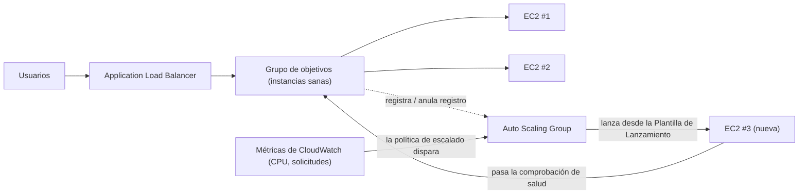

# Capítulo 7: El Restaurante que Crece Cuando Está Lleno

Eran las 7:43 de un viernes por la noche.

La silla de Tom estaba ligeramente echada hacia atrás, como se ponía cuando miraba algo con el tipo de concentración que significaba que no iba a responder si le hablabas. La oficina se había vaciado una hora antes. Él se había quedado.

Tenía abierta una pestaña en el panel de métricas que actualizaba como otras personas revisan las redes sociales — de forma refleja, constantemente, sin llegar a querer hacerlo.

La crisis de almacenamiento había quedado atrás. La base de datos tenía su propio disco. Las fotos vivían en S3. Durante dos semanas, el sistema había sido estable — no emocionante, solo estable. Eso debería haberse sentido bien.

Entonces la tasa de errores superó el 12%.

«Leo», dijo Tom.

Leo ya estaba mirando. Tiempos de respuesta: subiendo. Solicitudes en cola: subiendo. La única instancia EC2 — incluso después del cuidadoso ejercicio de dimensionamiento correcto del mes pasado — estaba al 94% de CPU.

«Estamos rechazando clientes», dijo Tom.

«No los estamos rechazando nosotros», dijo Leo. «El servidor sí.»

«Es lo mismo.»

Lo era. Y había estado ocurriendo cada viernes durante tres semanas. Nimbus había sobrevivido la crisis de almacenamiento — la base de datos tenía su propio disco, las fotos vivían en S3 — pero estable y escalable son problemas completamente diferentes. El sistema funcionaba. Solo que no crecía.

Apareció un mensaje de Slack de Maya: *el panel dice que los pedidos han bajado un 40% respecto al viernes pasado. ¿qué pasa?*

Tom respondió: *servidor a plena capacidad. trabajando en ello.*

Pasaron tres minutos.

Maya: *tenemos al dueño de un restaurante llamando a la línea de soporte diciendo que la app está rota.*

Leo tenía las manos en el teclado. Estaba redimensionando la instancia — la versión manual de la solución, la que requería detener el servidor y cambiar el tipo de instancia. Lo que significaba tiempo de inactividad.

«¿Cuánto tardará el reinicio?» preguntó Tom.

«Siete minutos», dijo Leo.

«Vamos a tener siete minutos más de avería un viernes por la noche», dijo Tom. No estaba preguntando. Escribió un mensaje de Slack a Maya. Ella respondió con un solo carácter: *ok*

El reinicio se completó. La instancia volvió a estar en funcionamiento. La CPU bajó al 60%. La tasa de errores bajó. Tom observó las métricas durante quince minutos sin hablar.

A las 9:15, el tráfico disminuyó. La crisis había terminado.

Leo miró sus manos, que habían estado temblando ligeramente a las 8 de la noche y ya no.

«No podemos hacer eso cada viernes», dijo.

«No», dijo Tom. «No podemos.»

El equipo necesitaba que su sistema manejara carga variable automáticamente. No comprar suficiente
servidor para el peor caso y desperdiciar dinero durante los tiempos tranquilos. Y no tener que correr
manualmente cuando llegaban los picos de tráfico.

Hay un patrón para esto. AWS tiene dos servicios que lo implementan.

**El Concepto: Escalado Horizontal**

Hay dos formas de hacer que un sistema maneje más carga.

El **escalado vertical** significa hacer el servidor único más grande. Más CPU. Más RAM.
Hicimos esto en el Capítulo 4 cuando actualizamos de `t3.micro` a `t3.large`. Ayuda.
Pero tiene límites: solo puedes llegar hasta cierto punto, la instancia tiene que reiniciarse para redimensionarse
y sigues teniendo un único punto de fallo.

El **escalado horizontal** significa añadir más servidores. En lugar de un servidor grande, ejecutar
cinco servidores medianos. Cuando el tráfico baja, ejecutar dos. Cuando sube, ejecutar diez.

El escalado horizontal tiene ventajas que el vertical no tiene:

- Sin punto único de fallo. Si un servidor muere, los otros siguen sirviendo.
- No se requiere reinicio para añadir capacidad.
- Paga solo por lo que estás usando — añade servidores cuando los necesitas, elimínalos cuando no.
- Escalado lineal: el doble de servidores, aproximadamente el doble de rendimiento.

También hay una dimensión de fiabilidad que el escalado vertical no puede igualar. Cuando tienes
cinco servidores y uno falla, tu capacidad baja al 80% — suficiente para seguir sirviendo tráfico
mientras se reemplaza la instancia fallida. Cuando tienes un servidor y falla, la capacidad
baja al 0%. La redundancia es intrínseca al escalado horizontal de una manera que el escalado
vertical no puede proporcionar a ningún tamaño.

Esto importa también para el mantenimiento. Cuando un parche de seguridad requiere un reinicio del servidor,
el escalado horizontal te permite reiniciar las instancias una a una — reinicios continuos que
mantienen la continuidad del servicio. Un único servidor grande requiere o bien aceptar tiempo de inactividad
durante el reinicio o implementar la complejidad de un despliegue azul/verde (blue/green).

El inconveniente: si tienes múltiples servidores, ¿cómo saben los usuarios con cuál hablar?

Y hay una restricción de diseño que el escalado horizontal impone: tu aplicación
debe poder ejecutarse en múltiples servidores idénticos simultáneamente sin que los servidores
interfieran entre sí. Este es el requisito **sin estado** (stateless) — cada solicitud
debe ser autocontenida, no depender del estado almacenado en un servidor específico. Veremos
exactamente por qué esto importa cuando nos encontremos con el problema de las sesiones pegajosas.

**El Application Load Balancer: Una Puerta, Muchas Habitaciones**

Piensa en un gran restaurante con un puesto de anfitrión en la puerta. Los clientes llegan y
el anfitrión los dirige a una mesa disponible. El anfitrión sabe qué mesas están ocupadas y
cuáles están libres. Los clientes no necesitan saber cuántas mesas hay — simplemente entran y el
anfitrión se encarga de la distribución.

Un **Application Load Balancer** (ALB) hace esto con las solicitudes web.

Los usuarios se conectan al balanceador de carga. El balanceador de carga distribuye las solicitudes entrantes
en tu flota de instancias EC2. Cada usuario ve una dirección (la URL del balanceador de carga).
Detrás de esa dirección, las solicitudes se distribuyen en tantos servidores como estén en ejecución.

El ALB en sí se ejecuta en infraestructura gestionada por AWS, distribuida en múltiples AZs
de tu Región. No es un único servidor — es un servicio gestionado y distribuido.
Cuando habilitas el balanceo de carga entre zonas (el valor predeterminado para los ALBs), cada nodo del ALB
distribuye las solicitudes de manera uniforme en todos los objetivos registrados independientemente de en qué AZ
estén. Esto previene el modo de fallo común donde una AZ tiene el doble de
instancias sanas que otra, resultando en una carga desigual.

Recibe cada solicitud HTTP entrante y decide qué instancia EC2 (llamada
**objetivo**) debería manejarla, basándose en factores como:

- Round-robin (cada servidor tiene turnos en rotación)
- Menos solicitudes pendientes (el servidor con menos solicitudes en vuelo recibe la siguiente solicitud)
- Salud — solo los objetivos sanos reciben tráfico

Las **comprobaciones de salud** son esenciales. El ALB envía regularmente solicitudes de prueba a cada objetivo.
Si un objetivo no responde correctamente, el ALB lo marca como no saludable y deja de enviar
tráfico a él. Cuando el objetivo se recupera, el tráfico se reanuda.

Esto es automático. Configuras los parámetros de la comprobación de salud; el ALB los hace cumplir.

Configuras las comprobaciones de salud con tres parámetros clave: la **ruta** a comprobar (p. ej., `/health`),
el **intervalo** (con qué frecuencia comprobar — cada 5 a 300 segundos; el valor predeterminado es 30) y el **umbral** (cuántas
comprobaciones consecutivas exitosas o fallidas antes de cambiar el estado de salud del objetivo).

Los intervalos de comprobación de salud agresivos detectan problemas más rápido pero añaden más tráfico a los objetivos.
Un intervalo de 30 segundos con un umbral de 3 fallos significa que un objetivo que falla se elimina de la
rotación en 90 segundos. Un intervalo de 10 segundos con un umbral de 2 fallos significa
eliminación en 20 segundos — a costa de más tráfico de comprobación de salud.

Para Nimbus, Priya eligió un intervalo de 30 segundos con un umbral de 3 fallos (90 segundos
para declarar no saludable) y 2 éxitos (60 segundos para declarar saludable de nuevo después de la recuperación).
Esto equilibraba la detección rápida de fallos con evitar falsos positivos por breves
parpadeos de red.

**Configuración de la Comprobación de Salud: Más que «¿Está Vivo?»**

La primera comprobación de salud de Leo era un simple ping TCP: «¿Está el puerto 80 aceptando conexiones?» Eso es el mínimo. El servidor podía estar aceptando conexiones en el puerto 80 mientras la base de datos estaba caída, mientras la aplicación estaba en un bucle de error, mientras el disco estaba lleno.

Priya tenía una visión diferente de lo que «saludable» debería significar.

«¿Hemos pensado en qué pasa si la comprobación de salud pasa pero la aplicación está rota?» preguntó. «Un servidor que puede aceptar conexiones pero no puede consultar la base de datos no está saludable. Solo está respondiendo.»

Leo construyó un endpoint `/health` en el código de la aplicación. El endpoint hacía tres cosas:
1. Confirmaba que el proceso de la aplicación estaba en ejecución
2. Hacía una consulta de prueba a la base de datos (un simple `SELECT 1`)
3. Confirmaba que la conexión a S3 era accesible

Si las tres pasaban, el endpoint devolvía HTTP 200. Si alguna fallaba, devolvía HTTP 503.

La comprobación de salud del ALB se configuró para llamar a este endpoint cada 30 segundos. Si recibía tres respuestas 503 consecutivas, la instancia se marcaba como no saludable y se eliminaba de la rotación.

«Eso significa que si la base de datos cae», dijo Priya, «la comprobación de salud lo detectará y eliminará los servidores afectados del balanceador de carga en 90 segundos.»

«Incluso si los propios servidores siguen en ejecución», dijo Tom.

«Incluso si parecen estar bien desde fuera.»

El ALB, apuntado a una comprobación de salud real de la aplicación, se convirtió en un detector mucho más fiable de problemas reales — no solo de que el servidor esté vivo.

**Auto Scaling: El Restaurante que Abre Más Mesas**

Un ALB distribuye el tráfico entre tus servidores existentes. Pero no añade servidores
cuando necesitas más.

**Auto Scaling** lo hace.

Un **Auto Scaling Group** (ASG) es una configuración que le dice a AWS:

- El número mínimo de instancias que siempre deben estar en ejecución
- El número máximo de instancias permitidas
- Las condiciones bajo las cuales escalar hacia afuera (añadir instancias) o hacia adentro (eliminarlas)

Las condiciones de escalado se llaman **políticas**. Los cuatro tipos más comunes:

**Seguimiento de objetivo (Target tracking)**: «Mantén la utilización media de CPU al 70%.» Cuando la CPU media supera el
70%, AWS lanza nuevas instancias. Cuando baja, las instancias se terminan.
Esta es la política más simple y más recomendada para la mayoría de las cargas de trabajo — establece una métrica
objetivo y deja que AWS averigüe cuántas instancias se necesitan. El objetivo puede ser la utilización
de CPU, el recuento de solicitudes por objetivo o cualquier métrica personalizada de CloudWatch.

**Escalado por pasos (Step scaling)**: Define umbrales específicos con respuestas específicas. «Cuando la CPU
supera el 60%, añade 1 instancia. Cuando la CPU supera el 80%, añade 3 instancias. Cuando la CPU baja
del 30%, elimina 1 instancia.» Control más granular que el seguimiento de objetivo, pero
requiere más configuración y ajuste continuo.

**Escalado programado (Scheduled scaling)**: «A las 6:45 pm cada viernes, asegúrate de que al menos 4 instancias estén
en ejecución.» Esto es escalado proactivo para eventos predecibles. Funciona junto al
escalado reactivo — la acción programada establece un suelo, y el seguimiento de objetivo añade
instancias por encima de ese suelo según sea necesario.

**Escalado predictivo (Predictive scaling)**: la versión de aprendizaje automático de la misma idea. En lugar de que tú escribas el calendario, Auto Scaling analiza hasta dos semanas de carga histórica y pronostica las próximas 48 horas, lanzando capacidad *antes* del aumento previsto. Para tráfico cíclico — una hora punta de cena cada viernes, una apertura de mercado cada día laborable — el escalado predictivo descubre el patrón y precalienta automáticamente, y sigue ajustándose a medida que el patrón deriva. Disparador del examen: «picos de tráfico recurrentes/cíclicos; las instancias deben estar listas *antes* del pico» → escalado predictivo. (El escalado programado es la respuesta manual; el predictivo es la aprendida. Ambos superan al escalado solo reactivo, que siempre va por detrás del pico por el tiempo de arranque de la instancia.)

Para Nimbus, la combinación fue: seguimiento de objetivo para el escalado reactivo (mantener la CPU
al 65%), más una acción de escalado programado cada viernes a las 6:45 pm para precalentar 2
instancias adicionales antes de la hora punta de la cena.

Esto es automático. Nadie tiene que observar las métricas. Nadie tiene que lanzar manualmente
servidores. El sistema reacciona a la carga en tiempo real.

Priya vio esto suceder en vivo durante una hora punta del viernes por primera vez. El recuento de servidores pasó de 2 a 5
en quince minutos, y luego volvió a 2 después de la hora punta.

«Eso», dijo, «es genuinamente impresionante.»

Tom estaba mirando el gráfico de costes en cambio. La factura aumentó durante la hora punta y bajó
después. «Solo pagamos por lo que usamos», dijo, igualmente impresionado. «¿Cuánto cuesta eso al mes, promediado a lo largo de una semana normal?»

Leo abrió la calculadora. Los picos del viernes añadían quizás un 15% a la factura mensual. Sin Auto Scaling, habrían necesitado aprovisionar para el pico toda la semana. La diferencia: aproximadamente 120 $/mes desperdiciados en capacidad pico inactiva, frente a 0 $ desperdiciados con Auto Scaling correctamente configurado.

Hay una sutileza en el escalado hacia adentro que los equipos a menudo pasan por alto: la **protección contra el escalado hacia adentro**. Puedes
configurar instancias específicas en un ASG para que estén protegidas del escalado hacia adentro — lo que significa
que no se terminarán durante los eventos de escalado hacia adentro automáticos. Esto es útil para instancias
que están en medio de procesar un trabajo de larga duración que no quieres interrumpir.
El código de la aplicación también puede establecer la protección de instancia programáticamente cuando inicia un
trabajo largo y eliminar la protección cuando el trabajo se completa. Esto evita que el ASG
tire de la alfombra bajo el trabajo activo.

**Warm Pools: No Todo Necesita Arrancar en Frío**

El viernes que Auto Scaling entró en acción por primera vez, Tom cronometró cuánto tardaba desde «la CPU supera el umbral» hasta «las nuevas instancias sirven tráfico».

Cuatro minutos y veinte segundos.

«Eso son cuatro minutos en los que estamos cortos de capacidad», dijo.

«Podríamos aumentar el recuento mínimo de instancias», dijo Leo.

«Eso significa pagar por instancias inactivas toda la semana», dijo Tom.

Había un término medio: los **Warm Pools** (grupos de calentamiento).

Un Warm Pool es un grupo de instancias EC2 preinicializadas que están en estado detenido, ya arrancadas, ya configuradas, ya con el script de UserData ejecutado. Han hecho todo excepto empezar a servir tráfico.

Cuando el Auto Scaling Group decide escalar hacia afuera, en lugar de lanzar una nueva instancia en frío desde cero (que tarda de tres a cinco minutos en arrancar, ejecutar UserData y pasar las comprobaciones de salud), inicia una instancia del Warm Pool. Iniciar una instancia detenida tarda unos 30 a 60 segundos.

Para el patrón del viernes de Nimbus — una subida conocida y predecible que comienza alrededor de las 7 pm — Priya configuró un Warm Pool de dos instancias para mantener durante el horario comercial. Para las 6:45 pm, dos instancias calientes estaban listas, detenidas pero inicializadas. Cuando el tráfico subió a las 7 pm y el ASG necesitó escalar, las instancias calientes se iniciaron en menos de un minuto y se unieron a la flota.

«¿Cuánto cuesta el Warm Pool?» preguntó Tom.

Una instancia EC2 detenida no paga por el cómputo — pero sí paga por el almacenamiento EBS adjunto. Dos instancias `t3.small` en un Warm Pool: unos 4 $/mes en costes de almacenamiento. La mejora en el tiempo de escalado hacia afuera de cuatro minutos a menos de uno valía 4 $/mes un viernes por la noche.

**Enrutamiento Basado en Rutas del ALB**

A medida que Nimbus crecía, Leo añadió un segundo componente: un servicio de API separado para la gestión de restaurantes. Los propietarios de restaurantes accedían a este servicio a través del mismo dominio pero en una ruta de URL diferente: `/api/restaurant/` en lugar de `/`.

«Espera — pero ¿*por qué* lo haríamos de esa manera?» preguntó Maya. «¿Por qué no dar a la API de gestión de restaurantes un dominio completamente diferente?»

«Podríamos», dijo Leo. «Pero entonces necesitaríamos un segundo certificado, un segundo balanceador de carga, una segunda entrada de DNS. El enrutamiento basado en rutas lo maneja con un certificado, un balanceador de carga.»

El ALB admitía esto de forma nativa. Una **regla de enrutamiento basada en rutas** le decía al ALB: cuando la URL empieza con `/api/restaurant/`, enruta la solicitud al grupo de objetivos de gestión de restaurantes. Cuando la URL empieza con cualquier otra cosa, enrútala al grupo de objetivos de la aplicación de cara al cliente.

Dos flotas separadas de instancias EC2. Un balanceador de carga. Tráfico dirigido por la ruta de la URL.

«¿Así que podemos escalar la API de gestión de restaurantes independientemente de la app de cara al cliente?» preguntó Maya.

«Exactamente», dijo Leo. «Si los propietarios de restaurantes están haciendo muchas actualizaciones de menú, esos servidores de API escalan. Si los clientes están pidiendo mucho, esos servidores escalan. No se afectan entre sí.»

Maya reflexionó sobre esto. «Y solo pagamos por un ALB en lugar de dos.»

«Correcto», dijo Tom. Tenía un número. «El ALB cuesta unos 20 dólares al mes en tarifas base más cargos de procesamiento de datos. Un ALB manejando ambas cargas de trabajo frente a dos separados: aproximadamente 20 dólares ahorrados al mes. Y evitamos gestionar múltiples certificados y registros de DNS.»

«Pero», dijo Priya, «si el propio ALB cae, ambos servicios caen juntos.»

«AWS diseña el ALB para que tenga alta disponibilidad en múltiples AZs», dijo Leo. «El riesgo de fallo del ALB es muy bajo comparado con la complejidad de mantener dos balanceadores de carga separados.»

Priya lo archivó bajo «concesión aceptada, documentada».

**Cómo ALB y ASG Trabajan Juntos**

Los dos servicios están diseñados para usarse juntos.

Pones el ALB al frente. El ALB apunta a un **grupo de objetivos** — una colección de
instancias que deben recibir tráfico. El Auto Scaling Group gestiona esas instancias:
las añade al grupo de objetivos al escalar hacia afuera, las elimina al escalar hacia adentro.

El flujo:

1. El tráfico llega al ALB
2. El ALB distribuye solicitudes a los objetivos sanos
3. La CPU/carga sube en esos objetivos
4. El ASG detecta el aumento de carga, lanza nuevas instancias
5. Las nuevas instancias pasan las comprobaciones de salud, se registran en el ALB
6. El ALB empieza a enviarles tráfico
7. La carga disminuye, el ASG termina las instancias extra
8. El ALB deja de enviar tráfico a las instancias terminadas

Esto ocurre sin ninguna intervención humana.

**Plantillas de Lanzamiento: El Plano para Nuevas Instancias**

Cuando el ASG lanza una nueva instancia, necesita saber qué lanzar. Esto se define
en una **Plantilla de Lanzamiento** — una AMI, un tipo de instancia, los grupos de seguridad a aplicar
y cualquier dato de usuario (scripts de inicio que se ejecutan cuando la instancia arranca).

Un patrón común: construyes tu aplicación en una AMI personalizada (ver Capítulo 4).
Cuando el ASG necesita una nueva instancia, lanza esa AMI. La nueva instancia arranca con
tu aplicación ya instalada. No se requiere configuración manual.

Para entornos más dinámicos, también puedes usar **scripts de datos de usuario** que extraen e
instalan la última versión de tu código al arrancar. Esto es más flexible pero tarda
más en arrancar.

La elección correcta depende de cuánto tiempo necesitan tus instancias para arrancar y con qué frecuencia cambia tu
aplicación.

**Sesiones Pegajosas: Un Problema Sutil**

Aquí hay algo que tropieza a muchos equipos cuando implementan el balanceo de carga por primera vez.

Algunas aplicaciones web almacenan datos de sesión — estado de inicio de sesión, contenido del carrito de la compra —
en el propio servidor (en memoria o en el disco local). Esto funciona bien con un servidor.
Con múltiples servidores, se rompe.

Un usuario inicia sesión. La solicitud va al Servidor A. El Servidor A almacena la sesión. La siguiente
solicitud va al Servidor B. El Servidor B no tiene sesión. El usuario parece estar desconectado.

Esto se puede abordar de dos maneras:

**Sesiones pegajosas** (o afinidad de sesión): Configura el ALB para enviar siempre solicitudes
del mismo usuario al mismo servidor. Esto es una solución a corto plazo. Socava el balanceo
de carga (algunos servidores reciben más usuarios «pegajosos» que otros) y crea problemas
cuando una instancia se termina.

Maya miró la página de configuración de sesiones pegajosas. «Si fijamos a los usuarios a servidores específicos, ¿qué pasa cuando esos servidores se terminan durante el escalado hacia adentro?»

«Pierden su sesión», dijo Leo.

«Así que las sesiones pegajosas solo retrasan el problema.»

«Correcto», dijo Priya. «La solución real es el diseño de aplicación sin estado.»

**Diseño de aplicación sin estado**: Almacena los datos de sesión externamente — en una base de datos o
en una caché como ElastiCache (Capítulo 10). Cada servidor puede reconstruir la sesión de cualquier usuario
desde el almacén externo. Los servidores se vuelven intercambiables. Este es el enfoque correcto
para las aplicaciones escaladas horizontalmente.

Priya llamó a esto «la decisión arquitectónica más importante que tomas cuando pasas a
múltiples servidores». Tiene razón. Lo volvemos a encontrar en el Capítulo 10.

**Si Sesiones Pegajosas, Entonces Menos Complejidad Pero Más Riesgo**

Si usas sesiones pegajosas para resolver el problema del estado de sesión, entonces reduces la necesidad de configurar almacenamiento de sesiones externo a corto plazo — pero cuando un servidor pegajoso se termina durante el escalado hacia adentro, todos sus usuarios vinculados pierden sus sesiones a la vez. El fallo no es gradual; es repentino y afecta a un grupo de usuarios simultáneamente. Si externalizas el estado de sesión, añades una dependencia (ElastiCache o una base de datos) pero eliminas ese modo de fallo repentino. Para cualquier aplicación que escala regularmente, la inversión en diseño sin estado se amortiza la primera vez que Auto Scaling termina una instancia con sesiones activas en ella.

**El Cálculo de Costes de Tom**

A la semana siguiente, Tom construyó un modelo de costes para la configuración del ALB y el ASG.

El ALB: aproximadamente 20 $/mes de base más cargos de procesamiento de datos. Al volumen de tráfico de Nimbus: unos 22 $/mes.

El propio Auto Scaling Group: sin coste adicional. Pagas por las instancias que ejecuta, pero esas instancias existirían de todos modos. El ASG es gratis; pagas por el cómputo.

El Warm Pool: unos 4 $/mes en almacenamiento EBS para dos instancias detenidas.

Coste total adicional de infraestructura: aproximadamente 26 $/mes, o 312 $/año.

Tom luego miró el registro de incidentes de los tres viernes antes de que el ALB y el ASG estuvieran en su sitio. Cada incidente había costado a Nimbus aproximadamente el 40% de los ingresos del viernes durante la ventana de avería. Ingresos medios del viernes: aproximadamente 2.400 dólares. El 40% de 2.400 son 960 dólares por incidente. Tres incidentes: aproximadamente 2.880 dólares en ingresos perdidos en tres semanas.

«El ALB y el ASG cuestan 312 dólares al año», dijo Tom. «Tres malos viernes nos costaron casi 3.000 dólares. Y eso es solo la pérdida directa de ingresos — no la fuga de clientes de la gente que dejó de usar Nimbus después de una mala experiencia.»

Maya leyó los números. «Ejecuta la infraestructura.»

«Ya está en ejecución», dijo Leo.

## Cuando el ALB No Es Suficiente: NLB y GWLB

Leo estaba revisando la integración de IoT que Nimbus había añadido silenciosamente para los socios restauranteros — pequeños sensores de temperatura en las cámaras frigoríficas que enviaban lecturas a Nimbus cada treinta segundos, para que los gerentes de cocina pudieran recibir alertas si una nevera se desviaba por encima de la temperatura segura.

«Espera», dijo Leo. «Estos sensores están enviando paquetes UDP.»

«¿Eso es un problema?» preguntó Maya.

«El ALB no admite UDP», dijo Leo. «El ALB entiende HTTP. Eso es todo.»

Priya ya estaba mirando la documentación. «Para eso está el Network Load Balancer.»

**El Network Load Balancer (NLB)** opera en la Capa 4 — la capa de transporte. Enruta paquetes TCP y UDP. No inspecciona el contenido de esos paquetes, no entiende las cabeceras HTTP, no hace enrutamiento basado en rutas. Lo que hace es mover paquetes de los clientes a los objetivos a una velocidad extraordinaria.

- **Millones de solicitudes por segundo con latencia de un solo dígito en milisegundos.** El ALB procesa HTTP en la Capa 7, lo que significa que analiza cabeceras, evalúa reglas de enrutamiento y termina conexiones TLS. El NLB no hace nada de eso — está más cerca de un director de tráfico de alta velocidad que de un proxy web.
- **Preserva la dirección IP de origen del cliente.** Cuando un ALB recibe una conexión, la termina y abre una nueva al objetivo — tu instancia EC2 ve la IP del ALB, no la del usuario. El NLB no hace esto; la IP de origen del paquete llega sin cambios al objetivo. Si tu aplicación necesita saber de dónde vienen las solicitudes — para geolocalización, limitación de tasa o detección de fraude — y necesitas que sea precisa, el NLB es la elección correcta. (El ALB añade una cabecera `X-Forwarded-For` que lleva la IP original, pero eso requiere que la aplicación lea la cabecera; el NLB pone la IP real directamente en el paquete.)
- **Direcciones IP estáticas e IPs Elásticas.** Las direcciones IP del ALB cambian con el tiempo — AWS las gestiona y no son fijas. El NLB admite IPs estáticas por Zona de Disponibilidad, y puedes asignar IPs Elásticas a esas. Si los sistemas posteriores necesitan incluir en lista blanca una dirección IP específica para permitir el tráfico de tu balanceador de carga — un requisito común en servicios financieros o gestión de dispositivos IoT — el NLB es la única opción. El ALB no puede hacer esto.
- **Paso directo de TLS (TLS pass-through).** El NLB puede pasar el tráfico TLS cifrado directamente a los objetivos sin descifrarlo. El objetivo termina el TLS. Esto es útil cuando los requisitos de cumplimiento dicen que el descifrado debe ocurrir en un dispositivo específico, o cuando no quieres gestionar certificados TLS en el balanceador de carga.

«Si el NLB es tan rápido», preguntó Maya, «¿por qué no lo usamos para todo?»

«Porque es tonto», dijo Leo. «En el mejor sentido. El NLB no sabe qué es HTTP. No puede hacer enrutamiento basado en rutas. No puede redirigir HTTP a HTTPS. No puede añadir cabeceras de seguridad. No puede integrarse con WAF. Para una aplicación web — cualquier cosa que hable HTTP — la conciencia de Capa 7 del ALB es lo que hace posibles todas esas funciones. Para los datos del sensor, que son UDP, no tenemos opción.»

«¿Y para nuestro tráfico web?»

«ALB, igual que antes.»

«¿Cuánto cuesta eso al mes?» preguntó Tom. «¿Es el NLB más barato?»

El modelo de precios es el mismo que el del ALB: un cargo base por hora más un cargo por Unidad de Capacidad del Balanceador de Carga (LCU) basado en el tráfico procesado. A volúmenes de tráfico equivalentes, el coste es comparable. Para el caso de uso de IoT de Nimbus — datos de sensores de bajo volumen — el coste del NLB sería de menos de 20 $/mes.

**El Gateway Load Balancer (GWLB)** es un animal completamente diferente. Opera en la Capa 3 — el nivel de paquetes IP — y existe para un propósito específico: insertar dispositivos de red virtuales de terceros en tu flujo de tráfico.

Imagina que Nimbus creciera hasta un tamaño donde su equipo de seguridad requiriera que todo el tráfico que entra y sale de sus VPCs pasara por un dispositivo de cortafuegos comercial — una máquina virtual que ejecuta software de un proveedor como Palo Alto o Fortinet. Sin GWLB, tendrías que enrutar manualmente el tráfico a través de esos dispositivos y averiguar cómo escalarlos y mantenerlos con alta disponibilidad. Con GWLB, configuras el dispositivo como un objetivo, y todo el tráfico se enruta de manera transparente a través de él usando el protocolo GENEVE. La aplicación no sabe que el tráfico está siendo inspeccionado. El cortafuegos no necesita conocer la topología de la red. GWLB maneja el enrutamiento, el escalado y el failover.

Para la mayoría de las aplicaciones web en las etapas temprana y media — incluida Nimbus — GWLB no es un servicio que configurarás. Pero para el examen, y para el día en que un requisito de seguridad exija inspección a nivel de red, sabrás para qué sirve.

Leo añadió un NLB para el endpoint del sensor esa tarde. Los datos de temperatura empezaron a fluir.

«El primer restaurante recibe una alerta de que su cámara frigorífica está a 47 grados», dijo. «Eso está por encima del umbral seguro.»

«¿Está realmente a 47 grados?» preguntó Maya.

«El propietario del restaurante lo confirmó. Llamaron a un técnico de reparación esa misma tarde.»

Priya lo anotó en el registro de impacto al cliente de Nimbus. No un evento de seguridad. Solo la función de IoT funcionando.

**Los Tres Balanceadores de Carga, Lado a Lado**

AWS ofrece tres tipos de balanceadores de carga. El ALB maneja HTTP y HTTPS en la Capa 7 —
entiende el protocolo, así que puede enrutar basándose en la ruta de la URL (`/api` a un grupo,
`/static` a otro), cabeceras de host y parámetros de consulta. Esto es lo que usa la mayoría de las
aplicaciones web, y es lo que usa Nimbus para su tráfico web.

El ALB también termina las conexiones TLS — los certificados SSL/HTTPS se instalan en el
balanceador de carga, no en cada instancia EC2 individual. El ALB descifra la solicitud,
inspecciona las cabeceras HTTP, enruta basándose en reglas y (opcionalmente) vuelve a cifrar antes
de reenviar al objetivo. Esto simplifica significativamente la gestión de certificados: gestionas
un certificado en el ALB en lugar de un certificado en cada instancia.

El NLB, como vio el equipo con los sensores de temperatura, maneja TCP, UDP y TLS en la
Capa 4 — velocidad bruta, preservación de la IP de origen, IPs estáticas. El GWLB se sitúa en la Capa 3 para
encaminar el tráfico a través de dispositivos de terceros como cortafuegos y sistemas de detección de
intrusiones — raramente necesario a nivel de junior.

Para Nimbus (y para la mayoría de las aplicaciones web), ALB es la elección correcta.

Puede que te estés preguntando: ¿puedes usar tanto ALB como NLB para la misma aplicación? Sí. Un patrón común es NLB delante de ALB — el NLB maneja la terminación TCP bruta en el borde, el ALB maneja el enrutamiento HTTP detrás de él. Esto añade complejidad y coste, y no es necesario para la mayoría de las aplicaciones web.

**ALB vs NLB para el examen**: El diferenciador clave es Capa 7 vs Capa 4. Si
el escenario del examen menciona enrutamiento basado en URL, enrutamiento basado en host, inspección de cabeceras HTTP,
o WebSockets — eso es ALB. Si menciona paso directo de TCP, preservar la IP de origen,
millones de solicitudes por segundo o latencia extremadamente baja para protocolos no HTTP — eso es
NLB. Cuando un escenario simplemente dice «balanceador de carga para una aplicación web», la respuesta es
casi siempre ALB.

## Fortalezas y Limitaciones

**Por qué ALB + Auto Scaling es potente**:

- Escalado sin tiempo de inactividad (las instancias se añaden/eliminan sin interrumpir las conexiones existentes)
- Failover automático (las instancias no saludables se eliminan del tráfico automáticamente)
- Eficiencia de costes (paga solo por las instancias en ejecución)
- Sin punto único de fallo — múltiples instancias en múltiples AZs

**Donde se complica**:

- Las aplicaciones con estado necesitan un manejo especial (sesiones pegajosas o estado externo)
- Escalar hacia afuera lleva tiempo — si el tráfico sube instantáneamente, hay un retraso antes de que las nuevas
  instancias estén listas. Mitígalo con Warm Pools para picos predecibles o un recuento mínimo mayor.
- Más piezas móviles significa más cosas que monitorear y depurar
- Algunas aplicaciones no se pueden escalar horizontalmente fácilmente (bases de datos, ciertos sistemas
  heredados). El escalado horizontal funciona mejor para los niveles sin estado.

## Resumen

Dos servicios, un patrón — y el patrón es lo que importa. El ALB maneja la distribución; el ASG maneja el tamaño de la flota. Juntos convierten una configuración frágil de una sola instancia en un sistema que puede absorber el tráfico de cena del viernes sin que un ser humano esté despierto. El coste de infraestructura de 312 $/año frente a tres viernes de ingresos perdidos (~2.880 $) es el tipo de cuentas que Tom pone en una hoja de cálculo y nunca olvida.

- El **escalado horizontal** (añadir más servidores) es preferible al escalado vertical porque elimina los puntos únicos de fallo y permite el coste elástico. Un **Application Load Balancer (ALB)** distribuye el tráfico HTTP/HTTPS entrante y solo enruta a las instancias sanas.
- **Las comprobaciones de salud deben probar la funcionalidad real de la aplicación** — un endpoint `/health` que verifica la conectividad con la base de datos detecta fallos reales antes de que lo hagan los clientes.
- Un **Auto Scaling Group (ASG)** ajusta automáticamente el número de instancias EC2 basándose en políticas de escalado. El seguimiento de objetivo es el tipo más común; el escalado programado maneja los picos predecibles como la hora punta de cena del viernes.
- Las aplicaciones con estado deben externalizar el estado de sesión en lugar de depender de las sesiones pegajosas a largo plazo. Las sesiones pegajosas son una solución a corto plazo; externalizar el estado es la arquitectura correcta.
- Para el tráfico HTTP/HTTPS, usa ALB. Para el rendimiento TCP/UDP bruto, usa NLB. El enrutamiento basado en rutas del ALB permite que un único balanceador de carga sirva a múltiples componentes de aplicación por ruta de URL.

## Consejos para el Examen

*Dominio SAA-C03 2 — Tarea 2.1 (arquitecturas escalables) / Dominio 3 — Tarea 3.2*

- **Las comprobaciones de salud del ASG pueden venir de EC2 o del ALB.** Las comprobaciones de salud de EC2 solo detectan
  si la instancia está en ejecución. Las comprobaciones de salud del ALB detectan si la aplicación está
  respondiendo correctamente. Las comprobaciones de salud del ALB son más exhaustivas y deben preferirse
  para las aplicaciones web.
- **El escalado de seguimiento de objetivo es la respuesta más común del examen** para las políticas de escalado.
  El escalado simple (añadir N instancias cuando se dispara una alarma) es más antiguo y menos adaptativo.
- **Escalar hacia afuera es rápido; escalar hacia adentro es lento.** AWS termina las instancias gradualmente durante
  el escalado hacia adentro para evitar interrumpir las conexiones activas — un comportamiento controlado por el ajuste de **retraso de anulación de registro** del ALB.
- **El recuento mínimo de instancias es tu suelo de resiliencia.** Si estableces el mínimo = 1
  y esa instancia falla, tu aplicación está caída antes de que el ASG pueda reaccionar. Establece
  el mínimo ≥ 2 y distribúyelo en AZs para una resiliencia real.
- **El ALB puede distribuir el tráfico en AZs automáticamente.** Con el balanceo de carga entre
  zonas habilitado, cada nodo del ALB distribuye solicitudes de manera uniforme en todos los objetivos registrados
  independientemente de la AZ. Esto es importante para la carga equilibrada cuando los recuentos de instancias de AZ
  difieren.
- **El enrutamiento basado en rutas del ALB** aparece en escenarios del examen que describen múltiples componentes de aplicación
  compartiendo un único balanceador de carga. El término correcto es «reglas del listener» que
  enrutan basándose en condiciones de ruta de URL.
- **Selección del balanceador de carga:** ALB = HTTP/HTTPS, Capa 7, enrutamiento por ruta/cabecera, WebSockets, integración con WAF. NLB = TCP/UDP, Capa 4, rendimiento extremo, IPs estáticas, preservación de la IP de origen. GWLB = Capa 3, insertar cortafuegos/dispositivos virtuales en la ruta del tráfico. Disparador del examen: «protocolo UDP» o «IP estática en el balanceador de carga» → NLB. «Insertar dispositivo de cortafuegos en el flujo de tráfico» → GWLB.

## Ejercicios

**Ejercicio 1 — Recordar**

Con tus propias palabras: ¿cuál es la diferencia entre un Application Load Balancer y
un Auto Scaling Group? ¿Qué problema resuelve cada uno y por qué normalmente
los usas juntos?

*(Pista: Uno distribuye el tráfico que ya existe; el otro ajusta cuánta
capacidad tienes.)*

**Ejercicio 2 — Escenario SAA-C03**

*Escenario*: El sitio web de comercio electrónico de una empresa minorista experimenta un tráfico muy variable:
tráfico bajo durante los días de semana, picos masivos los fines de semana y durante los eventos de venta flash.
Quieren que su aplicación maneje las cargas pico sin mantener capacidad no utilizada
durante los períodos tranquilos. La aplicación actualmente almacena datos de sesión en la memoria del servidor.

¿Qué cambio de arquitectura abordaría MEJOR sus requisitos de escalabilidad?

A) Actualizar a una única instancia EC2 muy grande que pueda manejar el tráfico pico
B) Desplegar múltiples instancias EC2 detrás de un ALB con un Auto Scaling Group y
   externalizar el almacenamiento de sesiones a ElastiCache
C) Desplegar múltiples instancias EC2 detrás de un ALB con sesiones pegajosas habilitadas
D) Añadir manualmente instancias EC2 antes de cada pico de tráfico esperado y terminarlas
   después

**Pista 1**: «Sin mantener capacidad no utilizada» significa que necesitas escalado automático,
no una instancia grande fija o gestión manual.

**Pista 2**: El almacenamiento de sesiones en la memoria del servidor es un problema para los despliegues de múltiples instancias. ¿Qué opciones abordan esto?

**Pista 3**: La opción C usa sesiones pegajosas — eso es una solución alternativa, no una corrección.
¿Qué opción aborda tanto el escalado como el problema del almacenamiento de sesiones correctamente?

**Respuesta**: B

**Explicación**: Un ALB con un Auto Scaling Group proporciona escalado automático y elástico
— se añaden instancias durante los picos y se eliminan durante los períodos tranquilos. Mover el almacenamiento de sesiones
a ElastiCache (una caché externa) hace que la aplicación sea sin estado: cualquier
instancia puede manejar la solicitud de cualquier usuario y el ALB puede distribuir el tráfico libremente.
Esta es la solución arquitectónicamente correcta.

**¿Por qué no A?** Una única instancia grande, sin importar cuán grande sea, sigue siendo un único punto
de fallo. También desperdicia dinero durante los períodos tranquilos cuando la mayor parte de su capacidad está inactiva.

**¿Por qué no C?** Las sesiones pegajosas enrutan a un usuario a la misma instancia, lo que mitiga parcialmente
el problema de sesión pero socava el balanceo de carga. Si esa instancia
se termina (durante el escalado hacia adentro o un fallo), el usuario pierde su sesión de todas formas.

**¿Por qué no D?** El escalado manual requiere que alguien prediga correctamente los picos de tráfico
y actúe con antelación. Es lento, propenso a errores y laborioso. Auto Scaling maneja
esto automáticamente.

*Dominio SAA-C03 2 — Tarea 2.1 / Dominio 3 — Tarea 3.2*

**Ejercicio 3 — Desafío de Arquitectura** *(Opcional)*

Nimbus tiene una gran promoción próxima: un 50% de descuento en todos los pedidos durante 4 horas
el próximo sábado. El año pasado, una promoción similar causó tráfico de 10 veces lo normal. El equipo
espera que el pico sea repentino y que dure exactamente 4 horas.

Auto Scaling eventualmente reaccionará, pero hay un retraso. ¿Cómo diseñarías para este
pico conocido? ¿Cuál es la diferencia entre el escalado reactivo y el proactivo y cuándo
tiene sentido cada uno?

*(No hay una única respuesta correcta. Piensa en las acciones de escalado programadas,
el precalentamiento y las implicaciones de coste de cada enfoque.)*

## Escena Post-Créditos

El primer viernes después de desplegar Auto Scaling y el ALB, el equipo observó
las métricas juntos.

7:15 pm: dos instancias en ejecución. Carga normal.
7:45 pm: la carga sube. Auto Scaling lanza dos instancias más.
8:00 pm: cuatro instancias manejando el pico. Tiempos de respuesta estables.
9:30 pm: la carga baja. Auto Scaling termina dos instancias.
9:45 pm: de vuelta a dos instancias.

El sitio nunca se cayó. Ni una sola vez.

Leo actualizó la página de métricas tres veces, como si esperara encontrar un fallo que se había perdido.

«¿Es raro que me sienta ligeramente decepcionado de que nada se haya roto?» dijo.

«Sí», dijo Priya.

Tom miraba la factura. El coste había seguido el tráfico casi perfectamente.
«Pagamos exactamente por lo que usamos», dijo. «Ni más. Ni menos.»

Sonó genuinamente sorprendido.

A la mañana siguiente, Maya encontró un nuevo problema en los registros de errores. No una avería — peor.

«Nuestra base de datos», dijo, «está devolviendo tiempos de consulta de ocho segundos de media.»

Ocho segundos. Para una app de pedidos de restaurante.

«Cada vez que alguien carga el menú, estamos consultando cada elemento en la base de datos para
construir la página», dijo Leo. «Y ahora tenemos cuarenta y siete restaurantes.»

«¿Cuántos elementos del menú en total?» preguntó Tom.

Leo ejecutó la consulta.

«Unos veintidós mil.»

Silencio.

En el próximo capítulo: la base de datos que no requiere un DBA — solo una tarjeta de crédito.
