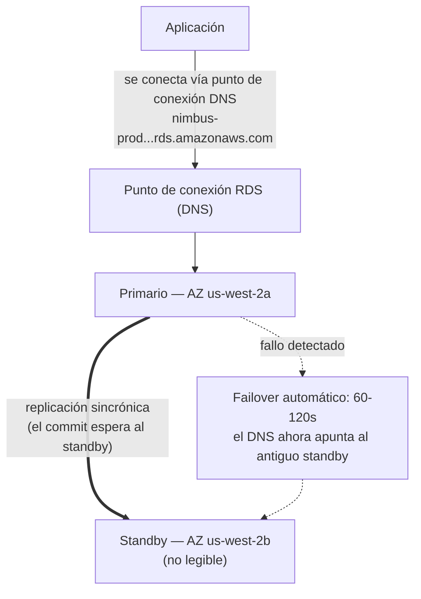

# Capítulo 8: El Administrador de Base de Datos que Nunca Coge la Baja por Enfermedad

Eran las 3 de la madrugada cuando llegó la alerta.

Priya era la única que estaba despierta. Su teléfono se iluminó en la mesita de noche y lo leyó en la oscuridad, con el brillo de la pantalla demasiado alto. Se sentó. Encontró su portátil de memoria y lo abrió sin encender una luz.

El teclado sonaba suavemente en la habitación a oscuras.

El servidor de la base de datos necesitaba un parche de seguridad — del tipo que requería un reinicio. La
vulnerabilidad era real, el parche estaba disponible y la ventana para aplicarlo
sin interrumpir a los clientes era ahora mismo, en medio de la noche, cuando el tráfico
era bajo.

Se conectó al servidor. Descargó el parche. Lo aplicó.

Luego leyó las notas de la versión.

La actualización del paquete afectaba al archivo de configuración que PostgreSQL usa para definir los parámetros de conexión. Las notas de la versión incluían una advertencia: dependiendo de cómo se realizara la actualización, un archivo de configuración personalizado podía ser reemplazado por la versión predeterminada del paquete.

Su archivo de configuración había sido personalizado. Leo lo había editado hace dos meses para ajustar la configuración de max_connections.

El parche se ejecutó. El servidor se reinició. La base de datos volvió a estar en línea.

Priya probó una consulta. Funcionó.

Revisó los registros. Todo parecía normal.

Volvió a la cama a las 4:15 de la madrugada.

A las 9:05 de la mañana, Leo abrió la aplicación y obtuvo un error. Revisó la base de datos. Max connections estaba establecido en el valor predeterminado: 100. Su aplicación estaba configurada para usar pools de conexiones de hasta 500.

Cada nuevo intento de conexión estaba fallando. La aplicación había perdido efectivamente el acceso a la base de datos.

«¿Qué pasó?» preguntó Maya.

«El parche», dijo Priya. Ya estaba mirando el archivo de configuración. «La actualización del paquete sobrescribió nuestro archivo de configuración personalizado con el predeterminado. El ajuste de max_connections de Leo simplemente desapareció — el servidor se reinició con la configuración de fábrica y nadie recibió un error. Volvió silenciosamente al valor predeterminado.»

«¿Cuánto se tarda en arreglarlo?» preguntó Leo.

«Veinte minutos», dijo Priya. «Pero necesitamos una ventana de mantenimiento. Esto requiere un cambio de configuración y un reinicio.»

«Tenemos restaurantes abriendo para el almuerzo en dos horas», dijo Tom.

Priya lo arregló en dieciocho minutos. La ventana de mantenimiento fueron doce minutos de tiempo de inactividad real. Los restaurantes se vieron afectados, pero el pico aún no había empezado.

Por la mañana le contó al equipo lo que había pasado. Hubo un silencio.

«Eso va a volver a ocurrir», dijo Tom.

«Va a ocurrir cada vez que haya un parche», dijo Priya. «Y siempre hay
parches. Tiene que haber una forma mejor de hacer esto.»

Los tiempos de consulta de ocho segundos seguían sin resolverse. Y en la misma semana, esto: una ventana de mantenimiento a las 3 de la madrugada que se convirtió en un incidente matutino. Ambos problemas tenían la misma causa raíz — Nimbus estaba ejecutando una base de datos que no estaban equipados para gestionar.

Había una solución. Solo requería abandonar la idea de que necesitaban gestionar la base de datos
ellos mismos.

**El Problema Tradicional de las Bases de Datos**

Cuando ejecutas una base de datos tú mismo en una instancia EC2, eres responsable de todo.

Instalar el software de la base de datos. Configurarlo de forma segura. Parchearlo cuando se descubren
vulnerabilidades de seguridad. Hacer respaldos. Comprobar que los respaldos realmente funcionan
(un paso que la mayoría de los equipos se salta hasta que es demasiado tarde). Monitorear el espacio en disco. Configurar
la replicación para la redundancia. Configurar el failover para cuando el servidor principal se cae.
Ajustar el rendimiento de las consultas. Gestionar las conexiones bajo carga.

Nada de esto es la aplicación. Nada de esto añade características. Todo requiere experiencia.

El requisito de experiencia es el problema clave. Un administrador de bases de datos cualificado entiende
no solo cómo ejecutar una base de datos, sino cómo:

- Monitorear los registros de consultas lentas e identificar cuellos de botella de rendimiento
- Dimensionar la memoria para el conjunto de trabajo y evitar la E/S de disco
- Configurar el archivado de WAL para la recuperación a un punto en el tiempo
- Configurar la replicación de streaming sincrónica con failover automático
- Ajustar el pooling de conexiones para prevenir el agotamiento de conexiones bajo carga
- Aplicar actualizaciones de versión mayor sin pérdida de datos ni tiempo de inactividad prolongado

Este es un conjunto de habilidades distinto y especializado. Los DBAs senior tienen salarios altos precisamente
porque hacer todo esto bien es difícil. La mayoría de las startups no pueden contratar para ello. La mayoría de los
equipos de desarrollo no lo tienen.

La mayoría de los equipos de desarrollo no son administradores de bases de datos. Esto crea un patrón predecible:
la base de datos se instala, se configura mínimamente y luego se olvida en gran medida hasta que algo
va catastróficamente mal. La instancia PostgreSQL de Nimbus estaba ejecutándose con la configuración
predeterminada — max_connections en 100, sin pooling de conexiones, respaldos manuales que Leo
había ejecutado dos veces y luego olvidado, y sin ninguna replicación.

El incidente del parche de las 3 de la madrugada fue el síntoma de un sistema gestionado por personas que eran excelentes
construyendo aplicaciones y no tenían experiencia en operaciones de bases de datos. Eso no es una
crítica — es una descripción precisa de la mayoría de las startups. La solución no es
contratar a un DBA. La solución es usar un servicio que proporcione operaciones de nivel DBA
automáticamente.

«¿Es eso lo que hicimos?» preguntó Maya.

La respuesta de Leo fue el silencio, que equivalía a sí.

**La Base de Datos Gestionada**

Imagina contratar a un administrador de bases de datos que nunca coge la baja por enfermedad, maneja automáticamente
cada parche de seguridad, hace un respaldo cada noche sin que se lo pidan y se repara
a sí mismo cuando algo se rompe. Hacen todo esto sin molestarte — y
nunca, bajo ninguna circunstancia, tocan la lógica de tu aplicación.

AWS llama a este servicio **RDS** — Relational Database Service.

Con RDS, AWS gestiona:

- Instalar y parchear el motor de la base de datos
- Respaldos automatizados (almacenados en S3, retenidos hasta 35 días)
- Failover automatizado (cuando el primario cae, un standby toma el relevo automáticamente)
- Monitorización y métricas
- Cifrado en reposo y en tránsito
- Autoescalado del almacenamiento (si lo habilitas, el disco crece cuando se llena)

Tú gestionas:

- El esquema de la base de datos (la estructura de tus tablas)
- Tus consultas y lógica de aplicación
- Quién tiene acceso a la base de datos
- Qué tipo de instancia ejecuta la base de datos
- El ajuste de parámetros (aunque RDS proporciona valores predeterminados razonables)

**Motores Admitidos**

RDS admite varios motores de bases de datos populares:

- **MySQL** — la base de datos relacional de código abierto más utilizada
- **PostgreSQL** — potente, extensible, cada vez más popular para cargas de trabajo complejas
- **MariaDB** — bifurcación de MySQL de código abierto, totalmente compatible
- **Oracle** — de nivel empresarial, utilizado en grandes organizaciones con requisitos heredados
- **Microsoft SQL Server** — para entornos con mucho Windows
- **Amazon Aurora** — el propio motor de AWS compatible con MySQL/PostgreSQL, construido para la nube
  (cubrimos Aurora en profundidad en el Capítulo 24)

Para Nimbus, la elección fue PostgreSQL. Era lo que Leo conocía y manejaba bien los datos relacionales.
La elección del motor importa menos de lo que podrías pensar para la mayoría de las aplicaciones —
los beneficios operativos de RDS se aplican independientemente.

Un matiz: cuando ejecutas un motor en RDS, AWS mantiene los parches de versión menor
automáticamente (durante tu ventana de mantenimiento configurada). Las actualizaciones de versión mayor —
pasar de PostgreSQL 14 a 15, por ejemplo — son una operación manual que tú
programas y ejecutas. AWS prueba las actualizaciones de versión mayor cuidadosamente, pero deberías probarlas
primero en un entorno de staging. Los cambios de versión mayor pueden introducir problemas de compatibilidad
con sintaxis SQL específica, extensiones o versiones de drivers.

Leo descubrió esto cuando RDS aplicó un parche menor y el registro de la aplicación mostró brevemente
una advertencia de obsolescencia sobre una función que había sido eliminada en una subversión.
Los parches menores deberían ser esencialmente transparentes — pero monitorear los registros de tu aplicación
después de cada ventana de mantenimiento es una buena práctica.

«¿Hemos pensado en qué pasa si un parche menor rompe algo?» preguntó Priya.

«Volvemos a la instantánea anterior», dijo Leo.

«¿Cuánto tarda eso?»

Leo buscó el tiempo de restauración de RDS para el tamaño de su base de datos. Para una base de datos de 50 GB en una
`db.m6i.large`: aproximadamente 15 a 30 minutos para restaurar desde una instantánea.

«Así que tenemos una ventana de recuperación de 15 a 30 minutos si un parche rompe producción», dijo Priya. «Y aplicamos el parche en la ventana de mantenimiento de la madrugada, así que al menos el impacto es mínimo.»

«Y probamos los parches primero en staging», añadió Leo.

«Sí», dijo Priya. «Eso también.»

**Dimensionamiento de Instancias de RDS: No Todas las Cargas de Trabajo Son Iguales**

Cuando creas una instancia de RDS, eliges un tipo de instancia — el mismo concepto que EC2, pero acotado a las cargas de trabajo de bases de datos. AWS organiza los tipos de instancia de RDS en unos pocos niveles útiles.

**Familia db.t3**: Instancias de rendimiento ampliable (burstable). Diseñadas para desarrollo, staging y cargas de trabajo de producción ligeras que no necesitan CPU alta sostenida. Una `db.t3.micro` es apropiada para una base de datos de desarrollo con poco tráfico. Una `db.t3.medium` maneja una carga de producción moderada con picos ocasionales.

La concesión con las instancias de la serie T: acumulan créditos de CPU durante los períodos de baja utilización y gastan esos créditos durante los picos. Si ejecutas una instancia de la serie T con CPU alta sostenida, agotas los créditos y el rendimiento se reduce a una línea base que puede ser insuficiente.

**Familia db.m6i**: Instancias de propósito general con rendimiento consistente y no ampliable. La `db.m6i.large` es un punto de partida común para las bases de datos de producción. Estas no tienen límites de créditos — la CPU está disponible a plena capacidad siempre que la necesites.

**Familia db.r6i**: Instancias optimizadas para memoria. Más RAM por vCPU que la familia M. Apropiadas para bases de datos con grandes conjuntos de trabajo — consultas que se benefician de que los datos estén en memoria en lugar de obtenerlos del disco en cada acceso. Si el rendimiento de tu base de datos mejora drásticamente cuando añades RAM, la familia R es la elección correcta.

Para Nimbus:

- Desarrollo y staging: `db.t3.medium`. Adecuado para consultas de desarrollo, bajo coste.
- Producción: `db.m6i.large`. Rendimiento consistente, suficiente RAM para el conjunto de trabajo de menú y pedidos, sin reducción por créditos.

«¿Cuánto más cuesta la m6i.large que la t3.medium?» preguntó Tom.

Leo revisó la página de precios. La `db.t3.medium` costaba unos 55 $/mes. La `db.m6i.large` costaba unos 140 $/mes. La diferencia era real, pero también lo era la diferencia de fiabilidad.

«La t3 se reducirá bajo carga sostenida», dijo Priya. «Si tenemos un viernes ajetreado y la CPU se mantiene alta durante cuatro horas, la t3 se queda sin créditos y se reduce. La m6i no.»

Tom anotó el número. También anotó el coste de las averías del viernes de hace dos semanas. La comparación no era reñida.

Producción fue a la `db.m6i.large`.

**Multi-AZ: El Standby que Toma el Relevo**

Esta es la característica que cambia completamente el cálculo de fiabilidad.

El **despliegue Multi-AZ** significa que RDS mantiene una instancia standby sincrónica en una
Zona de Disponibilidad diferente a la del primario. Cada transacción confirmada en el primario
se replica de forma sincrónica en el standby antes de que se confirme la transacción.

Cuando el primario falla — fallo de hardware, interrupción de la AZ, caída del software — RDS
hace failover automáticamente al standby. El registro DNS del punto de conexión de la base de datos
se actualiza. Tu aplicación se reconecta al nuevo primario.

El failover tarda 60-120 segundos. Durante esa ventana, tu aplicación experimentará
errores de conexión. Las aplicaciones bien escritas deben manejar esto con elegancia (reintentos
de conexión con espera progresiva).

El standby no es una réplica de lectura. No sirve tráfico de lectura. Su único propósito es
estar listo para tomar el relevo.



(Nota: la opción de despliegue más reciente **Multi-AZ DB Cluster** mantiene *dos* standbys que
**sí** son legibles y hace failover en ~35 segundos — el examen puede distinguirla del
despliegue clásico de *instancia* Multi-AZ descrito aquí.)

«¿Cuánto cuesta Multi-AZ?» preguntó Tom.

Aproximadamente el doble del coste de una única instancia — porque literalmente estás ejecutando dos
instancias de base de datos. El standby cuesta lo mismo que el primario.

Tom abrió el historial de pedidos y estimó los ingresos por hora durante su pico del viernes.

«¿Y qué pasa si alguien intenta entrar por la fuerza durante la ventana de failover?» preguntó Priya. «Cuando el primario está caído y el standby se está promoviendo, ¿hay sesenta segundos en los que estamos expuestos?»

«El failover es transparente», dijo Maya, «pero la pregunta es justa. Las cadenas de conexión deberían usar el punto de conexión de RDS, no IPs codificadas — de lo contrario el failover no será fluido.»

Multi-AZ se habilitó esa tarde.

**Respaldos Automatizados y Recuperación a un Punto en el Tiempo**

RDS hace respaldos automatizados cada día. AWS almacena estos respaldos en S3 (gestionados por
RDS — no los ves directamente en tu consola de S3). Puedes restaurar la base de datos
a cualquier punto dentro de tu período de retención de respaldos.

Los respaldos se hacen durante una **ventana de respaldo** configurable — un período de tráfico bajo,
típicamente por la mañana temprano. (Esta es una configuración separada de la **ventana
de mantenimiento**, que es cuando RDS aplica parches y cambios de configuración. Al examen
le gusta evaluar que estas son dos ventanas diferentes.) Para la mayoría de los tipos de motor, los respaldos
no causan tiempo de inactividad — y en los despliegues Multi-AZ, la instantánea se toma del
standby, así que el primario no se toca en absoluto.

La **recuperación a un punto en el tiempo** es una de las características más valiosas: puedes restaurar a
cualquier segundo dentro de tu período de retención. No solo instantáneas diarias — *cualquier segundo*.
Esto es posible porque RDS archiva continuamente los registros de transacciones además de
los respaldos diarios.

Si alguien ejecuta accidentalmente `DELETE FROM orders WHERE 1=1` a las 2:37 del mediodía, puedes
restaurar a las 2:36.

Leo se relajó visiblemente cuando entendió esto.

«Ya establecí la retención de respaldos en un día», dijo Leo. «Oh — pero eso está bien, ¿verdad? ¿Podemos cambiarlo?»

«Cámbialo a siete días como mínimo», dijo Priya. «Treinta para producción.»

Leo lo actualizó de inmediato.

«¿Podríamos habernos recuperado de lo que borré el mes pasado?» preguntó.

«¿Antes de RDS? No», dijo Priya. «¿Después de RDS? Sí.»

Puede que te estés preguntando: ¿cuál es la diferencia entre un respaldo automatizado y una instantánea manual? Los respaldos automatizados se eliminan cuando expira el período de retención (hasta 35 días). Las instantáneas manuales se retienen indefinidamente hasta que las eliminas explícitamente. Si necesitas preservar un estado de la base de datos permanentemente — antes de una migración mayor, antes de un despliegue arriesgado — toma una instantánea manual.

**RDS Proxy: Resolver el Problema de Conexiones a Escala**

Dos semanas después de migrar a RDS, Leo notó algo en las métricas.

La base de datos estaba manejando las consultas bien. Pero el número de conexiones abiertas era alto — más alto de lo que esperaba. Con el Auto Scaling Group añadiendo instancias EC2 durante el pico, cada nueva instancia abría su propio pool de conexiones a la base de datos. Diez instancias EC2, cada una con un pool de conexiones de 50: quinientas conexiones simultáneas a la base de datos.

«PostgreSQL tiene una sobrecarga por cada conexión», dijo Priya. «Memoria, CPU para el manejador de conexiones. Quinientas conexiones usan una cantidad significativa de los recursos de la base de datos solo para la gestión de conexiones — antes de haber hecho ningún trabajo real.»

«¿Podemos reducir el tamaño del pool de conexiones?» preguntó Leo.

«Podríamos», dijo Priya. «Pero entonces arriesgamos que las solicitudes se acumulen esperando una conexión durante el pico.»

La mejor solución: **RDS Proxy**.

RDS Proxy se sitúa entre la aplicación y la base de datos. Las instancias EC2 se conectan al Proxy, no directamente a la instancia de RDS. El Proxy mantiene un pool de conexiones a la base de datos y multiplexa las solicitudes de la aplicación a través de ellas. Si diez instancias EC2 abren cada una cincuenta conexiones al Proxy, el Proxy podría mantener solo cien conexiones reales a la base de datos — compartiéndolas eficientemente entre todas las solicitudes de la aplicación.

Los beneficios:

**Pooling de conexiones**: Menos conexiones reales a la base de datos significa menos sobrecarga de memoria en la instancia de RDS y mejor rendimiento bajo carga.

**Failover más rápido**: Durante un failover Multi-AZ, el Proxy mantiene la conexión del lado de la aplicación mientras restablece la conexión a la base de datos en el backend. Las aplicaciones ven una breve pausa en lugar de un reinicio completo de la conexión. RDS Proxy reduce el impacto del failover de 60-120 segundos a típicamente 30 segundos o menos.

**Autenticación IAM**: En lugar de incrustar las credenciales de la base de datos en la aplicación, la aplicación puede autenticarse a RDS Proxy usando un rol de IAM. El Proxy maneja las credenciales reales de la base de datos. Esto elimina los secretos del entorno de la aplicación por completo.

«¿Cuánto cuesta RDS Proxy?» preguntó Tom.

Cuesta aproximadamente 0,015 dólares por hora de vCPU de la instancia de RDS subyacente, facturado por separado de la propia instancia. Para una `db.m6i.large` (2 vCPUs), el Proxy añade aproximadamente 22 $/mes.

Tom miró el gráfico de recuento de conexiones — quinientas conexiones compitiendo por los recursos de la base de datos durante el pico — y miró el coste de 22 $/mes.

«Eso es más barato que actualizar a una instancia de RDS más grande para manejar la sobrecarga de conexiones», dijo.

RDS Proxy se habilitó esa semana.

«¿Y qué pasa si alguien intenta entrar por la fuerza a través del Proxy?» preguntó Priya. «¿La autenticación IAM para el Proxy reduce la superficie de ataque?»

«Sí», respondió Priya a su propia pregunta. «Sin credenciales de base de datos en el entorno de la aplicación, no hay credenciales de base de datos que robar de la aplicación.»

Habilitó la autenticación IAM para el Proxy.

**Réplicas de Lectura: Escalado del Tráfico de Lectura**

Multi-AZ es sobre disponibilidad. Las **réplicas de lectura** son sobre rendimiento.

Una réplica de lectura es una copia asíncrona de tu base de datos principal que puede servir
consultas de lectura. Puedes tener hasta 15 réplicas de lectura para los principales motores de RDS — MySQL, PostgreSQL y MariaDB (Aurora admite hasta 15 réplicas de Aurora también, compartiendo el mismo volumen de almacenamiento).

La aplicación se modifica para enviar consultas de lectura a la réplica y consultas de escritura al
primario. Esto distribuye la carga: el primario maneja las escrituras y las transacciones complejas;
las réplicas manejan las lecturas.

Características clave:

- La replicación es **asíncrona** — puede haber un pequeño retraso (lag) entre el
  primario y la réplica. Si escribes un registro y lo lees inmediatamente desde la réplica,
  puede que no lo veas todavía.
- Las réplicas de lectura pueden estar en la misma Región o en una Región diferente (las réplicas entre Regiones
  añaden latencia pero permiten la distribución geográfica).
- Las réplicas de lectura pueden ser promovidas a bases de datos independientes en un escenario de desastre.

Para Nimbus: las búsquedas de menú son lecturas. El historial de pedidos son lecturas. La gran mayoría del
tráfico es tráfico de lectura. Añadir una réplica de lectura y enrutar las lecturas a ella reduce significativamente
la carga de la base de datos principal.

Cubrimos las réplicas de lectura más exhaustivamente en el Capítulo 24 cuando hablamos de Aurora.

**Si Hay Muchas Lecturas, Entonces Añade una Réplica Pero Vigila el Lag**

Si tu carga de trabajo tiene muchas lecturas, añadir una réplica de lectura reduce la carga del primario y mejora el rendimiento de las consultas — pero la replicación es asíncrona, lo que significa que la réplica puede estar ligeramente por detrás del primario. Si tu aplicación escribe un registro e inmediatamente lo lee de vuelta, debe leer del primario, no de la réplica. Equivocarse en esto produce errores sutiles y difíciles de depurar de frescura de datos: un usuario hace un pedido, la página de confirmación consulta la réplica, la réplica no se ha puesto al día, el pedido parece faltar. Esto se llama consistencia de lectura de lo que escribiste (read-your-writes), y es el error más común que cometen los equipos cuando añaden réplicas por primera vez.

**Performance Insights: Encontrar la Consulta Lenta**

El tiempo de carga del menú de ocho segundos seguía siendo un problema. La mudanza a RDS mejoró la fiabilidad, pero la consulta seguía siendo lenta.

Leo añadió una réplica de lectura y enrutó las consultas de menú a ella. El tiempo de carga del menú bajó a unos cuatro segundos. Mejor. Todavía no bueno.

«La consulta sigue siendo lenta», dijo Maya. «Mejoramos el cuello de botella, pero no lo arreglamos.»

RDS incluye una característica llamada **Performance Insights** — una herramienta de monitorización que muestra qué consultas están consumiendo más recursos de la base de datos, qué sesiones están esperando y qué están esperando.

Leo habilitó Performance Insights en la réplica de lectura y cargó la página del menú repetidamente durante una sesión de prueba por la tarde.

El panel de Performance Insights mostró una consulta dominando la carga: un escaneo completo de la tabla `menu_items`, obteniendo las 22.000 filas cada vez que se cargaba una página de menú. No había ningún índice en `restaurant_id` — la columna por la que la aplicación estaba filtrando.

Tiempo de ejecución sin índice: 8,2 segundos.

Leo añadió el índice.

```sql
CREATE INDEX idx_menu_items_restaurant_id ON menu_items(restaurant_id);
```

Tiempo de ejecución con índice: 14 milisegundos.

De 8.200 milisegundos a 14 milisegundos. La diferencia entre una app de pedidos de restaurante que ahuyenta a los clientes y una que usan sin pensarlo.

«¿Ese fue el problema todo este tiempo?» dijo Maya.

«Ese fue el problema», dijo Leo.

«¿Y Performance Insights lo encontró en cuánto tiempo?»

«Unos veinte minutos.»

Tom ya estaba calculando. Tres semanas de tiempos de carga del menú subóptimos, estimadas 200.000 cargas de página de menú durante ese período, estimado un 15% de abandono debido a la lentitud. El número al que llegó fue incómodo.

«Añade los índices que faltan antes del lanzamiento la próxima vez», dijo.

«Habrá una lista de verificación», dijo Priya. Ya la estaba escribiendo.

**Cuándo No Usar RDS**

RDS es excelente para una amplia gama de cargas de trabajo de bases de datos relacionales. No es la respuesta correcta para todo.

**Cuando necesitas acceso a nivel de SO**: RDS no te da acceso al sistema operativo subyacente. No puedes instalar paquetes de SO personalizados, modificar parámetros del kernel o ejecutar herramientas que requieran acceso root al servidor de la base de datos. Si tu base de datos tiene requisitos que exigen acceso al SO — ciertas configuraciones de Oracle, drivers de almacenamiento personalizados, interfaces de red específicas — necesitas ejecutar la base de datos directamente en una instancia EC2.

**Cuando usas un motor no admitido**: RDS admite MySQL, PostgreSQL, MariaDB, Oracle, SQL Server y Aurora. Si tu aplicación usa un motor de base de datos diferente — CockroachDB, SingleStore, Greenplum — lo ejecutas en EC2, no en RDS.

**Cuando necesitas escalado horizontal con muchas escrituras**: RDS escala las lecturas a través de réplicas. Las escrituras van a una instancia primaria. Si tu carga de trabajo tiene muchas escrituras y necesita distribuirse entre múltiples nodos de escritura, RDS no es la arquitectura correcta. La Base de Datos Global de Aurora puede ayudar a gran escala, pero para requisitos de escala de escritura extrema, las bases de datos distribuidas como DynamoDB (Capítulo 9) o CockroachDB ejecutándose en EC2 son las herramientas apropiadas.

**Cuando el coste gestionado supera el coste operativo**: Para cargas de trabajo muy grandes y estables donde tu equipo tiene experiencia genuina en administración de bases de datos, ejecutar PostgreSQL en EC2 con tus propias herramientas puede ser más barato que RDS. Esto es inusual para los equipos que no son principalmente talleres de DBA. Pero es real, y un buen arquitecto lo reconoce.

Para Nimbus — una startup sin recursos de DBA dedicados, ejecutando PostgreSQL en un servicio gestionado, con crecimiento impredecible — RDS era claramente la elección correcta.

**Grupos de Parámetros y Grupos de Opciones de RDS**

Dos mecanismos de configuración que aparecen en el examen:

Los **grupos de parámetros** controlan la configuración del motor de la base de datos — como el número máximo de conexiones,
el tamaño de la caché de consultas, los valores de tiempo de espera. RDS crea un grupo de parámetros predeterminado que funciona
para la mayoría de los casos. Creas grupos de parámetros personalizados cuando necesitas ajustar configuraciones específicas.

Los **grupos de opciones** habilitan características adicionales para algunos motores — como el cifrado
de red nativo de Oracle o el cifrado de datos transparente de SQL Server. La mayoría de los despliegues
de motores de código abierto no necesitan grupos de opciones personalizados.

Puedes personalizar el comportamiento del motor de la base de datos a través de estos mecanismos — pero los valores predeterminados funcionan para la mayoría de los equipos que empiezan.

### Meter los Datos: AWS Database Migration Service

Unas semanas después, Tom llegó al standup con una diapositiva.

Nimbus estaba adquiriendo un pequeño competidor regional. Su sistema de pedidos se ejecutaba en una base de datos MySQL en una instalación de colocación. El sistema no podía estar fuera de línea durante la migración — los restaurantes lo estaban usando.

«Necesitamos mover sus datos a RDS», dijo Tom. «Sin tirar abajo el sistema.»

«¿Qué tamaño tiene la base de datos?» preguntó Leo.

«Unos 80 gigabytes.»

«¿Cuándo necesitan hacer el cambio?»

«Seis semanas.»

Priya ya había abierto la documentación. «AWS DMS», dijo.

**AWS DMS (Database Migration Service)** mueve datos de una base de datos de origen a una base de datos de destino con un tiempo de inactividad mínimo. Maneja la migración en dos fases: una carga completa de los datos existentes, seguida de una replicación continua de los cambios a medida que el origen sigue ejecutándose.

Hay dos tipos de migración:

**Migración homogénea:** el origen y el destino son el mismo motor — MySQL a RDS MySQL, PostgreSQL a Aurora PostgreSQL. El esquema es compatible; DMS migra los datos directamente.

**Migración heterogénea:** el origen y el destino son motores diferentes — Oracle a Aurora PostgreSQL, SQL Server a RDS MySQL. El esquema debe convertirse primero. Esto requiere **AWS Schema Conversion Tool (SCT)** para traducir el esquema, y luego DMS para mover los datos.

Para la adquisición de Nimbus: MySQL a RDS MySQL. Homogénea. Sin SCT necesario.

Cómo funciona en la práctica:

1. DMS lee del origen — la base de datos MySQL de la colocación
2. **Carga completa**: DMS copia todos los datos existentes a la instancia de RDS de destino
3. **CDC (Change Data Capture, Captura de Datos de Cambio)**: después de la carga completa, DMS lee el registro de transacciones de la base de datos de origen y replica los cambios continuos al destino casi en tiempo real
4. El origen sigue ejecutándose. Cuando el equipo está listo, cambia la cadena de conexión.

«¿Así que el sistema de pedidos del restaurante se mantiene activo todo el tiempo?» preguntó Tom.

«Todo el tiempo», confirmó Priya. «El origen y el destino se mantienen sincronizados vía CDC. Cuando estamos listos, cambiamos el punto de conexión. El tiempo de inactividad son los segundos que tarda en propagarse ese cambio.»

DMS admite docenas de combinaciones de origen y destino: Oracle, SQL Server, MySQL, PostgreSQL, MongoDB, DynamoDB, S3, Redshift, Aurora y más.

«Espera — pero ¿*por qué* necesitamos una herramienta separada para las migraciones heterogéneas?» preguntó Maya. «¿No puede DMS simplemente averiguar las diferencias de esquema?»

«Un VARCHAR en Oracle no es lo mismo que un VARCHAR en PostgreSQL», dijo Priya. «Los tipos de datos, los procedimientos almacenados, las secuencias, las funciones propietarias — no se corresponden uno a uno. SCT analiza el esquema de origen y genera el equivalente más cercano para el destino. DMS luego mueve los datos a ese esquema convertido. Separar la conversión de esquema del movimiento de datos es lo que hace que el proceso sea fiable.»

«¿Y qué pasa si alguien intenta entrar por la fuerza a través de la instancia de replicación de DMS?» se preguntó Priya un momento después. «Necesita acceso de lectura al origen y acceso de escritura al destino.»

«Mínimo privilegio en ambos extremos», dijo Leo. «IAM de solo lectura en el origen. Acceso de escritura acotado solo al destino de la migración. Y la instancia de replicación se queda en la subred privada.»

Priya lo anotó.

## Fortalezas y Limitaciones

**Por qué RDS es excelente**:

- Elimina la carga operativa de gestionar el software de la base de datos
- Respaldos automatizados y recuperación a un punto en el tiempo
- Multi-AZ para failover automático con RTO mínimo
- Réplicas de lectura para escalar el tráfico de lectura
- Cifrado en reposo y en tránsito incorporado
- Todos los principales motores de bases de datos relacionales admitidos
- RDS Proxy para el pooling de conexiones y una respuesta de failover mejorada

**Donde RDS tiene límites**:

- No puedes acceder al SO subyacente. Si tu base de datos tiene requisitos que exigen
  acceso a nivel de SO, puede que necesites ejecutar tu propia base de datos basada en EC2.
- RDS no es serverless (con excepciones — Aurora Serverless existe, cubierto en
  el Capítulo 24). Pagas por una instancia en ejecución incluso si está inactiva.
- RDS no está diseñado para bases de datos fragmentadas horizontalmente. Para un escalado masivo de
  cargas de trabajo relacionales con muchas escrituras, puede que eventualmente necesites una arquitectura diferente.
- Para patrones de datos no relacionales (NoSQL), DynamoDB (Capítulo 9) es más apropiado.

## Resumen

La ventana de parche de las 3 de la madrugada de Priya fue el síntoma. La causa raíz era que Nimbus estaba gestionando una base de datos que un servicio gestionado podía manejar mejor. RDS no solo elimina la llamada de despertador de las 3 de la madrugada — traslada la responsabilidad del parcheo, el failover, los respaldos y la gestión de conexiones a AWS, liberando al equipo para centrarse en el código de la aplicación que realmente sirve a los clientes. La concesión es la pérdida del acceso a nivel de SO, que importa raramente y mucho menos de lo que parece.

- **Amazon RDS** es un servicio de base de datos relacional gestionado. AWS maneja el parcheo, los respaldos, el failover y el almacenamiento. Tú manejas el esquema, las consultas y la lógica de la aplicación.
- **Multi-AZ** mantiene un standby sincrónico en una AZ diferente. El failover automático ocurre en 60-120 segundos. Usa siempre el nombre DNS del punto de conexión de RDS en las cadenas de conexión — no IPs codificadas — para que el failover sea transparente.
- Las **réplicas de lectura** son copias asíncronas que sirven tráfico de lectura. El lag de replicación significa que pueden estar ligeramente por detrás — la consistencia de lectura de lo que escribiste requiere leer del primario inmediatamente después de una escritura.
- **RDS Proxy** agrupa conexiones, reduciendo la sobrecarga y mejorando la velocidad de failover. Crítico para cargas de trabajo basadas en Lambda que pueden crear miles de conexiones de corta duración.
- **Performance Insights** identifica las consultas lentas — encontrar un índice que falta puede transformar una consulta de 8 segundos en una de 14 milisegundos. Las actualizaciones de versión mayor son manuales; pruébalas primero en staging.

## Consejos para el Examen

*Dominio SAA-C03 3 — Tarea 3.3 (soluciones de base de datos)*

- **Multi-AZ es para alta disponibilidad, no para rendimiento.** El standby no sirve
  tráfico de lectura. Las réplicas de lectura son para el rendimiento. Esta distinción se evalúa frecuentemente.
- **El failover Multi-AZ es automático.** No configuras cuándo ni cómo ocurre.
  RDS monitorea el primario y activa el failover automáticamente.
- **El lag de replicación importa.** Las réplicas de lectura pueden estar ligeramente por detrás del primario.
  Si tu aplicación requiere leer datos que acaba de escribir, debe leer del
  primario, no de la réplica. A esto se le llama «consistencia de lectura de lo que escribiste».
- **Los respaldos automatizados se retienen de 0 a 35 días.** Establecer la retención a 0
  deshabilita los respaldos automatizados. Las instantáneas manuales se retienen indefinidamente hasta
  que las eliminas.
- El **autoescalado del almacenamiento de RDS** previene las interrupciones por disco lleno. Actívalo. Solo escala
  hacia arriba, nunca hacia abajo. El examen puede evaluar si conoces esta asimetría.
- **RDS Proxy** aparece en escenarios del examen que involucran funciones Lambda conectándose a RDS
  (Lambda puede crear miles de conexiones de corta duración, que abruman a la base de datos
  sin un Proxy), o escenarios que requieren un failover Multi-AZ más rápido.
- **Las instancias db.t3 hacen ráfagas y se reducen.** Los escenarios del examen que describen degradación
  intermitente del rendimiento en instancias de RDS pequeñas pueden estar describiendo el agotamiento de créditos de CPU
  en instancias de la serie T. La solución es actualizar a una instancia de la serie M o R.
- **Punto de conexión DNS de Multi-AZ**: Cuando ocurre un failover Multi-AZ, el registro DNS del
  punto de conexión de RDS se actualiza para apuntar al nuevo primario. Las aplicaciones que usan el punto de conexión de RDS
  (no una IP codificada) se reconectan automáticamente. Las aplicaciones con TTLs de DNS largos o
  direcciones IP codificadas no se reconectarán automáticamente. Usa siempre el punto de conexión de RDS.
- **Promoción de réplica de lectura**: Una réplica de lectura puede ser promovida a una instancia de BD independiente
  — útil para la recuperación ante desastres si el primario se pierde y Multi-AZ no estaba configurado.
  La promoción es una operación unidireccional: la réplica se convierte en primario y ya no
  está replicando del original. Los escenarios del examen que preguntan sobre «promover manualmente» o
  «convertir una réplica de lectura en primario» involucran esta operación.
- **Performance Insights** identifica las principales consultas SQL por tiempo de espera y uso de CPU.
  Cuando un escenario del examen pregunta cómo diagnosticar consultas lentas en una base de datos de RDS, Performance
  Insights es la respuesta nativa de AWS.
- **RDS vs ejecutar una base de datos en EC2**: El examen a veces presenta esto como una elección.
  RDS proporciona operaciones gestionadas pero limita el acceso a nivel de SO. Las bases de datos basadas en EC2 te dan
  control total pero requieren experiencia de DBA para las operaciones. La frase «se requiere acceso a nivel de SO»
  en un escenario del examen es una señal para elegir EC2 sobre RDS.
- **AWS DMS:** Migra bases de datos con tiempo de inactividad mínimo usando carga completa + CDC. Homogénea (mismo motor) = DMS directamente. Heterogénea (motores diferentes) = SCT para convertir el esquema primero, luego DMS para mover los datos. Disparador del examen: «migrar base de datos con tiempo de inactividad mínimo» o «Oracle a Aurora» → DMS + SCT.

## Ejercicios

**Ejercicio 1 — Recordar**

Con tus propias palabras: ¿cuál es la diferencia entre Multi-AZ y las réplicas de lectura en RDS?
¿Qué problema resuelve cada una?

*(Pista: Una protege contra el tiempo de inactividad; la otra mejora el rendimiento bajo carga intensa de lectura. Resuelven problemas diferentes y se pueden usar juntas.)*

**Ejercicio 2 — Escenario SAA-C03**

*Escenario*: Una empresa ejecuta una base de datos PostgreSQL de producción en RDS. La base de datos
experimenta un alto tráfico de lectura debido a consultas de informes que se ejecutan a lo largo del día.
El equipo también está preocupado por la disponibilidad de la base de datos — no pueden permitirse más de
unos pocos minutos de tiempo de inactividad en un escenario de fallo. Quieren minimizar el impacto en la
base de datos principal de las cargas de trabajo de informes.

¿Qué combinación de características de RDS aborda MEJOR ambas preocupaciones?

A) Habilitar Multi-AZ y ejecutar todas las consultas contra la instancia standby  
B) Tomar instantáneas manuales más frecuentes y restaurar desde ellas si el primario falla  
C) Crear múltiples réplicas de lectura y deshabilitar Multi-AZ para reducir costes  
D) Habilitar Multi-AZ para protección contra failover y crear una réplica de lectura para las consultas de informes

**Pista 1**: Los dos requisitos son: (1) disponibilidad durante un fallo, (2) descargar
las lecturas. ¿Qué características abordan qué requisito?

**Pista 2**: Multi-AZ proporciona failover automático. El standby NO sirve tráfico de lectura.
Por lo tanto, Multi-AZ solo no ayuda con el problema de lectura.

**Pista 3**: Las réplicas de lectura sirven tráfico de lectura. Multi-AZ proporciona failover. Necesitas ambas.

**Respuesta**: D

**Explicación**: Multi-AZ proporciona failover automático a un standby en una AZ diferente —
esto aborda el requisito de disponibilidad. Una réplica de lectura permite que las consultas de informes
se ejecuten sin afectar a la base de datos principal — esto aborda el requisito de rendimiento.
Ambas características se pueden usar simultáneamente.

**¿Por qué no A?** El standby Multi-AZ no puede servir tráfico de lectura. Es exclusivamente para
el failover. Intentar consultarlo directamente no está admitido.

**¿Por qué no B?** Las instantáneas manuales restauran una copia completa de la base de datos — un proceso mucho más
largo (potencialmente horas para bases de datos grandes). Esto no cumple con un requisito de «unos pocos minutos
de tiempo de inactividad».

**¿Por qué no C?** Las réplicas de lectura ayudan con el rendimiento de lectura pero no proporcionan failover
automático. Si el primario falla, tendrías que promover manualmente una réplica de lectura —
lo que lleva tiempo y no es automático.

*Dominio SAA-C03 3 — Tarea 3.3*

**Ejercicio 3 — Desafío de Arquitectura** *(Opcional)*

Nimbus está considerando migrar su base de datos PostgreSQL autogestionada existente
(ejecutándose en una instancia EC2) a RDS PostgreSQL. La migración debe ocurrir
con un tiempo de inactividad mínimo — idealmente menos de 15 minutos. La base de datos tiene 200 GB.

¿Qué enfoque recomendarías? ¿Qué servicios de AWS podrían ayudar con la migración?
¿Qué riesgos comprobarías antes de desviar el tráfico de producción?

*(No hay una única respuesta correcta. Piensa en el AWS Database Migration Service,
la replicación lógica y el riesgo de inconsistencia de datos durante el cambio.)*

## Escena Post-Créditos

Al final del día, Nimbus había migrado a RDS PostgreSQL con Multi-AZ habilitado. La
migración en sí llevó la mayor parte de la tarde — Leo usó un enfoque de respaldo y restauración,
con una breve ventana de mantenimiento.

Tom había estado observando la factura atentamente.

«La instancia de RDS», dijo, «cuesta el doble que la base de datos EC2.»

«¿Y los respaldos automatizados?» preguntó Maya.

«Un poco más.»

«¿Y el failover que obtendremos gratis si el primario muere?»

Tom no tenía un precio para eso. Lo anotó como una pregunta.

Tres días después, la base de datos estaba sana. Los tiempos de consulta habían bajado drásticamente después de que Leo añadiera el índice que faltaba. El menú se cargaba en menos de un segundo.

«El problema», dijo Priya, «no es el motor de la base de datos. Es el modelo de datos.»

Hizo una pausa.

«Algunos de estos datos no son relacionales en absoluto. Los elementos del menú, los perfiles de los restaurantes,
las zonas de entrega — estos datos tienen formas variables. SQL nos está dando problemas.»

Leo ya estaba investigando algo.

«¿Y si usáramos un tipo diferente de base de datos para el menú?» dijo.

En el próximo capítulo: la base de datos que no se ralentiza, aunque un millón de personas pidan a la vez.
