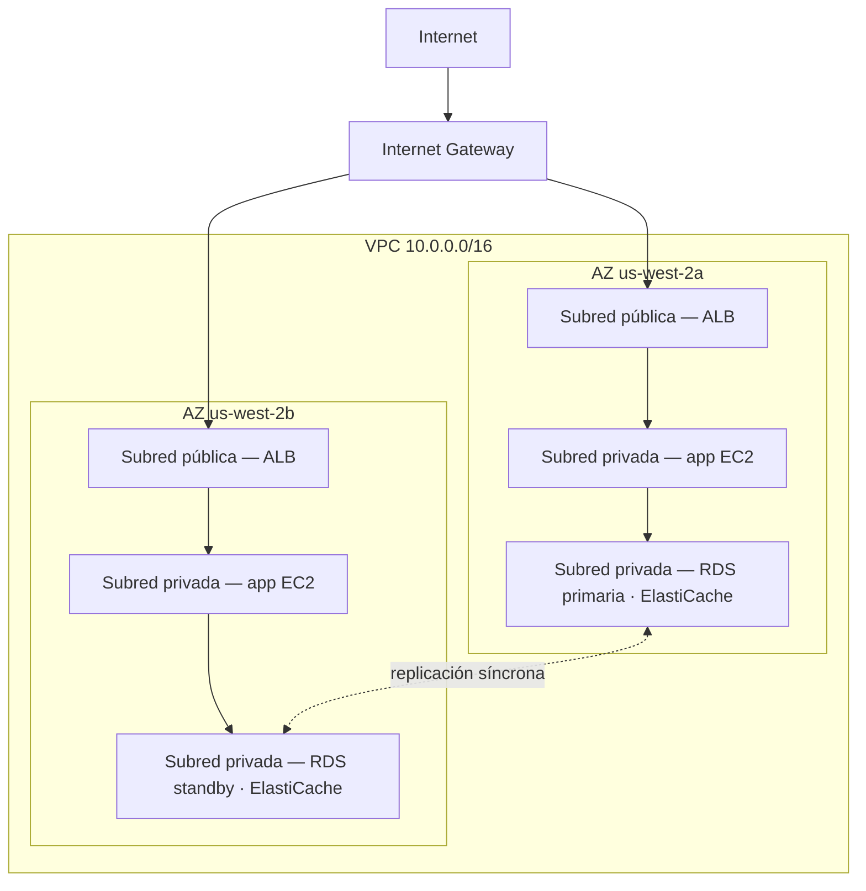

# Capítulo 11: Tu Rincón Privado en la Nube

Priya tenía un papel con un dibujo.

No era un dibujo complicado. Un rectángulo, etiquetado «AWS». Dentro del rectángulo, un grupo de cajas: instancias EC2, una base de datos RDS, un clúster de ElastiCache. Líneas conectando todo con todo. Y fuera del rectángulo, una única etiqueta: «Internet».

Lo puso en el centro de la mesa.

---

*La capa de caché estaba funcionando. Redis había reducido las cargas de página de 188 milisegundos a 12. Pero mientras Leo había estado celebrando esa victoria, Priya había estado leyendo registros de red — y no le gustaba lo que veía. Cada servicio estaba en la misma red plana. La base de datos tenía una dirección IP pública. El clúster de Redis era técnicamente accesible desde fuera. La aplicación funcionaba, pero la arquitectura era un aparcamiento: sin vallas, sin puertas, sin zonas.*

---

«Esto es lo que tenemos», dijo. «Nuestra base de datos tiene una dirección IP pública. Nuestra capa de caché es accesible desde internet. Nuestras instancias EC2 están todas en la misma red plana.»

«Eso parece estar bien», dijo Leo. «Tenemos grupos de seguridad.»

«Grupos de seguridad que tú configuraste», dijo Priya. «Por la noche. Durante la configuración inicial.»

Leo no dijo nada.

«No critico la configuración», dijo. «Digo que cuando todo vive en una red pública plana, una única mala configuración es la diferencia entre un sistema que funciona y uno que es accesible para todo el mundo en internet.»

Cogió un marcador rojo y dibujó un círculo alrededor de la base de datos.

«Esto no debería ser alcanzable desde internet. En absoluto. No a través de una regla de grupo de seguridad, no a través de una configuración reforzada. Debe ser estructuralmente inalcanzable.»

«Necesitamos hablar de arquitectura de red», dijo Maya.

«Necesitábamos hablar de ello hace tres meses», dijo Priya. «Pero ahora está bien.»

El equipo se reunió alrededor de una pizarra por primera vez en semanas.

**El Problema del Aparcamiento Público Abierto**

Imagina un enorme aparcamiento público. Diez mil coches. Cualquier coche puede aparcar en cualquier lugar. No hay barreras entre zonas, no hay puertas, no hay secciones reservadas.

Esta es una red abierta. Cada servicio puede llegar a cada otro servicio. Tu servidor web puede hablar con tu base de datos. Tu base de datos puede llegar a internet. Tu capa de caché puede recibir conexiones de cualquier lugar.

Cuando todo puede hablar con todo, un compromiso afecta a todo.

«Entonces si alguien entra al aparcamiento», dijo Tom, «puede entrar a cualquier coche.»

«Y desde cualquier coche, conducir a cualquier lugar», confirmó Priya. «Queremos vallas. Queremos puertas cerradas. Queremos zonas.»

La VPC es como construyes esas zonas en AWS.

**¿Qué Es una VPC?**

«Espera — pero ¿*por qué* lo haríamos de esa manera?» preguntó Maya. «Si ya tenemos grupos de seguridad en cada recurso, ¿por qué necesitamos una VPC? ¿No están los grupos de seguridad haciendo el mismo trabajo?»

Los grupos de seguridad y las VPCs protegen a diferentes niveles. Un grupo de seguridad es una regla adjunta a un recurso específico — dice «esta instancia EC2 solo acepta tráfico en el puerto 8080 del balanceador de carga». Pero sigue estando en la red pública. La dirección IP sigue siendo alcanzable; la regla solo bloquea la conexión en la puerta. Una VPC quita la puerta de la calle pública por completo. Un recurso en una subred privada no tiene *ruta* a internet — y por convención no tiene IP pública — así que no puede ser alcanzado desde internet, sin importar lo que diga el grupo de seguridad. Eso es una garantía estructural, no de configuración.

Una **Virtual Private Cloud (VPC)** es una sección lógicamente aislada de la nube de AWS — una red privada que defines, a la que solo tus recursos pueden acceder de forma predeterminada.

Piénsalo como un lote privado vallado dentro del enorme aparcamiento público. Tu lote tiene sus propias reglas: quién puede entrar, quién puede salir, qué rutas existen entre secciones.

Cuando creas una VPC, defines:

**Un bloque CIDR**: El rango de direcciones IP disponibles dentro de tu red. Por ejemplo, `10.0.0.0/16` te da 65.536 posibles direcciones IP (de 10.0.0.0 a 10.0.255.255).

**Subredes**: Subdivisiones de tu VPC, cada una asignada a una porción de tu rango de direcciones IP y asociada con una Zona de Disponibilidad específica.

**Tablas de rutas**: Reglas que determinan hacia dónde va el tráfico de red.

**Internet Gateway**: La conexión entre tu VPC y el internet público.

**Subredes: Pública vs Privada**

No todos los recursos deben ser accesibles públicamente.

Tu servidor web necesita aceptar tráfico de internet — los navegadores de los usuarios necesitan llegar a él.

Tu base de datos *nunca* debería aceptar tráfico de internet — solo tu servidor web debería poder hablar con ella.

Aquí es donde entran las subredes.

Una **subred pública** está conectada a un Internet Gateway y puede tener recursos con direcciones IP públicas. El tráfico puede fluir hacia y desde internet.

Una **subred privada** no tiene ruta a internet en su tabla de rutas. Los recursos en una subred privada solo pueden comunicarse con otros recursos en tu VPC (a menos que configures rutas de salida específicas). Por convención, tampoco tienen direcciones IP públicas.

Para Nimbus, el diseño quedó claro:



El balanceador de carga está orientado al público — necesita recibir tráfico de internet. Las instancias EC2 son privadas — solo reciben tráfico del balanceador de carga. Las bases de datos son privadas — solo reciben tráfico de las instancias EC2.

«Entonces para llegar a la base de datos», dijo Tom, «¿alguien tendría que atravesar el balanceador de carga, luego la instancia EC2, luego el grupo de seguridad de la base de datos?»

«Tres capas», confirmó Priya. «Defensa en profundidad.»

---

**El Plan CIDR de Nimbus**

«Espera — pero ¿*por qué* lo haríamos de esa manera?» preguntó Maya, mirando las elecciones de bloques CIDR. «¿Por qué es Priya tan específica con los rangos de direcciones IP? ¿No podemos usar lo que AWS pone por defecto?»

«Porque los bloques CIDR son muy difíciles de cambiar después», dijo Priya. «Y porque si alguna vez conectamos esta VPC a otra VPC, o a una red on-premises, los rangos de IP superpuestos causan fallos de enrutamiento que son dolorosos de depurar.»

Dibujó el plan en la pizarra.

La VPC de Nimbus: `10.0.0.0/16` — 65.536 direcciones en total.

| Subred | CIDR | AZ | Propósito |
|---|---|---|---|
| Pública A | 10.0.0.0/24 | us-west-2a | Balanceadores de carga |
| Pública B | 10.0.1.0/24 | us-west-2b | Balanceadores de carga |
| App Privada A | 10.0.10.0/24 | us-west-2a | Servidores app EC2 |
| App Privada B | 10.0.11.0/24 | us-west-2b | Servidores app EC2 |
| Datos Privados A | 10.0.20.0/24 | us-west-2a | RDS, ElastiCache |
| Datos Privados B | 10.0.21.0/24 | us-west-2b | RDS, ElastiCache |

«¿Por qué no hacer todo un /16?» preguntó Leo.

«Porque las subredes en diferentes AZs no deberían compartir un espacio de direcciones. Cada subred está en una AZ. Si alguna vez hacemos peering de esta VPC con otra, cuanto más granulares seamos, menos probable es que tengamos conflictos. Y cada /24 nos da 251 direcciones utilizables — más que suficiente para cualquier nivel individual.»

«AWS reserva cinco direcciones en cada subred», observó Tom, mirando la documentación. «Por eso son 251, no 256.»

«Correcto. Las primeras cuatro y la última. Dirección de red, router de la VPC, servidor DNS, uso futuro, broadcast.»

«¿Así que /24 es lo más pequeño que usarías?»

«En la práctica. Usarías /28 para subredes muy pequeñas — como una subred de gateway de VPN, que solo necesita un puñado de IPs. Pero para los niveles de aplicación, /24 es un mínimo razonable.»

Tom anotó los números y calculó la diferencia de coste mensual entre tamaños. Siempre lo hacía.

---

**Errores de Planificación de CIDR que Evitar**

«¿Hemos pensado en lo que pasa si nos quedamos sin espacio en una subred?» preguntó Priya. No preguntaba porque no lo supiera. Preguntaba porque el resto del equipo necesitaba interiorizar la respuesta.

Leo lo pensó. «¿Podemos añadir más subredes?»

«Puedes añadir subredes a una VPC. Pero no puedes redimensionar una subred existente. Si tu subred de app privada se llena — 251 direcciones no son suficientes — necesitarías crear una nueva subred y migrar instancias a ella.»

«¿Con qué frecuencia pasa eso realmente?»

«Raramente, si planificas bien. Pero la gente comete tres errores comunes.»

Los enumeró:

**Error uno**: Usar un CIDR de VPC demasiado pequeño. Si usas `10.0.0.0/24` para toda la VPC (254 direcciones), te quedarás sin espacio antes de terminar de planificar las subredes. Empieza con `/16` para tener flexibilidad.

**Error dos**: Usar CIDRs superpuestos entre VPCs. Si tu VPC de producción es `10.0.0.0/16` y tu VPC de staging también es `10.0.0.0/16`, nunca podrás hacer peering entre ellas ni conectarlas a través de un transit gateway. Los routers no sabrán a qué VPC enviar el tráfico.

**Error tres**: No reservar espacio de direcciones para niveles futuros. El plan de Nimbus dejó `10.0.30.0/24` y `10.0.31.0/24` sin asignar — espacio para un futuro nivel de herramientas internas, una subred de monitorización o una subred de endpoint de VPN, sin tener que reestructurar todo el espacio de direcciones.

«Planifica para el doble de lo que crees que necesitas», dijo Priya. «Las subredes son gratis. El espacio de direcciones IP de un `/16` es abundante. El coste de planificar mal es una migración de red.»

---

**El NAT Gateway: Subredes Privadas que Todavía Pueden Descargar Cosas**

Las subredes privadas no pueden llegar a internet. Pero a veces lo necesitan. Tu instancia EC2 necesita descargar una actualización de software. Tu aplicación necesita llamar a una API externa.

Aquí es donde entra el **NAT Gateway** (Traducción de Direcciones de Red).

Un NAT Gateway se sienta en una subred pública. Los recursos en subredes privadas pueden enviar tráfico de salida al NAT Gateway, que lo retransmite a internet — pero internet no puede iniciar conexiones de vuelta.

Es como una puerta giratoria de sentido único. Puedes salir. Nadie de fuera puede entrar.

«¿Cuánto cuesta eso al mes?» preguntó Tom.

Los precios del NAT Gateway tienen dos componentes: un cargo por hora para cada NAT Gateway, más una tarifa de procesamiento de datos por GB.

En el momento en que Nimbus configuró esto, eso era aproximadamente $32/mes por NAT Gateway, más $0,045 por GB de datos procesados. Para volúmenes de tráfico pequeños, el coste fijo domina. A escala, los cargos de datos pueden ser sustanciales.

Tom configuró una alerta de facturación para los costes de procesamiento de datos antes de terminar la configuración del NAT Gateway. Había visto cómo se veían los costes de datos de AWS cuando nadie los vigilaba.

La sorpresa que pillaba desprevenidos a los equipos: cada byte que fluye a través de un NAT Gateway se cobra. Si tus instancias EC2 en subredes privadas están descargando grandes paquetes de software, transmitiendo registros a servicios externos o enviando datos significativos a APIs externas, los cargos de datos del NAT Gateway aparecen en la factura como una sorpresa. La solución para el tráfico de AWS a AWS: los Endpoints de VPC enrutan el tráfico a los servicios de AWS (S3, DynamoDB) de forma privada, evitando el NAT Gateway por completo y eliminando esos cargos de datos.

«Entonces las instancias EC2 en la subred privada descargan actualizaciones del SO a través del NAT Gateway», dijo Tom. «¿Esas actualizaciones son cuántos gigabytes?»

«Por instancia, por mes, quizás de dos a cinco GB», dijo Leo.

«Por diez instancias. Por doce meses. A $0,045 por GB—»

«De once a veintisiete dólares al año», terminó Priya. «En este caso, aceptable.»

«Pero si estuviéramos transmitiendo registros — como enviar todos nuestros registros de aplicación a un servicio de observabilidad externo—»

«Los enrutaríamos a través de un Endpoint de VPC o usaríamos CloudWatch Logs en lugar de salir a través de NAT.»

Tom cerró la calculadora. Las cuentas estaban suficientemente claras.

### Instancia NAT: La Alternativa Económica

«Espera», dijo Tom, todavía mirando la página de precios. «¿Estamos pagando por gigabyte solo para dejar que las instancias privadas lleguen a internet? ¿Esa es la única opción?»

«Es la opción gestionada», dijo Priya. «Hay una forma más antigua, pero viene con concesiones.»

Antes de que existiera el NAT Gateway, los equipos lograban el mismo enrutamiento de salida con una instancia EC2 normal — una «instancia NAT». Lanzabas una instancia EC2 en una subred pública, habilitabas el reenvío de IP en el SO, deshabilitabas la comprobación de origen/destino (que AWS habilita por defecto para descartar paquetes no dirigidos a la instancia) y apuntabas la tabla de rutas de la subred privada a la ENI de la instancia. El tráfico de las instancias privadas fluiría a través de ella hacia internet, igual que un NAT Gateway.

Todavía funciona. AWS todavía lo documenta. Y con volúmenes de tráfico muy bajos — un único entorno de desarrollo donde un puñado de instancias descargan paquetes ocasionalmente — una instancia NAT `t3.micro` puede costar menos de cinco dólares al mes, frente al cargo fijo por hora más las tarifas por GB del NAT Gateway.

| | NAT Gateway | Instancia NAT |
|---|---|---|
| Gestión | Totalmente gestionado por AWS | Tú gestionas la EC2 |
| Disponibilidad | Redundante dentro de la AZ | EC2 única — punto único de fallo |
| Ancho de banda | Hasta 100 Gbps, escala automáticamente | Limitado por el tipo de instancia EC2 |
| Coste | $0,045/GB + cargo por hora | Solo el coste de la instancia EC2 |

La ventaja de coste desaparece rápidamente. Con volúmenes de tráfico significativos, el cargo por GB del NAT Gateway es competitivo con el tipo de instancia EC2 que necesitarías para manejar ese ancho de banda — y el NAT Gateway no requiere parcheo, ni monitorización, ni respuesta a incidentes cuando falla (no falla).

«¿Entonces cuándo usaríamos realmente una instancia NAT?» preguntó Leo.

«Un entorno de desarrollo desechable», dijo Priya. «En algún lugar donde ejecutas una o dos instancias, haces actualizaciones de paquetes ocasionales y quieres minimizar el coste fijo. Las cargas de trabajo de producción — cualquier cosa que necesite estar disponible — NAT Gateway, uno por AZ.»

El examen evalúa esta concesión por su nombre. El patrón: «minimizar el coste de NAT en un entorno de desarrollo o prueba con poco tráfico» apunta hacia la Instancia NAT. «Carga de trabajo de producción que requiere alta disponibilidad» apunta hacia el NAT Gateway desplegado por AZ.

Quizás te estés preguntando: si los grupos de seguridad ya existen y bloquean el tráfico por defecto, ¿por qué una VPC con subredes privadas añade una protección significativa? Porque «bloqueado por un grupo de seguridad» y «estructuralmente inalcanzable» son cosas diferentes. Una mala configuración de grupo de seguridad — una regla incorrecta, un puerto abierto — puede exponer un recurso que tiene una IP pública. Un recurso en una subred privada no tiene una IP pública que alcanzar en primer lugar. Tendrías que comprometer el balanceador de carga y una instancia EC2 en ejecución antes de poder siquiera intentar llegar a la base de datos. Las subredes privadas imponen el aislamiento a nivel de red, no a nivel de regla.

**Tablas de Rutas: Cómo el Tráfico Encuentra su Camino**

Cada subred tiene una **tabla de rutas** que indica al tráfico hacia dónde ir.

Una tabla de rutas de subred pública típica se ve así:

| Destino     | Objetivo                    |
|-------------|-----------------------------|
| 10.0.0.0/16 | local                       |
| 0.0.0.0/0   | igw-xxxx (Internet Gateway) |

La primera regla: el tráfico a cualquier IP en tu rango de VPC permanece local. La segunda regla: todo el demás tráfico (`0.0.0.0/0` significa «todo») va al Internet Gateway.

Una tabla de rutas de subred privada:

| Destino     | Objetivo               |
|-------------|------------------------|
| 10.0.0.0/16 | local                  |
| 0.0.0.0/0   | nat-xxxx (NAT Gateway) |

El tráfico de la subred privada permanece local o sale a través del NAT Gateway. No hay ruta directa al Internet Gateway.

**Grupos de Seguridad vs NACLs (Vista Previa)**

Dentro de la VPC, tienes dos herramientas para controlar el tráfico a nivel de recurso:

Los **Grupos de Seguridad** (el Capítulo 15 lo cubre en profundidad) actúan como cortafuegos virtuales para recursos individuales — una instancia EC2, una instancia RDS, un balanceador de carga. Son *stateful* (con estado): si se permite el tráfico de entrada, el tráfico de respuesta se permite automáticamente de salida.

Las **ACLs de Red (NACLs)** operan a nivel de subred y son *stateless* (sin estado): debes permitir explícitamente tanto el tráfico de entrada como el de salida por separado.

Para la mayoría de los casos de uso, los Grupos de Seguridad son suficientes. Las NACLs añaden una capa extra cuando necesitas controles a nivel de subred — por ejemplo, bloquear un rango de IP específico para que nunca llegue a una subred.

«Grupos de seguridad a nivel de instancia», escribió Leo en la pizarra. «NACLs a nivel de subred.»

«Y nunca dejes el puerto 22 abierto a 0.0.0.0/0», añadió Priya, mirando a Leo.

«Eso fue una vez», dijo Leo.

«Siempre es exactamente una vez», dijo Priya, «hasta que deja de serlo.»

«¿Y qué pasa si alguien intenta entrar a la fuerza?» dijo Priya, todavía en la pizarra. «No a través de un grupo de seguridad mal configurado — ¿qué pasa si comprometen el balanceador de carga en sí? ¿Qué les impide pivotar a la subred privada?»

«Las instancias EC2 de la subred privada solo aceptan tráfico del grupo de seguridad del balanceador de carga», dijo Leo. «Incluso si el balanceador de carga está comprometido, el atacante solo puede hacer solicitudes que parezcan llamadas a la API normales.»

«Y la base de datos solo acepta tráfico del grupo de seguridad de EC2», dijo Priya. «Defensa en profundidad. Cada capa asume que la anterior podría fallar.»

---

**VPC Flow Logs: Ver lo que Está Pasando**

«Necesitamos ojos en la red», dijo Priya, tres días después del rediseño de la VPC.

«Tenemos grupos de seguridad y NACLs», dijo Leo. «El tráfico está controlado.»

«Controlado no significa visible. Si pasa algo raro — un intento de conexión inesperado, tráfico a un puerto extraño — ¿cómo lo sabemos?»

Los VPC Flow Logs capturan metadatos sobre el tráfico de red que fluye a través de tu VPC. No el contenido de los paquetes — solo la información a nivel de conexión: IP de origen, IP de destino, puerto, protocolo, recuento de paquetes, recuento de bytes, hora de inicio, hora de fin y si el tráfico fue aceptado o rechazado.

Una entrada típica de flow log se ve así:

```
2 123456789012 eni-0abc123 10.0.10.5 10.0.20.8 49321 5432 6 20 4320 1620000000 1620000060 ACCEPT OK
```

Esto te dice: de `10.0.10.5` (una instancia EC2 en la subred de app) a `10.0.20.8` (la instancia RDS), puerto 5432 (PostgreSQL), 20 paquetes, 4.320 bytes, aceptado. Tráfico normal.

Pero unos días después de habilitar los Flow Logs, Priya encontró esto:

```
2 123456789012 eni-0abc123 185.220.101.55 10.0.10.5 0 8080 6 1 40 1620003200 1620003201 REJECT OK
```

Una IP externa — `185.220.101.55` — había intentado una conexión a la instancia EC2 en el puerto 8080. La conexión fue rechazada por el grupo de seguridad. Pero el intento quedó registrado.

Buscó la IP. Pertenecía a un bloque de direcciones rumano conocido por el escaneo automatizado — el tipo de sondeo de ruido de fondo que recibe constantemente cada IP pública en internet.

«Alguien nos está sondeando», dijo.

«Pero siendo rechazado», dijo Leo.

«Esta vez. Habilita GuardDuty» — un servicio de detección de amenazas que conoceremos como es debido en el Capítulo 17 — «antes de continuar. Necesitamos detección de comportamiento, no solo bloqueo perimetral.»

Los Flow Logs se almacenan en CloudWatch Logs o S3. Se pueden consultar usando CloudWatch Insights o Athena. Priya configuró una consulta de CloudWatch Insights que se ejecutaba cada noche y marcaba cualquier intento de conexión rechazado desde rangos de IP no pertenecientes a AWS.

«¿Cuánto cuesta eso al mes?» preguntó Tom.

«Los flow logs se cobran por GB de datos ingeridos en CloudWatch o S3. A nuestro volumen de tráfico, probablemente de ocho a quince dólares al mes.»

Tom hizo una pausa. «Y la alternativa es no saber que alguien está sondeando nuestra red.»

«Sí.»

«Eso está bien», dijo, y abrió la consola.

**Leer un Escaneo de Puertos en los Flow Logs**

Dos semanas después de habilitar los flow logs, Priya ejecutó su consulta nocturna de CloudWatch Insights y encontró algo nuevo. No una conexión rechazada — docenas, en rápida secuencia, desde la misma IP de origen, a través de puertos consecutivos.

```
185.220.101.55 → 10.0.10.5 port 22   REJECT
185.220.101.55 → 10.0.10.5 port 23   REJECT
185.220.101.55 → 10.0.10.5 port 25   REJECT
185.220.101.55 → 10.0.10.5 port 80   REJECT
185.220.101.55 → 10.0.10.5 port 443  REJECT
185.220.101.55 → 10.0.10.5 port 3306 REJECT
185.220.101.55 → 10.0.10.5 port 5432 REJECT
185.220.101.55 → 10.0.10.5 port 6379 REJECT
```

Todo dentro de una ventana de cinco segundos. Todo rechazado.

«Eso es un escaneo de puertos», dijo Priya. «Alguien está sondeando qué servicios está ejecutando esta instancia.»

«Pero todo rechazado», dijo Leo. «Así que el grupo de seguridad está haciendo su trabajo.»

«El grupo de seguridad está haciendo su trabajo. El escaneo sigue siendo informativo para el atacante — le dice qué puertos *no* rechazaron dentro de un tiempo de espera, lo que significa que esos puertos están abiertos en algún lugar. Y le dice que este host está vivo y vale la pena investigarlo.»

«¿Qué hacemos?»

«Dos cosas», dijo Priya. «Primero: añadir una regla NACL para bloquear el rango /24 al que pertenece esa IP. No solo esa IP — toda la subred. Los escáneres de puertos rotan IPs dentro de un rango. Segundo: añadir una alarma de CloudWatch que se dispare cuando cualquier IP de origen genere más de diez conexiones rechazadas en sesenta segundos. Ese patrón es casi siempre un escaneo.»

Configuró ambas. La alarma se disparó dos veces la semana siguiente — una desde el mismo rango rumano, otra desde un escáner automatizado con base en Singapur. Ambas fueron bloqueadas en la NACL en minutos tras la detección.

Los flow logs no detienen los ataques. Hacen los ataques visibles. Y a los ataques visibles se les puede responder. La alternativa — tráfico fluyendo de forma invisible — significa que la primera señal de un problema es el daño, no el intento.

---

**La Trampa del NAT Gateway Único**

Tres meses después del rediseño de la VPC, Priya ejecutó una simulación de fallo. Quería saber qué le pasaría a Nimbus si la zona de disponibilidad `us-west-2a` experimentara una interrupción.

La mayor parte estuvo bien. El balanceador de carga conmutó a las instancias en `us-west-2b`. El standby de RDS en `us-west-2b` ya estaba activo. ElastiCache promovió la réplica. La aplicación siguió sirviendo solicitudes.

Entonces Leo notó que sus instancias EC2 en `us-west-2b` habían dejado de recibir notificaciones de actualización del SO. Comprobó la configuración del NAT Gateway.

Había uno. En `us-west-2a`.

«Todo el tráfico de internet de salida de las subredes privadas en ambas AZs se enruta a través de un NAT Gateway en una AZ», dijo Priya.

«Entonces si `us-west-2a` cae—»

«Cada instancia EC2 en `us-west-2b` pierde el acceso a internet de salida. No pueden descargar actualizaciones. No pueden llegar a APIs externas. Las búsquedas de Secrets Manager que no estén en caché fallarán. Cualquier cosa que requiera internet de salida se romperá.»

La solución: un NAT Gateway por AZ. Las subredes privadas de cada AZ enrutan el tráfico de salida al NAT Gateway en la misma AZ. Cuando una AZ falla, solo se ve afectado el tráfico de esa AZ.

«¿Y la etiqueta de precio de esa solución?» preguntó Tom.

«Treinta y dos dólares extra al mes por el NAT Gateway de la segunda AZ.»

Tom estuvo callado por un momento.

«Que la capacidad de EC2 en `us-west-2b` no pueda llegar a las APIs externas durante una interrupción», dijo Priya, «cuesta más de treinta y dos dólares.»

Tom aprobó el cambio.

Este es uno de los errores de diseño de VPC más comunes: un NAT Gateway que parece altamente disponible pero que en realidad es un punto único de fallo. Si tienes recursos en tres AZs y un NAT Gateway, tienes resiliencia de cómputo de tres AZs pero resiliencia de red de una AZ. Las dos no coinciden.

La regla: un NAT Gateway por AZ, en la subred pública de esa AZ. La tabla de rutas privada de cada AZ apunta a su propio NAT Gateway. El coste es modesto. La mejora de disponibilidad es real.


---

**Peering de VPC: Conectar Redes Privadas**

¿Y si Nimbus crece hasta tener múltiples VPCs? (Esto pasa. Los equipos crecen. Los servicios se aíslan en cuentas separadas.)

El **Peering de VPC** permite que dos VPCs se comuniquen de forma privada como si estuvieran en la misma red. El tráfico no sale de la red privada de AWS.

Límites importantes:

- El peering de VPC no es transitivo. Si la VPC A hace peering con la VPC B y la VPC B hace peering con la VPC C, A y C no pueden comunicarse — a menos que añadas un par directo A-C.
- Los bloques CIDR no pueden superponerse entre VPCs con peering.

Para arquitecturas más grandes con muchas VPCs, **AWS Transit Gateway** (Capítulo 25) maneja el enrutamiento transitivo sin requerir una malla completa de conexiones de peering.

---

**AWS PrivateLink: Acceso Privado a los Servicios de AWS**

«¿Qué pasa con llegar a S3 desde la subred privada?» preguntó Leo. «Nuestras instancias EC2 escriben recibos en S3. Ahora mismo ese tráfico sale a través del NAT Gateway.»

«Endpoints de VPC», dijo Priya. «Específicamente, los Gateway Endpoints para S3 y DynamoDB — son gratis.»

Un **Endpoint de VPC** crea una conexión privada entre tu VPC y un servicio de AWS, evitando por completo el internet público. El tráfico entre tu subred privada y el servicio de AWS permanece en la red de AWS. Sin cargo de NAT Gateway. Sin exposición a internet.

Para S3 y DynamoDB, los **Gateway Endpoints** son gratis y fáciles: añade una entrada a la tabla de rutas que apunte el tráfico de S3/DynamoDB al endpoint en lugar de al NAT Gateway.

Para otros servicios de AWS (Secrets Manager, KMS, SNS, SQS), los **Interface Endpoints** crean una interfaz de red elástica (ENI) en tu subred con una dirección IP privada. El tráfico al servicio va a esa IP privada. Los interface endpoints cuestan dinero — aproximadamente $0,01/hora **por cada AZ en la que se aprovisiona el endpoint** (un endpoint con ENIs en tres AZs cuesta tres veces la tarifa por hora), más unos $0,01/GB de datos procesados — pero eliminan la necesidad de enrutar llamadas a la API sensibles (como las búsquedas de Secrets Manager) a través de un NAT Gateway o por el internet público.

«Así que nuestras instancias EC2 pueden llegar a S3, DynamoDB, Secrets Manager y KMS», dijo Priya, «todo desde la subred privada, sin ninguna exposición a internet, y para S3 y DynamoDB, sin ningún cargo de datos del NAT Gateway.»

Tom recalculó. El ahorro en el tráfico de S3 compensaría el coste del Interface Endpoint de Secrets Manager en unos pocos meses.

«PrivateLink es el nombre general», añadió Priya. «AWS PrivateLink es la tecnología subyacente de los Interface Endpoints. El examen usa ambos términos.»

---

**Una Lista de Comprobación de Depuración**

Tres meses después del rediseño de la VPC, Leo rompió la red. No de forma dramática — había modificado una asociación de tabla de rutas y desconectado accidentalmente la subred de app privada de su ruta al NAT Gateway.

Las instancias EC2 no podían llegar a las APIs externas. Podían llegarse entre sí, y podían llegar a las bases de datos. Solo que no a internet. Las llamadas HTTPS de salida empezaron a fallar.

Pasó cuarenta minutos solucionando el problema antes de que Priya le entregara una lista de comprobación.

«Cuando algo no llega a otra cosa en una VPC, comprueba esto en orden», dijo.

1. **Grupo de seguridad del origen**: ¿Es correcta la regla de salida? ¿Permite el tráfico que intentas enviar?
2. **Grupo de seguridad del destino**: ¿Es correcta la regla de entrada? ¿Permite el tráfico del origen?
3. **NACL de la subred de origen**: ¿Hay una regla de denegación de entrada bloqueando el tráfico de respuesta? ¿Hay una regla de permiso de salida?
4. **NACL de la subred de destino**: ¿Hay una regla de permiso de entrada? ¿Hay una regla de permiso de salida para las respuestas?
5. **Tabla de rutas de la subred de origen**: ¿Tiene una ruta al destino? ¿La ruta apunta al objetivo correcto (NAT Gateway, IGW, Endpoint de VPC)?
6. **Tabla de rutas de la subred de destino**: ¿Tiene una ruta de vuelta al origen?
7. **Política del Endpoint de VPC**: Si usas un Endpoint de VPC, ¿permite la política del endpoint la acción?
8. **Permisos de IAM**: ¿Tiene el rol de EC2 permiso para llamar al servicio? (Para las llamadas a la API de AWS)

Leo lo encontró en el paso 5. La tabla de rutas se había reasociado a la subred privada incorrecta. La ruta al NAT Gateway faltaba.

«Si hubiera tenido esta lista hace tres meses», dijo, «lo habría encontrado en cinco minutos.»

«La tendrás de ahora en adelante», dijo Priya.

## Direct Connect: La Línea Dedicada

Tres meses después del rediseño de la VPC, Nimbus cerró un acuerdo con Harborview Dining Group — una cadena empresarial de cien locales que procesaba dos millones de dólares en transacciones al día.

La llamada de revisión técnica empezó bien. Luego su responsable de cumplimiento se quitó el silencio.

«No podemos enrutar datos de transacciones de producción por el internet público», dijo. «Nuestros auditores requieren una ruta de red dedicada, privada y auditable entre nuestro centro de datos y cualquier entorno de nube. Site-to-Site VPN no es aceptable. Comparte ancho de banda con todos los demás. Viaja por los mismos cables que el tráfico de los consumidores.»

Tom miró a Leo. Leo miró a Priya.

«Para ser precisos», dijo Priya con cuidado, «PCI DSS en sí no prohíbe una VPN cifrada sobre internet — el transporte cifrado satisface el estándar. Lo que describes es la política interna de tus auditores, que es más estricta. Eso es legítimo. Y hay un servicio para ello.»

**AWS Direct Connect** es una conexión de red física dedicada entre tu centro de datos on-premises y AWS. La conexión evita por completo el internet público — tu tráfico nunca toca infraestructura compartida, nunca compite por ancho de banda con nadie más y nunca viaja por un cable que no sea tuyo.

Configurar Direct Connect significa trabajar con AWS y un proveedor de colocación o de red para instalar una interconexión física (cross-connect) en una ubicación de Direct Connect — un centro de datos donde AWS tiene equipo dedicado. Una vez que el enlace físico está en su lugar, estableces interfaces virtuales sobre él que se conectan a tu VPC o a los servicios de AWS directamente.

**Las características clave:**

El ancho de banda viene en dos formas. Las *conexiones dedicadas* van directo al hardware de AWS: 1 Gbps, 10 Gbps o 100 Gbps. Las *conexiones alojadas* van a través de un Partner de AWS y ofrecen opciones más granulares desde 50 Mbps hasta 10 Gbps — útil cuando no necesitas un puerto dedicado completo.

La latencia es consistente. Como no estás compitiendo por ancho de banda de internet, el tiempo de ida y vuelta a AWS es predecible. Para Harborview, cuyos sistemas de punto de venta hacían cientos de llamadas a la API por transacción, una latencia consistente inferior a 5 ms era la diferencia entre un checkout de 200 ms y uno de 400 ms.

La privacidad es estructural, no de configuración. Una Site-to-Site VPN está cifrada, pero todavía atraviesa el internet público — la misma infraestructura física usada por todos los demás. El tráfico de Direct Connect nunca toca el internet público. Para el equipo de cumplimiento de Harborview, ese era el requisito, y ninguna cantidad de configuración de VPN lo satisfaría.

El coste es más alto que la VPN. Pagas un cargo por hora de puerto por la conexión de Direct Connect más el precio de transferencia de datos. La conexión no es barata, y tarda de semanas a meses en aprovisionarse — la instalación de una interconexión física no es algo que pongas en marcha un viernes por la tarde.

«Un momento», dijo Maya. «Si la VPN está cifrada, ¿por qué importa que vaya por el internet público?»

Porque el requisito de cumplimiento no es solo sobre el cifrado — es sobre el aislamiento. La VPN cifra el contenido del tráfico, pero el tráfico sigue atravesando infraestructura física compartida. Cualquiera que controle un router en el camino puede ver los paquetes cifrados, grabarlos e intentar descifrarlos más tarde. Un enlace físico dedicado no tiene routers compartidos. El camino es físicamente tuyo. Para industrias con requisitos estrictos de soberanía de datos — finanzas, salud, gobierno — esa distinción es la diferencia entre conforme y no conforme.

«Una cosa más», dijo Priya. «Direct Connect es privado por defecto, pero no cifrado por defecto. Si quieres ambos — privado y cifrado — ejecutas una VPN IPSec sobre la conexión de Direct Connect. Eso te da ancho de banda dedicado más cifrado. Ambos.»

Tom ya había encontrado la página de precios. Miró el compromiso mensual para una conexión Dedicada de 1 Gbps.

«El volumen diario de $2M de Harborview significa que esto se paga solo con errores de redondeo», dijo.

Envió la propuesta.

---

> **Consejo para el Examen — Direct Connect vs. VPN**
>
> *Dominio SAA-C03: Diseñar Arquitecturas Seguras (Dominio 1)*
>
> - **VPN:** cifrada, rápida de aprovisionar (minutos), viaja por el internet público, ancho de banda y latencia variables.
> - **Direct Connect:** enlace físico dedicado, ancho de banda y latencia consistentes, privado (el tráfico nunca toca el internet público), pero no cifrado por defecto. Tarda de semanas a meses en aprovisionarse.
> - **Cifrado Y privado:** ejecuta una VPN IPSec sobre Direct Connect. Obtienes tanto ancho de banda dedicado como cifrado.
> - **Desencadenante del examen:** «ancho de banda consistente, privado y dedicado a AWS» o «el cumplimiento requiere que el tráfico no viaje por el internet público» → Direct Connect. «Cifrado Y privado» → Direct Connect + VPN IPSec. «Rápido de configurar, menor coste, aceptable usar internet público» → Site-to-Site VPN.
> - **El coste y el tiempo de configuración** son las concesiones que evalúa el examen: VPN = rápida + barata; Direct Connect = lenta de aprovisionar + cara + consistente.

---

### Client VPN: Acceso Remoto para Usuarios Individuales

Direct Connect y Site-to-Site VPN conectan redes — una oficina o centro de datos entero a AWS. Pero los ingenieros también necesitan conectar portátiles individuales a una VPC: para depurar una instancia EC2 privada, consultar una base de datos RDS privada o acceder a herramientas internas desde casa.

«¿No tenemos ya esto?» preguntó Maya. «Tenemos un bastion host. ¿No puede Leo simplemente hacer SSH a través de él?»

«Para SSH, sí», dijo Priya. «Pero ¿qué pasa si Leo necesita conectarse a la instancia RDS desde una GUI de base de datos en su portátil? ¿O consultar el panel de métricas interno por HTTP? El bastion solo maneja SSH. Client VPN funciona para cualquier protocolo.»

**AWS Client VPN** es un endpoint de VPN gestionado que permite a usuarios individuales conectarse a tu VPC desde cualquier dispositivo, desde cualquier lugar. Los usuarios instalan un cliente OpenVPN estándar en su portátil; el endpoint de VPN está en AWS.

Características clave:

- Gestionado por AWS — no ejecutas un servidor VPN
- Basado en OpenVPN — funciona con cualquier cliente OpenVPN estándar
- Autenticación a través de Active Directory (basada en usuario), TLS mutuo basado en certificados, o autenticación federada SAML 2.0 (SSO a través de un proveedor de identidad)
- Cada cliente conectado obtiene una IP privada en tu VPC y puede acceder a recursos privados (RDS, ElastiCache, servicios internos) como si estuviera dentro de la VPC
- Admite **split-tunnel** (solo el tráfico de la VPC va a través de la VPN — el tráfico de internet va directamente) o **full-tunnel** (todo el tráfico a través de la VPN)

«Split-tunnel», dijo Tom inmediatamente.

«¿Por qué?» preguntó Leo.

«Porque full-tunnel significa que mi stream de Netflix va a través de nuestro endpoint de VPN y pago cargos de transferencia de datos por él.»

Eso era correcto. Split-tunnel es la recomendación por defecto para el acceso de desarrolladores: el tráfico destinado a la VPC se enruta a través de la VPN, el tráfico de internet sale directamente. La VPN maneja solo lo que necesita ser privado.

**vs. Site-to-Site VPN:** Site-to-Site conecta dos redes (oficina ↔ VPC). Client VPN conecta dispositivos individuales (portátil ↔ VPC).

**vs. bastion host:** un bastion host requiere SSH; Client VPN funciona para cualquier protocolo — conexiones de base de datos, servicios internos HTTP, cualquier cosa que se ejecute sobre TCP o UDP.

> **Consejo para el Examen — Client VPN vs Site-to-Site VPN**
>
> - **Site-to-Site VPN:** red-a-red (oficina a VPC, centro de datos a VPC).
> - **Client VPN:** dispositivo individual a VPC (ingenieros trabajando de forma remota, accediendo a recursos privados desde casa).
> - Desencadenante del examen: «los usuarios necesitan acceder a recursos privados de la VPC desde casa» o «los desarrolladores remotos necesitan acceso a la base de datos» → Client VPN. «Conectar toda una sucursal a AWS» → Site-to-Site VPN.

---

## Fortalezas y Limitaciones

**Por qué importa el diseño de VPC**:

- El aislamiento de red es defensa en profundidad — vulnerar una capa no significa comprometer todo
- Las subredes privadas reducen significativamente la superficie de ataque
- Las tablas de rutas y los grupos de seguridad dan un control preciso sobre los flujos de tráfico
- Las VPCs se integran con todos los servicios de red de AWS (Direct Connect, VPN, Transit Gateway)
- Los Flow Logs hacen el tráfico de red visible y auditable

**Donde se complica**:

- El diseño de VPC requiere planificación anticipada — los bloques CIDR son difíciles de cambiar después
- Demasiadas VPCs pequeñas crean complejidad de peering (problema de n al cuadrado)
- La depuración de problemas de red en VPCs requiere entender simultáneamente tablas de rutas, grupos de seguridad, NACLs y asociaciones de subred
- Los costes del NAT Gateway pueden sorprenderte a escala (tarifas de procesamiento por GB)
- Los Endpoints de VPC reducen los costes de NAT pero añaden sus propios cargos por hora para los endpoints que no son de puerta de enlace

## Resumen

El rediseño de la red llevó tres días. Cada recurso terminó en el lugar correcto — y el lugar correcto significaba que solo podía ser alcanzado por exactamente los servicios que lo necesitaban, y nada más. Un buen diseño de red no solo hace que las brechas sean más difíciles; limita lo que un atacante puede hacer después de una brecha.

- Una **VPC** es una red privada lógicamente aislada en AWS — tu lote vallado dentro de la nube pública.
- Las **subredes** dividen tu VPC por Zona de Disponibilidad. Las subredes públicas se conectan al Internet Gateway; las privadas no.
- Pon los recursos orientados a internet (balanceadores de carga) en subredes públicas. Pon todo lo demás (EC2, bases de datos, cachés) en subredes privadas.
- Las **tablas de rutas** controlan hacia dónde fluye el tráfico. Cada subred tiene una.
- El **NAT Gateway** (en una subred pública) permite a los recursos privados iniciar conexiones de internet de salida sin aceptar conexiones de entrada.
- Los **VPC Flow Logs** registran metadatos sobre todo el tráfico de red — esenciales para la visibilidad de seguridad y la depuración.
- Los **Endpoints de VPC** conectan las subredes privadas con los servicios de AWS sin pasar por el NAT Gateway o el internet público. Los Gateway Endpoints (S3, DynamoDB) son gratis.
- Planifica tus bloques CIDR cuidadosamente — son muy difíciles de cambiar después de desplegar recursos.

## Consejos para el Examen

*Dominio SAA-C03: Diseñar Arquitecturas Seguras (Dominio 1, Tarea 1.2)*

- **Subred pública vs privada**: la diferencia está en la tabla de rutas. La subred pública tiene una ruta a un Internet Gateway. La privada no.
- **Colocación del NAT Gateway**: siempre en la subred *pública*. Los recursos de la subred privada enrutan el tráfico de salida hacia él.
- **Alta disponibilidad para NAT**: crea un NAT Gateway por AZ. Si tienes un NAT Gateway en AZ-a y las instancias AZ-b enrutan a través de él, el fallo de AZ-a también elimina el acceso a internet de AZ-b.
- **El Peering de VPC no es transitivo**: el examen describirá tres VPCs y preguntará si pueden comunicarse a través de la del medio — la respuesta es no sin peering directo o Transit Gateway.
- **Superposición de CIDR**: Las VPCs con peering no pueden tener bloques CIDR superpuestos. Trampa clásica del examen.
- **Bastion host (jump box)**: para hacer SSH en una instancia EC2 privada, necesitas un bastion host en la subred pública. El bastion es la única máquina con IP pública; las instancias privadas solo aceptan SSH del grupo de seguridad del bastion.
- **Endpoints de VPC**: permiten a los recursos privados llegar a los servicios de AWS (S3, DynamoDB) sin pasar por el NAT Gateway. Dos tipos: **endpoints de puerta de enlace** (S3, DynamoDB — gratis) y **endpoints de interfaz** (otros servicios — precio por hora más datos).
- **VPC Flow Logs**: solo metadatos — no el contenido de los paquetes. Usados para análisis de seguridad, depuración de red y cumplimiento. Pueden enviarse a CloudWatch Logs o S3.
- **NAT Gateway vs. Instancia NAT:** el NAT Gateway es gestionado, de alta disponibilidad, escala automáticamente pero cuesta por GB. La Instancia NAT es una EC2 autogestionada con reenvío de IP — más barata con volúmenes de tráfico muy bajos, pero un punto único de fallo. Desencadenante del examen: «minimizar el coste de NAT en dev/test» → Instancia NAT.
- **Direct Connect vs. VPN:** VPN = cifrada, rápida de aprovisionar, viaja por el internet público, ancho de banda variable. Direct Connect = enlace físico dedicado, ancho de banda/latencia consistentes, privado (no cifrado por defecto), semanas para aprovisionar. Desencadenante del examen: «ancho de banda consistente, privado y dedicado» → Direct Connect. «Cifrado Y privado» → Direct Connect + VPN IPSec encima. «Rápido, menor coste, internet público aceptable» → Site-to-Site VPN.
- **Client VPN vs. Site-to-Site VPN:** Site-to-Site = red-a-red (oficina a VPC). Client VPN = dispositivo individual a VPC (ingenieros trabajando de forma remota). Desencadenante del examen: «los usuarios necesitan acceder a recursos privados desde casa» → Client VPN. «Conectar una sucursal a AWS» → Site-to-Site VPN.

## Ejercicios

**Ejercicio 1 — Recordar**

Explica por qué una base de datos debería estar en una subred privada. ¿Qué amenaza específica mitiga esto?

*(Pista: ¿Qué puede hacer alguien a una base de datos que está en internet público que no puede hacer a una que solo es accesible desde dentro de la VPC?)*

**Ejercicio 2 — Escenario SAA-C03**

*Escenario*: Una empresa está diseñando una aplicación web de tres niveles en AWS. El nivel web (ALB + EC2) debe aceptar tráfico de internet. El nivel de aplicación (EC2) solo debe recibir tráfico del nivel web. El nivel de base de datos (RDS) solo debe recibir tráfico del nivel de aplicación. Las instancias EC2 del nivel de aplicación necesitan descargar paquetes de software de internet. La solución debe ser altamente disponible.

¿Qué arquitectura satisface MEJOR estos requisitos?

A) Todos los niveles en subredes públicas; los grupos de seguridad restringen el tráfico entre niveles  
B) Nivel web en subredes públicas; niveles de aplicación y base de datos en subredes privadas; un NAT Gateway en una subred pública  
C) Nivel web en subredes públicas; niveles de aplicación y base de datos en subredes privadas; un NAT Gateway por AZ  
D) Todos los niveles en subredes privadas; un Internet Gateway proporciona acceso bidireccional a internet para todos los niveles

**Pista 1**: «Altamente disponible» significa sin punto único de fallo. ¿Qué opción introduce un NAT Gateway como punto único de fallo?

**Pista 2**: Si la AZ del NAT Gateway cae, ¿qué instancias pierden el acceso a internet?

**Pista 3**: Lee el requisito cuidadosamente — el nivel de aplicación necesita acceso a internet *de salida*, no de entrada.

**Respuesta**: C

**Explicación**: El nivel web en subredes públicas proporciona acceso orientado a internet a través del ALB. Los niveles de aplicación y base de datos en subredes privadas aseguran que no sean directamente accesibles desde internet. Un NAT Gateway por AZ (uno en cada subred pública) proporciona acceso a internet de salida de alta disponibilidad para las instancias de subred privada — si una AZ falla, el NAT Gateway de la otra AZ continúa sirviendo el tráfico.

**¿Por qué no A?** Las subredes públicas para todos los niveles exponen la aplicación y la base de datos directamente a internet, anulando el propósito del modelo de seguridad por niveles.

**¿Por qué no B?** Un NAT Gateway en una única AZ es un punto único de fallo. Si el NAT Gateway de esa AZ falla, todas las instancias privadas pierden el acceso a internet de salida.

**¿Por qué no D?** Un Internet Gateway proporciona conectividad bidireccional — las subredes privadas con una ruta al Internet Gateway son efectivamente subredes públicas.

*Dominio SAA-C03: Diseñar Arquitecturas Seguras — Tarea 1.2*

**Ejercicio 3 — Desafío de Arquitectura** *(Opcional)*

Nimbus está creciendo. El equipo de ingeniería quiere separar el «servicio de menú» en su propia cuenta con su propia VPC, mientras mantiene la aplicación principal de Nimbus en una cuenta y VPC separadas.

¿Cómo conectarías estas dos VPCs para que la aplicación principal pueda consultar el servicio de menú? ¿Qué restricciones necesitarías planificar? ¿Qué usarías en su lugar si Nimbus tuviera diez VPCs de microservicios separadas que todas necesitan comunicarse?

*(No hay una única respuesta correcta. El objetivo es practicar el diseño de red multi-VPC.)*

## Escena Post-Créditos

Priya rediseñó la red.

Tres días después, cada recurso estaba en el lugar correcto. Las instancias EC2 en subredes privadas. Los balanceadores de carga en subredes públicas. RDS y ElastiCache accesibles solo desde la capa de aplicación. Grupos de seguridad con los puertos mínimos necesarios.

«Ya lo desplegué — oh.» Leo había intentado hacer SSH directamente en la base de datos para comprobar algo. No pudo. La conexión se agotó — lo cual era correcto, en realidad — pero había entrado en pánico y abierto una regla temporal de grupo de seguridad antes de darse cuenta de que la arquitectura funcionaba según lo previsto.

Priya había cerrado la regla sin comentarios.

«El tiempo de espera fue bueno», dijo.

«Solo necesitaba comprobar una cosa», dijo Leo.

«¿El qué?»

«Si el índice estaba configurado correctamente.»

Priya abrió su portátil. «Puedo comprobarlo desde el bastion host, a través de la instancia de aplicación, que tiene las credenciales de base de datos correctas en Secrets Manager.»

«Son cuatro saltos.»

«Es lo correcto.» Escribió algo. «El índice está configurado. De nada.»

Leo miró la pantalla por un momento.

«Voy a aprender esto», dijo.

«Ya lo estás haciendo», dijo ella. «Solo te has quejado de los controles de seguridad en lugar de quejarte de que no existen.»

En el próximo capítulo: cómo internet encuentra a Nimbus — la maquinaria invisible de los nombres de dominio.
