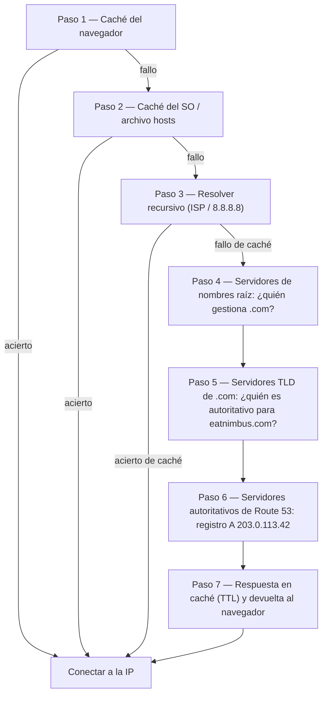

# Capítulo 12: Cómo Te Encuentra Internet

Maya actualizó `nimbus-alb-123456789.us-west-2.elb.amazonaws.com` en su navegador una vez más, luego se recostó y miró al techo. La página cargó. La app funcionaba. Pero cada vez que compartía el enlace con un socio restaurador, sentía una pequeña vergüenza que no podía nombrar del todo.

Esa URL era un artefacto técnico, no un producto.

---

*El rediseño de red del capítulo anterior había salido bien. Cada recurso estaba en el lugar correcto — balanceadores de carga en subredes públicas, bases de datos encerradas en las privadas. La infraestructura era segura y estaba correctamente segmentada. Pero mientras Nimbus se preparaba para su primer lanzamiento público, había aparecido un nuevo problema: la URL del balanceador de carga que AWS había asignado automáticamente parecía un identificador de sistema, no un producto en el que la gente confiaría. Necesitaban un nombre de dominio real. Y necesitaban entender qué pasaba entre el momento en que alguien escribía `eatnimbus.com` y el momento en que aparecía la página.*

---

Nimbus estaba funcionando. El balanceador de carga tenía una IP pública. Las instancias EC2 tenían una IP privada. Las bases de datos estaban bloqueadas en subredes privadas. Priya había asentido aprobadoramente ante el diagrama de red.

Tom miraba la URL del balanceador de carga: `nimbus-alb-123456789.us-west-2.elb.amazonaws.com`.

«¿Eso es lo que escriben los clientes en su navegador?» preguntó.

«Eso es lo que AWS asigna automáticamente», dijo Maya.

«No voy a poner eso en una tarjeta de visita.»

«Yo tampoco.»

Necesitaban un nombre de dominio. Compraron `eatnimbus.com` en un registrador de dominios. Ahora necesitaban conectar ese nombre a su infraestructura de AWS.

«¿Cómo sabe internet que `eatnimbus.com` significa el balanceador de carga en us-west-2?» preguntó Leo.

Buena pregunta, Leo.

**La Analogía de la Guía Telefónica**

Antes de los smartphones, cada ciudad tenía una guía telefónica. Si querías llegar a «La Pizzería de Mario», no memorizabas su número de teléfono — buscabas el nombre, obtenías el número y llamabas.

Internet tiene su propia guía telefónica: el **Sistema de Nombres de Dominio (DNS)**.

DNS traduce nombres legibles por humanos (como `eatnimbus.com`) en direcciones IP legibles por máquinas (como `203.0.113.42`). Cada vez que visitas un sitio web, tu ordenador busca silenciosamente el nombre de dominio en DNS y obtiene la dirección IP a la que conectarse.

Si cambiabas la dirección IP de tu servidor, actualizabas el registro DNS — como cambiar tu número en la guía telefónica — e internet te encontraría en tu nueva ubicación.

**El Viaje Completo de Resolución DNS**

«¿Pero *cómo* funciona realmente la búsqueda?» preguntó Leo. «Como, paso a paso. Mi navegador conoce el nombre `eatnimbus.com`. ¿Qué pasa después?»

La mayoría de la documentación pasa esto por alto. Importa.

Cuando tu navegador necesita resolver `eatnimbus.com`, aquí está cada salto, en orden:

**Paso 1 — Caché del navegador**: El navegador comprueba si ya ha resuelto este nombre recientemente. Si es así, usa la IP en caché. Si no, continúa.

**Paso 2 — Caché del SO / resolver local**: Tu sistema operativo comprueba su propia caché DNS y el archivo `hosts` local. Si lo encuentra, listo. Si no, lo reenvía a tu resolver DNS configurado — normalmente el de tu ISP o uno público como 8.8.8.8.

**Paso 3 — Resolver recursivo**: El resolver recursivo (tu ISP o el 8.8.8.8 de Google) es el caballo de batalla. También tiene una caché. Si conoce la respuesta, la devuelve inmediatamente. Si no, inicia la cadena de resolución real.

**Paso 4 — Servidores de nombres raíz**: El resolver recursivo contacta a uno de los 13 clústeres de servidores de nombres raíz (desplegados en todo el mundo). El servidor raíz no sabe dónde está `eatnimbus.com`. Pero sabe quién gestiona los dominios `.com` — los servidores TLD de `.com`. Devuelve su dirección.

**Paso 5 — Servidores de nombres TLD (Dominio de Nivel Superior)**: El resolver recursivo contacta a los servidores TLD de `.com`. Los servidores TLD tampoco saben dónde está `eatnimbus.com`. Pero saben qué servidores de nombres son autoritativos para `eatnimbus.com` — los servidores que realmente contienen los registros DNS. Devuelven esas direcciones.

**Paso 6 — Servidores de nombres autoritativos**: El resolver recursivo contacta a los servidores de nombres de Route 53 — los servidores de nombres autoritativos para `eatnimbus.com`. Route 53 tiene los registros reales. Devuelve el registro A: `eatnimbus.com → 203.0.113.42`. Esta respuesta es autoritativa — es la respuesta real, no una en caché.

**Paso 7 — Respuesta en caché y devuelta**: El resolver recursivo almacena la respuesta en caché durante la duración del TTL (Time-To-Live) del registro. Devuelve la IP a tu navegador. Tu navegador la almacena en caché. Tu navegador se conecta.



«Eso son siete saltos solo para encontrar una dirección IP», dijo Tom.

«Normalmente menos de 100 milisegundos en total», dijo Priya. «Los pasos 3 al 6 se almacenan en caché agresivamente en cada nivel. Para dominios populares, los pasos 4 y 5 — las búsquedas de raíz y TLD — a menudo se saltan por completo porque el resolver recursivo ya tiene esos servidores en caché. Toda la cadena normalmente se ejecuta en 20–40 milisegundos.»

«Y después de la primera búsqueda, la caché del navegador significa que las solicitudes posteriores se saltan todo eso», añadió Leo.

«Correcto. El DNS se siente instantáneo porque la mayoría de las búsquedas son aciertos de caché. La cadena completa solo se ejecuta cuando un registro es nuevo o su TTL ha expirado.»

**Conoce Route 53**

Amazon Route 53 es el servicio DNS gestionado de AWS. Se llama Route 53 porque el puerto 53 es el puerto DNS estándar. (A veces AWS nombra las cosas de forma directa.)

Route 53 hace varias cosas:

**Registro de dominios**: Puedes comprar nombres de dominio directamente a través de Route 53.

**Alojamiento DNS (zonas alojadas)**: Creas una *zona alojada* para tu dominio y Route 53 gestiona los registros DNS que le dicen al mundo dónde encontrarte.

**Comprobaciones de salud**: Route 53 puede monitorear tus endpoints y enrutar el tráfico lejos de los que no están sanos.

**Políticas de enrutamiento de tráfico**: Route 53 admite múltiples estrategias de enrutamiento más allá del DNS simple — ponderado, basado en latencia, geolocalización, failover.

**Registros DNS: Las Entradas de la Guía Telefónica**

Un registro DNS mapea un nombre a un destino. Los tipos más comunes:

**Registro A**: Mapea un nombre a una dirección IPv4.
`eatnimbus.com → 203.0.113.42`

**Registro AAAA**: Mapea un nombre a una dirección IPv6.

**Registro CNAME**: Mapea un nombre a otro nombre (un alias).
`www.eatnimbus.com → eatnimbus.com`

**Registro MX**: Especifica qué servidores gestionan el correo electrónico para el dominio.

**Registro TXT**: Almacena texto arbitrario. Comúnmente se usa para verificación de dominio (demostrar que eres el propietario del dominio) y autenticación de correo electrónico (SPF, DKIM).

Para Nimbus, la configuración principal:

- `eatnimbus.com` → Registro Alias apuntando al balanceador de carga
- `www.eatnimbus.com` → CNAME apuntando a `eatnimbus.com`
- `api.eatnimbus.com` → Registro Alias apuntando al balanceador de carga de la API

«Espera», dijo Tom. «La IP del balanceador de carga puede cambiar. AWS lo dijo en la documentación.»

Buena observación, Tom.

**Registros Alias: La Solución de AWS a las IP Dinámicas**

Los balanceadores de carga, las distribuciones de CloudFront y los sitios web de S3 tienen nombres DNS, no direcciones IP estáticas. Las IP subyacentes pueden cambiar.

Si creas un CNAME apuntando al nombre DNS de un balanceador de carga, funciona — pero no puedes usar CNAMEs para dominios raíz (`eatnimbus.com` sin el `www`) debido a los estándares DNS.

Route 53 resuelve esto con los **registros Alias** — una extensión específica de AWS al DNS. Un registro Alias mapea un nombre directamente a un recurso de AWS (balanceador de carga, distribución de CloudFront, sitio web de S3) y Route 53 gestiona automáticamente la resolución de IP dinámica. Los registros Alias se pueden usar a nivel del dominio raíz. Y a diferencia de las consultas DNS regulares a servicios externos, las consultas de registros Alias a recursos de AWS son gratuitas.

«Entonces usamos un registro Alias para `eatnimbus.com` apuntando al balanceador de carga», confirmó Leo.

«Y Route 53 maneja cualquier IP que esté usando el balanceador de carga en un momento dado», añadió Priya.

«Gratis», dijo Tom, de repente muy interesado. Abrió la página de precios de Route 53. «¿Y el resto?»

«Cincuenta centavos por zona alojada», dijo Leo. «Más unos cuarenta centavos por millón de consultas DNS. Para nuestro tráfico ahora mismo, probablemente menos de dos dólares al mes.»

Tom cerró la página de precios satisfecho.

**Políticas de Enrutamiento: Más que Solo «¿Dónde Está?»**

Aquí es donde Route 53 se pone interesante. El DNS no es solo un servicio de búsqueda — puede ser una herramienta de gestión de tráfico.

**Enrutamiento simple**: Un registro, un destino. DNS estándar.

**Enrutamiento ponderado**: Divide el tráfico entre múltiples destinos por peso. Envía el 90% al nuevo servidor y el 10% al antiguo durante una migración. Ajusta los pesos hasta que tengas confianza en el nuevo servidor y luego cambia al 100%.

**Enrutamiento basado en latencia**: Enruta a los usuarios a la Región de AWS con la menor latencia para ellos. Un usuario en Seattle es enrutado a `us-west-2`. Un usuario en Tokio es enrutado a `ap-northeast-1`. El mismo nombre de dominio, destinos diferentes.

**Enrutamiento por geolocalización**: Enruta según la ubicación geográfica del usuario. Todos los usuarios europeos van a `eu-west-1`. Todos los usuarios norteamericanos van a `us-east-1`. Útil para la soberanía de datos (mantener los datos de usuarios de la UE en Regiones de la UE) o la personalización de contenido (idioma, moneda). Las decisiones de enrutamiento usan límites estrictos — un usuario está en un país, un continente o un estado de EE. UU., y ahí es a donde va.

**Enrutamiento por geoproximidad**: Enruta el tráfico según la ubicación geográfica de los usuarios *y* te permite ajustar esas decisiones con un valor de **sesgo (bias)**. Un sesgo positivo expande el área geográfica que se enruta a un recurso — atrayendo más tráfico. Un sesgo negativo la reduce. A diferencia de la geolocalización, que usa límites estrictos de país y continente, la geoproximidad es continua: un pequeño valor de sesgo puede desplazar gradualmente el tráfico de una Región a otra sin redibujar ninguna línea fija.

El escenario que distingue a los dos: si una empresa está migrando gradualmente de `us-east-1` a `us-west-2` y quiere desplazar el tráfico de forma incremental hacia el oeste — no accionar un interruptor, sino regularlo con el tiempo — la geoproximidad con un sesgo positivo creciente en el endpoint del oeste es la herramienta correcta. La geolocalización enrutaría a todos los usuarios de la Costa Oeste a Oregón o no; no tiene un regulador. Desde enero de 2024, la geoproximidad está disponible como una política de enrutamiento regular directamente en los registros DNS (Consola, API, CLI) — ya no requiere Route 53 Traffic Flow, aunque también sigue disponible allí.

**Enrutamiento por failover**: Designa un endpoint primario y uno secundario. Si el primario falla la comprobación de salud de Route 53, el tráfico se redirige automáticamente al secundario. Esta es la capa DNS de la recuperación ante desastres.

«Espera — pero ¿*por qué* configuraríamos un enrutamiento por failover a una segunda Región si ya tenemos Multi-AZ?» preguntó Maya. «¿No se supone que Multi-AZ maneja los fallos?»

Buena pregunta. Multi-AZ protege contra el fallo de una sola Zona de Disponibilidad dentro de una Región — si un centro de datos cae, el standby en otra AZ toma el control. ¿Pero qué pasa si toda una Región de AWS deja de estar disponible? ¿O qué pasa si hay una interrupción de servicio en toda la Región? El enrutamiento por failover de DNS opera a un nivel diferente: enruta el tráfico lejos de toda una Región cuando la comprobación de salud de esa Región falla. Multi-AZ es resiliencia intra-Región. El failover de DNS es resiliencia inter-Región.

**Enrutamiento de respuesta multivalor**: Devuelve hasta ocho direcciones IP sanas para una consulta, permitiendo al cliente elegir. Una alternativa simple a un balanceador de carga para distribuir tráfico entre múltiples servidores.

«Entonces Route 53 no es solo una guía telefónica», dijo Maya. «Es una guía telefónica inteligente que puede enrutar llamadas según desde dónde llamas.»

«Y desconectarte si el número no está sano», añadió Priya.

---

**Enrutamiento por Latencia Más Comprobaciones de Salud: Un Experimento Mental**

Priya esbozó un escenario en la pizarra. Supongamos que la base de usuarios de la Costa Este de Nimbus siguiera creciendo, y un día el equipo levantara una pila ligera en `us-east-1` (Norte de Virginia) — no una configuración multi-Región activo-activo completa, que sería cara y compleja, sino un balanceador de carga y un conjunto de instancias EC2 de solo lectura sirviendo contenido estático y páginas de exploración. Los pedidos seguirían yendo al oeste, a la base de datos primaria en `us-west-2`. El tráfico de exploración — que representaba el setenta por ciento de las solicitudes — podría servirse desde cualquiera de las dos costas.

La configuración de Route 53 para el endpoint de exploración se vería así:

```
browse.eatnimbus.com
  → Registro de latencia: ALB de us-east-1 (con comprobación de salud, set-identifier "east")
  → Registro de latencia: ALB de us-west-2 (con comprobación de salud, set-identifier "west")
```

(Observa que el registro es un *nombre de host*, `browse.eatnimbus.com` — el DNS enruta nombres, nunca rutas de URL. El enrutamiento basado en rutas como `/browse` es trabajo del balanceador de carga, no de Route 53.)

Con el enrutamiento por latencia, un usuario en Seattle sería resuelto al endpoint de `us-west-2`. Un usuario en Boston iría a `us-east-1`. Route 53 mide la latencia desde su infraestructura a cada Región de forma continua y elige la más rápida por usuario.

«¿Pero qué pasa si la Región del oeste tiene un problema?» preguntó Tom. «Nuestros usuarios de exploración en Seattle se quedarían atascados.»

«Para eso son las comprobaciones de salud», dijo Priya. «Cada registro de latencia recibe una comprobación de salud en su respectivo balanceador de carga. Si la comprobación de salud de `us-west-2` falla tres comprobaciones consecutivas, Route 53 deja de devolver ese registro — incluso para usuarios donde Oregón sería normalmente más rápido. Los usuarios de Seattle son enrutados al este hasta que Oregón se recupere.»

«Entonces el enrutamiento por latencia determina qué Región se prefiere normalmente», dijo Maya, «¿y las comprobaciones de salud anulan esa preferencia si la Región preferida cae?»

«Exactamente. La política de latencia elige al ganador en condiciones normales. Las comprobaciones de salud eliminan a un ganador que ha dejado de funcionar.»

Leo pensó en el escenario de fallo. «¿Y el TTL de esos registros?»

«Sesenta segundos», dijo Priya. «Tres comprobaciones fallidas a intervalos de treinta segundos para activarlo — hasta noventa segundos para detectar el fallo — luego hasta sesenta segundos para que los resolvers DNS recojan el cambio.»

«Dos minutos y medio en el peor de los casos», dijo Leo.

«Por eso bajas el TTL antes de que te importe, no después.»

Esta combinación — enrutamiento por latencia con comprobaciones de salud en cada registro — es una de las configuraciones más potentes de Route 53 para despliegues multi-Región. Los usuarios siempre van a la Región sana más rápida. El sistema se autorrepara cuando una Región tiene problemas. Y todo es DNS: sin infraestructura adicional, sin servidores proxy, sin balanceadores de carga entre Regiones.

---

**El Incidente del Fallo de la Comprobación de Salud**

El entorno de staging de Nimbus les dio una demostración accidental del enrutamiento por failover.

Habían configurado comprobaciones de salud de Route 53 en el balanceador de carga de staging como prueba — comprobando el endpoint `/health` cada 30 segundos. Un viernes por la tarde, Leo subió un despliegue a staging que tenía un error: el endpoint de salud empezó a devolver errores 500. Pasó sus pruebas locales pero se rompió en el servidor.

Route 53 anotó los fallos. Después de tres comprobaciones fallidas consecutivas, marcó el endpoint como no sano. El registro de failover se activó, enrutando el tráfico de staging a una página de respaldo de solo lectura que decía «Mantenimiento en curso».

La primera alerta de Leo fue un mensaje de Slack de un ingeniero de QA: «Staging está mostrando la página de mantenimiento.»

Leo comprobó el despliegue. Los errores 500 eran obvios en los registros. Revirtió el despliegue. En 90 segundos desde que el endpoint de salud volvió a devolver 200s, Route 53 reevaluó la comprobación, vio tres éxitos consecutivos y devolvió el tráfico al balanceador de carga de staging. La página de mantenimiento desapareció.

Tiempo total en la página de mantenimiento: siete minutos.

«Ese fue el sistema funcionando correctamente», dijo Priya.

«Lo sé», dijo Leo. «La parte aterradora es pensar en lo que habría pasado sin la comprobación de salud. Los errores 500 habrían llegado a usuarios reales.»

«En producción, la comprobación de salud habría hecho failover a la Región secundaria o a la página de error estática. Los usuarios habrían visto una experiencia mantenida en lugar de errores.»

«¿Cuánto tarda realmente el failover?» preguntó Maya. «¿Desde que la comprobación de salud falla hasta que el DNS empieza a enrutar de forma diferente?»

«El intervalo de comprobación de salud es de 30 segundos por defecto. Tres fallos consecutivos para activar el failover. Eso es hasta 90 segundos para detectar el problema. Luego el TTL del DNS — si es de 60 segundos, la propagación es otro minuto.»

«¿Así que en el peor de los casos, unos tres minutos?»

«Más o menos. Por eso quieres tu TTL bajo en los registros críticos y tu intervalo de comprobación de salud tan corto como permita tu presupuesto.»

---

**Comprobaciones de Salud: Enrutar Alrededor de los Fallos**

«¿Y qué pasa si alguien intenta entrar a la fuerza?» dijo Priya. «El DNS es público. Cualquiera puede buscar a dónde apunta `eatnimbus.com`. Eso significa que un atacante sabe exactamente qué IP atacar.»

«Eso es cierto», dijo Leo. «Pero la IP que encuentran es la del balanceador de carga. El ALB es lo único con una dirección pública. Todo lo que hay detrás de él — EC2, RDS, ElastiCache — está en subredes privadas. El DNS les dice la puerta de entrada. No les dice lo que hay detrás de ella.»

Route 53 puede monitorear tus endpoints con comprobaciones de salud. Si un endpoint falla, Route 53 puede:

- Eliminarlo de las respuestas DNS (dejar de enviar tráfico allí)
- Activar un failover a un endpoint de respaldo
- Enviar una alerta a través de CloudWatch

Las comprobaciones de salud son el vínculo entre el enrutamiento DNS y la salud real de la aplicación. En una configuración de failover: Route 53 monitorea el endpoint primario cada 30 segundos. Si tres comprobaciones consecutivas fallan, Route 53 empieza a devolver la dirección del endpoint secundario. Ninguno de estos números es fijo: 30 segundos es el intervalo estándar (una opción «rápida» de pago comprueba cada 10 segundos), y el umbral de fallo es 3 comprobaciones consecutivas por defecto pero es configurable de 1 a 10.

Esto no es instantáneo — el DNS tiene un tiempo de propagación. Una vez que Route 53 cambia un registro DNS, los resolvers DNS de todo el mundo necesitan recibir el cambio, lo que puede tardar de segundos a minutos dependiendo de los ajustes de TTL.

**TTL: La Caché del DNS**

Las respuestas DNS se almacenan en caché en múltiples niveles — en tu router, en tu ISP, en tu navegador. El **TTL (Time-To-Live)** en un registro DNS indica a las cachés cuánto tiempo recordar la respuesta antes de volver a comprobarlo.

TTL alto (1 hora o más): Menos consultas DNS, menos carga en Route 53, pero los cambios tardan más en propagarse.

TTL bajo (60 segundos o menos): Los cambios se propagan rápidamente, pero se necesitan más consultas DNS.

Antes de una migración planificada (actualizar DNS para apuntar a un nuevo servidor), baja tu TTL a 60 segundos con un día de antelación. Entonces cuando hagas el cambio, se propagará en aproximadamente un minuto. Después de la migración, súbelo de vuelta al valor normal.

«Ya lo desplegué — oh.» Leo había actualizado el registro DNS antes de bajar el TTL. Se había dado cuenta de su error y había empezado a contar: el TTL antiguo era de una hora. Algunos usuarios estarían recibiendo el servidor antiguo durante los próximos sesenta minutos.

«Si solo lo bajamos durante la migración y no antes», dijo Leo lentamente, «el TTL antiguo significa que algunos usuarios verán el servidor antiguo durante una hora.»

«Exactamente», dijo Priya. «Las migraciones de DNS requieren planificación antes de la migración, no solo durante.»

Quizás te estés preguntando: si el TTL está configurado a una hora, ¿significa eso que cada usuario esperará una hora completa después de un cambio de DNS antes de ver el nuevo servidor? No exactamente. El TTL significa que los resolvers no volverán a comprobar hasta que el TTL expire. Si el resolver DNS de un usuario almacenó en caché el valor antiguo hace 55 minutos con un TTL de 1 hora, obtendrá el nuevo valor en 5 minutos. Si lo almacenó hace 5 minutos, esperará 55 minutos. En promedio, los usuarios ven el cambio dentro de la mitad de la duración del TTL. Por eso bajar el TTL con antelación es tan importante: reduce la ventana de propagación en el peor de los casos antes de que ocurra el cambio.

---

**Zonas Alojadas Privadas: DNS Interno**

Priya planteó un nuevo requisito dos semanas después de que el dominio público estuviera en vivo.

«Nuestras instancias EC2 necesitan llegar a la base de datos», dijo. «Ahora mismo están usando el nombre DNS del endpoint de RDS — `nimbus-prod.abc123.us-west-2.rds.amazonaws.com`. Eso funciona, pero es un nombre DNS público. Si alguna vez queremos cambiar la configuración de nuestra base de datos, todos los archivos de configuración de la aplicación necesitan actualizarse.»

«Podríamos usar un nombre DNS privado», dijo Leo. «Como `db.nimbus.internal`. Algo que nuestros servicios usen internamente que mapee a cualquiera que sea el endpoint actual de la base de datos.»

«Exactamente. Las zonas alojadas privadas de Route 53.»

Una **zona alojada privada** es un dominio DNS que solo se resuelve dentro de tu VPC. Las consultas DNS externas para `nimbus.internal` no obtienen respuesta. Pero desde dentro de la VPC, `db.nimbus.internal` se resuelve al endpoint de RDS.

La configuraron:

- Zona alojada privada: `nimbus.internal`
- Registro CNAME: `db.nimbus.internal → nimbus-prod.abc123.us-west-2.rds.amazonaws.com`
- Registro CNAME: `cache.nimbus.internal → nimbus-cache.abc123.usw2.cache.amazonaws.com`
- Registro A: `api.nimbus.internal → 10.0.10.5` (IP interna de EC2 — los registros A mapean nombres a direcciones IP; los CNAME mapean nombres a otros nombres. Aquí está bien porque esta instancia mantiene una IP privada estática; para cualquier cosa detrás de Auto Scaling apuntarías a un balanceador de carga en su lugar)

Ahora la configuración de la aplicación decía:

```
DATABASE_HOST=db.nimbus.internal
CACHE_HOST=cache.nimbus.internal
```

Cuando migraron a una nueva instancia de RDS, actualizaron un registro DNS. No se requirió ningún despliegue de aplicación.

«Por esto también importa el DNS privado durante una migración de base de datos», dijo Priya. «Actualizas `db.nimbus.internal` para apuntar al nuevo endpoint. El tráfico se desplaza. El endpoint antiguo permanece disponible durante la ventana del TTL. Sin cambios en la configuración de la aplicación.»

**La Historia de Depuración del DNS Interno**

Tres semanas después, Leo desplegó un nuevo servicio — un worker en segundo plano — y no podía llegar a la base de datos. El worker estaba en la misma VPC, en la misma subred privada que los servidores de API. Los servidores de API podían llegar a la base de datos. El worker no.

Comprobó los grupos de seguridad. El grupo de seguridad del worker tenía una regla de salida para PostgreSQL. El grupo de seguridad de la base de datos tenía una regla de entrada desde el grupo de seguridad del worker. Todo parecía correcto.

Ejecutó `nslookup db.nimbus.internal` desde la instancia del worker.

Sin respuesta.

«La búsqueda DNS está fallando», le dijo a Priya.

Ella miró la configuración de VPC de la instancia del worker. «¿En qué VPC está realmente el worker? Las zonas alojadas privadas están asociadas con VPCs — si la instancia no está en una VPC asociada, la zona simplemente no existe para ella.»

«Está en la VPC principal. Igual que todo lo demás.»

«¿De verdad?»

Las zonas alojadas privadas deben asociarse explícitamente con cada VPC a la que sirven — la asociación es por VPC, nunca por subred. Priya había asociado la VPC principal cuando creó la zona. Pero Leo había desplegado accidentalmente el worker en una VPC de prueba que había creado para un experimento diferente. VPC diferente. No asociada con la zona alojada privada.

«El worker está en la VPC equivocada», dijo Priya.

«Ya lo desplegué — oh.» Leo movió el worker a la VPC correcta. El DNS se resolvió. El worker se conectó a la base de datos.

«Una VPC», dijo Leo, tomando nota. «A menos que tengamos una razón para más de una.»

---

**DNSSEC: Autenticar las Respuestas DNS**

«¿Hemos pensado en la suplantación de DNS (DNS spoofing)?» preguntó Priya. «¿Qué pasa si alguien intercepta nuestra consulta DNS y devuelve una IP falsa? Los navegadores de nuestros usuarios se conectarían al servidor del atacante en lugar del nuestro.»

**DNSSEC (Extensiones de Seguridad de DNS)** resuelve esto firmando criptográficamente los registros DNS. Cuando una respuesta DNS incluye una firma DNSSEC, el resolver puede verificar que la respuesta vino del servidor de nombres autoritativo y no ha sido manipulada.

Route 53 admite la firma DNSSEC para zonas alojadas públicas. El proceso implica:

1. Habilitar DNSSEC en la zona alojada en Route 53
2. Route 53 genera una clave de firma de clave (KSK) almacenada en KMS
3. Route 53 firma todos los registros con la clave de firma de zona
4. Añades un registro DS (Delegation Signer) en el registrador del dominio padre (TLD .com)
5. Los resolvers que admiten DNSSEC ahora pueden verificar la autenticidad de las respuestas

«¿Qué tan común es la suplantación de DNS?» preguntó Leo.

«En el internet público, rara pero posible», dijo Priya. «La mayoría de los resolvers de ISP admiten la validación DNSSEC hoy en día. Habilitar DNSSEC no cuesta nada y añade una capa significativa de autenticidad.»

«¿Cuánto cuesta eso al mes?» preguntó Tom.

«Habilitar la firma DNSSEC en sí es gratis en Route 53», dijo Priya. «El único coste real es la clave de KMS que contiene la clave de firma de clave: $1/mes, más las llamadas a la API de KMS — y una clave se puede compartir entre múltiples zonas alojadas. La protección contra los ataques de secuestro de DNS es efectivamente gratis a nuestra escala.»

Tom lo habilitó antes del almuerzo.

---

**Route 53 Resolver: DNS Híbrido**

Cuando Nimbus finalmente conectó su VPC de AWS a su red de desarrollo on-premises a través de una VPN, surgió un nuevo problema: los servidores on-premises necesitaban resolver nombres DNS privados de AWS (como `db.nimbus.internal`), y los recursos de AWS necesitaban resolver nombres de host on-premises (como `jenkins.corp.nimbus.local`).

La resolución DNS no cruza los límites de red por defecto. Los recursos de AWS resuelven DNS usando Route 53 Resolver (integrado en cada VPC). Los servidores on-premises usan sus propios servidores DNS. Ninguno puede ver los registros del otro.

Los **Endpoints de Route 53 Resolver** salvan esta brecha:

**Endpoints de entrada (inbound)**: Los servidores DNS on-premises pueden reenviar consultas para zonas DNS alojadas en AWS a una IP de endpoint de entrada en tu VPC. Route 53 Resolver maneja la consulta y devuelve el resultado.

**Endpoints de salida (outbound)**: Cuando las instancias EC2 necesitan resolver nombres de host on-premises, Resolver reenvía esas consultas a los servidores DNS on-premises a través del endpoint de salida.

«Entonces es como un servicio de traducción», dijo Maya. «Tu DNS de AWS y tu DNS on-premises no se hablan directamente. Los endpoints de Resolver actúan como intermediarios.»

«Exactamente. Tus servidores on-premises ahora pueden resolver `db.nimbus.internal`. Tus instancias EC2 pueden resolver `jenkins.corp.nimbus.local`. Ambos lados ven nombres DNS de ambos mundos.»

Para Nimbus, esto se volvió relevante cuando el equipo de desarrollo quiso ejecutar pruebas de integración desde su oficina contra un entorno de staging en AWS. Sin los endpoints de Resolver, habrían estado editando manualmente archivos hosts. Con ellos, el DNS interno simplemente funcionaba a través de la VPN.

La arquitectura para los endpoints de Resolver:

- **Endpoint de entrada**: Dos ENIs (Interfaces de Red Elásticas) creadas en dos AZs diferentes en tu VPC. Cada una obtiene una IP privada. Configuras tu servidor DNS on-premises para reenviar consultas de tus zonas alojadas en AWS a estas IPs. El tráfico viaja a través de tu VPN o Direct Connect.
- **Endpoint de salida**: Dos ENIs en dos AZs. Creas reglas de reenvío: «las consultas para `corp.nimbus.local` van a estas IPs de servidor DNS on-premises». Las instancias EC2 usan automáticamente el Resolver, que consulta tus reglas de reenvío y envía la consulta on-premises.

«¿Por qué dos ENIs por endpoint?» preguntó Leo.

«Alta disponibilidad», dijo Priya. «Si una AZ pierde la conectividad de red, la otra IP de endpoint todavía funciona. El mismo principio que los NAT Gateways.»

«¿Cuánto cuesta eso al mes?» preguntó Tom.

Los endpoints de Resolver cuestan aproximadamente $0,125 por hora **por interfaz de red elástica**, y cada endpoint requiere al menos dos ENIs para disponibilidad — así que un piso realista es de unos $180 al mes por endpoint, más $0,40 por millón de consultas DNS. Para un equipo que usa DNS híbrido para resolver nombres internos, el coste es modesto — y elimina la necesidad de mantener archivos hosts en múltiples máquinas de desarrolladores y sistemas de CI/CD.

«Podríamos simplemente poner los nombres de host en los archivos hosts», sugirió Leo.

«En cada máquina de desarrollador, cada runner de CI, cada nueva incorporación», dijo Priya. «Cada vez que algo cambia.»

«El endpoint vale la pena», dijo Leo.

«Lo vale.»

## Fortalezas y Limitaciones

**Route 53 es la elección correcta para**: registrar y gestionar nombres de dominio completamente dentro de AWS; enrutar tráfico basándose en latencia, geolocalización o distribución ponderada en múltiples endpoints; failover basado en comprobaciones de salud entre Regiones o entre un endpoint primario y uno de recuperación ante desastres; integrar DNS con otros servicios de AWS a través de registros Alias; zonas alojadas privadas para el descubrimiento de servicios internos.

**Cuándo Route 53 no es lo que necesitas**: Route 53 es un servicio DNS, no un balanceador de carga. Si necesitas distribuir tráfico entre múltiples servidores o contenedores dentro de una Región, usa un Application Load Balancer — Route 53 no puede hacer round-robin ponderado a nivel de conexión como lo puede hacer un balanceador de carga. El enrutamiento basado en latencia entre Regiones añade coste y complejidad operativa que solo tiene sentido cuando tus usuarios están genuinamente distribuidos globalmente y los milisegundos importan para la conversión. Para la mayoría de las aplicaciones de una sola Región, un único registro Alias apuntando a un ALB es toda la configuración de Route 53 que necesitas.

## Resumen

Pasar de `nimbus-alb-123456789.us-west-2.elb.amazonaws.com` a `eatnimbus.com` parecía algo pequeño. No lo era. El DNS es el sistema de direcciones sobre el que funciona todo internet, y Route 53 te da herramientas para usar ese sistema no solo para búsquedas, sino para la gestión de tráfico y la resiliencia.

- El **DNS** traduce nombres de dominio en direcciones IP — la guía telefónica de internet.
- **Route 53** es el servicio DNS gestionado de AWS: registro de dominios, alojamiento DNS, comprobaciones de salud y políticas de enrutamiento.
- Los **registros A** mapean nombres a direcciones IPv4. Los **CNAME** mapean nombres a otros nombres. Los **registros Alias** mapean nombres a recursos de AWS (balanceadores de carga, CloudFront, S3).
- Usa registros Alias (no CNAME) para dominios raíz y para recursos con IPs dinámicas.
- Las políticas de enrutamiento van más allá del DNS simple: **ponderado** (división de tráfico), **basado en latencia** (rendimiento), **geolocalización** (soberanía de datos — límites estrictos de país/continente), **geoproximidad** (basado en distancia con un regulador de sesgo — desplazamiento gradual de tráfico), **failover** (recuperación ante desastres).
- Las **zonas alojadas privadas** proporcionan DNS interno para los recursos de la VPC — comunicación servicio a servicio por nombre, no por IP codificada en duro.
- **DNSSEC** firma criptográficamente los registros, protegiendo contra la suplantación de DNS.
- Los **Endpoints de Route 53 Resolver** salvan las redes híbridas — el DNS de AWS y on-premises pueden resolver los nombres del otro.

## Consejos para el Examen

*Dominio SAA-C03: Diseñar Arquitecturas de Alto Rendimiento (Dominio 3, Tarea 3.4)*

- **Alias vs CNAME**: Los registros Alias se pueden usar en el dominio raíz; los CNAME no. Las consultas DNS de registros Alias a recursos de AWS son gratuitas; las consultas CNAME tienen precio. Cuando el examen pregunte sobre mapear un dominio raíz a un balanceador de carga → registro Alias.
- **Casos de uso de políticas de enrutamiento** (escenarios comunes del examen):
  - «Migrar gradualmente el tráfico a una nueva versión» → Enrutamiento ponderado
  - «Enrutar usuarios a la Región de AWS más cercana» → Enrutamiento basado en latencia
  - «Mantener los datos de usuarios de la UE en Regiones de la UE» → Enrutamiento por geolocalización
  - «Failover automático de DNS cuando el primario cae» → Enrutamiento por failover con comprobaciones de salud
  - «Desplazar gradualmente el tráfico a una nueva Región» o «aumentar el tráfico atraído a nuestro despliegue de la UE» → Enrutamiento por geoproximidad con sesgo positivo
- **Geoproximidad vs. Geolocalización:** La geolocalización enruta según el país/continente del usuario con límites estrictos. La geoproximidad enruta según la distancia geográfica con un sesgo configurable — úsala cuando necesites desplazar gradualmente el tráfico a una nueva Región o atraer más usuarios a un despliegue específico. Disponible como política de enrutamiento regular en los registros desde enero de 2024 (Traffic Flow ya no es necesario).
- **Comprobaciones de salud de Route 53**: Pueden comprobar endpoints HTTP/HTTPS/TCP y pueden activar alarmas de CloudWatch. El examen los usa en escenarios de recuperación ante desastres.
- **TTL y propagación**: Sabe que el TTL controla cuánto tiempo almacenan en caché los resolvers DNS un registro. TTL corto = cambios más rápidos. Escenario del examen: «el equipo actualizó el DNS pero los usuarios siguen llegando al servidor antiguo» → TTL demasiado alto.
- **Zonas alojadas privadas**: Route 53 puede crear registros DNS que solo se resuelven dentro de una VPC. El examen usa esto para el descubrimiento de servicios internos (p. ej., `database.internal` resolviendo a un endpoint privado de RDS).
- Route 53 es **global** — no se despliega en una Región. No es necesaria la selección de Región al crear zonas alojadas.
- **Endpoints de Route 53 Resolver**: Usados en escenarios híbridos donde el DNS on-premises y de AWS necesitan resolver los nombres del otro. Endpoint de entrada para on-premises → AWS. Endpoint de salida para AWS → on-premises.

## Ejercicios

**Ejercicio 1 — Recordar**

Explica la diferencia entre un registro CNAME y un registro Alias. ¿Cuándo usarías cada uno?

*(Pista: Considera las restricciones de CNAME en los dominios raíz y el comportamiento de los registros Alias con los recursos dinámicos de AWS.)*

**Ejercicio 2 — Escenario SAA-C03**

*Escenario*: Una empresa de medios opera un sitio web desde dos Regiones de AWS: `us-east-1` (primaria) y `eu-west-1` (secundaria). El equipo quiere que el tráfico se enrute automáticamente a `eu-west-1` si la Región primaria no está disponible. La empresa también quiere verificar que este mecanismo de failover funciona correctamente sin tener que cerrar realmente la Región primaria.

¿Qué configuración de Route 53 satisface MEJOR estos requisitos?

A) Enrutamiento ponderado con 100% de peso en `us-east-1` y 0% en `eu-west-1`  
B) Enrutamiento basado en latencia con comprobaciones de salud en ambos endpoints  
C) Enrutamiento por failover con una comprobación de salud en el endpoint primario y un registro secundario apuntando a `eu-west-1`  
D) Enrutamiento por geolocalización con Norteamérica apuntando a `us-east-1` y Europa apuntando a `eu-west-1`

**Pista 1**: El requisito es el failover automático cuando el primario cae. ¿Qué política de enrutamiento está diseñada exactamente para esto?

**Pista 2**: «Probar sin cerrar la Región primaria» — las comprobaciones de salud se pueden configurar manualmente como «no sano» para pruebas.

**Pista 3**: El enrutamiento basado en latencia optimiza la velocidad, no el failover.

**Respuesta**: C

**Explicación**: El enrutamiento por failover está diseñado exactamente para este caso de uso. El registro primario apunta a `us-east-1` con una comprobación de salud. El registro secundario apunta a `eu-west-1`. Si la comprobación de salud falla, Route 53 sirve automáticamente el registro secundario. Las comprobaciones de salud se pueden forzar manualmente a fallar para pruebas sin interrumpir realmente la Región primaria.

**¿Por qué no A?** El enrutamiento ponderado con 100%/0% es efectivamente estático — no cambia automáticamente cuando falla el primario.

**¿Por qué no B?** Los registros de latencia *con comprobaciones de salud* sí dejan de devolver un endpoint no sano, así que B sobreviviría a una interrupción real. Pero cambia el patrón de tráfico normal (los usuarios se dividirían entre Regiones por latencia, no por primario/secundario como se requiere) y no tiene una forma limpia de *probar* el failover: tendrías que hacer fallar realmente la comprobación de salud del primario en producción. El enrutamiento por failover modela la intención declarada — primario designado, secundario designado, comprobable forzando el estado de la comprobación de salud.

**¿Por qué no D?** El enrutamiento por geolocalización enruta según la ubicación del usuario, no según la salud del endpoint. Los usuarios europeos estarían atrapados en `eu-west-1` incluso si `us-east-1` está sano, y los usuarios norteamericanos no harían failover a `eu-west-1` incluso si `us-east-1` cae.

*Dominio SAA-C03: Diseñar Arquitecturas de Alto Rendimiento — Tarea 3.4*

**Ejercicio 3 — Desafío de Arquitectura** *(Opcional)*

Nimbus se está expandiendo internacionalmente. Quieren que `eatnimbus.com` cargue rápidamente para usuarios en la Costa Oeste, la Costa Este y Australia. También tienen un requisito regulatorio: los pedidos realizados por usuarios europeos deben ser procesados por servidores en la UE.

Diseña una estrategia de enrutamiento de Route 53 que aborde ambos requisitos. ¿Qué política de enrutamiento o combinación de políticas usarías? ¿Qué infraestructura en cada Región necesitarías?

*(No hay una única respuesta correcta. El objetivo es practicar el diseño de enrutamiento multi-Región.)*

## Escena Post-Créditos

`eatnimbus.com` estaba en vivo.

Maya lo había escrito en su navegador y la página de pedidos de Nimbus había cargado. Había pedido arepa del restaurante de su propia familia, solo para probar el flujo. El pedido había llegado. La cocina lo había recibido.

Se recostó en su silla.

Tom ya estaba leyendo los registros de comprobaciones de salud de Route 53. «El tiempo de respuesta es de 18 milisegundos desde los verificadores de us-west-2.»

«¿Es eso rápido?» preguntó Maya.

«¿Para DNS? Sí. Para los usuarios de Seattle, también — están prácticamente al lado de Oregón.»

«¿Pero para un usuario en Boston?»

Tom miró el gráfico de latencia. «Unos 80 milisegundos.»

Maya pensó en eso. «Si nuestros socios de la Costa Este siguen creciendo, y nuestros servidores están en Oregón...»

«Cada solicitud viaja de Boston a Oregón y vuelta», dijo Leo desde el otro lado de la sala. «Velocidad de la luz. No puedes vencer a la física.»

«Entonces necesitamos servidores más cerca de Boston.»

«O algo más cerca de Boston que sirva contenido en su nombre.»

Ese pensamiento quedó flotando en el aire.

En el próximo capítulo: los almacenes que ponen el contenido de Nimbus a un milisegundo de cada usuario, en todas partes.
