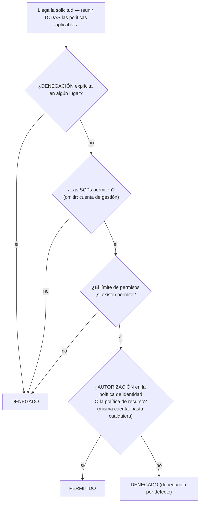

# Capítulo 14: Quién Está Autorizado a Hacer Qué

Los nuevos ingenieros empezaban el lunes. Soo-Jin y Rafael. Maya había estado pensando en su primera semana — a qué necesitarían acceso, qué no deberían tocar, y si la configuración actual de IAM estaba siquiera lista para extenderse a dos personas más.

Se sentó con un café antes de que la oficina se llenara, haciendo una lista.

---

*CloudFront estaba desplegado. Las tasas de aciertos de caché eran buenas. El rendimiento había subido. Pero mientras el equipo se preparaba para incorporar nuevos ingenieros, surgió un problema silencioso: la configuración de IAM había sido construida por gente con prisa. Había claves de acceso en archivos de configuración. Algunos roles tenían más permisos de los que necesitaban. Y dos personas nuevas estaban a punto de recibir credenciales para un sistema de producción que no había sido diseñado pensando en múltiples usuarios.*

---

Tom tenía las claves de acceso abiertas en un archivo de texto, listo para pegarlas.

«¿Qué estás haciendo?» preguntó Priya.

«La instancia de EC2 necesita leer archivos de configuración desde S3. Estoy poniendo las credenciales en la configuración del servidor.»

Ella miró la pantalla por un momento. «Cierra ese archivo.»

«Solo estaba—»

«Si alguien entra en ese servidor», dijo ella, «obtiene esas claves. Y esas claves tocan todo lo que el usuario de IAM tiene permiso de tocar. Que probablemente es mucho más que solo S3.»

Tom cerró el archivo.

«Hay una manera mejor», dijo ella. «El servidor mismo puede tener un rol. Piénsalo como un cargo: la instancia no necesita credenciales porque el sistema ya sabe lo que es y lo que puede hacer.»

Tom se mostró escéptico. «¿Entonces el servidor se autentica a sí mismo?»

«Sí. Sin contraseña. Sin claves en un archivo de configuración. Sin nada que pueda enviarse accidentalmente a git.»

Esa última parte le dio que pensar. Tom casi había enviado una clave de acceso al repositorio él mismo dos semanas antes — la pilló en el diff en el último segundo. Abrió una nueva pestaña del navegador.

**Revisitando IAM: El Panorama Completo**

El Capítulo 3 introdujo IAM: usuarios, grupos, roles y políticas. Ahora es momento de profundizar.

Las políticas de IAM son documentos JSON que especifican qué acciones están permitidas o denegadas sobre qué recursos. Se ven así:

```json
{
  "Version": "2012-10-17",
  "Statement": [
    {
      "Effect": "Allow",
      "Action": [
        "s3:GetObject",
        "s3:PutObject"
      ],
      "Resource": "arn:aws:s3:::nimbus-assets/*"
    }
  ]
}
```

Esta política permite leer y escribir objetos en el bucket `nimbus-assets`, y nada más. No eliminar. No listar buckets. No ninguna otra operación de S3. No ningún otro servicio de AWS.

Esta es la manera correcta de otorgar permisos: acciones específicas, recursos específicos.

**El Problema con el "Acceso de Administrador"**

Las políticas administradas por AWS como `AdministratorAccess` están diseñadas para comenzar rápidamente. No están diseñadas para operar sistemas en producción con miembros reales del equipo.

`AdministratorAccess` otorga todas las acciones sobre todos los recursos. Si un miembro del equipo con esta política comete un error — elimina accidentalmente un bucket de S3, termina la instancia de EC2 equivocada, cambia reglas de grupos de seguridad — no hay nada que AWS pueda hacer para detenerlo. El permiso estaba otorgado.

Si las credenciales de un miembro del equipo son comprometidas (ataque de phishing, clave de acceso filtrada, robo de portátil), el atacante tiene acceso de administrador a todo en tu cuenta de AWS.

«¿Entonces qué debería tener Soo-Jin?» preguntó Leo.

«¿Qué necesita hacer Soo-Jin?» respondió Priya.

«Desplegar la API. Revisar registros. Nada más.»

«Entonces obtiene: capacidad para hacer push al pipeline de código, acceso de lectura a los registros de CloudWatch, y nada más.»

«Eso es... muy específico.»

«Sí. Ese es el punto.»

**Roles de IAM: Identidades para Servicios**

El Capítulo 3 introdujo los roles como una forma de que las instancias de EC2 accedan a los servicios de AWS sin almacenar credenciales. Hagamos esto concreto.

Tus instancias de EC2 que ejecutan la API de Nimbus necesitan:

- Leer de DynamoDB (el menú)
- Escribir en DynamoDB (pedidos)
- Poner objetos en S3 (recibos, cargas)
- Escribir registros en CloudWatch
- Leer secretos de Secrets Manager

En lugar de crear un usuario con una clave de acceso y almacenar esa clave en la instancia de EC2 (una pesadilla de seguridad: las claves de acceso pueden ser leídas por cualquiera con acceso SSH), creas un **rol de IAM** para la instancia de EC2 con exactamente estos permisos.

«Espera — pero ¿*por qué* lo haríamos de esa manera?» preguntó Maya. «La instancia de EC2 ya ejecuta nuestro código. ¿Por qué no darle simplemente al código una clave de acceso?»

Porque las claves de acceso son credenciales estáticas que viven en algún lugar — en un archivo de configuración, una variable de entorno, un repositorio de git si alguien comete un error. Pueden copiarse, exfiltrarse, enviarse por accidente. Un rol de IAM funciona de forma diferente: la instancia de EC2 asume el rol automáticamente. AWS proporciona credenciales temporales a través del servicio de metadatos de instancia. Las credenciales rotan automáticamente — expiran cada pocas horas y se refrescan sin ninguna acción de tu parte. No hay nada que filtrar, porque no hay nada almacenado.

«¿Y si alguien hackea la instancia de EC2?» preguntó Leo.

«Pueden hacer lo que el rol de EC2 permite», dijo Priya. «Que es leer el menú, escribir pedidos y enviar registros. No pueden eliminar el bucket de S3. No pueden terminar instancias de EC2. No pueden tocar IAM.»

«Porque el rol de EC2 no tiene esos permisos.»

«Exactamente.»

---

**Cómo Funciona la Asunción de Roles de EC2 Paso a Paso**

«Algo no cuadra», dijo Maya. «Si no hay credenciales almacenadas en la instancia, ¿cómo le demuestra realmente la instancia a AWS quién es? Tiene que haber una credencial en algún lugar.»

La hay. Pero es temporal, rotada automáticamente, y solo accesible desde dentro de la instancia.

Cuando una instancia de EC2 arranca con un rol de IAM adjunto, AWS hace lo siguiente:

**Paso 1**: AWS STS (Security Token Service) genera credenciales temporales — un ID de clave de acceso, una clave de acceso secreta y un token de sesión. Para los roles de instancia de EC2, estas son típicamente válidas durante unas seis horas, y AWS las rota automáticamente antes de que expiren.

**Paso 2**: AWS pone estas credenciales a disposición en una dirección IP especial: `169.254.169.254`. Este es el **servicio de metadatos de instancia** (IMDS). Solo es alcanzable desde dentro de la instancia de EC2. Nada fuera de la instancia puede acceder a él.

**Paso 3**: Cuando el código de tu aplicación llama a cualquier SDK de AWS (boto3, el SDK de Java, el SDK de Node.js), el SDK consulta automáticamente el endpoint de metadatos de instancia:

```
GET http://169.254.169.254/latest/meta-data/iam/security-credentials/{role-name}
```

**Paso 4**: El SDK recibe las credenciales temporales y las usa para firmar la solicitud de la API — por ejemplo, una solicitud para leer de S3.

**Paso 5**: AWS valida las credenciales, comprueba la política de IAM adjunta al rol, y permite o deniega la solicitud.

**Paso 6**: Unos quince minutos antes de que las credenciales expiren, la instancia de EC2 las refresca automáticamente desde el servicio de metadatos. El código de la aplicación nunca necesita manejar esto — el SDK lo hace de forma transparente.

Todo el proceso es invisible para el desarrollador. Escribes `s3.get_object(...)`. El SDK se encarga del resto.

«Así que la credencial existe», dijo Maya. «Solo que es temporal, se rota automáticamente y está bloqueada al endpoint de metadatos de instancia.»

«Por eso es mucho más segura que una clave de acceso estática», dijo Priya. «Una clave estática, una vez robada, es válida hasta que alguien la rota manualmente. Una credencial temporal robada expira por sí sola — en horas, no en meses.»

«¿Y si alguien dentro de la instancia consulta el endpoint de metadatos?»

«Puede obtener la credencial temporal actual. Ese es un riesgo real, por eso AWS introdujo IMDSv2 — la versión 2 del servicio de metadatos de instancia. IMDSv2 requiere que quien llama obtenga primero un token de sesión mediante una solicitud PUT. Esto previene una clase de ataque llamada Server-Side Request Forgery, donde código malicioso engaña al servidor para que obtenga la URL de metadatos en nombre del atacante.»

Leo actualizó la configuración de lanzamiento de EC2 para imponer IMDSv2. Una configuración, aplicada en el momento del lanzamiento.

---

**Asunción de Roles: Cómo los Servicios Se Convierten en Otros Servicios**

Los roles pueden ser asumidos por:

- **Servicios de AWS** (EC2, Lambda, tareas de ECS, etc.)
- **Usuarios de IAM** en tu propia cuenta (elevación de roles: asumes un rol con más permisos para una tarea específica)
- **Usuarios de IAM en otras cuentas de AWS** (acceso entre cuentas: la cuenta de otra organización puede asumir un rol en la tuya)
- **Proveedores de identidad externos** (Google, Active Directory, Okta: acceso federado para usuarios humanos)

«¿Hemos pensado en lo que pasa si Nimbus usa un servicio de terceros que necesita acceso a nuestros recursos de AWS?» preguntó Priya. «Un proveedor de analítica externo, por ejemplo. No queremos crear un usuario de IAM para él y entregarle una clave de acceso.»

«Roles entre cuentas», dijo Leo. «Creamos un rol en nuestra cuenta y escribimos una política de confianza que dice "esta cuenta externa específica tiene permiso para asumir este rol". Ellos usan sus propias credenciales para asumir el rol y obtener acceso temporal. Sin claves que gestionar, sin claves que filtrar.»

Este último patrón — la **federación de identidades** — es cómo las grandes organizaciones dan a sus empleados acceso a AWS sin crear usuarios de IAM individuales para cada persona. El Active Directory de tu empresa tiene tus credenciales. Cuando accedes a AWS, te autenticas contra Active Directory, y AWS te otorga un rol.

---

**Acceso entre Cuentas: El Escenario del Equipo de Contabilidad**

Seis meses después, Nimbus contrató a una firma de contabilidad para ayudar con los informes financieros. El equipo de contabilidad necesitaba acceso de lectura a los datos de facturación en el bucket de facturación de S3 de Nimbus — pero operaban desde su propia cuenta separada de AWS. Nimbus no quería crear un usuario de IAM para ellos. Entregar a alguien de una empresa externa una clave de acceso estática se sentía exactamente mal.

«Rol entre cuentas», dijo Priya.

La configuración tiene tres partes:

**Parte uno**: En la cuenta de Nimbus, crear un rol de IAM — llamémoslo `AccountingReadRole`. Adjuntar una política que permita `s3:GetObject` y `s3:ListBucket` en el bucket de facturación de S3. Nada más.

**Parte dos**: Añadir una política de confianza a `AccountingReadRole`. La política de confianza dice qué identidad externa tiene permiso para asumir este rol:

```json
{
  "Version": "2012-10-17",
  "Statement": [{
    "Effect": "Allow",
    "Principal": {
      "AWS": "arn:aws:iam::ACCOUNTING-FIRM-ACCOUNT-ID:role/AccountingAppRole"
    },
    "Action": "sts:AssumeRole"
  }]
}
```

Esto dice: solo el rol específico en la cuenta de AWS de la firma de contabilidad puede asumir este rol. Nadie más.

**Parte tres**: En la cuenta de la firma de contabilidad, su aplicación usa `sts:AssumeRole` para obtener credenciales temporales para `AccountingReadRole`. Esas credenciales están acotadas solo a lo que `AccountingReadRole` permite. La aplicación de contabilidad puede leer los archivos de facturación. No puede escribir en ellos. No puede tocar nada más en la cuenta de Nimbus.

Hay un paso de refuerzo más para exactamente este escenario — y es un tema con nombre en el examen. La firma de contabilidad sirve a muchos clientes. Supongamos que un cliente malicioso de ellos averigua el ARN del `AccountingReadRole` de Nimbus y le pide al software de la firma que lo «analice». El software de la firma tiene permiso legítimo para asumir roles — podría ser engañado para acceder a los datos de Nimbus en nombre del cliente equivocado. Este es el **problema del diputado confuso (confused deputy)**, y la solución es el **ExternalId**: Nimbus genera un valor secreto único, lo pone en la política de confianza como una condición (`"sts:ExternalId": "nimbus-7f3a..."`), y lo comparte solo con la firma de contabilidad. El software de la firma debe pasar ese ExternalId en cada llamada `AssumeRole`, y usa un ExternalId *diferente* por cliente — así que una solicitud hecha en nombre del cliente equivocado falla. Desencadenante del examen: «un tercero necesita acceso entre cuentas» → rol + política de confianza + **ExternalId**. Nunca un usuario de IAM con claves compartidas.

«¿Y si necesitamos revocar su acceso?» preguntó Tom.

«Elimina la política de confianza o elimina el rol», dijo Priya. «Listo. Sin credenciales que rastrear, sin claves que desactivar. El rol es el acceso. Elimina el rol, el acceso desaparece.»

«Y podemos ver cada vez que lo usaron en CloudTrail», añadió Leo.

«Cada llamada a la API que hicieron, registrada. Qué bucket, qué archivo, a qué hora, con qué resultado.»

Tom anotó el patrón. Volvería a surgir — cada socio de integración, cada proveedor externo, cada herramienta de terceros que necesitara acceso a AWS obtendría un rol con una política de confianza, no un usuario con una clave de acceso.

---

**Evaluación de Políticas de IAM: La Lógica de Decisión**

«¿Hemos pensado en lo que pasa cuando múltiples políticas aplican a la misma solicitud?» preguntó Priya. «Un usuario de IAM tiene una política. El recurso al que accede tiene una política de recurso. Podría haber una SCP. ¿Cómo decide AWS?»

Lo importante de entender es que AWS **no** comprueba las políticas de un tipo a la vez, en secuencia. Reúne *todas* las políticas que aplican a la solicitud — basadas en identidad, basadas en recurso, SCPs, límites de permisos, políticas de sesión — y aplica un conjunto de reglas a todo el montón a la vez:

**Regla 1 — La denegación explícita gana, siempre.** Si cualquier política aplicable — IAM, basada en recurso, SCP o límite — deniega explícitamente la acción, la solicitud se deniega. Nada puede anular una denegación explícita.

**Regla 2 — Las SCPs y los límites de permisos actúan como filtros.** Nunca otorgan nada. La acción debe estar *permitida* por cada SCP aplicable y por el límite de permisos (si existe uno), o se deniega — independientemente de lo que digan otras políticas.

**Regla 3 — Dentro de la misma cuenta, una autorización es suficiente.** Una autorización explícita en *cualquiera* de las dos — la política de IAM de la identidad *o* la política del recurso — permite la acción. Son una unión, no una secuencia — la política del recurso no se evalúa «antes» que la política de IAM.

**Regla 4 — Denegación por defecto.** Si nada permite explícitamente la acción, se deniega.



El resultado: denegación explícita en cualquier lugar = denegado. Ninguna autorización en ningún lugar = denegado. Una autorización de la política de identidad *o* de la política de recurso = permitido, siempre que ninguna denegación, SCP o límite lo bloquee.

Un hecho más que le encanta al examen: **las SCPs no aplican a la cuenta de gestión de la organización** (ni a los roles vinculados a servicios). Una SCP que dice «nada de EC2 fuera de us-west-2» restringe a cada cuenta miembro — pero la cuenta de gestión queda intacta. Esta es una de las razones por las que AWS te dice que mantengas las cargas de trabajo completamente fuera de la cuenta de gestión.

Un matiz que confunde a los candidatos del examen: para el **acceso entre cuentas**, una política basada en recurso en la cuenta de destino no es suficiente por sí sola. La identidad en la cuenta de origen también necesita permiso explícito en su propia política de IAM para realizar la acción. Si otorgas una política de bucket de S3 que permite a la Cuenta B leer tus objetos, pero los usuarios de IAM de la Cuenta B no tienen ninguna política de IAM que permita `s3:GetObject`, el acceso sigue siendo denegado. Ambos lados deben permitir la acción — la política de recurso abre la puerta en el lado de destino, y la política de IAM en la cuenta de origen otorga al usuario permiso para atravesarla.

«¿Entonces si la SCP de Priya dice "nada de EC2 en eu-west-1", y su política de IAM dice "permitir todas las acciones de EC2", todavía no puede crear una instancia en eu-west-1?» preguntó Leo.

«Correcto», dijo Priya. «La SCP filtra lo que es posible antes de que se evalúen las políticas de IAM. Ambas deben coincidir para que una acción tenga éxito.»

«¿Y una denegación explícita en una política de IAM anula una autorización explícita en una política de recurso?»

«Siempre. Una denegación explícita en cualquier lugar de la cadena gana.»

---

**Límites de Permisos: Limitando lo que los Roles Pueden Otorgar**

Aquí hay un problema sutil pero importante: por defecto, IAM no impide que un usuario otorgue permisos que actualmente no tiene.

Si Soo-Jin tiene `iam:CreatePolicy` e `iam:AttachUserPolicy`, podría crear una política que otorgue acceso de escritura a S3 y adjuntársela a sí misma — incluso si sus políticas existentes solo permiten lectura de S3. Esta clase de vulnerabilidad se llama **escalada de privilegios**, y es exactamente por eso que existen los límites de permisos.

¿Pero qué pasa si quieres delegar la creación de permisos de IAM a un líder de equipo, asegurándote de que no pueda otorgar más de lo que pretendías?

Los **límites de permisos** establecen los permisos máximos que pueden otorgarse a una identidad. Aunque las políticas adjuntas a la identidad sean más amplias, los permisos efectivos están acotados por el límite de permisos.

Ejemplo: Das a un líder de equipo una política que le permite crear roles de IAM. Pero adjuntas un límite de permisos que dice «los roles creados por este líder de equipo nunca pueden tener acceso de eliminación en S3». Aunque el líder de equipo cree un rol con acceso completo a S3, el límite impide que la eliminación en S3 tenga efecto.

Quizás te estés preguntando: ¿cuál es la diferencia entre un límite de permisos y una Política de Control de Servicios? Suenan similares — ambos limitan qué permisos pueden ser efectivos. La distinción es el alcance. Un límite de permisos aplica a una identidad de IAM específica (un usuario o rol) y limita lo que esa identidad puede hacer alguna vez. Una SCP aplica a toda una cuenta de AWS o unidad organizativa — es una barrera de protección a nivel de organización que afecta a cada identidad en la cuenta, incluidos los administradores. Usa los límites de permisos cuando delegas la gestión de IAM a un líder de equipo. Usa las SCPs cuando necesitas reglas a nivel de toda la organización que nadie en una cuenta pueda anular.

Este es un concepto avanzado, pero aparece en el examen y refleja cómo las organizaciones delegan la gestión de IAM a escala.

**Un Límite de Permisos Concreto: Delegar la Creación de Roles de Forma Segura**

Nimbus estaba creciendo. Soo-Jin propuso que cada ingeniero senior del equipo de plataforma pudiera crear roles de IAM para las funciones de Lambda que poseían — sin requerir que Priya aprobara cada uno.

«El riesgo», dijo Priya, «es que un ingeniero senior cree un rol de Lambda con `AdministratorAccess` — ya sea por error o por no pensar con cuidado.»

«Así que usamos límites de permisos», dijo Soo-Jin.

Priya creó una política de límite de permisos llamada `NimbusDeveloperBoundary`:

```json
{
  "Version": "2012-10-17",
  "Statement": [
    {
      "Effect": "Allow",
      "Action": [
        "s3:GetObject", "s3:PutObject",
        "dynamodb:GetItem", "dynamodb:PutItem", "dynamodb:Query",
        "cloudwatch:PutMetricData", "logs:CreateLogGroup",
        "logs:CreateLogStream", "logs:PutLogEvents",
        "secretsmanager:GetSecretValue",
        "xray:PutTraceSegments"
      ],
      "Resource": "*"
    }
  ]
}
```

Luego permitió a cada ingeniero senior crear roles, pero solo si adjuntaban este límite:

```json
{
  "Effect": "Allow",
  "Action": ["iam:CreateRole", "iam:AttachRolePolicy"],
  "Resource": "*",
  "Condition": {
    "StringEquals": {
      "iam:PermissionsBoundary": "arn:aws:iam::ACCOUNT_ID:policy/NimbusDeveloperBoundary"
    }
  }
}
```

Sin la condición, un ingeniero podría crear un rol con cualquier permiso. Con la condición, cualquier rol que cree debe tener `NimbusDeveloperBoundary` adjunto. Un rol con `AdministratorAccess` más `NimbusDeveloperBoundary` tiene la intersección de los dos — efectivamente solo los servicios listados en el límite.

«Así que pueden crear roles», dijo Leo, «pero esos roles nunca pueden hacer más que leer de S3, escribir en DynamoDB y registrar en CloudWatch.»

«Correcto. No pueden crear roles que toquen IAM. No pueden crear roles que eliminen instancias de EC2. El límite define el techo.»

«¿Y si olvidan adjuntar el límite?»

«La condición impide que la llamada `CreateRole` tenga éxito. La creación falla a menos que el límite esté incluido.»

Priya repasó el ejercicio con Soo-Jin. Veinte minutos de configuración. El resultado: los ingenieros podían autoservirse la creación de sus roles de Lambda sin una revisión de seguridad para cada despliegue, y el equipo de plataforma mantenía la confianza de que ninguna función de Lambda tendría jamás más que los permisos definidos.

**IAM Access Analyzer: Auditar Permisos**

Priya dedicó dos días a revisar la configuración de IAM del equipo. Encontró:

- El usuario personal de Leo tenía acceso de administrador (como se descubrió)
- Una función antigua de Lambda tenía permisos para leer todos los buckets de S3 (sobrante de una prueba)
- Un rol de servicio tenía acceso de escritura a tablas de DynamoDB que ya no existían

Esto es normal. Las configuraciones de IAM acumulan cruft con el tiempo.

**IAM Access Analyzer** es un servicio de AWS que identifica automáticamente los recursos (buckets de S3, roles de IAM, claves de KMS, funciones de Lambda, colas de SQS) que son accesibles desde fuera de tu cuenta de AWS. También incluye una función de validación de políticas que comprueba las políticas contra las mejores prácticas de IAM, y una función de generación de políticas que crea políticas de privilegio mínimo analizando los eventos de CloudTrail.

«¿Cuánto cuesta eso al mes?» preguntó Tom, levantando la vista de su navegador.

«El análisis de acceso externo es gratis», dijo Priya. «Se ejecuta continuamente e informa de los hallazgos en la consola. El análisis de acceso no utilizado — que identifica roles y permisos que no se han usado recientemente — cuesta unos $0,20 por rol de IAM analizado al mes.»

Tom volvió a su navegador.

Los hallazgos de acceso externo son los más inmediatamente valiosos. Cuando Priya habilitó Access Analyzer, encontró dos cosas:

Primero, el bucket de S3 `nimbus-receipts` tenía una política de bucket que permitía lecturas desde una cuenta de AWS externa específica — la cuenta de un contratista que había ayudado a construir la función inicial de exportación de recibos hacía ocho meses. El contratista ya no estaba contratado. La política del bucket nunca se había limpiado.

«Ocho meses de acceso que nadie pretendía», dijo Priya.

«¿Todavía estaban accediendo a él?» preguntó Tom.

Leo abrió los registros de acceso de S3. Ninguna solicitud de esa cuenta en seis meses. Pero el permiso estaba ahí. Access Analyzer lo había sacado a la luz; nadie lo habría encontrado en una revisión manual.

Segundo, el bucket de S3 `nimbus-dev-assets` estaba configurado como lectura pública. Eso había sido intencional durante el desarrollo — era más fácil probar con acceso público. Se había olvidado.

«Elimina la anulación del bloqueo de acceso público», dijo Priya. «Y habilita S3 Block Public Access a nivel de cuenta. Eso impide que cualquier bucket se vuelva público, independientemente de la configuración de buckets individuales.»

Hicieron ambas cosas.

El análisis de acceso no utilizado, ejecutado mensualmente, sacaría a la luz los roles que no se habían usado en 90 días. Esos eran candidatos para su eliminación. Las configuraciones de IAM crecen en una sola dirección de forma natural — los roles y las políticas se acumulan. Access Analyzer hace visible la limpieza.

Las auditorías periódicas de IAM deben ser parte de tus operaciones. Access Analyzer no reemplaza la auditoría — hace que la auditoría sea manejable.

**Las Políticas de Control de Servicios: Barreras de Protección a Nivel Organizacional**

Si tu entorno de AWS crece hacia múltiples cuentas (un patrón común para equipos grandes: cuenta de desarrollo, cuenta de staging, cuenta de producción), **AWS Organizations** te permite gestionarlas desde una cuenta central. Un beneficio inmediato y práctico: la **facturación consolidada**. Todas las cuentas miembro se agrupan en una única factura pagada por la cuenta de gestión, y el uso se agrega entre cuentas — así que los descuentos por volumen (los niveles de precio de S3, por ejemplo) y los descuentos de Reserved Instances o Savings Plans aplican a toda la organización en lugar de por cuenta. Tom aprobó Organizations antes de entender cualquier otra cosa sobre ello.

Dentro de Organizations, las **Políticas de Control de Servicios (SCPs)** aplican barreras de protección que afectan a *todas* las entidades de IAM en la cuenta, incluidos los administradores.

Ejemplo de SCP: «Nadie en la cuenta de desarrollo puede crear instancias de EC2 en la región eu-west-1.»

Aunque alguien tenga acceso de administrador en la cuenta de desarrollo, no puede violar esta SCP. Se aplica a nivel organizacional, por encima del nivel de cuenta.

Las SCPs no otorgan permisos — los restringen. Definen los permisos máximos que cualquier entidad de IAM en una cuenta puede tener.

Cuando Nimbus estableció una estructura multicuenta — una cuenta de producción compartida, una cuenta de desarrollo y una cuenta de seguridad — Priya escribió tres SCPs fundacionales:

**SCP 1 — Bloqueo de región**: Todas las cuentas están restringidas a `us-east-1` y `us-west-2`. Si un desarrollador despliega accidentalmente en `ap-southeast-1`, la acción se deniega. Esto previene infraestructura en la sombra en regiones no previstas.

**SCP 2 — Protección de CloudTrail**: Nadie en ninguna cuenta puede deshabilitar CloudTrail o eliminar los registros de CloudTrail. Ni siquiera los administradores de cuenta. Si CloudTrail se apaga, la visibilidad de seguridad se va con él — esta SCP lo hace estructuralmente imposible.

**SCP 3 — Bloqueo del usuario raíz**: Deniega todas las acciones realizadas por el usuario raíz de las cuentas miembro (el patrón recomendado de AWS es una denegación absoluta sobre `aws:PrincipalArn` que coincida con la raíz, en lugar de requerir condicionalmente MFA — las SCPs de MFA condicional rompen flujos de servicio que no pueden presentar MFA). El usuario raíz casi nunca debería usarse; el trabajo diario pertenece a los roles. Recuerda: las SCPs aplican a los usuarios raíz de las cuentas miembro, pero **nunca** a la cuenta de gestión.

«Estas tres políticas habrían prevenido tres incidentes reales que hemos visto el último año», dijo Priya. «El bloqueo de región habría detenido al desarrollador que lanzó accidentalmente doscientas instancias de EC2 en una región en la que no operamos. La protección de CloudTrail habría detenido el incidente de amenaza interna en nuestro empleador anterior. El bloqueo de la raíz es solo higiene.»

«¿Esto aplica también a la cuenta de seguridad?» preguntó Leo.

«La cuenta de seguridad tiene una SCP diferente — menos restricciones, porque el equipo de seguridad a veces necesita hacer cosas que otras cuentas no pueden. Pero la protección de CloudTrail aplica en todas partes. El registro es sagrado.»

La regla general: SCPs para lo que nunca debería ocurrir, en ningún lugar, en ninguna cuenta, bajo ninguna circunstancia. Políticas de IAM para lo que cada equipo y servicio necesita específicamente.

---

## Automatizar la Landing Zone: AWS Control Tower

Las SCPs estaban funcionando. La estructura multicuenta estaba tomando forma. Pero Priya había estado haciendo un cálculo silencioso, y no le gustaban los números.

«Ocho cuentas», dijo. «Y ni siquiera hemos contado las nuevas cadenas.»

Nimbus había crecido más allá de una sola cuenta de AWS. Tenían producción. Tenían staging. Tenían tres cadenas de restaurantes adquiridas — cada una ejecutando su propio entorno de AWS, cada una necesitando ser integrada en el modelo de gobernanza de Nimbus. Ocho cuentas en total, con más por venir.

Soo-Jin conocía este problema. «En mi última empresa, configurábamos cada nueva cuenta manualmente», dijo. «Email de la cuenta raíz, usuarios de IAM, asociaciones de SCP, CloudTrail, Config, GuardDuty — dos horas por cuenta, como mínimo. Y algo siempre era ligeramente diferente. Una cuenta tenía CloudTrail solo en us-east-1. Otra tenía GuardDuty deshabilitado porque alguien había olvidado activarlo. Para cuando tenías cincuenta cuentas, auditar las diferencias era un proyecto en sí mismo.»

«Así no es como vamos a hacer esto», dijo Priya.

**AWS Control Tower** automatiza la configuración y la gobernanza de un entorno multicuenta de AWS. En lugar de conectar manualmente Organizations, SCPs, CloudTrail, Config y GuardDuty para cada nueva cuenta, Control Tower construye y mantiene la estructura por ti.

Cuando configuras Control Tower, crea una **landing zone**: un entorno multicuenta preconfigurado y seguro con una cuenta de gestión, una cuenta de archivo de registros y una cuenta de auditoría, todas siguiendo las mejores prácticas de AWS. La cuenta de archivo de registros recopila los registros de CloudTrail de cada cuenta de la organización. La cuenta de auditoría aloja las herramientas de seguridad. Esta línea base se configura automáticamente — no por tu equipo durante dos días, sino por Control Tower en minutos.

Una vez que existe la landing zone, Control Tower la gestiona a través de **controles** (el nombre antiguo, **guardrails** o barreras de protección, todavía aparece en todas partes, incluido el examen) — reglas de gobernanza preconstruidas en tres formas. Los *controles preventivos* son SCPs: bloquean las acciones no conformes antes de que puedan ocurrir. Los *controles detectivos* son reglas de AWS Config: escanean en busca de desviaciones (drift) y las informan al panel de Control Tower. Los *controles proactivos* son hooks de CloudFormation: comprueban la conformidad de los recursos *antes* de que se aprovisionen, haciendo fallar el despliegue en lugar de señalarlo después. La SCP de protección de CloudTrail de Priya, traducida al lenguaje de Control Tower, es un control preventivo. Una regla de Config que señala cualquier bucket de S3 con acceso público es un control detectivo. Un hook que impide que una pila de CloudFormation cree un volumen de EBS sin cifrar es un control proactivo.

La pieza que resolvió el problema de las dos-horas-por-cuenta de Soo-Jin: **Account Factory**. Cuando Nimbus adquiere otra cadena de restaurantes, el equipo de ingeniería abre Account Factory, rellena el nombre y el email de la cuenta, y hace clic en aprovisionar. Minutos después, llega una nueva cuenta de AWS preconfigurada con los roles de IAM correctos, CloudTrail, Config y todas las barreras de protección ya aplicadas. No casi correcta. No faltándole una cosa. Idéntica a cualquier otra cuenta.

«Espera — pero ¿*por qué* lo haríamos de esa manera?» preguntó Maya. «Ya tenemos Organizations y SCPs. ¿Por qué añadir otro servicio encima?»

Porque Organizations con SCPs te da barreras de protección — pero construyes y mantienes todo lo demás tú mismo. Control Tower te da la landing zone completa: la estructura de cuentas, el archivo de registros, la cuenta de auditoría, la configuración de seguridad de línea base y Account Factory, todo mantenido por AWS. Control Tower usa Organizations por debajo, pero añade la configuración automatizada y con opinión que Organizations por sí solo no proporciona. Si empiezas desde cero hoy y necesitas gobernanza consistente a escala, Control Tower es la respuesta. Si ya tienes una configuración madura de Organizations que has construido manualmente, puedes inscribirla en Control Tower — o dejarla como está.

La distinción que confunde a los candidatos del examen: «aplicar una SCP para restringir una acción específica entre cuentas» → quieres Organizations + SCP directamente. «Configurar automáticamente un entorno multicuenta seguro siguiendo las mejores prácticas de AWS, con un flujo de aprovisionamiento de nuevas cuentas» → quieres Control Tower.

«¿Cuánto tarda en inscribir la cuenta de Meridian Kitchen?» preguntó Leo.

«Account Factory aprovisiona una nueva cuenta en unos treinta minutos», dijo Priya. «Completamente configurada. No "mayormente configurada".»

Tom no dijo nada. Estaba mirando el coste de dos horas del tiempo de un ingeniero, multiplicado por ocho, multiplicado por cuantas cuentas vinieran.

---

> **Consejo para el Examen — AWS Control Tower**
>
> *Dominio SAA-C03: Diseñar Arquitecturas Seguras (Dominio 1)*
>
> - **Control Tower** automatiza la configuración de una landing zone multicuenta con barreras de protección y Account Factory. Úsalo cuando empieces una nueva organización de AWS o necesites aprovisionar cuentas a escala con líneas base de gobernanza consistentes.
> - **Controles preventivos = SCPs.** Bloquean las acciones no conformes antes de que ocurran.
> - **Controles detectivos = reglas de AWS Config.** Detectan desviaciones y las informan al panel.
> - **Controles proactivos = hooks de CloudFormation.** Validan los recursos antes del aprovisionamiento. Tres tipos de control, tres mecanismos — el examen evalúa la correspondencia.
> - **Account Factory** aprovisiona nuevas cuentas preconfiguradas con la línea base de seguridad de tu organización — sin configuración manual.
> - **Control Tower vs. Organizations:** Organizations + SCPs = tú construyes y gestionas todo. Control Tower = AWS construye la landing zone y gestiona las actualizaciones de las barreras de protección por ti, usando Organizations por debajo.
> - **Desencadenante del examen:** «configurar automáticamente nuevas cuentas con líneas base de seguridad» → Control Tower. «Aplicar una SCP específica para restringir una acción entre cuentas» → Organizations + SCP directamente.

---

**Pipelines de CI/CD: Las Credenciales que Olvidas**

«¿Hemos pensado en lo que pasa con las credenciales en nuestro pipeline de despliegue?» preguntó Priya.

Los flujos de trabajo de GitHub Actions que desplegaban la aplicación de Nimbus habían usado anteriormente claves de acceso de AWS almacenadas como GitHub Secrets. Esto era práctica estándar — pero significaba que existían claves de acceso de larga duración en un sistema de terceros.

«¿Qué pasa si GitHub es comprometido?» preguntó Priya. «¿O un repositorio se hace público accidentalmente y alguien lee los secretos?»

La solución: federación OIDC de GitHub. GitHub Actions admite OpenID Connect — puede obtener un token temporal del proveedor de identidad de GitHub e intercambiarlo por credenciales de AWS a través de un rol de IAM. Nunca se crea una clave de acceso estática.

La política de confianza de IAM para el rol de despliegue:

```json
{
  "Effect": "Allow",
  "Principal": {
    "Federated": "arn:aws:iam::ACCOUNT_ID:oidc-provider/token.actions.githubusercontent.com"
  },
  "Action": "sts:AssumeRoleWithWebIdentity",
  "Condition": {
    "StringEquals": {
      "token.actions.githubusercontent.com:aud": "sts.amazonaws.com",
      "token.actions.githubusercontent.com:sub": "repo:nimbus-org/nimbus-api:ref:refs/heads/main"
    }
  }
}
```

Esta política de confianza permite a GitHub Actions asumir el rol de despliegue — pero solo cuando se ejecuta desde la rama `main` del repositorio `nimbus-api`. Un fork, un pull request de un colaborador externo o una rama diferente no pueden asumir el rol.

«Sin clave de acceso en GitHub Secrets», dijo Leo. «El pipeline se autentica con AWS usando el token de identidad de GitHub.»

«Y el rol solo permite lo que el despliegue realmente necesita», añadió Priya. «Push a ECR, actualizar el servicio de ECS, poner un archivo en S3. Nada más.»

«Ya lo desplegué — oh.» Leo había probado la federación OIDC en la rama `main` pero había olvidado que el entorno de staging se desplegaba desde una rama `staging`. La condición era demasiado restrictiva. Actualizó la condición para permitir `ref:refs/heads/main` y `ref:refs/heads/staging`.

Las claves de acceso antiguas se eliminaron. El pipeline de despliegue ahora operaba sin ninguna credencial de larga duración.

---

**IAM a Escala Empresarial**

Soo-Jin venía de una empresa con trescientos ingenieros y quinientas cuentas de AWS. Miró la configuración de IAM de Nimbus y no dijo nada por un momento.

«Está limpia», dijo finalmente. «Buen privilegio mínimo. Pero cuando esta empresa tenga cincuenta ingenieros, esta estructura será dolorosa.»

«¿Qué cambia?» preguntó Maya.

«Dejas de gestionar permisos de usuario individuales y empiezas a gestionar grupos de usuarios a través de IAM Identity Center», dijo Soo-Jin. «Tienes múltiples cuentas — dev, staging, producción, seguridad, servicios compartidos. Los ingenieros necesitan acceso a algunas cuentas y a otras no. Hacer eso con usuarios de IAM individuales en cada cuenta son cientos de configuraciones que mantener.»

IAM Identity Center (antes AWS Single Sign-On) resuelve esto. Los ingenieros inician sesión una vez con sus credenciales corporativas. Identity Center mapea su identidad a conjuntos de permisos — paquetes de políticas — en cuentas específicas. Un desarrollador obtiene acceso de lectura a dev y staging, acceso de escritura a los recursos de su propio servicio en producción. Un ingeniero de seguridad obtiene acceso de lectura a todas las cuentas.

«Un solo lugar para gestionar quién tiene acceso a qué, en todas las cuentas», dijo Soo-Jin. «Cuando alguien se une, lo añades a un grupo. Cuando se va, lo eliminas de Identity Center y su acceso a todo desaparece.»

«Y sin usuarios de IAM individuales que limpiar», dijo Leo.

«Correcto. Los usuarios de IAM no existen. La federación sí.»

El patrón empresarial: AWS Organizations con múltiples cuentas, Identity Center gestionando el acceso humano de forma centralizada, roles de servicio en cada cuenta para la automatización, SCPs imponiendo barreras de protección en toda la cuenta. Sin claves de acceso de larga duración. Sin credenciales compartidas. Sin desaprovisionamiento manual cuando alguien se va.

«Todavía no estamos ahí», dijo Maya.

«No», dijo Soo-Jin. «Pero es la dirección. Cada decisión que tomes ahora debería facilitar llegar ahí, no dificultarlo.»

**¿Dónde Vive el Directorio Corporativo? AWS Directory Service**

Hay una pieza más del panorama de la federación. Identity Center necesita una *fuente* de identidad — algún lugar donde realmente vivan las identidades corporativas. Para muchas empresas, esa fuente es Microsoft Active Directory, y AWS ofrece tres formas de conectarlo, bajo el paraguas de **AWS Directory Service**:

**AWS Managed Microsoft AD** es Microsoft Active Directory real, ejecutándose en controladores de dominio gestionados por AWS en dos AZs. Admite todo lo que admite el AD real: directivas de grupo, relaciones de confianza con tu AD on-premises, y cargas de trabajo de AWS dependientes de AD — FSx for Windows File Server, Amazon RDS para SQL Server con autenticación de Windows, instancias de EC2 unidas al dominio. Esta es la elección cuando necesitas un directorio completo *en* AWS, o cuando ejecutas aplicaciones conscientes de AD en la nube. (Este es el directorio que Leo usó para la migración de FSx de Copper Kettle en el Capítulo 6.)

**AD Connector** no es un directorio en absoluto — es un proxy. Reenvía las solicitudes de autenticación a tu AD *on-premises existente* a través de un enlace VPN o Direct Connect. No se almacenan ni se almacenan en caché datos de directorio en AWS; los usuarios mantienen sus credenciales existentes, y tu AD on-premises sigue siendo la única fuente de verdad. Esta es la elección cuando el requisito dice «usar las credenciales corporativas existentes» y «no se puede almacenar ninguna información de identidad en la nube».

**Simple AD** es un directorio de bajo coste basado en Samba con compatibilidad básica con AD. Funciona para entornos pequeños e independientes que necesitan LDAP y unión de dominio simple, pero no admite confianzas, MFA ni las funciones avanzadas de AD. Existe principalmente como la opción económica para directorios pequeños — y como distractor del examen.

«El árbol de decisión es corto», dijo Soo-Jin. «¿AD on-premises existente y un mandato de no copiarlo a la nube? AD Connector. ¿Cargas de trabajo dependientes de AD ejecutándose en AWS, o una relación de confianza? Managed Microsoft AD. ¿Directorio diminuto e independiente y un presupuesto diminuto? Simple AD. Eso es todo.»

---

## Cuando los Usuarios No Son Cuentas de AWS

El portal de operadores de restaurantes de Nimbus llevaba tres semanas en producción. Los dueños de restaurantes podían iniciar sesión para ver sus pedidos, actualizar sus horarios y descargar sus informes semanales. Maya había diseñado la experiencia. Leo la había construido. Priya había estado callada durante todo el proceso — inusualmente callada.

«¿Cómo estamos manejando la autenticación?» preguntó Priya un jueves por la tarde.

«Construimos una tabla de usuarios en RDS», dijo Leo. «Nombre de usuario, contraseña con hash, ID de restaurante. Lo estándar.»

Priya miró la pantalla. «Así que estamos gestionando contraseñas. Almacenándolas. Manejando flujos de inicio de sesión. Emails de restablecimiento. Protección contra fuerza bruta.»

«¿Sí?»

«También somos responsables cuando la cuenta de alguien se ve comprometida. Cuando el email de restablecimiento va a una dirección suplantada. Cuando un dueño de restaurante reutiliza su contraseña de una filtración en otro lugar.»

Leo no había pensado en todo eso.

«Hay un servicio gestionado para exactamente este problema», dijo Priya. «Y no es IAM — IAM es para tus cuentas de AWS, tus ingenieros, tus pipelines de despliegue. Lo que necesitas es algo que maneje la autenticación para los usuarios de tu *aplicación*. Personas que no tienen cuentas de AWS. Personas que solo intentan iniciar sesión para ver sus pedidos.»

Ese servicio es **Amazon Cognito**.

**User Pools: Un Directorio de Usuarios Gestionado**

Piensa en un User Pool de Cognito como un directorio de usuarios gestionado para tu aplicación. Maneja todo sobre quiénes son tus usuarios y cómo se autentican — sin que construyas nada de ello.

Un User Pool te da:

- **Flujos de registro e inicio de sesión**: UI integrada o UI personalizada usando las páginas alojadas. Verificación de email, verificación de número de teléfono, o ambos.
- **Gestión de contraseñas**: políticas, hashing, flujos de restablecimiento, contraseñas temporales — todo gestionado.
- **MFA**: contraseñas de un solo uso vía SMS o apps de autenticación. Tú lo habilitas; Cognito maneja las solicitudes.
- **Proveedores de identidad social**: conecta Google, Facebook o cualquier proveedor de OpenID Connect. Tus usuarios pueden iniciar sesión con sus cuentas existentes. Cognito maneja el flujo de OAuth y crea un usuario vinculado en tu pool.

Cuando un usuario se autentica correctamente contra un User Pool, Cognito emite **JWTs** — JSON Web Tokens, específicamente un token de ID (quién es el usuario) y un token de acceso (qué tiene permitido hacer dentro de tu aplicación). Tu backend valida el JWT en cada solicitud.

«¿Qué tiene de malo lo que teníamos?» preguntó Maya. «¿Por qué no simplemente comprobar el usuario contra nuestra base de datos como hacíamos antes?»

Porque todo lo que hacías antes — el hashing de contraseñas, la gestión de sesiones, el flujo de restablecimiento, la protección contra fuerza bruta — Cognito lo hace automáticamente, correctamente, y sin coste adicional de ingeniería. El JWT es un token firmado que expira. Tu backend no necesita una búsqueda en la base de datos en cada solicitud; solo valida la firma. Y si añades MFA más tarde, o inicio de sesión con Google, lo configuras en Cognito sin tocar tu código de autenticación.

Leo eliminó 400 líneas de código de autenticación esa tarde.

**Identity Pools: Convertir Usuarios de la App en Identidades de AWS**

Los User Pools manejan la autenticación — responden a la pregunta «¿quién es esta persona?». Pero a veces tu aplicación necesita que sus usuarios interactúen directamente con recursos de AWS. El portal de un dueño de restaurante podría generar una URL prefirmada de S3 para su informe semanal, o llamar a un endpoint de API Gateway que invoca una Lambda. Para eso, el usuario necesita credenciales temporales de AWS.

Eso es lo que hacen los **Identity Pools de Cognito** (también llamados Identidades Federadas). Un Identity Pool toma un token de una fuente autenticada — un User Pool de Cognito, Google, Facebook u otro proveedor de OpenID Connect — y lo intercambia por credenciales temporales de AWS a través de STS.

El flujo:

1. El usuario se autentica contra el User Pool → recibe un JWT
2. La aplicación pasa el JWT al Identity Pool
3. El Identity Pool llama a STS para generar credenciales temporales, mapeando al usuario a un rol de IAM que tú defines
4. La aplicación usa esas credenciales para llamar a los servicios de AWS directamente

Esto es «convertir a los usuarios de tu app en identidades temporales de AWS». Las credenciales están acotadas exactamente a lo que permites en el rol de IAM — un dueño de restaurante obtiene acceso de lectura a su carpeta de informes de S3 y nada más.

**Los Dos Funcionan Juntos**

El patrón más común:

```
El usuario inicia sesión
    → User Pool de Cognito (autenticación — emite JWT)
        → Identity Pool de Cognito (autorización — JWT intercambiado por credenciales de AWS)
            → Credenciales temporales de AWS para el rol de IAM específico
```

El User Pool responde: «¿Quién es esta persona, y son válidas sus credenciales?»
El Identity Pool responde: «¿A qué recursos de AWS puede acceder esta persona autenticada?»

Para el portal de restaurantes de Nimbus: el User Pool maneja el inicio de sesión, los restablecimientos de contraseña y el inicio de sesión opcional con Google. La mayoría de las funciones del portal llaman a la API de Nimbus, que valida el JWT directamente. Solo la función de descarga de informes usa el Identity Pool para obtener credenciales temporales de S3 — y solo para leer del prefijo específico de los datos de ese restaurante.

«¿Y si alguien intenta manipular el JWT?» preguntó Priya.

«Los JWTs se firman con la clave privada de Cognito», dijo Leo. «El backend valida la firma usando las claves públicas de Cognito. Un JWT manipulado falla la validación inmediatamente.»

«¿Y las credenciales del Identity Pool están acotadas a qué rol de IAM?»

«Un rol que permite `s3:GetObject` en `arn:aws:s3:::nimbus-reports/{sub}/*` — donde `{sub}` es el ID de usuario de Cognito del usuario. Cada dueño de restaurante solo puede leer sus propios informes.»

Priya lo aprobó.

---

> **Consejo para el Examen — Cognito**
>
> *Dominio SAA-C03: Diseñar Arquitecturas Seguras (Dominio 1)*
>
> - **User Pool = autenticación (¿quién eres?)**. Registro, inicio de sesión, MFA, federación de IdP social, emisión de JWT. Las señales del examen: «los usuarios de la aplicación necesitan autenticarse», «directorio de usuarios para una aplicación web», «inicio de sesión social», «tokens JWT».
> - **Identity Pool = autorización (¿a qué recursos de AWS puedes acceder?)**. Intercambia tokens de un User Pool o un IdP externo por credenciales temporales de AWS. Las señales del examen: «los usuarios autenticados necesitan acceso directo a S3/DynamoDB/API Gateway», «las identidades federadas necesitan credenciales de AWS».
> - **El examen evalúa la distinción.** «Una app móvil necesita permitir a los usuarios iniciar sesión y luego subir fotos directamente a S3» → User Pool para la autenticación, Identity Pool para las credenciales de S3. Confundir los dos es la trampa clásica de Cognito.
> - **Cognito vs IAM Identity Center**: Cognito es para los *usuarios de tu aplicación* (clientes, socios, partes externas). IAM Identity Center es para tus *empleados e ingenieros* que acceden a las cuentas de AWS. Resuelven problemas diferentes.

---

## Fortalezas y Limitaciones

**Por qué los roles de IAM y el privilegio mínimo importan**:

- Limita el radio de explosión cuando las credenciales se ven comprometidas
- Obliga a los atacantes a escalar a través de múltiples sistemas en lugar de obtener acceso completo de inmediato
- Proporciona una pista de auditoría: CloudTrail registra qué rol hizo qué
- Fuerza decisiones conscientes sobre el acceso: «¿qué necesita realmente este servicio?»

**Donde se complica**:

- Escribir políticas de IAM precisas requiere entender el modelo de acción/recurso de AWS para cada servicio (y cada servicio tiene docenas de acciones)
- Las políticas demasiado restrictivas rompen las aplicaciones: depurar errores de «acceso denegado» en múltiples servicios es lento
- IAM propaga los cambios con un ligero retraso (generalmente segundos, a veces más): puede causar problemas de temporización confusos
- Los roles entre cuentas requieren una configuración cuidadosa de la política de confianza

## Resumen

La revisión de IAM del fin de semana fue aleccionadora — no porque el trabajo fuera técnicamente difícil, sino porque hizo visible cuánto acceso se había acumulado sin intención. Un buen diseño de IAM no se trata de ser restrictivo por sí mismo. Se trata de saber exactamente qué necesita cada servicio, otorgar exactamente eso, y ser capaz de explicar cualquier desviación.

- Evita el **acceso de administrador** en producción — es para la configuración, no para las operaciones.
- Las políticas de IAM especifican **Effect**, **Action** y **Resource** — sé específico en los tres.
- Las instancias de EC2, las funciones de Lambda y otros servicios de AWS deben usar **roles de IAM**, no claves de acceso.
- Los **límites de permisos** limitan los permisos máximos que puede tener cualquier identidad, independientemente de las políticas adjuntas. Úsalos para delegar de forma segura la creación de roles de IAM a los líderes de equipo.
- Las **SCPs** (Políticas de Control de Servicios) aplican restricciones a nivel organizacional que ni siquiera los administradores pueden anular.
- Los **roles entre cuentas** permiten que cuentas externas accedan a tus recursos usando credenciales temporales — sin claves de acceso estáticas.
- **Evaluación de políticas de IAM**: todas las políticas aplicables se evalúan juntas — una denegación explícita en cualquier lugar gana; las SCPs y los límites de permisos deben permitir (filtran, nunca otorgan); dentro de la misma cuenta basta una autorización en *cualquiera* de las dos, la política de identidad o la política de recurso; de lo contrario, denegación por defecto. Las SCPs nunca aplican a la cuenta de gestión.
- **IMDSv2** en las instancias de EC2 previene los ataques de Server-Side Request Forgery sobre el servicio de metadatos. Imponlo siempre.
- **IAM Identity Center** es el enfoque empresarial para el acceso humano en múltiples cuentas. Los usuarios de IAM individuales no escalan.
- **Amazon Cognito** es el servicio gestionado de autenticación y autorización para los *usuarios de aplicaciones* — clientes y socios que necesitan iniciar sesión en tus productos, no ingenieros que necesitan acceso a tus cuentas de AWS. Los User Pools manejan la autenticación (registro, inicio de sesión, MFA, IdPs sociales, JWTs). Los Identity Pools manejan la autorización (intercambian un JWT de User Pool por credenciales temporales de AWS).

## Consejos para el Examen

*Dominio SAA-C03: Diseñar Arquitecturas Seguras (Dominio 1, Tarea 1.1)*

- **Roles de IAM para EC2**: La respuesta canónica cuando EC2 necesita acceder a S3, DynamoDB, Secrets Manager o cualquier servicio de AWS. Nunca almacenes claves de acceso en una instancia.
- **Lógica de evaluación de políticas**: Cuando IAM evalúa una solicitud, usa una jerarquía de permitir/denegar explícita. Un **Deny** explícito siempre gana, incluso contra un Allow explícito. El valor predeterminado es Deny.
- **Límites de permisos**: Se usan cuando se delega la administración de IAM. Escenario del examen: «permitir a los desarrolladores crear roles para sus funciones Lambda, pero impedir que otorguen permisos más allá de los que tienen.» → Límites de permisos.
- **Las SCPs no otorgan permisos**: Solo los restringen. Si una SCP permite S3 pero una política de IAM lo deniega, S3 está denegado. Si una SCP deniega S3 pero una política de IAM lo permite, S3 está denegado.
- **Políticas basadas en recursos**: Algunos servicios de AWS (S3, SQS, Lambda) tienen políticas basadas en recursos: permisos adjuntos al recurso, no a la identidad. Funcionan junto a las políticas de IAM.
- **Acceso entre cuentas**: Rol de IAM en la Cuenta A con una política de confianza que permite a la Cuenta B asumirlo. El usuario/rol de la Cuenta B luego usa `sts:AssumeRole` para obtener credenciales temporales en la Cuenta A.
- **Usuarios de IAM vs Acceso Federado**: Para grandes organizaciones, el acceso federado (a través de IAM Identity Center o federación directa con un IdP) es preferible a los usuarios de IAM individuales.
- **Servicio de metadatos de instancia**: Los roles de EC2 entregan credenciales temporales a través de `http://169.254.169.254/latest/meta-data/iam/security-credentials/`. IMDSv2 añade un requisito de token de sesión para prevenir ataques SSRF. El examen puede preguntar qué versión usar por seguridad — siempre IMDSv2.
- **Orden de evaluación de políticas de IAM**: Denegación explícita en cualquier lugar = denegado. La SCP restringe los máximos. Las políticas basadas en recursos pueden otorgar acceso de forma independiente. Las políticas basadas en identidad requieren una autorización explícita. El valor predeterminado es siempre denegar.
- **Access Analyzer**: Identifica los recursos compartidos externamente (fuera de tu cuenta). Gratis. Se ejecuta continuamente. El examen lo usa en escenarios donde un equipo necesita auditar qué buckets de S3 son accesibles públicamente o se comparten con cuentas externas desconocidas.
- **IAM Identity Center**: El enfoque moderno para el acceso humano multicuenta. Se mapea a proveedores de identidad corporativos (Active Directory, Okta). El examen lo usa en escenarios con «múltiples cuentas de AWS» y «gestión de acceso centralizada».
- **Amazon Cognito User Pools**: Directorio de usuarios gestionado para los usuarios de la aplicación (registro, inicio de sesión, MFA, IdPs sociales). Devuelve JWTs. Señal del examen: «la app móvil/web necesita autenticación de usuarios», «inicio de sesión social», «autenticación basada en JWT».
- **Amazon Cognito Identity Pools**: Intercambia un token de un User Pool (o IdP externo) por credenciales temporales de AWS a través de STS. Señal del examen: «los usuarios autenticados de la app necesitan acceso directo a S3/DynamoDB». El examen evalúa la distinción entre User Pool e Identity Pool — User Pool = quién eres, Identity Pool = a qué recursos de AWS puedes acceder.
- **AWS Control Tower:** Landing zone multicuenta automatizada con controles (barreras de protección) y Account Factory. Controles preventivos = SCPs. Controles detectivos = reglas de Config. Controles proactivos = hooks de CloudFormation. Account Factory aprovisiona nuevas cuentas con la línea base de seguridad de tu organización automáticamente. Desencadenante del examen: «configurar automáticamente nuevas cuentas con líneas base de seguridad» → Control Tower. «Aplicar una SCP para restringir una acción específica» → Organizations + SCP directamente.
- **AWS Directory Service:** Tres opciones, tres desencadenantes. **AWS Managed Microsoft AD** = AD de Microsoft real ejecutándose en AWS (relaciones de confianza, cargas de trabajo dependientes de AD como FSx for Windows, >5.000 usuarios). **AD Connector** = un proxy a tu AD *on-premises existente* — sin datos de directorio en la nube, sin almacenamiento en caché de credenciales. **Simple AD** = bajo coste, basado en Samba, directorios pequeños e independientes con funciones básicas de AD. Desencadenante del examen: «usar las credenciales de AD on-premises existentes sin almacenarlas en AWS» → AD Connector. «Ejecutar cargas de trabajo conscientes de AD en AWS / establecer una confianza con AD on-premises» → Managed Microsoft AD.

## Ejercicios

**Ejercicio 1 — Recordar**

Explica la diferencia entre una política de IAM adjunta a un usuario y un rol de IAM asumido por una instancia de EC2. ¿Cuándo usarías cada uno?

*(Pista: Piensa en las credenciales: ¿dónde viven y quién gestiona su rotación?)*

**Ejercicio 2 — Escenario SAA-C03**

*Escenario*: Una función de Lambda necesita leer de un bucket de S3 y escribir en una tabla de DynamoDB. Un desarrollador le ha dado a la función de Lambda un rol con `AdministratorAccess` por simplicidad durante el desarrollo. Antes de pasar a producción, el equipo de seguridad quiere seguir el principio de privilegio mínimo.

¿Cuál de los siguientes es el MEJOR enfoque?

A) Adjuntar una política en línea al rol de ejecución de la función Lambda que otorgue `s3:GetObject` en el bucket específico y `dynamodb:PutItem` en la tabla específica  
B) Crear un nuevo usuario de IAM con permisos de lectura en S3 y escritura en DynamoDB; generar una clave de acceso; almacenar la clave en las variables de entorno de Lambda  
C) Mantener `AdministratorAccess` pero agregar una SCP que bloquee todas las acciones excepto S3 y DynamoDB  
D) Crear un grupo de IAM con permisos de lectura en S3 y escritura en DynamoDB y agregar la función Lambda al grupo

**Pista 1**: Las funciones de Lambda usan roles de ejecución, no claves de acceso. ¿Qué opción respeta esto?

**Pista 2**: El privilegio mínimo significa acciones específicas en recursos específicos, no políticas amplias.

**Pista 3**: Los grupos de IAM contienen usuarios, no funciones de Lambda.

**Respuesta**: A

**Explicación**: El rol de ejecución de Lambda solo debe tener los permisos específicos que la función necesita. Las políticas en línea con alcance a acciones específicas (`s3:GetObject`) y recursos específicos (el ARN del bucket, el ARN de la tabla de DynamoDB) es la implementación de privilegio mínimo.

**¿Por qué no B?** Almacenar claves de acceso en las variables de entorno de Lambda es un antipatrón de seguridad: las claves pueden ser leídas por cualquiera con acceso a la consola de Lambda o a través del contexto de ejecución. Las funciones de Lambda usan roles de ejecución con credenciales temporales de IAM.

**¿Por qué no C?** Las SCPs se aplican a nivel de organización/cuenta y no funcionan como controles de permisos por función. AdministratorAccess con una SCP es la capa incorrecta.

**¿Por qué no D?** Las funciones de Lambda no pueden añadirse a grupos de IAM. Los grupos son solo para usuarios de IAM.

*Dominio SAA-C03: Diseñar Arquitecturas Seguras — Tarea 1.1*

**Ejercicio 3 — Desafío de Arquitectura** *(Opcional)*

Nimbus ha crecido a tres equipos: el equipo de la API principal, el equipo del portal de socios de restaurantes y el equipo de análisis. Cada equipo tiene cinco desarrolladores y despliega en una cuenta de AWS compartida.

Diseña una estructura de IAM que:

- Dé a cada equipo acceso solo a sus servicios
- Impida que el equipo de análisis escriba en bases de datos de producción
- Permita a un líder de equipo en cada equipo crear roles de IAM para sus servicios, pero sin poder escalar sus propios permisos
- Proporcione un grupo de administración para el equipo de plataforma que pueda gestionar todos los servicios

¿Qué construcciones de IAM usarías? ¿Dónde se aplicarían los límites de permisos?

*(No existe una única respuesta correcta. El objetivo es practicar el diseño de IAM para múltiples equipos.)*

## Escena Post-Créditos

Leo había empezado a reorganizar IAM el viernes por la tarde.

«Ya lo desplegué — oh.» Había subido un nuevo rol a producción antes de probarlo en staging. La API había lanzado errores de acceso denegado durante once minutos antes de que se diera cuenta. Lo revirtió, lo arregló en staging y desplegó de nuevo. Esta vez funcionó.

Para el lunes, cada servicio tenía un rol con exactamente los permisos que necesitaba. Soo-Jin y Rafael tenían membresías de grupo que coincidían con sus funciones laborales reales. El propio Leo había renunciado al acceso de administrador y usaba un rol que él mismo había diseñado — con permiso para hacer su trabajo, y nada más.

Había llevado más tiempo del esperado.

Priya revisó su trabajo el martes por la mañana. Leyó los documentos de política cuidadosamente.

«Esto está bien», dijo.

«Gracias», dijo Leo, con el alivio de alguien que había pasado un fin de semana siendo humillado por JSON.

«Dejaste una cosa.»

Leo se tensó.

«La antigua clave de despliegue de la primera versión. En un secreto de GitHub Actions.»

«Esa estaba desactivada.»

Priya escribió algo. «¿Estaba?»

Una pausa.

«La desactivaré», dijo Leo.

«Los registros de CloudTrail muestran que hizo tres llamadas a la API la semana pasada.»

Una pausa más larga.

«Algo la estaba usando», dijo Leo. «Investigaré.»

En el próximo capítulo: la diferencia entre un guardia de seguridad que recuerda caras y una puerta que solo lee credenciales.
