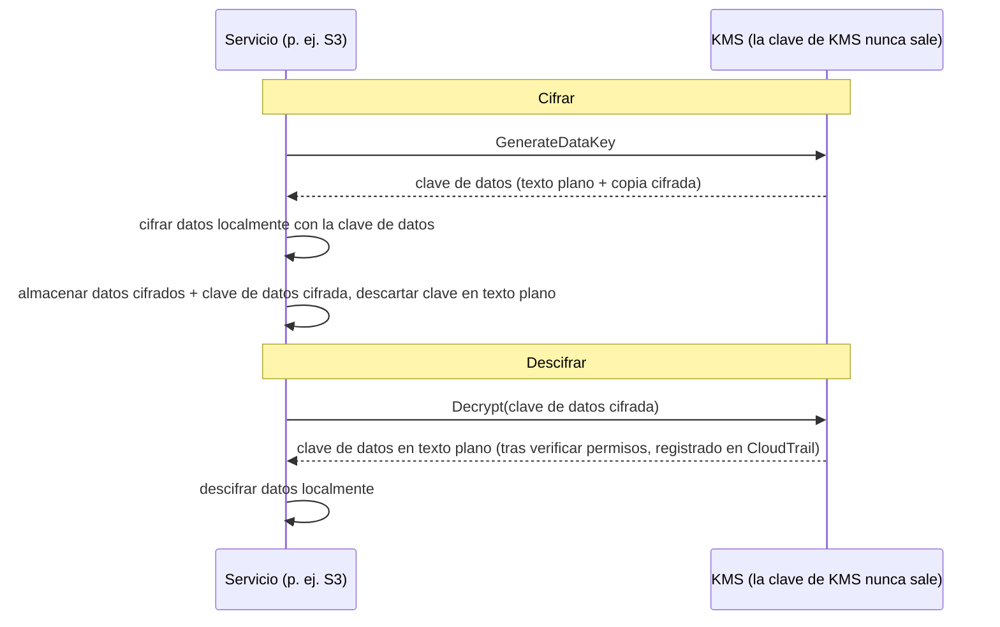

# Capítulo 16: Claves, Cerraduras y Secretos

El repositorio de git tenía miles de commits que se remontaban dos años atrás. Leo llevaba veinte minutos desplazándose, siguiendo un hilo a través del historial — buscando cuándo había aparecido por primera vez cierta cadena de conexión de base de datos. Casi se le escapa. Estaba un martes por la tarde, encajado entre dos commits anodinos, subido por alguien que desde entonces había dejado la empresa.

Una contraseña de base de datos. En texto plano. En el historial.

---

*Los controles de red del capítulo anterior eran estrictos ahora. Los grupos de seguridad limitaban el movimiento lateral. Las NACLs bloqueaban rangos de IP conocidos como malos. El perímetro había sido endurecido. Pero la auditoría de seguridad había encontrado algo que el perímetro no podía arreglar: una credencial que llevaba seis meses viviendo en el historial de git. La seguridad perimetral asume que los secretos de dentro son seguros. Este no lo era.*

---

Leo estaba revisando el historial de git cuando lo encontró. Una contraseña de base de datos. Confirmada hace seis meses, en texto plano, por alguien que ya no trabajaba en Nimbus — parte de un archivo `.env` que también contenía la clave de acceso de IAM del pipeline de despliegue, dos líneas debajo de la cadena de conexión. El commit era público. La contraseña había cambiado desde entonces — pero no lo sabían con certeza. Revisaron cada sistema que cualquiera de las dos credenciales había tocado alguna vez. Llevó cuatro horas. Ese fue el día en que Nimbus decidió dejar de poner secretos en el código.

«¿Hemos pensado en lo que pasa si alguien hace un fork del repositorio?» dijo Priya. «El historial de git es permanente. Aunque cambiemos la contraseña, cualquiera que clonara el repositorio antes de la corrección todavía tiene la credencial antigua en su historial local.»

«Lo comprobamos», dijo Leo. «La contraseña se cambió hace tres meses. Todos los sistemas confirmados.»

«Eso es el mínimo», dijo Priya. «Pero cada sistema que esa credencial tocó necesita ser revisado. No solo los que conoces.»

**La Auditoría de Cuatro Horas**

Leo había encontrado el archivo `.env` filtrado en el historial de git a las 10 de la mañana. Para las 2 de la tarde, tenían una respuesta a la pregunta que importaba: ¿alguna de las dos credenciales — la contraseña de la base de datos o la clave de acceso confirmada junto a ella — había sido usada por alguien que no fuera de los sistemas de Nimbus?

La auditoría recorrió cuatro categorías.

**Registros de acceso de RDS**: Cada conexión a la base de datos, con marca de tiempo y registrada. La contraseña filtrada apareció en tres cadenas de conexión — todas de instancias de EC2 en la VPC de Nimbus, todas con IPs de origen esperadas. Sin conexiones externas. La contraseña no había sido usada para conectarse a la base de datos desde fuera.

**Registros de acceso de S3**: La clave de acceso filtrada pertenecía al usuario de IAM del pipeline de despliegue, que tenía permisos para el bucket `nimbus-receipts`. Leo consultó los registros de acceso al servidor de S3 de los últimos seis meses. Cada acceso provino de instancias de EC2 de `us-west-2` o del rol de obtención de origen de CloudFront. Sin anomalías.

**Llamadas a la API de CloudTrail**: Cada llamada a la API de AWS hecha con el ID de clave de acceso filtrado. Leo filtró los eventos de CloudTrail por la clave. Trescientos doce eventos — todas llamadas rutinarias `s3:PutObject` del pipeline de despliegue, todas desde la misma IP, todas dentro del horario laboral. La clave solo había sido usada desde una dirección IP, que coincidía con el servidor de CI/CD.

«Y el servidor de CI/CD», dijo Priya, «está dentro de la VPC. Habría tenido que exfiltrar datos vía HTTPS a un endpoint externo, y lo habríamos visto en los flow logs.»

«Lo comprobamos», dijo Leo. «Sin HTTPS de salida desde ese servidor a IPs que no son de AWS en los últimos seis meses.»

**Veredicto**: Ninguna de las dos credenciales había sido usada por alguien fuera del equipo de Nimbus. La exposición fue un riesgo, no una brecha.

«Pero no podemos estar seguros», dijo Priya. «Podemos estar razonablemente confiados basándonos en los registros. No podemos estar seguros. Esa distinción importa.»

«¿Qué nos haría estar seguros?»

«Nada te hace estar seguro después de una exposición de credenciales. Rotas la credencial, auditas el acceso, documentas tus hallazgos y sigues adelante con mejores controles. La certeza no está disponible.»

Tom había estado calculando durante la conversación. «Cuatro horas del tiempo de tres ingenieros. Llámalo cuatro mil dólares en coste totalmente cargado. Más la rotación de credenciales, la documentación, el informe del incidente.»

«Y eso es solo la investigación», dijo Priya. «Una brecha habría sido órdenes de magnitud mayor. Notificaciones regulatorias. Comunicaciones a clientes. Posibles multas.»

«Así que la lección de cuatro mil dólares fue barata», dijo Tom.

«Considerablemente», dijo Priya. «No la repitamos.»

---

**Los Dos Problemas: Almacenar Secretos y Cifrar Datos**

La seguridad alrededor de la información sensible tiene dos problemas distintos:

**Almacenar credenciales** (contraseñas de bases de datos, claves de API, cadenas de conexión): ¿Dónde viven? ¿Quién puede acceder a ellas? ¿Cómo las rotas sin volver a desplegar tu aplicación?

**Cifrar datos** (información de clientes, registros de pagos, PII): ¿Cómo garantizas que, aunque alguien obtenga acceso no autorizado a tu base de datos o bucket de S3, no pueda leer los datos?

AWS tiene un servicio dedicado para cada problema:

- **AWS Secrets Manager**: Almacena y gestiona credenciales de forma segura
- **AWS KMS (Key Management Service)**: Gestiona claves de cifrado para cifrar y descifrar datos

Piensa en Secrets Manager como un llavero: guarda tus llaves (credenciales), las mantiene organizadas y las rota según un calendario. Piensa en KMS como una caja fuerte: no guarda lo valioso — guarda la llave que abre la cerradura que protege lo valioso.

**AWS Secrets Manager: No Más Credenciales Codificadas**

Secrets Manager es un almacén seguro para secretos: credenciales de bases de datos, claves de API, tokens OAuth, claves SSH o cualquier cosa sensible.

En lugar de que tu aplicación lea una contraseña de una variable de entorno o un archivo de configuración, llama a la API de Secrets Manager al inicio (o cuando sea necesario) y recupera el secreto. El secreto nunca toca el disco. Nunca aparece en tu código. No está en tus variables de entorno.

Así es como se ve el flujo:

**Manera antigua**:
```
DB_PASSWORD=supersecretpassword123  # en el archivo .env o variable de entorno
```

**Manera con Secrets Manager**:
```python
import boto3
client = boto3.client('secretsmanager')
secret = client.get_secret_value(SecretId='nimbus/production/db-password')
password = json.loads(secret['SecretString'])['password']
```

La instancia de EC2 necesita un rol de IAM con permiso para llamar a `secretsmanager:GetSecretValue` para ese secreto específico. Ningún otro servicio puede leerlo. El secreto nunca está en el código.

Quizás te estés preguntando: ¿por qué no usar simplemente variables de entorno? Son más simples — las configuras en el momento del despliegue, y la aplicación las lee. Las variables de entorno parecen ocultas, pero están almacenadas en tu configuración de despliegue, en el almacén de secretos de CI/CD, posiblemente registradas durante sesiones de depuración, y visibles para cualquiera con acceso al proceso en ejecución. Más importante aún, son estáticas: una vez configuradas, no cambian hasta que alguien las actualiza manualmente. Secrets Manager almacena las credenciales en un servicio cifrado con controles de acceso de IAM, registro de auditoría completo vía CloudTrail y rotación automática. Las variables de entorno no rotan. Una variable de entorno filtrada permanece válida hasta que alguien la cambia manualmente.

**Rotación Automática: El Poder Real**

La mayor característica de Secrets Manager no es almacenar secretos — es rotarlos automáticamente.

El escenario: cada 30 días, Secrets Manager genera una nueva contraseña de base de datos, la actualiza en RDS, actualiza el secreto almacenado, y tu aplicación recupera la nueva contraseña la próxima vez que la necesita. Sin intervención manual. Sin despliegue. Sin «tengo que recordar rotar esto».

La rotación se implementa como una función de Lambda. AWS proporciona plantillas para bases de datos de RDS (MySQL, PostgreSQL, Aurora). Puedes personalizar la función para cualquier tipo de credencial.

«¿Cuánto cuesta eso al mes?» preguntó Tom.

Secrets Manager cobra por secreto por mes más por llamada a la API. Para un pequeño número de contraseñas de bases de datos y claves de API, el coste es de dólares al mes — insignificante comparado con el coste de un incidente.

«El compromiso de la semana pasada», dijo Priya, «¿cuánto habría costado investigar y remediar?»

Tom guardó silencio por un momento. «Incluyendo mi tiempo, tu tiempo, el fin de semana de Leo... un par de miles de dólares.»

«Secrets Manager habría detectado la clave estática antes de que fuera explotada. Y la habría rotado automáticamente.»

Tom abrió la página de precios.

**Qué Ocurre Durante la Rotación**

«Espera — pero ¿*por qué* lo haríamos de esa manera?» preguntó Maya. «Si la contraseña de la base de datos rota, ¿se rompe la aplicación? ¿Cómo recoge la nueva contraseña sin un despliegue?»

Esta era una preocupación legítima. La rotación sin interrupciones requiere cuidado.

La rotación de Secrets Manager funciona en etapas — diseñada para prevenir el escenario «la contraseña antigua de repente es inválida, la aplicación se cae»:

**Etapa 1: Crear nueva versión del secreto.** Secrets Manager genera una nueva contraseña y la almacena como una versión pendiente del secreto. La versión actual sigue activa.

**Etapa 2: Establecer en el servicio.** La Lambda de rotación llama a la base de datos para actualizar la contraseña al nuevo valor. Ten en cuenta: con la estrategia de rotación de **usuario único** predeterminada hay un breve momento en que la contraseña antigua acaba de dejar de funcionar (el `ALTER ROLE ... PASSWORD` de PostgreSQL tiene efecto inmediato) y la nueva versión aún no es la actual. Para una rotación con cero tiempo de inactividad, Secrets Manager admite una estrategia de **usuarios alternos**: dos usuarios de base de datos con permisos idénticos, donde la rotación siempre actualiza el *inactivo* y luego cambia — las credenciales activas nunca se invalidan a mitad de vuelo. La frase del examen a recordar es «estrategia de rotación de usuarios alternos» (alternating users).

**Etapa 3: Probar el nuevo secreto.** La Lambda de rotación verifica que la nueva contraseña funciona conectándose con ella. Si esto falla, la rotación se revierte.

**Etapa 4: Finalizar.** Secrets Manager marca la nueva versión como la versión actual y degrada la versión antigua a una versión anterior. La versión anterior se conserva durante un período de gracia.

Durante el período de gracia, ambas versiones son recuperables. Si tu aplicación almacenó en caché el secreto antiguo y aún no ha recogido el nuevo, todavía puede conectarse. La próxima vez que llame a `GetSecretValue`, obtiene la versión actual (nueva).

«Así que la aplicación nunca necesita reiniciarse», dijo Leo.

«No necesariamente. Si tu aplicación almacena en caché el secreto al inicio y nunca lo refresca, necesitas o refrescarlo según un calendario o manejar los fallos de autenticación volviendo a obtener el secreto.»

«Así que la Lambda de rotación y la aplicación necesitan cooperar», dijo Maya.

«Secrets Manager hace su mitad. El código de tu aplicación necesita hacer la otra mitad: obtener el secreto cuando sea necesario, manejar los fallos de autenticación volviendo a obtenerlo.»

Leo actualizó la aplicación para capturar las excepciones de autenticación de la base de datos y, en caso de fallo, obtener un secreto fresco de Secrets Manager antes de reintentar. Dos líneas de manejo de errores. La rotación se volvió invisible para los usuarios.

---

**Inyección de Secretos en el Pipeline de CI/CD**

«¿Hemos pensado en cómo obtiene el pipeline de despliegue los secretos que necesita?» preguntó Priya. «El pipeline despliega infraestructura. Necesita credenciales de AWS. Podría necesitar cadenas de conexión de base de datos para los scripts de migración.»

Leo explicó la configuración actual: los secretos se almacenaban como GitHub Actions Secrets — cifrados en reposo en GitHub, inyectados como variables de entorno en tiempo de ejecución.

«Las credenciales están en GitHub», dijo Priya.

«Cifradas.»

«En un sistema de terceros. Una sola brecha de GitHub expone todos los secretos de nuestro pipeline.»

La solución: el pipeline de despliegue se autentica en AWS vía federación OIDC (cubierta en el Capítulo 14) y obtiene cualquier secreto que necesite de Secrets Manager en tiempo de ejecución. Sin secretos almacenados en GitHub. El rol de AWS del pipeline tiene permiso para leer secretos específicos, nada más.

```yaml
# Flujo de trabajo de GitHub Actions
- name: Get DB Migration Credentials
  env:
    AWS_DEFAULT_REGION: us-west-2
  run: |
    SECRET=$(aws secretsmanager get-secret-value \
      --secret-id nimbus/staging/db-migration \
      --query SecretString --output text)
    DB_URL=$(echo $SECRET | jq -r '.url')
    # Ejecutar la migración con DB_URL — nunca almacenada en un archivo
    flyway -url="$DB_URL" migrate
```

El secreto se obtiene, se usa en memoria y se descarta. Nunca se escribe en disco, nunca se almacena en variables de entorno que persisten después del trabajo, nunca en un archivo de registro.

«¿Y si el secreto se imprime en el registro?» preguntó Leo.

«GitHub Actions enmascara automáticamente los valores de los secretos que están configurados como GitHub Secrets. Pero este secreto no es un GitHub Secret — viene de Secrets Manager. Necesitas enmascararlo manualmente, o mejor, nunca registrarlo.»

«Así que la disciplina es: obtener, usar, descartar. Nunca registrar secretos. Nunca almacenarlos en archivos.»

«Esa disciplina», dijo Priya, «es en la que la auditoría de cuatro horas confirmó que habíamos estado fallando.»


**AWS KMS: La Fábrica de Cerraduras**

«Espera — pero ¿*por qué* lo haríamos de esa manera?» preguntó Maya. «¿Por qué un servicio de gestión de claves separado? ¿No podemos simplemente cifrar los datos nosotros mismos y almacenar la clave en Secrets Manager?»

Podrías almacenar las claves de cifrado en Secrets Manager. Pero entonces, ¿quién controla el acceso a la clave? ¿Qué garantiza que la clave se rota? ¿Qué le demuestra a un auditor que la clave solo fue usada por servicios autorizados? KMS responde a todas estas preguntas. No es solo almacenamiento — es un servicio de gestión del ciclo de vida de las claves con seguridad respaldada por hardware, políticas de IAM detalladas por clave y una pista de auditoría completa de cada uso. Secrets Manager almacena lo que necesitas para conectarte a los sistemas. KMS protege los sistemas en sí.

AWS KMS (Key Management Service) gestiona **claves criptográficas** — los valores secretos usados para cifrar y descifrar datos.

La analogía: KMS es como una empresa de cajas fuertes que guarda la llave maestra. Tus datos (el contenido de la caja) están cifrados. Solo alguien con permiso para usar la clave de KMS puede descifrarlos. KMS registra cada uso de cada clave en CloudTrail.

Las **Claves Maestras de Cliente (CMKs)** — ahora llamadas claves de KMS — vienen en tres tipos de propiedad:

**Claves propiedad de AWS**: Claves que AWS posee y usa en muchas cuentas de clientes — nunca las ves, nunca pagas por ellas, y no aparecen en tu cuenta. Varios servicios las usan por defecto (el cifrado predeterminado de DynamoDB, por ejemplo).

(Una distinción que vale la pena tener clara: el cifrado predeterminado **SSE-S3** de S3 *no* es un modelo de clave de KMS en absoluto — S3 gestiona sus propias claves AES-256 completamente fuera de KMS, sin clave que ver y sin pista de auditoría de uso de claves. **SSE-KMS** es la opción de S3 que pasa por KMS, usando ya sea la clave administrada por AWS `aws/s3` o una clave administrada por el cliente. Desencadenante del examen: «auditar quién usó la clave de cifrado» o «controlar la rotación y la política de clave» → SSE-KMS con una clave administrada por el cliente — cada uso aterriza en CloudTrail.)

**Claves administradas por AWS**: AWS crea y gestiona la clave automáticamente *en tu cuenta* para servicios como S3, EBS, RDS (con nombres como `aws/s3`). Puedes verla y auditar su uso en CloudTrail, pero no puedes cambiar su política ni su rotación — AWS la rota automáticamente cada año. Gratis.

**Claves administradas por el cliente**: Tú creas la clave en KMS y controlas cada aspecto de ella: quién puede usarla, cuándo rota, quién puede administrarla. Puedes habilitar la rotación automática de claves con un período configurable entre 90 días y 2.560 días (7 años); el período de rotación predeterminado es 365 días (anual). También puedes activar una **rotación bajo demanda** inmediatamente — útil tras una sospecha de exposición, sin esperar al calendario. Nota: la rotación automática aplica a las claves simétricas con material generado por KMS — las claves asimétricas y el material de clave importado no pueden rotarse automáticamente. Coste: $1/mes por clave más cargos por llamada a la API.

Si eliges claves de KMS administradas por el cliente, entonces obtienes control total sobre los calendarios de rotación, las políticas de acceso y la visibilidad de auditoría, pero pagas por clave por mes y asumes la responsabilidad de la gestión de claves; si eliges claves administradas por AWS, entonces obtienes cifrado con cero sobrecarga operativa y sin coste por la clave en sí, pero no puedes personalizar los calendarios de rotación ni las políticas de clave — son gestionados completamente por AWS.

**Cifrado en Servicios de AWS: Integración con KMS**

La mayoría de los servicios de AWS se integran con KMS para el cifrado:

**S3**: Habilita el «cifrado del lado del servidor con KMS» en un bucket. Cada objeto se cifra en reposo con una clave de KMS. Leer un objeto requiere permiso tanto en el bucket de S3 *como* en la clave de KMS.

**RDS**: Habilita el cifrado en el momento de la creación. El almacenamiento de la base de datos, las copias de seguridad y las instantáneas se cifran con una clave de KMS. Nota: el cifrado no puede habilitarse en una instancia de RDS no cifrada existente — debes tomar una instantánea, copiarla con el cifrado habilitado y restaurar.

**EBS**: Cifra los volúmenes con KMS. Los nuevos volúmenes creados a partir de instantáneas cifradas se cifran automáticamente.

**DynamoDB**: El cifrado en reposo con KMS está habilitado por defecto en todas las tablas.

**ElastiCache Redis**: Cifrado en reposo con KMS para datos en caché sensibles.

El principio: los datos deben cifrarse en reposo (almacenados en disco) y en tránsito (moviéndose a través de una red). KMS gestiona el cifrado en reposo. TLS/SSL (proporcionado automáticamente por los servicios de AWS) gestiona el cifrado en tránsito.

**Cifrado de Sobre: Cómo Funciona Realmente KMS**

Aquí hay un detalle que te ayuda a entender el comportamiento de KMS y las preguntas del examen.

KMS no cifra tus datos directamente en la mayoría de los casos. Usa el **cifrado de sobre** (envelope encryption):

1. KMS genera una **clave de datos** (una clave simétrica única)
2. El servicio usa la clave de datos para cifrar tus datos localmente (rápido — cifrado simétrico)
3. El servicio le pide a KMS que cifre la propia clave de datos (usando tu clave de KMS)
4. Tanto los datos cifrados como la clave de datos cifrada se almacenan
5. Tus datos reales nunca salen del servicio — solo la clave de datos va a KMS para su cifrado/descifrado

Cuando lees los datos:

1. El servicio le pide a KMS que descifre la clave de datos
2. KMS verifica los permisos, descifra la clave de datos y la devuelve
3. El servicio usa la clave de datos descifrada para descifrar tus datos localmente



Esto significa que KMS puede manejar datos muy grandes sin enviarlos todos a través de la API de KMS. Solo las claves pequeñas van a KMS. CloudTrail registra cada llamada a la API de KMS — cada operación de cifrado y descifrado.

**Políticas de Clave de KMS: El Modelo de Acceso**

«¿Hemos pensado en lo que pasa si una política de IAM y una política de clave entran en conflicto?» preguntó Priya. «KMS tiene su propio control de acceso encima de IAM.»

Las claves de KMS tienen **políticas de clave** — políticas basadas en recursos adjuntas a la clave en sí. Son distintas de las políticas de IAM y siguen reglas de evaluación diferentes.

Para que un principal use una clave de KMS, dos cosas deben ser ciertas:

**Primero**: La política de clave debe permitirlo. Si la política de clave no otorga explícitamente acceso al principal, no puede usar la clave — independientemente de lo que diga su política de IAM. Esto es diferente de la mayoría de los recursos de AWS, donde las políticas de IAM por sí solas son suficientes.

**Segundo**: La política de IAM del principal debe permitir la acción de KMS (p. ej., `kms:Decrypt`, `kms:GenerateDataKey`).

Ambas deben decir sí. Que cualquiera de las dos diga no significa que la acción se deniega.

La política de clave predeterminada que AWS crea para las claves administradas por el cliente incluye una declaración que dice «la cuenta raíz puede gestionar esta clave». Esto es importante: significa que un administrador de IAM a nivel de cuenta siempre puede otorgar acceso a una clave, aunque la política de clave no lo nombre directamente — porque la delegación a la cuenta raíz está en su lugar.

«¿Entonces si eliminamos la cuenta raíz de la política de clave», preguntó Leo, «las políticas de IAM dejan de funcionar para esa clave?»

«Correcto. Eliminar la delegación a la cuenta raíz es una forma de bloquear una clave tan estrictamente que solo los principales específicos nombrados en la política de clave puedan usarla — ni siquiera los administradores de cuenta. También es una forma de bloquearte accidentalmente fuera de tu propia clave.»

«¿Podemos recuperarnos?»

«Solo contactando con el Soporte de AWS. Si nadie puede usar la clave y la política de clave no puede actualizarse, los datos cifrados con esa clave son efectivamente inaccesibles.»

«Así que no elimines la cuenta raíz de la política de clave sin una razón extremadamente buena.»

«Correcto.»

---

**Claves Asimétricas: Firma y Verificación**

KMS también admite pares de claves asimétricas — una clave pública y una clave privada.

Los casos de uso:

**Firma digital**: Firmas un documento o un token JWT con la clave privada. Cualquiera con la clave pública puede verificar que la firma vino del poseedor de la clave privada, y que el contenido no ha sido manipulado.

**Cifrado de clave pública**: Cualquiera puede cifrar datos con la clave pública. Solo el poseedor de la clave privada puede descifrarlos.

Para Nimbus, las claves asimétricas se volvieron relevantes cuando implementaron un sistema de firma de webhooks para los socios restauradores. Cuando Nimbus enviaba un evento al servidor de un socio restaurador (un nuevo pedido, una actualización de estado), el socio necesitaba verificar que el evento realmente venía de Nimbus y no había sido falsificado.

La implementación:

1. Nimbus crea una clave de KMS asimétrica (RSA de 2048 bits, algoritmo SIGN_VERIFY)
2. Al enviar un webhook, Nimbus llama a `kms:Sign` con la clave privada para firmar la carga útil del evento
3. La firma se incluye en el encabezado del webhook
4. Nimbus publica la clave pública (descargable desde la consola de KMS)
5. El servidor del socio restaurador obtiene la clave pública y la usa para verificar la firma en cada webhook entrante

La clave privada nunca sale de KMS. Nimbus nunca tiene acceso al material de clave privada en bruto. KMS realiza la operación de firma dentro de su módulo de seguridad de hardware.

«Así que aunque alguien comprometiera un servidor de Nimbus», dijo Rafael, «no podría falsificar la firma de un webhook. La clave privada está en KMS, no en ningún servidor.»

«Correcto. Firmar requiere una llamada a la API de KMS. Cada llamada a la API se registra en CloudTrail. Si alguien intentara firmar un evento fraudulento, veríamos la llamada a la API.»

---

**La Historia de la Eliminación de la Clave**

Tres meses después de la configuración de KMS, Tom cometió un error.

Estaba limpiando recursos de AWS no utilizados — funciones de Lambda antiguas, buckets de S3 obsoletos, paneles de CloudWatch abandonados. Se movía rápido. Programó accidentalmente una clave de KMS para su eliminación.

La clave era `nimbus/prod/order-receipts` — la clave administrada por el cliente usada para cifrar el bucket de S3 de los recibos de pedidos.

«Ayer eliminé en lote doce recursos y no comprobé cuál era el duodécimo», dijo Tom secamente. Había programado la eliminación y había seguido adelante. Notó el error a la mañana siguiente cuando revisó sus acciones.

Abrió la consola de KMS. El estado de la clave decía: «Pendiente de eliminación. Eliminación en 7 días.»

La había programado para el período de espera mínimo.

«¿Podemos cancelarlo?» preguntó.

Priya abrió la documentación. «Sí. Durante el período de espera, la clave está deshabilitada pero no eliminada. Puedes cancelar la eliminación.»

Tom canceló la eliminación en menos de un minuto. La clave fue restaurada a estado activo.

«Siete días es el período de espera mínimo», dijo Priya. «AWS lo impone porque si una clave se elimina y había datos cifrados con ella, esos datos desaparecen para siempre. Irrecuperables. El período de espera te da tiempo para darte cuenta del error.»

«¿Cuánto debería durar el período de espera?»

«El máximo son treinta días. Para cualquier clave que cifre datos de producción, usa treinta días. Las tres semanas extra de protección contra accidentes valen la inconveniencia menor.»

Tom actualizó todas las configuraciones de eliminación de claves de producción a treinta días. También configuró una alarma de CloudWatch que se disparaba si el estado de cualquier clave de KMS cambiaba a «Pendiente de eliminación» — para que la próxima vez que alguien (incluido él) cometiera el mismo error, el equipo lo supiera en cinco minutos.

---

**Secrets Manager vs Parameter Store**

AWS también tiene **Systems Manager Parameter Store**, que almacena valores de configuración (no solo secretos). Parameter Store es más económico — gratuito para los parámetros estándar. También puede almacenar parámetros cifrados con KMS.

Para secretos que necesitan rotación: Secrets Manager.

Para valores de configuración y parámetros no sensibles: Parameter Store (el nivel gratuito es muy generoso).

Para la configuración de la aplicación (números de puerto, indicadores de características, configuraciones específicas del entorno): Parameter Store.

| | Secrets Manager | SSM Parameter Store |
|---|---|---|
| Rotación automática | Sí (respaldada por Lambda) | No |
| Coste | ~$0,40/secreto/mes | Gratis (estándar) |
| Cifrado | Siempre | Opcional (con KMS) |
| Versionado | Sí | Sí |
| Acceso entre cuentas | Sí | Limitado |
| Mejor para | Contraseñas de bases de datos, claves de API | Valores de configuración, indicadores de características |

## El Certificado en la Puerta

Dos semanas después de la migración de secretos, Priya estaba revisando el entorno de staging de Nimbus en su teléfono cuando notó la barra de direcciones.

«No es seguro.»

Abrió la URL de producción. Lo mismo.

«Leo», dijo, poniendo su teléfono sobre la mesa. «¿Estamos ejecutando en HTTP?»

Leo lo comprobó. «El listener del ALB está en el puerto 80. Nunca configuramos HTTPS.»

«¿Así que cada solicitud que hacen nuestros usuarios — cada pedido, cada inicio de sesión — va por HTTP sin cifrar?»

«Tenemos TLS en la conexión de RDS», ofreció Leo.

«Eso son datos en tránsito entre la aplicación y la base de datos. Estoy hablando de datos en tránsito entre el navegador del usuario y nuestro balanceador de carga. Eso no está cifrado en absoluto.»

Tom había estado escuchando. «¿Eso es un problema de seguridad o un problema de percepción?»

«Ambos», dijo Priya. «HTTP sin cifrar significa que cualquier red entre el usuario y nuestro servidor — el router de una cafetería, un ISP — puede leer el tráfico. Contraseñas, detalles de pedidos, tokens de sesión. Y los navegadores modernos advierten a los usuarios con "No es seguro". Eso mata las tasas de conversión.»

«Así que necesitamos un certificado TLS», dijo Maya. «¿Cuánto cuesta?»

«Nada», dijo Priya. «AWS Certificate Manager.»

**AWS Certificate Manager (ACM)** aprovisiona certificados TLS/SSL gratuitos para usar con servicios gestionados por AWS: ALBs, distribuciones de CloudFront y API Gateway. No compras un certificado, no gestionas un calendario de renovación, ni tocas el material de clave privada. ACM maneja todo el ciclo de vida del certificado.

Un certificado emitido por ACM es válido durante 13 meses. Antes de que expire, ACM lo renueva automáticamente. Si la renovación tiene éxito, el nuevo certificado se adjunta a tu balanceador de carga o distribución sin ninguna acción de tu parte. El candado del navegador sigue verde. La alerta de expiración que olvidaste configurar nunca se dispara.

**Dos tipos de certificados de ACM**:

Los **certificados públicos** son emitidos por la autoridad de certificación de Amazon y son de confianza para todos los navegadores principales. Son completamente gratuitos para usar con ALB, CloudFront y API Gateway. Validas la propiedad del dominio ya sea vía DNS o email.

Los **certificados privados** son emitidos por AWS Private CA — una autoridad de certificación privada gestionada que ejecutas para servicios internos (mTLS servicio a servicio, herramientas internas, clientes de VPN). Private CA tiene un coste mensual.

Para Nimbus, los certificados públicos eran la elección correcta.

**Validación DNS vs. validación por email**:

Leo abrió la consola de ACM e inició una solicitud de certificado para `eatnimbus.com` y `*.eatnimbus.com`.

«Me está preguntando cómo quiero validar la propiedad», dijo. «DNS o email.»

«DNS», dijo Priya. «Siempre DNS.»

Con la validación DNS, ACM añade un registro CNAME específico a tu zona alojada. Route 53 puede hacer esto automáticamente — un clic en la consola. Mientras ese registro CNAME exista, ACM puede renovar automáticamente el certificado sin ninguna acción humana. La validación por email envía un correo al contacto registrado del dominio y requiere un clic manual cada vez que el certificado se renueva. Ese clic se olvida. La validación DNS no requiere que nadie recuerde nada.

«¿Así que añado el registro CNAME una vez», dijo Leo, «y se renueva para siempre?»

«Hasta que alguien elimine el registro CNAME», dijo Priya. «No elimines el registro CNAME.»

Leo solicitó el certificado, añadió el CNAME de validación en Route 53 (que ACM se ofreció a hacer automáticamente) y esperó cinco minutos. El estado del certificado cambió a Emitido. Lo adjuntó al listener HTTPS del ALB en el puerto 443 y añadió una regla de redirección en el puerto 80 para enviar todo el tráfico HTTP a HTTPS.

Tom actualizó la URL de producción.

El candado apareció.

Un detalle regional digno de mención: un certificado es un recurso regional, y debe vivir en la misma región que el servicio que lo usa. Para un ALB, esa es la región del ALB. Para **CloudFront**, el certificado debe solicitarse (o importarse) en **`us-east-1`** — siempre, independientemente de dónde se ejecuten tus orígenes — porque CloudFront es un servicio global anclado ahí. Leo ya había tropezado con esto en el Capítulo 13; también es un hecho fiable del examen.

**Lo único que los certificados de ACM no pueden hacer**:

«¿Puedo descargar el certificado?» preguntó Leo. «Quiero instalarlo en la instancia de EC2 de administración interna.»

«No», dijo Priya.

Los certificados públicos gratuitos de ACM no pueden exportarse. No puedes descargar la clave privada e instalarla en una instancia de EC2, un servidor Nginx o cualquier cosa fuera de los servicios gestionados por AWS. El material de clave privada nunca sale de ACM. Esto es intencional — previene que la clave privada se filtre, se almacene de forma insegura o se olvide cuando el certificado expira.

Para casos de uso que requieren un certificado instalable — una instancia de EC2 actuando como proxy personalizado, un servidor on-premises — hay tres rutas: un certificado de una autoridad de terceros (Let's Encrypt, por ejemplo), AWS Private CA con la exportación de certificados habilitada, o — desde junio de 2025 — los **certificados públicos exportables** de pago de ACM (opcionales en la emisión, cobrados por FQDN o comodín), cuya clave privada *sí* puede exportarse para usarse en cualquier lugar.

«Para nuestro ALB y nuestra distribución de CloudFront», dijo Priya, «ACM es exactamente lo correcto. Gratis, automático, y nunca tocamos una clave.»

## Fortalezas y Limitaciones

**AWS Secrets Manager**:

- Rotación automática de secretos sin cambios en el código ni despliegues
- Control de acceso de IAM detallado por secreto (cada secreto es un recurso de IAM separado)
- Versionado — la versión anterior permanece accesible durante la rotación, evitando caídas de conexión
- Auditoría a través de CloudTrail — cada llamada `GetSecretValue` se registra con la identidad de quien llama
- Acceso entre cuentas — los secretos de una cuenta pueden compartirse con el rol de otra cuenta
- Coste: ~$0,40/secreto/mes + llamadas a la API (aproximadamente $0,05 por cada 10.000 llamadas a la API)

**AWS KMS**:

- Gestión centralizada de claves con pista de auditoría completa — cada cifrado y descifrado registrado
- Rotación automática configurable de claves para claves administradas por el cliente (90 días a 2.560 días; predeterminado 365 días) — el material de clave antiguo todavía descifra los datos existentes, el material de clave nuevo cifra los datos nuevos
- Permisos de IAM detallados por clave (políticas de clave + políticas de IAM — ambas deben permitir)
- Respaldado por Módulo de Seguridad de Hardware (HSM) — las claves nunca salen del HSM en texto plano
- Soporte de claves multi-Región para escenarios de recuperación ante desastres
- Soporte de claves asimétricas para firma y verificación digital
- Coste: $1/mes por clave + $0,03 por cada 10.000 llamadas a la API

**Donde se complica**:

- Las políticas de clave de KMS son independientes de (y se evalúan junto con) las políticas de IAM — depurar errores de acceso denegado requiere revisar ambas
- El cifrado en reposo debe planificarse de antemano — no puedes cifrar una instancia de RDS no cifrada existente en su lugar
- La eliminación de claves en KMS tiene un período de espera de 7 a 30 días — un mecanismo de seguridad, pero fácil de olvidar durante la configuración y peligroso de activar accidentalmente
- La rotación requiere que el código de la aplicación maneje la reobtención de secretos en caso de fallo de autenticación — Secrets Manager rota la credencial, pero la aplicación debe recogerla
- Los costes de Secrets Manager escalan con el número de secretos y el volumen de llamadas a la API a gran escala
- La política de clave predeterminada (incluida la delegación a la cuenta raíz) es crítica de preservar — eliminarla puede bloquear a los administradores fuera de la clave

## Resumen

Las cuatro horas dedicadas a rastrear una credencial comprometida a través de cada sistema que tocó fueron cuatro horas que Secrets Manager podría haber prevenido. La rotación automática significa que una credencial robada tiene una vida útil corta. KMS significa que aunque alguien llegue a los datos, no puede leerlos sin una clave que no está autorizado a usar. Y un período de espera de treinta días para la eliminación de claves significa que una eliminación accidental puede cancelarse antes de que se convierta en un evento de pérdida de datos.

- Nunca almacenes credenciales en código, variables de entorno o archivos de configuración confirmados en el control de versiones.
- **Secrets Manager** almacena las credenciales de forma segura y las rota automáticamente. Las aplicaciones obtienen los secretos a través de la API en tiempo de ejecución.
- La **rotación** ocurre en etapas: crear nueva versión, actualizar en el servicio, probar, promover. Tanto la versión antigua como la nueva son brevemente válidas, evitando caídas de conexión durante la rotación.
- **KMS** gestiona las claves de cifrado. La mayoría de los servicios de AWS se integran con KMS para el cifrado en reposo.
- **Cifrado de sobre**: KMS cifra la clave, no los datos directamente. El servicio cifra los datos usando una clave de datos local, que KMS cifra. Solo las claves pequeñas atraviesan la API de KMS.
- **Claves de KMS administradas por el cliente**: control total sobre la rotación (configurable de 90 a 2.560 días, predeterminado 365 días anual), el acceso y la auditoría ($1/mes). **Claves administradas por AWS**: automáticas, sin necesidad de configuración, gratis.
- **Políticas de clave de KMS**: La política de clave es una política basada en recursos que funciona junto a IAM. Ambas deben decir sí. La delegación a la cuenta raíz en la política de clave predeterminada asegura que los administradores de IAM siempre puedan otorgar acceso.
- **Claves asimétricas**: KMS admite pares de claves RSA y ECC para firma y verificación. La clave privada nunca sale del HSM.
- **Eliminación de claves**: Período de espera mínimo de 7 días, máximo de 30 días. Las claves eliminadas significan datos cifrados permanentemente inaccesibles. Usa 30 días para las claves de producción, y monitorea el estado de eliminación pendiente.
- **Secretos de CI/CD**: Obtenlos de Secrets Manager en tiempo de ejecución usando federación OIDC. Nunca almacenes secretos como variables de la plataforma de CI/CD.

## Consejos para el Examen

*Dominio SAA-C03: Diseñar Arquitecturas Seguras (Dominio 1, Tarea 1.3)*

- **Secrets Manager vs SSM Parameter Store**: Secrets Manager para credenciales que necesitan rotación automática; Parameter Store para la configuración general. El examen los distingue por el requisito de rotación y la sensibilidad al coste.
- **Políticas de clave de KMS**: Una clave de KMS tiene su propia política de clave (una política basada en recursos). Las políticas de IAM por sí solas no otorgan acceso a una clave de KMS — la política de clave debe permitirlo explícitamente. Tanto la política de clave como la política de IAM deben permitir la acción.
- **Cifrar RDS**: No se puede habilitar el cifrado en una instancia de RDS no cifrada existente. El proceso: crear una instantánea → copiar la instantánea con el cifrado habilitado → restaurar desde la instantánea cifrada → migrar el tráfico a la nueva instancia.
- **Cifrado de EBS**: Los nuevos volúmenes pueden cifrarse. Las instantáneas de volúmenes cifrados siempre están cifradas. Los volúmenes no cifrados no pueden cifrarse directamente — instantánea + copia + restauración.
- **CloudTrail + KMS**: Cada llamada a la API de KMS se registra en CloudTrail. Esta es una característica clave de cumplimiento. Cuando un examen pregunte cómo auditar quién descifró qué datos, la respuesta es CloudTrail + KMS.
- **Claves de KMS multi-Región**: Replican el material de clave en múltiples regiones para que el descifrado pueda ocurrir sin llamadas a la API entre regiones. El examen las usa para la recuperación ante desastres multi-región con datos cifrados.
- **KMS vs CloudHSM**: KMS es multi-inquilino (administrado por AWS). CloudHSM es un módulo de seguridad de hardware dedicado que solo tú controlas. Señales del examen: «FIPS 140-2 Nivel 3», «HSM dedicado», «operaciones criptográficas gestionadas por el cliente» → CloudHSM.
- **Cifrado de sobre**: KMS genera una clave de datos, el servicio la usa para cifrar los datos localmente, KMS cifra la clave de datos. Pregunta del examen: «¿por qué KMS no cifra grandes cantidades de datos directamente?» → rendimiento; el cifrado de sobre mantiene los datos grandes locales.
- **Claves de KMS asimétricas**: Usadas para la firma digital, la verificación de JWT o el cifrado de clave pública. La clave privada nunca sale de KMS. `kms:Sign` es la llamada a la API para firmar; `kms:Verify` para verificar.
- **Período de espera de eliminación de claves**: 7-30 días. Durante este período, la clave está deshabilitada y no se puede usar, pero la eliminación puede cancelarse. Después de la eliminación, cualquier dato cifrado con esa clave es permanentemente irrecuperable.
- **ACM (AWS Certificate Manager):** Certificados TLS públicos gratuitos para usar con ALB, CloudFront y API Gateway. Renovación automática vía validación DNS. La clave privada de los certificados públicos gratuitos no puede exportarse — viven solo dentro de AWS (existe una opción de pago de *certificado público exportable* desde 2025 para uso en EC2/on-premises). Desencadenante del examen: «HTTPS en el balanceador de carga o la CDN» → ACM.

## Ejercicios

**Ejercicio 1 — Recordar**

Explica el concepto de cifrado de sobre. ¿Por qué KMS cifra una pequeña clave de datos en lugar de cifrar directamente los datos de tu aplicación?

*(Pista: Piensa en qué ocurre si tienes 1 GB de datos para cifrar y cuáles serían las implicaciones de rendimiento de enviar 1 GB a un servicio KMS remoto.)*

**Ejercicio 2 — Escenario SAA-C03**

*Escenario*: Una empresa de servicios financieros almacena datos sensibles de clientes en una base de datos de RDS MySQL. Un nuevo requisito de cumplimiento exige que:

1. Todos los datos deben estar cifrados en reposo
2. Todo el uso de claves de cifrado debe ser auditable
3. Las claves de cifrado deben ser controladas por el cliente (no administradas por AWS)
4. La contraseña de la base de datos debe rotarse automáticamente cada 90 días

La base de datos fue creada hace seis meses sin el cifrado habilitado. ¿Qué conjunto de acciones cumple MEJOR con los cuatro requisitos?

A) Habilitar el cifrado de RDS en la base de datos existente; crear una clave de KMS administrada por el cliente; configurar Secrets Manager con rotación de 90 días  
B) Crear una instantánea de la base de datos existente; copiar la instantánea con cifrado usando una clave de KMS administrada por el cliente; restaurar desde la instantánea cifrada; configurar Secrets Manager con rotación de 90 días  
C) Crear una nueva instancia de RDS cifrada con una clave administrada por AWS; migrar los datos de la instancia antigua; configurar Secrets Manager con rotación de 90 días  
D) Habilitar el cifrado en reposo de RDS en la base de datos existente usando una clave administrada por AWS; configurar Secrets Manager con rotación de 90 días

**Pista 1**: No puedes habilitar el cifrado en una instancia de RDS no cifrada existente directamente.

**Pista 2**: Las claves "controladas por el cliente" significa claves de KMS administradas por el cliente, no claves administradas por AWS.

**Pista 3**: El proceso de copia de instantánea es la ruta de migración estándar para RDS cifrado.

**Respuesta**: B

**Explicación**: El cifrado de RDS no puede habilitarse en una instancia existente. El enfoque estándar es: crear una instantánea de la instancia existente → copiar la instantánea con el cifrado habilitado usando una clave de KMS administrada por el cliente (cumple los requisitos 1, 2 y 3) → restaurar desde la instantánea cifrada. Las claves de KMS administradas por el cliente registran automáticamente todos los usos en CloudTrail (auditoría) y mantienen las claves de cifrado bajo tu control. Secrets Manager gestiona la rotación automática de la contraseña cada 90 días (cumple el requisito 4).

**¿Por qué no A?** No puedes habilitar el cifrado en una instancia de RDS no cifrada existente directamente.

**¿Por qué no C?** Las claves administradas por AWS no satisfacen el requisito de "controladas por el cliente" (requisito 3).

**¿Por qué no D?** Mismo problema que A (no se puede habilitar directamente) más que la clave administrada por AWS no satisface el requisito 3.

*Dominio SAA-C03: Diseñar Arquitecturas Seguras — Tarea 1.3*

**Ejercicio 3 — Desafío de Arquitectura** *(Opcional)*

Nimbus necesita almacenar los siguientes datos sensibles:

- Contraseña de base de datos para la instancia de RDS de producción
- Clave secreta de la API de Stripe (usada para el procesamiento de pagos)
- Una clave de cifrado simétrica para cifrar el historial de pedidos de clientes en DynamoDB
- Valores de configuración por restaurante (endpoints de API, indicadores de características: no sensibles)

¿Qué servicio o enfoque de AWS usarías para cada uno? ¿Qué estrategia de rotación aplicarías a cada uno?

*(No existe una única respuesta correcta. El objetivo es practicar la coincidencia de herramientas de seguridad con casos de uso.)*

## Escena Post-Créditos

«Ya lo desplegué — oh.» Leo había migrado los secretos de producción a Secrets Manager mientras el entorno de desarrollo todavía usaba las antiguas variables de entorno. El entorno de desarrollo se rompió. Había tenido que revertir la configuración de dev manualmente.

«Staging primero», dijo Priya. «Luego producción.»

«Lo sé», dijo Leo.

Los secretos fueron migrados.

Contraseñas de bases de datos: Secrets Manager, rotando cada 30 días.

Claves de API: Secrets Manager, con una Lambda de rotación que llamaba a la API del proveedor de pagos para generar una nueva clave.

Datos de pedidos de clientes: cifrados con una clave de KMS administrada por el cliente.

Credenciales antiguas: desactivadas. Archivos de configuración antiguos: eliminados. Secretos antiguos de GitHub Actions: borrados.

«Ahora estamos listos para una auditoría», dijo Priya.

«Define listos para una auditoría», dijo Maya.

«Si un auditor de cumplimiento nos pidiera demostrar que no hay credenciales codificadas en nuestro código ni expuestas en nuestra infraestructura, podríamos mostrarles: cada secreto está en Secrets Manager, cada clave de cifrado está en KMS, cada acceso está registrado en CloudTrail.»

«¿Cuándo fue la última vez que alguien revisó los registros de CloudTrail?»

Una pausa.

«Yo los reviso cada semana», dijo Priya.

«¿Y si apareciera algo inusual, cómo lo sabríamos?»

«Eso», dijo Priya cerrando su portátil, «es la próxima conversación.»

En el próximo capítulo: las tres capas de defensa que se interponen entre Nimbus e internet.
