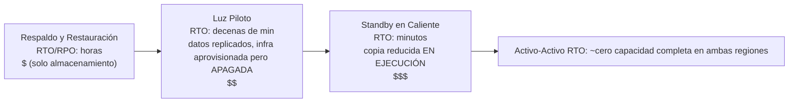

# Capítulo 18: Cuando las Cosas Se Rompen

Las luces se apagaron a las 11:17 PM.

No en la oficina de Nimbus: Leo estaba en casa, en el sofá, con el portátil entreabierto. Las luces se apagaron en un centro de datos en Oregón que él nunca había visitado, en un edificio que nunca había visto, en una sala llena de servidores que nunca había tocado. Todavía no lo sabía. Hubo un momento, solo un momento, de silencio absoluto antes de que los generadores de respaldo arrancaran en algún lugar lejano. Esa clase de oscuridad en la que no puedes saber si tienes los ojos abiertos o cerrados.

Entonces llegó la notificación de Slack.

---

Después de que los sistemas de monitoreo del capítulo 17 estuvieran implementados, el equipo había sentido algo parecido a la confianza. Las alertas se disparaban. Los paneles estaban en verde. Los registros fluían hacia CloudWatch. Habían pasado tres semanas cableando visibilidad en cada rincón de la infraestructura de Nimbus.

Lo que nadie había dicho en voz alta —de lo que el monitoreo no protegía— era que la visibilidad y la resiliencia son cosas distintas. Puedes observar cómo algo falla con detalle perfecto. Observarlo no lo detiene.

Esa lección llegó a las 11:23 PM de un jueves.

---

Leo recibió la notificación de Slack.

"us-west-2 — fallo del clúster del centro de datos — servicio degradado."

Abrió la consola de AWS. Las instancias de EC2 en una de las Zonas de Disponibilidad mostraban fallos en las verificaciones de estado. Su Auto Scaling Group había detectado instancias no saludables y estaba lanzando reemplazos, en la misma zona.

En el clúster que estaba fallando.

Las nuevas instancias tampoco podían iniciarse. Estaban en la misma zona del fallo de hardware.

"El balanceador de carga está enrutando el tráfico a ambas AZs", dijo Leo para nadie. "La mitad de nuestro tráfico va a instancias que no funcionan."

Abrió la consola de EC2 y empezó a hacer clic. En Balanceadores de Carga, el Application Load Balancer mostraba ambos grupos de destino como saludables, porque la verificación de salud pasaba en el puerto 80, e incluso las instancias defectuosas respondían a esa verificación. Solo que no podían procesar solicitudes reales.

Intentó eliminar la AZ con fallos del grupo de destino. La consola aceptó el cambio. Pero el Auto Scaling Group, configurado para mantener el equilibrio, inmediatamente empezó a intentar reemplazar las instancias terminadas, en la misma zona con fallos.

Leo se quedó mirando la pantalla. Acababa de empeorarlo.

Abrió la configuración del ASG. La opción "Equilibrar la capacidad entre las Zonas de Disponibilidad" estaba activa. En operación normal esto era un buen diseño. En ese momento estaba luchando activamente contra él.

Cambió el ASG para usar solo la zona saludable. Aplicó el cambio.

La consola mostró el cambio como "En servicio".

Tres minutos después, surgieron las primeras instancias de reemplazo saludables.

El balanceador de carga empezó a enrutar tráfico. La tasa de error bajó del 52% al 4%. El 4% restante eran solicitudes que habían aterrizado en las últimas instancias no saludables que aún estaban drenando conexiones.

Para las 11:45 PM —veintidós minutos después de que comenzara el fallo— el tráfico estaba estable.

Veintidós minutos de servicio degradado antes de que lo notara y desplazara manualmente el ASG para que solo usara la zona saludable.

"Esto ocurrió porque todo estaba en una sola AZ", dijo Priya a la mañana siguiente.

"No", dijo Leo. "Tenía instancias en dos AZs. El problema fue que las instancias de reemplazo se estaban lanzando en la AZ con fallos."

"¿Y la base de datos?"

Leo se detuvo.

"El primario de RDS estaba en la zona con fallos", dijo. "Multi-AZ en realidad hizo su trabajo: hizo failover al standby en la zona saludable en unos noventa segundos. Pero nuestros servidores de aplicación mantuvieron abiertas sus conexiones muertas y reintentaron contra la dirección IP en caché en lugar de volver a resolver el nombre DNS del endpoint. La base de datos estaba saludable a las 11:25. Nuestra app no se reconectó limpiamente hasta que reinicié los pools de conexiones."

Veintidós minutos de servicio degradado se habían convertido en treinta y ocho.

Cuando Leo había configurado el Auto Scaling Group ocho meses atrás, había marcado la opción "equilibrar la capacidad entre AZs" y supuso que con eso bastaba. "Estará bien", le había dicho a Maya en su momento. "AWS maneja lo de las AZs automáticamente." Había acertado en que AWS lo maneja, y se había equivocado sobre lo que significaba "automáticamente".

"¿Qué habría pasado", preguntó Maya a la mañana siguiente, "si lo hubiéramos configurado todo correctamente? ¿Cómo se ve una configuración Multi-AZ correcta en un fallo real?"

Leo lo pensó. Había estado pensándolo desde las 11:45 PM.

En la hipotética configuración correcta: el ASG habría tenido verificaciones de salud de instancia que miraran la salud del ALB, no solo el estado de EC2. Cuando la AZ falló, la verificación de salud en esas instancias habría fallado en 30 segundos. El ASG habría detectado los fallos e inmediatamente habría empezado a lanzar reemplazos, y cuando los lanzamientos fallan de forma persistente en una AZ, el grupo desplaza la capacidad hacia las zonas saludables restantes en lugar de luchar contra la que falla.

El balanceador de carga habría sacado de rotación los destinos de la AZ con fallos en esos mismos 30 segundos. El tráfico se habría concentrado en la AZ saludable.

Para la base de datos: el failover Multi-AZ en sí había funcionado; lo que faltaba era disciplina del cliente. Pools de conexiones que vuelvan a resolver el nombre DNS del endpoint al reconectar (en lugar de cachear la IP), TTLs de caché de DNS cortos y lógica de reintentos. Con eso en su lugar, un failover de RDS es un parpadeo de 60 a 120 segundos, no una cola de 16 minutos.

Impacto total visible para el cliente: 60-90 segundos de latencia degradada mientras la base de datos hacía failover. No 38 minutos de errores en cascada.

"Teníamos toda la infraestructura para sobrevivir a esto", dijo Leo. "Simplemente la configuramos incorrectamente."

Esa frase fue más difícil de decir que el incidente original.

**La Analogía de la Red Eléctrica**

Piensa en cómo tu hogar recibe electricidad. La energía no llega de un solo cable que viene de un solo generador. Viene de una red: una malla de generadores, subestaciones y líneas de transmisión que se respaldan mutuamente. Si una subestación se incendia, las demás reencaminan la energía alrededor de ella. No lo notas. Las luces siguen encendidas.

Las Zonas de Disponibilidad de AWS funcionan de la misma manera. En lugar de un único centro de datos gigante del que todo depende, AWS distribuye tus recursos en múltiples instalaciones físicamente separadas. Si una instalación pierde energía o tiene un fallo de hardware, las demás siguen funcionando. El tráfico se reencamina automáticamente. Tu aplicación sigue activa, porque nunca hubo un único cable que cortar.

Esto es la **arquitectura Multi-AZ**: distribuir tus recursos en instalaciones físicamente separadas de modo que un solo fallo nunca derribe todo.

Multi-Región es el siguiente nivel: imagina tener generadores de respaldo en una ciudad completamente diferente. Si toda la red eléctrica local cae, la ciudad remota toma el control. Más complejo de configurar, pero más resiliente frente a fallos catastróficos.

Quizás te preguntes: si Multi-AZ solo significa distribuir recursos entre dos centros de datos, ¿por qué AWS no lo hace el comportamiento predeterminado para todo? La respuesta es el costo. Multi-AZ aproximadamente duplica la infraestructura, y para un entorno de desarrollo o una herramienta interna de bajo tráfico, ese costo adicional no se justifica. Sin embargo, para las cargas de trabajo en producción, la pregunta se invierte: ¿puedes permitirte el tiempo de inactividad si no lo tienes?

**El Vocabulario del Fallo**

Antes de diseñar para la resiliencia, necesitas palabras para aquello contra lo que estás diseñando.

"¿Cómo medimos siquiera si somos lo suficientemente resilientes?", preguntó Priya.

"Dos números", dijo Leo. "Cuánto tiempo podemos estar caídos y cuántos datos podemos perder."

**Disponibilidad**: El porcentaje de tiempo que un sistema está operativo. "Cuatro nueves" (99.99%) significa menos de 52 minutos de tiempo de inactividad al año. "Cinco nueves" (99.999%) significa aproximadamente 5 minutos al año.

**RTO (Recovery Time Objective)**: ¿Cuánto tiempo puede estar caído el sistema antes de que se convierta en un problema empresarial? Si tu RTO es de 4 horas, tienes 4 horas para restaurar el servicio antes de que se violen los SLAs.

**RPO (Recovery Point Objective)**: ¿Cuántos datos puedes permitirte perder? Si tu RPO es de 1 hora, puedes tolerar perder hasta una hora de datos en un fallo catastrófico. Todo lo escrito en la última hora antes del fallo se pierde.

**Tolerancia a fallos**: La capacidad de continuar operando (en algún nivel) cuando un componente falla.

**Recuperación ante desastres (DR)**: El proceso de recuperarse de un fallo catastrófico: incendio en un centro de datos, apagón a nivel de región, eliminación masiva accidental.

Estos cinco conceptos impulsan cada decisión arquitectónica de este capítulo.

**RTO y RPO Son Decisiones de Negocio, No Técnicas**

Los números importan menos que quién los establece. Un ingeniero puede adivinar el RTO. Un stakeholder de negocio sabe cuánto cuesta realmente una caída de 30 minutos.

Considera dos empresas con el mismo stack tecnológico:

Una empresa fintech que procesa operaciones de corretaje: RTO de 4 minutos, RPO de cero. Un sistema de trading caído durante cuatro minutos en horas de mercado podría perder miles de transacciones. Cada transacción perdida tiene un valor directo en dólares. La pérdida cero de datos no es filosófica: perder una sola operación confirmada significa problemas de cumplimiento y demandas de clientes. El costo de arquitectura para lograr esto: Multi-AZ activo-activo con replicación sincrónica, un presupuesto anual de infraestructura de seis cifras.

Una plataforma de pedidos de restaurantes: RTO de 30 minutos, RPO de 5 minutos. Una caída de 30 minutos durante la hora pico de la cena es genuinamente dolorosa y cuesta dinero real. Pero perder los últimos 5 minutos de pedidos antes de un fallo significa que un puñado de clientes tiene que volver a pedir: molesto, no catastrófico. El costo de arquitectura para lograr esto: Multi-AZ con standby en caliente, una fracción del presupuesto de la fintech.

"Espera, pero *¿por qué* una plataforma de restaurantes aceptaría 5 minutos de pérdida de datos?", preguntó Maya cuando Leo se lo explicó. "¿No sigue siendo perder pedidos de clientes?"

"La pregunta es si prevenir esa pérdida de datos cuesta más de lo que vale", dijo Leo. "Reducir el RPO de 5 minutos a 0 requeriría replicación sincrónica entre regiones. Eso es una inversión significativa de costo e ingeniería. Para una app de restaurantes a nuestra escala, el RPO de 5 minutos es el equilibrio correcto."

La lección: RTO y RPO no son mínimos técnicos. Son equilibrios de negocio expresados como números. Establecerlos requiere tanto al equipo de ingeniería (que sabe qué es alcanzable) como a los stakeholders de negocio (que saben qué es aceptable).

**Multi-AZ: Sobrevivir Fallos de Zona de Disponibilidad**

Una Zona de Disponibilidad (AZ) es un centro de datos físicamente separado dentro de una Región. Las AZs están diseñadas para ser independientes: suministros de energía separados, refrigeración separada, infraestructura de red separada. Pero están lo suficientemente cerca como para que la latencia de red entre ellas sea de 1-2 milisegundos.

Los **despliegues Multi-AZ** distribuyen tus recursos en dos o más AZs dentro de una Región. Si una AZ falla:

- El balanceador de carga deja de enrutar a instancias no saludables en la AZ con fallos
- El Auto Scaling Group reemplaza las instancias, pero en la AZ *saludable*
- RDS hace el failover al standby en la AZ saludable

El error de Leo: su Auto Scaling Group no estaba configurado para limitar las instancias de reemplazo a las AZs saludables. Estaba configurado para mantener el equilibrio entre AZs. Cuando la zona falló, el ASG intentó equilibrar el recuento de instancias lanzando reemplazos allí, en la zona con fallos.

La corrección: configurar el ASG para lanzar solo en AZs saludables, con un mínimo de dos AZs siempre activas.

La lección más profunda: probar tus escenarios de fallo antes de que ocurran en producción.

Si eliges Multi-AZ, obtienes failover automático y un RPO cercano a cero, pero estás pagando por infraestructura que no sirve tráfico durante la operación normal. Esa instancia de RDS en standby está siempre en ejecución, siempre replicando, y nunca respondiendo una consulta hasta que el primario falla. Ese es el equilibrio: la fiabilidad cuesta dinero incluso cuando nada está roto.

**Ingeniería del Caos: Cómo Fue la Primera Ejecución**

La primera ejecución de ingeniería del caos en Nimbus no fue tan limpia como hacía sonar la documentación.

Leo ejecutó el paso 2 del runbook: forzar un failover de RDS Multi-AZ. Usó la AWS CLI:

```
aws rds reboot-db-instance \
    --db-instance-identifier nimbus-prod \
    --force-failover
```

El comando retornó de inmediato. Leo arrancó el cronómetro.

T+0s: Failover iniciado. La consola de RDS muestra el estado del primario como "rebooting".

T+18s: Los registros de la aplicación empiezan a mostrar errores de conexión a la base de datos. El pool de conexiones está intentando el viejo primario, que ya no es el primario.

T+34s: La consola de RDS muestra el estado como "backing-up". El nuevo primario está siendo promovido. El CNAME de DNS (el endpoint de la base de datos) está siendo actualizado.

T+52s: Los registros de la aplicación empiezan a mostrar conexiones exitosas de nuevo. El pool de conexiones ha agotado los reintentos contra el viejo primario y se ha reconectado al CNAME, que ahora apunta al nuevo primario.

T+4:17: Todas las conexiones restablecidas. La tasa de error vuelve a cero.

Total: 4 minutos y 17 segundos.

"Eso son 257 segundos de indisponibilidad de la base de datos", dijo Tom. "Las tablets de nuestros socios de restaurantes muestran un indicador girando durante 4 minutos."

"Nuestro SLA dice 5 minutos", dijo Leo.

"Así que pasamos", dijo Priya. "Por poco."

"Dos observaciones", dijo Tom. "Primera: pasamos porque nuestro compromiso de RTO era generoso, no porque nuestra arquitectura sea particularmente rápida. Segunda: el comportamiento de reintento del pool de conexiones es lo que nos compró los 34 segundos extra. Si la aplicación se hubiera rendido tras 10 segundos, habríamos fallado."

Leo actualizó el runbook para documentar los tiempos observados. El objetivo para el próximo trimestre: reducir el tiempo de detección del failover de 52 segundos a menos de 30 ajustando los parámetros del pool de conexiones y la lógica de verificación de salud de la aplicación.

"La ingeniería del caos no es una prueba de una sola vez", dijo Priya. "Es un bucle de retroalimentación. Pruebas, encuentras los números reales, mejoras, vuelves a probar."

La tercera vez que ejecutaron la prueba de failover, seis meses después, el tiempo de recuperación fue de 1 minuto y 44 segundos. No porque RDS se volviera más rápido, sino porque habían ajustado la aplicación.

**Simulando Fallos: Ingeniería del Caos**

"¿Cómo sabemos que nuestra configuración Multi-AZ realmente funciona?", preguntó Maya.

"Rompemos cosas a propósito", dijo Leo.

"Espera, pero *¿por qué* lo haríamos de esa manera?", dijo Maya. "¿Por qué no simplemente confiar en que la documentación de AWS dice que funciona?"

"Porque la documentación describe cómo funciona el servicio. No describe cómo funciona *tu configuración*. Son cosas distintas."

Priya se inclinó hacia adelante. "¿Hemos pensado en qué pasa cuando la verificación de salud del balanceador de carga y la verificación de salud del ASG no coinciden? El balanceador de carga podría sacar una instancia de rotación, pero el ASG cree que la instancia está saludable y no la reemplaza. Tendríamos capacidad que es invisible para el balanceador de carga."

"Eso es exactamente la clase de cosa que la ingeniería del caos encontraría", dijo Leo.

Esto suena temerario. En realidad es lo más responsable que puede hacer un equipo.

**Probando los Compromisos de RTO**

Aquí está la verdad incómoda sobre el RTO: la mayoría de los equipos establecen un RTO y luego nunca prueban si realmente pueden cumplirlo.

Un RTO de 30 minutos no es una garantía. Es un objetivo. La única manera de saber si lo cumplirás es simular el fallo y cronometrar la recuperación.

Después del incidente de las 11:23 PM, el equipo de Nimbus se comprometió a probar cada modo de fallo cada trimestre. No solo manualmente, sino con criterios de aceptación escritos. La recuperación de un fallo de AZ tenía que completarse en 10 minutos. La recuperación de un failover de RDS tenía que completarse en 5 minutos. La restauración de la base de datos desde una copia de seguridad (la prueba de DR de respaldo y restauración) tenía que completarse en 2 horas.

Estos números surgieron de conversaciones con los socios de restaurantes, que decían que una caída de menos de 10 minutos en hora pico de la cena era "dolorosa pero aceptable". Más de 30 minutos era una conversación de contrato.

"La negociación del SLA debería ocurrir antes de que establezcas el RTO", dijo Maya. "No después."

No estaba equivocada. Lo habían hecho al revés. Habían establecido el RTO internamente y luego se dieron cuenta de que necesitaban contrastarlo con lo que el negocio realmente requería.

Establecer RTO y RPO en el orden correcto: primero el requisito de negocio, segundo la arquitectura para cumplirlo, tercero la prueba para verificarlo. La mayoría de los equipos empiezan con la arquitectura y trabajan hacia atrás. Los números sufren por ello.

La **ingeniería del caos** es la práctica de inyectar intencionalmente fallos en tu sistema para verificar que los maneja correctamente. Terminas deliberadamente una instancia de EC2. Fuerzas manualmente el failover de la instancia de RDS. Bloqueas una subred del balanceador de carga.

Si el sistema se recupera automáticamente dentro de tu RTO, tu diseño funciona.

Si no, has aprendido eso en un entorno controlado, no durante un incidente de producción a las 2 AM.

Para Nimbus: Leo escribió un runbook (un procedimiento documentado) para probar cada escenario de fallo. Una vez por trimestre, harían fallar intencionalmente un componente y medirían el tiempo de recuperación. Si la recuperación tardaba más que el RTO, corregirían el diseño.

**Multi-Región: Sobrevivir Fallos Regionales**

La mayoría de los fallos de AWS afectan a Zonas de Disponibilidad, no a Regiones enteras. Los fallos regionales son raros, pero ocurren.

En un fallo regional (o para aplicaciones globales que necesitan muy baja latencia en todas partes), **Multi-Región** es la respuesta: despliega tu aplicación en dos o más Regiones de AWS.

Multi-Región introduce complejidad fundamental:

**Replicación de datos**: Tus bases de datos necesitan estar sincronizadas entre regiones. Cualquier dato escrito en us-east-1 debe eventualmente llegar a eu-west-1. "Eventualmente" es el problema: durante el retraso, las regiones tienen vistas ligeramente diferentes del mundo.

**Activo-pasivo vs activo-activo**:

- **Activo-pasivo**: Una región sirve todo el tráfico. La otra es un standby en caliente. Ante un fallo, DNS cambia el tráfico al standby. Más simple, pero el standby está inactivo y es costoso.
- **Activo-activo**: Ambas regiones sirven tráfico simultáneamente. Más complejo de construir (requiere resolución de conflictos para escrituras concurrentes), pero menor latencia globalmente y sin recursos inactivos.

El activo-activo suena atractivo hasta que piensas cuidadosamente en las escrituras. Si un cliente realiza un pedido en us-east-1 y simultáneamente el restaurante actualiza su menú en eu-west-1, y hay una partición de red entre las regiones, ¿cuál escritura gana? Este es el teorema CAP en la práctica: en un sistema distribuido, durante una partición de red, debes elegir entre la consistencia (ambas regiones coinciden en los mismos datos) y la disponibilidad (ambas regiones siguen aceptando solicitudes incluso mientras discrepan). El activo-activo no elimina esta elección. Te obliga a tomarla explícitamente, en tu modelo de datos.

Para Nimbus: activo-pasivo. No querían razonar sobre conflictos de escritura concurrente en sus datos de menú y pedidos. Una única región primaria autoritativa era más simple y segura en esta etapa.

**Tiempo de failover**: Los cambios de DNS tardan tiempo en propagarse (dependiendo del TTL). Durante la ventana de propagación, algunos usuarios todavía llegan a la región con fallos. Diseñar para un RTO muy bajo requiere pre-calentar el standby y minimizar el TTL antes de los cambios planificados.

**Route 53 DNS Failover: La Capa de Red del DR**

Antes de llegar al espectro completo de estrategias de DR, vale la pena entender cómo encaja el DNS en el failover, porque a menudo es lo que realmente cambia el tráfico entre regiones.

**Amazon Route 53** admite enrutamiento basado en verificaciones de salud. Configuras:

1. Una verificación de salud que monitorea tu endpoint primario (típicamente un endpoint HTTP que retorna 200 si está saludable)
2. Un registro DNS primario que apunta a tu región primaria
3. Un registro DNS secundario (de failover) que apunta a tu región de DR

Cuando Route 53 detecta que la verificación de salud del primario está fallando, cambia automáticamente las respuestas de DNS al registro secundario. Los usuarios que resuelven tu dominio ahora obtienen la IP de la región de DR.

"¿Y qué pasa si alguien intenta entrar por la fuerza durante la ventana de failover?", preguntó Priya. "El certificado SSL de nuestro dominio, ¿funciona en ambas regiones, o se rompe el HTTPS?"

"El certificado debe estar aprovisionado en ambas regiones", confirmó Leo. "Si usas ACM (AWS Certificate Manager), eso significa solicitar un certificado en cada región de forma independiente."

La mecánica del failover de Route 53:

- Las verificaciones de salud se ejecutan desde múltiples ubicaciones de AWS en todo el mundo cada 30 segundos
- Tras 3 fallos consecutivos (90 segundos), Route 53 marca el endpoint como no saludable
- Las respuestas de DNS cambian inmediatamente al registro de failover
- Pero: el TTL de DNS sigue aplicándose. Si tu TTL es de 300 segundos, los clientes que ya cachearon la IP primaria siguen llegando a la región con fallos durante hasta 5 minutos

Por eso reducir el TTL es parte de la preparación previa al desastre. No puedes cambiar el TTL durante un incidente (el cambio no se propagará a tiempo). El cambio de TTL debe hacerse días o semanas antes de que se necesite, para que las cachés de los resolvers ya estén usando el TTL corto cuando ocurra un fallo.

"Así que reducir el TTL de DNS no es una acción de recuperación", dijo Leo. "Es una acción de posicionamiento previo."

"¿Lo hemos hecho?", preguntó Maya.

No lo habían hecho.

Después de esa conversación, Leo redujo el TTL de eatnimbus.com de 300 segundos a 60 segundos. El cambio no costó nada y mejoró su peor tiempo de failover de potencialmente 8 minutos a poco menos de 3.

**Estrategias de Recuperación ante Desastres: Un Espectro**

Hay cuatro estrategias de DR comunes, ordenadas de la más económica (y más lenta de recuperar) a la más costosa (y más rápida de recuperar):



**Respaldo y Restauración** (RPO/RTO de horas):

- Haz una copia de seguridad de todo en S3 en una región diferente
- Ante un desastre: aprovisiona la infraestructura desde cero, restaura desde la copia de seguridad
- Costo: muy bajo (solo pagas por el almacenamiento)
- Tiempo de recuperación: horas

**Luz Piloto** (RPO/RTO de minutos a 1 hora):

- Replica los datos continuamente y mantén la infraestructura central *aprovisionada pero apagada* en la región de DR: plantillas, AMIs, recursos detenidos o de tamaño cero. Nada sirve tráfico; solo la replicación de datos está "encendida" (esa es la luz piloto)
- Los datos centrales se replican (réplica de lectura de RDS en la región de DR)
- Ante un desastre: inicia/escala el cómputo de la región de DR, promueve la réplica de lectura a primaria, cambia DNS
- (Contrasta con Standby en Caliente más abajo: allí, una copia reducida de la aplicación está realmente *en ejecución*)
- Costo: moderado (pagas por la replicación de datos y los recursos aprovisionados pero apagados, no por cómputo en ejecución)
- Tiempo de recuperación: decenas de minutos

**Standby en Caliente** (RPO/RTO de segundos a minutos):

- Ejecuta una versión reducida de la aplicación completa en la región de DR
- Totalmente operativo pero con capacidad reducida
- Ante un desastre: escala, cambia DNS
- Costo: mayor (siempre ejecutando el stack completo a escala reducida)
- Tiempo de recuperación: minutos

**Activo-Activo / Multi-Sitio** (RPO/RTO casi cero):

- Capacidad completa en dos o más regiones, sirviendo tráfico simultáneamente
- No se necesita recuperación: si una región falla, el tráfico se enruta automáticamente a la otra
- Costo: el más alto (dos despliegues completos a escala completa)
- Tiempo de recuperación: segundos (solo propagación de DNS)

Un servicio automatiza el medio de este espectro: **AWS Elastic Disaster Recovery (DRS)** replica continuamente tus servidores —on-premises o EC2— bloque por bloque en un área de staging de bajo costo, y puede lanzar instancias de recuperación completas en minutos cuando ocurre un desastre. En efecto, es una *luz piloto gestionada*: tiempos de recuperación cercanos al standby en caliente a precios cercanos al respaldo y restauración. Señal del examen: "minimizar el tiempo de inactividad y la pérdida de datos para cargas de trabajo basadas en servidores con un servicio de DR gestionado" → Elastic Disaster Recovery.

Para Nimbus en esta etapa: standby en caliente. No podían permitirse el activo-activo, pero el respaldo y restauración era demasiado lento para sus requisitos empresariales.

**Amazon RDS: Multi-AZ vs Réplicas de Lectura vs Multi-Región**

Estos tres son distintos y frecuentemente confundidos:

| Característica | Multi-AZ                       | Réplica de Lectura | Réplica de Lectura Multi-Región |
|----------------|--------------------------------|--------------------|---------------------------------|
| Propósito      | Alta disponibilidad (failover) | Escalado de lectura | Escalado de lectura + DR        |
| Sincronización | Sincrónica                     | Asincrónica        | Asincrónica                     |
| Failover       | Automático                     | Promoción manual   | Promoción manual                |
| ¿Legible?      | No (el standby es pasivo)      | Sí                 | Sí                              |
| ¿Multi-región? | No (misma región)              | Sí (opcional)      | Sí                              |
| Usar para      | HA, RPO~0                      | Carga de lectura   | Recuperación ante desastres     |

Concepto clave: el standby de Multi-AZ es **sincrónico**: cada escritura en el primario se confirma en el standby antes de que se reconozca la escritura. Esto significa que si el primario falla, no se pierden datos. RPO = 0.

Las réplicas de lectura son **asincrónicas**: hay retraso en la replicación. Si el primario falla y promueves una réplica de lectura, puedes perder segundos o minutos de escrituras recientes. RPO > 0.

**Aurora Global Database: Multi-Región para Producción**

Para los equipos que necesitan una resiliencia multi-región genuina, **Aurora Global Database** cambia las cuentas. Una réplica de lectura estándar de RDS en otra región usa replicación asincrónica con un retraso típicamente medido en segundos, lo que significa que un fallo regional perderá esos segundos de escrituras. Aurora Global Database usa una infraestructura de replicación dedicada que logra menos de 1 segundo de retraso de replicación entre la región primaria y las regiones secundarias.

Cuando el equipo lo discutió en la revisión post-incidente, Leo sacó la comparación:

- Réplica de lectura estándar de RDS entre regiones: retraso de replicación de 1-10 segundos típico, hasta minutos bajo carga pesada. La promoción a base de datos independiente tarda minutos e implica pasos manuales.
- Secundaria de Aurora Global Database: retraso de replicación típicamente por debajo de 1 segundo. La promoción de secundaria a primaria tarda menos de 1 minuto.

"Eso significa que si us-west-2 cae por completo", explicó Leo, "tenemos menos de 1 segundo de pérdida de datos potencial y podemos estar sirviendo tráfico desde us-east-1 en un minuto."

"¿Cuánto cuesta eso al mes?", preguntó Tom de inmediato.

Más que el Multi-AZ estándar. Aurora Global Database agrega un cargo por I/O de escritura por la replicación entre regiones. Para el volumen actual de Nimbus, agregaría $40-60/mes encima de los costos existentes de Aurora.

"Ese es el equilibrio", dijo Leo. "Pagar por la velocidad. O aceptar la promoción más lenta y el RPO ligeramente más alto de una réplica de lectura estándar entre regiones."

Por ahora, Nimbus se quedó con el standby en caliente. Aurora Global Database pasó a la lista de deseos de arquitectura para la siguiente ronda de financiación.

"Misma ventana de failover, una capa más abajo", dijo Priya. "Cubrimos los certificados. Ahora las credenciales: están rotando en una instancia. ¿Está el standby en sincronía?"

Leo sacó la documentación. Era una buena pregunta. RDS Multi-AZ replica datos, no la configuración de secretos: la rotación de Secrets Manager tenía que probarse como parte del runbook de failover.

## Fortalezas y Limitaciones

**Multi-AZ**:

- Esencial para cargas de trabajo en producción: AZ única es un punto único de fallo
- Bien soportado por los servicios de AWS (RDS, ElastiCache, EKS, ALB todos admiten Multi-AZ)
- Sobrecosto relativamente bajo en comparación con la protección que proporciona
- Los fallos de AZ son la categoría más común de fallo de AWS: Multi-AZ cubre los escenarios más probables

**Multi-Región**:

- Complejo de implementar correctamente, especialmente para las bases de datos
- Los requisitos de residencia/soberanía de datos pueden requerirlo realmente (los datos de usuarios de la UE deben permanecer en la UE)
- Los beneficios de latencia para los usuarios globales provienen del enrutamiento, no de multi-región per se (usa CloudFront para el contenido estático)
- La mayoría de las organizaciones no necesitan activo-activo; la mayoría invierte poco en el standby en caliente
- El costo de un standby en caliente Multi-Región no es trivial, pero el costo de un fallo regional sin él puede ser mucho mayor

**Cuándo omitir Multi-AZ** (los casos raros):

- Entornos de desarrollo y staging donde el tiempo de inactividad es aceptable
- Herramientas internas verdaderamente no críticas sin requisitos de SLA
- Cargas de trabajo por lotes que simplemente pueden volver a ejecutarse ante un fallo

La presión por omitir Multi-AZ casi siempre tiene que ver con el costo. Antes de aceptar ese argumento, calcula el costo de los modos de fallo probables: pérdida de clientes, penalizaciones de SLA, tiempo de ingeniería para recuperarse. En la mayoría de los entornos de producción, Multi-AZ se paga solo la primera vez que te salva de una alerta a las 3 AM.

## Resumen

El trabajo de monitoreo del capítulo 17 hizo visibles los fallos. Este capítulo trata de hacer que la infraestructura sobreviva a ellos. Ambos importan; ninguno es suficiente sin el otro.

El incidente de Nimbus de aquella noche de jueves costó 38 minutos de servicio degradado. Se combinaron tres errores de configuración: el ASG no excluía la AZ con fallos de los lanzamientos de reemplazo, el standby de RDS resultó estar en la zona con fallos, y nadie había probado el proceso de failover antes de confiar en él en producción.

Los tres eran corregibles en una tarde. El incidente hizo que las correcciones fueran urgentes de una manera que la "documentación de mejores prácticas" nunca logró del todo.

Ese es el argumento honesto a favor de la ingeniería del caos: no que sea una práctica de ingeniería rigurosa (aunque lo es), sino que saca a la luz los errores de configuración que parecen teóricos hasta la noche en que un centro de datos de Oregón tiene un fallo de hardware.

- **RTO** (Recovery Time Objective): cuánto tiempo puedes estar caído. **RPO** (Recovery Point Objective): cuántos datos puedes perder.
- **Multi-AZ** distribuye los recursos en Zonas de Disponibilidad dentro de una Región. Protege contra fallos de AZ.
- **Multi-Región** despliega en múltiples Regiones de AWS. Protege contra fallos regionales y sirve a los usuarios globales con menor latencia.
- Estrategias de DR (de más económica a más costosa): Respaldo y Restauración → Luz Piloto → Standby en Caliente → Activo-Activo.
- Standby de RDS Multi-AZ: sincrónico, failover automático, RPO = 0 dentro de la región. Réplicas de lectura: asincrónicas, promoción manual, RPO > 0.
- Prueba tus fallos intencionalmente (ingeniería del caos) antes de que ocurran en producción.

## Consejos para el Examen

*Dominio SAA-C03: Diseño de Arquitecturas Resilientes (Dominio 2, Tarea 2.2)*

- **RTO vs RPO**: Espera que el examen dé requisitos ("la organización no puede tolerar más de 1 hora de tiempo de inactividad y no puede perder datos") y te pida elegir la estrategia de DR correcta. Mapeo: sin pérdida de datos = replicación sincrónica = Multi-AZ o activo-activo. 1 hora de inactividad = respaldo y restauración es demasiado lento; el standby en caliente podría funcionar.
- **RDS Multi-AZ vs Réplicas de Lectura**: El examen preguntará por HA (Multi-AZ) vs escalado de lectura (réplicas de lectura). El standby de Multi-AZ no es legible. Las réplicas de lectura pueden promoverse a primaria (manualmente) para DR.
- **Luz Piloto vs Standby en Caliente**: La Luz Piloto tiene infraestructura mínima en funcionamiento (solo la replicación de datos). El Standby en Caliente tiene una aplicación funcional pero reducida en funcionamiento. La diferencia es qué tan rápido puedes escalar.
- **Aurora Global Database**: Característica específica de Aurora para activo-pasivo multi-región. La región primaria sirve escrituras; las regiones secundarias sirven lecturas con menos de 1 segundo de retraso de replicación. En caso de failover, la secundaria puede promoverse en menos de 1 minuto. Señal del examen: "Aurora, multi-región, RTO < 1 minuto."
- **AWS Backup**: Servicio de respaldo centralizado para EBS, RDS, DynamoDB, EFS, Storage Gateway. El examen lo usa para escenarios de respaldo y restauración.
- **Elastic Disaster Recovery (DRS)**: "DR gestionado con mínimo tiempo de inactividad/pérdida de datos para servidores (on-premises o EC2)", "luz piloto sin construirla tú mismo" → DRS (replicación continua a nivel de bloque + lanzamiento de recuperación bajo demanda).
- **Route 53 failover**: Capa DNS de DR. La verificación de salud primaria falla → Route 53 enruta a la secundaria. El tiempo de propagación significa que no es instantáneo.

## Ejercicios

**Ejercicio 1 — Recuerdo**

Explica la diferencia entre RTO y RPO. ¿Por qué podría una organización tener un RTO bajo (no puede estar caída mucho tiempo) pero un RPO alto (puede tolerar perder datos recientes)?

*(Pista: Piensa en un negocio donde es más importante atender a los clientes rápidamente que preservar cada transacción.)*

**Ejercicio 2 — Escenario SAA-C03**

*Escenario*: Una empresa de atención médica ejecuta un sistema de registros de pacientes en una base de datos compatible con PostgreSQL en `us-east-1`. Los requisitos regulatorios exigen que el sistema deba sobrevivir a una **caída regional completa** con un RPO medido en **segundos** (pérdida de datos casi nula) y un RTO de menos de 30 minutos. Dentro de la región primaria, no se acepta pérdida de datos.

¿Qué arquitectura cumple MEJOR con estos requisitos?

A) RDS Multi-AZ en `us-east-1` con copias de seguridad automatizadas diarias en S3 en `us-west-2`  
B) RDS Multi-AZ en `us-east-1` con una réplica de lectura en `us-west-2` configurada para promoción manual  
C) RDS en `us-east-1` con un standby en caliente en `us-west-2` y replicación activo-activo  
D) Aurora Global Database con primaria en `us-east-1` y secundaria en `us-west-2`

**Pista 1**: Separa los dos ámbitos. *Dentro* de una región, RPO = 0 significa replicación sincrónica (Multi-AZ, y la capa de almacenamiento de Aurora es sincrónica entre 3 AZs). *Entre* regiones, todas las opciones realistas replican asincrónicamente; la pregunta es qué tan pequeño es el retraso.

**Pista 2**: RTO = 30 minutos significa que tienes tiempo para una promoción controlada. No necesitas un failover totalmente automático en milisegundos.

**Pista 3**: Compara el RPO entre regiones de cada opción: copias de seguridad diarias (horas), réplica de lectura de RDS entre regiones (segundos a minutos, sin límite bajo carga), Aurora Global Database (típicamente por debajo de 1 segundo).

**Respuesta**: D

**Explicación**: Aurora Global Database replica a la región secundaria en la capa de almacenamiento con un retraso típico por debajo de un segundo —satisfaciendo "RPO en segundos" para un desastre regional— y una secundaria puede promoverse en menos de un minuto, cómodamente dentro del RTO de 30 minutos. Dentro de la región primaria, el almacenamiento de Aurora se replica sincrónicamente entre tres AZs, cumpliendo el requisito de cero pérdida dentro de la región. **Memoriza el matiz**: Aurora Global es *asincrónica* entre regiones; su RPO entre regiones es *cercano* a cero, nunca exactamente cero. Si una pregunta del examen exige un RPO absoluto = 0, eso se mapea a replicación *sincrónica* (Multi-AZ, una sola región); ninguna opción estándar entre regiones lo proporciona.

**¿Por qué no A?** Las copias de seguridad diarias en S3 dan un RPO entre regiones de hasta 24 horas. Eso son horas de datos de pacientes perdidos en un fallo regional.

**¿Por qué no B?** Las réplicas de lectura de RDS entre regiones usan replicación asincrónica estándar cuyo retraso puede crecer sin límite bajo carga: "segundos" pueden convertirse en minutos. Funcional, pero no la MEJOR cuando existe una opción con replicación a nivel de almacenamiento por debajo del segundo.

**¿Por qué no C?** La "replicación activo-activo" para PostgreSQL entre regiones no es una característica estándar de RDS. Esta opción describe una capacidad que requiere una ingeniería personalizada significativa.

*Dominio SAA-C03: Diseño de Arquitecturas Resilientes — Tarea 2.2*

**Ejercicio 3 — Desafío de Arquitectura** *(Opcional)*

Nimbus ha sido seleccionado para proporcionar servicios de pedidos para un importante festival gastronómico en Seattle. Durante 72 horas, esperan 50 veces su tráfico normal, con cero tolerancia al tiempo de inactividad (el contrato del organizador del festival especifica penalizaciones económicas por cualquier tiempo de inactividad durante el evento).

Diseña una estrategia de DR específica para la ventana del festival. ¿Cambiarías a activo-activo durante esas 72 horas? ¿Cómo pre-probarías el failover? ¿Cuál sería tu RTO y cómo lo validarías antes del evento?

*(No existe una única respuesta correcta. El objetivo es practicar el diseño de DR para requisitos de SLA específicos.)*

## Escena Post-Créditos

Leo construyó el runbook de ingeniería del caos.

Cada trimestre, en una ventana de mantenimiento planificada, el equipo:

1. Terminaría una instancia de EC2 en una AZ y vería al ASG reemplazarla correctamente en la zona saludable
2. Forzaría manualmente un failover de RDS Multi-AZ y verificaría que la aplicación se reconectara en 60 segundos
3. Simularía un fallo completo de una AZ ajustando las zonas de disponibilidad del ASG
4. Restauraría una copia de seguridad de una semana de antigüedad en una nueva instancia de RDS y verificaría que los datos parecieran correctos

La primera ejecución —el failover de 4 minutos y 17 segundos que apenas superó su SLA de 5 minutos— ya les había mostrado lo delgado que era el margen.

"Hay una penalización económica en los contratos si lo incumplimos", dijo Tom.

"Entonces necesitamos hacerlo más rápido", dijo Leo. Y empezó a leer la documentación de una base de datos gestionada que prometía failovers en segundos, no en minutos.

En el próximo capítulo: la máquina de tickets que deja que cada parte de Nimbus trabaje a su propio ritmo.
