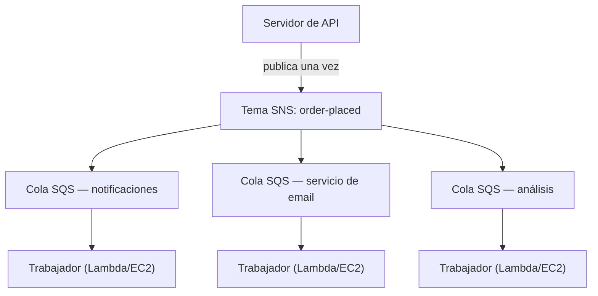

# Capítulo 19: La Máquina de Números

La máquina de números fue una revolución silenciosa. Tomas un número, esperas a que te llamen. La fila se convirtió en una cola. La gente podía sentarse. La ventanilla de servicio trabajaba a su propio ritmo. Nadie bloqueaba a nadie.

Antes de la máquina de números, tenías que hacer fila. Tu posición en la fila exigía tu presencia física. No podías hacer nada más mientras esperabas. Y si la persona al frente de la fila era lenta, todos los que estaban detrás se detenían.

La máquina de números separó la llegada del servicio. Llegabas, tomabas un número, y el sistema recordaba tu lugar. Podías ir a sentarte. La ventanilla de servicio iba pasando los números al ritmo que pudiera manejar. Si la ventanilla estaba temporalmente cerrada, las nuevas llegadas igual obtenían números. Esperaban. El trabajo no desaparecía: se encolaba.

Este pequeño invento es uno de los ejemplos más antiguos de desacoplamiento en los sistemas humanos. Al final de este capítulo, Nimbus habrá construido su propia máquina de números —en software— y la razón por la que la necesitó empieza con dieciséis minutos de tiempo de inactividad un viernes por la tarde.

---

El equipo había sobrevivido al fallo de AZ. Leo había arreglado el proceso de ingeniería del caos, y el runbook era sólido. El tráfico se había recuperado y volvía a crecer, de hecho más rápido que antes. La documentación de Aurora que Leo leía de noche todavía iba unos cuantos capítulos por delante de donde Nimbus realmente estaba.

Pero con el tráfico creciendo y más restaurantes incorporándose, un tipo diferente de cuello de botella se estaba volviendo visible. No en la infraestructura. En el propio código de la aplicación. La cadena de solicitudes que funcionaba bien a 200 pedidos por hora empezaba a mostrar tensión a 800.

Y entonces llegó la tarde del 14.

---

Había empezado con el panel de análisis. A las 6:47 PM de un viernes, un despliegue al servicio de análisis introdujo un bug de timeout. El servicio empezó a responder en 8 segundos en lugar de los 200 milisegundos habituales.

El flujo de pedidos era sincrónico. Cada pedido esperaba al servicio de análisis antes de confirmar al cliente. Ocho segundos se convirtieron en 12 a medida que aumentaba la carga. El pool de conexiones de la API empezó a llenarse de solicitudes esperando a que se completara el paso de análisis.

A las 6:53 PM, el pool de conexiones alcanzó su límite. Las nuevas solicitudes empezaron a fallar de inmediato, no porque el pedido no pudiera procesarse, sino porque no había ninguna conexión disponible para empezar a procesarlo.

"El servicio de análisis derribó el flujo de pedidos", dijo Leo, mirando los registros a la mañana siguiente. "No tienen nada que ver entre sí. El servicio de análisis solo calcula paneles."

"Pero están en la misma cadena de solicitudes", dijo Priya.

"Dieciséis minutos de tiempo de inactividad", dijo Maya. "Y a tres clientes se les cobró dos veces."

El doble cobro era peor que el tiempo de inactividad. En el caos de la saturación del pool de conexiones, un mecanismo de reintento se había disparado para algunas solicitudes que en realidad habían tenido éxito: el paso de pago se completó, luego la solicitud expiró antes de retornar, y el reintento volvió a intentar el pago. Misma tarjeta, mismo monto, dos cargos.

"Se suponía que el mecanismo de reintento ayudaría", dijo Leo.

"Ayudó en la dirección equivocada", dijo Priya. "¿Y hemos pensado en qué pasa cuando intentemos reembolsar a esos clientes? El proceso de reembolso usa el mismo flujo de pedidos que falló."

Dieciséis minutos de tiempo de inactividad y tres dobles cobros. Ese fue el costo de negocio de la cadena de solicitudes sincrónica.

---

Nimbus tenía un problema que no parecía un problema hasta que los pedidos se volvieron populares.

Cada vez que se realizaba un pedido, el servidor de la API tenía que:

1. Guardar el pedido en la base de datos
2. Enviar una notificación a la tableta del restaurante
3. Enviar un correo electrónico de confirmación al cliente
4. Actualizar el panel de análisis del restaurante
5. Registrar el evento para la facturación

En un mostrador de charcutería concurrido, la persona en la caja registradora no espera a que el cortador termine de filetear antes de pasar al siguiente cliente. Toman el pedido, se lo pasan a la cocina y empiezan a atender a la siguiente persona. La cocina trabaja los pedidos a su propio ritmo. El cliente recibe un servicio más rápido. La cocina no se ve abrumada por ráfagas repentinas. Si la cocina tiene un momento lento, los pedidos se acumulan detrás del mostrador en lugar de provocar errores en la caja registradora.

Esa era la analogía. Nimbus no tenía un mostrador y una cocina. Tenía una sola persona haciendo todo en secuencia antes de que el cliente pudiera marcharse.

Y el día 14, la persona que cortaba la carne tuvo un problema. Así que el mostrador se detuvo. Así que cada cliente después de eso esperó. La cocina, la caja, los clientes: todos en pausa porque un paso en la cadena se había ralentizado.

La solución no era hacer el corte de carne más rápido. La solución era separar los pasos. Toma el pedido en la caja, entrega un ticket, deja que la cocina trabaje.

"Estamos fuertemente acoplados", dijo Priya. "Si falla algún paso descendente, falla todo el pedido. ¿Hemos pensado en qué pasa si el servicio de análisis se ve comprometido y empieza a consumir mensajes malformados? Todo el pedido falla, porque estamos esperándolo."

"¿Qué pasa si pudiéramos guardar el pedido e inmediatamente confirmar al cliente", dijo Leo, "y luego procesar el resto en segundo plano?"

"Eso es una cola", dijo Priya.

La idea clave: el cliente no necesita saber que el panel de análisis se actualizó antes de recibir su confirmación. Necesita saber que su pedido fue recibido. Esas son cosas distintas. La cadena sincrónica las confundía.

**El Modelo del Desacoplamiento**

Esto es el **desacoplamiento**: separar el componente que acepta trabajo de los componentes que lo procesan.

Todos los pasos del flujo de pedidos de Nimbus tenían que ocurrir de forma sincrónica antes de que la API pudiera responder al cliente. Si el servicio de correo electrónico era lento (a veces lo era), el cliente esperaba. Si el panel de análisis estaba caído (a veces lo estaba), el pedido fallaba.

La cascada del día 14 demostró exactamente por qué esto importaba. El servicio de análisis no tenía nada que ver con si el pedido de un cliente era aceptado. Pero como estaba en la misma cadena sincrónica, su fallo se convirtió en el fallo de todos.

En los sistemas de software, la cola suele ser un intermediario de mensajes: un servicio que acepta mensajes de los productores y los entrega a los consumidores.

Quizás te preguntes: si el flujo de pedidos ahora es asincrónico, ¿cómo sabe el cliente que su pedido fue realmente recibido? La respuesta está en el diseño de la arquitectura: la API guarda el pedido en la base de datos (sincrónico: esta es la confirmación autoritativa), luego publica eventos en la cola. La confirmación al cliente se basa en que la escritura en la base de datos tuvo éxito, no en que los servicios descendentes se completaron. Si el servicio de correo electrónico es lento, el cliente ya tiene su confirmación. El correo electrónico es solo un seguimiento agradable de tener.

**Amazon SQS: La Cola**

**Amazon SQS (Simple Queue Service)** es el servicio de cola de mensajes gestionado de AWS. Almacena mensajes de forma durable hasta que son procesados por un consumidor.

El flujo básico:

1. El **productor** (el servidor de la API) coloca un mensaje en la cola: `{ "orderId": "ORD-5532", "restaurantId": "47", "items": [...] }`
2. La API responde inmediatamente al cliente: "¡Pedido confirmado!"
3. Los **consumidores** (servicios trabajadores separados) leen los mensajes de la cola y los procesan: envían la notificación al restaurante, envían el correo electrónico de confirmación, actualizan los análisis

La experiencia del cliente: confirmación instantánea. El procesamiento descendente: ocurre de forma asincrónica, al ritmo de los trabajadores.

**Conceptos Clave de SQS**

**Tiempo de espera de visibilidad del mensaje**: Cuando un consumidor lee un mensaje de SQS, el mensaje se vuelve *invisible* para otros consumidores durante un período (predeterminado: 30 segundos). Esto le da tiempo al consumidor para procesarlo. Si el consumidor termina con éxito, elimina el mensaje. Si el consumidor falla, el tiempo de espera de visibilidad expira y el mensaje se vuelve visible de nuevo para que otro consumidor lo reintente.

Esto garantiza la entrega al menos una vez: cada mensaje será procesado al menos una vez, aunque un consumidor falle a mitad del procesamiento.

Quizás te preguntes: si el mensaje se vuelve invisible mientras se procesa pero no se elimina cuando el consumidor falla, ¿no podría procesarse dos veces? Sí, y esto se llama entrega al menos una vez. Significa que cada consumidor debe diseñarse para manejar la recepción del mismo mensaje más de una vez sin causar un problema. Un correo electrónico de confirmación de pedido duplicado es molesto. Un cargo duplicado es un ticket de soporte. Diseña tus consumidores en consecuencia.

El tiempo de espera de visibilidad debe ser más largo que tu tiempo de procesamiento esperado más largo. Si el procesamiento normalmente tarda 20 segundos pero ocasionalmente tarda 90 segundos, y tu tiempo de espera de visibilidad es de 30 segundos, ese procesamiento ocasional de 90 segundos le parecerá un fallo a SQS. El mensaje se vuelve visible de nuevo. Un segundo consumidor lo recoge. Ahora dos trabajadores están procesando el mismo mensaje. Si tu procesamiento no es idempotente, tienes un problema.

Un error común: establecer el tiempo de espera de visibilidad igual al tiempo de procesamiento promedio. El enfoque correcto: establecerlo en el tiempo de procesamiento del percentil 99, con un margen de seguridad. Si el tiempo de procesamiento P99 es de 45 segundos, establece el tiempo de espera de visibilidad en 90 segundos.

**Colas de mensajes fallidos (DLQ)**: Si un mensaje falla el procesamiento demasiadas veces (configurable, por ejemplo, 5 reintentos), SQS lo mueve a una cola de mensajes fallidos. Inspeccionas la DLQ para entender por qué están fallando los mensajes sin perderlos.

La DLQ es donde aprendes qué está fallando realmente en producción. Sin ella, los mensajes fallidos simplemente desaparecen y no tienes manera de investigar.

Tres semanas después de la migración a SQS, Leo notó que 23 mensajes se habían acumulado en la DLQ del servicio de notificaciones. No había estado revisando la DLQ (la había configurado correctamente y luego asumió que se mantendría vacía).

Sacó un mensaje y miró el payload:

```json
{
  "orderId": "ORD-9821",
  "restaurantId": "12",
  "customerMessage": "Extra spicy please 🌶️🔥",
  "timestamp": "2024-01-18T19:43:11Z"
}
```

El emoji. El servicio de notificaciones a restaurantes estaba codificando los payloads de mensajes como Latin-1 antes de enviarlos a la API de tabletas heredada del restaurante. Los caracteres emoji —cuatro bytes cada uno en UTF-8— se estaban corrompiendo, lo que hacía que la API de la tableta rechazara la solicitud. El mensaje se reintentaba, fallaba de nuevo, se reintentaba de nuevo, fallaba de nuevo. Tras 5 reintentos, SQS lo movía a la DLQ.

"Los 23 mensajes tienen emoji en el campo de notas del cliente", dijo Leo.

"Así que a cada cliente que agregó un emoji a las notas de su pedido, su nota falló silenciosamente en llegar al restaurante", dijo Maya.

"Sí."

"¿Durante cuánto tiempo?"

Leo revisó la marca de tiempo del mensaje más antiguo. "Tres semanas."

Priya se quedó callada. "¿Y qué pasaría si alguien descubriera que agregar un emoji a la nota de un pedido causaba un fallo silencioso? Podrías realizar pedidos con emoji y garantizar que el restaurante nunca viera la instrucción. Luego quejarte del pedido equivocado."

Nadie había explotado esto. Pero era la pregunta correcta que hacer.

Leo corrigió el bug de codificación. Luego escribió un script para reproducir los 23 mensajes varados en la DLQ. Los restaurantes recibieron sus instrucciones de emoji picante (de hacía tres semanas). Los clientes nunca lo supieron.

La lección: la DLQ debe monitorearse activamente, no configurarse y olvidarse. Una DLQ creciente es una señal silenciosa de que algo está fallando repetidamente.

**Tipos de cola**:

**Colas estándar**: Máximo rendimiento (mensajes ilimitados por segundo). El orden de entrega es de mejor esfuerzo (no garantizado). Entrega al menos una vez (muy raramente, un mensaje puede entregarse dos veces).

**Colas FIFO**: Orden estricto primero en entrar, primero en salir. **Procesamiento** exactamente una vez: deduplicación basada en un `MessageDeduplicationId` dentro de una ventana de 5 minutos. El orden se garantiza *por* `MessageGroupId`: los mensajes del mismo grupo llegan en orden; los grupos diferentes pueden procesarse en paralelo, que es cómo FIFO escala. El rendimiento base es de 3.000 mensajes por segundo con procesamiento por lotes (300 sin él); habilitar el **modo de alto rendimiento** eleva esto a decenas de miles por segundo particionando entre grupos de mensajes. Usa FIFO cuando el orden importa (transacciones financieras, cambios de estado secuenciales).

Si necesitas máximo rendimiento y puedes tolerar mensajes duplicados ocasionales, usa SQS Estándar, pero debes diseñar cada consumidor para manejar duplicados sin causar problemas. Si necesitas orden estricto y procesamiento exactamente una vez, usa SQS FIFO, y diseña bien tus `MessageGroupId`, porque el paralelismo (y, por tanto, el rendimiento) viene de tener muchos grupos.

Para Nimbus, la mayoría de las colas usaban colas estándar. La cola de facturación usaba FIFO para garantizar que los cargos se procesaran en orden.

**Escalado Automático por Profundidad de Cola: Escalar Trabajadores para Igualar el Backlog**

Una de las aplicaciones más potentes de SQS es usar la profundidad de la cola como disparador de Auto Scaling. En lugar de escalar según la CPU o la memoria, escalas según cuánto trabajo está esperando.

Para el servicio de notificaciones de Nimbus: la profundidad de la cola de SQS (el número de mensajes esperando ser procesados) se conectó a una política de Application Auto Scaling para el servicio de ECS que ejecutaba los trabajadores de notificaciones.

Política: cuando la cola tiene más de 50 mensajes por tarea trabajadora, agrega una tarea. Cuando la cola tiene menos de 10 mensajes por tarea trabajadora, quita una tarea.

El efecto práctico: cuando 1.200 pedidos llegaron durante el pico de la tarde del viernes, la profundidad de la cola de notificaciones se disparó y la flota de trabajadores escaló de 2 tareas a 8 tareas en 3 minutos. Para medianoche, la cola estaba vacía y la flota había vuelto a 2.

"¿Cuánto cuesta eso al mes?", preguntó Tom, mirando el gráfico de Auto Scaling.

"Nada adicional por el Auto Scaling en sí", dijo Leo. "Pero 6 tareas extra de ECS durante 3 horas las tardes de los viernes: eso es significativo."

Tom calculó. "Unos $14/mes por esos picos. ¿Y antes, ejecutábamos 8 tareas continuamente a costo completo?"

"Sí."

"Así que pagamos por la ráfaga cuando la necesitamos y nada en caso contrario."

Este es el patrón de escalado por profundidad de cola: la cola se convierte en un búfer que absorbe los picos de tráfico, y la flota de trabajadores escala para drenar el búfer. Los usuarios no experimentan lentitud: recibieron su confirmación inmediatamente cuando el pedido fue aceptado. Los trabajadores solo tardan un poco más en ponerse al día. Y como no estás ejecutando capacidad pico las 24 horas, los costos son significativamente menores.

**Amazon SNS: El Difusor**

**Amazon SNS (Simple Notification Service)** es un servicio de mensajes de publicación/suscripción (pub/sub). En lugar de un productor, un consumidor (cola), SNS admite que un mensaje sea entregado a *muchos* suscriptores simultáneamente.

El modelo:

1. Un **publicador** envía un mensaje a un **tema** de SNS
2. Todos los **suscriptores** de ese tema reciben el mensaje simultáneamente (distribución en abanico)

Los suscriptores pueden ser:

- Colas de SQS (envía el mensaje a una cola para procesamiento asincrónico)
- Funciones de Lambda (activa la función directamente)
- Endpoints HTTP/HTTPS (entrega de webhook)
- Direcciones de correo electrónico
- SMS (números de teléfono)

Para Nimbus, el evento de pedido realizado se publica en un tema de SNS llamado `order-events`:

- El servicio de notificaciones a restaurantes se suscribe (recibe en su cola de SQS)
- El servicio de correo electrónico se suscribe (recibe en su cola de SQS)
- El servicio de análisis se suscribe (recibe en su cola de SQS)
- El servicio de facturación se suscribe (recibe en su cola FIFO de SQS)

Un evento de pedido. Cuatro suscriptores. Todos notificados simultáneamente. Cada uno procesa a su propio ritmo.

"Entonces SNS es el anuncio", dijo Maya, "y SQS es la bandeja de entrada donde cada equipo procesa el anuncio a su propia velocidad. Entonces, ¿por qué usar ambos? ¿Por qué no simplemente hacer que todos se suscriban directamente al tema de SNS?"

"Porque la entrega directa de SNS es disparar y olvidar", dijo Leo. "Si el servicio de análisis está caído cuando SNS dispara, ese mensaje se pierde. Con una cola de SQS en medio, el mensaje espera hasta que el servicio se recupera."

"Exactamente", dijo Priya. "La distribución en abanico de SNS/SQS es el patrón estándar."

**El Patrón de Distribución en Abanico SNS/SQS**

Esta combinación —un tema de SNS que alimenta múltiples colas de SQS— es uno de los patrones arquitectónicos más importantes en AWS:



Cada cola es independiente. El servicio de análisis puede ser lento: su cola se llena, pero los servicios de notificaciones y correo electrónico continúan sin verse afectados. Si el servicio de análisis cae, sus mensajes esperan en la cola hasta que vuelva a estar activo. No se pierde nada.

Esta es la propiedad clave: el **fallo independiente**. Los problemas en un consumidor no se propagan a los demás.

**Filtrado de Mensajes: No Todo Mensaje para Todo Suscriptor**

A medida que los sistemas crecen, no quieres que cada suscriptor procese cada mensaje. Un servicio de análisis no debería recibir mensajes sobre el procesamiento de pagos fallidos si solo le importan los pedidos completados.

El **filtrado de mensajes de SNS** permite a los suscriptores especificar políticas de filtro: solo entrega mensajes que coincidan con ciertos atributos.

El servicio de notificaciones a restaurantes se suscribe con un filtro: solo mensajes donde `status = "confirmed"`.

El servicio de alertas de errores se suscribe con un filtro: solo mensajes donde `status = "failed"`.

Cada suscriptor recibe solo lo que necesita.

Sin filtrado, cada suscriptor recibe cada mensaje y debe ignorar lo que es irrelevante. Esto desperdicia procesamiento, desperdicia dinero (SQS cobra por mensaje) e introduce ruido. Un sistema de pedidos de alto volumen sin filtrado inundaría la cola de alertas de errores con pedidos exitosos, dificultando encontrar los fallos reales.

Las políticas de filtro se ven así:

```json
{
  "status": ["confirmed"],
  "region": ["us-west-2", "us-east-1"]
}
```

Este suscriptor recibe solo mensajes donde el status es "confirmed" Y la región es "us-west-2" o "us-east-1". Los mensajes que no coinciden con la política no se entregan en absoluto a la cola de este suscriptor: nunca siquiera llegan a SQS.

"Entonces el filtrado ocurre en la capa de SNS", dijo Priya, "¿antes de que los mensajes se escriban en SQS?"

"Correcto. La cola de SQS del servicio de notificaciones a restaurantes solo ve mensajes sobre los que necesita actuar."

"¿Y qué pasa si alguien intenta entrar por la fuerza publicando un mensaje especialmente diseñado en el tema de SNS que coincida con todos los filtros de los suscriptores?", preguntó Priya.

El tema de SNS tenía una política de recursos de IAM: solo el servicio de la API de pedidos (por su rol de IAM) tenía permiso para publicar. Las políticas de acceso de SNS y las políticas de cola de SQS formaban la capa de control de acceso; el filtrado era solo para enrutamiento, no para seguridad.

**Cuándo Usar SQS vs SNS**

**SQS solo**: Un productor, un consumidor (o múltiples consumidores en competencia en la misma cola). Los mensajes deben procesarse una vez, en orden (FIFO) o no (estándar). Patrón de cola de trabajadores: una cola, múltiples trabajadores consumiendo de ella.

**SNS solo**: Notificaciones de disparar y olvidar. Envío a correo electrónico, SMS o endpoints HTTP. Sin necesidad de encolar el mensaje: solo notifica y sigue adelante.

**SNS + SQS (distribución en abanico)**: Un evento, múltiples consumidores independientes. Cada consumidor tiene su propia cola, procesa de forma independiente y puede fallar de forma independiente.

## Temas FIFO de SNS

Todo lo anterior sobre SNS usa temas estándar: tienen un rendimiento efectivamente ilimitado, entregan a los suscriptores casi simultáneamente y hacen el trabajo para la gran mayoría de los casos de uso.

Pero los temas estándar de SNS no garantizan el orden. Si publicas diez mensajes en secuencia, los suscriptores podrían recibirlos en un orden ligeramente diferente. Para las notificaciones de pedidos de Nimbus, eso está bien: una actualización de análisis que llega una fracción de segundo antes de una confirmación por correo electrónico no importa.

Para algunos escenarios, sí importa. Considera un libro contable financiero: si dos eventos —un crédito y luego un débito— se entregan en orden inverso, los cálculos de saldo durante el procesamiento serán incorrectos aunque ambos eventos se procesen finalmente de forma correcta.

Los **temas FIFO de SNS** aplican el mismo principio que las colas FIFO de SQS al modelo de distribución en abanico. Los mensajes se entregan a los suscriptores en el orden exacto en que fueron publicados, y cada mensaje se entrega exactamente una vez.

El equilibrio: los temas FIFO de SNS tienen un rendimiento base similar al de SQS FIFO (3.000 mensajes por segundo por tema; 300 por segundo por grupo de mensajes, con un modo de alto rendimiento disponible desde 2025 para mucho más), y solo distribuyen en abanico a **colas de SQS**, FIFO o, desde 2023, Estándar. Suscribir una cola Estándar es útil para consumidores que no se preocupan por el orden (un feed de análisis, por ejemplo), pero el orden y la entrega exactamente una vez sobreviven de extremo a extremo **solo** hacia colas FIFO. No puedes usar un tema FIFO de SNS para entregar a endpoints HTTP o direcciones de correo electrónico.

Para el pipeline de facturación de Nimbus —donde una secuencia de actualizaciones de precios tenía que aplicarse a las cuentas de los restaurantes en orden— el tema de SNS de facturación se migró de estándar a FIFO. La cola de facturación de SQS ya era FIFO. La distribución en abanico ahora garantizaba que un evento de aumento de precio nunca llegaría al procesador de facturación antes del evento de inicio de período del que dependía.

> **Consejo para el Examen — SNS FIFO**
>
> Si un escenario requiere **entrega ordenada en distribución en abanico** a través de múltiples suscriptores, la respuesta es **SNS FIFO**. El SNS estándar no garantiza el orden. SNS FIFO solo distribuye en abanico a colas de SQS: para mantener el orden y la entrega exactamente una vez de extremo a extremo, el suscriptor debe ser una cola **FIFO** de SQS (las suscripciones de colas Estándar están permitidas pero obtienen orden de mejor esfuerzo y entrega al menos una vez). El rendimiento predeterminado es de 3.000/seg por tema: si el escenario describe un volumen mucho mayor *y* orden estricto, eso es una señal para mirar arquitecturas alternativas (Kinesis, por ejemplo, que se cubre en un capítulo posterior).

## Cuando la Cola Heredada No Suelta

Nimbus estaba a punto de cerrar su mayor adquisición hasta la fecha: Barato, un competidor de entrega de comida con 200 restaurantes y dos años de ventaja en operaciones. El equipo de ingeniería programó una llamada de planificación de la integración.

La llamada duró veinte minutos antes de que Leo se quedara callado.

"Su sistema de procesamiento de pedidos", dijo. "¿Sobre qué corre?"

"ActiveMQ", dijo el ingeniero de Barato al otro lado. "Un broker on-premises. La app es Java. Lleva corriendo desde 2018. Todo habla AMQP."

"AMQP", dijo Leo.

"Sí."

Miró el diagrama de arquitectura en su pantalla. Nimbus usaba SQS y SNS. SQS no habla AMQP. SNS no habla AMQP. La aplicación de Barato no hablaba nada más.

"Reescribirlo tomará seis meses", dijo Leo al equipo después de la llamada. "Como mínimo."

"No podemos retrasar la adquisición seis meses", dijo Maya.

"Y no podemos ejecutar un broker de ActiveMQ en bare-metal en AWS", agregó Priya. "¿Hemos pensado en cómo se ve eso desde el punto de vista de seguridad y fiabilidad? Un intermediario de mensajes autogestionado, en producción, sin parcheo gestionado, sin failover automático, conectándose a nuestra infraestructura."

"Hay una opción gestionada", dijo Leo lentamente. Había estado leyendo mientras hablaban. "Amazon MQ."

**Amazon MQ: El Broker Gestionado**

**Amazon MQ** es un servicio de intermediario de mensajes gestionado para Apache ActiveMQ y RabbitMQ. Ejecuta tu broker existente —el mismo broker al que tus aplicaciones han estado conectadas durante años— pero como un servicio gestionado de AWS. AWS maneja la infraestructura subyacente: aprovisionamiento, parcheo, failover, copias de seguridad.

La propiedad clave que hace a Amazon MQ diferente de SQS y SNS: habla los protocolos que hablan los intermediarios de mensajes heredados. AMQP, STOMP, MQTT, OpenWire, NMS. Los protocolos que SQS y SNS simplemente no entienden.

Para la integración de Barato, el plan era sencillo. AWS ejecutaría un broker de Amazon MQ configurado como ActiveMQ. La aplicación Java de Barato apuntaría al nuevo endpoint del broker en lugar del on-premises. El cambio en el lado de la aplicación: actualizar un archivo de configuración con la nueva cadena de conexión. Eso fue todo. La aplicación no necesitaba saber que estaba hablando con un broker gestionado en la nube en lugar de un servidor en la oficina de Barato.

"Un momento", dijo Maya. "Si vamos a integrarlos en Nimbus eventualmente, ¿no deberíamos simplemente migrarlos a SQS desde el principio?"

"Porque la ruta de migración existe", dijo Leo. "Y vale la pena hacerla bien, eventualmente. Pero ahora mismo, necesitamos a Barato operativo en infraestructura de AWS en treinta días, no en seis meses. Amazon MQ pone la aplicación en marcha sin cambiar la aplicación. Luego tendremos tiempo de planificar la migración a SQS como un proyecto deliberado, no como un prerrequisito apresurado para la adquisición."

"¿Cuánto cuesta eso al mes?", preguntó Tom.

El broker de Amazon MQ —un único par activo/standby para fiabilidad— estaba en el rango de $200/mes para un broker adecuado para el volumen de Barato. Comparado con el costo de seis meses de tiempo de reescritura, no había debate.

Priya aprobó el plan con una condición: la instancia de Amazon MQ viviría en una subred privada, con reglas de grupo de seguridad que permitieran conexiones solo desde los servidores de aplicación de Barato. Sin exposición pública. Registro de auditoría habilitado.

La migración tomó doce días. La aplicación de Barato se conectó a Amazon MQ el día trece. El día catorce, procesó su primer pedido en infraestructura de AWS sin un solo cambio de código.

---

> **Consejo para el Examen — Amazon MQ**
>
> *Dominio SAA-C03: Diseño de Arquitecturas Resilientes (Dominio 2)*
>
> El examen distingue Amazon MQ de SQS y SNS en un solo eje: la **compatibilidad de protocolos**. Si el escenario describe una aplicación que ya usa un intermediario de mensajes y habla un protocolo específico, Amazon MQ es casi con certeza la respuesta.
>
> Las señales clave: **"ActiveMQ", "RabbitMQ", "AMQP", "STOMP", "MQTT", "OpenWire"**, o cualquier frase equivalente a **"sin cambiar el código de la aplicación".** Si ves esas frases, la respuesta es Amazon MQ, no SQS, no SNS.
>
> Si el escenario describe una aplicación *nueva* que necesita desacoplamiento, o no menciona un broker heredado o protocolo específico, usa SQS/SNS.
>
> Una señal más: "migrar un intermediario de mensajes on-premises existente a AWS". Si la app necesita seguir hablando el mismo protocolo al mismo tipo de broker, Amazon MQ es la respuesta de lift-and-shift.

## Fortalezas y Limitaciones

**Por qué SQS y SNS son poderosos**:

- SQS proporciona entrega de mensajes durable y fiable: los mensajes se almacenan en múltiples AZs
- El desacoplamiento permite el escalado y el despliegue independientes de los servicios productor y consumidor
- Las colas de mensajes fallidos garantizan que ningún mensaje se pierda silenciosamente ante un fallo
- El patrón de distribución en abanico de SNS permite agregar nuevos consumidores sin cambiar el productor

**Donde se complica**:

- La entrega al menos una vez significa que los consumidores deben ser *idempotentes*: procesar el mismo mensaje dos veces no debe causar problemas (pedidos duplicados, cargos duplicados)
- Las colas FIFO son más costosas y tienen límites de rendimiento
- Depurar mensajes fallidos en múltiples colas y servicios requiere un buen registro y observabilidad
- Las garantías de orden de mensajes son limitadas: si el orden estricto importa en múltiples servicios, el diseño se complica

**Idempotencia: Una Inmersión Profunda Práctica**

La idempotencia suena abstracta hasta que has tenido a tres clientes con doble cobro.

Una operación es **idempotente** si ejecutarla varias veces produce el mismo resultado que ejecutarla una vez. Una operación de cobro no es naturalmente idempotente: ejecutarla dos veces cobra dos veces. Una operación de cobro idempotente verifica si el cobro ya ha sido procesado antes de intentarlo.

El patrón: cada mensaje lleva un ID único (el ID del pedido, o un ID de mensaje separado). Antes de procesar, el consumidor verifica un almacén (DynamoDB funciona bien para esto) para ver si este ID de mensaje ya ha sido procesado con éxito. Si sí: no hacer nada, eliminar el mensaje. Si no: procesar, registrar el ID, eliminar el mensaje.

```python
def process_charge(message):
    order_id = message['orderId']
    
    # Verificación de idempotencia
    if already_processed(order_id):
        logger.info(f"Order {order_id} already charged, skipping duplicate")
        return  # El mensaje se eliminará de la cola
    
    # Procesar el cobro
    charge_result = payment_service.charge(
        amount=message['amount'],
        card_token=message['cardToken'],
        idempotency_key=order_id  # También se pasa al procesador de pagos
    )
    
    # Registrar que hemos procesado esto
    mark_as_processed(order_id, charge_result)
```

La clave de idempotencia también debe pasarse a los servicios descendentes (procesadores de pagos, sistemas de correo electrónico) que la admitan. Stripe, por ejemplo, acepta un encabezado `Idempotency-Key` que previene cargos duplicados incluso si se hace la misma llamada a la API dos veces.

"¿Y qué hay de los IDs de correlación?", preguntó Priya. "Cuando un mensaje se mueve a través de múltiples servicios, ¿cómo rastreamos qué solicitud causó qué acción descendente?"

**IDs de Correlación: Rastreo Entre Servicios**

Cuando un cliente realiza un pedido, la solicitud fluye a través de: API → SNS → SQS → trabajador de notificaciones → API de tableta del restaurante → SQS → trabajador de correo electrónico → SES.

Sin IDs de correlación, si la API de la tableta del restaurante devuelve un error en el paso 6, los registros de cada servicio muestran el evento, pero no hay manera de rastrearlo hasta el pedido del cliente específico desde el principio.

Un **ID de correlación** es un identificador único adjunto a la solicitud original y pasado a través de cada interacción de servicio. Cada servicio incluye el ID de correlación en sus registros.

Cuando Priya busca en CloudWatch un ID de correlación específico, obtiene cada línea de registro —en cada servicio— que fue parte del procesamiento de ese único pedido.

"Una advertencia", dijo Priya. "Los IDs de correlación vienen desde el exterior. ¿Podría alguien inyectar un ID malicioso y arruinar nuestro registro?"

Los IDs de correlación son internos: no afectan la lógica de procesamiento, solo el registro. Sanearlos (alfanuméricos, longitud fija) previene ataques de inyección en las salidas de registro.

**Cuándo el Desacoplamiento Es la Elección Equivocada**

"Espera, pero *¿por qué* no desacoplaríamos todo?", preguntó Maya.

Era una pregunta justa. Si el desacoplamiento previene los fallos en cascada y hace los sistemas resilientes, ¿por qué no aplicarlo en todas partes?

Porque el desacoplamiento tiene costos. Y hay escenarios donde esos costos superan los beneficios.

**Cuando necesitas consistencia inmediata**: Si un pago debe confirmarse antes de que un pedido pueda proceder —y el usuario está esperando en pantalla el resultado— no puedes poner el pago en una cola asincrónica y devolver una confirmación antes de saber si el cargo tuvo éxito. El usuario podría pedir dos veces antes de que se complete el primer cargo. El desacoplamiento asincrónico no funciona para operaciones donde la respuesta depende del resultado.

**Cuando el flujo de trabajo es inherentemente secuencial**: Si el paso 3 debe ver el resultado del paso 2 para tomar una decisión, no pueden ejecutarse en paralelo desde una cola. Forzarlos a una cola crea un mecanismo torpe de paso de resultados que a menudo termina siendo más complejo que la versión sincrónica.

**Cuando el orden de los mensajes es crítico y el volumen es bajo**: SQS Estándar no garantiza el orden. SQS FIFO sí, pero tiene un tope de 3.000 mensajes/segundo con procesamiento por lotes de forma predeterminada (el modo de alto rendimiento eleva eso sustancialmente). Si tienes un flujo de trabajo de bajo volumen y estrictamente ordenado, una cola sincrónica simple (como un bloqueo de fila de base de datos) podría ser más simple y fiable.

**Cuando la sobrecarga excede el beneficio**: Una pequeña herramienta interna con un usuario y sin SLA probablemente no necesite temas de distribución en abanico de SNS y DLQs. La sobrecarga operativa de monitorear colas y DLQs es real. Dimensiona la arquitectura al problema.

La pregunta no es "¿debería desacoplar esto?". Es "¿cuál es el costo de este acoplamiento, y el desacoplamiento reduce ese costo más de lo que lo agrega?".

## Resumen

El desacoplamiento es el principio de resiliencia del Capítulo 18 aplicado a la arquitectura interna: de la misma manera que Multi-AZ elimina los puntos únicos de fallo en la infraestructura, SQS y SNS eliminan los puntos únicos de fallo en las cadenas de solicitudes.

- El **desacoplamiento** separa los componentes que producen trabajo de los componentes que lo procesan.
- **SQS** da a los productores un lugar durable para poner el trabajo cuando los consumidores son lentos, están desconectados o están escalando.
- **SNS** permite que un evento llegue a múltiples consumidores independientes sin que el publicador sepa quiénes son.
- La **distribución en abanico SNS + SQS** permite que cada servicio descendente procese el mismo evento a su propio ritmo.
- Las **DLQs, la idempotencia y los IDs de correlación** son la disciplina operativa que hace que los sistemas asincrónicos sean depurables en lugar de misteriosos.
- **No desacoples a ciegas**: los flujos de trabajo sincrónicos, los requisitos de consistencia inmediata y las herramientas pequeñas de bajo riesgo pueden no justificar la superficie operativa adicional.

## Consejos para el Examen

*Dominio SAA-C03: Diseño de Arquitecturas Resilientes (Dominio 2, Tarea 2.1)*

- **SQS Estándar vs FIFO**: El examen distingue por las garantías de orden y entrega. "Debe procesarse en orden" → FIFO. "Máximo rendimiento" → Estándar.
- **Escalado automático por profundidad de cola**: "Escalar trabajadores según la profundidad de la cola" → métrica de SQS (ApproximateNumberOfMessagesVisible) usada con Application Auto Scaling o ECS Service Auto Scaling.
- **Tiempo de espera de visibilidad**: Concepto clave para la entrega al menos una vez. Si un consumidor falla, el mensaje se vuelve visible de nuevo después del tiempo de espera. Escenario del examen: "los mensajes se están procesando dos veces" → el tiempo de espera de visibilidad es demasiado corto (el consumidor tarda más que el tiempo de espera en procesar).
- **Cola de mensajes fallidos**: Los mensajes que fallan después de N reintentos se mueven aquí. Escenario del examen: "asegurarse de que ningún mensaje se pierda, aunque el procesamiento falle repetidamente" → DLQ.
- **Distribución en abanico de SNS**: Patrón clásico del examen para que un evento active múltiples consumidores. "La notificación de pedido realizado debe activar email, SMS y actualización de inventario simultáneamente" → tema de SNS con suscripciones de SQS.
- **SQS + Lambda**: Lambda puede configurarse para sondear una cola de SQS y activarse en cada lote de mensajes. El examen usa esto para el procesamiento basado en eventos a escala.
- **Sondeo largo de SQS**: En lugar de que los consumidores sondeen cada pocos segundos (sondeo corto, desperdicia llamadas a la API), el sondeo largo espera hasta 20 segundos por un mensaje. Reduce costos y respuestas vacías falsas.
- **Biblioteca de cliente extendido de SQS**: Para mensajes mayores que el límite de payload de la cola (256KB de forma predeterminada; elevable a 1MB desde 2025), usa la Biblioteca de Cliente Extendido de SQS, que almacena el cuerpo del mensaje en S3 y envía una referencia a través de SQS. El examen todavía trata los 256KB como el límite de SQS: "mensaje de SQS demasiado grande" → Biblioteca de Cliente Extendido + S3.
- **Filtrado de mensajes de SNS**: Los suscriptores reciben solo los mensajes que coinciden con su política de filtro. Escenario del examen: "enviar solo notificaciones que coincidan con criterios específicos a un suscriptor" → filtrado de mensajes de SNS.
- **Nota**: La distribución en abanico SNS/SQS también aparece en escenarios del Dominio 3 sobre arquitecturas de procesamiento asincrónico de alto rendimiento. Conoce el patrón tanto para preguntas de resiliencia como de rendimiento.
- **Señales de Amazon MQ**: "ActiveMQ", "RabbitMQ", "AMQP", "STOMP", "MQTT", "OpenWire", o "sin cambiar el código de la aplicación" → Amazon MQ, NO SQS. Si el escenario dice aplicación nueva que necesita desacoplamiento → SQS/SNS.
- **SNS FIFO vs Estándar**: El SNS estándar no garantiza el orden. Si el escenario requiere **distribución en abanico ordenada** → tema FIFO de SNS alimentando colas FIFO de SQS. Recuerda: SNS FIFO no puede entregar a endpoints HTTP o correo electrónico, solo a colas de SQS (FIFO para orden/exactamente una vez; las suscripciones Estándar funcionan pero degradan a orden de mejor esfuerzo y entrega al menos una vez).

## Ejercicios

**Ejercicio 1 — Recuerdo**

Explica el patrón de distribución en abanico SNS/SQS. ¿Por qué el patrón usa colas de SQS en lugar de hacer que los servicios se suscriban directamente al tema de SNS con endpoints HTTP?

*(Pista: Piensa en qué ocurre si uno de los endpoints HTTP está caído cuando SNS publica un mensaje.)*

**Ejercicio 2 — Escenario SAA-C03**

*Escenario*: Una plataforma de comercio electrónico procesa 10.000 pedidos por hora. Cuando se realiza un pedido, el sistema debe: (1) almacenar el pedido en la base de datos, (2) descontar el inventario, (3) enviar un correo electrónico de confirmación y (4) actualizar el panel de análisis. Actualmente, los cuatro pasos ocurren de forma sincrónica: si el servicio de análisis es lento, los clientes esperan. El equipo quiere mejorar el tiempo de respuesta de cara al cliente sin perder ningún pedido.

¿Qué arquitectura aborda MEJOR este requisito?

A) Usar colas FIFO de SQS para procesar los cuatro pasos en secuencia  
B) Hacer que la API guarde el pedido e inmediatamente confirme al cliente; publicar un evento en un tema de SNS; hacer que los servicios de inventario, correo electrónico y análisis se suscriban a través de colas de SQS  
C) Usar instancias de EC2 paralelas para procesar cada paso simultáneamente, de forma sincrónica  
D) Usar un API Gateway con validación de solicitudes para acelerar el procesamiento de pedidos

**Pista 1**: La confirmación al cliente debe ser inmediata. ¿Qué pasos deben ocurrir antes de la respuesta y cuáles pueden ocurrir después?

**Pista 2**: La lentitud del servicio de análisis no debe afectar a los servicios de correo electrónico o inventario.

**Pista 3**: La distribución en abanico de SNS permite que los tres servicios descendentes reciban el evento simultáneamente.

**Respuesta**: B

**Explicación**: La API guarda el pedido en la base de datos (sincrónico: debe hacerse antes de confirmar) y devuelve inmediatamente una confirmación. Luego publica un evento `order-placed` en un tema de SNS. Los servicios de inventario, correo electrónico y análisis se suscriben a través de colas de SQS independientes. Procesan a su propio ritmo: si el análisis es lento, su cola crece pero los demás servicios no se ven afectados. Si algún servicio falla, sus mensajes permanecen en la cola de SQS y se reintentan; después del número de reintentos fallidos configurado se mueven a la DLQ.

**¿Por qué no A?** Las colas FIFO procesan los mensajes en secuencia: esto no ayuda con la lentitud sincrónica. Además, el procesamiento secuencial significa que la lentitud del análisis sigue bloqueando el correo electrónico.

**¿Por qué no C?** "Instancias de EC2 paralelas procesando de forma sincrónica" todavía requiere que todos los pasos se completen antes de responder al cliente. Agregar instancias no resuelve el acoplamiento sincrónico.

**¿Por qué no D?** API Gateway acelera el enrutamiento y la validación de API, pero no desacopla los pasos de procesamiento descendente.

*Dominio SAA-C03: Diseño de Arquitecturas Resilientes — Tarea 2.1*

**Ejercicio 3 — Desafío de Arquitectura** *(Opcional)*

Nimbus está construyendo un sistema de notificaciones para los socios restaurantes. Cuando un cliente realiza un pedido, el restaurante necesita ser notificado a través de:

- Su aplicación de tableta (notificación push)
- Un sistema de visualización de cocina (webhook HTTP a su hardware local)
- Un SMS de respaldo (si falla la notificación de la tableta)

El servicio de notificaciones de la tableta es fiable. El webhook de cocina a veces está caído (los restaurantes apagan su hardware al cierre). El SMS solo debe enviarse si falla la notificación de la tableta.

Diseña la arquitectura usando SNS y SQS. ¿Cómo manejarías el requisito de "SMS solo si falla la tableta"? ¿Cómo garantizarías que el webhook de cocina no bloquee la notificación de la tableta cuando está desconectado?

Considera también: ¿qué tiempo de espera de visibilidad es apropiado para la entrega del webhook de cocina si el tiempo de respuesta promedio del webhook es de 2 segundos pero los restaurantes con hardware lento pueden tardar hasta 30 segundos? ¿Qué política de DLQ activaría el respaldo de SMS después de que se agoten los reintentos del webhook?

*(No existe una única respuesta correcta. El objetivo es practicar el diseño de distribución en abanico con enrutamiento condicional.)*

## Escena Post-Créditos

El nuevo flujo de pedidos estaba en producción.

Leo lo había desplegado un martes por la tarde sin ejecutar primero una prueba de carga completa. "Estará bien", le había dicho a Priya. "La arquitectura es sólida."

Los clientes realizaban pedidos. La API respondía en 95 milisegundos. La confirmación aparecía en sus teléfonos al instante.

Detrás de escena: cuatro servicios procesando de forma asincrónica. El servicio de análisis tenía un bug que hacía que fallara con pedidos que contenían ciertos caracteres especiales en el nombre del artículo. Su cola se acumuló a 3.200 mensajes en dos horas.

Los clientes nunca lo notaron.

Cuando Leo corrigió el bug y el servicio de análisis se reinició, procesó el retraso en 18 minutos. No se perdió ningún dato. La DLQ estaba vacía.

Actualizó el panel de CloudWatch. Profundidad de cola: 0. Mensajes procesados: 3.200. Errores: 0 (después de la corrección).

"Esto es exactamente cómo se habría visto el día 14", dijo. "El análisis tuvo un problema. La cola lo absorbió. Todo lo demás siguió funcionando."

"Esto es lo que significa el desacoplamiento", dijo Priya.

"¿Cuánto cuesta eso al mes?", preguntó Tom, ya en la página de precios.

"Con nuestro volumen actual, unos doce dólares al mes por SQS." Miró la pantalla. "Esperaba más."

Tenía el aspecto de alguien que descubría que algo inesperadamente barato también era inesperadamente bueno.

"Configura las alertas de la DLQ", le recordó Priya a Leo. "No queremos otras tres semanas de fallos silenciosos."

"Ya está hecho", dijo Leo.

Esta vez lo había hecho.

En el próximo capítulo: la función que solo se ejecuta cuando alguien llama, y que no cuesta nada cuando no lo hacen.
