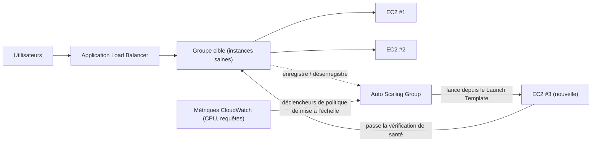

# Chapitre 7 : Le restaurant qui grandit quand il est occupé

Il était 19 h 43 un vendredi soir.

La chaise de Tom était légèrement reculée, comme elle l'était quand il fixait quelque chose avec le genre de concentration qui signifiait qu'il n'allait pas répondre si vous lui parliez. Le bureau s'était vidé une heure plus tôt. Lui était resté.

Il avait un onglet ouvert sur le tableau de bord des métriques qu'il rafraîchissait comme d'autres consultent les réseaux sociaux — de façon réflexe, constante, sans vraiment le vouloir.

La crise du stockage était derrière eux. La base de données avait son propre disque. Les photos vivaient dans S3. Pendant deux semaines, le système avait été stable — pas excitant, juste stable. Ça aurait dû faire du bien.

Puis le taux d'erreur a dépassé 12 %.

« Leo », dit Tom.

Leo regardait déjà. Temps de réponse : en hausse. Requêtes en file d'attente : en hausse. La seule instance EC2 — même après l'exercice soigné de bon dimensionnement du mois dernier — était à 94 % de CPU.

« On refuse des clients », dit Tom.

« On ne les refuse pas », dit Leo. « Le serveur les refuse. »

« C'est la même chose. »

C'était le cas. Et ça arrivait chaque vendredi depuis trois semaines. Nimbus avait survécu à la crise du stockage — la base de données avait son propre disque, les photos vivaient dans S3 — mais stable et évolutif sont des problèmes entièrement différents. Le système fonctionnait. Il ne grandissait juste pas.

Un message Slack apparut de Maya : *le tableau de bord dit que les commandes sont en baisse de 40 % par rapport à vendredi dernier. qu'est-ce qui se passe ?*

Tom répondit : *serveur à capacité. on travaille dessus.*

Trois minutes passèrent.

Maya : *on a un propriétaire de restaurant qui appelle la ligne d'assistance en disant que l'appli est cassée.*

Leo avait les mains sur le clavier. Il redimensionnait l'instance — la version manuelle du correctif, celle qui exigeait d'arrêter le serveur et de changer le type d'instance. Ce qui signifiait une indisponibilité.

« Combien de temps le redémarrage va-t-il prendre ? » demanda Tom.

« Sept minutes », dit Leo.

« On va avoir sept minutes de plus de panne un vendredi soir », dit Tom. Il ne posait pas la question. Il tapa un message Slack à Maya. Elle répondit par un seul caractère : *ok*

Le redémarrage se termina. L'instance revint en ligne. Le CPU descendit à 60 %. Le taux d'erreur baissa. Tom surveilla les métriques pendant quinze minutes sans parler.

À 21 h 15, le trafic déclina. La crise était terminée.

Leo regarda ses mains, qui avaient légèrement tremblé à 20 h et ne tremblaient plus.

« On ne peut pas faire ça chaque vendredi », dit-il.

« Non », dit Tom. « On ne peut pas. »

L'équipe avait besoin que leur système gère une charge variable automatiquement. Pas d'acheter assez de
serveur pour le pire cas et de gaspiller de l'argent pendant les moments calmes. Et pas de se démener
manuellement quand les pics de trafic frappaient.

Il existe un schéma pour ça. AWS a deux services qui l'implémentent.

**Le concept : La mise à l'échelle horizontale**

Il y a deux façons de faire en sorte qu'un système gère plus de charge.

**La mise à l'échelle verticale** signifie rendre le serveur unique plus grand. Plus de CPU. Plus de RAM.
Nous avons fait ça au Chapitre 4 quand nous avons migré de `t3.micro` à `t3.large`. Ça aide.
Mais ça a des limites : vous ne pouvez aller que si grand, l'instance doit redémarrer pour se redimensionner,
et vous avez toujours un point de défaillance unique.

**La mise à l'échelle horizontale** signifie ajouter plus de serveurs. Au lieu d'un grand serveur, faites tourner
cinq serveurs moyens. Quand le trafic baisse, faites tourner deux. Quand il monte en flèche, faites tourner dix.

La mise à l'échelle horizontale présente des avantages que la verticale n'a pas :

- Pas de point de défaillance unique. Si un serveur tombe en panne, les autres continuent à servir.
- Pas de redémarrage nécessaire pour ajouter de la capacité.
- Payez uniquement pour ce que vous utilisez — ajoutez des serveurs quand vous en avez besoin, supprimez quand vous n'en avez pas besoin.
- Mise à l'échelle linéaire : deux fois les serveurs, environ deux fois le débit.

Il y a aussi une dimension de fiabilité que la mise à l'échelle verticale ne peut pas égaler. Quand vous avez
cinq serveurs et qu'un tombe en panne, votre capacité descend à 80 % — assez pour continuer à servir le trafic
pendant que l'instance défaillante est remplacée. Quand vous avez un serveur et qu'il tombe en panne, la capacité
descend à 0 %. La redondance est intrinsèque à la mise à l'échelle horizontale d'une façon que la mise à l'échelle
verticale ne peut fournir à aucune taille.

Ça compte aussi pour la maintenance. Quand un correctif de sécurité nécessite un redémarrage de serveur,
la mise à l'échelle horizontale vous permet de redémarrer les instances une à la fois — des redémarrages progressifs qui
maintiennent la continuité de service. Un seul grand serveur exige soit d'accepter une indisponibilité
pendant le redémarrage, soit d'implémenter la complexité d'un déploiement blue/green.

Le piège : si vous avez plusieurs serveurs, comment les utilisateurs savent-ils à lequel parler ?

Et il y a une contrainte de conception que la mise à l'échelle horizontale impose : votre application
doit pouvoir tourner sur plusieurs serveurs identiques simultanément sans que les serveurs
interfèrent les uns avec les autres. C'est l'exigence du **sans état** (stateless) — chaque requête
doit être autonome, non dépendante d'un état stocké sur un serveur spécifique. Nous verrons
exactement pourquoi ça compte quand nous rencontrerons le problème des sessions persistantes.

**L'Application Load Balancer : Une porte, beaucoup de salles**

Pensez à un grand restaurant avec un pupitre d'accueil à la porte. Les convives arrivent et l'hôte
les dirige vers une table disponible. L'hôte sait quelles tables sont occupées et lesquelles sont
libres. Les convives n'ont pas besoin de savoir combien de tables il y a — ils entrent juste et
l'hôte gère la distribution.

Un **Application Load Balancer** (ALB) fait ça avec des requêtes web.

Les utilisateurs se connectent à l'équilibreur de charge. L'équilibreur de charge distribue les requêtes entrantes
sur votre flotte d'instances EC2. Chaque utilisateur voit une adresse (l'URL de l'équilibreur de charge).
Derrière cette adresse, les requêtes sont réparties sur autant de serveurs que possible.

L'ALB lui-même tourne sur une infrastructure managée par AWS, répartie sur plusieurs AZ
de votre Région. Ce n'est pas un seul serveur — c'est un service managé et distribué.
Quand vous activez l'équilibrage de charge inter-zones (le défaut pour les ALB), chaque nœud ALB
distribue les requêtes uniformément sur toutes les cibles enregistrées indépendamment de l'AZ
dans laquelle elles se trouvent. Cela évite le mode de défaillance courant où une AZ a deux fois plus
d'instances saines qu'une autre, résultant en une charge inégale.

Il reçoit chaque requête HTTP entrante et décide quelle instance EC2 (appelée
**cible**) devrait la gérer, en fonction de facteurs comme :

- Round-robin (chaque serveur prend son tour en rotation)
- Moins de requêtes en cours (le serveur avec le moins de requêtes en vol reçoit la prochaine requête)
- Santé — seules les cibles saines reçoivent du trafic

Les **vérifications de santé** sont essentielles. L'ALB envoie régulièrement des requêtes de test à chaque cible.
Si une cible ne répond pas correctement, l'ALB la marque comme défectueuse et arrête d'envoyer
du trafic vers elle. Quand la cible se rétablit, le trafic reprend.

C'est automatique. Vous configurez les paramètres de vérification de santé ; l'ALB les applique.

Vous configurez les vérifications de santé avec trois paramètres clés : le **chemin** à vérifier (ex. `/health`),
l'**intervalle** (à quelle fréquence vérifier — toutes les 5 à 300 secondes ; défaut 30), et le **seuil** (combien
de vérifications réussies ou échouées consécutives avant de changer l'état de santé de la cible).

Des intervalles de vérification de santé agressifs détectent les problèmes plus vite mais ajoutent plus de trafic aux cibles.
Un intervalle de 30 secondes avec un seuil de 3 échecs signifie qu'une cible défaillante est retirée de
la rotation en 90 secondes. Un intervalle de 10 secondes avec un seuil de 2 échecs signifie
un retrait en 20 secondes — au prix de plus de trafic de vérification de santé.

Pour Nimbus, Priya a choisi un intervalle de 30 secondes avec un seuil de 3 échecs (90 secondes
pour déclarer défectueux) et 2 succès (60 secondes pour déclarer sain à nouveau après récupération).
Cela équilibrait une détection rapide des pannes avec l'évitement de faux positifs dus à de brefs
hoquets réseau.

**Configuration des vérifications de santé : Plus que « est-ce vivant ? »**

La première vérification de santé de Leo était un simple ping TCP : « Le port 80 accepte-t-il les connexions ? » C'est le minimum. Le serveur pouvait accepter des connexions sur le port 80 pendant que la base de données était en panne, pendant que l'application était dans une boucle d'erreur, pendant que le disque était plein.

Priya avait une vue différente de ce que « sain » devrait signifier.

« A-t-on réfléchi à ce qui se passe si la vérification de santé passe mais que l'application est cassée ? » demanda-t-elle. « Un serveur qui peut accepter des connexions mais ne peut pas interroger la base de données n'est pas sain. Il est juste réactif. »

Leo a construit un endpoint `/health` dans le code de l'application. L'endpoint faisait trois choses :
1. Confirmait que le processus de l'application tournait
2. Faisait une requête de test à la base de données (un simple `SELECT 1`)
3. Confirmait que la connexion S3 était accessible

Si les trois passaient, l'endpoint retournait HTTP 200. Si l'un échouait, il retournait HTTP 503.

La vérification de santé de l'ALB était configurée pour appeler cet endpoint toutes les 30 secondes. S'il recevait trois réponses 503 consécutives, l'instance était marquée comme défectueuse et retirée de la rotation.

« Ça veut dire que si la base de données tombe en panne », dit Priya, « la vérification de santé la détectera et retirera les serveurs affectés de l'équilibreur de charge en 90 secondes. »

« Même si les serveurs eux-mêmes tournent encore », dit Tom.

« Même s'ils ont l'air bien de l'extérieur. »

L'ALB, pointé vers une vraie vérification de santé d'application, est devenu un détecteur beaucoup plus fiable des problèmes réels — pas seulement de la vivacité du serveur.

**Auto Scaling : Le restaurant qui ouvre plus de tables**

Un ALB distribue le trafic sur vos serveurs existants. Mais il n'ajoute pas de serveurs
quand vous en avez besoin de plus.

**Auto Scaling** fait ça.

Un **Auto Scaling Group** (ASG) est une configuration qui dit à AWS :

- Le nombre minimum d'instances à toujours avoir en fonctionnement
- Le nombre maximum d'instances autorisées
- Les conditions dans lesquelles mettre à l'échelle (ajouter des instances) ou réduire (les supprimer)

Les conditions de mise à l'échelle s'appellent des **politiques**. Les quatre types les plus courants :

**Suivi de cible** : « Gardez l'utilisation moyenne du CPU à 70 %. » Quand le CPU moyen dépasse
70 %, AWS lance de nouvelles instances. Quand il descend en dessous, des instances sont terminées.
C'est la politique la plus simple et la plus recommandée pour la plupart des charges — définissez une métrique
cible et laissez AWS déterminer combien d'instances sont nécessaires. La cible peut être l'utilisation
CPU, le nombre de requêtes par cible, ou toute métrique CloudWatch personnalisée.

**Mise à l'échelle par paliers** (step scaling) : Définissez des seuils spécifiques avec des réponses spécifiques. « Quand le CPU
dépasse 60 %, ajoutez 1 instance. Quand le CPU dépasse 80 %, ajoutez 3 instances. Quand le CPU descend
sous 30 %, retirez 1 instance. » Plus de contrôle granulaire que le suivi de cible, mais
nécessite plus de configuration et de réglage continu.

**Mise à l'échelle planifiée** : « À 18 h 45 chaque vendredi, assurez-vous qu'au moins 4 instances sont
en cours d'exécution. » C'est une mise à l'échelle proactive pour des événements prévisibles. Elle fonctionne aux côtés de
la mise à l'échelle réactive — l'action planifiée fixe un plancher, et le suivi de cible ajoute
des instances au-dessus de ce plancher selon les besoins.

**Mise à l'échelle prédictive** : la version par apprentissage automatique de la même idée. Au lieu que vous écriviez le calendrier, Auto Scaling analyse jusqu'à deux semaines de charge historique et prévoit les 48 prochaines heures, lançant de la capacité *avant* la montée prévue. Pour un trafic cyclique — un coup de feu du dîner chaque vendredi, une ouverture de marché chaque jour de semaine — la mise à l'échelle prédictive découvre le schéma et préchauffe automatiquement, et continue de s'ajuster à mesure que le schéma dérive. Déclencheur d'examen : « pics de trafic récurrents/cycliques ; les instances doivent être prêtes *avant* le pic » → mise à l'échelle prédictive. (La mise à l'échelle planifiée est la réponse manuelle ; la prédictive est celle apprise. Les deux battent la mise à l'échelle uniquement réactive, qui est toujours en retard sur le pic du temps de démarrage de l'instance.)

Pour Nimbus, la combinaison était : le suivi de cible pour la mise à l'échelle réactive (garder le CPU
à 65 %), plus une action de mise à l'échelle planifiée chaque vendredi à 18 h 45 pour préchauffer 2
instances supplémentaires avant le coup de feu du dîner.

C'est automatique. Personne n'a à surveiller les métriques. Personne n'a à lancer manuellement
des serveurs. Le système réagit à la charge en temps réel.

Priya a regardé ça se produire en direct lors d'un coup de feu du vendredi pour la première fois. Le nombre de serveurs
est passé de 2 à 5 en quinze minutes, puis retour à 2 après le coup de feu.

« Ça », dit-elle, « c'est vraiment impressionnant. »

Tom regardait le graphique des coûts à la place. La facture avait augmenté pendant le coup de feu et baissé
après. « On n'a payé que pour ce qu'on a utilisé », dit-il, également impressionné. « Combien ça coûte par mois, en moyenne sur une semaine normale ? »

Leo afficha le calculateur. Les pics du vendredi ajoutaient peut-être 15 % à la facture mensuelle. Sans Auto Scaling, ils auraient dû provisionner pour le pic toute la semaine. La différence : environ 120 $/mois gaspillés en capacité de pic inactive, contre 0 $ gaspillé avec Auto Scaling correctement configuré.

Il y a une subtilité dans la réduction que les équipes ratent souvent : la **protection contre la réduction**. Vous
pouvez configurer des instances spécifiques dans un ASG pour qu'elles soient protégées de la réduction — ce qui signifie
qu'elles ne seront pas terminées lors des événements de réduction automatique. C'est utile pour les instances
qui sont au milieu du traitement d'un travail de longue durée que vous ne voulez pas interrompre.
Le code de l'application peut aussi définir la protection d'instance programmatiquement quand il démarre un
long travail et retirer la protection quand le travail se termine. Cela empêche l'ASG de
tirer le tapis sous le travail actif.

**Warm Pools : Tout n'a pas besoin de démarrer à froid**

Le vendredi où Auto Scaling s'est déclenché pour la première fois, Tom a chronométré combien de temps il fallait de « le CPU dépasse le seuil » à « les nouvelles instances servent du trafic ».

Quatre minutes et vingt secondes.

« Ça fait quatre minutes où on est à court de capacité », dit-il.

« On pourrait augmenter le nombre minimum d'instances », dit Leo.

« Ça veut dire payer pour des instances inactives toute la semaine », dit Tom.

Il y avait un terrain d'entente : les **Warm Pools**.

Un Warm Pool est un groupe d'instances EC2 pré-initialisées qui restent dans un état arrêté, déjà démarrées, déjà configurées, déjà passées par le script UserData. Elles ont tout fait sauf commencer à servir du trafic.

Quand l'Auto Scaling Group décide de monter en échelle, au lieu de lancer une nouvelle instance à froid à partir de zéro (ce qui prend trois à cinq minutes pour démarrer, exécuter UserData, et passer les vérifications de santé), il démarre une instance du Warm Pool. Démarrer une instance arrêtée prend environ 30 à 60 secondes.

Pour le schéma du vendredi de Nimbus — une montée connue et prévisible commençant vers 19 h — Priya a configuré un Warm Pool de deux instances à maintenir pendant les heures de bureau. À 18 h 45, deux instances chaudes étaient prêtes, arrêtées mais initialisées. Quand le trafic est monté à 19 h et que l'ASG a eu besoin de monter en échelle, les instances chaudes ont démarré en moins d'une minute et ont rejoint la flotte.

« Combien coûte le Warm Pool ? » demanda Tom.

Une instance EC2 arrêtée ne paie pas pour le calcul — mais elle paie pour le stockage EBS attaché. Deux instances `t3.small` dans un Warm Pool : environ 4 $/mois en coûts de stockage. L'amélioration du temps de montée en échelle de quatre minutes à moins d'une minute valait bien 4 $/mois un vendredi soir.

**Routage par chemin de l'ALB**

À mesure que Nimbus grandissait, Leo a ajouté un deuxième composant : un service API séparé pour la gestion des restaurants. Les propriétaires de restaurants accédaient à ce service via le même domaine mais à un chemin URL différent : `/api/restaurant/` au lieu de `/`.

« Attends — mais *pourquoi* ferions-nous comme ça ? » demanda Maya. « Pourquoi ne pas donner à l'API de gestion des restaurants un domaine entièrement différent ? »

« On pourrait », dit Leo. « Mais alors on aurait besoin d'un deuxième certificat, d'un deuxième équilibreur de charge, d'une deuxième entrée DNS. Le routage par chemin gère ça avec un seul certificat, un seul équilibreur de charge. »

L'ALB supportait ça nativement. Une **règle de routage par chemin** disait à l'ALB : quand l'URL commence par `/api/restaurant/`, acheminez la requête vers le groupe cible de gestion des restaurants. Quand l'URL commence par autre chose, acheminez-la vers le groupe cible de l'application destinée aux clients.

Deux flottes séparées d'instances EC2. Un seul équilibreur de charge. Trafic dirigé par chemin URL.

« Donc on peut mettre à l'échelle l'API de gestion des restaurants indépendamment de l'application destinée aux clients ? » demanda Maya.

« Exactement », dit Leo. « Si les propriétaires de restaurants font beaucoup de mises à jour de menus, ces serveurs API montent en échelle. Si les clients commandent beaucoup, ces serveurs montent en échelle. Ils ne s'affectent pas. »

Maya réfléchit à ça. « Et on ne paie que pour un seul ALB au lieu de deux. »

« Correct », dit Tom. Il avait un chiffre. « L'ALB coûte environ 20 $ par mois en frais de base plus des frais de traitement de données. Un seul ALB gérant les deux charges contre deux séparés : grosso modo 20 $ économisés par mois. Et on évite de gérer plusieurs certificats et enregistrements DNS. »

« Mais », dit Priya, « si l'ALB lui-même tombe en panne, les deux services tombent ensemble. »

« AWS conçoit l'ALB pour être hautement disponible sur plusieurs AZ », dit Leo. « Le risque de panne de l'ALB est très faible comparé à la complexité de maintenir deux équilibreurs de charge séparés. »

Priya a classé ça sous « compromis accepté, documenté ».

**Comment ALB et ASG travaillent ensemble**

Les deux services sont conçus pour être utilisés ensemble.

Vous mettez l'ALB en avant. L'ALB pointe vers un **groupe cible** — une collection d'
instances qui devraient recevoir du trafic. L'Auto Scaling Group gère ces instances :
il les ajoute au groupe cible lors de la mise à l'échelle, les supprime lors de la réduction.

Le flux :

1. Le trafic arrive à l'ALB
2. L'ALB distribue les requêtes aux cibles saines
3. Le CPU/charge augmente sur ces cibles
4. L'ASG détecte l'augmentation de charge, lance de nouvelles instances
5. Les nouvelles instances passent les vérifications de santé, sont enregistrées avec l'ALB
6. L'ALB commence à envoyer du trafic vers elles
7. La charge diminue, l'ASG termine les instances supplémentaires
8. L'ALB arrête d'envoyer du trafic aux instances terminées

Tout ça sans intervention humaine.

**Modèles de lancement : Le plan pour les nouvelles instances**

Quand l'ASG lance une nouvelle instance, il doit savoir quoi lancer. Cela est défini
dans un **Modèle de lancement** (Launch Template) — une AMI, un type d'instance, les groupes de sécurité à appliquer,
et toutes les données utilisateur (scripts de démarrage qui s'exécutent au démarrage de l'instance).

Un schéma courant : vous construisez votre application dans une AMI personnalisée (voir Chapitre 4).
Quand l'ASG a besoin d'une nouvelle instance, il lance cette AMI. La nouvelle instance démarre avec
votre application déjà installée. Pas de configuration manuelle nécessaire.

Pour les environnements plus dynamiques, vous pouvez aussi utiliser des **scripts de données utilisateur** qui tirent et
installent la dernière version de votre code au démarrage. C'est plus flexible mais prend
plus de temps au démarrage.

Le bon choix dépend du temps dont vos instances ont besoin pour démarrer et de la fréquence à laquelle votre
application change.

**Sessions persistantes : Un problème subtil**

Voici quelque chose qui fait trébucher beaucoup d'équipes quand elles implémentent l'équilibrage de charge pour la première fois.

Certaines applications web stockent des données de session — état de connexion, contenu du panier — sur
le serveur lui-même (en mémoire ou sur le disque local). Ça fonctionne bien avec un seul serveur.
Avec plusieurs serveurs, ça casse.

Un utilisateur se connecte. La requête va au Serveur A. Le Serveur A stocke la session. La prochaine
requête va au Serveur B. Le Serveur B n'a pas de session. L'utilisateur semble déconnecté.

Cela peut être résolu de deux façons :

**Sessions persistantes** (ou affinité de session) : Configurer l'ALB pour toujours envoyer les requêtes
du même utilisateur au même serveur. C'est un correctif à court terme. Il nuit à l'équilibrage de charge
(certains serveurs obtiennent plus d'utilisateurs « persistants » que d'autres) et crée des problèmes
quand une instance est terminée.

Maya regarda la page de configuration des sessions persistantes. « Si on épingle les utilisateurs à des serveurs spécifiques, que se passe-t-il quand ces serveurs sont terminés lors de la réduction ? »

« Ils perdent leur session », dit Leo.

« Donc les sessions persistantes ne font que retarder le problème. »

« Correct », dit Priya. « Le vrai correctif est une conception d'application sans état. »

**Conception d'application sans état** : Stocker les données de session en externe — dans une base de données ou
un cache comme ElastiCache (Chapitre 10). Chaque serveur peut reconstruire la session de n'importe quel utilisateur
depuis le magasin externe. Les serveurs deviennent interchangeables. C'est la bonne approche
pour les applications évolutives horizontalement.

Priya a appelé ça « la décision architecturale la plus importante que vous prenez quand vous passez
multi-serveur ». Elle a raison. Nous la rencontrons à nouveau au Chapitre 10.

**Si sessions persistantes, alors moins de complexité mais plus de risque**

Si vous utilisez les sessions persistantes pour résoudre le problème d'état de session, alors vous réduisez le besoin de mettre en place un stockage de session externe à court terme — mais quand un serveur persistant est terminé lors de la réduction, tous ses utilisateurs liés perdent leurs sessions d'un coup. La panne n'est pas progressive ; elle est soudaine et affecte un groupe d'utilisateurs simultanément. Si vous externalisez l'état de session, vous ajoutez une dépendance (ElastiCache ou une base de données) mais éliminez ce mode de défaillance soudain. Pour toute application qui se met à l'échelle régulièrement, l'investissement dans une conception sans état se rembourse la première fois qu'Auto Scaling termine une instance avec des sessions actives dessus.

**Le calcul de coût de Tom**

La semaine suivante, Tom a construit un modèle de coûts pour la configuration ALB et ASG.

L'ALB : environ 20 $/mois de base plus des frais de traitement de données. Au volume de trafic de Nimbus : environ 22 $/mois.

L'Auto Scaling Group lui-même : aucun coût supplémentaire. Vous payez pour les instances qu'il fait tourner, mais ces instances existeraient de toute façon. L'ASG est gratuit ; vous payez pour le calcul.

Le Warm Pool : environ 4 $/mois en stockage EBS pour deux instances arrêtées.

Coût d'infrastructure supplémentaire total : environ 26 $/mois, soit 312 $/an.

Tom a ensuite regardé le journal des incidents des trois vendredis avant que l'ALB et l'ASG soient en place. Chaque incident avait coûté à Nimbus environ 40 % du chiffre d'affaires du vendredi pendant la fenêtre de panne. Chiffre d'affaires moyen du vendredi : grosso modo 2 400 $. 40 % de 2 400 $, c'est 960 $ par incident. Trois incidents : environ 2 880 $ de chiffre d'affaires perdu en trois semaines.

« L'ALB et l'ASG coûtent 312 $ par an », dit Tom. « Trois mauvais vendredis nous ont coûté près de 3 000 $. Et c'est juste la perte directe de chiffre d'affaires — pas l'attrition des clients qui ont arrêté d'utiliser Nimbus après une mauvaise expérience. »

Maya lut les chiffres. « Faites tourner l'infrastructure. »

« Déjà en train de tourner », dit Leo.

## Quand l'ALB ne suffit pas : NLB et GWLB

Leo passait en revue l'intégration IoT que Nimbus avait discrètement ajoutée pour les partenaires restaurateurs — de petits capteurs de température dans les chambres froides qui envoyaient des relevés à Nimbus toutes les trente secondes, pour que les gérants de cuisine puissent recevoir des alertes si un frigo dérivait au-dessus d'une température sûre.

« Attends », dit Leo. « Ces capteurs envoient des paquets UDP. »

« C'est un problème ? » demanda Maya.

« L'ALB ne supporte pas UDP », dit Leo. « L'ALB comprend HTTP. C'est tout. »

Priya regardait déjà la documentation. « C'est à ça que sert le Network Load Balancer. »

Le **Network Load Balancer (NLB)** opère à la Couche 4 — la couche transport. Il achemine les paquets TCP et UDP. Il n'inspecte pas le contenu de ces paquets, ne comprend pas les en-têtes HTTP, ne fait pas de routage par chemin. Ce qu'il fait, c'est déplacer les paquets des clients vers les cibles à une vitesse extraordinaire.

- **Des millions de requêtes par seconde avec une latence à un chiffre en millisecondes.** L'ALB traite HTTP à la Couche 7, ce qui signifie qu'il analyse les en-têtes, évalue les règles de routage, et termine les connexions TLS. Le NLB ne fait rien de tout ça — il est plus proche d'un agent de circulation à grande vitesse que d'un proxy web.
- **Préserve l'adresse IP source du client.** Quand un ALB reçoit une connexion, il la termine et en ouvre une nouvelle vers la cible — votre instance EC2 voit l'IP de l'ALB, pas celle de l'utilisateur. Le NLB ne fait pas ça ; l'IP source du paquet arrive inchangée à la cible. Si votre application a besoin de savoir d'où viennent les requêtes — pour la géolocalisation, la limitation de débit, ou la détection de fraude — et que vous avez besoin que ce soit exact, le NLB est le bon choix. (L'ALB ajoute un en-tête `X-Forwarded-For` qui porte l'IP d'origine, mais cela nécessite que l'application lise l'en-tête ; le NLB met la vraie IP directement dans le paquet.)
- **Adresses IP statiques et IP Elastic.** Les adresses IP de l'ALB changent au fil du temps — AWS les gère et elles ne sont pas fixes. Le NLB supporte des IP statiques par Zone de disponibilité, et vous pouvez leur assigner des IP Elastic. Si les systèmes en aval doivent mettre en liste blanche une adresse IP spécifique pour autoriser le trafic de votre équilibreur de charge — une exigence courante dans les services financiers ou la gestion d'appareils IoT — le NLB est la seule option. L'ALB ne peut pas faire ça.
- **Pass-through TLS.** Le NLB peut transmettre le trafic TLS chiffré directement aux cibles sans le déchiffrer. La cible termine TLS. C'est utile quand les exigences de conformité disent que le déchiffrement doit se produire sur un appareil spécifique, ou quand vous ne voulez pas gérer les certificats TLS sur l'équilibreur de charge.

« Si le NLB est si rapide », demanda Maya, « pourquoi ne pas juste l'utiliser pour tout ? »

« Parce qu'il est bête », dit Leo. « Dans le meilleur sens. Le NLB ne sait pas ce qu'est HTTP. Il ne peut pas faire de routage par chemin. Il ne peut pas rediriger HTTP vers HTTPS. Il ne peut pas ajouter d'en-têtes de sécurité. Il ne peut pas s'intégrer avec WAF. Pour une application web — tout ce qui parle HTTP — la conscience Couche 7 de l'ALB est ce qui rend toutes ces fonctionnalités possibles. Pour les données de capteurs, qui sont en UDP, on n'a pas le choix. »

« Et pour notre trafic web ? »

« ALB, comme avant. »

« Combien ça coûte par mois ? » demanda Tom. « Le NLB est-il moins cher ? »

Le modèle de tarification est le même que l'ALB : un frais horaire de base plus un frais par Load Balancer Capacity Unit (LCU) basé sur le trafic traité. À des volumes de trafic équivalents, le coût est comparable. Pour le cas d'usage IoT de Nimbus — des données de capteurs à faible volume — le coût du NLB serait sous les 20 $/mois.

Le **Gateway Load Balancer (GWLB)** est un animal entièrement différent. Il opère à la Couche 3 — le niveau des paquets IP — et il existe dans un but spécifique : insérer des appliances réseau virtuelles tierces dans votre flux de trafic.

Imaginez que Nimbus a grandi jusqu'à une taille où leur équipe de sécurité exigeait que tout le trafic entrant et sortant de leurs VPC passe par une appliance de pare-feu commerciale — une machine virtuelle faisant tourner un logiciel d'un fournisseur comme Palo Alto ou Fortinet. Sans GWLB, vous devriez acheminer manuellement le trafic via ces appliances et trouver comment les mettre à l'échelle et les garder hautement disponibles. Avec GWLB, vous configurez l'appliance comme cible, et tout le trafic est acheminé de façon transparente à travers elle en utilisant le protocole GENEVE. L'application ne sait pas que le trafic est inspecté. Le pare-feu n'a pas besoin de connaître la topologie réseau. GWLB gère le routage, la mise à l'échelle, et le basculement.

Pour la plupart des applications web aux stades précoces et intermédiaires — Nimbus inclus — GWLB n'est pas un service que vous configurerez. Mais pour l'examen, et pour le jour où une exigence de sécurité demandera une inspection au niveau réseau, vous saurez à quoi il sert.

Leo a ajouté un NLB pour l'endpoint des capteurs cet après-midi-là. Les données de température ont commencé à affluer.

« Le premier restaurant reçoit une alerte que sa chambre froide est à 8 degrés », dit-il. « C'est au-dessus du seuil sûr. »

« Est-elle réellement à 8 degrés ? » demanda Maya.

« Le propriétaire du restaurant a confirmé. Ils ont appelé un technicien de réparation le même après-midi. »

Priya l'a noté dans le journal d'impact client de Nimbus. Pas un événement de sécurité. Juste la fonctionnalité IoT qui fonctionne.

**Les trois équilibreurs de charge, côte à côte**

AWS offre trois types d'équilibreurs de charge. L'ALB gère HTTP et HTTPS à la Couche 7 —
il comprend le protocole, donc il peut router en fonction du chemin URL (`/api` vers un groupe,
`/static` vers un autre), des en-têtes d'hôte et des paramètres de requête. C'est ce que la plupart des applications
web utilisent, et c'est ce que Nimbus utilise pour son trafic web.

L'ALB termine aussi les connexions TLS — les certificats SSL/HTTPS sont installés sur
l'équilibreur de charge, pas sur chaque instance EC2 individuelle. L'ALB déchiffre la requête,
inspecte les en-têtes HTTP, route selon les règles, et (optionnellement) rechiffre avant de
transmettre à la cible. Cela simplifie significativement la gestion des certificats : vous
gérez un seul certificat sur l'ALB plutôt qu'un certificat sur chaque instance.

Le NLB, comme l'équipe l'a vu avec les capteurs de température, gère TCP, UDP et TLS à la
Couche 4 — vitesse brute, préservation de l'IP source, IP statiques. Le GWLB se situe à la Couche 3 pour
faire passer le trafic à travers des appliances tierces comme les pare-feux et les systèmes de détection
d'intrusion — rarement nécessaire au niveau junior.

Pour Nimbus (et pour la plupart des applications web), ALB est le bon choix.

Vous vous demandez peut-être : peut-on utiliser à la fois ALB et NLB pour la même application ? Oui. Un schéma courant est un NLB devant un ALB — le NLB gère la terminaison TCP brute à la périphérie, l'ALB gère le routage HTTP derrière lui. Cela ajoute de la complexité et du coût, et n'est pas nécessaire pour la plupart des applications web.

**ALB vs NLB pour l'examen** : Le différenciateur clé est Couche 7 vs Couche 4. Si
le scénario d'examen mentionne le routage basé sur l'URL, le routage basé sur l'hôte, l'inspection des en-têtes HTTP,
ou les WebSockets — c'est l'ALB. S'il mentionne le pass-through TCP, la préservation de l'IP source,
des millions de requêtes par seconde, ou une latence extrêmement basse pour des protocoles non-HTTP — c'est
le NLB. Quand un scénario dit juste « équilibreur de charge pour une application web », la réponse est
presque toujours l'ALB.

## Forces et limites

**Pourquoi ALB + Auto Scaling est puissant** :

- Mise à l'échelle sans temps d'arrêt (les instances sont ajoutées/supprimées sans perturber les connexions existantes)
- Basculement automatique (les instances défectueuses sont automatiquement supprimées du trafic)
- Efficacité des coûts (payez uniquement pour les instances en cours d'exécution)
- Pas de point de défaillance unique — plusieurs instances dans plusieurs AZ

**Là où ça se complique** :

- Les applications avec état nécessitent une gestion spéciale (sessions persistantes ou état externe)
- La mise à l'échelle prend du temps — si le trafic monte en flèche instantanément, il y a un délai avant que les nouvelles
  instances soient prêtes. Atténuez ça avec des Warm Pools pour les pics prévisibles ou un nombre minimum plus élevé.
- Plus de composants signifie plus à surveiller et à déboguer
- Certaines applications ne peuvent pas être facilement mises à l'échelle horizontalement (bases de données, certains systèmes
  legacy). La mise à l'échelle horizontale fonctionne mieux pour les couches sans état.

## Résumé

Deux services, un schéma — et c'est le schéma qui compte. L'ALB gère la distribution ; l'ASG gère la taille de la flotte. Ensemble, ils transforment une configuration fragile à instance unique en un système qui peut absorber le trafic du dîner du vendredi sans qu'un être humain soit éveillé. Le coût d'infrastructure de 312 $/an contre trois vendredis de chiffre d'affaires perdu (~2 880 $) est le genre de calcul que Tom met dans une feuille de calcul et n'oublie jamais.

- **La mise à l'échelle horizontale** (ajouter plus de serveurs) est préférable à la mise à l'échelle verticale parce qu'elle élimine les points de défaillance uniques et permet un coût élastique. Un **Application Load Balancer (ALB)** distribue le trafic HTTP/HTTPS entrant et ne route que vers les instances saines.
- **Les vérifications de santé devraient tester la fonctionnalité réelle de l'application** — un endpoint `/health` qui vérifie la connectivité de la base de données détecte les vraies pannes avant les clients.
- Un **Auto Scaling Group (ASG)** ajuste automatiquement le nombre d'instances EC2 en fonction des politiques de mise à l'échelle. Le suivi de cible est le type le plus courant ; la mise à l'échelle planifiée gère les pics prévisibles comme le coup de feu du dîner du vendredi.
- Les applications avec état doivent externaliser l'état de session plutôt que de compter sur les sessions persistantes à long terme. Les sessions persistantes sont un correctif à court terme ; externaliser l'état est l'architecture correcte.
- Pour le trafic HTTP/HTTPS, utilisez ALB. Pour des performances TCP/UDP brutes, utilisez NLB. Le routage par chemin de l'ALB permet à un seul équilibreur de charge de servir plusieurs composants d'application par chemin URL.

## Conseils pour l'examen

*Domaine SAA-C03 2 — Tâche 2.1 (architectures évolutives) / Domaine 3 — Tâche 3.2*

- **Les vérifications de santé ASG peuvent venir d'EC2 ou de l'ALB.** Les vérifications de santé EC2 ne détectent que
  si l'instance est en cours d'exécution. Les vérifications de santé ALB détectent si l'application
  répond correctement. Les vérifications de santé ALB sont plus approfondies et devraient être préférées
  pour les applications web.
- **La mise à l'échelle par suivi de cible est la réponse d'examen la plus courante** pour les politiques de mise à l'échelle.
  La mise à l'échelle simple (ajouter N instances quand l'alarme se déclenche) est plus ancienne et moins adaptative.
- **La mise à l'échelle est rapide ; la réduction est lente.** AWS termine les instances progressivement lors de
  la réduction pour éviter de perturber les connexions actives — un comportement contrôlé par le paramètre de **délai de désenregistrement** de l'ALB.
- **Le nombre minimum d'instances est votre plancher de résilience.** Si vous définissez minimum = 1
  et que cette instance tombe en panne, votre application est en panne avant que l'ASG puisse réagir. Définissez
  minimum ≥ 2 et répartissez sur des AZ pour une vraie résilience.
- **L'ALB peut distribuer le trafic sur les AZ automatiquement.** Avec l'équilibrage de charge inter-zones
  activé, chaque nœud ALB distribue les requêtes uniformément sur toutes les cibles enregistrées
  indépendamment de l'AZ. C'est important pour une charge équilibrée quand les comptes d'instances AZ diffèrent.
- **Le routage par chemin de l'ALB** apparaît dans les scénarios d'examen décrivant plusieurs composants
  d'application partageant un seul équilibreur de charge. Le terme correct est « règles d'écouteur » (listener rules) qui
  routent en fonction de conditions de chemin URL.
- **Sélection d'équilibreur de charge :** ALB = HTTP/HTTPS, Couche 7, routage par chemin/en-tête, WebSockets, intégration WAF. NLB = TCP/UDP, Couche 4, performances extrêmes, IP statiques, préservation de l'IP source. GWLB = Couche 3, insertion de pare-feux/appliances virtuels dans le chemin du trafic. Déclencheur d'examen : « protocole UDP » ou « IP statique sur l'équilibreur de charge » → NLB. « Insérer une appliance de pare-feu dans le flux de trafic » → GWLB.

## Exercices

**Exercice 1 — Mémorisation**

Dans vos propres mots : quelle est la différence entre un Application Load Balancer et
un Auto Scaling Group ? Quel problème chacun résout-il, et pourquoi les utilisez-vous typiquement ensemble ?

*(Indice : L'un distribue le trafic qui existe déjà ; l'autre ajuste la quantité de
capacité que vous avez.)*

**Exercice 2 — Entraînement à l'examen**

*Scénario* : Le site web d'e-commerce d'une entreprise de vente au détail connaît un trafic très variable :
faible trafic en semaine, énormes pics le week-end et lors d'événements de vente flash.
Ils veulent que leur application gère les charges de pointe sans maintenir une capacité inutilisée
pendant les périodes calmes. L'application stocke actuellement les données de session dans la mémoire du serveur.

Quel changement d'architecture répondrait LE MIEUX à leurs exigences d'évolutivité ?

A) Migrer vers une seule très grande instance EC2 qui peut gérer le trafic de pointe
B) Déployer plusieurs instances EC2 derrière un ALB avec un Auto Scaling Group, et
   externaliser le stockage de session vers ElastiCache
C) Déployer plusieurs instances EC2 derrière un ALB avec des sessions persistantes activées
D) Ajouter manuellement des instances EC2 avant chaque pic de trafic attendu et les terminer
   ensuite

**Indice 1** : « Sans maintenir une capacité inutilisée » signifie que vous avez besoin d'une mise à l'échelle automatique,
pas d'une grande instance fixe ou d'une gestion manuelle.

**Indice 2** : Le stockage de session dans la mémoire du serveur est un problème pour les déploiements multi-instances.
Quelles options traitent de ça ?

**Indice 3** : L'option C utilise des sessions persistantes — c'est une solution de contournement, pas un correctif.
Quelle option traite à la fois de la mise à l'échelle et du problème de stockage de session correctement ?

**Réponse** : B

**Explication** : Un ALB avec un Auto Scaling Group fournit une mise à l'échelle automatique et élastique —
les instances sont ajoutées pendant les pics et supprimées pendant les périodes calmes. Déplacer le
stockage de session vers ElastiCache (un cache externe) rend l'application sans état : n'importe quelle
instance peut gérer la requête de n'importe quel utilisateur, et l'ALB peut distribuer librement le trafic.
C'est la solution architecturalement correcte.

**Pourquoi pas A ?** Une seule grande instance, si grande soit-elle, est toujours un point de
défaillance unique. Elle gaspille aussi de l'argent pendant les périodes calmes quand la majeure partie de sa capacité est inactive.

**Pourquoi pas C ?** Les sessions persistantes acheminent un utilisateur vers la même instance, ce qui atténue partiellement
le problème de session mais nuit à l'équilibrage de charge. Si cette instance
est terminée (lors de la réduction ou d'une panne), l'utilisateur perd quand même sa session.

**Pourquoi pas D ?** La mise à l'échelle manuelle nécessite que quelqu'un prédise correctement les pics de trafic
et agisse à l'avance. C'est lent, sujet aux erreurs et fastidieux. Auto Scaling gère
ça automatiquement.

*Domaine SAA-C03 2 — Tâche 2.1 / Domaine 3 — Tâche 3.2*

**Exercice 3 — Défi d'architecture** *(Optionnel)*

Nimbus a une grande promotion à venir : une réduction de 50 % sur toutes les commandes pendant 4 heures
le samedi prochain. L'année dernière, une promotion similaire a causé un trafic 10x normal. L'équipe
prévoit que le pic sera soudain et durera exactement 4 heures.

Auto Scaling finira par réagir, mais il y a un délai. Comment concevriez-vous pour ce
pic connu ? Quelle est la différence entre la mise à l'échelle réactive et proactive, et quand
chacune est-elle pertinente ?

*(Il n'y a pas de réponse unique correcte. Pensez aux actions de mise à l'échelle planifiées,
au préchauffage, et aux implications de coût de chaque approche.)*

## Scène post-générique

Le premier vendredi après le déploiement d'Auto Scaling et de l'ALB, l'équipe a regardé
les métriques ensemble.

19 h 15 : deux instances en cours d'exécution. Charge normale.
19 h 45 : la charge augmente. Auto Scaling lance deux autres instances.
20 h 00 : quatre instances gérant le pic. Temps de réponse stables.
21 h 30 : la charge baisse. Auto Scaling termine deux instances.
21 h 45 : retour à deux instances.

Le site n'est jamais tombé en panne. Pas une seule fois.

Leo a rafraîchi la page des métriques trois fois, comme s'il s'attendait à trouver une panne qu'il avait manquée.

« C'est bizarre que je sois légèrement déçu que rien n'ait cassé ? » dit-il.

« Oui », dit Priya.

Tom regardait la facture. Le coût avait suivi le trafic presque parfaitement.
« On a payé exactement ce qu'on a utilisé », dit-il. « Pas plus. Pas moins. »

Il avait l'air vraiment surpris.

Le lendemain matin, Maya trouva un nouveau problème dans les logs d'erreur. Pas une panne — pire.

« Notre base de données », dit-elle, « retourne des temps de requête de huit secondes en moyenne. »

Huit secondes. Pour une application de commande de restaurant.

« Chaque fois que quelqu'un charge le menu, on interroge chaque élément de la base de données pour
construire la page », dit Leo. « Et on a quarante-sept restaurants maintenant. »

« Combien d'éléments de menu au total ? » demanda Tom.

Leo exécuta la requête.

« Environ vingt-deux mille. »

Silence.

Dans le prochain chapitre : la base de données qui ne nécessite pas d'administrateur de base de données — juste une carte de crédit.
