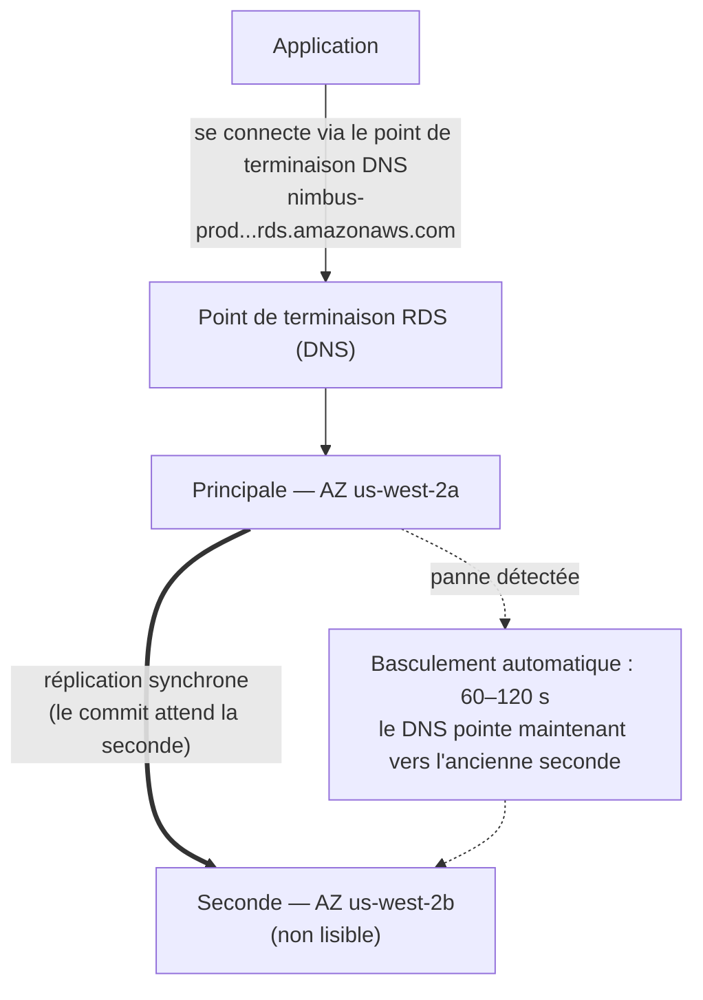

# Chapitre 8 : L'administrateur de base de données qui ne tombe jamais malade

Il était 3 h du matin quand l'alerte arriva.

Priya était la seule éveillée. Son téléphone s'illumina sur la table de nuit et elle le lut dans le noir, la luminosité de l'écran trop élevée. Elle s'assit. Elle trouva son ordinateur portable de mémoire et l'ouvrit sans allumer de lumière.

Le clavier cliquetait doucement dans la pièce sombre.

Le serveur de base de données avait besoin d'un correctif de sécurité — le type qui nécessitait un redémarrage. La
vulnérabilité était réelle, le correctif était disponible, et la fenêtre pour l'appliquer
sans perturber les clients était maintenant, au milieu de la nuit, quand le trafic
était faible.

Elle se connecta au serveur. Elle récupéra le correctif. Elle l'appliqua.

Puis elle lut les notes de version.

La mise à jour du paquet touchait le fichier de configuration que PostgreSQL utilise pour définir les paramètres de connexion. Les notes de version incluaient un avertissement : selon la façon dont la mise à niveau était effectuée, un fichier de configuration personnalisé pouvait être remplacé par la version par défaut du paquet.

Leur fichier de configuration avait été personnalisé. Leo l'avait édité il y a deux mois pour ajuster le paramètre max_connections.

Le correctif s'exécuta. Le serveur redémarra. La base de données revint en ligne.

Priya testa une requête. Ça fonctionnait.

Elle vérifia les logs. Tout semblait normal.

Elle se recoucha à 4 h 15.

À 9 h 05, Leo ouvrit l'application et obtint une erreur. Il vérifia la base de données. Max connections était réglé sur la valeur par défaut : 100. Leur application était configurée pour utiliser des pools de connexions allant jusqu'à 500.

Chaque nouvelle tentative de connexion échouait. L'application avait effectivement perdu l'accès à la base de données.

« Que s'est-il passé ? » demanda Maya.

« Le correctif », dit Priya. Elle regardait déjà le fichier de configuration. « La mise à jour du paquet a écrasé notre fichier de configuration personnalisé avec celui par défaut. L'ajustement max_connections de Leo a juste disparu — le serveur a redémarré avec les paramètres d'usine et personne n'a eu d'erreur. Il est silencieusement revenu à la valeur par défaut. »

« Combien de temps pour corriger ? » demanda Leo.

« Vingt minutes », dit Priya. « Mais il nous faut une fenêtre de maintenance. Ça nécessite un changement de configuration et un redémarrage. »

« On a des restaurants qui ouvrent pour le déjeuner dans deux heures », dit Tom.

Priya l'a corrigé en dix-huit minutes. La fenêtre de maintenance a représenté douze minutes d'indisponibilité réelle. Des restaurants ont été affectés, mais le pic n'avait pas encore commencé.

Le matin, elle a dit à l'équipe ce qui s'était passé. Il y eut un silence.

« Ça va se reproduire », dit Tom.

« Ça va se reproduire chaque fois qu'il y a un correctif », dit Priya. « Et il y a toujours
des correctifs. Il doit y avoir une meilleure façon de faire ça. »

Les temps de requête de huit secondes n'étaient toujours pas résolus. Et la même semaine, ceci : une fenêtre de maintenance à 3 h qui s'est transformée en incident matinal. Les deux problèmes avaient la même cause racine — Nimbus faisait tourner une base de données qu'ils n'étaient pas équipés pour gérer.

Il y avait une solution. Il fallait juste accepter l'idée qu'ils n'avaient pas besoin de gérer
la base de données eux-mêmes.

**Le problème traditionnel des bases de données**

Quand vous faites tourner une base de données vous-même sur une instance EC2, vous êtes responsable de tout.

Installer le logiciel de base de données. Le configurer de façon sécurisée. Le patcher quand des vulnérabilités de
sécurité sont découvertes. Prendre des sauvegardes. Tester que les sauvegardes fonctionnent vraiment
(une étape que la plupart des équipes sautent jusqu'à ce qu'il soit trop tard). Surveiller l'espace disque. Configurer la
réplication pour la redondance. Configurer le basculement pour quand le serveur principal tombe en panne.
Ajuster les performances des requêtes. Gérer les connexions sous charge.

Rien de tout ça n'est l'application. Rien de tout ça n'ajoute de fonctionnalités. Tout ça requiert de l'expertise.

L'exigence d'expertise est le problème clé. Un administrateur de base de données qualifié comprend
non seulement comment faire tourner une base de données, mais comment :

- Surveiller les logs de requêtes lentes et identifier les goulots d'étranglement de performance
- Dimensionner la mémoire pour le jeu de travail afin d'éviter l'I/O disque
- Configurer l'archivage WAL pour la récupération à un instant donné
- Mettre en place une réplication en streaming synchrone avec basculement automatique
- Ajuster le pooling de connexions pour éviter l'épuisement des connexions sous charge
- Appliquer les mises à niveau de version majeure sans perte de données ni indisponibilité prolongée

C'est un ensemble de compétences distinct et spécialisé. Les DBA seniors touchent des salaires élevés précisément
parce que bien faire tout cela est difficile. La plupart des startups ne peuvent pas embaucher pour ça. La plupart des
équipes de développement ne l'ont pas.

La plupart des équipes de développement ne sont pas des administrateurs de bases de données. Cela crée un schéma prévisible :
la base de données est installée, configurée minimalement, puis principalement oubliée jusqu'à ce que quelque chose
aille catastrophiquement mal. L'instance PostgreSQL de Nimbus tournait sur la configuration par
défaut — max_connections à 100, pas de pooling de connexions, des sauvegardes manuelles que Leo
avait exécutées deux fois puis oubliées, et aucune réplication du tout.

L'incident du correctif à 3 h était le symptôme d'un système géré par des gens qui étaient excellents
pour construire des applications et n'avaient aucune expérience des opérations de bases de données. Ce n'est pas une
critique — c'est une description exacte de la plupart des startups. La solution n'est pas
d'embaucher un DBA. La solution est d'utiliser un service qui fournit des opérations de niveau DBA
automatiquement.

« C'est ce qu'on a fait ? » demanda Maya.

La réponse de Leo était le silence, ce qui valait comme oui.

**La base de données gérée**

Imaginez embaucher un administrateur de base de données qui ne prend jamais de congé maladie, gère automatiquement
chaque correctif de sécurité, prend une sauvegarde chaque nuit sans qu'on le lui demande, et se
répare quand quelque chose se casse. Il fait tout cela sans vous déranger — et il
ne touche jamais, en aucune circonstance, à votre logique d'application.

AWS appelle ce service **RDS** — Relational Database Service.

Avec RDS, AWS gère :

- L'installation et le patch du moteur de base de données
- Les sauvegardes automatisées (stockées dans S3, conservées jusqu'à 35 jours)
- Le basculement automatique (quand le primaire tombe en panne, un serveur de secours prend le relais automatiquement)
- La surveillance et les métriques
- Le chiffrement au repos et en transit
- La mise à l'échelle automatique du stockage (si vous l'activez, le disque grandit quand il est plein)

Vous gérez :

- Le schéma de la base de données (la structure de vos tables)
- Vos requêtes et votre logique d'application
- Qui a accès à la base de données
- Quel type d'instance fait tourner la base de données
- L'ajustement des paramètres (bien que RDS fournisse des valeurs par défaut sensées)

**Moteurs supportés**

RDS supporte plusieurs moteurs de bases de données populaires :

- **MySQL** — la base de données relationnelle open source la plus utilisée
- **PostgreSQL** — puissant, extensible, de plus en plus populaire pour les charges de travail complexes
- **MariaDB** — fork MySQL open source, entièrement compatible
- **Oracle** — niveau entreprise, utilisé dans les grandes organisations avec des exigences legacy
- **Microsoft SQL Server** — pour les environnements très Windows
- **Amazon Aurora** — le propre moteur MySQL/PostgreSQL compatible d'AWS, construit pour le cloud
  (nous couvrons Aurora en profondeur au Chapitre 24)

Pour Nimbus, le choix était PostgreSQL. C'est ce que Leo connaissait, et ça gérait bien les données
relationnelles. Le choix du moteur importe moins que vous ne le pensez pour la plupart des applications —
les avantages opérationnels de RDS s'appliquent indépendamment.

Une nuance : quand vous faites tourner un moteur sur RDS, AWS maintient les correctifs de version mineure
automatiquement (pendant votre fenêtre de maintenance configurée). Les mises à niveau de version majeure —
passer de PostgreSQL 14 à 15, par exemple — sont une opération manuelle que vous
planifiez et exécutez. AWS teste les mises à niveau de version majeure soigneusement, mais vous devriez les tester
dans un environnement de staging d'abord. Les changements de version majeure peuvent introduire des problèmes de
compatibilité avec une syntaxe SQL spécifique, des extensions, ou des versions de pilote.

Leo l'a découvert quand RDS a appliqué un correctif mineur et que le log de l'application a brièvement
affiché un avertissement de dépréciation à propos d'une fonction qui avait été supprimée dans une sous-version.
Les correctifs mineurs devraient être essentiellement transparents — mais surveiller les logs de votre application
après chaque fenêtre de maintenance est une bonne pratique.

« A-t-on réfléchi à ce qui se passe si un correctif mineur casse quelque chose ? » demanda Priya.

« On revient au snapshot précédent », dit Leo.

« Combien de temps ça prend ? »

Leo chercha le temps de restauration RDS pour la taille de leur base de données. Pour une base de données de 50 Go sur un
`db.m6i.large` : environ 15 à 30 minutes pour restaurer depuis un snapshot.

« Donc on a une fenêtre de récupération de 15 à 30 minutes si un correctif casse la production », dit Priya. « Et on applique le correctif pendant la fenêtre de maintenance tôt le matin, donc au moins l'impact est minimal. »

« Et on teste les correctifs en staging d'abord », ajouta Leo.

« Oui », dit Priya. « Ça aussi. »

**Dimensionnement des instances RDS : Toutes les charges ne sont pas égales**

Quand vous créez une instance RDS, vous choisissez un type d'instance — le même concept qu'EC2, mais limité aux charges de bases de données. AWS organise les types d'instances RDS en quelques niveaux utiles.

**Famille db.t3** : Instances à performances à rafale. Conçues pour le développement, le staging, et les charges de production légères qui n'ont pas besoin d'un CPU élevé soutenu. Un `db.t3.micro` est approprié pour une base de données de développement avec un faible trafic. Un `db.t3.medium` gère une charge de production modérée avec des rafales occasionnelles.

Le compromis avec les instances de la série T : elles accumulent des crédits CPU pendant les périodes de faible utilisation et dépensent ces crédits pendant les rafales. Si vous faites tourner une instance de la série T à un CPU élevé soutenu, vous épuisez les crédits et les performances sont bridées à une base qui peut être insuffisante.

**Famille db.m6i** : Instances d'usage général avec des performances constantes et non à rafale. Le `db.m6i.large` est un point de départ courant pour les bases de données de production. Celles-ci n'ont pas de limites de crédits — le CPU est disponible à pleine capacité quand vous en avez besoin.

**Famille db.r6i** : Instances optimisées pour la mémoire. Plus de RAM par vCPU que la famille M. Appropriées pour les bases de données avec de grands jeux de travail — des requêtes qui bénéficient du fait que les données soient en mémoire plutôt que de les récupérer du disque à chaque accès. Si les performances de votre base de données s'améliorent considérablement quand vous ajoutez de la RAM, la famille R est le bon choix.

Pour Nimbus :

- Développement et staging : `db.t3.medium`. Adéquat pour les requêtes de développement, faible coût.
- Production : `db.m6i.large`. Performances constantes, assez de RAM pour le jeu de travail des menus et des commandes, pas de bridage de crédits.

« Combien le m6i.large coûte-t-il de plus que le t3.medium ? » demanda Tom.

Leo vérifia la page de tarification. Le `db.t3.medium` coûtait environ 55 $/mois. Le `db.m6i.large` coûtait environ 140 $/mois. La différence était réelle, mais la différence de fiabilité aussi.

« Le t3 bridera sous une charge soutenue », dit Priya. « Si on a un vendredi chargé et que le CPU reste élevé pendant quatre heures, le t3 épuise ses crédits et bride. Le m6i non. »

Tom nota le chiffre. Il nota aussi le coût des pannes du vendredi d'il y a deux semaines. La comparaison n'était pas serrée.

La production est partie sur le `db.m6i.large`.

**Multi-AZ : Le serveur de secours qui prend le relais**

C'est la fonctionnalité qui change complètement le calcul de fiabilité.

Le **déploiement Multi-AZ** signifie que RDS maintient une instance de secours synchrone dans une
Zone de disponibilité différente de la principale. Chaque transaction commitée vers la principale
est répliquée synchroniquement vers la seconde avant que le commit soit acquitté.

Quand la principale tombe en panne — panne matérielle, panne AZ, crash logiciel — RDS
bascule automatiquement vers la seconde. L'enregistrement DNS pour le point de terminaison de la base de données
est mis à jour. Votre application se reconnecte à la nouvelle principale.

Le basculement prend 60 à 120 secondes. Pendant cette fenêtre, votre application connaîtra
des erreurs de connexion. Les applications correctement écrites devraient gérer ça gracieusement (reprises de connexion
avec backoff).

La seconde n'est pas un réplica de lecture. Elle ne sert pas de trafic de lecture. Son seul objectif est
d'être prête à prendre le relais.



(Note : la nouvelle option de déploiement **Multi-AZ DB Cluster** garde *deux* secondes qui
**sont** lisibles et bascule en ~35 secondes — l'examen peut la distinguer du
déploiement Multi-AZ *instance* classique décrit ici.)

« Combien coûte Multi-AZ ? » demanda Tom.

Environ le double du coût d'une seule instance — parce que vous faites littéralement tourner deux
instances de base de données. La seconde coûte autant que la principale.

Tom ouvrit l'historique des commandes et estima les revenus par heure pendant leur pic du vendredi.

« Et si quelqu'un essaie d'entrer par effraction pendant la fenêtre de basculement ? » demanda Priya. « Quand la principale est en panne et que la seconde est en train de se promouvoir, y a-t-il soixante secondes où on est exposés ? »

« Le basculement est transparent », dit Maya, « mais la question est légitime. Les chaînes de connexion devraient utiliser le point de terminaison RDS, pas des IP codées en dur — sinon le basculement ne sera pas transparent. »

Multi-AZ a été activé cet après-midi-là.

**Sauvegardes automatisées et récupération à un instant donné**

RDS prend des sauvegardes automatisées chaque jour. AWS stocke ces sauvegardes dans S3 (gérées par
RDS — vous ne les voyez pas directement dans votre console S3). Vous pouvez restaurer la base de données
à n'importe quel point dans votre période de rétention de sauvegarde.

Les sauvegardes se produisent pendant une **fenêtre de sauvegarde** configurable — une période de faible trafic,
généralement tôt le matin. (C'est un paramètre distinct de la **fenêtre de
maintenance**, qui est le moment où RDS applique les correctifs et les changements de configuration. L'examen
aime tester que ce sont deux fenêtres différentes.) Pour la plupart des types de moteurs, les sauvegardes
ne causent pas d'indisponibilité — et sur les déploiements Multi-AZ, le snapshot est pris depuis la
seconde, donc la principale n'est pas touchée du tout.

La **récupération à un instant donné** est l'une des fonctionnalités les plus précieuses : vous pouvez restaurer à
n'importe quelle seconde dans votre période de rétention. Pas seulement des snapshots quotidiens — *n'importe quelle seconde*.
C'est possible parce que RDS archive en continu les logs de transactions en plus des
sauvegardes quotidiennes.

Si quelqu'un exécute accidentellement `DELETE FROM orders WHERE 1=1` à 14 h 37, vous pouvez
restaurer à 14 h 36.

Leo s'est visiblement détendu quand il a compris ça.

« J'ai déjà réglé la rétention de sauvegarde à un jour », dit Leo. « Oh — mais c'est bien, non ? On peut la changer ? »

« Change-la à sept jours minimum », dit Priya. « Trente pour la production. »

Leo l'a mise à jour immédiatement.

« Est-ce qu'on aurait pu récupérer ce que j'ai supprimé le mois dernier ? » demanda-t-il.

« Avant RDS ? Non », dit Priya. « Après RDS ? Oui. »

Vous vous demandez peut-être : quelle est la différence entre une sauvegarde automatisée et un snapshot manuel ? Les sauvegardes automatisées sont supprimées quand la période de rétention expire (jusqu'à 35 jours). Les snapshots manuels sont conservés indéfiniment jusqu'à ce que vous les supprimiez explicitement. Si vous devez préserver un état de base de données de façon permanente — avant une migration majeure, avant un déploiement risqué — prenez un snapshot manuel.

**RDS Proxy : Résoudre le problème de connexion à grande échelle**

Deux semaines après la migration vers RDS, Leo a remarqué quelque chose dans les métriques.

La base de données gérait bien les requêtes. Mais le nombre de connexions ouvertes était élevé — plus élevé qu'il ne s'y attendait. Avec l'Auto Scaling Group ajoutant des instances EC2 pendant le pic, chaque nouvelle instance ouvrait son propre pool de connexions à la base de données. Dix instances EC2, chacune avec un pool de connexions de 50 : cinq cents connexions simultanées à la base de données.

« PostgreSQL a une surcharge pour chaque connexion », dit Priya. « Mémoire, CPU pour le gestionnaire de connexions. Cinq cents connexions utilisent une part significative des ressources de la base de données juste pour la gestion des connexions — avant qu'elle n'ait fait le moindre travail réel. »

« On peut réduire la taille du pool de connexions ? » demanda Leo.

« On pourrait », dit Priya. « Mais alors on risque que les requêtes s'accumulent en attendant une connexion pendant le pic. »

La meilleure solution : **RDS Proxy**.

RDS Proxy se situe entre l'application et la base de données. Les instances EC2 se connectent au Proxy, pas directement à l'instance RDS. Le Proxy maintient un pool de connexions à la base de données et multiplexe les requêtes de l'application à travers elles. Si dix instances EC2 ouvrent chacune cinquante connexions au Proxy, le Proxy pourrait ne maintenir que cent connexions réelles à la base de données — les partageant efficacement entre toutes les requêtes de l'application.

Les avantages :

**Pooling de connexions** : Moins de connexions réelles à la base de données signifie moins de surcharge mémoire sur l'instance RDS et de meilleures performances sous charge.

**Basculement plus rapide** : Pendant un basculement Multi-AZ, le Proxy maintient la connexion du côté de l'application tout en rétablissant la connexion à la base de données côté backend. Les applications voient une brève pause plutôt qu'une réinitialisation complète de la connexion. RDS Proxy réduit l'impact du basculement de 60 à 120 secondes à typiquement 30 secondes ou moins.

**Authentification IAM** : Au lieu d'intégrer les credentials de la base de données dans l'application, l'application peut s'authentifier auprès de RDS Proxy en utilisant un rôle IAM. Le Proxy gère les credentials réels de la base de données. Cela élimine entièrement les secrets de l'environnement de l'application.

« Combien coûte RDS Proxy ? » demanda Tom.

Il coûte grosso modo 0,015 $ par vCPU-heure de l'instance RDS sous-jacente, facturé séparément de l'instance elle-même. Pour un `db.m6i.large` (2 vCPU), le Proxy ajoute environ 22 $/mois.

Tom regarda le graphique du nombre de connexions — cinq cents connexions se disputant les ressources de la base de données pendant le pic — et regarda le coût de 22 $/mois.

« C'est moins cher que de passer à une instance RDS plus grande pour gérer la surcharge de connexions », dit-il.

RDS Proxy a été activé cette semaine-là.

« Et si quelqu'un essaie d'entrer par effraction via le Proxy ? » demanda Priya. « L'authentification IAM pour le Proxy réduit-elle la surface d'attaque ? »

« Oui », répondit Priya à sa propre question. « Pas de credentials de base de données dans l'environnement de l'application signifie qu'il n'y a pas de credentials de base de données à voler à l'application. »

Elle a activé l'authentification IAM pour le Proxy.

**Réplicas de lecture : Mettre à l'échelle le trafic de lecture**

Multi-AZ concerne la disponibilité. Les **réplicas de lecture** concernent les performances.

Un réplica de lecture est une copie asynchrone de votre base de données principale qui peut servir des
requêtes de lecture. Vous pouvez avoir jusqu'à 15 réplicas de lecture pour les principaux moteurs RDS — MySQL, PostgreSQL et MariaDB (Aurora supporte aussi jusqu'à 15 réplicas Aurora, partageant le même volume de stockage).

L'application est modifiée pour envoyer les requêtes de lecture au réplica et les requêtes d'écriture à
la principale. Cela distribue la charge : la principale gère les écritures et les transactions complexes ;
les réplicas gèrent les lectures.

Caractéristiques clés :

- La réplication est **asynchrone** — il peut y avoir un petit délai (lag) entre la
  principale et le réplica. Si vous écrivez un enregistrement et lisez immédiatement depuis le réplica,
  vous pourriez ne pas le voir encore.
- Les réplicas de lecture peuvent être dans la même Région ou dans une Région différente (les
  réplicas inter-Régions ajoutent de la latence mais permettent la distribution géographique).
- Les réplicas de lecture peuvent être promus en bases de données autonomes dans un scénario de sinistre.

Pour Nimbus : les recherches de menus sont des lectures. L'historique des commandes est des lectures. La grande majorité du
trafic est du trafic de lecture. Ajouter un réplica de lecture et router les lectures vers lui réduit
significativement la charge de la base de données principale.

Nous couvrons les réplicas de lecture plus en détail au Chapitre 24 quand nous discutons d'Aurora.

**Si intensive en lecture, alors ajoutez un réplica mais surveillez le lag**

Si votre charge est intensive en lecture, ajouter un réplica de lecture réduit la charge sur la principale et améliore les performances des requêtes — mais la réplication est asynchrone, ce qui signifie que le réplica peut être légèrement en retard sur la principale. Si votre application écrit un enregistrement et le relit immédiatement, elle doit lire depuis la principale, pas le réplica. Se tromper sur ce point produit des bugs subtils et difficiles à déboguer de fraîcheur des données : un utilisateur passe une commande, la page de confirmation interroge le réplica, le réplica n'a pas rattrapé, la commande apparaît manquante. C'est ce qu'on appelle la cohérence de lecture-après-écriture, et c'est l'erreur la plus courante que font les équipes quand elles ajoutent des réplicas pour la première fois.

**Performance Insights : Trouver la requête lente**

Le temps de chargement du menu de huit secondes était toujours un problème. Le passage à RDS a amélioré la fiabilité, mais la requête était toujours lente.

Leo a ajouté un réplica de lecture et routé les requêtes de menu vers lui. Le temps de chargement du menu est descendu à environ quatre secondes. Mieux. Toujours pas bon.

« La requête est toujours lente », dit Maya. « On a amélioré le goulot d'étranglement, mais on ne l'a pas corrigé. »

RDS inclut une fonctionnalité appelée **Performance Insights** — un outil de surveillance qui montre quelles requêtes consomment le plus de ressources de la base de données, quelles sessions attendent, et ce qu'elles attendent.

Leo a activé Performance Insights sur le réplica de lecture et a chargé la page de menu à plusieurs reprises pendant une session de test l'après-midi.

Le tableau de bord Performance Insights a montré une requête dominant la charge : un scan complet de table de la table `menu_items`, récupérant les 22 000 lignes à chaque chargement d'une page de menu. Il n'y avait pas d'index sur `restaurant_id` — la colonne sur laquelle l'application filtrait.

Temps d'exécution sans index : 8,2 secondes.

Leo a ajouté l'index.

```sql
CREATE INDEX idx_menu_items_restaurant_id ON menu_items(restaurant_id);
```

Temps d'exécution avec index : 14 millisecondes.

8 200 millisecondes à 14 millisecondes. La différence entre une application de commande de restaurant qui fait fuir les clients et une qu'ils utilisent sans y penser.

« C'était ça le problème depuis le début ? » dit Maya.

« C'était ça le problème », dit Leo.

« Et Performance Insights l'a trouvé en combien de temps ? »

« Environ vingt minutes. »

Tom calculait déjà. Trois semaines de temps de chargement de menu sous-optimaux, estimés à 200 000 chargements de pages de menu pendant cette période, estimés à 15 % d'abandon dû à la lenteur. Le chiffre auquel il aboutit était inconfortable.

« Ajoute les index manquants avant le lancement la prochaine fois », dit-il.

« Il y aura une liste de contrôle », dit Priya. Elle l'écrivait déjà.

**Quand ne pas utiliser RDS**

RDS est excellent pour une large gamme de charges de bases de données relationnelles. Ce n'est pas la bonne réponse à tout.

**Quand vous avez besoin d'un accès au niveau OS** : RDS ne vous donne pas accès au système d'exploitation sous-jacent. Vous ne pouvez pas installer de paquets OS personnalisés, modifier les paramètres du noyau, ou exécuter des outils qui nécessitent un accès root au serveur de base de données. Si votre base de données a des exigences qui demandent un accès OS — certaines configurations Oracle, des pilotes de stockage personnalisés, des interfaces réseau spécifiques — vous devez faire tourner la base de données sur une instance EC2 directement.

**Quand vous utilisez un moteur non supporté** : RDS supporte MySQL, PostgreSQL, MariaDB, Oracle, SQL Server, et Aurora. Si votre application utilise un moteur de base de données différent — CockroachDB, SingleStore, Greenplum — vous le faites tourner sur EC2, pas RDS.

**Quand vous avez besoin d'une mise à l'échelle horizontale intensive en écriture** : RDS met à l'échelle les lectures via des réplicas. Les écritures vont à une seule instance principale. Si votre charge est intensive en écriture et doit être distribuée sur plusieurs nœuds d'écriture, RDS n'est pas la bonne architecture. Aurora Global Database peut aider à grande échelle, mais pour des exigences d'échelle d'écriture extrêmes, les bases de données distribuées comme DynamoDB (Chapitre 9) ou CockroachDB tournant sur EC2 sont les outils appropriés.

**Quand le coût géré dépasse le coût opérationnel** : Pour de très grandes charges stables où votre équipe a une véritable expertise en administration de bases de données, faire tourner PostgreSQL sur EC2 avec votre propre outillage peut être moins cher que RDS. C'est inhabituel pour les équipes qui ne sont pas principalement des ateliers de DBA. Mais c'est réel, et un bon architecte le reconnaît.

Pour Nimbus — une startup sans ressources DBA dédiées, faisant tourner PostgreSQL sur un service géré, avec une croissance imprévisible — RDS était clairement le bon choix.

**Groupes de paramètres et groupes d'options RDS**

Deux mécanismes de configuration apparaissent à l'examen :

Les **groupes de paramètres** contrôlent les paramètres du moteur de base de données — comme le nombre maximum de connexions,
la taille du cache de requêtes, les valeurs de timeout. RDS crée un groupe de paramètres par défaut qui fonctionne
pour la plupart des cas. Vous créez des groupes de paramètres personnalisés quand vous avez besoin d'ajuster des paramètres spécifiques.

Les **groupes d'options** activent des fonctionnalités supplémentaires pour certains moteurs — comme le chiffrement réseau
natif d'Oracle ou le chiffrement transparent des données de SQL Server. La plupart des déploiements de moteurs open source
n'ont pas besoin de groupes d'options personnalisés.

Vous pouvez personnaliser le comportement du moteur de base de données via ces mécanismes — mais les valeurs par défaut fonctionnent pour la plupart des équipes qui débutent.

### Faire entrer les données : AWS Database Migration Service

Quelques semaines plus tard, Tom est arrivé au standup avec une diapositive.

Nimbus acquérait un petit concurrent régional. Leur système de commande tournait sur une base de données MySQL dans une installation de colocation. Le système ne pouvait pas se mettre hors ligne pendant la migration — des restaurants l'utilisaient.

« On doit déplacer leurs données dans RDS », dit Tom. « Sans mettre le système hors service. »

« Quelle est la taille de la base de données ? » demanda Leo.

« Environ 80 gigaoctets. »

« Quand doivent-ils basculer ? »

« Six semaines. »

Priya avait déjà ouvert la documentation. « AWS DMS », dit-elle.

**AWS DMS (Database Migration Service)** déplace les données d'une base de données source vers une base de données cible avec un temps d'arrêt minimal. Il gère la migration en deux phases : un chargement complet des données existantes, suivi d'une réplication continue des changements pendant que la source continue de tourner.

Il y a deux types de migration :

**Migration homogène :** la source et la cible sont le même moteur — MySQL vers RDS MySQL, PostgreSQL vers Aurora PostgreSQL. Le schéma est compatible ; DMS migre les données directement.

**Migration hétérogène :** la source et la cible sont des moteurs différents — Oracle vers Aurora PostgreSQL, SQL Server vers RDS MySQL. Le schéma doit d'abord être converti. Cela nécessite l'**AWS Schema Conversion Tool (SCT)** pour traduire le schéma, puis DMS pour déplacer les données.

Pour l'acquisition de Nimbus : MySQL vers RDS MySQL. Homogène. Pas besoin de SCT.

Comment ça fonctionne en pratique :

1. DMS lit depuis la source — la base de données MySQL en colocation
2. **Chargement complet** : DMS copie toutes les données existantes vers l'instance RDS cible
3. **CDC (Change Data Capture)** : après le chargement complet, DMS lit le log de transactions de la base de données source et réplique les changements continus vers la cible en temps quasi réel
4. La source continue de tourner. Quand l'équipe est prête, elle bascule la chaîne de connexion.

« Donc le système de commande des restaurants reste en ligne tout le temps ? » demanda Tom.

« Tout le temps », confirma Priya. « La source et la cible restent synchronisées via CDC. Quand on est prêts, on bascule le point de terminaison. Le temps d'arrêt est les secondes qu'il faut pour que ce changement se propage. »

DMS supporte des dizaines de combinaisons source et cible : Oracle, SQL Server, MySQL, PostgreSQL, MongoDB, DynamoDB, S3, Redshift, Aurora, et plus.

« Attends — mais *pourquoi* a-t-on besoin d'un outil séparé pour les migrations hétérogènes ? » demanda Maya. « DMS ne peut pas juste comprendre les différences de schéma ? »

« Un VARCHAR dans Oracle n'est pas la même chose qu'un VARCHAR dans PostgreSQL », dit Priya. « Les types de données, les procédures stockées, les séquences, les fonctions propriétaires — ils ne se mappent pas un pour un. SCT analyse le schéma source et génère l'équivalent le plus proche pour la cible. DMS déplace ensuite les données dans ce schéma converti. Séparer la conversion de schéma du déplacement de données est ce qui rend le processus fiable. »

« Et si quelqu'un essaie d'entrer par effraction via l'instance de réplication DMS ? » se demanda Priya un moment plus tard. « Elle a besoin d'un accès en lecture à la source et d'un accès en écriture à la cible. »

« Moindre privilège aux deux extrémités », dit Leo. « IAM en lecture seule sur la source. Accès en écriture limité à la cible de migration uniquement. Et l'instance de réplication reste dans le sous-réseau privé. »

Priya l'a noté.

## Forces et limites

**Pourquoi RDS est excellent** :

- Élimine la charge opérationnelle de la gestion du logiciel de base de données
- Sauvegardes automatisées et récupération à un instant donné
- Multi-AZ pour un basculement automatique avec un RTO minimal
- Réplicas de lecture pour mettre à l'échelle le trafic de lecture
- Chiffrement au repos et en transit intégré
- Tous les principaux moteurs de bases de données relationnelles supportés
- RDS Proxy pour le pooling de connexions et une réponse de basculement améliorée

**Là où RDS a des limites** :

- Vous ne pouvez pas accéder à l'OS sous-jacent. Si votre base de données a des exigences qui demandent
  un accès au niveau OS, vous pourriez avoir besoin de faire tourner votre propre base de données basée sur EC2.
- RDS n'est pas serverless (avec des exceptions — Aurora Serverless existe, couvert au
  Chapitre 24). Vous payez pour une instance en cours d'exécution même si elle est inactive.
- RDS n'est pas conçu pour les bases de données à sharding horizontal. Pour une mise à l'échelle massive des
  charges relationnelles intensives en écriture, vous pourriez éventuellement avoir besoin d'une architecture différente.
- Pour les schémas de données non relationnels (NoSQL), DynamoDB (Chapitre 9) est plus approprié.

## Résumé

La fenêtre de correctif à 3 h de Priya était le symptôme. La cause racine était que Nimbus gérait une base de données qu'un service géré pouvait gérer mieux. RDS n'élimine pas seulement le réveil à 3 h — il transfère la responsabilité du patch, du basculement, des sauvegardes, et de la gestion des connexions à AWS, libérant l'équipe pour se concentrer sur le code applicatif qui sert réellement les clients. Le compromis est la perte d'accès au niveau OS, ce qui importe rarement et bien moins que ça en a l'air.

- **Amazon RDS** est un service de base de données relationnelle géré. AWS gère le patch, les sauvegardes, le basculement et le stockage. Vous gérez le schéma, les requêtes et la logique d'application.
- **Multi-AZ** maintient une seconde synchrone dans une AZ différente. Le basculement automatique se produit en 60 à 120 secondes. Utilisez toujours le nom DNS du point de terminaison RDS dans les chaînes de connexion — pas des IP codées en dur — pour que le basculement soit transparent.
- Les **réplicas de lecture** sont des copies asynchrones qui servent le trafic de lecture. Le lag de réplication signifie qu'ils peuvent être légèrement en retard — la cohérence de lecture-après-écriture nécessite de lire depuis la principale immédiatement après une écriture.
- **RDS Proxy** met en pool les connexions, réduisant la surcharge et améliorant la vitesse de basculement. Critique pour les charges basées sur Lambda qui peuvent créer des milliers de connexions éphémères.
- **Performance Insights** identifie les requêtes lentes — trouver un index manquant peut transformer une requête de 8 secondes en une de 14 millisecondes. Les mises à niveau de version majeure sont manuelles ; testez en staging d'abord.

## Conseils pour l'examen

*Domaine SAA-C03 3 — Tâche 3.3 (solutions de bases de données)*

- **Multi-AZ est pour la haute disponibilité, pas les performances.** La seconde ne sert pas
  de trafic de lecture. Les réplicas de lecture sont pour les performances. Cette distinction est testée fréquemment.
- **Le basculement Multi-AZ est automatique.** Vous ne configurez pas quand ou comment ça se produit.
  RDS surveille la principale et déclenche le basculement automatiquement.
- **Le lag de réplication importe.** Les réplicas de lecture peuvent être légèrement en retard sur la principale.
  Si votre application nécessite de lire des données qu'elle vient d'écrire, elle doit lire depuis la
  principale, pas le réplica. C'est ce qu'on appelle la « cohérence de lecture-après-écriture ».
- **Les sauvegardes automatisées sont conservées pendant 0 à 35 jours.** Mettre la rétention à 0
  désactive les sauvegardes automatisées. Les snapshots manuels sont conservés indéfiniment jusqu'à
  ce que vous les supprimiez.
- **La mise à l'échelle automatique du stockage RDS** prévient les pannes dues à un disque plein. Activez-la. Elle s'adapte
  seulement à la hausse, jamais à la baisse. L'examen peut tester si vous connaissez cette asymétrie.
- **RDS Proxy** apparaît dans les scénarios d'examen impliquant des fonctions Lambda se connectant à RDS
  (Lambda peut créer des milliers de connexions éphémères, qui submergent la base de données
  sans Proxy), ou les scénarios nécessitant un basculement Multi-AZ plus rapide.
- **Les instances db.t3 font des rafales et bridhent.** Les scénarios d'examen décrivant une dégradation
  de performance intermittente sur de petites instances RDS peuvent décrire un épuisement des crédits CPU
  sur les instances de la série T. Le correctif est de passer à une instance de la série M ou R.
- **Point de terminaison DNS Multi-AZ** : Quand un basculement Multi-AZ se produit, l'enregistrement DNS du point
  de terminaison RDS est mis à jour pour pointer vers la nouvelle principale. Les applications qui utilisent le point de terminaison RDS
  (pas une IP codée en dur) se reconnectent automatiquement. Les applications avec de longs TTL DNS ou
  des adresses IP codées en dur ne se reconnecteront pas automatiquement. Utilisez toujours le point de terminaison RDS.
- **Promotion de réplica de lecture** : Un réplica de lecture peut être promu en instance de BD autonome
  — utile pour la reprise après sinistre si la principale est perdue et que Multi-AZ n'était pas configuré.
  La promotion est une opération à sens unique : le réplica devient une principale et ne réplique plus
  depuis l'original. Les scénarios d'examen demandant de « promouvoir manuellement » ou
  « convertir un réplica de lecture en principale » impliquent cette opération.
- **Performance Insights** identifie les principales requêtes SQL par temps d'attente et utilisation CPU.
  Quand un scénario d'examen demande comment diagnostiquer des requêtes lentes sur une base de données RDS, Performance
  Insights est la réponse native AWS.
- **RDS vs faire tourner une base de données sur EC2** : L'examen présente parfois ça comme un choix.
  RDS fournit des opérations gérées mais limite l'accès au niveau OS. Les bases de données basées sur EC2 vous donnent
  un contrôle total mais nécessitent une expertise DBA pour les opérations. La phrase « accès au niveau OS requis »
  dans un scénario d'examen est un signal de choisir EC2 plutôt que RDS.
- **AWS DMS :** Migre les bases de données avec un temps d'arrêt minimal en utilisant chargement complet + CDC. Homogène (même moteur) = DMS directement. Hétérogène (moteurs différents) = SCT pour convertir le schéma d'abord, puis DMS pour déplacer les données. Déclencheur d'examen : « migrer une base de données avec un temps d'arrêt minimal » ou « Oracle vers Aurora » → DMS + SCT.

## Exercices

**Exercice 1 — Mémorisation**

Dans vos propres mots : quelle est la différence entre Multi-AZ et les réplicas de lecture dans RDS ?
Quel problème chacun résout-il ?

*(Indice : L'un protège contre les temps d'arrêt ; l'autre améliore les performances sous une
charge intensive en lecture. Ils résolvent des problèmes différents et peuvent être utilisés ensemble.)*

**Exercice 2 — Entraînement à l'examen**

*Scénario* : Une entreprise fait tourner une base de données PostgreSQL de production sur RDS. La base de données
connaît un trafic de lecture élevé dû à des requêtes de rapport s'exécutant tout au long de la journée.
L'équipe s'inquiète aussi de la disponibilité de la base de données — ils ne peuvent pas se permettre plus de
quelques minutes de temps d'arrêt dans un scénario de panne. Ils veulent minimiser l'impact sur la
base de données principale des charges de travail de rapport.

Quelle combinaison de fonctionnalités RDS répond LE MIEUX aux deux préoccupations ?

A) Activer Multi-AZ et exécuter toutes les requêtes contre l'instance de secours  
B) Prendre des snapshots manuels plus fréquents et restaurer à partir d'eux si la principale tombe en panne  
C) Créer plusieurs réplicas de lecture et désactiver Multi-AZ pour réduire les coûts  
D) Activer Multi-AZ pour la protection de basculement et créer un réplica de lecture pour les requêtes de rapport

**Indice 1** : Les deux exigences sont : (1) disponibilité lors d'une panne, (2) décharge des lectures.
Quelles fonctionnalités répondent à quelle exigence ?

**Indice 2** : Multi-AZ fournit un basculement automatique. La seconde ne sert PAS de trafic de lecture.
Donc Multi-AZ seul n'aide pas avec le problème de lecture.

**Indice 3** : Les réplicas de lecture servent le trafic de lecture. Multi-AZ fournit le basculement. Vous avez besoin des deux.

**Réponse** : D

**Explication** : Multi-AZ fournit un basculement automatique vers une seconde dans une AZ différente —
cela répond à l'exigence de disponibilité. Un réplica de lecture permet aux requêtes de rapport
de s'exécuter sans impacter la base de données principale — cela répond à l'exigence de performance.
Les deux fonctionnalités peuvent être utilisées simultanément.

**Pourquoi pas A ?** La seconde Multi-AZ ne peut pas servir de trafic de lecture. Elle est exclusivement pour
le basculement. Tenter de la requêter directement n'est pas supporté.

**Pourquoi pas B ?** Les snapshots manuels restaurent une copie complète de la base de données — un processus beaucoup plus long
(potentiellement des heures pour les grandes bases de données). Cela ne répond pas à une exigence de « quelques minutes
de temps d'arrêt ».

**Pourquoi pas C ?** Les réplicas de lecture aident avec les performances de lecture mais ne fournissent pas
de basculement automatique. Si la principale tombe en panne, vous devriez promouvoir manuellement un réplica de lecture —
ce qui prend du temps et n'est pas automatique.

*Domaine SAA-C03 3 — Tâche 3.3*

**Exercice 3 — Défi d'architecture** *(Optionnel)*

Nimbus envisage de migrer leur base de données PostgreSQL auto-gérée existante
(tournant sur une instance EC2) vers RDS PostgreSQL. La migration doit se faire
avec un temps d'arrêt minimal — idéalement moins de 15 minutes. La base de données fait 200 Go.

Quelle approche recommanderiez-vous ? Quels services AWS pourraient aider avec la migration ?
Quels risques testeriez-vous avant de basculer le trafic de production ?

*(Il n'y a pas de réponse unique correcte. Pensez à AWS Database Migration Service,
la réplication logique, et le risque d'incohérence des données lors du basculement.)*

## Scène post-générique

À la fin de la journée, Nimbus avait migré vers RDS PostgreSQL avec Multi-AZ activé. La
migration elle-même avait pris la majeure partie de l'après-midi — Leo avait utilisé une approche de sauvegarde-et-restauration,
avec une brève fenêtre de maintenance.

Tom avait regardé la facture attentivement.

« L'instance RDS », dit-il, « coûte deux fois plus que la base de données EC2. »

« Et les sauvegardes automatisées ? » demanda Maya.

« Un peu plus. »

« Et le basculement qu'on obtiendra gratuitement si la principale tombe en panne ? »

Tom n'avait pas de prix pour ça. Il l'a noté comme une question.

Trois jours plus tard, la base de données était saine. Les temps de requête avaient baissé considérablement après que Leo a ajouté l'index manquant. Le menu se chargeait en moins d'une seconde.

« Le problème », dit Priya, « n'est pas le moteur de base de données. C'est le modèle de données. »

Elle fit une pause.

« Certaines de ces données ne sont pas du tout relationnelles. Les éléments de menu, les profils de restaurant,
les zones de livraison — ces données ont des formes variables. SQL nous combat. »

Leo cherchait déjà quelque chose.

« Et si on utilisait un autre type de base de données pour le menu ? » dit-il.

Dans le prochain chapitre : la base de données qui ne ralentit pas, même quand un million de personnes commandent à la fois.
