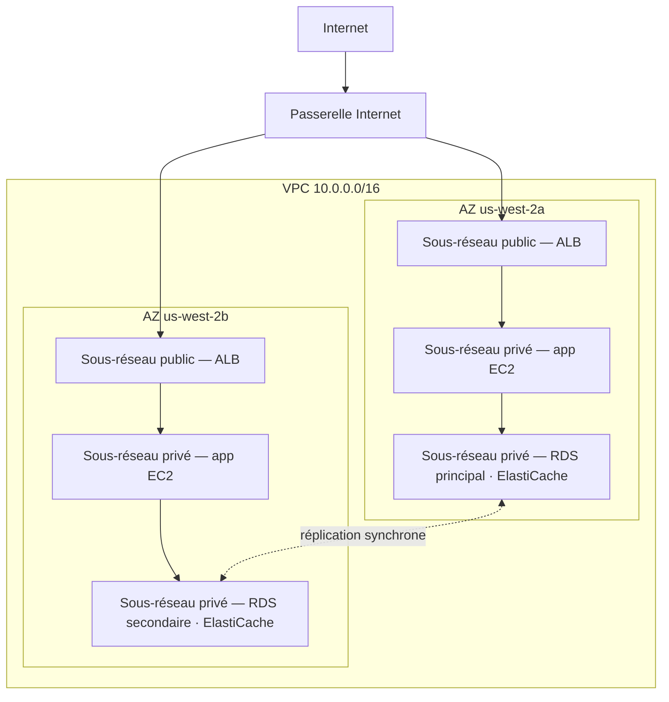

# Chapitre 11 : Votre coin privé du cloud

Priya avait un morceau de papier avec un dessin dessus.

Ce n'était pas un dessin compliqué. Un rectangle, étiqueté « AWS ». À l'intérieur du rectangle, un ensemble de boîtes : des instances EC2, une base de données RDS, un cluster ElastiCache. Des lignes connectant tout à tout. Et à l'extérieur du rectangle, une seule étiquette : « Internet ».

Elle le posa au centre de la table.

---

*La couche de mise en cache fonctionnait. Redis avait réduit les chargements de page de 188 millisecondes à 12. Mais pendant que Leo célébrait cette victoire, Priya lisait les journaux réseau — et elle n'aimait pas ce qu'elle voyait. Chaque service était sur le même réseau plat. La base de données avait une adresse IP publique. Le cluster Redis était techniquement accessible depuis l'extérieur. L'application fonctionnait, mais l'architecture était un parking : pas de clôtures, pas de portails, pas de zones.*

---

« Voilà ce qu'on a », dit-elle. « Notre base de données a une adresse IP publique. Notre couche de cache peut être atteinte depuis internet. Nos instances EC2 sont toutes sur le même réseau plat. »

« Ça semble bien », dit Leo. « On a des groupes de sécurité. »

« Des groupes de sécurité que vous avez configurés », dit Priya. « La nuit. Lors de la configuration initiale. »

Leo ne dit rien.

« Je ne critique pas la configuration », dit-elle. « Je dis que quand tout vit sur un réseau public plat, une seule mauvaise configuration est la différence entre un système fonctionnel et un système accessible à tout le monde sur internet. »

Elle prit un marqueur rouge et dessina un cercle autour de la base de données.

« Ça ne devrait pas être accessible depuis internet. Du tout. Pas via une règle de groupe de sécurité, pas via une configuration durcie. Ça devrait être structurellement inaccessible. »

« On a besoin de parler d'architecture réseau », dit Maya.

« On en avait besoin il y a trois mois », dit Priya. « Mais maintenant c'est bien. »

L'équipe se rassembla autour d'un tableau blanc pour la première fois depuis des semaines.

**Le problème avec le parking ouvert**

Imaginez un immense parking public. Dix mille voitures. N'importe quelle voiture peut se garer n'importe où. Il n'y a pas de barrières entre les zones, pas de portails, pas de sections réservées.

C'est un réseau ouvert. Chaque service peut atteindre chaque autre service. Votre serveur web peut parler à votre base de données. Votre base de données peut atteindre internet. Votre couche de cache peut recevoir des connexions de n'importe où.

Quand tout peut parler à tout, une compromission affecte tout.

« Donc si quelqu'un entre par effraction dans le parking », dit Tom, « il peut entrer dans n'importe quelle voiture. »

« Et depuis n'importe quelle voiture, conduire n'importe où », confirma Priya. « On veut des clôtures. On veut des portails fermés à clé. On veut des zones. »

Le VPC est la façon dont vous construisez ces zones dans AWS.

**Qu'est-ce qu'un VPC ?**

« Attends — mais *pourquoi* ferait-on ça comme ça ? » demanda Maya. « Si on a déjà des groupes de sécurité sur chaque ressource, pourquoi a-t-on besoin d'un VPC ? Les groupes de sécurité ne font-ils pas le même travail ? »

Les groupes de sécurité et les VPC protègent à des niveaux différents. Un groupe de sécurité est une règle attachée à une ressource spécifique — il dit « cette instance EC2 n'accepte le trafic que sur le port 8080 depuis l'équilibreur de charge ». Mais elle est toujours sur le réseau public. L'adresse IP est toujours accessible ; la règle ne fait que bloquer la connexion à la porte. Un VPC retire entièrement la porte de la rue publique. Une ressource dans un sous-réseau privé n'a aucune *route* vers internet — et par convention aucune IP publique — donc elle ne peut pas être atteinte depuis internet, quoi que dise le groupe de sécurité. C'est une garantie structurelle, pas une garantie de configuration.

Un **Virtual Private Cloud (VPC)** est une section logiquement isolée du cloud AWS — un réseau privé que vous définissez, auquel seules vos ressources peuvent accéder par défaut.

Pensez-y comme un terrain privé clôturé à l'intérieur du grand parking public. Votre terrain a ses propres règles : qui peut entrer, qui peut sortir, quelles routes existent entre les sections.

Quand vous créez un VPC, vous définissez :

**Un bloc CIDR** : La plage d'adresses IP disponibles à l'intérieur de votre réseau. Par exemple, `10.0.0.0/16` vous donne 65 536 adresses IP possibles (10.0.0.0 à 10.0.255.255).

**Des sous-réseaux** : Des subdivisions de votre VPC, chacune assignée à une partie de votre plage d'adresses IP et associée à une Zone de disponibilité spécifique.

**Des tables de routage** : Des règles qui déterminent où va le trafic réseau.

**Une passerelle Internet** : La connexion entre votre VPC et l'internet public.

**Sous-réseaux : Publics vs Privés**

Toutes les ressources ne devraient pas être accessibles publiquement.

Votre serveur web doit accepter le trafic d'internet — les navigateurs des utilisateurs doivent pouvoir l'atteindre.

Votre base de données ne devrait *jamais* accepter de trafic d'internet — seul votre serveur web devrait pouvoir lui parler.

C'est là qu'interviennent les sous-réseaux.

Un **sous-réseau public** est connecté à une passerelle Internet et peut avoir des ressources avec des adresses IP publiques. Le trafic peut circuler vers et depuis internet.

Un **sous-réseau privé** n'a pas de route vers internet dans sa table de routage. Les ressources dans un sous-réseau privé ne peuvent communiquer qu'avec d'autres ressources dans votre VPC (à moins que vous ne configuriez des routes sortantes spécifiques). Par convention, elles n'ont pas non plus d'adresses IP publiques.

Pour Nimbus, le design devint clair :



L'équilibreur de charge est orienté vers le public — il doit recevoir du trafic d'internet. Les instances EC2 sont privées — elles ne reçoivent que le trafic de l'équilibreur de charge. Les bases de données sont privées — elles ne reçoivent que le trafic des instances EC2.

« Donc pour atteindre la base de données », dit Tom, « quelqu'un devrait passer par l'équilibreur de charge, puis par l'instance EC2, puis par le groupe de sécurité de la base de données ? »

« Trois couches », confirma Priya. « Défense en profondeur. »

---

**Le plan CIDR de Nimbus**

« Attends — mais *pourquoi* ferait-on ça comme ça ? » demanda Maya, en regardant les choix de blocs CIDR. « Pourquoi Priya est-elle si précise sur les plages d'adresses IP ? Ne peut-on pas simplement utiliser ce qu'AWS choisit par défaut ? »

« Parce que les blocs CIDR sont très difficiles à changer plus tard », dit Priya. « Et parce que si on connecte un jour ce VPC à un autre VPC, ou à un réseau sur site, les plages IP qui se chevauchent causent des échecs de routage pénibles à déboguer. »

Elle dessina le plan sur le tableau blanc.

Le VPC de Nimbus : `10.0.0.0/16` — 65 536 adresses au total.

| Sous-réseau | CIDR | AZ | Objectif |
|---|---|---|---|
| Public A | 10.0.0.0/24 | us-west-2a | Équilibreurs de charge |
| Public B | 10.0.1.0/24 | us-west-2b | Équilibreurs de charge |
| App privé A | 10.0.10.0/24 | us-west-2a | Serveurs d'app EC2 |
| App privé B | 10.0.11.0/24 | us-west-2b | Serveurs d'app EC2 |
| Données privé A | 10.0.20.0/24 | us-west-2a | RDS, ElastiCache |
| Données privé B | 10.0.21.0/24 | us-west-2b | RDS, ElastiCache |

« Pourquoi ne pas tout faire en /16 ? » demanda Leo.

« Parce que les sous-réseaux dans différentes AZ ne devraient pas partager un espace d'adresses. Chaque sous-réseau est dans une seule AZ. Si on appaire un jour ce VPC avec un autre, plus on est granulaires, moins on risque d'avoir des conflits. Et chaque /24 nous donne 251 adresses utilisables — plus qu'assez pour n'importe quel niveau unique. »

« AWS réserve cinq adresses dans chaque sous-réseau », observa Tom, en regardant la documentation. « C'est pourquoi c'est 251, pas 256. »

« Correct. Les quatre premières et la dernière. Adresse réseau, routeur VPC, serveur DNS, usage futur, diffusion. »

« Donc /24 est le plus petit que vous prendriez ? »

« En pratique. Vous utiliseriez /28 pour de très petits sous-réseaux — comme un sous-réseau de passerelle VPN, qui n'a besoin que d'une poignée d'IP. Mais pour les niveaux applicatifs, /24 est un minimum raisonnable. »

Tom nota les chiffres et calcula la différence de coût mensuel entre les tailles. Il le faisait toujours.

---

**Erreurs de planification CIDR à éviter**

« A-t-on réfléchi à ce qui se passe si on dépasse la capacité d'un sous-réseau ? » demanda Priya. Elle ne demandait pas parce qu'elle ne savait pas. Elle demandait parce que le reste de l'équipe avait besoin d'intérioriser la réponse.

Leo y réfléchit. « On peut ajouter plus de sous-réseaux ? »

« Vous pouvez ajouter des sous-réseaux à un VPC. Mais vous ne pouvez pas redimensionner un sous-réseau existant. Si votre sous-réseau d'app privé se remplit — 251 adresses ne suffisent pas — il faudrait créer un nouveau sous-réseau et y migrer les instances. »

« À quelle fréquence ça arrive vraiment ? »

« Rarement, si vous planifiez bien. Mais les gens font trois erreurs courantes. »

Elle les énuméra :

**Erreur un** : Utiliser un CIDR de VPC trop petit. Si vous utilisez `10.0.0.0/24` pour tout le VPC (254 adresses), vous manquerez d'espace avant d'avoir fini de planifier les sous-réseaux. Commencez avec `/16` pour la flexibilité.

**Erreur deux** : Utiliser des CIDR qui se chevauchent entre les VPC. Si votre VPC de production est `10.0.0.0/16` et que votre VPC de préproduction est aussi `10.0.0.0/16`, vous ne pourrez jamais les appairer ni les connecter via une transit gateway. Les routeurs ne sauront pas à quel VPC envoyer le trafic.

**Erreur trois** : Ne pas réserver d'espace d'adresses pour de futurs niveaux. Le plan de Nimbus laissait `10.0.30.0/24` et `10.0.31.0/24` non assignés — de la place pour un futur niveau d'outillage interne, un sous-réseau de surveillance ou un sous-réseau de point de terminaison VPN, sans avoir à restructurer tout l'espace d'adresses.

« Planifiez pour le double de ce que vous pensez avoir besoin », dit Priya. « Les sous-réseaux sont gratuits. L'espace d'adresses IP d'un `/16` est abondant. Le coût d'une mauvaise planification est une migration réseau. »

---

**La passerelle NAT : Des sous-réseaux privés qui peuvent quand même télécharger des choses**

Les sous-réseaux privés ne peuvent pas atteindre internet. Mais parfois, ils en ont besoin. Votre instance EC2 a besoin de télécharger une mise à jour logicielle. Votre application a besoin d'appeler une API externe.

C'est là qu'intervient la **passerelle NAT** (Network Address Translation).

Une passerelle NAT se trouve dans un sous-réseau public. Les ressources dans les sous-réseaux privés peuvent envoyer du trafic sortant vers la passerelle NAT, qui le relaie à internet — mais internet ne peut pas initier de connexions en retour.

C'est comme une porte tournante à sens unique. Vous pouvez sortir. Personne à l'extérieur ne peut entrer.

« Combien ça coûte par mois ? » demanda Tom.

La tarification de la passerelle NAT a deux composantes : des frais horaires pour chaque passerelle NAT, plus des frais de traitement de données par Go.

Au moment où Nimbus a configuré ça, c'était environ 32 $/mois par passerelle NAT, plus 0,045 $ par Go de données traitées. Pour de petits volumes de trafic, le coût fixe domine. À grande échelle, les frais de données peuvent être substantiels.

Tom configura une alerte de facturation pour les coûts de traitement de données avant de finir la configuration de la passerelle NAT. Il avait vu à quoi ressemblaient les coûts de données AWS quand personne ne les surveillait.

La surprise qui prenait les équipes au dépourvu : chaque octet qui passe par une passerelle NAT est facturé. Si vos instances EC2 dans des sous-réseaux privés téléchargent de gros paquets logiciels, diffusent des journaux vers des services externes ou envoient des quantités significatives de données vers des API externes, les frais de données de la passerelle NAT apparaissent sur la facture comme une surprise. La solution pour le trafic AWS-vers-AWS : les Endpoints VPC routent le trafic vers les services AWS (S3, DynamoDB) en privé, contournant entièrement la passerelle NAT et éliminant ces frais de données.

« Donc les instances EC2 dans le sous-réseau privé téléchargent les mises à jour du système d'exploitation via la passerelle NAT », dit Tom. « Ces mises à jour font combien de gigaoctets ? »

« Par instance, par mois, peut-être deux à cinq Go », dit Leo.

« Fois dix instances. Fois douze mois. À 0,045 $ par Go— »

« Onze à vingt-sept dollars par an », termina Priya. « Dans ce cas, acceptable. »

« Mais si on diffusait des journaux — comme envoyer tous nos journaux d'application à un service d'observabilité externe— »

« On les routerait via un Endpoint VPC ou on utiliserait CloudWatch Logs au lieu de sortir par NAT. »

Tom ferma le calculateur. Le calcul était assez clair.

### Instance NAT : L'alternative économique

« Attends », dit Tom, en fixant toujours la page de tarification. « On paie par gigaoctet juste pour laisser les instances privées atteindre internet ? C'est la seule option ? »

« C'est l'option gérée », dit Priya. « Il y a une façon plus ancienne, mais elle vient avec des compromis. »

Avant que la passerelle NAT n'existe, les équipes obtenaient le même routage sortant avec une instance EC2 ordinaire — une « instance NAT ». Vous lanciez une instance EC2 dans un sous-réseau public, activiez le transfert d'IP dans le système d'exploitation, désactiviez la vérification source/destination (qu'AWS active par défaut pour rejeter les paquets non adressés à l'instance), et pointiez la table de routage du sous-réseau privé vers l'ENI de l'instance. Le trafic des instances privées passait par elle vers internet, comme une passerelle NAT.

Ça fonctionne toujours. AWS le documente toujours. Et à de très faibles volumes de trafic — un seul environnement de développement où une poignée d'instances téléchargent occasionnellement des paquets — une instance NAT `t3.micro` peut coûter moins de cinq dollars par mois, contre les frais horaires fixes de la passerelle NAT plus les frais par Go.

| | Passerelle NAT | Instance NAT |
|---|---|---|
| Gestion | Entièrement gérée par AWS | Vous gérez l'EC2 |
| Disponibilité | Redondante au sein de l'AZ | EC2 unique — point de défaillance unique |
| Bande passante | Jusqu'à 100 Gbps, s'adapte automatiquement | Limitée par le type d'instance EC2 |
| Coût | 0,045 $/Go + frais horaires | Coût de l'instance EC2 uniquement |

L'avantage de coût disparaît rapidement. À des volumes de trafic significatifs, les frais par Go de la passerelle NAT sont compétitifs avec le type d'instance EC2 dont vous auriez besoin pour gérer cette bande passante — et la passerelle NAT ne nécessite aucun patch, aucune surveillance et aucune réponse aux incidents quand elle tombe en panne (ce qui n'arrive pas).

« Alors quand utiliserait-on vraiment une instance NAT ? » demanda Leo.

« Un environnement de développement jetable », dit Priya. « Quelque part où vous faites tourner une ou deux instances, faites des mises à jour de paquets occasionnelles, et voulez minimiser le coût fixe. Les charges de travail de production — tout ce qui doit être disponible — passerelle NAT, une par AZ. »

L'examen teste ce compromis par son nom. Le schéma : « minimiser le coût NAT dans un environnement de dev ou de test avec un faible trafic » pointe vers une instance NAT. « Charge de travail de production nécessitant une haute disponibilité » pointe vers une passerelle NAT déployée par AZ.

Vous vous demandez peut-être : si les groupes de sécurité existent déjà et bloquent le trafic par défaut, pourquoi un VPC avec des sous-réseaux privés ajoute-t-il une protection significative ? Parce que « bloqué par un groupe de sécurité » et « structurellement inaccessible » sont des choses différentes. Une mauvaise configuration de groupe de sécurité — une règle erronée, un port ouvert — peut exposer une ressource qui a une IP publique. Une ressource dans un sous-réseau privé n'a aucune IP publique à atteindre en premier lieu. Il faudrait compromettre l'équilibreur de charge et une instance EC2 en cours d'exécution avant même de pouvoir tenter d'atteindre la base de données. Les sous-réseaux privés imposent l'isolation au niveau du réseau, pas au niveau de la règle.

**Tables de routage : Comment le trafic trouve son chemin**

Chaque sous-réseau a une **table de routage** qui indique au trafic où aller.

Une table de routage typique pour un sous-réseau public ressemble à ça :

| Destination | Cible                          |
|-------------|--------------------------------|
| 10.0.0.0/16 | local                          |
| 0.0.0.0/0   | igw-xxxx (Passerelle Internet) |

La première règle : le trafic vers n'importe quelle IP dans votre plage VPC reste local. La deuxième règle : tout autre trafic (`0.0.0.0/0` signifie « tout ») va à la Passerelle Internet.

Une table de routage pour un sous-réseau privé :

| Destination | Cible                  |
|-------------|------------------------|
| 10.0.0.0/16 | local                  |
| 0.0.0.0/0   | nat-xxxx (NAT Gateway) |

Le trafic du sous-réseau privé reste local ou sort via la passerelle NAT. Pas de route directe vers la Passerelle Internet.

**Groupes de sécurité vs NACLs (Aperçu)**

À l'intérieur du VPC, vous avez deux outils pour contrôler le trafic au niveau des ressources :

Les **Groupes de sécurité** (le Chapitre 15 couvre ça en profondeur) agissent comme des pare-feux virtuels pour des ressources individuelles — une instance EC2, une instance RDS, un équilibreur de charge. Ils sont *avec état* : si le trafic est autorisé entrant, le trafic de réponse est automatiquement autorisé sortant.

Les **ACL réseau (NACLs)** fonctionnent au niveau du sous-réseau et sont *sans état* : vous devez explicitement autoriser le trafic entrant et sortant séparément.

Pour la plupart des cas d'usage, les groupes de sécurité sont suffisants. Les NACLs ajoutent une couche supplémentaire quand vous avez besoin de contrôles au niveau du sous-réseau — par exemple, empêcher une plage d'IP spécifique d'atteindre un sous-réseau.

« Groupes de sécurité au niveau des instances », écrivit Leo sur le tableau blanc. « NACLs au niveau des sous-réseaux. »

« Et ne laissez jamais le port 22 ouvert à 0.0.0.0/0 », ajouta Priya en regardant Leo.

« C'était une seule fois », dit Leo.

« C'est toujours exactement une seule fois », dit Priya, « jusqu'à ce que ça ne le soit pas. »

« Et si quelqu'un essaie de s'introduire ? » dit Priya, toujours au tableau blanc. « Pas via un groupe de sécurité mal configuré — et s'ils compromettent l'équilibreur de charge lui-même ? Qu'est-ce qui les empêche de pivoter vers le sous-réseau privé ? »

« Les instances EC2 du sous-réseau privé n'acceptent le trafic que du groupe de sécurité de l'équilibreur de charge », dit Leo. « Même si l'équilibreur de charge est compromis, l'attaquant ne peut faire que des requêtes qui ressemblent à des appels d'API normaux. »

« Et la base de données n'accepte le trafic que du groupe de sécurité EC2 », dit Priya. « Défense en profondeur. Chaque couche suppose que la précédente pourrait échouer. »

---

**VPC Flow Logs : Voir ce qui se passe**

« On a besoin d'yeux sur le réseau », dit Priya, trois jours après le début de la refonte du VPC.

« On a des groupes de sécurité et des NACLs », dit Leo. « Le trafic est contrôlé. »

« Contrôlé ne veut pas dire visible. Si quelque chose de bizarre arrive — une tentative de connexion inattendue, du trafic vers un port étrange — comment le savons-nous ? »

Les VPC Flow Logs capturent des métadonnées sur le trafic réseau qui circule dans votre VPC. Pas le contenu des paquets — juste les informations au niveau de la connexion : IP source, IP destination, port, protocole, nombre de paquets, nombre d'octets, heure de début, heure de fin, et si le trafic a été accepté ou rejeté.

Une entrée de flow log typique ressemble à ça :

```
2 123456789012 eni-0abc123 10.0.10.5 10.0.20.8 49321 5432 6 20 4320 1620000000 1620000060 ACCEPT OK
```

Ça vous dit : de `10.0.10.5` (une instance EC2 dans le sous-réseau d'app) vers `10.0.20.8` (l'instance RDS), port 5432 (PostgreSQL), 20 paquets, 4 320 octets, accepté. Trafic normal.

Mais quelques jours après avoir activé les Flow Logs, Priya trouva ceci :

```
2 123456789012 eni-0abc123 185.220.101.55 10.0.10.5 0 8080 6 1 40 1620003200 1620003201 REJECT OK
```

Une IP externe — `185.220.101.55` — avait tenté une connexion à l'instance EC2 sur le port 8080. La connexion a été rejetée par le groupe de sécurité. Mais la tentative a été journalisée.

Elle rechercha l'IP. Elle appartenait à un bloc d'adresses roumain connu pour le scan automatisé — le genre de sondage en bruit de fond que chaque IP publique sur internet reçoit constamment.

« Quelqu'un nous sonde », dit-elle.

« Mais se fait rejeter », dit Leo.

« Cette fois-ci. Activez GuardDuty » — un service de détection des menaces que nous rencontrerons correctement au Chapitre 17 — « avant qu'on avance. On a besoin de détection comportementale, pas juste de blocage de périmètre. »

Les Flow Logs sont stockés dans CloudWatch Logs ou S3. Ils peuvent être interrogés avec CloudWatch Insights ou Athena. Priya configura une requête CloudWatch Insights qui s'exécutait chaque nuit et signalait toute tentative de connexion rejetée provenant de plages d'IP non-AWS.

« Combien ça coûte par mois ? » demanda Tom.

« Les flow logs sont facturés par Go de données ingérées dans CloudWatch ou S3. À notre volume de trafic, probablement huit à quinze dollars par mois. »

Tom marqua une pause. « Et l'alternative est de ne pas savoir que quelqu'un sonde notre réseau. »

« Oui. »

« C'est bien », dit-il, et il ouvrit la console.

**Lire un balayage de ports dans les Flow Logs**

Deux semaines après avoir activé les flow logs, Priya exécuta sa requête nocturne CloudWatch Insights et trouva quelque chose de nouveau. Pas une connexion rejetée — des dizaines, en séquence rapide, depuis la même IP source, sur des ports consécutifs.

```
185.220.101.55 → 10.0.10.5 port 22   REJECT
185.220.101.55 → 10.0.10.5 port 23   REJECT
185.220.101.55 → 10.0.10.5 port 25   REJECT
185.220.101.55 → 10.0.10.5 port 80   REJECT
185.220.101.55 → 10.0.10.5 port 443  REJECT
185.220.101.55 → 10.0.10.5 port 3306 REJECT
185.220.101.55 → 10.0.10.5 port 5432 REJECT
185.220.101.55 → 10.0.10.5 port 6379 REJECT
```

Le tout dans une fenêtre de cinq secondes. Tout rejeté.

« Ça, c'est un balayage de ports », dit Priya. « Quelqu'un sonde quels services cette instance fait tourner. »

« Mais tout rejeté », dit Leo. « Donc le groupe de sécurité fait son travail. »

« Le groupe de sécurité fait son travail. Le balayage reste informatif pour l'attaquant — il lui dit quels ports n'ont *pas* rejeté dans un délai d'expiration, ce qui signifie que ces ports sont ouverts quelque part. Et il lui dit que cet hôte est vivant et vaut la peine d'être investigué. »

« Qu'est-ce qu'on fait ? »

« Deux choses », dit Priya. « Premièrement : ajouter une règle NACL pour bloquer la plage /24 à laquelle appartient cette IP. Pas juste cette IP — tout le sous-réseau. Les scanneurs de ports font tourner les IP dans une plage. Deuxièmement : ajouter une alarme CloudWatch qui se déclenche quand une seule IP source génère plus de dix connexions rejetées en soixante secondes. Ce schéma est presque toujours un balayage. »

Elle configura les deux. L'alarme se déclencha deux fois la semaine suivante — une fois depuis la même plage roumaine, une fois depuis un scanneur automatisé basé à Singapour. Les deux furent bloqués au niveau du NACL en quelques minutes après la détection.

Les flow logs n'arrêtent pas les attaques. Ils rendent les attaques visibles. Et on peut répondre aux attaques visibles. L'alternative — du trafic circulant de façon invisible — signifie que le premier signe d'un problème est le dommage, pas la tentative.

---

**Le piège de la passerelle NAT unique**

Trois mois après la refonte du VPC, Priya exécuta une simulation de panne. Elle voulait savoir ce qui arriverait à Nimbus si la zone de disponibilité `us-west-2a` subissait une perturbation.

La plupart allait bien. L'équilibreur de charge bascula vers les instances dans `us-west-2b`. Le secours RDS dans `us-west-2b` était déjà actif. ElastiCache promut le réplica. L'application continua à servir les requêtes.

Puis Leo remarqua que ses instances EC2 dans `us-west-2b` avaient cessé de recevoir les notifications de mise à jour du système d'exploitation. Il vérifia la configuration de la passerelle NAT.

Il y en avait une. Dans `us-west-2a`.

« Tout le trafic internet sortant des sous-réseaux privés dans les deux AZ passe par une seule passerelle NAT dans une seule AZ », dit Priya.

« Donc si `us-west-2a` tombe en panne— »

« Chaque instance EC2 dans `us-west-2b` perd l'accès internet sortant. Elles ne peuvent pas télécharger les mises à jour. Elles ne peuvent pas atteindre les API externes. Les recherches Secrets Manager qui ne sont pas en cache échoueront. Tout ce qui nécessite un internet sortant cassera. »

Le correctif : une passerelle NAT par AZ. Les sous-réseaux privés de chaque AZ routent le trafic sortant vers la passerelle NAT de la même AZ. Quand une AZ tombe en panne, seul le trafic de cette AZ est affecté.

« Et le prix de ce correctif ? » demanda Tom.

« Trente-deux dollars de plus par mois pour la passerelle NAT de la deuxième AZ. »

Tom resta silencieux un moment.

« La capacité EC2 dans `us-west-2b` qui ne parvient pas à atteindre les API externes pendant une panne », dit Priya, « coûte plus de trente-deux dollars. »

Tom approuva le changement.

C'est l'une des erreurs de conception VPC les plus courantes : une passerelle NAT qui semble hautement disponible mais qui est en réalité un point de défaillance unique. Si vous avez des ressources dans trois AZ et une seule passerelle NAT, vous avez une résilience de calcul sur trois AZ mais une résilience réseau sur une seule AZ. Les deux ne correspondent pas.

La règle : une passerelle NAT par AZ, dans le sous-réseau public de cette AZ. La table de routage privée de chaque AZ pointe vers sa propre passerelle NAT. Le coût est modeste. L'amélioration de la disponibilité est réelle.

---

**Appairage VPC : Connecter des réseaux privés**

Que se passe-t-il si Nimbus se développe en plusieurs VPC ? (Ça arrive. Les équipes grandissent. Les services s'isolent dans des comptes séparés.)

L'**appairage VPC** laisse deux VPC communiquer en privé comme s'ils étaient sur le même réseau. Le trafic ne quitte pas le réseau privé d'AWS.

Limites importantes :

- L'appairage VPC n'est pas transitif. Si le VPC A est appairé avec le VPC B, et le VPC B est appairé avec le VPC C, A et C ne peuvent pas communiquer — à moins d'ajouter un appairage direct A-C.
- Les blocs CIDR ne peuvent pas se chevaucher entre les VPC appairés.

Pour les architectures plus grandes avec de nombreux VPC, **AWS Transit Gateway** (Chapitre 25) gère le routage transitif sans nécessiter un maillage complet de connexions d'appairage.

---

**AWS PrivateLink : Accès privé aux services AWS**

« Et pour atteindre S3 depuis le sous-réseau privé ? » demanda Leo. « Nos instances EC2 écrivent les reçus dans S3. En ce moment ce trafic sort par la passerelle NAT. »

« Endpoints VPC », dit Priya. « Plus précisément, des Endpoints Gateway pour S3 et DynamoDB — ils sont gratuits. »

Un **Endpoint VPC** crée une connexion privée entre votre VPC et un service AWS, contournant entièrement l'internet public. Le trafic entre votre sous-réseau privé et le service AWS reste sur le réseau AWS. Pas de frais de passerelle NAT. Pas d'exposition à internet.

Pour S3 et DynamoDB, les **Endpoints Gateway** sont gratuits et faciles : ajoutez une entrée à la table de routage pointant le trafic S3/DynamoDB vers l'endpoint au lieu de la passerelle NAT.

Pour d'autres services AWS (Secrets Manager, KMS, SNS, SQS), les **Endpoints Interface** créent une interface réseau élastique (ENI) dans votre sous-réseau avec une adresse IP privée. Le trafic vers le service va à cette IP privée. Les endpoints interface coûtent de l'argent — environ 0,01 $/heure **par AZ dans laquelle l'endpoint est provisionné** (un endpoint avec des ENI dans trois AZ coûte trois fois le tarif horaire), plus environ 0,01 $/Go de données traitées — mais ils éliminent le besoin de router les appels d'API sensibles (comme les recherches Secrets Manager) via une passerelle NAT ou sur l'internet public.

« Donc nos instances EC2 peuvent atteindre S3, DynamoDB, Secrets Manager et KMS », dit Priya, « tout depuis le sous-réseau privé, sans aucune exposition à internet, et pour S3 et DynamoDB, sans aucun frais de données de passerelle NAT. »

Tom recalcula. Les économies sur le trafic S3 compenseraient le coût de l'Endpoint Interface pour Secrets Manager en quelques mois.

« PrivateLink est le nom général », ajouta Priya. « AWS PrivateLink est la technologie sous-jacente des Endpoints Interface. L'examen utilise les deux termes. »

---

**Une liste de contrôle de débogage**

Trois mois après la refonte du VPC, Leo cassa le réseau. Pas dramatiquement — il avait modifié une association de table de routage et déconnecté accidentellement le sous-réseau d'app privé de sa route vers la passerelle NAT.

Les instances EC2 ne pouvaient pas atteindre les API externes. Elles pouvaient s'atteindre les unes les autres, et elles pouvaient atteindre les bases de données. Juste pas internet. Les appels HTTPS sortants commencèrent à échouer.

Il passa quarante minutes à dépanner avant que Priya ne lui tende une liste de contrôle.

« Quand quelque chose n'atteint pas autre chose dans un VPC, vérifiez ceci dans l'ordre », dit-elle.

1. **Groupe de sécurité sur la source** : La règle sortante est-elle correcte ? Autorise-t-elle le trafic que vous essayez d'envoyer ?
2. **Groupe de sécurité sur la destination** : La règle entrante est-elle correcte ? Autorise-t-elle le trafic de la source ?
3. **NACL sur le sous-réseau source** : Y a-t-il une règle de refus entrant bloquant le trafic de réponse ? Y a-t-il une règle d'autorisation sortante ?
4. **NACL sur le sous-réseau destination** : Y a-t-il une règle d'autorisation entrante ? Y a-t-il une règle d'autorisation sortante pour les réponses ?
5. **Table de routage sur le sous-réseau source** : A-t-elle une route vers la destination ? La route pointe-t-elle vers la bonne cible (passerelle NAT, IGW, Endpoint VPC) ?
6. **Table de routage sur le sous-réseau destination** : A-t-elle une route de retour vers la source ?
7. **Politique d'Endpoint VPC** : Si vous utilisez un Endpoint VPC, la politique de l'endpoint autorise-t-elle l'action ?
8. **Permissions IAM** : Le rôle EC2 a-t-il la permission d'appeler le service ? (Pour les appels d'API AWS)

Leo le trouva à l'étape 5. La table de routage avait été réassociée au mauvais sous-réseau privé. La route vers la passerelle NAT manquait.

« Si j'avais eu cette liste il y a trois mois », dit-il, « je l'aurais trouvé en cinq minutes. »

« Tu l'auras à partir de maintenant », dit Priya.

## Direct Connect : La ligne dédiée

Trois mois après la refonte du VPC, Nimbus conclut un accord avec Harborview Dining Group — une chaîne d'entreprise de cent emplacements qui traitait deux millions de dollars de transactions par jour.

L'appel de revue technique commença bien. Puis leur responsable de la conformité prit la parole.

« On ne peut pas router les données de transaction de production sur l'internet public », dit-elle. « Nos auditeurs exigent un chemin réseau dédié, privé et auditable entre notre centre de données et tout environnement cloud. Le VPN Site-to-Site n'est pas acceptable. Il partage la bande passante avec tout le monde. Il circule sur les mêmes câbles que le trafic grand public. »

Tom regarda Leo. Leo regarda Priya.

« Pour être précis », dit Priya avec soin, « PCI DSS lui-même n'interdit pas un VPN chiffré sur internet — le transport chiffré satisfait la norme. Ce que vous décrivez est la politique interne de vos auditeurs, qui est plus stricte. C'est légitime. Et il y a un service pour ça. »

**AWS Direct Connect** est une connexion réseau physique dédiée entre votre centre de données sur site et AWS. La connexion contourne entièrement l'internet public — votre trafic ne touche jamais d'infrastructure partagée, ne se dispute jamais la bande passante avec quelqu'un d'autre, et ne circule jamais sur un câble qui n'est pas le vôtre.

Configurer Direct Connect signifie travailler avec AWS et un fournisseur de colocation ou de réseau pour installer une interconnexion physique à un emplacement Direct Connect — un centre de données où AWS a de l'équipement dédié. Une fois le lien physique en place, vous établissez des interfaces virtuelles dessus qui se connectent à votre VPC ou directement aux services AWS.

**Les caractéristiques clés :**

La bande passante existe sous deux formes. Les *connexions dédiées* vont directement au matériel AWS : 1 Gbps, 10 Gbps ou 100 Gbps. Les *connexions hébergées* passent par un Partenaire AWS et offrent des options plus granulaires de 50 Mbps jusqu'à 10 Gbps — utile quand vous n'avez pas besoin d'un port dédié complet.

La latence est constante. Parce que vous ne vous disputez pas la bande passante internet, le temps aller-retour vers AWS est prévisible. Pour Harborview, dont les systèmes de point de vente faisaient des centaines d'appels d'API par transaction, une latence constante inférieure à 5 ms était la différence entre un paiement à 200 ms et un à 400 ms.

La confidentialité est structurelle, pas configurationnelle. Un VPN Site-to-Site est chiffré, mais il traverse quand même l'internet public — la même infrastructure physique utilisée par tout le monde. Le trafic Direct Connect ne touche jamais l'internet public. Pour l'équipe de conformité de Harborview, c'était l'exigence, et aucune configuration de VPN ne la satisferait.

Le coût est plus élevé que le VPN. Vous payez des frais par port-heure pour la connexion Direct Connect plus la tarification du transfert de données. La connexion n'est pas bon marché, et elle prend des semaines à des mois à provisionner — une installation d'interconnexion physique n'est pas quelque chose qu'on met en place un vendredi après-midi.

« Attends », dit Maya. « Si le VPN est chiffré, pourquoi est-ce important qu'il passe par l'internet public ? »

Parce que l'exigence de conformité ne concerne pas seulement le chiffrement — elle concerne l'isolation. Le VPN chiffre le contenu du trafic, mais le trafic traverse quand même une infrastructure physique partagée. Quiconque contrôle un routeur sur le chemin peut voir les paquets chiffrés, les enregistrer, et tenter de les déchiffrer plus tard. Un lien physique dédié n'a pas de routeurs partagés. Le chemin est physiquement le vôtre. Pour les industries avec des exigences strictes de souveraineté des données — finance, santé, gouvernement — cette distinction est la différence entre conforme et non conforme.

« Encore une chose », dit Priya. « Direct Connect est privé par défaut, mais pas chiffré par défaut. Si vous voulez les deux — privé et chiffré — vous faites tourner un VPN IPSec sur la connexion Direct Connect. Ça vous donne la bande passante dédiée plus le chiffrement. Les deux. »

Tom avait déjà trouvé la page de tarification. Il regarda l'engagement mensuel pour une connexion dédiée à 1 Gbps.

« Le volume quotidien de 2 M$ de Harborview signifie que ça se rentabilise en erreurs d'arrondi », dit-il.

Il envoya la proposition.

---

> **Conseil d'examen — Direct Connect vs VPN**
>
> *Domaine SAA-C03 : Concevoir des architectures sécurisées (Domaine 1)*
>
> - **VPN :** chiffré, rapide à provisionner (minutes), circule sur l'internet public, bande passante et latence variables.
> - **Direct Connect :** lien physique dédié, bande passante et latence constantes, privé (le trafic ne touche jamais l'internet public), mais pas chiffré par défaut. Prend des semaines à des mois à provisionner.
> - **Chiffré ET privé :** faites tourner un VPN IPSec par-dessus Direct Connect. Vous obtenez à la fois la bande passante dédiée et le chiffrement.
> - **Déclencheur d'examen :** « bande passante constante, privée et dédiée vers AWS » ou « la conformité exige que le trafic ne circule pas sur l'internet public » → Direct Connect. « Chiffré ET privé » → Direct Connect + VPN IPSec. « Rapide à configurer, coût plus bas, internet public acceptable » → VPN Site-to-Site.
> - **Le coût et le temps de configuration** sont les compromis que l'examen teste : VPN = rapide + bon marché ; Direct Connect = lent à provisionner + cher + constant.

---

### Client VPN : Accès distant pour des utilisateurs individuels

Direct Connect et le VPN Site-to-Site connectent des réseaux — un bureau entier ou un centre de données à AWS. Mais les ingénieurs ont aussi besoin de connecter des ordinateurs portables individuels à un VPC : pour déboguer une instance EC2 privée, interroger une base de données RDS privée, ou accéder à l'outillage interne depuis chez eux.

« On n'a pas déjà ça ? » demanda Maya. « On a un hôte bastion. Leo ne peut-il pas juste faire un SSH à travers ça ? »

« Pour le SSH, oui », dit Priya. « Mais que se passe-t-il si Leo a besoin de se connecter à l'instance RDS depuis une interface graphique de base de données sur son ordinateur portable ? Ou d'interroger le tableau de bord de métriques interne via HTTP ? Le bastion ne gère que le SSH. Le Client VPN fonctionne pour n'importe quel protocole. »

**AWS Client VPN** est un point de terminaison VPN géré qui laisse des utilisateurs individuels se connecter à votre VPC depuis n'importe quel appareil, de n'importe où. Les utilisateurs installent un client OpenVPN standard sur leur ordinateur portable ; le point de terminaison VPN est dans AWS.

Caractéristiques clés :

- Géré par AWS — vous ne faites pas tourner de serveur VPN
- Basé sur OpenVPN — fonctionne avec n'importe quel client OpenVPN standard
- Authentification via Active Directory (basée sur l'utilisateur), TLS mutuelle basée sur certificat, ou authentification fédérée SAML 2.0 (SSO via un fournisseur d'identité)
- Chaque client connecté obtient une IP privée dans votre VPC et peut accéder aux ressources privées (RDS, ElastiCache, services internes) comme s'il était à l'intérieur du VPC
- Prend en charge le **split-tunnel** (seul le trafic VPC passe par le VPN — le trafic internet sort directement) ou le **full-tunnel** (tout le trafic via le VPN)

« Split-tunnel », dit Tom immédiatement.

« Pourquoi ? » demanda Leo.

« Parce que le full-tunnel signifie que mon flux Netflix passe par notre point de terminaison VPN et que je paie des frais de transfert de données dessus. »

C'était correct. Le split-tunnel est la recommandation par défaut pour l'accès des développeurs : le trafic lié au VPC passe par le VPN, le trafic internet sort directement. Le VPN ne gère que ce qui doit être privé.

**vs VPN Site-to-Site :** Le Site-to-Site connecte deux réseaux (bureau ↔ VPC). Le Client VPN connecte des appareils individuels (ordinateur portable ↔ VPC).

**vs hôte bastion :** un hôte bastion nécessite le SSH ; le Client VPN fonctionne pour n'importe quel protocole — connexions de base de données, services internes HTTP, tout ce qui tourne sur TCP ou UDP.

> **Conseil d'examen — Client VPN vs VPN Site-to-Site**
>
> - **VPN Site-to-Site :** réseau-à-réseau (bureau vers VPC, centre de données vers VPC).
> - **Client VPN :** appareil individuel vers VPC (ingénieurs travaillant à distance, accédant aux ressources privées depuis chez eux).
> - Déclencheur d'examen : « les utilisateurs doivent accéder aux ressources VPC privées depuis chez eux » ou « des développeurs distants ont besoin d'un accès à la base de données » → Client VPN. « Connecter une succursale entière à AWS » → VPN Site-to-Site.

---

## Forces et limites

**Pourquoi le design VPC importe** :

- L'isolation réseau est une défense en profondeur — percer une couche ne signifie pas tout compromettre
- Les sous-réseaux privés réduisent significativement la surface d'attaque
- Les tables de routage et les groupes de sécurité donnent un contrôle précis sur les flux de trafic
- Les VPC s'intègrent avec tous les services réseau AWS (Direct Connect, VPN, Transit Gateway)
- Les Flow Logs rendent le trafic réseau visible et auditable

**Là où ça se complique** :

- La conception VPC nécessite une planification préalable — les blocs CIDR sont difficiles à changer plus tard
- Trop de petits VPC créent une complexité d'appairage (problème n-carré)
- Le débogage des problèmes réseau dans les VPC nécessite de comprendre simultanément les tables de routage, les groupes de sécurité, les NACLs et les associations de sous-réseaux
- Les coûts de la passerelle NAT peuvent vous surprendre à grande échelle (frais de traitement par Go)
- Les Endpoints VPC réduisent les coûts NAT mais ajoutent leurs propres frais horaires pour les endpoints non-gateway

## Résumé

La refonte du réseau prit trois jours. Chaque ressource s'est retrouvée au bon endroit — et le bon endroit signifiait qu'elle ne pouvait être atteinte que par exactement les services qui en avaient besoin, et rien d'autre. Une bonne conception réseau ne rend pas seulement les brèches plus difficiles ; elle limite ce qu'un attaquant peut faire après une brèche.

- Un **VPC** est un réseau privé logiquement isolé dans AWS — votre terrain clôturé à l'intérieur du cloud public.
- Les **sous-réseaux** divisent votre VPC par Zone de disponibilité. Les sous-réseaux publics se connectent à la Passerelle Internet ; les privés non.
- Mettez les ressources orientées internet (équilibreurs de charge) dans des sous-réseaux publics. Mettez tout le reste (EC2, bases de données, caches) dans des sous-réseaux privés.
- Les **tables de routage** contrôlent où va le trafic. Chaque sous-réseau en a une.
- La **passerelle NAT** (dans un sous-réseau public) laisse les ressources privées initier des connexions internet sortantes sans accepter de connexions entrantes.
- Les **VPC Flow Logs** enregistrent des métadonnées sur tout le trafic réseau — essentiel pour la visibilité de sécurité et le débogage.
- Les **Endpoints VPC** connectent les sous-réseaux privés aux services AWS sans passer par la passerelle NAT ou l'internet public. Les Endpoints Gateway (S3, DynamoDB) sont gratuits.
- Planifiez vos blocs CIDR soigneusement — ils sont très difficiles à changer après le déploiement des ressources.

## Conseils pour l'examen

*Domaine SAA-C03 : Concevoir des architectures sécurisées (Domaine 1, Tâche 1.2)*

- **Sous-réseau public vs privé** : la différence est la table de routage. Le sous-réseau public a une route vers une Passerelle Internet. Le sous-réseau privé non.
- **Placement de la passerelle NAT** : toujours dans le sous-réseau *public*. Les ressources du sous-réseau privé routent le trafic sortant vers elle.
- **Haute disponibilité pour NAT** : créez une passerelle NAT par AZ. Si vous avez une seule passerelle NAT dans AZ-a et que les instances AZ-b y routent, la panne d'AZ-a coupe aussi l'accès internet d'AZ-b.
- **L'appairage VPC n'est pas transitif** : l'examen décrira trois VPC et demandera s'ils peuvent communiquer via le VPC du milieu — la réponse est non sans appairage direct ou Transit Gateway.
- **Chevauchement CIDR** : les VPC appairés ne peuvent pas avoir des blocs CIDR qui se chevauchent. Piège d'examen classique.
- **Hôte bastion (jump box)** : pour faire un SSH dans une instance EC2 privée, vous avez besoin d'un hôte bastion dans le sous-réseau public. Le bastion est la seule machine avec une IP publique ; les instances privées n'acceptent le SSH que depuis le groupe de sécurité du bastion.
- **Endpoints VPC** : permettent aux ressources privées d'atteindre les services AWS (S3, DynamoDB) sans passer par la passerelle NAT. Deux types : **endpoints Gateway** (S3, DynamoDB — gratuits) et **endpoints Interface** (autres services — tarifés à l'heure plus les données).
- **VPC Flow Logs** : métadonnées uniquement — pas le contenu des paquets. Utilisés pour l'analyse de sécurité, le débogage réseau et la conformité. Peuvent être envoyés à CloudWatch Logs ou S3.
- **Passerelle NAT vs Instance NAT :** la passerelle NAT est gérée, HA, s'adapte automatiquement mais coûte par Go. L'instance NAT est un EC2 auto-géré avec transfert d'IP — moins cher à de très faibles volumes de trafic, mais un point de défaillance unique. Déclencheur d'examen : « minimiser le coût NAT en dev/test » → Instance NAT.
- **Direct Connect vs VPN :** VPN = chiffré, rapide à provisionner, circule sur l'internet public, bande passante variable. Direct Connect = lien physique dédié, bande passante/latence constantes, privé (pas chiffré par défaut), des semaines à provisionner. Déclencheur d'examen : « bande passante constante, privée et dédiée » → Direct Connect. « Chiffré ET privé » → Direct Connect + VPN IPSec par-dessus. « Rapide, coût plus bas, internet public acceptable » → VPN Site-to-Site.
- **Client VPN vs VPN Site-to-Site :** Site-to-Site = réseau-à-réseau (bureau vers VPC). Client VPN = appareil individuel vers VPC (ingénieurs travaillant à distance). Déclencheur d'examen : « les utilisateurs doivent accéder aux ressources privées depuis chez eux » → Client VPN. « Connecter une succursale à AWS » → VPN Site-to-Site.

## Exercices

**Exercice 1 — Mémorisation**

Expliquez pourquoi une base de données devrait être dans un sous-réseau privé. Quelle menace spécifique cela atténue-t-il ?

*(Indice : Que peut faire quelqu'un avec une base de données sur l'internet public qu'il ne peut pas faire avec une base de données seulement accessible depuis le VPC ?)*

**Exercice 2 — Scénario SAA-C03**

*Scénario* : Une entreprise conçoit une application web à trois niveaux sur AWS. Le niveau web (ALB + EC2) doit accepter le trafic internet. Le niveau application (EC2) doit recevoir uniquement le trafic du niveau web. Le niveau base de données (RDS) doit recevoir uniquement le trafic du niveau application. Les instances EC2 du niveau application doivent télécharger des paquets logiciels depuis internet. La solution doit être hautement disponible.

Quelle architecture répond LE MIEUX à ces exigences ?

A) Tous les niveaux dans des sous-réseaux publics ; les groupes de sécurité limitent le trafic entre les niveaux  
B) Niveau web dans des sous-réseaux publics ; niveaux application et base de données dans des sous-réseaux privés ; une passerelle NAT dans un sous-réseau public  
C) Niveau web dans des sous-réseaux publics ; niveaux application et base de données dans des sous-réseaux privés ; une passerelle NAT par AZ  
D) Tous les niveaux dans des sous-réseaux privés ; une Passerelle Internet fournit un accès internet bidirectionnel à tous les niveaux

**Indice 1** : « Hautement disponible » signifie pas de point de défaillance unique. Quelle option introduit une passerelle NAT comme point de défaillance unique ?

**Indice 2** : Si la passerelle NAT de l'AZ tombe en panne, quelles instances perdent l'accès internet ?

**Indice 3** : Lisez attentivement l'exigence — le niveau application a besoin d'un accès internet *sortant*, pas entrant.

**Réponse** : C

**Explication** : Le niveau web dans des sous-réseaux publics fournit un accès orienté internet via l'ALB. Les niveaux application et base de données dans des sous-réseaux privés garantissent qu'ils ne sont pas directement accessibles depuis internet. Une passerelle NAT par AZ (une dans chaque sous-réseau public) fournit un accès internet sortant hautement disponible pour les instances de sous-réseaux privés — si une AZ tombe en panne, la passerelle NAT de l'autre AZ continue à servir le trafic.

**Pourquoi pas A ?** Les sous-réseaux publics pour tous les niveaux exposent l'application et la base de données directement à internet, annulant l'objectif du modèle de sécurité par niveaux.

**Pourquoi pas B ?** Une passerelle NAT dans une seule AZ est un point de défaillance unique. Si la passerelle NAT de cette AZ tombe en panne, toutes les instances privées perdent l'accès internet sortant.

**Pourquoi pas D ?** Une Passerelle Internet fournit une connectivité bidirectionnelle — les sous-réseaux privés avec une route vers la Passerelle Internet sont effectivement des sous-réseaux publics.

*Domaine SAA-C03 : Concevoir des architectures sécurisées — Tâche 1.2*

**Exercice 3 — Défi d'architecture** *(Optionnel)*

Nimbus grandit. L'équipe d'ingénierie veut séparer le « service menu » dans son propre compte avec son propre VPC, tout en gardant l'application Nimbus principale dans un compte et VPC séparés.

Comment connecteriez-vous ces deux VPC pour que l'application principale puisse interroger le service menu ? Quelles contraintes devriez-vous planifier ? Qu'utiliseriez-vous à la place si Nimbus avait dix VPC de microservices séparés qui doivent tous communiquer ?

*(Il n'y a pas de réponse unique correcte. L'objectif est de s'entraîner à la conception réseau multi-VPC.)*

## Scène post-générique

Priya a redessiné le réseau.

Trois jours plus tard, chaque ressource était au bon endroit. Instances EC2 dans des sous-réseaux privés. Équilibreurs de charge dans des sous-réseaux publics. RDS et ElastiCache accessibles uniquement depuis la couche application. Groupes de sécurité avec les ports minimums requis.

« Je l'ai déjà déployé — oh. » Leo avait essayé de se connecter directement à la base de données via SSH pour vérifier quelque chose. Il ne pouvait pas. La connexion a expiré — ce qui était correct, en fait — mais il avait paniqué et ouvert une règle de groupe de sécurité temporaire avant de réaliser que l'architecture fonctionnait comme prévu.

Priya avait fermé la règle sans commentaire.

« L'expiration était bonne », dit-elle.

« J'avais juste besoin de vérifier une chose », dit Leo.

« Quoi ? »

« Si l'index était correctement configuré. »

Priya ouvrit son ordinateur. « Je peux vérifier depuis l'hôte bastion, via l'instance d'application, qui a les bons identifiants de base de données dans Secrets Manager. »

« Ça fait quatre sauts. »

« C'est correct. » Elle tapa quelque chose. « L'index est configuré. De rien. »

Leo regarda l'écran un moment.

« Je vais apprendre ça », dit-il.

« Tu es déjà en train d'apprendre », dit-elle. « Tu as juste protesté contre les contrôles de sécurité au lieu de te plaindre qu'ils n'existaient pas. »

Dans le prochain chapitre : comment internet trouve Nimbus — la machinerie invisible des noms de domaine.
