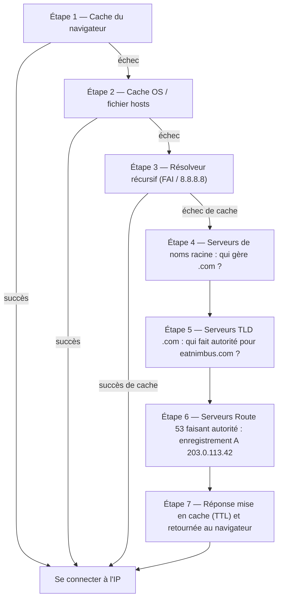

# Chapitre 12 : Comment Internet vous trouve

Maya actualisa `nimbus-alb-123456789.us-west-2.elb.amazonaws.com` dans son navigateur une fois de plus, puis se renversa dans son fauteuil et regarda le plafond. La page se chargea. L'application fonctionnait. Mais chaque fois qu'elle partageait le lien avec un partenaire restaurant, elle ressentait une petite gêne qu'elle n'arrivait pas tout à fait à nommer.

Cette URL était un artefact technique, pas un produit.

---

*La refonte du réseau du chapitre précédent s'était bien passée. Chaque ressource était au bon endroit — les équilibreurs de charge dans des sous-réseaux publics, les bases de données verrouillées dans des sous-réseaux privés. L'infrastructure était sécurisée et correctement segmentée. Mais alors que Nimbus se préparait pour son premier lancement public, un nouveau problème était apparu : l'URL de l'équilibreur de charge qu'AWS avait attribuée automatiquement ressemblait à un identifiant système, pas à un produit auquel les gens feraient confiance. Ils avaient besoin d'un vrai nom de domaine. Et ils avaient besoin de comprendre ce qui se passait entre le moment où quelqu'un tapait `eatnimbus.com` et le moment où la page apparaissait.*

---

Nimbus fonctionnait. L'équilibreur de charge avait une adresse IP publique. Les instances EC2 avaient une adresse IP privée. Les bases de données étaient verrouillées dans des sous-réseaux privés. Priya avait approuvé d'un signe de tête le schéma réseau.

Tom regarda l'URL de l'équilibreur de charge : `nimbus-alb-123456789.us-west-2.elb.amazonaws.com`.

« C'est ce que les clients saisissent dans leur navigateur ? » demanda-t-il.

« C'est ce qu'AWS attribue automatiquement », dit Maya.

« Je ne vais pas mettre ça sur une carte de visite. »

« Moi non plus. »

Ils avaient besoin d'un nom de domaine. Ils achetèrent `eatnimbus.com` auprès d'un bureau d'enregistrement. Il fallait maintenant relier ce nom à leur infrastructure AWS.

« Comment Internet sait-il que `eatnimbus.com` correspond à l'équilibreur de charge dans us-west-2 ? » demanda Leo.

Bonne question, Leo.

**L'analogie de l'annuaire téléphonique**

Avant les smartphones, chaque ville avait un annuaire téléphonique. Si vous vouliez joindre « La Pizzeria de Mario », vous ne mémorisiez pas son numéro — vous cherchiez le nom, obteniez le numéro et appeliez.

Internet a son propre annuaire : le **Domain Name System (DNS)**.

Le DNS traduit les noms lisibles par les humains (comme `eatnimbus.com`) en adresses IP lisibles par les machines (comme `203.0.113.42`). Chaque fois que vous visitez un site web, votre ordinateur recherche silencieusement le nom de domaine dans le DNS et obtient l'adresse IP à laquelle se connecter.

Si vous changiez l'adresse IP de votre serveur, vous mettriez à jour l'enregistrement DNS — comme changer votre numéro dans l'annuaire — et Internet vous trouverait à votre nouvel emplacement.

**Le parcours complet de résolution DNS**

« Mais *comment* la recherche fonctionne-t-elle réellement ? » demanda Leo. « Genre, étape par étape. Mon navigateur connaît le nom `eatnimbus.com`. Que se passe-t-il ensuite ? »

La plupart de la documentation passe ça sous silence. C'est important.

Quand votre navigateur a besoin de résoudre `eatnimbus.com`, voici chaque saut, dans l'ordre :

**Étape 1 — Cache du navigateur** : Le navigateur vérifie s'il a déjà résolu ce nom récemment. Si oui, il utilise l'IP en cache. Sinon, on continue.

**Étape 2 — Cache du système d'exploitation / résolveur local** : Votre système d'exploitation vérifie son propre cache DNS et le fichier `hosts` local. Si trouvé, terminé. Sinon, il transmet à votre résolveur DNS configuré — généralement celui de votre FAI ou un résolveur public comme 8.8.8.8.

**Étape 3 — Résolveur récursif** : Le résolveur récursif (votre FAI ou le 8.8.8.8 de Google) est la bête de somme. Il a un cache aussi. S'il connaît la réponse, il la retourne immédiatement. Sinon, il démarre la véritable chaîne de résolution.

**Étape 4 — Serveurs de noms racine** : Le résolveur récursif contacte l'un des 13 clusters de serveurs de noms racine (déployés dans le monde entier). Le serveur racine ne sait pas où se trouve `eatnimbus.com`. Mais il sait qui gère les domaines `.com` — les serveurs TLD `.com`. Il retourne leur adresse.

**Étape 5 — Serveurs de noms TLD (Top Level Domain)** : Le résolveur récursif contacte les serveurs TLD `.com`. Les serveurs TLD ne savent pas non plus où se trouve `eatnimbus.com`. Mais ils savent quels serveurs de noms font autorité pour `eatnimbus.com` — les serveurs qui détiennent réellement les enregistrements DNS. Ils retournent ces adresses.

**Étape 6 — Serveurs de noms faisant autorité** : Le résolveur récursif contacte les serveurs de noms de Route 53 — les serveurs de noms faisant autorité pour `eatnimbus.com`. Route 53 a les vrais enregistrements. Il retourne l'enregistrement A : `eatnimbus.com → 203.0.113.42`. Cette réponse fait autorité — c'est la vraie réponse, pas une réponse en cache.

**Étape 7 — Réponse mise en cache et retournée** : Le résolveur récursif met la réponse en cache pour la durée du TTL (Time-To-Live) de l'enregistrement. Il retourne l'IP à votre navigateur. Votre navigateur la met en cache. Votre navigateur se connecte.



« Ça fait sept sauts juste pour trouver une adresse IP », dit Tom.

« Habituellement moins de 100 millisecondes au total », dit Priya. « Les étapes 3 à 6 sont mises en cache de façon agressive à chaque niveau. Pour les domaines populaires, les étapes 4 et 5 — les recherches racine et TLD — sont souvent entièrement ignorées parce que le résolveur récursif a déjà ces serveurs en cache. Toute la chaîne s'exécute généralement en 20 à 40 millisecondes. »

« Et après la première recherche, le cache du navigateur fait que les requêtes suivantes sautent tout ça », ajouta Leo.

« Exact. Le DNS semble instantané parce que la plupart des recherches sont des succès de cache. La chaîne complète ne s'exécute que lorsqu'un enregistrement est nouveau ou que son TTL a expiré. »

**Présentation de Route 53**

Amazon Route 53 est le service DNS géré d'AWS. Il s'appelle Route 53 parce que le port 53 est le port DNS standard. (Parfois AWS nomme les choses de façon directe.)

Route 53 remplit plusieurs fonctions :

**Enregistrement de domaines** : Vous pouvez acheter des noms de domaine directement via Route 53.

**Hébergement DNS (zones hébergées)** : Vous créez une *zone hébergée* pour votre domaine, et Route 53 gère les enregistrements DNS qui indiquent au monde où vous trouver.

**Vérification d'intégrité** : Route 53 peut surveiller vos points de terminaison et détourner le trafic des points de terminaison défaillants.

**Politiques de routage du trafic** : Route 53 prend en charge plusieurs stratégies de routage au-delà du DNS simple — pondéré, basé sur la latence, géolocalisation, basculement.

**Enregistrements DNS : Les entrées de l'annuaire**

Un enregistrement DNS associe un nom à une destination. Les types les plus courants :

**Enregistrement A** : Associe un nom à une adresse IPv4.
`eatnimbus.com → 203.0.113.42`

**Enregistrement AAAA** : Associe un nom à une adresse IPv6.

**Enregistrement CNAME** : Associe un nom à un autre nom (un alias).
`www.eatnimbus.com → eatnimbus.com`

**Enregistrement MX** : Spécifie quels serveurs gèrent les e-mails pour le domaine.

**Enregistrement TXT** : Stocke du texte arbitraire. Couramment utilisé pour la vérification de domaine (prouver que vous possédez le domaine) et l'authentification des e-mails (SPF, DKIM).

Pour Nimbus, la configuration principale :

- `eatnimbus.com` → Enregistrement Alias pointant vers l'équilibreur de charge
- `www.eatnimbus.com` → CNAME pointant vers `eatnimbus.com`
- `api.eatnimbus.com` → Enregistrement Alias pointant vers l'équilibreur de charge de l'API

« Attends », dit Tom. « L'adresse IP de l'équilibreur de charge peut changer. AWS l'a dit dans la documentation. »

Bien vu, Tom.

**Enregistrements Alias : La solution d'AWS aux IP dynamiques**

Les équilibreurs de charge, les distributions CloudFront et les sites web S3 ont des noms DNS, pas des adresses IP statiques. Les IP sous-jacentes peuvent changer.

Si vous créez un CNAME pointant vers le nom DNS d'un équilibreur de charge, ça fonctionne — mais vous ne pouvez pas utiliser de CNAME pour les domaines racine (`eatnimbus.com` sans le `www`) à cause des normes DNS.

Route 53 résout ça avec les **enregistrements Alias** — une extension du DNS spécifique à AWS. Un enregistrement Alias associe un nom directement à une ressource AWS (équilibreur de charge, distribution CloudFront, site web S3), et Route 53 gère automatiquement la résolution d'IP dynamique. Les enregistrements Alias peuvent être utilisés au niveau du domaine racine. Et contrairement aux requêtes DNS ordinaires vers des services externes, les requêtes d'enregistrements Alias vers des ressources AWS sont gratuites.

« Donc on utilise un enregistrement Alias pour `eatnimbus.com` pointant vers l'équilibreur de charge », confirma Leo.

« Et Route 53 gère quelle que soit l'IP que l'équilibreur de charge utilise à un moment donné », ajouta Priya.

« Gratuitement », dit Tom, soudain très intéressé. Il ouvrit la page de tarification de Route 53. « Et le reste ? »

« Cinquante cents par zone hébergée », dit Leo. « Plus environ quarante cents par million de requêtes DNS. Pour notre trafic actuel, probablement moins de deux dollars par mois. »

Tom ferma la page de tarification, satisfait.

**Politiques de routage : Plus que simplement « Où est-ce ? »**

C'est là que Route 53 devient intéressant. Le DNS n'est pas juste un service de recherche — ça peut être un outil de gestion du trafic.

**Routage simple** : Un enregistrement, une destination. DNS standard.

**Routage pondéré** : Répartir le trafic entre plusieurs destinations par poids. Envoyer 90 % au nouveau serveur, 10 % à l'ancien serveur pendant une migration. Ajuster les poids jusqu'à ce que vous ayez confiance dans le nouveau serveur, puis basculer à 100 %.

**Routage basé sur la latence** : Router les utilisateurs vers la région AWS avec la latence la plus faible pour eux. Un utilisateur à Seattle est routé vers `us-west-2`. Un utilisateur à Tokyo est routé vers `ap-northeast-1`. Même nom de domaine, destinations différentes.

**Routage par géolocalisation** : Router en fonction de l'emplacement géographique de l'utilisateur. Tous les utilisateurs européens vont vers `eu-west-1`. Tous les utilisateurs nord-américains vont vers `us-east-1`. Utile pour la souveraineté des données (garder les données des utilisateurs de l'UE dans les régions de l'UE) ou la personnalisation du contenu (langue, devise). Les décisions de routage utilisent des frontières strictes — un utilisateur est dans un pays, un continent ou un État américain, et c'est là qu'il va.

**Routage par géoproximité** : Route le trafic en fonction de l'emplacement géographique des utilisateurs *et* vous permet d'ajuster ces décisions avec une valeur de **biais**. Un biais positif étend la zone géographique qui route vers une ressource — attirant plus de trafic. Un biais négatif la réduit. Contrairement à la géolocalisation, qui utilise des frontières strictes de pays et de continents, la géoproximité est continue : une petite valeur de biais peut déplacer progressivement le trafic d'une région à une autre sans redessiner de lignes fixes.

Le scénario qui distingue les deux : si une entreprise migre progressivement de `us-east-1` vers `us-west-2` et veut déplacer le trafic vers l'ouest de façon incrémentale — pas appuyer sur un interrupteur, mais l'ajuster au fil du temps — la géoproximité avec un biais positif croissant sur le point de terminaison ouest est le bon outil. La géolocalisation routerait soit tous les utilisateurs de la côte ouest vers l'Oregon, soit non ; elle n'a pas de molette. Depuis janvier 2024, la géoproximité est disponible comme politique de routage ordinaire directement sur les enregistrements DNS (Console, API, CLI) — elle ne nécessite plus Route 53 Traffic Flow, bien qu'elle y reste disponible aussi.

**Routage de basculement** : Désigner un point de terminaison principal et un secondaire. Si le principal échoue à la vérification d'intégrité de Route 53, le trafic est automatiquement redirigé vers le secondaire. C'est la couche DNS de la reprise après sinistre.

« Attends — mais *pourquoi* configurerait-on un routage de basculement vers une deuxième région si on a déjà Multi-AZ ? » demanda Maya. « Multi-AZ n'est-il pas censé gérer les pannes ? »

Bonne question. Multi-AZ protège contre la panne d'une seule Zone de disponibilité au sein d'une région — si un centre de données tombe en panne, le secours dans une autre AZ prend le relais. Mais que se passe-t-il si une région AWS entière devient indisponible ? Ou s'il y a une perturbation de service à l'échelle de la région ? Le routage de basculement DNS opère à un niveau différent : il détourne le trafic d'une région entière quand la vérification d'intégrité de cette région échoue. Multi-AZ est une résilience intra-région. Le basculement DNS est une résilience inter-région.

**Routage par réponse à valeurs multiples** : Retourner jusqu'à huit adresses IP saines pour une requête, laissant le client choisir. Une alternative simple à un équilibreur de charge pour distribuer le trafic sur plusieurs serveurs.

« Donc Route 53 n'est pas juste un annuaire téléphonique », dit Maya. « C'est un annuaire intelligent qui peut router les appels selon l'endroit d'où vous appelez. »

« Et vous déconnecter si le numéro est défaillant », ajouta Priya.

---

**Routage par latence plus vérifications d'intégrité : Une expérience de pensée**

Priya esquissa un scénario sur le tableau blanc. Supposons que la base d'utilisateurs de la côte est de Nimbus continue de croître, et qu'un jour l'équipe monte une pile légère dans `us-east-1` (Virginie du Nord) — pas une configuration multi-région active-active complète, qui serait coûteuse et complexe, mais un équilibreur de charge et un ensemble d'instances EC2 en lecture seule servant du contenu statique et des pages de parcours. Les commandes iraient toujours vers l'ouest, vers la base de données principale dans `us-west-2`. Le trafic de parcours — qui représentait soixante-dix pour cent des requêtes — pourrait être servi depuis l'une ou l'autre côte.

La configuration Route 53 pour le point de terminaison de parcours ressemblerait à ceci :

```
browse.eatnimbus.com
  → Enregistrement de latence : ALB us-east-1 (avec vérification d'intégrité, set-identifier "east")
  → Enregistrement de latence : ALB us-west-2 (avec vérification d'intégrité, set-identifier "west")
```

(Notez que l'enregistrement est un *nom d'hôte*, `browse.eatnimbus.com` — le DNS route des noms, jamais des chemins d'URL. Le routage par chemin comme `/browse` est le travail de l'équilibreur de charge, pas de Route 53.)

Avec le routage par latence, un utilisateur à Seattle serait résolu vers le point de terminaison `us-west-2`. Un utilisateur à Boston irait vers `us-east-1`. Route 53 mesure en continu la latence de son infrastructure vers chaque région et choisit la plus rapide par utilisateur.

« Mais que se passe-t-il si la région ouest a un problème ? » demanda Tom. « Nos utilisateurs de parcours à Seattle seraient coincés. »

« C'est à ça que servent les vérifications d'intégrité », dit Priya. « Chaque enregistrement de latence reçoit une vérification d'intégrité sur son équilibreur de charge respectif. Si la vérification d'intégrité `us-west-2` échoue trois vérifications consécutives, Route 53 cesse de retourner cet enregistrement — même pour les utilisateurs où l'Oregon serait normalement plus rapide. Les utilisateurs de Seattle sont routés vers l'est jusqu'à ce que l'Oregon se rétablisse. »

« Donc le routage par latence détermine quelle région est normalement préférée », dit Maya, « et les vérifications d'intégrité passent outre cette préférence si la région préférée tombe en panne ? »

« Exactement. La politique de latence choisit le gagnant dans des conditions normales. Les vérifications d'intégrité retirent un gagnant qui a cessé de fonctionner. »

Leo réfléchit au scénario de panne. « Et le TTL sur ces enregistrements ? »

« Soixante secondes », dit Priya. « Trois vérifications échouées à des intervalles de trente secondes pour le déclencher — jusqu'à quatre-vingt-dix secondes pour détecter la panne — puis jusqu'à soixante secondes pour que les résolveurs DNS prennent en compte le changement. »

« Deux minutes et demie dans le pire des cas », dit Leo.

« C'est pourquoi vous abaissez le TTL avant que ça vous importe, pas après. »

Cette combinaison — routage par latence avec vérifications d'intégrité sur chaque enregistrement — est l'une des configurations Route 53 les plus puissantes pour les déploiements multi-régions. Les utilisateurs vont toujours vers la région saine la plus rapide. Le système s'auto-répare quand une région a des problèmes. Et le tout est du DNS : pas d'infrastructure supplémentaire, pas de serveurs proxy, pas d'équilibreurs de charge entre les régions.

---

**L'incident de la vérification d'intégrité défaillante**

L'environnement de préproduction de Nimbus leur donna une démonstration accidentelle du routage de basculement.

Ils avaient configuré des vérifications d'intégrité Route 53 sur l'équilibreur de charge de préproduction à titre de test — vérifiant le point de terminaison `/health` toutes les 30 secondes. Un vendredi après-midi, Leo poussa un déploiement en préproduction qui avait un bug : le point de terminaison d'intégrité commença à retourner des erreurs 500. Il passait ses tests locaux mais cassait sur le serveur.

Route 53 nota les échecs. Après trois vérifications échouées consécutives, il marqua le point de terminaison comme défaillant. L'enregistrement de basculement s'activa, routant le trafic de préproduction vers une page de repli en lecture seule qui disait « Maintenance en cours ».

La première alerte de Leo fut un message Slack d'un ingénieur QA : « La préproduction affiche la page de maintenance. »

Leo vérifia le déploiement. Les erreurs 500 étaient évidentes dans les journaux. Il fit un rollback du déploiement. Dans les 90 secondes après que le point de terminaison d'intégrité eut recommencé à retourner des 200, Route 53 réévalua la vérification, vit trois succès consécutifs, et retourna le trafic à l'équilibreur de charge de préproduction. La page de maintenance disparut.

Temps total sur la page de maintenance : sept minutes.

« C'était le système fonctionnant correctement », dit Priya.

« Je sais », dit Leo. « La partie effrayante est de penser à ce qui se serait passé sans la vérification d'intégrité. Les erreurs 500 seraient allées à de vrais utilisateurs. »

« En production, la vérification d'intégrité aurait basculé vers la région secondaire ou la page d'erreur statique. Les utilisateurs auraient vu une expérience maintenue au lieu d'erreurs. »

« Combien de temps prend réellement le basculement ? » demanda Maya. « Du moment où la vérification d'intégrité échoue au moment où le DNS commence à router différemment ? »

« L'intervalle de vérification d'intégrité est de 30 secondes par défaut. Trois échecs consécutifs pour déclencher le basculement. Ça fait jusqu'à 90 secondes pour détecter le problème. Puis le TTL DNS — s'il est de 60 secondes, la propagation est encore une minute. »

« Donc dans le pire des cas, environ trois minutes ? »

« À peu près. C'est pourquoi vous voulez un TTL bas sur les enregistrements critiques, et un intervalle de vérification d'intégrité aussi court que votre budget le permet. »

---

**Vérifications d'intégrité : Contourner les pannes**

« Et si quelqu'un essaie de s'introduire ? » dit Priya. « Le DNS est public. N'importe qui peut rechercher où pointe `eatnimbus.com`. Ça signifie qu'un attaquant sait exactement quelle IP cibler. »

« C'est vrai », dit Leo. « Mais l'IP qu'ils trouvent est l'IP de l'équilibreur de charge. L'ALB est la seule chose avec une adresse publique. Tout ce qui est derrière — EC2, RDS, ElastiCache — est dans des sous-réseaux privés. Le DNS leur indique la porte d'entrée. Il ne leur dit pas ce qu'il y a derrière. »

Route 53 peut surveiller vos points de terminaison avec des vérifications d'intégrité. Si un point de terminaison échoue, Route 53 peut :

- Le retirer des réponses DNS (cesser d'y envoyer du trafic)
- Déclencher un basculement vers un point de terminaison de secours
- Envoyer une alerte via CloudWatch

Les vérifications d'intégrité sont le lien entre le routage DNS et la santé réelle de l'application. Dans une configuration de basculement : Route 53 surveille le point de terminaison principal toutes les 30 secondes. Si trois vérifications consécutives échouent, Route 53 commence à retourner l'adresse du point de terminaison secondaire. Aucun de ces chiffres n'est fixe : 30 secondes est l'intervalle standard (une option « rapide » payante vérifie toutes les 10 secondes), et le seuil d'échec est par défaut de 3 vérifications consécutives mais est configurable de 1 à 10.

Ce n'est pas instantané — le DNS a un temps de propagation. Une fois que Route 53 change un enregistrement DNS, les résolveurs DNS du monde entier doivent prendre en compte le changement, ce qui peut prendre de quelques secondes à quelques minutes selon les réglages de TTL.

**TTL : Le cache DNS**

Les réponses DNS sont mises en cache à plusieurs niveaux — sur votre routeur, chez votre FAI, dans votre navigateur. Le **TTL (Time-To-Live)** d'un enregistrement DNS indique aux caches combien de temps se souvenir de la réponse avant de vérifier à nouveau.

TTL élevé (1 heure ou plus) : Moins de requêtes DNS, moins de charge sur Route 53, mais les changements prennent plus de temps à se propager.

TTL bas (60 secondes ou moins) : Les changements se propagent rapidement, mais plus de requêtes DNS sont nécessaires.

Avant une migration planifiée (mise à jour du DNS pour pointer vers un nouveau serveur), abaissez votre TTL à 60 secondes un jour à l'avance. Puis quand vous faites le changement, il se propage en environ une minute. Après la migration, remontez-le à la valeur normale.

« Je l'ai déjà déployé — oh. » Leo avait mis à jour l'enregistrement DNS avant d'abaisser le TTL. Il avait réalisé son erreur et commencé à compter : l'ancien TTL était d'une heure. Certains utilisateurs allaient obtenir l'ancien serveur pendant les soixante prochaines minutes.

« Si on l'abaisse juste pendant la migration et pas avant », dit Leo lentement, « l'ancien TTL signifie que certains utilisateurs verront l'ancien serveur pendant une heure. »

« Exactement », dit Priya. « Les migrations DNS nécessitent une planification avant la migration, pas seulement pendant. »

Vous vous demandez peut-être : si le TTL est réglé à une heure, cela signifie-t-il que chaque utilisateur attendra une heure complète après un changement DNS avant de voir le nouveau serveur ? Pas exactement. Le TTL signifie que les résolveurs ne revérifieront pas avant l'expiration du TTL. Si le résolveur DNS d'un utilisateur a mis en cache l'ancienne valeur il y a 55 minutes avec un TTL d'une heure, il obtiendra la nouvelle valeur dans 5 minutes. S'il l'a mise en cache il y a 5 minutes, il attendra 55 minutes. En moyenne, les utilisateurs voient le changement dans la moitié de la durée du TTL. C'est pourquoi abaisser le TTL à l'avance est si important : ça réduit la fenêtre de propagation dans le pire des cas avant que le changement ne se produise.

---

**Zones hébergées privées : DNS interne**

Priya souleva une nouvelle exigence deux semaines après la mise en service du domaine public.

« Nos instances EC2 ont besoin d'atteindre la base de données », dit-elle. « En ce moment elles utilisent le nom DNS du point de terminaison RDS — `nimbus-prod.abc123.us-west-2.rds.amazonaws.com`. Ça fonctionne, mais c'est un nom DNS public. Si on veut un jour changer la configuration de notre base de données, tous les fichiers de configuration de l'application doivent être mis à jour. »

« On pourrait utiliser un nom DNS privé », dit Leo. « Comme `db.nimbus.internal`. Quelque chose que nos services utilisent en interne qui pointe vers quel que soit le point de terminaison actuel de la base de données. »

« Exactement. Les zones hébergées privées de Route 53. »

Une **zone hébergée privée** est un domaine DNS qui ne se résout qu'à l'intérieur de votre VPC. Les requêtes DNS externes pour `nimbus.internal` n'obtiennent aucune réponse. Mais depuis l'intérieur du VPC, `db.nimbus.internal` se résout vers le point de terminaison RDS.

Ils la configurèrent :

- Zone hébergée privée : `nimbus.internal`
- Enregistrement CNAME : `db.nimbus.internal → nimbus-prod.abc123.us-west-2.rds.amazonaws.com`
- Enregistrement CNAME : `cache.nimbus.internal → nimbus-cache.abc123.usw2.cache.amazonaws.com`
- Enregistrement A : `api.nimbus.internal → 10.0.10.5` (IP EC2 interne — les enregistrements A associent des noms à des adresses IP ; les CNAME associent des noms à d'autres noms. Convient ici parce que cette instance garde une IP privée statique ; pour tout ce qui est derrière Auto Scaling, vous pointeriez plutôt vers un équilibreur de charge)

Maintenant la configuration de l'application disait :

```
DATABASE_HOST=db.nimbus.internal
CACHE_HOST=cache.nimbus.internal
```

Quand ils migrèrent vers une nouvelle instance RDS, ils mirent à jour un seul enregistrement DNS. Aucun déploiement d'application requis.

« C'est aussi pour ça que le DNS privé importe pendant une migration de base de données », dit Priya. « Vous mettez à jour `db.nimbus.internal` pour pointer vers le nouveau point de terminaison. Le trafic bascule. L'ancien point de terminaison reste disponible pendant la fenêtre de TTL. Aucun changement de configuration d'application. »

**L'histoire de débogage du DNS interne**

Trois semaines plus tard, Leo déploya un nouveau service — un worker en arrière-plan — et il ne pouvait pas atteindre la base de données. Le worker était dans le même VPC, le même sous-réseau privé que les serveurs d'API. Les serveurs d'API pouvaient atteindre la base de données. Le worker non.

Il vérifia les groupes de sécurité. Le groupe de sécurité du worker avait une règle sortante pour PostgreSQL. Le groupe de sécurité de la base de données avait une règle entrante depuis le groupe de sécurité du worker. Tout semblait correct.

Il exécuta `nslookup db.nimbus.internal` depuis l'instance worker.

Aucune réponse.

« La recherche DNS échoue », dit-il à Priya.

Elle regarda la configuration VPC de l'instance worker. « Dans quel VPC le worker se trouve-t-il réellement ? Les zones hébergées privées sont associées à des VPC — si l'instance n'est pas dans un VPC associé, la zone n'existe tout simplement pas pour elle. »

« Il est dans le VPC principal. Comme tout le reste. »

« Vraiment ? »

Les zones hébergées privées doivent être explicitement associées à chaque VPC qu'elles servent — l'association est par VPC, jamais par sous-réseau. Priya avait associé le VPC principal quand elle avait créé la zone. Mais Leo avait accidentellement déployé le worker dans un VPC de test qu'il avait créé pour une autre expérience. VPC différent. Pas associé à la zone hébergée privée.

« Le worker est dans le mauvais VPC », dit Priya.

« Je l'ai déjà déployé — oh. » Leo déplaça le worker vers le bon VPC. Le DNS se résolut. Le worker se connecta à la base de données.

« Un seul VPC », dit Leo, prenant une note. « À moins qu'on ait une raison d'en avoir plus d'un. »

---

**DNSSEC : Authentifier les réponses DNS**

« A-t-on réfléchi à l'usurpation DNS ? » demanda Priya. « Et si quelqu'un interceptait notre requête DNS et retournait une fausse IP ? Les navigateurs de nos utilisateurs se connecteraient au serveur de l'attaquant au lieu du nôtre. »

**DNSSEC (DNS Security Extensions)** résout ça en signant cryptographiquement les enregistrements DNS. Quand une réponse DNS inclut une signature DNSSEC, le résolveur peut vérifier que la réponse provient du serveur de noms faisant autorité et n'a pas été altérée.

Route 53 prend en charge la signature DNSSEC pour les zones hébergées publiques. Le processus implique :

1. Activer DNSSEC sur la zone hébergée dans Route 53
2. Route 53 génère une clé de signature de clé (KSK) stockée dans KMS
3. Route 53 signe tous les enregistrements avec la clé de signature de zone
4. Vous ajoutez un enregistrement DS (Delegation Signer) au bureau d'enregistrement du domaine parent (TLD .com)
5. Les résolveurs qui prennent en charge DNSSEC peuvent maintenant vérifier l'authenticité des réponses

« À quel point l'usurpation DNS est-elle courante ? » demanda Leo.

« Sur l'internet public, rare mais possible », dit Priya. « La plupart des résolveurs des FAI prennent en charge la validation DNSSEC aujourd'hui. Activer DNSSEC ne coûte rien et ajoute une couche d'authenticité significative. »

« Combien ça coûte par mois ? » demanda Tom.

« Activer la signature DNSSEC elle-même est gratuit dans Route 53 », dit Priya. « Le seul coût réel est la clé KMS qui détient la clé de signature de clé : 1 $/mois, plus les appels d'API KMS — et une seule clé peut être partagée entre plusieurs zones hébergées. La protection contre les attaques de détournement DNS est effectivement gratuite à notre échelle. »

Tom l'activa avant le déjeuner.

---

**Route 53 Resolver : DNS hybride**

Quand Nimbus connecta finalement son VPC AWS à son réseau de développement sur site via un VPN, un nouveau problème émergea : les serveurs sur site avaient besoin de résoudre les noms DNS privés AWS (comme `db.nimbus.internal`), et les ressources AWS avaient besoin de résoudre les noms d'hôtes sur site (comme `jenkins.corp.nimbus.local`).

La résolution DNS ne traverse pas les frontières réseau par défaut. Les ressources AWS résolvent le DNS en utilisant Route 53 Resolver (intégré dans chaque VPC). Les serveurs sur site utilisent leurs propres serveurs DNS. Aucun ne peut voir les enregistrements de l'autre.

Les **points de terminaison Route 53 Resolver** comblent cet écart :

**Points de terminaison entrants** : Les serveurs DNS sur site peuvent transmettre les requêtes pour les zones DNS hébergées par AWS à une IP de point de terminaison entrant dans votre VPC. Route 53 Resolver gère la requête et retourne le résultat.

**Points de terminaison sortants** : Quand les instances EC2 ont besoin de résoudre des noms d'hôtes sur site, le Resolver transmet ces requêtes aux serveurs DNS sur site via le point de terminaison sortant.

« Donc c'est comme un service de traduction », dit Maya. « Votre DNS AWS et votre DNS sur site ne se parlent pas directement. Les points de terminaison Resolver agissent comme intermédiaires. »

« Exactement. Vos serveurs sur site peuvent maintenant résoudre `db.nimbus.internal`. Vos instances EC2 peuvent résoudre `jenkins.corp.nimbus.local`. Les deux côtés voient les noms DNS des deux mondes. »

Pour Nimbus, ça devint pertinent quand l'équipe de développement voulut exécuter des tests d'intégration depuis leur bureau contre un environnement de préproduction dans AWS. Sans points de terminaison Resolver, ils auraient édité manuellement les fichiers hosts. Avec eux, le DNS interne fonctionnait simplement à travers le VPN.

L'architecture des points de terminaison Resolver :

- **Point de terminaison entrant** : Deux ENI (interfaces réseau élastiques) créées dans deux AZ différentes de votre VPC. Chacune obtient une IP privée. Vous configurez votre serveur DNS sur site pour transmettre les requêtes de vos zones hébergées par AWS à ces IP. Le trafic voyage à travers votre VPN ou Direct Connect.
- **Point de terminaison sortant** : Deux ENI dans deux AZ. Vous créez des règles de transfert : « les requêtes pour `corp.nimbus.local` vont à ces IP de serveur DNS sur site. » Les instances EC2 utilisent automatiquement le Resolver, qui consulte vos règles de transfert et envoie la requête sur site.

« Pourquoi deux ENI par point de terminaison ? » demanda Leo.

« Haute disponibilité », dit Priya. « Si une AZ perd la connectivité réseau, l'autre IP de point de terminaison fonctionne toujours. Même principe que les passerelles NAT. »

« Combien ça coûte par mois ? » demanda Tom.

Les points de terminaison Resolver coûtent environ 0,125 $ par heure **par interface réseau élastique**, et chaque point de terminaison nécessite au moins deux ENI pour la disponibilité — donc un plancher réaliste est d'environ 180 $ par mois par point de terminaison, plus 0,40 $ par million de requêtes DNS. Pour une équipe utilisant le DNS hybride pour résoudre des noms internes, le coût est modeste — et élimine le besoin de maintenir des fichiers hosts sur plusieurs machines de développeurs et systèmes CI/CD.

« On pourrait juste mettre les noms d'hôtes dans les fichiers hosts », suggéra Leo.

« Sur chaque machine de développeur, chaque exécuteur CI, chaque nouvel onboarding », dit Priya. « Chaque fois que quoi que ce soit change. »

« Le point de terminaison en vaut la peine », dit Leo.

« En effet. »

## Forces et limites

**Route 53 est le bon choix pour** : enregistrer et gérer des noms de domaine entièrement au sein d'AWS ; router le trafic en fonction de la latence, de la géolocalisation ou d'une distribution pondérée sur plusieurs points de terminaison ; le basculement basé sur des vérifications d'intégrité entre régions ou entre un point de terminaison principal et un point de terminaison de reprise après sinistre ; intégrer le DNS avec d'autres services AWS via les enregistrements alias ; les zones hébergées privées pour la découverte de services internes.

**Quand Route 53 n'est pas ce dont vous avez besoin** : Route 53 est un service DNS, pas un équilibreur de charge. Si vous avez besoin de distribuer le trafic entre plusieurs serveurs ou conteneurs au sein d'une région, utilisez un Application Load Balancer — Route 53 ne peut pas faire de round-robin pondéré au niveau de la connexion comme le peut un équilibreur de charge. Le routage basé sur la latence entre régions ajoute du coût et de la complexité opérationnelle qui n'a de sens que lorsque vos utilisateurs sont véritablement répartis à l'échelle mondiale et que les millisecondes importent pour la conversion. Pour la plupart des applications mono-région, un seul enregistrement Alias pointant vers un ALB est toute la configuration Route 53 dont vous avez besoin.

## Résumé

Passer de `nimbus-alb-123456789.us-west-2.elb.amazonaws.com` à `eatnimbus.com` semblait être une petite chose. Ça ne l'était pas. Le DNS est le système d'adressage sur lequel tourne tout l'internet, et Route 53 vous donne des outils pour utiliser ce système non seulement pour les recherches, mais aussi pour la gestion du trafic et la résilience.

- Le **DNS** traduit les noms de domaine en adresses IP — l'annuaire téléphonique d'internet.
- **Route 53** est le service DNS géré d'AWS : enregistrement de domaines, hébergement DNS, vérifications d'intégrité et politiques de routage.
- Les **enregistrements A** associent des noms à des adresses IPv4. Les **CNAME** associent des noms à d'autres noms. Les **enregistrements Alias** associent des noms à des ressources AWS (équilibreurs de charge, CloudFront, S3).
- Utilisez les enregistrements Alias (pas les CNAME) pour les domaines racine et pour les ressources avec des IP dynamiques.
- Les politiques de routage vont au-delà du DNS simple : **pondéré** (répartition du trafic), **basé sur la latence** (performance), **géolocalisation** (souveraineté des données — frontières strictes pays/continent), **géoproximité** (basé sur la distance avec une molette de biais — déplacement progressif du trafic), **basculement** (reprise après sinistre).
- Les **zones hébergées privées** fournissent un DNS interne pour les ressources VPC — communication service-à-service par nom, pas par IP codée en dur.
- **DNSSEC** signe cryptographiquement les enregistrements, protégeant contre l'usurpation DNS.
- Les **points de terminaison Route 53 Resolver** relient les réseaux hybrides — les DNS AWS et sur site peuvent résoudre les noms l'un de l'autre.

## Conseils pour l'examen

*Domaine SAA-C03 : Concevoir des architectures performantes (Domaine 3, Tâche 3.4)*

- **Alias vs CNAME** : Les enregistrements Alias peuvent être utilisés au niveau du domaine racine ; les CNAME non. Les enregistrements Alias vers les ressources AWS sont gratuits ; les requêtes DNS CNAME sont tarifées. Quand l'examen pose une question sur l'association d'un domaine racine à un équilibreur de charge → enregistrement Alias.
- **Cas d'usage des politiques de routage** (scénarios d'examen courants) :
  - « Migrer progressivement le trafic vers une nouvelle version » → Routage pondéré
  - « Router les utilisateurs vers la région AWS la plus proche » → Routage basé sur la latence
  - « Garder les données des utilisateurs de l'UE dans les régions de l'UE » → Routage par géolocalisation
  - « Basculement DNS automatique quand le principal tombe en panne » → Routage de basculement avec vérifications d'intégrité
  - « Déplacer progressivement le trafic vers une nouvelle région » ou « augmenter le trafic attiré vers notre déploiement UE » → Routage par géoproximité avec biais positif
- **Géoproximité vs Géolocalisation :** La géolocalisation route par pays/continent de l'utilisateur avec des frontières strictes. La géoproximité route par distance géographique avec un biais configurable — utilisez-la quand vous avez besoin de déplacer progressivement le trafic vers une nouvelle région ou d'attirer plus d'utilisateurs vers un déploiement spécifique. Disponible comme politique de routage ordinaire sur les enregistrements depuis janvier 2024 (Traffic Flow plus requis).
- **Vérifications d'intégrité Route 53** : Peuvent vérifier les points de terminaison HTTP/HTTPS/TCP, et peuvent déclencher des alarmes CloudWatch. L'examen les utilise dans les scénarios de reprise après sinistre.
- **TTL et propagation** : Sachez que le TTL contrôle combien de temps les résolveurs DNS mettent un enregistrement en cache. TTL court = changements plus rapides. Scénario d'examen : « l'équipe a mis à jour le DNS mais les utilisateurs frappent toujours l'ancien serveur » → TTL trop élevé.
- **Zones hébergées privées** : Route 53 peut créer des enregistrements DNS qui ne se résolvent qu'à l'intérieur d'un VPC. L'examen utilise ça pour la découverte de services internes (par exemple, `database.internal` se résolvant vers un point de terminaison RDS privé).
- Route 53 est **global** — il n'est pas déployé dans une région. Aucune sélection de région n'est nécessaire lors de la création de zones hébergées.
- **Points de terminaison Route 53 Resolver** : Utilisés dans les scénarios hybrides où le DNS sur site et le DNS AWS ont besoin de résoudre les noms l'un de l'autre. Point de terminaison entrant pour sur site → AWS. Point de terminaison sortant pour AWS → sur site.

## Exercices

**Exercice 1 — Mémorisation**

Expliquez la différence entre un enregistrement CNAME et un enregistrement Alias. Quand utiliseriez-vous chacun ?

*(Indice : Considérez les contraintes sur les CNAME aux domaines racine, et le comportement des enregistrements Alias avec les ressources AWS dynamiques.)*

**Exercice 2 — Scénario SAA-C03**

*Scénario* : Une société de médias exploite un site web depuis deux régions AWS : `us-east-1` (principale) et `eu-west-1` (secondaire). L'équipe veut que le trafic soit automatiquement routé vers `eu-west-1` si la région principale devient indisponible. La société veut aussi vérifier que ce mécanisme de basculement fonctionne correctement sans réellement mettre hors service la région principale.

Quelle configuration Route 53 répond LE MIEUX à ces exigences ?

A) Routage pondéré avec un poids de 100 % sur `us-east-1` et un poids de 0 % sur `eu-west-1`  
B) Routage basé sur la latence avec des vérifications d'intégrité sur les deux points de terminaison  
C) Routage de basculement avec une vérification d'intégrité sur le point de terminaison principal et un enregistrement secondaire pointant vers `eu-west-1`  
D) Routage par géolocalisation avec l'Amérique du Nord pointant vers `us-east-1` et l'Europe pointant vers `eu-west-1`

**Indice 1** : L'exigence est un basculement automatique quand le principal tombe en panne. Quelle politique de routage est conçue exactement pour ça ?

**Indice 2** : « Tester sans mettre hors service la région principale » — les vérifications d'intégrité peuvent être manuellement réglées sur « défaillant » pour les tests.

**Indice 3** : Le routage basé sur la latence optimise la vitesse, pas le basculement.

**Réponse** : C

**Explication** : Le routage de basculement est conçu exactement pour ce cas d'usage. L'enregistrement principal pointe vers `us-east-1` avec une vérification d'intégrité. L'enregistrement secondaire pointe vers `eu-west-1`. Si la vérification d'intégrité échoue, Route 53 sert automatiquement l'enregistrement secondaire. Les vérifications d'intégrité peuvent être manuellement forcées à échouer pour les tests sans réellement perturber la région principale.

**Pourquoi pas A ?** Le routage pondéré avec 100 %/0 % est effectivement statique — il ne bascule pas automatiquement quand le principal échoue.

**Pourquoi pas B ?** Les enregistrements de latence *avec vérifications d'intégrité* cessent bien de retourner un point de terminaison défaillant, donc B survivrait à une vraie panne. Mais il change le schéma de trafic normal (les utilisateurs seraient répartis entre les régions par latence, pas principal/secondaire comme requis) et il n'a pas de moyen propre de *tester* le basculement : il faudrait réellement faire échouer la vérification d'intégrité du principal en production. Le routage de basculement modélise l'intention déclarée — principal désigné, secondaire désigné, testable en forçant l'état de la vérification d'intégrité.

**Pourquoi pas D ?** Le routage par géolocalisation route par emplacement de l'utilisateur, pas par santé du point de terminaison. Les utilisateurs européens seraient coincés sur `eu-west-1` même si `us-east-1` est sain, et les utilisateurs nord-américains ne basculeraient pas vers `eu-west-1` même si `us-east-1` tombe en panne.

*Domaine SAA-C03 : Concevoir des architectures performantes — Tâche 3.4*

**Exercice 3 — Défi d'architecture** *(Optionnel)*

Nimbus se développe à l'international. Ils veulent que `eatnimbus.com` se charge rapidement pour les utilisateurs de la côte ouest, de la côte est et d'Australie. Ils ont aussi une exigence réglementaire : les commandes passées par les utilisateurs européens doivent être traitées par des serveurs dans l'UE.

Concevez une stratégie de routage Route 53 qui répond aux deux exigences. Quelle politique de routage ou combinaison de politiques utiliseriez-vous ? Quelle infrastructure dans chaque région vous faudrait-il ?

*(Il n'y a pas de réponse unique correcte. L'objectif est de s'entraîner à la conception de routage multi-régions.)*

## Scène post-générique

`eatnimbus.com` était en service.

Maya l'avait tapé dans son navigateur, et la page de commande Nimbus s'était chargée. Elle avait commandé une arepa du restaurant de sa propre famille, juste pour tester le flux. La commande était passée. La cuisine l'avait reçue.

Elle se renversa dans son fauteuil.

Tom lisait déjà les journaux de vérification d'intégrité Route 53. « Le temps de réponse est de 18 millisecondes depuis les vérificateurs us-west-2. »

« C'est rapide ? » demanda Maya.

« Pour du DNS ? Oui. Pour les utilisateurs de Seattle, aussi — ils sont pratiquement à côté de l'Oregon. »

« Mais pour un utilisateur à Boston ? »

Tom regarda le graphique de latence. « Environ 80 millisecondes. »

Maya y réfléchit. « Si nos partenaires de la côte est continuent de croître, et que nos serveurs sont en Oregon... »

« Chaque requête voyage de Boston à l'Oregon et retour », dit Leo depuis l'autre bout de la pièce. « Vitesse de la lumière. On ne peut pas battre la physique. »

« Donc on a besoin de serveurs plus proches de Boston. »

« Ou de quelque chose de plus proche de Boston qui sert le contenu en leur nom. »

Cette pensée resta suspendue dans l'air.

Dans le prochain chapitre : les entrepôts qui mettent le contenu de Nimbus à une milliseconde de chaque utilisateur, partout.
