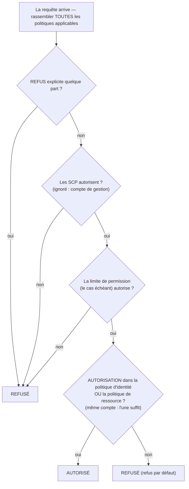

# Chapitre 14 : Qui a le droit de faire quoi

Les nouveaux ingénieurs commençaient lundi. Soo-Jin et Rafael. Maya avait réfléchi à leur première semaine — à ce à quoi ils auraient besoin d'accéder, à ce qu'ils ne devraient pas toucher, et à savoir si la configuration IAM actuelle était même prête à être étendue à deux personnes de plus.

Elle s'assit avec un café avant que le bureau ne se remplisse, faisant une liste.

---

*CloudFront était déployé. Les taux de hit du cache étaient bons. Les performances étaient en hausse. Mais alors que l'équipe se préparait à accueillir de nouveaux ingénieurs, un problème discret refit surface : la configuration IAM avait été construite par des gens pressés. Des clés d'accès étaient dans des fichiers de configuration. Certains rôles avaient plus de permissions qu'ils n'en avaient besoin. Et deux nouvelles personnes étaient sur le point de recevoir des identifiants pour un système de production qui n'avait pas été conçu pour plusieurs utilisateurs.*

---

Tom avait les clés d'accès ouvertes dans un fichier texte, prêtes à coller.

« Qu'est-ce que tu fais ? » demanda Priya.

« L'instance EC2 a besoin de lire des fichiers de configuration depuis S3. Je mets les identifiants dans la configuration du serveur. »

Elle regarda l'écran un moment. « Ferme ce fichier. »

« J'étais juste— »

« Si quelqu'un entre dans ce serveur », dit-elle, « il obtient ces clés. Et ces clés touchent tout ce que l'utilisateur IAM est autorisé à toucher. Ce qui est probablement plus que juste S3. »

Tom ferma le fichier.

« Il y a une meilleure façon », dit-elle. « Le serveur lui-même peut avoir un rôle. Pense à ça comme un intitulé de poste — l'instance n'a pas besoin d'identifiants parce que le système sait déjà ce qu'elle est et ce qu'elle est autorisée à faire. »

Tom semblait sceptique. « Donc le serveur s'authentifie lui-même ? »

« Oui. Sans mot de passe. Sans clés dans un fichier de configuration. Sans rien qui puisse être accidentellement committé dans git. »

Cette dernière partie fit mouche. Tom avait failli committer une clé d'accès dans le dépôt lui-même il y a deux semaines — il l'avait attrapée dans le diff à la dernière seconde. Il ouvrit un nouvel onglet de navigateur.

**Retour sur IAM : Le tableau complet**

Le Chapitre 3 a présenté IAM : utilisateurs, groupes, rôles et politiques. Il est maintenant temps d'aller plus loin.

Les politiques IAM sont des documents JSON qui spécifient quelles actions sont autorisées ou refusées sur quelles ressources. Elles ressemblent à ça :

```json
{
  "Version": "2012-10-17",
  "Statement": [
    {
      "Effect": "Allow",
      "Action": [
        "s3:GetObject",
        "s3:PutObject"
      ],
      "Resource": "arn:aws:s3:::nimbus-assets/*"
    }
  ]
}
```

Cette politique autorise la lecture et l'écriture d'objets dans le bucket `nimbus-assets`, et rien d'autre. Pas la suppression. Pas le listage des buckets. Aucune autre opération S3. Aucun autre service AWS.

C'est la bonne façon d'accorder des permissions : des actions spécifiques, des ressources spécifiques.

**Le problème avec l'« accès administrateur »**

Les politiques gérées AWS comme `AdministratorAccess` sont conçues pour démarrer rapidement. Elles ne sont pas conçues pour faire tourner des systèmes de production avec de vrais membres d'équipe.

`AdministratorAccess` accorde chaque action sur chaque ressource. Si un membre de l'équipe avec cette politique fait une erreur — supprime accidentellement un bucket S3, termine la mauvaise instance EC2, change les règles de groupe de sécurité — il n'y a rien qu'AWS puisse faire pour l'arrêter. La permission a été accordée.

Si les identifiants d'un membre de l'équipe sont compromis (attaque par hameçonnage, clé d'accès divulguée, vol d'ordinateur portable), l'attaquant a un accès administrateur à tout dans votre compte AWS.

« Alors que devrait avoir Soo-Jin ? » demanda Leo.

« Qu'est-ce que Soo-Jin a besoin de faire ? » répondit Priya.

« Déployer l'API. Vérifier les journaux. Rien d'autre. »

« Alors elle obtient : la capacité de pousser vers le pipeline de code, l'accès en lecture aux journaux CloudWatch, et rien d'autre. »

« C'est... très spécifique. »

« Oui. C'est le but. »

**Rôles IAM : Des identités pour les services**

Le Chapitre 3 a présenté les rôles comme un moyen pour les instances EC2 d'accéder aux services AWS sans stocker d'identifiants. Rendons ça concret.

Vos instances EC2 qui font tourner l'API Nimbus ont besoin de :

- Lire depuis DynamoDB (le menu)
- Écrire dans DynamoDB (les commandes)
- Mettre des objets dans S3 (reçus, téléversements)
- Écrire des journaux dans CloudWatch
- Lire des secrets depuis Secrets Manager

Au lieu de créer un utilisateur avec une clé d'accès et de stocker cette clé sur l'instance EC2 (un cauchemar de sécurité — les clés d'accès peuvent être lues par quiconque a un accès SSH), vous créez un **rôle IAM** pour l'instance EC2 avec exactement ces permissions.

« Attends — mais *pourquoi* ferait-on ça comme ça ? » demanda Maya. « L'instance EC2 fait déjà tourner notre code. Pourquoi ne pas juste donner au code une clé d'accès ? »

Parce que les clés d'accès sont des identifiants statiques qui vivent quelque part — dans un fichier de configuration, une variable d'environnement, un dépôt git si quelqu'un fait une erreur. Elles peuvent être copiées, exfiltrées, committées par accident. Un rôle IAM fonctionne différemment : l'instance EC2 assume le rôle automatiquement. AWS fournit des identifiants temporaires via le service de métadonnées d'instance. Les identifiants tournent automatiquement — ils expirent toutes les quelques heures et sont rafraîchis sans aucune action de votre part. Il n'y a rien à divulguer, parce qu'il n'y a rien de stocké.

« Et si quelqu'un pirate l'instance EC2 ? » demanda Leo.

« Il peut faire ce que le rôle EC2 autorise », dit Priya. « C'est-à-dire lire le menu, écrire des commandes et envoyer des journaux. Il ne peut pas supprimer le bucket S3. Il ne peut pas terminer des instances EC2. Il ne peut pas toucher IAM. »

« Parce que le rôle EC2 n'a pas ces permissions. »

« Exactement. »

---

**Comment fonctionne l'assomption de rôle EC2, étape par étape**

« Quelque chose ne tient pas debout », dit Maya. « S'il n'y a aucun identifiant stocké sur l'instance, comment l'instance prouve-t-elle réellement à AWS qui elle est ? Il doit y avoir un identifiant quelque part. »

Il y en a un. Mais il est temporaire, automatiquement rotaté, et accessible uniquement depuis l'intérieur de l'instance.

Quand une instance EC2 démarre avec un rôle IAM attaché, AWS fait ce qui suit :

**Étape 1** : AWS STS (Security Token Service) génère des identifiants temporaires — un ID de clé d'accès, une clé d'accès secrète et un jeton de session. Pour les rôles d'instance EC2, ils sont généralement valides pendant environ six heures, et AWS les rotate automatiquement avant qu'ils n'expirent.

**Étape 2** : AWS rend ces identifiants disponibles à une adresse IP spéciale : `169.254.169.254`. C'est le **service de métadonnées d'instance** (IMDS). Il n'est accessible que depuis l'intérieur de l'instance EC2. Rien à l'extérieur de l'instance ne peut y accéder.

**Étape 3** : Quand votre code d'application appelle n'importe quel SDK AWS (boto3, le SDK Java, le SDK Node.js), le SDK interroge automatiquement le point de terminaison de métadonnées d'instance :

```
GET http://169.254.169.254/latest/meta-data/iam/security-credentials/{role-name}
```

**Étape 4** : Le SDK reçoit les identifiants temporaires et les utilise pour signer la requête d'API — par exemple, une requête de lecture depuis S3.

**Étape 5** : AWS valide les identifiants, vérifie la politique IAM attachée au rôle, et permet ou refuse la requête.

**Étape 6** : Environ quinze minutes avant l'expiration des identifiants, l'instance EC2 les rafraîchit automatiquement depuis le service de métadonnées. Le code d'application n'a jamais besoin de gérer ça — le SDK le fait de façon transparente.

L'ensemble du processus est invisible pour le développeur. Vous écrivez `s3.get_object(...)`. Le SDK gère le reste.

« Donc l'identifiant existe », dit Maya. « Il est juste temporaire, à rotation automatique, et verrouillé sur le point de terminaison de métadonnées d'instance. »

« C'est pourquoi il est tellement plus sûr qu'une clé d'accès statique », dit Priya. « Une clé statique, une fois volée, est valide jusqu'à ce que quelqu'un la rotate manuellement. Un identifiant temporaire volé expire de lui-même — en quelques heures, pas en quelques mois. »

« Et si quelqu'un à l'intérieur de l'instance interroge le point de terminaison de métadonnées ? »

« Il peut obtenir l'identifiant temporaire actuel. C'est un vrai risque, c'est pourquoi AWS a introduit IMDSv2 — Instance Metadata Service version 2. IMDSv2 exige que l'appelant obtienne d'abord un jeton de session via une requête PUT. Ça empêche une classe d'attaque appelée Server-Side Request Forgery, où du code malveillant trompe le serveur pour qu'il aille chercher l'URL de métadonnées pour le compte de l'attaquant. »

Leo mit à jour la configuration de lancement EC2 pour imposer IMDSv2. Un seul réglage, appliqué au moment du lancement.

---

**Assomption de rôle : Comment les services deviennent d'autres services**

Les rôles peuvent être assumés par :

- **Des services AWS** (EC2, Lambda, tâches ECS, etc.)
- **Des utilisateurs IAM** dans votre propre compte (élévation de rôle — vous assumez un rôle avec plus de permissions pour une tâche spécifique)
- **Des utilisateurs IAM dans d'autres comptes AWS** (accès inter-comptes — le compte d'une autre organisation peut assumer un rôle dans le vôtre)
- **Des fournisseurs d'identité externes** (Google, Active Directory, Okta — accès fédéré pour les utilisateurs humains)

« A-t-on réfléchi à ce qui se passe si Nimbus utilise un service tiers qui a besoin d'accéder à nos ressources AWS ? » demanda Priya. « Un fournisseur d'analyse externe, par exemple. On ne veut pas créer un utilisateur IAM pour lui et lui remettre une clé d'accès. »

« Des rôles inter-comptes », dit Leo. « On crée un rôle dans notre compte et on écrit une politique de confiance qui dit "ce compte externe spécifique est autorisé à assumer ce rôle". Ils utilisent leurs propres identifiants pour assumer le rôle et obtenir un accès temporaire. Aucune clé à gérer, aucune clé à divulguer. »

Ce dernier schéma — la **fédération d'identité** — est la façon dont les grandes organisations donnent à leurs employés un accès AWS sans créer d'utilisateurs IAM individuels pour chaque personne. L'Active Directory de votre entreprise a vos identifiants. Quand vous vous connectez à AWS, vous vous authentifiez contre Active Directory, et AWS vous accorde un rôle.

---

**Accès inter-comptes : Le scénario de l'équipe comptable**

Six mois après le début, Nimbus engagea un cabinet comptable pour aider au reporting financier. L'équipe comptable avait besoin d'un accès en lecture aux données de facturation dans le bucket S3 de facturation de Nimbus — mais ils opéraient depuis leur propre compte AWS séparé. Nimbus ne voulait pas créer un utilisateur IAM pour eux. Remettre à quelqu'un d'une entreprise externe une clé d'accès statique semblait exactement la mauvaise chose à faire.

« Rôle inter-comptes », dit Priya.

La configuration a trois parties :

**Partie un** : Dans le compte Nimbus, créer un rôle IAM — appelons-le `AccountingReadRole`. Attacher une politique qui autorise `s3:GetObject` et `s3:ListBucket` sur le bucket S3 de facturation. Rien d'autre.

**Partie deux** : Ajouter une politique de confiance à `AccountingReadRole`. La politique de confiance dit quelle identité externe est autorisée à assumer ce rôle :

```json
{
  "Version": "2012-10-17",
  "Statement": [{
    "Effect": "Allow",
    "Principal": {
      "AWS": "arn:aws:iam::ACCOUNTING-FIRM-ACCOUNT-ID:role/AccountingAppRole"
    },
    "Action": "sts:AssumeRole"
  }]
}
```

Ceci dit : seul le rôle spécifique dans le compte AWS du cabinet comptable peut assumer ce rôle. Personne d'autre.

**Partie trois** : Dans le compte du cabinet comptable, leur application utilise `sts:AssumeRole` pour obtenir des identifiants temporaires pour `AccountingReadRole`. Ces identifiants sont limités à uniquement ce que `AccountingReadRole` autorise. L'application comptable peut lire les fichiers de facturation. Elle ne peut pas y écrire. Elle ne peut toucher rien d'autre dans le compte Nimbus.

Il y a une étape de durcissement supplémentaire pour exactement ce scénario — et c'est un sujet d'examen nommé. Le cabinet comptable sert de nombreux clients. Supposons qu'un client malveillant du cabinet apprenne l'ARN du `AccountingReadRole` de Nimbus et demande au logiciel du cabinet de l'« analyser ». Le logiciel du cabinet a la permission légitime d'assumer des rôles — il pourrait être trompé pour accéder aux données de Nimbus pour le compte du mauvais client. C'est le **problème du député confus**, et le correctif est l'**ExternalId** : Nimbus génère une valeur secrète unique, la met dans la politique de confiance comme condition (`"sts:ExternalId": "nimbus-7f3a..."`), et la partage uniquement avec le cabinet comptable. Le logiciel du cabinet doit passer cet ExternalId à chaque appel `AssumeRole`, et il utilise un ExternalId *différent* par client — donc une requête faite pour le compte du mauvais client échoue. Déclencheur d'examen : « un tiers a besoin d'un accès inter-comptes » → rôle + politique de confiance + **ExternalId**. Jamais un utilisateur IAM avec des clés partagées.

« Et si on a besoin de révoquer leur accès ? » demanda Tom.

« Supprimer la politique de confiance ou supprimer le rôle », dit Priya. « Terminé. Aucun identifiant à traquer, aucune clé à désactiver. Le rôle est l'accès. Supprimez le rôle, l'accès disparaît. »

« Et on peut voir chaque fois qu'ils l'ont utilisé dans CloudTrail », ajouta Leo.

« Chaque appel d'API qu'ils ont fait, journalisé. Quel bucket, quel fichier, à quelle heure, quel résultat. »

Tom nota le schéma. Ça reviendrait — chaque partenaire d'intégration, chaque fournisseur externe, chaque outil tiers qui avait besoin d'un accès AWS obtiendrait un rôle avec une politique de confiance, pas un utilisateur avec une clé d'accès.

---

**Évaluation des politiques IAM : La logique de décision**

« A-t-on réfléchi à ce qui se passe quand plusieurs politiques s'appliquent à la même requête ? » demanda Priya. « Un utilisateur IAM a une politique. La ressource à laquelle ils accèdent a une politique de ressource. Il pourrait y avoir une SCP. Comment AWS décide-t-il ? »

L'important à comprendre est qu'AWS ne vérifie **pas** les politiques un type à la fois, en séquence. Il rassemble *toutes* les politiques qui s'appliquent à la requête — basées sur l'identité, basées sur la ressource, SCP, limites de permission, politiques de session — et applique un ensemble de règles à toute la pile d'un coup :

**Règle 1 — Un refus explicite gagne, toujours.** Si une politique applicable quelconque — IAM, basée sur la ressource, SCP ou limite — refuse explicitement l'action, la requête est refusée. Rien ne peut outrepasser un refus explicite.

**Règle 2 — Les SCP et les limites de permission agissent comme des filtres.** Elles n'accordent jamais rien. L'action doit être *autorisée* par chaque SCP applicable et par la limite de permission (s'il en existe une), sinon elle est refusée — quoi que disent les autres politiques.

**Règle 3 — Au sein du même compte, une seule autorisation suffit.** Une autorisation explicite dans *soit* la politique IAM de l'identité *soit* la politique de la ressource permet l'action. Elles sont une union, pas une séquence — la politique de ressource n'est pas évaluée « avant » la politique IAM.

**Règle 4 — Refus par défaut.** Si rien n'autorise explicitement l'action, elle est refusée.



Le résultat : un refus explicite quelque part = refusé. Aucune autorisation nulle part = refusé. Une autorisation de la politique d'identité *ou* de la politique de ressource = autorisé, tant qu'aucun refus, SCP ou limite ne bloque.

Un autre fait que l'examen adore : **les SCP ne s'appliquent pas au compte de gestion de l'organisation** (ni aux rôles liés aux services). Une SCP qui dit « pas d'EC2 hors de us-west-2 » contraint chaque compte membre — mais le compte de gestion n'est pas touché. C'est l'une des raisons pour lesquelles AWS vous dit de garder les charges de travail entièrement hors du compte de gestion.

Une nuance qui trompe les candidats à l'examen : pour l'**accès inter-comptes**, une politique basée sur la ressource dans le compte cible ne suffit pas à elle seule. L'identité dans le compte source a aussi besoin d'une permission explicite dans sa propre politique IAM pour effectuer l'action. Si vous accordez une politique de bucket S3 qui autorise le Compte B à lire vos objets, mais que les utilisateurs IAM du Compte B n'ont aucune politique IAM permettant `s3:GetObject`, l'accès est quand même refusé. Les deux côtés doivent autoriser l'action — la politique de ressource ouvre la porte du côté cible, et la politique IAM dans le compte source accorde à l'utilisateur la permission de la franchir.

« Donc si la SCP de Priya dit "pas d'EC2 dans eu-west-1", et que sa politique IAM dit "autoriser toutes les actions EC2", elle ne peut quand même pas créer une instance dans eu-west-1 ? » demanda Leo.

« Correct », dit Priya. « La SCP filtre ce qui est possible avant que les politiques IAM ne soient évaluées. Les deux doivent être d'accord pour qu'une action réussisse. »

« Et un refus explicite dans une politique IAM outrepasse une autorisation explicite dans une politique de ressource ? »

« Toujours. Un refus explicite n'importe où dans la chaîne gagne. »

---

**Limites de permission : Limiter ce que les rôles peuvent accorder**

Voici un problème subtil mais important : par défaut, IAM n'empêche pas un utilisateur d'accorder des permissions qu'il n'a pas actuellement.

Si Soo-Jin a `iam:CreatePolicy` et `iam:AttachUserPolicy`, elle pourrait créer une politique accordant un accès en écriture S3 et l'attacher à elle-même — même si ses politiques existantes n'autorisent que la lecture S3. Cette classe de vulnérabilité s'appelle l'**escalade de privilèges**, et c'est exactement pourquoi les limites de permission existent.

Mais que faire si vous voulez déléguer la création de permissions IAM à un chef d'équipe, tout en garantissant qu'il ne peut pas accorder plus que ce que vous aviez prévu ?

Les **limites de permission** définissent les permissions maximales qui peuvent jamais être accordées à une identité. Même si les politiques attachées de l'identité sont plus larges, les permissions effectives sont bornées par la limite de permission.

Exemple : Vous donnez à un chef d'équipe une politique qui lui permet de créer des rôles IAM. Mais vous attachez une limite de permission qui dit « les rôles créés par ce chef d'équipe ne peuvent jamais avoir d'accès en suppression S3 ». Même si le chef d'équipe crée un rôle avec un accès complet à S3, la limite empêche la suppression S3 de prendre effet.

Vous vous demandez peut-être : quelle est la différence entre une limite de permission et une Service Control Policy ? Elles semblent similaires — toutes deux limitent quelles permissions peuvent être effectives. La distinction est la portée. Une limite de permission s'applique à une identité IAM spécifique (un utilisateur ou un rôle) et limite ce que cette identité peut jamais faire. Une SCP s'applique à un compte AWS entier ou à une unité organisationnelle — c'est un garde-fou au niveau de l'organisation qui affecte chaque identité du compte, y compris les administrateurs. Utilisez les limites de permission quand vous déléguez la gestion IAM à un chef d'équipe. Utilisez les SCP quand vous avez besoin de règles à l'échelle de l'organisation que personne dans un compte ne peut outrepasser.

C'est un concept avancé, mais il apparaît à l'examen et reflète la façon dont les organisations délèguent la gestion IAM à grande échelle.

**Une limite de permission concrète : Déléguer la création de rôles en toute sécurité**

Nimbus grandissait. Soo-Jin proposa que chaque ingénieur senior de l'équipe plateforme soit autorisé à créer des rôles IAM pour les fonctions Lambda dont il était propriétaire — sans nécessiter que Priya approuve chacun.

« Le risque », dit Priya, « est qu'un ingénieur senior crée un rôle Lambda avec `AdministratorAccess` — soit par erreur, soit en ne réfléchissant pas attentivement. »

« Alors on utilise des limites de permission », dit Soo-Jin.

Priya créa une politique de limite de permission appelée `NimbusDeveloperBoundary` :

```json
{
  "Version": "2012-10-17",
  "Statement": [
    {
      "Effect": "Allow",
      "Action": [
        "s3:GetObject", "s3:PutObject",
        "dynamodb:GetItem", "dynamodb:PutItem", "dynamodb:Query",
        "cloudwatch:PutMetricData", "logs:CreateLogGroup",
        "logs:CreateLogStream", "logs:PutLogEvents",
        "secretsmanager:GetSecretValue",
        "xray:PutTraceSegments"
      ],
      "Resource": "*"
    }
  ]
}
```

Elle autorisa ensuite chaque ingénieur senior à créer des rôles, mais uniquement s'il attachait cette limite :

```json
{
  "Effect": "Allow",
  "Action": ["iam:CreateRole", "iam:AttachRolePolicy"],
  "Resource": "*",
  "Condition": {
    "StringEquals": {
      "iam:PermissionsBoundary": "arn:aws:iam::ACCOUNT_ID:policy/NimbusDeveloperBoundary"
    }
  }
}
```

Sans la condition, un ingénieur pourrait créer un rôle avec n'importe quelles permissions. Avec la condition, tout rôle qu'il crée doit avoir `NimbusDeveloperBoundary` attaché. Un rôle avec `AdministratorAccess` plus `NimbusDeveloperBoundary` a l'intersection des deux — effectivement uniquement les services listés dans la limite.

« Donc ils peuvent créer des rôles », dit Leo, « mais ces rôles ne peuvent jamais faire plus que lire depuis S3, écrire dans DynamoDB et journaliser dans CloudWatch. »

« Correct. Ils ne peuvent pas créer de rôles qui touchent IAM. Ils ne peuvent pas créer de rôles qui suppriment des instances EC2. La limite définit le plafond. »

« Et s'ils oublient d'attacher la limite ? »

« La condition empêche l'appel `CreateRole` de réussir. La création échoue à moins que la limite ne soit incluse. »

Priya parcourut l'exercice avec Soo-Jin. Vingt minutes de configuration. Le résultat : les ingénieurs pouvaient créer eux-mêmes leurs rôles Lambda sans revue de sécurité pour chaque déploiement, et l'équipe plateforme conservait la confiance qu'aucune fonction Lambda n'aurait jamais plus que les permissions définies.

**IAM Access Analyzer : Auditer les permissions**

Priya passa deux jours à examiner la configuration IAM de l'équipe. Elle trouva :

- L'utilisateur personnel de Leo avait un accès administrateur (comme découvert)
- Une ancienne fonction Lambda avait des permissions de lecture sur tous les buckets S3 (restes d'un test)
- Un rôle de service avait un accès en écriture à des tables DynamoDB qui n'existaient plus

C'est normal. Les configurations IAM accumulent des résidus au fil du temps.

**IAM Access Analyzer** est un service AWS qui identifie automatiquement les ressources (buckets S3, rôles IAM, clés KMS, fonctions Lambda, files SQS) qui sont accessibles depuis l'extérieur de votre compte AWS. Il inclut aussi une fonctionnalité de validation de politique qui vérifie les politiques par rapport aux bonnes pratiques IAM, et une fonctionnalité de génération de politique qui crée des politiques de moindre privilège en analysant les événements CloudTrail.

« Combien ça coûte par mois ? » demanda Tom, levant les yeux de son navigateur.

« L'analyse d'accès externe est gratuite », dit Priya. « Elle s'exécute en continu et signale les résultats dans la console. L'analyse d'accès non utilisé — qui identifie les rôles et permissions qui n'ont pas été utilisés récemment — coûte environ 0,20 $ par rôle IAM analysé par mois. »

Tom retourna à son navigateur.

Les résultats d'accès externe sont les plus immédiatement précieux. Quand Priya activa Access Analyzer, il trouva deux choses :

Premièrement, le bucket S3 `nimbus-receipts` avait une politique de bucket qui autorisait les lectures depuis un compte AWS externe spécifique — le compte d'un contractant qui avait aidé à construire la fonctionnalité initiale d'export de reçus il y a huit mois. Le contractant n'était plus engagé. La politique de bucket n'avait jamais été nettoyée.

« Huit mois d'accès que personne n'avait prévu », dit Priya.

« Y accédaient-ils encore ? » demanda Tom.

Leo ouvrit les journaux d'accès S3. Aucune requête de ce compte depuis six mois. Mais la permission était là. Access Analyzer l'avait fait remonter ; personne ne l'aurait trouvée dans une revue manuelle.

Deuxièmement, le bucket S3 `nimbus-dev-assets` était réglé en lecture publique. Ç'avait été intentionnel pendant le développement — c'était plus facile de tester avec un accès public. Ça avait été oublié.

« Retirez la surcharge du blocage d'accès public », dit Priya. « Et activez S3 Block Public Access au niveau du compte. Ça empêche n'importe quel bucket de devenir public, quels que soient les réglages individuels des buckets. »

Ils firent les deux.

L'analyse d'accès non utilisé, exécutée mensuellement, ferait remonter les rôles qui n'avaient pas été utilisés depuis 90 jours. C'étaient des candidats à la suppression. Les configurations IAM grandissent dans une seule direction naturellement — les rôles et les politiques s'accumulent. Access Analyzer rend le nettoyage visible.

Des audits IAM réguliers devraient faire partie de vos opérations. Access Analyzer ne remplace pas l'audit — il rend l'audit gérable.

**Les Service Control Policies : Des garde-fous au niveau de l'organisation**

Si votre environnement AWS grandit en plusieurs comptes (un schéma courant pour les grandes équipes — compte dev, compte staging, compte production), **AWS Organizations** vous permet de les gérer depuis un compte central. Un bénéfice immédiat et pratique : la **facturation consolidée**. Tous les comptes membres se regroupent en une seule facture payée par le compte de gestion, et l'usage est agrégé entre les comptes — donc les remises de volume (les paliers de tarification S3, par exemple) et les remises des Reserved Instances ou des Savings Plans s'appliquent à l'échelle de l'organisation au lieu d'être par compte. Tom approuva Organizations avant de comprendre quoi que ce soit d'autre à son sujet.

Au sein d'Organizations, les **Service Control Policies (SCP)** appliquent des garde-fous qui affectent *chaque* entité IAM du compte, y compris les administrateurs.

Exemple de SCP : « Personne dans le compte dev ne peut créer d'instances EC2 dans la région eu-west-1. »

Même si quelqu'un a un accès administrateur dans le compte dev, il ne peut pas violer cette SCP. Elle est imposée au niveau de l'organisation, au-dessus du niveau du compte.

Les SCP n'accordent pas de permissions — elles les restreignent. Elles définissent les permissions maximales que n'importe quelle entité IAM d'un compte peut jamais avoir.

Quand Nimbus établit une structure multi-comptes — un compte de production partagé, un compte de développement et un compte de sécurité — Priya écrivit trois SCP fondamentales :

**SCP 1 — Verrou de région** : Tous les comptes sont restreints à `us-east-1` et `us-west-2`. Si un développeur déploie accidentellement sur `ap-southeast-1`, l'action est refusée. Ça empêche l'infrastructure fantôme dans des régions non prévues.

**SCP 2 — Protection de CloudTrail** : Personne dans aucun compte ne peut désactiver CloudTrail ni supprimer les journaux CloudTrail. Même les administrateurs de compte. Si CloudTrail s'éteint, la visibilité de sécurité s'en va avec — cette SCP rend ça structurellement impossible.

**SCP 3 — Verrouillage de l'utilisateur root** : Refuse toutes les actions effectuées par l'utilisateur root des comptes membres (le schéma recommandé par AWS est un refus pur et simple sur `aws:PrincipalArn` correspondant à root, plutôt que d'exiger conditionnellement la MFA — les SCP de MFA conditionnelle cassent les flux de service qui ne peuvent pas présenter de MFA). L'utilisateur root ne devrait presque jamais être utilisé ; le travail quotidien appartient aux rôles. Souvenez-vous : les SCP s'appliquent aux utilisateurs root des comptes membres, mais **jamais** au compte de gestion.

« Ces trois politiques auraient empêché trois incidents réels qu'on a vus au cours de l'année passée », dit Priya. « Le verrou de région aurait arrêté le développeur qui a accidentellement lancé deux cents instances EC2 dans une région où on n'opère pas. La protection de CloudTrail aurait arrêté l'incident de menace interne chez notre employeur précédent. Le verrouillage du root est juste de l'hygiène. »

« Est-ce que ça s'applique aussi au compte de sécurité ? » demanda Leo.

« Le compte de sécurité a une SCP différente — moins de restrictions, parce que l'équipe de sécurité a parfois besoin de faire des choses que les autres comptes ne peuvent pas. Mais la protection de CloudTrail s'applique partout. La journalisation est sacrée. »

La règle générale : les SCP pour ce qui ne devrait jamais arriver, nulle part, dans aucun compte, en aucune circonstance. Les politiques IAM pour ce dont chaque équipe et chaque service a spécifiquement besoin.

---

## Automatiser la landing zone : AWS Control Tower

Les SCP fonctionnaient. La structure multi-comptes prenait forme. Mais Priya faisait un calcul discret, et elle n'aimait pas les chiffres.

« Huit comptes », dit-elle. « Et on n'a même pas compté les nouvelles chaînes. »

Nimbus avait dépassé un seul compte AWS. Ils avaient la production. Ils avaient le staging. Ils avaient trois chaînes de restaurants acquises — chacune faisant tourner son propre environnement AWS, chacune devant être intégrée au modèle de gouvernance de Nimbus. Huit comptes au total, avec plus à venir.

Soo-Jin connaissait ce problème. « À mon ancienne entreprise, on configurait chaque nouveau compte manuellement », dit-elle. « E-mail du compte root, utilisateurs IAM, attachements de SCP, CloudTrail, Config, GuardDuty — deux heures par compte, minimum. Et quelque chose était toujours légèrement différent. Un compte avait CloudTrail en us-east-1 seulement. Un autre avait GuardDuty désactivé parce que quelqu'un avait oublié de l'activer. Le temps qu'on ait cinquante comptes, auditer les différences était un projet à part entière. »

« Ce n'est pas comme ça qu'on fait ça », dit Priya.

**AWS Control Tower** automatise la configuration et la gouvernance d'un environnement AWS multi-comptes. Au lieu de câbler manuellement Organizations, les SCP, CloudTrail, Config et GuardDuty pour chaque nouveau compte, Control Tower construit et maintient la structure pour vous.

Quand vous configurez Control Tower, il crée une **landing zone** : un environnement multi-comptes préconfiguré et sécurisé avec un compte de gestion, un compte d'archive de journaux et un compte d'audit, le tout suivant les bonnes pratiques AWS. Le compte d'archive de journaux collecte les journaux CloudTrail de chaque compte de l'organisation. Le compte d'audit héberge l'outillage de sécurité. Cette base est configurée automatiquement — pas par votre équipe sur deux jours, mais par Control Tower en quelques minutes.

Une fois la landing zone existante, Control Tower la gère via des **contrôles** (l'ancien nom, **garde-fous** (guardrails), apparaît toujours partout, y compris à l'examen) — des règles de gouvernance préconstruites sous trois formes. Les *contrôles préventifs* sont des SCP : ils bloquent les actions non conformes avant qu'elles ne puissent se produire. Les *contrôles détectifs* sont des règles AWS Config : ils scannent à la recherche de dérive et la signalent au tableau de bord de Control Tower. Les *contrôles proactifs* sont des hooks CloudFormation : ils vérifient la conformité des ressources *avant* qu'elles ne soient provisionnées, faisant échouer le déploiement plutôt que de le signaler après coup. La SCP de protection de CloudTrail de Priya, traduite en langage Control Tower, est un contrôle préventif. Une règle Config qui signale tout bucket S3 avec un accès public est un contrôle détectif. Un hook qui empêche une stack CloudFormation de créer un volume EBS non chiffré est un contrôle proactif.

La pièce qui résolut le problème des deux heures par compte de Soo-Jin : **Account Factory**. Quand Nimbus acquiert une autre chaîne de restaurants, l'équipe d'ingénierie ouvre Account Factory, remplit le nom et l'e-mail du compte, et clique sur provisionner. Quelques minutes plus tard, un nouveau compte AWS arrive préconfiguré avec les bons rôles IAM, CloudTrail, Config, et tous les garde-fous déjà appliqués. Pas presque correct. Pas en manquant une chose. Identique à chaque autre compte.

« Attends — mais *pourquoi* ferait-on ça comme ça ? » demanda Maya. « On a déjà Organizations et les SCP. Pourquoi ajouter un autre service par-dessus ? »

Parce qu'Organizations avec les SCP vous donne des garde-fous — mais vous construisez et maintenez tout le reste vous-même. Control Tower vous donne la landing zone complète : la structure des comptes, l'archive de journaux, le compte d'audit, la configuration de sécurité de base et Account Factory, le tout maintenu par AWS. Control Tower utilise Organizations sous le capot, mais il ajoute la configuration automatisée et opinionnée qu'Organizations seul ne fournit pas. Si vous partez de zéro aujourd'hui et que vous avez besoin d'une gouvernance cohérente à grande échelle, Control Tower est la réponse. Si vous avez déjà une configuration Organizations mature que vous avez construite manuellement, vous pouvez l'enrôler dans Control Tower — ou la laisser telle quelle.

La distinction qui trompe les candidats à l'examen : « appliquer une SCP pour restreindre une action spécifique à travers les comptes » → vous voulez Organizations + SCP directement. « Configurer automatiquement un environnement multi-comptes sécurisé suivant les bonnes pratiques AWS, avec un flux de provisionnement de nouveaux comptes » → vous voulez Control Tower.

« Combien de temps faut-il pour enrôler le compte Meridian Kitchen ? » demanda Leo.

« Account Factory provisionne un nouveau compte en environ trente minutes », dit Priya. « Entièrement configuré. Pas "principalement configuré". »

Tom ne dit rien. Il regardait le coût de deux heures du temps d'un ingénieur, multiplié par huit, multiplié par le nombre de comptes à venir.

---

> **Conseil d'examen — AWS Control Tower**
>
> *Domaine SAA-C03 : Concevoir des architectures sécurisées (Domaine 1)*
>
> - **Control Tower** automatise la configuration d'une landing zone multi-comptes avec des garde-fous et Account Factory. Utilisez-le quand vous démarrez une nouvelle organisation AWS ou quand vous avez besoin de provisionner des comptes à grande échelle avec des bases de gouvernance cohérentes.
> - **Contrôles préventifs = SCP.** Ils bloquent les actions non conformes avant qu'elles ne se produisent.
> - **Contrôles détectifs = règles AWS Config.** Ils détectent la dérive et la signalent au tableau de bord.
> - **Contrôles proactifs = hooks CloudFormation.** Ils valident les ressources avant le provisionnement. Trois types de contrôles, trois mécanismes — l'examen teste la correspondance.
> - **Account Factory** provisionne de nouveaux comptes préconfigurés avec la base de sécurité de votre organisation — aucune configuration manuelle.
> - **Control Tower vs Organizations :** Organizations + SCP = vous construisez et gérez tout. Control Tower = AWS construit la landing zone et gère les mises à jour des garde-fous pour vous, en utilisant Organizations sous le capot.
> - **Déclencheur d'examen :** « configurer automatiquement de nouveaux comptes avec des bases de sécurité » → Control Tower. « Appliquer une SCP spécifique pour restreindre une action à travers les comptes » → Organizations + SCP directement.

---

**Pipelines CI/CD : Les identifiants que vous oubliez**

« A-t-on réfléchi à ce qui se passe avec les identifiants dans notre pipeline de déploiement ? » demanda Priya.

Les workflows GitHub Actions qui déployaient l'application Nimbus avaient précédemment utilisé des clés d'accès AWS stockées comme GitHub Secrets. C'était une pratique standard — mais ça signifiait que des clés d'accès à longue durée de vie existaient dans un système tiers.

« Et si GitHub est compromis ? » demanda Priya. « Ou si un dépôt est accidentellement rendu public et que quelqu'un lit les secrets ? »

La solution : la fédération OIDC GitHub. GitHub Actions prend en charge OpenID Connect — il peut obtenir un jeton temporaire du fournisseur d'identité de GitHub et l'échanger contre des identifiants AWS via un rôle IAM. Aucune clé d'accès statique n'est jamais créée.

La politique de confiance IAM pour le rôle de déploiement :

```json
{
  "Effect": "Allow",
  "Principal": {
    "Federated": "arn:aws:iam::ACCOUNT_ID:oidc-provider/token.actions.githubusercontent.com"
  },
  "Action": "sts:AssumeRoleWithWebIdentity",
  "Condition": {
    "StringEquals": {
      "token.actions.githubusercontent.com:aud": "sts.amazonaws.com",
      "token.actions.githubusercontent.com:sub": "repo:nimbus-org/nimbus-api:ref:refs/heads/main"
    }
  }
}
```

Cette politique de confiance autorise GitHub Actions à assumer le rôle de déploiement — mais uniquement lorsqu'il s'exécute depuis la branche `main` du dépôt `nimbus-api`. Un fork, une pull request d'un contributeur externe, ou une branche différente ne peut pas assumer le rôle.

« Aucune clé d'accès dans GitHub Secrets », dit Leo. « Le pipeline s'authentifie avec AWS en utilisant le jeton d'identité de GitHub. »

« Et le rôle n'autorise que ce dont le déploiement a réellement besoin », ajouta Priya. « Pousser vers ECR, mettre à jour le service ECS, mettre un fichier dans S3. Rien d'autre. »

« Je l'ai déjà déployé — oh. » Leo avait testé la fédération OIDC dans la branche `main` mais oublié que l'environnement de staging déployait depuis une branche `staging`. La condition était trop restrictive. Il mit à jour la condition pour autoriser `ref:refs/heads/main` et `ref:refs/heads/staging`.

Les anciennes clés d'accès furent supprimées. Le pipeline de déploiement fonctionnait maintenant sans aucun identifiant à longue durée de vie.

---

**IAM à l'échelle de l'entreprise**

Soo-Jin venait d'une entreprise avec trois cents ingénieurs et cinq cents comptes AWS. Elle regarda la configuration IAM de Nimbus et ne dit rien pendant un moment.

« C'est propre », dit-elle finalement. « Bon moindre privilège. Mais quand cette entreprise aura cinquante ingénieurs, cette structure sera pénible. »

« Qu'est-ce qui change ? » demanda Maya.

« Vous cessez de gérer les permissions des utilisateurs individuels et commencez à gérer des groupes d'utilisateurs via IAM Identity Center », dit Soo-Jin. « Vous avez plusieurs comptes — dev, staging, production, sécurité, services partagés. Les ingénieurs ont besoin d'accéder à certains comptes et pas à d'autres. Faire ça avec des utilisateurs IAM individuels dans chaque compte représente des centaines de configurations à maintenir. »

IAM Identity Center (anciennement AWS Single Sign-On) résout ça. Les ingénieurs se connectent une fois avec leurs identifiants d'entreprise. Identity Center mappe leur identité à des ensembles de permissions — des paquets de politiques — dans des comptes spécifiques. Un développeur obtient un accès en lecture à dev et staging, un accès en écriture aux ressources de son propre service en production. Un ingénieur de sécurité obtient un accès en lecture à tous les comptes.

« Un seul endroit pour gérer qui a accès à quoi, à travers tous les comptes », dit Soo-Jin. « Quand quelqu'un rejoint, vous l'ajoutez à un groupe. Quand il part, vous le retirez d'Identity Center et son accès à tout disparaît. »

« Et aucun utilisateur IAM individuel à nettoyer », dit Leo.

« Correct. Les utilisateurs IAM n'existent pas. La fédération existe. »

Le schéma d'entreprise : AWS Organizations avec plusieurs comptes, Identity Center gérant l'accès humain de façon centralisée, des rôles de service dans chaque compte pour l'automatisation, des SCP imposant des garde-fous à l'échelle du compte. Aucune clé d'accès à longue durée de vie. Aucun identifiant partagé. Aucun déprovisionnement manuel quand quelqu'un part.

« On n'en est pas encore là », dit Maya.

« Non », dit Soo-Jin. « Mais c'est la direction. Chaque décision que vous prenez maintenant devrait faciliter d'y arriver, pas la compliquer. »

**Où vit l'annuaire d'entreprise ? AWS Directory Service**

Il y a une pièce de plus dans le tableau de la fédération. Identity Center a besoin d'une *source* d'identité — quelque part où les identités d'entreprise vivent réellement. Pour beaucoup d'entreprises, cette source est Microsoft Active Directory, et AWS offre trois façons de le connecter, sous l'égide d'**AWS Directory Service** :

**AWS Managed Microsoft AD** est un véritable Microsoft Active Directory, tournant sur des contrôleurs de domaine gérés par AWS à travers deux AZ. Il prend en charge tout ce que le vrai AD prend en charge : la stratégie de groupe, les relations de confiance avec votre AD sur site, et les charges de travail AWS dépendantes d'AD — FSx for Windows File Server, Amazon RDS for SQL Server avec authentification Windows, instances EC2 jointes au domaine. C'est le choix quand vous avez besoin d'un annuaire complet *dans* AWS, ou quand vous faites tourner des applications conscientes d'AD dans le cloud. (C'est l'annuaire que Leo a utilisé pour la migration FSx de Copper Kettle au Chapitre 6.)

**AD Connector** n'est pas du tout un annuaire — c'est un proxy. Il transmet les requêtes d'authentification à votre AD *existant sur site* via une liaison VPN ou Direct Connect. Aucune donnée d'annuaire n'est stockée ou mise en cache dans AWS ; les utilisateurs gardent leurs identifiants existants, et votre AD sur site reste la source unique de vérité. C'est le choix quand l'exigence dit « utiliser les identifiants d'entreprise existants » et « aucune information d'identité ne peut être stockée dans le cloud ».

**Simple AD** est un annuaire à bas coût, basé sur Samba, avec une compatibilité AD basique. Il fonctionne pour de petits environnements autonomes qui ont besoin de LDAP et d'une jonction de domaine simple, mais il ne prend pas en charge les relations de confiance, la MFA ou les fonctionnalités AD avancées. Il existe surtout comme l'option budget pour les petits annuaires — et comme un distracteur d'examen.

« L'arbre de décision est court », dit Soo-Jin. « AD existant sur site et un mandat de ne pas le copier dans le cloud ? AD Connector. Charges de travail dépendantes d'AD tournant dans AWS, ou une relation de confiance ? Managed Microsoft AD. Petit annuaire autonome et un petit budget ? Simple AD. C'est tout. »

---

## Quand les utilisateurs ne sont pas des comptes AWS

Le portail des exploitants de restaurants Nimbus était en service depuis trois semaines. Les propriétaires de restaurants pouvaient se connecter pour voir leurs commandes, mettre à jour leurs horaires et télécharger leurs rapports hebdomadaires. Maya avait conçu l'expérience. Leo l'avait construite. Priya était restée silencieuse pendant tout ça — inhabituellement silencieuse.

« Comment gère-t-on l'authentification ? » demanda Priya un jeudi après-midi.

« On a construit une table d'utilisateurs dans RDS », dit Leo. « Nom d'utilisateur, mot de passe haché, ID de restaurant. Du classique. »

Priya regarda l'écran. « Donc on gère des mots de passe. On les stocke. On gère les flux de connexion. Les e-mails de réinitialisation. La protection contre la force brute. »

« Oui ? »

« On est aussi responsables quand le compte de quelqu'un est compromis. Quand l'e-mail de réinitialisation va à une adresse usurpée. Quand un propriétaire de restaurant réutilise son mot de passe d'une fuite ailleurs. »

Leo n'avait pas pensé à tout ça.

« Il y a un service géré pour exactement ce problème », dit Priya. « Et ce n'est pas IAM — IAM est pour vos comptes AWS, vos ingénieurs, vos pipelines de déploiement. Ce dont vous avez besoin est quelque chose qui gère l'authentification pour les *utilisateurs de votre application*. Des gens qui n'ont pas de comptes AWS. Des gens qui essaient juste de se connecter pour voir leurs commandes. »

Ce service est **Amazon Cognito**.

**User Pools : Un annuaire d'utilisateurs géré**

Pensez à un Cognito User Pool comme à un annuaire d'utilisateurs géré pour votre application. Il gère tout ce qui concerne qui sont vos utilisateurs et comment ils s'authentifient — sans que vous construisiez rien de tout ça.

Un User Pool vous donne :

- **Flux d'inscription et de connexion** : interface intégrée ou interface personnalisée utilisant les pages hébergées. Vérification d'e-mail, vérification de numéro de téléphone, ou les deux.
- **Gestion des mots de passe** : politiques, hachage, flux de réinitialisation, mots de passe temporaires — tout est géré.
- **MFA** : mots de passe à usage unique via SMS ou applications d'authentification. Vous l'activez ; Cognito gère les invites.
- **Fournisseurs d'identité sociaux** : connectez Google, Facebook, ou n'importe quel fournisseur OpenID Connect. Vos utilisateurs peuvent se connecter avec leurs comptes existants. Cognito gère le flux OAuth et crée un utilisateur lié dans votre pool.

Quand un utilisateur s'authentifie avec succès contre un User Pool, Cognito émet des **JWT** — JSON Web Tokens, spécifiquement un jeton d'ID (qui est l'utilisateur) et un jeton d'accès (ce qu'il est autorisé à faire dans votre application). Votre backend valide le JWT à chaque requête.

« Qu'est-ce qui ne va pas avec ce qu'on avait ? » demanda Maya. « Pourquoi ne pas juste vérifier l'utilisateur contre notre base de données comme on le faisait avant ? »

Parce que tout ce que vous faisiez avant — le hachage des mots de passe, la gestion des sessions, le flux de réinitialisation, la protection contre la force brute — Cognito le fait automatiquement, correctement, et sans coût d'ingénierie supplémentaire. Le JWT est un jeton signé qui expire. Votre backend n'a pas besoin d'une recherche en base de données à chaque requête ; il valide juste la signature. Et si vous ajoutez la MFA plus tard, ou la connexion Google, vous le configurez dans Cognito sans toucher à votre code d'authentification.

Leo supprima 400 lignes de code d'authentification cet après-midi-là.

**Identity Pools : Transformer les utilisateurs de l'application en identités AWS**

Les User Pools gèrent l'authentification — ils répondent à la question « qui est cette personne ? ». Mais parfois votre application a besoin que ses utilisateurs interagissent directement avec des ressources AWS. Le portail d'un propriétaire de restaurant pourrait générer une URL S3 présignée pour son rapport hebdomadaire, ou appeler un point de terminaison API Gateway qui invoque une Lambda. Pour ça, l'utilisateur a besoin d'identifiants AWS temporaires.

C'est ce que font les **Cognito Identity Pools** (aussi appelés Federated Identities). Un Identity Pool prend un jeton d'une source authentifiée — un Cognito User Pool, Google, Facebook, ou un autre fournisseur OpenID Connect — et l'échange contre des identifiants AWS temporaires via STS.

Le flux :

1. L'utilisateur s'authentifie contre le User Pool → reçoit un JWT
2. L'application passe le JWT à l'Identity Pool
3. L'Identity Pool appelle STS pour générer des identifiants temporaires, mappant l'utilisateur à un rôle IAM que vous définissez
4. L'application utilise ces identifiants pour appeler les services AWS directement

C'est « transformer les utilisateurs de votre application en identités AWS temporaires ». Les identifiants sont limités à exactement ce que vous autorisez dans le rôle IAM — un propriétaire de restaurant obtient un accès en lecture à son dossier de rapports S3 et rien d'autre.

**Les deux fonctionnent ensemble**

Le schéma le plus courant :

```
L'utilisateur se connecte
    → Cognito User Pool (authentification — émet un JWT)
        → Cognito Identity Pool (autorisation — JWT échangé contre des identifiants AWS)
            → Identifiants AWS temporaires pour le rôle IAM spécifique
```

Le User Pool répond : « Qui est cette personne, et ses identifiants sont-ils valides ? »
L'Identity Pool répond : « À quelles ressources AWS cette personne authentifiée peut-elle accéder ? »

Pour le portail des restaurants Nimbus : le User Pool gère la connexion, les réinitialisations de mot de passe et la connexion Google optionnelle. La plupart des fonctionnalités du portail appellent l'API Nimbus, qui valide le JWT directement. Seule la fonctionnalité de téléchargement de rapports utilise l'Identity Pool pour obtenir des identifiants S3 temporaires — et uniquement pour lire depuis le préfixe spécifique des données de ce restaurant.

« Et si quelqu'un essaie de manipuler le JWT ? » demanda Priya.

« Les JWT sont signés avec la clé privée de Cognito », dit Leo. « Le backend valide la signature en utilisant les clés publiques de Cognito. Un JWT altéré échoue immédiatement à la validation. »

« Et les identifiants de l'Identity Pool sont limités à quel rôle IAM ? »

« Un rôle qui autorise `s3:GetObject` sur `arn:aws:s3:::nimbus-reports/{sub}/*` — où `{sub}` est l'ID utilisateur Cognito de l'utilisateur. Chaque propriétaire de restaurant ne peut lire que ses propres rapports. »

Priya l'approuva.

---

> **Conseil d'examen — Cognito**
>
> *Domaine SAA-C03 : Concevoir des architectures sécurisées (Domaine 1)*
>
> - **User Pool = authentification (qui êtes-vous ?)**. Inscription, connexion, MFA, fédération d'IdP social, émission de JWT. Les signaux d'examen : « les utilisateurs de l'application doivent s'authentifier », « annuaire d'utilisateurs pour une application web », « connexion sociale », « jetons JWT ».
> - **Identity Pool = autorisation (à quelles ressources AWS pouvez-vous accéder ?)**. Échange les jetons d'un User Pool ou d'un IdP externe contre des identifiants AWS temporaires. Les signaux d'examen : « les utilisateurs authentifiés ont besoin d'un accès direct à S3/DynamoDB/API Gateway », « les identités fédérées ont besoin d'identifiants AWS ».
> - **L'examen teste la distinction.** « Une application mobile doit permettre aux utilisateurs de se connecter puis de téléverser directement des photos vers S3 » → User Pool pour l'authentification, Identity Pool pour les identifiants S3. Confondre les deux est le piège Cognito classique.
> - **Cognito vs IAM Identity Center** : Cognito est pour les *utilisateurs de votre application* (clients, partenaires, parties externes). IAM Identity Center est pour vos *employés et ingénieurs* accédant aux comptes AWS. Ils résolvent des problèmes différents.

---

## Forces et limites

**Pourquoi les rôles IAM et le moindre privilège importent** :

- Limite le rayon d'explosion quand les identifiants sont compromis
- Oblige les attaquants à escalader à travers plusieurs systèmes plutôt que d'obtenir un accès complet immédiatement
- Fournit une piste d'audit — CloudTrail journalise quel rôle a fait quoi
- Force des décisions conscientes sur l'accès — « de quoi ce service a-t-il réellement besoin ? »

**Là où ça se complique** :

- Écrire des politiques IAM précises nécessite de comprendre le modèle action/ressource d'AWS pour chaque service (et chaque service a des dizaines d'actions)
- Des politiques trop restrictives cassent les applications — déboguer les erreurs « accès refusé » à travers plusieurs services prend du temps
- IAM propage les changements avec un léger délai (généralement des secondes, parfois plus) — peut causer des problèmes de timing déroutants
- Les rôles inter-comptes nécessitent une configuration soignée de la politique de confiance

## Résumé

La refonte IAM du week-end fut humiliante — pas parce que le travail était techniquement difficile, mais parce qu'elle rendit visible à quel point l'accès s'était accumulé sans intention. Une bonne conception IAM ne consiste pas à être restrictif pour le plaisir. Il s'agit de savoir exactement ce dont chaque service a besoin, d'accorder exactement ça, et de pouvoir expliquer toute déviation.

- Évitez l'**accès administrateur** en production — c'est pour la configuration, pas pour les opérations.
- Les politiques IAM spécifient **Effect**, **Action** et **Resource** — soyez spécifique sur les trois.
- Les instances EC2, les fonctions Lambda et les autres services AWS devraient utiliser des **rôles IAM**, pas des clés d'accès.
- Les **limites de permission** plafonnent les permissions maximales que n'importe quelle identité peut avoir, quelles que soient les politiques attachées. Utilisez-les pour déléguer en toute sécurité la création de rôles IAM aux chefs d'équipe.
- Les **SCP** (Service Control Policies) appliquent des restrictions à l'échelle de l'organisation que même les administrateurs ne peuvent pas outrepasser.
- Les **rôles inter-comptes** laissent les comptes externes accéder à vos ressources en utilisant des identifiants temporaires — pas de clés d'accès statiques.
- **Évaluation des politiques IAM** : toutes les politiques applicables sont évaluées ensemble — un refus explicite n'importe où gagne ; les SCP et les limites de permission doivent autoriser (elles filtrent, n'accordent jamais) ; au sein du même compte, une autorisation dans *soit* la politique d'identité *soit* la politique de ressource suffit ; sinon refus par défaut. Les SCP ne s'appliquent jamais au compte de gestion.
- **IMDSv2** sur les instances EC2 empêche les attaques de Server-Side Request Forgery sur le service de métadonnées. Imposez-le toujours.
- **IAM Identity Center** est l'approche d'entreprise pour l'accès humain à travers plusieurs comptes. Les utilisateurs IAM individuels ne passent pas à l'échelle.
- **Amazon Cognito** est le service géré d'authentification et d'autorisation pour les *utilisateurs d'application* — clients et partenaires qui ont besoin de se connecter à vos produits, pas les ingénieurs qui ont besoin d'accéder à vos comptes AWS. Les User Pools gèrent l'authentification (inscription, connexion, MFA, IdP sociaux, JWT). Les Identity Pools gèrent l'autorisation (échangent un JWT de User Pool contre des identifiants AWS temporaires).

## Conseils pour l'examen

*Domaine SAA-C03 : Concevoir des architectures sécurisées (Domaine 1, Tâche 1.1)*

- **Rôles IAM pour EC2** : La réponse canonique quand EC2 a besoin d'accéder à S3, DynamoDB, Secrets Manager, ou n'importe quel service AWS. Ne stockez jamais de clés d'accès sur une instance.
- **Logique d'évaluation des politiques** : Quand IAM évalue une requête, il utilise une hiérarchie explicite d'autorisation/refus. Un **Deny** explicite gagne toujours, même contre un Allow explicite. Le défaut est Deny.
- **Limites de permission** : Utilisées lors de la délégation de l'administration IAM. Scénario d'examen : « autoriser les développeurs à créer des rôles pour leurs fonctions Lambda, mais les empêcher d'accorder des permissions au-delà de ce qu'ils ont ». → Limites de permission.
- **Les SCP n'accordent pas de permissions** : Elles ne font que restreindre. Si une SCP autorise S3 mais qu'une politique IAM le refuse, S3 est refusé. Si une SCP refuse S3 mais qu'une politique IAM l'autorise, S3 est refusé.
- **Politiques basées sur la ressource** : Certains services AWS (S3, SQS, Lambda) ont des politiques basées sur la ressource — des permissions attachées à la ressource, pas à l'identité. Elles fonctionnent aux côtés des politiques IAM.
- **Accès inter-comptes** : Rôle IAM dans le Compte A avec une politique de confiance autorisant le Compte B à l'assumer. L'utilisateur/rôle du Compte B utilise ensuite `sts:AssumeRole` pour obtenir des identifiants temporaires dans le Compte A.
- **Utilisateurs IAM vs accès fédéré** : Pour les grandes organisations, l'accès fédéré (via IAM Identity Center ou la fédération directe avec un IdP) est préféré aux utilisateurs IAM individuels.
- **Service de métadonnées d'instance** : Les rôles EC2 délivrent des identifiants temporaires via `http://169.254.169.254/latest/meta-data/iam/security-credentials/`. IMDSv2 ajoute une exigence de jeton de session pour empêcher les attaques SSRF. L'examen peut demander quelle version utiliser pour la sécurité — toujours IMDSv2.
- **Ordre d'évaluation des politiques IAM** : Un refus explicite n'importe où = refusé. La SCP restreint les maximums. Les politiques basées sur la ressource peuvent accorder l'accès indépendamment. Les politiques basées sur l'identité nécessitent une autorisation explicite. Le défaut est toujours refus.
- **Access Analyzer** : Identifie les ressources partagées en externe (hors de votre compte). Gratuit. S'exécute en continu. L'examen l'utilise dans les scénarios où une équipe doit auditer quels buckets S3 sont accessibles publiquement ou partagés avec des comptes externes inconnus.
- **IAM Identity Center** : L'approche moderne pour l'accès humain multi-comptes. Mappe vers les fournisseurs d'identité d'entreprise (Active Directory, Okta). L'examen l'utilise dans les scénarios avec « plusieurs comptes AWS » et « gestion d'accès centralisée ».
- **Amazon Cognito User Pools** : Annuaire d'utilisateurs géré pour les utilisateurs d'application (inscription, connexion, MFA, IdP sociaux). Retourne des JWT. Signal d'examen : « une application mobile/web a besoin d'authentification utilisateur », « connexion sociale », « authentification basée sur JWT ».
- **Amazon Cognito Identity Pools** : Échange un jeton de User Pool (ou d'IdP externe) contre des identifiants AWS temporaires via STS. Signal d'examen : « les utilisateurs authentifiés de l'application ont besoin d'un accès direct à S3/DynamoDB ». L'examen teste la distinction User Pool vs Identity Pool — User Pool = qui êtes-vous, Identity Pool = à quelles ressources AWS pouvez-vous accéder.
- **AWS Control Tower :** Landing zone multi-comptes automatisée avec des contrôles (garde-fous) et Account Factory. Contrôles préventifs = SCP. Contrôles détectifs = règles Config. Contrôles proactifs = hooks CloudFormation. Account Factory provisionne de nouveaux comptes avec la base de sécurité de votre organisation automatiquement. Déclencheur d'examen : « configurer automatiquement de nouveaux comptes avec des bases de sécurité » → Control Tower. « Appliquer une SCP pour restreindre une action spécifique » → Organizations + SCP directement.
- **AWS Directory Service :** Trois options, trois déclencheurs. **AWS Managed Microsoft AD** = un véritable Microsoft AD tournant dans AWS (relations de confiance, charges de travail dépendantes d'AD comme FSx for Windows, >5 000 utilisateurs). **AD Connector** = un proxy vers votre AD *existant sur site* — aucune donnée d'annuaire dans le cloud, aucune mise en cache des identifiants. **Simple AD** = à bas coût, basé sur Samba, petits annuaires autonomes avec fonctionnalités AD basiques. Déclencheur d'examen : « utiliser les identifiants AD existants sur site sans les stocker dans AWS » → AD Connector. « Faire tourner des charges de travail conscientes d'AD dans AWS / établir une relation de confiance avec l'AD sur site » → Managed Microsoft AD.

## Exercices

**Exercice 1 — Mémorisation**

Expliquez la différence entre une politique IAM attachée à un utilisateur et un rôle IAM assumé par une instance EC2. Quand utiliseriez-vous chacun ?

*(Indice : Pensez aux identifiants — où vivent-ils, et qui gère leur rotation ?)*

**Exercice 2 — Scénario SAA-C03**

*Scénario* : Une fonction Lambda a besoin de lire depuis un bucket S3 et d'écrire dans une table DynamoDB. Un développeur a donné à la fonction Lambda un rôle avec `AdministratorAccess` par simplicité pendant le développement. Avant de passer en production, l'équipe de sécurité veut suivre le moindre privilège.

Laquelle des approches suivantes est LA MEILLEURE ?

A) Attacher une politique en ligne au rôle d'exécution de la fonction Lambda accordant `s3:GetObject` sur le bucket spécifique et `dynamodb:PutItem` sur la table spécifique  
B) Créer un nouvel utilisateur IAM avec des permissions de lecture S3 et d'écriture DynamoDB ; générer une clé d'accès ; stocker la clé dans les variables d'environnement de la Lambda  
C) Garder `AdministratorAccess` mais ajouter une SCP qui bloque toutes les actions sauf S3 et DynamoDB  
D) Créer un groupe IAM avec des permissions de lecture S3 et d'écriture DynamoDB et ajouter la fonction Lambda au groupe

**Indice 1** : Les fonctions Lambda utilisent des rôles d'exécution, pas des clés d'accès. Quelle option respecte ça ?

**Indice 2** : Le moindre privilège signifie des actions spécifiques sur des ressources spécifiques, pas des politiques larges.

**Indice 3** : Les groupes IAM contiennent des utilisateurs, pas des fonctions Lambda.

**Réponse** : A

**Explication** : Le rôle d'exécution Lambda ne devrait avoir que les permissions spécifiques dont la fonction a besoin. Des politiques en ligne limitées à des actions spécifiques (`s3:GetObject`) et des ressources spécifiques (l'ARN du bucket, l'ARN de la table DynamoDB) est l'implémentation du moindre privilège.

**Pourquoi pas B ?** Stocker des clés d'accès dans les variables d'environnement de la Lambda est un antipatron de sécurité — les clés peuvent être lues par quiconque a un accès à la console Lambda ou via le contexte d'exécution. Les fonctions Lambda utilisent des rôles d'exécution avec des identifiants temporaires d'IAM.

**Pourquoi pas C ?** Les SCP s'appliquent au niveau de l'Organisation/du compte et ne fonctionnent pas comme des contrôles de permission par fonction. AdministratorAccess avec une SCP est la mauvaise couche.

**Pourquoi pas D ?** Les fonctions Lambda ne peuvent pas être ajoutées à des groupes IAM. Les groupes sont pour les utilisateurs IAM uniquement.

*Domaine SAA-C03 : Concevoir des architectures sécurisées — Tâche 1.1*

**Exercice 3 — Défi d'architecture** *(Optionnel)*

Nimbus a grandi jusqu'à trois équipes : l'équipe API principale, l'équipe du portail partenaire restaurant, et l'équipe d'analyse. Chaque équipe a cinq développeurs et déploie vers un compte AWS partagé.

Concevez une structure IAM qui :

- Donne à chaque équipe un accès uniquement à ses services
- Empêche l'équipe d'analyse d'écrire dans les bases de données de production
- Permet à un chef d'équipe dans chaque équipe de créer des rôles IAM pour ses services, mais pas d'escalader ses propres permissions
- Fournit un groupe admin pour l'équipe plateforme qui peut gérer tous les services

Quelles constructions IAM utiliseriez-vous ? Où s'appliqueraient les limites de permission ?

*(Il n'y a pas de réponse unique correcte. L'objectif est de s'entraîner à la conception IAM multi-équipes.)*

## Scène post-générique

Leo avait commencé à retravailler IAM le vendredi après-midi.

« Je l'ai déjà déployé — oh. » Il avait poussé un nouveau rôle en production avant de le tester en staging. L'API avait renvoyé des erreurs d'accès refusé pendant onze minutes avant qu'il ne le remarque. Il fit un rollback, le corrigea en staging, et redéploya. Cette fois ça fonctionna.

Le lundi, chaque service avait un rôle avec exactement les permissions dont il avait besoin. Soo-Jin et Rafael avaient des appartenances à des groupes correspondant à leurs fonctions réelles. Leo lui-même avait abandonné l'accès administrateur et utilisait un rôle qu'il avait conçu — avec la permission de faire son travail, et rien de plus.

Ça avait pris plus de temps que prévu.

Priya examina son travail le mardi matin. Elle lut attentivement les documents de politique.

« C'est bien », dit-elle.

« Merci », dit Leo, avec le soulagement de quelqu'un qui avait passé un week-end à être humilié par du JSON.

« Tu as laissé une chose. »

Leo se raidit.

« L'ancienne clé de déploiement de la première version. Dans un secret GitHub Actions. »

« Elle était désactivée. »

Priya tapa quelque chose. « Vraiment ? »

Une pause.

« Je vais la désactiver », dit Leo.

« Les journaux CloudTrail montrent qu'elle a fait trois appels d'API la semaine dernière. »

Une pause plus longue.

« Quelque chose l'utilisait », dit Leo. « Je vais enquêter. »

Dans le prochain chapitre : la différence entre un agent de sécurité qui se souvient des visages et une porte qui ne lit que les badges.
