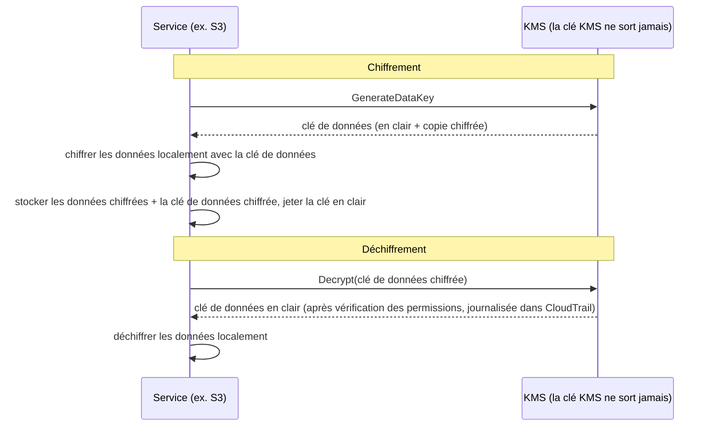

# Chapitre 16 : Clés, verrous et secrets

Le dépôt git avait des milliers de commits remontant à deux ans. Leo faisait défiler depuis vingt minutes, suivant un fil à travers l'historique — cherchant quand une certaine chaîne de connexion à la base de données était apparue pour la première fois. Il faillit la rater. C'était un mardi après-midi, coincée entre deux commits sans intérêt, poussée par quelqu'un qui avait depuis quitté l'entreprise.

Un mot de passe de base de données. En clair. Dans l'historique.

---

*Les contrôles réseau du chapitre précédent étaient stricts maintenant. Les groupes de sécurité limitaient le mouvement latéral. Les NACLs bloquaient les plages d'IP connues comme mauvaises. Le périmètre avait été durci. Mais l'audit de sécurité avait trouvé quelque chose que le périmètre ne pouvait pas corriger : un identifiant qui vivait dans l'historique git depuis six mois. La sécurité périmétrique suppose que les secrets à l'intérieur sont sécurisés. Celui-ci ne l'était pas.*

---

Leo examinait l'historique git quand il le trouva. Un mot de passe de base de données. Committé il y a six mois, en clair, par quelqu'un qui ne travaillait plus à Nimbus — faisant partie d'un fichier `.env` qui contenait aussi la clé d'accès IAM du pipeline de déploiement, deux lignes sous la chaîne de connexion. Le commit était public. Le mot de passe avait depuis été changé — mais ils ne le savaient pas avec certitude. Ils vérifièrent chaque système que l'un ou l'autre identifiant avait jamais touché. Ça prit quatre heures. Ce fut le jour où Nimbus décida d'arrêter de mettre des secrets dans le code.

« A-t-on réfléchi à ce qui se passe si quelqu'un forke le dépôt ? » dit Priya. « L'historique git est permanent. Même si on change le mot de passe, quiconque a cloné le dépôt avant le correctif a toujours l'ancien identifiant dans son historique local. »

« On a vérifié », dit Leo. « Le mot de passe a été changé il y a trois mois. Tous les systèmes confirmés. »

« C'est le minimum », dit Priya. « Mais chaque système que cet identifiant a touché doit être examiné. Pas juste ceux que tu connais. »

**L'audit de quatre heures**

Leo avait trouvé le fichier `.env` divulgué dans l'historique git à 10 h. À 14 h, ils avaient une réponse à la question qui comptait : l'un ou l'autre identifiant — le mot de passe de la base de données ou la clé d'accès committée à côté — avait-il été utilisé par quelqu'un d'autre que les systèmes Nimbus ?

L'audit parcourut quatre catégories.

**Journaux d'accès RDS** : Chaque connexion à la base de données, horodatée et journalisée. Le mot de passe divulgué apparaissait dans trois chaînes de connexion — toutes provenant d'instances EC2 du VPC Nimbus, toutes avec des IP source attendues. Aucune connexion externe. Le mot de passe n'avait pas été utilisé pour se connecter à la base de données depuis l'extérieur.

**Journaux d'accès S3** : La clé d'accès divulguée appartenait à l'utilisateur IAM du pipeline de déploiement, qui avait des permissions pour le bucket `nimbus-receipts`. Leo interrogea les journaux d'accès au serveur S3 des six derniers mois. Chaque accès provenait d'instances EC2 `us-west-2` ou du rôle de récupération d'origine CloudFront. Aucune anomalie.

**Appels d'API CloudTrail** : Chaque appel d'API AWS fait avec l'ID de la clé d'accès divulguée. Leo filtra les événements CloudTrail pour la clé. Trois cent douze événements — tous des appels `s3:PutObject` de routine du pipeline de déploiement, tous depuis la même IP, tous pendant les heures de bureau. La clé n'avait jamais été utilisée que depuis une seule adresse IP, qui correspondait au serveur CI/CD.

« Et le serveur CI/CD », dit Priya, « est à l'intérieur du VPC. Il aurait dû exfiltrer des données via HTTPS vers un point de terminaison externe, et on aurait vu ça dans les flow logs. »

« On a vérifié », dit Leo. « Aucun HTTPS sortant de ce serveur vers des IP non-AWS au cours des six derniers mois. »

**Verdict** : Aucun des deux identifiants n'avait été utilisé par quelqu'un en dehors de l'équipe Nimbus. L'exposition était un risque, pas une fuite.

« Mais on ne peut pas en être certains », dit Priya. « On peut être raisonnablement confiants d'après les journaux. On ne peut pas être certains. Cette distinction importe. »

« Qu'est-ce qui nous rendrait certains ? »

« Rien ne te rend certain après une exposition d'identifiant. Tu rotates l'identifiant, tu audites l'accès, tu documentes tes découvertes, et tu avances avec de meilleurs contrôles. La certitude n'est pas disponible. »

Tom avait calculé pendant la conversation. « Quatre heures du temps de trois ingénieurs. Disons quatre mille dollars en coût pleinement chargé. Plus la rotation de l'identifiant, la documentation, le compte rendu d'incident. »

« Et ce n'est que l'enquête », dit Priya. « Une fuite aurait été de plusieurs ordres de grandeur plus chère. Notifications réglementaires. Communications clients. Amendes possibles. »

« Donc la leçon à quatre mille dollars était bon marché », dit Tom.

« Considérablement », dit Priya. « Ne la répétons pas. »

---

**Les deux problèmes : Stocker des secrets et chiffrer des données**

La sécurité autour des informations sensibles a deux problèmes distincts :

**Stocker des identifiants** (mots de passe de base de données, clés d'API, chaînes de connexion) : Où vivent-ils ? Qui peut y accéder ? Comment les rotater sans redéployer votre application ?

**Chiffrer des données** (informations clients, enregistrements de paiement, PII) : Comment vous assurer que même si quelqu'un obtient un accès non autorisé à votre base de données ou bucket S3, il ne peut pas lire les données ?

AWS a un service dédié pour chaque problème :

- **AWS Secrets Manager** : Stocke et gère les identifiants de façon sécurisée
- **AWS KMS (Key Management Service)** : Gère les clés de chiffrement pour chiffrer et déchiffrer les données

Pensez à Secrets Manager comme à un porte-clés : il détient vos clés (identifiants), les garde organisées et les rotate selon un calendrier. Pensez à KMS comme à un coffre-fort : il ne détient pas ce qui a de la valeur — il détient la clé qui ouvre le verrou protégeant ce qui a de la valeur.

**AWS Secrets Manager : Plus d'identifiants codés en dur**

Secrets Manager est un magasin sécurisé pour les secrets : identifiants de base de données, clés d'API, jetons OAuth, clés SSH, ou tout ce qui est sensible.

Au lieu que votre application lise un mot de passe depuis une variable d'environnement ou un fichier de configuration, elle appelle l'API Secrets Manager au démarrage (ou au besoin) et récupère le secret. Le secret ne touche jamais le disque. Il n'apparaît jamais dans votre code. Il n'est pas dans vos variables d'environnement.

Voici à quoi ressemble le flux :

**Ancienne façon** :
```
DB_PASSWORD=supersecretpassword123  # dans un fichier .env ou une variable d'environnement
```

**Façon Secrets Manager** :
```python
import boto3
client = boto3.client('secretsmanager')
secret = client.get_secret_value(SecretId='nimbus/production/db-password')
password = json.loads(secret['SecretString'])['password']
```

L'instance EC2 a besoin d'un rôle IAM avec la permission d'appeler `secretsmanager:GetSecretValue` pour ce secret spécifique. Aucun autre service ne peut le lire. Le secret n'est jamais dans le code.

Vous vous demandez peut-être : pourquoi ne pas juste utiliser des variables d'environnement ? Elles sont plus simples — vous les définissez au déploiement, et l'application les lit. Les variables d'environnement semblent cachées, mais elles sont stockées dans votre configuration de déploiement, le magasin de secrets CI/CD, possiblement journalisées pendant les sessions de débogage, et visibles par quiconque a accès au processus en cours d'exécution. Plus important, elles sont statiques : une fois définies, elles ne changent pas jusqu'à ce que quelqu'un les mette à jour manuellement. Secrets Manager stocke les identifiants dans un service chiffré avec des contrôles d'accès IAM, une journalisation d'audit complète via CloudTrail, et une rotation automatique. Les variables d'environnement ne rotent pas. Une variable d'environnement divulguée reste valide jusqu'à ce que quelqu'un la change manuellement.

**Rotation automatique : La vraie puissance**

La plus grande fonctionnalité de Secrets Manager n'est pas de stocker des secrets — c'est de les rotater automatiquement.

Voici le scénario : tous les 30 jours, Secrets Manager génère un nouveau mot de passe de base de données, le met à jour dans RDS, met à jour le secret stocké, et votre application récupère le nouveau mot de passe la prochaine fois qu'elle en a besoin. Aucune intervention manuelle. Aucun déploiement. Aucun « je dois me souvenir de rotater ça ».

La rotation est implémentée comme une fonction Lambda. AWS fournit des modèles pour les bases de données RDS (MySQL, PostgreSQL, Aurora). Vous pouvez personnaliser la fonction pour n'importe quel type d'identifiant.

« Combien ça coûte par mois ? » demanda Tom.

Secrets Manager facture par secret par mois plus par appel d'API. Pour un petit nombre de mots de passe de base de données et de clés d'API, le coût est de quelques dollars par mois — négligeable comparé au coût d'un incident.

« La compromission de la semaine dernière », dit Priya, « combien aurait-il coûté d'enquêter et de remédier ? »

Tom resta silencieux un moment. « En incluant mon temps, ton temps, le week-end de Leo... quelques milliers de dollars. »

« Secrets Manager aurait attrapé la clé statique avant qu'elle ne soit exploitée. Et il l'aurait rotatée automatiquement. »

Tom ouvrit la page de tarification.

**Ce qui se passe pendant la rotation**

« Attends — mais *pourquoi* ferait-on ça comme ça ? » demanda Maya. « Si le mot de passe de la base de données rote, est-ce que l'application casse ? Comment récupère-t-elle le nouveau mot de passe sans déploiement ? »

C'était une préoccupation légitime. La rotation sans perturbation nécessite de la prudence.

La rotation Secrets Manager fonctionne par étapes — conçue pour empêcher le scénario « ancien mot de passe soudainement invalide, l'application plante » :

**Étape 1 : Créer une nouvelle version du secret.** Secrets Manager génère un nouveau mot de passe et le stocke comme version en attente du secret. La version actuelle est toujours active.

**Étape 2 : Définir sur le service.** La Lambda de rotation appelle la base de données pour mettre à jour le mot de passe à la nouvelle valeur. Attention : avec la stratégie de rotation **utilisateur unique** par défaut, il y a un bref moment où l'ancien mot de passe vient de cesser de fonctionner (le `ALTER ROLE ... PASSWORD` de PostgreSQL prend effet immédiatement) et la nouvelle version n'est pas encore actuelle. Pour une rotation sans interruption, Secrets Manager prend en charge une stratégie d'**utilisateurs alternés** : deux utilisateurs de base de données avec des permissions identiques, où la rotation met toujours à jour l'utilisateur *inactif* puis bascule — les identifiants actifs ne sont jamais invalidés en plein vol. La phrase d'examen à retenir est « stratégie de rotation à utilisateurs alternés ».

**Étape 3 : Tester le nouveau secret.** La Lambda de rotation vérifie que le nouveau mot de passe fonctionne en se connectant avec. Si ça échoue, la rotation est annulée.

**Étape 4 : Terminer.** Secrets Manager marque la nouvelle version comme version actuelle et rétrograde l'ancienne version au rang de version précédente. La version précédente est conservée pendant une période de grâce.

Pendant la période de grâce, les deux versions sont récupérables. Si votre application a mis l'ancien secret en cache et n'a pas encore récupéré le nouveau, elle peut quand même se connecter. La prochaine fois qu'elle appelle `GetSecretValue`, elle obtient la version actuelle (nouvelle).

« Donc l'application n'a jamais besoin d'être redémarrée », dit Leo.

« Pas nécessairement. Si votre application met le secret en cache au démarrage et ne le rafraîchit jamais, vous devez soit le rafraîchir selon un calendrier, soit gérer les échecs d'authentification en récupérant à nouveau le secret. »

« Donc la Lambda de rotation et l'application doivent coopérer », dit Maya.

« Secrets Manager fait sa moitié. Le code de votre application doit faire l'autre moitié : récupérer le secret au besoin, gérer les échecs d'authentification en récupérant à nouveau. »

Leo mit à jour l'application pour attraper les exceptions d'authentification de la base de données et, en cas d'échec, récupérer un secret frais depuis Secrets Manager avant de réessayer. Deux lignes de gestion d'erreur. La rotation devint invisible pour les utilisateurs.

---

**Injection de secrets dans le pipeline CI/CD**

« A-t-on réfléchi à comment le pipeline de déploiement obtient les secrets dont il a besoin ? » demanda Priya. « Le pipeline déploie l'infrastructure. Il a besoin d'identifiants AWS. Il pourrait avoir besoin de chaînes de connexion à la base de données pour les scripts de migration. »

Leo expliqua la configuration actuelle : les secrets étaient stockés comme GitHub Actions Secrets — chiffrés au repos dans GitHub, injectés comme variables d'environnement à l'exécution.

« Les identifiants sont dans GitHub », dit Priya.

« Chiffrés. »

« Dans un système tiers. Une seule fuite GitHub expose tous nos secrets de pipeline. »

La solution : le pipeline de déploiement s'authentifie à AWS via la fédération OIDC (couverte au Chapitre 14) et récupère tous les secrets dont il a besoin depuis Secrets Manager à l'exécution. Aucun secret stocké dans GitHub. Le rôle AWS du pipeline a la permission de lire des secrets spécifiques, rien d'autre.

```yaml
# Workflow GitHub Actions
- name: Get DB Migration Credentials
  env:
    AWS_DEFAULT_REGION: us-west-2
  run: |
    SECRET=$(aws secretsmanager get-secret-value \
      --secret-id nimbus/staging/db-migration \
      --query SecretString --output text)
    DB_URL=$(echo $SECRET | jq -r '.url')
    # Exécuter la migration avec DB_URL — jamais stocké dans un fichier
    flyway -url="$DB_URL" migrate
```

Le secret est récupéré, utilisé en mémoire, et jeté. Il n'est jamais écrit sur disque, jamais stocké dans des variables d'environnement qui persistent après la tâche, jamais dans un fichier journal.

« Et si le secret est imprimé dans le journal ? » demanda Leo.

« GitHub Actions masque automatiquement les valeurs des secrets qui sont configurés comme GitHub Secrets. Mais ce secret n'est pas un GitHub Secret — il vient de Secrets Manager. Vous devez le masquer manuellement, ou mieux, ne jamais le journaliser. »

« Donc la discipline est : récupérer, utiliser, jeter. Ne jamais journaliser les secrets. Ne jamais les stocker dans des fichiers. »

« Cette discipline », dit Priya, « est ce sur quoi l'audit de quatre heures a confirmé qu'on échouait. »

**AWS KMS : L'usine à verrous**

« Attends — mais *pourquoi* ferait-on ça comme ça ? » demanda Maya. « Pourquoi un service de gestion de clés séparé ? Ne peut-on pas juste chiffrer les données nous-mêmes et stocker la clé dans Secrets Manager ? »

Vous pourriez stocker des clés de chiffrement dans Secrets Manager. Mais alors qui contrôle l'accès à la clé ? Qu'est-ce qui garantit que la clé est rotatée ? Qu'est-ce qui prouve à un auditeur que la clé n'a été utilisée que par des services autorisés ? KMS répond à toutes ces questions. Ce n'est pas juste du stockage — c'est un service de gestion du cycle de vie des clés avec une sécurité matérielle, des politiques IAM fines par clé, et une piste d'audit complète de chaque utilisation. Secrets Manager stocke ce dont vous avez besoin pour vous connecter aux systèmes. KMS protège les systèmes eux-mêmes.

AWS KMS (Key Management Service) gère les **clés cryptographiques** — les valeurs secrètes utilisées pour chiffrer et déchiffrer les données.

L'analogie : KMS est comme une entreprise de coffres-forts qui détient la clé maîtresse. Vos données (le contenu du coffre) sont chiffrées. Seul quelqu'un avec la permission d'utiliser la clé KMS peut les déchiffrer. KMS journalise chaque utilisation de chaque clé dans CloudTrail.

Les **Customer Master Keys (CMK)** — maintenant appelées clés KMS — existent en trois types de propriété :

**Clés détenues par AWS** : Des clés qu'AWS possède et utilise à travers de nombreux comptes clients — vous ne les voyez jamais, ne les payez jamais, et elles n'apparaissent pas dans votre compte. Plusieurs valeurs par défaut de services les utilisent (le chiffrement par défaut de DynamoDB, par exemple).

(Une distinction à garder claire : le chiffrement par défaut **SSE-S3** de S3 n'est *pas* du tout un modèle de clé KMS — S3 gère ses propres clés AES-256 entièrement hors de KMS, sans clé à voir et sans piste d'audit d'utilisation de clé. **SSE-KMS** est l'option S3 qui passe par KMS, utilisant soit la clé gérée AWS `aws/s3`, soit une clé gérée par le client. Déclencheur d'examen : « auditer qui a utilisé la clé de chiffrement » ou « contrôler la rotation et la politique de clé » → SSE-KMS avec une clé gérée par le client — chaque utilisation atterrit dans CloudTrail.)

**Clés gérées par AWS** : AWS crée et gère la clé automatiquement *dans votre compte* pour des services comme S3, EBS, RDS (nommées comme `aws/s3`). Vous pouvez la voir et auditer son utilisation dans CloudTrail, mais vous ne pouvez pas changer sa politique ni sa rotation — AWS la rote automatiquement chaque année. Gratuit.

**Clés gérées par le client** : Vous créez la clé dans KMS et contrôlez tous ses aspects : qui peut l'utiliser, quand elle rote, qui peut l'administrer. Vous pouvez activer la rotation automatique des clés avec une période configurable entre 90 jours et 2 560 jours (7 ans) ; la période de rotation par défaut est de 365 jours (annuelle). Vous pouvez aussi déclencher une **rotation à la demande** immédiatement — utile après une exposition suspectée, sans attendre le calendrier. Note : la rotation automatique s'applique aux clés symétriques avec du matériel généré par KMS — les clés asymétriques et le matériel de clé importé ne peuvent pas se rotater automatiquement. Coût : 1 $/mois par clé plus les frais par appel d'API.

Si vous choisissez des clés KMS gérées par le client, alors vous obtenez un contrôle complet sur les calendriers de rotation, les politiques d'accès et la visibilité d'audit, mais vous payez par clé par mois et prenez la responsabilité de la gestion des clés ; si vous choisissez des clés gérées par AWS, alors vous obtenez le chiffrement avec zéro surcharge opérationnelle et aucun coût pour la clé elle-même, mais vous ne pouvez pas personnaliser les calendriers de rotation ni les politiques de clé — ils sont gérés entièrement par AWS.

**Chiffrement dans les services AWS : Intégration KMS**

La plupart des services AWS s'intègrent avec KMS pour le chiffrement :

**S3** : Activez le « chiffrement côté serveur avec KMS » sur un bucket. Chaque objet est chiffré au repos avec une clé KMS. Lire un objet nécessite la permission à la fois du bucket S3 *et* de la clé KMS.

**RDS** : Activez le chiffrement à la création. Le stockage de la base de données, les sauvegardes et les snapshots sont tous chiffrés avec une clé KMS. Note : le chiffrement ne peut pas être activé sur une instance RDS non chiffrée existante — vous devez faire un snapshot, copier le snapshot avec le chiffrement activé, et restaurer.

**EBS** : Chiffrez les volumes avec KMS. Les nouveaux volumes créés à partir de snapshots chiffrés sont automatiquement chiffrés.

**DynamoDB** : Le chiffrement au repos utilisant KMS est activé par défaut sur toutes les tables.

**ElastiCache Redis** : Chiffrement au repos avec KMS pour les données mises en cache sensibles.

Le principe : les données devraient être chiffrées au repos (stockées sur disque) et en transit (se déplaçant à travers un réseau). KMS gère le chiffrement au repos. TLS/SSL (fourni automatiquement par les services AWS) gère le chiffrement en transit.

**Chiffrement par enveloppe : Comment KMS fonctionne réellement**

Voici un détail qui vous aide à comprendre le comportement de KMS et les questions d'examen.

KMS ne chiffre pas vos données directement dans la plupart des cas. Il utilise le **chiffrement par enveloppe** :

1. KMS génère une **clé de données** (une clé symétrique unique)
2. Le service utilise la clé de données pour chiffrer vos données localement (rapide — chiffrement symétrique)
3. Le service demande à KMS de chiffrer la clé de données elle-même (en utilisant votre clé KMS)
4. À la fois les données chiffrées et la clé de données chiffrée sont stockées
5. Vos données réelles ne quittent jamais le service — seule la clé de données va à KMS pour le chiffrement/déchiffrement

Quand vous lisez les données :

1. Le service demande à KMS de déchiffrer la clé de données
2. KMS vérifie les permissions, déchiffre la clé de données, la retourne
3. Le service utilise la clé de données déchiffrée pour déchiffrer vos données localement



Cela signifie que KMS peut gérer de très grandes données sans tout envoyer à travers l'API KMS. Seules les petites clés vont à KMS. CloudTrail journalise chaque appel d'API KMS — chaque opération de chiffrement et de déchiffrement.

**Politiques de clé KMS : Le modèle d'accès**

« A-t-on réfléchi à ce qui se passe si une politique IAM et une politique de clé entrent en conflit ? » demanda Priya. « KMS a son propre contrôle d'accès par-dessus IAM. »

Les clés KMS ont des **politiques de clé** — des politiques basées sur la ressource attachées à la clé elle-même. Elles sont distinctes des politiques IAM et suivent des règles d'évaluation différentes.

Pour qu'un principal utilise une clé KMS, deux choses doivent être vraies :

**Premièrement** : La politique de clé doit l'autoriser. Si la politique de clé n'accorde pas explicitement l'accès au principal, il ne peut pas utiliser la clé — quoi que dise sa politique IAM. C'est différent de la plupart des ressources AWS, où les politiques IAM seules suffisent.

**Deuxièmement** : La politique IAM du principal doit autoriser l'action KMS (par exemple, `kms:Decrypt`, `kms:GenerateDataKey`).

Les deux doivent dire oui. Si l'une des deux dit non, l'action est refusée.

La politique de clé par défaut qu'AWS crée pour les clés gérées par le client inclut une déclaration qui dit « le compte root peut gérer cette clé ». C'est important : ça signifie qu'un administrateur IAM au niveau du compte peut toujours accorder l'accès à une clé, même si la politique de clé ne le nomme pas directement — parce que la délégation au compte root est en place.

« Donc si on retire le compte root de la politique de clé », demanda Leo, « les politiques IAM cessent de fonctionner pour cette clé ? »

« Correct. Retirer la délégation au compte root est une façon de verrouiller une clé si étroitement que seuls les principaux spécifiques nommés dans la politique de clé peuvent l'utiliser — pas même les administrateurs de compte. C'est aussi une façon de vous verrouiller accidentellement hors de votre propre clé. »

« Peut-on récupérer ? »

« Seulement en contactant le support AWS. Si personne ne peut utiliser la clé et que la politique de clé ne peut pas être mise à jour, les données chiffrées avec cette clé sont effectivement inaccessibles. »

« Donc ne retirez pas le compte root de la politique de clé sans une raison extrêmement bonne. »

« Correct. »

---

**Clés asymétriques : Signature et vérification**

KMS prend aussi en charge les paires de clés asymétriques — une clé publique et une clé privée.

Les cas d'usage :

**Signature numérique** : Vous signez un document ou un jeton JWT avec la clé privée. Quiconque a la clé publique peut vérifier que la signature provient du détenteur de la clé privée, et que le contenu n'a pas été altéré.

**Chiffrement à clé publique** : Quiconque peut chiffrer des données avec la clé publique. Seul le détenteur de la clé privée peut les déchiffrer.

Pour Nimbus, les clés asymétriques devinrent pertinentes quand ils implémentèrent un système de signature de webhook pour les partenaires restaurant. Quand Nimbus envoyait un événement au serveur d'un partenaire restaurant (une nouvelle commande, une mise à jour de statut), le partenaire avait besoin de vérifier que l'événement venait réellement de Nimbus et n'avait pas été falsifié.

L'implémentation :

1. Nimbus crée une clé KMS asymétrique (RSA 2048 bits, algorithme SIGN_VERIFY)
2. En envoyant un webhook, Nimbus appelle `kms:Sign` avec la clé privée pour signer la charge utile de l'événement
3. La signature est incluse dans l'en-tête du webhook
4. Nimbus publie la clé publique (téléchargeable depuis la console KMS)
5. Le serveur du partenaire restaurant récupère la clé publique et l'utilise pour vérifier la signature sur chaque webhook entrant

La clé privée ne quitte jamais KMS. Nimbus n'a jamais accès au matériel brut de la clé privée. KMS effectue l'opération de signature à l'intérieur de son module de sécurité matériel.

« Donc même si quelqu'un compromettait un serveur Nimbus », dit Rafael, « il ne pourrait pas falsifier une signature de webhook. La clé privée est dans KMS, pas sur un serveur. »

« Correct. La signature nécessite un appel d'API KMS. Chaque appel d'API est journalisé dans CloudTrail. Si quelqu'un essayait de signer un événement frauduleux, on verrait l'appel d'API. »

---

**L'histoire de la suppression de clé**

Trois mois après la configuration de KMS, Tom fit une erreur.

Il nettoyait des ressources AWS inutilisées — anciennes fonctions Lambda, buckets S3 périmés, tableaux de bord CloudWatch abandonnés. Il allait vite. Il programma accidentellement une clé KMS pour suppression.

La clé était `nimbus/prod/order-receipts` — la clé gérée par le client utilisée pour chiffrer le bucket S3 des reçus de commande.

« J'ai supprimé en lot douze ressources hier et je n'ai pas vérifié ce qu'était la douzième », dit Tom platement. Il avait programmé la suppression et était passé à autre chose. Il remarqua l'erreur le lendemain matin en examinant ses actions.

Il ouvrit la console KMS. Le statut de la clé indiquait : « En attente de suppression. Suppression dans 7 jours. »

Il l'avait programmée pour la période d'attente minimale.

« Peut-on l'annuler ? » demanda-t-il.

Priya ouvrit la documentation. « Oui. Pendant la période d'attente, la clé est désactivée mais pas supprimée. Vous pouvez annuler la suppression. »

Tom annula la suppression dans la minute. La clé fut restaurée au statut actif.

« Sept jours est la période d'attente minimale », dit Priya. « AWS l'impose parce que si une clé est supprimée et que des données étaient chiffrées avec, ces données sont perdues à jamais. Irrécupérables. La période d'attente vous donne le temps de réaliser l'erreur. »

« Combien de temps devrait durer la période d'attente ? »

« Le maximum est de trente jours. Pour toute clé qui chiffre des données de production, utilisez trente jours. Les trois semaines supplémentaires de protection contre les accidents valent l'inconvénient mineur. »

Tom mit à jour tous les réglages de suppression de clés de production à trente jours. Il configura aussi une alarme CloudWatch qui se déclenchait si le statut d'une quelconque clé KMS changeait à « En attente de suppression » — pour que la prochaine fois que quelqu'un (y compris lui) ferait la même erreur, l'équipe le sache en cinq minutes.

---

**Secrets Manager vs Parameter Store**

AWS a aussi **Systems Manager Parameter Store**, qui stocke des valeurs de configuration (pas seulement des secrets). Parameter Store est moins cher — gratuit pour les paramètres standard. Il peut aussi stocker des paramètres chiffrés en utilisant KMS.

Pour les secrets qui ont besoin de rotation : Secrets Manager.

Pour les valeurs de configuration et les paramètres non sensibles : Parameter Store (le niveau gratuit est très généreux).

Pour la configuration d'application (numéros de port, feature flags, réglages spécifiques à l'environnement) : Parameter Store.

| | Secrets Manager | SSM Parameter Store |
|---|---|---|
| Rotation automatique | Oui (basée sur Lambda) | Non |
| Coût | ~0,40 $/secret/mois | Gratuit (standard) |
| Chiffrement | Toujours | Optionnel (avec KMS) |
| Versioning | Oui | Oui |
| Accès inter-comptes | Oui | Limité |
| Idéal pour | Mots de passe de base de données, clés d'API | Valeurs de config, feature flags |

## Le certificat sur la porte

Deux semaines après la migration des secrets, Priya examinait l'environnement de staging Nimbus sur son téléphone quand elle remarqua la barre d'adresse.

« Non sécurisé. »

Elle ouvrit l'URL de production. Même chose.

« Leo », dit-elle, posant son téléphone sur la table. « On tourne en HTTP ? »

Leo vérifia. « L'écouteur de l'ALB est sur le port 80. On n'a jamais configuré HTTPS. »

« Donc chaque requête que nos utilisateurs font — chaque commande, chaque connexion — passe en HTTP non chiffré ? »

« On a TLS sur la connexion RDS », proposa Leo.

« C'est des données en transit entre l'application et la base de données. Je parle de données en transit entre le navigateur de l'utilisateur et notre équilibreur de charge. Ce n'est pas chiffré du tout. »

Tom avait écouté. « C'est un problème de sécurité ou un problème de perception ? »

« Les deux », dit Priya. « Du HTTP non chiffré signifie que n'importe quel réseau entre l'utilisateur et notre serveur — un routeur de café, un FAI — peut lire le trafic. Mots de passe, détails de commande, jetons de session. Et les navigateurs modernes avertissent les utilisateurs avec "Non sécurisé". Ça tue les taux de conversion. »

« Donc on a besoin d'un certificat TLS », dit Maya. « Combien ça coûte ? »

« Rien », dit Priya. « AWS Certificate Manager. »

**AWS Certificate Manager (ACM)** provisionne des certificats TLS/SSL gratuits pour utilisation avec les services gérés par AWS : ALB, distributions CloudFront et API Gateway. Vous n'achetez pas de certificat, ne gérez pas de calendrier de renouvellement, ni ne touchez au matériel de la clé privée. ACM gère tout le cycle de vie du certificat.

Un certificat émis par ACM est valide 13 mois. Avant qu'il n'expire, ACM le renouvelle automatiquement. Si le renouvellement réussit, le nouveau certificat est attaché à votre équilibreur de charge ou distribution sans aucune action de votre part. Le cadenas du navigateur reste vert. L'alerte d'expiration que vous avez oublié de configurer ne se déclenche jamais.

**Deux types de certificats ACM** :

Les **certificats publics** sont émis par l'autorité de certification d'Amazon et approuvés par tous les principaux navigateurs. Ils sont complètement gratuits pour utilisation avec ALB, CloudFront et API Gateway. Vous validez la propriété du domaine soit via DNS soit via e-mail.

Les **certificats privés** sont émis par AWS Private CA — une autorité de certification privée gérée que vous faites tourner pour les services internes (mTLS service-à-service, outillage interne, clients VPN). Private CA a un coût mensuel.

Pour Nimbus, les certificats publics étaient le bon choix.

**Validation DNS vs validation par e-mail** :

Leo ouvrit la console ACM et démarra une demande de certificat pour `eatnimbus.com` et `*.eatnimbus.com`.

« Ça demande comment je veux valider la propriété », dit-il. « DNS ou e-mail. »

« DNS », dit Priya. « Toujours DNS. »

Avec la validation DNS, ACM ajoute un enregistrement CNAME spécifique à votre zone hébergée. Route 53 peut le faire automatiquement — un clic dans la console. Tant que cet enregistrement CNAME existe, ACM peut renouveler automatiquement le certificat sans aucune action humaine. La validation par e-mail envoie un e-mail au contact enregistré du domaine et nécessite un clic manuel à chaque renouvellement du certificat. Ce clic est oublié. La validation DNS ne nécessite que personne ne se souvienne de rien.

« Donc j'ajoute l'enregistrement CNAME une fois », dit Leo, « et il se renouvelle pour toujours ? »

« Jusqu'à ce que quelqu'un supprime l'enregistrement CNAME », dit Priya. « Ne supprimez pas l'enregistrement CNAME. »

Leo demanda le certificat, ajouta le CNAME de validation dans Route 53 (ce qu'ACM proposa de faire automatiquement), et attendit cinq minutes. Le statut du certificat passa à Émis. Il l'attacha à l'écouteur HTTPS de l'ALB sur le port 443 et ajouta une règle de redirection sur le port 80 pour envoyer tout le trafic HTTP vers HTTPS.

Tom actualisa l'URL de production.

Le cadenas apparut.

Un détail régional qui mérite un signalement : un certificat est une ressource régionale, et il doit vivre dans la même région que le service qui l'utilise. Pour un ALB, c'est la région de l'ALB. Pour **CloudFront**, le certificat doit être demandé (ou importé) dans **`us-east-1`** — toujours, quel que soit l'endroit où tournent vos origines — parce que CloudFront est un service global ancré là-bas. Leo avait déjà trébuché sur ça au Chapitre 13 ; c'est aussi un fait d'examen fiable.

**La seule chose que les certificats ACM ne peuvent pas faire** :

« Puis-je télécharger le certificat ? » demanda Leo. « Je veux l'installer sur l'instance EC2 d'administration interne. »

« Non », dit Priya.

Les certificats publics ACM gratuits ne peuvent pas être exportés. Vous ne pouvez pas télécharger la clé privée et l'installer sur une instance EC2, un serveur Nginx, ou quoi que ce soit en dehors des services gérés par AWS. Le matériel de la clé privée ne quitte jamais ACM. C'est intentionnel — ça empêche la clé privée d'être divulguée, stockée de façon non sécurisée, ou oubliée quand le certificat expire.

Pour les cas d'usage qui nécessitent un certificat installable — une instance EC2 agissant comme proxy personnalisé, un serveur sur site — il y a trois voies : un certificat d'une autorité tierce (Let's Encrypt, par exemple), AWS Private CA avec l'export de certificat activé, ou — depuis juin 2025 — les **certificats publics exportables** payants d'ACM (à activer à l'émission, facturés par FQDN ou wildcard), dont la clé privée *peut* être exportée pour utilisation n'importe où.

« Pour notre ALB et notre distribution CloudFront », dit Priya, « ACM est exactement ce qu'il faut. Gratuit, automatique, et on ne touche jamais une clé. »

## Forces et limites

**AWS Secrets Manager** :

- Rotation automatique des secrets sans changements de code ni déploiements
- Contrôle d'accès IAM fin par secret (chaque secret est une ressource IAM séparée)
- Versioning — la version précédente reste accessible pendant la rotation, empêchant les coupures de connexion
- Audit via CloudTrail — chaque appel `GetSecretValue` est journalisé avec l'identité de l'appelant
- Accès inter-comptes — les secrets d'un compte peuvent être partagés avec le rôle d'un autre compte
- Coût : ~0,40 $/secret/mois + appels d'API (environ 0,05 $ par 10 000 appels d'API)

**AWS KMS** :

- Gestion centralisée des clés avec piste d'audit complète — chaque chiffrement et déchiffrement journalisé
- Rotation automatique configurable des clés pour les clés gérées par le client (90 jours à 2 560 jours ; défaut 365 jours) — l'ancien matériel de clé déchiffre toujours les données existantes, le nouveau matériel chiffre les nouvelles données
- Permissions IAM fines par clé (politiques de clé + politiques IAM — les deux doivent autoriser)
- Adossé à un module de sécurité matériel (HSM) — les clés ne quittent jamais le HSM en clair
- Prise en charge des clés multi-Régions pour les scénarios de reprise après sinistre
- Prise en charge des clés asymétriques pour la signature et la vérification numériques
- Coût : 1 $/mois par clé + 0,03 $ par 10 000 appels d'API

**Là où ça se complique** :

- Les politiques de clé KMS sont séparées de (et évaluées aux côtés des) politiques IAM — déboguer les erreurs d'accès refusé nécessite de vérifier les deux
- Le chiffrement au repos doit être planifié à l'avance — vous ne pouvez pas chiffrer une instance RDS non chiffrée existante sur place
- La suppression de clé dans KMS a une période d'attente de 7 à 30 jours — un mécanisme de sécurité, mais facile à oublier pendant la configuration et dangereux à déclencher accidentellement
- La rotation nécessite que le code de l'application gère la récupération des secrets en cas d'échec d'authentification — Secrets Manager rote l'identifiant, mais l'application doit le récupérer
- Les coûts de Secrets Manager augmentent avec le nombre de secrets et le volume d'appels d'API à grande échelle
- La politique de clé par défaut (y compris la délégation au compte root) est critique à préserver — la retirer peut verrouiller les administrateurs hors de la clé

## Résumé

Les quatre heures passées à tracer un identifiant compromis à travers chaque système qu'il avait touché étaient quatre heures que Secrets Manager aurait pu prévenir. La rotation automatique signifie qu'un identifiant volé a une courte durée de vie. KMS signifie que même si quelqu'un atteint les données, il ne peut pas les lire sans une clé qu'il n'est pas autorisé à utiliser. Et une période d'attente de suppression de clé de trente jours signifie qu'une suppression accidentelle peut être annulée avant de devenir un événement de perte de données.

- Ne stockez jamais d'identifiants dans le code, les variables d'environnement, ou les fichiers de configuration committés dans le contrôle de version.
- **Secrets Manager** stocke les identifiants de façon sécurisée et les rote automatiquement. Les applications récupèrent les secrets via API à l'exécution.
- La **rotation** se produit par étapes : créer une nouvelle version, mettre à jour sur le service, tester, promouvoir. Les anciennes et nouvelles versions sont brièvement valides, empêchant les coupures de connexion pendant la rotation.
- **KMS** gère les clés de chiffrement. La plupart des services AWS s'intègrent avec KMS pour le chiffrement au repos.
- **Chiffrement par enveloppe** : KMS chiffre la clé, pas les données directement. Le service chiffre les données en utilisant une clé de données locale, que KMS chiffre. Seules les petites clés traversent l'API KMS.
- **Clés KMS gérées par le client** : contrôle complet sur la rotation (configurable 90-2 560 jours, défaut 365 jours annuel), l'accès et l'audit (1 $/mois). **Clés gérées par AWS** : automatiques, aucune configuration nécessaire, gratuites.
- **Politiques de clé KMS** : La politique de clé est une politique basée sur la ressource qui fonctionne aux côtés d'IAM. Les deux doivent dire oui. La délégation au compte root dans la politique de clé par défaut garantit que les administrateurs IAM peuvent toujours accorder l'accès.
- **Clés asymétriques** : KMS prend en charge les paires de clés RSA et ECC pour la signature et la vérification. La clé privée ne quitte jamais le HSM.
- **Suppression de clé** : Période d'attente minimale de 7 jours, maximale de 30 jours. Les clés supprimées signifient des données chiffrées définitivement inaccessibles. Utilisez 30 jours pour les clés de production, et surveillez le statut en attente de suppression.
- **Secrets CI/CD** : Récupérez-les depuis Secrets Manager à l'exécution en utilisant la fédération OIDC. Ne stockez jamais de secrets comme variables de plateforme CI/CD.

## Conseils pour l'examen

*Domaine SAA-C03 : Concevoir des architectures sécurisées (Domaine 1, Tâche 1.3)*

- **Secrets Manager vs SSM Parameter Store** : Secrets Manager pour les identifiants qui ont besoin de rotation automatique ; Parameter Store pour la configuration générale. L'examen les distingue par l'exigence de rotation et la sensibilité au coût.
- **Politiques de clé KMS** : Une clé KMS a sa propre politique de clé (une politique basée sur la ressource). Les politiques IAM seules n'accordent pas l'accès à une clé KMS — la politique de clé doit explicitement l'autoriser. À la fois la politique de clé et la politique IAM doivent autoriser l'action.
- **Chiffrer RDS** : Impossible d'activer le chiffrement sur une instance RDS non chiffrée existante. Le processus : créer un snapshot → copier le snapshot avec le chiffrement activé → restaurer depuis le snapshot chiffré → migrer le trafic vers la nouvelle instance.
- **Chiffrement EBS** : Les nouveaux volumes peuvent être chiffrés. Les snapshots de volumes chiffrés sont toujours chiffrés. Les volumes non chiffrés ne peuvent pas être directement chiffrés — snapshot + copie + restauration.
- **CloudTrail + KMS** : Chaque appel d'API KMS est journalisé dans CloudTrail. C'est une fonctionnalité de conformité clé. Quand un examen demande comment auditer qui a déchiffré quelles données, la réponse est CloudTrail + KMS.
- **Clés KMS multi-Régions** : Répliquez le matériel de clé vers plusieurs régions pour que le déchiffrement puisse se faire sans appels d'API inter-régions. L'examen utilise ça pour la reprise après sinistre multi-régions avec des données chiffrées.
- **KMS vs CloudHSM** : KMS est multi-locataire (géré par AWS). CloudHSM est un module de sécurité matériel dédié que vous seul contrôlez. Signaux d'examen : « FIPS 140-2 Level 3 », « HSM dédié », « opérations cryptographiques gérées par le client » → CloudHSM.
- **Chiffrement par enveloppe** : KMS génère une clé de données, le service l'utilise pour chiffrer les données localement, KMS chiffre la clé de données. Question d'examen : « pourquoi KMS ne chiffre-t-il pas directement de grandes quantités de données ? » → performance ; le chiffrement par enveloppe garde les grandes données locales.
- **Clés KMS asymétriques** : Utilisées pour la signature numérique, la vérification de JWT, ou le chiffrement à clé publique. La clé privée ne quitte jamais KMS. `kms:Sign` est l'appel d'API pour signer ; `kms:Verify` pour vérifier.
- **Période d'attente de suppression de clé** : 7-30 jours. Pendant cette période, la clé est désactivée et inutilisable, mais la suppression peut être annulée. Après la suppression, toute donnée chiffrée avec cette clé est définitivement irrécupérable.
- **ACM (AWS Certificate Manager) :** Certificats TLS publics gratuits pour utilisation avec ALB, CloudFront et API Gateway. Renouvellement automatique via validation DNS. Les certificats publics gratuits ne peuvent pas avoir leur clé privée exportée — ils vivent à l'intérieur d'AWS uniquement (une option de *certificat public exportable* payante existe depuis 2025 pour utilisation EC2/sur site). Déclencheur d'examen : « HTTPS sur un équilibreur de charge ou un CDN » → ACM.

## Exercices

**Exercice 1 — Mémorisation**

Expliquez le concept du chiffrement par enveloppe. Pourquoi KMS chiffre-t-il une petite clé de données plutôt que de chiffrer directement les données de votre application ?

*(Indice : Pensez à ce qui se passe si vous avez 1 Go de données à chiffrer, et quelles seraient les implications de performance d'envoyer 1 Go à un service KMS distant.)*

**Exercice 2 — Scénario SAA-C03**

*Scénario* : Une société de services financiers stocke des données clients sensibles dans une base de données RDS MySQL. Une nouvelle exigence de conformité impose que :

1. Toutes les données doivent être chiffrées au repos
2. Toute utilisation des clés de chiffrement doit être auditable
3. Les clés de chiffrement doivent être contrôlées par le client (pas gérées par AWS)
4. Le mot de passe de la base de données doit être rotaté automatiquement tous les 90 jours

La base de données a été créée il y a six mois sans chiffrement activé. Quel ensemble d'actions répond LE MIEUX aux quatre exigences ?

A) Activer le chiffrement RDS sur la base de données existante ; créer une clé KMS gérée par le client ; configurer Secrets Manager avec une rotation de 90 jours  
B) Créer un snapshot de la base de données existante ; copier le snapshot avec le chiffrement en utilisant une clé KMS gérée par le client ; restaurer depuis le snapshot chiffré ; configurer Secrets Manager avec une rotation de 90 jours  
C) Créer une nouvelle instance RDS chiffrée avec une clé gérée par AWS ; migrer les données de l'ancienne instance ; configurer Secrets Manager avec une rotation de 90 jours  
D) Activer le chiffrement au repos RDS sur la base de données existante en utilisant une clé gérée par AWS ; configurer Secrets Manager avec une rotation de 90 jours

**Indice 1** : Vous ne pouvez pas activer le chiffrement sur une instance RDS non chiffrée existante directement.

**Indice 2** : Les clés « contrôlées par le client » signifient des clés KMS gérées par le client, pas des clés gérées par AWS.

**Indice 3** : Le processus de copie de snapshot est le chemin de migration standard vers un RDS chiffré.

**Réponse** : B

**Explication** : Le chiffrement RDS ne peut pas être activé sur une instance existante. L'approche standard est : snapshot de l'instance existante → copier le snapshot avec le chiffrement activé en utilisant une clé KMS gérée par le client (satisfait les exigences 1, 2 et 3) → restaurer depuis le snapshot chiffré. Les clés KMS gérées par le client journalisent automatiquement toute utilisation dans CloudTrail (audit) et gardent les clés de chiffrement sous votre contrôle. Secrets Manager gère la rotation automatique du mot de passe tous les 90 jours (satisfait l'exigence 4).

**Pourquoi pas A ?** Vous ne pouvez pas activer le chiffrement sur une instance RDS non chiffrée existante sur place.

**Pourquoi pas C ?** Les clés gérées par AWS ne satisfont pas l'exigence « contrôlées par le client » (exigence 3).

**Pourquoi pas D ?** Même problème que A (impossible d'activer sur place) plus la clé gérée par AWS ne satisfait pas l'exigence 3.

*Domaine SAA-C03 : Concevoir des architectures sécurisées — Tâche 1.3*

**Exercice 3 — Défi d'architecture** *(Optionnel)*

Nimbus doit stocker les données sensibles suivantes :

- Mot de passe de base de données pour l'instance RDS de production
- Clé secrète d'API Stripe (utilisée pour le traitement des paiements)
- Une clé de chiffrement symétrique pour chiffrer l'historique des commandes clients dans DynamoDB
- Valeurs de configuration par restaurant (points de terminaison d'API, feature flags — non sensibles)

Quel service AWS ou approche utiliseriez-vous pour chacun ? Quelle stratégie de rotation appliqueriez-vous à chacun ?

*(Il n'y a pas de réponse unique correcte. L'objectif est de s'entraîner à faire correspondre les outils de sécurité aux cas d'usage.)*

## Scène post-générique

« Je l'ai déjà déployé — oh. » Leo avait migré les secrets de production vers Secrets Manager alors que l'environnement de développement utilisait encore les anciennes variables d'environnement. L'environnement de dev cassa. Il avait dû annuler la config de dev manuellement.

« Staging d'abord », dit Priya. « Puis la production. »

« Je sais », dit Leo.

Les secrets furent migrés.

Mots de passe de base de données : Secrets Manager, rotant tous les 30 jours.

Clés d'API : Secrets Manager, avec une Lambda de rotation qui appelait l'API du fournisseur de paiement pour générer une nouvelle clé.

Données de commandes clients : chiffrées avec une clé KMS gérée par le client.

Anciens identifiants : désactivés. Anciens fichiers de config : supprimés. Anciens secrets GitHub Actions : retirés.

« On est maintenant prêts pour un audit », dit Priya.

« Définis prêt pour un audit », dit Maya.

« Si un auditeur de conformité nous demandait de prouver qu'aucun identifiant n'est codé en dur dans notre code ni exposé dans notre infrastructure, on pourrait lui montrer : chaque secret est dans Secrets Manager, chaque clé de chiffrement est dans KMS, chaque accès est journalisé dans CloudTrail. »

« Quand est-ce que quelqu'un a vérifié les journaux CloudTrail pour la dernière fois ? »

Une pause.

« Je les vérifie chaque semaine », dit Priya.

« Et si quelque chose d'inhabituel apparaissait, comment le saurait-on ? »

« Ça », dit Priya en fermant son ordinateur, « c'est la prochaine conversation. »

Dans le prochain chapitre : les trois couches de défense qui se dressent entre Nimbus et internet.
