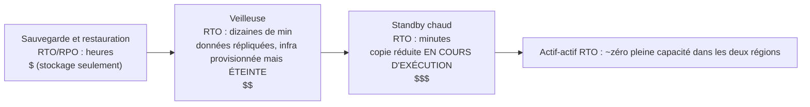

# Chapitre 18 : Quand les choses cassent

Les lumières se sont éteintes à 23 h 17.

Pas au bureau de Nimbus — Leo était chez lui, sur le canapé, l'ordinateur portable à moitié refermé. Les lumières se sont éteintes dans un centre de données de l'Oregon qu'il n'avait jamais visité, dans un bâtiment qu'il n'avait jamais vu, dans une salle pleine de serveurs qu'il n'avait jamais touchés. Il ne le savait pas encore. Il y eut un moment — juste un moment — de silence complet avant que les générateurs de secours ne se déclenchent quelque part, au loin. Le genre d'obscurité où l'on ne saurait dire si l'on a les yeux ouverts ou fermés.

Puis la notification Slack arriva.

---

Une fois les systèmes de surveillance du chapitre 17 en place, l'équipe avait ressenti quelque chose qui ressemblait à de la confiance. Les alertes se déclenchaient. Les tableaux de bord étaient au vert. Les journaux affluaient dans CloudWatch. Ils avaient passé trois semaines à câbler la visibilité dans chaque recoin de l'infrastructure Nimbus.

Ce que personne n'avait dit à voix haute — ce contre quoi la surveillance ne protégeait pas — c'est que visibilité et résilience sont deux choses différentes. On peut regarder quelque chose échouer dans les moindres détails. Le regarder ne l'empêche pas.

Cette leçon arriva à 23 h 23, un jeudi.

---

Leo reçut la notification Slack.

« us-west-2 — défaillance du cluster de centre de données — service dégradé. »

Il ouvrit la console AWS. Les instances EC2 dans l'une des Zones de disponibilité affichaient des échecs aux vérifications de statut. Son groupe Auto Scaling avait détecté des instances défectueuses et créait des remplacements — dans la même zone.

Dans le cluster qui était en train de tomber en panne.

Les nouvelles instances ne pouvaient pas démarrer non plus. Elles se trouvaient dans la même zone de défaillance matérielle.

« L'équilibreur de charge dirige le trafic vers les deux AZ », dit Leo à personne en particulier. « La moitié de notre trafic va vers des instances qui ne fonctionnent pas. »

Il ouvrit la console EC2 et se mit à cliquer. Sous Équilibreurs de charge, l'Application Load Balancer affichait les deux groupes cibles comme sains — parce que la vérification de santé passait sur le port 80, et même les instances défaillantes répondaient à cette vérification. Elles ne pouvaient simplement pas traiter de vraies requêtes.

Il essaya de retirer l'AZ défaillante du groupe cible. La console accepta le changement. Mais le groupe Auto Scaling, configuré pour maintenir l'équilibre, se mit immédiatement à essayer de remplacer les instances résiliées — dans la même zone défaillante.

Leo fixa l'écran. Il venait d'aggraver la situation.

Il ouvrit la configuration de l'ASG. Le paramètre « Équilibrer la capacité entre les Zones de disponibilité » était actif. En fonctionnement normal, c'était une bonne conception. À cet instant précis, il le combattait activement.

Il changea l'ASG pour n'utiliser que la zone saine. Appliqua le changement.

La console affichait le changement comme « En service ».

Trois minutes plus tard, les premières instances de remplacement saines arrivèrent.

L'équilibreur de charge commença à router le trafic. Le taux d'erreur chuta de 52 % à 4 %. Les 4 % restants étaient des requêtes ayant atterri sur les dernières instances défectueuses encore en train de vider leurs connexions.

À 23 h 45 — vingt-deux minutes après le début de la panne — le trafic était stable.

Vingt-deux minutes de service dégradé avant qu'il ne le remarque et redirige manuellement l'ASG pour n'utiliser que la zone saine.

« Cela s'est produit parce que tout était dans une seule AZ », dit Priya le lendemain matin.

« Non », dit Leo. « J'avais des instances dans deux AZ. Le problème, c'est que les instances de remplacement se créaient dans l'AZ défaillante. »

« Et la base de données ? »

Leo s'arrêta.

« Le primaire RDS était dans la zone défaillante », dit-il. « Multi-AZ a effectivement fait son travail — il a basculé vers le standby dans la zone saine en environ quatre-vingt-dix secondes. Mais nos serveurs d'application ont gardé leurs connexions mortes ouvertes et ont réessayé l'adresse IP mise en cache au lieu de résoudre à nouveau le nom DNS du point de terminaison. La base de données était saine à 23 h 25. Notre application ne s'est pas reconnectée proprement avant que je redémarre les pools de connexions. »

Vingt-deux minutes de service dégradé étaient devenues trente-huit.

Quand Leo avait configuré le groupe Auto Scaling huit mois plus tôt, il avait coché le paramètre « équilibrer la capacité entre les AZ » et s'était dit que c'était suffisant. « Ça ira », avait-il dit à Maya à l'époque. « AWS gère le truc des AZ automatiquement. » Il avait eu raison sur le fait qu'AWS le gère — et tort sur le sens de « automatiquement ».

« Que se serait-il passé », demanda Maya le lendemain matin, « si nous avions tout configuré correctement ? À quoi ressemble une configuration Multi-AZ correcte lors d'une vraie panne ? »

Leo y réfléchit. Il y pensait depuis 23 h 45.

Dans la configuration correcte hypothétique : l'ASG aurait eu des vérifications de santé des instances qui examinaient la santé ALB — pas seulement le statut EC2. Quand l'AZ serait tombée en panne, la vérification de santé de ces instances aurait échoué en moins de 30 secondes. L'ASG aurait détecté les défaillances et aurait immédiatement commencé à lancer des remplacements — et quand les lancements échouent de manière persistante dans une AZ, le groupe déplace la capacité vers les zones saines restantes au lieu de combattre celle qui est défaillante.

L'équilibreur de charge aurait retiré les cibles de l'AZ défaillante de la rotation dans les mêmes 30 secondes. Le trafic se serait concentré dans l'AZ saine.

Pour la base de données : le basculement Multi-AZ lui-même avait fonctionné — ce qui manquait, c'était la discipline côté client. Des pools de connexions qui résolvent à nouveau le nom DNS du point de terminaison lors de la reconnexion (au lieu de mettre en cache l'IP), des TTL de cache DNS courts, et une logique de réessai. Avec tout cela en place, un basculement RDS est un soubresaut de 60 à 120 secondes, pas une traîne de 16 minutes.

Impact total visible par le client : 60 à 90 secondes de latence dégradée pendant le basculement de la base de données. Pas 38 minutes d'erreurs en cascade.

« Nous avions toute l'infrastructure pour survivre à cela », dit Leo. « Nous l'avions simplement mal configurée. »

Cette phrase fut plus difficile à dire que l'incident d'origine ne l'avait été.

**L'analogie du réseau électrique**

Pensez à la façon dont votre maison reçoit de l'électricité. L'énergie ne vient pas d'un seul fil partant d'un seul générateur. Elle vient d'un réseau — un ensemble de générateurs, de sous-stations et de lignes de transmission qui se soutiennent mutuellement. Si une sous-station prend feu, les autres reroutent l'électricité autour d'elle. Vous ne le remarquez pas. Les lumières restent allumées.

Les Zones de disponibilité AWS fonctionnent de la même façon. Au lieu d'un immense centre de données dont tout dépend, AWS répartit vos ressources sur plusieurs installations physiquement séparées. Si une installation perd de l'énergie ou subit une panne matérielle, les autres continuent de fonctionner. Le trafic est rerouté automatiquement. Votre application reste opérationnelle — parce qu'il n'y a jamais eu un seul fil à couper.

C'est l'**architecture Multi-AZ** : répartir vos ressources sur des installations physiquement séparées afin qu'une seule panne ne fasse jamais tomber l'ensemble.

Multi-Région est le niveau suivant : imaginez avoir des générateurs de secours dans une ville complètement différente. Si tout le réseau électrique local tombe en panne, la ville distante prend le relais. Plus complexe à mettre en place, mais plus résilient aux pannes catastrophiques.

Vous vous demandez peut-être : si Multi-AZ signifie simplement répartir les ressources sur deux centres de données, pourquoi AWS n'en fait-il pas la valeur par défaut pour tout ? La réponse est le coût. Multi-AZ double à peu près l'infrastructure — et pour un environnement de développement ou un outil interne à faible trafic, ce coût supplémentaire n'est pas justifié. Pour les charges de travail de production, cependant, la question s'inverse : pouvez-vous vous permettre l'indisponibilité si vous ne l'avez pas ?

**Le vocabulaire de la défaillance**

Avant de concevoir pour la résilience, vous avez besoin de mots pour ce contre quoi vous concevez.

« Comment mesurer si nous sommes assez résilients ? » demanda Priya.

« Deux chiffres », dit Leo. « Combien de temps nous pouvons être hors service, et quelle quantité de données nous pouvons perdre. »

**Disponibilité** : Le pourcentage de temps pendant lequel un système est opérationnel. « Quatre neuf » (99,99 %) signifie moins de 52 minutes d'indisponibilité par an. « Cinq neuf » (99,999 %) signifie environ 5 minutes par an.

**RTO (Recovery Time Objective)** : Combien de temps le système peut-il être hors service avant que cela devienne un problème commercial ? Si votre RTO est de 4 heures, vous avez 4 heures pour rétablir le service avant que les SLA soient violés.

**RPO (Recovery Point Objective)** : Quelle quantité de données pouvez-vous vous permettre de perdre ? Si votre RPO est d'1 heure, vous pouvez tolérer de perdre jusqu'à une heure de données lors d'une panne catastrophique. Tout ce qui a été écrit dans la dernière heure avant la panne est perdu.

**Tolérance aux pannes** : La capacité de continuer à fonctionner (à un certain niveau) quand un composant tombe en panne.

**Reprise après sinistre (DR)** : Le processus de récupération après une panne catastrophique — incendie de centre de données, panne à l'échelle d'une région, suppression accidentelle en masse.

Ces cinq concepts guident chaque décision architecturale dans ce chapitre.

**Le RTO et le RPO sont des décisions commerciales, pas techniques**

Les chiffres comptent moins que la personne qui les fixe. Un ingénieur peut deviner un RTO. Un décideur métier sait ce qu'une panne de 30 minutes coûte réellement.

Considérez deux entreprises avec la même pile technologique :

Une entreprise de fintech qui traite des transactions de courtage : RTO de 4 minutes, RPO de zéro. Un système de trading hors service pendant quatre minutes en pleines heures de marché pourrait manquer des milliers de transactions. Chaque transaction manquée a une valeur monétaire directe. Une perte de données nulle n'est pas philosophique — perdre une seule transaction confirmée signifie des problèmes de conformité et des poursuites de clients. Le coût architectural pour y parvenir : Multi-AZ actif-actif avec réplication synchrone, budget d'infrastructure annuel à six chiffres.

Une plateforme de commande pour restaurants : RTO de 30 minutes, RPO de 5 minutes. Une panne de 30 minutes pendant le coup de feu du dîner est véritablement pénible et coûte de l'argent réel. Mais perdre les 5 dernières minutes de commandes avant une panne signifie qu'une poignée de clients doivent commander à nouveau — agaçant, pas catastrophique. Le coût architectural pour y parvenir : Multi-AZ en standby chaud, une fraction du budget de la fintech.

« Attends — mais *pourquoi* une plateforme de restaurant accepterait-elle 5 minutes de perte de données ? » demanda Maya quand Leo lui expliqua cela. « N'est-ce pas quand même perdre des commandes de clients ? »

« La question est de savoir si empêcher cette perte de données coûte plus cher que ce que cela rapporte », dit Leo. « Réduire le RPO de 5 minutes à 0 nécessiterait une réplication synchrone entre régions. C'est un coût et un investissement d'ingénierie importants. Pour une application de restaurant à notre échelle, le RPO de 5 minutes est le bon compromis. »

La leçon : le RTO et le RPO ne sont pas des minimums techniques. Ce sont des compromis commerciaux exprimés sous forme de chiffres. Les fixer nécessite à la fois l'équipe d'ingénierie (qui sait ce qui est réalisable) et les décideurs métier (qui savent ce qui est acceptable).

**Multi-AZ : survivre aux pannes de Zone de disponibilité**

Une Zone de disponibilité (AZ) est un centre de données physiquement séparé au sein d'une région. Les AZ sont conçues pour être indépendantes : alimentations électriques séparées, refroidissement séparé, infrastructure réseau séparée. Mais elles sont suffisamment proches pour que la latence réseau entre elles soit de 1 à 2 millisecondes.

Les **déploiements Multi-AZ** répartissent vos ressources sur deux ou plusieurs AZ au sein d'une région. Si une AZ tombe en panne :

- L'équilibreur de charge cesse de router vers les instances défectueuses dans l'AZ en panne
- Le groupe Auto Scaling remplace les instances — mais dans l'AZ *saine*
- RDS bascule vers le standby dans l'AZ saine

L'erreur de Leo : son groupe Auto Scaling n'était pas configuré pour limiter les instances de remplacement aux AZ saines. Il était configuré pour maintenir l'équilibre entre les AZ. Quand la zone est tombée en panne, l'ASG a essayé d'équilibrer le nombre d'instances en y créant des remplacements — dans la zone défaillante.

La correction : configurer l'ASG pour ne lancer que dans les AZ saines, avec un minimum de deux AZ toujours actives.

La leçon plus profonde : tester vos scénarios de défaillance avant qu'ils ne se produisent en production.

Si vous choisissez Multi-AZ, vous obtenez un basculement automatique et un RPO quasi nul — mais vous payez pour une infrastructure qui ne sert aucun trafic en fonctionnement normal. Cette instance RDS de standby est toujours en cours d'exécution, toujours en train de répliquer, et ne répond jamais à une requête tant que le primaire n'a pas échoué. C'est le compromis : la fiabilité coûte de l'argent même quand rien n'est cassé.

**Ingénierie du chaos : à quoi ressemblait la première exécution**

La première exécution d'ingénierie du chaos chez Nimbus ne fut pas aussi propre que la documentation le laissait entendre.

Leo exécuta l'étape 2 du runbook : forcer un basculement Multi-AZ RDS. Il utilisa l'AWS CLI :

```
aws rds reboot-db-instance \
    --db-instance-identifier nimbus-prod \
    --force-failover
```

La commande revint immédiatement. Leo lança le chronomètre.

T+0 s : Basculement initié. La console RDS affiche le statut du primaire comme « rebooting ».

T+18 s : Les journaux d'application commencent à montrer des erreurs de connexion à la base de données. Le pool de connexions essaie l'ancien primaire, qui n'est plus primaire.

T+34 s : La console RDS affiche le statut comme « backing-up ». Le nouveau primaire est en cours de promotion. Le CNAME DNS (le point de terminaison de la base de données) est en cours de mise à jour.

T+52 s : Les journaux d'application recommencent à montrer des connexions réussies. Le pool de connexions a épuisé ses réessais sur l'ancien primaire et s'est reconnecté au CNAME, qui pointe maintenant vers le nouveau primaire.

T+4:17 : Toutes les connexions rétablies. Taux d'erreur de retour à zéro.

Total : 4 minutes et 17 secondes.

« Cela fait 257 secondes d'indisponibilité de la base de données », dit Tom. « Les tablettes de nos partenaires restaurants affichent un indicateur tournant pendant 4 minutes. »

« Notre SLA dit 5 minutes », dit Leo.

« Donc on a réussi », dit Priya. « De justesse. »

« Deux observations », dit Tom. « Premièrement : nous avons réussi parce que notre engagement RTO était généreux, pas parce que notre architecture est particulièrement rapide. Deuxièmement : le comportement de réessai du pool de connexions est ce qui nous a fait gagner les 34 secondes supplémentaires. Si l'application avait abandonné après 10 secondes, nous aurions échoué. »

Leo mit à jour le runbook pour documenter les délais observés. L'objectif du trimestre suivant : réduire le temps de détection du basculement de 52 secondes à moins de 30 en ajustant les paramètres du pool de connexions et la logique de vérification de santé de l'application.

« L'ingénierie du chaos n'est pas un test ponctuel », dit Priya. « C'est une boucle de rétroaction. Vous testez, vous trouvez les vrais chiffres, vous améliorez, vous testez à nouveau. »

La troisième fois qu'ils exécutèrent le test de basculement, six mois plus tard, le temps de récupération fut de 1 minute et 44 secondes. Pas parce que RDS était devenu plus rapide — parce qu'ils avaient ajusté l'application.

**Simuler les défaillances : ingénierie du chaos**

« Comment savons-nous que notre configuration Multi-AZ fonctionne réellement ? » demanda Maya.

« Nous cassons les choses exprès », dit Leo.

« Attends — mais *pourquoi* le ferions-nous ainsi ? » dit Maya. « Pourquoi ne pas simplement faire confiance à la documentation AWS qui dit que ça marche ? »

« Parce que la documentation décrit comment le service fonctionne. Elle ne décrit pas comment *votre configuration* fonctionne. Ce sont deux choses différentes. »

Priya se pencha en avant. « Avons-nous réfléchi à ce qui se passe quand la vérification de santé de l'équilibreur de charge et celle de l'ASG sont en désaccord ? L'équilibreur de charge pourrait retirer une instance de la rotation, mais l'ASG pense que l'instance est saine et ne la remplace pas. Nous aurions de la capacité invisible pour l'équilibreur de charge. »

« C'est exactement le genre de chose que l'ingénierie du chaos trouverait », dit Leo.

Cela semble imprudent. C'est en réalité la chose la plus responsable qu'une équipe puisse faire.

**Tester les engagements RTO**

Voici la vérité inconfortable au sujet du RTO : la plupart des équipes fixent un RTO, puis ne testent jamais si elles peuvent réellement le respecter.

Un RTO de 30 minutes n'est pas une garantie. C'est un objectif. La seule façon de savoir si vous l'atteindrez est de simuler la panne et de chronométrer la récupération.

Après l'incident de 23 h 23, l'équipe Nimbus s'engagea à tester chaque mode de défaillance chaque trimestre. Pas seulement manuellement — avec des critères d'acceptation écrits. La récupération après une panne d'AZ devait se terminer en moins de 10 minutes. La récupération après un basculement RDS devait se terminer en moins de 5 minutes. La restauration de la base de données depuis une sauvegarde (le test DR de sauvegarde-et-restauration) devait se terminer en moins de 2 heures.

Ces chiffres venaient de conversations avec les partenaires restaurants, qui disaient qu'une panne pendant le coup de feu du dîner de moins de 10 minutes était « pénible mais acceptable ». Au-delà de 30 minutes, c'était une discussion contractuelle.

« La négociation du SLA devrait avoir lieu avant que vous fixiez le RTO », dit Maya. « Pas après. »

Elle n'avait pas tort. Ils l'avaient fait à l'envers. Ils avaient fixé le RTO en interne et avaient ensuite réalisé qu'ils devaient le vérifier par rapport à ce que l'entreprise exigeait réellement.

Fixer le RTO et le RPO dans le bon ordre : d'abord l'exigence métier, ensuite l'architecture pour la satisfaire, et enfin le test pour la vérifier. La plupart des équipes commencent par l'architecture et travaillent à rebours. Les chiffres en pâtissent.

L'**ingénierie du chaos** est la pratique d'injecter intentionnellement des défaillances dans votre système pour vérifier qu'il les gère correctement. Vous résiliez délibérément une instance EC2. Vous forcez manuellement le basculement de l'instance RDS. Vous bloquez un sous-réseau de l'équilibreur de charge.

Si le système récupère automatiquement dans votre RTO, votre conception fonctionne.

Sinon, vous l'avez appris dans un cadre contrôlé — pas lors d'un incident de production à 2 h du matin.

Pour Nimbus : Leo a rédigé un runbook (une procédure documentée) pour tester chaque scénario de défaillance. Une fois par trimestre, ils feraient délibérément tomber en panne un composant et mesureraient le temps de récupération. Si la récupération prenait plus de temps que le RTO, ils corrigeraient la conception.

**Multi-Région : survivre aux pannes régionales**

La plupart des pannes AWS affectent les Zones de disponibilité, pas des régions entières. Les pannes régionales sont rares — mais elles se produisent.

En cas de panne régionale (ou pour les applications mondiales qui nécessitent une très faible latence partout), **Multi-Région** est la réponse : déployez votre application dans deux ou plusieurs régions AWS.

Multi-Région introduit une complexité fondamentale :

**Réplication des données** : Vos bases de données doivent être synchronisées entre les régions. Toutes les données écrites dans us-east-1 doivent finir par atteindre eu-west-1. Le « finir par » est le problème — pendant le délai de latence, les régions ont des visions légèrement différentes du monde.

**Actif-passif vs actif-actif** :

- **Actif-passif** : Une région sert tout le trafic. L'autre est un standby chaud. En cas de panne, le DNS bascule le trafic vers le standby. Plus simple, mais le standby est inactif et coûteux.
- **Actif-actif** : Les deux régions servent le trafic simultanément. Plus complexe à construire (nécessite la résolution des conflits pour les écritures simultanées), mais latence plus faible globalement et pas de ressources inactives.

L'actif-actif semble séduisant jusqu'à ce que vous réfléchissiez attentivement aux écritures. Si un client passe une commande dans us-east-1 et qu'au même moment le restaurant met à jour son menu dans eu-west-1, et qu'il y a une partition réseau entre les régions, quelle écriture l'emporte ? C'est le théorème CAP en pratique : dans un système distribué, lors d'une partition réseau, vous devez choisir entre la cohérence (les deux régions s'accordent sur les mêmes données) et la disponibilité (les deux régions continuent d'accepter des requêtes même pendant qu'elles divergent). L'actif-actif n'élimine pas ce choix. Il vous oblige à le faire explicitement, dans votre modèle de données.

Pour Nimbus : actif-passif. Ils ne voulaient pas raisonner sur des conflits d'écriture simultanés dans leurs données de menu et de commande. Une région primaire unique faisant autorité était plus simple et plus sûre à ce stade.

**Temps de basculement** : Les changements DNS prennent du temps à se propager (en fonction du TTL). Pendant la fenêtre de propagation, certains utilisateurs atteignent encore la région en panne. Concevoir pour un RTO très faible nécessite un préchauffage du standby et une minimisation du TTL avant les bascules planifiées.

**Basculement DNS Route 53 : la couche réseau de la DR**

Avant d'aborder le spectre complet des stratégies de DR, il vaut la peine de comprendre comment le DNS s'inscrit dans le basculement — car c'est souvent ce qui bascule réellement le trafic entre régions.

**Amazon Route 53** prend en charge le routage basé sur les vérifications de santé. Vous configurez :

1. Une vérification de santé qui surveille votre point de terminaison primaire (typiquement un point de terminaison HTTP qui renvoie 200 s'il est sain)
2. Un enregistrement DNS primaire pointant vers votre région primaire
3. Un enregistrement DNS secondaire (de basculement) pointant vers votre région de DR

Quand Route 53 détecte que la vérification de santé du primaire échoue, il bascule automatiquement les réponses DNS vers l'enregistrement secondaire. Les utilisateurs qui résolvent votre domaine obtiennent maintenant l'IP de la région de DR.

« Et si quelqu'un essaie de s'introduire pendant la fenêtre de basculement ? » demanda Priya. « Le certificat SSL de notre domaine — fonctionne-t-il dans les deux régions, ou est-ce que le HTTPS casse ? »

« Le certificat doit être provisionné dans les deux régions », confirma Leo. « Si vous utilisez ACM (AWS Certificate Manager), cela signifie demander un certificat dans chaque région indépendamment. »

Les mécanismes du basculement Route 53 :

- Les vérifications de santé s'exécutent depuis plusieurs emplacements AWS dans le monde toutes les 30 secondes
- Après 3 échecs consécutifs (90 secondes), Route 53 marque le point de terminaison comme défectueux
- Les réponses DNS basculent immédiatement vers l'enregistrement de basculement
- Mais : le TTL DNS s'applique toujours. Si votre TTL est de 300 secondes, les clients qui ont déjà mis en cache l'IP primaire continuent d'atteindre la région en panne pendant jusqu'à 5 minutes

C'est pourquoi réduire le TTL fait partie de la préparation pré-sinistre. Vous ne pouvez pas changer le TTL pendant un incident (le changement ne se propagera pas à temps). Le changement de TTL doit être fait des jours ou des semaines avant qu'il soit nécessaire, afin que les caches des résolveurs utilisent déjà le TTL court quand une panne survient.

« Donc réduire le TTL DNS n'est pas une action de récupération », dit Leo. « C'est une action de pré-positionnement. »

« L'avons-nous fait ? » demanda Maya.

Ils ne l'avaient pas fait.

Après cette conversation, Leo réduisit le TTL d'eatnimbus.com de 300 secondes à 60 secondes. Le changement ne coûtait rien et améliorait leur temps de basculement le pire des cas de potentiellement 8 minutes à un peu moins de 3.

**Stratégies de reprise après sinistre : un spectre**

Il existe quatre stratégies de DR courantes, classées de la moins chère (et la plus lente à récupérer) à la plus coûteuse (et la plus rapide à récupérer) :



**Sauvegarde et restauration** (RPO/RTO de quelques heures) :

- Sauvegarder tout dans S3 dans une région différente
- En cas de sinistre : provisionner l'infrastructure depuis zéro, restaurer depuis la sauvegarde
- Coût : très faible (vous ne payez que pour le stockage)
- Temps de récupération : quelques heures

**Veilleuse** (RPO/RTO de quelques minutes à 1 heure) :

- Répliquer les données en continu et garder l'infrastructure de base *provisionnée mais éteinte* dans la région de DR — modèles, AMI, ressources arrêtées ou de taille nulle. Rien ne sert le trafic ; seule la réplication des données est « allumée » (c'est la veilleuse)
- Les données principales sont répliquées (réplique en lecture RDS dans la région de DR)
- En cas de sinistre : démarrer / faire monter en puissance le calcul de la région de DR, promouvoir la réplique en lecture en primaire, basculer le DNS
- (À comparer avec le standby chaud ci-dessous : là, une copie réduite de l'application est réellement *en cours d'exécution*)
- Coût : modéré (vous payez pour la réplication des données et les ressources provisionnées-mais-éteintes, pas pour du calcul en cours d'exécution)
- Temps de récupération : quelques dizaines de minutes

**Standby chaud** (RPO/RTO de quelques secondes à quelques minutes) :

- Faire fonctionner une version réduite de l'application complète dans la région de DR
- Entièrement opérationnelle mais à capacité réduite
- En cas de sinistre : faire monter en puissance, basculer le DNS
- Coût : plus élevé (toujours en train d'exécuter la pile complète à échelle réduite)
- Temps de récupération : quelques minutes

**Actif-actif / Multi-site** (RPO/RTO quasi nul) :

- Pleine capacité dans deux régions ou plus, servant le trafic simultanément
- Aucune récupération nécessaire — si une région tombe en panne, le trafic est routé vers l'autre automatiquement
- Coût : le plus élevé (deux déploiements complets à pleine échelle)
- Temps de récupération : quelques secondes (propagation DNS uniquement)

Un service automatise le milieu de ce spectre : **AWS Elastic Disaster Recovery (DRS)** réplique en continu vos serveurs — sur site ou EC2 — bloc par bloc dans une zone de transit à faible coût, et peut lancer des instances de récupération complètes en quelques minutes quand le sinistre frappe. En fait, c'est une *veilleuse managée* : des temps de récupération proches du standby chaud à des prix proches de la sauvegarde-et-restauration. Signal d'examen : « minimiser l'indisponibilité et la perte de données pour des charges de travail basées sur serveurs avec un service de DR managé » → Elastic Disaster Recovery.

Pour Nimbus à ce stade : standby chaud. Ils ne pouvaient pas se permettre l'actif-actif, mais la sauvegarde et restauration était trop lente pour leurs exigences commerciales.

**Amazon RDS : Multi-AZ vs répliques en lecture vs Multi-Région**

Ces trois concepts sont distincts et souvent confondus :

| Fonctionnalité | Multi-AZ                          | Réplique en lecture  | Réplique en lecture Multi-Région |
|----------------|-----------------------------------|----------------------|----------------------------------|
| Objectif       | Haute disponibilité (basculement) | Mise à l'échelle en lecture | Mise à l'échelle en lecture + DR |
| Sync des données | Synchrone                       | Asynchrone           | Asynchrone                       |
| Basculement    | Automatique                       | Promotion manuelle   | Promotion manuelle               |
| Lisible ?      | Non (le standby est passif)       | Oui                  | Oui                              |
| Inter-région ? | Non (même région)                 | Oui (optionnel)      | Oui                              |
| Utiliser pour  | HA, RPO~0                         | Charge en lecture    | Reprise après sinistre           |

Point clé : le standby Multi-AZ est **synchrone** — chaque écriture dans le primaire est confirmée dans le standby avant que l'écriture soit acquittée. Cela signifie que si le primaire tombe en panne, aucune donnée n'est perdue. RPO = 0.

Les répliques en lecture sont **asynchrones** — il y a un délai de réplication. Si le primaire tombe en panne et que vous promouvez une réplique en lecture, vous pourriez perdre quelques secondes ou minutes d'écritures récentes. RPO > 0.

**Aurora Global Database : Multi-Région pour la production**

Pour les équipes qui ont besoin d'une véritable résilience multi-région, **Aurora Global Database** change les calculs. Une réplique en lecture RDS standard dans une autre région utilise une réplication asynchrone avec un délai typiquement mesuré en secondes — ce qui signifie qu'une panne régionale fera perdre ces secondes d'écritures. Aurora Global Database utilise une infrastructure de réplication dédiée qui atteint moins d'1 seconde de délai de réplication entre la région primaire et les régions secondaires.

Quand l'équipe en discuta lors de la rétrospective post-incident, Leo afficha la comparaison :

- Réplique en lecture inter-région RDS standard : délai de réplication typique de 1 à 10 secondes, jusqu'à plusieurs minutes sous forte charge. La promotion en base de données autonome prend quelques minutes et implique des étapes manuelles.
- Secondaire Aurora Global Database : délai de réplication typiquement inférieur à 1 seconde. La promotion de secondaire en primaire prend moins d'1 minute.

« Cela signifie que si us-west-2 tombe entièrement en panne », expliqua Leo, « nous avons moins d'1 seconde de perte de données potentielle et pouvons servir le trafic depuis us-east-1 en moins d'une minute. »

« Combien cela coûte-t-il par mois ? » demanda Tom immédiatement.

Plus que le Multi-AZ standard. Aurora Global Database ajoute des frais d'E/S par écriture pour la réplication entre régions. Pour le volume actuel de Nimbus, cela ajouterait 40 à 60 $/mois aux coûts Aurora existants.

« C'est le compromis », dit Leo. « Payer pour la vitesse. Ou accepter la promotion plus lente et le RPO légèrement plus élevé d'une réplique en lecture inter-région standard. »

Pour l'instant, Nimbus resta sur le standby chaud. Aurora Global Database rejoignit la liste de souhaits architecturaux pour le prochain tour de financement.

« Même fenêtre de basculement, couche du dessous », dit Priya. « Nous avons couvert les certificats. Maintenant les identifiants — ils sont en rotation sur une instance. Le standby est-il synchronisé ? »

Leo afficha la documentation. C'était une bonne question. RDS Multi-AZ réplique les données, pas la configuration des secrets — la rotation Secrets Manager devait être testée dans le cadre du runbook de basculement.

## Points forts et limites

**Multi-AZ** :

- Essentiel pour les charges de travail de production — une seule AZ est un point de défaillance unique
- Bien pris en charge par les services AWS (RDS, ElastiCache, EKS, ALB prennent tous en charge Multi-AZ)
- Surcoût relativement faible par rapport à la protection qu'il offre
- Les pannes d'AZ sont la catégorie la plus courante de défaillance AWS — Multi-AZ couvre les scénarios les plus probables

**Multi-Région** :

- Complexe à implémenter correctement, surtout pour les bases de données
- Les exigences de résidence/souveraineté des données peuvent effectivement l'imposer (les données des utilisateurs de l'UE doivent rester dans l'UE)
- Les avantages de latence pour les utilisateurs mondiaux viennent du routage, pas du multi-région en soi (utilisez CloudFront pour le contenu statique)
- La plupart des organisations n'ont pas besoin d'actif-actif ; la plupart sous-investissent dans le standby chaud
- Le coût d'un standby chaud Multi-Région n'est pas négligeable, mais le coût d'une panne régionale sans lui peut être bien plus élevé

**Quand ignorer Multi-AZ** (les cas rares) :

- Environnements de développement et de pré-production où l'indisponibilité est acceptable
- Outils internes véritablement non critiques sans exigences de SLA
- Charges de travail par lots qui peuvent simplement être réexécutées en cas de panne

La pression pour ignorer Multi-AZ est presque toujours une question de coût. Avant d'accepter cet argument, calculez le coût des modes de défaillance probables : attrition des clients, pénalités de SLA, temps d'ingénierie pour récupérer. Dans la plupart des environnements de production, Multi-AZ se rentabilise la première fois qu'il vous évite une alerte à 3 h du matin.

## Résumé

Le travail de surveillance du chapitre 17 a rendu les défaillances visibles. Ce chapitre porte sur le fait de rendre l'infrastructure capable d'y survivre. Les deux comptent ; aucun n'est suffisant sans l'autre.

L'incident Nimbus de ce jeudi soir a coûté 38 minutes de service dégradé. Trois erreurs de configuration se sont combinées : l'ASG n'excluait pas l'AZ défaillante des lancements de remplacement, le standby RDS se trouvait par hasard dans la zone défaillante, et personne n'avait testé le processus de basculement avant de s'y fier en production.

Les trois étaient corrigeables en un après-midi. L'incident a rendu les corrections urgentes d'une manière que la « documentation des bonnes pratiques » n'a jamais vraiment réussi à faire.

Voici l'argument honnête en faveur de l'ingénierie du chaos : non pas qu'elle soit une pratique d'ingénierie rigoureuse (bien qu'elle le soit), mais qu'elle fait remonter les erreurs de configuration qui semblent théoriques jusqu'à la nuit où un centre de données de l'Oregon subit une panne matérielle.

- **RTO** (Recovery Time Objective) : combien de temps vous pouvez être hors service. **RPO** (Recovery Point Objective) : quelle quantité de données vous pouvez perdre.
- **Multi-AZ** répartit les ressources sur les Zones de disponibilité au sein d'une région. Protège contre les pannes d'AZ.
- **Multi-Région** déploie dans plusieurs régions AWS. Protège contre les pannes régionales et sert les utilisateurs mondiaux avec une latence plus faible.
- Stratégies de DR (de la moins chère à la plus coûteuse) : Sauvegarde et restauration → Veilleuse → Standby chaud → Actif-actif.
- Standby Multi-AZ RDS : synchrone, basculement automatique, RPO = 0 au sein de la région. Répliques en lecture : asynchrone, promotion manuelle, RPO > 0.
- Testez intentionnellement vos défaillances (ingénierie du chaos) avant qu'elles ne se produisent en production.

## Conseils pour l'examen

*Domaine SAA-C03 : Concevoir des architectures résilientes (Domaine 2, Tâche 2.2)*

- **RTO vs RPO** : Attendez-vous à ce que l'examen vous donne des exigences (« l'organisation ne peut tolérer plus d'1 heure d'indisponibilité et aucune perte de données ») et vous demande de choisir la stratégie de DR correcte. Correspondance : aucune perte de données = réplication synchrone = Multi-AZ ou actif-actif. 1 heure d'indisponibilité = la sauvegarde-et-restauration est trop lente ; le standby chaud pourrait fonctionner.
- **Multi-AZ RDS vs répliques en lecture** : L'examen demandera pour la HA (Multi-AZ) vs la mise à l'échelle en lecture (répliques en lecture). Le standby Multi-AZ n'est pas lisible. Les répliques en lecture peuvent être promues en primaire (manuellement) pour la DR.
- **Veilleuse vs Standby chaud** : La veilleuse a une infrastructure minimale en cours d'exécution (juste la réplication de données). Le standby chaud a une application réduite mais fonctionnelle en cours d'exécution. La différence est la rapidité avec laquelle vous pouvez faire monter en puissance.
- **Aurora Global Database** : Fonctionnalité spécifique à Aurora pour l'actif-passif multi-région. La région primaire sert les écritures ; les régions secondaires servent les lectures avec un délai de réplication inférieur à 1 seconde. En cas de basculement, le secondaire peut être promu en moins d'1 minute. Signal d'examen : « Aurora, multi-région, RTO < 1 minute ».
- **AWS Backup** : Service de sauvegarde centralisé pour EBS, RDS, DynamoDB, EFS, Storage Gateway. L'examen l'utilise pour les scénarios de sauvegarde-et-restauration.
- **Elastic Disaster Recovery (DRS)** : « DR managée avec un minimum d'indisponibilité/de perte de données pour des serveurs (sur site ou EC2) », « veilleuse sans la construire vous-même » → DRS (réplication continue au niveau bloc + lancement de récupération à la demande).
- **Basculement Route 53** : Couche DNS de la DR. La vérification de santé du primaire échoue → Route 53 route vers le secondaire. Le temps de propagation signifie que ce n'est pas instantané.

## Exercices

**Exercice 1 — Mémorisation**

Expliquez la différence entre RTO et RPO. Pourquoi une organisation pourrait-elle avoir un RTO faible (ne peut pas être hors service longtemps) mais un RPO élevé (peut tolérer de perdre des données récentes) ?

*(Indice : Pensez à une entreprise où il est plus important de servir les clients rapidement que de préserver chaque transaction.)*

**Exercice 2 — Scénario SAA-C03**

*Scénario* : Une entreprise de soins de santé gère un système de dossiers patients sur une base de données compatible PostgreSQL dans `us-east-1`. Les exigences réglementaires imposent que le système doive survivre à une **panne régionale complète** avec un RPO mesuré en **secondes** (perte de données quasi nulle) et un RTO de moins de 30 minutes. Au sein de la région primaire, aucune perte de données n'est acceptable.

Quelle architecture répond LE MIEUX à ces exigences ?

A) RDS Multi-AZ dans `us-east-1` avec des sauvegardes automatiques quotidiennes vers S3 dans `us-west-2`  
B) RDS Multi-AZ dans `us-east-1` avec une réplique en lecture dans `us-west-2` configurée pour la promotion manuelle  
C) RDS dans `us-east-1` avec un standby chaud dans `us-west-2` et une réplication actif-actif  
D) Aurora Global Database avec la région primaire dans `us-east-1` et la région secondaire dans `us-west-2`

**Indice 1** : Séparez les deux portées. *Au sein* d'une région, RPO = 0 signifie réplication synchrone (Multi-AZ — et la couche de stockage d'Aurora est synchrone entre 3 AZ). *Entre* régions, toutes les options réalistes répliquent de manière asynchrone — la question est de savoir à quel point le délai est petit.

**Indice 2** : RTO = 30 minutes signifie que vous avez le temps pour une promotion contrôlée. Vous n'avez pas besoin d'un basculement entièrement automatique en millisecondes.

**Indice 3** : Comparez le RPO inter-région de chaque option : sauvegardes quotidiennes (heures), réplique en lecture inter-région RDS (secondes à minutes, non bornée sous charge), Aurora Global Database (typiquement moins d'1 seconde).

**Réponse** : D

**Explication** : Aurora Global Database réplique vers la région secondaire au niveau de la couche de stockage avec un délai typique inférieur à une seconde — satisfaisant « RPO en secondes » pour un sinistre régional — et un secondaire peut être promu en moins d'une minute, confortablement dans le RTO de 30 minutes. Au sein de la région primaire, le stockage d'Aurora est répliqué de manière synchrone entre trois AZ, répondant à l'exigence de perte nulle au sein de la région. **Mémorisez la nuance** : Aurora Global est *asynchrone* entre régions — son RPO inter-région est *proche* de zéro, jamais exactement zéro. Si une question d'examen exige un RPO absolu = 0, cela correspond à une réplication *synchrone* (Multi-AZ, région unique) — aucune option inter-région standard ne le fournit.

**Pourquoi pas A ?** Les sauvegardes S3 quotidiennes donnent un RPO inter-région allant jusqu'à 24 heures. C'est des heures de données patients perdues lors d'une panne régionale.

**Pourquoi pas B ?** Les répliques en lecture inter-région RDS utilisent une réplication asynchrone standard dont le délai peut croître de manière non bornée sous charge — les « secondes » peuvent devenir des minutes. Faisable, mais pas la MEILLEURE quand une option avec une réplication au niveau du stockage sous la seconde existe.

**Pourquoi pas C ?** La « réplication actif-actif » pour PostgreSQL entre régions n'est pas une fonctionnalité RDS standard. Cette option décrit une capacité qui nécessite une ingénierie personnalisée importante.

*Domaine SAA-C03 : Concevoir des architectures résilientes — Tâche 2.2*

**Exercice 3 — Défi architectural** *(Facultatif)*

Nimbus a été sélectionné pour fournir des services de commande pour un grand festival gastronomique à Seattle. Pendant 72 heures, ils s'attendent à un trafic 50 fois supérieur à la normale, avec une tolérance zéro pour les temps d'arrêt (le contrat de l'organisateur du festival spécifie des pénalités financières pour tout temps d'arrêt pendant l'événement).

Concevez une stratégie de DR pour la fenêtre du festival spécifiquement. Passeriez-vous à l'actif-actif pendant ces 72 heures ? Comment pré-testeriez-vous le basculement ? Quel serait votre RTO, et comment le valideriez-vous avant l'événement ?

*(Il n'y a pas de réponse unique correcte. L'objectif est de pratiquer la conception de DR pour des exigences de SLA spécifiques.)*

## Scène post-générique

Leo construisit le runbook d'ingénierie du chaos.

Chaque trimestre, lors d'une fenêtre de maintenance planifiée, l'équipe allait :

1. Résilier une instance EC2 dans une AZ et regarder l'ASG la remplacer correctement dans la zone saine
2. Forcer manuellement un basculement Multi-AZ RDS et vérifier que l'application se reconnectait en moins de 60 secondes
3. Simuler une panne complète d'AZ en ajustant les zones de disponibilité de l'ASG
4. Restaurer une sauvegarde vieille d'une semaine vers une nouvelle instance RDS et vérifier que les données semblaient correctes

La première exécution — le basculement de 4 minutes et 17 secondes qui avait franchi de justesse leur SLA de 5 minutes — leur avait déjà montré à quel point la marge était mince.

« Il y a une pénalité financière dans les contrats si nous le manquons », dit Tom.

« Alors nous devons le rendre plus rapide », dit Leo. Et il se mit à lire la documentation d'une base de données managée qui promettait des basculements en secondes, pas en minutes.

Dans le prochain chapitre : la machine à tickets qui permet à chaque partie de Nimbus de travailler à son propre rythme.
