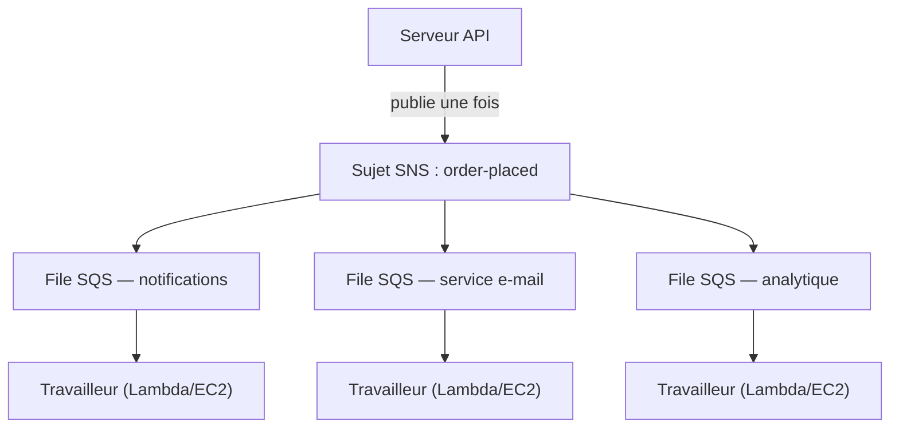

# Chapitre 19 : La machine à tickets

La machine à tickets fut une révolution silencieuse. Prenez un numéro, attendez d'être appelé. La file devint une queue. Les gens pouvaient s'asseoir. Le comptoir de service travaillait à son propre rythme. Personne ne bloquait personne.

Avant la machine à tickets, il fallait faire la queue debout. Votre position dans la file exigeait votre présence physique. Vous ne pouviez rien faire d'autre en attendant. Et si la personne en tête de file était lente, tous ceux derrière elle s'arrêtaient.

La machine à tickets a séparé l'arrivée du service. Vous arriviez, preniez un numéro, et le système retenait votre place. Vous pouviez aller vous asseoir. Le comptoir de service traitait les numéros au rythme qu'il pouvait gérer. Si le comptoir était temporairement fermé, les nouveaux arrivants obtenaient quand même des numéros. Ils attendaient. Le travail ne disparaissait pas — il se mettait en file.

Cette petite invention est l'un des plus anciens exemples de découplage dans les systèmes humains. À la fin de ce chapitre, Nimbus aura construit sa propre machine à tickets — en logiciel — et la raison pour laquelle elle en avait besoin commence par seize minutes d'indisponibilité un vendredi soir.

---

L'équipe avait survécu à la panne d'AZ. Leo avait corrigé le processus d'ingénierie du chaos, et le runbook était solide. Le trafic avait récupéré et croissait à nouveau — plus vite qu'avant, en fait. La documentation Aurora que Leo lisait tard dans la nuit avait encore quelques chapitres d'avance sur l'état réel de Nimbus.

Mais avec le trafic en croissance et de plus en plus de restaurants intégrés, un autre type de goulot d'étranglement devenait visible. Pas dans l'infrastructure. Dans le code applicatif lui-même. La chaîne de requêtes qui fonctionnait bien à 200 commandes par heure commençait à montrer des signes de tension à 800.

Et puis vint la soirée du 14.

---

Tout avait commencé avec le tableau de bord analytique. À 18 h 47 un vendredi, un déploiement vers le service d'analytique a introduit un bug de délai d'attente. Le service a commencé à répondre en 8 secondes au lieu des 200 millisecondes habituelles.

Le flux de commandes était synchrone. Chaque commande attendait le service d'analytique avant de confirmer au client. Huit secondes devinrent 12 à mesure que la charge augmentait. Le pool de connexions de l'API a commencé à se remplir de requêtes attendant que l'étape d'analytique se termine.

À 18 h 53, le pool de connexions a atteint sa limite. Les nouvelles requêtes ont commencé à échouer immédiatement — non pas parce que la commande ne pouvait pas être traitée, mais parce qu'il n'y avait aucune connexion disponible pour commencer à la traiter.

« Le service d'analytique a fait tomber le flux de commandes », dit Leo en regardant les journaux le lendemain matin. « Ils n'ont rien à voir l'un avec l'autre. Le service d'analytique ne fait que calculer des tableaux de bord. »

« Mais ils sont dans la même chaîne de requêtes », dit Priya.

« Seize minutes d'indisponibilité », dit Maya. « Et trois clients ont été facturés deux fois. »

La double facturation était pire que l'indisponibilité. Dans le chaos de la saturation du pool de connexions, un mécanisme de réessai s'était déclenché pour certaines requêtes qui avaient en réalité réussi — l'étape de paiement s'était terminée, puis la requête avait expiré avant de revenir, et le réessai avait tenté le paiement à nouveau. Même carte, même montant, deux facturations.

« Le mécanisme de réessai était censé aider », dit Leo.

« Il a aidé dans la mauvaise direction », dit Priya. « Et avons-nous réfléchi à ce qui se passe quand nous essayons de rembourser ces clients ? Le processus de remboursement utilise le même flux de commandes qui a échoué. »

Seize minutes d'indisponibilité et trois doubles facturations. C'était le coût commercial de la chaîne de requêtes synchrone.

---

Nimbus avait un problème qui ne semblait pas en être un jusqu'à ce que les commandes deviennent populaires.

Chaque fois qu'une commande était passée, le serveur API devait :

1. Sauvegarder la commande dans la base de données
2. Envoyer une notification à la tablette du restaurant
3. Envoyer un e-mail de confirmation au client
4. Mettre à jour le tableau de bord analytique du restaurant
5. Enregistrer l'événement pour la facturation

Dans un comptoir de charcuterie animé, la personne à la caisse n'attend pas que le trancheur finisse de couper avant de passer au client suivant. Elle prend la commande, la transmet à la cuisine, et commence à servir la personne suivante. La cuisine traite les commandes à son propre rythme. Le client est servi plus rapidement. La cuisine n'est pas submergée par les pics soudains. Si la cuisine a un moment lent, les commandes s'accumulent derrière le comptoir plutôt que de provoquer des erreurs à la caisse.

C'était l'analogie. Nimbus n'avait pas de comptoir et de cuisine. Il avait une seule personne faisant tout en séquence avant que le client puisse partir.

Et le 14, la personne qui tranchait la viande avait un problème. Alors le comptoir s'est arrêté. Alors tous les clients après cela ont attendu. La cuisine, la caisse, les clients — tout s'est mis en pause parce qu'une étape de la chaîne avait ralenti.

La solution n'était pas de rendre la découpe de la viande plus rapide. La solution était de séparer les étapes. Prendre la commande à la caisse, remettre un ticket, laisser la cuisine travailler.

« Nous sommes étroitement couplés », dit Priya. « Si une étape en aval échoue, toute la commande échoue. Avons-nous réfléchi à ce qui se passe si le service d'analytique est compromis et commence à consommer des messages malformés ? Toute la commande échoue — parce que nous l'attendons. »

« Et si on pouvait sauvegarder la commande et confirmer immédiatement au client », dit Leo, « et traiter le reste en arrière-plan ? »

« C'est une queue », dit Priya.

L'idée clé : le client n'a pas besoin de savoir que le tableau de bord analytique a été mis à jour avant d'obtenir sa confirmation. Il a besoin de savoir que sa commande a été reçue. Ce sont deux choses différentes. La chaîne synchrone les confondait.

**Le modèle de découplage**

C'est le **découplage** : séparer le composant qui accepte le travail des composants qui le traitent.

Toutes les étapes du flux de commandes de Nimbus devaient se passer de façon synchrone avant que l'API puisse répondre au client. Si le service e-mail était lent (parfois c'était le cas), le client attendait. Si le tableau de bord analytique était en panne (parfois c'était le cas), la commande échouait.

La cascade du 14 a démontré exactement pourquoi cela importait. Le service d'analytique n'avait rien à voir avec le fait qu'une commande client soit acceptée. Mais parce qu'il se trouvait dans la même chaîne synchrone, sa défaillance devenait la défaillance de tout le monde.

Dans les systèmes logiciels, la queue est souvent un courtier de messages — un service qui accepte les messages des producteurs et les livre aux consommateurs.

Vous vous demandez peut-être : si le flux de commandes est maintenant asynchrone, comment le client sait-il que sa commande a réellement été reçue ? La réponse est dans la conception de l'architecture : l'API sauvegarde la commande dans la base de données (synchrone — c'est la confirmation qui fait autorité), puis publie des événements dans la queue. La confirmation au client repose sur la réussite de l'écriture en base de données, pas sur l'achèvement des services en aval. Si le service e-mail est lent, le client a déjà sa confirmation. L'e-mail n'est qu'un suivi bienvenu.

**Amazon SQS : la queue**

**Amazon SQS (Simple Queue Service)** est le service de files de messages géré d'AWS. Il stocke les messages de façon durable jusqu'à ce qu'ils soient traités par un consommateur.

Le flux de base :

1. Le **producteur** (le serveur API) place un message dans la queue : `{ "orderId": "ORD-5532", "restaurantId": "47", "items": [...] }`
2. L'API répond immédiatement au client : « Commande confirmée ! »
3. Les **consommateurs** (des services de travail séparés) lisent les messages depuis la queue et les traitent : envoyer la notification au restaurant, envoyer l'e-mail de confirmation, mettre à jour l'analytique

L'expérience client : confirmation instantanée. Le traitement en aval : se passe de façon asynchrone, au rythme des travailleurs.

**Concepts clés de SQS**

**Délai de visibilité des messages** : Quand un consommateur lit un message de SQS, le message devient *invisible* pour les autres consommateurs pendant une période (par défaut : 30 secondes). Cela donne au consommateur le temps de le traiter. Si le consommateur finit avec succès, il supprime le message. Si le consommateur plante, le délai de visibilité expire et le message redevient visible pour qu'un autre consommateur le réessaie.

Cela garantit une livraison au moins une fois : chaque message sera traité au moins une fois, même si un consommateur tombe en panne en cours de traitement.

Vous vous demandez peut-être : si le message devient invisible pendant son traitement mais n'est pas supprimé quand le consommateur plante, ne pourrait-il pas être traité deux fois ? Oui — et cela s'appelle la livraison au moins une fois. Cela signifie que chaque consommateur doit être conçu pour gérer la réception du même message plusieurs fois sans causer de problème. Un e-mail de confirmation de commande en double est agaçant. Une facturation en double est un ticket de support. Concevez vos consommateurs en conséquence.

Le délai de visibilité doit être plus long que votre temps de traitement le plus long attendu. Si le traitement prend typiquement 20 secondes mais occasionnellement 90 secondes, et que votre délai de visibilité est de 30 secondes, ce traitement occasionnel de 90 secondes ressemblera à un échec pour SQS. Le message redevient visible. Un second consommateur le récupère. Maintenant deux travailleurs traitent le même message. Si votre traitement n'est pas idempotent, vous avez un problème.

Une erreur courante : régler le délai de visibilité égal au temps de traitement moyen. La bonne approche : le régler sur le temps de traitement du 99e percentile, avec une marge de sécurité. Si le temps de traitement P99 est de 45 secondes, réglez le délai de visibilité à 90 secondes.

**Files de lettres mortes (DLQ)** : Si un message échoue au traitement trop de fois (configurable — par ex., 5 réessais), SQS le déplace dans une file de lettres mortes. Vous inspectez la DLQ pour comprendre pourquoi les messages échouent sans les perdre.

La DLQ est l'endroit où vous apprenez ce qui échoue réellement en production. Sans elle, les messages échoués disparaissent simplement et vous n'avez aucun moyen d'enquêter.

Trois semaines après la migration vers SQS, Leo remarqua que 23 messages s'étaient accumulés dans la DLQ du service de notification. Il n'avait pas vérifié la DLQ (il l'avait configurée correctement puis avait supposé qu'elle resterait vide).

Il récupéra un message et regarda la charge utile :

```json
{
  "orderId": "ORD-9821",
  "restaurantId": "12",
  "customerMessage": "Extra spicy please 🌶️🔥",
  "timestamp": "2024-01-18T19:43:11Z"
}
```

L'émoji. Le service de notification du restaurant encodait les charges utiles des messages en Latin-1 avant de les envoyer à l'API tablette héritée du restaurant. Les caractères émoji — quatre octets chacun en UTF-8 — se corrompaient, ce qui faisait rejeter la requête par l'API tablette. Le message réessayait, échouait à nouveau, réessayait à nouveau, échouait à nouveau. Après 5 réessais, SQS le déplaçait dans la DLQ.

« Les 23 messages ont tous des émojis dans le champ des notes client », dit Leo.

« Donc chaque client qui a ajouté un émoji aux notes de sa commande a vu sa note échouer silencieusement à atteindre le restaurant », dit Maya.

« Oui. »

« Pendant combien de temps ? »

Leo vérifia l'horodatage du message le plus ancien. « Trois semaines. »

Priya resta silencieuse. « Et si quelqu'un découvrait qu'ajouter un émoji à une note de commande provoquait un échec silencieux ? Vous pourriez passer des commandes avec des émojis et garantir que le restaurant ne voie jamais l'instruction. Puis vous plaindre de la mauvaise commande. »

Personne n'avait exploité cela. Mais c'était la bonne question à poser.

Leo corrigea le bug d'encodage. Il écrivit ensuite un script pour rejouer les 23 messages bloqués de la DLQ. Les restaurants reçurent leurs instructions épicées avec émojis (vieilles de trois semaines). Les clients n'en surent jamais rien.

La leçon : la DLQ doit être surveillée activement, pas configurée puis oubliée. Une DLQ qui grossit est un signal silencieux que quelque chose échoue de façon répétée.

**Types de files** :

**Files standard** : Débit maximum (messages illimités par seconde). L'ordre de livraison est au mieux (non garanti). Livraison au moins une fois (très rarement, un message peut être livré deux fois).

**Files FIFO** : Ordre strict premier entré, premier sorti. **Traitement** exactement une fois — déduplication basée sur un `MessageDeduplicationId` dans une fenêtre de 5 minutes. L'ordre est garanti *par* `MessageGroupId` : les messages d'un même groupe arrivent dans l'ordre ; les groupes différents peuvent être traités en parallèle, c'est ainsi que FIFO monte en charge. Le débit de base est de 3 000 messages par seconde avec le traitement par lots (300 sans) ; activer le **mode haut débit** porte cela à des dizaines de milliers par seconde en partitionnant entre les groupes de messages. Utilisez FIFO quand l'ordre est important (transactions financières, changements d'état séquentiels).

Si vous avez besoin du débit maximum et pouvez tolérer des messages en double occasionnels, utilisez SQS Standard — mais vous devez concevoir chaque consommateur pour gérer les doublons sans causer de problèmes. Si vous avez besoin d'un ordre strict et d'un traitement exactement une fois, utilisez SQS FIFO — et concevez bien vos `MessageGroupId`, car le parallélisme (et donc le débit) provient du fait d'avoir de nombreux groupes.

Pour Nimbus, la plupart des files utilisaient des files standard. La file de facturation utilisait FIFO pour s'assurer que les charges étaient traitées dans l'ordre.

**Mise à l'échelle automatique selon la profondeur de la file : adapter les travailleurs à l'arriéré**

L'une des applications les plus puissantes de SQS consiste à utiliser la profondeur de la file comme déclencheur de mise à l'échelle automatique. Au lieu de mettre à l'échelle en fonction du CPU ou de la mémoire, vous mettez à l'échelle en fonction de la quantité de travail en attente.

Pour le service de notification de Nimbus : la profondeur de la file SQS (le nombre de messages en attente de traitement) était connectée à une politique Application Auto Scaling pour le service ECS exécutant les travailleurs de notification.

Politique : quand la file a plus de 50 messages par tâche de travailleur, ajouter une tâche. Quand la file a moins de 10 messages par tâche de travailleur, retirer une tâche.

L'effet pratique : quand 1 200 commandes arrivèrent au pic du vendredi soir, la profondeur de la file de notification a fait un pic et la flotte de travailleurs est passée de 2 tâches à 8 tâches en 3 minutes. À minuit, la file était vide et la flotte était revenue à 2.

« Combien cela coûte-t-il par mois ? » demanda Tom en regardant le graphique de mise à l'échelle automatique.

« Rien de plus pour la mise à l'échelle automatique elle-même », dit Leo. « Mais 6 tâches ECS supplémentaires pendant 3 heures les vendredis soir — c'est significatif. »

Tom calcula. « Environ 14 $/mois pour ces pics. Et avant, nous exécutions 8 tâches en continu à plein coût ? »

« Oui. »

« Donc nous payons pour la rafale quand nous en avons besoin et rien sinon. »

C'est le modèle de mise à l'échelle selon la profondeur de la file : la file devient un tampon qui absorbe les pics de trafic, et la flotte de travailleurs monte en charge pour vider le tampon. Les utilisateurs ne subissent pas de lenteur — ils ont obtenu leur confirmation immédiatement quand la commande a été acceptée. Les travailleurs prennent juste un peu plus de temps à rattraper. Et parce que vous n'exécutez pas la capacité de pic 24 h/24 et 7 j/7, les coûts sont nettement plus bas.

**Amazon SNS : le diffuseur**

**Amazon SNS (Simple Notification Service)** est un service de messages publication/abonnement (pub/sub). Au lieu d'un producteur et un consommateur (queue), SNS prend en charge la livraison d'un message à *plusieurs* abonnés simultanément.

Le modèle :

1. Un **éditeur** envoie un message à un **sujet** SNS
2. Tous les **abonnés** de ce sujet reçoivent le message simultanément (diffusion en éventail)

Les abonnés peuvent être :

- Des files SQS (pousser le message dans une queue pour un traitement asynchrone)
- Des fonctions Lambda (déclencher la fonction directement)
- Des points de terminaison HTTP/HTTPS (livraison par webhook)
- Des adresses e-mail
- Des SMS (numéros de téléphone)

Pour Nimbus, l'événement de commande passée est publié dans un sujet SNS appelé `order-events` :

- Le service de notification du restaurant s'abonne (reçoit sur sa queue SQS)
- Le service e-mail s'abonne (reçoit sur sa queue SQS)
- Le service analytique s'abonne (reçoit sur sa queue SQS)
- Le service de facturation s'abonne (reçoit sur sa queue FIFO SQS)

Un événement de commande. Quatre abonnés. Tous notifiés simultanément. Chacun traite à son propre rythme.

« Donc SNS est l'annonce », dit Maya, « et SQS est la boîte de réception où chaque équipe traite l'annonce à sa propre vitesse. Alors pourquoi utiliser les deux ? Pourquoi ne pas simplement faire abonner tout le monde directement au sujet SNS ? »

« Parce que la livraison SNS directe est du tir-et-oubli », dit Leo. « Si le service d'analytique est en panne quand SNS se déclenche, ce message est perdu. Avec une file SQS entre les deux, le message attend jusqu'à ce que le service récupère. »

« Exactement », dit Priya. « La diffusion en éventail SNS/SQS est le modèle standard. »

**Le modèle de diffusion en éventail SNS/SQS**

Cette combinaison — un sujet SNS alimentant plusieurs files SQS — est l'un des modèles architecturaux les plus importants dans AWS :



Chaque file est indépendante. Le service analytique peut être lent — sa file se remplit, mais les services de notification et d'e-mail continuent sans être affectés. Si le service analytique tombe en panne, ses messages attendent dans la file jusqu'à ce qu'il revienne. Rien n'est perdu.

C'est la propriété clé : **défaillance indépendante**. Les problèmes dans un consommateur ne se propagent pas aux autres.

**Filtrage des messages : pas chaque message pour chaque abonné**

À mesure que les systèmes grandissent, vous ne voulez pas que chaque abonné traite chaque message. Un service analytique ne devrait pas recevoir de messages sur les paiements échoués s'il ne s'intéresse qu'aux commandes complètes.

Le **filtrage de messages SNS** permet aux abonnés de spécifier des politiques de filtre — ne livrer que les messages correspondant à certains attributs.

Le service de notification du restaurant s'abonne avec un filtre : uniquement les messages où `status = "confirmed"`.

Le service d'alerte d'erreur s'abonne avec un filtre : uniquement les messages où `status = "failed"`.

Chaque abonné ne reçoit que ce dont il a besoin.

Sans filtrage, chaque abonné reçoit chaque message et doit ignorer ce qui n'est pas pertinent. Cela gaspille du traitement, gaspille de l'argent (SQS facture par message) et introduit du bruit. Un système de commandes à fort volume sans filtrage inonderait la file d'alerte d'erreur de commandes réussies — rendant les vrais échecs difficiles à trouver.

Les politiques de filtre ressemblent à :

```json
{
  "status": ["confirmed"],
  "region": ["us-west-2", "us-east-1"]
}
```

Cet abonné ne reçoit que les messages où le statut est « confirmed » ET la région est soit « us-west-2 », soit « us-east-1 ». Les messages ne correspondant pas à la politique ne sont pas du tout livrés à la file de cet abonné — ils n'atteignent même jamais SQS.

« Donc le filtrage se fait à la couche SNS », dit Priya, « avant que les messages soient écrits dans SQS ? »

« Correct. La file SQS du service de notification du restaurant ne voit jamais que les messages sur lesquels elle doit agir. »

« Et si quelqu'un essaie de s'introduire en publiant dans le sujet SNS un message spécialement conçu pour correspondre à tous les filtres d'abonnés ? » demanda Priya.

Le sujet SNS avait une politique de ressource IAM : seul le service API de commande (par son rôle IAM) était autorisé à publier. Les politiques d'accès SNS et les politiques de file SQS formaient la couche de contrôle d'accès — le filtrage ne servait qu'au routage, pas à la sécurité.

**Quand utiliser SQS vs SNS**

**SQS seul** : Un producteur, un consommateur (ou plusieurs consommateurs concurrents sur la même file). Les messages doivent être traités une fois, dans l'ordre (FIFO) ou non (standard). Modèle de file de travailleurs — une file, plusieurs travailleurs la consommant.

**SNS seul** : Notifications de type tir-et-oubli. Pousser vers e-mail, SMS ou points de terminaison HTTP. Pas besoin de mettre le message en file d'attente — juste notifier et continuer.

**SNS + SQS (diffusion en éventail)** : Un événement, plusieurs consommateurs indépendants. Chaque consommateur a sa propre file, traite indépendamment et peut tomber en panne indépendamment.

## Sujets SNS FIFO

Tout ce qui précède sur SNS utilise des sujets standard — ils ont un débit pratiquement illimité, livrent aux abonnés presque simultanément, et font le travail pour la grande majorité des cas d'usage.

Mais les sujets SNS standard ne garantissent pas l'ordre. Si vous publiez dix messages en séquence, les abonnés pourraient les recevoir dans un ordre légèrement différent. Pour les notifications de commandes Nimbus, c'est sans importance — une mise à jour analytique arrivant une fraction de seconde avant une confirmation par e-mail n'a pas d'importance.

Pour certains scénarios, cela en a. Considérez un grand livre financier : si deux événements — un crédit puis un débit — sont livrés dans l'ordre inverse, les calculs de solde pendant le traitement seront erronés même si les deux événements sont finalement traités correctement.

Les **sujets SNS FIFO** appliquent le même principe que les files SQS FIFO au modèle de diffusion en éventail. Les messages sont livrés aux abonnés dans l'ordre exact où ils ont été publiés, et chaque message est livré exactement une fois.

Le compromis : les sujets SNS FIFO ont un débit de base similaire à SQS FIFO (3 000 messages par seconde par sujet ; 300 par seconde par groupe de messages — avec un mode haut débit disponible depuis 2025 pour bien plus), et ils ne diffusent qu'aux **files SQS** — FIFO ou, depuis 2023, Standard. Abonner une file Standard est utile pour les consommateurs qui ne se soucient pas de l'ordre (un flux analytique, par exemple), mais l'ordre et l'exactement-une-fois survivent de bout en bout **uniquement** vers les files FIFO. Vous ne pouvez pas utiliser un sujet SNS FIFO pour livrer à des points de terminaison HTTP ou à des adresses e-mail.

Pour le pipeline de facturation de Nimbus — où une séquence de mises à jour de tarification devait être appliquée aux comptes des restaurants dans l'ordre — le sujet SNS de facturation a été migré de standard à FIFO. La file de facturation SQS était déjà FIFO. La diffusion en éventail garantissait désormais qu'un événement d'augmentation de prix n'arriverait jamais au processeur de facturation avant l'événement de début de période dont il dépendait.

> **Conseil d'examen — SNS FIFO**
>
> Si un scénario nécessite une **livraison en éventail ordonnée** à travers plusieurs abonnés, la réponse est **SNS FIFO**. SNS standard ne garantit pas l'ordre. SNS FIFO ne diffuse qu'aux files SQS — pour conserver l'ordre et l'exactement-une-fois de bout en bout, l'abonné doit être une file SQS **FIFO** (les abonnements de files Standard sont autorisés mais obtiennent un ordre au mieux et une livraison au moins une fois). Le débit par défaut est de 3 000/s par sujet — si le scénario décrit un volume bien plus élevé *et* un ordre strict, c'est un signal pour examiner des architectures alternatives (Kinesis, par exemple, qui est couvert dans un chapitre ultérieur).

## Quand la file héritée ne veut pas lâcher prise

Nimbus était sur le point de conclure sa plus grande acquisition à ce jour : Barato, un concurrent de livraison de nourriture avec 200 restaurants et deux ans d'avance opérationnelle. L'équipe d'ingénierie planifia un appel de planification d'intégration.

L'appel dura vingt minutes avant que Leo ne devienne silencieux.

« Leur système de traitement des commandes », dit-il. « Sur quoi tourne-t-il ? »

« ActiveMQ », dit l'ingénieur de Barato à l'autre bout. « Courtier sur site. L'application est en Java. Elle tourne depuis 2018. Tout parle AMQP. »

« AMQP », dit Leo.

« Oui. »

Il regarda le schéma d'architecture sur son écran. Nimbus utilisait SQS et SNS. SQS ne parle pas AMQP. SNS ne parle pas AMQP. L'application Barato ne parlait rien d'autre.

« La réécrire prendra six mois », dit Leo à l'équipe après l'appel. « Au minimum. »

« Nous ne pouvons pas retarder l'acquisition de six mois », dit Maya.

« Et nous ne pouvons pas exécuter un courtier ActiveMQ sur matériel nu dans AWS », ajouta Priya. « Avons-nous réfléchi à ce que cela implique du point de vue de la sécurité et de la fiabilité ? Un courtier de messages autogéré, en production, sans correctifs gérés, sans basculement automatique, connecté à notre infrastructure ? »

« Il existe une option gérée », dit Leo lentement. Il avait lu pendant qu'ils parlaient. « Amazon MQ. »

**Amazon MQ : le courtier géré**

**Amazon MQ** est un service de courtier de messages géré pour Apache ActiveMQ et RabbitMQ. Il exécute votre courtier existant — le même courtier auquel vos applications sont connectées depuis des années — mais en tant que service AWS géré. AWS gère l'infrastructure sous-jacente : provisionnement, correctifs, basculement, sauvegardes.

La propriété clé qui rend Amazon MQ différent de SQS et SNS : il parle les protocoles que parlent les courtiers de messages hérités. AMQP, STOMP, MQTT, OpenWire, NMS. Les protocoles que SQS et SNS ne comprennent tout simplement pas.

Pour l'intégration de Barato, le plan était simple. AWS exécuterait un courtier Amazon MQ configuré en ActiveMQ. L'application Java de Barato serait pointée vers le nouveau point de terminaison du courtier au lieu de celui sur site. Le changement côté application : mettre à jour un fichier de configuration avec la nouvelle chaîne de connexion. C'était tout. L'application n'avait pas besoin de savoir qu'elle parlait à un courtier cloud géré au lieu d'un serveur dans le bureau de Barato.

« Attendez », dit Maya. « Si nous allons les intégrer dans Nimbus à terme, ne devrions-nous pas simplement les migrer vers SQS dès le départ ? »

« Parce que le chemin de migration existe », dit Leo. « Et qu'il vaut la peine de le faire correctement — à terme. Mais pour l'instant, nous avons besoin de Barato opérationnel sur l'infrastructure AWS en trente jours, pas six mois. Amazon MQ fait fonctionner l'application sans changer l'application. Puis nous avons le temps de planifier la migration vers SQS comme un projet délibéré, pas comme un prérequis bâclé pour l'acquisition. »

« Combien cela coûte-t-il par mois ? » demanda Tom.

Le courtier Amazon MQ — une seule paire actif/standby pour la fiabilité — était dans la fourchette de 200 $/mois pour un courtier adapté au volume de Barato. Comparé au coût de six mois de temps de réécriture, ce n'était pas un débat.

Priya approuva le plan à une condition : l'instance Amazon MQ vivrait dans un sous-réseau privé, avec des règles de groupe de sécurité n'autorisant les connexions que depuis les serveurs d'application de Barato. Aucune exposition publique. Journalisation d'audit activée.

La migration prit douze jours. L'application Barato se connecta à Amazon MQ le treizième jour. Le quatorzième jour, elle traita sa première commande sur l'infrastructure AWS sans un seul changement de code.

---

> **Conseil d'examen — Amazon MQ**
>
> *Domaine SAA-C03 : Concevoir des architectures résilientes (Domaine 2)*
>
> L'examen distingue Amazon MQ de SQS et SNS sur un seul axe : la **compatibilité des protocoles**. Si le scénario décrit une application qui utilise déjà un courtier de messages et parle un protocole spécifique, Amazon MQ est presque certainement la réponse.
>
> Les signaux clés : **« ActiveMQ », « RabbitMQ », « AMQP », « STOMP », « MQTT », « OpenWire »**, ou toute phrase équivalant à **« sans changer le code de l'application »**. Si vous voyez ces phrases, la réponse est Amazon MQ — pas SQS, pas SNS.
>
> Si le scénario décrit une *nouvelle* application qui a besoin de découplage, ou ne mentionne pas de courtier hérité ni de protocole spécifique, utilisez SQS/SNS.
>
> Un signal de plus : « migrer un courtier de messages sur site existant vers AWS ». Si l'application doit continuer à parler le même protocole au même type de courtier, Amazon MQ est la réponse lift-and-shift.

## Points forts et limites

**Pourquoi SQS et SNS sont puissants** :

- SQS fournit une livraison de messages durable et fiable — les messages sont stockés sur plusieurs AZ
- Le découplage permet une mise à l'échelle et un déploiement indépendants des services producteur et consommateur
- Les files de lettres mortes garantissent qu'aucun message n'est silencieusement perdu en cas d'échec
- Le modèle de diffusion en éventail SNS permet d'ajouter de nouveaux consommateurs sans modifier le producteur

**Là où ça se complique** :

- La livraison au moins une fois signifie que les consommateurs doivent être *idempotents* — traiter le même message deux fois ne devrait pas poser de problème (commandes en double, charges en double)
- Les files FIFO sont plus chères et ont des limites de débit
- Le débogage des messages échoués à travers plusieurs files et services nécessite une bonne journalisation et observabilité
- Les garanties d'ordre des messages sont limitées — si un ordre strict est important entre plusieurs services, la conception se complique

**Idempotence : une plongée pratique**

L'idempotence semble abstraite jusqu'à ce que vous ayez eu trois clients facturés deux fois.

Une opération est **idempotente** si l'exécuter plusieurs fois produit le même résultat que l'exécuter une fois. Une opération de facturation n'est pas naturellement idempotente : l'exécuter deux fois facture deux fois. Une opération de facturation idempotente vérifie si la facturation a déjà été traitée avant de la tenter.

Le modèle : chaque message porte un ID unique (l'ID de commande, ou un ID de message séparé). Avant de traiter, le consommateur vérifie un magasin (DynamoDB convient bien pour cela) pour voir si cet ID de message a déjà été traité avec succès. Si oui : ne rien faire, supprimer le message. Si non : traiter, enregistrer l'ID, supprimer le message.

```python
def process_charge(message):
    order_id = message['orderId']
    
    # Vérification d'idempotence
    if already_processed(order_id):
        logger.info(f"Order {order_id} already charged, skipping duplicate")
        return  # Le message sera supprimé de la file
    
    # Traiter la facturation
    charge_result = payment_service.charge(
        amount=message['amount'],
        card_token=message['cardToken'],
        idempotency_key=order_id  # Transmettre aussi au processeur de paiement
    )
    
    # Enregistrer que nous avons traité ceci
    mark_as_processed(order_id, charge_result)
```

La clé d'idempotence devrait aussi être transmise aux services en aval (processeurs de paiement, systèmes d'e-mail) qui la prennent en charge. Stripe, par exemple, accepte un en-tête `Idempotency-Key` qui empêche les facturations en double même si le même appel API est effectué deux fois.

« Et à propos des ID de corrélation ? » demanda Priya. « Quand un message traverse plusieurs services, comment retraçons-nous quelle requête a causé quelle action en aval ? »

**ID de corrélation : tracer à travers les services**

Quand un client passe une commande, la requête circule à travers : API → SNS → SQS → travailleur de notification → API tablette du restaurant → SQS → travailleur e-mail → SES.

Sans ID de corrélation, si l'API tablette du restaurant renvoie une erreur à l'étape 6, les journaux de chaque service montrent l'événement, mais il n'y a aucun moyen de le retracer jusqu'à la commande du client spécifique depuis le début.

Un **ID de corrélation** est un identifiant unique attaché à la requête originale et transmis à travers chaque interaction de service. Chaque service inclut l'ID de corrélation dans ses journaux.

Quand Priya cherche un ID de corrélation spécifique dans CloudWatch, elle obtient chaque ligne de journal — à travers chaque service — qui faisait partie du traitement de cette commande unique.

« Une mise en garde », dit Priya. « Les ID de corrélation viennent de l'extérieur. Quelqu'un pourrait-il injecter un ID malveillant et perturber notre journalisation ? »

Les ID de corrélation sont internes — ils n'affectent pas la logique de traitement, seulement la journalisation. Les assainir (alphanumériques, longueur fixe) empêche les attaques par injection dans les sorties de journaux.

**Quand le découplage est le mauvais choix**

« Attends — mais *pourquoi* ne découplerions-nous pas tout ? » demanda Maya.

C'était une question légitime. Si le découplage empêche les défaillances en cascade et rend les systèmes résilients, pourquoi ne pas l'appliquer partout ?

Parce que le découplage a des coûts. Et il y a des scénarios où ces coûts l'emportent sur les bénéfices.

**Quand vous avez besoin d'une cohérence immédiate** : Si un paiement doit être confirmé avant qu'une commande puisse continuer — et que l'utilisateur attend le résultat à l'écran — vous ne pouvez pas mettre le paiement dans une file asynchrone et renvoyer une confirmation avant de savoir si la facturation a réussi. L'utilisateur pourrait commander deux fois avant que la première facturation se termine. Le découplage asynchrone ne fonctionne pas pour les opérations où la réponse dépend du résultat.

**Quand le flux de travail est intrinsèquement séquentiel** : Si l'étape 3 doit voir le résultat de l'étape 2 pour prendre une décision, elles ne peuvent pas s'exécuter en parallèle depuis une file. Les forcer dans une file crée un mécanisme maladroit de transmission de résultats qui finit souvent par être plus complexe que la version synchrone.

**Quand l'ordre des messages est critique et le volume faible** : SQS Standard ne garantit pas l'ordre. SQS FIFO le fait, mais plafonne à 3 000 messages/seconde avec le traitement par lots par défaut (le mode haut débit augmente cela considérablement). Si vous avez un flux de travail à faible volume et strictement ordonné, une simple file synchrone (comme un verrou de ligne de base de données) pourrait être plus simple et plus fiable.

**Quand la surcharge dépasse le bénéfice** : Un petit outil interne avec un seul utilisateur et sans SLA n'a probablement pas besoin de sujets SNS en éventail et de DLQ. La surcharge opérationnelle de la surveillance des files et des DLQ est réelle. Dimensionnez l'architecture au problème.

La question n'est pas « devrais-je découpler ceci ? ». C'est « quel est le coût de ce couplage, et le découplage réduit-il ce coût plus qu'il n'en ajoute ? »

## Résumé

Le découplage est le principe de résilience du chapitre 18 appliqué à l'architecture interne : de la même manière que Multi-AZ élimine les points de défaillance uniques dans l'infrastructure, SQS et SNS éliminent les points de défaillance uniques dans les chaînes de requêtes.

- Le **découplage** sépare les composants qui produisent le travail des composants qui le traitent.
- **SQS** donne aux producteurs un endroit durable où déposer le travail quand les consommateurs sont lents, hors ligne ou en train de monter en charge.
- **SNS** permet à un événement d'atteindre plusieurs consommateurs indépendants sans que l'éditeur sache qui ils sont.
- La **diffusion en éventail SNS + SQS** permet à chaque service en aval de traiter le même événement à son propre rythme.
- Les **DLQ, l'idempotence et les ID de corrélation** sont la discipline opérationnelle qui rend les systèmes asynchrones débogables au lieu de mystérieux.
- **Ne découplez pas aveuglément** : les flux de travail synchrones, les exigences de cohérence immédiate et les petits outils à faible risque peuvent ne pas justifier la surface opérationnelle ajoutée.

## Conseils pour l'examen

*Domaine SAA-C03 : Concevoir des architectures résilientes (Domaine 2, Tâche 2.1)*

- **SQS Standard vs FIFO** : L'examen distingue par les garanties d'ordre et de livraison. « Doit traiter dans l'ordre » → FIFO. « Débit maximum » → Standard.
- **Mise à l'échelle automatique selon la profondeur de la file** : « Mettre à l'échelle les travailleurs selon la profondeur de la file » → métrique SQS (ApproximateNumberOfMessagesVisible) utilisée avec Application Auto Scaling ou ECS Service Auto Scaling.
- **Délai de visibilité** : Concept clé pour la livraison au moins une fois. Si un consommateur tombe en panne, le message redevient visible après le délai. Scénario d'examen : « les messages sont traités deux fois » → le délai de visibilité est trop court (le consommateur prend plus de temps que le délai pour traiter).
- **File de lettres mortes** : Les messages qui échouent après N réessais sont déplacés ici. Scénario d'examen : « s'assurer qu'aucun message n'est perdu, même si le traitement échoue à plusieurs reprises » → DLQ.
- **Diffusion en éventail SNS** : Modèle d'examen classique pour un événement déclenchant plusieurs consommateurs. « La notification de commande passée doit déclencher simultanément l'e-mail, le SMS et la mise à jour du stock » → Sujet SNS avec abonnements SQS.
- **SQS + Lambda** : Lambda peut être configuré pour sonder une file SQS et se déclencher sur chaque lot de messages. L'examen l'utilise pour le traitement piloté par les événements à grande échelle.
- **Sondage long SQS** : Au lieu que les consommateurs sondent toutes les quelques secondes (sondage court, gaspille des appels API), le sondage long attend jusqu'à 20 secondes pour un message. Réduit les coûts et les fausses réponses vides.
- **Bibliothèque client étendue SQS** : Pour les messages plus grands que la limite de charge utile de la file (256 Ko par défaut ; relevable à 1 Mo depuis 2025), utilisez la bibliothèque client étendue SQS, qui stocke le corps du message dans S3 et envoie une référence via SQS. L'examen traite encore 256 Ko comme la limite SQS — « message SQS trop grand » → bibliothèque client étendue + S3.
- **Filtrage de messages SNS** : Les abonnés ne reçoivent que les messages correspondant à leur politique de filtre. Scénario d'examen : « n'envoyer à un abonné que les notifications correspondant à des critères spécifiques » → filtrage de messages SNS.
- **Remarque** : La diffusion en éventail SNS/SQS apparaît aussi dans les scénarios du Domaine 3 sur les architectures de traitement asynchrone à fort débit. Connaissez le modèle pour les questions de résilience et de performance.
- **Signaux Amazon MQ** : « ActiveMQ », « RabbitMQ », « AMQP », « STOMP », « MQTT », « OpenWire », ou « sans changer le code de l'application » → Amazon MQ, PAS SQS. Si le scénario dit nouvelle application qui a besoin de découplage → SQS/SNS.
- **SNS FIFO vs Standard** : SNS standard ne garantit pas l'ordre. Si le scénario nécessite une **diffusion en éventail ordonnée** → sujet SNS FIFO alimentant des files SQS FIFO. Rappelez-vous : SNS FIFO ne peut pas livrer à des points de terminaison HTTP ni par e-mail — uniquement aux files SQS (FIFO pour l'ordre/exactement-une-fois ; les abonnements Standard fonctionnent mais sont rétrogradés à un ordre au mieux et une livraison au moins une fois).

## Exercices

**Exercice 1 — Mémorisation**

Expliquez le modèle de diffusion en éventail SNS/SQS. Pourquoi le modèle utilise-t-il des files SQS au lieu d'avoir des services s'abonner directement au sujet SNS avec des points de terminaison HTTP ?

*(Indice : Pensez à ce qui se passe si l'un des points de terminaison HTTP est en panne quand SNS publie un message.)*

**Exercice 2 — Scénario SAA-C03**

*Scénario* : Une plateforme de commerce électronique traite 10 000 commandes par heure. Quand une commande est passée, le système doit : (1) stocker la commande dans la base de données, (2) déduire l'inventaire, (3) envoyer un e-mail de confirmation et (4) mettre à jour le tableau de bord analytique. Actuellement, les quatre étapes se passent de façon synchrone — si le service analytique est lent, les clients attendent. L'équipe veut améliorer le temps de réponse côté client tout en s'assurant qu'aucune commande n'est perdue.

Quelle architecture répond LE MIEUX à cette exigence ?

A) Utiliser des files SQS FIFO pour traiter les quatre étapes en séquence  
B) Faire sauvegarder la commande par l'API et confirmer immédiatement au client ; publier un événement dans un sujet SNS ; faire abonner les services d'inventaire, d'e-mail et d'analytique via des files SQS  
C) Utiliser des instances EC2 parallèles pour traiter chaque étape simultanément, de façon synchrone  
D) Utiliser une API Gateway avec validation des requêtes pour accélérer le traitement des commandes

**Indice 1** : La confirmation au client doit être immédiate. Quelles étapes doivent se passer avant la réponse, et lesquelles peuvent se passer après ?

**Indice 2** : La lenteur du service analytique ne devrait pas affecter les services e-mail ou d'inventaire.

**Indice 3** : La diffusion en éventail SNS permet aux trois services en aval de recevoir l'événement simultanément.

**Réponse** : B

**Explication** : L'API sauvegarde la commande dans la base de données (synchrone — doit être fait avant de confirmer) et renvoie immédiatement une confirmation. Elle publie ensuite un événement `order-placed` dans un sujet SNS. Les services d'inventaire, d'e-mail et d'analytique s'abonnent chacun via des files SQS indépendantes. Ils traitent à leur propre rythme — si l'analytique est lente, sa file grossit mais les autres services ne sont pas affectés. Si un service tombe en panne, ses messages restent dans la file SQS et sont réessayés ; après le nombre configuré d'échecs de réessai, ils sont déplacés dans la DLQ.

**Pourquoi pas A ?** Les files FIFO traitent les messages en séquence — cela ne résout pas le ralentissement synchrone. De plus, le traitement séquentiel signifie que la lenteur de l'analytique bloque encore l'e-mail.

**Pourquoi pas C ?** Les « instances EC2 parallèles traitant de façon synchrone » nécessitent quand même que toutes les étapes soient complètes avant de répondre au client. Ajouter des instances ne résout pas le couplage synchrone.

**Pourquoi pas D ?** API Gateway accélère le routage et la validation des API, mais ne découple pas les étapes de traitement en aval.

*Domaine SAA-C03 : Concevoir des architectures résilientes — Tâche 2.1*

**Exercice 3 — Défi architectural** *(Facultatif)*

Nimbus construit un système de notification pour les partenaires restaurants. Quand un client passe une commande, le restaurant doit être notifié via :

- Leur application tablette (notification push)
- Un système d'affichage cuisine (webhook HTTP vers leur matériel local)
- Un SMS de secours (si la notification tablette échoue)

Le service de notification tablette est fiable. Le webhook cuisine est parfois en panne (les restaurants éteignent leur matériel à la fermeture). Le SMS ne doit se déclencher que si la notification tablette échoue.

Concevez l'architecture en utilisant SNS et SQS. Comment géreriez-vous l'exigence « SMS uniquement si tablette échoue » ? Comment vous assureriez-vous que le webhook cuisine ne bloque pas la notification tablette quand il est hors ligne ?

Considérez aussi : quel délai de visibilité est approprié pour la livraison du webhook cuisine si le temps de réponse moyen du webhook est de 2 secondes mais que les restaurants avec du matériel lent peuvent prendre jusqu'à 30 secondes ? Quelle politique de DLQ déclencherait le SMS de secours une fois les réessais du webhook épuisés ?

*(Il n'y a pas de réponse unique correcte. L'objectif est de pratiquer la conception de diffusion en éventail avec routage conditionnel.)*

## Scène post-générique

Le nouveau flux de commandes était en ligne.

Leo l'avait déployé un mardi après-midi sans avoir d'abord exécuté un test de charge complet. « Ça ira », avait-il dit à Priya. « L'architecture est solide. »

Les clients passaient des commandes. L'API répondait en 95 millisecondes. La confirmation apparaissait instantanément sur leurs téléphones.

En coulisses : quatre services traitant de façon asynchrone. Le service analytique avait un bug qui le faisait planter sur les commandes contenant certains caractères spéciaux dans le nom de l'article. Sa file s'est accumulée jusqu'à 3 200 messages en deux heures.

Les clients ne l'ont jamais remarqué.

Quand Leo a corrigé le bug et que le service analytique a redémarré, il a traité l'arriéré en 18 minutes. Aucune donnée n'a été perdue. La DLQ était vide.

Il rafraîchit le tableau de bord CloudWatch. Profondeur de la file : 0. Messages traités : 3 200. Erreurs : 0 (après la correction).

« C'est exactement à quoi le 14 aurait ressemblé », dit-il. « L'analytique avait un problème. La file l'a absorbé. Tout le reste a continué à fonctionner. »

« C'est ce que signifie le découplage », dit Priya.

« Combien cela coûte-t-il par mois ? » demanda Tom, déjà sur la page de tarification.

« À notre volume actuel, environ douze dollars par mois pour SQS. » Il fixa l'écran. « Je m'attendais à plus. »

Il avait l'air de quelqu'un qui découvre que quelque chose d'inattendu bon marché est aussi inattendu bon.

« Configure les alertes de DLQ », rappela Priya à Leo. « Nous ne voulons pas trois autres semaines d'échecs silencieux. »

« Déjà fait », dit Leo.

Il l'avait fait cette fois.

Dans le prochain chapitre : la fonction qui ne s'exécute que quand quelqu'un frappe — et qui ne coûte rien quand ils ne le font pas.
