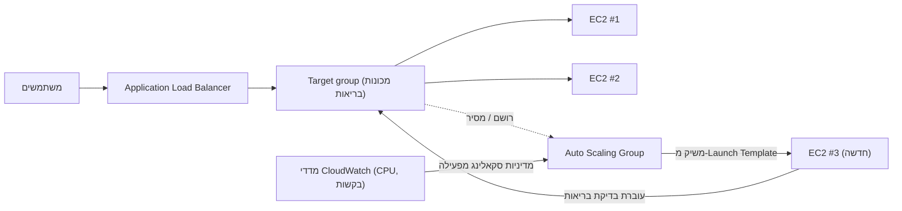

# פרק 7: המסעדה שגדלה כשהיא מתעמסת

הייתה 7:43 בערב ביום שישי.

כיסאו של Tom נדחף מעט אחורה, כפי שקרה כשהוא בהה במשהו עם הסוג של מיקוד שאומר שהוא לא יענה אם תדבר אליו. המשרד התרוקן לפני שעה. הוא נשאר.

הייתה לו לשונית פתוחה ללוח המחוונים של המדדים שרענן כפי שאנשים אחרים בדקו מדיה חברתית — בצורה רפלקסיבית, כל הזמן, מבלי לכוון בדיוק.

משבר האחסון היה מאחוריהם. למסד הנתונים היה דיסק משלו. התמונות חיו ב-S3. שבועיים, המערכת הייתה יציבה — לא מרגשת, רק יציבה. זה היה אמור להרגיש טוב.

ואז אחוז השגיאות חצה 12%.

"Leo," אמר Tom.

Leo כבר הסתכל. זמני תגובה: עולים. בקשות בתור: עולות. מכונת ה-EC2 הבודדת — גם לאחר תרגיל קביעת הגודל הנכון מהחודש שעבר — הייתה על 94% CPU.

"אנחנו מסובבים לקוחות," אמר Tom.

"אנחנו לא מסובבים אותם," אמר Leo. "השרת מסובב אותם."

"זה אותו דבר."

זה היה. וזה קרה כל יום שישי שלושה שבועות. Nimbus שרדה את משבר האחסון — למסד הנתונים היה דיסק משלו, התמונות חיו ב-S3 — אבל יציב ומדרגי הן בעיות שונות לחלוטין. המערכת עבדה. היא פשוט לא גדלה.

הגיעה הודעת Slack מMaya: *לוח המחוונים אומר שההזמנות ירדו 40% לעומת יום שישי שעבר. מה קורה?*

Tom ענה: *השרת בקיבולת מלאה. עובדים על זה.*

עברו שלוש דקות.

Maya: *יש לנו בעל מסעדה שמתקשר לקו התמיכה ואומר שהאפליקציה שבורה.*

Leo שם ידיים על המקלדת. הוא שינה גודל את המכונה — הגרסה הידנית של התיקון, זו שדרשה עצירת השרת ושינוי סוג המכונה. מה שאומר השבתה.

"כמה זמן ייקח האתחול?" שאל Tom.

"שבע דקות," אמר Leo.

"נהיה עוד שבע דקות בהשבתה בליל שישי," אמר Tom. הוא לא שאל. הוא כתב הודעת Slack למaya. היא ענתה בתו אחד: *בסדר*

האתחול הושלם. המכונה חזרה לאוויר. ה-CPU ירד ל-60%. אחוז השגיאות ירד. Tom צפה במדדים חמש-עשרה דקות ללא דיבור.

בשעה 9:15, התנועה פחתה. המשבר היה מאחוריהם.

Leo הסתכל על ידיו, שרעדו מעט בשעה 8 בערב ולא עוד.

"אנחנו לא יכולים לעשות זאת כל יום שישי," אמר.

"לא," אמר Tom. "אנחנו לא יכולים."

הצוות היה צריך שהמערכת שלהם תטפל בעומס משתנה אוטומטית. לא לקנות מספיק
שרת למקרה הכי גרוע ולבזבז כסף בזמנים שקטים. ולא להיאבק
ידנית כשמגיעות קפיצות תנועה.

יש דפוס לזה. ל-AWS יש שני שירותים שמיישמים אותו.

**הרעיון: סקאלינג אופקי**

יש שתי דרכים לגרום למערכת לטפל בעומס גדול יותר.

**סקאלינג אנכי** אומר להפוך את השרת הבודד לגדול יותר. יותר CPU. יותר RAM.
עשינו זאת בפרק 4 כשעדכנו מ-`t3.micro` ל-`t3.large`. זה עוזר.
אבל יש לו גבולות: ניתן לגדול רק עד כדי כך, המכונה חייבת להפעיל מחדש כדי לשנות גודל,
ועדיין יש לכם נקודת כשל יחידה.

**סקאלינג אופקי** אומר להוסיף יותר שרתים. במקום שרת גדול אחד, הריצו
חמישה שרתים בינוניים. כשהתנועה יורדת, הריצו שניים. כשהיא מזנקת, הריצו עשרה.

לסקאלינג אופקי יש יתרונות שלאנכי אין:

- אין נקודת כשל יחידה. אם שרת אחד מת, האחרים ממשיכים לשרת.
- לא נדרשת הפעלה מחדש להוספת קיבולת.
- שלמו רק על מה שמשתמשים — הוסיפו שרתים כשצריכים, הסירו כשלא.
- סקאלינג לינארי: פי שניים שרתים, בערך פי שניים התפוקה.

יש גם ממד אמינות שסקאלינג אנכי לא מסוגל להתאים לו. כשיש לכם
חמישה שרתים ואחד נכשל, הקיבולת שלכם יורדת ל-80% — מספיק כדי להמשיך לשרת תנועה
בזמן שהמכונה הכושלת מוחלפת. כשיש לכם שרת אחד והוא נכשל, הקיבולת
יורדת ל-0%. העודפות טבועה בסקאלינג האופקי בדרך שסקאלינג אנכי
לא יכול לספק בשום גודל.

זה חשוב גם לתחזוקה. כשתיקון אבטחה דורש הפעלה מחדש של שרת,
סקאלינג אופקי מאפשר להפעיל מחדש מכונות אחת-אחת — הפעלות מחדש מתגלגלות שמשמרות
רציפות שירות. שרת גדול יחיד דורש קבלת השבתה במהלך ההפעלה מחדש
או יישום מורכבות פריסה בכחול/ירוק.

המלכוד: אם יש לכם מספר שרתים, כיצד המשתמשים יודעים עם מי לדבר?

ויש אילוץ עיצוב שסקאלינג אופקי מטיל: היישום שלכם
חייב להיות מסוגל לרוץ על מספר שרתים זהים בו-זמנית מבלי שהשרתים
יפריעו אחד לשני. זוהי דרישת **חסר-מצב** — כל בקשה
חייבת להיות עצמאית, ללא תלות במצב המאוחסן על שרת ספציפי. נראה
בדיוק מדוע זה חשוב כשנתקל בבעיית הסשנים הדביקים.

**Application Load Balancer: דלת אחת, חדרים רבים**

חשבו על מסעדה גדולה עם עמדת מארח בדלת. סועדים מגיעים והמארח
מנחה אותם לשולחן זמין. המארח יודע אילו שולחנות עמוסים ואילו
פנויים. הסועדים לא צריכים לדעת כמה שולחנות יש — הם פשוט נכנסים והמארח
מטפל בחלוקה.

**Application Load Balancer** (ALB) עושה זאת עם בקשות אינטרנט.

משתמשים מתחברים ל-load balancer. ה-load balancer מפזר בקשות נכנסות
על פני ה-fleet של מכונות EC2 שלכם. כל משתמש רואה כתובת אחת (ה-URL של load balancer).
מאחורי הכתובת הזו, בקשות מפוזרות על פני כמה שרתים שפועלים.

ה-ALB עצמו רץ על תשתית מנוהלת של AWS, מפוזרת על פני AZs מרובים
באזורכם. הוא אינו שרת בודד — הוא שירות מנוהל ומפוזר.
כשמפעילים cross-zone load balancing (ברירת המחדל ל-ALBs), כל צומת ALB
מפזר בקשות באופן שווה על פני כל ה-targets הרשומים ללא קשר לאיזה AZ
הם נמצאים. זה מונע את מצב הכשל הנפוץ שבו ל-AZ אחד יש פי שניים
מכונות בריאות מ-AZ אחר, מה שמוביל לעומס לא שווה.

הוא מקבל כל בקשת HTTP נכנסת ומחליט איזה מכונת EC2 (הנקראת
**target**) צריכה לטפל בה, בהתבסס על גורמים כמו:

- Round-robin (לכל שרת תורות בסיבוב)
- הכי פחות בקשות ממתינות (השרת עם הכי מעט בקשות בטיפול מקבל את הבקשה הבאה)
- בריאות — רק targets בריאים מקבלים תנועה

**בדיקות בריאות** חיוניות. ה-ALB שולח בקשות בדיקה לכל target באופן קבוע.
אם target אינו מגיב כהלכה, ה-ALB מסמן אותו כלא בריא ומפסיק לשלוח
תנועה אליו. כשה-target מתאושש, התנועה חוזרת.

זה אוטומטי. אתם מגדירים את פרמטרי בדיקת הבריאות; ה-ALB אוכף אותם.

מגדירים בדיקות בריאות עם שלושה פרמטרים מרכזיים: ה-**נתיב** לבדוק (למשל, `/health`),
ה-**מרווח** (כמה לעתים קרובות לבדוק — כל 5 עד 300 שניות; ברירת מחדל 30), וה-**סף** (כמה
בדיקות הצלחה או כשלון רצופות לפני שינוי מצב הבריאות של ה-target).

מרווחי בדיקת בריאות אגרסיביים תופסים בעיות מהר יותר אבל מוסיפים יותר תנועה ל-targets.
מרווח של 30 שניות עם סף של 3 כשלונות אומר שtarget כושל מוסר מהסיבוב
תוך 90 שניות. מרווח של 10 שניות עם סף של 2 כשלונות אומר
הסרה תוך 20 שניות — במחיר יותר תנועת בדיקת בריאות.

עבור Nimbus, Priya בחרה מרווח של 30 שניות עם סף של 3 כשלונות (90 שניות
להכריז על לא-בריא) ו-2 הצלחות (60 שניות להכריז שוב על בריאות לאחר התאוששות).
זה איזן בין זיהוי מהיר של כשל לבין הימנעות מחיוביות שגויות מהפרעות רשת קצרות.

**הגדרת בדיקת בריאות: יותר מ"האם הוא חי?"**

בדיקת הבריאות הראשונה של Leo הייתה ping TCP פשוט: "האם פורט 80 מקבל חיבורים?" זו המינימום. השרת יכול לקבל חיבורים על פורט 80 בזמן שמסד הנתונים מושבת, בזמן שהיישום נמצא בלולאת שגיאה, בזמן שהדיסק מלא.

ל-Priya הייתה תפיסה שונה של מה שאמור לאמר "בריא".

"האם חשבנו על מה שקורה אם בדיקת הבריאות עוברת אבל היישום שבור?" היא שאלה. "שרת שיכול לקבל חיבורים אבל לא מסוגל לשאול את מסד הנתונים אינו בריא. הוא רק מגיב."

Leo בנה endpoint של `/health` בקוד היישום. ה-endpoint עשה שלושה דברים:
1. אישר שתהליך היישום רץ
2. ביצע שאילתת בדיקה למסד הנתונים (`SELECT 1` פשוט)
3. אישר שחיבור S3 נגיש

אם כל שלושתם עברו, ה-endpoint החזיר HTTP 200. אם אחד נכשל, הוא החזיר HTTP 503.

בדיקת הבריאות של ה-ALB הוגדרה לקרוא ל-endpoint הזה כל 30 שניות. אם קיבלה שלוש תגובות 503 רצופות, המכונה סומנה כלא בריאה והוסרה מהסיבוב.

"זה אומר שאם מסד הנתונים יורד," אמרה Priya, "בדיקת הבריאות תתפוס זאת ותסיר את השרתים המושפעים מה-load balancer תוך 90 שניות."

"גם אם השרתים עצמם עדיין רצים," אמר Tom.

"גם אם הם נראים בסדר מבחוץ."

ה-ALB, המכוון לבדיקת בריאות אמיתית של יישום, הפך לגלאי אמין הרבה יותר של בעיות אמיתיות — לא רק חיות שרתים.

**Auto Scaling: המסעדה שפותחת יותר שולחנות**

ALB מפזר תנועה על פני השרתים הקיימים שלכם. אבל הוא לא מוסיף שרתים
כשאתם צריכים יותר.

**Auto Scaling** עושה זאת.

**Auto Scaling Group** (ASG) הוא הגדרה שאומרת ל-AWS:

- המספר המינימלי של מכונות להמשיך לפעול תמיד
- המספר המקסימלי של מכונות המותרות
- התנאים שבהם לבצע scale out (הוסיפו מכונות) או scale in (הסירו אותן)

תנאי הסקאלינג נקראים **מדיניות**. ארבעת הסוגים הנפוצים ביותר:

**Target tracking**: "שמרו ניצול CPU ממוצע על 70%." כשממוצע ה-CPU עולה על
70%, AWS משיק מכונות חדשות. כשהוא יורד, מכונות מסיימות.
זוהי המדיניות הפשוטה ביותר והמומלצת ביותר לרוב עומסי העבודה — קבעו מטרה
מדדית ותנו ל-AWS להחליט כמה מכונות דרושות. המטרה יכולה להיות ניצול CPU,
ספירת בקשות לtarget, או כל מדד CloudWatch מותאם אישית.

**Step scaling**: הגדירו סף ספציפי עם תגובות ספציפיות. "כשה-CPU
עולה על 60%, הוסף מכונה 1. כשה-CPU עולה על 80%, הוסף 3 מכונות. כשה-CPU יורד
מתחת ל-30%, הסר מכונה 1." שליטה גרנולרית יותר מ-target tracking, אבל
דורשת יותר הגדרה וכוונון שוטף.

**Scheduled scaling**: "בשעה 6:45 בערב כל יום שישי, ודא שלפחות 4 מכונות
רצות." זהו סקאלינג יזום לאירועים צפויים. הוא עובד יחד עם
סקאלינג ריאקטיבי — הפעולה המתוזמנת קובעת רצפה, ו-target tracking מוסיף
מכונות מעל לרצפה לפי הצורך.

**Predictive scaling**: גרסת הלמידת-מכונה של אותו רעיון. במקום שתכתבו את לוח הזמנים, Auto Scaling מנתח עד שבועיים של עומס היסטורי וחוזה 48 שעות קדימה, משיק קיבולת *לפני* הגידול הצפוי. לתנועה מחזורית — פיק ארוחת ערב כל יום שישי, פתיחת שוק כל יום חול — predictive scaling מגלה את הדפוס ומחמם מראש אוטומטית, וממשיך להתאים ככל שהדפוס משתנה. סיגנל בחינה: "קפיצות תנועה מחזוריות/חוזרות; מכונות חייבות להיות מוכנות *לפני* הקפיצה" ← predictive scaling. (Scheduled scaling היא התשובה הידנית; predictive היא הנלמדת. שתיהן עוקפות סקאלינג-ריאקטיבי-בלבד, שתמיד מגיע מאחר לקפיצה בזמן אתחול המכונה.)

עבור Nimbus, השילוב היה: target tracking לסקאלינג ריאקטיבי (שמרו CPU
על 65%), בנוסף לפעולת scheduled scaling כל יום שישי בשעה 6:45 בערב להחמים מראש 2
מכונות נוספות לפני פיק ארוחת הערב.

זה אוטומטי. אין צורך שמישהו יצפה במדדים. אין צורך שמישהו יפעיל
שרתים ידנית. המערכת מגיבה לעומס בזמן אמת.

Priya צפתה בזה קורה בשידור חי בזמן פיק של יום שישי בפעם הראשונה. ספירת
השרתים עלתה מ-2 ל-5 במשך חמש-עשרה דקות, אחר כך חזרה ל-2 לאחר הפיק.

"זה," היא אמרה, "מרשים באמת."

Tom הסתכל על גרף העלויות במקום. החשבון עלה במהלך הפיק וירד
אחרי. "שילמנו רק על מה שהשתמשנו," אמר, באותה מידה מרשים. "כמה זה עולה לחודש, בממוצע על פני שבוע רגיל?"

Leo פתח את המחשבון. פיקי יום שישי הוסיפו אולי 15% לחשבון החודשי. ללא Auto Scaling, הייתם צריכים להקצות לפיק כל השבוע. ההבדל: בערך $120/חודש מבוזבז על קיבולת שיא סרק, לעומת $0 מבוזבז עם Auto Scaling שמוגדר כהלכה.

יש עדינות אחת ב-scale-in שצוותים לעתים קרובות מפספסים: **הגנת scale-in**. ניתן
להגדיר מכונות ספציפיות ב-ASG להיות מוגנות מ-scale-in — כלומר הן לא
יסיימו במהלך אירועי scale-in אוטומטיים. זה שימושי למכונות שנמצאות
באמצע עיבוד עבודה ארוכת-ריצה שאתם לא רוצים להפריע לה. קוד
יישום יכול גם להגדיר הגנת מכונה באופן תכנותי כשהוא מתחיל עבודה ארוכה
ומסיר את ההגנה כשהעבודה מסתיימת. זה מונע מה-ASG לשלוף את השטיח
מתחת לעבודה פעילה.

**Warm Pools: לא הכל צריך להתחיל קר**

ביום שישי שבו Auto Scaling נכנס לפעולה לראשונה, Tom מדד כמה זמן לקח מ"CPU עולה על הסף" ל"מכונות חדשות משרתות תנועה".

ארבע דקות ועשרים שניות.

"זה ארבע דקות שאנחנו חסרים בקיבולת," הוא אמר.

"יכולנו להגדיל את ספירת המכונות המינימלית," אמר Leo.

"זה אומר לשלם על מכונות סרק כל השבוע," אמר Tom.

היה פתרון ביניים: **Warm Pools**.

Warm Pool הוא קבוצה של מכונות EC2 שאותחלו מראש שיושבות במצב עצור, כבר אתחלו, כבר הוגדרו, כבר עברו את סקריפט UserData. הן עשו הכל חוץ מהתחלת שירות תנועה.

כשה-Auto Scaling Group מחליט לבצע scale out, במקום להפעיל מכונה קרה חדשה מאפס (שלוקחת שלוש עד חמש דקות לאתחל, להריץ UserData, ולעבור בדיקות בריאות), הוא מפעיל מכונה מה-Warm Pool. הפעלת מכונה עצורה לוקחת בערך 30 עד 60 שניות.

עבור דפוס יום שישי של Nimbus — גל ידוע וצפוי שמתחיל בסביבות 7 בערב — Priya הגדירה Warm Pool של שתי מכונות לתחזוקה בשעות עסקים. עד 6:45 בערב, שתי מכונות חמות ישבו מוכנות, עצורות אבל מאותחלות. כשהתנועה עלתה בשעה 7 בערב וה-ASG היה צריך לבצע scale, המכונות החמות הופעלו תוך פחות מדקה והצטרפו לה-fleet.

"כמה Warm Pool עולה?" שאל Tom.

מכונת EC2 עצורה לא משלמת על מחשוב — אבל כן משלמת על אחסון EBS מחובר. שתי מכונות `t3.small` ב-Warm Pool: בערך $4/חודש בעלות אחסון. השיפור בזמן scale-out מארבע דקות לפחות מדקה שווה $4/חודש בליל שישי.

**ניתוב מבוסס-נתיב של ALB**

ככל שNimbus גדלה, Leo הוסיף רכיב שני: שירות API נפרד לניהול מסעדות. בעלי המסעדות ניגשו לשירות זה דרך אותו דומיין אבל בנתיב URL שונה: `/api/restaurant/` במקום `/`.

"רגע — אבל *למה* נעשה זאת כך?" שאלה Maya. "למה לא לתת לAPI ניהול מסעדות דומיין שונה לחלוטין?"

"יכולנו," אמר Leo. "אבל אז הינו צריכים תעודה שנייה, load balancer שני, רשומת DNS שנייה. ניתוב מבוסס-נתיב מטפל בזה עם תעודה אחת, load balancer אחד."

ה-ALB תמך בזה ביישרות. **כלל ניתוב מבוסס-נתיב** אמר ל-ALB: כשה-URL מתחיל ב-`/api/restaurant/`, נתב את הבקשה לקבוצת ה-target של ניהול המסעדות. כשה-URL מתחיל בכל דבר אחר, נתב אותה לקבוצת ה-target של יישום הלקוחות.

שני fleet נפרדים של מכונות EC2. load balancer אחד. תנועה מופנית לפי נתיב URL.

"אז נוכל לבצע scale ל-API ניהול מסעדות באופן עצמאי מהאפליקציה המיועדת ללקוחות?" שאלה Maya.

"בדיוק," אמר Leo. "אם בעלי מסעדות מבצעים הרבה עדכוני תפריט, שרתי ה-API האלה מתרחבים. אם לקוחות מזמינים הרבה, שרתים אלה מתרחבים. הם אינם משפיעים זה על זה."

Maya ישבה עם זה. "ואנחנו משלמים על ALB אחד במקום שניים."

"נכון," אמר Tom. הייתה לו מספר. "ה-ALB עולה בערך $20 לחודש בעמלות בסיס בנוסף לחיובי עיבוד נתונים. ALB אחד שמטפל בשני עומסי העבודה לעומת שניים נפרדים: חיסכון של בערך $20 לחודש. ואנחנו נמנעים מניהול תעודות ורשומות DNS מרובות."

"אבל," אמרה Priya, "אם ה-ALB עצמו יורד, שני השירותים יורדים יחד."

"AWS תכנן את ה-ALB להיות זמין ביותר על פני AZs מרובים," אמר Leo. "הסיכון לכשל ALB נמוך מאוד בהשוואה למורכבות של תחזוקת שני load balancers נפרדים."

Priya תיקה זאת תחת "פשרה מקובלת, מתועדת."

**כיצד ALB ו-ASG עובדים ביחד**

שני השירותים מתוכננים לשימוש יחד.

מכניסים את ה-ALB קדמה. ה-ALB מצביע ל-**target group** — אוסף של
מכונות שצריכות לקבל תנועה. ה-Auto Scaling Group מנהל את המכונות האלה:
מוסיף אותן ל-target group כשמבצע scale out, מסיר אותן כשמבצע scale in.

הזרימה:

1. תנועה מגיעה ל-ALB
2. ALB מפזר בקשות ל-targets בריאים
3. CPU/עומס עולה על ה-targets האלה
4. ASG מגלה את עלייה בעומס, משיק מכונות חדשות
5. מכונות חדשות עוברות בדיקות בריאות, מתרשמות עם ה-ALB
6. ALB מתחיל לשלוח תנועה אליהן
7. העומס יורד, ASG מסיים מכונות נוספות
8. ALB מפסיק לשלוח תנועה למכונות שסיימו

זה קורה ללא כל התערבות אנושית.

**Launch Templates: התכנית לאב למכונות חדשות**

כשה-ASG משיק מכונה חדשה, הוא צריך לדעת מה להשיק. זה מוגדר
ב-**Launch Template** — AMI, סוג מכונה, קבוצות האבטחה ליישם,
וכל נתוני משתמש (סקריפטי הפעלה שרצים כשהמכונה מאתחלת).

דפוס נפוץ: בונים את היישום שלכם ל-AMI מותאם אישית (ראו פרק 4).
כשה-ASG צריך מכונה חדשה, הוא משיק את ה-AMI הזה. המכונה החדשה מאתחלת עם
היישום שלכם כבר מותקן. לא נדרשת הגדרה ידנית.

לסביבות דינמיות יותר, ניתן גם להשתמש **בסקריפטי נתוני משתמש** שמושכים ומתקינים
את הגרסה העדכנית של הקוד שלכם באתחול. זה גמיש יותר אבל לוקח
יותר זמן לאתחל.

הבחירה הנכונה תלויה בכמה זמן המכונות שלכם צריכות לאתחל ובכמה לעתים קרובות
היישום שלכם משתנה.

**סשנים דביקים: בעיה עדינה**

הנה משהו שמבלבל צוותים רבים כשהם מיישמים load balancing לראשונה.

חלק מיישומי האינטרנט מאחסנים נתוני סשן — מצב כניסה, תכולת עגלת קניות — על
השרת עצמו (בזיכרון או בדיסק מקומי). זה עובד בסדר עם שרת אחד.
עם שרתים מרובים, זה שובר.

משתמש מתחבר. הבקשה הולכת לשרת A. שרת A מאחסן את הסשן. הבקשה
הבאה הולכת לשרת B. לשרת B אין סשן. המשתמש נראה מנותק.

ניתן לטפל בזה בשתי דרכים:

**סשנים דביקים** (זיקת סשן): הגדירו את ה-ALB לשלוח תמיד בקשות
מאותו משתמש לאותו שרת. זוהי תיקון לטווח קצר. הוא מחליש load balancing
(לחלק מהשרתים יש יותר משתמשים "דביקים" מאחרים) ויוצר בעיות
כשמכונה מסיימת.

Maya הסתכלה בדף הגדרת הסשנים הדביקים. "אם נצמיד משתמשים לשרתים ספציפיים, מה קורה כשאותם שרתים מסיימים במהלך scale-in?"

"הם מאבדים את הסשן שלהם," אמר Leo.

"אז סשנים דביקים הם רק דחיית הבעיה."

"נכון," אמרה Priya. "התיקון האמיתי הוא עיצוב יישום חסר-מצב."

**עיצוב יישום חסר-מצב**: אחסנו נתוני סשן חיצונית — במסד נתונים או
מטמון כמו ElastiCache (פרק 10). כל שרת יכול לשחזר את הסשן של כל משתמש
מהחנות החיצונית. השרתים הופכים להחלפיים. זהו הגישה הנכונה
ליישומים בסקאלינג אופקי.

Priya כינתה זאת "ההחלטה הארכיטקטונית החשובה ביותר שאתם מקבלים כשאתם הולכים
לשרתים מרובים." היא צודקת. נתקל בה שוב בפרק 10.

**אם סשנים דביקים — אז פחות מורכבות אבל יותר סיכון**

אם אתם משתמשים בסשנים דביקים לפתרון בעיית מצב הסשן, אז אתם מפחיתים את הצורך להגדיר אחסון סשן חיצוני בטווח הקצר — אבל כששרת דביק מסיים במהלך scale-in, כל המשתמשים הקשורים אליו מאבדים את הסשנים שלהם בבת אחת. הכשל אינו הדרגתי; הוא פתאומי ומשפיע על אשכול משתמשים בו-זמנית. אם מחצינים מצב סשן, מוסיפים תלות (ElastiCache או מסד נתונים) אבל מבטלים את מצב הכשל הפתאומי הזה. לכל יישום שמתרחב באופן קבוע, ההשקעה בעיצוב חסר-מצב משתלמת את עצמה בפעם הראשונה שAuto Scaling מסיים מכונה עם סשנים פעילים עליה.

**חישוב העלות של Tom**

השבוע הבא, Tom בנה מודל עלויות לצי ה-ALB וה-ASG.

ה-ALB: בערך $20/חודש בבסיס בנוסף לחיובי עיבוד נתונים. בנפח התנועה של Nimbus: בערך $22/חודש.

ה-Auto Scaling Group עצמו: ללא עלות נוספת. משלמים על המכונות שהוא מריץ, אבל אותן מכונות היו קיימות ממילא. ה-ASG חינם; משלמים על מחשוב.

ה-Warm Pool: בערך $4/חודש באחסון EBS לשתי מכונות עצורות.

סך עלות תשתית נוספת: בערך $26/חודש, או $312/שנה.

ואז Tom הסתכל ביומן האירועים משלושת ימי השישי לפני ש-ALB ו-ASG היו מוכנים. לכל אירוע עלה ל-Nimbus בערך 40% מהכנסות יום שישי במהלך חלון ההשבתה. הכנסות יום שישי הממוצע: בערך $2,400. 40% מ-$2,400 הם $960 לאירוע. שלושה אירועים: בערך $2,880 בהכנסות שאבדו בשלושה שבועות.

"ה-ALB וה-ASG עולים $312 לשנה," אמר Tom. "שלושה ימי שישי גרועים עלו לנו כמעט $3,000. וזה רק הפסד ההכנסות הישיר — לא כרסום הלקוחות מאנשים שהפסיקו להשתמש ב-Nimbus לאחר חוויה גרועה."

Maya קראה את המספרים. "הריצו את התשתית."

"כבר רצה," אמר Leo.

## כשALB לא מספיק: NLB ו-GWLB

Leo סקר את האינטגרציה של IoT שNimbus הוסיפה בשקט לשותפי מסעדות — חיישני טמפרטורה קטנים במקררי ה-walk-in ששלחו קריאות ל-Nimbus כל שלושים שניות, כך שמנהלי מטבח יכלו לקבל התראות אם מקרר חרג מעל טמפרטורת בטיחות.

"רגע," אמר Leo. "החיישנים האלה שולחים מנות UDP."

"זו בעיה?" שאלה Maya.

"ALB לא תומך ב-UDP," אמר Leo. "ALB מבין HTTP. זה הכל."

Priya כבר עיינה בתיעוד. "זה מה שNetwork Load Balancer מיועד לו."

**Network Load Balancer (NLB)** פועל בשכבה 4 — שכבת ה-transport. הוא מנתב מנות TCP ו-UDP. הוא לא בודק את תוכן המנות, לא מבין כותרות HTTP, לא עושה ניתוב מבוסס-נתיב. מה שהוא עושה הוא להעביר מנות מלקוחות ל-targets במהירות יוצאת דופן.

- **מיליוני בקשות לשנייה עם זמן תגובה באחד ספרה ממילישניות.** ה-ALB מעבד HTTP בשכבה 7, שאומר שהוא מנתח כותרות, מעריך כללי ניתוב, ומסיים חיבורי TLS. ה-NLB לא עושה אף אחד מאלה — הוא קרוב יותר למנהל תנועה במהירות גבוהה מאשר פרוקסי אינטרנט.
- **שומר על כתובת ה-IP המקורית של הלקוח.** כש-ALB מקבל חיבור, הוא מסיים אותו ופותח חדש אל ה-target — מכונת ה-EC2 רואה את כתובת ה-IP של ה-ALB, לא של המשתמש. ה-NLB לא עושה זאת; כתובת ה-IP המקורית של המנות מגיעה ללא שינוי אל ה-target. אם היישום שלכם צריך לדעת מאיפה מגיעות בקשות — לגיאולוקציה, הגבלת קצב, או זיהוי הונאה — וצריך שזה יהיה מדויק, NLB הוא הבחירה הנכונה. (ה-ALB מוסיף כותרת `X-Forwarded-For` שנושאת את ה-IP המקורי, אבל זה דורש מהיישום לקרוא את הכותרת; ה-NLB שם את ה-IP האמיתי ישירות במנות.)
- **כתובות IP סטטיות ו-Elastic IPs.** כתובות ה-IP של ה-ALB משתנות עם הזמן — AWS מנהל אותן והן לא קבועות. ה-NLB תומך בכתובות IP סטטיות לכל אזור זמינות, וניתן להקצות Elastic IPs לאלה. אם מערכות downstream צריכות להוסיף לרשימה לבנה כתובת IP ספציפית כדי לאפשר תנועה מ-load balancer שלכם — דרישה נפוצה בשירותים פיננסיים או ניהול מכשירי IoT — NLB היא האפשרות היחידה. ALB לא יכול לעשות זאת.
- **TLS pass-through.** ה-NLB יכול לעביר תנועת TLS מוצפנת ישירות ל-targets מבלי לפענח אותה. ה-target מסיים TLS. זה שימושי כשדרישות ציות אומרות שהפענוח חייב לקרות על מכשיר ספציפי, או כשלא רוצים לנהל תעודות TLS ב-load balancer.

"אם NLB כל כך מהיר," שאלה Maya, "למה לא להשתמש בו לכל דבר?"

"כי הוא 'טיפש'," אמר Leo. "במובן הטוב ביותר. ה-NLB לא יודע מה זה HTTP. הוא לא יכול לעשות ניתוב מבוסס-נתיב. הוא לא יכול להפנות HTTP ל-HTTPS. הוא לא יכול להוסיף כותרות אבטחה. הוא לא יכול להשתלב עם WAF. ליישום אינטרנט — כל דבר שמדבר HTTP — מודעות השכבה 7 של ה-ALB היא מה שהופך את כל התכונות האלה לאפשריות. לנתוני החיישן, שהם UDP, אין לנו ברירה."

"ולתנועת האינטרנט שלנו?"

"ALB, כמו קודם."

"כמה זה עולה לחודש?" שאל Tom. "האם NLB זול יותר?"

מודל התמחור זהה ל-ALB: חיוב שעתי בסיסי בנוסף לחיוב לכל Load Balancer Capacity Unit (LCU) בהתבסס על תנועה שעובדה. בנפחי תנועה שוות, העלות דומה. למקרה שימוש IoT של Nimbus — נתוני חיישנים בנפח נמוך — עלות ה-NLB תהיה מתחת ל-$20/חודש.

**Gateway Load Balancer (GWLB)** הוא חיה שונה לחלוטין. הוא פועל בשכבה 3 — ברמת מנות IP — והוא קיים לתכלית ספציפית אחת: הכנסת מכשירי רשת וירטואליים של צד שלישי לזרימת התנועה שלכם.

דמיינו ש-Nimbus גדלה לגודל שבו צוות האבטחה שלה דרש שכל התנועה הנכנסת ויוצאת מה-VPCים שלה תעבור דרך מכשיר חומת אש מסחרי — מכונה וירטואלית שמריצה תוכנה מספק כמו Palo Alto או Fortinet. ללא GWLB, הייתם צריכים לנתב ידנית תנועה דרך אותם מכשירים ולהבין כיצד להרחיב אותם ולשמור אותם זמינים ביותר. עם GWLB, מגדירים את המכשיר כ-target, וכל התנועה מנותבת באופן שקוף דרכו באמצעות פרוטוקול GENEVE. היישום לא יודע שהתנועה נבדקת. חומת האש לא צריכה לדעת את טופולוגיית הרשת. GWLB מטפל בניתוב, הסקאלינג, וה-failover.

לרוב יישומי האינטרנט בשלבים המוקדמים והבינוניים — Nimbus כלולה — GWLB הוא לא שירות שתגדירו. אבל לבחינה, וליום שדרישת אבטחה תדרוש בדיקה ברמת הרשת, תדעו למה הוא מיועד.

Leo הוסיף NLB לנקודת הקצה של החיישנים אותו אחר הצהריים. נתוני הטמפרטורה התחילו לזרום.

"המסעדה הראשונה מקבלת התראה שמקרר ה-walk-in שלה נמצא ב-47 מעלות," הוא אמר. "זה מעל לסף הבטיחות."

"האם הוא באמת ב-47 מעלות?" שאלה Maya.

"בעל המסעדה אישר. הם התקשרו לטכנאי תיקונים אותו אחר הצהריים."

Priya רשמה זאת ביומן ההשפעה על הלקוח של Nimbus. לא אירוע אבטחה. רק תכונת ה-IoT עובדת.

**שלושת ה-Load Balancers זה לצד זה**

AWS מציעה שלושה סוגי load balancers. ה-ALB מטפל ב-HTTP ו-HTTPS בשכבה 7 —
הוא מבין את הפרוטוקול, כך שהוא יכול לנתב בהתבסס על נתיב URL (`/api` לקבוצה אחת,
`/static` לאחרת), כותרות host, ופרמטרי שאילתה. זה מה שרוב יישומי האינטרנט משתמשים בו,
וזה מה שNimbus משתמשת בו לתנועת האינטרנט שלה.

ה-ALB גם מסיים חיבורי TLS — תעודות SSL/HTTPS מותקנות על
ה-load balancer, לא על כל מכונת EC2 בנפרד. ה-ALB מפענח את הבקשה,
בודק את כותרות ה-HTTP, מנתב בהתבסס על כללים, ו(אופציונלית) מצפין מחדש לפני
העברה ל-target. זה מפשט משמעותית את ניהול התעודות: מנהלים תעודה אחת על ה-ALB
במקום תעודה על כל מכונה.

ה-NLB, כפי שהצוות ראה עם חיישני הטמפרטורה, מטפל ב-TCP, UDP, ו-TLS
בשכבה 4 — מהירות גולמית, שמירת IP מקורי, IPs סטטיים. ה-GWLB יושב בשכבה 3 עבור
הכנסת תנועה דרך מכשירים של צד שלישי כמו חומות אש ומערכות זיהוי פריצה —
לעתים נדירות נדרש ברמת הבכיר.

עבור Nimbus (ועבור רוב יישומי האינטרנט), ALB היא הבחירה הנכונה.

אולי תוהים: אפשר להשתמש גם ב-ALB וגם ב-NLB עבור אותו יישום? כן. דפוס נפוץ הוא NLB לפני ALB — ה-NLB מטפל בסיום TCP גולמי בקצה, ה-ALB מטפל בניתוב HTTP מאחוריו. זה מוסיף מורכבות ועלות, ולא נדרש לרוב יישומי האינטרנט.

**ALB לעומת NLB לבחינה**: המבחין המרכזי הוא שכבה 7 לעומת שכבה 4. אם
תרחיש הבחינה מזכיר ניתוב מבוסס-URL, ניתוב מבוסס-host, בדיקת כותרת HTTP,
או WebSockets — זה ALB. אם הוא מזכיר TCP pass-through, שמירת IP מקורי,
מיליוני בקשות לשנייה, או זמן תגובה נמוך קיצוני לפרוטוקולים שאינם HTTP — זה
NLB. כשתרחיש פשוט אומר "load balancer ליישום אינטרנט", התשובה היא
כמעט תמיד ALB.

## חוזקות ומגבלות

**מדוע ALB + Auto Scaling חזק**:

- סקאלינג ללא השבתה (מכונות נוספות/מוסרות מבלי להפריע לחיבורים קיימים)
- failover אוטומטי (מכונות לא בריאות מוסרות מהתנועה אוטומטית)
- יעילות עלות (משלמים רק על מכונות רצות)
- אין נקודת כשל יחידה — מכונות מרובות על פני AZs מרובים

**איפה זה מסתבך**:

- יישומים עם מצב צריכים טיפול מיוחד (סשנים דביקים או מצב חיצוני)
- Scale out לוקח זמן — אם התנועה מזנקת מיד, יש פיגור לפני שמכונות חדשות
  מוכנות. מקלים עם Warm Pools לפיקים צפויים או ספירת מינימום גבוהה יותר.
- יותר חלקים נעים אומר יותר לנטר ולנפות באגים
- חלק מהיישומים לא ניתנים לסקאלינג אופקי בקלות (מסדי נתונים, מערכות legacy מסוימות). סקאלינג אופקי עובד הכי טוב לשכבות חסרות-מצב.

## סיכום

שני שירותים, דפוס אחד — והדפוס הוא מה שחשוב. ה-ALB מטפל בחלוקה; ה-ASG מטפל בגודל ה-fleet. יחד הם הופכים צי בעל-מכונה-יחידה שביר למערכת שמסוגלת לספוג תנועת ארוחת ערב של יום שישי מבלי שבן אדם יהיה ער. $312/שנה עלות תשתית לעומת שלושה ימי שישי של הכנסות שאבדו (~$2,880) הוא הסוג של מתמטיקה שTom שם בגיליון אלקטרוני ולעולם לא שוכח.

- **סקאלינג אופקי** (הוספת יותר שרתים) עדיף על סקאלינג אנכי כי הוא מבטל נקודות כשל יחידות ומאפשר עלות אלסטית. **Application Load Balancer (ALB)** מפזר תנועת HTTP/HTTPS נכנסת ומנתב רק למכונות בריאות.
- **בדיקות בריאות צריכות לבחון פונקציונליות יישום בפועל** — endpoint של `/health` שמאמת קישוריות מסד נתונים תופס כשלים אמיתיים לפני הלקוחות.
- **Auto Scaling Group (ASG)** מתאים אוטומטית את מספר מכונות EC2 בהתבסס על מדיניות סקאלינג. Target tracking הוא הסוג הנפוץ ביותר; scheduled scaling מטפל בפיקים צפויים כמו פיק ארוחת הערב של יום שישי.
- יישומים עם מצב חייבים להחצין מצב סשן במקום להסתמך על סשנים דביקים לטווח ארוך. סשנים דביקים הם תיקון לטווח קצר; החצנת מצב היא הארכיטקטורה הנכונה.
- לתנועת HTTP/HTTPS, השתמשו ב-ALB. לביצועי TCP/UDP גולמיים, השתמשו ב-NLB. ניתוב מבוסס-נתיב של ALB מאפשר ל-load balancer יחיד לשרת רכיבי יישום מרובים לפי נתיב URL.

## טיפים למבחן

*SAA-C03 דומיין 2 — משימה 2.1 (ארכיטקטורות ניתנות להרחבה) / דומיין 3 — משימה 3.2*

- **בדיקות בריאות ASG יכולות לבוא מ-EC2 או ALB.** בדיקות בריאות של EC2 מזהות רק
  אם המכונה רצה. בדיקות בריאות ALB מזהות אם היישום
  מגיב כהלכה. בדיקות בריאות ALB יסודיות יותר ויש להעדיפן
  ליישומי אינטרנט.
- **Target tracking scaling הוא התשובה הנפוצה ביותר בבחינה** למדיניות סקאלינג.
  Simple scaling (הוסף N מכונות כשהאזעקה מופעלת) ישן יותר ופחות אדפטיבי.
- **Scale-out מהיר; scale-in איטי.** AWS מסיים מכונות בהדרגה במהלך
  scale-in כדי למנוע הפרעה לחיבורים פעילים — התנהגות שנשלטת על ידי הגדרת **deregistration delay** של ה-ALB.
- **ספירת מכונות מינימלית היא רצפת העמידות שלכם.** אם תגדירו minimum = 1
  ואותה מכונה תיכשל, היישום שלכם מושבת לפני ש-ASG יכול להגיב. קבעו
  minimum ≥ 2 ופרשו על פני AZs לעמידות אמיתית.
- **ALB יכול לפזר תנועה על פני AZs אוטומטית.** עם cross-zone load
  balancing מופעל, כל צומת ALB מפזר בקשות באופן שווה על פני כל ה-targets הרשומים
  ללא קשר ל-AZ. זה חשוב לעומס מאוזן כשספירת מכונות ה-AZ שונה.
- **ניתוב מבוסס-נתיב של ALB** מופיע בתרחישי בחינה המתארים רכיבי יישום מרובים
  המשתפים load balancer יחיד. המונח הנכון הוא "כללי listener" שמנתבים בהתבסס על תנאי נתיב URL.
- **בחירת Load Balancer:** ALB = HTTP/HTTPS, שכבה 7, ניתוב לפי נתיב/כותרת, WebSockets, אינטגרציה עם WAF. NLB = TCP/UDP, שכבה 4, ביצועים קיצוניים, IPs סטטיים, שמירת IP מקורי. GWLB = שכבה 3, הכנסת חומות אש/מכשירים וירטואליים לנתיב התנועה. סיגנל בחינה: "פרוטוקול UDP" או "IP סטטי ב-load balancer" ← NLB. "הכנסת מכשיר חומת אש לזרימת תנועה" ← GWLB.

## תרגילים

**תרגיל 1 — היזכרות**

בדבריכם שלכם: מה ההבדל בין Application Load Balancer לבין
Auto Scaling Group? איזו בעיה כל אחד פותר, ומדוע בדרך כלל
משתמשים בהם יחד?

*(רמז: אחד מפזר תנועה שכבר קיימת; השני מתאים כמה
קיבולת יש לכם.)*

**תרגיל 2 — תרחיש SAA-C03**

*תרחיש*: אתר מסחר אלקטרוני של חברה קמעונאית חווה תנועה משתנה מאוד:
תנועה נמוכה בימי חול, קפיצות עצומות בסופי שבוע ובמהלך אירועי מבצע מהיר.
הם רוצים שהיישום שלהם יטפל בעומסי שיא מבלי לתחזק קיבולת שאינה בשימוש
בזמנים שקטים. כרגע היישום מאחסן נתוני סשן בזיכרון השרת.

איזה שינוי ארכיטקטורה יענה הכי טוב על דרישות הסקאלביליות שלהם?

A) שדרגו למכונת EC2 גדולה מאוד יחידה שמסוגלת לטפל בתנועת שיא  
B) פרסו מכונות EC2 מרובות מאחורי ALB עם Auto Scaling Group, והחצינו
   אחסון סשן ל-ElastiCache  
C) פרסו מכונות EC2 מרובות מאחורי ALB עם סשנים דביקים מופעלים  
D) הוסיפו ידנית מכונות EC2 לפני כל קפיצת תנועה צפויה וסיימו אותן
   אחר כך

**רמז 1**: "מבלי לתחזק קיבולת שאינה בשימוש" אומר שאתם צריכים סקאלינג אוטומטי,
לא מכונה גדולה קבועה או ניהול ידני.

**רמז 2**: אחסון הסשן בזיכרון השרת הוא בעיה לפריסות רב-מכונות. אילו אפשרויות מטפלות בזה?

**רמז 3**: אפשרות C משתמשת בסשנים דביקים — זהו עיקוף, לא תיקון.
איזו אפשרות מטפלת גם בבעיית הסקאלינג וגם בבעיית אחסון הסשן כהלכה?

**תשובה**: B

**הסבר**: ALB עם Auto Scaling Group מספק סקאלינג אוטומטי ואלסטי
— מכונות נוספות בזמן קפיצות ומוסרות בזמנים שקטים. העברת אחסון סשן ל-ElastiCache (מטמון חיצוני) הופכת את היישום לחסר-מצב: כל
מכונה יכולה לטפל בבקשה של כל משתמש, וה-ALB יכול לפזר תנועה חופשית.
זהו הפתרון הארכיטקטוני הנכון.

**מדוע לא A?** מכונה גדולה יחידה, לא משנה כמה גדולה, עדיין היא נקודת
כשל יחידה. היא גם מבזבזת כסף בזמנים שקטים כשרוב קיבולתה יושבת סרק.

**מדוע לא C?** סשנים דביקים מנתבים משתמש לאותה מכונה, מה שמקל חלקית
על בעיית הסשן אבל מחליש load balancing. אם אותה מכונה
מסיימת (במהלך scale-in או כשל), המשתמש מאבד את הסשן ממילא.

**מדוע לא D?** סקאלינג ידני דורש מישהו לחזות נכון קפיצות תנועה
ולפעול מראש. הוא איטי, רגיש לשגיאות ועתיר עבודה. Auto Scaling מטפל
בזה אוטומטית.

*SAA-C03 דומיין 2 — משימה 2.1 / דומיין 3 — משימה 3.2*

**תרגיל 3 — אתגר ארכיטקטורה** *(אופציונלי)*

ל-Nimbus יש מבצע גדול: הנחה של 50% על כל ההזמנות למשך 4 שעות
שבת הבא. בשנה שעברה, מבצע דומה גרם לתנועה פי 10 רגיל. הצוות
מצפה שהקפיצה תהיה פתאומית ותימשך בדיוק 4 שעות.

Auto Scaling ייגיב בסופו של דבר, אבל יש פיגור. כיצד הייתם מתכננים לקפיצה הידועה הזו? מה ההבדל בין סקאלינג ריאקטיבי לסקאלינג יזום, ומתי כל אחד הגיוני?

*(אין תשובה נכונה יחידה. חשבו על פעולות scheduled scaling,
חימום מראש, וההשלכות העלותיות של כל גישה.)*

## סצנה לאחר הקרדיטים

ביום שישי הראשון לאחר פריסת Auto Scaling ו-ALB, הצוות צפה
במדדים ביחד.

7:15 בערב: שתי מכונות פועלות. עומס רגיל.
7:45 בערב: העומס עולה. Auto Scaling משיק עוד שתי מכונות.
8:00 בערב: ארבע מכונות מטפלות בפיק. זמני תגובה יציבים.
9:30 בערב: העומס יורד. Auto Scaling מסיים שתי מכונות.
9:45 בערב: חזרה לשתי מכונות.

האתר לא נפל. אפילו פעם אחת.

Leo רענן את דף המדדים שלוש פעמים, כאילו ציפה למצוא כשל שהחמיץ.

"האם זה מוזר שאני מרגיש קצת מאוכזב שלא שבר כלום?" אמר.

"כן," אמרה Priya.

Tom הסתכל על החשבון. העלות עקבה אחרי התנועה כמעט בצורה מושלמת.
"שילמנו בדיוק על מה שהשתמשנו," אמר. "לא יותר. לא פחות."

נשמע מופתע באמת.

בבוקר למחרת, Maya מצאה בעיה חדשה ביומני השגיאות. לא הפסקה — גרוע יותר.

"מסד הנתונים שלנו," היא אמרה, "מחזיר זמני שאילתה של שמונה שניות בממוצע."

שמונה שניות. לאפליקציית הזמנה של מסעדה.

"בכל פעם שמישהו טוען את התפריט, אנחנו שואלים כל פריט במסד הנתונים כדי לבנות את הדף," אמר Leo. "ויש לנו ארבעים ושבע מסעדות עכשיו."

"כמה פריטי תפריט בסך הכל?" שאל Tom.

Leo הריץ את השאילתה.

"בערך עשרים ושניים אלף."

דממה.

בפרק הבא: מסד הנתונים שלא דורש DBA — רק כרטיס אשראי.
