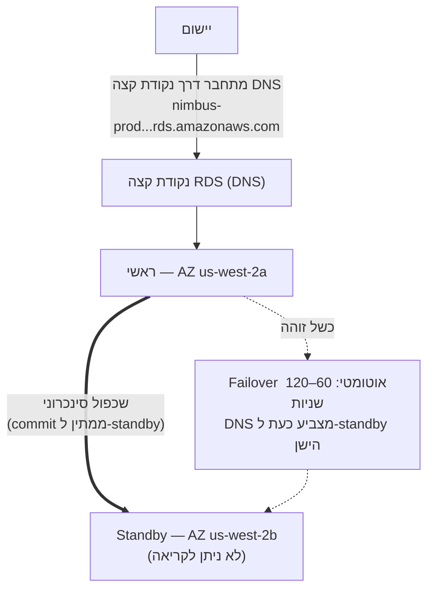

# פרק 8: מנהל מסד הנתונים שלא חולה אף פעם

הייתה שעה 3 לפנות בוקר כשהתראה הגיעה.

Priya הייתה היחידה שהייתה ערה. הטלפון שלה הדליק על שידת הלילה והיא קראה אותו בחושך, בהירות המסך גבוהה מדי. היא ישבה. היא מצאה את המחשב הנייד שלה מזיכרון ופתחה אותו מבלי להדליק אור.

המקלדת הקישקשה בשקט בחדר החשוך.

שרת מסד הנתונים היה זקוק לתיקון אבטחה — הסוג שדרש הפעלה מחדש. הפגיעות הייתה אמיתית, התיקון היה זמין, וחלון להחיל אותו מבלי לשבש לקוחות היה עכשיו, בלב הלילה, כשהתנועה הייתה נמוכה.

היא התחברה לשרת. היא משכה את התיקון. היא החילה אותו.

ואז היא קראה את הערות ה-release.

עדכון החבילה נגע בקובץ ההגדרות ש-PostgreSQL משתמש בו להגדרת פרמטרי חיבור. הערות ה-release כללו אזהרה: בהתאם לאופן שבו השדרוג בוצע, קובץ הגדרות מותאם אישית יכול להיות מוחלף בגרסת ברירת המחדל של החבילה.

קובץ ההגדרות שלהם היה מותאם אישית. Leo ערך אותו לפני חודשיים כדי לכוון את הגדרת max_connections.

התיקון רץ. השרת הופעל מחדש. מסד הנתונים חזר לאוויר.

Priya בדקה שאילתה. זה עבד.

היא בדקה את הלוגים. הכל נראה תקין.

היא חזרה לישון בשעה 4:15 לפנות בוקר.

בשעה 9:05 בבוקר, Leo פתח את היישום וקיבל שגיאה. הוא בדק את מסד הנתונים. max_connections הוגדר לברירת המחדל: 100. היישום שלהם הוגדר להשתמש ב-connection pools של עד 500.

כל ניסיון חיבור חדש נכשל. היישום למעשה איבד גישה למסד הנתונים.

"מה קרה?" שאלה Maya.

"התיקון," אמרה Priya. היא כבר בדקה את קובץ ההגדרות. "עדכון החבילה החליף את קובץ ה-config המותאם אישית שלנו בגרסת ברירת המחדל. כיוון max_connections של Leo פשוט נעלם — השרת הופעל מחדש עם הגדרות המלאי ואף אחד לא קיבל שגיאה. הוא חזר בשקט לברירת המחדל."

"כמה זמן לתיקון?" שאל Leo.

"עשרים דקות," אמרה Priya. "אבל אנחנו צריכים חלון תחזוקה. זה דורש שינוי הגדרות והפעלה מחדש."

"יש לנו מסעדות שנפתחות לצהריים בעוד שעתיים," אמר Tom.

Priya תיקנה זאת בשמונה-עשרה דקות. חלון התחזוקה היה שתים-עשרה דקות של השבתה בפועל. מסעדות הושפעו, אבל הפיק עדיין לא התחיל.

בבוקר היא סיפרה לצוות מה קרה. הייתה דממה.

"זה יקרה שוב," אמר Tom.

"זה יקרה בכל פעם שיש תיקון," אמרה Priya. "ותמיד יש תיקונים. חייבת להיות דרך טובה יותר לעשות זאת."

זמני השאילתות של שמונה שניות עדיין לא נפתרו. ובאותו שבוע, גם זה: חלון תחזוקה של 3 לפנות בוקר שהפך לאירוע בוקר. לשתי הבעיות היה אותו סיבה שורשית — Nimbus הריצה מסד נתונים שלא הייתה מצוידת לנהל.

היה פתרון. הוא דרש לוותר על הרעיון שהם צריכים לנהל את מסד הנתונים בעצמם.

**בעיית מסד הנתונים המסורתית**

כשמריצים מסד נתונים בעצמכם על מכונת EC2, אתם אחראים לכל דבר.

התקנת תוכנת מסד הנתונים. הגדרתה בצורה מאובטחת. תיקונה כשנגלות פגיעויות
אבטחה. לקיחת גיבויים. בדיקה שהגיבויים אכן עובדים
(שלב שרוב הצוותים מדלגים עליו עד שזה מאוחר מדי). ניטור שטח דיסק. הגדרת
שכפול לעודפות. הגדרת failover לכשהשרת הראשי יורד.
כיוון ביצועי שאילתות. ניהול חיבורים תחת עומס.

אף אחד מזה אינו היישום. אף אחד מזה לא מוסיף תכונות. כל זה דורש מומחיות.

דרישת המומחיות היא הנושא המרכזי. מנהל מסד נתונים מוסמך מבין
לא רק כיצד להריץ מסד נתונים, אלא כיצד:

- לנטר לוגים של שאילתות איטיות ולזהות צווארי בקבוק בביצועים
- לקבוע גודל זיכרון עבור ה-working set כדי להימנע מ-I/O דיסק
- להגדיר ארכיון WAL לשחזור בנקודת זמן
- להגדיר שכפול streaming סינכרוני עם failover אוטומטי
- לכוון connection pooling כדי למנוע מיצוי חיבורים תחת עומס
- להחיל שדרוגי גרסה ראשיים ללא אובדן נתונים או השבתה ממושכת

זהו מיומנות מובחנת ומיוחדת. DBAs בכירים מקבלים משכורות גבוהות בדיוק
כי לעשות את כל זה היטב קשה. רוב הסטארטאפים לא יכולים לגייס לכך. רוב
צוותי הפיתוח לא מחזיקים בזה.

רוב צוותי הפיתוח אינם מנהלי מסדי נתונים. זה יוצר דפוס צפוי:
מסד הנתונים מותקן, מוגדר במינימום, ואז בעיקר נשכח עד שמשהו
הולך לאיבוד קטסטרופלי. מכונת PostgreSQL של Nimbus רצה על
הגדרות ברירת המחדל — max_connections ב-100, ללא connection pooling, גיבויים ידניים שLeo
הריץ פעמיים ואז שכח עליהם, וללא שכפול כלל.

אירוע תיקון 3 לפנות בוקר היה הסימפטום של מערכת שמנוהלת על ידי אנשים שהיו מצוינים
בבניית יישומים וללא רקע בתפעול מסדי נתונים. זו לא ביקורת —
זהו תיאור מדויק של רוב הסטארטאפים. הפתרון אינו לגייס DBA. הפתרון
הוא להשתמש בשירות שמספק פעולות ברמת DBA
אוטומטית.

"האם זה מה שעשינו?" שאלה Maya.

תשובתו של Leo הייתה שתיקה, שהייתה זהה לכן.

**מסד הנתונים המנוהל**

דמיינו שכירת מנהל מסד נתונים שלא לוקח ימי מחלה, מטפל אוטומטית
בכל תיקון אבטחה, לוקח גיבוי כל לילה מבלי שצריך לבקש, ומתקן
עצמו כשמשהו נשבר. הוא עושה כל זה מבלי להטריד אתכם — ולא נוגע, לעולם, בלוגיקת היישום שלכם.

AWS קורא לשירות זה **RDS** — Relational Database Service.

עם RDS, AWS מנהל:

- התקנה ותיקון של מנוע מסד הנתונים
- גיבויים אוטומטיים (המאוחסנים ב-S3, שמורים עד 35 ימים)
- failover אוטומטי (כשהראשי נופל, standby עובר אוטומטית)
- ניטור ומדדים
- הצפנה בנח ובמעבר
- auto-scaling אחסון (אם מפעילים, הדיסק גדל כשהוא מתמלא)

אתם מנהלים:

- סכמת מסד הנתונים (מבנה הטבלאות שלכם)
- השאילתות ולוגיקת היישום שלכם
- מי יש לו גישה למסד הנתונים
- איזה סוג מכונה מריצה את מסד הנתונים
- כיוון פרמטרים (אם כי RDS מספק ברירות מחדל סבירות)

**מנועים נתמכים**

RDS תומך במספר מנועי מסד נתונים פופולריים:

- **MySQL** — מסד הנתונים הרלציוני בקוד פתוח הנפוץ ביותר
- **PostgreSQL** — חזק, ניתן להרחבה, פופולרי יותר ויותר לעומסי עבודה מורכבים
- **MariaDB** — fork של MySQL בקוד פתוח, תואם לחלוטין
- **Oracle** — ברמה ארגונית, משמש בארגונים גדולים עם דרישות legacy
- **Microsoft SQL Server** — לסביבות עתירות-Windows
- **Amazon Aurora** — מנוע AWS עצמי התואם MySQL/PostgreSQL, שנבנה לענן
  (נכסה את Aurora עמוקות בפרק 24)

עבור Nimbus, הבחירה הייתה PostgreSQL. זה מה שLeo ידע, והוא טיפל היטב בנתונים רלציוניים. בחירת המנוע חשובה פחות ממה שנדמה לרוב היישומים —
יתרונות התפעול של RDS חלים ללא קשר.

ניואנס אחד: כשמריצים מנוע על RDS, AWS מתחזקת את תיקוני הגרסה הקטנה
אוטומטית (במהלך חלון התחזוקה שהגדרתם). שדרוגי גרסה ראשיים —
מעבר מ-PostgreSQL 14 ל-15, למשל — הם פעולה ידנית שאתם
מתזמנים ומבצעים. AWS בוחנת שדרוגי גרסה ראשיים בקפידה, אבל כדאי לבחון
אותם בסביבת staging תחילה. שינויי גרסה ראשיים יכולים להכניס בעיות תאימות
עם תחביר SQL ספציפי, הרחבות, או גרסאות driver.

Leo גילה זאת כש-RDS החיל תיקון קטן ולוג היישום הראה קצרות
אזהרת deprecation על פונקציה שהוסרה ב-sub-release.
תיקונים קטנים צריכים להיות שקופים למעשה — אבל מעקב אחרי לוגי היישום
לאחר כל חלון תחזוקה הוא פרקטיקה טובה.

"האם חשבנו על מה שקורה אם תיקון קטן שובר משהו?" שאלה Priya.

"אנחנו מחזירים לגרסה הקודמת של ה-snapshot," אמר Leo.

"כמה זמן זה לוקח?"

Leo בדק את זמן השחזור של RDS לגודל מסד הנתונים שלהם. עבור מסד נתונים של 50GB על
`db.m6i.large`: בערך 15 עד 30 דקות לשחזור מ-snapshot.

"אז יש לנו חלון שחזור של 15 עד 30 דקות אם תיקון שובר ייצור," אמרה Priya. "ואנחנו מחילים את התיקון בחלון תחזוקה מוקדם בבוקר, כך שלפחות ההשפעה מינימלית."

"ואנחנו בוחנים תיקונים ב-staging תחילה," הוסיף Leo.

"כן," אמרה Priya. "גם זאת."

**קביעת גודל מכונת RDS: לא כל עומסי העבודה שווים**

כשיוצרים מכונת RDS, בוחרים סוג מכונה — אותו רעיון כמו EC2, אבל ממוקד לעומסי עבודה של מסדי נתונים. AWS מארגנת סוגי מכונות RDS למספר שכבות שימושיות.

**משפחת db.t3**: מכונות ביצועים ניתנים לפריצה. מתוכננות לפיתוח, staging, ועומסי ייצור קלים שלא צריכים CPU גבוה מתמשך. `db.t3.micro` מתאים למסד נתונים פיתוח עם תנועה נמוכה. `db.t3.medium` מטפל בעומס ייצור בינוני עם פריצות מזדמנות.

ה-trade-off עם מכונות סדרה T: הן צוברות זיכויי CPU בתקופות ניצול נמוך ומוציאות את הזיכויים האלה בזמן פריצות. אם מריצים מכונת T בצד-CPU גבוה מתמשך, מוציאים את הזיכויים והביצועים מצמצמים לבסיס שעשוי להיות לא מספק.

**משפחת db.m6i**: מכונות כלליות עם ביצועים עקביים שאינם ניתנים לפריצה. `db.m6i.large` הוא נקודת התחלה נפוצה למסדי נתונים בייצור. לאלה אין מגבלות זיכויים — ה-CPU זמין בקיבולת מלאה בכל עת שנחוץ.

**משפחת db.r6i**: מכונות ממוטבות לזיכרון. יותר RAM לכל vCPU ממשפחת M. מתאים למסדי נתונים עם working sets גדולים — שאילתות שמרוויחות מכך שהנתונים נמצאים בזיכרון ולא שולפים אותם מהדיסק בכל גישה. אם ביצועי מסד הנתונים משתפרים דרמטית כשמוסיפים RAM, משפחת R היא הבחירה הנכונה.

עבור Nimbus:

- פיתוח ו-staging: `db.t3.medium`. מספיק לשאילתות פיתוח, עלות נמוכה.
- ייצור: `db.m6i.large`. ביצועים עקביים, מספיק RAM ל-working set של התפריט וההזמנות, ללא צמצום זיכויים.

"כמה יקרה יותר db.m6i.large מ-t3.medium?" שאל Tom.

Leo בדק את דף התמחור. `db.t3.medium` עלה בערך $55/חודש. `db.m6i.large` עלה בערך $140/חודש. ההבדל היה אמיתי, אבל כך גם הבדל האמינות.

"ה-t3 יצמצם תחת עומס מתמשך," אמרה Priya. "אם יש לנו יום שישי עמוס וה-CPU נשאר גבוה ארבע שעות, ה-t3 נגמר מזיכויים ומצמצם. ה-m6i לא."

Tom כתב את המספר. הוא גם כתב את עלות הפסקות השירות של ימי שישי משבועיים לפני. ההשוואה לא הייתה קרובה.

הייצור עלה על `db.m6i.large`.

**Multi-AZ: ה-Standby שעובר**

זוהי התכונה שמשנה לחלוטין את חשבון האמינות.

**פריסת Multi-AZ** אומרת ש-RDS מתחזק מכונת standby סינכרונית באזור
זמינות שונה מהראשי. כל עסקה שמגיעה לאישור על הראשי
משוכפלת בסנכרון ל-standby לפני שהאישור מאושר.

כשהראשי נכשל — כשל חומרה, הפסקת AZ, התרסקות תוכנה — RDS
עובר אוטומטית ל-standby. רשומת ה-DNS של נקודת קצה מסד הנתונים
מתעדכנת. היישום שלכם מתחבר מחדש לראשי החדש.

ה-failover לוקח 60–120 שניות. במהלך החלון הזה, היישום שלכם יחווה
שגיאות חיבור. יישומים שנכתבו כהלכה צריכים לטפל בזה בצורה חינה (ניסיונות חיבור מחדש עם backoff).

ה-standby אינו read replica. הוא לא משרת קריאת תנועה. מטרתו היחידה היא
להיות מוכן לקחת שליטה.



(הערה: אפשרות פריסת **Multi-AZ DB Cluster** החדשה יותר שומרת *שני* standbys שניתן **לקריאה** ועוברת failover תוך כ-35 שניות — הבחינה עשויה להבחין אותה מפריסת ה-Multi-AZ *instance* הקלאסית המתוארת כאן.)

"כמה Multi-AZ עולה?" שאל Tom.

בערך כפליים מעלות מכונה בודדת — כי אתם ממש מריצים שתי
מכונות מסד נתונים. ה-standby עולה כמו הראשי.

Tom פתח את היסטוריית ההזמנות והעריך את ההכנסות לשעה בזמן הפיק של יום שישי שלהם.

"ומה אם מישהו ינסה לפרוץ פנימה במהלך חלון ה-failover?" שאלה Priya. "כשהראשי מושבת וה-standby עולה, האם יש שישים שניות שבהן אנחנו חשופים?"

"ה-failover שקוף," אמרה Maya, "אבל השאלה הוגנת. מחרוזות חיבור צריכות להשתמש בנקודת קצה RDS, לא בכתובות IP מקושחות — אחרת ה-failover לא יהיה חלק."

Multi-AZ הופעל אותו אחר הצהריים.

**גיבויים אוטומטיים ושחזור בנקודת זמן**

RDS לוקח גיבויים אוטומטיים כל יום. AWS מאחסן גיבויים אלו ב-S3 (מנוהל על ידי
RDS — לא רואים אותם ישירות במסוף S3). ניתן לשחזר את מסד הנתונים
לכל נקודה בתוך תקופת שמירת הגיבויים שלכם.

גיבויים מתרחשים במהלך **חלון גיבוי** שניתן להגדרה — תקופה של תנועה נמוכה,
בדרך כלל מוקדם בבוקר. (זוהי הגדרה נפרדת מ**חלון התחזוקה**,
שהוא כשRDS מחיל תיקונים ושינויי הגדרות. הבחינה אוהבת לבחון שאלה האם ידוע לכם שאלה שני חלונות שונים.) לרוב סוגי המנועים, גיבויים לא גורמים להשבתה — ובפריסות Multi-AZ, ה-snapshot נלקח מה-standby, כך שהראשי לא נגעים אליו כלל.

**שחזור בנקודת זמן** הוא אחת התכונות הערכיות ביותר: ניתן לשחזר לכל
שנייה בתוך תקופת השמירה שלכם. לא רק תמונות יומיות — *כל שנייה*.
זה אפשרי כי RDS מארכיין ברציפות יומני עסקאות בנוסף לגיבויים יומיים.

אם מישהו מריץ בטעות `DELETE FROM orders WHERE 1=1` בשעה 2:37 אחה"צ, ניתן
לשחזר לשעה 2:36 אחה"צ.

Leo נרגע באופן גלוי כשהבין זאת.

"האם יכולנו להתאושש ממה שמחקתי החודש שעבר?" הוא שאל.

"לפני RDS? לא," אמרה Priya. "אחרי RDS? כן."

אולי תוהים: מה ההבדל בין גיבוי אוטומטי ל-snapshot ידני? גיבויים אוטומטיים נמחקים כשתקופת השמירה פגה (עד 35 ימים). snapshots ידניים שמורים לצמיתות עד שמחוקים אותם מפורשות. אם צריכים לשמר מצב מסד נתונים לצמיתות — לפני הגירה ראשית, לפני פריסה מסוכנת — קחו snapshot ידני.

**RDS Proxy: פתרון בעיית החיבור בקנה מידה**

שבועיים לאחר הגירה ל-RDS, Leo הבחין במשהו במדדים.

מסד הנתונים טיפל בשאילתות בסדר. אבל מספר החיבורים הפתוחים היה גבוה — גבוה יותר ממה שציפה. עם ה-Auto Scaling Group שמוסיף מכונות EC2 בשיא, כל מכונה חדשה פתחה connection pool משלה של חיבורים למסד הנתונים. עשר מכונות EC2, כל אחת עם connection pool של 50: חמש מאות חיבורים בו-זמניים למסד הנתונים.

"ל-PostgreSQL יש overhead לכל חיבור," אמרה Priya. "זיכרון, CPU לmHandler של החיבור. חמש מאות חיבורים משתמשים בכמות משמעותית ממשאבי מסד הנתונים רק לניהול חיבורים — לפני שעשה עבודה בפועל."

"אפשר להפחית את גודל connection pool?" שאל Leo.

"יכולנו," אמרה Priya. "אבל אז אנחנו מסתכנים שבקשות יצטרפו לתור ממתינות לחיבור בזמן שיא."

הפתרון הטוב יותר: **RDS Proxy**.

RDS Proxy יושב בין היישום לבין מסד הנתונים. מכונות ה-EC2 מתחברות ל-Proxy, לא ישירות למכונת RDS. ה-Proxy מתחזק connection pool של חיבורי מסד נתונים ומרבים בקשות יישום על פניהם. אם עשר מכונות EC2 כל אחת פותחת חמישים חיבורים ל-Proxy, ה-Proxy עשוי לתחזק רק מאה חיבורי מסד נתונים בפועל — מחלק אותם ביעילות על פני כל בקשות היישום.

היתרונות:

**Connection pooling**: פחות חיבורי מסד נתונים בפועל אומר פחות overhead זיכרון על מכונת RDS וביצועים טובים יותר תחת עומס.

**Failover מהיר יותר**: במהלך Multi-AZ failover, ה-Proxy מתחזק את החיבור לצד היישום תוך כדי שחזור חיבור מסד הנתונים מהצד האחורי. היישומים רואים השהייה קצרה ולא reset חיבור מלא. RDS Proxy מפחית את השפעת ה-failover מ-60–120 שניות בדרך כלל ל-30 שניות ומטה.

**אימות IAM**: במקום הטמעת credentials מסד הנתונים ביישום, היישום יכול לאמת ל-RDS Proxy באמצעות IAM role. ה-Proxy מטפל ב-credentials בפועל של מסד הנתונים. זה מבטל לגמרי סודות מסביבת היישום.

"כמה RDS Proxy עולה?" שאל Tom.

הוא עולה בערך $0.015 לשעת vCPU של מכונת RDS הבסיסית, מחייב בנפרד ממכונה עצמה. עבור `db.m6i.large` (2 vCPUs), Proxy מוסיף בערך $22/חודש.

Tom הסתכל בגרף ספירת החיבורים — חמש מאות חיבורים שמתחרים על משאבי מסד נתונים בשיא — והסתכל בעלות $22/חודש.

"זה זול יותר משדרוג למכונת RDS גדולה יותר כדי לטפל ב-overhead של החיבור," הוא אמר.

RDS Proxy הופעל אותו שבוע.

"ומה אם מישהו ינסה לפרוץ דרך ה-Proxy?" שאלה Priya. "האם אימות IAM ל-Proxy מצמצם את משטח ההתקפה?"

"כן," ענתה Priya לשאלה שלה עצמה. "אין credentials של מסד נתונים בסביבת היישום אומר שאין credentials של מסד נתונים לגנוב מהיישום."

היא הפעילה אימות IAM ל-Proxy.

**Read Replicas: סקאלינג תנועת קריאה**

Multi-AZ הוא לגבי זמינות. **Read replicas** הם לגבי ביצועים.

read replica הוא עותק אסינכרוני של מסד הנתונים הראשי שיכול לשרת
שאילתות קריאה. ניתן להחזיק עד 15 read replicas למנועי RDS הראשיים — MySQL, PostgreSQL ו-MariaDB (Aurora תומך גם עד 15 Aurora Replicas, חולקים את אותו כרך אחסון).

היישום שונה לשלוח שאילתות קריאה ל-replica ושאילתות כתיבה לראשי. זה מפזר
את העומס: הראשי מטפל בכתיבות ועסקאות מורכבות; ה-replicas מטפלים בקריאות.

מאפיינים מרכזיים:

- שכפול הוא **אסינכרוני** — עשויה להיות השהייה קטנה בין
  הראשי ל-replica. אם כותבים רשומה וקוראים מיד מה-replica,
  אולי לא רואים אותה עדיין.
- read replicas יכולים להיות באותו אזור או באזור שונה (cross-Region
  replicas מוסיפים זמן תגובה אבל מאפשרים הפצה גיאוגרפית).
- read replicas יכולים להיות מקודמים למסדי נתונים עצמאיים בתרחיש אסון.

עבור Nimbus: חיפושי תפריטים הם קריאות. היסטוריית הזמנות הם קריאות. רוב התנועה
היא תנועת קריאה. הוספת read replica והפניית קריאות אליו מפחיתה
משמעותית את העומס על מסד הנתונים הראשי.

נכסה read replicas ביסודיות יותר בפרק 24 כשנדון ב-Aurora.

**אם עתיר-קריאה — הוסף Replica אבל שים לב לפיגור**

אם עומס העבודה עתיר-קריאה, הוספת read replica מפחיתה עומס על הראשי ומשפרת ביצועי שאילתות — אבל השכפול אסינכרוני, שאומר שה-replica עשוי להיות מעט מאחורי הראשי. אם היישום שלכם כותב רשומה וקורא אותה מיד, חייב לקרוא מהראשי, לא מה-replica. לטעות בזה מייצרת באגים עדינים וקשים לניפוי של רעינות נתונים: משתמש מבצע הזמנה, דף האישור שואל את ה-replica, ה-replica לא עדכן עדיין, ההזמנה נראית חסרה. זה נקרא read-your-writes consistency, וזוהי הטעות הנפוצה ביותר שצוותים עושים כשמוסיפים replicas לראשונה.

**Performance Insights: מציאת השאילתה האיטית**

זמן טעינת התפריט של שמונה שניות עדיין היה בעיה. המעבר ל-RDS שיפר את האמינות, אבל השאילתה עדיין הייתה איטית.

Leo הוסיף read replica והפנה שאילתות תפריט אליו. זמן טעינת התפריט ירד לבערך ארבע שניות. טוב יותר. עדיין לא מספיק טוב.

"השאילתה עדיין איטית," אמרה Maya. "שיפרנו את צוואר הבקבוק, אבל לא תיקנו אותו."

RDS כולל תכונה הנקראת **Performance Insights** — כלי ניטור שמראה אילו שאילתות צורכות הכי הרבה משאבי מסד נתונים, אילו סשנים ממתינים, ולמה הם ממתינים.

Leo הפעיל Performance Insights על ה-read replica וטען את דף התפריט שוב ושוב במהלך סשן בדיקה אחר הצהריים.

לוח המחוונים של Performance Insights הראה שאילתה אחת שדומיננטית בעומס: full table scan של טבלת `menu_items`, שמשיגה את כל 22,000 השורות בכל פעם שדף תפריט נטען. לא היה אינדקס על `restaurant_id` — העמודה שהיישום סינן לפיה.

זמן ריצה ללא אינדקס: 8.2 שניות.

Leo הוסיף את האינדקס.

```sql
CREATE INDEX idx_menu_items_restaurant_id ON menu_items(restaurant_id);
```

זמן ריצה עם אינדקס: 14 מילישניות.

8,200 מילישניות ל-14 מילישניות. ההבדל בין אפליקציית הזמנה של מסעדה שמדחיפה לקוחות לאחד שהם משתמשים בו מבלי לחשוב על כך.

"זו הייתה הבעיה כל הזמן?" אמרה Maya.

"זו הייתה הבעיה," אמר Leo.

"ו-Performance Insights מצא אותה בכמה זמן?"

"בערך עשרים דקות."

Tom כבר חישב. שלושה שבועות של זמני טעינת תפריטים לא אופטימליים, בערך 200,000 טעינות דפי תפריט בתקופה זו, נטישה מוערכת של 15% עקב איטיות. המספר שנחת עליו היה לא נוח.

"הוסף אינדקסים חסרים לפני השקה בפעם הבאה," הוא אמר.

"תהיה רשימת בדיקה," אמרה Priya. היא כבר כתבה אותה.

**מתי לא להשתמש ב-RDS**

RDS מצוין למגוון רחב של עומסי עבודה של מסדי נתונים רלציוניים. הוא אינו התשובה הנכונה לכל דבר.

**כשצריכים גישה ברמת מערכת ההפעלה**: RDS לא נותן גישה למערכת ההפעלה הבסיסית. לא ניתן להתקין חבילות OS מותאמות אישית, לשנות פרמטרי kernel, או להריץ כלים שדורשים גישת root לשרת מסד הנתונים. אם לmסד הנתונים שלכם יש דרישות שדורשות גישת OS — הגדרות Oracle מסוימות, drivers אחסון מותאמים אישית, ממשקי רשת ספציפיים — צריכים להריץ את מסד הנתונים על מכונת EC2 ישירות.

**כשמשתמשים במנוע לא נתמך**: RDS תומך ב-MySQL, PostgreSQL, MariaDB, Oracle, SQL Server, ו-Aurora. אם היישום שלכם משתמש במנוע מסד נתונים אחר — CockroachDB, SingleStore, Greenplum — מריצים אותו על EC2, לא על RDS.

**כשצריכים סקאלינג אופקי עתיר-כתיבה**: RDS מרחיב קריאות דרך replicas. כתיבות הולכות למכונת ראשית אחת. אם עומס העבודה שלכם עתיר-כתיבה וצריך להתפזר על פני מספר צמתי כתיבה, RDS אינו הארכיטקטורה הנכונה. Aurora's Global Database יכול לעזור בקנה מידה גדול, אבל לדרישות כתיבה-בקנה-מידה קיצוני, מסדי נתונים מפוזרים כמו DynamoDB (פרק 9) או CockroachDB שרץ על EC2 הם הכלים המתאימים.

**כשעלות הניהול עולה על עלות התפעול**: לעומסי עבודה גדולים ויציבים מאוד שבהם לצוות שלכם יש מומחיות אמיתית בניהול מסדי נתונים, הרצת PostgreSQL על EC2 עם הכלים שלכם יכולה להיות זולה יותר מ-RDS. זה נדיר לצוותים שאינם בעיקרם חנויות DBA. אבל זה אמיתי, ואדריכל טוב מכיר בכך.

עבור Nimbus — סטארטאפ ללא משאבי DBA ייעודיים, שמריץ PostgreSQL על שירות מנוהל, עם צמיחה בלתי צפויה — RDS היה ברור הבחירה הנכונה.

**Parameter Groups ו-Option Groups של RDS**

שני מנגנוני הגדרה עולים בבחינה:

**Parameter groups** שולטים בהגדרות מנוע מסד הנתונים — כמו מקסימום חיבורים,
גודל מטמון שאילתות, ערכי timeout. RDS יוצר parameter group ברירת מחדל שעובד
לרוב המקרים. יוצרים parameter groups מותאמים אישית כשצריכים לכוון הגדרות ספציפיות.

**Option groups** מפעילים תכונות נוספות למנועים מסוימים — כמו הצפנת רשת ילידית של Oracle או הצפנת נתונים שקופה של SQL Server. רוב פריסות מנועי קוד פתוח לא צריכות option groups מותאמים אישית.

ניתן להתאים אישית את התנהגות מנוע מסד הנתונים דרך המנגנונים האלה — אבל ברירות המחדל עובדות לרוב הצוותים שרק מתחילים.

### הכנסת נתונים: AWS Database Migration Service

כמה שבועות לאחר מכן, Tom הגיע ל-standup עם שקף.

Nimbus רכשה מתחרה אזורי קטן. מערכת ההזמנות שלהם רצה על מסד נתונים MySQL במתקן co-location. המערכת לא יכלה להיות offline במהלך ההגירה — מסעדות השתמשו בה.

"אנחנו צריכים להעביר את הנתונים שלהם ל-RDS," אמר Tom. "מבלי להוריד את המערכת."

"כמה גדול מסד הנתונים?" שאל Leo.

"בערך 80 גיגה-בייטים."

"מתי הם צריכים לעבור?"

"שישה שבועות."

Priya כבר פתחה את התיעוד. "AWS DMS," היא אמרה.

**AWS DMS (Database Migration Service)** מעביר נתונים ממסד נתונים מקור למסד נתונים יעד עם השבתה מינימלית. הוא מטפל בהגירה בשני שלבים: טעינה מלאה של נתונים קיימים, ואחריה שכפול רציף של שינויים בזמן שהמקור ממשיך לרוץ.

יש שני סוגי הגירה:

**הגירה הומוגנית:** מקור ויעד הם אותו מנוע — MySQL ל-RDS MySQL, PostgreSQL ל-Aurora PostgreSQL. הסכמה תואמת; DMS מגיר נתונים ישירות.

**הגירה הטרוגנית:** מקור ויעד הם מנועים שונים — Oracle ל-Aurora PostgreSQL, SQL Server ל-RDS MySQL. הסכמה חייבת להיות מומרת תחילה. זה דורש **AWS Schema Conversion Tool (SCT)** לתרגום הסכמה, ואז DMS להעברת הנתונים.

עבור רכישת Nimbus: MySQL ל-RDS MySQL. הומוגני. לא נדרש SCT.

כיצד זה עובד בפועל:

1. DMS קורא מהמקור — מסד הנתונים MySQL ב-co-location
2. **טעינה מלאה**: DMS מעתיק את כל הנתונים הקיימים למכונת RDS היעד
3. **CDC (Change Data Capture)**: לאחר הטעינה המלאה, DMS קורא את לוג העסקאות של מסד הנתונים המקורי ומשכפל שינויים שוטפים ליעד בזמן אמת כמעט
4. המקור ממשיך לרוץ. כשהצוות מוכן, הם מחליפים את מחרוזת החיבור.

"אז מערכת הזמנות המסעדות נשארת חיה כל הזמן?" שאל Tom.

"כל הזמן," אישרה Priya. "המקור והיעד נשארים מסונכרנים דרך CDC. כשאנחנו מוכנים, אנחנו מחליפים את נקודת הקצה. ההשבתה היא השניות שלוקחים לשינוי להתפשט."

DMS תומך בעשרות שילובי מקור ויעד: Oracle, SQL Server, MySQL, PostgreSQL, MongoDB, DynamoDB, S3, Redshift, Aurora, ועוד.

"רגע — אבל *למה* צריכים כלי נפרד להגירות הטרוגניות?" שאלה Maya. "לא יכול DMS פשוט להבין את הבדלי הסכמה?"

"VARCHAR ב-Oracle אינו זהה ל-VARCHAR ב-PostgreSQL," אמרה Priya. "סוגי נתונים, stored procedures, sequences, פונקציות קנייניות — הם לא מתמפים אחד-לאחד. SCT מנתח את סכמת המקור ומייצר את ה-equivalent הקרוב ביותר עבור היעד. DMS לאחר מכן מעביר את הנתונים לתוך הסכמה הממירה זו. הפרדת המרת הסכמה מהזזת הנתונים היא מה שהופך את התהליך לאמין."

"ומה אם מישהו ינסה לפרוץ פנימה דרך מכונת השכפול של DMS?" שאלה Priya לעצמה רגע לאחר מכן. "היא צריכה גישת קריאה למקור וגישת כתיבה ליעד."

"הרשאות מינימליות בשני הקצוות," אמר Leo. "IAM לקריאה בלבד על המקור. גישת כתיבה מוגבלת ליעד ההגירה בלבד. ומכונת השכפול נשארת ב-subnet הפרטי."

Priya רשמה זאת.

## חוזקות ומגבלות

**מדוע RDS מצוין**:

- מבטל את הנטל התפעולי של ניהול תוכנת מסד נתונים
- גיבויים אוטומטיים ושחזור בנקודת זמן
- Multi-AZ ל-failover אוטומטי עם RTO מינימלי
- Read replicas לסקאלינג תנועת קריאה
- הצפנה בנח ובמעבר מובנית
- כל מנועי מסד הנתונים הרלציוניים הראשיים נתמכים
- RDS Proxy ל-connection pooling ותגובת failover משופרת

**היכן ל-RDS יש מגבלות**:

- לא ניתן לגשת למערכת ההפעלה הבסיסית. אם למסד הנתונים שלכם יש דרישות שדורשות
  גישה ברמת OS, ייתכן שצריכים להריץ מסד נתונים משלכם מבוסס-EC2.
- RDS אינו serverless (עם חריגים — Aurora Serverless קיים, מכוסה
  בפרק 24). משלמים על מכונה רצה גם כשהיא סרק.
- RDS לא מתוכנן למסדי נתונים sharded אופקית. לסקאלינג-אוט עצום
  של עומסי עבודה רלציוניים עתירי-כתיבה, ייתכן שבסופו של דבר תצטרכו ארכיטקטורה שונה.
- לדפוסי נתונים לא-רלציוניים (NoSQL), DynamoDB (פרק 9) מתאים יותר.

## סיכום

חלון התיקון של Priya ב-3 לפנות בוקר היה הסימפטום. הסיבה השורשית הייתה ש-Nimbus ניהלה מסד נתונים ששירות מנוהל יכול לטפל בו טוב יותר. RDS לא רק מבטל שיחת השכמה ב-3 לפנות בוקר — הוא מעביר אחריות לתיקון, failover, גיבויים, וניהול חיבורים ל-AWS, ומשחרר את הצוות להתמקד בקוד היישום שמשרת לקוחות בפועל. ה-trade-off הוא אובדן גישת OS, שחשובה לעתים נדירות ולא כמעט כמה שנשמע.

- **Amazon RDS** הוא שירות מסד נתונים רלציוני מנוהל. AWS מטפל בתיקונים, גיבויים, failover ואחסון. אתם מטפלים בסכמה, שאילתות ולוגיקת יישום.
- **Multi-AZ** מתחזק standby סינכרוני ב-AZ שונה. failover אוטומטי מתרחש ב-60–120 שניות. השתמשו תמיד בשם DNS של נקודת קצה RDS במחרוזות חיבור — לא בכתובות IP מקושחות — כדי ש-failover יהיה שקוף.
- **Read replicas** הם עותקים אסינכרוניים שמשרתים תנועת קריאה. replication lag אומר שהם עשויים להיות מעט מאחורי — read-your-writes consistency דורשת קריאה מהראשי מיד לאחר כתיבה.
- **RDS Proxy** ממזג חיבורים, מפחית overhead ומשפר מהירות failover. קריטי לעומסי עבודה מבוססי-Lambda שיכולים ליצור אלפי חיבורים קצרי-חיים.
- **Performance Insights** מזהה שאילתות איטיות — מציאת אינדקס חסר יכולה להפוך שאילתה של 8 שניות לאחת של 14 מילישניות. שדרוגי גרסה ראשיים הם ידניים; בחנו ב-staging תחילה.

## טיפים למבחן

*SAA-C03 דומיין 3 — משימה 3.3 (פתרונות מסד נתונים)*

- **Multi-AZ הוא לזמינות גבוהה, לא לביצועים.** ה-standby לא משרת
  תנועת קריאה. Read replicas הם לביצועים. הבחנה זו נבחנת לעתים קרובות.
- **failover Multi-AZ הוא אוטומטי.** לא מגדירים מתי או איך זה קורה.
  RDS מנטרת את הראשי ומפעילה failover אוטומטית.
- **replication lag חשוב.** Read replicas יכולים להיות מעט מאחורי הראשי.
  אם היישום שלכם דורש קריאת נתונים שכתב, הוא חייב לקרוא מהראשי,
  לא מה-replica. זה נקרא "read-your-writes consistency."
- **גיבויים אוטומטיים שמורים 0–35 ימים.** הגדרת ה-retention ל-0
  מבטלת גיבויים אוטומטיים. snapshots ידניים שמורים לצמיתות עד
  שמוחקים אותם.
- **RDS storage auto-scaling** מונע הפסקות מ-disk-full. הפעילו אותו. הוא רק
  מתרחב, לא מצטמצם. הבחינה עשויה לבחון האם ידוע לכם על א-סמטריה זו.
- **RDS Proxy** מופיע בתרחישי בחינה הכוללים פונקציות Lambda שמתחברות ל-RDS
  (Lambda יכולה ליצור אלפי חיבורים קצרי-חיים, שמציפים את מסד הנתונים
  ללא Proxy), או תרחישים הדורשים failover Multi-AZ מהיר יותר.
- **מכונות db.t3 פורצות ומצמצמות.** תרחישי בחינה המתארים השפלת ביצועים
  מזדמנת על מכונות RDS קטנות עשויים לתאר מיצוי זיכויי CPU
  על מכונות סדרת T. התיקון הוא שדרוג לסדרת M או R.
- **נקודת קצה DNS ל-Multi-AZ**: כש-Multi-AZ failover מתרחש, רשומת DNS של נקודת קצה RDS
  מתעדכנת להצביע על הראשי החדש. יישומים שמשתמשים בנקודת קצה RDS
  (לא כתובת IP מקושחת) מתחברים מחדש אוטומטית. יישומים עם TTL DNS ארוך או
  כתובות IP מקושחות לא יתחברו מחדש אוטומטית. השתמשו תמיד בנקודת קצה RDS.
- **קידום read replica**: read replica ניתן לקידום כמכונת DB עצמאית —
  שימושי ל-disaster recovery אם הראשי אבד ו-Multi-AZ לא הוגדר.
  קידום הוא פעולה חד-כיוונית: ה-replica הופך לראשי ואינו עוד
  משכפל מהמקור. תרחישי בחינה שואלים על "קידום ידני" או
  "המרת read replica לראשי" כוללים פעולה זו.
- **Performance Insights** מזהה שאילתות SQL מובילות לפי זמן המתנה וניצול CPU.
  כשתרחיש בחינה שואל כיצד לאבחן שאילתות איטיות על מסד נתונים RDS, Performance
  Insights היא התשובה ה-AWS-ילידית.
- **RDS לעומת הרצת מסד נתונים על EC2**: הבחינה מציגה לפעמים זאת כבחירה.
  RDS מספק פעולות מנוהלות אבל מגביל גישת OS. מסדי נתונים מבוססי EC2 נותנים
  לכם שליטה מלאה אבל דורשים מומחיות DBA לפעולות. הביטוי "נדרשת גישה ברמת OS"
  בתרחיש בחינה הוא סיגנל לבחור EC2 על פני RDS.
- **AWS DMS:** מגיר מסדי נתונים עם השבתה מינימלית באמצעות טעינה מלאה + CDC. הומוגני (אותו מנוע) = DMS ישירות. הטרוגני (מנועים שונים) = SCT להמרת סכמה תחילה, ואז DMS להזזת הנתונים. סיגנל בחינה: "הגרת מסד נתונים עם השבתה מינימלית" או "Oracle ל-Aurora" ← DMS + SCT.

## תרגילים

**תרגיל 1 — היזכרות**

בדבריכם שלכם: מה ההבדל בין Multi-AZ לבין read replicas ב-RDS?
איזו בעיה כל אחד פותר?

*(רמז: אחד מגן מפני השבתה; השני משפר ביצועים תחת עומס עתיר-קריאה.
הם פותרים בעיות שונות וניתן להשתמש בהם יחד.)*

**תרגיל 2 — תרחיש SAA-C03**

*תרחיש*: חברה מריצה מסד נתונים PostgreSQL בייצור על RDS. מסד הנתונים
חווה תנועת קריאה גבוהה בשל שאילתות דיווח שרצות לאורך היום.
הצוות גם מודאג לגבי זמינות מסד הנתונים — הם לא יכולים להרשות יותר מ-
כמה דקות השבתה בתרחיש כשל. הם רוצים למזער את ההשפעה על מסד הנתונים
הראשי מעומסי עבודה של דיווח.

איזה שילוב של תכונות RDS עונה בצורה הטובה ביותר על שתי הדאגות?

A) הפעל Multi-AZ והרץ את כל השאילתות מול מכונת ה-standby  
B) קח snapshots ידניים תכופים יותר ושחזר מהם אם הראשי נכשל  
C) צור read replicas מרובים ובטל Multi-AZ כדי להפחית עלויות  
D) הפעל Multi-AZ להגנת failover וצור read replica לשאילתות דיווח

**רמז 1**: שתי הדרישות הן: (1) זמינות בזמן כשל, (2) פריקת קריאות. אילו תכונות עונות לאיזו דרישה?

**רמז 2**: Multi-AZ מספק failover אוטומטי. ה-standby לא משרת תנועת קריאה.
אז Multi-AZ לבד לא עוזר עם בעיית הקריאה.

**רמז 3**: Read replicas משרתות תנועת קריאה. Multi-AZ מספק failover. צריכים שניהם.

**תשובה**: D

**הסבר**: Multi-AZ מספק failover אוטומטי ל-standby ב-AZ שונה —
זה עונה על דרישת הזמינות. Read replica מאפשר לשאילתות דיווח
לרוץ מבלי להשפיע על מסד הנתונים הראשי — זה עונה על דרישת הביצועים.
ניתן להשתמש בשתי התכונות בו-זמנית.

**מדוע לא A?** ה-standby של Multi-AZ לא יכול לשרת תנועת קריאה. הוא אך ורק ל-
failover. ניסיון לשאול אותו ישירות אינו נתמך.

**מדוע לא B?** snapshots ידניים משחזרים עותק מלא של מסד הנתונים — תהליך ארוך בהרבה
(פוטנציאלית שעות למסדי נתונים גדולים). זה לא עומד בדרישת "כמה דקות
השבתה".

**מדוע לא C?** Read replicas עוזרות לביצועי קריאה אבל לא מספקות failover אוטומטי.
אם הראשי נכשל, תצטרכו לקדם read replica ידנית —
דבר שלוקח זמן ואינו אוטומטי.

*SAA-C03 דומיין 3 — משימה 3.3*

**תרגיל 3 — אתגר ארכיטקטורה** *(אופציונלי)*

Nimbus שוקלת להגיר את מסד הנתונים PostgreSQL שלה בניהול עצמי
(הרץ על מכונת EC2) ל-RDS PostgreSQL. ההגירה צריכה לקרות
עם השבתה מינימלית — רצוי מתחת ל-15 דקות. מסד הנתונים הוא 200 GB.

איזה גישה הייתם ממליצים? אילו שירותי AWS עשויים לעזור בהגירה?
אילו סיכונים הייתם בוחנים לפני מעבר תנועת ייצור?

*(אין תשובה נכונה יחידה. חשבו על AWS Database Migration Service,
שכפול לוגי, וסיכון חוסר עקביות נתונים במהלך cutover.)*

## סצנה לאחר הקרדיטים

עד סוף היום, Nimbus הגירה ל-RDS PostgreSQL עם Multi-AZ מופעל.
ההגירה עצמה לקחה רוב אחר הצהריים — Leo השתמש בגישת גיבוי-ושחזור,
עם חלון תחזוקה קצר.

Tom עקב אחר החשבון בזהירות.

"מכונת RDS," הוא אמר, "עולה כפליים ממה שמסד הנתונים על EC2."

"והגיבויים האוטומטיים?" שאלה Maya.

"קצת יותר."

"וה-failover שנקבל בחינם אם הראשי מת?"

ל-Tom לא היה מחיר לזה. הוא כתב זאת כשאלה.

שלושה ימים לאחר מכן, מסד הנתונים היה בריא. זמני השאילתות ירדו דרמטית לאחר שLeo הוסיף את האינדקס החסר. התפריט נטען בפחות משנייה.

"הבעיה," אמרה Priya, "אינה במנוע מסד הנתונים. זה מודל הנתונים."

היא עצרה.

"חלק מהנתונים האלה אינם רלציוניים כלל. פריטי תפריט, פרופילי מסעדות,
אזורי משלוח — לנתונים האלה יש צורות משתנות. SQL נלחם בנו."

Leo כבר חקר משהו.

"מה אם נשתמש בסוג אחר של מסד נתונים לתפריט?" אמר.

בפרק הבא: מסד הנתונים שלא מאט, גם כשמיליון אנשים מזמינים בבת אחת.
